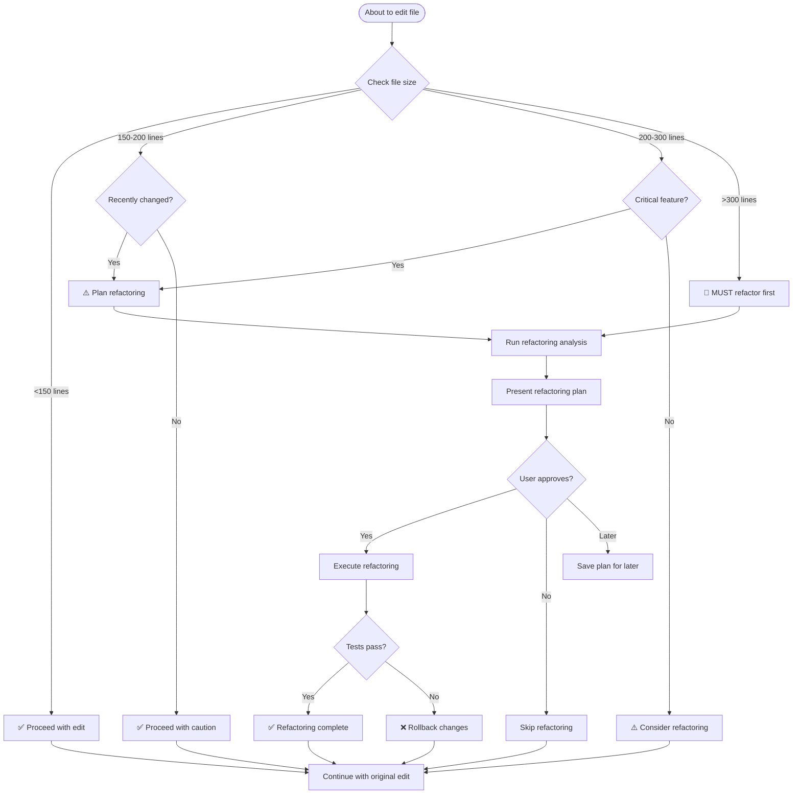
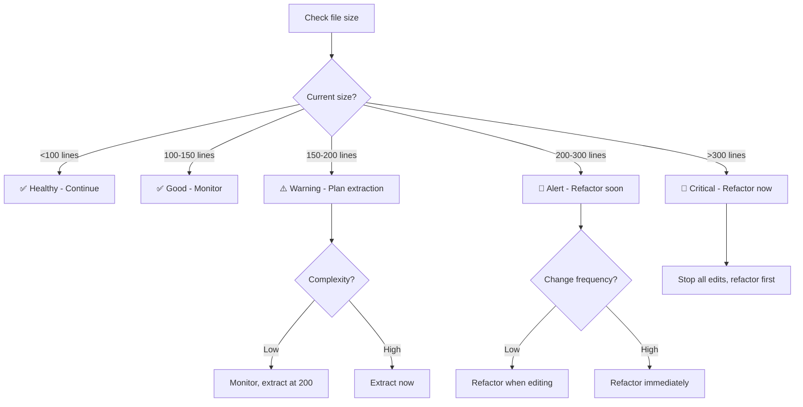
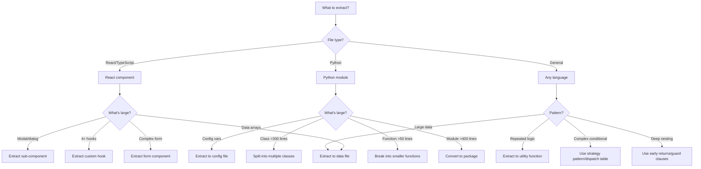
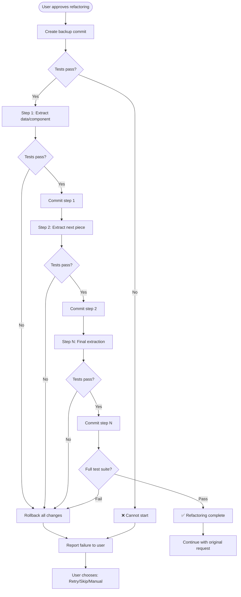
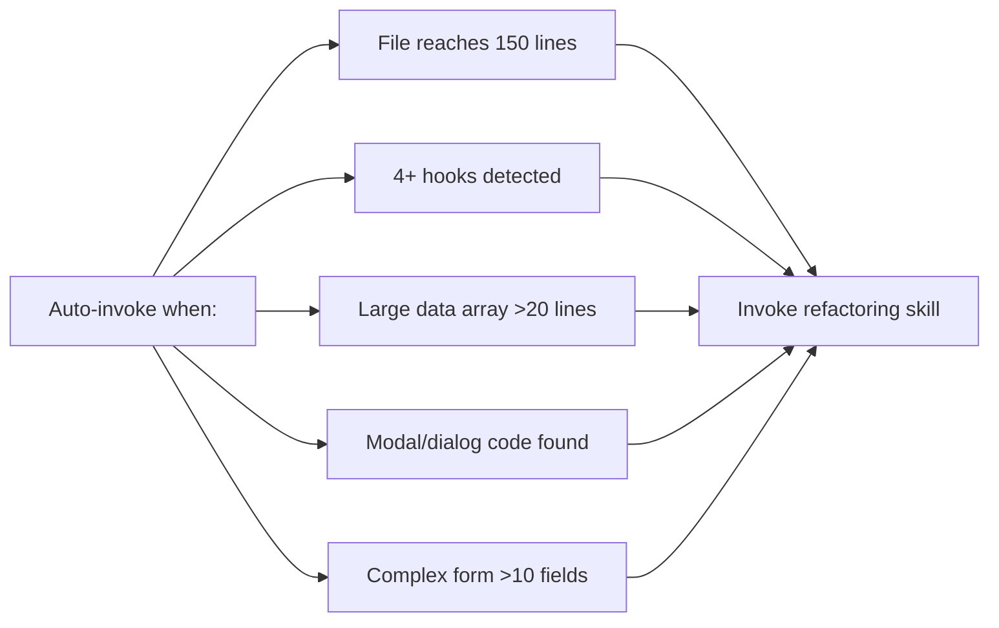
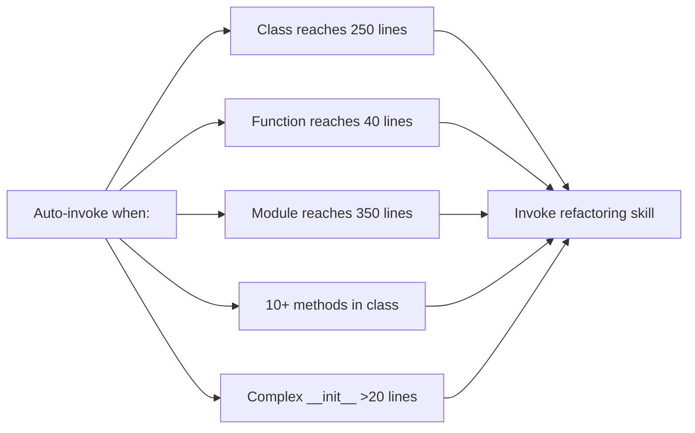
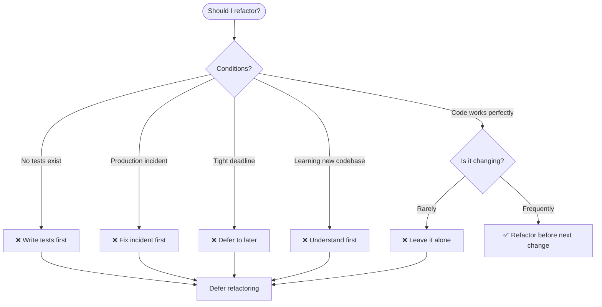
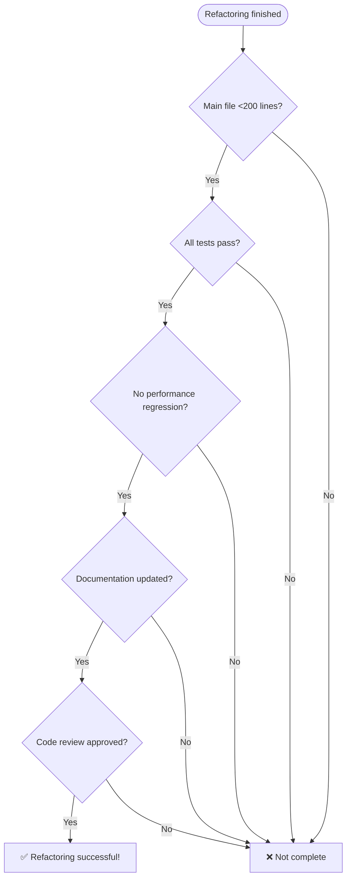

# Refactoring Decision Flowchart

Visual guide for when to refactor.

---

## 🔀 Main Decision Flowchart



---

## 📏 File Size Decision Tree



---

## 🎯 What to Extract Decision Tree



---

## 🚨 Priority Decision Matrix

```mermaid
flowchart TD
    Prioritize[Prioritize refactoring] --> Factors[Calculate factors]

    Factors --> Size[Size Factor = Lines / 100]
    Factors --> Freq[Change Freq = Commits/month × 2]
    Factors --> Impact[Business Impact = Rating(1-3) × 3]
    Factors --> Risk[Risk Factor = Complexity(1-3) × 1.5]

    Size --> Score[Total Score = Sum of factors]
    Freq --> Score
    Impact --> Score
    Risk --> Score

    Score --> Level{Score level?}

    Level -->|≥25| P0[P0 - Critical: Fix in 1 week]
    Level -->|15-24| P1[P1 - High: Fix in 1 month]
    Level -->|10-14| P2[P2 - Medium: Fix in quarter]
    Level -->|<10| P3[P3 - Low: Fix when convenient]
```

---

## 🔄 Execution Workflow



---

## 📊 Language-Specific Triggers

### JavaScript/TypeScript/React



### Python



---

## 💡 Quick Reference: When NOT to Refactor



---

## 🎯 Success Criteria Checklist



---

## 📖 How to Read These Diagrams

**Shapes:**
- `([Start/End])` - Start or end point
- `[Action]` - Action to take
- `{Decision?}` - Decision point
- `[[Process]]` - Sub-process

**Colors (in Mermaid renderers):**
- Green - Success/good state
- Yellow - Warning/caution
- Red - Error/stop
- Blue - Process/action

**Arrows:**
- `-->` - Flow direction
- `|Label|` - Condition or note

---

## 🔗 Usage

**Copy these diagrams into:**
- GitHub/GitLab wikis (supports Mermaid)
- Documentation sites (most support Mermaid)
- Presentations (render as images)
- README files (GitHub supports Mermaid)

**Online editors:**
- https://mermaid.live/ - Test and export diagrams
- https://www.mermaidchart.com/ - Create and share

---

**Note:** These flowcharts complement the detailed instructions in SKILL.md and REFERENCE.md. Use them for quick decision-making at a glance.
