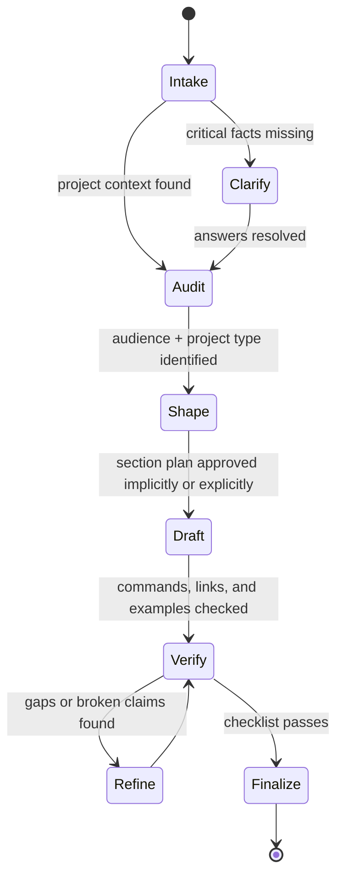
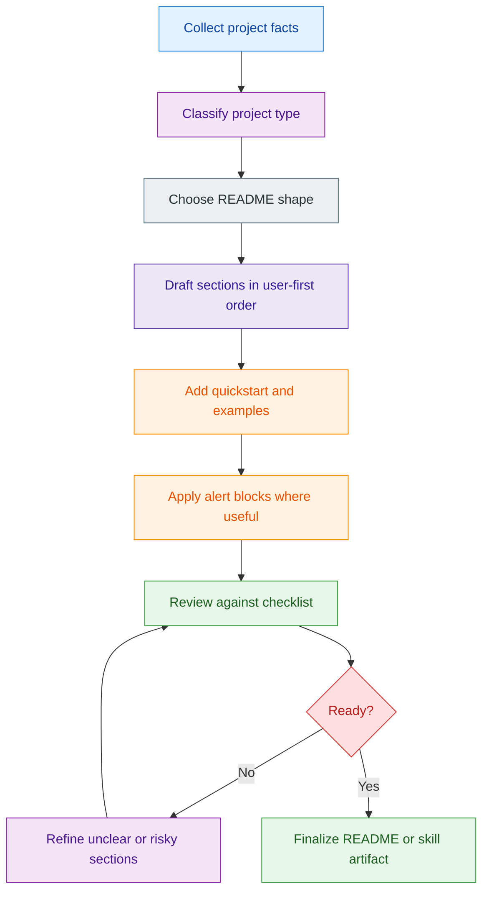
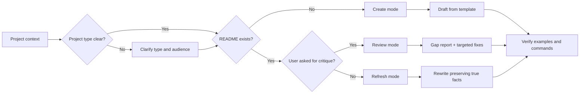

# Create README

## Mission

Turn partial project context, scattered docs, or a README-oriented prompt into a complete,
practical, and verifiable README workflow.

This skill is not just a writing template. It is a phased documentation system that:

- gathers project facts before drafting
- chooses the right README shape for the project type
- builds copy-paste-safe setup and usage instructions
- reviews the result against a strict checklist
- flags ambiguity, broken assumptions, and missing trust signals

If the user already provides a prompt about README generation, treat that prompt as source
material and upgrade it into a production-ready README workflow rather than paraphrasing it.

## Core Principles

### User-Centric Documentation

- Write for multiple audiences without losing the first-time user.
- Prioritize time-to-first-success over encyclopedic completeness.
- Prefer concrete examples the user can copy and run.
- Put the quickest useful path before deep explanation.

### Comprehensive Coverage

- Include essential sections, but cut boilerplate.
- Cover happy path and common failure path.
- Surface assumptions, limitations, and workarounds.
- Make contribution and maintenance paths discoverable when relevant.

### Visual Organization

- Use a clean heading hierarchy and scan-friendly layout.
- Add badges, diagrams, screenshots, or tables only when they add signal.
- Prefer Mermaid for lightweight architecture or workflow diagrams.
- Keep code blocks language-tagged and minimal.

### Living Documentation

- Treat README content as version-sensitive and maintainable.
- Mention limitations and support paths when users can get stuck.
- Prefer facts visible in the repo over aspirational claims.
- Rewrite stale or vague wording instead of layering more text on top.

## When to Use

- creating a new README from scratch
- rewriting a weak, outdated, or fragmented README
- converting a README prompt into a reusable workflow
- auditing an existing README for gaps and risks
- documenting installation, quickstart, configuration, testing, or contribution flow
- generating README structure for a library, CLI, service, monorepo, or internal tool

## Do Not Use This Skill For

- deep API reference generation for every module
- full docs-site generation across many pages
- release notes or changelog generation
- architecture decision records or implementation plans

## Operating Modes

Choose one mode early and say which one you are using.

| Mode | Use when | Primary output |
|---|---|---|
| `create` | no usable README exists | new `README.md` |
| `refresh` | README exists but is stale or weak | rewritten `README.md` |
| `review` | user asks for critique or gap analysis | findings + fix plan |
| `prompt-to-skill` | user provides README prompt/instructions | reusable README workflow |

## Workflow States

Use the workflow below as the canonical state machine for README work.

## Execution Flow

## Required Intake

Before drafting, gather or infer these facts:

1. What the project is.
2. Who the README is for.
3. What the fastest successful first run looks like.
4. How the project is installed or bootstrapped.
5. How it is configured.
6. How it is verified or tested.
7. What can go wrong during setup or usage.

If any of the first three are missing, stop and clarify.

## Audience Priority

Write in this order of importance unless the user says otherwise:

1. First-time user trying to get value fast.
2. Contributor trying to run the project locally.
3. Maintainer checking conventions and operational caveats.

Put quickstart before deep explanation.

## Default Section Order

Start from this order, then trim or adapt for the project type:

1. Title and one-screen value statement.
2. Badges or trust signals if they add credibility.
3. Quickstart.
4. Features or commands.
5. Technology stack when it helps orientation.
6. Installation.
7. Configuration.
8. Usage.
9. Development and testing.
10. Troubleshooting, contribution, license, support.

For longer READMEs, include a table of contents.

## README Shape Rules

Select sections based on project type.

| Project type | Must-have sections |
|---|---|
| App or service | Description, Features, Quickstart, Installation, Configuration, Usage, Development, Testing, Troubleshooting |
| Library or SDK | Description, Installation, Minimal Example, API surface summary, Compatibility, Development, Testing |
| CLI | Description, Install, Quickstart, Commands, Flags, Examples, Exit/failure notes, Troubleshooting |
| Monorepo | Overview, Workspace map, Setup, Package layout, Common commands, Per-package docs links |
| Internal tool | Description, Scope, Preconditions, Usage, Operational caveats, Ownership/contact |

Use the bundled template as a starting point when generating a new README:

- [README template](./assets/README_TEMPLATE.md)

Use the bundled checklist when reviewing or polishing:

- [README review checklist](./references/README_REVIEW_CHECKLIST.md)

Use the bundled rubric and failure-pattern guides when auditing an existing README or converting a prompt into a reusable workflow:

- [README quality rubric](./references/README_QUALITY_RUBRIC.md)
- [README failure patterns](./references/README_FAILURE_PATTERNS.md)

## Alert Policy

Use GitHub alert blocks intentionally. Do not spam them.

| Alert | Use when |
|---|---|
| `NOTE` | skimmable context that avoids confusion |
| `TIP` | optional success boost, shortcut, or productivity hint |
| `IMPORTANT` | critical prerequisite or assumption |
| `WARNING` | user can break setup, data, or environment |
| `CAUTION` | negative consequence is likely if skipped or misused |

### Good Alert Examples

> [!IMPORTANT]
> Set required environment variables before running the first example. The API will fail fast without them.

> [!TIP]
> If you only want to validate the install, run the smoke-test command instead of the full development stack.

> [!WARNING]
> This command rewrites local generated files and should not be run from a dirty working tree unless you intend to keep the changes.

## Visual And Trust Signals

Use visual elements only when they make the README easier to trust or navigate:

- badges for build, version, license, or package status
- table of contents for long READMEs
- architecture or workflow diagrams for complex systems
- screenshots when the UI is a major part of the value
- compact tables for compatibility or command summaries

Avoid decorative visuals with no informational payoff.

## Section Writing Rules

- Start with a tight description: what it does, why it exists, who it helps.
- Prefer concrete commands over prose.
- Prefer one minimal working example before advanced examples.
- Add a technology stack section when stack identity matters to setup or adoption.
- Put prerequisites before installation.
- If commands depend on OS, say so explicitly.
- If a claim cannot be verified from context, soften or remove it.
- Keep examples copy-paste-safe.
- Avoid boilerplate sections that add no real value.
- Avoid jargon unless the audience clearly expects it.
- Prefer active voice and short paragraphs.
- Use bullets when a list has three or more items.
- Every code block should be plausible to run verbatim unless clearly marked otherwise.

## Evidence Gathering Checklist

Before drafting or rewriting, inspect the repo for:

- project structure and key directories
- dependency manifests and framework indicators
- test commands and verification flow
- existing docs fragments and setup notes
- ownership, license, or support signals
- screenshots, diagrams, or generated assets worth reusing

In `review` mode, verify links, diagrams, badges, and command examples rather than assuming they are valid.

## Review Standards

Check every README against these questions:

1. Can a new user understand the project from the first screen?
2. Is there a fastest path to first success?
3. Are installation and usage commands plausible and internally consistent?
4. Are configuration requirements explicit?
5. Are limitations, failure modes, or sharp edges surfaced?
6. Does the README signal trust with tests, badges, compatibility, or ownership where appropriate?
7. Can a stuck user see where to get help or what to check next?

If the answer to any of the first four is no, the README is not ready.

For factual README reviews or broad rewrite audits, run the `doublecheck` skill in one-shot mode on the review summary or on the set of claims that are not directly provable from the repo.

## Branching Logic

Use this decision map during drafting or review.

## Output Contract

When this skill produces a README, it should usually include:

- a clear title and short description
- a practical feature summary
- install or setup steps
- a minimum viable usage example
- configuration details if required
- development and test entry points when relevant
- troubleshooting or known pitfalls when setup is non-trivial
- a support or help path when onboarding can fail in non-obvious ways
- contribution guidance when the repo is open to changes
- license or usage restriction when applicable

When this skill produces a review, findings must be prioritized by user risk:

1. missing or misleading first-run steps
2. broken or ambiguous configuration requirements
3. unsupported claims or unclear project value
4. weaker presentation issues

## Quality Gate

Do not finalize until all of the following are true:

- the first lines explain the project and its value clearly
- there is a clear quickstart or minimal example
- installation and usage sections do not contradict each other
- alert blocks, if used, are justified and specific
- no section exists only because README templates usually include it
- commands and examples are internally consistent
- links, badges, and diagrams are not obviously stale or broken
- longer READMEs include a table of contents when it improves navigation
- limitations or sharp edges are called out when omission would mislead users
- users have a visible next step when setup fails or support is needed

## Common Failure Patterns

Audit against these recurring README problems:

- vague project descriptions that never explain the actual value
- install steps that assume maintainer context or hidden prerequisites
- examples that are not runnable when copied verbatim
- visual clutter with badges, screenshots, or diagrams that add no signal
- unsupported claims about status, adoption, compatibility, or metrics
- contribution text that exists, but does not tell a contributor how to start
- no clear help path when the first run fails

## Prompt Upgrade Rule

If the user gives you a README-generation prompt and asks for a full skill:

1. Extract reusable phases.
2. Convert advice into decisions, triggers, and quality gates.
3. Add explicit mode selection.
4. Add at least one Mermaid workflow diagram.
5. Add alert guidance with concrete usage policy.
6. Split bulky templates and checklists into local assets or references when useful.
7. Preserve advanced README automation ideas in a separate reference if they do not belong in the main skill body.

## Optional Advanced Reference

If the user wants README generation patterns for editor automation or Copilot-driven tooling, use:

- [README automation patterns](./references/README_AUTOMATION_PATTERNS.md)

## Example Invocations

- `/create-readme library README for this crate`
- `/create-readme review current README for onboarding gaps`
- `/create-readme convert this README prompt into a reusable workflow skill`
- `/create-readme refresh README for a CLI with stronger quickstart and troubleshooting`

## Final Rule

The best README reduces time-to-first-success. If a section does not help a user understand, run, trust, or change the project, compress it or remove it.