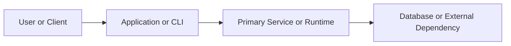

# README Template

Use this as a starting point for `create` or `refresh` mode. Trim sections that do not help the user succeed.

````md
# Project Name

[](#)
[](#)
[](LICENSE)

Short description of what the project does, why it exists, and who it is for.

## Table of Contents

- [Quickstart](#quickstart)
- [Features](#features)
- [Technology Stack](#technology-stack)
- [Architecture](#architecture)
- [Installation](#installation)
- [Configuration](#configuration)
- [Usage](#usage)
- [Development](#development)
- [Testing](#testing)
- [Troubleshooting](#troubleshooting)
- [Support](#support)
- [Contributing](#contributing)
- [License](#license)

## Features

- Feature one with concrete user benefit.
- Feature two with concrete user benefit.
- Feature three with concrete user benefit.

## Technology Stack

- Primary language and runtime.
- Framework or platform.
- Key dependencies or infrastructure.

## Architecture

Use this section only when a diagram or component map improves first-run understanding.



Add screenshots only when the UI is central to the project's value.

## Quickstart

```bash
# install or bootstrap
# run the smallest useful command
```

> [!IMPORTANT]
> Mention any prerequisite without which the quickstart fails.

## Installation

```bash
# clone or install dependencies
```

## Configuration

Document required environment variables, config files, secrets, or runtime assumptions.

> [!NOTE]
> Call out defaults or non-obvious behavior that matters during setup.

## Usage

### Minimal example

```bash
# smallest working example
```

### Common workflow

```bash
# a more realistic example
```

> [!TIP]
> Add a shortcut or faster validation path when it helps first-time users.

## Development

```bash
# local development commands
```

## Testing

```bash
# test or validation commands
```

## Troubleshooting

- Symptom: likely cause and fix.
- Symptom: likely cause and fix.

> [!CAUTION]
> Mention likely negative outcomes when a user skips an important step or runs a risky command.

> [!WARNING]
> Use only for actions that can damage local state, data, or reproducibility.

## Support

- Where to ask for help.
- Where to report bugs.
- Where deeper documentation lives.

## Contributing

State contribution expectations, code style, or where deeper docs live.

## License

State the license or internal usage restriction.
````

## Template Notes

- For libraries, move `Usage` earlier and lead with code examples.
- For CLIs, replace `Features` with `Commands` if that is more concrete.
- For monorepos, add a workspace map after the description.
- For internal tools, add ownership/contact if onboarding depends on it.
- For short READMEs, remove the table of contents if it adds more noise than value.
- Remove `Architecture` if the diagram would be decorative rather than explanatory.
- Remove `Support` when the project is fully self-serve and the help path would be fake.

