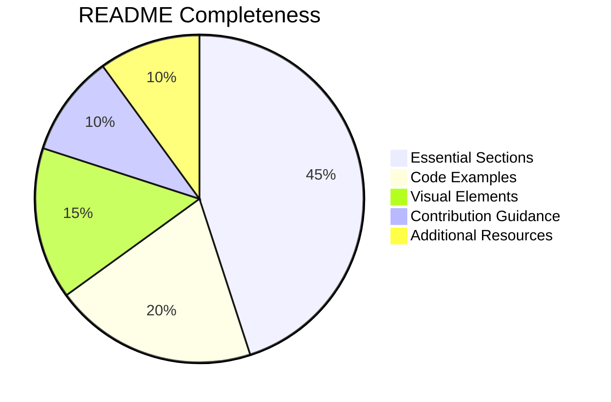
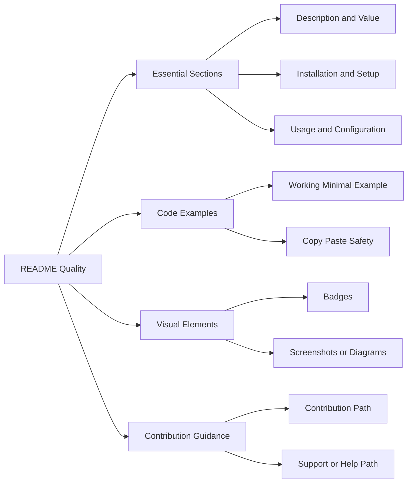

# README Quality Rubric

Use this rubric when you need a stricter review than the base checklist provides.

## Completeness Scorecard

## Quality Rating Map

## How To Use This Rubric

- use it for `review` mode when the user wants a deeper quality judgment
- treat low scores in essential sections as blockers
- treat low scores in visual elements as cleanup unless trust is harmed
- do not invent missing signals just to satisfy the rubric
