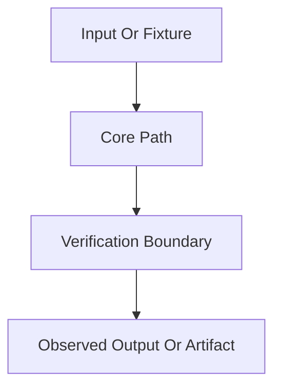

# Create Tests Forms

## Phase-Local Test Spec Template

````markdown
---
phase: NNN-phase-name
artifact: test-spec
status: verification-backed | fallback-ready
source: context-todo-plans-and-live-test-anchors
updated: YYYY-MM-DD
---

# Phase NNN Test Spec

## Purpose

📌 This document defines the phase-local unit, integration, and end-to-end
coverage required for this phase.

📌 It is directly usable by another engineer or agent without guessing scenario
boundaries, invariants, failure paths, or pass oracles.

## Workflow Status

- State whether the spec is verification-backed or fallback-ready.
- List the exact source artifacts used.
- State whether completion artifacts are still missing.

## Classification

### TDD And Integration Targets

- file path + why it matters

### E2E Targets

- file path or workflow + why it matters

### Skip Targets

- file path or class + why it is not a direct executable seam

## Existing Test Anchors To Reuse

- file path + what it already proves

## Proposed New Test Files

- file path + what new seam it will prove

## Test File Placement

| Scenario ID | Test File Path | Extend Or Create | Why This Is The Correct Home |
| --- | --- | --- | --- |

## Required End-To-End Behaviors

| Behavior | Requirement | Primary Path | Pass Signal | Fail Signal |
| --- | --- | --- | --- | --- |

## Critical Integration Paths

1. path one
2. path two

## Input Fixtures And Preconditions

| Scenario ID | Inputs | Preconditions | Fixture Source |
| --- | --- | --- | --- |

## Expected Outputs And Produced Artifacts

| Scenario ID | Expected Output | Persisted Artifact | Observable Signal |
| --- | --- | --- | --- |

## Cryptographic And Security Invariants To Observe

| Invariant | Why It Matters | Assertion Shape |
| --- | --- | --- |

## Mermaid Flow



## Clarifying Code Snippets

```rust
// Show only the smallest fixture or assertion shape needed to remove ambiguity.
```

## Scenario Matrix

| Scenario ID | Type | Goal | Positive Example | Negative Example | Main Assertions |
| --- | --- | --- | --- | --- | --- |

## Canonical Commands

- exact verification commands

## Open Gaps

- what is still blocked or not yet directly provable
````

## Tests-Tasks Artifact Template

````markdown
---
phase: NNN-phase-name
artifact: tests-tasks
status: planned | executed-and-verified
source: NNN-TEST-SPEC.md
updated: YYYY-MM-DD
---

# Phase NNN Tests Tasks

## Purpose

📌 This document translates `NNN-TEST-SPEC.md` into one concrete
implementation order for test work.

## Scope Inputs

- `NNN-TEST-SPEC.md`
- `CONTEXT.md`
- `TODO.md`
- all `*-PLAN.md`

## Execution Strategy

- Explain the dependency order.
- State why one wave must land before the next.

## Task Waves

### Wave T0: Harness And Reuse Lock-In

- files to inspect
- deliverables
- completion gate

### Wave T1: Scenario Group Name

- priority
- why now
- files to extend
- files to create
- implementation tasks
- success conditions
- command gate
````

## Compatibility Test-Plan Alias Template

````markdown
---
phase: NNN-phase-name
artifact: test-plan
status: compatibility-alias
source: NNN-TESTS-TASKS.md
updated: YYYY-MM-DD
---

# Phase NNN Test Plan

📌 This file is a compatibility handoff for workflows that explicitly request
`NNN-TEST-PLAN.md`.

📌 The canonical implementation-order artifact in this repository remains
`NNN-TESTS-TASKS.md`.

See: `NNN-TESTS-TASKS.md`
````

## Approval Plan Template

````markdown
## Test Generation Plan

### Spec Output
- `NNN-TEST-SPEC.md`
- `NNN-TESTS-TASKS.md`
- optional `NNN-TEST-PLAN.md`

### Existing Anchors To Extend
- path + reason

### New Test Files
- path + reason

### Planned Scenarios
- scenario id + what it proves

### Commands
- bootstrap command
- focused unit or integration commands
- broader release command if relevant

### Known Risks Or Blockers
- item
````

## Scenario Prompt Fragments

Use these prompts while expanding scenarios:

- What successful workflow proves the intended user journey end to end?
- What exact malformed or tampered input must be rejected?
- What replay, restart, or persistence drift could silently break the phase?
- Which fields, roots, proofs, signatures, or commitments must stay bound?
- What assertion would detect a false positive success?
