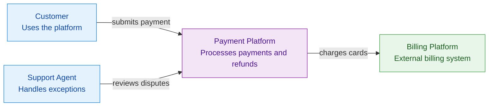
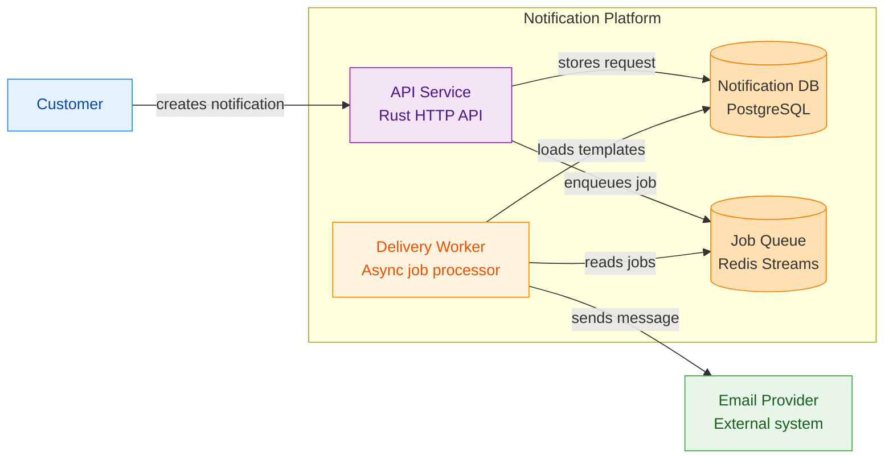
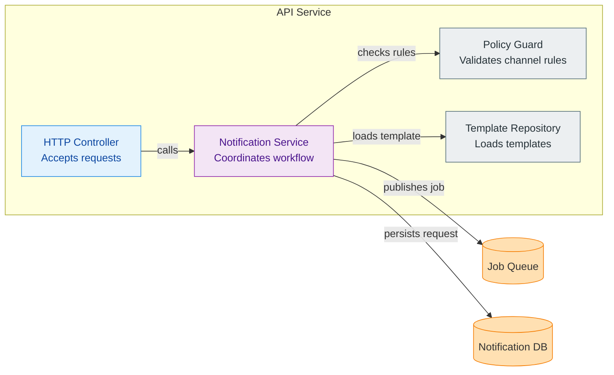
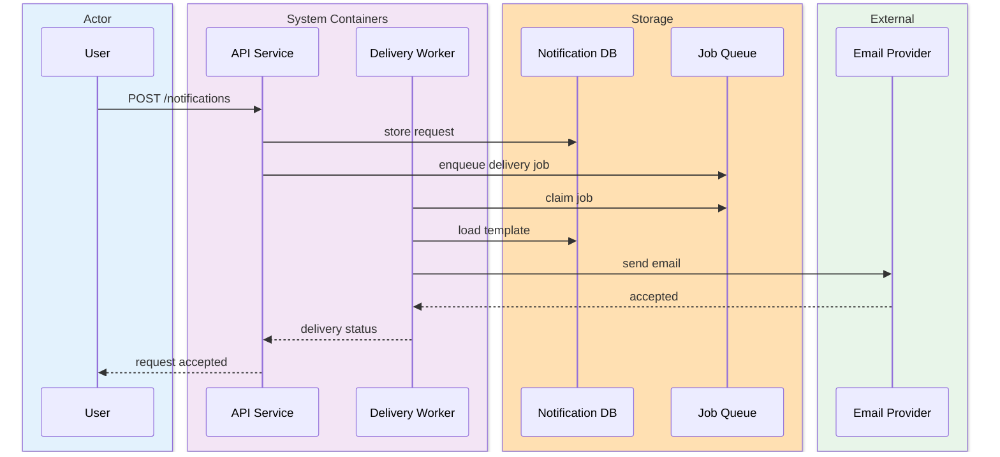
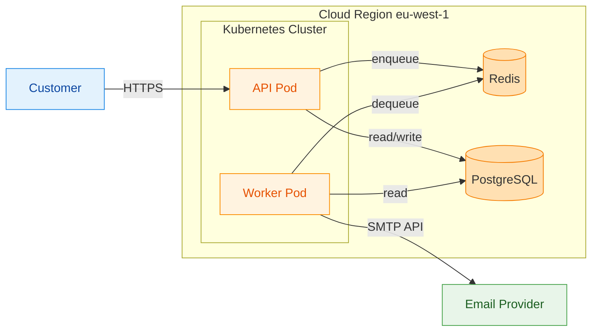

# Mermaid C4 Reference

Use this file when the user explicitly wants C4 views or when a Mermaid answer
should follow the C4 model rather than generic diagram selection.

## Official C4 Hierarchy

The C4 model is abstraction-first.

- People use software systems.
- A software system is made of one or more containers.
- A container contains one or more components.
- Components are implemented by code elements such as classes, interfaces,
  objects, files, or functions.

The core static structure diagrams are:

1. System context diagram
2. Container diagram
3. Component diagram
4. Code diagram

The supporting diagrams are:

1. System landscape diagram
2. Dynamic diagram
3. Deployment diagram

You do not need to use all four static levels every time. System context and
container are often sufficient unless the prompt needs a deeper zoom level.

## C4 View Selection Matrix

| User signal | C4 view | Mermaid form | Add when needed | Why |
| --- | --- | --- | --- | --- |
| users, business actors, system of interest, external systems | system context | `flowchart LR` | `dynamic`, `container` | Shows people and neighboring systems around the target system |
| multiple peer systems, portfolio map, enterprise landscape | system landscape | `flowchart LR` | `dynamic` | Shows relationships between software systems at a broad level |
| services, web apps, APIs, workers, databases, queues inside one system | container | `flowchart LR` or `architecture-beta` | `dynamic`, `deployment` | Shows deployable applications and data stores |
| modules, adapters, handlers, stores, ports inside one container | component | `flowchart LR` | `dynamic`, `code` | Shows internal building blocks inside a single container |
| classes, traits, interfaces, packages, files, functions | code | `classDiagram` or `graph LR` | none | Shows code-level structure only when that level adds value |
| runtime scenario, request path, handshake, end-to-end flow | dynamic | `sequenceDiagram` | pair with the matching static view | Shows how elements collaborate over time |
| node, cluster, region, environment, VM, pod, runtime placement | deployment | `architecture-beta` or `flowchart LR` | `dynamic` | Shows where containers run |

## C4 Bundle Recipes

### Onboarding Pack

Use when the user wants a broad architectural explanation first.

1. System context
2. Container
3. Dynamic only if one scenario matters

### Service Deep Dive Pack

Use when one service or application is the real target.

1. Container
2. Component
3. Dynamic at container or component level

### Portfolio Pack

Use when multiple systems must be positioned together.

1. System landscape
2. System context for the system of interest

### Deployment Pack

Use when runtime placement matters.

1. Container
2. Deployment
3. Dynamic only when traffic or failover path matters

### Code Pack

Use when architecture discussion has already narrowed to one container and the
user needs code-level shape.

1. Component
2. Code

## C4 Modeling Rules

- Keep one primary abstraction level per static diagram.
- Do not place component-level internals directly on a system context diagram.
- Do not let runtime nodes masquerade as containers; deployment is a separate
  concern.
- Label each element with a short responsibility.
- Include technology tags for containers when known.
- Write relationship labels as short verb phrases.
- Distinguish internal versus external elements clearly.
- Use assumptions sparingly and label them when the prompt is incomplete.

## Shared Semantic Palette

This palette is intentionally identical to `mermaid-spectrum` so both skills
stay visually compatible.

| Role | Fill | Stroke | Text |
| --- | --- | --- | --- |
| Public API / User | `#E3F2FD` | `#1E88E5` | `#0D47A1` |
| Domain logic | `#F3E5F5` | `#8E24AA` | `#4A148C` |
| Infrastructure / Runtime | `#FFF3E0` | `#FB8C00` | `#E65100` |
| External / Cross-crate | `#E8F5E9` | `#43A047` | `#1B5E20` |
| Danger / Failure / Attack | `#FFE0E0` | `#D32F2F` | `#B71C1C` |
| Neutral / Support | `#ECEFF1` | `#546E7A` | `#263238` |
| Crypto / Proof | `#EDE7F6` | `#5E35B1` | `#311B92` |
| Storage / DA layer | `#FFE0B2` | `#F57C00` | `inherit` |

Validation and test nodes should reuse the same green family as the external
role: `fill:#E8F5E9,stroke:#43A047,stroke-width:1px,color:#1B5E20`.

## C4 Role Mapping To The Shared Palette

| C4 element | Preferred palette role | Notes |
| --- | --- | --- |
| Person / actor | Public API / User | Use blue for humans or user-facing actors |
| System of interest | Domain logic | Purple by default for the central system |
| Internal application container | Domain logic or Infrastructure / Runtime | Pick based on whether it is business logic or platform runtime |
| Database, queue, event store, object store | Storage / DA layer | Use the storage palette consistently |
| External software system or external container | External / Cross-crate | Green distinguishes outside boundaries |
| Deployment node or environment | Infrastructure / Runtime | Orange for clusters, nodes, regions, VMs, or runtimes |
| Security gate or failure path | Danger / Failure / Attack | Red only for failure, risk, or blocked paths |
| Crypto-heavy subsystem | Crypto / Proof | Use when privacy or proof logic is central |

## Mermaid Patterns

### System Context

Use one system boundary and keep internals out of the diagram.

### Container Diagram

Use a software-system boundary and show deployable applications plus data stores.

### Component Diagram

Keep the scope inside one container and show only major building blocks.

### Dynamic Diagram

Keep the participants at the same level as the paired static diagram.

### Deployment Diagram

Prefer `architecture-beta` when it is clear and supported. Fall back to a
styled `flowchart LR` with environment subgraphs when styling or rendering is
more reliable there.

## Output Heuristics

### Prefer a single view when

- one C4 level fully answers the ask
- the user explicitly asks for one named level
- additional views would restate the same truth

### Prefer a paired set when

- a static C4 level and one scenario both matter
- a deployment explanation needs the container view first
- a component explanation needs one dynamic path to make the collaboration clear

### Prefer a compact pack when

- the user needs broad orientation plus one deeper zoom level
- the prompt spans architecture boundaries and runtime behavior
- omitting a supporting view would make the explanation misleading

## Fast Mapping Rules

- `who uses the system` -> system context
- `which systems exist around it` -> system landscape
- `which apps and data stores exist inside it` -> container
- `which building blocks exist inside one app` -> component
- `which classes or files implement it` -> code
- `how one scenario flows` -> dynamic
- `where it runs` -> deployment
