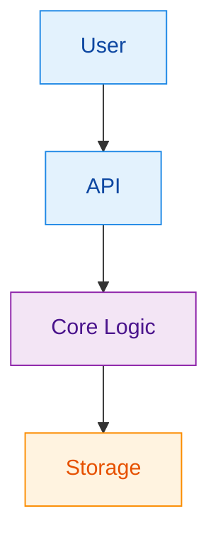
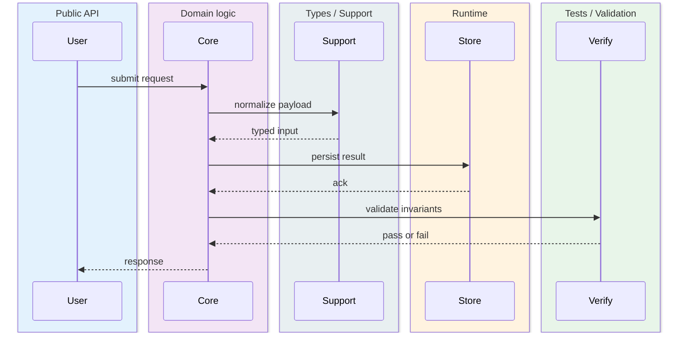
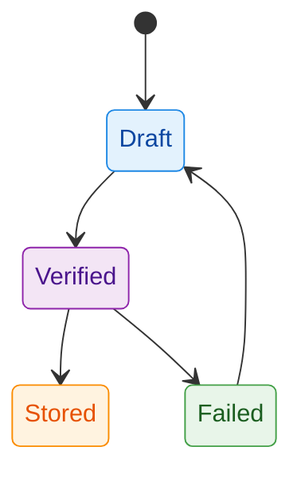

# Mermaid Spectrum Reference

Use this file when the request is ambiguous, multi-view, or needs deliberate
Mermaid type selection.

## Selection Matrix

| User signal | Primary Mermaid type | Add when needed | Why |
| --- | --- | --- | --- |
| internal steps, branching, decision logic | `flowchart TD` | `stateDiagram-v2`, `requirementDiagram` | Shows control flow clearly |
| named actors, calls, request-response order | `sequenceDiagram` | `flowchart`, `stateDiagram-v2` | Preserves message ordering |
| statuses, phases, lifecycle, progression | `stateDiagram-v2` | `flowchart`, `sequenceDiagram` | Captures legal transitions |
| structs, classes, traits, ownership roles | `classDiagram` | `flowchart`, `mindmap` | Shows shape and responsibility |
| tables, records, entities, storage schema | `erDiagram` | `flowchart`, `architecture-beta` | Shows persistence relationships |
| requirements, controls, verification anchors | `requirementDiagram` | `flowchart`, `sequenceDiagram` | Ties intent to validation |
| onboarding, concept clusters, document landscape | `mindmap` | any runtime diagram | Gives orientation first |
| layered services, trust zones, subsystem topology | `architecture-beta` | `sequenceDiagram`, `flowchart` | Shows boundary-aware architecture |
| file responsibility map, dependency direction | `graph LR` | `flowchart`, `classDiagram` | Shows peer relationships |
| persona flow, touchpoints, user happiness or pain | `journey` | `flowchart`, `sequenceDiagram` | Captures experience across steps |
| milestones, release windows, or scheduled work | `gantt` | `timeline`, `flowchart` | Shows time spans and overlap |
| historical events or evolution over time | `timeline` | `mindmap`, `flowchart` | Shows ordered milestones without task spans |
| branch lineage, merges, and release trains | `gitGraph` | `timeline` | Shows branch history compactly |
| relative proportions or composition | `pie` | `quadrantChart`, `flowchart` | Shows share, not flow |
| tradeoff positioning or priority analysis | `quadrantChart` | `mindmap`, `pie` | Shows items across two competing axes |
| quantity transfer between stages or actors | `sankey-beta` | `flowchart`, `sequenceDiagram` | Shows weighted movement |

## Bundle Recipes

### Process Bundle

Use when the user describes how something works internally and also needs
interaction context.

1. `flowchart TD`
2. `sequenceDiagram`

### Lifecycle Bundle

Use when the system progresses through phases and the user also needs to see
the actions that move it forward.

1. `flowchart TD`
2. `stateDiagram-v2`

### Protocol Bundle

Use when the user describes a multi-party protocol, handshake, or request path.

1. `architecture-beta` or `mindmap`
2. `sequenceDiagram`
3. `stateDiagram-v2` when retries or phases matter

### Data Bundle

Use when persistence shape is part of the explanation.

1. `erDiagram`
2. `flowchart TD`

### Code Story Bundle

Use when the user wants code structure plus runtime behavior.

1. `classDiagram`
2. `flowchart TD`
3. `requirementDiagram` when auditability matters

### Audit Bundle

Use when the user needs policy, control, or acceptance mapping.

1. `requirementDiagram`
2. `flowchart TD`
3. `sequenceDiagram` when actor accountability matters

### Roadmap Bundle

Use when the user gives a plan, rollout, or date-oriented reference.

1. `timeline` or `gantt`
2. `flowchart TD` when dependencies or handoffs matter

### UX Bundle

Use when the user cares about what the user experiences rather than only what
the system executes.

1. `journey`
2. `sequenceDiagram` or `flowchart TD`

### Tradeoff Bundle

Use when the user compares options, priorities, or benefit versus cost.

1. `quadrantChart`
2. `pie` only if proportional share also matters

## Story-Teller Semantic Palette

This palette is adapted from the local `story-teller` skill. Keep the same role
to color mapping across one answer so readers do not need to re-learn the legend.
If `story-teller` is updated later, refresh this table from that skill instead
of inventing a new palette locally.

| Role | Fill | Stroke | Text |
| --- | --- | --- | --- |
| Public API / User | `#E3F2FD` | `#1E88E5` | `#0D47A1` |
| Domain logic | `#F3E5F5` | `#8E24AA` | `#4A148C` |
| Infrastructure / Runtime | `#FFF3E0` | `#FB8C00` | `#E65100` |
| External / Cross-crate | `#E8F5E9` | `#43A047` | `#1B5E20` |
| Danger / Failure / Attack | `#FFE0E0` | `#D32F2F` | `#B71C1C` |
| Neutral / Support | `#ECEFF1` | `#546E7A` | `#263238` |
| Crypto / Proof | `#EDE7F6` | `#5E35B1` | `#311B92` |
| Storage / DA layer | `#FFE0B2` | `#F57C00` | `inherit` |

Validation and test nodes should reuse the same green family that
`story-teller` uses in its canonical gallery for external or validation roles:
`fill:#E8F5E9,stroke:#43A047,stroke-width:1px,color:#1B5E20`.

## Styling Rules

- Put `style` lines after all node and edge definitions.
- Reuse the same role colors across all diagrams in a set.
- Do not force styling into diagram types where Mermaid support is weak.
- Prefer semantic clarity over decorative color usage.
- When using `sequenceDiagram`, use colored `box` groups when practical.
- For types with limited styling control such as `journey`, `gantt`, `pie`,
  `timeline`, `gitGraph`, or `quadrantChart`, keep semantic role naming clear
  and only add color when Mermaid support is reliable.

## Output Heuristics

### Prefer a single diagram when

- one concern dominates the ask
- extra diagrams would repeat the same truth
- the user explicitly asked for one specific Mermaid type

### Prefer a paired set when

- the user mixes two concerns such as behavior plus structure
- runtime flow and actor interaction both matter
- state changes cannot be understood from the control flow alone

### Prefer a spectrum pack when

- the prompt includes architecture, flow, and data or state all at once
- the user gives a reference document with clearly different sections
- omitting one perspective would make the explanation misleading

## Fast Mapping Rules

- `who talks to whom` -> `sequenceDiagram`
- `what happens inside` -> `flowchart`
- `which state it is in` -> `stateDiagram-v2`
- `what it is made of` -> `classDiagram`
- `what gets stored` -> `erDiagram`
- `which requirement is satisfied` -> `requirementDiagram`
- `how the concepts group` -> `mindmap`
- `how the subsystems are arranged` -> `architecture-beta`
- `what the user experiences` -> `journey`
- `when milestones happen` -> `timeline` or `gantt`
- `how options compare` -> `quadrantChart`
- `how share is split` -> `pie`
- `how branches evolved` -> `gitGraph`
- `where weighted volume goes` -> `sankey-beta`

## Minimal Example Snippets

### Styled flowchart

### Colored sequence groups

### State plus failure cue

