# Mermaid Spectrum

Create the smallest useful Mermaid output that fully explains the user's ask.
Do not default to a single flowchart when the request clearly spans multiple
dimensions such as behavior, actors, state, structure, or requirements.
Treat the local `story-teller` palette as the styling source of truth and use
`REFERENCE.md` as the cached working copy of that palette.

## When to Use

Use this skill when:

- The user asks for a Mermaid diagram from prose, code, notes, or references.
- The user wants a visual explanation of a process, protocol, system, or file.
- The user does not know which Mermaid diagram type fits best.
- The user may need multiple diagrams that show different truths about one
  system.
- The user wants a reusable visual pack rather than one isolated chart.

Do not use this skill when:

- The task is only to render an already finished Mermaid block without any
  selection logic.
- The user needs a non-Mermaid diagram format.
- The task is pure code editing with no visualization goal.

## Core Outcome

Produce one of these outputs:

1. A single Mermaid diagram when one view fully answers the ask.
2. A paired diagram set when two complementary views are required.
3. A Mermaid spectrum pack when the ask spans three or more distinct concerns.

Every substantive output must include:

- a short explanation of why each diagram type was selected
- the Mermaid code blocks in a deliberate reading order
- consistent color semantics when the chosen Mermaid type supports styling
- a brief note about what was intentionally not visualized

## How It Works

### Step 1: Decompose the ask

Extract the visual concerns from the prompt or reference material:

- actors and message order
- internal control flow
- state transitions or lifecycle
- type or responsibility structure
- data entities and persistence shape
- requirements and verification traceability
- system topology or layered architecture
- concept grouping or onboarding overview
- user journeys, milestones, or time spans
- tradeoffs, proportions, or volume movement

If the user provides references, infer missing structure from headings,
function names, sections, entities, or repeated nouns. Mark major inferences.

### Step 2: Choose the smallest complete diagram set

Select output size by coverage, not by habit.

- Use one diagram when a single dominant concern explains the request.
- Use two diagrams when the ask has one primary concern and one secondary
  concern that changes interpretation.
- Use a spectrum pack when the ask includes multiple perspectives that would be
  misleading if collapsed into one chart.

Prefer these combinations:

- `flowchart` + `sequenceDiagram` for internal steps plus actor exchange
- `flowchart` + `stateDiagram-v2` for process plus lifecycle
- `classDiagram` + `flowchart` for structure plus behavior
- `erDiagram` + `flowchart` for data model plus processing path
- `requirementDiagram` + `flowchart` for traceability plus execution
- `mindmap` + another runtime diagram for orientation plus detail
- `architecture-beta` + `sequenceDiagram` for topology plus request path

Use the selection matrix and bundle recipes in `REFERENCE.md`.

### Step 3: Order the diagrams like a story

When multiple diagrams are needed, present them in this order unless the user
asks otherwise or a bundle in `REFERENCE.md` prescribes a stronger order:

1. Orientation view: `mindmap`, `graph`, or `architecture-beta`
2. Main dynamic view: `flowchart` or `sequenceDiagram`
3. Nuance view: `stateDiagram-v2`, `classDiagram`, `erDiagram`, or
   `requirementDiagram`

Each later diagram must add a distinct insight, not restate the previous one.
If a bundle starts with a non-orientation diagram such as `erDiagram` or
`requirementDiagram`, follow the bundle order and only prepend an orientation
view when the user needs onboarding context.

### Step 4: Apply theme discipline

When Mermaid supports direct styling, use the semantic palette derived from the
local `story-teller` skill and documented in `REFERENCE.md`.

Keep role colors stable across all diagrams in the same answer:

- public API or user
- domain logic
- infrastructure or runtime
- external or cross-crate
- neutral or support
- crypto or proof logic
- storage or DA layer
- danger or failure paths

If a Mermaid type does not support equivalent inline styling well, keep labels
clear and use color only where supported. When a diagram needs a distinct test
or validation role, reuse the same green family that `story-teller` uses for
external or validation nodes rather than inventing a new accent.

### Step 5: Emit the output contract

For every response, use this compact structure:

```text
Diagram plan:
- <diagram type>: <why it is needed>

Inferences:
- <only include when important structure was inferred from references>

Mermaid:
```mermaid
...
```

If additional diagrams are included, repeat the pattern.

Not shown:
- <what was intentionally omitted>
```

If the user asks for only the raw Mermaid, omit the prose and return the code
blocks only.

## Decision Rules

- If the question contains time-ordered interactions between named actors,
  prefer `sequenceDiagram`.
- If the question contains branching steps or internal logic, prefer
  `flowchart`.
- If the question contains statuses, phases, or lifecycle transitions, add
  `stateDiagram-v2`.
- If the question contains structs, classes, traits, roles, or composition,
  add `classDiagram`.
- If the question contains stored records, tables, entities, or persistence,
  add `erDiagram`.
- If the question contains validation anchors, controls, or acceptance logic,
  add `requirementDiagram`.
- If the question starts broad or needs onboarding context, begin with
  `mindmap` or `architecture-beta`.
- If the question is about user experience steps or persona touchpoints,
  prefer `journey`.
- If the question is about milestones, release windows, or planned spans,
  prefer `gantt` or `timeline`.
- If the question is about tradeoff positioning, add `quadrantChart`.
- If the question is about relative share only, prefer `pie`.
- If the question is about branch history, merges, or release lineage, prefer
  `gitGraph`.
- If the question is about quantity transfer between stages or actors, prefer
  `sankey-beta`.
- If the user explicitly asks for one Mermaid type, honor that request unless
  it would hide a second required concern. In that case, emit the requested
  type first and add the smallest companion diagram needed for correctness.
- If two diagram candidates are equally strong, prefer the one that matches the
  user's vocabulary and add a second diagram only when it prevents ambiguity.

## Examples

### Example 1: One diagram is enough

User: `Show the claim verification steps as Mermaid.`

Expected response shape:

```text
Diagram plan:
- flowchart TD: best fit because the ask is an internal step-by-step pipeline.

Mermaid:
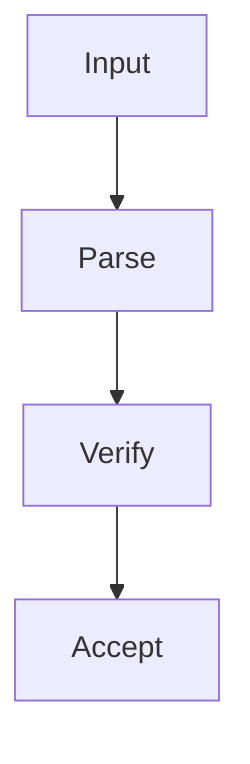

Not shown:
- actor-to-actor messaging because the prompt did not ask for it
```

### Example 2: A paired view is better

User: `Visualize wallet backup restore, including who sends data and the restore states.`

Expected response shape:

```text
Diagram plan:
- sequenceDiagram: shows which actor sends which payload.
- stateDiagram-v2: shows restore lifecycle and failure boundaries.
```

### Example 3: A spectrum pack is required

User: `Turn this protocol note into Mermaid and make sure the reader understands the architecture, runtime flow, and persistence model.`

Expected response shape:

```text
Diagram plan:
- architecture-beta: system topology and boundaries
- sequenceDiagram: runtime interaction order
- erDiagram: persisted entities and relationships
```

## Validation Checklist

- The selected diagram set is the smallest one that preserves meaning.
- Each diagram adds a non-duplicated perspective.
- The output order goes from broad context to detailed nuance.
- Mermaid syntax matches the chosen type.
- Color semantics stay consistent where styling is supported.
- The answer states why these diagram types were chosen.

## Supporting File

- `REFERENCE.md`: selection matrix, multi-diagram bundle recipes, and the
  semantic Mermaid palette adapted from `story-teller`

## Invocation Examples

Use requests like these to trigger the skill clearly:

```text
Create Mermaid for this protocol and choose the best diagram type.
```

```text
Turn this process note into a Mermaid spectrum pack with architecture, runtime,
and state views.
```

```text
Visualize this code path as Mermaid. Use more than one diagram if one view is
not enough.
```

```text
Make a Mermaid diagram series for this document and keep the order readable for
humans.
```

```text
Show this workflow as Mermaid with the story-teller color palette where
possible.
```

## Mermaid Playbook

Use Mermaid aggressively, but only where it sharpens understanding.
Prefer multiple diagrams when each answers a different question.
Use concrete labels — filenames, function names, type names, domain objects.
Use edge labels to explain transformations or conditions.
Use subgraphs to group layers or crate boundaries.
Avoid decorative diagrams that reveal nothing new.

---

### Diagram Type Guide

Choose the type that matches what you need to show, not what feels familiar.

| Type                 | Best for                                                     | Worst for                       |
| -------------------- | ------------------------------------------------------------ | ------------------------------- |
| `flowchart TD`       | call chains, public-to-private descent, ownership layers     | message ordering between actors |
| `flowchart LR`       | data movement, dependency direction, crypto pipelines        | lifecycles with looping states  |
| `sequenceDiagram`    | protocol message exchange, handshakes, attack models         | internal function decomposition |
| `stateDiagram-v2`    | entity lifecycle, ratchet state, vault/claim state machine   | call graphs                     |
| `classDiagram`       | struct/trait layout, impl surfaces, DTO shape                | execution paths                 |
| `requirementDiagram` | mapping requirements to modules, tests, and validation anchors | runtime control flow            |
| `erDiagram`          | storage schema, DB entities, persistence boundary            | anything dynamic                |
| `mindmap`            | workspace/crate landscape, high-level concept grouping       | detailed flows                  |
| `kanban`             | onboarding plans, investigation queues, story-building work tracking | runtime relationships           |
| `architecture-beta`  | service topology, layered subsystem maps, deployment-oriented stories | line-by-line function logic     |
| `graph LR`           | file responsibility map, peer-to-peer topology               | sequential logic                |

**Rule of thumb:**

- `sequenceDiagram` → "who sends what to whom"
- `flowchart` → "what happens inside"
- `stateDiagram-v2` → "what state is the entity in"
- `classDiagram` → "what is it made of"
- `requirementDiagram` → "which requirement this code satisfies and how it is verified"
- `mindmap` → "how the concepts group before you trace execution"
- `kanban` → "what investigation or onboarding work remains"
- `architecture-beta` → "how the bigger pieces are deployed or layered"

Split one large process into three separate diagrams using this rule rather than
drawing one huge flowchart that mixes all concerns.

---

### Color and Style Palette

Apply color to make layers, trust zones, and actor roles visually distinct.
Use inline `style` directives after the node definitions.

#### Semantic Color Assignments

| Layer / Role              | Fill      | Stroke    | Text      | Usage                          |
| ------------------------- | --------- | --------- | --------- | ------------------------------ |
| Public API / User         | `#E3F2FD` | `#1E88E5` | `#0D47A1` | Entry points, external callers |
| Domain logic              | `#F3E5F5` | `#8E24AA` | `#4A148C` | Core business / crypto logic   |
| Infrastructure / Runtime  | `#FFF3E0` | `#FB8C00` | `#E65100` | I/O, storage, runtime glue     |
| External / Cross-crate    | `#E8F5E9` | `#43A047` | `#1B5E20` | Third-party or sibling crates  |
| Danger / Failure / Attack | `#FFE0E0` | `#D32F2F` | `#B71C1C` | Error paths, attacker nodes    |
| Neutral / Support         | `#ECEFF1` | `#546E7A` | `#263238` | Helpers, adapters, config      |
| Crypto / Proof            | `#EDE7F6` | `#5E35B1` | `#311B92` | Cryptographic operations       |
| Storage / DA layer        | `#FFE0B2` | `#F57C00` | —         | Persistence, DA adapters       |

#### Applying Styles — Example

Apply the palette to the matching canonical gallery example for the diagram type you chose.
For example, if you use the gallery's `Flowchart` block, assign entry nodes the `Public API / User`
colors, core processing nodes the `Domain logic` colors, and persistence nodes the
`Infrastructure / Runtime` colors.

When Mermaid supports direct styling for the diagram type, encode the palette in the diagram itself.
Use these canonical role-to-color mappings consistently across examples:

- `Entry` or public actors -> `fill:#E3F2FD,stroke:#1E88E5,stroke-width:1px,color:#0D47A1`
- `Domain` or core logic -> `fill:#F3E5F5,stroke:#8E24AA,stroke-width:1px,color:#4A148C`
- `Types` or support nodes -> `fill:#ECEFF1,stroke:#546E7A,stroke-width:1px,color:#263238`
- `Crypto` or proof logic -> `fill:#EDE7F6,stroke:#5E35B1,stroke-width:1px,color:#311B92`
- `Store` or runtime glue -> `fill:#FFF3E0,stroke:#FB8C00,stroke-width:1px,color:#E65100`
- `Tests` or external validation -> `fill:#E8F5E9,stroke:#43A047,stroke-width:1px,color:#1B5E20`

Always place `style` lines after all node and edge definitions.
Keep colors consistent across all diagrams in one story so a reader can
map colors to roles without re-reading the legend each time.

---

### Reusable Diagram Patterns

Treat the gallery below as the single canonical example set.
Do not repeat a second Mermaid code block for the same diagram type elsewhere in this skill.

### Explicit Mermaid Example Gallery

Use this gallery when the user explicitly asks for a specific Mermaid diagram type.
These are ready-to-adapt examples for technical stories.

#### Flowchart

Use for: internal execution paths, validation branches, and module descent.

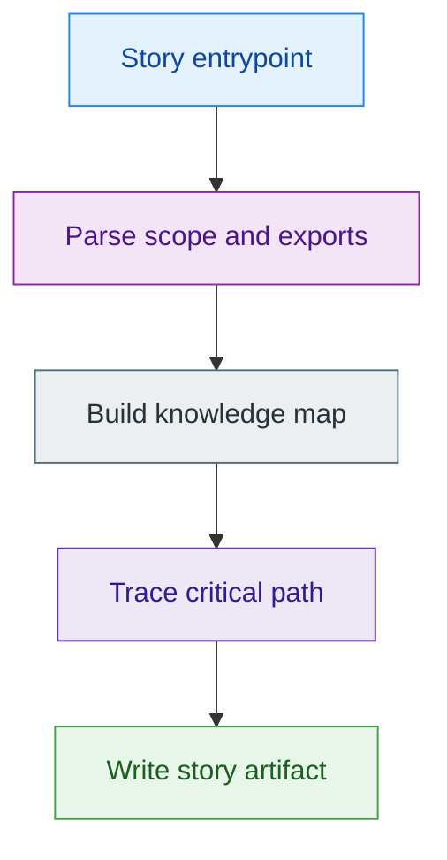

#### Sequence Diagram

Use for: ordered exchanges between caller, service, adapter, and verifier.

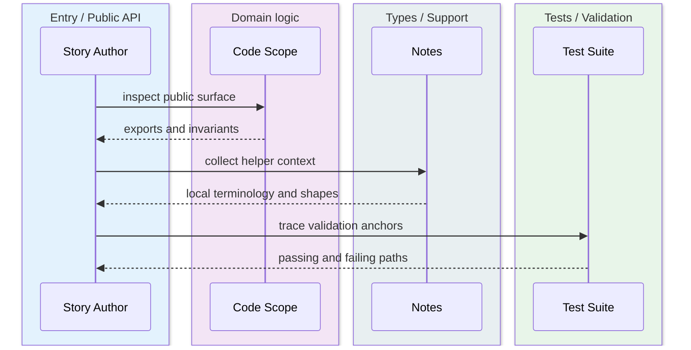

#### Class Diagram

Use for: struct, trait, and responsibility layout.

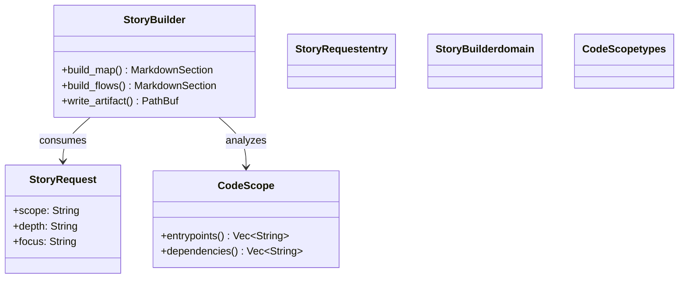

#### File Responsibility Map

Use for: visualizing how files inside a module relate and depend on each other.

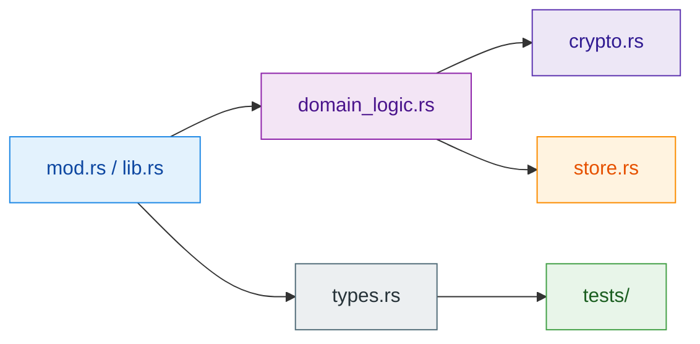

#### State Diagram

Use for: lifecycle-heavy features, validation stages, and claim progression.

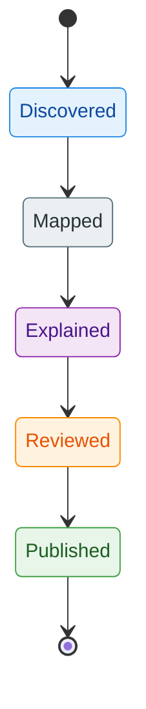

#### Requirement Diagram

Use for: tying requirements to modules, tests, and acceptance checks.

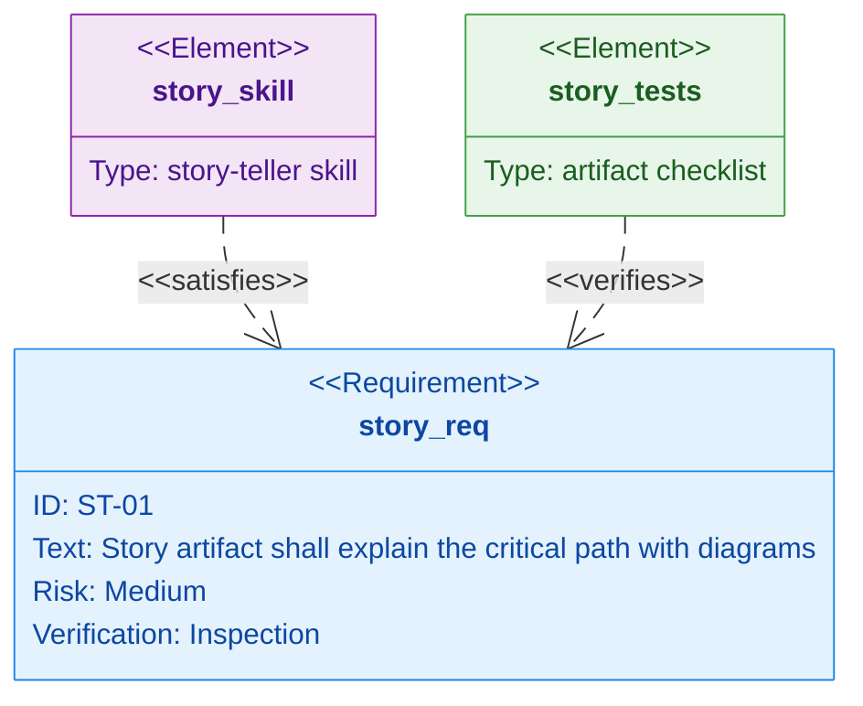

#### Mindmap

Use for: high-level concept grouping before detailed tracing.

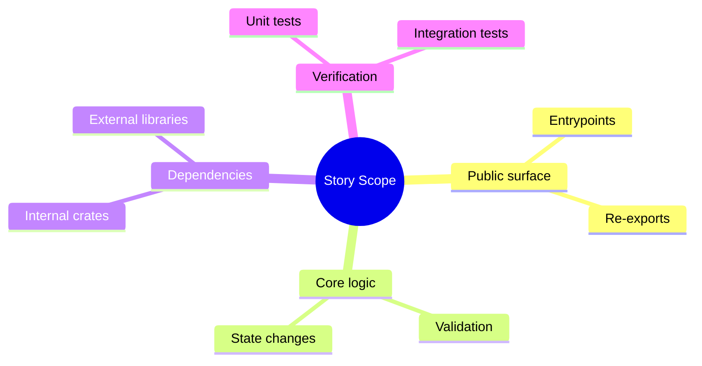


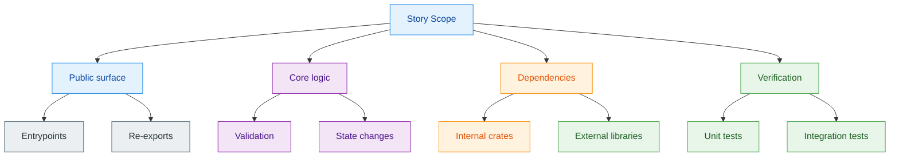


#### Kanban

Use for: story-building workflow, onboarding tasks, and review queues.
If your Mermaid renderer supports Kanban card or lane classes, map backlog to `Entry`,
active work to `Domain`, review to `Types`, and done to `Tests` using the same palette.
If it does not, keep the semantic lane names below and add a palette-colored companion
`flowchart` when the visual distinction matters.

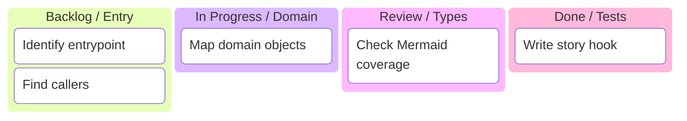

#### Architecture

Use for: service topology and layered subsystem stories. Prefer
`architecture-beta` when the renderer supports it; otherwise fall back to the
layered `flowchart` pattern above so the palette remains visible even in renderers
that ignore `architecture-beta` styling.

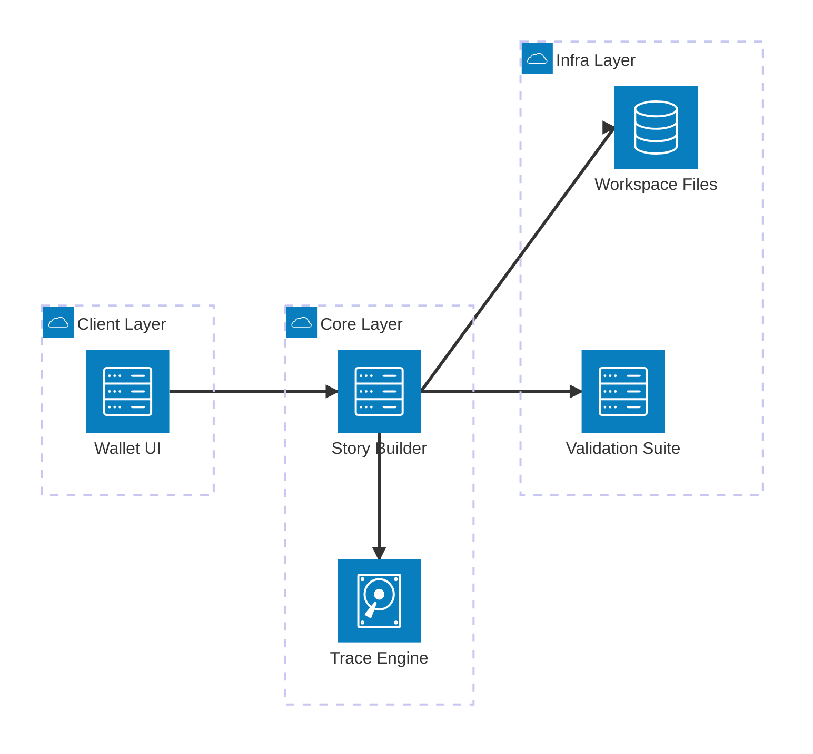

---

### Combination Patterns

Use multiple diagram types together when a single diagram cannot tell the full story.

#### Combination A — Protocol Decomposition (3-diagram set)

The canonical set for any cryptographic protocol or transaction pipeline.
Use all three together; they answer different questions.

1. **Sequence** → who sends what to whom, in what order
2. **Flowchart** → what happens inside one participant's logic
3. **State** → what state the entity transitions through

Example: for a `claim_tx` pipeline, reuse the gallery's canonical `Sequence Diagram`,
`Flowchart`, and `State Diagram` blocks and rename the participants, steps, and states to
the claim-specific actors and transitions.

Do not paste three new Mermaid samples here. Keep this section as composition guidance only.

#### Combination B — Cryptographic Flow Split

When a crypto module has multiple independent paths, split into separate diagrams.

- **Key Flow** (how keys are derived and used)
- **Message Flow** (how data is transformed and signed)
- **Verification Flow** (how the receiver checks the result)

Each of these becomes a separate `flowchart LR`.

---

### Scope-to-Diagram Minimums

- Function story:
  at least one `flowchart` of the branch path or call path
- File or type story:
  at least one structure or relationship diagram
- Module story:
  control-flow `flowchart` + data-flow or file-responsibility `graph LR`
- Crypto protocol module:
  `sequenceDiagram` (message exchange) + `flowchart` (internal logic) + `stateDiagram-v2` (lifecycle)
- Crate story:
  public-surface + C4-style subgraph map + one critical-path diagram
- Workspace story:
  `mindmap` or C4 subgraph map + cross-crate dependency diagram

## 