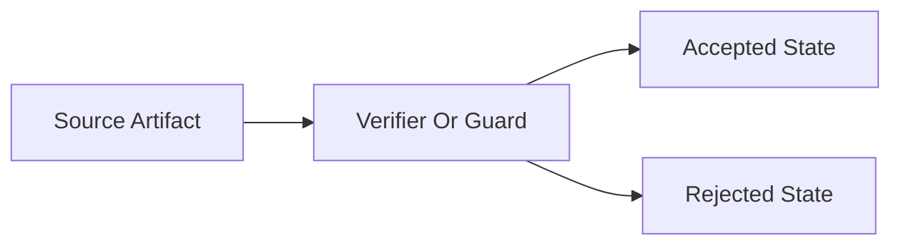
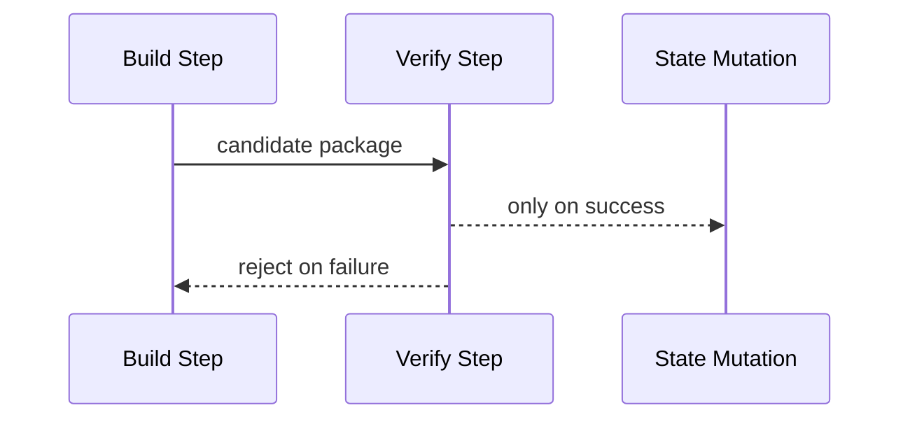

# Entrance Exam Solver Forms

Use these forms when writing answers into existing `**Ans:**` slots.

## Answer Slot Form

Insert the following structure directly below the existing `**Ans:**` marker.
Do not replace the marker itself.

```markdown
**Status:** Full Evidence | Partial Evidence | Blocked

**Conclusion:** One short paragraph that answers the question plainly.

**Evidence Trail:**
1. Primary repository artifact or code path.
2. Supporting test, manifest, or closeout artifact.
3. Any additional cross-check needed to close the claim.

**Reasoning:**
- Explain why the evidence supports the conclusion.
- Explain the critical logic, math, crypto, or artifact-binding steps.
- Show why a tempting but false interpretation fails.

**Example Or Visualization:**
- Add a short example, mini-derivation, comparison table, or Mermaid diagram
  only if it materially sharpens the proof.

**Gap Or Blocker:**
- `None` for `Full Evidence`.
- For `Partial Evidence`, name the exact missing evidence and how to close it.
- For `Blocked`, name the principled blocker.

**Verification:**
- `doublecheck` status: VERIFIED | PLAUSIBLE | UNVERIFIED | DISPUTED | FABRICATION RISK
- Residual caveat: None | precise remaining caveat
```

## Minimal Answer Variant

Use this shorter form only when the question is narrow and the proof path is
compact.

```markdown
**Status:** Full Evidence | Partial Evidence | Blocked

**Conclusion:** ...

**Reasoning:** ...

**Gap Or Blocker:** None | ...

**Verification:** `doublecheck` status ...
```

## Candidate Selection Card

Use this card in run-level report artifacts when autonomous SSoT mode is used.

```markdown
## Candidate Selection

**Question:** <index and title>
**Candidates Attempted:** <N>
**Accepted Candidates:** <N>
**Selected Candidate Index:** <index | none>

### Pro-Cons Summary

| Candidate | Pros | Cons | Decision |
|-----------|------|------|----------|
| 1 | ... | ... | rejected |
| 2 | ... | ... | accepted |

### Double Validation

| Candidate | Validation A | Validation B | Final |
|-----------|--------------|--------------|-------|
| 2 | pass | pass | selected |
```

## Mermaid Mini-Patterns

Use Mermaid only when it makes the answer easier to verify.

### Trust Boundary Flow



### Mutation Safety Flow



## Final Summary Table Form

Append this table at the end of the exam file and refresh it as answers are
added.

```markdown
## Summary Table

| Q | Title | Proof Status | Verification | Missing Evidence Or Blocker | Gap Closure Path |
|---|-------|--------------|--------------|-----------------------------|------------------|
| 1 | ... | Full Evidence | VERIFIED | None | None |
| 2 | ... | Partial Evidence | VERIFIED | Missing persisted continuity proof | Add canonical persisted artifact and rerun verification |
| 3 | ... | Blocked | UNVERIFIED | Required log artifact not present | Generate the missing rerun log under the phase validation flow |
```

## Status Meanings

- `Full Evidence` means the repository closes the claim.
- `Partial Evidence` means only part of the claim is closed.
- `Blocked` means a principled blocker prevents closure.

## Verification Meanings

- `VERIFIED` means a supporting source-backed verification pass succeeded.
- `PLAUSIBLE` means the answer is reasonable but not fully source-closed.
- `UNVERIFIED` means the proof could not be fully checked.
- `DISPUTED` means verification found a credible contradiction.
- `FABRICATION RISK` means the answer contains unsupported or hallucination-like
  claims and must not be accepted as written.

## Validation Meanings

- `Validation A` checks claim-to-evidence consistency.
- `Validation B` checks contradiction handling and overclaim risk.
- A candidate is eligible for final selection only if both validations pass.
