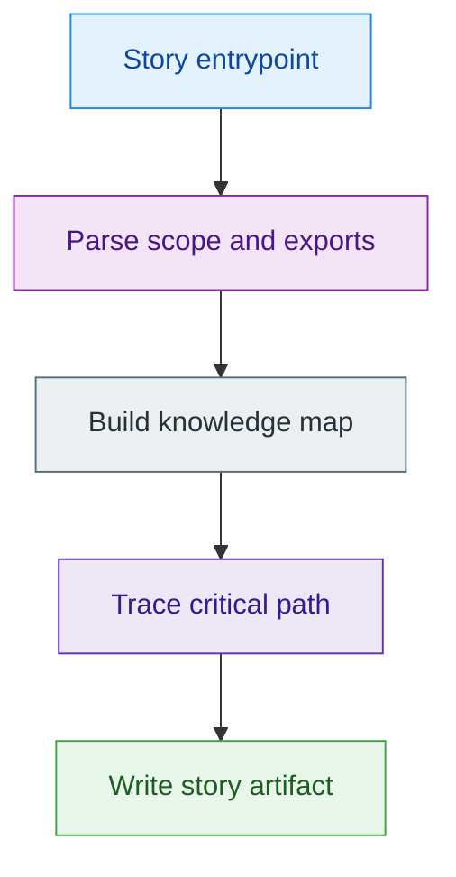
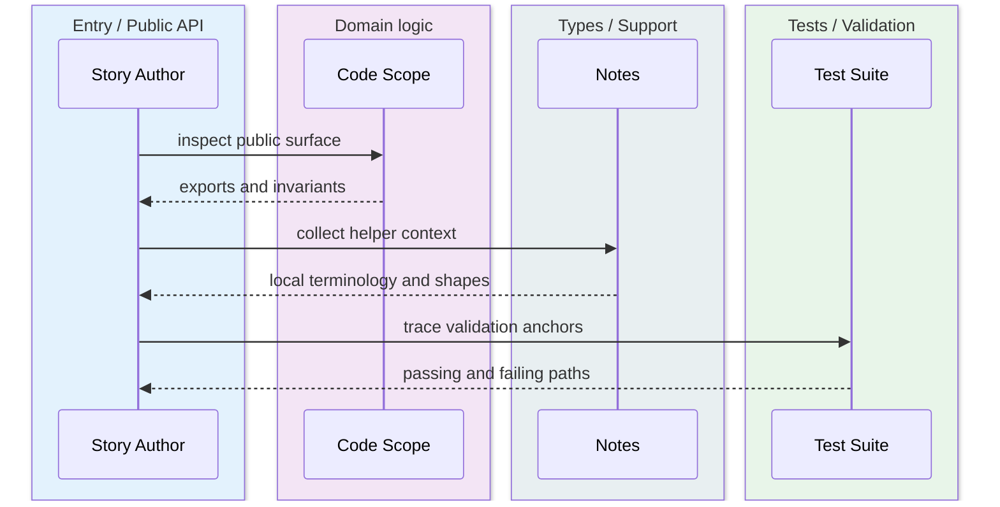
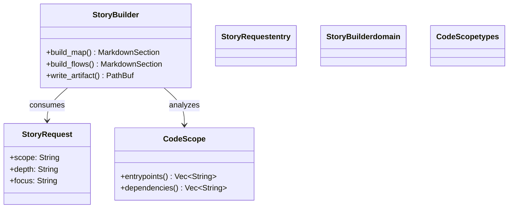
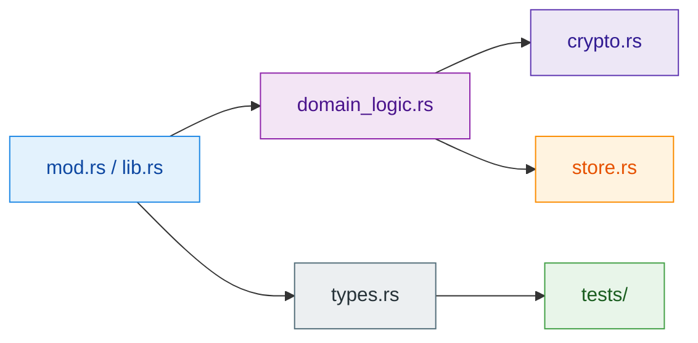
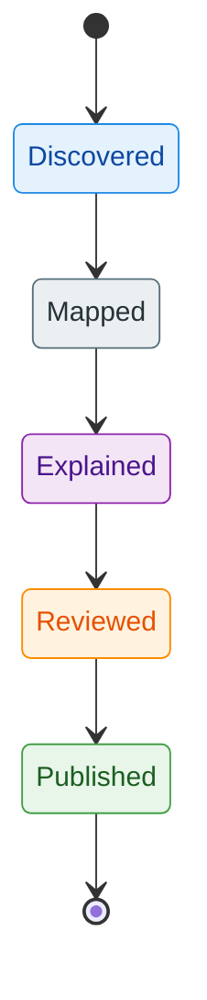
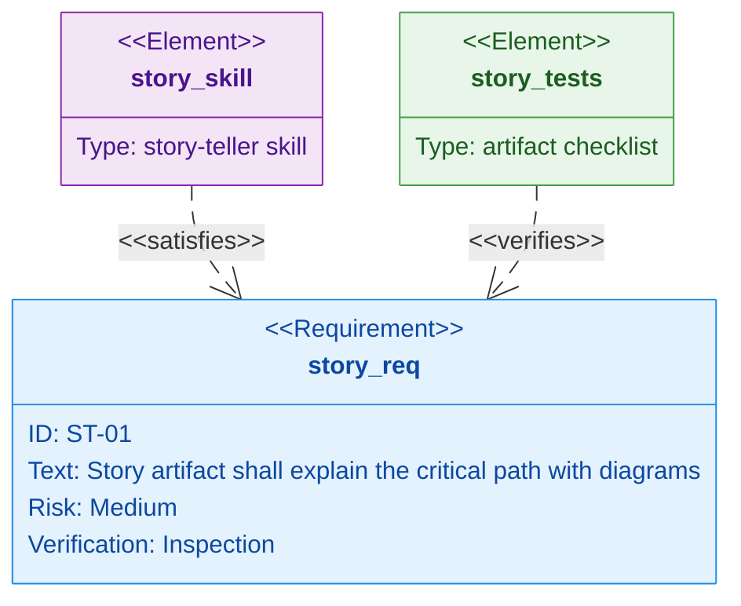
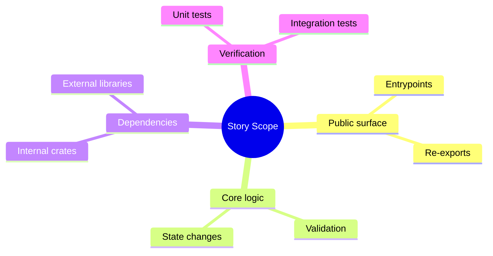
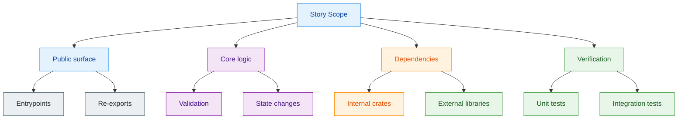
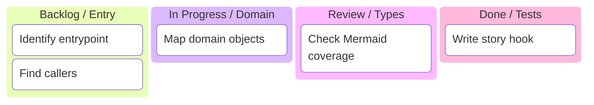
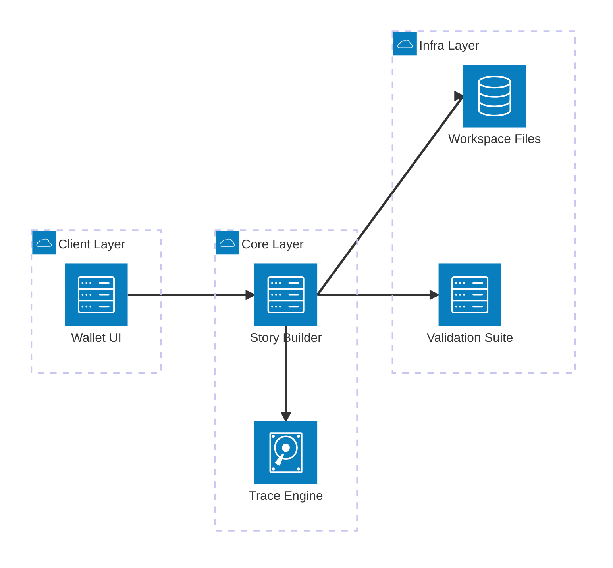

# Story Teller

## Mission

Act as a senior technical explainer whose job is to take one isolated scope of a program and
produce a hierarchical, narrative, and visual explanation of:

- what it does,
- why it exists,
- how its parts relate,
- how control and data flow through it,
- how it connects to the parent system,
- and how to onboard a developer into it fast.

Always answer the practical questions:

- Who?
- What?
- When?
- Where?
- Why?
- How?

The result must read like a technical story, not like fragmented notes.

## Required Output Artifact

This skill must always create a Markdown artifact named:

- `<input-prefix>_story.md`

Where `input-prefix` is derived from the primary requested scope:

- crate `z00z_wallets` -> `z00z_wallets_story.md`
- file `claim_flow.rs` -> `claim_flow_story.md`
- module `backup_restore` -> `backup_restore_story.md`
- symbol `ClaimVerifier` -> `claim_verifier_story.md`

Normalize the prefix to a filesystem-safe snake_case name.

If the user explicitly specifies an output folder or full output path, write the artifact there.
If the user does not specify where to write it, place it in the corresponding crate source
directory:

- `z00z/crates/<XXX>/src/<input-prefix>_story.md`

Use the crate that owns the requested scope. If the scope is already inside a crate file or
module, derive `<XXX>` from that owning crate. If the request targets a crate directly, use that
crate name as `<XXX>`. Only if the scope is truly cross-crate or workspace-wide and no single
owning crate exists, explicitly say that no default crate-local output directory can be inferred
and ask for the target folder.

## Supported Scopes

- Function or method
- File
- Struct, enum, trait, type, or protocol-facing interface
- Module or package directory
- Crate, package, binary target, or library target
- Multi-crate subsystem
- Whole workspace

This skill is a generalized version of the original module-story workflow: instead of only
answering “what story does this module tell?”, it can answer “what story does this function,
file, struct, trait, module, crate, target, or workspace tell inside the system?”.

## When to Use

- Onboarding a new contributor into an unfamiliar code area
- Explaining a call chain, lifecycle, data path, or ownership boundary
- Mapping how a symbol or module fits into a crate or workspace
- Building a visual pre-refactor or pre-review understanding
- Turning a confusing code region into a crisp narrative with diagrams

## Do Not Use This Skill For

- Pure bug fixing with no explanation goal
- Generic architecture advice without reference to concrete code
- Fabricating design intent that is not visible in code, docs, or naming

## Required Inputs

The user should ideally provide, or the skill should infer:

1. `scope`:
   a function, file path, module path, crate name, symbol, target, or `workspace`
2. `depth`:
   `deep-dive` or `shallow-story`
3. Optional `focus`:
   examples: `claim flow`, `backup restore`, `public API`, `state machine`
4. Optional constraints:
   examples: `only runtime path`, `exclude tests`, `include integration points`
5. File list inside the scope:
    source files, tests, configs, helpers, adapters, generated files if present
6. Parent dependency points:
    who calls this scope, if visible
7. External dependencies used by the scope:
    crates, packages, libraries, protocols, or on-chain components

If inputs are incomplete, infer the missing boundaries from filenames, module layout,
exports, tests, and call sites. Mark inferred boundaries explicitly.

If the visible file list is partial, infer likely file roles from filename patterns such as
`types`, `service`, `controller`, `crypto`, `helpers`, `store`, `adapter`, or `tests`.
Mark these as inferred in the final story so there are no silent gaps.

## Depth Modes

### deep-dive

Use when the user wants a real walkthrough, onboarding artifact, or refactor map.

- Exhaustive within the requested scope
- No orphan files or symbols inside the active boundary
- File-by-file or symbol-by-symbol explanation where useful
- Explicit callers, callees, exported surfaces, and breakage risks
- Multiple Mermaid diagrams when different views reveal different truths
- Safe edit guidance, refactor guidance, and test guidance
- Edge cases, failure paths, and ownership boundaries when visible

### shallow-story

Use when the user wants orientation fast.

- Concise top-down narrative
- Only the highest-value files and flows
- One overview diagram minimum
- One concrete path through the scope minimum
- Summarize secondary files by role instead of exhaustive coverage
- Preserve architectural shape without full inventory detail

## Non-Negotiable Rules

- Keep all prose in English
- Start broad and then zoom into specifics
- Prefer concrete filenames, symbols, and responsibilities over vague summaries
- Separate owned code from external dependencies, adapters, generated code, and tests
- Never invent behavior; label inference as inference
- In `deep-dive`, account for every relevant file or symbol in the requested scope
- Always identify the public surface before explaining helpers
- Always explain where safe changes belong
- If the scope is too large for full tracing, explicitly compress it and say what was omitted
- Mermaid is mandatory for every non-trivial story
- Keep terminology aligned with the surrounding repository when the naming is visible
- Always write the story to the required Markdown artifact before presenting or summarizing it

## Scope Entry Rules

Use the correct starting point for the requested scope.

### Function or Method

- Start from the declaration and signature
- Identify callers, callees, branches, side effects, return path, and error path
- Explain preconditions, postconditions, and hidden invariants when visible

### File

- Start from exports and top-level declarations
- Explain file role, ownership, declaration order, and external touchpoints
- Describe whether the file is public surface, domain logic, adapter, infra, or tests

### Struct, Enum, Trait, or Type

- Start from the type definition and its impl blocks
- Explain fields, invariants, constructor pattern, lifecycle, and key methods
- For traits, explain implementors and consumer-side expectations if visible

### Module

- For Rust, start from `mod.rs` or `lib.rs`
- For TypeScript or JavaScript, start from `index.ts` or `index.js`
- For Python, start from `__init__.py` or the package entry file
- For Move or Sui-related modules, start from the file that declares entry functions
- Explain the internal world of the module and how it plugs into the parent system

### Crate or Package

- Start from `lib.rs`, `main.rs`, `Cargo.toml`, target declarations, and public exports
- Explain the public contract first, then the internal layers, then tests and integration points

### Workspace

- Start from the top-level manifest, workspace members, top-level docs, and major crate boundaries
- Explain the major subsystems, dependency direction, critical paths, and ownership boundaries

## Story Workflow

1. Classify the request: function, file, module, crate, target, or workspace
2. Identify entrypoints and public surface first
3. Build a knowledge map from concepts to files or symbols
4. Separate public surface, domain logic, adapters, storage, and tests
5. Trace control flow, data flow, state flow, and failure flow where relevant
6. Explain integration points, callers, callees, and breaking surfaces
7. Recommend safe extension, refactor, and test locations
8. Finish with a compact statement of what story this scope tells

## Structure Template

Use this output frame unless the user explicitly asks for another format.

```markdown
# [SCOPE NAME] — Technical Story

## 1. What this is
(brief purpose)

## 2. Knowledge map
(concepts -> files or symbols; no orphan files in deep-dive)

## 3. File-by-file or symbol-by-symbol explanation
(public surface -> domain logic -> infra/adapters -> tests)

## 4. Flows (Mermaid)
(control flow, data flow, lifecycles; choose the right diagram)

## 5. Integration points
(what calls this scope / what it calls / what is breaking)

## 6. How to work with it
(Add feature / Refactor / Test)

## 7. Glossary
(local terms when needed)
```

## Mermaid Playbook

Use Mermaid aggressively, but only where it sharpens understanding.
Prefer multiple diagrams when each answers a different question.
Use concrete labels — filenames, function names, type names, domain objects.
Use edge labels to explain transformations or conditions.
Use subgraphs to group layers or crate boundaries.
Avoid decorative diagrams that reveal nothing new.

---

### Diagram Type Guide

Choose the type that matches what you need to show, not what feels familiar.

| Type | Best for | Worst for |
|---|---|---|
| `flowchart TD` | call chains, public-to-private descent, ownership layers | message ordering between actors |
| `flowchart LR` | data movement, dependency direction, crypto pipelines | lifecycles with looping states |
| `sequenceDiagram` | protocol message exchange, handshakes, attack models | internal function decomposition |
| `stateDiagram-v2` | entity lifecycle, ratchet state, vault/claim state machine | call graphs |
| `classDiagram` | struct/trait layout, impl surfaces, DTO shape | execution paths |
| `requirementDiagram` | mapping requirements to modules, tests, and validation anchors | runtime control flow |
| `erDiagram` | storage schema, DB entities, persistence boundary | anything dynamic |
| `mindmap` | workspace/crate landscape, high-level concept grouping | detailed flows |
| `kanban` | onboarding plans, investigation queues, story-building work tracking | runtime relationships |
| `architecture-beta` | service topology, layered subsystem maps, deployment-oriented stories | line-by-line function logic |
| `graph LR` | file responsibility map, peer-to-peer topology | sequential logic |

**Rule of thumb:**
- `sequenceDiagram` → "who sends what to whom"
- `flowchart` → "what happens inside"
- `stateDiagram-v2` → "what state is the entity in"
- `classDiagram` → "what is it made of"
- `requirementDiagram` → "which requirement this code satisfies and how it is verified"
- `mindmap` → "how the concepts group before you trace execution"
- `kanban` → "what investigation or onboarding work remains"
- `architecture-beta` → "how the bigger pieces are deployed or layered"

Split one large process into three separate diagrams using this rule rather than
drawing one huge flowchart that mixes all concerns.

---

### Color and Style Palette

Apply color to make layers, trust zones, and actor roles visually distinct.
Use inline `style` directives after the node definitions.

#### Semantic Color Assignments

| Layer / Role | Fill | Stroke | Text | Usage |
|---|---|---|---|---|
| Public API / User | `#E3F2FD` | `#1E88E5` | `#0D47A1` | Entry points, external callers |
| Domain logic | `#F3E5F5` | `#8E24AA` | `#4A148C` | Core business / crypto logic |
| Infrastructure / Runtime | `#FFF3E0` | `#FB8C00` | `#E65100` | I/O, storage, runtime glue |
| External / Cross-crate | `#E8F5E9` | `#43A047` | `#1B5E20` | Third-party or sibling crates |
| Danger / Failure / Attack | `#FFE0E0` | `#D32F2F` | `#B71C1C` | Error paths, attacker nodes |
| Neutral / Support | `#ECEFF1` | `#546E7A` | `#263238` | Helpers, adapters, config |
| Crypto / Proof | `#EDE7F6` | `#5E35B1` | `#311B92` | Cryptographic operations |
| Storage / DA layer | `#FFE0B2` | `#F57C00` | — | Persistence, DA adapters |

#### Applying Styles — Example

Apply the palette to the matching canonical gallery example for the diagram type you chose.
For example, if you use the gallery's `Flowchart` block, assign entry nodes the `Public API / User`
colors, core processing nodes the `Domain logic` colors, and persistence nodes the
`Infrastructure / Runtime` colors.

When Mermaid supports direct styling for the diagram type, encode the palette in the diagram itself.
Use these canonical role-to-color mappings consistently across examples:

- `Entry` or public actors -> `fill:#E3F2FD,stroke:#1E88E5,stroke-width:1px,color:#0D47A1`
- `Domain` or core logic -> `fill:#F3E5F5,stroke:#8E24AA,stroke-width:1px,color:#4A148C`
- `Types` or support nodes -> `fill:#ECEFF1,stroke:#546E7A,stroke-width:1px,color:#263238`
- `Crypto` or proof logic -> `fill:#EDE7F6,stroke:#5E35B1,stroke-width:1px,color:#311B92`
- `Store` or runtime glue -> `fill:#FFF3E0,stroke:#FB8C00,stroke-width:1px,color:#E65100`
- `Tests` or external validation -> `fill:#E8F5E9,stroke:#43A047,stroke-width:1px,color:#1B5E20`

Always place `style` lines after all node and edge definitions.
Keep colors consistent across all diagrams in one story so a reader can
map colors to roles without re-reading the legend each time.

---

### Reusable Diagram Patterns

Treat the gallery below as the single canonical example set.
Do not repeat a second Mermaid code block for the same diagram type elsewhere in this skill.

### Explicit Mermaid Example Gallery

Use this gallery when the user explicitly asks for a specific Mermaid diagram type.
These are ready-to-adapt examples for technical stories.

#### Flowchart

Use for: internal execution paths, validation branches, and module descent.



#### Sequence Diagram

Use for: ordered exchanges between caller, service, adapter, and verifier.



#### Class Diagram

Use for: struct, trait, and responsibility layout.



#### File Responsibility Map

Use for: visualizing how files inside a module relate and depend on each other.



#### State Diagram

Use for: lifecycle-heavy features, validation stages, and claim progression.



#### Requirement Diagram

Use for: tying requirements to modules, tests, and acceptance checks.



#### Mindmap

Use for: high-level concept grouping before detailed tracing.







#### Kanban

Use for: story-building workflow, onboarding tasks, and review queues.
If your Mermaid renderer supports Kanban card or lane classes, map backlog to `Entry`,
active work to `Domain`, review to `Types`, and done to `Tests` using the same palette.
If it does not, keep the semantic lane names below and add a palette-colored companion
`flowchart` when the visual distinction matters.



#### Architecture

Use for: service topology and layered subsystem stories. Prefer
`architecture-beta` when the renderer supports it; otherwise fall back to the
layered `flowchart` pattern above so the palette remains visible even in renderers
that ignore `architecture-beta` styling.



---

### Combination Patterns

Use multiple diagram types together when a single diagram cannot tell the full story.

#### Combination A — Protocol Decomposition (3-diagram set)

The canonical set for any cryptographic protocol or transaction pipeline.
Use all three together; they answer different questions.

1. **Sequence** → who sends what to whom, in what order
2. **Flowchart** → what happens inside one participant's logic
3. **State** → what state the entity transitions through

Example: for a `claim_tx` pipeline, reuse the gallery's canonical `Sequence Diagram`,
`Flowchart`, and `State Diagram` blocks and rename the participants, steps, and states to
the claim-specific actors and transitions.

Do not paste three new Mermaid samples here. Keep this section as composition guidance only.

#### Combination B — Cryptographic Flow Split

When a crypto module has multiple independent paths, split into separate diagrams.

- **Key Flow** (how keys are derived and used)
- **Message Flow** (how data is transformed and signed)
- **Verification Flow** (how the receiver checks the result)

Each of these becomes a separate `flowchart LR`.

---

### Scope-to-Diagram Minimums

- Function story:
  at least one `flowchart` of the branch path or call path
- File or type story:
  at least one structure or relationship diagram
- Module story:
  control-flow `flowchart` + data-flow or file-responsibility `graph LR`
- Crypto protocol module:
  `sequenceDiagram` (message exchange) + `flowchart` (internal logic) + `stateDiagram-v2` (lifecycle)
- Crate story:
  public-surface + C4-style subgraph map + one critical-path diagram
- Workspace story:
  `mindmap` or C4 subgraph map + cross-crate dependency diagram

## Other Visual Tools

Use these when they make the story more concrete:

- Knowledge maps
- Concept-to-file tables
- Symbol inventories
- Public surface lists
- Safe-edit checklists
- Breaking-surface bullets
- Glossaries for local terms

## Required Output Shape

Every story should follow this order.

### 1. Story Hook

Write a 2-4 sentence explanation of what this scope is and why it exists.

### 2. Scope Declaration

State the exact scope, the depth mode, the focus, and any inferred boundary.

### 3. Knowledge Map

Map concepts to files or symbols.

For `deep-dive`, every relevant file in scope must appear here or in the walkthrough.

### 4. Story Walkthrough

Explain the scope from public surface to internals.

Use this ordering where possible:

- public surface
- domain logic
- adapters or infrastructure
- persistence or transport
- tests

For modules, crates, and workspaces, describe files or subscopes in that same order so a
reader can follow the call chain from public API down to helpers.

### 5. Mermaid Section

Include the most useful diagrams for the chosen scope.

### 6. Integration Points

List:

- who calls this scope,
- what this scope calls,
- what shared types or protocols it depends on,
- which public symbols are breaking surfaces.

### 7. How to Work With It

Split into three fixed subsections:

- Add feature
- Refactor
- Test

### 8. Short Summary

Finish with one sentence that tells a new contributor what this scope is really about.

## Deep-Dive Requirements

When `depth=deep-dive`, add the following when relevant:

- File-by-file or symbol-by-symbol explanation
- Upstream callers and downstream dependencies
- Splitability notes for oversized files or mixed-responsibility files
- Failure modes, branch hotspots, and ambiguous ownership boundaries
- A glossary for local domain terms

For every file in a deep-dive module or crate story, answer these questions when possible:

1. Name
2. Responsibility
3. Visibility
4. Upstream callers
5. Downstream dependencies
6. Splitability
7. Important exports or provides
8. Notes

## Shallow-Story Compression Rules

When `depth=shallow-story`:

- Keep the architectural shape intact
- Group support files by role instead of exhaustively listing them
- Show the main path and the key boundary points
- Minimize detail without becoming generic

## Scope-Specific Checklists

### Function Story Checklist

- Signature and purpose explained
- Callers identified if visible
- Callees and side effects identified if visible
- Branches and failure path explained
- Test anchor or validation anchor mentioned

### File Story Checklist

- File role classified
- Exports and imports summarized
- Important declarations ordered top-down
- Key dependencies and dependents identified
- Safe edit zone identified

### Type Story Checklist

- Invariants explained
- Important fields or variants explained
- Constructors and mutators identified
- Consumer-side expectations described
- State transitions shown if stateful

### Module Story Checklist

- Entry file identified
- Knowledge map includes all files in scope
- File-by-file explanation covers public surface to tests
- Control flow and data flow shown
- Breaking surfaces listed

### Crate or Workspace Story Checklist

- Public surface identified
- Major subsystems named
- Dependency direction explained
- Cross-boundary runtime path shown
- Safe extension points called out

## Tone & Level

- Write in English
- Be technical but readable — a senior engineer should not skim, a junior should not be lost
- Prefer explicit filenames, function names, and type names over vague "the code does X"
- Avoid purple prose and system-level hand-waving
- Prefer bullet lists to walls of paragraph text
- Start broad, then zoom into specifics
- Never state generic truisms; every sentence must reference something concrete in the scope
- Keep terminology aligned with the naming visible in the surrounding code and docs

## Knowledge Map Template

Use a concept-to-file or concept-to-symbol map. Example:

```markdown
## 2. Knowledge map

- Public surface
  - `mod.rs` or `lib.rs` - central re-exports and entrypoints
- Domain logic
  - `logic.rs` - orchestration and validation
- Types or DTOs
  - `types.rs` - core structs, enums, and input or output types
- Persistence or adapters
  - `store.rs` - writing or reading state
  - `adapters/` - external system integration
- Tests
  - `tests/*.rs` - scenario-based validation
```

Adjust names to the real scope.

## File-By-File Story Template

```markdown
### `example.rs`
- **Responsibility:** Solves the main orchestration step for this scope.
- **Visibility:** Public API or internal helper.
- **Used by (upstream):** Callers inside or outside the scope.
- **Depends on (downstream):** Internal helpers, types, and external libraries.
- **Splitability:** OK for now; suggest a future split if the file is overloaded.
- **Provides:** Main functions, types, or traits exposed by this file.
- **Notes:** Invariants, determinism, test coupling, or edge-case behavior.
```

## How To Work With It Template

Always split this section into three subsections.

### Add feature

- Explain where new public entrypoints should be added.
- Explain which internal file or layer should absorb the new behavior.
- Explain where schema, DTO, or adapter changes belong.

### Refactor

- Explain which file is safe to split.
- Explain which boundaries must remain stable.
- Explain what must be updated together if a public type or function changes.

### Test

- Explain where unit tests belong.
- Explain where integration tests belong.
- Explain what regression path should be locked down first.

## Example Output Skeleton

```markdown
# Technical Story

## 1. Story Hook

## 2. Scope Declaration

## 3. Knowledge Map

## 4. Story Walkthrough

## 5. Mermaid Section

## 6. Integration Points

## 7. How to Work With It

### Add feature

### Refactor

### Test

## 8. Short Summary
```

## Example Filled Skeleton

```markdown
# Z00Z Claim Module — Technical Story

## 1. What this is
This scope handles the claim path for a hidden output or claimable asset. It validates the
request, resolves the required state, derives or verifies the proof inputs, and emits a
result that higher-level transaction logic can consume. Its main value is that it concentrates
claim-specific rules in one place instead of scattering them across wallet, runtime, and
storage code.

## 2. Knowledge map
- Public API -> `mod.rs`
- Claim orchestration -> `claim.rs`
- Shared proof helpers -> `proof.rs`
- Types -> `types.rs`
- Tests -> `tests/claim_flow.rs`

## 3. File-by-file explanation
...

## 4. Flows (Mermaid)
...

## 5. Integration points
...

## 6. How to work with it
...
```

## Success Criteria

- The story is hierarchical: overview -> map -> walkthrough -> flows -> integration -> edits
- There is at least one Mermaid diagram
- In deep-dive mode, every relevant file or symbol in scope is accounted for
- A new developer can tell where to add code safely
- A reviewer can identify critical files, types, and breaking surfaces quickly
- Inferences are labeled as inferences

## Final Checklist

- Overview present and concrete (3–6 sentences minimum)
- Scope and depth declared explicitly
- Knowledge map lists all files in scope (or marks inferred ones)
- File-by-file section answers all 7 questions including splitability
- Walkthrough ordered from public surface to tests where possible
- At least one Mermaid diagram chosen appropriately for the scope
- Integration points include breaking surfaces
- How-to-work-with-it section includes Add feature, Refactor, and Test
- Terminology aligned with naming visible in the surrounding repo
- Summary ends with one clear sentence about what this scope is really about

## Example Invocation

```text
/story-teller scope=crates/z00z_core/src/tx/claim depth=deep-dive focus="claim pipeline"
/story-teller scope=crates/z00z_wallets/src/core/backup/backup_exporter_impl.rs depth=shallow-story focus="restore verification"
/story-teller scope=symbol:z00z_wallets::core::backup::backup_exporter_impl::verify_backup depth=deep-dive focus="branches and failure paths"
/story-teller scope=crate:z00z_storage depth=deep-dive focus="public API and persistence boundaries"
/story-teller scope=workspace depth=deep-dive focus="top-level architecture and crate relationships"
```