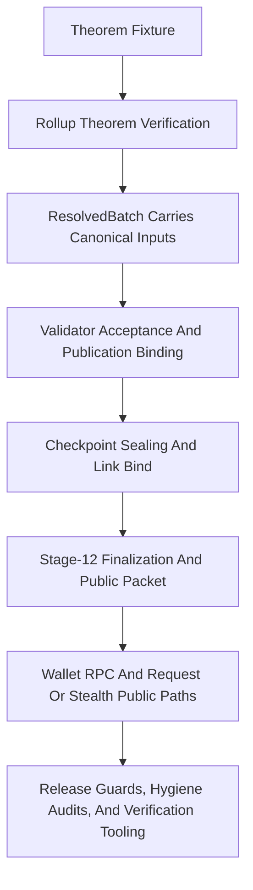

# Phase 065 Test Spec

## 🎯 Purpose

📌 This document defines the phase-local unit, integration, source-audit, and
release-mode end-to-end coverage that now proves Phase 065 on the live tree.

📌 It is self-contained: `065-TODO.md` remains the normative requirements
authority, while this file records the exact executable seams, pass oracles,
fixtures, and command bundles that closed those requirements without a second
planning layer.

📌 Phase 065 proof is Rust- and script-driven. "End to end" here means
release-mode crate tests, deterministic local simulator flows, managed
verification-tooling self-tests, and fail-closed audit scripts, not browser
automation.

## 🔄 Workflow Status

✅ This test spec is `verification-backed`.

📌 The authority chain for this spec is:

- `.planning/phases/065-Attack-Surface/065-TODO.md`
- `.planning/phases/065-Attack-Surface/065-CONTEXT.md`
- `.planning/phases/065-Attack-Surface/065-01-PLAN.md` through
  `065-13-PLAN.md`
- `.planning/phases/065-Attack-Surface/065-01-SUMMARY.md` through
  `065-13-SUMMARY.md`
- `.planning/phases/065-Attack-Surface/z00z-verification-report-1.md` through
  `z00z-verification-report-4.md`
- `.planning/STATE.md`
- `.planning/ROADMAP.md`

📌 The current-tree status recorded in `STATE.md` and `ROADMAP.md` is:

- Phase 065 is complete on the existing
  `.planning/phases/065-Attack-Surface/` directory only.
- `065-01` through `065-13` are summary-backed complete.
- `065-TODO.md` remains normative, including linked design and whitepaper
  corpus as live scope.

📌 No phase-local test artifact remains hypothetical. Every phase-closing test
or audit seam named below exists on the current tree and is backed by executed
summary evidence.

📌 Several plan summaries recorded an honest runtime blocker for automated
`/GSD-Review-Tasks-Execution` invocations (`No such file or directory` or
prompt token limit). Those summaries also record the required manual equivalent
review passes. This spec preserves that truth instead of pretending the
automated path was green when it was not.

## 🧭 Classification

### ⚙️ TDD And Integration Targets

- `065-T01` closes `WS-01` across
  `crates/z00z_rollup_node/src/lib.rs`,
  `crates/z00z_rollup_node/src/da.rs`,
  `crates/z00z_runtime/validators/src/checkpoint.rs`,
  `crates/z00z_runtime/validators/src/engine.rs`,
  `crates/z00z_runtime/validators/src/verdict.rs`,
  `crates/z00z_rollup_node/tests/support/test_theorem_fixture.rs`,
  `crates/z00z_rollup_node/tests/test_rollup_theorem_guard.rs`,
  `crates/z00z_rollup_node/tests/test_da_local_sim.rs`,
  `crates/z00z_runtime/validators/tests/test_hjmt_publication_contract.rs`,
  `crates/z00z_runtime/validators/tests/test_object_policy_verdicts.rs`, and
  `crates/z00z_runtime/validators/tests/test_theorem_support.rs`.
- `065-T02` closes `WS-02` across
  `crates/z00z_storage/src/checkpoint/store.rs`,
  `crates/z00z_storage/src/checkpoint/store_fs.rs`,
  `crates/z00z_storage/src/checkpoint/artifact_proof_draft.rs`,
  `crates/z00z_storage/src/checkpoint/link.rs`,
  `crates/z00z_simulator/src/scenario_1/stage_12/finalize_flow.rs`,
  `crates/z00z_simulator/src/scenario_1/stage_4/storage_view.rs`,
  `crates/z00z_simulator/src/scenario_1/stage_9/exec_input_builder.rs`, and
  the checkpoint store, link, finalization, and stage-12 tests.
- `065-T03` closes `WS-03` across
  `crates/z00z_wallets/src/lib.rs`,
  `crates/z00z_wallets/src/db/mod.rs`,
  `crates/z00z_wallets/src/wallet/mod.rs`,
  `crates/z00z_simulator/src/lib.rs`,
  `crates/z00z_storage/src/settlement/hjmt_cache.rs`,
  `crates/z00z_storage/src/settlement/hjmt_scheduler.rs`,
  `crates/z00z_wallets/tests/test_production_hardening.rs`,
  `crates/z00z_wallets/tests/test_live_boundary_claims.rs`, and
  `scripts/audit/audit_release_feature_guards.sh`.
- `065-T04` closes `WS-04` across
  `crates/z00z_simulator/src/config.rs`,
  `crates/z00z_simulator/src/scenario_1/runtime_observability.rs`,
  `crates/z00z_simulator/src/scenario_1/stage_12/mod.rs`,
  `crates/z00z_simulator/tests/scenario_1/test_stage6_checkpoint_final_gate.rs`,
  and
  `crates/z00z_simulator/tests/scenario_1/test_wallet_integration.rs`.
- `065-T05` closes `WS-05` across
  `crates/z00z_wallets/src/services/wallet_session_runtime_limits.rs`,
  `crates/z00z_wallets/src/services/wallet_session_guards_inactive.rs`,
  `crates/z00z_wallets/src/rpc/key_rpc_server_admin.rs`,
  `crates/z00z_wallets/src/rpc/wallet_dispatcher_wiring.rs`,
  `crates/z00z_wallets/src/rpc/wallet_dispatcher_routes.rs`,
  `crates/z00z_wallets/src/stealth/output.rs`,
  `crates/z00z_wallets/tests/test_sensitive_rpc_session.rs`,
  `crates/z00z_wallets/tests/test_wallet_capability_matrix.rs`,
  `crates/z00z_wallets/tests/test_stealth_output.rs`,
  `crates/z00z_wallets/tests/test_rpc_route_coverage.rs`, and
  `crates/z00z_wallets/scripts/audit_rpc_method_wiring.sh`.
- `065-T06` closes `WS-06` across
  `crates/z00z_wallets/src/rpc/asset_rpc_impl.rs`,
  `crates/z00z_wallets/src/rpc/asset_rpc_support_state.rs`,
  `crates/z00z_wallets/src/chain/broadcast_impl.rs`,
  `crates/z00z_wallets/src/services/wallet_actions_backup.rs`,
  `crates/z00z_wallets/src/tx/tx_digest.rs`,
  `crates/z00z_wallets/tests/test_asset_rpc_mutations.rs`,
  `crates/z00z_wallets/tests/test_wallet_restore_atomic.rs`,
  `crates/z00z_wallets/tests/test_chain_broadcast_retry.rs`,
  `crates/z00z_wallets/tests/test_tx_store_integration.rs`, and
  `crates/z00z_wallets/tests/test_chain_client_sim.rs`.
- `065-T07` closes `WS-07` across
  `crates/z00z_storage/src/settlement/store.rs`,
  `crates/z00z_networks/rpc/src/wasm_client.rs`,
  `crates/z00z_storage/src/backend/redb/helpers.rs`,
  `crates/z00z_wallets/src/rpc/security_types.rs`,
  `crates/z00z_wallets/tests/test_rpc_logging_acceptance.rs`,
  `crates/z00z_wallets/tests/test_rpc_logging_risk_policy.rs`,
  `crates/z00z_storage/tests/test_live_guardrails.rs`,
  `crates/z00z_storage/tests/test_hjmt_adaptive_policy_proofs.rs`,
  `crates/z00z_networks/rpc/tests/test_wasm_client_redaction.rs`, and the five
  security-hygiene audit scripts under `scripts/audit/`.
- `065-T08` closes `WS-08` across
  `crates/z00z_wallets/src/services/chain_service.rs`,
  `crates/z00z_wallets/src/rpc/chain_rpc.rs`,
  `crates/z00z_wallets/src/rpc/chain_rpc_impl.rs`,
  `crates/z00z_wallets/src/rpc/chain_types.rs`,
  `crates/z00z_wallets/src/rpc/tx_types.rs`,
  `crates/z00z_wallets/src/rpc/tx_runtime_state.rs`,
  `crates/z00z_wallets/src/rpc/tx_rpc_admission.rs`,
  `crates/z00z_wallets/src/app/app_kernel.rs`,
  `crates/z00z_wallets/tests/test_rpc_truth.rs`,
  `crates/z00z_wallets/tests/test_rpc_types_serialization.rs`,
  `crates/z00z_wallets/tests/test_rpc_wiring_spec_a.rs`,
  `crates/z00z_wallets/tests/test_runtime_validation_result.rs`, and
  `crates/z00z_wallets/tests/test_stub_behavior.rs`.
- `065-T09` closes `WS-09` across
  `.planning/codebase/STRUCTURE.md`,
  `.planning/codebase/ARCHITECTURE.md`,
  `.planning/phases/profiling-comprehensive.md`,
  `crates/z00z_storage/src/settlement/root_types.md`,
  `crates/z00z_core/tests/test_live_guardrails.rs`, and
  `scripts/audit_phase065_narrowed_wording.sh`.
- `065-T10` closes `VR-10` through
  `.github/skills/z00z-verification-orchestrator/scripts/orchestrate.sh`,
  `.github/skills/z00z-l0-spec-gate/scripts/check-docs.sh`,
  `.github/skills/z00z-l3-rust-implementation-gate/scripts/verify-fast.sh`,
  and
  `.github/skills/z00z-l4-security-engineering-gate/scripts/audit-supply-chain.sh`.
- `065-T11` closes `VR-11` through
  `scripts/install-verification-tools.sh`,
  `scripts/verify-env.sh`,
  `scripts/verification-tools/versions.env`,
  `.github/skills/z00z-l3-rust-implementation-gate/scripts/verify-kani.sh`,
  `.github/skills/z00z-l3-rust-implementation-gate/scripts/verify-miri.sh`,
  `.github/skills/z00z-l3-rust-implementation-gate/scripts/verify-verus.sh`,
  `.github/skills/z00z-l2-crypto-protocol-gate/scripts/run-hax.sh`,
  `.github/skills/z00z-l2-crypto-protocol-gate/scripts/run-tamarin.sh`,
  `.github/skills/z00z-l4-security-engineering-gate/scripts/run-fuzz-short.sh`,
  and `crates/z00z_core/tests/test_live_guardrails.rs`.
- `065-T12` closes `VR-12` through
  `crates/z00z_runtime/aggregators/Cargo.toml`,
  `crates/z00z_runtime/aggregators/tests/test_hjmt_consensus.rs`,
  `crates/z00z_runtime/aggregators/tests/test_hjmt_route_rollout.rs`,
  `crates/z00z_runtime/aggregators/tests/test_hjmt_failover_same_lineage.rs`,
  `crates/z00z_runtime/aggregators/tests/test_live_guardrails.rs`,
  `crates/z00z_storage/tests/test_checkpoint_finalization.rs`,
  `crates/z00z_storage/tests/test_hjmt_root_generation.rs`,
  `crates/z00z_storage/tests/test_live_guardrails.rs`, and
  `scripts/audit/audit_release_feature_guards.sh`.
- `065-T13` closes `VR-13` through
  `crates/z00z_crypto/tests/test_hash_policy.rs`,
  `crates/z00z_wallets/src/rpc/asset_rpc_support_claims.rs`,
  `crates/z00z_wallets/src/rpc/asset_rpc_impl.rs`,
  `crates/z00z_wallets/src/rpc/asset_rpc_support_state.rs`,
  `crates/z00z_wallets/src/rpc/test_asset_impl.rs`,
  `crates/z00z_wallets/tests/test_payment_request.rs`,
  `crates/z00z_wallets/tests/test_asset_replay_protection.rs`,
  `crates/z00z_wallets/tests/test_e2e_req_flow.rs`,
  `crates/z00z_wallets/tests/test_stealth_output.rs`,
  `crates/z00z_wallets/tests/test_view_key_contract.rs`,
  `crates/z00z_wallets/tests/test_adversarial.rs`,
  `crates/z00z_wallets/tests/test_rpc_route_coverage.rs`,
  `crates/z00z_wallets/tests/test_sensitive_rpc_session.rs`, and
  `crates/z00z_wallets/tests/test_import_error_taxonomy.rs`.

### 🧪 E2E Targets

- Release-mode rollup, validator, and simulator proof that one accepted batch
  has one theorem, publication, and checkpoint story.
- Release-mode checkpoint sealing and stage-12 finalization proof that
  canonical artifacts are born only through `seal_artifact()`.
- Release-safe build-policy proof that debug or test-only features fail closed
  on public or release-capable targets.
- Simulator public-lane proof that draft-only evidence and plaintext secret
  artifacts cannot impersonate final publication truth.
- Wallet release-mode proof that privileged RPCs, mutation paths, restore
  durability, public DTOs, and payment-request flows all use one canonical
  path.
- Verification-tooling proof that orchestrator, managed toolchains, and local
  security gates surface honest current-tree state instead of wrapper or
  bootstrap failures.
- Repository-wide audit proof that logging, panic, RNG, secret-type, and
  equality hygiene stay fail-closed under CI-owned checks.

### ⏭️ Skip Targets

- Browser automation and UI-driven E2E, because Phase 065 is a multi-crate
  Rust and script-hygiene closure phase.
- Retired Phase 065 Markdown reports and JSONL inventories as live
  requirements, because `065-TODO.md` now absorbs the authoritative backlog.
- Vendor code under `crates/z00z_crypto/tari/**`, because the phase closes
  only through project-owned wrappers, tests, and scripts.
- Remote third-party network truth, external DA truth, or external process
  truth that the repo does not own locally.

## ♻️ Existing Test Anchors To Reuse

- `065-T01` theorem closure:
  `crates/z00z_rollup_node/tests/test_rollup_theorem_guard.rs`,
  `crates/z00z_rollup_node/tests/test_da_local_sim.rs`,
  `crates/z00z_runtime/validators/tests/test_hjmt_publication_contract.rs`,
  `crates/z00z_runtime/validators/tests/test_object_policy_verdicts.rs`,
  `crates/z00z_runtime/validators/tests/test_theorem_support.rs`,
  `crates/z00z_simulator/tests/scenario_1/test_checkpoint_acceptance.rs`
- `065-T02` seal-only persistence:
  `crates/z00z_storage/tests/test_checkpoint_store.rs`,
  `crates/z00z_storage/tests/test_checkpoint_finalization.rs`,
  `crates/z00z_storage/tests/test_checkpoint_link_injective.rs`,
  `crates/z00z_storage/tests/test_checkpoint_draft_final.rs`,
  `crates/z00z_simulator/tests/scenario_1/test_stage6_checkpoint_storage_bridge.rs`
- `065-T03` release guardrails:
  `crates/z00z_wallets/tests/test_production_hardening.rs`,
  `crates/z00z_wallets/tests/test_live_boundary_claims.rs`,
  `scripts/audit/audit_release_feature_guards.sh`
- `065-T04` simulator evidence truth:
  `crates/z00z_simulator/tests/scenario_1/test_stage6_checkpoint_final_gate.rs`,
  `crates/z00z_simulator/tests/scenario_1/test_wallet_integration.rs`
- `065-T05` privileged capability truth:
  `crates/z00z_wallets/tests/test_sensitive_rpc_session.rs`,
  `crates/z00z_wallets/tests/test_wallet_capability_matrix.rs`,
  `crates/z00z_wallets/tests/test_stealth_output.rs`,
  `crates/z00z_wallets/tests/test_rpc_route_coverage.rs`,
  `crates/z00z_wallets/scripts/audit_rpc_method_wiring.sh`
- `065-T06` mutation and restore truth:
  `crates/z00z_wallets/tests/test_asset_rpc_mutations.rs`,
  `crates/z00z_wallets/tests/test_wallet_restore_atomic.rs`,
  `crates/z00z_wallets/tests/test_chain_broadcast_retry.rs`,
  `crates/z00z_wallets/tests/test_tx_store_integration.rs`,
  `crates/z00z_wallets/tests/test_chain_client_sim.rs`,
  `crates/z00z_wallets/tests/test_tx_digest_framing.rs`
- `065-T07` fail-closed boundary and meta-gates:
  `crates/z00z_networks/rpc/tests/test_wasm_client_redaction.rs`,
  `crates/z00z_wallets/tests/test_rpc_logging_acceptance.rs`,
  `crates/z00z_wallets/tests/test_rpc_logging_risk_policy.rs`,
  `crates/z00z_storage/tests/test_live_guardrails.rs`,
  `crates/z00z_storage/tests/test_hjmt_adaptive_policy_proofs.rs`,
  `scripts/audit/audit_secret_type_hygiene.sh`,
  `scripts/audit/audit_secret_eq_hygiene.sh`,
  `scripts/audit/audit_crypto_rng_hygiene.sh`,
  `scripts/audit/audit_boundary_panic_hygiene.sh`,
  `scripts/audit/audit_log_redaction_hygiene.sh`
- `065-T08` public RPC and DTO truth:
  `crates/z00z_wallets/tests/test_rpc_truth.rs`,
  `crates/z00z_wallets/tests/test_rpc_types_serialization.rs`,
  `crates/z00z_wallets/tests/test_rpc_wiring_spec_a.rs`,
  `crates/z00z_wallets/tests/test_runtime_validation_result.rs`,
  `crates/z00z_wallets/tests/test_stub_behavior.rs`
- `065-T09` narrowed-claim sweep:
  `crates/z00z_core/tests/test_live_guardrails.rs`,
  `scripts/audit_phase065_narrowed_wording.sh`
- `065-T10` orchestrator entry paths:
  `.github/skills/z00z-verification-orchestrator/scripts/orchestrate.sh`,
  `.github/skills/z00z-l0-spec-gate/scripts/check-docs.sh`,
  `.github/skills/z00z-l3-rust-implementation-gate/scripts/verify-fast.sh`,
  `.github/skills/z00z-l4-security-engineering-gate/scripts/audit-supply-chain.sh`
- `065-T11` managed verifier tooling:
  `scripts/install-verification-tools.sh`,
  `scripts/verify-env.sh`,
  `.github/skills/z00z-l3-rust-implementation-gate/scripts/verify-kani.sh`,
  `.github/skills/z00z-l3-rust-implementation-gate/scripts/verify-miri.sh`,
  `.github/skills/z00z-l3-rust-implementation-gate/scripts/verify-verus.sh`,
  `.github/skills/z00z-l2-crypto-protocol-gate/scripts/run-hax.sh`,
  `.github/skills/z00z-l2-crypto-protocol-gate/scripts/run-tamarin.sh`,
  `.github/skills/z00z-l4-security-engineering-gate/scripts/run-fuzz-short.sh`
- `065-T12` lineage and determinism closure:
  `crates/z00z_runtime/aggregators/tests/test_hjmt_consensus.rs`,
  `crates/z00z_runtime/aggregators/tests/test_hjmt_route_rollout.rs`,
  `crates/z00z_runtime/aggregators/tests/test_hjmt_failover_same_lineage.rs`,
  `crates/z00z_runtime/aggregators/tests/test_live_guardrails.rs`,
  `crates/z00z_storage/tests/test_checkpoint_finalization.rs`,
  `crates/z00z_storage/tests/test_hjmt_root_generation.rs`,
  `crates/z00z_storage/tests/test_live_guardrails.rs`
- `065-T13` payment request and stealth binding:
  `crates/z00z_crypto/tests/test_hash_policy.rs`,
  `crates/z00z_wallets/tests/test_payment_request.rs`,
  `crates/z00z_wallets/tests/test_asset_replay_protection.rs`,
  `crates/z00z_wallets/tests/test_e2e_req_flow.rs`,
  `crates/z00z_wallets/tests/test_stealth_output.rs`,
  `crates/z00z_wallets/tests/test_view_key_contract.rs`,
  `crates/z00z_wallets/tests/test_adversarial.rs`,
  `crates/z00z_wallets/tests/test_rpc_route_coverage.rs`,
  `crates/z00z_wallets/tests/test_sensitive_rpc_session.rs`,
  `crates/z00z_wallets/tests/test_import_error_taxonomy.rs`

## 🛡️ Regression-Only Boundaries That Must Stay Green

📌 These are not separate open workstreams anymore, but `065-TODO.md` still
requires explicit regression coverage for them:

- claim-source continuity:
  `crates/z00z_storage/tests/test_claim_source_proof.rs`
- object quarantine and promotion semantics:
  `crates/z00z_wallets/tests/test_object_quarantine.rs`
- object reject-code contract:
  `crates/z00z_storage/tests/test_object_reject_codes.rs`
- recovery takeover and resume ownership:
  `crates/z00z_wallets/tests/test_claim_resume_core.rs`,
  `crates/z00z_simulator/tests/scenario_1/test_claim_resume.rs`
- default simulator public-lane secret-free boundary:
  `crates/z00z_simulator/tests/scenario_1/test_wallet_integration.rs`
- persisted `rotate_master_key` wording and receipt truth:
  Phase 065 keeps this inside the wallet public-truth and privileged-session
  suites instead of reviving the old placeholder-only wording as a new bug.

## 🆕 Phase-Owned Test And Audit Artifacts Landed During Execution

📌 No planned-only test artifact remains. The following phase-owned anchors are
already present on the current tree and must stay canonical:

- `scripts/audit/audit_release_feature_guards.sh`
- `scripts/audit/audit_boundary_panic_hygiene.sh`
- `scripts/audit/audit_crypto_rng_hygiene.sh`
- `scripts/audit/audit_log_redaction_hygiene.sh`
- `scripts/audit/audit_secret_eq_hygiene.sh`
- `scripts/audit/audit_secret_type_hygiene.sh`
- `scripts/audit_phase065_narrowed_wording.sh`
- `crates/z00z_networks/rpc/tests/test_wasm_client_redaction.rs`
- `.github/workflows/security-hygiene-guards.yml`

## 📍 Test File Placement

| Scenario ID | Test File Path | Extend Or Create | Why This Is The Correct Home |
| --- | --- | --- | --- |
| `065-T01` | `crates/z00z_rollup_node/tests/test_rollup_theorem_guard.rs`<br>`crates/z00z_rollup_node/tests/test_da_local_sim.rs`<br>`crates/z00z_runtime/validators/tests/test_hjmt_publication_contract.rs`<br>`crates/z00z_runtime/validators/tests/test_object_policy_verdicts.rs`<br>`crates/z00z_runtime/validators/tests/test_theorem_support.rs`<br>`crates/z00z_simulator/tests/scenario_1/test_checkpoint_acceptance.rs` | Extend | These files prove the same accepted-path theorem, publication, and checkpoint story across rollup, validator, and simulator boundaries. |
| `065-T02` | `crates/z00z_storage/tests/test_checkpoint_store.rs`<br>`crates/z00z_storage/tests/test_checkpoint_finalization.rs`<br>`crates/z00z_storage/tests/test_checkpoint_link_injective.rs`<br>`crates/z00z_storage/tests/test_checkpoint_draft_final.rs`<br>`crates/z00z_simulator/tests/scenario_1/test_stage6_checkpoint_storage_bridge.rs` | Extend | These are the canonical homes for seal-only persistence, raw-lane rejection, link bind, and stage-12 consumption of sealed artifacts. |
| `065-T03` | `crates/z00z_wallets/tests/test_production_hardening.rs`<br>`crates/z00z_wallets/tests/test_live_boundary_claims.rs`<br>`scripts/audit/audit_release_feature_guards.sh` | Extend + create landed | This bundle owns release-capable feature rejection and source-level proof that debug surfaces do not leak into public builds. |
| `065-T04` | `crates/z00z_simulator/tests/scenario_1/test_stage6_checkpoint_final_gate.rs`<br>`crates/z00z_simulator/tests/scenario_1/test_wallet_integration.rs` | Extend | These simulator tests are the public-lane seam for draft-evidence rejection and secret-free packet truth. |
| `065-T05` | `crates/z00z_wallets/tests/test_sensitive_rpc_session.rs`<br>`crates/z00z_wallets/tests/test_wallet_capability_matrix.rs`<br>`crates/z00z_wallets/tests/test_stealth_output.rs`<br>`crates/z00z_wallets/tests/test_rpc_route_coverage.rs`<br>`crates/z00z_wallets/scripts/audit_rpc_method_wiring.sh` | Extend | These files already own privileged session proof, target capability truth, raw-builder demotion, and route-registration audits. |
| `065-T06` | `crates/z00z_wallets/tests/test_asset_rpc_mutations.rs`<br>`crates/z00z_wallets/tests/test_wallet_restore_atomic.rs`<br>`crates/z00z_wallets/tests/test_chain_broadcast_retry.rs`<br>`crates/z00z_wallets/tests/test_tx_store_integration.rs`<br>`crates/z00z_wallets/tests/test_chain_client_sim.rs`<br>`crates/z00z_wallets/tests/test_tx_digest_framing.rs` | Extend | These files prove one canonical mutation owner, durable restore semantics, coherent broadcast lifecycle, and stable tx digest truth. |
| `065-T07` | `crates/z00z_networks/rpc/tests/test_wasm_client_redaction.rs`<br>`crates/z00z_wallets/tests/test_rpc_logging_acceptance.rs`<br>`crates/z00z_wallets/tests/test_rpc_logging_risk_policy.rs`<br>`crates/z00z_storage/tests/test_live_guardrails.rs`<br>`crates/z00z_storage/tests/test_hjmt_adaptive_policy_proofs.rs`<br>`scripts/audit/audit_secret_type_hygiene.sh`<br>`scripts/audit/audit_secret_eq_hygiene.sh`<br>`scripts/audit/audit_crypto_rng_hygiene.sh`<br>`scripts/audit/audit_boundary_panic_hygiene.sh`<br>`scripts/audit/audit_log_redaction_hygiene.sh` | Extend + create landed | This is the phase-owned fail-closed and redaction bundle spanning runtime assertions and CI-owned source audits. |
| `065-T08` | `crates/z00z_wallets/tests/test_rpc_truth.rs`<br>`crates/z00z_wallets/tests/test_rpc_types_serialization.rs`<br>`crates/z00z_wallets/tests/test_rpc_wiring_spec_a.rs`<br>`crates/z00z_wallets/tests/test_runtime_validation_result.rs`<br>`crates/z00z_wallets/tests/test_stub_behavior.rs` | Extend | These files define the production-facing chain and transaction RPC contract and reject placeholder DTO truth. |
| `065-T09` | `crates/z00z_core/tests/test_live_guardrails.rs`<br>`scripts/audit_phase065_narrowed_wording.sh` | Extend + create landed | The narrowed-claim sweep closes only when docs, guardrails, and audit script agree on the surviving current-tree wording. |
| `065-T10` | `.github/skills/z00z-verification-orchestrator/scripts/orchestrate.sh`<br>`.github/skills/z00z-l0-spec-gate/scripts/check-docs.sh`<br>`.github/skills/z00z-l3-rust-implementation-gate/scripts/verify-fast.sh`<br>`.github/skills/z00z-l4-security-engineering-gate/scripts/audit-supply-chain.sh` | Extend | This is the canonical dispatch surface for residual gate-entry-path repair; no parallel wrapper layer is allowed. |
| `065-T11` | `scripts/install-verification-tools.sh`<br>`scripts/verify-env.sh`<br>`scripts/verification-tools/versions.env`<br>`.github/skills/z00z-l3-rust-implementation-gate/scripts/verify-kani.sh`<br>`.github/skills/z00z-l3-rust-implementation-gate/scripts/verify-miri.sh`<br>`.github/skills/z00z-l3-rust-implementation-gate/scripts/verify-verus.sh`<br>`.github/skills/z00z-l2-crypto-protocol-gate/scripts/run-hax.sh`<br>`.github/skills/z00z-l2-crypto-protocol-gate/scripts/run-tamarin.sh`<br>`.github/skills/z00z-l4-security-engineering-gate/scripts/run-fuzz-short.sh` | Extend | Managed verification recovery is owned by the install, env, and gate scripts themselves; a separate harness would hide the real bootstrap truth. |
| `065-T12` | `crates/z00z_runtime/aggregators/tests/test_hjmt_consensus.rs`<br>`crates/z00z_runtime/aggregators/tests/test_hjmt_route_rollout.rs`<br>`crates/z00z_runtime/aggregators/tests/test_hjmt_failover_same_lineage.rs`<br>`crates/z00z_runtime/aggregators/tests/test_live_guardrails.rs`<br>`crates/z00z_storage/tests/test_checkpoint_finalization.rs`<br>`crates/z00z_storage/tests/test_hjmt_root_generation.rs`<br>`crates/z00z_storage/tests/test_live_guardrails.rs`<br>`scripts/audit/audit_release_feature_guards.sh` | Extend | This bundle proves release-safe lineage, route rollout, root generation, and the absence of invalid feature-edge leakage into wallet release guards. |
| `065-T13` | `crates/z00z_crypto/tests/test_hash_policy.rs`<br>`crates/z00z_wallets/src/rpc/test_asset_impl.rs`<br>`crates/z00z_wallets/tests/test_payment_request.rs`<br>`crates/z00z_wallets/tests/test_asset_replay_protection.rs`<br>`crates/z00z_wallets/tests/test_e2e_req_flow.rs`<br>`crates/z00z_wallets/tests/test_stealth_output.rs`<br>`crates/z00z_wallets/tests/test_view_key_contract.rs`<br>`crates/z00z_wallets/tests/test_adversarial.rs`<br>`crates/z00z_wallets/tests/test_rpc_route_coverage.rs`<br>`crates/z00z_wallets/tests/test_sensitive_rpc_session.rs`<br>`crates/z00z_wallets/tests/test_import_error_taxonomy.rs` | Extend | These files are the final public-path seam for request hash policy, persisted chain claim scope, replay protection, and validated stealth behavior. |

## ✅ Required End-To-End Behaviors

| Behavior | Requirement | Primary Path | Pass Signal | Fail Signal |
| --- | --- | --- | --- | --- |
| Accepted validator paths require one theorem bundle | `WS-01` | `verify_settlement_theorem() -> ResolvedBatch -> verdict_for_batch()` | release suites prove one accepted path binds theorem, publication, route digest, and link ids together | `Accepted` remains reachable from artifact-only or partial theorem inputs |
| Canonical checkpoint artifacts are born only through sealing | `WS-02` | `CheckpointStore::seal_artifact() -> CheckpointLink -> stage_12 finalize` | raw-lane artifacts are rejected on canonical paths and link evidence is checked before write or load | raw exports or compatibility proof bytes can masquerade as canonical final artifacts |
| Release-capable builds reject weakened or debug feature sets | `WS-03` | release `cargo check` matrix + source audit | `test-params-fast` and `wallet_debug_tools` fail closed on release-capable wallet and simulator builds | weakened KDF or secret-export features compile into public release paths |
| Draft or debug simulator lanes cannot emit production-shaped evidence | `WS-04` | `Stage6ProofMode` + stage-12 publication packet + wallet integration packet | `DraftOnly` is rejected on public lanes and the default public lane stays secret-free | synthetic checkpoint ids or draft-shaped publication evidence pass as final truth |
| Privileged wallet services require typed capability proof | `WS-05` | session guard types + dispatcher wiring + route audit | privileged RPCs require the verified capability path and unsupported wasm capability paths fail explicitly | a new handler can register without the typed guard or raw stealth builder looks canonical |
| One canonical service owns mutation truth and restore durability | `WS-06` | asset RPC -> mutation executor -> broadcast -> tx store -> restore rollback or retry | repeated failures keep tx history, publish state, and retry semantics coherent | helper drift reintroduces multiple mutation owners or restore ambiguity |
| Boundary constructors fail closed and logs stay redacted | `WS-07` | storage open or load + wasm RPC transport + security hygiene audits | no trust-boundary panic survives and transport logs emit only redacted summaries | raw params, raw responses, panic paths, or secret-bearing types bypass the policy gates |
| Public chain and transaction RPCs are either real or explicitly non-production | `WS-08` | chain service + chain RPC + tx DTOs + route wiring | synthetic placeholder state is removed from production-looking DTOs and wiring/docs stay honest | live-looking public RPCs still ship stub-only semantics |
| Narrowed historical leftovers stay retired | `WS-09` | guardrail test + narrowed-wording audit | no repo doc or planning artifact re-promotes retired claim wording as live truth | stale references revive old claims or duplicate authority paths |
| Verification orchestrator dispatches only to owning gate scripts | `VR-10` | orchestrator report path resolution | reports and executed commands point to the same canonical L0 or L3 or L4 scripts | orchestrator metadata and executed path drift apart again |
| Managed verifier tooling reports honest local state | `VR-11` | install self-test + env check + Kani or Miri or Verus or Hax or Tamarin or fuzz scripts | bootstrap succeeds, absent local targets report honest `UNKNOWN`, and false offline or wrapper failures disappear | toolchain bootstrap noise masks the real repo status |
| Aggregator release-fast tests stay release-safe and lineage-deterministic | `VR-12` | aggregator release suites + storage suites + feature-tree check | aggregator `test-params-fast` does not activate wallet fast-test features and lineage or route or root tests stay green | feature-edge drift reopens wallet release guard failures or hides lineage issues |
| Payment request and receiver-card paths stay domain-bound and chain-bound | `VR-13` | hash policy tests + asset RPC claim scope + request or stealth suites | `z00z.payment.request.v1` and `z00z.receiver.card.v1` stay `Poseidon2`, and claim scope binds to persisted wallet chain | implicit hash policy or hardcoded chain label drifts from canonical public behavior |

## 🔎 Plan Traceability

| Scenario ID | TODO Authority | Plans And Summaries | Primary Evidence Anchors |
| --- | --- | --- | --- |
| `065-T01` | `WS-01`, `G-01`, `G-02` | `065-01-PLAN.md`, `065-01-SUMMARY.md` | theorem, publication, validator, and accepted-path tests |
| `065-T02` | `WS-02`, `G-03`, `G-04` | `065-02-PLAN.md`, `065-02-SUMMARY.md` | checkpoint store, link, finalization, and stage-12 bridge tests |
| `065-T03` | `WS-03` | `065-03-PLAN.md`, `065-03-SUMMARY.md` | release hardening tests and release-feature audit |
| `065-T04` | `WS-04` | `065-04-PLAN.md`, `065-04-SUMMARY.md` | simulator draft rejection and public-lane secret-free tests |
| `065-T05` | `WS-05`, `G-05` | `065-05-PLAN.md`, `065-05-SUMMARY.md` | privileged session, capability matrix, stealth, and route-audit tests |
| `065-T06` | `WS-06`, `G-06`, `G-07` | `065-06-PLAN.md`, `065-06-SUMMARY.md` | asset mutation, restore, broadcast, tx storage, and tx digest tests |
| `065-T07` | `WS-07` | `065-07-PLAN.md`, `065-07-SUMMARY.md` | redaction tests, storage guardrails, and meta-gate audit scripts |
| `065-T08` | `WS-08`, `G-08`, `G-09` | `065-08-PLAN.md`, `065-08-SUMMARY.md` | RPC truth, serialization, wiring, runtime validation, and stub-behavior tests |
| `065-T09` | `WS-09` | `065-09-PLAN.md`, `065-09-SUMMARY.md` | narrowed-wording audit and live guardrail test |
| `065-T10` | `VR-10` | `065-10-PLAN.md`, `065-10-SUMMARY.md` | orchestrator dry-run, direct gate scripts, and report output |
| `065-T11` | `VR-11` | `065-11-PLAN.md`, `065-11-SUMMARY.md` | install self-test, verifier scripts, fuzz script, and live guardrail test |
| `065-T12` | `VR-12` | `065-12-PLAN.md`, `065-12-SUMMARY.md` | aggregator release suites, storage suites, feature tree, and release guard audit |
| `065-T13` | `VR-13` | `065-13-PLAN.md`, `065-13-SUMMARY.md` | hash policy, request or stealth tests, and persisted-chain claim-scope test |

## 🧩 Critical Integration Paths

1. theorem verifier -> DA resolution -> validator acceptance -> simulator acceptance
2. checkpoint draft -> final proof -> sealed artifact -> linked evidence row -> stage-12 publication
3. release feature matrix -> compile guard -> public wallet or simulator crate boundary
4. simulator proof mode -> runtime observability packet -> public-lane packet consumer
5. session token -> verified capability object -> privileged RPC -> route audit
6. asset mutation request -> canonical executor -> broadcast persistence -> tx history -> restore rollback or retry
7. open or load boundary -> typed error -> redacted transport log -> CI hygiene audit
8. chain service state -> RPC DTO -> route wiring -> production-facing documentation
9. orchestrator report request -> canonical L0 or L3 or L4 script dispatch -> honest current-tree gate result
10. verification tool install -> env check -> Kani or Miri or Verus or Hax or Tamarin or fuzz script -> broad release gate
11. aggregator release-fast feature selection -> wallet dependency graph -> lineage and root tests
12. payment request domain id -> hash policy -> persisted wallet chain metadata -> claim receipt or replay validation

## 📥 Input Fixtures And Preconditions

| Scenario ID | Inputs | Preconditions | Fixture Source |
| --- | --- | --- | --- |
| `065-T01` | theorem fixture, artifact, exec input, checkpoint link, publication tuple, route digest | accepted-path code must carry theorem inputs as typed validator-owned data | `test_theorem_fixture.rs`, `test_theorem_support.rs`, validator and rollup tests |
| `065-T02` | checkpoint draft, final proof, snapshot id, exec-input id, raw-lane export attempts | snapshot and exec-input evidence rows must exist before sealing or linking | checkpoint store and simulator support fixtures |
| `065-T03` | release-capable cargo feature matrix and exported symbol scan | public wallet and simulator builds must reject fast-test and debug-secret features | `test_production_hardening.rs`, `test_live_boundary_claims.rs`, `audit_release_feature_guards.sh` |
| `065-T04` | `Stage6ProofMode` selection, stage-12 packet, public-lane artifacts | release or public-lane packet shape must never treat draft output as final evidence | simulator tests and runtime observability fixtures |
| `065-T05` | session token, privileged RPC method set, native or wasm target matrix | privileged handlers must be enumerated centrally and raw stealth builder must stay visibly noncanonical | wallet session tests, route-coverage test, method-wiring audit |
| `065-T06` | asset mutation requests, tx history failpoints, `.wlt` commit or rollback points, publish or retry points | mutation paths must share one owner and restore must keep retry semantics explicit | asset RPC tests, restore tests, chain-client and tx-store tests |
| `065-T07` | storage open or load failures, raw transport params or responses, secret-bearing type scan | trust-boundary failures must map to typed errors and logging must be redacted | wasm client test, storage guardrails, hygiene audit scripts |
| `065-T08` | public chain scan or tip state, tx DTOs, runtime validation result, stub defaults | production-facing RPC and DTO surfaces must not rely on synthetic placeholder truth | RPC truth, serialization, wiring, runtime validation, and stub-behavior tests |
| `065-T09` | narrowed wording corpus, guardrail strings, stale phase references | no retired or narrowed claim may be re-promoted by docs or planning text | wording audit script and live guardrail test |
| `065-T10` | orchestrator project report config, canonical L0 or L3 or L4 gate scripts | dispatch metadata and executed commands must target the same owning scripts | orchestrator dry-run, direct script invocations, report output |
| `065-T11` | rustup toolchain pin set, managed verifier profile, generated Kani harnesses, local fuzz target list | managed bootstrap must complete before deeper verifier scripts are trusted | install scripts, env scripts, generated harness file, verifier scripts |
| `065-T12` | aggregator release-fast feature edge, wallet dependency graph, route-rollout and lineage fixtures | wallet fast-test feature must stay absent from aggregator release-fast closure | aggregator tests, storage tests, `cargo tree`, release guard audit |
| `065-T13` | request domain ids, receiver-card domain id, persisted wallet chain label, claim receipt path | public hash policy and claim scope must bind to canonical persisted chain metadata | `test_hash_policy.rs`, `test_asset_impl.rs`, request and stealth suites |

## 📤 Expected Outputs And Produced Artifacts

| Scenario ID | Expected Output | Persisted Artifact | Observable Signal |
| --- | --- | --- | --- |
| `065-T01` | one accepted theorem or publication story | validator verdict and accepted-path fixture output | all targeted theorem suites green; partial inputs reject |
| `065-T02` | canonical sealed checkpoint artifact and coherent link | final sealed artifact plus valid `CheckpointLink` | raw-lane reuse rejects and stage-12 only accepts sealed artifacts |
| `065-T03` | rejected release-capable debug or fast-test builds | audit output proving expected failures | release hardening tests and audit script green |
| `065-T04` | public-lane packet rejects draft or synthetic evidence | public-lane artifacts remain final-only and secret-free | targeted simulator tests green |
| `065-T05` | privileged handler requires capability proof and explicit target policy | route-audit JSON proof plus green capability tests | `errors = 0`, `warnings = 0`, and targeted wallet tests green |
| `065-T06` | coherent mutation lifecycle and explicit restore retry behavior | tx history, `.wlt` state, publish state, and retry-safe outcome | targeted wallet and simulator tests green under repeated failure cases |
| `065-T07` | fallible boundary constructors and redacted transport logs | CI audit outputs plus redacted transport behavior | all hygiene scripts green and no raw param or response logging leaks |
| `065-T08` | honest public chain and tx RPC surfaces with no placeholder-only proof fields | production-facing DTO output and route wiring contract | RPC truth, serialization, wiring, runtime validation, and stub-behavior tests green |
| `065-T09` | narrowed wording stays retired across docs and codebase guardrails | wording audit result and live guardrail evidence | audit script green and guardrail test green |
| `065-T10` | orchestrator report shows canonical gate-entry paths | report directory with canonical checker-module references | no wrapper-path dispatch failure remains |
| `065-T11` | honest managed-verifier status across local toolchain surfaces | install-self-test output, verifier logs, and honest `UNKNOWN` states where applicable | self-test green, verifier scripts green or truthful, broad release gate green |
| `065-T12` | release-safe lineage and determinism proof without wallet fast-test leakage | feature-tree output and green aggregator or storage suites | `cargo tree` shows wallet default features only under aggregator release-fast path |
| `065-T13` | explicit request and receiver-card hash policy plus persisted-chain claim scope | claim receipt using canonical chain label and green request or stealth suites | targeted crypto and wallet release tests green |

## 🔒 Cryptographic And Security Invariants To Observe

| Invariant | Why It Matters | Assertion Shape |
| --- | --- | --- |
| theorem, publication, route digest, and link ids stay bound on accepted paths | acceptance must prove one coherent public settlement story | accepted-path tests must fail when any one theorem or publication component drifts |
| canonical checkpoint artifacts are seal-only | raw export must never look like the final theorem-bearing artifact | store and simulator tests must reject raw-lane reuse on canonical consumers |
| checkpoint link bind preserves the exact `(checkpoint_id, prep_snapshot_id, exec_input_id)` triple | downstream code must not decode a self-consistent but semantically wrong link | mismatched snapshot or exec-input ids must reject at write or load time |
| release-capable builds cannot carry weakened KDF or debug-secret features | public binaries must not reopen the closed attack surface | release guard audit must prove expected build failure for prohibited combinations |
| public-lane simulator packets remain final-only and secret-free | debug or draft outputs must never impersonate production evidence | public-lane tests must reject draft publication packets and observe no plaintext secret artifact |
| privileged services consume verified capability types, not raw session strings | handler convention alone is too weak for future route growth | route-audit and negative handler tests must fail when the typed guard is absent |
| asset mutation truth has one canonical owner | helper composition drift must not reintroduce alternate mutation semantics | all public mutation RPCs must route through the same executor contract |
| restore boundaries remain explicit across crash or retry points | durability ambiguity is a trust-boundary bug | failpoint tests must preserve coherent history, `.wlt`, and publish outcomes |
| transport logs and operator-visible errors are redacted | transport logging is not allowed to leak secret-bearing JSON or storage dumps | logging tests and audit scripts must detect raw params, raw responses, or sensitive strings |
| public RPC DTOs do not advertise placeholder proof semantics | production DTOs must not look finalized while still synthetic | schema and RPC truth tests must reject default `None` placeholder proof semantics on live paths |
| orchestrator report metadata and executed paths match | verification reports are untrustworthy if execution and reporting disagree | direct script invocation and report output must name the same canonical script paths |
| `z00z.payment.request.v1` and `z00z.receiver.card.v1` stay on `Poseidon2` | request or receiver-card policy drift would reopen public cryptographic ambiguity | explicit hash policy tests must pin both domains to `Poseidon2` |
| claim-scope hash binds to persisted wallet chain metadata | claim receipts must not silently follow runtime env drift | persisted-chain claim-scope tests must stay green under env change after wallet creation |

## 🗺️ Mermaid Flow



## 💡 Clarifying Code Snippets

```bash
./.github/skills/smart-tests-bootstrap/scripts/bootstrap_tests.sh
cargo test --release -p z00z_validators --test test_hjmt_publication_contract -- --nocapture
bash scripts/audit/audit_release_feature_guards.sh
cargo test --release -p z00z_wallets --test test_rpc_truth -- --nocapture
cargo test --release
```

## 🧪 Scenario Matrix

| Scenario ID | Type | Goal | Positive Example | Negative Example | Main Assertions |
| --- | --- | --- | --- | --- | --- |
| `065-T01` | integration | make theorem-verified acceptance mandatory | one accepted batch binds theorem, publication, and link ids | wrong route digest or missing theorem input rejects | no `Accepted` verdict without full theorem bundle |
| `065-T02` | integration | keep canonical checkpoint persistence one-way | sealed artifact finalizes and loads coherently | raw export or pre-evidence link write rejects | only `seal_artifact()` creates canonical final artifacts |
| `065-T03` | audit + release | reject debug or fast-test public builds | release-capable wallet and simulator builds fail on forbidden features | prohibited feature combinations compile or export secret tools | release guards and source audits stay green |
| `065-T04` | simulator E2E | reject production-shaped draft evidence | public lane publishes only final checkpoint evidence | `DraftOnly` or synthetic checkpoint id passes | public-lane packet truth is type-level, not convention-only |
| `065-T05` | integration + audit | seal privileged wallet paths behind capability types | typed session and route audit allow canonical handlers | omitted guard or raw stealth builder approval path sneaks in | target capability matrix and route wiring stay explicit |
| `065-T06` | integration | keep one mutation owner and explicit restore retries | repeated failure matrix preserves tx history and retry truth | partial failure creates divergent mutation state | mutation, broadcast, storage, and restore stay coherent |
| `065-T07` | audit + integration | enforce fail-closed boundary and redaction policy | transport logs show only redacted summaries | raw JSON or panicking boundary constructor survives | hygiene scripts and boundary tests stay green |
| `065-T08` | integration | remove placeholder public RPC truth | chain status, DTOs, and runtime validation reflect live behavior honestly | placeholder-only fields remain on production DTOs | public RPC surfaces are real or explicitly non-production |
| `065-T09` | audit | keep narrowed historical claims retired | docs and guardrails use the narrowed current-tree wording | stale wording re-promotes old attacks as live | audit script and guardrail test agree |
| `065-T10` | verification tooling | repair canonical gate entry paths | orchestrator dispatches to owning scripts | report points at one path while running another | report metadata and executed script path match |
| `065-T11` | verification tooling | keep managed toolchain recovery honest | managed install, self-test, Kani, Miri, fuzz, and honest unknown states all work | bootstrap or offline noise hides real repo state | verifier scripts now surface truthful local status |
| `065-T12` | release integration | keep lineage tests green without wallet fast-test leakage | aggregator release-fast suites and storage suites run green | aggregator feature edge activates wallet fast-test path | feature tree and release guards confirm one canonical dependency path |
| `065-T13` | crypto + wallet E2E | pin request or stealth policy to canonical domains and chain state | hash policy and persisted-chain claim-scope tests stay green | hardcoded chain label or implicit domain policy drifts | request, claim, replay, and stealth tests stay aligned |

## 🛠️ Canonical Commands

📌 The minimum release-safe execution anchors for Phase 065 are:

- `./.github/skills/smart-tests-bootstrap/scripts/bootstrap_tests.sh`
- `cargo test --release -p z00z_validators --test test_hjmt_publication_contract -- --nocapture`
- `cargo test --release -p z00z_rollup_node --test test_rollup_theorem_guard -- --nocapture`
- `cargo test --release -p z00z_rollup_node --test test_da_local_sim -- --nocapture`
- `cargo test --release -p z00z_storage --test test_checkpoint_store -- --nocapture`
- `cargo test --release -p z00z_storage --test test_checkpoint_finalization -- --nocapture`
- `cargo test --release -p z00z_storage --test test_checkpoint_link_injective -- --nocapture`
- `cargo test --release -p z00z_simulator --test scenario_1 -- --nocapture`
- `bash scripts/audit/audit_release_feature_guards.sh`
- `cargo test --release -p z00z_wallets --test test_production_hardening -- --nocapture`
- `cargo test --release -p z00z_wallets --test test_live_boundary_claims -- --nocapture`
- `cargo test --release -p z00z_wallets --test test_sensitive_rpc_session -- --nocapture`
- `cargo test --release -p z00z_wallets --test test_wallet_capability_matrix -- --nocapture`
- `cargo test --release -p z00z_wallets --test test_stealth_output -- --nocapture`
- `cargo test --release -p z00z_wallets --test test_rpc_route_coverage -- --nocapture`
- `cargo test --release -p z00z_wallets --test test_asset_rpc_mutations -- --nocapture`
- `cargo test --release -p z00z_wallets --test test_wallet_restore_atomic -- --nocapture`
- `cargo test --release -p z00z_wallets --test test_chain_broadcast_retry -- --nocapture`
- `cargo test --release -p z00z_wallets --test test_tx_store_integration -- --nocapture`
- `cargo test --release -p z00z_storage --test test_claim_source_proof -- --nocapture`
- `cargo test --release -p z00z_storage --test test_object_reject_codes -- --nocapture`
- `cargo test --release -p z00z_wallets --test test_object_quarantine -- --nocapture`
- `cargo test --release -p z00z_wallets --test test_claim_resume_core -- --nocapture`
- `cargo test --release -p z00z_networks_rpc -- --nocapture`
- `bash scripts/audit/audit_secret_type_hygiene.sh`
- `bash scripts/audit/audit_secret_eq_hygiene.sh`
- `bash scripts/audit/audit_crypto_rng_hygiene.sh`
- `bash scripts/audit/audit_boundary_panic_hygiene.sh`
- `bash scripts/audit/audit_log_redaction_hygiene.sh`
- `cargo test --release -p z00z_wallets --test test_rpc_truth --test test_rpc_types_serialization --test test_rpc_wiring_spec_a --test test_runtime_validation_result --test test_stub_behavior -- --nocapture`
- `bash scripts/audit_phase065_narrowed_wording.sh`
- `./.github/skills/z00z-verification-orchestrator/scripts/orchestrate.sh report project --dry-run`
- `Z00Z_L0_STRICT=1 ./.github/skills/z00z-l0-spec-gate/scripts/check-docs.sh`
- `RUSTUP_TOOLCHAIN=stable ./.github/skills/z00z-l3-rust-implementation-gate/scripts/verify-fast.sh --dry-run`
- `RUSTUP_TOOLCHAIN=stable ./.github/skills/z00z-l4-security-engineering-gate/scripts/audit-supply-chain.sh`
- `./scripts/install-verification-tools.sh --check --profile all --strict`
- `./scripts/install-verification-tools.sh --self-test --profile all --strict`
- `./.github/skills/z00z-l3-rust-implementation-gate/scripts/verify-kani.sh`
- `./.github/skills/z00z-l3-rust-implementation-gate/scripts/verify-miri.sh`
- `./.github/skills/z00z-l3-rust-implementation-gate/scripts/verify-verus.sh`
- `./.github/skills/z00z-l2-crypto-protocol-gate/scripts/run-hax.sh`
- `./.github/skills/z00z-l2-crypto-protocol-gate/scripts/run-tamarin.sh`
- `./.github/skills/z00z-l4-security-engineering-gate/scripts/run-fuzz-short.sh`
- `cargo test --release -p z00z_aggregators --features test-params-fast --test test_hjmt_consensus`
- `cargo test --release -p z00z_aggregators --features test-params-fast --test test_hjmt_route_rollout`
- `cargo test --release -p z00z_aggregators --features test-params-fast --test test_hjmt_failover_same_lineage`
- `cargo test --release -p z00z_aggregators --features test-params-fast --test test_live_guardrails`
- `cargo tree -e features -p z00z_aggregators --features test-params-fast -i z00z_wallets`
- `cargo test --release -p z00z_crypto --test test_hash_policy`
- `cargo test --release -p z00z_wallets test_claim_scope_chain -- --nocapture`
- `cargo test --release -p z00z_wallets --test test_payment_request`
- `cargo test --release -p z00z_wallets --test test_asset_replay_protection`
- `cargo test --release -p z00z_wallets --test test_e2e_req_flow`
- `cargo test --release -p z00z_wallets --test test_adversarial`
- `cargo test --release -p z00z_wallets --test test_import_error_taxonomy`
- `cargo fmt --all --check`
- `cargo test --release`

📌 The current live release-guard audit path is
`scripts/audit/audit_release_feature_guards.sh`. Earlier phase slices recorded
the older top-level spelling without the `audit/` directory; the current tree
and this spec use the on-disk canonical path only.

## 🚧 Open Gaps

- No Phase 065 coverage gap remains on the current tree.
- `065-TODO.md` stays normative for any future reopen, but reopen must happen
  through a new summary-backed continuation or new phase, not by silently
  downgrading this spec to planned-only status.
- If a future change touches any `065-T01` through `065-T13` seam, rerun the
  matching targeted command bundle plus the broad `cargo test --release` gate.
