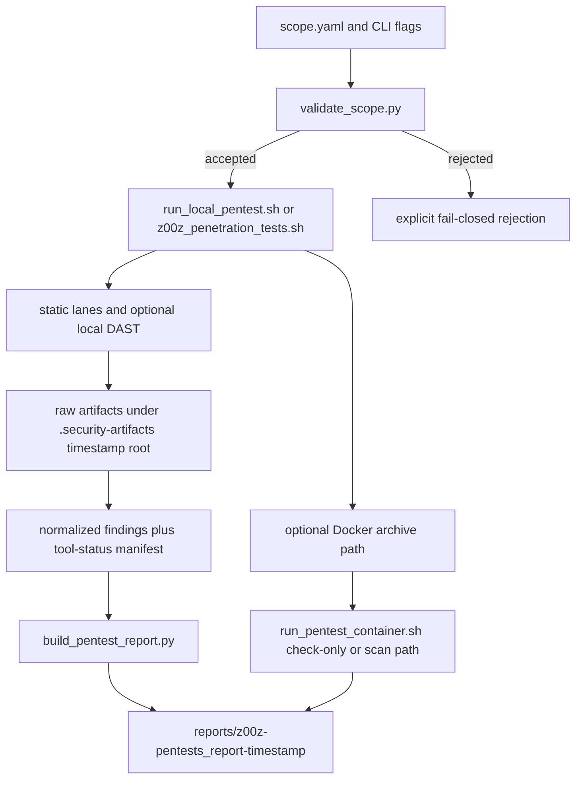

# Phase 066 Test Specification

**Phase:** `066`
**Phase Name:** `Local Pentest Orchestration`
**Status:** Live implementation and verification artifact
**Authority:** `066-TODO.md`, `066-CONTEXT.md`, `066-COVERAGE.md`, and `066-01-PLAN.md` through `066-14-PLAN.md`
**Purpose:** Define and track the unit, contract, integration, and end-to-end coverage that proves the live Phase 066 behavior.

## Purpose

Phase 066 now has a live implementation and executable test surface. This
specification remains the canonical coverage contract so another engineer or
agent can extend or audit the test suite without guessing:

- scenario boundaries;
- required fixtures and environment constraints;
- success and failure criteria;
- artifact and report anchors;
- which invariants must be preserved;
- which conditions must be rejected.

This document does not authorize any new logic, alternate skill roots, or
parallel workflow layers. Every test defined here must validate the live Phase
066 surfaces only.

## Workflow Status

- Operating mode: `implemented`
- Live Phase 066 implementation surfaces exist under `scripts/penetration/`,
  `tools/penetration/`, `.github/skills/pentest-*`,
  `.github/prompts/pentest-*`, and `tests/penetration/`.
- Validation snapshot recorded while refreshing this spec on `2026-07-03`:
  - `python3 -m unittest discover tests/penetration` passed (`64` tests)
  - `python3 -m pytest tests/penetration` is currently blocked in this
    workspace (`No module named pytest`)
  - `bash -n scripts/penetration/*.sh tools/penetration/docker/run_pentest_container.sh z00z_penetration_tests.sh pack_z00z_project.sh unpack_z00z_project.sh` passed
  - `python3 -m py_compile scripts/penetration/*.py tests/penetration/*.py` passed
  - `python3 scripts/penetration/validate_scope.py .security/scope.yaml` passed
  - `bash scripts/penetration/check_pentest_tools.sh --json --strict` passed
    (`present=13`, `missing=1`, `broken=1`, `missing_required=0`;
    all required tools are locally installed, `cargo-geiger` remains optional
    and missing, and the current `sg` payload is isolated as optional-broken)
  - `python3 scripts/penetration/validate_pentest_docker_scope.py tools/penetration/docker scripts/penetration` passed
  - `.codex/{skills,agents,prompts,hooks,instructions,requirements,scripts,plugins}`
    symlink checks passed
  - grep-based denied-tool and runtime guard audits returned only expected
    policy/reference hits
  - `./pack_z00z_project.sh --output /tmp/z00z-pentest-portable.tar.gz`
    passed
  - `./z00z_penetration_tests.sh --docker-sandbox --archive /tmp/z00z-pentest-portable.tar.gz --mode quick --static-only --check-only`
    passed
  - `tools/penetration/docker/run_pentest_container.sh --archive /tmp/z00z-pentest-portable.tar.gz --mode check-only`
    passed
- Live repository evidence used while refreshing this spec:
  - `.codex/*` symlink surfaces already exist and can be validated now
  - adjacent Z00Z crypto, HJMT, publication-binding, and doc-guardrail tests
    already exist and should be reused as invariant anchors rather than
    duplicated

## Classification

### TDD And Integration Targets

- `scripts/penetration/validate_scope.py`
  - live seam for scope parsing, localhost-only enforcement, denied-tool
    rejection, and pre-network fail-closed behavior
- `scripts/penetration/check_pentest_tools.sh`
  - live seam for truthful machine-readable tool status and canonical
    `tools/penetration/` rooting
- `scripts/penetration/build_pentest_report.py`
  - live seam for evidence mapping, report classification, and redaction
- `scripts/penetration/validate_artifacts.py`
  - live seam for artifact-tree contract enforcement
- `scripts/penetration/run_local_pentest.sh`
  - live seam for CLI orchestration, mode handling, timestamp alignment, and
    artifact/report creation
- `scripts/penetration/run_local_dast.sh`
  - live seam for bounded local DAST and skip-vs-fail semantics
- `tools/penetration/docker/run_pentest_container.sh`
  - live seam for archive-driven Docker check-only behavior and
    formal-verification exclusion
- `.github/skills/pentest-local-orchestrator/`
  - live seam for generic routing, quick/standard/deep mode behavior, and
    reference-only Strix knowledge reuse
- `.github/skills/z00z-pentest-profile/`
  - live seam for Z00Z-specific routing into existing audit surfaces without
    creating a second crypto layer
- `.github/prompts/pentest-*.prompt.md`
  - live seam for report doublecheck, parallel lane merge behavior, and
    no-MCP/no-runtime/no-direct-confirmation safety

### E2E Targets

- `./z00z_penetration_tests.sh`
  - canonical human and agent entrypoint for local and Docker pentest
    flows
- `./z00z_penetration_tests.sh --docker-sandbox --archive <tarball>`
  - supplied-archive Docker journey
- `./z00z_penetration_tests.sh --docker-sandbox`
  - auto-pack Docker journey
- artifact-root plus host-report-root proof path
  - evidence path from raw scanner data to normalized findings and
    human-facing report

### Skip Targets

- Browser or DOM E2E
  - Phase 066 defines no browser UI
- Existing formal-verification runners under `scripts/` and `tools/formal_verification/`
  - out of scope except as explicit negative guards
- Existing Rust crates outside the Phase 066 entrypoints
  - reuse only when they already prove a needed invariant such as HJMT
    fail-closed behavior, publication binding, or domain separation

## Existing Test Anchors To Reuse

- `crates/z00z_runtime/aggregators/tests/test_hjmt_consensus.rs`
  - already proves quorum freeze, divergent-root rejection, and
    generation-bound membership changes
- `crates/z00z_runtime/aggregators/tests/test_hjmt_route_rollout.rs`
  - already proves checkpoint acknowledgements, rollout activation guards, and
    fail-closed drift rejection
- `crates/z00z_runtime/aggregators/tests/test_publication_binding.rs`
  - already proves publication-binding digest stability and route/pub-in drift
    rejection
- `crates/z00z_rollup_node/tests/test_hjmt_topology.rs`
  - already proves topology loading, mixed-mapping rejection, and lineage
    consistency guards
- `crates/z00z_crypto/tests/test_domain_separation.rs`
  - already proves domain-separation boundaries and collision-resistance
    expectations for exact field binding
- `crates/z00z_core/tests/test_live_guardrails.rs`
  - already proves repo-wide doc/code guardrails and is the correct reuse point
    when Phase 066 documentation starts pinning live strings

## Scope Classification

Phase 066 does not define a browser UI. For this phase, end-to-end coverage is
CLI and filesystem oriented, not Playwright oriented.

### Unit And Contract Coverage

Use unit and contract tests when the behavior can be proven with direct inputs,
fixture files, and deterministic assertions:

- scope parsing and rejection rules;
- tool-root manifest and status reporting;
- report classification and artifact validation;
- prompt, profile, and documentation contract rules;
- Docker scope validation guards.

### Integration Coverage

Use integration tests when multiple Phase 066 surfaces must work together:

- local runner plus artifact tree plus host report output;
- DAST runner plus scope validator plus skip behavior;
- profile routing plus existing Z00Z skills plus prompt contracts;
- `.codex` symlink surfaces plus `.github` canonical paths;
- pack and Docker wrapper integration.

### End-To-End Coverage

Use end-to-end tests when the full user journey must be proven through the
canonical entrypoint or canonical phase commands:

- `./z00z_penetration_tests.sh` generic quick static-only run;
- `./z00z_penetration_tests.sh --docker-sandbox` supplied-archive run;
- `./z00z_penetration_tests.sh --docker-sandbox` auto-pack run;
- full artifact-to-report-to-doublecheck evidence path;
- Z00Z profile dry-run routing and proof-boundary escalation.

### Skip Classification

Skip browser-only or visual coverage. Phase 066 has no UI behavior that
requires screenshot or DOM assertions.

## Implemented Test Layout

The repository now has a top-level penetration test tree. The current live
layout is:

```text
tests/
  penetration/
    fixtures/
      scope/
      tool_status/
      scanner_outputs/
      reports/
      prompts/
      profile/
    test_scope_validation.py
    test_tool_manifest.py
    test_artifact_schema.py
    test_report_builder.py
    test_local_runner_integration.py
    test_dast_runner_integration.py
    test_codex_surface_integration.py
    test_profile_routing.py
    test_prompt_contracts.py
    test_packaging_portability.py
    test_docker_scope.py
    test_docs_contracts.py
```

If implementers choose different paths, they must preserve one canonical
top-level Phase 066 test surface and update this document plus
`066-TESTS-TASKS.md` together.

Docker coverage intentionally asserts live wrapper, Dockerfile, README, and
portable-archive behavior instead of introducing a placeholder
`tests/penetration/fixtures/docker/` subtree.

## Implemented Test Files

- `tests/penetration/test_scope_validation.py`
- `tests/penetration/test_tool_manifest.py`
- `tests/penetration/test_artifact_schema.py`
- `tests/penetration/test_report_builder.py`
- `tests/penetration/test_local_runner_integration.py`
- `tests/penetration/test_dast_runner_integration.py`
- `tests/penetration/test_codex_surface_integration.py`
- `tests/penetration/test_profile_routing.py`
- `tests/penetration/test_prompt_contracts.py`
- `tests/penetration/test_packaging_portability.py`
- `tests/penetration/test_docker_scope.py`
- `tests/penetration/test_docs_contracts.py`

## Test File Placement

| Scenario ID | Test File Path | Extend Or Create | Why This Is The Correct Home |
| --- | --- | --- | --- |
| `U-066-01` | `tests/penetration/test_scope_validation.py` | existing | Owns the `.security/scope.yaml` contract and should stay isolated from broader runner behavior |
| `U-066-02` | `tests/penetration/test_tool_manifest.py` | existing | Owns local tool-root, install-status, and provenance-manifest assertions |
| `U-066-03` | `tests/penetration/test_artifact_schema.py` | existing | Owns artifact-tree shape and validator contract independent from report semantics |
| `U-066-04` | `tests/penetration/test_report_builder.py` | existing | Owns finding classification, evidence binding, redaction, and doublecheck report sections |
| `E2E-066-01` | `tests/penetration/test_local_runner_integration.py` | existing | Correct seam for `run_local_pentest.sh` and sibling static runners |
| `E2E-066-02` / `E2E-066-03` | `tests/penetration/test_dast_runner_integration.py` | existing | Correct seam for DAST allowlist, skip, and bounded-command behavior |
| `E2E-066-05` | `tests/penetration/test_codex_surface_integration.py` | existing | Correct seam for `.codex` symlink compatibility and agent/prompt exposure |
| `U-066-05` / `E2E-066-11` | `tests/penetration/test_profile_routing.py` | existing | Correct seam for Z00Z lane routing, HJMT simulation requirements, and Tari read-only guards |
| `U-066-06` | `tests/penetration/test_prompt_contracts.py` | existing | Correct seam for prompt merge rules, no-MCP contracts, and local-artifact doublecheck expectations |
| `E2E-066-07` | `tests/penetration/test_packaging_portability.py` | existing | Correct seam for pack manifest, exclusions, and archive portability |
| `U-066-07` / `E2E-066-08..10` | `tests/penetration/test_docker_scope.py` | existing | Correct seam for Docker archive-only rules and formal-verification exclusions |
| `U-066-08` / `E2E-066-12` | `tests/penetration/test_docs_contracts.py` | existing | Correct seam for generic-vs-Z00Z docs split and migration instructions |

## State Transitions To Prove

### Execution State Transitions

1. Scope input transitions from `declared` to `validated` or `rejected`.
2. Tool availability transitions from `unknown` to `present`, `missing`, or
   `blocked`, never to silent success.
3. Run orchestration transitions from `initialized` to `static complete`,
   `DAST complete`, `DAST skipped`, or `failed with recorded artifacts`.
4. Report generation transitions from `raw scanner output` to `normalized
   evidence`, then to `confirmed`, `unconfirmed`, `false-positive`, or
   `skipped`.
5. Docker portability transitions from `live workspace` to `portable archive`
   to `extracted container workspace` to `host-exported report`.
6. Z00Z profile analysis transitions from `generic workflow` to explicit
   lane-routing requirements without mutating vendor code or requiring external
   transport.

### Proof Paths To Observe

The following paths are the security-critical proof paths for this phase:

- raw scanner artifact -> normalized artifact -> evidence mapping -> report
  classification -> doublecheck section;
- scope declaration -> scope validation -> allowed bounded command execution;
- tool installer intent -> local tool root -> manifest lock -> checker status
  artifact;
- pack operation -> symlink manifest preservation -> Docker check-only restore
  -> host report export;
- Z00Z finding classification -> correct specialist lane -> required proof,
  root, signature, commitment, or nullifier evidence request when relevant.

## Invariants To Preserve

### Security And Safety Invariants

- `INV-066-01`: No dynamic scan may run before `validate_scope.py` accepts the
  target set.
- `INV-066-02`: Public IPs, public DNS names, broad CIDRs, wildcard hosts, and
  denied tools must fail before any network call.
- `INV-066-03`: Forbidden tools may appear only in denylist, safety, or
  reference-only documentation, never in active execution commands.
- `INV-066-04`: Scanner output alone is never sufficient to produce a
  confirmed finding.
- `INV-066-05`: Every tool failure must be recorded as status or artifact
  evidence, not collapsed into an empty success result.

### Architecture And Anti-Drift Invariants

- `INV-066-06`: `tools/penetration/` is the only canonical root for new
  pentest tools, caches, wrappers, manifests, rules, templates, and upstream
  mirrors.
- `INV-066-07`: `.github/*` remains canonical and `.codex/*` remains a symlink
  compatibility surface only.
- `INV-066-08`: No Phase 066 test may require a second skill root, second
  prompt tree, duplicate `.codex` real directories, or a parallel report
  contract.
- `INV-066-09`: Historical `strix.md` must not be recreated as a second phase
  authority.

### Docker And Portability Invariants

- `INV-066-10`: Pentest Docker must never delegate to
  `unpack_z00z_project.sh --docker-sandbox`.
- `INV-066-11`: Pentest Docker must never install or execute formal
  verification tooling.
- `INV-066-12`: Docker check-only runs must use the portable archive as the
  source of truth, not a mutable host checkout mounted as the scan root.
- `INV-066-13`: Human-facing reports must end on the host under
  `reports/z00z-pentests_report-<timestamp>/`.
- `INV-066-14`: Container stdout and stderr must remain visible in the host
  terminal for the default workflow.

### Z00Z-Specific Invariants

- `INV-066-15`: `crates/z00z_crypto/tari/**` remains read-only and must never
  be touched by Phase 066 flows.
- `INV-066-16`: No new cryptographic primitive is introduced by Phase 066.
  Tests must instead prove that the profile routes cryptographic, proof, root,
  signature, nullifier, settlement, checkpoint, and secrecy findings to
  existing Z00Z audit skills.
- `INV-066-17`: Distributed HJMT and related state evidence is simulated using
  real project primitives where required by the plans, not by fake cryptography
  or placeholder proof claims.

## Mermaid Flow



## Clarifying Code Snippets

```yaml
# Minimal scope fixture shape for U-066-01 and E2E-066-02/E2E-066-03
mode: quick
allowed_paths:
  - .
excluded_paths:
  - target
allowed_hosts:
  - localhost
allowed_urls:
  - http://127.0.0.1:3000
forbidden:
  tools:
    - hydra
    - metasploit
rate_limits:
  requests_per_second: 2
evidence_required: true
```

```json
{
  "finding_id": "scanner-hypothesis-01",
  "classification": "unconfirmed",
  "evidence": {
    "artifact_path": "raw/semgrep/output.json",
    "reproduction": null,
    "proof_binding": null
  }
}
```

## Proposed Unit And Contract Suites

| Suite ID | Proposed File | Purpose | Key Assertions | Required Failure Cases |
| --- | --- | --- | --- | --- |
| `U-066-01` | `tests/penetration/test_scope_validation.py` | Prove `scope.yaml` schema and rejection logic | Required fields exist, including `mode`, `allowed_paths`, `excluded_paths`, `allowed_hosts`, `allowed_urls`, `forbidden`, `rate_limits`, and `evidence_required`; default hosts are loopback only; localhost URLs are accepted | Public URL, public IP, wildcard host, broad CIDR, denied tool, empty DAST scope |
| `U-066-02` | `tests/penetration/test_tool_manifest.py` | Prove tool-root contract and checker output | Tool root stays under `tools/penetration/`; JSON status is machine-readable; missing tools are recorded | Global cache paths, `tools/formal_verification/**`, silent success on missing tool |
| `U-066-03` | `tests/penetration/test_artifact_schema.py` | Prove artifact tree contract | Manifest, scope, tool status, `sast/`, `rust/`, `secrets/`, `dast/`, `raw/`, `normalized/`, `report/`, and `logs/` are represented | Missing manifest, missing report path, missing paired host report root |
| `U-066-04` | `tests/penetration/test_report_builder.py` | Prove report classification and evidence mapping | Confirmed findings require evidence; false-positive and skipped states are preserved; severity ordering is stable | Scanner-only finding marked confirmed; missing redaction; missing regression-test recommendation |
| `U-066-05` | `tests/penetration/test_profile_routing.py` | Prove Z00Z profile routing and invariants | Existing skills are referenced; Z00Z lanes are explicit; Tari vendor path is forbidden; HJMT simulation requirements are listed | Missing crypto/proof lane, missing attack-surface route, public recon route, vendor edit permission |
| `U-066-06` | `tests/penetration/test_prompt_contracts.py` | Prove prompt safety and merge semantics | No MCP, HexStrike server, Strix runtime, or `LLM_API_KEY` default path exists; parallel lanes wait and dedupe; `pentest-report-doublecheck` verifies findings against local artifacts before confirmation | Prompt confirms scanner hit directly; prompt routes to MCP or public targets |
| `U-066-07` | `tests/penetration/test_docker_scope.py` | Prove formal-verification exclusion and Docker path guards | Forbidden strings are absent from active Docker scripts; archive-only source path is enforced; direct live-checkout mode is rejected by default | `install-verification-tools`, `tools/formal_verification`, `full_verify.sh`, `verification-orchestrator`, direct live checkout mode |
| `U-066-08` | `tests/penetration/test_docs_contracts.py` | Prove docs and migration boundaries | Generic vs Z00Z-only files are distinguishable; required invocations and failure modes are present | Generic docs require Z00Z-only crates, profile, MCP, or Strix runtime |

## Input Fixtures And Preconditions

| Scenario ID | Inputs | Preconditions | Fixture Source |
| --- | --- | --- | --- |
| `U-066-01`, `E2E-066-02`, `E2E-066-03` | scope YAML variants, denied-tool list | `validate_scope.py` exists and is callable | `tests/penetration/fixtures/scope/` plus `.security/denied-tools.txt` |
| `U-066-02`, `E2E-066-01` | tool-status fixtures, manifest locks | tool checker and manifest paths exist | `tests/penetration/fixtures/tool_status/` plus `tools/penetration/manifests/` |
| `U-066-03`, `U-066-04`, `E2E-066-04` | artifact trees, scanner outputs, report fixtures | artifact validator and report builder exist | `tests/penetration/fixtures/scanner_outputs/` and `tests/penetration/fixtures/reports/` |
| `E2E-066-07`, `E2E-066-08`, `E2E-066-09`, `E2E-066-10` | portable tarball, Docker expectations, forbidden-string corpus | `pack_z00z_project.sh` and pentest Docker wrapper exist; Docker present or explicitly unavailable | live portable archive plus `tools/penetration/docker/{run_pentest_container.sh,Dockerfile,README.md}` |
| `U-066-05`, `U-066-06`, `E2E-066-05`, `E2E-066-11`, `E2E-066-12` | prompt fixtures, profile-routing expectations, merged finding samples | `.github/skills/pentest-*` and `.github/prompts/pentest-*` surfaces exist | `tests/penetration/fixtures/profile/` and `tests/penetration/fixtures/prompts/` |

## Expected Outputs And Produced Artifacts

| Scenario ID | Expected Output | Persisted Artifact | Observable Signal |
| --- | --- | --- | --- |
| `E2E-066-01` | static-only run reaches normal completion path | `.security-artifacts/<timestamp>/manifest.json`, `tool-status.json`, paired host report root | matching timestamp across artifact and report roots |
| `E2E-066-03` | DAST is skipped, not failed | `dast/skipped.json` | explicit skip reason and successful static-lane completion |
| `E2E-066-04` | report remains fail-closed | normalized finding set and human-facing report | confirmed findings always include evidence mapping |
| `E2E-066-07` | portable pack excludes heavy caches | packed tarball and optional pack manifest | absence of `tools/penetration/cache` unless future explicit flag exists |
| `E2E-066-08` / `E2E-066-09` | Docker path consumes archive and exports results | host-mounted `.security-artifacts/<timestamp>/` and `reports/z00z-pentests_report-<timestamp>/` | visible container output and host-side report copy-back |
| `E2E-066-11` | Z00Z dry-run routes proof-boundary findings correctly | lane-map or dry-run report input fixture | findings route to existing audit lanes without vendor mutation |

## Critical Integration And End-To-End Scenarios

### `E2E-066-01` Authorized Generic Quick Static Run

**Demonstrates**
The canonical local workflow can start from `./z00z_penetration_tests.sh` or
`scripts/penetration/run_local_pentest.sh`, run static-only in quick mode, and
produce machine and human artifacts even when some tools are unavailable.

**Anchors**
- `WS-01`
- `WS-02`
- `WS-04`
- `WS-06`
- `WS-07`

**Setup**
- Use a temporary workspace fixture with a valid localhost-only `.security/scope.yaml`.
- Omit at least one optional third-party tool to force a recorded missing-tool state.

**Assertions**
- Run exits through the normal artifact path, not a crash path.
- `.security-artifacts/<timestamp>/manifest.json` exists.
- `tool-status.json` records missing tools explicitly.
- `reports/z00z-pentests_report-<timestamp>/` exists for the same timestamp.
- No public network target is required for this path.

**Must fail if**
- Missing tools are interpreted as "no findings".
- The host report directory is not created.
- The timestamp differs between artifact root and report root.

### `E2E-066-02` Public Target Rejection Before Network Activity

**Demonstrates**
The workflow rejects unauthorized targets before any DAST or network-capable
command starts.

**Anchors**
- `WS-01`
- `WS-08`

**Setup**
- Provide fixture scopes containing `https://example.com`, `8.8.8.8`,
  `*.example.com`, and `0.0.0.0/0`.

**Assertions**
- `validate_scope.py` exits non-zero.
- The runner records rejection without invoking any network-capable tool.
- Error output names the offending target class.

**Must fail if**
- Any DAST command is launched.
- A broad or public target is normalized into an allowed target.

### `E2E-066-03` No-Target DAST Skip Path

**Demonstrates**
The workflow distinguishes "no allowed local target exists" from execution
failure and writes the documented skip artifact.

**Anchors**
- `WS-01`
- `WS-06`
- `WS-08`
- `WS-12`

**Setup**
- Use a valid scope file that has no local URLs or allowed hosts for DAST.

**Assertions**
- `dast/skipped.json` exists.
- The skip artifact states the reason.
- Static analysis stages may still complete.

**Must fail if**
- The overall run is marked failed solely because no DAST target exists.
- DAST silently disappears with no recorded reason.

### `E2E-066-04` Report Classification And Evidence Path

**Demonstrates**
The full evidence path from raw scanner output to report classification is
correct and fail-closed.

**Anchors**
- `WS-06`
- `WS-07`
- `WS-12`

**Setup**
- Fixture scanner outputs must include:
  - one finding with full supporting evidence;
  - one scanner-only hypothesis;
  - one explicit false positive;
  - one skipped scan reason.

**Assertions**
- Confirmed finding includes source file, artifact, reproduction or proof,
  confidence, and regression-test note.
- Scanner-only hypothesis remains unconfirmed.
- False positive remains explicitly labeled.
- The report includes a `doublecheck` section and paired host report path.

**Must fail if**
- A confirmed finding lacks evidence mapping.
- Secret material is exposed in the report body.

### `E2E-066-05` Codex Surface And Prompt Wiring

**Demonstrates**
`.github/*` remains canonical, `.codex/*` remains symlinked, and prompt or
agent dry-run flows are wired without direct tool execution claims.

**Anchors**
- `WS-04`
- `WS-09`
- `WS-13`

**Setup**
- Use the real repository symlinks and fixture prompts.

**Assertions**
- `.codex/skills`, `.codex/agents`, and `.codex/prompts` resolve to the
  canonical `.github/*` targets.
- `.codex/hooks`, `.codex/instructions`, `.codex/requirements`,
  `.codex/scripts`, and `.codex/plugins` remain symlink surfaces too.
- Required pentest agent files are present.
- Prompt dry-run shows generic and Z00Z entry examples and contains no MCP,
  HexStrike server, Strix runtime, or `LLM_API_KEY` default execution path.
- Agents describe bounded roles rather than direct execution guarantees.

**Must fail if**
- A duplicate real directory is created under `.codex`.
- A prompt or agent claims default direct tool execution.

### `E2E-066-06` Upstream Provenance Preservation

**Demonstrates**
Pinned upstream source material remains provenance-aware and reference-only
where required.

**Anchors**
- `WS-03`
- `WS-04`

**Setup**
- Use the lock files and reference folders specified by the plans.

**Assertions**
- Strix and HexStrike commit hashes are present in provenance locks.
- Literal `REFERENCE ONLY - DO NOT RUN` warnings exist for copied HexStrike
  execution references.
- License evidence is backed by the upstream `LICENSE` files and propagated
  into the provenance notes.
- The routing matrix preserves frameworks, protocols, technologies,
  vulnerabilities, and scan modes.

**Must fail if**
- Imported Strix skills appear as active `.github/skills` entries.
- License evidence is missing.

### `E2E-066-07` Portable Pack Excludes Heavy Caches

**Demonstrates**
Pack portability includes the right pentest surfaces and excludes heavyweight
generated caches by default.

**Anchors**
- `WS-02`
- `WS-10`

**Setup**
- Create a fixture workspace containing representative `tools/penetration`
  content, including cache-like directories.

**Assertions**
- The archive contains scripts, skills, prompts, agents, manifests, templates,
  and wrappers required by Phase 066.
- `tools/penetration/cache` and heavy generated DBs are absent unless an
  explicit future inclusion flag exists.
- Symlink manifest behavior is preserved.

**Must fail if**
- The portable archive depends on live mutable checkout state.
- Heavy cache content is included by default.

### `E2E-066-08` Docker Check-Only From Supplied Archive

**Demonstrates**
The pentest-only Docker path can run from a caller-supplied archive and verify
symlinks plus tool status without invoking formal verification.

**Anchors**
- `WS-10`
- `WS-11`

**Setup**
- Supply a tarball generated by `pack_z00z_project.sh`.
- Use Docker only if available; otherwise record an explicit environment block.

**Assertions**
- The container extracts the archive internally.
- The packed artifact is mounted read-only and used as the container source of
  truth.
- `.codex` symlink checks run inside the container path.
- `check_pentest_tools.sh` can run in check-only mode.
- Container output is visible in the invoking terminal.
- Reports export back to the host report directory.
- Results are written only to the configured `.security-artifacts/<timestamp>/`
  mount and paired host report mount.

**Must fail if**
- The container path runs `unpack_z00z_project.sh --docker-sandbox`.
- Formal-verification tooling is installed or executed.

### `E2E-066-09` Docker Auto-Pack Path

**Demonstrates**
The canonical Docker entrypoint can create a fresh portable archive when
`--archive` is not supplied.

**Anchors**
- `WS-10`
- `WS-11`

**Setup**
- Start from the live repository with the Phase 066 surfaces present.

**Assertions**
- A temporary packed artifact is created.
- The manifest records the packed artifact path.
- The run continues through the same pentest-only container path as the
  supplied-archive flow.

**Must fail if**
- The run falls back to a direct live-checkout container scan.
- The temporary archive is not recorded in artifacts.

### `E2E-066-10` Formal-Verification Path Rejection

**Demonstrates**
Pentest Docker and portability paths remain isolated from the formal
verification toolchain.

**Anchors**
- `WS-02`
- `WS-10`
- `WS-11`

**Setup**
- Run `validate_pentest_docker_scope.py` and grep-based guards against the
  Docker scripts and wrapper entrypoints.

**Assertions**
- Active script lines contain none of:
  `install-verification-tools`,
  `tools/formal_verification`,
  `z00z-full-verify-gate`,
  `verification-orchestrator`,
  `full_verify.sh`.

**Must fail if**
- Any active pentest path references the formal verification toolchain.

### `E2E-066-11` Z00Z Profile Dry Run And Proof-Boundary Routing

**Demonstrates**
The Z00Z profile remains a routing adapter that uses existing security skills
for proof, root, signature, commitment, nullifier, settlement, and secrecy
review without inventing a new crypto layer.

**Anchors**
- `WS-05`
- `WS-13`

**Setup**
- Use a documentation-only dry run plus fixture findings mentioning:
  - checkpoint or root inconsistency;
  - wallet secrecy issue;
  - nullifier or settlement concern;
  - validator or watcher evidence gap;
  - HJMT divergent roots or stale lineage.

**Assertions**
- Crypto or proof findings route to `z00z-crypto-auditor`.
- Attack-surface findings route to `attack-surfaces-create`.
- Closeout and convergence findings route through `gsd-audit-4` where the
  plans require a heavier audit pass.
- The dry-run lane map includes crypto/proof, wallet/keys, storage/checkpoints,
  rollup/DA, RPC/network, simulator/fixtures, and dependencies/supply-chain.
- The profile explicitly forbids `crates/z00z_crypto/tari/**` edits.
- HJMT simulation requirements are visible: replication, quorum, conflict
  resolution, standby catch-up, route rollout, dispatch, membership, restart,
  partition/heal, stale lineage, divergent roots, failure telemetry, wallet history,
  storage commits, publication bindings, validator/watcher checks,
  and per-component state.

**Must fail if**
- A proof-boundary finding is left in a generic lane with no specialist route.
- The profile implies new crypto generation or vendor-code mutation.

### `E2E-066-12` Migration Guide Walkthrough

**Demonstrates**
Another engineer can understand what is generic, what is Z00Z-only, and how to
reuse the system without dragging in forbidden runtime assumptions.

**Anchors**
- `WS-14`

**Setup**
- Read the generated docs as if onboarding a new repository.

**Assertions**
- Generic files and Z00Z-only files are clearly separated.
- Minimal Codex and GitHub Copilot invocation examples are present.
- Required `.codex` symlink surfaces for compatibility are documented.
- Failure modes cover missing tools, no local target, public target rejected,
  scanner false positive, and stale upstream reference.
- The guide explains how to replace `z00z-pentest-profile` with
  `project-pentest-profile`.

**Must fail if**
- Generic docs require Z00Z-only crates, Z00Z profile, MCP, Strix runtime, or
  HexStrike server.

## Realistic Examples To Implement

### Example A: Generic Quick Static Run With Missing Tools

**What it demonstrates**
The system is usable before every tool is installed and still records truthful
state.

**Minimum assertions**
- missing tools are recorded in `tool-status.json`;
- a report root is created;
- the run is not misclassified as "all clear".

### Example B: Public URL Rejection

**What it demonstrates**
Safety checks reject non-owned targets before network activity.

**Minimum assertions**
- exit code is non-zero;
- no DAST command is spawned;
- the rejection message identifies the invalid target class.

### Example C: Docker Check-Only From Packed Archive

**What it demonstrates**
Portable archive plus pentest-only Docker path works without touching formal
verification.

**Minimum assertions**
- Docker run consumes the tarball;
- symlink verification and tool checks execute;
- reports are exported to the host.

### Example D: Z00Z Profile Dry Run With Proof-Boundary Finding

**What it demonstrates**
The workflow routes a crypto or proof finding into the correct Z00Z lane and
demands real evidence rather than scanner-only claims.

**Minimum assertions**
- the lane map includes the required specialist lane;
- the dry run requests proof, root, signature, commitment, nullifier, or
  settlement evidence when relevant;
- no vendor code modification is permitted.

## Commands And Gating

The implementation of this spec must finish with these command classes, when
the underlying code exists:

```bash
bash -n scripts/penetration/*.sh
python3 -m py_compile scripts/penetration/*.py
python3 scripts/penetration/validate_scope.py .security/scope.yaml
bash scripts/penetration/check_pentest_tools.sh --json
test -L .codex/skills
test -L .codex/agents
test -L .codex/prompts
test -L .codex/hooks
test -L .codex/instructions
test -L .codex/requirements
test -L .codex/scripts
test -L .codex/plugins
rg -n "hydra|john|hashcat|medusa|patator|metasploit|msfvenom|pacu|responder|netexec|crackmapexec|commix|tplmap" scripts/penetration .github/skills/pentest-*/SKILL.md .github/prompts/pentest-*.prompt.md .security/denied-tools.txt
rg -n "MCP|HexStrike server|Strix runtime|LLM_API_KEY|hydra|john|hashcat|medusa|patator|metasploit|msfvenom|responder|netexec|crackmapexec|commix|tplmap" scripts/penetration .github/skills/pentest-*/SKILL.md .github/prompts/pentest-*.prompt.md .security
python3 -m pytest tests/penetration
python3 -m unittest discover tests/penetration
./pack_z00z_project.sh --output /tmp/z00z-pentest-portable.tar.gz
./z00z_penetration_tests.sh --docker-sandbox --archive /tmp/z00z-pentest-portable.tar.gz --mode quick --static-only --check-only
tools/penetration/docker/run_pentest_container.sh --archive /tmp/z00z-pentest-portable.tar.gz --mode check-only
python3 scripts/penetration/validate_pentest_docker_scope.py tools/penetration/docker scripts/penetration
```

Current host note: the Docker archive rows above were revalidated on
`2026-07-03`; `python3 -m pytest tests/penetration` remains environment-gated
until `pytest` is installed in this workspace.

The Z00Z integration commands from `066-TODO.md` remain separate from the
pentest Docker path and must not be invoked by the pentest Docker runner.

## Workstream Coverage Matrix

| Workstream | Primary Suites | Primary E2E | Proof Focus |
| --- | --- | --- | --- |
| `WS-01` | `U-066-01` | `E2E-066-01`, `E2E-066-02`, `E2E-066-03` | local-only scope, denied tools, pre-network rejection |
| `WS-02` | `U-066-02` | `E2E-066-01`, `E2E-066-07`, `E2E-066-10` | canonical `tools/penetration/` root, truthful tool status, no formal-verification bleed |
| `WS-03` | `U-066-02`, `U-066-08` | `E2E-066-06` | pinned provenance, reference-only warnings, license evidence |
| `WS-04` | `U-066-06`, `U-066-08` | `E2E-066-01`, `E2E-066-05`, `E2E-066-06` | generic skill family, routed references, no runtime drift |
| `WS-05` | `U-066-05` | `E2E-066-11` | Z00Z profile routing, invariants, no Tari mutation |
| `WS-06` | `U-066-03`, `U-066-04` | `E2E-066-01`, `E2E-066-03`, `E2E-066-04` | runner orchestration, exit preservation, artifact production |
| `WS-07` | `U-066-03`, `U-066-04` | `E2E-066-01`, `E2E-066-04` | artifact schema, report contract, fail-closed classification |
| `WS-08` | `U-066-01` | `E2E-066-02`, `E2E-066-03` | bounded DAST, skip semantics, forbidden dynamic tools |
| `WS-09` | `U-066-06`, `U-066-08` | `E2E-066-05` | `.github` canonical, `.codex` symlink compatibility, no duplicate trees |
| `WS-10` | `U-066-02`, `U-066-07` | `E2E-066-07`, `E2E-066-08`, `E2E-066-09`, `E2E-066-10` | pack portability, archive input, host export, pentest-only Docker entry |
| `WS-11` | `U-066-07` | `E2E-066-08`, `E2E-066-09`, `E2E-066-10` | Docker isolation, read-only archive path, no live checkout mode |
| `WS-12` | `U-066-01`, `U-066-02`, `U-066-03`, `U-066-04` | `E2E-066-03`, `E2E-066-04` | regression coverage, skip artifacts, redaction, rejection paths |
| `WS-13` | `U-066-04`, `U-066-05`, `U-066-06` | `E2E-066-05`, `E2E-066-11` | prompt routing, doublecheck behavior, Z00Z audit lanes |
| `WS-14` | `U-066-08` | `E2E-066-12` | docs separation, migration path, compatibility guidance |

## Exit Criteria For Test Implementation

The test implementation derived from this specification is complete only when:

- every invariant in this document is covered by at least one test or contract
  assertion;
- every `WS-01` through `WS-14` workstream has at least one direct test anchor;
- the critical end-to-end journeys above are executable or explicitly gated by
  an environment prerequisite such as missing Docker;
- failure paths are proven by rejection, skip artifact, or explicit non-zero
  result;
- the report classification path is fail-closed;
- the Z00Z profile routes proof-boundary findings to existing audit surfaces;
- no test introduces a second authority layer, parallel skill tree, or
  duplicated workflow logic.

## Open Gaps

- Repository-surface availability is no longer a blocker. The live Phase 066
  test packet exists under `scripts/penetration/`, `tools/penetration/`,
  `./z00z_penetration_tests.sh`, `.github/skills/pentest-*`,
  `.github/prompts/pentest-*.prompt.md`, and `tests/penetration/`.
- Current host-specific validation gap: `python3 -m pytest tests/penetration`
  remains blocked until the `pytest` module is installed in this workspace.
- If a future verification host lacks Docker, the Docker command-matrix rows
  must be recorded as explicitly environment-gated rather than treated as
  silently passing.
- Existing Rust crate tests should be reused for shared invariants, but they
  are not a substitute for the Phase 066 entrypoint and artifact-contract
  tests.
- Until the live seams exist, any generated executable tests would be
  placeholder coverage and would violate the no-fake-implementation rule.
