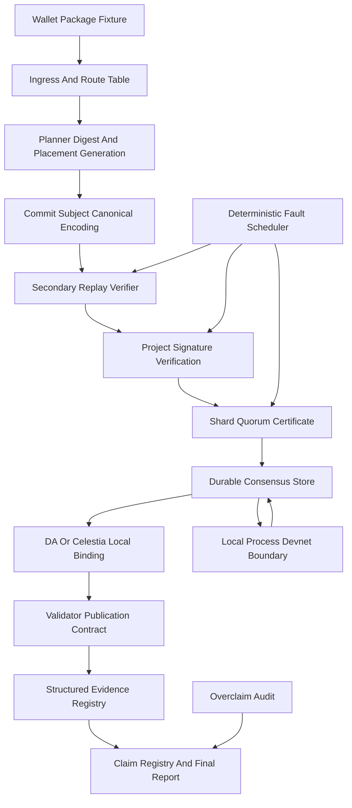

# Phase 067 Test Specification

This document defines the phase-local verification contract for Phase 067. It is derived from `067-TODO.md`, `067-verdict.md`, `067-CONTEXT.md`, `067-VERDICT-ITEM-AUDIT.md`, `067-01-PLAN.md` through `067-19-PLAN.md`, the locked Scenario 11 source row in `.planning/phases/090-New-Scenarios/90-TODO.md`, and the live boundary document `crates/z00z_runtime/aggregators/README.md`.

## 📌 Purpose

📌 This document defines the phase-local unit, integration, and end-to-end coverage required for Phase 067.

📌 It is directly usable by another engineer or agent without guessing scenario boundaries, invariants, failure paths, pass oracles, test homes, or proof artifacts.

## 🧾 Workflow Status

- Mode: `fallback-ready`.
- Completion artifacts are still missing for the `067-10` through `067-19` verdict expansion because those slices define implementation work that has not landed yet.
- Runtime Rust tests must be created slice by slice as each owning implementation plan lands; this document intentionally does not add non-compiling test files ahead of the required APIs.
- The source corpus is locked to `067-TODO.md`, `067-verdict.md`, `067-CONTEXT.md`, `067-VERDICT-ITEM-AUDIT.md`, `067-01-PLAN.md` through `067-19-PLAN.md`, `.planning/phases/090-New-Scenarios/90-TODO.md` section `15`, and `crates/z00z_runtime/aggregators/README.md`.
- A slice is not complete until its tests use the existing project owners for routing, placement, replay, certificates, DA or Celestia-local binding, validators, storage, crypto, evidence, and reporting.

## 🎯 Scope

- Prove the shard-local quorum-certificate workflow end to end with real project primitives.
- Treat the Phase 067 planning packet as normative. There are no `TASK-NNN` rows in this phase; the required verification slices are `PHASE-0` through `PHASE-8` plus `VERDICT-LCS-01` through `VERDICT-LCS-10`.
- Keep one implementation authority. Do not create a parallel consensus layer, duplicate DTO family, duplicate report writer, or alternate validator gate.
- Keep `scenario_11` independent from `scenario_1`, but follow the existing simulator test layout where it helps reuse repository patterns without reusing scenario logic.
- Allow simulation only for external transport, external DA transport, remote-process boundaries, and deterministic fault scheduling. Routing, placement, replay, certificate validation, publication binding, validator checks, lineage, and state paths must stay real.

## 📚 Attached Source Corpus

### ✅ Normative planning sources

- `.planning/phases/067-Sharded-Concensus/067-TODO.md`
- `.planning/phases/067-Sharded-Concensus/067-verdict.md`
- `.planning/phases/067-Sharded-Concensus/067-CONTEXT.md`
- `.planning/phases/067-Sharded-Concensus/067-01-PLAN.md`
- `.planning/phases/067-Sharded-Concensus/067-02-PLAN.md`
- `.planning/phases/067-Sharded-Concensus/067-03-PLAN.md`
- `.planning/phases/067-Sharded-Concensus/067-04-PLAN.md`
- `.planning/phases/067-Sharded-Concensus/067-05-PLAN.md`
- `.planning/phases/067-Sharded-Concensus/067-06-PLAN.md`
- `.planning/phases/067-Sharded-Concensus/067-07-PLAN.md`
- `.planning/phases/067-Sharded-Concensus/067-08-PLAN.md`
- `.planning/phases/067-Sharded-Concensus/067-09-PLAN.md`
- `.planning/phases/067-Sharded-Concensus/067-10-PLAN.md`
- `.planning/phases/067-Sharded-Concensus/067-11-PLAN.md`
- `.planning/phases/067-Sharded-Concensus/067-12-PLAN.md`
- `.planning/phases/067-Sharded-Concensus/067-13-PLAN.md`
- `.planning/phases/067-Sharded-Concensus/067-14-PLAN.md`
- `.planning/phases/067-Sharded-Concensus/067-15-PLAN.md`
- `.planning/phases/067-Sharded-Concensus/067-16-PLAN.md`
- `.planning/phases/067-Sharded-Concensus/067-17-PLAN.md`
- `.planning/phases/067-Sharded-Concensus/067-18-PLAN.md`
- `.planning/phases/067-Sharded-Concensus/067-19-PLAN.md`

### 🔒 Coverage and drift guards

- `.planning/phases/067-Sharded-Concensus/067-COVERAGE.md`
- `.planning/phases/067-Sharded-Concensus/067-SOURCE-AUDIT.md`
- `.planning/phases/067-Sharded-Concensus/067-PLAN-REVIEW.md`
- `.planning/phases/067-Sharded-Concensus/067-VERDICT-ITEM-AUDIT.md`

### 🔗 Required linked source rows

- `.planning/phases/090-New-Scenarios/90-TODO.md` section `15` (`scenario_11`)
- `crates/z00z_runtime/aggregators/README.md`

### ⚠️ Non-authoritative supporting material

- `.planning/phases/067-Sharded-Concensus/wiki -results.md`
- Legacy non-canonical aggregator-consensus references remain drift evidence only and must not be used as a replacement authority.

## 🧭 Coverage Contract

Phase 067 requires nineteen verification slices. The first nine map to
`PHASE-0` through `PHASE-8`; the verdict expansion maps to
`VERDICT-LCS-01` through `VERDICT-LCS-10`. Each slice maps one-to-one to a
required plan group and must stay traceable to its source packet.

| Test slice | Required group | Plan | Primary proof target | Required levels |
| --- | --- | --- | --- | --- |
| `TS-01` | `PHASE-0` | `067-01` | terminology and boundary cleanup | config tests, topology integration, grep audit |
| `TS-02` | `PHASE-1` | `067-02` | deterministic `CommitSubject`, `ShardVote`, and `ShardQuorumCertificate` | unit and artifact validation |
| `TS-03` | `PHASE-2` | `067-03` | `SecondaryReplayVerifier` fail-closed gating | unit and recovery integration |
| `TS-04` | `PHASE-3` | `067-04` | live local consensus emits a real certificate | integration and conflict safety |
| `TS-05` | `PHASE-4` | `067-05` | independent `scenario_11` package-to-validator flow | simulator E2E, routing, DA, validator |
| `TS-06` | `PHASE-5` | `067-06` | join, readiness, rotation, takeover, removal safety | runtime integration and simulator lifecycle E2E |
| `TS-07` | `PHASE-6` | `067-07` | certificate-aware DA and validator theorem binding | DA integration, validator contract, proof harness |
| `TS-08` | `PHASE-7` | `067-08` | signature, transport, equivocation, payload withholding | adapter tests and simulator conformance |
| `TS-09` | `PHASE-8` | `067-09` | simulated BFT and Celestia backend claims | committee rules, blob binding, degraded-mode E2E |
| `TS-10` | `VERDICT-LCS-01` | `067-10` | dependency and runnable aggregator readiness | cargo metadata, CLI, process command tests |
| `TS-11` | `VERDICT-LCS-02` | `067-11` | durable consensus evidence store | storage/restart integration and simulator evidence |
| `TS-12` | `VERDICT-LCS-03` | `067-12` | planner authority and failover claim boundary | planner drift tests and claim guard |
| `TS-13` | `VERDICT-LCS-04` | `067-13` | multi-process devnet harness | local process smoke and kill/restart tests |
| `TS-14` | `VERDICT-LCS-05` | `067-14` | network fault matrix and transport conformance | transport fault scheduler tests |
| `TS-15` | `VERDICT-LCS-06` | `067-15` | HotStuff-like local backend contract | view/leader/backend-QC tests |
| `TS-16` | `VERDICT-LCS-07` | `067-16` | Celestia-local artifact conformance | artifact API and negative binding tests |
| `TS-17` | `VERDICT-LCS-08` | `067-17` | structured evidence registry | evidence schema and emission tests |
| `TS-18` | `VERDICT-LCS-09` | `067-18` | glossary claim registry and report honesty | claim audit and report overclaim tests |
| `TS-19` | `VERDICT-LCS-10` | `067-19` | final local conformance simulation gate | integrated scenario, audit, devnet smoke, release tests |

No slice may close on compile-only evidence, docs-only evidence, or report-only artifacts.

## 🧭 Add-Tests Classification

This `/gsd-add-tests 067` pass is a planning-artifact pass. It must not add runtime tests before implementation exists, but it must classify every required test home so the implementation agent can create coverage without guessing.

| Classification | Slices | Required handling |
| --- | --- | --- |
| unit/state-machine | `TS-02`, `TS-03`, `TS-10`, `TS-11`, `TS-12`, `TS-15`, `TS-16`, `TS-17`, `TS-18` | create or extend Rust/Python tests that assert exact inputs, state transitions, reject codes, artifact schemas, and audit rows |
| integration | `TS-01`, `TS-04`, `TS-06`, `TS-07`, `TS-08`, `TS-09`, `TS-14` | exercise current route, placement, replay, QC, DA, validator, transport, recovery, and evidence owners together |
| end-to-end | `TS-05`, `TS-13`, `TS-19` | run `scenario_11`, process/devnet smoke, final claim audit, and release gates with real local artifacts |
| skip in this pass | none | every verdict item must be represented in this spec and in `067-TESTS-TASKS.md`; code generation is deferred only because Phase 067 implementation is still planned |

## 📍 Existing Test Anchors To Reuse

- `crates/z00z_runtime/aggregators/tests/test_commit_subject.rs` and `test_shard_quorum_certificate.rs`: existing home for canonical subject, vote, membership, and quorum-certificate assertions.
- `crates/z00z_runtime/aggregators/tests/test_secondary_replay_verifier.rs`: existing home for replay-before-vote acceptance and reject-code assertions.
- `crates/z00z_runtime/aggregators/tests/test_hjmt_dispatch.rs`, `test_hjmt_shard_routing.rs`, `test_hjmt_planner.rs`, and `test_hjmt_route_rollout.rs`: existing home for route, planner, dispatch, and rollout drift checks.
- `crates/z00z_runtime/aggregators/tests/test_hjmt_join.rs`, `test_recovery_failover.rs`, and `test_hjmt_failover_same_lineage.rs`: existing home for lifecycle, readiness, lineage, and takeover safety.
- `crates/z00z_runtime/aggregators/tests/test_publication_binding.rs` and `crates/z00z_runtime/validators/tests/test_hjmt_publication_contract.rs`: existing home for DA/publication/theorem/validator binding.
- `crates/z00z_rollup_node/tests/test_hjmt_topology.rs`, `test_hjmt_preflight.rs`, `test_da_local_sim.rs`, and `test_hjmt_process.rs`: existing home for topology, process command, preflight, and local DA tests.
- `crates/z00z_simulator/tests/test_scenario_11.rs` plus `crates/z00z_simulator/src/scenario_11/report.rs`: existing home for the phase-owned end-to-end harness and report assertions.

## 🆕 Proposed New Test Files

| Slice | File | Current workspace status | New seam it must prove |
| --- | --- | --- | --- |
| `TS-07` | `crates/z00z_rollup_node/tests/test_da_local_quorum_binding.rs` | present in current workspace | DA publication must bind a real QC, subject, and validator-facing theorem path |
| `TS-08` | `crates/z00z_runtime/aggregators/tests/test_signature_adapter.rs` | present in current workspace | project signature verification cannot be replaced by string equality or fixture labels |
| `TS-08` | `crates/z00z_runtime/aggregators/tests/test_transport_adapter.rs` | present in current workspace | transport envelopes cannot bypass replay and signature gates |
| `TS-08` | `crates/z00z_runtime/aggregators/tests/test_equivocation_evidence.rs` | present in current workspace | conflicting signed material produces structured equivocation evidence |
| `TS-09` | `crates/z00z_runtime/aggregators/tests/test_bft_committee_rules.rs` | missing | BFT mode rejects below `3f+1` membership and below `2f+1` quorum |
| `TS-09`/`TS-16` | `crates/z00z_rollup_node/tests/test_celestia_local_binding.rs` | missing | Celestia-local artifacts are complete, validator-facing, and fail closed on detached data |
| `TS-11` | `crates/z00z_runtime/aggregators/tests/test_consensus_store.rs` | missing | votes, QCs, anchors, indexes, and cursors are durable records, not logs or regenerated fixtures |
| `TS-11` | `crates/z00z_runtime/aggregators/tests/test_consensus_recovery_restart.rs` | missing | fresh runtime restart resumes exact stored consensus evidence or fails closed |
| `TS-12` | `crates/z00z_runtime/aggregators/tests/test_planner_authority.rs` | missing | every aggregator recomputes planner truth from canonical local inputs and rejects drift |
| `TS-13` | `crates/z00z_rollup_node/tests/test_hjmt_process_devnet.rs` | missing | multi-process local identities, ports, dirs, logs, kill, restart, and partition evidence are executable |
| `TS-14` | `crates/z00z_runtime/aggregators/tests/test_transport_fault_matrix.rs` | missing | deterministic delay, reorder, duplicate, replay, partition, heal, restart, and reconnect cannot manufacture votes |
| `TS-15` | `crates/z00z_runtime/aggregators/tests/test_hotstuff_local_backend.rs` | missing | HotStuff-like local backend has real view, leader, timeout, view-change, backend-QC, and validator-binding behavior |
| `TS-17` | `crates/z00z_runtime/aggregators/tests/test_structured_evidence_registry.rs` | missing | every safety failure emits structured digest-bound evidence and rejects malformed rows |
| `TS-18` | `scripts/audit/audit_067_claims.py` | missing | glossary/report claims are machine-auditable and unsupported live claims fail |

## 🎯 Required End-To-End Behaviors

| Behavior | Requirement | Primary path | Pass signal | Fail signal |
| --- | --- | --- | --- | --- |
| package-to-validator local conformance | one wallet package reaches one validator verdict through real local primitives | wallet package -> route -> planner -> subject -> replay -> signed votes -> QC -> DA/Celestia-local -> validator -> report | one package id and one subject digest across all artifacts | digest drift, detached QC, detached DA, or validator mismatch rejects |
| durable restart continuity | restart does not regenerate or lose consensus evidence | QC store -> recovery cursor -> publication binding -> validator | fresh runtime observes exact stored vote/QC/anchor digests | corrupt, partial, stale, or divergent store rejects before unsafe side effects |
| process/devnet realism | local process harness proves distinct identities and crash handling | rollup-node process command -> identity dirs -> kill/restart -> evidence | smoke run emits per-process evidence and legal resume rows | missing binary, duplicate port, stale data dir, or minority partition rejects |
| network fault safety | transport faults cannot create consensus truth | fault scheduler -> transport envelope -> replay -> signature -> vote counter -> evidence | every counted vote has replay and signature evidence | injected, replayed, duplicate, or stale envelope fails before quorum count |
| backend claim honesty | BFT/HotStuff-local/Celestia-local claims are executable local contracts | subject seam -> backend/local blob -> validator -> claim audit | simulated-full claims cite tests and artifacts | CFT-as-BFT, provider-name-only Celestia, or detached backend QC rejects |
| final report honesty | final report reflects only implemented and tested claims | scenario evidence -> evidence registry -> claim registry -> final conformance doc | every term has owner, artifact/API, positive test, negative test, and claim level | missing glossary row, string-only evidence, or bare production claim rejects |

## 🔗 Critical Integration Paths

1. package ingress -> route table -> planner digest -> placement generation -> commit subject;
2. primary subject -> secondary replay -> project signature verification -> vote counter -> shard-local QC;
3. QC -> durable consensus store -> restart recovery -> publication binding;
4. QC/publication/theorem bundle -> DA or Celestia-local artifact -> validator contract;
5. transport envelope -> fault scheduler -> replay/signature checks -> structured evidence;
6. membership generation -> join/readiness/rotation/removal/takeover -> next route rollout;
7. BFT/HotStuff-local profile -> threshold math -> backend QC -> validator binding;
8. scenario evidence -> claim registry -> final Local-Conformance-Simulation report.

## 🔐 Global Invariants

| Invariant | What must be observed | Proof surfaces |
| --- | --- | --- |
| `INV-01 terminology honesty` | active code, config, tests, and errors use `secondary`, not `standby` | `TS-01`, grep audit, topology/preflight tests |
| `INV-02 local CFT honesty` | the live path is shard-local deterministic CFT, not network BFT | `TS-01`, `TS-05`, `report_honesty.json` |
| `INV-03 canonical subject digest` | the same live subject always encodes to the same domain-separated digest | `TS-02`, `TS-03`, `TS-05` |
| `INV-04 drift sensitivity` | route, generation, root, lineage, proof, policy, publication, theorem, signer, planner, blob, or membership drift changes the digest or rejects | `TS-02`, `TS-03`, `TS-07`, `TS-08`, `TS-09`, `TS-12`, `TS-16`, `TS-19` |
| `INV-05 replay-before-vote` | no vote may be created without replaying the exact primary subject against local state | `TS-03`, `TS-05`, `TS-08` |
| `INV-06 local quorum only` | each shard forms its own `2-of-3` certificate; no global `5-of-5` quorum exists | `TS-04`, `TS-05`, `TS-06` |
| `INV-07 same-term conflict safety` | conflicting same-term subjects freeze or reject before dual commit | `TS-01`, `TS-04`, `TS-08` |
| `INV-08 membership and generation safety` | only active, ready, same-generation members may contribute to a certificate | `TS-02`, `TS-04`, `TS-06`, `TS-09`, `TS-14`, `TS-15`, `TS-19` |
| `INV-09 lineage and restart safety` | takeover and resume require matching lineage, generation, root, and exact certificate/publication state | `TS-06`, `TS-05`, `TS-11`, `TS-13`, `TS-19` |
| `INV-10 publication and validator alignment` | certificate, publication binding, theorem bundle, resolved batch, Celestia-local artifact, and validator verdict refer to one subject | `TS-05`, `TS-07`, `TS-09`, `TS-16`, `TS-19` |
| `INV-11 transport cannot bypass core checks` | local transport delivery cannot inject or count unreplayed votes | `TS-08`, `TS-14`, `TS-19` |
| `INV-12 overclaim rejection` | reports must not claim live BFT, Celestia finality, slashing, devnet, planner HA, HotStuff, or production signatures unless the proof slice explicitly covers that claim | `TS-05`, `TS-09`, `TS-12`, `TS-15`, `TS-16`, `TS-18`, `TS-19` |
| `INV-13 real cryptographic binding` | vote signatures, signer identities, membership digests, subject digests, and certificate digests are verified through project cryptographic primitives, not string equality | `TS-02`, `TS-08`, `TS-14`, `TS-15`, `TS-19` |
| `INV-14 durable proof recovery` | votes, QCs, DA or Celestia-local anchors, recovery cursors, and validator decisions reload from committed storage or fail closed | `TS-05`, `TS-06`, `TS-11`, `TS-13`, `TS-19` |
| `INV-15 artifact completeness` | Celestia-local and final conformance artifacts include namespace, blob bytes or digest, commitment, height, inclusion reference, retention state, unanchored/degraded state, and validator binding | `TS-09`, `TS-16`, `TS-19` |
| `INV-16 machine-auditable evidence` | safety failures emit structured digest-bound evidence records, never log-text-only proof | `TS-08`, `TS-14`, `TS-17`, `TS-18`, `TS-19` |

## 🔎 Assertion And Measurement Rules

- A positive end-to-end scenario passes only when the same subject digest is observed in package ingress, route/plan, placement membership, secondary replay, vote set, QC, DA or Celestia-local binding, validator verdict, evidence registry, and final report.
- A negative scenario passes only when the expected reject or degraded status is produced before the unsafe side effect. Examples: no vote before replay, no QC below quorum, no DA publication before QC, no validator accept for detached artifacts, and no live claim for unimplemented external infrastructure.
- Cryptographic assertions must verify canonical bytes and domain/version tags, signer identity, membership digest, subject digest, vote digest, and certificate digest. Mutating any bound field must change the digest or fail validation.
- BFT assertions must distinguish local CFT from BFT. `sim_5a7s` remains `2-of-3` CFT unless a BFT profile satisfies `n >= 3f + 1` and `quorum >= 2f + 1` through executable tests.
- Durability assertions must use a fresh runtime instance or process restart. Recreating votes, QCs, anchors, or validator decisions from fixtures after restart is a failure.
- Evidence assertions must inspect structured records and artifact references. A prose report, log line, string label, fixture name, or hard-coded digest is never proof.

## 🧩 Test File Placement

| Slice | Test file path | Extend or create | Why this is the correct home |
| --- | --- | --- | --- |
| `TS-01` | `crates/z00z_rollup_node/tests/test_hjmt_topology.rs`; `crates/z00z_rollup_node/tests/test_hjmt_preflight.rs` | extend | topology and preflight already own `sim_5a7s` config loading and reject gates |
| `TS-02` | `crates/z00z_runtime/aggregators/tests/test_commit_subject.rs`; `crates/z00z_runtime/aggregators/tests/test_shard_quorum_certificate.rs` | extend | aggregator tests already own subject and certificate primitives |
| `TS-03` | `crates/z00z_runtime/aggregators/tests/test_secondary_replay_verifier.rs`; `crates/z00z_runtime/aggregators/tests/test_recovery_failover.rs` | extend | replay and recovery gates must stay inside the aggregator owner |
| `TS-04` | `crates/z00z_runtime/aggregators/tests/test_hjmt_consensus.rs`; `crates/z00z_runtime/aggregators/tests/test_local_quorum_certificate.rs` | extend | live consensus and local certificate integration already belong to aggregators |
| `TS-05` | `crates/z00z_simulator/src/scenario_11/mod.rs`; `crates/z00z_simulator/tests/test_scenario_11.rs` | extend | `scenario_11` is the phase-owned end-to-end harness |
| `TS-06` | `crates/z00z_runtime/aggregators/tests/test_hjmt_join.rs`; `crates/z00z_runtime/aggregators/tests/test_hjmt_route_rollout.rs`; `crates/z00z_simulator/tests/test_scenario_11.rs` | extend | lifecycle safety spans placement, route rollout, recovery, and scenario evidence |
| `TS-07` | `crates/z00z_rollup_node/tests/test_da_local_quorum_binding.rs`; `crates/z00z_runtime/validators/tests/test_hjmt_publication_contract.rs` | create/extend | DA and validator tests own publication and theorem-binding contracts |
| `TS-08` | `crates/z00z_runtime/aggregators/tests/test_signature_adapter.rs`; `crates/z00z_runtime/aggregators/tests/test_transport_adapter.rs`; `crates/z00z_runtime/aggregators/tests/test_equivocation_evidence.rs` | create | signature, transport, and equivocation proofs must remain aggregator-owned |
| `TS-09` | `crates/z00z_runtime/aggregators/tests/test_bft_committee_rules.rs`; `crates/z00z_rollup_node/tests/test_celestia_local_binding.rs` | create | BFT math and Celestia-local artifact contracts are distinct executable seams |
| `TS-10` | `crates/z00z_rollup_node/tests/test_hjmt_process.rs` | extend | dependency and CLI readiness must resolve through the rollup-node process owner |
| `TS-11` | `crates/z00z_runtime/aggregators/tests/test_consensus_store.rs`; `crates/z00z_runtime/aggregators/tests/test_consensus_recovery_restart.rs` | create | durable evidence storage and restart recovery must stay in the aggregator storage owner |
| `TS-12` | `crates/z00z_runtime/aggregators/tests/test_planner_authority.rs`; `crates/z00z_runtime/aggregators/tests/test_hjmt_planner.rs`; `crates/z00z_runtime/aggregators/tests/test_hjmt_dispatch.rs` | create/extend | planner truth and dispatch gates already belong to the aggregator planner path |
| `TS-13` | `crates/z00z_rollup_node/tests/test_hjmt_process_devnet.rs`; `scripts/hjmt_local_devnet.sh` | create | multi-process realism must use the rollup-node command/process boundary |
| `TS-14` | `crates/z00z_runtime/aggregators/tests/test_transport_fault_matrix.rs`; `crates/z00z_runtime/aggregators/tests/test_transport_adapter.rs` | create/extend | deterministic network faults must exercise the transport envelope seam |
| `TS-15` | `crates/z00z_runtime/aggregators/tests/test_hotstuff_local_backend.rs`; `crates/z00z_runtime/aggregators/tests/test_bft_committee_rules.rs` | create/extend | HotStuff-like execution and BFT thresholds remain behind aggregator backend contracts |
| `TS-16` | `crates/z00z_rollup_node/tests/test_celestia_local_binding.rs`; `crates/z00z_rollup_node/tests/test_da_local_sim.rs`; `crates/z00z_runtime/validators/tests/test_hjmt_publication_contract.rs` | create/extend | Celestia-local artifacts must be validator-facing and DA-compatible |
| `TS-17` | `crates/z00z_runtime/aggregators/tests/test_structured_evidence_registry.rs`; `crates/z00z_runtime/aggregators/tests/test_equivocation_evidence.rs`; `crates/z00z_simulator/src/scenario_11/report.rs` | create/extend | safety evidence is emitted by aggregators and consumed by scenario reporting |
| `TS-18` | `scripts/audit/audit_067_claims.py`; `crates/z00z_simulator/tests/test_scenario_11.rs`; `.planning/phases/067-Sharded-Concensus/067-GLOSSARY-CLAIMS.md` | create/extend | claim honesty needs a machine-auditable registry plus scenario report guard |
| `TS-19` | `crates/z00z_simulator/tests/test_scenario_11.rs`; `.planning/phases/067-Sharded-Concensus/067-FINAL-CONFORMANCE.md` | extend/create | final closure must aggregate the scenario, claim audit, devnet smoke, and release gates |

## 🧪 Input Fixtures And Preconditions

| Slice | Inputs | Preconditions | Fixture source |
| --- | --- | --- | --- |
| `TS-01` | `sim_5a7s` topology, generated runtime homes, stale `standby` fixtures | topology parser and preflight errors are deterministic | `config/hjmt_runtime/sim_5a7s`; rollup-node test fixtures |
| `TS-02` | live route digest, placement generation, root, lineage, proof version, policy generation, member ids | canonical encoding and active membership are available through aggregator facade | aggregator subject and certificate fixtures |
| `TS-03` | primary subject plus local secondary route, plan, root, lineage, proof, policy, publication, theorem states | replay recomputes from local state before signing | secondary replay and recovery fixtures |
| `TS-04` | honest and conflicting local quorum inputs | same shard, same generation, same term, active members | local consensus fixtures |
| `TS-05` | wallet package, route plan, `sim_5a7s` shard ownership, DA and validator fixtures | `scenario_11` is independent from `scenario_1` | simulator scenario fixtures |
| `TS-06` | observer, join, readiness, rotation, takeover, removal, restart states | lifecycle events advance only at legal generation or checkpoint boundaries | aggregator lifecycle and scenario fixtures |
| `TS-07` | certificate, publication binding, theorem bundle, resolved batch, validator contract | validator can inspect certificate-aware publication artifacts | DA and validator fixtures |
| `TS-08` | signed votes, transport envelopes, duplicate/replay messages, missing payloads | replay result exists before any counted vote | signature, transport, and evidence fixtures |
| `TS-09` | BFT profile, local blob artifact, challenge window, degraded-mode config | BFT mode is separated from `2-of-3` local CFT | BFT committee and Celestia-local fixtures |
| `TS-10` | `Cargo.toml`, `Cargo.lock`, rollup-node CLI, `sim_5a7s` process manifest | cargo metadata and command parsing run locally | workspace manifests and rollup-node config fixtures |
| `TS-11` | votes, QC, anchors, indexes, cursors, corrupt and partial store rows | fresh runtime or process restart is available | aggregator storage and recovery fixtures |
| `TS-12` | planner config, route-table digest, placement generation, drift variants | all aggregators recompute planner truth locally | planner and dispatch fixtures |
| `TS-13` | five local identities, ports, data dirs, logs, kill/restart controls | process runner isolates identities and storage dirs | rollup-node process fixtures |
| `TS-14` | deterministic delay, reorder, drop, duplicate, replay, partition, heal schedules | transport adapter routes through replay and signature checks | transport fault fixtures |
| `TS-15` | BFT view, leader, proposal, timeout, view-change, backend QC | valid BFT profile satisfies `n >= 3f + 1` and quorum `>= 2f + 1` | HotStuff-local and BFT fixtures |
| `TS-16` | namespace, blob bytes or digest, commitment, height, inclusion reference, retention state | local artifact is DA-compatible and validator-facing | Celestia-local and DA fixtures |
| `TS-17` | equivocation, payload withholding, missing blob, wrong root, wrong route, stale member, split-brain events | evidence schema validates digest-bound records | evidence registry and scenario report fixtures |
| `TS-18` | glossary terms, claim rows, evidence refs, report claim levels | audit can fail malformed or overclaimed fixtures | claim registry and report fixtures |
| `TS-19` | full `scenario_11`, all predecessor artifacts, claim registry, devnet smoke outputs | every predecessor slice has landed or fails final closure | final conformance evidence bundle |

## 📤 Expected Outputs And Produced Artifacts

| Slice | Expected output | Persisted or emitted artifact | Observable pass signal |
| --- | --- | --- | --- |
| `TS-01` | active `secondary` vocabulary only | topology/preflight outputs and grep audit | stale `standby` keys reject and active grep hits are zero |
| `TS-02` | deterministic subject, vote, and certificate validation | subject digest, vote digest, QC digest | every drift axis changes digest or rejects |
| `TS-03` | replay accept/reject result before vote | replay verdict rows and reject codes | drift never creates a vote |
| `TS-04` | certificate-bound local commit decision | `ShardQuorumCertificate` reference in commit evidence | no conflicting same-term dual commit |
| `TS-05` | package-to-validator accepted or rejected outcome | `scenario_11/quorum/*.json` | one subject digest across ingress, QC, DA, validator, report |
| `TS-06` | lifecycle transition result | placement, lineage, readiness, restart telemetry | only active ready same-generation members vote |
| `TS-07` | validator verdict bound to certificate-aware publication | DA binding and validator contract artifacts | detached publication or theorem rejects |
| `TS-08` | transport/signature acceptance or evidence | envelope, signature, replay, equivocation rows | transport cannot inject or double-count votes |
| `TS-09` | BFT/Celestia-local simulated-full proof or degraded state | BFT rule rows and local blob binding artifacts | invalid thresholds or detached blobs reject |
| `TS-10` | executable dependency and process surface | cargo metadata output and CLI/process command evidence | missing targets or flags reject before live claim |
| `TS-11` | durable recovery or fail-closed rejection | consensus store records and restart evidence | fresh runtime loads exact QC or stops safely |
| `TS-12` | deterministic planner truth and honest claim boundary | planner digest, route digest, claim guard rows | drift rejects and bare planner HA claim fails |
| `TS-13` | local multi-process smoke evidence | process ids, ports, dirs, logs, restart rows | process kill/restart preserves exact legal evidence |
| `TS-14` | deterministic fault-matrix outcomes | fault rows with expected and observed statuses | every counted vote has replay and signature proof |
| `TS-15` | HotStuff-like local backend proof | view, leader, proposal, timeout, backend QC rows | detached or below-threshold backend QC rejects |
| `TS-16` | validator-facing Celestia-local artifact | namespace, blob, commitment, height, inclusion, retention rows | wrong namespace, commitment, or QC rejects |
| `TS-17` | structured digest-bound safety records | evidence registry rows and serialized scenario evidence | string-only or malformed evidence fails validation |
| `TS-18` | machine-auditable claim registry | `067-GLOSSARY-CLAIMS.md`, `067-CLAIM-AUDIT.md`, audit output | unsupported live claims fail before final report |
| `TS-19` | final Local-Conformance-Simulation proof bundle | `067-FINAL-CONFORMANCE.md` plus linked JSON artifacts | all blockers false and all command gates recorded |

## 🔒 Cryptographic And Security Invariants To Observe

| Invariant class | Why it matters | Assertion shape |
| --- | --- | --- |
| subject and artifact binding | prevents detached package, route, planner, QC, DA, theorem, validator, or report acceptance | mutate any bound field and require digest change or deterministic reject |
| replay-before-vote | prevents transport or primary trust from manufacturing votes | assert no signed or counted vote exists without accepted local replay evidence |
| signer and membership authenticity | prevents inactive, stale, duplicate, or wrong-role voters from forming certificates | verify real signature material, voter id, membership digest, role, generation, and threshold |
| durable recovery integrity | prevents restart from regenerating or accepting incomplete evidence | restart with a fresh runtime/process and compare stored digests, schema version, lineage, and cursor |
| local simulation honesty | prevents external backend, BFT, Celestia, slashing, finality, planner HA, or production transport overclaims | final claim registry must classify every claim as full, simulated-full, or live-claim-removed with executable evidence |
| structured evidence soundness | prevents log-text-only or report-string-only closure | validate evidence schema, artifact digests, signed conflict material, namespace or commitment refs, and reject malformed rows |

## 🗺️ Mermaid Flow



## 🧩 Clarifying Code Snippets

```rust
// Contract sketch only: replace names with the owning Phase 067 APIs.
let subject = build_commit_subject(route, plan, placement, root, lineage)?;
let replay = secondary.replay_subject(&subject, local_state)?;
assert!(replay.is_accepted());

let vote = signer.sign_vote(&subject, replay.proof())?;
let qc = ShardQuorumCertificate::try_from_votes(&placement, term, [vote_a, vote_b])?;
assert_eq!(subject.digest(), qc.subject_digest());
assert!(validator.verify_publication(&qc, &publication, &theorem).is_ok());
```

```rust
// Negative oracle shape: the unsafe side effect must be absent.
let rejected = secondary.replay_subject(&drifted_subject, local_state).unwrap_err();
assert_eq!(rejected.kind(), ReplayRejectKind::RouteDigestMismatch);
assert!(vote_store.votes_for(&drifted_subject.digest()).is_empty());
assert!(da_store.publications_for(&drifted_subject.digest()).is_empty());
```

## 🧪 Slice Contracts

### ✅ TS-01 Terminology And Boundary Cleanup

- Maps to `PHASE-0` and `067-01`.
- Demonstrates that the live seam uses one vocabulary and one honest boundary statement.
- Must extend current config and topology owners instead of introducing compatibility aliases.
- Positive proof:
  - `sim_5a7s` config reload succeeds with `secondary` fields only.
  - generated temporary homes derived from `sim_5a7s` also reload with renamed `secondary` fields only.
  - topology and preflight tests still derive the same shard ownership and generation invariants.
  - split-brain freeze behavior is unchanged after the breaking rename.
- Negative proof:
  - stale `standby` keys reject at parse time.
  - unknown, duplicate, or self-referential secondary ids reject.
  - any active code or config hit from `rg -n "standby|TakeoverStandby|standby_ids"` fails the slice.
- Success conditions:
  - no active alias survives;
  - targeted tests pass;
  - grep audit is clean;
  - docs and error strings describe local CFT only.

### ✅ TS-02 Commit Subject And Certificate Types

- Maps to `PHASE-1` and `067-02`.
- Demonstrates that quorum artifacts are real runtime-owned types with deterministic binary encodings and domain separation.
- Required mutation matrix:
  - route digest
  - placement generation
  - shard root
  - lineage
  - proof version
  - policy generation
  - active membership digest
  - term
  - voter identity and role
- Positive proof:
  - the same live subject re-encodes to the same digest.
  - a valid vote set from active members yields one certificate.
  - the certificate builder accepts only the active placement members for one shard in one generation.
- Negative proof:
  - duplicate voters reject;
  - inactive voters reject;
  - wrong role rejects;
  - mixed membership digests reject;
  - mixed terms reject;
  - below-quorum vote sets reject.
- Success conditions:
  - `CommitSubject`, `ShardVote`, and `ShardQuorumCertificate` are exported through the existing aggregator facade;
  - tests prove both digest stability and drift sensitivity;
  - certificate validation fails closed before any DA or validator step.

### ✅ TS-03 Secondary Replay Verifier

- Maps to `PHASE-2` and `067-03`.
- Demonstrates that secondaries recompute the primary subject from live inputs and refuse to vote on drifted local state.
- Critical integration path:
  - ingress -> planner -> placement -> recovery -> publication binding -> theorem digest -> replay verdict.
- Positive proof:
  - a ready secondary accepts the exact primary subject.
  - route, plan, root, lineage, proof, policy, publication binding, and theorem digest mutations are exercised independently.
- Negative proof:
  - wrong route;
  - wrong plan digest;
  - wrong root;
  - wrong lineage;
  - wrong proof version;
  - wrong policy generation;
  - wrong publication binding;
  - wrong theorem digest;
  - stale secondary recovery state.
- Success conditions:
  - every named drift axis blocks vote creation before signing;
  - reject outputs are stable enough for deterministic fault-matrix assertions;
  - later transport and simulator slices consume the replay result instead of bypassing it.

### ✅ TS-04 Local Quorum Certificate Integration

- Maps to `PHASE-3` and `067-04`.
- Demonstrates that the live shard-local commit path emits a real `ShardQuorumCertificate` rather than a wrapped majority result.
- Positive proof:
  - honest local quorum returns one certificate-bound commit decision;
  - the certificate path yields the same honest decision as the current local majority seam;
  - the membership digest in the certificate matches exactly one shard and one active generation.
- Negative proof:
  - duplicate, removed, joined-but-not-ready, mixed-membership, or mixed-term voters reject;
  - conflicting same-term subjects cannot both commit.
- Success conditions:
  - the live commit path exposes or references the certificate artifact;
  - same-term freeze remains intact;
  - no active commit path can bypass certificate validation.

### ✅ TS-05 Scenario 11 End To End Harness

- Maps to `PHASE-4` and `067-05`.
- Demonstrates the full local package-to-validator path in an independent `scenario_11`.
- Critical end-to-end behaviors that must be proven:
  - package ingress, routing, planning, replay, certificate formation, DA publication, and validator verdict all bind the same subject;
  - each shard forms its own `2-of-3` local quorum;
  - owner-path resolution remains correct when one aggregator owns two shards;
  - no global `5-of-5` quorum is counted anywhere.
- Positive proof:
  - one-shard happy path;
  - dual-primary owner path;
  - all-shard sweep across the full `sim_5a7s` topology;
  - one-secondary-offline honest `2-of-3` path;
  - post-quorum pre-DA resume from the exact certificate.
- Negative proof:
  - pre-quorum primary crash prevents certificate and DA publication;
  - stale secondary rejects;
  - wrong route, wrong dispatch owner, wrong planner digest, or wrong subject drift rejects;
  - report honesty rejects unsupported BFT, Celestia, slashing, production-signature, or public-finality claims.
- Success conditions:
  - `scenario_11` is independent from `scenario_1`;
  - JSON evidence proves end-to-end alignment;
  - honesty output prevents overclaim.

### ✅ TS-06 Join Removal And Rotation Simulation

- Maps to `PHASE-5` and `067-06`.
- Demonstrates safe lifecycle transitions under the same digest, generation, and lineage rules as steady-state quorum.
- Positive proof:
  - observer catch-up to ready-secondary voting state;
  - planned rotation at a checkpoint or generation boundary;
  - rolling secondary replacement keeps the same shard live once the replacement becomes ready;
  - emergency takeover after a primary crash with matching lineage and generation;
  - takeover on one shard preserves unrelated shard continuity and does not merge committees;
  - restart after crash resumes only the exact proven certificate/publication state;
  - partition-heal path recovers without conflicting certificates.
- Negative proof:
  - unready observer vote rejects;
  - removed member vote rejects;
  - mixed-generation certificate rejects;
  - mixed-lineage vote sets reject;
  - old primary commit after rotation rejects;
  - stale lineage, stale generation, or stale route-generation takeover rejects;
  - divergent-root takeover rejects;
  - detached-certificate resume rejects;
  - offline minority cannot synthesize a quorum.
- Success conditions:
  - readiness is proven before voting;
  - old primaries cannot keep committing after rotation;
  - same-shard continuity is proven across replacement or takeover with no route drift or double-commit;
  - unaffected shards keep progressing while another shard rotates or heals;
  - lifecycle telemetry is deterministic and scenario-owned.

### ✅ TS-07 Validator And Theorem Binding

- Maps to `PHASE-6` and `067-07`.
- Demonstrates that downstream acceptance requires the quorum artifact and not proposer trust alone.
- Critical integration path:
  - certificate-producing commit -> local DA publication -> local DA resolve -> theorem bundle -> validator checkpoint/engine/verdict.
- Positive proof:
  - publication carries a certificate digest or reference;
  - resolve preserves the same binding;
  - validator accepts only when certificate, theorem, publication binding, and ordered batch share one subject digest;
  - a proof or exhaustive small-state harness demonstrates local CFT agreement.
- Negative proof:
  - missing certificate rejects when the gate is enabled;
  - detached or mismatched certificate rejects at resolve or validator boundary;
  - detached publication binding rejects theorem validation;
  - stale certificate from inactive or mixed membership rejects.
- Success conditions:
  - current DTO families remain authoritative;
  - certificate-aware binding survives publish and resolve;
  - validator trust shifts to proof-bearing subject consistency.

### ✅ TS-08 Network And Signature Adapter

- Maps to `PHASE-7` and `067-08`.
- Demonstrates future transport seams without weakening local replay-first semantics.
- Positive proof:
  - local conformance runs with in-memory transport only;
  - signature validation accepts only the correct signer and digest bindings;
  - conflicting same-voter same-term different-subject votes emit deterministic equivocation evidence;
  - payload withholding emits deterministic evidence or degraded state.
- Negative proof:
  - a transport-delivered vote without replay verification rejects;
  - duplicate or replayed messages do not double count;
  - wrong signer, wrong membership digest, or wrong subject digest rejects;
  - missing payload cannot silently pass or create synthetic votes.
- Success conditions:
  - replay remains the only path to vote creation;
  - evidence is locally serializable and contains real conflicting vote material;
  - `scenario_11` stays green using only deterministic local adapters.

### ✅ TS-09 BFT And Celestia Backend

- Maps to `PHASE-8` and `067-09`.
- Demonstrates that all future BFT and Celestia claims are backed by local executable proof instead of naming.
- Positive proof:
  - local deterministic tests prove `3f+1` membership and `2f+1` quorum rules;
  - Celestia-compatible local blob resolution yields the same artifact contract as local DA;
  - validator acceptance remains independent of trusting the primary;
  - challenge-window, unanchored-height, payload-retention, and degraded-mode behavior are asserted by tests and evidence.
- Negative proof:
  - below-`3f+1` membership rejects BFT mode;
  - below-`2f+1` vote set rejects BFT certificate;
  - wrong blob commitment or wrong namespace rejects local Celestia resolution;
  - missing payload during challenge window rejects or enters degraded mode;
  - unanchored-height or settlement-delay limits enter degraded mode instead of overclaiming finality;
  - commit-certificate verification failure or state-root mismatch rejects;
  - detached certificate or detached blob binding rejects at the validator boundary.
- Success conditions:
  - no external network is required to prove the simulated backend contract;
  - the proven commit-subject interface remains the only backend seam;
  - report honesty remains truthful about what is simulated versus live.

### ✅ TS-10 Dependency And Runnable Aggregator Readiness

- Maps to `VERDICT-LCS-01` and `067-10`.
- Positive proof:
  - `cargo metadata` succeeds after direct dependency changes;
  - `cargo run --release -p z00z_rollup_node -- --help` resolves to a real target;
  - `sim_5a7s` manifest `start_cmd` and `restart_cmd` parse against real CLI flags.
- Negative proof:
  - missing cargo target rejects;
  - missing config args reject;
  - unexercised external backend crates cannot be reported as live.

### ✅ TS-11 Durable Consensus Evidence Store

- Maps to `VERDICT-LCS-02` and `067-11`.
- Positive proof:
  - votes, quorum certificates, anchors, indexes, and recovery cursors reload in a fresh runtime instance;
  - post-quorum pre-DA restart resumes the exact stored certificate into publication.
- Negative proof:
  - partial store, stale membership, divergent root, corrupt record, or missing vote material rejects before acceptance.

### ✅ TS-12 Planner Authority And Failover Claim Boundary

- Maps to `VERDICT-LCS-03` and `067-12`.
- Positive proof:
  - every aggregator recomputes the same plan from identical canonical inputs;
  - final reports mark planner truth as deterministic replicated config unless a real planner HA service is implemented.
- Negative proof:
  - planner config drift, stale route-table digest, mixed generation, or unqualified planner HA claim rejects.

### ✅ TS-13 Multi Process Devnet Harness

- Maps to `VERDICT-LCS-04` and `067-13`.
- Positive proof:
  - local OS process or Docker/local-task harness starts separate aggregator identities with separate ports, data dirs, and logs;
  - process kill/restart uses persisted consensus evidence.
- Negative proof:
  - duplicate port, missing binary, pre-quorum primary crash, partitioned minority, or stale data dir rejects.

### ✅ TS-14 Network Fault Matrix And Transport Conformance

- Maps to `VERDICT-LCS-05` and `067-14`.
- Positive proof:
  - delay, reorder, duplicate, drop, replay, partition, heal, restart, and reconnect are scheduled deterministically.
- Negative proof:
  - transport-injected vote, duplicate double-count, stale healed subject, and old membership replay reject.

### ✅ TS-15 HotStuff Like Local Backend Contract

- Maps to `VERDICT-LCS-06` and `067-15`.
- Positive proof:
  - local views, leaders, proposals, timeouts, view changes, backend QCs, and equivocation evidence execute behind the commit-subject seam.
- Negative proof:
  - `2-of-3` CFT profile, below-`3f+1` membership, below-`2f+1` quorum, wrong subject, stale membership, or backend QC without validator binding rejects.

### ✅ TS-16 Celestia Local Artifact Conformance

- Maps to `VERDICT-LCS-07` and `067-16`.
- Positive proof:
  - local adapter stores namespace, blob bytes, commitment, deterministic height, inclusion reference, retention, unanchored state, degraded mode, and resolve/retrieve/verify outputs.
- Negative proof:
  - wrong namespace, wrong commitment, missing payload, stale anchor, QC mismatch, unanchored-height limit, or validator-rejected blob rejects.

### ✅ TS-17 Structured Evidence Registry

- Maps to `VERDICT-LCS-08` and `067-17`.
- Positive proof:
  - equivocation, payload withholding, missing blob, wrong root, wrong route digest, stale member, and split-brain emit structured digest-bound records.
- Negative proof:
  - string-only evidence, missing artifact digest, missing signed/vote material, missing namespace/commitment, or missing membership generation rejects.

### ✅ TS-18 Glossary Claim Registry And Report Honesty

- Maps to `VERDICT-LCS-09` and `067-18`.
- Positive proof:
  - every term has code owner, artifact/API, positive test, negative test, and claim level.
- Negative proof:
  - bare `BFT`, `Celestia`, `devnet`, `HotStuff`, production signature, slashing, finality, or planner HA overclaim rejects.

### ✅ TS-19 Final Local Conformance Simulation Gate

- Maps to `VERDICT-LCS-10` and `067-19`.
- Positive proof:
  - final `scenario_11` run proves wallet package through validator verdict with durability, process/devnet, transport faults, BFT/HotStuff-local, Celestia-local, structured evidence, and claim registry.
- Negative proof:
  - every hard blocker from `067-verdict.md` rejects, including missing QC, detached QC, network-injected vote, below-threshold BFT, wrong Celestia-local artifact, stale planner/route, divergent restart root, report overclaim, and missing glossary row.

## 🧭 Critical User Journeys And Integration Paths

| Journey | End-to-end behavior to prove | Critical integration path | Success condition | Failure condition |
| --- | --- | --- | --- | --- |
| `CUJ-01 package-to-validator` | a wallet package becomes one validator verdict through the local conformance chain | package -> ingress -> route -> planner -> placement -> subject -> secondary replay -> signed votes -> QC -> DA/Celestia-local -> validator -> report | every artifact carries one package id and one subject digest; validator accepts exactly once | any digest, route, QC, DA binding, theorem, or validator mismatch rejects before final accept |
| `CUJ-02 lifecycle continuity` | observer catch-up, readiness, rotation, takeover, and removal preserve shard-local safety | placement -> membership generation -> replay -> vote -> QC -> recovery -> next route rollout | only active ready members from one generation contribute, old primaries stop, unaffected shards continue | unready, removed, stale-generation, stale-lineage, or divergent-root participants reject |
| `CUJ-03 crash and restart` | post-quorum pre-DA and post-DA states recover from durable evidence | QC store -> recovery cursor -> publication binding -> validator decision | a fresh runtime or restarted process loads the exact prior QC/anchor and continues | regenerated, missing, corrupt, partial, stale, or divergent persisted records fail closed |
| `CUJ-04 network fault safety` | delay, reorder, duplicate, drop, replay, partition, heal, restart, and reconnect cannot manufacture consensus truth | transport envelope -> replay verifier -> signature verifier -> vote counter -> evidence registry | delivered messages are counted only after replay and signature verification | injected vote, duplicate double count, stale envelope, minority partition, or healed stale subject rejects |
| `CUJ-05 local backend truthfulness` | BFT/HotStuff-like and Celestia-local are executable local contracts, not names | subject seam -> BFT profile or HotStuff-local -> local blob artifact -> validator/report claim registry | local simulated-full claims cite executable tests, artifacts, and evidence | CFT-as-BFT, provider-name-only Celestia, detached blob, or unqualified live backend claim rejects |
| `CUJ-06 final report honesty` | final report reflects only implemented and tested claims | scenario evidence -> structured evidence registry -> claim registry -> final conformance document | every claim has owner, artifact/API, positive test, negative test, and claim level | missing claim row, string-only evidence, or bare external production claim rejects |

## 🧮 Scenario Matrix

| Scenario ID | Type | Goal | Positive example | Negative example | Main assertions |
| --- | --- | --- | --- | --- | --- |
| `TS-10` | integration | dependency and process readiness | cargo metadata plus rollup-node help parse | missing target or config arg | executable command surface and honest dependency ownership |
| `TS-11` | integration | durable consensus evidence | post-quorum pre-DA restart resumes exact QC | corrupt, partial, stale, or divergent store | fresh runtime observes stored vote/QC/anchor digests |
| `TS-12` | unit/integration | planner authority | identical config recomputes identical plan digest | route/planner/generation drift | dispatch and vote creation are blocked before unsafe state change |
| `TS-13` | end-to-end | local process devnet | five distinct identities start and survive legal restart | duplicate port, stale data dir, minority partition | process evidence binds identity, port, dir, logs, QC, and anchor state |
| `TS-14` | integration | network fault conformance | deterministic delay/reorder/drop/duplicate matrix | injected vote, double count, stale replay | every counted vote has replay and signature proof |
| `TS-15` | unit/integration | HotStuff-like local backend | view/leader proposal binds subject and backend QC | CFT-as-BFT, below threshold, detached backend QC | BFT math, view-change evidence, and validator binding are enforced |
| `TS-16` | integration | Celestia-local artifact conformance | local blob resolves to validator-accepted artifact | wrong namespace, commitment, payload, QC, or stale anchor | artifact schema and validator-facing binding are complete |
| `TS-17` | unit/integration | structured evidence registry | safety failures emit digest-bound records | string-only or malformed evidence | evidence schema, artifact refs, and signed conflict material validate |
| `TS-18` | audit/integration | glossary and report honesty | every term has owner, artifact/API, tests, claim level | missing row, duplicate row, bare live claim | audit script and report guard reject unsupported claims |
| `TS-19` | end-to-end | final local conformance simulation | final `scenario_11`, claim audit, devnet smoke, release tests | any verdict blocker still true | all hard blockers false and evidence bundle complete |

## 📐 Verdict Expansion Detailed Matrix

| Slice | Behavior to prove | Example required | Negative required | Invariant/proof observed | Measurable pass/fail |
| --- | --- | --- | --- | --- | --- |
| `TS-10` | dependency graph and rollup-node command are executable | `cargo metadata`; `z00z_rollup_node --help`; manifest commands parse real flags | missing cargo target, missing config arg, unexercised external crate claim | dependency ownership and command reality | command exits success for valid input; invalid manifest commands reject before devnet claim |
| `TS-11` | consensus evidence is durable | restart after QC before DA resumes exact QC | partial store, corrupt store, missing vote, stale membership, divergent root | stored vote/QC/anchor digests and schema version | fresh runtime reads same digests; unsafe recovery stops before vote count or validator accept |
| `TS-12` | planner truth is deterministic replicated computation | all aggregators recompute identical plan digest from canonical config and route digest | planner config drift, stale route digest, mixed generation, bare planner HA claim | planner config digest, route-table digest, placement generation | matching inputs produce identical digest; any drift rejects before dispatch/vote |
| `TS-13` | process/devnet realism is executable locally | start five `sim_5a7s` identities with distinct ports, dirs, logs; kill/restart primary | duplicate port, missing binary, pre-quorum kill, minority partition, stale data dir | process identity, durable recovery, QC/DA continuity | smoke run emits per-process evidence; unsafe process states produce no QC/DA |
| `TS-14` | transport fault matrix preserves replay/signature boundary | deterministic delay/reorder/drop/duplicate/replay/partition/heal/reconnect run | network-injected vote, duplicate double count, stale healed subject, old membership replay | envelope id, replay result, signature result, vote counter, evidence id | every counted vote has replay+signature proof; fault rows match expected status |
| `TS-15` | HotStuff-like local backend is stateful and seam-bound | view/leader proposal binds real subject; timeout/view-change emits evidence | `2-of-3` CFT profile as BFT, below `3f+1`, below `2f+1`, stale membership, detached backend QC | BFT math, view number, leader, proposal digest, backend QC, validator binding | valid BFT profile commits through validator-bound QC; invalid profile or detached QC rejects |
| `TS-16` | Celestia-local artifact is complete and validator-facing | local blob stores namespace, bytes/digest, commitment, height, inclusion ref, retention, degraded/unanchored state | wrong namespace, wrong commitment, missing payload, stale anchor, QC mismatch, validator-rejected blob | blob commitment, namespace, local height, QC digest, resolve/retrieve/verify output | valid artifact resolves to validator-accepted binding; every detached/stale artifact rejects or degrades |
| `TS-17` | safety evidence is structured and digest-bound | equivocation, payload withholding, missing blob, wrong root, wrong route, stale member, split brain emit records | string-only evidence, missing digest ref, missing signed conflict material, missing namespace/commitment | evidence kind, evidence id, artifact digests, serialized schema | report consumes structured records; malformed evidence fails validation |
| `TS-18` | glossary/report claims are mechanically honest | all terms have owner, artifact/API, positive test, negative test, claim level | missing row, duplicate row, bare BFT/Celestia/devnet/HotStuff/planner HA/slashing/finality claim | claim registry, audit script, runtime evidence refs | audit passes complete registry; report guard rejects unsupported vocabulary |
| `TS-19` | final Local-Conformance-Simulation is integrated | final `scenario_11`, claim audit, devnet smoke, targeted release tests, full release tests | missing QC, detached QC, injected vote, below-threshold BFT, bad Celestia artifact, stale route/planner, divergent restart, overclaim, missing glossary row | full evidence bundle plus command log and artifact hashes | all hard blockers are false; no compile-only, docs-only, disconnected-unit, or placeholder closure remains |

## 🧷 Verdict Gate Traceability Appendix

Every strong acceptance gate from `067-verdict.md` must be directly testable. This appendix is the audit index used to reject any Phase 067 closure where a verdict gate is represented only by prose, a dependency import, or an unexercised scaffold.

| Verdict gate | Required proof from `067-verdict.md` | Test slice and task | Primary test homes | Required pass/fail oracle |
| --- | --- | --- | --- | --- |
| Gate 1 Glossary Traceability | every glossary term maps `term -> code owner -> artifact/API -> positive test -> negative test -> claim level` | `TS-18`/`TT-18`, final check in `TS-19`/`TT-19` | `scripts/audit/audit_067_claims.py`, `067-GLOSSARY-CLAIMS.md`, `crates/z00z_simulator/tests/test_scenario_11.rs` | complete registry passes; missing, duplicate, prose-only, or bare live claim rows fail deterministically |
| Gate 2 One Real End-To-End Path | wallet package flows through ingress, route, plan, primary exec, replay, votes, QC, DA/Celestia-local, resolve, and validator verdict | `TS-05`/`TT-05`, `TS-19`/`TT-19` | `crates/z00z_simulator/src/scenario_11/mod.rs`, `crates/z00z_simulator/tests/test_scenario_11.rs` | one package id and one subject digest appear across every artifact; detached or skipped boundary rejects |
| Gate 3 Validator Requires QC | validator rejects missing, detached, stale-membership, wrong-subject, wrong-publication, wrong-theorem, and trust-primary paths | `TS-07`/`TT-07`, `TS-16`/`TT-16`, `TS-19`/`TT-19` | `crates/z00z_runtime/validators/tests/test_hjmt_publication_contract.rs`, `crates/z00z_rollup_node/tests/test_da_local_quorum_binding.rs` | validator accepts only certificate-aware publication/theorem bundles and rejects every detached variant |
| Gate 4 Celestia-Local Is Artifact-Complete | local artifact exposes namespace, blob bytes, commitment, local height, inclusion ref, retention, unanchored, degraded, resolve, retrieve, and verify APIs | `TS-16`/`TT-16` | `crates/z00z_rollup_node/tests/test_celestia_local_binding.rs`, `crates/z00z_rollup_node/tests/test_da_local_sim.rs` | complete artifact validates through the validator path; provider-name-only or constant artifact fails |
| Gate 5 Celestia Negative Tests | wrong namespace, commitment, missing payload, stale anchor, QC mismatch, unanchored limit, and validator-rejected blob fail closed | `TS-16`/`TT-16`, final check in `TS-19`/`TT-19` | `crates/z00z_rollup_node/tests/test_celestia_local_binding.rs` | every malformed blob row returns expected reject or degraded status before validator accept |
| Gate 6 Network Simulation Is Not Vote Injection | transport models identity, signed envelope, delay, reorder, drop, duplicate, partition/heal, restart/reconnect, and replay protection without manufacturing votes | `TS-08`/`TT-08`, `TS-14`/`TT-14` | `crates/z00z_runtime/aggregators/tests/test_transport_adapter.rs`, `crates/z00z_runtime/aggregators/tests/test_transport_fault_matrix.rs` | counted votes always cite replay and signature evidence; injected, duplicated, stale, or partition-only votes fail |
| Gate 7 BFT Claims Need BFT Math | BFT mode enforces `n >= 3f + 1`, `quorum >= 2f + 1`, below-threshold rejection, and `2-of-3` remains CFT-only | `TS-09`/`TT-09`, `TS-15`/`TT-15` | `crates/z00z_runtime/aggregators/tests/test_bft_committee_rules.rs`, `crates/z00z_runtime/aggregators/tests/test_hotstuff_local_backend.rs` | valid BFT profile passes threshold tests; CFT-as-BFT and below-threshold profiles fail |
| Gate 8 HotStuff-Like Backend Behind The Seam | local backend has rounds, leaders, view changes, backend QCs, and cannot bypass subject, membership, replay, or validator gates | `TS-15`/`TT-15` | `crates/z00z_runtime/aggregators/tests/test_hotstuff_local_backend.rs` | backend QC binds to the real commit subject and validator path; detached backend QC fails |
| Gate 9 Production Signature Seam | deterministic simulator signature stays test-only while production-facing signer/verifier trait rejects wrong signer, subject, membership, replay, and equivocation | `TS-08`/`TT-08`, `TS-14`/`TT-14`, claim audit in `TS-18`/`TT-18` | `crates/z00z_runtime/aggregators/tests/test_signature_adapter.rs`, `crates/z00z_runtime/aggregators/tests/test_equivocation_evidence.rs` | project crypto verifies canonical vote bytes; string labels, fixture digests, and unqualified production-signature claims fail |
| Gate 10 Multi-Process Or Devnet Harness | local process/devnet evidence includes distinct identities, ports, dirs, shared planner authority, restart/kill/partition tests, and per-process logs/artifacts | `TS-13`/`TT-13` | `crates/z00z_rollup_node/tests/test_hjmt_process_devnet.rs`, `scripts/hjmt_local_devnet.sh` | smoke run emits process evidence; manifest-only or duplicate identity/port/data-dir setups fail |
| Gate 11 Planner HA Or Claim Removal | planner HA is either implemented and tested, or live claim is removed and planner truth is deterministic replicated local computation | `TS-12`/`TT-12`, `TS-18`/`TT-18` | `crates/z00z_runtime/aggregators/tests/test_planner_authority.rs`, `crates/z00z_runtime/aggregators/tests/test_hjmt_planner.rs` | matching inputs recompute the same plan; drift rejects before dispatch/vote; unsupported HA claim fails audit |
| Gate 12 Crash Recovery | votes, QC, publication state, DA/Celestia-local anchor, and validator decision recover or explicitly downgrade after restart | `TS-11`/`TT-11`, `TS-13`/`TT-13`, `TS-19`/`TT-19` | `crates/z00z_runtime/aggregators/tests/test_consensus_store.rs`, `crates/z00z_runtime/aggregators/tests/test_consensus_recovery_restart.rs` | fresh runtime resumes exact stored digests or fails closed; regenerated, partial, corrupt, stale, or divergent records fail |
| Gate 13 Membership Reconfiguration | observer, unready, removed, mixed-generation, and rotated members obey generation/checkpoint/lineage boundaries | `TS-06`/`TT-06`, `TS-12`/`TT-12`, final check in `TS-19`/`TT-19` | `crates/z00z_runtime/aggregators/tests/test_hjmt_join.rs`, `crates/z00z_runtime/aggregators/tests/test_hjmt_route_rollout.rs` | only active ready same-generation members vote; stale or removed participants cannot vote or take over |
| Gate 14 Structured Evidence Artifacts | equivocation, payload withholding, missing blob, wrong root, wrong route, stale member, and split brain emit structured records | `TS-17`/`TT-17`, supported by `TS-08`, `TS-14`, `TS-16` | `crates/z00z_runtime/aggregators/tests/test_structured_evidence_registry.rs`, `crates/z00z_simulator/src/scenario_11/report.rs` | evidence has kind, id, digest refs, schema, and artifact paths; log-string-only or malformed evidence fails |
| Gate 15 Report Honesty | final report marks every term as real implemented locally, simulated-full, not claimed, future external integration, or live-claim-removed | `TS-18`/`TT-18`, `TS-19`/`TT-19` | `067-GLOSSARY-CLAIMS.md`, `067-FINAL-CONFORMANCE.md`, `scenario_11/quorum/report_honesty.json` | unqualified BFT, Celestia, devnet, HotStuff, production signature, slashing, finality, or planner HA claims fail |
| Hard Blockers | QC optional, detached Celestia-local, injected votes, BFT-on-`2-of-3`, manifest-only process model, untested planner HA, or prose-only glossary must block closure | `TS-19`/`TT-19` | final `scenario_11`, claim audit, devnet smoke, targeted release tests, full release tests | every blocker has a negative scenario and expected reject/degraded status; any true blocker fails final conformance |

## 🌐 Scenario 11 E2E Matrix

`scenario_11` is the phase-local end-to-end proof harness. It must accumulate the following explicit scenarios.

| Scenario id | What it demonstrates | Required assertions | Required evidence |
| --- | --- | --- | --- |
| `E2E-01` | one-shard happy path | one package, one subject digest, one `2-of-3` certificate, one accepted validator verdict | all JSON artifacts except failure-only rows |
| `E2E-02` | dual-primary owner isolation | one aggregator owning two shards does not merge shard committees or quorum counts | `route_plan_report.json`, `placement_membership.json`, `quorum_certificate.json` |
| `E2E-03` | all-shard sweep | all seven shards derive owner, secondaries, route, and quorum through live logic | per-shard rows in route, membership, and validator evidence |
| `E2E-04` | primary crash before quorum | no certificate and no DA publication occur | `fault_matrix.json`, absence or reject state in certificate and DA artifacts |
| `E2E-05` | primary crash after quorum before DA | the exact existing certificate is resumed into publication; no recomputed or detached publication is allowed | `quorum_certificate.json`, `local_da_binding.json`, restart telemetry |
| `E2E-06` | one secondary offline | honest quorum still succeeds only if a real `2-of-3` remains; otherwise fail closed | vote set size, quorum count, fail-closed telemetry |
| `E2E-07` | one secondary stale | replay verifier rejects before vote creation | `secondary_replay_votes.json`, `fault_matrix.json` |
| `E2E-08` | route, plan, root, lineage, proof, policy, publication, and theorem drift matrix | each mutation changes the digest or produces a stable reject reason | `commit_subject.json`, `secondary_replay_votes.json`, `validator_verdict_report.json` |
| `E2E-09` | observer join, readiness, rotation, removal, and takeover | no unready or removed member contributes; old primary retires; takeover requires matching lineage and generation | `placement_membership.json`, `fault_matrix.json` |
| `E2E-09a` | rolling secondary replacement continuity | after readiness, the replacement secondary participates in the next shard commit without route drift or committee split | `placement_membership.json`, `quorum_certificate.json`, continuity rows in `fault_matrix.json` |
| `E2E-10` | restart, partition, heal, offline minority, divergent root | no conflicting certificate is synthesized; resume requires exact prior state | `fault_matrix.json`, lifecycle telemetry rows |
| `E2E-10a` | rolling primary takeover continuity | one shard may fail over to a lawful new primary while unrelated shards continue producing lawful certificates | per-shard lifecycle rows in `fault_matrix.json`, later shard certificates |
| `E2E-11` | equivocation and payload withholding | conflicting signed votes produce evidence; missing payload produces evidence or degraded state | evidence rows inside `fault_matrix.json` and adapter outputs |
| `E2E-12` | simulated BFT and Celestia degraded modes | `3f+1` and `2f+1` claims, challenge window, unanchored height, and blob mismatch behavior are locally proven | backend-specific rows in `fault_matrix.json` plus blob-binding artifacts |

## 📦 Evidence Artifact Contract

Every implementation must emit deterministic, repository-local JSON artifacts with enough structure to prove correctness and enough honesty fields to block overclaim.

| Artifact | Minimum required content | What it proves |
| --- | --- | --- |
| `scenario_11/quorum/package_ingress_report.json` | package id, package digest, ingress shard, owner, ingress timestamp or deterministic tick, route input summary | the package that entered the workflow is the same one routed downstream |
| `scenario_11/quorum/route_plan_report.json` | route digest, planner digest, shard owner, owner path, generation, dispatch decision | route and planner outputs used by replay and dispatch |
| `scenario_11/quorum/placement_membership.json` | shard id, primary id, secondaries, readiness state, membership digest, generation, lineage | the exact committee used by replay and certificate validation |
| `scenario_11/quorum/commit_subject.json` | canonical field list, domain/version bytes, subject digest, route digest, root, lineage, proof version, policy generation | the exact subject all later steps must share |
| `scenario_11/quorum/secondary_replay_votes.json` | per-voter replay verdict, reject code, signer id, vote digest, accept/reject reason | replay-before-vote and deterministic reject evidence |
| `scenario_11/quorum/quorum_certificate.json` | shard id, term, membership digest, quorum threshold, voter ids, vote digests, certificate digest | one real local certificate bound to one subject |
| `scenario_11/quorum/local_da_binding.json` | publication id, resolved batch id, certificate digest/reference, subject digest, theorem digest or binding reference | DA publication and resolution preserve the quorum artifact |
| `scenario_11/quorum/validator_verdict_report.json` | validator verdict, certificate digest, publication binding, theorem digest, ordered batch id, subject digest | validator acceptance or rejection is subject-consistent |
| `scenario_11/quorum/fault_matrix.json` | scenario id, fault id, expected status, observed status, reject code, evidence refs, degraded-mode flag when relevant | each required failure path was executed and matched expectation |
| `scenario_11/quorum/report_honesty.json` | explicit list of supported claims, explicit list of forbidden claims, simulated-vs-live markers | the report does not overclaim BFT, Celestia finality, slashing, or production transport guarantees |

## 🚫 Anti-Placeholder Gates

- No report-only closure. Every report field must be backed by live runtime, simulator, DA, or validator state.
- No alias closure. `secondary` adoption is incomplete if `standby` survives anywhere active.
- No doc-only terminology closure. A docs-only rename or a comment-only CFT/BFT wording update is insufficient.
- No compatibility-alias closure. Dual fields such as `standby_ids` plus `secondary_ids` are invalid.
- No synthetic quorum closure. A wrapper around the old majority result is not a certificate.
- No majority-proof closure. Keeping `ConsensusCommit` as the only proof object is insufficient.
- No fixture-byte closure. Replay must recompute the subject from live inputs.
- No hard-coded-digest closure. Constant, debug-string, JSON-order, fixture-name, zero, or precomputed expected digests are invalid proof.
- No voter-id-only closure. A certificate that wraps voter ids without canonical vote material is insufficient.
- No trust-primary closure. Downstream acceptance must bind certificate, publication, theorem, and ordered batch.
- No adapter-stub closure. Signature, transport, BFT, or Celestia slices require executable local proof, not traits alone.
- No transport-bypass closure. Network delivery may not inject votes before replay verification.
- No simulator-only lifecycle closure. Join, rotation, and takeover claims require runtime placement and recovery enforcement, not scenario-only assertions.
- No renamed-BFT closure. Renaming a `2-of-3` local quorum as BFT without `3f+1` and `2f+1` proof does not close the backend slice.
- No detached-backend closure. A Celestia-local resolver may not return constant or detached artifacts.
- No scenario drift closure. `scenario_11` must stay independent and phase-owned; it may not hide logic inside `scenario_1`.

## 🧰 Dependency Installation Test Matrix

Dependency installation for Phase 067 is test-gated. A crate import is not proof unless the owning slice exercises the API through the project seam that needs it.

| Dependency or tool | Owning plan gate | Test slice/task | Install decision | Required proof |
| --- | --- | --- | --- | --- |
| `redb` | `067-10`/`067-11` | `TS-10`/`TT-10`, `TS-11`/`TT-11` | prefer existing `z00z_storage`; add direct aggregator dependency only if consensus-store tables are exercised | cargo metadata plus durable vote/QC/anchor/index/cursor restart tests |
| `object_store` | `067-10`/`067-16` | `TS-10`/`TT-10`, `TS-16`/`TT-16` | add only to the DA-owning crate if Celestia-local retention/retrieve behavior uses it | blob store/retrieve/verify tests with namespace, commitment, payload, retention, and validator binding |
| `ed25519-dalek` | `067-10`/`067-08` | `TS-08`/`TT-08`, `TS-10`/`TT-10` | add only behind the project signer/verifier trait if existing `z00z_crypto` cannot satisfy the seam | wrong signer, wrong subject, wrong membership, replayed signature, and equivocation tests |
| `bytes` | `067-10`/`067-08`/`067-15`/`067-16` | `TS-08`, `TS-15`, `TS-16` | add only where transport envelopes, payload chunks, blob bodies, or backend proposal bytes are exercised | canonical byte roundtrip and mutation tests bind domain/version, subject, membership, and payload fields |
| `borsh` or project-owned canonical binary codec | `067-10`/`067-08`/`067-15` | `TS-08`, `TS-15` | add only if signed or hashed canonical bytes need stable non-JSON encoding | canonical encode is deterministic; field-order, trailing-byte, and domain-confusion mutations reject |
| `tracing`, `tracing-subscriber` | `067-10`/`067-13`/`067-14`/`067-17` | `TS-13`, `TS-14`, `TS-17` | add only where process, fault, or evidence runs emit asserted structured logs | per-process and per-fault logs include identity, run id, artifact refs, and no secret or string-only proof |
| `metrics`, `prometheus` | `067-10`/`067-09`/`067-13`/`067-14`/`067-17` | `TS-09`, `TS-13`, `TS-14`, `TS-17` | add only where local backend/devnet/fault/evidence metrics are emitted and asserted | metric names and labels match local claim level and reject missing or false success counters |
| `proptest` | `067-10`/`067-15`/`067-16` | `TS-10`, `TS-15`, `TS-16` | dev-dependency for threshold, invalid certificate, invalid blob, and restart properties | generated cases cover quorum intersection, below-threshold rejection, blob mutation, and restart drift |
| `hotstuff_rs` | blocked until `067-15` local backend contract passes | `TS-15` | do not install or claim live unless exercised behind the existing subject/replay/validator seams | adapter tests prove real subject binding, view-change behavior, backend QC, and validator rejection of detached QC |
| `libp2p` | blocked until `067-14` transport contract passes | `TS-14` | do not install for Phase 067 local proof unless semantic transport tests already pass | authenticated peer/envelope tests cannot bypass replay or signature gates |
| `celestia-client`, `celestia-rpc`, `celestia-types` | blocked until `067-16` local artifact contract passes | `TS-16` | do not install or claim live Celestia behavior until the local adapter contract is executable | local artifact tests prove namespace, blob, commitment, height, inclusion ref, retrieval, verification, and validator binding |
| `reed-solomon-erasure` or `reed-solomon-simd` | optional after `067-16` artifact contract exists | `TS-16` | add only if Phase 067 implements chunk recovery/erasure coding behavior | chunk recovery tests recompute commitment/root and reject insufficient or mismatched chunks |
| `openraft` | blocked for independent public aggregator consensus | `TS-12`, `TS-18` | allowed only for a trusted internal operator cluster, never as a replacement for shard-local public consensus | claim audit rejects public-BFT/openraft substitution; planner authority tests define the trusted boundary |

## 🧰 Canonical Commands

- `./.github/skills/smart-tests-bootstrap/scripts/bootstrap_tests.sh`
- `cargo metadata --format-version 1`
- `cargo run --release -p z00z_rollup_node -- --help`
- `cargo test --release -p z00z_aggregators --features test-params-fast --test test_commit_subject -- --nocapture`
- `cargo test --release -p z00z_aggregators --features test-params-fast --test test_shard_quorum_certificate -- --nocapture`
- `cargo test --release -p z00z_aggregators --features test-params-fast --test test_secondary_replay_verifier -- --nocapture`
- `cargo test --release -p z00z_aggregators --features test-params-fast --test test_transport_fault_matrix -- --nocapture`
- `cargo test --release -p z00z_rollup_node --features test-params-fast --test test_celestia_local_binding -- --nocapture`
- `cargo test --release -p z00z_rollup_node --features test-params-fast --test test_hjmt_process_devnet -- --nocapture`
- `cargo test --release -p z00z_simulator --features test-params-fast --features wallet_debug_tools --test scenario_11 -- --nocapture`
- `python3 scripts/audit/audit_067_claims.py`
- `bash scripts/hjmt_local_devnet.sh --profile sim_5a7s --smoke --timeout 30`
- `cargo test --release`

## 🚩 Open Gaps

- `TS-07` and `TS-08` have proposed test homes present in the current workspace, but they still require implementation-time validation against their owning code paths before closure.
- `TS-09` through `TS-18` still require missing runtime test homes or audit scripts listed in `Proposed New Test Files`.
- `TS-19` cannot close until every predecessor slice has executable positive tests, executable negative tests, evidence artifacts, and anti-placeholder proof.
- This spec remains `fallback-ready`; it is not a claim that Phase 067 implementation or final local conformance has passed.

## ✅ Exit Criteria

Phase 067 test coverage is ready for implementation only when all of the following are true:

- every `TS-01` through `TS-19` slice has explicit test homes, commands, positive cases, negative cases, and pass conditions;
- every required `scenario_11` artifact has a schema contract and a proof purpose;
- every crypto- and state-binding invariant has at least one positive proof path and one fail-closed path;
- every future-facing claim is marked simulated until backed by local executable evidence;
- the packet does not introduce a second authority or a parallel code path.

## 📎 Coverage Appendix

| Slice | Plan | Primary sources | Core artifacts | Core commands | Expected result |
| --- | --- | --- | --- | --- | --- |
| `TS-01` | `067-01` | TODO, CONTEXT, `90-TODO.md`, plan 01 | runtime/config rename, topology tests | topology, preflight, quorum freeze, grep audit, `cargo test --release` | one active `secondary` vocabulary and honest CFT wording |
| `TS-02` | `067-02` | TODO, CONTEXT, `90-TODO.md`, plan 02 | `commit_subject`, `shard_vote`, `shard_quorum_certificate` tests | commit subject and certificate tests | deterministic digest and fail-closed certificate validation |
| `TS-03` | `067-03` | TODO, CONTEXT, `90-TODO.md`, plan 03 | `secondary_replay` test seam | replay, dist journal, recovery failover tests | replay-backed voting and stable reject reasons |
| `TS-04` | `067-04` | TODO, CONTEXT, `90-TODO.md`, plan 04 | consensus adapter and certificate tests | consensus, failover same lineage, local certificate tests | live commit path emits real quorum proof |
| `TS-05` | `067-05` | TODO, CONTEXT, `90-TODO.md` section 15, plan 05 | `scenario_11` plus JSON evidence | simulator, dispatch, routing, DA, topology, validator tests | independent package-to-validator local proof path |
| `TS-06` | `067-06` | TODO, CONTEXT, `90-TODO.md`, plan 06 | join/failover/rotation tests and lifecycle evidence | join, failover, route-rollout, `scenario_11` | safe lifecycle changes with no stale or mixed certificate |
| `TS-07` | `067-07` | TODO, CONTEXT, `90-TODO.md`, plan 07 | DA binding, theorem guard, validator contract tests | DA local sim, DA quorum binding, theorem guard, publication binding, validator contract | validator requires certificate-aware subject binding |
| `TS-08` | `067-08` | TODO, CONTEXT, `90-TODO.md`, plan 08 | signature, transport, equivocation evidence tests | adapter tests and `scenario_11` | transport hooks preserve replay-first semantics |
| `TS-09` | `067-09` | TODO, CONTEXT, `90-TODO.md`, plan 09, aggregator README | BFT committee rules, Celestia-local binding, degraded-mode evidence | BFT, Celestia, topology, validator, `scenario_11` | future backend claims are backed by local proof |
| `TS-10` | `067-10` | verdict, TODO, plan 10, rollup-node process anchors | Cargo graph, runnable binary, process command tests | cargo metadata, CLI help, process/topology tests | dependencies and process commands are executable and honest |
| `TS-11` | `067-11` | verdict, TODO, plan 11, recovery/storage anchors | consensus store and restart tests | store, recovery, failover, `scenario_11` | restart recovery is durable or fail-closed |
| `TS-12` | `067-12` | verdict, TODO, plan 12, planner anchors | planner authority and claim guard tests | planner, dispatch, `scenario_11` | planner HA overclaim is removed unless real HA is tested |
| `TS-13` | `067-13` | verdict, TODO, plan 13, process manifest | local devnet runner and process evidence | process-devnet tests, smoke script, `scenario_11` | process/devnet realism is local simulated-full |
| `TS-14` | `067-14` | verdict, TODO, plan 14, transport anchors | fault scheduler and evidence | transport fault, adapter, equivocation, `scenario_11` | network simulation cannot inject votes |
| `TS-15` | `067-15` | verdict, TODO, plan 15, BFT anchors | HotStuff-local backend and view-change evidence | HotStuff-local, BFT rules, transport, `scenario_11` | HotStuff-like claim is executable and seam-bound |
| `TS-16` | `067-16` | verdict, TODO, plan 16, DA/validator anchors | Celestia-local adapter and artifact schema | Celestia binding, DA, validator, `scenario_11` | Celestia-local is artifact-complete simulated-full |
| `TS-17` | `067-17` | verdict, TODO, plan 17, evidence/report anchors | evidence registry and scenario JSON | evidence registry, equivocation, Celestia, `scenario_11` | safety evidence is structured and digest-bound |
| `TS-18` | `067-18` | verdict, all plans, report anchors | claim registry and audit script | claim audit, report tests, `scenario_11` | every glossary term has enforced claim state |
| `TS-19` | `067-19` | verdict, TODO, all plans, scenario anchors | final conformance doc and evidence bundle | `scenario_11`, claim audit, devnet smoke, release tests | integrated local conformance closes all blockers |
