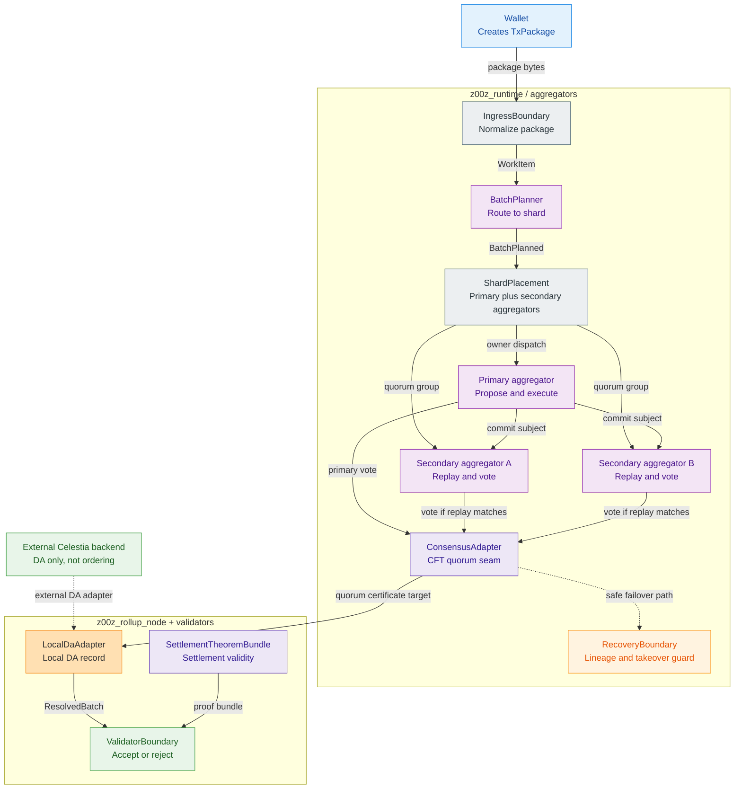
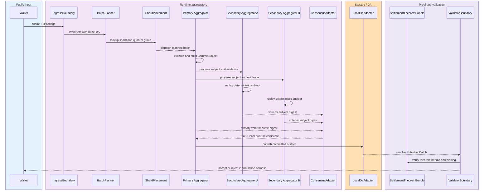
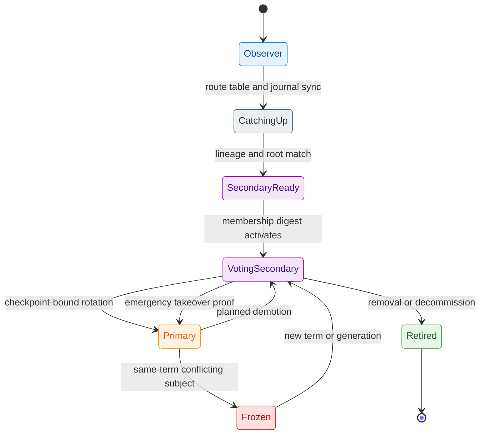

# Aggregator Consensus Spec

[TOC]


Status: architecture spec and implementation contract  
Date: 2026-07-02  
Scope: local codebase only  
Canonical artifact: this spec supersedes prior working notes  
Ground truth: source code, tests, and local configuration in this repository

## 1. Glossary

Reader: an internal engineer implementing or reviewing the aggregator consensus
roadmap. Post-read action: use the terms below consistently in code, tests,
plans, and review notes.

| Term | Meaning in this document |
| --- | --- |
| Active member | Aggregator id that belongs to the shard committee for the current placement generation and can count toward quorum. |
| Aggregator | Runtime component that receives work, plans shard-local batches, participates in shard quorum, and publishes local artifacts. It is distinct from downstream runtime validators and watchers. |
| Anti-equivocation evidence | Required evidence that proves one voter signed conflicting subjects for the same shard, term, and membership. The local harness can model this deterministically before network transport exists. |
| Availability certificate | Quorum proof that payload bytes or chunks are available before a header is ordered. The local phase SHOULD model this as a digest-bound certificate even without external DA. |
| Batch | Ordered unit of shard-local work produced by planning and later bound into publication and validation. |
| `BatchPayload` | Canonical byte payload whose digest is referenced by a shard batch header or local `CommitSubject`. |
| BFT | Byzantine fault tolerance. Networked BFT is external-backend scope, not the current live consensus model; BFT-shaped local invariants may still be modeled in simulator tests. |
| CFT | Crash fault tolerance. The current live seam is local deterministic CFT quorum, not BFT. |
| Celestia | External data-availability backend blocked until adapter/devnet work exists. It should publish bytes and commitments, not decide ordering or execution correctness. |
| Commit certificate | Networked BFT backend certificate over a committed shard header. In the immediate local model, use `ShardQuorumCertificate`. |
| `CommitSubject` | Canonical local object that every vote binds: route, placement, term, plan, roots, lineage, proof, publication, and theorem inputs. |
| Consensus adapter | Current local commit seam that enforces active membership, quorum count, term checks, and split-brain protection. |
| DA | Data availability. The layer that makes committed bytes retrievable. |
| DA adapter | Interface used by rollup-node code to publish and resolve local or external DA records. |
| DA-before-ordering | Required safety rule: payload availability must be proven or locally modeled before consensus orders the header. |
| Deterministic simulator signature | Local test signature surrogate derived deterministically from vote inputs; not a production cryptographic signature. |
| Epoch | Membership and leader-schedule boundary for networked consensus. Current local code mostly uses term/generation boundaries. |
| Evidence | Structured artifact proving a reject, drift, equivocation, missing payload, or other safety-relevant event. |
| Failover | Recovery path where a ready secondary can take over after primary failure without crossing lineage or generation boundaries. |
| HotStuff | External BFT backend family. It must sit behind the already-proven commit-subject interface. |
| Ingress | Boundary that normalizes wallet/package input before routing and planning. |
| `JournalCandidate` | Current live candidate used by the consensus adapter; it is too small to be the final quorum proof artifact. |
| `LocalDaAdapter` | Current in-memory local DA adapter used for deterministic simulation and validation. |
| Local quorum certificate | Immediate target artifact proving local CFT agreement by active shard members over one `CommitSubject`. |
| Membership digest | Canonical digest of the active committee for one shard and placement generation. |
| Mixed-generation commit | Invalid commit attempt that combines route, placement, or membership from different generations. |
| Placement generation | Version of shard ownership and secondary-aggregator membership. |
| Primary aggregator | Shard proposer and execution owner for the current placement generation. |
| Production signature | Cryptographic vote signature. The implementation SHOULD add it behind the vote-signature seam after deterministic local semantics are proven; real operator key management remains deployment work. |
| Publication binding | Digest binding batch id, checkpoint id, route table digest, and public input. |
| Quorum | Minimum number of active committee votes required for local commit. Current rule is `floor(n / 2) + 1`. |
| Quorum group | The primary aggregator plus ready secondary aggregators for one shard and one placement generation. |
| Recovery boundary | Code boundary that resumes from persisted journal/root/lineage state after failure. |
| Route table digest | Digest that identifies the exact route table used to map work to shards. |
| Routing generation | Version of route-table activation. Votes must bind this to reject stale or mixed routing. |
| Runtime validator | Downstream `z00z_validators` role that consumes resolved batches, checkpoint artifacts, and object packages, then emits `Verdict`; it is not an aggregator quorum voter. |
| Secondary replay | Independent recomputation by a secondary aggregator before it votes. |
| Secondary aggregator | Aggregator-side shard-committee role that replays, verifies, votes, and may later become primary. This replaces protocol-facing `standby` wording and is not the downstream `z00z_validators` role. |
| Shard | Deterministic partition of work. Quorum is per shard, not global across all aggregators. |
| `ShardBatchHeader` | Compact consensus value that references payload, roots, DA certificate, proposer, epoch, and shard position. It can be derived after `CommitSubject` is stable. |
| `ShardQuorumCertificate` | Immediate local certificate containing canonical votes over one subject digest and one membership digest. |
| `ShardVote` | Vote artifact from primary or secondary aggregator over one subject digest. |
| `sim_5a7s` | Local profile with five aggregators and seven shards; each shard has one primary and two secondary aggregators. |
| Split brain | Conflicting same-term commit attempt for the same shard. Current code freezes or rejects this condition. |
| Stale secondary aggregator | Secondary aggregator whose local lineage/root/generation is behind the committed state and therefore cannot vote or take over. |
| Term | Current local conflict and commit boundary used by the consensus adapter. |
| Theorem bundle | Validator-side proof bundle for settlement/publication consistency. It does not yet prove aggregator quorum safety. |
| Validator boundary | Downstream `z00z_validators` API that consumes resolved batches and returns accepted, rejected, or incomplete verdicts; it does not participate in aggregator quorum formation. |
| Vote | Statement by an active member that one canonical subject digest is valid for the given shard, term, and membership. |
| Watcher boundary | Downstream `z00z_watchers` API that observes published runtime state, validator verdicts, and provider-health signals, then emits observations, alerts, and evidence; it does not vote or define settlement truth. |

## 2. Executive Decision

The current live system is not a network BFT protocol over Celestia. It is a deterministic, shard-local, crash-fault-tolerant quorum seam inside `crates/z00z_runtime/aggregators`.

The next correct implementation target is not to jump directly to a new production `z00z_agg_consensus` crate with HotStuff, libp2p, and Celestia. The next correct target is to harden the existing shard-local seam into a fully simulated quorum-certificate pipeline:

1. Wallet-created package enters ingress.
2. Planner deterministically routes it to one shard.
3. The shard primary proposes and executes the batch.
4. Secondary aggregators independently replay and verify the same subject.
5. A per-shard quorum certificate is formed from primary plus secondary aggregator votes.
6. The committed artifact is published through the DA adapter.
7. Validator and theorem code consume the publication plus the quorum binding.

Only after that local end-to-end model is mechanically tested should the design graduate to real network transport, live BFT backends, and Celestia. Production-grade vote signatures and BFT-shaped quorum checks are implementable in the local codebase and SHOULD be added behind stable seams after deterministic certificate semantics pass.

## 3. Direct Answers

### 3.1. What is the quorum made from?

In the live code, quorum is per shard and is built from the shard placement:

- `primary_id`
- every ready secondary aggregator listed in the shard placement

It is not all five aggregators in `sim_5a7s`. It is not a global committee. For the current `sim_5a7s` profile, every shard has one primary and two secondary aggregators, so each shard has a committee size of 3 and a local majority quorum of 2.

The live code implements this in `ConsensusAdapter::from_placement` and `ConsensusAdapter::bind_placement`, which build the active member set from `placement.primary_id` plus ready `placement.secondaries[*].aggregator_id` values. `ShardQuorumCertificate::new` then enforces the same active-membership digest and majority threshold.

### 3.2. Do secondary aggregators also need to recalculate everything?

Yes. If a secondary aggregator only copies bytes from the primary, the quorum proves replication but not correctness. A secondary-aggregator vote must mean:

- the secondary accepted the same route table generation and digest;
- the secondary independently normalized and checked the package or batch subject;
- the secondary recomputed the route lookup and shard binding;
- the secondary recomputed the plan or ordered-batch digest;
- the secondary replayed or validated the deterministic execution handoff;
- the secondary verified recovery metadata, state root, journal lineage, proof version, and policy generation;
- the secondary verified the publication or theorem binding that will be sent downstream.

The current code already has many of these pieces, but they are not yet assembled into one explicit secondary replay vote artifact.

### 3.3. Is this consensus BFT today?

No. The current live seam is CFT-style local majority with deterministic checks. It catches stale term, split-brain inside a term, wrong route, wrong placement, wrong journal lineage, wrong root metadata, removed-member re-entry, and stale secondary recovery. It does not yet implement production BFT because it has no signed votes, no 3f+1 committee rule, no 2f+1 Byzantine quorum certificate, no anti-equivocation evidence format, and no network consensus protocol.

The networked BFT material is valuable as a target layer, but it must not be treated as already implemented behavior.

### 3.4. What does Celestia publish today?

Nothing in the live code publishes to Celestia today. `crates/z00z_rollup_node/src/da.rs` implements `LocalDaAdapter`, an in-memory local DA adapter. It creates a `local-da://...` blob reference and stores a local checkpoint artifact plus theorem bundle for simulation and validation.

The Celestia material should be adapted as an external DA backend. Celestia should provide data availability for the committed payload and certificate material. It should not be treated as the consensus engine and should not replace deterministic replay or theorem verification.

### 3.5. What does aggregator consensus prove?

Today it proves only a local commit decision over a `JournalCandidate` using the active placement set. The stored `ConsensusCommit` contains term, batch id, route, state root, journal lineage, and voter ids.

The correct next model should prove more:

- the committed subject is route-bound;
- the committed subject is placement-generation-bound;
- the committed subject was independently replayed by a quorum of active committee members;
- every vote binds the same canonical subject digest;
- the vote set was valid for the membership digest at that term or epoch;
- the committed artifact is the same artifact later published to DA and validated by the theorem path.

### 3.6. Protocol terminology

This review uses `secondary aggregator` as the protocol role name. The live code and config now use `secondary` naming such as `SecondaryState`, `placement.secondaries`, `secondary_ids`, and `TakeoverSecondary`.

The role is not passive backup. A secondary aggregator is an active shard-committee member that must replay, verify, vote, and may later become primary through checkpoint-bound rotation or emergency takeover.

Namespace rule: `secondary aggregator` means an aggregator-side quorum role in this document. It is not the `z00z_validators` crate role. Runtime validators consume `ResolvedBatch` and emit `Verdict`; watchers consume publication, verdict, and provider-health signals and emit observations, alerts, and evidence. Neither downstream role votes in the aggregator quorum.

Recommended terminology:

- `primary aggregator`: shard owner, proposer, executor, and publication submitter for the current placement generation;
- `secondary aggregator`: aggregator-side active replica verifier and voter for the same shard committee;
- `quorum group`: `{primary aggregator} + {secondary aggregators}` for one shard and one placement generation;
- `primary rotation`: checkpoint-bound or generation-bound promotion of a secondary aggregator to primary, with the old primary demoted or removed explicitly.

### 3.7. Concrete live-code rename closure

The repo-wide breaking rename is already the live baseline. The term `standby` must stay absent from live Rust APIs, YAML/JSON schemas, fixtures, tests, generated observability fields, docs, and error strings. Reintroducing aliases would recreate the semantic split and make later code reviews unreliable.

Use `secondary` for concise code identifiers and `secondary aggregator` for prose. Do not combine the `secondary` role with validator terminology: that conflates aggregator-side quorum members with the separate runtime validator role.

| Legacy name | Live name | Scope |
| --- | --- | --- |
| `StandbyState` | `SecondaryState` | `crates/z00z_runtime/aggregators/src/placement.rs`, public re-export in `lib.rs`, all tests and downstream imports. |
| `ShardPlacement::standby` | `ShardPlacement::secondaries` | Runtime placement struct field and serde field. |
| `ShardPlacementView::standby` | `ShardPlacementView::secondaries` | Runtime view struct field and all migration/recovery/test reads. |
| `ShardPlacement::standby(...)` | `ShardPlacement::secondary(...)` | Lookup method used by recovery. |
| local variable `standby` | `secondary` | Runtime code and tests when the variable denotes a secondary aggregator. |
| local variable `standby_ids` | `secondary_ids` | Runtime code, tests, config parsing, simulator, and manifest builders. |
| `ShardOwn::standby_ids` | `ShardOwn::secondary_ids` | `crates/z00z_rollup_node/src/config.rs` and all generated config homes. |
| YAML/JSON key `standby_ids` | `secondary_ids` | `config/hjmt_runtime/sim_5a7s`, failover fixtures, test homes, manifest writers, topology manifest structures. |
| `RecoveryIntent::TakeoverStandby` | `RecoveryIntent::TakeoverSecondary` | Recovery API and every resume/failover test. |
| serde value `takeover_standby` | `takeover_secondary` | Serialized recovery intent fixtures if any are added. |
| error text `not a lawful standby` | `not a lawful secondary aggregator` | Recovery reject strings and tests. |
| error text `standby down` | `secondary aggregator down` | Recovery reject strings, failover fixture expected details, guardrail docs/tests. |
| `standby_join_six_by_seven` | `secondary_join_six_by_seven` | HJMT topology support helper and join tests. |
| test names `standby_set_updates_digest`, `unknown_standby_rejects_at_load` | `secondary_set_updates_digest`, `unknown_secondary_rejects_at_load` | Rollup preflight tests. |
| simulator field `standby_aggregator_ids` | `secondary_aggregator_ids` | `crates/z00z_simulator/src/config.rs`, scenario YAML, runtime observability, scenario tests. |
| simulator field `standby_shard_ids` | `secondary_shard_ids` | Runtime observability process views. |
| simulator field `removed_aggregator_absent_from_standby_tables` | `removed_aggregator_absent_from_secondary_tables` | Scenario config, observability output, tests. |
| README phrase `standby takeover` | `secondary-aggregator takeover` | `crates/z00z_runtime/aggregators/README.md` and guardrail tests. |

Implementation order:

1. Rename core runtime types and fields in `crates/z00z_runtime/aggregators/src/placement.rs`.
2. Update public re-export in `crates/z00z_runtime/aggregators/src/lib.rs`.
3. Keep `ConsensusAdapter::bind_placement` and `ConsensusAdapter::from_placement` bound to `placement.secondaries`.
4. Keep `RecoveryIntent::TakeoverSecondary` and the updated recovery error text as the only live recovery vocabulary.
5. Keep aggregator tests and fixtures on the same renamed vocabulary.
6. Keep rollup config structs and serde fields on `secondary_ids`.
7. Keep `config/hjmt_runtime/sim_5a7s` YAML/JSON and test-home generators on the renamed keys only.
8. Keep simulator config and observability fields on the renamed secondary vocabulary.
9. Keep docs and guardrail tests aligned to the renamed live path.
10. Keep the CI guard that fails if live code or config or tests introduce `standby` again outside archived historical planning material.

Do not add:

- `type StandbyState = SecondaryState`;
- `#[serde(alias = "standby_ids")]`;
- duplicate fields like `standby_ids` plus `secondary_ids`;
- conversion helpers named `from_standby`;
- compatibility shims in tests.

Expected breakage is acceptable because this is pre-production terminology cleanup. The atomic rename is safer than a compatibility window.

## 4. Current Live Model

### 4.1. Ingress and routing

`IngressBoundary` normalizes incoming package material and recomputes digests instead of trusting caller-provided digests.

`WorkItem` stores the routing key as the payload digest bytes. When object package admission is used, the admission digest can differ from the route key, but routing still remains deterministic.

`ShardRouteTable` owns the shard hash-domain mapping. It validates:

- non-empty route table;
- sorted shard ids;
- no duplicate shards;
- full hash-domain coverage;
- no gaps or overlaps;
- previous generation digest when generation is greater than zero.

`BatchPlanner` uses the route table to assign each work item to exactly one shard. Current runtime deliberately rejects multi-shard batches.

This means a wallet-created package reaches a shard through deterministic digest-based routing, not through primary choice or network gossip.

### 4.2. Placement and dispatch

`ShardPlacement` binds a route to:

- one primary aggregator;
- zero or more secondary aggregators;
- an expected journal lineage.

`DistScheduler` groups planned work by `(primary_id, shard_id)`. `DistDispatch` then requires the owner process to match the placement primary before dispatching. If the primary is offline, work is deferred rather than rerouted silently.

This is the correct base rule: routing chooses the shard; placement chooses the primary for that shard; secondary-aggregator membership defines the local quorum group.

### 4.3. Local consensus seam

`JournalCandidate` is derived from a recovery record and validates route consistency. It binds batch id, route, state root, journal lineage, recovery version, root generation, proof version, and bucket policy metadata.

`ConsensusAdapter` enforces:

- route match;
- term monotonicity;
- active-member votes only;
- local majority quorum;
- same-term conflict freeze;
- generation-bound membership changes;
- removed-member fail-closed behavior.

This is useful and should be preserved. The gap is that `ConsensusCommit` is too small and vote identities are not yet cryptographic or replay-verifiable.

### 4.4. Recovery and failover

`RecoveryBoundary::resume` already rejects many unsafe takeover cases:

- wrong route ownership;
- wrong routing generation;
- primary drift;
- wrong journal lineage;
- wrong route table digest;
- wrong batch id;
- wrong recovery version;
- wrong state root;
- wrong root generation;
- wrong proof version;
- wrong bucket policy generation;
- secondary aggregator not ready;
- requester is not a secondary aggregator;
- requester is the current primary.

`TakeoverSecondary` activates a ready secondary aggregator as the new primary only through placement state, not through ad hoc dispatch.

This is the right primitive for emergency failover. It must be connected to quorum certificates and end-to-end simulation.

### 4.5. DA and theorem path

`LocalDaAdapter` publishes and resolves local checkpoint artifacts. It validates theorem bundles and creates `PublishedBatch` records with local blob refs.

`ValidatorBoundary` validates resolved batches, checkpoint flow, object package constraints, and theorem bindings. It does not yet consume an aggregator quorum certificate.

`SettlementTheoremBundle` verifies package, checkpoint, public input, prep snapshot, link, roots, tx inclusion, and related consistency constraints. It proves settlement validity, not aggregator quorum safety.

The missing bridge is a committed aggregator artifact that is carried from quorum decision into DA publication and validator acceptance.

## 5. How `sim_5a7s` Works Today

The `SIM-5A7S` profile defines 5 aggregators and 7 shards. The manifest explicitly says consensus, term, membership, and split-brain behavior stay simulator-proven locally.

Current placement:

| Shard | Primary | Secondary aggregators | Local quorum |
| --- | ---: | --- | ---: |
| 0 | 0 | 1, 2 | 2 of 3 |
| 1 | 1 | 0, 3 | 2 of 3 |
| 2 | 2 | 0, 4 | 2 of 3 |
| 3 | 3 | 1, 4 | 2 of 3 |
| 4 | 4 | 2, 3 | 2 of 3 |
| 5 | 0 | 2, 4 | 2 of 3 |
| 6 | 4 | 0, 2 | 2 of 3 |

Aggregator 0 is primary for shards 0 and 5. Aggregator 4 is primary for shards 4 and 6. This intentionally tests dual-primary ownership in one process while keeping every shard-local committee small.

The current tests and config validate:

- exact 5 aggregator and 7 shard topology for the named profile;
- one primary per shard;
- secondary declaration and readiness;
- route table digest consistency;
- route rollout ack and activation rules;
- dispatch owner checks;
- deferred dispatch while primary is offline;
- duplicate and reorder handling;
- stale secondary recovery rejection;
- same-lineage takeover;
- removed aggregator rejection;
- local DA publish and resolve checks;
- theorem guard tamper cases.

What it does not yet do:

- no full wallet package to quorum certificate to DA to validator harness;
- no explicit secondary replay vote artifact;
- no signed vote or quorum certificate;
- no network simulation with message delays and equivocation evidence;
- no Celestia adapter;
- no validator rule that requires a quorum certificate before accepting a publication.

## 6. Mermaid View Pack

Diagram plan:

- C4 component view with `flowchart LR`: shows the live crate boundaries and the shard-local quorum group without pretending that Celestia or network BFT already exists.
- Dynamic view with `sequenceDiagram`: shows the required full simulation path from wallet package to local DA and validator.
- Lifecycle view with `stateDiagram-v2`: shows how a secondary aggregator becomes voting member, primary, retired member, or frozen by conflict.

Not shown:

- real network transport internals, because they are external adapter work;
- Celestia internals, because the live code currently has only `LocalDaAdapter`;
- BFT round phases, because the immediate target is CFT quorum certificate simulation.

### 6.1. C4 Component View: Shard-Local Quorum Boundary



### 6.2. Dynamic View: Required Full Simulation Path



### 6.3. Lifecycle View: Secondary, Primary, Rotation, and Failure



## 7. Target Material Assessment

The target design material is useful, but it mixes local implementation work with external backend work. This review uses `future` only for items blocked by real external dependencies such as network transport, devnet/provider integration, or Celestia. Anything that can be proven inside this repository or deterministic simulator is expressed as `MUST`, `SHOULD`, or `required`.

### 7.1. Promote to current implementation directives

- DA-before-ordering MUST be modeled in the local certificate pipeline before any external DA claim.
- Deterministic replay before voting MUST be implemented for secondary aggregators.
- Compact batch headers and canonical binary encoding SHOULD be derived once `CommitSubject` is stable.
- Domain-separated signing SHOULD be added behind the vote-signature seam after deterministic semantics pass.
- Committee and epoch terminology SHOULD be represented through current placement generation and term boundaries first.
- Availability certificates SHOULD be modeled locally as digest-bound quorum artifacts before external DA integration.
- Evidence for equivocation and payload withholding MUST exist as local structured artifacts before slashing or network claims.
- Crash recovery and durable local state concerns MUST be covered by the simulator and recovery tests.
- Runbooks and chaos test ideas SHOULD become implementation tasks where they can run against local harnesses.
- Clear non-goals: no global chain, no consensus over wallet files, no cross-shard atomic transactions in the first version.

### 7.2. Keep external blockers out of current claims

- Do not make `z00z_agg_consensus` the immediate next crate until the existing runtime seam has a complete local simulation.
- Do not require HotStuff, libp2p, or Celestia before the local quorum certificate contract exists.
- Do not describe the current system as BFT.
- Do not make Celestia the ordering authority.
- Do not define consensus artifacts that are disconnected from `BatchPlanner`, `ShardPlacement`, `RecoveryBoundary`, `LocalDaAdapter`, and `ValidatorBoundary`.
- Do not let new protocol objects bypass the existing route-table digest and placement-generation rules.

The correct adaptation is to split the material into two layers:

- Layer 1: current repository implementation, local deterministic quorum certificate, CFT semantics, full simulation, local availability binding, local evidence, and validator gate.
- Layer 2: external networked BFT protocol, libp2p transport, Celestia backend, deployment key management, economic slashing, and devnet/provider operation.

## 8. External and Deferred Target Appendix

This appendix makes the review self-contained enough to preserve useful external-backend and deferred material. The entries below are design inputs, not approval to bypass the immediate local quorum-certificate work in `crates/z00z_runtime/aggregators`.

Version numbers below are captured targets. They must be rechecked during implementation before adding dependencies.

Canonical artifact status:

- This review contains the dependency links, crate candidates, implementation suggestions, object model, protocol flow, storage/network/Celestia/API/config/metrics/test/runbook material needed for phase planning.
- Concept drift is intentionally not carried forward as an immediate implementation directive. `z00z_agg_consensus`, HotStuff, libp2p, and Celestia remain external layers after the local harness is proven.
- This review is the canonical planning artifact for phase 067.

### 8.1. Dependency candidates and links

| Role | Crate | Target | Links | Carry-forward decision |
| --- | --- | ---: | --- | --- |
| BFT ordering backend | `hotstuff_rs` | `0.4.0` | crates.io: <https://crates.io/crates/hotstuff_rs><br>docs.rs: <https://docs.rs/hotstuff_rs/latest/hotstuff_rs/><br>GitHub: <https://github.com/parallelchain-io/hotstuff_rs> | External backend only after local quorum certificate and replay harness are proven. |
| P2P networking | `libp2p` | `0.56` | crates.io: <https://crates.io/crates/libp2p><br>docs.rs: <https://docs.rs/libp2p/latest/libp2p/><br>GitHub: <https://github.com/libp2p/rust-libp2p> | External transport adapter; must not bypass replay verifier. |
| Local metadata DB | `redb` | `4.1` | crates.io: <https://crates.io/crates/redb><br>docs.rs: <https://docs.rs/redb/latest/redb/><br>GitHub: <https://github.com/cberner/redb> | SHOULD be considered for durable headers, votes, certs, anchors, and indexes once in-memory local traces pass. |
| Payload/object store | `object_store` | `0.14` | crates.io: <https://crates.io/crates/object_store><br>docs.rs: <https://docs.rs/object_store/latest/object_store/><br>GitHub: <https://github.com/apache/arrow-rs/tree/master/object_store> | Optional payload/chunk/proof storage abstraction after local payload binding is proven. |
| Celestia high-level client | `celestia-client` | `1.0` | crates.io: <https://crates.io/crates/celestia-client><br>docs.rs: <https://docs.rs/celestia-client/latest/celestia_client/> | External DA backend; not a consensus engine. |
| Celestia RPC | `celestia-rpc` | `1.0` | crates.io: <https://crates.io/crates/celestia-rpc><br>docs.rs: <https://docs.rs/celestia-rpc/latest/celestia_rpc/> | External Celestia adapter dependency. |
| Celestia types | `celestia-types` | `1.0` | crates.io: <https://crates.io/crates/celestia-types><br>docs.rs: <https://docs.rs/celestia-types/latest/celestia_types/> | External blob, namespace, and commitment types. |
| Signatures | `ed25519-dalek` | `2.2` | crates.io: <https://crates.io/crates/ed25519-dalek><br>docs.rs: <https://docs.rs/ed25519-dalek/latest/ed25519_dalek/> | SHOULD be considered for vote, DA vote, and evidence signatures after deterministic vote semantics pass. |
| Merkle trees | `rs_merkle` | `1.5` | crates.io: <https://crates.io/crates/rs_merkle><br>docs.rs: <https://docs.rs/rs_merkle/latest/rs_merkle/> | Optional batch/proof root experiments where current repo roots are insufficient. |
| Sparse Merkle tree | `sparse-merkle-tree` | `0.6.1` | crates.io: <https://crates.io/crates/sparse-merkle-tree><br>docs.rs: <https://docs.rs/sparse-merkle-tree/latest/sparse_merkle_tree/> | Optional state/nullifier tree experiments. |
| Async runtime | `tokio` | `1` | crates.io: <https://crates.io/crates/tokio><br>docs.rs: <https://docs.rs/tokio/latest/tokio/> | Required only for external network/storage runtime, not for the deterministic local harness. |
| Errors | `thiserror` | `2` | crates.io: <https://crates.io/crates/thiserror><br>docs.rs: <https://docs.rs/thiserror/latest/thiserror/> | Domain error types. |
| Hashing | `blake3` | `1` | crates.io: <https://crates.io/crates/blake3><br>docs.rs: <https://docs.rs/blake3/latest/blake3/> | Internal content addressing and payload roots where compatible. |
| SHA compatibility | `sha2` | `0.10` | crates.io: <https://crates.io/crates/sha2><br>docs.rs: <https://docs.rs/sha2/latest/sha2/> | Compatibility hash where SHA-256 is required. |
| Serialization | `serde` | `1` | crates.io: <https://crates.io/crates/serde><br>docs.rs: <https://docs.rs/serde/latest/serde/> | Config/API/storage structs. |
| Deterministic serialization | `borsh` | `0.10` / `1` | crates.io: <https://crates.io/crates/borsh><br>docs.rs: <https://docs.rs/borsh/latest/borsh/> | Candidate signing bytes; `hotstuff_rs` compatibility with `borsh ^0.10` must be rechecked before implementation. |
| Logging | `tracing` | `0.1` | crates.io: <https://crates.io/crates/tracing><br>docs.rs: <https://docs.rs/tracing/latest/tracing/> | Structured logs. |

Optional/later candidates retained:

| Role | Crate | Target | Links | Carry-forward decision |
| --- | --- | ---: | --- | --- |
| Malachite app integration | `arc-malachitebft-app-channel` | `=0.7.0-pre` | crates.io: <https://crates.io/crates/arc-malachitebft-app-channel><br>docs.rs: <https://docs.rs/arc-malachitebft-app-channel/latest/arc_malachitebft_app_channel/> | Optional fallback only after audit and simulation. |
| Malachite core consensus | `arc-malachitebft-core-consensus` | `=0.7.0-pre` | crates.io: <https://crates.io/crates/arc-malachitebft-core-consensus><br>docs.rs: <https://docs.rs/arc-malachitebft-core-consensus/latest/arc_malachitebft_core_consensus/> | Optional fallback internals. |
| Malachite core types | `arc-malachitebft-core-types` | `=0.7.0-pre` | crates.io: <https://crates.io/crates/arc-malachitebft-core-types><br>docs.rs: <https://docs.rs/arc-malachitebft-core-types/latest/arc_malachitebft_core_types/> | Optional fallback types. |
| Malachite Ed25519 signing | `arc-malachitebft-signing-ed25519` | `=0.7.0-pre` | crates.io: <https://crates.io/crates/arc-malachitebft-signing-ed25519><br>docs.rs: <https://docs.rs/arc-malachitebft-signing-ed25519/latest/arc_malachitebft_signing_ed25519/> | Optional fallback signing adapter. |
| BLS signatures | `blsful` | `3.1` | crates.io: <https://crates.io/crates/blsful><br>docs.rs: <https://docs.rs/blsful/latest/blsful/> | Later compact aggregate certificates; not MVP. |
| Internal trusted Raft | `openraft` | `0.9.24` | crates.io: <https://crates.io/crates/openraft><br>docs.rs: <https://docs.rs/openraft/latest/openraft/><br>GitHub: <https://github.com/databendlabs/openraft> | Only inside one trusted operator cluster; never public independent-aggregator consensus. |
| Erasure coding | `reed-solomon-erasure` | latest | crates.io: <https://crates.io/crates/reed-solomon-erasure><br>docs.rs: <https://docs.rs/reed-solomon-erasure/latest/reed_solomon_erasure/> | Optional chunk recovery for payload store. |
| Fast erasure coding | `reed-solomon-simd` | latest | crates.io: <https://crates.io/crates/reed-solomon-simd><br>docs.rs: <https://docs.rs/reed-solomon-simd/latest/reed_solomon_simd/> | Optional faster erasure coding path. |
| Metrics facade | `metrics` | latest | crates.io: <https://crates.io/crates/metrics><br>docs.rs: <https://docs.rs/metrics/latest/metrics/> | SHOULD be considered when the aggregator metric surface lands. |
| Prometheus exporter | `prometheus` | latest | crates.io: <https://crates.io/crates/prometheus><br>docs.rs: <https://docs.rs/prometheus/latest/prometheus/> | Optional exporter behind deployment config. |
| Config loader | `figment` | latest | crates.io: <https://crates.io/crates/figment><br>docs.rs: <https://docs.rs/figment/latest/figment/> | Optional TOML/env/CLI merge. |
| Config loader | `config` | latest | crates.io: <https://crates.io/crates/config><br>docs.rs: <https://docs.rs/config/latest/config/> | Alternative config loader. |

Cargo-level helper and dev dependencies retained:

| Role | Crate | Target | Carry-forward decision |
| --- | --- | ---: | --- |
| JSON encoding | `serde_json` | `1` | API/config/test artifact JSON. |
| Error context | `anyhow` | `1` | Acceptable for binaries/tests; prefer typed errors in protocol library APIs. |
| Byte buffers | `bytes` | `1` | Network and object-store payload buffers. |
| Tracing subscriber | `tracing-subscriber` | `0.3` | Runtime logging setup with env-filter/json features. |
| Randomness | `rand` | `0.8` | Test/key generation only; consensus execution must remain deterministic. |
| Random core traits | `rand_core` | `0.6` | Signature/key tooling compatibility. |
| Hex encoding | `hex` | `0.4` | Human-readable IDs, config, fixtures. |
| Base64 encoding | `base64` | `0.22` | API/config payload encoding if needed. |
| Temp dirs | `tempfile` | `3` | Tests and local harnesses. |
| Tokio test support | `tokio-test` | `0.4` | Async unit/integration tests. |

External-backend Cargo feature skeleton retained:

```toml
[features]
default = ["hotstuff-backend", "committee-da", "celestia-settlement"]
hotstuff-backend = ["dep:hotstuff_rs"]
malachite-backend = [
  "dep:arc-malachitebft-app-channel",
  "dep:arc-malachitebft-core-consensus",
  "dep:arc-malachitebft-core-types",
  "dep:arc-malachitebft-signing-ed25519",
]
committee-da = []
celestia-settlement = ["dep:celestia-client", "dep:celestia-rpc", "dep:celestia-types"]
operator-raft = ["dep:openraft"]
bls-certs = ["dep:blsful"]
erasure-coding = ["dep:reed-solomon-erasure"]
```

External dependency skeleton retained:

```toml
[dependencies]
tokio = { version = "1", features = ["rt-multi-thread", "macros", "sync", "time", "signal", "fs"] }
serde = { version = "1", features = ["derive"] }
serde_json = "1"
thiserror = "2"
anyhow = "1"
bytes = "1"
blake3 = "1"
sha2 = "0.10"
tracing = "0.1"
tracing-subscriber = { version = "0.3", features = ["env-filter", "json"] }
metrics = "0.24"
prometheus = "0.13"
rand = "0.8"
rand_core = "0.6"
hex = "0.4"
base64 = "0.22"
borsh010 = { package = "borsh", version = "0.10" }
borsh = { version = "1", features = ["derive"] }
ed25519-dalek = { version = "2.2", features = ["rand_core", "serde"] }
blsful = { version = "3.1", optional = true }
hotstuff_rs = { version = "0.4.0", optional = true }
arc-malachitebft-app-channel = { version = "=0.7.0-pre", optional = true }
arc-malachitebft-core-consensus = { version = "=0.7.0-pre", optional = true }
arc-malachitebft-core-types = { version = "=0.7.0-pre", optional = true }
arc-malachitebft-signing-ed25519 = { version = "=0.7.0-pre", optional = true }
openraft = { version = "0.9.24", optional = true }
libp2p = { version = "0.56", features = ["tokio", "tcp", "quic", "noise", "yamux", "gossipsub", "request-response", "identify", "ping", "kad", "metrics"] }
redb = "4.1"
object_store = { version = "0.14", features = ["aws", "gcp", "azure", "http"] }
celestia-client = { version = "1", optional = true }
celestia-rpc = { version = "1", optional = true }
celestia-types = { version = "1", optional = true }
rs_merkle = "1.5"
sparse-merkle-tree = "0.6"
reed-solomon-erasure = { version = "6", optional = true }

[dev-dependencies]
proptest = "1"
tempfile = "3"
tokio-test = "0.4"
```

Do not use as core public aggregator consensus:

| Candidate | Decision | Reason |
| --- | --- | --- |
| `openraft` between independent aggregators | Do not use | Raft is CFT, not BFT. It is acceptable only inside one trusted operator cluster. |
| old `hotstuff` placeholder crates | Do not use | Use `hotstuff_rs` instead. |
| Aptos production consensus as dependency | Avoid for MVP | Useful as reference, but tightly coupled to Aptos node, execution, storage, and network layers. |
| Sui/Mysten Narwhal/Mysticeti production code as dependency | Avoid for MVP | Use the architecture idea first; direct extraction is likely too coupled. |
| Substrate GRANDPA as direct aggregator consensus | Avoid | GRANDPA finality is not the same as shard batch ordering plus DA-before-ordering. |

### 8.2. External crate layout suggestion

Immediate implementation should remain in the existing runtime seam. If the protocol later splits into a dedicated crate, preserve this module shape as a starting point:

```text
crates/z00z_agg_consensus/
  Cargo.toml
  src/
    lib.rs
    types.rs
    error.rs
    engine/
      hotstuff_engine.rs
      malachite_engine.rs
      mock_engine.rs
    da/
      availability.rs
      batch_store.rs
      chunking.rs
      celestia.rs
    execution/
      validator.rs
      deterministic.rs
    committee/
      epoch.rs
      placement.rs
      leader.rs
    net/
      topics.rs
      request_response.rs
    storage/
      redb_store.rs
      object_store.rs
    evidence/
      slashing.rs
    metrics.rs
    config.rs
    tests/
      simulation.rs
      byzantine.rs
```

Feature model to preserve:

- `hotstuff-backend`: enables `hotstuff_rs`;
- `malachite-backend`: enables Malachite pre-release crates;
- `committee-da`: enables committee availability certificates;
- `celestia-settlement`: enables Celestia client/RPC/types;
- `operator-raft`: enables `openraft` only for a trusted operator cluster;
- `bls-certs`: enables later BLS aggregate certificates;
- `erasure-coding`: enables Reed-Solomon payload chunk recovery.

Implementation checks retained:

```bash
cargo tree -e features -p z00z_agg_consensus
cargo check --features hotstuff-backend
cargo check --no-default-features --features malachite-backend
```

### 8.3. BFT object model retained

The immediate local implementation should map these target objects onto the existing `CommitSubject`, `ShardVote`, and `ShardQuorumCertificate` plan instead of adding them all at once.

| Object | Purpose | Adaptation in this review |
| --- | --- | --- |
| `ShardBatchHeader` | Compact consensus value; consensus orders headers, not full payloads. | SHOULD be represented by or derived from `CommitSubject` after local digest stability is proven. |
| `BatchPayload` | Canonical payload bytes under `batch_data_root`. | Must stay route-bound and replayable by secondaries. |
| `AvailabilityVote` | Signed storage/retrieval attestation for one payload root. | SHOULD be modeled locally as deterministic availability acceptance, then signed once the vote-signature seam lands. |
| `AvailabilityCertificate` | Quorum of availability votes over exact payload root. | MUST be modeled at digest level in the local phase; external DA certificate follows later. |
| `CommitCertificate` | Backend commit/QC wrapper over header hash. | External BFT form of `ShardQuorumCertificate`. |
| `SettlementAnchor` | External DA/settlement inclusion reference. | External Celestia anchor after local DA certificate binding is complete. |

Canonical hashing rules retained:

```text
batch_data_root = H("Z00Z/AGG/BATCH_PAYLOAD/V1" || canonical_encode(BatchPayload))
DA_SIGNING_BYTES = H("Z00Z/AGG/DA/V1" || chain_id || epoch || shard_id || height || batch_data_root || batch_data_bytes || signer_id)
da_certificate_hash = H("Z00Z/AGG/DA_CERT/V1" || canonical_encode(AvailabilityCertificate))
```

Target object fields to keep in mind:

- `ShardBatchHeader`: protocol version, chain id, epoch, shard id, height, round, previous root, new root, delta roots, proof roots, payload root, DA certificate hash, optional external DA ref, challenge window metadata, proposer id, extension root.
- `BatchPayload`: protocol version, chain id, epoch, shard id, height hint, producer id, items, proof bundles, metadata.
- `AvailabilityVote`: protocol version, chain id, epoch, shard id, height, payload root, payload bytes, signer id, signer power, store commitment, signature.
- `AvailabilityCertificate`: quorum power, signed power, vector signatures first, optional aggregate signature later.
- `CommitCertificate`: header hash, backend kind, quorum power, signed power, backend-specific certificate bytes.
- `SettlementAnchor`: header hash, payload root, Celestia namespace, height, tx hash, blob commitment, publisher, timestamp.

### 8.4. Networked BFT protocol pipeline retained

Networked happy path:

1. Client or bundler submits tx bundle to any aggregator.
2. Aggregator performs preliminary admission checks.
3. Aggregator builds `BatchPayload`.
4. Aggregator computes `batch_data_root`.
5. Aggregator pushes payload or chunks to committee.
6. Each committee member stores payload and returns `AvailabilityVote`.
7. Proposer collects quorum `AvailabilityCertificate`.
8. Proposer builds `ShardBatchHeader`.
9. Proposer submits header to BFT backend.
10. Validators run `validate_proposal(header)`.
11. Validators vote only if header, DA certificate, payload, execution, and roots are valid.
12. Consensus commits header and returns `CommitCertificate`.
13. Node atomically stores header, commit certificate, and payload index.
14. Celestia submitter publishes payload/header/certs as blob.
15. Node records `SettlementAnchor`.
16. Challenge window starts from external DA inclusion, not local BFT commit.

The immediate local simulation should implement the same logic without network BFT:

```text
CommitSubject + secondary replay votes -> ShardQuorumCertificate -> LocalDaAdapter -> ValidatorBoundary
```

### 8.5. BFT proposal validation checklist retained

A networked BFT voter should reject unless all checks pass:

- protocol version is supported;
- chain id matches node config;
- `(epoch, shard_id)` maps to known committee;
- proposer is expected leader for `(height, round)`;
- height is next local height unless catching up;
- previous shard root equals local current root;
- full availability certificate exists locally or is fetchable;
- availability certificate hash matches header;
- availability certificate has quorum voting power;
- every DA vote has valid signature;
- every DA vote is from committee and signs the same root/height;
- payload is locally available or retrievable;
- payload hash matches `batch_data_root`;
- payload position fields match header;
- deterministic execution from previous root yields new root;
- delta roots, proof root, input refs root, and tx effects root match execution output;
- no duplicate nullifier/spend exists in local committed state or same payload;
- batch limits and challenge-window rules are respected;
- reserved fields and canonical encodings are valid.

DA-before-ordering rule retained:

```text
No aggregator may emit an availability vote until payload bytes or enough chunks are received, root is recomputed, payload/chunks and payload index are durably persisted, metadata matches position, and the node can serve the payload.
```

Strict persistence rule retained:

```text
fsync/object-store put must complete before DA signature.
```

### 8.6. Backend, network, and storage suggestions retained

Consensus backend abstraction:

```rust
pub trait ConsensusEngine {
    type Proposal;
    type CommitCert;
    async fn start(&self) -> Result<(), AggConsensusError>;
    async fn propose(&self, proposal: Self::Proposal) -> Result<(), AggConsensusError>;
    async fn next_committed(&self) -> Result<(Self::Proposal, Self::CommitCert), AggConsensusError>;
    async fn stop(&self) -> Result<(), AggConsensusError>;
}
```

Backend kinds retained:

- `MockDeterministic`: required first for local tests and harnesses;
- `HotStuffRs`: external primary BFT backend;
- `MalachiteTendermint`: optional fallback behind feature flag only.

External `hotstuff_rs` adapter shape:

```rust
pub struct HotStuffRsEngine {
    shard: ShardId,
    epoch: Epoch,
    config: HotStuffConfig,
    validator: Arc<dyn ProposalValidator<ShardBatchHeader>>,
    store: Arc<dyn ConsensusStore>,
    network: Arc<dyn ConsensusNetwork>,
}
```

HotStuff-specific requirements retained:

- consensus value is `ShardBatchHeader` only;
- payload transfer is external to HotStuff;
- HotStuff validity predicate calls proposal validation;
- HotStuff storage adapter persists blocks and QCs to durable store;
- HotStuff network adapter uses libp2p request-response or direct streams;
- backend certificate bytes are wrapped in Z00Z `CommitCertificate`.

Networking suggestions retained:

- TCP and QUIC transports;
- Noise authentication;
- Yamux multiplexing;
- Gossipsub for announcements;
- request-response for payload, chunks, headers, DA certs, commit certs, state sync, and evidence;
- identify/ping for peer health;
- Kademlia only if discovery is needed; static peer lists are simpler for MVP;
- consensus traffic accepted only when peer id maps to `AggregatorId` in the committee for `(epoch, shard_id)`;
- unknown peers may submit user bundles but must not send consensus votes.

Topic/protocol names retained:

```text
/z00z/agg/{chain_id}/{epoch}/{shard_id}/announce/1
/z00z/agg/{chain_id}/{epoch}/{shard_id}/da/1
/z00z/agg/{chain_id}/{epoch}/{shard_id}/consensus/1
/z00z/agg/{chain_id}/evidence/1
/z00z/agg/batch/1
/z00z/agg/batch-chunk/1
/z00z/agg/header/1
/z00z/agg/da-cert/1
/z00z/agg/commit-cert/1
/z00z/agg/state-sync/1
/z00z/agg/evidence/1
```

Message limits retained as initial knobs:

| Message | Initial limit |
| --- | ---: |
| Header announcement | 64 KiB |
| DA cert with vector Ed25519 signatures | 1 MiB |
| Consensus vote | 64 KiB |
| Evidence | 4 MiB |
| Payload chunk | 1 MiB |
| Full payload direct transfer | configurable, default 8 MiB |

Durable `redb` table set retained:

```text
committee_by_epoch_shard
local_shard_state
headers_by_height
headers_by_hash
da_certs_by_hash
commit_certs_by_height
payload_index_by_root
settlement_anchors
consensus_backend_log
state_roots_by_height
nullifier_index
input_ref_index
evidence_by_hash
peer_scores
```

Object store paths retained:

```text
batches/{chain_id}/{epoch}/{shard_id}/{height}/{batch_data_root}.bin
chunks/{chain_id}/{epoch}/{shard_id}/{height}/{batch_data_root}/{chunk_index}.bin
proofs/{chain_id}/{epoch}/{shard_id}/{height}/{proof_bundle_root}.bin
settlement/{chain_id}/{epoch}/{shard_id}/{height}/{header_hash}.json
```

Atomic commit sequence retained:

```text
begin redb write tx
  store header
  store commit certificate
  store DA cert pointer
  store state root
  store payload index
  update local committed height/root
commit redb tx
```

Crash recovery requirements retained:

- load last committed height/root;
- rebuild in-memory indexes;
- verify every committed height has header and commit certificate;
- verify payload index during unexpired challenge window;
- start consensus from backend log;
- run state sync if local height lags committee majority.

### 8.7. External Celestia and settlement suggestions retained

Default external mode:

```text
post_commit_anchor:
1. Committee DA certificate first.
2. BFT commits header.
3. Payload, header, and certs are published to Celestia.
4. SettlementAnchor is stored.
5. Challenge window starts at Celestia inclusion.
```

Stricter later mode:

```text
pre_commit_external_da:
1. Publish payload to Celestia first.
2. Include Celestia blob ref in ShardBatchHeader.
3. BFT quorum voters verify blob ref or commitment before voting.
4. Commit only externally anchored data.
```

Recommended external blob shape:

```rust
pub struct CelestiaAggBatchBlob {
    pub protocol_version: u16,
    pub header: ShardBatchHeader,
    pub payload: BatchPayload,
    pub da_certificate: AvailabilityCertificate,
    pub commit_certificate: CommitCertificate,
    pub evidence_root: Option<Hash32>,
}
```

Settlement invariants retained:

- `hash(blob.payload) == header.batch_data_root`;
- `hash(blob.da_certificate) == header.da_certificate_hash`;
- `blob.commit_certificate.header_hash == hash(header)`;
- `SettlementAnchor.batch_data_root == header.batch_data_root`;
- challenge window starts from Celestia height/time, not local BFT wall-clock.

Celestia retry policy retained:

- retry with exponential backoff;
- allow any committee member to publish;
- first valid `SettlementAnchor` wins;
- record failed attempts as metrics, not evidence;
- enter `settlement_degraded` mode if no anchor appears before max settlement delay;
- conservative mainnet policy should halt new commits after max unanchored heights.

### 8.8. APIs, config, and metrics retained

HTTP API candidates:

```text
POST /v1/agg/{shard_id}/submit-bundle
GET  /v1/agg/{shard_id}/bundle-status/{bundle_hash}
GET  /v1/agg/{shard_id}/height/{height}/header
GET  /v1/agg/{shard_id}/height/{height}/payload
GET  /v1/agg/{shard_id}/height/{height}/da-cert
GET  /v1/agg/{shard_id}/height/{height}/commit-cert
GET  /v1/agg/{shard_id}/height/{height}/settlement-anchor
GET  /v1/agg/{shard_id}/state/root/{height}
GET  /v1/agg/{shard_id}/state/proof?key=...
POST /v1/agg/{shard_id}/state/snapshot-request
POST /v1/agg/evidence
GET  /v1/agg/evidence/{evidence_hash}
GET  /v1/agg/evidence/by-accused/{aggregator_id}
```

Configuration areas retained:

- `[aggregator]`: chain id, operator label, aggregator id, key path, data dir;
- `[committee]`: epoch, shards, committee file, leader schedule;
- `[consensus]`: backend, timeouts, queue capacity, sync window, header and cert byte limits;
- `[da]`: mode, max batch bytes/items, chunk bytes, minimum availability power, fsync requirement, retention and challenge windows;
- `[storage]`: `redb_path`, `object_store_url`;
- `[network]`: listen addresses, bootstrap peers, gossipsub validation, inbound limits;
- `[settlement.celestia]`: enabled flag, mode, namespace, RPC/GRPC URLs, private key env, unanchored-height and settlement-delay limits;
- `[metrics]`: Prometheus listen address.

Metrics retained:

```text
agg_consensus_committed_height{shard}
agg_consensus_round{shard}
agg_consensus_proposals_total{shard,result}
agg_consensus_votes_total{shard,result}
agg_consensus_commit_latency_ms{shard}
agg_da_votes_total{shard,result}
agg_da_cert_build_latency_ms{shard}
agg_da_payload_bytes{shard}
agg_da_missing_payload_total{shard}
agg_storage_redb_commit_latency_ms
agg_storage_object_put_latency_ms
agg_settlement_celestia_submit_total{result}
agg_settlement_celestia_inclusion_latency_ms
agg_evidence_records_total{kind}
agg_peer_score{peer}
```

Alert examples retained:

- committed height stalled for more than five minutes;
- DA certificate build failures above five percent over ten minutes;
- Celestia unanchored heights above half of configured maximum;
- payload missing for committed header;
- commit certificate verification failure;
- state root mismatch after replay.

### 8.9. Tests, fuzzing, chaos, and runbooks retained

Unit tests to preserve:

- header hash canonicality;
- DA vote signing/verification;
- DA certificate quorum logic;
- duplicate signer rejection;
- committee root calculation;
- leader schedule;
- payload root calculation;
- deterministic execution output roots;
- settlement anchor verification;
- evidence hash/signature verification.

Property tests to preserve:

- random committee weights prove quorum intersection;
- random payload item order still yields deterministic sorted roots;
- random invalid certificate mutations reject;
- random restart point replays to the same committed state.

Simulation scenarios retained for the networked BFT layer:

- 4, 7, 10, and 13 node committees;
- all honest nodes advance commits;
- faulty silent nodes within tolerance do not halt commits;
- equivocation creates evidence and no conflicting commits;
- leader offline triggers view change;
- DA signer withholding triggers peer score or evidence path;
- partition smaller than quorum cannot create conflicting commits;
- crash after DA vote before commit can recover or mark degraded;
- Celestia unavailable allows local commit only until max unanchored heights;
- payload root mismatch causes no vote;
- state transition mismatch causes no vote and may produce evidence.

Fuzz targets retained:

```text
fuzz_decode_header
fuzz_decode_payload
fuzz_decode_da_cert
fuzz_decode_commit_cert
fuzz_network_message
```

Chaos tests retained:

- packet loss;
- latency spikes;
- random process kills;
- disk-full simulation;
- object store write failures;
- Celestia RPC downtime;
- Byzantine proposal generator.

Operational runbooks retained:

- new aggregator join: generate keys, register id/keys/peer id, wait for epoch update, sync state, start observer mode, enable voting at epoch start after health checks;
- aggregator removal: mark inactive for next epoch, continue serving historical payloads through retention, keep old keys for evidence verification, stop voting at boundary;
- key rotation: submit new public key for next epoch, sign rotation with old and new key, include in committee descriptor, activate at epoch boundary, keep old key for historical evidence;
- disaster recovery: restart with same keys, fetch latest committee descriptor, state-sync, fetch headers/certs, fetch payloads from object store or Celestia, rebuild indexes, enter voting only after local root matches committee majority.

### 8.10. Networked BFT implementation phases retained

These are not a replacement for the immediate phases in this review. They start after the local quorum-certificate simulation is proven.

1. Types and deterministic primitives: `ShardBatchHeader`, `BatchPayload`, `AvailabilityVote`, `AvailabilityCertificate`, `CommitCertificate`, hashing/signing helpers, committee/quorum logic, mock executor.
2. In-memory DA and mock consensus: in-memory batch store, DA vote flow, deterministic mock consensus, proposal validation.
3. HotStuff-rs backend: adapter, validity predicate, storage adapter, backend certificate wrapper.
4. libp2p networking: peer allowlist, gossipsub announcements, request-response fetch, peer scoring.
5. redb plus object_store persistence: metadata tables, object paths, crash recovery, state sync bootstrap.
6. Celestia settlement: blob builder, submit/retrieve verification, settlement anchor store, unanchored-height policy.
7. Evidence and slashing hooks: evidence records, double-vote detection, invalid-cert detection, payload withholding challenge MVP, evidence API.
8. Optional backend and scale upgrades: Malachite prototype, BLS aggregate cert prototype, erasure-coded chunks, Narwhal-style worker split research branch.

### 8.11. Networked BFT invariants and parameters retained

Safety invariants:

- for any `(chain_id, epoch, shard_id, height)`, conflicting headers cannot both have valid commit certificates if less than one third voting power is Byzantine;
- any committed header has a valid DA certificate over the exact `batch_data_root`;
- any honest vote implies deterministic execution from previous shard root to new shard root succeeded locally;
- any accepted commit certificate points to a header whose previous root equals the previous committed root;
- state roots form one linear chain per shard.

Availability invariants:

- any DA-certified payload has quorum signed storage attestations;
- under BFT assumptions, at least `f + 1` honest members stored a DA-certified payload;
- nodes can retrieve committed payloads during challenge window from local store, committee peers, or Celestia.

Settlement invariants:

- `SettlementAnchor` is valid only if Celestia blob content verifies against header payload root;
- challenge window starts from external DA inclusion height/time;
- locally committed but unanchored batch is committee-final, not settlement-final.

Initial parameter candidates retained:

| Parameter | Devnet | Testnet | Mainnet candidate |
| --- | ---: | ---: | ---: |
| Committee size | 4 | 7 | 10 or 13 |
| Byzantine tolerance | 1 | 2 | 3 or 4 |
| Batch max bytes | 4 MiB | 8 MiB | 8-32 MiB after measurement |
| Batch max items | 2,000 | 10,000 | measured |
| Payload retention | 30 days | 90 days | 180+ days |
| Challenge window | 7 days | 14 days | 30+ days |
| Max unanchored heights | 128 | 64 | 16-32 |
| Initial consensus timeout | 250 ms | 750-1500 ms | p95 RTT x 4 |

### 8.12. External integration boundary retained

Inputs expected from other crates:

```rust
pub trait Z00ZProofVerifier {
    fn verify_batch_item(&self, item: &BatchItem) -> Result<(), VerifyError>;
}

pub trait Z00ZStateView {
    fn root(&self, shard_id: ShardId) -> Hash32;
    fn has_nullifier(&self, nullifier: Hash32) -> bool;
    fn has_input_ref(&self, input: Hash32) -> bool;
}
```

Events emitted to other crates:

```rust
pub enum AggConsensusEvent {
    BatchCommitted {
        shard_id: ShardId,
        height: ShardHeight,
        header: ShardBatchHeader,
        commit_cert: CommitCertificate,
    },
    BatchSettled {
        shard_id: ShardId,
        height: ShardHeight,
        anchor: SettlementAnchor,
    },
    EvidenceDetected {
        evidence: EvidenceRecord,
    },
}
```

External-target job statement retained:

```text
For each shard, agree on the next valid, available batch header.
```

The consensus layer must not own raw wallet files, full payload storage semantics, Celestia economics, or global chain finality.

## 9. Correct Target Model

### 9.1. Core invariant

For each shard, only the active shard committee can commit a batch. The active committee is derived from the placement view for the route generation:

```text
committee(shard, generation) = {primary_id} union ready_secondary_aggregator_ids
```

A commit is valid only if a quorum of active members voted for the same canonical subject digest under the same term or epoch.

### 9.2. Primary role

The primary is the proposer and dispatch owner for the shard. It may:

- receive planned work;
- build the ordered batch;
- run deterministic execution;
- build the recovery record candidate;
- build the publication candidate;
- ask secondary aggregators to verify and vote;
- assemble the quorum certificate;
- submit the committed artifact to DA.

The primary is not the sole source of truth. It cannot commit alone unless the committee size is explicitly one, and committee size one should not be used for production safety.

### 9.3. Secondary aggregator role

A secondary aggregator is not passive backup storage. It is an aggregator-side verifier for the shard-local commit subject. Before voting, it should independently check:

- package digest and admission digest;
- route key and route table lookup;
- routing generation and route table digest;
- placement generation and active membership digest;
- ordered batch digest;
- execution handoff route context;
- state root transition;
- journal lineage and recovery version;
- root generation and proof version;
- bucket policy generation and id;
- publication binding or theorem digest;
- DA availability certificate once that layer exists.

If any field differs, the secondary aggregator must refuse to vote and should produce structured reject evidence.

### 9.4. Commit subject

The current `JournalCandidate` is close to the right base but should be extended or wrapped by a canonical `CommitSubject`.

Recommended fields:

- domain/version;
- shard id;
- routing generation;
- route table digest;
- placement or membership digest;
- term or epoch;
- batch id;
- plan digest;
- ordered batch digest;
- payload digest;
- previous state root;
- new state root;
- journal lineage;
- recovery version;
- root generation;
- proof version;
- bucket policy generation;
- bucket policy id;
- publication binding digest;
- theorem bundle digest or settlement input digest;
- DA availability digest when present.

The key rule is that the vote signs or sim-signs one canonical subject digest, not a loose collection of fields.

### 9.5. Vote artifact

For the local simulation phase, a vote can be deterministic and non-cryptographic, but it must have the same shape as the signed vote seam.

Recommended `ShardVote` fields:

- voter aggregator id;
- voter role at that generation: primary or secondary aggregator;
- shard id;
- term or epoch;
- membership digest;
- subject digest;
- vote kind: prepare, commit, or local commit for the simplified seam;
- deterministic simulator signature in local tests, later replaced by production signature bytes.

### 9.6. Quorum certificate

Recommended `ShardQuorumCertificate` fields:

- certificate version;
- shard id;
- routing generation;
- route table digest;
- term or epoch;
- quorum rule;
- membership digest;
- subject digest;
- sorted canonical vote set;
- aggregate digest;
- reject/evidence references when applicable.

The first implementation can keep majority CFT semantics:

```text
quorum = floor(n / 2) + 1
```

A networked BFT implementation must use:

```text
n >= 3f + 1
quorum >= 2f + 1
```

For the current 3-member shard committees, majority quorum tolerates one crash or unavailable member. It does not tolerate one Byzantine member. A 3-member committee cannot provide 1-Byzantine fault tolerance.

## 10. Failure, Join, and Rotation Semantics

### 10.1. Primary failure before commit

If the primary fails before quorum certificate formation, no commit exists. Planned work can be retried after recovery or takeover. Secondary aggregators must not invent a commit without reconstructing the same subject and satisfying takeover rules.

### 10.2. Primary failure after local commit but before DA publication

If a quorum certificate exists but publication did not complete, a ready secondary aggregator with matching replicated state should be able to resume publication. The resumed publication must carry the same subject digest and quorum certificate.

This is an important simulation gap today.

### 10.3. Split brain

The live code already freezes on same-term conflicting candidates. The certificate version should preserve this behavior:

- two different subjects in the same term for the same shard must be rejectable;
- votes for conflicting subjects by the same voter must become evidence;
- a frozen term must require a new term or epoch transition before progress resumes.

### 10.4. Stale secondary aggregator

A stale secondary aggregator must not vote, take over, or count toward quorum until it catches up to the exact committed lineage and state root. Current `DistSim::sync_verdict` and `RecoveryBoundary::resume` already model this. The full simulation should promote this from recovery-only behavior into vote eligibility.

### 10.5. Adding a new aggregator

Adding a new aggregator should be a staged process:

1. Observer joins with no vote weight.
2. Observer catches up to route table, placement generation, journal lineage, and latest root.
3. Observer becomes a ready secondary aggregator at a checkpoint or generation boundary.
4. Ready secondary aggregator may become voting member only after membership digest changes.
5. Ready secondary aggregator may become primary only through planned rotation or emergency takeover.

The existing join tests already distinguish secondary-only join from owner join using the landed `secondary` naming. The missing piece is certificate-level membership digest enforcement.

### 10.6. Removing an aggregator

Removal must advance membership state and exclude the removed aggregator from later vote sets and takeover eligibility. Existing tests already reject removed aggregator re-entry for failover. The certificate layer should reject votes from removed members even if they have a valid-looking old local state.

### 10.7. Planned primary rotation

Primary rotation is useful for maintenance, load balancing, and reducing hot spots. It should not happen randomly per batch in the current design.

Safe rotation rule:

- rotate only at checkpoint or route/placement generation boundary;
- bind the new primary to activation checkpoint;
- make the old primary a secondary aggregator or remove it explicitly;
- reject mixed-generation commits;
- keep route table digest and placement digest explicit in every vote.

Per-batch random primary rotation is not recommended now. It increases replay, storage ownership, deferred dispatch, and split-brain complexity without enough benefit. If a networked BFT protocol is added, leader rotation can happen inside the BFT protocol, but execution ownership and storage recovery should still remain checkpoint-bound.

## 11. DA and Publication Model

### 11.1. Current local DA

`LocalDaAdapter` should remain the first complete target because it is deterministic and testable. The correct local pipeline is:

```text
quorum certificate -> publication request -> local DA record -> resolved batch -> validator boundary
```

The local DA record should be extended to carry or reference the quorum certificate digest. Validator acceptance should require that the resolved batch's ordered route, publication binding, theorem bundle, and quorum certificate all refer to the same commit subject.

### 11.2. External Celestia DA

Celestia should publish data needed to retrieve and validate the committed artifact. An external Celestia blob should include or make retrievable:

- batch payload or payload commitment;
- commit subject header;
- quorum certificate;
- availability certificate if separate;
- publication binding;
- theorem input digest;
- settlement anchor metadata.

Celestia should prove availability of bytes. It does not prove deterministic execution correctness. Execution correctness remains a theorem and replay concern. Committee agreement remains a quorum certificate concern.

## 12. Theorem and Proof Work

The current theorem code verifies settlement consistency. It does not yet prove aggregator consensus safety.

The next theorem/proof work should cover:

- route determinism: the same route key and route table digest always produce the same shard;
- membership determinism: placement generation produces one active committee set;
- vote validity: only active members can vote for a subject;
- quorum validity: certificate contains enough unique active voters;
- CFT agreement: two majority certificates for different subjects in the same term must intersect in at least one voter;
- conflict evidence: if one voter signs two different subjects in the same term, the conflict is detectable;
- secondary replay equivalence: honest secondary-aggregator replay produces the same subject digest as the primary for deterministic inputs;
- publication binding: validator accepts only when DA artifact, theorem bundle, and quorum certificate bind the same subject.

For the current 3-member committee, the theorem claim must be CFT-only. A BFT theorem claim requires larger committees, signatures, and equivocation evidence.

## 13. Required Full Simulation Harness

The missing high-value harness is an end-to-end `sim_5a7s` quorum path.

Implementation home: add this as independent `scenario_11` in
`.planning/phases/090-New-Scenarios/90-TODO.md`. Do not append a new stage to
`crates/z00z_simulator/src/scenario_1`; the current `scenario_1` runner contract
should remain reference evidence, not the owner of this quorum-certificate
scenario.

Recommended happy-path test:

1. Build a wallet-style `TxPackage`.
2. Normalize it through ingress.
3. Convert it into a `WorkItem`.
4. Route it through `ShardRouteTable`.
5. Plan it with `BatchPlanner`.
6. Dispatch it to the placement primary.
7. Build a deterministic primary commit subject.
8. Have both secondary aggregators replay the subject.
9. Form a 2-of-3 quorum certificate.
10. Publish through `LocalDaAdapter`.
11. Resolve through local DA.
12. Validate through `ValidatorBoundary`.
13. Assert the final theorem bundle, publication binding, and quorum certificate share the same subject.

### 13.1. Full local simulation code-dependency map

The local harness must not be a new toy simulator. It must compose existing live boundaries and add only the missing certificate/replay artifacts.

| Harness stage | Existing code dependency | Missing artifact or change | Required assertion |
| --- | --- | --- | --- |
| Wallet package construction | `z00z_runtime::validators` theorem test builders and package/checkpoint fixtures | A canonical wallet-to-aggregator fixture helper reusable by aggregator tests. | Package digest and public spend contract are valid before routing. |
| Ingress normalization | `crates/z00z_runtime/aggregators/src/ingress.rs` | None for first harness; reuse boundary directly. | Caller-provided digest cannot override recomputed digest. |
| Work item construction | `crates/z00z_runtime/aggregators/src/types.rs` | Test helper that exposes route key, admission digest, and payload digest together. | Route key is deterministic and stable for same package. |
| Route lookup | `ShardRouteTable` in `batch_planner.rs` | None for route-local harness. | Route table digest and routing generation are bound into later subject. |
| Batch planning | `BatchPlanner` in `batch_planner.rs` | Subject builder must include `plan_digest`. | Cross-shard batch remains rejected in current wave. |
| Placement lookup | `ShardPlacementTable` in `placement.rs` | Rename to secondary terminology first or in same phase. | Quorum group equals primary plus secondary aggregators for that shard only. |
| Primary execution subject | `ShardExecTicket`, `RecoveryBoundary`, `ShardRecoveryRecord` | `CommitSubject` wrapping current `JournalCandidate` plus plan/publication/theorem digests. | Subject changes when route, root, lineage, proof, policy, or publication binding changes. |
| Secondary replay | `DistSim::sync_verdict`, `RecoveryBoundary::resume`, planner/route/publish checks | `SecondaryReplayVerifier` returning structured accept/reject. | Secondary accepts exact subject and rejects drift before voting. |
| Vote creation | `ConsensusAdapter` active member checks | `ShardVote` with voter role, membership digest, subject digest, term/epoch, simulator signature. | Duplicate/inactive/mismatched voter is rejected. |
| Quorum formation | `ConsensusAdapter::commit` | `ShardQuorumCertificate` produced instead of bare voter id list. | 2-of-3 commits in `sim_5a7s`; conflicting same-term subject freezes. |
| Local DA publish | `LocalDaAdapter` in `crates/z00z_rollup_node/src/da.rs` | Carry certificate digest/reference into publication artifact. | Published and resolved batch point to same subject digest. |
| Theorem validation | `SettlementTheoremBundle`, `ValidatorBoundary`, `CheckpointFlow` | Validator requires quorum certificate reference or digest. | Missing/detached/mismatched certificate rejects. |
| Observability trace | `crates/z00z_simulator/src/scenario_1/runtime_observability.rs` | Include subject digest, secondary vote set, certificate digest, and local DA binding. | Stage output proves one trace from package to validator acceptance. |

### 13.2. Full local simulation flow contract

```text
TxPackage
  -> IngressBoundary::normalize
  -> WorkItem(route_key = payload_digest bytes)
  -> ShardRouteTable::lookup
  -> BatchPlanner::plan
  -> ShardPlacementTable::placement(route)
  -> Primary builds CommitSubject
  -> SecondaryReplayVerifier runs on every secondary aggregator
  -> ShardVote per accepting active member
  -> ConsensusAdapter forms ShardQuorumCertificate
  -> LocalDaAdapter publishes committed artifact
  -> LocalDaAdapter resolves PublishedBatch
  -> ValidatorBoundary verifies theorem, publication binding, and certificate binding
```

Harness must use the real `sim_5a7s` placement table:

- shard 0: primary 0, secondaries 1 and 2;
- shard 1: primary 1, secondaries 0 and 3;
- shard 2: primary 2, secondaries 0 and 4;
- shard 3: primary 3, secondaries 1 and 4;
- shard 4: primary 4, secondaries 2 and 3;
- shard 5: primary 0, secondaries 2 and 4;
- shard 6: primary 4, secondaries 0 and 2.

Harness must prove both:

- a single-primary process path, such as shard 1 or shard 2;
- a dual-primary owner path, such as aggregator 0 owning shards 0 and 5 or aggregator 4 owning shards 4 and 6.

Recommended fault matrix:

- primary offline before dispatch;
- primary crashes after execution before quorum;
- primary crashes after quorum before DA;
- one secondary aggregator stale;
- one secondary aggregator offline;
- wrong route table digest;
- wrong routing generation;
- wrong placement generation;
- wrong plan digest;
- wrong journal lineage;
- wrong state root;
- wrong proof version;
- conflicting same-term subject;
- removed aggregator vote;
- new aggregator vote before readiness;
- secondary takeover with stale root;
- checkpoint-bound rotation succeeds;
- mixed-generation rotation fails.

Recommended drift tests:

- local DA payload digest mismatch rejects;
- theorem bundle mismatch rejects;
- publication binding mismatch rejects;
- quorum certificate subject mismatch rejects;
- validator rejects resolved batch without certificate once the certificate requirement is enabled.

## 14. Implementation Phases

### 14.1. Phase 0: Terminology and boundary cleanup

Goal: prevent concept drift.

Actions:

- Document that current consensus is local deterministic CFT quorum, not BFT.
- Keep BFT/Celestia design under external-blocked wording.
- Name the immediate work "shard quorum certificate" rather than "network BFT".
- Keep implementation inside `crates/z00z_runtime/aggregators` until the seam is proven.

Acceptance:

- docs and tests use consistent CFT/BFT terminology;
- no test claims Celestia or BFT behavior that is not implemented.

### 14.2. Phase 1: Commit subject and certificate types

Goal: make quorum decisions first-class artifacts.

Actions:

- Add `CommitSubject`.
- Add `ShardVote`.
- Add `ShardQuorumCertificate`.
- Add canonical encoding and digest tests.
- Extend or wrap `ConsensusCommit` to carry subject and certificate information.

Acceptance:

- same subject gives same digest;
- any route, generation, root, proof, or policy drift changes the digest;
- votes sort canonically;
- duplicate voters are rejected;
- inactive voters are rejected.

### 14.3. Phase 2: Secondary replay verifier

Goal: make secondary-aggregator votes meaningful.

Actions:

- Add a secondary verifier that recomputes the commit subject from local deterministic inputs.
- Reuse `IngressBoundary`, `BatchPlanner`, route table digest, placement view, recovery record, publication binding, and theorem digest.
- Return structured accept or reject verdicts.

Acceptance:

- secondary accepts exact primary subject;
- secondary rejects wrong route, plan, root, lineage, proof, policy, or publication binding;
- reject reason is stable enough for simulation assertions.

### 14.4. Phase 3: Local quorum certificate integration

Goal: connect existing `ConsensusAdapter` to the new artifact.

Actions:

- Add certificate-producing commit path.
- Preserve same-term split-brain freeze.
- Preserve generation-bound membership changes.
- Bind certificate membership digest to placement view.

Acceptance:

- current consensus tests still pass conceptually;
- new tests assert certificate fields;
- conflicting same-term subjects cannot both commit.

### 14.5. Phase 4: End-to-end `sim_5a7s` harness

Goal: prove the complete local path.

Actions:

- Build the wallet package to validator harness described above.
- Run one shard happy path and at least one dual-primary owner path.
- Run failure matrix with stale secondary and primary crash cases.

Acceptance:

- each shard can form 2-of-3 local certificate;
- no global 5-of-5 quorum is required;
- secondary replay, DA publication, and validator theorem all bind the same subject.

### 14.6. Phase 5: Join, removal, and rotation simulation

Goal: make topology changes safe.

Actions:

- Add observer to secondary-aggregator transition.
- Add secondary-aggregator to primary planned rotation.
- Add emergency takeover after primary crash.
- Add removed-member vote rejection.
- Bind every transition to checkpoint or generation metadata.

Acceptance:

- new aggregator cannot vote before readiness;
- old primary cannot keep committing after rotation;
- secondary takeover cannot cross lineage or route generation;
- mixed-generation certificate is rejected.

### 14.7. Phase 6: Validator and theorem binding

Goal: make downstream validation require the quorum artifact.

Actions:

- Add quorum certificate reference or digest to local DA publication.
- Add validator check that resolved batch, theorem, publication binding, and certificate share a subject.
- Add proof harnesses for CFT quorum validity and publication binding.

Acceptance:

- validator rejects missing or mismatched certificate;
- theorem tests reject detached publication or detached certificate;
- CFT agreement properties are covered by proof or exhaustive small-state tests.

### 14.8. Phase 7: Network and signature adapter

Goal: prepare for real distributed operation without changing core semantics.

Actions:

- Replace simulator signatures with production signature trait.
- Add anti-equivocation evidence format.
- Add transport trait for vote exchange.
- Keep local deterministic harness as the canonical conformance test.

Acceptance:

- local tests run without network;
- network adapter cannot bypass replay verifier;
- equivocation produces evidence.

### 14.9. Phase 8: BFT and Celestia backend

Goal: implement the external networked BFT and Celestia layer.

Actions:

- Increase committee sizing to BFT-valid sets.
- Use 3f+1 membership and 2f+1 quorum certificates.
- Add HotStuff or another BFT backend only behind the already-proven commit-subject interface.
- Add Celestia DA backend after local DA certificate binding is complete.

Acceptance:

- BFT claims are backed by 3f+1 committee tests;
- Celestia blob resolution produces the same artifact accepted by local DA tests;
- validator acceptance does not depend on trust in the primary.

## 15. Practical Recommendation on Rotation

Use stable primaries by default. Rotate deliberately at generation or checkpoint boundaries.

Reasons:

- stable primary simplifies storage ownership;
- secondary replay already provides correctness pressure;
- failover handles crashes;
- planned rotation handles maintenance and hot spots;
- random or per-batch primary changes introduce mixed-term and mixed-generation hazards.

When BFT is added, distinguish two concepts:

- protocol leader: can rotate per BFT round;
- execution/storage primary: should rotate only at safe activation boundaries.

Mixing those two roles too early will make the simulation harder to prove.

## 16. Doublecheck Coverage Matrix

Second-pass review found one terminology issue and no architectural reversal: the concept was correct, but `standby` was the wrong protocol-facing role name. This document now uses `secondary aggregator` for the aggregator-side protocol role and keeps `standby` only when referring to legacy rename drift.

| Requested topic | Covered by | Doublecheck result |
| --- | --- | --- |
| What quorum is made from | `Direct Answers`, `Protocol terminology`, `C4 Component View` | Covered: shard-local quorum group is primary plus secondary aggregators, not global 5-of-5. |
| Whether secondaries recalculate everything | `Do secondary aggregators also need to recalculate everything?`, `Secondary aggregator role`, `Dynamic View` | Covered: secondary vote requires independent replay and matching subject digest. |
| How wallet package reaches the shard | `Executive Decision`, `Ingress and routing`, `Required Full Simulation Harness`, `Dynamic View` | Covered: wallet package becomes route-keyed work item, planner routes by route table, not by primary choice. |
| How multiple aggregators for one shard reach agreement | `Local consensus seam`, `Quorum certificate`, `C4 Component View` | Covered: current seam is local CFT majority; required certificate must bind subject, membership, and votes. |
| What publishes to DA and Celestia | `What does Celestia publish today?`, `DA and Publication Model`, `External Celestia DA` | Covered: live code uses `LocalDaAdapter`; Celestia is external DA backend only, not ordering authority. |
| What theorem/proof work exists and what is missing | `DA and theorem path`, `Theorem and Proof Work`, `Phase 6` | Covered: current theorem validates settlement consistency; aggregator quorum proof remains missing work. |
| What `sim_5a7s` currently does | `How sim_5a7s Works Today`, placement table, `Dynamic View` | Covered: 5 aggregators, 7 shards, per-shard 2-of-3 local quorum groups, no full end-to-end quorum certificate harness yet. |
| Failure resilience | `Failure, Join, and Rotation Semantics`, `Lifecycle View`, `Phase 5` | Covered: primary crash, stale secondary, split-brain freeze, removal, takeover, and publication-resume gaps are all placed. |
| New aggregator admission | `Adding a new aggregator`, `Lifecycle View`, `Phase 5` | Covered: observer -> catch-up -> ready secondary -> voting member -> possible primary. |
| Primary rotation | `Planned primary rotation`, `Practical Recommendation on Rotation`, `Lifecycle View` | Covered: rotation should be checkpoint or generation bound, not random per batch. |
| External-target adaptation and concept drift | `Target Material Assessment`, `Keep external blockers out of current claims`, `Phase 0` | Covered: useful target-layer concepts are retained, but immediate implementation stays in the existing runtime seam. |

Concept drift guard:

- Current repository behavior remains described as local deterministic CFT quorum, not BFT.
- Networked BFT backends, HotStuff, libp2p, and Celestia are explicitly external/deferred layers. Local vote signatures are implementable after deterministic vote semantics pass.
- The protocol term is `secondary aggregator`; current code names such as `StandbyState` are called out as naming debt, not protocol vocabulary.
- The review does not rely on planning graphs as evidence. The evidence map is local source, tests, and config.

## 17. Source Evidence Map

Important local files used for this review:

- `crates/z00z_runtime/aggregators/src/consensus_adapter.rs`: local quorum, term, membership, conflict freeze.
- `crates/z00z_runtime/aggregators/src/placement.rs`: primary and secondary placement model.
- `crates/z00z_runtime/aggregators/src/batch_planner.rs`: route table and shard-local planning.
- `crates/z00z_runtime/aggregators/src/ingress.rs`: package normalization boundary.
- `crates/z00z_runtime/aggregators/src/dist_scheduler.rs`: grouping by placement primary and shard.
- `crates/z00z_runtime/aggregators/src/dist_dispatch.rs`: owner, route rollout, deferred dispatch, storage lock checks.
- `crates/z00z_runtime/aggregators/src/dist_sim.rs`: replicated journal simulation and secondary sync verdicts.
- `crates/z00z_runtime/aggregators/src/recovery.rs`: resume and secondary takeover rules, encoded with `TakeoverSecondary`.
- `crates/z00z_runtime/aggregators/src/service.rs`: current service traits and handoff boundaries.
- `crates/z00z_rollup_node/src/da.rs`: current local DA adapter.
- `crates/z00z_runtime/validators/src/verdict.rs`: settlement theorem bundle and resolved batch checks.
- `crates/z00z_runtime/validators/src/checkpoint.rs`: publication binding and checkpoint flow.
- `crates/z00z_runtime/validators/src/engine.rs`: validator boundary.
- `config/hjmt_runtime/sim_5a7s/manifest.json`: 5 aggregator, 7 shard topology.
- `config/hjmt_runtime/sim_5a7s/planner/planner-config.yaml`: central planner and shard-local mode.
- `crates/z00z_rollup_node/tests/test_hjmt_topology.rs`: topology and manifest contract tests.
- `crates/z00z_runtime/aggregators/tests/test_hjmt_consensus.rs`: quorum, term, and membership tests.
- `crates/z00z_runtime/aggregators/tests/test_hjmt_dist_journal.rs`: secondary replication and stale catch-up tests.
- `crates/z00z_runtime/aggregators/tests/test_recovery_failover.rs`: failover reject matrix.
- `crates/z00z_runtime/aggregators/tests/test_hjmt_failover_same_lineage.rs`: same-lineage takeover tests.
- `crates/z00z_runtime/aggregators/tests/test_hjmt_route_rollout.rs`: checkpoint-bound route rollout tests.
- `crates/z00z_runtime/aggregators/tests/test_hjmt_join.rs`: secondary and owner join tests.
- `crates/z00z_runtime/aggregators/tests/test_hjmt_dispatch.rs`: 5x7 dispatch and failure tests.
- `crates/z00z_runtime/aggregators/tests/test_hjmt_shard_routing.rs`: route table tests.
- `crates/z00z_runtime/aggregators/tests/test_hjmt_publish.rs`: publication handoff metadata tests.
- `crates/z00z_runtime/aggregators/tests/test_publication_binding.rs`: publication binding tests.
- `crates/z00z_rollup_node/tests/test_da_local_sim.rs`: local DA publish and resolve tests.
- `crates/z00z_rollup_node/tests/test_rollup_theorem_guard.rs`: theorem guard tamper tests.
- `crates/z00z_simulator/src/scenario_1/runtime_observability.rs`: current publication/proof trace construction.

## 18. Bottom Line

The repository already has the right skeleton for shard-local quorum, recovery, route rollout, local DA, and theorem validation. The missing work is not "add Celestia" first. The missing work is to make the quorum decision a real artifact and run the whole path in `sim_5a7s`.

Once that is complete, the BFT and Celestia design can be implemented as a second layer without breaking the proven local model.

## 19. Implementation Contract Addendum

This addendum is the short implementation contract for agents and reviewers. It resolves the remaining ambiguity in this spec without replacing the detailed sections above.

1. Canonical authority is `.planning/phases/067-Sharded-Concensus/067-TODO.md`. Scenario execution scope is tracked in `.planning/phases/090-New-Scenarios/90-TODO.md` under `scenario_11`. Older review-named copies are derived references, not implementation authority.
2. Implementation starts inside `crates/z00z_runtime/aggregators`. Do not create a separate production consensus crate until `CommitSubject`, `ShardVote`, `ShardQuorumCertificate`, and `SecondaryReplayVerifier` are proven through local tests and `scenario_11`.
3. Public Rust exports must be added through the `z00z_aggregators` crate root. Proposed module homes are `commit_subject.rs`, `shard_vote.rs`, `shard_quorum_certificate.rs`, and `secondary_replay.rs`, unless implementation discovers a tighter existing seam.
4. Canonical digest inputs must be binary-encoded in stable field order with explicit domain/version bytes. Do not use JSON display text, debug output, map iteration order, or fixture filenames as digest material.
5. Membership digest means the canonical ordered set `{primary_id} + ready secondary aggregators` for one shard and one placement generation. Pending, stale, removed, or non-placement aggregators must not appear in the voting membership digest.
6. `ShardVote` must bind voter id, voter role, shard id, term or epoch, membership digest, and subject digest. A deterministic simulator signature is acceptable only as a local signature seam; it must not be reported as a production signature.
7. `ShardQuorumCertificate` must reject duplicate voters, inactive voters, mixed terms, mixed membership digests, mixed subject digests, and below-quorum vote sets before any DA or validator step can accept it.
8. `SecondaryReplayVerifier` must recompute the subject from live route, placement, planning, recovery, publication, and theorem inputs. It must not compare only fixture bytes or reuse the primary's precomputed subject without recomputation.
9. Local DA binding must carry or reference the quorum certificate digest without replacing `PublicationRequest`, `PublishedBatch`, or `ResolvedBatch`. Validator gating must reject missing, detached, stale, or mismatched certificate binding when `scenario_11` enables the gate.
10. `scenario_11` owns its own evidence/report writer. `scenario_1` is a reference corpus only and must not gain new quorum-certificate stages or observability fields for this work.
11. Protocol prose uses `secondary aggregator`. Code may use concise `secondary` identifiers. Do not combine secondary role names with validator terminology.
12. Verification anchors listed in `090-New-Scenarios` become mandatory after their targets exist. Before target creation, implementation plans must include the target creation step instead of claiming the commands are already runnable.
