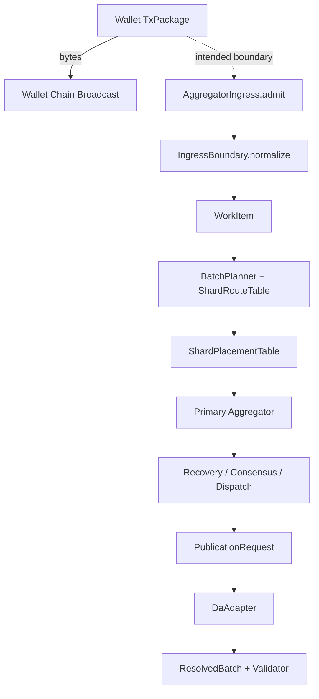

> [$deep-wiki:wiki-qa](/home/vadim/.codex/plugins/cache/z00z-local/deep-wiki/2.0.0+codex.fddb7211e75e/skills/wiki-qa/SKILL.md) objasni mne kak Tx package kotori sozdal wallet popadaet v nuzhnij shard a aggregaore; kak eto idet cherez planner
> esli est neskolko aggregatorov kotoriw derzhat odin i toto zhe shard, kak oni dostigajut concensus; chto publekuetsja v blob DA celestia, chto dokazivaetsja , kakie artifakti dokazivajutsja koncensusom aggregatora; objasni men vsu mehaniku na baze kodovoj bazi; objasni gde poka placeholderi, kakie gaps nuzhno zapolnit dazhe ne podimaja poka devnet, chto mozhno i nuzhno sdelat v simulacii

## Вывод

Коротко: сейчас `TxPackage` не несет в себе `shard_id` вообще; нужный shard выбирается на стороне aggregator runtime как `canonical payload digest -> route-table range`, а не wallet-ом и не по `asset_id` напрямую. ==Если один shard “держат” несколько aggregators, текущая модель в коде это `1 primary + standby`, а не несколько одновременных active writers.== Реального Celestia-path в текущих `crates/` я не нашел: concrete DA-путь здесь только через `DaAdapter` seam и `LocalDaAdapter` с `local-da://...` refs. (crates/z00z_wallets/src/tx/tx_wire.rs:172) (crates/z00z_runtime/aggregators/src/types.rs:142) (crates/z00z_runtime/aggregators/src/batch_planner.rs:327) (crates/z00z_runtime/aggregators/src/placement.rs:50) (crates/z00z_rollup_node/src/da.rs:37) (crates/z00z_rollup_node/src/da.rs:153)

## Key Files

| File                                                         | Role                                                         |
| ------------------------------------------------------------ | ------------------------------------------------------------ |
| [tx_assembler.rs (line 448)](/home/vadim/Projects/z00z/crates/z00z_wallets/src/tx/tx_assembler.rs:448) | Wallet canonically builds `TxPackage`, computes `tx_digest_hex`, then locally verifies package before returning bytes. |
| [ingress.rs (line 12)](/home/vadim/Projects/z00z/crates/z00z_runtime/aggregators/src/ingress.rs:12) | Aggregator recomputes digest from payload and turns it into planner-ready `WorkItem`. |
| [batch_planner.rs (line 83)](/home/vadim/Projects/z00z/crates/z00z_runtime/aggregators/src/batch_planner.rs:83) | Canonical route-table validation and shard lookup; current wave rejects multi-shard batches. |
| [consensus_adapter.rs (line 99)](/home/vadim/Projects/z00z/crates/z00z_runtime/aggregators/src/consensus_adapter.rs:99) | Local quorum/term logic for same-shard recovery state.       |
| [da.rs (line 37)](/home/vadim/Projects/z00z/crates/z00z_rollup_node/src/da.rs:37) | DA seam; only concrete implementation here is `LocalDaAdapter`. |
| [verdict.rs (line 22)](/home/vadim/Projects/z00z/crates/z00z_runtime/validators/src/verdict.rs:22) | Public settlement theorem and validator-side resolved batch/verdict logic. |

## Как пакет идет в shard через planner

`TxPackage` содержит `kind/package_type/version/chain/tx/tx_digest_hex/status`, но поля “target shard” там нет. В каноническом wallet path `TxAssemblerImpl` сам собирает пакет, считает `tx_digest_hex` из содержимого и прогоняет локальную проверку. (crates/z00z_wallets/src/tx/tx_wire.rs:175) (crates/z00z_wallets/src/tx/tx_assembler.rs:448)

Текущий live wallet handoff в коде идет через `BroadcastImpl -> ChainClient -> LocalNodeSim`; там прямо сказано, что это wallet-owned broadcast path для local simulation, а remote transport остается adapter-only seam. Production wallet->aggregator transport в `crates/` я не нашел; runtime со стороны aggregator пока задан как trait boundary `AggregatorIngress/Ordering/Recovery/Service`. (crates/z00z_wallets/src/chain/broadcast_impl.rs:19) (crates/z00z_wallets/src/chain/local_node_sim.rs:30) (crates/z00z_runtime/aggregators/src/service.rs:13)

Как только payload попадает на aggregator boundary, `IngressBoundary::normalize()` заново считает digest из самого payload и отвергает forged `tx_digest_hex`. Дальше `WorkItem::route_key()` возвращает именно bytes canonical payload digest, и `BatchPlanner` делает lookup по live `ShardRouteTable`. То есть “правильный shard” сейчас определяется как владелец диапазона этого digest в route table. (crates/z00z_runtime/aggregators/src/ingress.rs:13) (crates/z00z_runtime/aggregators/src/ingress.rs:27) (crates/z00z_runtime/aggregators/src/types.rs:100) (crates/z00z_runtime/aggregators/src/batch_planner.rs:323)

Это еще и системно прибито конфигом: route table читается как canonical hex-bytes, digest обязан совпасть с `RouteRef.expected_digest`, а `planner.routing_generation` и `aggregator.routing_generation` обязаны совпадать с live route table. Плюс planner policy требует, чтобы `shard_local_only` и `reject_cross_shard` были синхронны. (crates/z00z_rollup_node/src/config.rs:769) (crates/z00z_rollup_node/src/config.rs:1000) (crates/z00z_rollup_node/src/config.rs:1055) (crates/z00z_rollup_node/src/config.rs:1343)

## Если один shard у нескольких aggregators

В текущей модели shard имеет одного `primary_id` и список `standby`. Scheduler группирует работу по `(primary_id, shard_id)`, а dispatch fail-closed требует, чтобы batch доставлялся именно owning primary; standby нужен для catch-up и takeover, не для параллельной active execution. (crates/z00z_runtime/aggregators/src/placement.rs:50) (crates/z00z_runtime/aggregators/src/dist_scheduler.rs:58) (crates/z00z_runtime/aggregators/src/dist_dispatch.rs:418)

Consensus здесь тоже не “сетевой BFT поверх Celestia”, а deterministic local quorum seam. `ConsensusAdapter` собирает majority `(N/2)+1`, freeze-ит term при same-term divergent root, и его commit-артефакт фиксирует только `term, batch_id, route, state_root, journal_lineage, voter_ids`. README прямо говорит, что внешний replicated-log/discovery/network membership пока остаются adapter-only, пока этот локальный контракт не доказан. (crates/z00z_runtime/aggregators/src/consensus_adapter.rs:80) (crates/z00z_runtime/aggregators/src/consensus_adapter.rs:175) (crates/z00z_runtime/aggregators/src/consensus_adapter.rs:346) (crates/z00z_runtime/aggregators/README.md:13) (crates/z00z_runtime/aggregators/README.md:27)

## Что публикуется и что реально доказывается

| Layer                | Что есть сейчас                                              | Что это доказывает                                           |
| -------------------- | ------------------------------------------------------------ | ------------------------------------------------------------ |
| Runtime planner      | `WorkItem`, `BatchPlanned`, `route_table_digest`, `routing_generation` | Только deterministic routing/admission, не settlement truth. (crates/z00z_runtime/aggregators/src/types.rs:213) |
| Aggregator consensus | Majority over `JournalCandidate` from `ShardRecoveryRecord`  | Agreement on recovery journal/root lineage, не theorem и не DA inclusion. (crates/z00z_runtime/aggregators/src/consensus_adapter.rs:15) |
| Published metadata   | `PublishedBatch { checkpoint_id, publication_route, pub_in, da_provider, blob_ref }` | Public publication envelope. (crates/z00z_runtime/aggregators/src/types.rs:266) |
| Binding              | `PublicationBinding(batch_id, checkpoint_id, route_table_digest, pub_in_digest, roots, counts)` | Route-bound bind/publish contract, но exact route coverage storage-owned. (crates/z00z_runtime/aggregators/src/types.rs:277) |
| DA payload today     | `LocalDaAdapter` hashes `batch_id + idempotency_key + pub_in + tx_package + exec_input + link + nullifiers` | Local adapter payload commitment; конкретного Celestia blob format в этом коде нет. (crates/z00z_rollup_node/src/da.rs:288) |
| Validator theorem    | Checks tx package digest/structure, spend contract, artifact statement/proof, replay/link/root alignment, tx inclusion in exec input | Public consistency theorem for published bundle. (crates/z00z_runtime/validators/src/verdict.rs:201) |

Отдельно: exact shard coverage для publication route живет в storage-owned `PublicationRouteSnapshotV1 { routing_generation, route_table_digest, activation_checkpoint, shard_ids }`, и simulator stage13 уже проверяет route contract и public-root proofs поверх этого слоя. (crates/z00z_storage/src/settlement/proof_batch.rs:504) (crates/z00z_simulator/src/scenario_1/runtime_observability.rs:5745) (crates/z00z_simulator/src/scenario_1/runtime_observability.rs:5801)

## Placeholder’ы и gaps

- Concrete production `AggregatorService` implementation в `crates/` я не нашел; есть boundary trait и test/dummy impl. (crates/z00z_runtime/aggregators/src/service.rs:27) (crates/z00z_rollup_node/src/runtime.rs:362)
- Concrete Celestia adapter в inspected crates тоже нет; concrete DA path здесь только `LocalDaAdapter` и `local-da://...`. (crates/z00z_rollup_node/src/da.rs:67) (crates/z00z_rollup_node/src/da.rs:160)
- Data model уже умеет multi-shard publication через `shard_ids`, но live planner пока жестко single-shard и config держит shard-local-only. (crates/z00z_storage/src/settlement/proof_batch.rs:504) (crates/z00z_runtime/aggregators/src/batch_planner.rs:346) (crates/z00z_rollup_node/src/config.rs:769)
- Runtime notes/rollout/dispatch alerts явно не являются proof truth. (crates/z00z_runtime/aggregators/src/dist_dispatch.rs:31) (crates/z00z_runtime/aggregators/README.md:29)

## Что уже можно и нужно делать в simulation

Сейчас уже можно без devnet: гонять local DA publish/resolve roundtrip с tamper/replay rejection, доказывать route-table codec/migration/tamper, и моделировать same-shard quorum, split-brain, partition, replay, catch-up и standby takeover. Это уже покрыто тестами. (crates/z00z_rollup_node/tests/test_da_local_sim.rs:8) (crates/z00z_runtime/aggregators/tests/test_hjmt_shard_routing.rs:57) (crates/z00z_runtime/aggregators/tests/test_hjmt_consensus.rs:49) (crates/z00z_runtime/aggregators/tests/test_hjmt_dist_journal.rs:33)

Сценарный pipeline тоже частично есть: stage 9 строит `CheckpointExecInput` из `TxPackage`, stage 10 проверяет наличие exec input для publish, stage 11 валидирует committed-state proof перед wallet ownership detection, а `runtime_observability` stage13 уже сверяет `PublicationBinding`, route table digest и public checkpoint proofs. (crates/z00z_simulator/src/scenario_1/stage_9/exec_input_builder.rs:41) (crates/z00z_simulator/src/scenario_1/stage_10/publish_support.rs:18) (crates/z00z_simulator/src/scenario_1/stage_11/jmt_wallet_scan.rs:131) (crates/z00z_simulator/src/scenario_1/runtime_observability.rs:5681)

Следующий правильный шаг в симуляции: сделать один end-to-end harness, который на одном и том же `TxPackage` буквально проходит `IngressBoundary -> BatchPlanner -> ShardPlacementTable -> DistDispatch/Recovery -> LocalDaAdapter -> ResolvedBatch -> ValidatorBoundary`. Это уже не написано как один сквозной live path, но все нужные seams для него в кодовой базе есть.

EXPANDABLE: details available for planner routing, quorum/failover, and DA/proof boundaries.