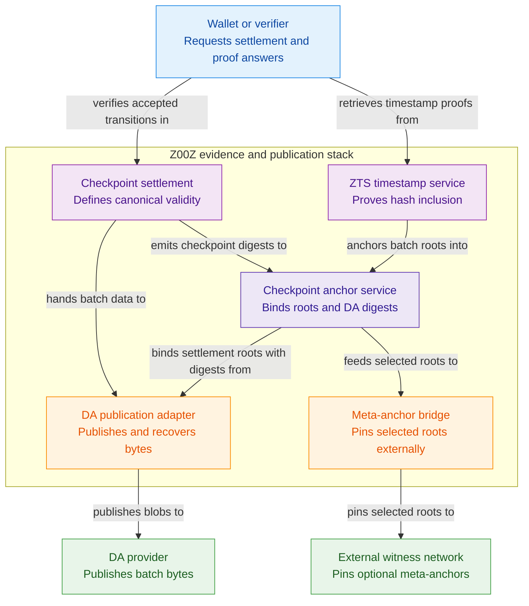

# Z00Z Multi-DA And Checkpoint Architecture Blueprint

[TOC]

Version: 2026-05-27

## Key Terms Used In This Paper

This paper uses a small set of terms that must stay consistent with the rest of the Z00Z corpus.

- `Checkpoint`: The checkpoint-bound validation object described in the main whitepaper. It is the public settlement boundary for replay-safe state transition evidence.
- `DA commitment`: The data-availability-facing commitment, reference, receipt, or provider evidence that lets a verifier locate or audit published batch bytes.
- `Anchor`: A compact proof reference that binds a hash, batch root, or checkpoint digest to a specific Z00Z epoch or finalized checkpoint context.
- `ZTS`: The Z00Z Timestamp Service, a service-layer proof system for batching external hashes into Z00Z evidence.
- `Anchor calendar`: The ordered sequence of ZTS batches and roots used to verify timestamp proofs independently.
- `Meta-anchor`: An optional external witness that pins selected Z00Z roots into another network without becoming Z00Z settlement authority.

## Invariant Anchors

### ZINV-CHECKPOINT-001

Invariant reference: `ZINV: CHECKPOINT-001`

Genesis bootstrap authority and every later checkpoint publication in this
blueprint must stay on one replay-safe lineage: the accepted checkpoint path
must preserve prior-root to next-root continuity and must not consume the same
input twice.

### ZINV-CHECKPOINT-002

Invariant reference: `ZINV: CHECKPOINT-002`

Every DA commitment, anchor, and meta-anchor flow described here is subordinate
to committed checkpoint state. Publication evidence may witness an accepted
checkpoint, but it must never authorize publication before commit or replace
checkpoint validity.

## 1. Why This Blueprint Exists

The corpus already has three nearby stories. The main whitepaper defines checkpoints as the validation boundary. The roadmap describes data availability, provider maturity, and multi-provider sequencing. The legal architecture paper explains archive neutrality, evidence packages, disclosure packages, and recordkeeping outside the base protocol.

This blueprint connects those stories. Its job is not to redefine settlement. Its job is to define how checkpoint evidence, DA publication evidence, timestamp batches, and optional external witnesses fit together without creating a second source of truth.

The reader should leave with one practical ability: decide which layer answers a verification question.

| Verification question | Correct authority |
| --- | --- |
| Was this Z00Z state transition accepted under protocol rules? | Checkpoint and settlement theorem path |
| Were the published batch bytes available through the selected provider path? | DA commitment, provider receipt, watcher evidence, and recovery records |
| Was this external document hash included in a Z00Z timestamp batch? | ZTS proof and anchor calendar |
| Can a long-lived auditor verify that a past Z00Z root existed? | Checkpoint anchor, retained proof material, and optional meta-anchor |
| Did the underlying document, invoice, event, or business statement contain true facts? | Outside Z00Z; held by the actor or service that needs the record |

## 2. Corpus Authority Map

This document is a companion blueprint. It depends on other corpus documents and should not duplicate their authority.

| Corpus surface | Owns | This blueprint must not claim |
| --- | --- | --- |
| `Z00Z-Main-Whitepaper.md` | Checkpoint settlement semantics, public artifact theorem, wallet-local possession boundary | That anchors replace checkpoint validation |
| `Z00Z-HJMT-Design.md` | Storage root taxonomy, inclusion, deletion, and non-existence proof shape | That timestamp batches define canonical asset state |
| `Z00Z-Roadmap-Blueprint.md` | Maturity, sequencing, DA provider rollout, evidence gates | That multi-DA is already fully implemented |
| `Z00Z-Legal-Architecture-Whitepaper.md` | Archive neutrality, audit receipts, disclosure packages, corporate recordkeeping | That Z00Z stores or certifies user business records |
| `Z00Z-Corpus-Terminology-Reference.md` | Cross-paper term normalization | New names that conflict with checkpoint, settlement evidence, or DA vocabulary |

The key rule is simple: checkpoints are settlement evidence; DA is publication evidence; ZTS is a service-layer timestamp proof; meta-anchors are optional external witnesses.

## 3. Maturity Boundary

The live corpus already supports a strong present-tense checkpoint story. It also describes a DA adapter seam and provider direction, but the broader multi-provider topology remains roadmap work. ZTS and external meta-anchors are future service-layer surfaces.

The maturity split should therefore be:

| Layer | Present-tense status in the corpus | Correct wording |
| --- | --- | --- |
| Checkpoint settlement | Core protocol boundary described by the main paper | Existing validation boundary |
| Storage proofs | Designed in the JMT storage paper, with proof families still maturing | Protocol storage requirement |
| DA provider path | Real seam and roadmap direction | In-progress provider layer |
| Multi-DA failover | Roadmap direction | Future resilience topology |
| ZTS timestamp service | Design target | Optional service-layer proof system |
| External meta-anchors | Design target | Optional external witness path |

This document should remain strict about those labels. It can specify the shape of future evidence without implying that every service is already shipped.

## 4. Layer Model

The architecture has five layers. They should not be collapsed.

**Figure 4.1 - Evidence and publication container view.** The five layers are
best understood as one stack of cooperating containers rather than one blurred
proof surface.



### 4.1 Checkpoint Settlement Layer

The checkpoint settlement layer is this blueprint's name for the main-paper validation path, not a new authority above it. In current corpus language, settlement validity belongs to the `SettlementTheorem` and checkpoint relation: prior root, execution input, consumed state, created leaves, proof payload, artifact identity, and canonical link are bound into one accepted state transition.

A checkpoint anchor may expose a compact digest of that boundary, but the anchor is not the theorem. A verifier who needs settlement validity must verify the checkpoint relation, not merely see that a checkpoint hash was later timestamped.

### 4.2 DA Publication Layer

The DA layer answers a different question: where were the bytes published, under which provider semantics, and what evidence exists if availability or recovery is disputed?

A DA commitment may include provider identity, blob reference, batch digest, publication height, provider receipt, watcher observation, retry state, or recovery record. It should not decide transaction validity. Provider failure may affect liveness, recovery, and auditability, but it must not silently redefine the Z00Z state transition rules.

### 4.3 Checkpoint Anchor Layer

The anchor layer creates a durable proof reference for a checkpoint or batch root. It is useful for receipts, audit packages, external verifiers, and long-lived recordkeeping.

A checkpoint anchor should commit to:

```text
CheckpointAnchor = H(
  "Z00Z_CHECKPOINT_ANCHOR" ||
  chain_id ||
  epoch_id ||
  checkpoint_id ||
  prior_state_root ||
  next_state_root ||
  checkpoint_artifact_digest ||
  da_commitment_digest ||
  parameter_version
)
```

The final implementation may choose different field names, but the semantics should stay stable: the anchor identifies the checkpoint boundary and its publication evidence. It does not carry raw wallet secrets, raw business records, or the full transaction history.

### 4.4 ZTS Timestamp Layer

ZTS lets external actors timestamp their own hashes through Z00Z. It is useful for documents, logs, corporate evidence packages, off-chain service records, and external Merkle roots. It should remain a service-layer proof system, not a universal data hosting system.

The baseline flow is:

1. The client hashes data locally.
2. The client submits only the hash and minimal metadata.
3. ZTS batches submitted hashes into an anchor calendar.
4. The batch root is committed into Z00Z evidence.
5. The client receives a proof from hash to batch root to checkpoint context.

The public proof should let an independent verifier confirm inclusion without trusting the original gateway.

### 4.5 External Meta-Anchor Layer

A meta-anchor pins selected Z00Z checkpoint or ZTS roots into another network. This may be useful for long-term legal evidence, cross-ecosystem verification, or conservative external witnessing.

Meta-anchors are optional. They must not become the source of Z00Z settlement authority, and they must not imply that a foreign chain validates Z00Z transactions. The only safe claim is narrower: a selected Z00Z root was later witnessed by another system.

## 5. Canonical Evidence Objects

The first production-ready specification should define a small set of versioned objects.

### 5.1 Checkpoint Anchor Object

```yaml
checkpoint_anchor:
  kind: z00z-checkpoint-anchor
  version: 1
  chain_id: z00z-mainnet
  epoch_id: 12345
  checkpoint_id: "0x..."
  prior_state_root: "0x..."
  next_state_root: "0x..."
  checkpoint_artifact_digest: "0x..."
  da_commitment_digest: "0x..."
  finalized_at_height: 678900
```

The object should be compact enough to survive in receipts, audit packages, and external verifiers.

### 5.2 DA Commitment Object

```yaml
da_commitment:
  kind: z00z-da-commitment
  version: 1
  provider_family: celestia-or-other
  provider_instance: "provider-id-or-domain"
  batch_id: "batch-..."
  batch_digest: "0x..."
  blob_reference: "provider-specific-reference"
  publication_state: accepted
  observed_by:
    - watcher_id: "0x..."
      observed_at_height: 678910
```

This object is deliberately provider-facing. It should be resolved by DA and watcher tooling, not by wallet-local ownership logic.

### 5.3 ZTS Batch Object

```yaml
zts_batch:
  kind: z00z-timestamp-batch
  version: 1
  chain_id: z00z-mainnet
  batch_id: "zts-2026-05-27-0001"
  epoch_id: 12345
  merkle_root: "0x..."
  submitted_hashes_count: 1024
  checkpoint_anchor: "0x..."
```

The timestamp batch should contain only commitments and verification metadata. Human labels, application names, or document descriptions should be optional and should be treated as potential privacy leaks.

### 5.4 ZTS Proof Object

```yaml
zts_proof:
  kind: z00z-timestamp-proof
  version: 1
  submitted_hash: "0x..."
  batch_id: "zts-2026-05-27-0001"
  leaf_index: 42
  merkle_branch:
    algorithm: sha256
    path:
      - position: left
        hash: "0x..."
      - position: right
        hash: "0x..."
  checkpoint_anchor: "0x..."
  optional_meta_anchors:
    - network: external-network-name
      reference: "external-proof-reference"
```

This proof should verify hash inclusion, not document truth.

## 6. Verification Workflows

### 6.1 Settlement Verification

Use this workflow when the question is whether a Z00Z transition was accepted.

1. Verify the transaction package or claim package under the appropriate current rule.
2. Verify the checkpoint execution input and checkpoint artifact relation.
3. Verify prior-root and next-root continuity.
4. Verify consumed and created state commitments.
5. Treat anchor objects only as references to the checkpoint boundary, not as substitutes for the settlement relation.

### 6.2 DA Availability Verification

Use this workflow when the question is whether batch bytes were published or recoverable.

1. Resolve the DA commitment through the provider adapter.
2. Verify the batch digest against the retrieved bytes.
3. Check watcher observations and provider status.
4. Check retry, recovery, or failover records if the primary provider path failed.
5. Keep the result separate from settlement validity.

### 6.3 ZTS Timestamp Verification

Use this workflow when the question is whether an external hash was timestamped.

1. Recompute the external hash locally.
2. Verify the Merkle branch from the hash to the ZTS batch root.
3. Verify the ZTS batch object and its checkpoint anchor.
4. Verify the checkpoint context that carried or referenced the batch.
5. Optionally verify any external meta-anchor.
6. Remember that the proof says "this hash was included," not "the underlying statement was true."

### 6.4 Audit Receipt Verification

Use this workflow when an enterprise, auditor, or counterparty keeps a long-lived record.

1. Verify the local receipt or disclosure package against the transaction or document hash.
2. Verify the receipt's checkpoint anchor or ZTS proof.
3. Verify that the retained records are sufficient for the legal or accounting purpose.
4. Do not assume Z00Z stores the original business record.

## 7. Multi-DA Policy

Multi-DA should grow in stages. The roadmap is right to avoid pretending that many providers should be wired before one provider path is mature.

The recommended sequence is:

1. One primary provider path with deterministic publish and resolve semantics.
2. Watcher evidence that can distinguish missing, delayed, failed, and accepted publication.
3. Recovery records that preserve checkpoint continuity under provider failure.
4. A secondary provider path only after the first path has operational evidence.
5. Multi-provider policy that defines when a batch needs one provider, multiple providers, or failover publication.

The multi-provider rule should remain provider-neutral but not provider-vague. Each provider family needs exact byte commitments, resolve semantics, failure classes, and recovery behavior. A vague "multi-DA" label does not improve evidence quality.

## 8. Security, Privacy, And Legal Boundary

This blueprint must preserve the legal architecture paper's archive-neutrality stance.

Z00Z may retain compact validation anchors and proof references. It should not become the default long-term host for user documents, corporate accounting archives, private invoices, or service logs. The actor who needs the record should keep the record.

The main security boundaries are:

- Checkpoint anchors do not replace checkpoint validation.
- DA commitments do not replace settlement rules.
- ZTS proofs prove inclusion of a hash, not truth of a statement.
- Meta-anchors witness selected Z00Z roots; they do not validate Z00Z transitions.
- Optional metadata can leak application meaning and should be minimized.
- Archive and retention duties belong to wallets, enterprises, regulated services, or other responsible actors above the protocol layer.

## 9. Roadmap Position

This blueprint should feed Workstream C and Workstream D in the roadmap.

Near term:

- finalize checkpoint anchor vocabulary and encoding;
- bind DA commitments to publication and watcher evidence;
- keep one provider path boring before widening;
- add golden tests for anchor serialization and proof verification.

Mid term:

- introduce ZTS proof objects and verifier libraries;
- integrate timestamp proofs with evidence packages and disclosure packages;
- define provider failover records and recovery behavior.

Long term:

- add external meta-anchor cadence if it has a real verifier audience;
- support multi-provider policy without moving settlement meaning into DA;
- keep business recordkeeping outside the base protocol.

## 10. Non-Claims

This blueprint does not claim that Z00Z currently ships a finished multi-provider DA system. It does not claim that timestamp proofs certify truth. It does not claim that external chains decide Z00Z finality. It does not claim that the base protocol stores corporate or user records forever.

The correct claim is narrower and stronger: Z00Z can keep settlement authority inside the checkpoint and `SettlementTheorem` path while exposing compact evidence that lets users, services, auditors, and external verifiers reason about checkpoints, publication, timestamp inclusion, and optional external witnessing.

## Appendix A. Glossary

| Term | Meaning | Scope rule |
| --- | --- | --- |
| `Anchor` | A compact proof reference that binds a hash, batch root, or checkpoint digest to a Z00Z epoch or finalized checkpoint context. | Proof reference only; not a replacement for settlement validation. |
| `Anchor calendar` | The ordered sequence of ZTS batches and roots used to verify timestamp proofs independently. | Timestamp-service evidence, not canonical asset state. |
| `Audit receipt` | A retained evidence object used by an enterprise, auditor, or counterparty to verify a transaction, disclosure package, document hash, checkpoint anchor, or ZTS proof later. | Belongs to wallets, enterprises, regulated services, or other record-holding actors, not to base consensus as a universal archive. |
| `Checkpoint` | The checkpoint-bound validation object that forms the public settlement boundary for replay-safe state transition evidence. | Canonical settlement boundary noun inherited from the main whitepaper. |
| `Checkpoint anchor` | A durable digest or proof reference for a checkpoint boundary and its publication evidence. | Identifies the boundary; it does not prove the full settlement relation by itself. |
| `DA commitment` | A data-availability-facing commitment, reference, receipt, or provider evidence that lets a verifier locate or audit published batch bytes. | Publication evidence only; not transaction validity and not settlement authority. |
| `DA provider path` | The provider-specific publication and resolve route used to publish or recover batch bytes. | In-progress provider layer; multi-provider resilience remains future topology. |
| `Disclosure package` | A retained package that reveals selected transaction, receipt, or document evidence to a specific reviewer or purpose. | Optional higher-layer evidence object; it does not change base protocol validity. |
| `External meta-anchor` | An optional external witness that pins selected Z00Z checkpoint or ZTS roots into another network. | External witness only; a foreign chain does not validate Z00Z transitions. |
| `Meta-anchor` | Short form for external meta-anchor. | Use only when the external-witness boundary is clear. |
| `Provider receipt` | Provider-facing evidence that a batch, blob, or commitment was accepted, observed, delayed, failed, retried, or recovered under provider semantics. | DA and watcher tooling consume it; wallet-local ownership logic does not. |
| `Recovery record` | Evidence describing retry, failover, or recovery behavior after a publication path failed or degraded. | Supports liveness and auditability without redefining state transition rules. |
| `SettlementTheorem` | The checkpoint-coupled public consistency relation that verifies package, execution input, checkpoint artifact, link, roots, proofs, replay, and inclusion. | Settlement validity belongs here, not in anchors, timestamps, DA commitments, or meta-anchors. |
| `Watcher evidence` | Observation material produced by watchers about publication, provider status, verdicts, or anomalies. | Visibility and alert evidence; not settlement authority. |
| `ZTS` | The Z00Z Timestamp Service, a service-layer proof system for batching external hashes into Z00Z evidence. | Timestamp proof surface, not raw data hosting. |
| `ZTS batch` | A versioned timestamp batch containing submitted hashes, a batch root, checkpoint context, and verification metadata. | Contains commitments and minimal metadata; avoid human labels that leak meaning. |
| `ZTS proof` | A proof from a submitted hash through a batch root into checkpoint context and optional meta-anchor references. | Proves hash inclusion, not truth of the underlying statement. |

## Appendix B. Implementation Questions

- Which fields are mandatory in the first checkpoint anchor encoding?
- Should ZTS use a plain Merkle tree first, or should it reuse a JMT-compatible proof shape later?
- Which hash algorithms are allowed for user-submitted hashes, batch roots, and checkpoint anchors?
- Which metadata fields are forbidden because they leak user or application meaning?
- How does the DA adapter expose provider receipts, watcher observations, and retry state?
- What is the smallest external meta-anchor cadence that serves a real verifier audience?
- Which verifier library owns settlement, DA, ZTS, and meta-anchor proof validation?
