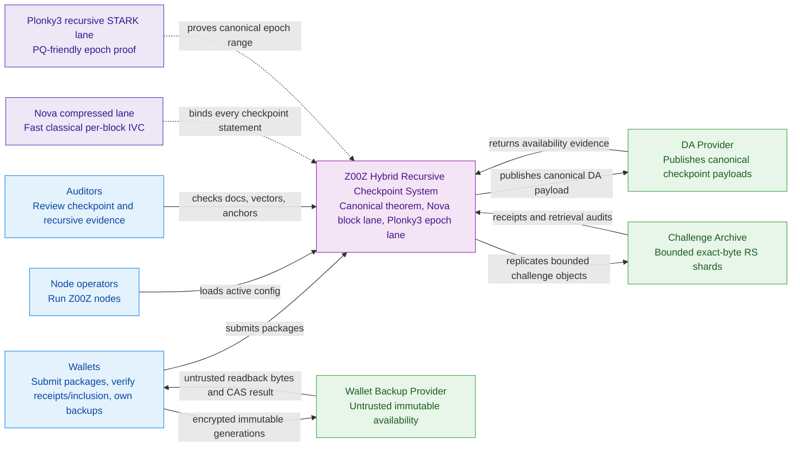
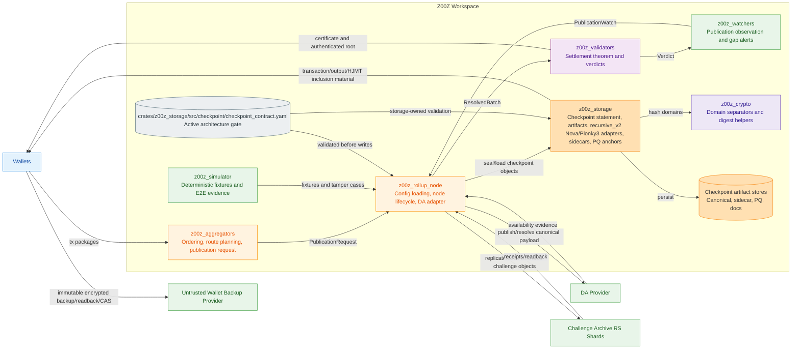
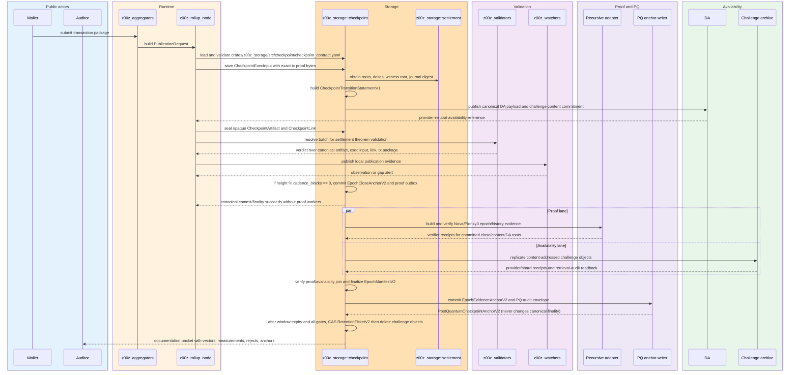
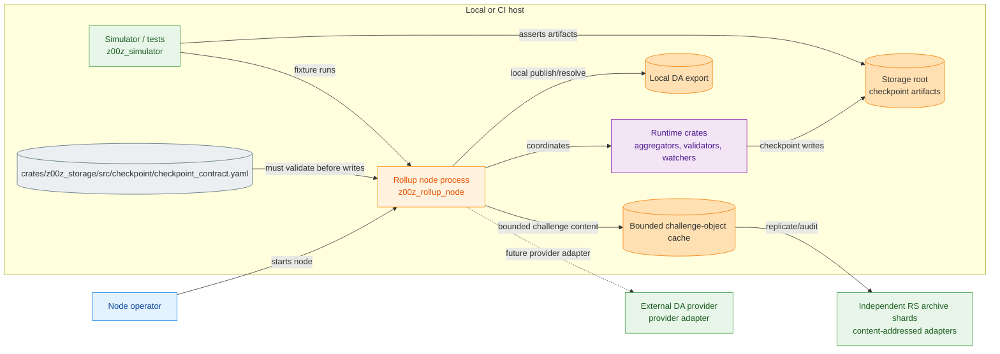
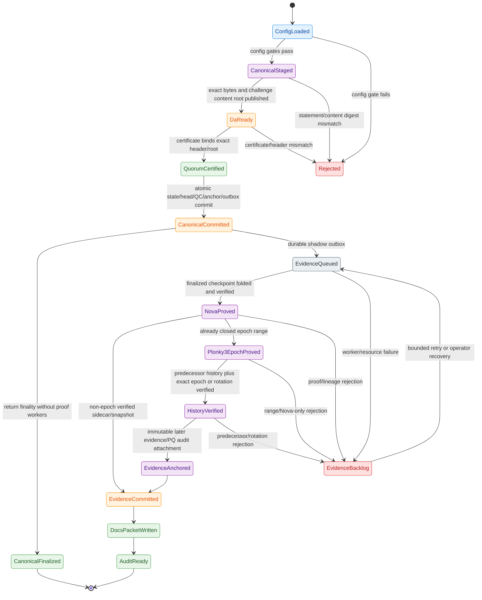

# Phase 069 Recursive Proof Spec

## Live execution overlay — 2026-07-20

The canonical Plan 051 ledgers retain historical T2 closure against an older
source revision and do not authorize the current tree. The current T3/T4
candidate source is pinned by
`crates/z00z_storage/src/checkpoint/recursive_source_manifest_v2.txt` and the
independent golden
`5a381948457e9a8aa69792c43285e28597ef2779687457221a6d56a8b3cbad2d`.
It remains NOT ACCEPTED until source-current release verification and
independent review are clean. Plan 06 and Plans 07–13 remain locked;
`CheckpointProofSystem::VERIFIED` remains disabled.

All target/future design statements in this specification and its referenced
design/whitepaper authorities are mandatory live Phase 069 scope. They do not
describe an optional later status. Phase 069 runtime artifacts, raw logs,
PID/time/exit files, fuzz outputs, measurements, proof material, and scenario
packets MUST be contained fail-closed under the single physical root
`crates/z00z_storage/outputs/checkpoint`; the entire repository-root
`test-results` tree is forbidden and must remain absent.
Relative `artifacts/checkpoints/*` values remain canonical protocol locators and
MUST be resolved beneath that physical root rather than rewritten or duplicated.

## 🎯 Purpose

📌 This document is the self-contained Phase 069 specification for recursive
checkpoint proof work in Z00Z. It converts the Phase 069 idea corpus into one
code-facing contract that can be implemented, tested, and audited without
promoting speculative proof claims into live checkpoint authority.

📌 Phase 069 MUST implement the recursive-ready proof architecture over the
checkpoint transition statement from
`.planning/phases/000/068-Checkpoint-Contract/068-TODO.md`. The selected
implementation architecture is hybrid:

- Nova IVC fold on every checkpoint block, with compressed proof snapshots at
  a measured/configured cadence, as a fast classical lane.
- Plonky3 recursive STARK epoch proof every configured PQ cadence interval,
  default `1000` blocks, as PQ-oriented outer proof evidence over the accepted
  checkpoint transition-consistency predicate.
- Canonical checkpoint artifacts, exact transaction proof bytes, HJMT roots,
  witness roots, DA payload commitments, bounded archive-availability manifests,
  and checkpoint links remain mandatory.

📌 The Plonky3 epoch proof MUST prove or re-check the accepted canonical
transition-consistency predicate for every step in the epoch. It MUST NOT be a
STARK wrapper that only proves "1000 Nova proofs verified". The epoch proof MAY
bind the Nova chain root as additional performance/audit evidence. It still
MUST NOT be described as end-to-end post-quantum checkpoint validity while the
accepted transaction theorem depends on classical signatures, commitments,
range proofs, or spend proofs. Phase 069 proves the explicitly scoped predicate;
it does not upgrade the assumptions of nested classical primitives.

📌 Phase 069 still MUST NOT replace the current spend verifier, range-proof
verifier, checkpoint artifact codec, checkpoint link, or canonical replay path.
`CheckpointProofSystem::VERIFIED` remains disabled until a later promotion
stage has real verifier code, codec support, rollback policy, benchmarks,
negative tests, and security review.

📌 The primary output of this phase is a deterministic hybrid recursive
checkpoint implementation over the existing storage contract: a real Nova IVC
step lane, a real Plonky3 base-STARK and recursive epoch lane, typed public
inputs, proof objects, epoch manifests, cryptographic verifier adapters, typed
reject reasons, measurements, storage path gates, and 3 to 5 step chain evidence
for prior-output binding. Shape validation or arbitrary non-empty proof bytes do
not satisfy this output.

📌 The secondary output is a recursive documentation and audit packet that makes
the hybrid lane reviewable: statement vectors, object schemas, rejection matrix,
benchmark metadata, backend-manifest red lines, Plonky3/Nova parameter
decisions, and eventually complete PQ epoch artifact evidence for every already
closed configured 1000-block range once asynchronous evidence enforcement is
active. Proof availability at the boundary is never a canonical-finality gate.

## 🧭 Document Structure

📌 This spec is intentionally long-form. It is the Phase 069 single source of
truth. Implementation agents MUST NOT need to re-open the research chats to
decide what to build, reject, test, or measure.

Reading order:

1. Authority and source disposition define which upstream claims survived.
2. Current code truth anchors the design in live repository modules.
3. Architecture doublecheck ledger records each major decision, source, code
   confirmation, and gate.
4. Object contracts define the statement, public input, witness, proof, sidecar,
   chain evidence, measurements, PQ anchor, and documentation packet.
5. Config gates define the real repository YAML file that controls modes,
   limits, paths, stage promotion, retention, DA, and PQ cadence.
6. Module placement defines where the implementation lives across storage,
   runtime, rollup node, crypto, and simulator; recursive backends have the
   one canonical owner `z00z_storage::checkpoint::recursive_v2`.
7. Diagrams provide C4 and Mermaid-spectrum views of the same architecture.
8. Failure model, tests, acceptance criteria, implementation slices, and
   artifacts define how Phase 069 is accepted.

## 🚦 Pre-Planning Readiness Gate

📌 Phase 068 completed after the first draft of this document and already
landed much of the storage contract that older Phase 069 slices described as
future work. Phase 069 planning MUST start from current source and tests, not
from the historical implementation tense in this spec.

⚠️ **Registration constraint:** The canonical phase directory already exists at
`.planning/phases/069-Recursive-Proof/`, while higher-numbered scenario/future
directories also exist. The append-only `gsd-add-phase` implementation scans
on-disk phase numbers and would allocate after the highest one rather than
register this existing Phase 069. Registration MUST reuse this exact directory
through an existing-phase roadmap registration/edit path. It MUST NOT call
`phase.add`, create a duplicate `069-*` directory, or renumber this spec.

| Surface | Current baseline on 2026-07-11 | Phase 069 planning treatment |
| --- | --- | --- |
| Statement/core/final digests | Implemented in `artifact_stmt.rs`. | Reuse and regression-test; do not introduce a second theorem. |
| Recursive public input, evidence, measurement, chain evidence, codec, and verifier | Absent at T0; the former implementation is eradicated. | T1 creates the sole V2 path `z00z_storage::checkpoint::recursive_v2`; no compatibility surface exists. |
| PQ anchor envelope and cadence gate | Implemented in `pq_anchor.rs` and `contract_config.rs`. | Reuse as audit metadata; bind only verified backend outputs. |
| Archive manifests/receipts, retrieval audits, snapshots, and pruning decisions | Implemented under `z00z_storage::checkpoint`. | Keep as inherited regression constraints; do not reimplement them in the V2 recursive module. |
| Nova backend | No `nova-snark` dependency, step circuit, prover, or verifier is present. | New Phase 069 implementation scope. |
| Plonky3 recursion backend | No `p3-recursion` dependency, checkpoint AIR, base proof, recursive aggregation, prover, or verifier is present. | New Phase 069 implementation scope. |
| Recursive implementation root | No recursive source exists at T0. | T1 creates only `z00z_storage::checkpoint::recursive_v2` after its dependency and predicate gates pass. |

📌 The planner MUST preserve these readiness decisions:

1. **No duplicate baseline work.** Existing storage-owned objects are inputs to
   the plan. Any replacement requires a migration and caller inventory, not a
   parallel type family.
2. **Dependency preflight first.** Record an exact compatible `nova-snark` and
   `p3-*` set, MSRV/toolchain impact, license, feature flags, transitive audit
   surface, and a compile-only compatibility probe before backend code.
3. **Predicate before prover.** Freeze the exact R1CS/AIR predicate, field
   encoding, hash gadgets, public-input order, witness schema, and golden vectors
   before implementing either backend.
4. **Real verification.** A plan cannot close a backend slice by accepting a
   boolean claim, digest-shaped placeholder, arbitrary bytes, or a shape-only
   verifier.
5. **Honest security vocabulary.** Existing identifiers such as
   `PqEpochFinality` and `is_pq_authoritative` are legacy configuration labels.
   They do not grant checkpoint finality or end-to-end PQ authority. Phase 069
   MUST either migrate them versionedly to evidence-oriented names or document
   their compatibility-only meaning at every public boundary.
6. **Spike failure is a valid stop.** If the exact checkpoint predicate cannot
   be represented with the selected backend within bounded proving time,
   memory, or auditability, stop after the feasibility packet and split a
   successor phase. Do not close Phase 069 with a mock backend.

📌 Planning readiness means the unknowns above are explicit, ordered gates. It
does not mean their technical outcomes are predetermined.

## 🔐 Authority Chain

📌 Live normative sources for this spec:

- This document as the Phase 069 single source of truth.
- `.planning/phases/000/068-Checkpoint-Contract/068-TODO.md`
- `.planning/phases/068-Checkpoint-Contract/068-TODO.md`
- Current code under `crates/z00z_storage/src/checkpoint/`
- Current code under `crates/z00z_storage/src/settlement/`
- Current validator, watcher, rollup-node, and simulator checkpoint/publication
  seams under `crates/z00z_runtime/`, `crates/z00z_rollup_node/`, and
  `crates/z00z_simulator/`

📌 Historical Phase 069 proposal inputs fully incorporated into this spec and
removed from `.planning/phases/069-Recursive-Proof/` after extraction:

- `+69-70-proposal.md`
- `+69-70-proposal.audit.md`

📌 Historical supporting research inputs fully incorporated into this spec and
removed from `.planning/phases/069-Recursive-Proof/` after extraction:

- `README.md`
- `README-recursive_proofs.md`
- `z00z-recursive-proofs.md`
- `nova-supernova.md`
- `20-Recursive checkpoint proof.md`
- `11_Z00Z_Recursive_StateProof.md`
- `12_chat-PQ Recursive Proof-last.md`
- `13_chat-Recursive Proof Analysis.md`
- `14_chat-Обзор PQ рекурсивных доказательств.md`

⚠️ The supporting research inputs are not direct implementation authority.
They contribute failure cases, threat-model warnings, retention requirements,
measurement questions, and backend evaluation checklists only after they are
filtered by this spec and the recursive-ready checkpoint contract.

## 📚 Source Disposition

| Source | Accepted into Phase 069 | Rejected or deferred |
| --- | --- | --- |
| `README.md` and `README-recursive_proofs.md` | Exact statement first, no spend verifier replacement, 3 to 5 step chain, proof-size/prover/verifier measurements, recursive sidecar evidence. | Backend-first design that does not bind the checkpoint contract or tries to use proof-system choice as theorem authority. |
| `z00z-recursive-proofs.md` | State-transition model with `root_old`, update witness, `root_new`, prior-output binding, and Nova-compatible per-block IVC flow. | Nova or SuperNova as PQ/final authority. |
| `nova-supernova.md` | Nova per-block IVC lane, compression as a separately measured operation, SuperNova as future non-uniform-step comparison, and classical IVC measurement categories. | Proof-size claims as Z00Z implementation facts before local measurement; ECC proofs as quantum-safe history locks. |
| `20-Recursive checkpoint proof.md` | Historical baseline: no cryptographic recursive backend chain existed. Phase 068 later added storage-owned shape/chain evidence, but no real Nova or Plonky3 verification. | Treating shape-chain fields as live cryptographic proofs. |
| `11_Z00Z_Recursive_StateProof.md` | Chain failure cases, nullifier/spent retention, fraud/audit evidence categories. | Link tag as recursive proof authority, 100 byte proofs, 200 KB active state, IPFS-only history. |
| `12_chat-PQ Recursive Proof-last.md` | PQ cautions, storage/recovery warnings, nullifier permanence, DA availability warnings. | Magic aggregation, same-challenge aggregation, production PQ theorem closure. |
| `13_chat-Recursive Proof Analysis.md` | ECC attack model, RNG/reuse risks, genesis trust, quantum migration warning. | DLP-based proof as long-term PQ-safe authority. |
| `14_chat-Обзор PQ рекурсивных доказательств.md` | PQ backend evidence checklist: parameters, ABI, vectors, PoK, center-lift, domain slots, constant-time review; STARK/FRI as the practical PQ-friendly implementation direction for Phase 069. | Pedersen binding as PQ-safe, unproved RLWE/folding claims, LatticeFold/RLWE/Fractal as live production backends. |
| `plonky3-stark.md` | Primary real implementation target: Nova fold every block plus measured-cadence compression and a Plonky3 recursive STARK epoch proof every `post_quantum.cadence_blocks`; Plonky3 must prove the scoped canonical predicate and may bind Nova root. | Plonky3 proof that only verifies Nova proofs; permanent storage of all per-block STARK proofs; exact proof-size claims without Z00Z benchmarks. |
| `068-TODO.md` | Checkpoint-contract-first architecture, recursive branch surfaces, DA readiness gate, retention policy, stage transitions, and 1000-block PQ epoch cadence. | Treating a generic PQ anchor as enough once Plonky3 epoch proof is selected, or enabling live cadence before `pq_anchor_writer`. |
| `+69-70-proposal.md` | Wave 69 scope and Wave 70 dependency boundaries. | DA/publication evidence as recursive proof authority. |
| `+69-70-proposal.audit.md` | Conflict resolutions and residual risks. | Any source group marked rejected or research-only. |

### 🔗 Imported Backend Reference Ledger

📌 The following references were imported from `plonky3-stark.md` so the Phase
069 spec can stand alone after the idea file is removed. These links are
evidence for backend selection and risk classification; they are not runtime
configuration and MUST NOT bypass repository dependency pinning.

| Reference | Phase 069 use | Imported decision |
| --- | --- | --- |
| [Plonky3](https://github.com/Plonky3/Plonky3) | Primary STARK toolkit candidate. | Use as the default STARK family because it is Rust-native, supports FRI/STARK-oriented primitives, and includes KoalaBear/Poseidon2-relevant components. |
| [Plonky3-recursion](https://github.com/Plonky3/Plonky3-recursion/) | Primary recursive STARK implementation target. | Use for `plonky3_stark_epoch_v2` only behind non-authoritative Phase 069 gates until audit and promotion evidence exists. |
| [Plonky3-recursion benchmarks](https://plonky3.github.io/Plonky3-recursion/appendix/benchmark.html) | Measurement planning input. | Treat any timing or proof-size number as a Z00Z measurement target, not as a verified Z00Z result. |
| [Plonky3 audit report](https://leastauthority.com/wp-content/uploads/2024/11/Updated_071124_Polygon_Plonky3_Final_Audit_Report.pdf) | Security-review reference for the Plonky3 base stack. | Audit coverage is not equivalent to full audit coverage of `Plonky3-recursion`; Phase 069 must still record recursion-specific risk. |
| [Nova](https://github.com/microsoft/Nova) | Secondary fast classical IVC baseline. | Fold every block; choose compressed snapshot cadence from local measurements; never use Nova as PQ authority. |
| [Nova paper](https://par.nsf.gov/servlets/purl/10440508) | Classical proof-size and IVC reasoning reference. | Treat 8 KiB to 30 KiB as a rough planning target until Z00Z fixtures measure local proofs. |
| [Arecibo](https://github.com/lurk-lang/arecibo) | Nova/SuperNova-family comparison lane. | Keep as benchmark or future non-uniform-step candidate, not as the Phase 069 primary backend. |
| [LatticeFold](https://github.com/NethermindEth/latticefold) | PQ folding research track. | Keep as research-only until production parameters, ABI, vectors, audit, and implementation gates exist. |
| [Fractal paper](https://link.springer.com/chapter/10.1007/978-3-030-45721-1_27) and [libiop](https://github.com/scipr-lab/libiop) | Transparent recursive-proof design reference. | Do not use as implementation base because the available implementation path is C++/academic-reference oriented. |
| [HyperPlonk](https://github.com/EspressoSystems/hyperplonk) | Future prover/circuit comparison. | Do not select as primary because Phase 069 targets a recursion-first STARK epoch artifact. |
| [Winterfell](https://github.com/facebook/winterfell) | Generic STARK fallback reference. | Do not use standalone Winterfell as the recursive backend because Phase 069 selects Plonky3-recursion for the STARK lane. |
| [STARK paper](https://eprint.iacr.org/2018/046) | Transparent/STARK/FRI security-family reference. | Use only for security-family reasoning; implementation authority remains the selected, pinned backend plus local Z00Z tests. |

📌 `plonky3-stark.md` import coverage:

| Source block | Spec home | Status |
| --- | --- | --- |
| Backend pros/cons table for Nova, SuperNova, Plonky3, Fractal, HyperPlonk, LatticeFold, RLWE, and generic STARK/Winterfell. | `Hybrid Backend Architecture` and `Backend And PQ Policy`. | Imported and normalized into Phase 069 decisions. |
| Proof-size and overhead tables. | `Nova Block Proof Contract`, `Plonky3 Epoch Proof Contract`, `Config Gates`, and `Measurement Contract`. | Imported as targets and hard caps; exact numbers remain measurement-gated. |
| Hybrid flow: Nova every block, Plonky3 every 1000 blocks. | `Hybrid Backend Architecture`, `Post-Quantum Cadence Contract`, `Required Workflow`, and `Gate Flow`. | Imported and made normative through config gates. |
| Warning that Plonky3 must not only verify Nova proofs. | `Non-Negotiable Invariants`, `Plonky3 Epoch Proof Contract`, `Reject Reason Contract`, `Failure Model`, and acceptance criteria `RCP-AC-021`/`RCP-AC-022`. | Imported as a hard rejection rule. |
| Retention rule: do not store every per-block STARK proof permanently. | `Hybrid Backend Architecture`, `Bounded Challenge Archive And Permanent Notary Contract`, `Config Gates`, and `Required Artifacts`. | Imported and extended with lossless challenge packs, compact anchors/MMR, receipts/audits, rolling history, snapshots, and retention tickets. |
| Config deltas for Nova, Plonky3, PQ cadence, retention, and proof-size caps. | `Config Gates`, `crates/z00z_storage/src/checkpoint/checkpoint_contract.yaml`, baseline `CheckpointContractConfigV2`, and target `CheckpointContractConfigV3`. | The live YAML is already schema `version: 2` even though its Rust owner is still misnamed `CheckpointContractConfigV1`. Plan 069-051 first performs an API-owner rename/caller cutover without changing canonical schema-2 bytes, then performs an explicit bounded schema-2 to schema-3 migration for every Phase 069 field or semantic change. It adds a schema-1 decoder only if an actual schema-1 fixture is discovered and retained. API suffixes, recursive-object wire versions, and config schema generations never drive one another. |

⚠️ External source recheck on 2026-07-11:

- Official `Plonky3-recursion` documentation exposes `p3-recursion` `0.1.0`
  and the upstream repository states that the code is under active development,
  unaudited, and not recommended for production use.
- The workspace currently pins selected base `p3-*` crates at `0.4.2`; this is
  not evidence that they are API-compatible with the recursion crate.
- The official Nova implementation separates incremental folding from optional
  compressed proof generation. Phase 069 therefore measures compression
  cadence rather than assuming one compression per block.
- These are preflight inputs, not dependency selections. The implementation
  plan must recheck them and pin exact compatible revisions at execution time.

## 🧱 Implementation Dependency And Installation Matrix

📌 Phase 068 defines the checkpoint theorem, storage contract, and YAML gate.
It does not pin recursive backend libraries. Phase 069 is the dependency
authority for Nova, Plonky3, and IPFS/Kubo integration. It owns IPFS/Kubo pins
only if a live IPFS adapter is explicitly included in a Phase 069 execution
plan; storage schema support alone does not require installing Kubo.

📌 Default ownership for dependency wiring:

- `crates/z00z_storage/src/checkpoint/` keeps statement/artifact/evidence/PQ codecs,
  configuration validation, the sole private Nova owner, and public V2 facade.
- `z00z_storage::checkpoint::nova` alone owns Nova; named V2/Plonky3 owners may
  share APIs, benchmarks, and dependency pins without recreating a nested path.
- `z00z_rollup_node` SHOULD own Kubo/IPFS RPC wiring and archive-operator
  process integration, not checkpoint theorem bytes.

| Dependency surface | Install target | Required package(s) | Primary docs | Phase 069 rule |
| --- | --- | --- | --- | --- |
| Nova block proof lane | `z00z_storage::checkpoint::nova` | [`nova-snark`](https://docs.rs/nova-snark/), [Microsoft/Nova repository](https://github.com/microsoft/Nova), [Nova paper](https://par.nsf.gov/servlets/purl/10440508) | `docs.rs`, repository README/examples, paper | MUST implement `NovaCompressedSnapshotV2`; MUST stay non-PQ; MUST pin one exact crate version or git revision in workspace metadata before the first adapter lands. |
| Plonky3 recursion lane | `z00z_storage::checkpoint::recursive_v2::plonky3` | [`p3-recursion`](https://docs.rs/crate/p3-recursion/latest), [`p3-uni-stark`](https://docs.rs/crate/p3-uni-stark/latest), [`p3-fri`](https://docs.rs/crate/p3-fri/latest), [`p3-commit`](https://docs.rs/crate/p3-commit/latest), [`p3-challenger`](https://docs.rs/crate/p3-challenger/latest), [`p3-field`](https://docs.rs/crate/p3-field/latest), [`p3-matrix`](https://docs.rs/crate/p3-matrix/latest), [Plonky3 repository](https://github.com/Plonky3/Plonky3), and [Plonky3-recursion repository](https://github.com/Plonky3/Plonky3-recursion/) | `docs.rs`, upstream repositories, local benchmark vectors | MUST implement `Plonky3EpochProofV2`; MUST pin one approved compatibility set; MUST NOT mix unrelated `p3-*` release families inside the same workspace. |
| Plonky3 field/hash profile | Same V2 module plus shared crypto helpers | [`p3-koala-bear`](https://docs.rs/crate/p3-koala-bear/latest), [`p3-poseidon2`](https://docs.rs/crate/p3-poseidon2/latest), and when sponge helpers are needed [`p3-symmetric`](https://docs.rs/crate/p3-symmetric/latest) | `docs.rs` plus the upstream Plonky3 workspace manifest | MUST match config `field: koala_bear` and `hash: poseidon2`; any alternative field/hash pair rejects unless config, vectors, proofs, and tests move together. |
| IPFS archive RPC client | `z00z_rollup_node` archive adapter or future archive crate | [`ipfs-api-backend-hyper`](https://docs.rs/crate/ipfs-api-backend-hyper/latest) | `docs.rs` crate docs | Conditional scope only. If `ipfs_pinned` is exercised, the adapter MUST talk to an external pinned Kubo node over local or private RPC, emit receipts/pinning evidence, and keep SDK types outside canonical checkpoint modules. |
| IPFS/Kubo daemon | Operator host, CI fixture, archive node | [Kubo install guide](https://docs.ipfs.tech/install/command-line/), [Kubo quick start](https://docs.ipfs.tech/how-to/command-line-quick-start/), and [Kubo RPC reference](https://docs.ipfs.tech/reference/kubo/rpc/) | Official IPFS docs | Install only when a Phase 069 plan includes the `ipfs_pinned` integration fixture. RPC MUST stay localhost or otherwise private; public RPC exposure is forbidden. |

📌 Version-lock rules:

- A coder MUST NOT start the real backend implementation with floating versions
  such as `*`, `latest`, or unreviewed HEAD checkouts.
- The workspace already contains `p3-field`, `p3-goldilocks`,
  `p3-poseidon2`, and `p3-symmetric` under `crates/z00z_crypto/Cargo.toml`.
  Phase 069 implementation MUST either migrate that family to the selected
  recursion-compatible set in one reviewed wave or isolate recursive backend
  dependencies behind a compatibility-safe crate boundary.
- `cargo add` without an exact version or reviewed git revision is forbidden
  for `nova-snark`, `p3-*`, and the IPFS client crate.
- The exact pinned dependency set and the Kubo binary version used by local
  fixtures or CI MUST be recorded in the Phase 069 documentation packet and in
  `crates/z00z_storage/Cargo.toml`, the manifest of the sole live recursive
  backend owner.
- `latest` documentation URLs in this section are discovery links only. They
  MUST NOT be copied into dependency commands or used as evidence of API
  compatibility.

## 🧾 Key Terms

| Term | Meaning in Phase 069 |
| --- | --- |
| `CheckpointTransitionStatementV1` | The canonical storage-owned statement defined by the recursive-ready checkpoint contract. Every recursive sidecar binds this exact statement digest. |
| API generation suffix | The `V1`/`V2`/`V3` suffix in a Rust or specification type name. It identifies that API type family only, not a config-file schema; it MUST NOT be parsed or used to infer a wire, config schema, transcript, root, parameter, or authority generation. |
| Wire type and version | The explicit `{type_id or magic, wire_version}` pair selected before nested decode. Its value is owned by the Phase 069 version registry and MAY differ from an API suffix when the registry states why. |
| Cryptographic domain version | The version embedded in a hash, signature, proof transcript, or commitment domain. It is independent from API and wire versions and changes only with the cryptographic statement/framing it protects. |
| Config schema generation | The explicit config-file grammar selected by top-level `version`. Config schema 3 can govern recursive objects whose registered wire version is 2; neither value implies the other. |
| Runtime profile generation | The validated policy profile selected by the complete profile identifier, generation, and authority-pinned canonical manifest digest. `checkpoint-contract-client-notary-v2` is profile generation 2 even inside config schema 3; it is not wire V2 and does not select a decoder. Reusing an identifier/generation with different manifest bytes or digest is a substitution attempt and MUST reject. |
| Authority generation | The committee/parameter/VK generation used for activation and rotation. It is not a codec or config-schema version and MUST be bound separately wherever replay across generations matters. |
| `RecursiveCheckpointPublicInputV2` | The proof-facing public input object derived from the statement digest, roots, chain position, backend label, and prior-output binding. |
| `RecursiveCheckpointWitnessV2` | Missing Phase 069 contract that binds context/predicate plus bounded replay/HJMT/spent/delta material used by real proof adapters. It is not canonical state truth. |
| `RecursiveCheckpointProofV2` | Inherited name retained only as a bounded typed content-addressed reference to exactly one `NovaProofEnvelopeV2`. It carries statement/verifier/envelope/retention metadata but no proof or public-state bytes and MUST NOT be overloaded with an epoch proof. |
| `NovaCompressedSnapshotV2` | The single classical compressed Nova body inside `NovaProofEnvelopeV2`. The envelope and existing authority owners bind statement, checkpoint link, endpoints, context, predicate, and parameters; the body is not a second wrapper or PQ authority. |
| `NovaEpochChainRootV2` | Merkle or commitment root over the ordered Nova block proof digests and statement digests for one epoch. It is optional evidence inside the Plonky3 epoch statement, not the source of PQ soundness. |
| `EpochRangeStatementV2` | Statement for one configured epoch range. It binds start/end heights and roots, the already canonical `EpochCloseAnchorV2` digest, ordered statement/link roots, challenge-content root, canonical DA payload commitment, witness/delta roots, and optional Nova chain root. It never depends on a future PQ anchor or provider-availability receipt. |
| `Plonky3EpochProofV2` | Recursive STARK proof for one epoch range using Plonky3/Plonky3-recursion. It must prove the canonical transition range and bind public inputs; it is the selected PQ-friendly epoch lane. |
| `EpochManifestV2` | Content-addressed manifest for a completed epoch: statements, canonical artifacts, links, DA refs, witness roots, Nova proof digests, Plonky3 proof digest, sizes, and retention locations. Its compact certified digest/anchor is permanent; its large body follows the challenge window and verified-history-successor policy. |
| `EpochCloseAnchorV2` | Compact canonical record committed when an epoch range closes. It binds range, roots, challenge-pack commitment, committee generation, network/version, a non-circular close-anchor MMR append, and any already-ready typed evidence-MMR appends; all leaf digests exclude their new MMR/final-anchor digest. It never waits for evidence to become ready. After the existing canonical block DA-ready/QC gates pass, it MUST NOT wait for Nova, Plonky3, PQ, or any additional recursive-evidence DA/archive publication. |
| `EpochEvidenceAnchorV2` | Distinct immutable later attachment referencing one `EpochCloseAnchorV2` and binding the Nova chain root plus either a verified retained-body receipt or truthful `not_promotable` abandonment disposition, independently verified Plonky3 exact-epoch/history/rotation/PQ evidence, and verifier generation. It cannot mutate the close anchor or canonical finality. It is local pending evidence until its typed evidence-MMR inclusion is committed by a later certified close anchor; that inclusion is required before network promotion or deletion. |
| `NovaRetentionStateV2` | Storage-owned epoch-scoped lifecycle record for scheduled Nova compression: `OpenEpoch`, body-less terminal `GapRecorded`, body-bearing `ClosedAwaitingPq`, `PqSuperseded`, `Abandoned`, `DeleteEligible`, or `Deleted`. It binds epoch/range, chain-root digest, verifier/parameter generation, predecessor state, reason, reference count/holds, retention-ledger generation, and any covering Plonky3/evidence-anchor/ticket digests. `body_digest` is mandatory in every body-bearing state and absent only in `OpenEpoch`/`GapRecorded`. It is not a proof, canonical-finality input, or permission to delete challenge/current-state bytes. |
| `HistoryAccumulatorStatementV2` | Separate rolling-history statement whose successor verifies the prior history proof and the exact next `Plonky3EpochProofV2`; a predecessor digest alone is insufficient. |
| `Plonky3HistoryProofV2` | Non-authoritative recursive proof over ordered verified epoch proofs. It is retained as a bounded rolling body while its compact accumulator root/anchor is permanent. |
| `HistoryRotationBridgeV2` | Proof/manifest bridge binding old and new parameter/VK generations, activation height, accumulator roots, and authority rotation commitment. Unbridged generation changes reject. |
| `RecursiveSecurityBudgetManifestV2` | Generation-pinned derivation record for concrete FRI/hash/grinding/recursion assumptions, an upward-rounded dyadic per-proof failure bound, finite accepted-epoch budget, inherited cumulative bound, conservative composition rule, and minimum residual target. It uses checked integer arithmetic; a rotation bridge carries rather than resets inherited loss. |
| `CurrentStateShardManifestV2` | Availability/placement manifest over the already authoritative global HJMT state root. It binds route-table generation/digest, ordered non-overlapping shard ranges, per-shard COW/chunk roots, touched-delta roots, replica placements/failure domains, prepare/quorum receipts, and predecessor/activation checkpoint. It MUST NOT define a second state theorem or replace the canonical root. |
| `CheckpointDaPayloadV2` | The sole canonical provider-neutral byte payload published by the inherited DA adapter. It is a small fixed-field commitment envelope over the staged checkpoint statement, roots, route/config generation, challenge-content root, and optional already-known epoch-close anchor. It MUST NOT contain raw transaction packages, `CheckpointExecInput`, raw claim/spend nullifiers, witness/delta bodies, recursive-proof bodies, future archive receipts/audits, a quorum certificate, or provider SDK types. |
| `FinalizedCheckpointRecordV2` | Compact storage-owned canonical-head record installed only after DA readiness and the exact quorum/finality certificate. It binds the checkpoint/artifact/link digests, state and settlement roots, active shard/route generation, provider-neutral DA reference and payload commitment, certificate/reference, predecessor record, optional epoch-close anchor, and durable outbox root. It embeds no large body. The current head and in-window record bodies are retained; permanent history keeps their certified epoch root/anchor rather than every per-block record body. |
| `RecipientRecoveryCapsuleV2` | Semantic current-leaf recovery contract, preferably realized without duplication by the existing canonical `{r_pub, tag16, enc_pack}` fields after an audited binding proves that the recipient can recover the complete current spendable payload. It is recipient-encrypted, bounded, committed by the live leaf, retained only while the output is live, and never authorizes ownership from `tag16` alone. |
| `ReceiptMailboxCapabilityV1` | Phase-071 recipient opt-in carried only by a newly registered signed payment-request/receiver-card extension generation. Phase 069 reserves its name/type/domain as unreachable. It pins compatible mailbox registry/profile/route/crypto generations and bounded retention support, contains no locator/provider account/stable mailbox id, and never follows implicitly from `view_pk` or current `PaymentRequest V1`. |
| `RecipientReceiptNoticeV1` | Phase-071 canonical bounded plaintext reserved by Phase 069 but implemented only in Phase 071. It is assembled by the sender for one recipient output and encrypted before it leaves the wallet; it is an authenticated subrecord, not an independent public ingress object or network authority. |
| `EncryptedReceiptMailboxEntryV1` | Phase-071 immutable, locator-addressed XChaCha20-Poly1305 ciphertext carrying one `RecipientReceiptNoticeV1` plus a random acknowledgement secret. Phase 069 reserves its unreachable type/domain row only. It is never transaction data, current state, wallet history, DA, challenge archive, or evidence of finality/ownership. |
| `ReceiptMailboxAdmissionV1` | Detached sender-authenticated request binding an already-final canonical transaction digest and exact recipient output to one immutable mailbox entry digest, locator commitment, context commitment, caps, fee/quota authorization, and retention/profile generation. It is excluded from the canonical transition theorem and never makes mailbox availability a finality input. |
| `ReceiptMailboxActivationV1` | Immutable post-finality record binding a staged mailbox entry digest to the canonical transaction/output/checkpoint/root/certificate context and a height-based expiry. It permits delivery only; it cannot finalize a payment or compensate for a missing canonical output. |
| `ReceiptMailboxReplicaReceiptV1` | Authenticated, route-generation-bound evidence that one configured mailbox replica stored and read back the exact immutable entry digest/length. It is availability evidence only and cannot prove recipient delivery, decryption, finality, or ownership. |
| `ReceiptMailboxAckV1` | Capability-style acknowledgement emitted only after the recipient durably commits its local receipt/output/cursor transaction. It authorizes early mailbox garbage collection but is not a payment receipt, delivery truth, ownership proof, or prerequisite for canonical finality. |
| `ReceiptMailboxGcTicketV1` | Namespace-scoped compare-and-swap deletion capability for one mailbox entry after a valid acknowledgement quorum or height expiry. It MUST NOT address challenge archives, current-state leaves/capsules, snapshots, compact notary history, or wallet backups. |
| `ReceiptMailboxRejectReasonV1` | Stable mailbox-only typed outcome taxonomy. It distinguishes malformed/admission/crypto/activation/ACK/GC rejection from `MailboxUnavailable`/`MailboxExpired` delivery outcomes; no variant is a canonical transaction or ownership verdict. |
| `Archive Retention Layer` | Z00Z-owned bounded challenge/audit retrieval layer over content-addressed challenge packs and mandatory versioned erasure-coded shards, provider receipts, retrieval audits, and deletion tickets. It is separate from Celestia DA and from permanent compact notary history. Full copies may exist voluntarily but MUST NOT be an active launch profile or count as the retention quorum. |
| `CheckpointArchiveManifestV1` | Inherited bounded archive index and read-only migration input. It keeps its Phase 068 wire semantics and MUST NOT be overloaded with RS, retention-ticket, permanent-history, or V2 write semantics. |
| `CheckpointArchiveAvailabilityManifestV2` | V2 availability index binding one `EpochChallengePackV2.content_root`, exactly one versioned Reed-Solomon scheme, ordered shard roots/placements, provider receipts, retrieval-audit lineage, byte lengths, and expiry class. Its body follows the challenge window; only its digest inside the epoch evidence/anchor lineage can be permanent. A full-replica or automatic-fallback mode is invalid. |
| `EpochChallengePackV2` | Canonical finite lossless package for the configured challenge window. It stores each proof blob once by digest, does not duplicate derivable witness material, and round-trips exact required replay bytes. |
| `RetentionTicketV2` | Sole authorization for deleting immutable persisted challenge or recursive-proof bodies. Its typed, non-interchangeable scope is one of `expired_challenge_objects`, `nova_pq_superseded_body`, or `nova_unpromoted_abandoned_body`; each scope binds its exact predicate set and object namespace. Challenge deletion still requires window expiry, no hold/dispute, verified history successor/rotation, evidence-anchor inclusion in a later certified close, compact-anchor/MMR inclusion, newer bootstrap snapshot, RS-threshold/placement audit, VK liveness, and retention-ledger CAS. Nova scopes can address only compressed Nova proof bodies and never authorize challenge/current-state/anchor deletion. |
| `ArchiveProviderReceiptV1` | Provider-neutral evidence that a configured archival backend stores a content-addressed object. It may reference IPFS pinning, paid archival providers, Filecoin-like storage, local archive nodes, or cold object storage. |
| `RetrievalAuditV1` | Periodic proof that at least the configured erasure threshold of archived shards remains reconstructible across the pinned placement/failure-domain policy. It is an availability/retrieval gate, not state validity. |
| `StateSnapshotV1` | Bootstrap object binding state/settlement roots plus digests/roots for the latest Plonky3 evidence, epoch/archive manifests, snapshot chunks, and PQ anchor. It does not embed proof or archive bodies and is not a trust root. |
| `Full-node pruning` | Local deletion of expired challenge bytes after every `RetentionTicketV2` predicate and CAS gate passes; it never deletes current state or permanent compact notary history. |
| `Archive-node pruning` | Authorized deletion of expired challenge-window objects by `window_archive_watcher_v2` after a valid `RetentionTicketV2`; legacy, unversioned, early, held, or ticketless deletion is forbidden. |
| `FinalizedWalletReceiptV2` | Wallet-owned receipt binding network/version, certificate, committed root, transaction/output inclusion, HJMT membership, epoch anchor, committee generation, and content-addressed keyset/threshold/signature-domain manifest. Minimal committee keyset/rotation manifests remain permanently retrievable so offline restore can verify from the network trust anchor; the wallet uses no PP/PK/VK or recursive sidecar. |
| `WalletBackupV5` | Wallet-owned immutable logical generation using approved bounded Argon2id plus XChaCha20-Poly1305 with fresh salt/DEK, a fresh payload nonce, distinct fresh nonce per DEK wrap, and authenticated canonical header core/key-wrap set. The complete canonical plaintext is encrypted first; only ciphertext is versioned-erasure-coded; the initial required profile is `rs_3_5_v1` (`k=3,n=5`). The head binds sequence, parent, `k/n`, ordered shard digests/lengths/placements, latest trusted finalized anchor, device/checkpoint/wallet roots, and successful reconstruct/decrypt/readback evidence. CAS, rollback/fork/downgrade/nonce-reuse rejection, and the latest three verified logical generations are mandatory. Providers see only ciphertext shards and are untrusted; a single provider is allowed but MUST be reported as one failure domain, and restore without a prior trusted anchor is an explicit weak-subjectivity/bootstrap operation. |
| `RecursiveCheckpointEvidenceV2` | Non-serializable in-memory completion result that returns the reloaded sidecar, write-only cryptographic receipt, and their persisted paths. It is not a wire object and stores no verdict boolean, reject reason, capability, or measurement payload. |
| `RecursiveCheckpointChainEvidenceV2` | A 3 to 5 step ordered chain of sidecars proving prior-output binding and tamper rejection. |
| `RecursiveCheckpointMeasurementV2` | Local measurement payload for proof bytes, witness bytes, prover time, verifier time, memory, chain length, and backend label. |
| `RecursiveCheckpointRejectReasonV2` | Stable machine-readable rejection taxonomy for sidecars, proof objects, codecs, and chains. |
| `Canonical branch` | The current authoritative checkpoint path using `CheckpointArtifact`, `CheckpointLink`, `CheckpointExecInput`, exact transaction proof bytes, and `CheckpointProofSystem::OPAQUE_ATTEST`. |
| `Recursive branch` | Hybrid proof lane over the same statement: Nova per block plus Plonky3 epoch proof. It cannot admit checkpoints in Phase 069. |
| `Fast classical lane` | Nova compressed per-block proof lane used for fast local recursion, UX, audit, and benchmarking inside an open epoch. |
| `PQ epoch lane` | Compatibility name for the Plonky3 recursive STARK lane that produces PQ-oriented outer proof evidence under declared hash/FRI/STARK assumptions. It is not end-to-end PQ checkpoint authority. |
| `Open epoch` | The current canonical range since the last `EpochCloseAnchorV2`; proof publication status is tracked separately. It remains protected by canonical replay and challenge retention, not by future recursive evidence. |
| `Future verified branch` | A later backend-promotion stage after proof object, verifier API, codec, negative tests, benchmarks, security review, and rollback rules exist. |
| `Prior-output binding` | The recursive chain rule where a previous proof output root equals the next statement previous root. |
| `Backend label` | A configured identifier for the proof lane. In the active profile the required labels are `nova_streaming_compressed_v2` and `plonky3_stark_epoch_v2`; local test labels cannot be promoted. |
| `PostQuantumCheckpointAnchorV2` | Asynchronous epoch audit envelope emitted after a configured range closes. It separately binds Plonky3 epoch/history material, canonical challenge-content and DA commitments, the later archive-availability manifest, optional Nova root, and a domain-separated non-authenticating `epoch_evidence_commitment`; it never participates in canonical admission/finality. Inherited V1 `pq_signature_or_commitment` is decode-only migration input. |
| `PQ cadence` | The configured target interval, default `1000`, for asynchronous Plonky3 epoch/history proof and PQ evidence publication once `authority_promotion.stage >= pq_anchor_writer`. Missing evidence blocks evidence completeness or pruning, never the canonical epoch-close transition. |
| `RecursiveCheckpointDocumentationPacketV2` | Phase 069 closeout packet containing schemas, vectors, chain evidence, measurements, reject matrix, PQ cadence evidence, and rejected-claim register. |

## 🧭 Current Code Truth

📌 Phase 069 starts from these live facts:

| Current surface | Current truth | Phase 069 implication |
| --- | --- | --- |
| `crates/z00z_storage/src/checkpoint/artifact_final.rs` | `CheckpointArtifact` carries version, height, roots, settlement roots, optional claim root, spent/created deltas, optional snapshot and exec IDs, proof system, and proof payload. | Extend by attachment and sidecar evidence only. Do not bypass the artifact. |
| `crates/z00z_storage/src/checkpoint/artifact_stmt.rs` | `CheckpointTransitionStatementV1` binds current checkpoint roots, settlement roots, optional claim root, deltas, prep snapshot ID, and exec input ID. | Phase 069 must derive recursive public inputs from the checkpoint statement, not from an ad hoc theorem. |
| `crates/z00z_storage/src/checkpoint/exec_input.rs` | `CheckpointExecTx` rejects empty input refs, outputs, or `tx_proof`; exact upstream proof bytes are preserved. | Recursive work must not remove or synthesize transaction proof bytes. |
| `crates/z00z_storage/src/checkpoint/artifact_types.rs` | `CheckpointProofSystem::OPAQUE_ATTEST` is live. `CheckpointProofSystem::VERIFIED` is reserved. | Phase 069 cannot enable verified admission. |
| `crates/z00z_storage/src/checkpoint/link.rs` | `CheckpointLink` binds checkpoint ID, prep snapshot ID, and exec input ID with a domain-separated link bind. | Recursive chain evidence must not replace checkpoint links. |
| `crates/z00z_storage/src/checkpoint/mod.rs` | Checkpoint public surface is already a narrow facade over split implementation files. | Add new surfaces through the facade only after ownership is stable. |
| `crates/z00z_storage/src/checkpoint/recursive_v2/` | Absent at T0 by design; no recursive schema, codec, size check, shape verifier, or digest path survives. | T1 creates one V2 relation and real verifier boundary in this exact module path before storage accepts evidence. |
| `crates/z00z_storage/src/checkpoint/pq_anchor.rs` | Phase 068 validates non-zero Plonky3/Nova digest fields and anchor binding, but does not verify the referenced proof bytes. | A digest-complete PQ anchor is not evidence that a Plonky3 proof exists or verifies. Phase 069 must bind it to an actual successful backend verification result. |
| Archive, retrieval, snapshot, and pruning modules | `archive_manifest.rs`, `archive_receipt.rs`, `retrieval_audit.rs`, `state_snapshot.rs`, and `pruning.rs` already implement the storage-owned baseline. | Preserve ownership and regression gates; add challenge-pack/retention-ledger versioned evolution in the same storage surface, never duplicate it inside the recursive module. |
| Recursive backend dependencies | T0 has no recursive dependency or smoke boundary. | Compatibility probing and exact pinning precede T1; existing `p3-*` pins do not prove recursion compatibility. |
| Chain identity | The inherited Phase 068 statement binds checkpoint data but V2 context must add network ID, genesis digest, chain ID, and contract/predicate identity. | Phase 069 adds the canonical V2 context bind before accepting portable proof bytes. |
| `crates/z00z_storage/src/settlement/` | Settlement owns HJMT roots, journals, proof blobs, witness DAGs, and state lineage. | Witness and delta roots must come from settlement-owned material. |
| Runtime publication seams | Phase 068 landed provider-neutral `CheckpointPublicationEvidenceV1` and shared validator/watcher readiness consumption over the local DA adapter. | Reuse the current non-authoritative publication boundary; do not rebuild it or claim live external DA. |
| Checkpoint contract config loader | `crates/z00z_storage/src/checkpoint/contract_config.rs` still names the owner `CheckpointContractConfigV1`, but that owner requires YAML `version == 2`; this is an API-suffix/schema-version conflict, not evidence of a live schema-1 codec. | Corrective Plan 069-051 first renames the canonical schema-2 owner to `CheckpointContractConfigV2`, updates every caller, and proves exact schema-2 byte/config-digest parity. Because Phase 069 changes cadence, caps, PQ labels, retention, and deletion semantics, the same plan then migrates through a separate `CheckpointContractConfigV3` schema/owner under a registered atomic schema-2 to schema-3 cutover. A schema-1 migrator is permitted only when discovery produces a real schema-1 byte fixture; otherwise it MUST NOT be invented. Plan 09 may activate only already-defined schema-3 retention values and MUST NOT redefine their meaning. |

## 🧪 Architecture Doublecheck Ledger

📌 Every major architecture decision below was checked against Phase 068,
Phase 069 source files, and live code. If a future implementation deviates, it
MUST update this ledger and add a test that proves the new boundary.

| Decision | Source confirmation | Code truth confirmation | Phase 069 result | Required gate |
| --- | --- | --- | --- | --- |
| Checkpoint contract first, not backend first. | Phase 068 `CheckpointTransitionStatementV1`; Phase 069 audit says exact statement first. | `z00z_storage::checkpoint` owns artifact, statement, exec input, link, and codec. | Recursive proof work binds one storage-owned statement. | `RCP-INV-001`, statement golden vectors. |
| V2 evidence is non-authoritative until T4. | Phase 069 requires V2 evidence and `VERIFIED` disabled; AUDIT-2 fixes Nova+Plonky3 roles. | `CheckpointProofSystem::OPAQUE_ATTEST` is live; `VERIFIED` is reserved and codec rejects unsupported proof classes. | V2 evidence cannot mutate or admit canonical artifacts before promotion. | Config branch gate plus artifact admission tests. |
| Storage owns contract objects. | Phase 068 says config validator and statement live under storage checkpoint module. | `CheckpointFsStore`, codec, link validation, exec input, and `CheckpointContractConfigV1` live under `crates/z00z_storage/src/checkpoint/`. | Add V2 evidence, PQ anchor binding, and digest helpers through the same storage facade; keep config validation storage-owned. | Storage config tests and path gates. |
| Runtime validators consume theorem; they do not redefine it. | Phase 068 forbids duplicate checkpoint theorem. | `crates/z00z_runtime/validators` is crate `z00z_validators`; `SettlementTheoremBundle` verifies artifact, exec input, link, and tx package. | Validators may reject sidecar authority but MUST NOT own recursive theorem. | Validator non-authority integration tests. |
| Rollup node wires lifecycle and DA adapters. | Phase 068 keeps provider SDKs behind DA/export adapter boundary. | `crates/z00z_rollup_node/src/da.rs` has `DaAdapter`, `LocalDaAdapter`, publication binding, and resolve path. | Rollup node loads/passes config and DA evidence; it does not define statement bytes. | DA SDK leakage tests. |
| Watchers observe publication readiness only. | Phase 068 says watcher evidence is not settlement authority. | `z00z_watchers::PublicationWatch` checks runtime, validator, and storage bindings. | Watchers can report readiness/gaps, not recursive validity. | Publication readiness and no-authority tests. |
| Real recursive implementation is active only after storage contract gates. | User-approved architecture selects real implementation targets, not placeholder scaffolds. | T0 contains no recursive backend; T1 creates `z00z_storage::checkpoint::recursive_v2` as the sole verifier-gated boundary. | The V2 module owns Nova and Plonky3 adapters while the checkpoint facade owns statement bytes, artifact codecs, path gates, and reject taxonomy. | Implementation slices `069-05` through `069-08`. |
| Nova folds every block and compresses on measured cadence. | `plonky3-stark.md` resolves Nova as fast classical lane. | Legacy config contains `branches.nova.cadence_blocks: 1`; Phase 069 separates fold, recovery-snapshot, compression, and publication cadences into four fields. | Every finalized checkpoint block updates the prover-local IVC state; only measured recovery/compression snapshots bind statement digest, checkpoint link, prior Nova output, and output root, while publication independently selects which verified envelopes become retrievable. | Nova cadence-manifest, branch-config, restart, traffic, and chain tests. |
| Plonky3 recursively proves closed epochs asynchronously. | `plonky3-stark.md` resolves Plonky3/STARK as primary PQ-friendly epoch lane. | Legacy config contains `branches.plonky3_epoch.cadence_blocks: 1000`, `proof_system: plonky3_stark_epoch_v2`, `field: koala_bear`, `hash: poseidon2`, nominal `security_bits: 124`, `recursion_library: p3_recursion`. | Height 1000 first commits `EpochCloseAnchorV2` canonically; a later job emits exact-epoch proof, rolling-history successor, manifest, and PQ evidence without changing canonical finality. The manifest derives a finite lifetime budget and carries cumulative soundness loss across rotations. | Cadence tests at heights 999/1000, prover-unavailable epoch-close test, later-attachment test, Plonky3 history tests, and security-budget overflow/rotation tests. |
| Plonky3 MUST NOT depend only on Nova. | Quantum attack can break ECC/Nova and then a STARK wrapper over Nova verifier would only prove false classical proofs verify. | Config has `has_transition_range_proof: true` and `has_independent_transition_proof: true`. | Plonky3 epoch proof may bind `nova_chain_root`, but PQ soundness must come from canonical transition range, roots, witnesses, deltas, and archive commitments. | `Plonky3DependsOnlyOnNova` negative test. |
| PQ epoch artifact budget is explicit. | Plonky3/STARK proofs are larger than ECC/Nova; permanent proof-body retention is unnecessary when rolling history verifies exact predecessors. | Config limits reserve hard anti-amplification caps, not expected sizes; Phase 069 adds 4 KiB compact-anchor and 100 KiB/day permanent-history budgets. | Keep current plus two prior verified history/proof bodies and challenge-window evidence; retain only certified compact anchors/MMR/rotation commitments permanently. | Proof-size, rolling-history, plateau, and permanent-growth tests. |
| Celestia is DA, not forever archive. | Phase 068 separates DA reference from archive manifest; Celestia-style DA availability does not imply indefinite historical retrieval. | Config has `archive_retention.is_celestia_da_only: true` and a 1,555,200-block challenge window from DA readiness. | DA publication starts challenge timing; the Z00Z challenge ring owns exact-byte retrieval until authorized expiry, while compact certified notary history remains permanent. | Celestia-as-archive, window-start, and expiry-ticket tests. |
| Recursive proofs do not replace challenge-window retrievability. | Recursive proof validates a statement; it does not contain raw tx packages, witness bytes, exact proof bytes, explorer data, or migration material. | Config requires challenge-pack manifests, provider receipts/audits, snapshots, rolling-history successors, and retention tickets in addition to Nova/Plonky3 proof objects. | Full nodes and versioned archive watchers may delete expired challenge objects only after every ticket gate; current state and permanent compact anchors are never deleted. | Retention-ticket, archive plateau, current-state preservation, and pruning tests. |
| IPFS requires pinning and receipts. | Content addressing alone only names bytes; it does not guarantee they remain hosted. | Config requires `has_ipfs_pinning: true`, provider receipts, and retrieval audits. | IPFS may be one backend, but never the only persistence guarantee without pins and audits. | IPFS-without-pinning negative test. |
| Exact tx proof bytes remain available through the challenge window. | Phase 068 retention gate and Phase 069 audit require exact raw/witness replay during dispute, migration, and bug-forensics windows. | `CheckpointExecTx::new` rejects empty `tx_proof` and stores exact bytes. | Recursive proofs cannot remove in-window replay material; after expiry, only `RetentionTicketV2` may authorize deletion while compact commitments remain. | Exact-byte round-trip, window, hold, and deletion-ticket tests. |
| Config YAML is a runtime gate, not documentation. | Phase 068 requires `crates/z00z_storage/src/checkpoint/checkpoint_contract.yaml` and startup validation; Phase 069 adds Nova and Plonky3 branch gates. | `z00z_storage::checkpoint::contract_config` now implements strict schema validation for this exact file; `z00z_rollup_node::config` has other YAML loaders and may call or mirror storage validation for startup reporting. | The repository config is active architecture state, not a decorative fixture. Runtime call-sites that write checkpoint-family artifacts must use the validated storage contract. | `cargo test -p z00z_storage checkpoint::contract_config -- --nocapture`. |

## 🎯 Scope

### ✅ In Scope

- Define the Phase 069 recursive sidecar data contract.
- Define `RecursiveCheckpointPublicInputV2` canonical binary bytes.
- Define `RecursiveCheckpointWitnessV2` local witness fixture requirements.
- Define `NovaCompressedSnapshotV2`, `Plonky3EpochProofV2`,
  `EpochRangeStatementV2`, and strict codec rules.
- Define the in-memory-only `RecursiveCheckpointEvidenceV2` completion result and the independently encoded `RecursiveCheckpointSidecarV2` storage attachment rules.
- Define `RecursiveCheckpointVerifierV2` and Nova/Plonky3 proof-adapter
  semantics.
- Define `RecursiveCheckpointRejectReasonV2` with deterministic failure outputs.
- Define `RecursiveCheckpointMeasurementV2` and benchmark metadata requirements.
- Build deterministic 3 to 5 step chain evidence over checkpoint statements,
  with Nova per-block proof semantics.
- Prove canonical checkpoint admission is unchanged by recursive sidecars.
- Preserve exact transaction proof bytes and witness/archive obligations for
  the configured challenge/audit window, and preserve their certified compact
  commitments permanently.
- Migrate read-only `PostQuantumCheckpointAnchorV1` to write-only
  `PostQuantumCheckpointAnchorV2`; add the missing `EpochManifestV2` and
  bind both to actual backend verification receipts.
- Define Plonky3 epoch proof cadence, public inputs, proof-size limits,
  retention, and negative gates.
- Define Nova block proof cadence, per-block chain root, retention, and negative
  gates.
- Extend and regression-test the Archive Retention Layer with canonical lossless
  `EpochChallengePackV2`, mandatory measured/versioned RS(10,16) shard receipts,
  retrieval audits, `RetentionTicketV2`, the Celestia-as-DA-only boundary,
  `FinalizedWalletReceiptV2`, a bounded 90-day encrypted offline-recipient
  mailbox, seed-only current-state recovery, and ciphertext-erasure-sharded
  `WalletBackupV5`; personal receipt/history/backup custody remains client-owned.
  Mailbox bytes are temporary best-effort delivery, not archive/history. Full-replica
  launch fallback is forbidden; if RS feasibility or placement evidence is
  absent, retention promotion remains blocked.
- Activate the inherited distributed-HJMT architecture from the first profile:
  more than one current-state shard, deterministic route table, per-shard
  replicas across failure domains, canonical `CurrentStateShardManifestV2`,
  crash-safe resharding, and seed recovery from live recipient-encrypted output
  data. A root-only, one-shard, or three-full-state-copy MVP is out of scope.
- Regression-test `StateSnapshotV1`; add only versioned objects needed for safe
  bounded deletion, and define exactly three top-level logical transaction
  domains for canonical commit, recursive-evidence promotion, and wallet
  backup. Each has one authority-local durable head/commit boundary linked by
  digests, idempotency keys, and outbox/saga recovery. Per-shard promotions and
  provider uploads are subordinate outbox consumers, so “three local
  transactions” MUST NOT be misread as only three physical writes across all
  replicas/providers. Legacy/ticketless deletion and cross-provider atomic
  transaction claims remain unsupported.
- Define the required `RecursiveCheckpointDocumentationPacketV2` closeout
  content.
- Add tests, fixtures, and scenario evidence for all gates in this spec.

### 🚫 Out Of Scope

- Treating Nova, SuperNova, Fractal, HyperPlonk, LatticeFold, RLWE, or generic
  STARK claims as production truth outside the selected Nova+Plonky3 profile.
- Treating Nova compressed proofs as PQ authority.
- Treating a Plonky3 epoch proof that only wraps Nova verifier execution as
  PQ-oriented epoch evidence or finality.
- Permanently storing every internal per-block STARK aggregation proof as the
  default consensus retention path.
- Enabling `CheckpointProofSystem::VERIFIED` for canonical admission.
- Replacing current spend verification, range-proof verification, transaction
  package verification, or checkpoint replay verification.
- Removing exact transaction proof bytes from `CheckpointExecInput`.
- Treating link tags as recursive proof authority.
- Claiming 100 byte recursive proofs, 200 KB active state, or Mina-equivalent
  state size without measured backend evidence.
- Treating DA publication, watcher evidence, or publication readiness as
  state-transition validity.
- Treating Celestia DA as permanent historical storage.
- Treating IPFS CID publication without pinning, provider receipts, and
  retrieval audits as archival persistence.
- Treating recursive proofs or Plonky3 epoch proofs as a replacement for
  challenge-window raw/witness/archive material, or retaining raw packages,
  full witness/delta streams, or all historical proof bodies forever as the
  default network profile.
- Allowing early/held/unversioned/ticketless deletion or deletion of current
  state/compact anchors; making canonical epoch closure wait for proof/PQ or
  additional recursive-evidence DA/archive publication;
  making the network custodian of personal wallet history; or trusting a backup
  provider without authenticated readback/CAS.
- Shipping a one-shard or full-state-replica launch profile; accepting a
  full-replica challenge archive as fallback when erasure-shard feasibility or
  placement is missing; erasure-coding wallet plaintext/DEKs instead of the
  authenticated ciphertext; or treating a public `tag16` as ownership proof.
- Claiming post-quantum recursive security from classical commitments,
  discrete-log assumptions, unproved folding sketches, or Nova proof validity.
- Implementing weak subjectivity, fraud economics, bridge support, or production
  DA provider integration as Phase 069 closure requirements.

## 🔒 Non-Negotiable Invariants

| Invariant | Requirement | Proof surface |
| --- | --- | --- |
| `RCP-INV-001 Statement First` | Every recursive object MUST bind the exact `CheckpointTransitionStatementV1` digest. | Codec tests, golden vectors, chain tests. |
| `RCP-INV-002 Same Theorem` | A backend MUST NOT introduce a second checkpoint theorem. | Public input tests, backend manifest review. |
| `RCP-INV-003 Shadow Only` | Recursive sidecars MUST remain non-authoritative in Phase 069. | Config tests, artifact admission tests. |
| `RCP-INV-004 Canonical Replay` | Exact `tx_proof` bytes MUST remain in canonical replay. | Storage integration tests. |
| `RCP-INV-005 Prior Binding` | Each chained step MUST prove prior-output binding. | 3-step and 5-step chain tests. |
| `RCP-INV-006 Strict Codec` | Version, length, digest, backend label, and unknown-field rules MUST fail closed. | Unit and fuzz tests. |
| `RCP-INV-007 Measurements Honest` | Measurements MUST be local evidence only, not production proof claims. | Measurement validation tests. |
| `RCP-INV-008 PQ Honesty` | PQ material is an audit/evaluation envelope only in Phase 069. | Red-line tests and docs audit. |
| `RCP-INV-009 Retention` | Canonical raw transaction packages, non-derivable witness/delta material, exact transaction-proof bytes, and archive material MUST remain available through configured windows. A Nova compressed proof body is separate non-authoritative evidence and follows `NovaRetentionStateV2`; retiring it MUST NOT shorten any canonical challenge obligation. | Retention tests and fixture checks. |
| `RCP-INV-010 No SDK Leakage` | Provider SDK types MUST NOT enter recursive statement or public input bytes. | Digest input tests. |
| `RCP-INV-011 PQ Cadence` | Every positive height divisible by configured `cadence_blocks` MUST close an epoch canonically without waiting for proof work; once live cadence enforcement is active, the asynchronous evidence lane MUST later produce a complete Plonky3 epoch/history proof and PQ anchor before evidence promotion or pruning. | Config tests, prover-unavailable height-1000 test, later-attachment test, cadence audit packet. |
| `RCP-INV-012 Recursive Docs` | Phase 069 MUST leave enough stable docs, vectors, and rejection evidence for a future backend review without re-reading research chats. | Documentation packet and source audit. |
| `RCP-INV-013 Nova Classical Only` | Nova compressed proofs MUST NOT be described or enforced as PQ authority. | Config tests, backend manifest tests, docs audit. |
| `RCP-INV-014 Plonky3 Canonical Range` | A Plonky3 epoch proof MUST prove the canonical transition range, not only Nova verifier acceptance. | Epoch statement tests and negative backend manifest tests. |
| `RCP-INV-015 Epoch Evidence Window` | Blocks after the last canonical `EpochCloseAnchorV2` form the next open epoch; completed epoch proof/history evidence status is reported separately and MUST NOT redefine epoch closure. | Cadence, worker-outage, later-attachment, and operator-status tests. |
| `RCP-INV-016 Safe Backend Disable` | Before verified-backend promotion, operators MUST be able to disable non-authoritative proving without disabling canonical checkpoint admission. Promotion evidence requires both selected backends enabled and healthy. | Config, lifecycle, and degraded-mode tests. |
| `RCP-INV-017 Proof Size Budgets` | Nova and Plonky3 proof objects MUST obey explicit byte caps and target/cap reporting. | Codec tests, limit tests, measurement tests. |
| `RCP-INV-018 DA Is Not Archive` | Celestia or any DA layer MUST NOT be treated as indefinite historical storage. | Config tests and docs audit. |
| `RCP-INV-019 Retrievability Is Not Validity` | Archive receipts and retrieval audits prove bytes are retrievable; they MUST NOT prove state-transition validity. | Validator and watcher non-authority tests. |
| `RCP-INV-020 Recursive Proof Is Not Storage` | Nova and Plonky3 proofs MAY justify deletion after every scope-specific retention gate, but they MUST NOT remove current-state availability or challenge-window exact-byte obligations; only compact certified history is permanent. Current-state availability requires a multi-shard distributed-HJMT profile, live leaf/capsule bytes, verified membership service, per-shard replica placement, and crash-safe route-generation/reshard recovery; a root, one shard, or full-state-copy fallback is insufficient. | Pruning, plateau, current-state sharding/reshard/seed-recovery, and retention-ticket tests. |
| `RCP-INV-021 Snapshot Bootstrap` | `StateSnapshotV1` MUST bind the latest Plonky3 epoch proof, epoch manifest, archive manifest, state root, settlement root, chunk root, and PQ anchor root. | Snapshot binding tests. |
| `RCP-INV-022 Archive Erasure Availability Before Pruning` | Full-node or versioned archive-watcher deletion MUST require window expiry, no hold/dispute, verified history successor/rotation, compact anchor/MMR, newer bootstrap snapshot, the configured Reed-Solomon reconstruction threshold across its bound placement/failure-domain policy, retrieval audit, VK/reference liveness, and CAS ledger; full-replica fallback and legacy/unversioned/ticketless archive pruning MUST reject. | Archive erasure retention/reconstruction, retention-ticket, crash, and pruning config tests. |
| `RCP-INV-023 Explicit Version Axes` | API suffix, wire type/version, cryptographic-domain version, root/public-input encoding generation, config schema generation, runtime profile identifier/generation/authority-pinned manifest digest, and authority/parameter generation MUST be declared independently; no suffix-derived, decode-fallback, profile-substitution, cross-type, downgrade, or mixed-generation acceptance is permitted. | Registry completeness, Cartesian decoder, digest-DAG, migration, crash, and cross-generation tests. |
| `RCP-INV-024 Offline Recipient Safety` | Phase 069 MUST preserve seed-only recovery from live sharded current state and a disabled/unreachable mailbox handoff; Phase 071 MUST implement the bounded encrypted receipt-delivery mailbox. No mailbox state may affect canonical finality, ownership, spendability, current-state retention, or pruning; after mailbox expiry only current unspent state is seed-recoverable unless the wallet has its own backup. | Phase-069 reserved-row/no-online-path and zero-mailbox seed-recovery tests; Phase-071 crypto/admission/expiry/ACK and day-0/day-90/day-100 delivery gates. |
| `RCP-INV-025 Bounded Nova Evidence Lifecycle` | Compressed Nova proof bodies MUST follow the explicit `NovaRetentionStateV2` state machine and finite count/byte/PQ-backlog caps. Normal retirement requires independently verified Plonky3 exact-epoch coverage, committed evidence join, later certified evidence-MMR inclusion, configured certified-epoch grace, no hold/live reference, and a scope-correct `RetentionTicketV2`. If PQ backlog reaches its finite cap, new Nova compression/publication MUST stop before canonical finality or the running fold; a new body-less epoch becomes terminal `GapRecorded` without a deletion ticket, while an old shadow-only body MAY become `Abandoned` only after a durable non-promotion disposition and scope-correct ticket. Recovery snapshots use separate bounded local journaled GC. | Normal-PQ, delayed-PQ, cap/backpressure, body-less gap, abandonment, reference/hold, crash, and typed-ticket-scope tests. |

## 🧱 Statement Contract

📌 Phase 069 consumes the checkpoint statement defined by the recursive-ready
checkpoint contract. It MUST NOT define a smaller alternate statement.

```text
CheckpointTransitionStatementV1:
  height
  + prev_root
  + prev_settlement_root
  + checkpoint_exec_input_id
  + prep_snapshot_id
  + ordered tx_data_root
  + delta_root
  + witness_root
  + journal_digest
  + da_ref
  + optional claim_root
  + optional prior_recursive_output_root
  + optional pq_anchor_root
  -> new_root
  + new_settlement_root
```

📌 Phase 069 statement rules:

- The statement digest domain MUST be `z00z.checkpoint.transition.v1`.
- The V1 statement digest MUST include version, domain, field names,
  proof-system family, and length-delimited canonical field bytes exactly as
  implemented by the storage owner. It currently has no explicit chain/network
  identifier; recursive proofs MUST bind `RecursiveCheckpointContextV2`
  separately rather than silently changing V1 statement bytes.
- The same final `statement_digest_v1` MUST be used by canonical artifacts,
  recursive sidecars, and future verified backends.
- `statement_core_digest_v1` MUST bind the checkpoint theorem before DA and PQ
  evidence.
- `statement_digest_v1` MUST bind `statement_core_digest_v1`, `da_ref`, and
  optional future-era `pq_anchor_root` according to the checkpoint contract.
- Human-readable JSON, YAML, report paths, temp paths, hostnames, and local
  operator metadata MUST NOT be authoritative digest inputs.
- Missing optional fields MUST be encoded as explicit absence.
- V1 canonical admission MUST keep `pq_anchor_root` absent.
- `PostQuantumCheckpointAnchorV2` is external audit evidence in Phase 069. Its
  root MUST NOT be embedded into a V1 canonical admission artifact.
- A non-absent `pq_anchor_root` in a V1 canonical-admission path MUST reject as
  `PqInlineAnchorUnsupported`.
- If Phase 068 has not yet exposed one live field, Phase 069 tests MAY use a
  typed fixture with an explicit `fixture_only` label, but runtime code MUST
  fail closed rather than silently omitting the field.

## 🔢 Canonical Byte Contract

📌 Every Phase 069 committed object MUST have canonical binary bytes.

| Rule | Requirement |
| --- | --- |
| Versioning | Every committed object MUST include an explicit version. |
| Framing | Every variable-length field MUST be length-delimited. |
| Field order | Field order MUST be defined by this spec, not by serializer declaration order. |
| Optional fields | Optional fields MUST encode present or absent explicitly. |
| Collections | Ordered collections preserve semantic order; unordered collections sort by canonical key. |
| Paths | Local filesystem paths MUST NOT be digest inputs. |
| Unknown fields | Unknown fields reject in authoritative codecs. |
| Golden vectors | Every digest and root introduced by Phase 069 MUST ship with golden vectors. |

📌 Phase 069 MUST use the storage-owned 32-byte domain-separated digest helper
family already used by checkpoint IDs and storage proof binds unless a new
versioned statement era is created.

## 🔀 Version Registry And Migration Contract

📌 Phase 069 has seven independent version axes: API suffix, wire
`{type_id, wire_version}`, cryptographic domain/transcript version,
root/public-input encoding generation, config schema generation, runtime
profile generation, and authority/parameter generation. Implementations MUST carry and validate
the required axes explicitly. They MUST NOT derive one axis from another,
compare them merely because their integers happen to match, or dispatch from a
Rust type-name suffix.
The `V2` suffix in `CheckpointVersionRegistryV2` names that registry API
grammar; it does not limit registered families to suffix/schema V2. Its
authority-pinned registry generation and digest change explicitly when rows
change, while the API name changes only if the registry grammar/API changes.

📌 `z00z_storage::checkpoint` MUST own one exhaustive
`CheckpointVersionRegistryV2` table before any portable recursive/epoch V2
object is written. Each row MUST declare the exact logical type ID or magic,
canonical API owner, dispatch framing mode (`EmbeddedPreheader` or the narrowly
scoped `TypedLegacyAdapter`/`TypedConfigSchema`), write wire version and
accepted read versions or an explicit not-applicable tag,
canonical digest/domain version, root/public-input encoding generation, maximum
encoded length, config schema generation or an explicit
not-applicable tag, runtime profile identifier/generation and its authority-
pinned canonical manifest digest or explicit not-applicable tags, authority/
parameter generation, lifecycle class, activation boundary,
migration function when one exists, and reject mapping. A public/persisted/
networked checkpoint type absent from this table is forbidden. The registry
MUST have canonical bytes and an authority-pinned digest, reject duplicate or
overlapping type ID/magic/version rows and domain aliases, and expose exactly
one active writer per family. A proof, artifact, peer, backend/profile label,
or caller MUST NOT select the registry row, config decoder, or registry
generation. `TypedLegacyAdapter`
MUST be used only for an already-deployed immutable legacy grammar whose bytes
contain no compatible preheader: a trusted typed API or storage namespace MUST
select its one expected registry row before payload decode, enforce its cap,
and invoke exactly one decoder. It MUST NOT provide untyped multiplexing, retry,
or a precedent for a new Phase 069 object.
The runtime-profile manifest MUST be a bounded canonical authority input to
registry construction and MUST bind the exact profile identifier/generation,
compatible config schemas, backend/suite/field/hash/recursion identifiers, and
the circuit/spec/grammar/parameter-family digests it selects. Its own digest
is computed over one non-dispatchable canonical descriptor subrecord under a
registry-declared subrecord cap and a unique domain, before the enclosing
registry digest. Canonical registry bytes MUST carry the length-delimited
descriptor bytes and declared digest; registry loading MUST cap, decode,
canonical-reencode, and recompute that digest before any profile selection.
The descriptor is not a standalone network object, config decoder selector, or
proof-selected payload.
Its digest
preimage MUST NOT contain a registry digest, active config digest, config head,
migration/activation record, or any value derived from them. The registry
digest preimage MUST contain the config-schema/runtime-profile identifiers and
the exact runtime-profile-manifest digest, but MUST NOT contain an active config
digest or any value derived from it; ConfigV3 may bind the already computed
registry and runtime-profile-manifest digests, never the reverse. Generated
dependency-DAG and golden-preimage tests MUST reject direct or transitive
profile/registry/config/ledger/head/activation digest cycles.
`TypedConfigSchema` MUST be limited to the authority-owned bounded config path:
cap raw file bytes before parsing; reject YAML aliases, anchors, tags, duplicate
keys, merge keys, non-canonical scalars, and trailing documents; read exactly
one top-level integer `version`; and invoke exactly one registered config-schema
decoder. It MUST NOT probe an API suffix, retry another schema, or treat a
config schema number as a recursive-object wire version.

| Family or surface | Required Phase 069 policy |
| --- | --- |
| `CheckpointTransitionStatementV1` | Live canonical read/write theorem, statement wire/domain generation 1. V2 proofs bind its exact digest; they do not rename or reinterpret its bytes. |
| `CheckpointContractConfigV2` | `TypedConfigSchema`, config schema 2, portable-object wire version not applicable. Exact owner for the deployed schema-2 bytes. The live `CheckpointContractConfigV1` name already validates schema 2, so 069-051 MUST first perform a same-bytes owner rename/caller cutover, not pretend that schema-2 bytes are V1 migration input. After schema-3 activation, this owner is bounded offline migration/audit input and has no online writer. |
| `CheckpointContractConfigV3` | `TypedConfigSchema`, config schema 3, runtime profile generation 2 (`checkpoint-contract-client-notary-v2`) plus its authority-pinned canonical manifest digest, portable-object wire version not applicable. Sole Phase 069 config writer and runtime owner after activation. It introduces the changed cadence, cap, PQ-evidence, retention, pruning, and identifier semantics; it MUST NOT reinterpret schema-2 bytes or imply that recursive proof objects use wire version 3 or runtime profile generation 3. Local `CheckpointConfigHeadV3` and `ConfigMigrationRecordV3` each require their own registry row with an explicit bounded type/wire/domain assignment and are never network inputs. |
| `CheckpointDaReferenceV1`, `CheckpointPublicationEvidenceV1`, and `CheckpointLifecycleV1` | Live inherited read/write canonical lifecycle contracts. Recursive V2 consumes only their typed, validated digests/fields through registered adapters; their V1 suffix does not make them recursive V1 compatibility code. |
| `ArchiveProviderReceiptV1`, `RetrievalAuditV1`, and `StateSnapshotV1` | Live inherited availability/bootstrap contracts. They remain bounded, non-validity authorities and keep exact V1 bytes until an independently specified successor exists. |
| `CheckpointArchiveManifestV1` | Legacy archive-index writer only until the Plan 09 cutover; bounded read/migrate after cutover. It MUST NOT be reinterpreted as `CheckpointArchiveAvailabilityManifestV2`. |
| `PruningDecisionV1` | Legacy local-full-node decision only until Plan 09 cutover; afterward bounded audit/migration input with no deletion authority. `RetentionTicketV2` is the sole new deletion writer/capability. |
| `PostQuantumCheckpointAnchorV1` | Bounded read/migrate only after the V2 PQ-anchor cutover. It cannot authenticate proof validity or authorize a V2 write, promotion, or deletion. |
| Eradicated recursive-proof `*V1` families | No typed decoder, fallback, alias, constructor, or compatibility lane. Retained raw bytes are negative fixtures and reject before typed construction. |
| Portable Phase 069 recursive/epoch `*V2` objects | Registry-assigned wire version 2 under a unique type ID/magic and unique digest/transcript domain. This is an explicit family decision, not a suffix-derived rule. |
| Private V2 trace/circuit subrecords | MAY begin with local codec version 1 when the registry/profile/grammar digest pins that exact choice. They MUST remain unreachable from public object ingress and MUST NOT be mistaken for public wire-V1 compatibility. |
| Public-input field encoding V1 and settlement/root generation V2 | Independent algorithm/root generations. Their numbers MUST be bound under their own labels and MUST NOT participate in object codec dispatch. |
| `WalletBackupV5`, `WalletBackupHeadV5`, and `WalletBackupShardManifestV5` | Wallet-owned persisted/portable objects with distinct registry type IDs and explicitly assigned backup wire-format version 5. The equality between API suffix and wire version is an explicit row decision, not a dispatch rule. Their KDF/encryption, ciphertext-erasure, head/CAS, and policy generations remain separately labeled; a `V5` suffix or provider object name MUST NOT select a decoder or policy. `HeaderCoreV5` and key-wrap records are bounded authenticated subrecords, not independent public ingress families. |
| `EncryptedReceiptMailboxEntryV1`, `ReceiptMailboxAdmissionV1`, `ReceiptMailboxActivationV1`, `ReceiptMailboxReplicaReceiptV1`, `ReceiptMailboxAckV1`, and `ReceiptMailboxGcTicketV1` | Phase 069 reserves distinct `ReservedUnreachable` rows with unique registry type IDs and explicit mailbox wire version 1/domain version 1/caps/lifecycles; it exposes no online decoder/writer/reader. Phase 071 implements and activates only new positive rows/generation after its gates. This is a first-generation assignment, not a suffix-derived rule or `TypedLegacyAdapter`. `ReceiptMailboxCapabilityV1` and `RecipientReceiptNoticeV1` use bounded private/embedded codec domains and MUST NOT be independently accepted from public ingress. Mailbox V1 is unrelated to eradicated recursive-proof V1 or local `RequestInboxRecordV1`; unique type ID plus exact registry row and namespace, never the suffix, selects it. |
| `ReceiptMailboxRejectReasonV1` | Phase-069-reserved local typed outcome family with explicit local codec version 1 classification and stable discriminants; Phase 071 implements it. It MUST NOT be accepted as a network object, inferred from strings/provider status, or reused as the recursive-checkpoint/request-inbox reject taxonomy; unavailable/expired fallback remains distinct from malformed/security rejection. |

📌 `ConfigV3RenameLedger` MUST exhaustively map each schema-2 YAML/Rust field to
exactly one schema-3 field or to an explicit, justified removal. Every mapping
MUST classify the change as byte-owner-only, semantic-preserving rename,
semantic transform, split, merge, or removal; bind both config digests and the
schema-2-to-schema-3 transform version; and provide positive, missing-field,
unknown-field, collision, and downgrade vectors. ConfigV3 identifiers MUST use
at most five words, and boolean fields MUST begin with `is_` or `has_`.
ConfigV3 MUST NOT use `serde(default)`, aliases, flattened unknown fields,
alternate spellings, or implicit values for a security-, authority-, cap-,
retention-, or deletion-relevant field. Exact inherited V1/V2 wire names remain
unchanged only inside their registered legacy owner/adapter and fixture ledger;
the naming rule MUST NOT authorize an in-place legacy wire rename.
ConfigV3 acceptance MUST require canonical re-encode byte equality under one
declared EOF/newline policy; normalization before hashing is forbidden. Its
domain-separated digest preimage MUST bind schema 3, checked canonical length
and bytes, registry digest, runtime profile identifier/generation/manifest
digest, authority/parameter generation, and rename-ledger digest. ConfigV2
retains its exact deployed legacy raw-byte digest only for parity/migration;
equal semantic fields or payload bytes MUST NOT make ConfigV2 and ConfigV3
digests interchangeable.

📌 Every new portable decoder and every untyped multiplexed ingress MUST first
read a fixed-size bounded preheader, validate magic/type ID, wire version,
declared length, chain/network context when present, and authority-pinned size
cap, and only then allocate or invoke a typed decoder. A registered inherited
V1 grammar without such a preheader MUST instead enter only through its
`TypedLegacyAdapter`: the trusted typed endpoint or storage namespace supplies
the expected registry tuple before a bounded exact-grammar decode. Unknown
type/version, wrong magic, trailing bytes, non-canonical field order, duplicate
fields, cross-type bytes, ambiguous legacy routing, and version fallback MUST
reject. Failure to decode V2 MUST NOT trigger a trial V1 decode.
The bounded config path MUST instead use `TypedConfigSchema` exactly as declared
above; neither its YAML `version` nor its Rust owner suffix participates in
portable-object codec dispatch.
The base runtime-profile-manifest digest is the sole structural exception to
registry/profile self-binding: it MUST use its own unique domain over bounded
canonical manifest bytes and the explicit identifier/generation, and it becomes
authority-effective only when an authenticated registry/activation record binds
that digest. It MUST NOT authenticate or activate itself.
Every other canonical digest introduced or semantically changed by Phase 069
and every applicable Phase 069 transcript, signature, MAC, AEAD associated-data, receipt,
MMR leaf, outer adapter/envelope, and migration-record preimage MUST bind the
selected type ID, wire version, domain/transcript generation, root/public-input
encoding generation, authority/parameter generation or an explicit
not-applicable tag, config schema generation or an explicit not-applicable tag,
runtime profile identifier/generation or explicit not-applicable tags, and the
authority-pinned registry digest plus runtime-profile-manifest digest. An
inherited exact-byte V1 canonical digest MUST NOT be redefined merely to add
these fields; the consuming V2 adapter/envelope or migration record MUST bind
the legacy `{type_id, wire_version, canonical_digest}` plus the remaining
applicable axes. Equal payload bytes under different registered meanings MUST
NOT authenticate as the same object.

📌 A real byte-family migration MUST be dual-read/single-write and execute only
as `decode old -> validate old canonical bind -> construct new typed object ->
encode new -> validate new -> atomically persist new plus migration record`.
It MUST NOT reinterpret bytes in place. The migration record MUST bind source
type/version/digest, destination type/version/digest, authority generation,
activation height, and idempotency/CAS generation. If old and normalized bytes
have different semantics, their digests MUST use different domain labels; a
digest value or MMR leaf MUST never silently change meaning across versions.
For config migration, the atomic record MUST bind the exact source ConfigV2
bytes/digest, exact destination ConfigV3 bytes/digest, rename-ledger digest,
runtime profile identifier/generation/manifest digest, activation boundary,
pre-cutover signer-authority generation, activated authority/parameter
generation, and config/CAS generation. Installation MUST write/fsync/reload/
validate the complete ConfigV3 object before one atomic
head switch; crash recovery MUST expose either the complete validated ConfigV2
head or the complete validated ConfigV3 head, never a mixed/defaulted state.
The storage owner MUST implement this with one documented durable protocol:
prefer an immutable content-addressed generation directory plus a bounded
`CheckpointConfigHeadV3` file atomically replaced under an exclusive
authority-generation lock; a WAL alternative MUST prove equivalent PREPARED/
COMMITTED recovery. The head binds config/registry/ledger digests, runtime
profile identifier/generation/manifest digest, schema, authority/parameter
generation, distinct monotonic config generation, and activation boundary.
Candidate and head files plus their parent directories MUST be fsynced in order;
compare-and-swap MUST recheck the exact
source digest/generation; symlinks, proof-selected paths, network-selected
generations, partial files, and unjournaled in-place overwrite MUST reject.
Activation authorization MUST be verified from the already trusted pre-cutover
authority snapshot or an operator-pinned release-manifest digest, never from a
key/profile carried by ConfigV3 itself. Its signed/certified preimage—or the
authenticated local release-manifest activation record when no certificate
verifier exists—MUST bind source and destination digests, registry and rename-
ledger digests, runtime profile identifier/generation/manifest digest, schema,
pre-cutover signer-authority generation, activated authority/parameter
generation, distinct monotonic config generation, activation boundary, network/
chain context, and rollback floor. Self-authorization, candidate-selected keys,
same-ID/different-manifest profile substitution, cross-network replay,
generation rollback, and reusing a migration authorization for different bytes
MUST reject before the head CAS.
Phase 069 MUST NOT invent an ad hoc signature scheme for this purpose. A signed
certificate MAY be used only through an already approved `z00z_crypto`
certificate/signature owner whose registry row fixes algorithm, domain,
canonical encoding, keyset/threshold, key generation, and verification rule;
otherwise activation is local operator action pinned to the authenticated
release-manifest digest and exposes no network certificate verifier.

📌 After a cutover, online ingress and every new write MUST enforce the
authority-pinned minimum version. An older registered decoder MAY remain only
behind the bounded offline migration/audit entry point declared in the
registry. It MUST NOT be callable by network ingress, prover selection,
canonical admission, evidence promotion, rollback, or deletion. A parameter,
VK, committee, or authority rotation MUST NOT reset wire compatibility or
cumulative security/error history.

📌 Registry and migration implementation SHOULD be generated or checked from
one declarative table so codec dispatch, cap dispatch, documentation, fuzz
seeds, and compatibility tests cannot drift. A handwritten exception MAY exist
only with an owner, rationale, golden vector, negative cross-type vector, and
explicit removal or review condition.

## 🧠 Proof Semantics And Completeness

### 🛡️ Threat Model

📌 Phase 069 protects canonical transition consistency and evidence integrity;
it does not claim transaction confidentiality improvements or end-to-end PQ
transaction validity.

| Dimension | Phase 069 assumption/goal |
| --- | --- |
| Assets | Canonical statement identity, state/settlement roots, witness confidentiality, proof soundness, parameter integrity, epoch order, archive bindings, and canonical checkpoint liveness. |
| Malicious prover | May choose arbitrary witness/proof bytes, omit rows, reorder steps, exploit field aliases, reuse another context, or claim false metadata. The verifier must reject without trusting prover reports. |
| Malicious sequencer/operator | May equivocate across forks, select stale parameters, replay proofs, force unsafe config, withhold evidence, or exhaust prover resources. It cannot make shadow evidence authoritative. |
| Malicious archive/DA provider | May return wrong, missing, stale, or unavailable bytes. Receipts/audits prove retrievability only and cannot create proof validity. |
| Compromised proving worker | May leak witness data, return malformed proofs, crash mid-write, or report false measurements. Only local verification plus atomic persistence can accept its output. |
| Quantum adversary | May break nested DLOG/ECC assumptions. A hash/FRI/STARK outer proof does not repair classical transaction authorization, commitments, range proofs, or spend proofs. |
| Trusted boundaries | Storage owns canonical bytes and reference replay semantics. Backend code and proving workers are untrusted until the local pinned verifier succeeds. Config/runtime-profile/parameter manifests are trusted only after bounded canonical-digest validation and authentication under the pre-cutover authority-pinned registry/activation record; digest equality alone never grants authority. |
| Failure assumptions | Reorgs, restarts, partial writes, version skew, malformed inputs, entropy failure, queue/memory/time exhaustion, parameter rotation, and backend verification failure are expected and fail closed for evidence. |
| Liveness | Non-authoritative proving may lag or fail without blocking canonical checkpoint admission. Promotion remains disabled until the later authority gate. |

📌 Security priority is: preserve canonical admission and soundness first,
prevent cross-context/downgrade acceptance second, protect witness/parameter
material third, and optimize proving performance only after those gates hold.

📌 Committing to a statement, witness root, delta root, or manifest root proves
only that bytes were bound. It does not prove that the state transition was
executed correctly. Phase 069 therefore separates two predicates:

| Predicate | Required Phase 069 meaning | Security boundary |
| --- | --- | --- |
| `CheckpointTransitionConsistencyV2` | Re-execute the accepted checkpoint state update from bounded witness material; verify ordered input/output application, membership/non-membership paths, spent/nullifier transition, delta/journal commitments, root continuity, and both resulting roots. | Required in the Nova step circuit and Plonky3 base AIR. |
| `FullCheckpointValidityV2` | Independently verify all transaction authorization, spend, range-proof, signature, commitment, and value-conservation semantics inside a PQ-safe theorem. | Not delivered by Phase 069 unless every nested classical primitive is replaced or separately proven under PQ-safe assumptions. |

📌 Mandatory completeness rules:

- Nova and Plonky3 MUST prove the same versioned
  `CheckpointTransitionConsistencyV2` predicate over the same canonical
  statement fields.
- Predicate equivalence MUST NOT rely on shared naming. A backend-neutral
  reference evaluator plus one positive/negative differential vector corpus
  MUST be executed against the native replay path, Nova R1CS, and Plonky3 AIR.
  Any acceptance disagreement blocks both backend receipts.
- The predicate MUST constrain witness contents to `tx_data_root`,
  `delta_root`, `witness_root`, `journal_digest`, `prev_root`, `new_root`,
  `prev_settlement_root`, and `new_settlement_root`; merely exposing these as
  public inputs is insufficient.
- Every storage-owned hash/root function used by the predicate MUST have an
  equivalent constrained gadget or a separately verified versioned translation
  proof. Replacing an existing Blake2/domain-separated/HJMT commitment with
  Poseidon2 only inside the backend would define a different theorem and is
  forbidden.
- The witness schema MUST enumerate exact replay rows, HJMT paths, old leaves,
  new leaves, spent/nullifier updates, transaction proof-byte digests, and all
  length bounds needed by the circuit/AIR. A witness object containing only
  roots or archive references is insufficient for proving the predicate.
- Transaction proof bytes MUST remain available and their digests MUST be
  constrained. If the recursive predicate calls a classical verifier, the
  resulting outer proof inherits that verifier's assumptions and MUST remain
  explicitly non-PQ end-to-end.
- `is_transition_range_proven`, `is_nova_only`, and similar V3-config
  booleans are descriptive metadata checked after cryptographic verification;
  they MUST NOT be accepted as evidence of the property they name. Legacy
  schema-2 `is_pq_authoritative` is parsed only by the exact ConfigV2 owner: an
  explicit or defaulted false value maps to no ConfigV3 authority field, while
  true rejects before migration. ConfigV3 and recursive-V2 artifact writers
  MUST reject that legacy field rather than interpret or rebrand it. Its value
  can never create proof validity or authority.
- A positive backend verdict MUST identify the backend revision, circuit/AIR
  digest, verifier-parameter digest, public-input digest, proof digest, and
  verification result. Storage shape validation alone cannot create it.
- Negative tests MUST mutate constrained witness/public-input/proof elements
  and call the actual backend verifier. Tests that only mutate envelope fields
  do not close backend soundness acceptance criteria.

📌 Cross-backend field encoding V1 MUST avoid modular aliasing:

- Every canonical 32-byte digest/root is exposed as sixteen little-endian
  `u16` limbs, and every limb is range-constrained to `0..=65535`.
- `u64` heights/counts are exposed as four little-endian `u16` limbs with full
  range constraints and reconstructed equality.
- Enum/version/string tags use their canonical framed bytes and the same
  limb/range rules; backends MUST NOT hash human-readable replacements.
- Direct reduction of a 256-bit digest modulo a backend field is forbidden
  because distinct canonical digests could alias.
- Any more efficient encoding requires a version bump, collision/alias analysis,
  and new cross-backend golden vectors.

### 🔑 Backend Parameter Manifest

📌 `verifier_params_digest` MUST commit to a canonical backend parameter
manifest. A backend name plus `security_bits` integer is insufficient.

| Backend | Required manifest fields |
| --- | --- |
| Nova | Exact crate revision, curve cycle, R1CS/predicate digest, commitment/evaluation argument, compressed SNARK variant, transcript/random-oracle configuration, setup mode, commitment-key/SRS digest when applicable, public-input encoding version, and feature flags. |
| Plonky3 | Exact compatible crate revisions, base/extension fields, AIR/predicate digest, Poseidon2 round constants and linear-layer parameter digest, MMCS/PCS configuration, FRI blowup/folding/final-poly/query/grinding parameters, ZK mode, recursion tree/packing parameters, public-input encoding version, and feature flags. |

📌 Parameter rules:

- Every transcript or Fiat-Shamir sponge MUST absorb context, predicate,
  parameter, public-input, algorithm, version, and proof-subject tags before
  deriving challenges.
- Poseidon2 constants and linear layers MUST come from the pinned upstream
  instantiation for the selected field; ad hoc generation or substitution is
  forbidden.
- If the Nova compression variant uses a universal setup, the manifest MUST
  bind the ceremony/source transcript and exact SRS digest. Random-tau or
  `test-utils` setup is forbidden outside test-only profiles.
- Parameter rotation starts a new versioned proof epoch. Silent fallback to
  older parameters, alternate curves/fields, or weaker FRI settings rejects.
- Claimed security bits MUST be derived from the complete manifest and reviewed
  composition, not copied from one upstream example.

### 🔗 Chain Context And Epoch Math

📌 Portable proofs require an explicit versioned namespace. Without changing
the V1 canonical checkpoint theorem, Phase 069 MUST bind a
`RecursiveCheckpointContextV2` into public-input and verifier-parameter digests:

```yaml
recursive_checkpoint_context_v2:
  version: 2
  chain_id: 0
  network_id: "0x..."
  genesis_digest: "0x..."
  checkpoint_config_digest: "0x..."
  predicate_digest: "0x..."
```

📌 Context and epoch rules:

- Every portable Phase 069 recursive/epoch V2 object MUST use the exact
  `{type_id, wire_version}` assigned by `CheckpointVersionRegistryV2`; the
  current public-family assignment is wire version 2. This assignment is
  explicit and MUST NOT be inferred from the `V2` suffix. Private trace/circuit
  subrecords use only their separately registered local codec versions. Missing
  version, unknown version, wrong magic/type ID, cross-type bytes, downgrade,
  or fallback decode MUST reject before nested allocation. Explicit inherited
  `*V1` contracts stay only on the live/migration surfaces in the registry; the
  canonical `CheckpointTransitionStatementV1` theorem is not renumbered.
- The context digest MUST reject cross-network, cross-genesis, cross-config,
  and cross-predicate replay. The exact core-owned V2 identity derivation,
  strict manifest validator/startup pin, and exact
  `RecursiveCheckpointContextV2` are present in the current candidate source
  but remain NOT ACCEPTED until source-current release evidence and independent
  review are clean; an unreferenced source draft is not compiled authority.
  `chain_id` is exactly
  the validated `GenesisConfig.chain.id` `u32`. `network_id` is
  `z00z_crypto::sha256_256` under frozen domain
  `z00z.core.genesis.chain_identity.v2`, label `network_id`, and exact framed
  part order `(chain.id u32-LE, canonical ChainType::as_str(), chain.name UTF-8,
  chain.magic_bytes[4])`; the raw case-insensitive config spelling is parsed
  and canonicalized before hashing. `genesis_digest` is the raw core-owned
  `compute_genesis_identity_digest_v2`, not the native-width/unframed legacy
  `compute_genesis_manifest_hash`: it uses the same domain, label
  `genesis_identity`, and exact framed order of manifest version `u32-LE`,
  canonical network, seven counts checked as `u64-LE`, root generation
  `u64-LE`, nine exact lowercase-hex digest strings decoded to raw `[u8; 32]`,
  five collision counts checked as `u64-LE`, and exact policies/rights/vouchers
  artifact filenames. The legacy `manifest_hash` is excluded from this V2
  digest but MUST still equal lowercase
  `hex(compute_genesis_manifest_hash(manifest))` as a compatibility check. One
  core validation-and-install operation MUST first reject unknown JSON fields,
  wrong version/root generation/network, count disagreement/conversion/sum
  overflow, nonzero collisions, wrong artifact names, and malformed digest
  text. It returns an opaque `Copy` identity with getters; derivation and the
  trust constructor stay private/crate-private, installation is idempotent only
  for the identical value, and rotation/ABA rejects. Before export or wiring,
  independent golden recomputation and minimally changed mutations MUST cover
  both labels, domain, every chain/manifest field, fixed width, order, framing,
  version, legacy-self-hash validation, and the global strict-load → validate →
  install → storage-consumption path.
- For cadence `C`, epoch index is `(height - 1) / C`, start height is
  `epoch_index * C + 1`, and end height is `(epoch_index + 1) * C`.
- Height `0` is genesis and is never an epoch member.
- A completed epoch MUST contain exactly `C` unique consecutive heights and one
  explicit leaf count. Implicit duplicate-last padding is forbidden.
- Any aggregation padding or arity conversion MUST use a versioned domain and
  bind real leaf count, ordered heights, and tree shape.
- Reorg or fork replacement invalidates every queued or persisted proof whose
  context, predecessor, statement digest, or checkpoint link no longer matches
  the canonical branch.

## 🧩 Public Input Contract

📌 `RecursiveCheckpointPublicInputV2` is the proof-facing public input. It is
derived from `CheckpointTransitionStatementV1`; it is not a new theorem.

```yaml
recursive_checkpoint_public_input_v2:
  version: 2
  context_digest: "0x..."
  statement_digest: "0x..."
  statement_core_digest: "0x..."
  height: 0
  chain_index: 0
  chain_length: 5
  epoch_index: 0
  epoch_start_height: 1
  epoch_end_height: 1000
  prev_root: "0x..."
  output_root: "0x..."
  prior_output_root: "0x..."
  delta_root: "0x..."
  witness_root: "0x..."
  checkpoint_link_digest: "0x..."
  backend_label: nova_streaming_compressed_v2
  verifier_params_digest: "0x..."
  proof_mode: fast_classical_streaming_v2
```

📌 Public input rules:

- `context_digest` MUST equal the canonical
  `RecursiveCheckpointContextV2` digest and reject cross-context replay.
- `statement_digest` MUST equal the canonical checkpoint statement digest.
- `statement_core_digest` MUST equal the statement core digest from the
  checkpoint contract.
- `prev_root` MUST equal the statement `prev_root`.
- `output_root` MUST equal the statement `new_root`.
- `prior_output_root` MUST equal the statement `prev_root` for the current step.
- `delta_root` and `witness_root` MUST be copied from the statement, not rebuilt
  from sidecar-local bytes.
- `checkpoint_link_digest` MUST bind the storage-owned checkpoint link for the
  same statement.
- For real single-step proof input, `backend_label` MUST be
  `nova_streaming_compressed_v2` and `proof_mode` MUST be
  `fast_classical_streaming_v2`.
- `plonky3_stark_epoch_v2` uses `EpochRangeStatementV2` public inputs. The
  inherited single-step `PqEpochFinality` mode is compatibility-only and MUST
  NOT be the public-input contract for a real epoch proof.
- `chain_length` MUST be at least 3 and no more than 5 for required local
  evidence unless a later spec changes the target.
- Public input digest MUST be computed from canonical public input bytes, not
  from proof bytes or measurement payloads.
- A local test profile MAY use `streaming_v2_unavailable`, but only behind a test-only
  config fixture that cannot pass the repository `crates/z00z_storage/src/checkpoint/checkpoint_contract.yaml`
  validator.

## 📦 Witness Contract

📌 `RecursiveCheckpointWitnessV2` is local proof input material. It exists to
drive mock and future candidate adapters. It is not canonical checkpoint truth.

```yaml
recursive_checkpoint_witness_v2:
  version: 2
  context_digest: "0x..."
  predicate_digest: "0x..."
  statement_digest: "0x..."
  exec_input_id: "0x..."
  prep_snapshot_id: "0x..."
  tx_data_root: "0x..."
  delta_root: "0x..."
  witness_root: "0x..."
  journal_digest: "0x..."
  witness_package_digest: "0x..."
  exact_tx_proof_bytes_root: "0x..."
  replay_row_count: 0
  hjmt_path_count: 0
  witness_byte_length: 0
  challenge_content_root: "0x..."
  checkpoint_link_digest: "0x..."
  source: local_fixture_or_archive
```

📌 Witness rules:

- The witness MUST bind the same statement digest as the public input.
- The witness MUST bind the same context and predicate digests as the public
  input and backend parameter manifest.
- The witness MUST reference exact execution input and prep snapshot IDs.
- The witness MUST preserve exact transaction proof bytes through the canonical
  storage path.
- The witness MUST include enough fixture material to reproduce valid and
  tampered local transitions.
- Before proving, archive references MUST resolve to bounded
  `CheckpointTransitionWitnessMaterialV2` containing ordered replay rows, exact
  transaction proof bytes, HJMT membership/non-membership paths, old/new leaves,
  spent/nullifier updates, delta rows, and journal inputs. The material's roots,
  counts, and byte length MUST match this envelope.
- The witness MUST NOT contain wallet private keys, plaintext secrets, or
  provider SDK-native receipts.
- The witness MAY use archive references for large data, but those references
  MUST bind content digests and byte lengths.
- A missing witness package MUST reject sidecar creation.
- Witness fixture generation MUST be deterministic.

## 🧬 Hybrid Backend Architecture

📌 Phase 069 uses a two-lane recursive architecture:

| Lane | Cadence | Backend | Security role | Storage role |
| --- | --- | --- | --- | --- |
| Nova block lane | Fold every block; recovery snapshot SHOULD default to 100 blocks; compress/publish SHOULD default to 1000 blocks after measurement | `nova_streaming_compressed_v2` proof family with `fast_classical_streaming_v2` mode | Fast classical recursion and local proof continuity. Not PQ. | Prover-local PP/PK and fold state; bounded recovery/compressed snapshots. Compressed proof bodies follow `NovaRetentionStateV2`; the longer canonical challenge-data clock MUST NOT implicitly extend their lifetime. |
| Plonky3 epoch/history lane | Exact epoch proof and rolling-history successor every `post_quantum.cadence_blocks`, default `1000`, asynchronously after epoch close | `plonky3_stark_epoch_v2` using `p3_recursion` | PQ-oriented outer proof evidence under declared STARK/FRI/hash assumptions; not end-to-end PQ authority. | Current plus two prior verified proof/history bodies and challenge-window references; permanent compact epoch/history/rotation anchors only. |

📌 Architecture rules:

- PP/PK MUST remain inside the prover trust boundary and MUST NOT be published
  to consensus, validators, watchers, or wallets. Only an explicitly configured
  recursive-verifier role MAY content-address pull and cache the authority-
  pinned VK once per generation; ordinary validator/watcher/wallet roles load
  no recursive key material. Portable proof envelopes are published only at the
  independent measured cadence or on demand—never as a per-block bundle.
- The canonical checkpoint artifact remains the source of state-transition
  truth.
- Nova proofs MUST bind canonical statement digests and checkpoint links.
- Plonky3 epoch proofs MUST bind an ordered 1000-block canonical transition
  range when default cadence is used.
- Plonky3 MAY bind `nova_chain_root` as a consistency/audit input.
- Plonky3 MUST NOT rely only on Nova proof verification for epoch evidence.
- A block inside an open epoch has canonical replay plus Nova evidence, but no
  completed Plonky3 epoch evidence until the epoch proof lands.
- After the height-1000 canonical block satisfies its inherited DA-ready/QC
  gates, epoch close MUST enqueue proof work without waiting for Nova
  compression, Plonky3 proving, PQ, or additional evidence publication.
- Exact-epoch and rolling-history proofs MUST remain separate typed statements.
  A history successor MUST verify the predecessor history proof and the exact
  next epoch proof; digest-only predecessor chaining MUST reject.
- A parameter/AIR/transcript/VK change MUST use `HistoryRotationBridgeV2` and
  bind old/new manifests, activation height, accumulator roots, and authority
  rotation commitment.
- The recursion/security manifest MUST derive a concrete per-proof
  soundness-error bound, conservative composition rule, finite accepted-epoch
  budget, inherited cumulative error, and minimum residual-security target.
  History length/accepted-epoch count MUST be monotonic and overflow-checked.
  Nominal `security_bits: 124` MUST NOT be advertised as eternal history
  security, and a rotation bridge MUST carry rather than reset inherited loss.
  Before exhaustion, stronger parameters or an independently sound full
  re-proof MUST preserve the residual target; otherwise recursive evidence
  stops without blocking canonical checkpoint admission.
- Per-block STARK proofs and final epoch/history proof bodies are not permanent
  retention. Permanent history is the certified compact `EpochCloseAnchorV2` /
  `EpochEvidenceAnchorV2`, MMR peaks, history accumulator root, and rotation
  commitment.
- Nova compressed proof bodies are also non-permanent shadow evidence. The
  permanent record is only the compact Nova chain root/body digest plus the
  scope-correct retention/disposition digest committed into the evidence/anchor
  lineage. Deleting a Nova body MUST NOT delete or weaken its canonical raw
  challenge material, current state, or Plonky3 inputs.
- A permanent anchor SHOULD target 1 KiB and MUST be <= 4 KiB. Excluding current
  live state, permanent compact historical growth MUST be <= 100 KiB/day under
  the default 5-second block and 1000-block epoch cadence.
- Anchor/MMR commitment MUST be non-circular: compute a domain-separated typed
  leaf over canonical anchor leaf fields plus prior MMR state while excluding
  the new MMR root and final anchor digest, append at the exact checked index,
  then encode prior/new roots and peaks. Close and evidence anchor leaves use
  distinct domains or an explicitly tagged shared tree; self-leaf and cross-type
  replay reject.
- The close anchor binds an ordered statement/checkpoint-link root, never its own
  quorum certificate or final digest. The current certificate signs/authenticates
  the completed header/anchor externally; including it inside the anchor would
  create a circular commitment and MUST reject.

### Normative lifecycle and independent retention clocks

The following replaces any linear diagram that ends with one ambiguous
"pruning after 90 days" arrow:

```text
finalized canonical checkpoint
    |-- shadow Nova fold on every block
    |      `-- local recovery snapshot at its independent cadence
    `-- canonical epoch close every 1000 blocks (does not wait for proofs)
           |-- enqueue scheduled Nova compression/publication
           |-- enqueue independent Plonky3 exact-epoch proof
           `-- seal canonical challenge-pack commitment

verified asynchronous evidence join
    |-- Nova input: chain root + verified body receipt OR truthful abandoned gap
    `-- Plonky3 input: independent exact-range proof (never Nova-only)
           `-- EpochEvidenceAnchorV2
                  `-- typed evidence-MMR inclusion in a later certified close

after the certified evidence inclusion, three storage clocks remain distinct:
    A. Nova compressed body:
       independent PQ coverage + 2 certified epochs + no refs/hold + scoped ticket
       -> delete body; OR bounded permanent-gap abandonment -> scoped body delete
    B. canonical challenge pack/raw exact bytes:
       1,555,200 blocks + history/snapshot/RS/audit/no-hold + challenge ticket
       -> delete challenge objects
    C. compact anchors/MMR/chain roots/disposition and ticket digests:
       -> permanent
```

`NovaAccumulatorSnapshotV2` follows neither A nor B: it is local recovery state
rotated as active plus the latest two verified snapshots under journaled local GC
and a separately measured byte cap. Plonky3 proof/history bodies also have their
own rolling-successor/window policy. Therefore "Nova proofs live until PQ epoch"
is only shorthand for the normal A-path and MUST NOT be interpreted as a 90-day
archive rule, canonical-finality gate, permanent-retention rule, or permission to
delete canonical challenge bytes.

📌 Decision record:

| Option | Benefit | Cost/risk | Decision |
| --- | --- | --- | --- |
| Keep every Nova body for the whole 90-day challenge window | Simple shared clock; easier late Nova re-verification. | Couples non-authoritative evidence to the largest storage class and wastes bytes after independent PQ coverage. | Rejected as the default; an operator may keep voluntary extra copies outside protocol guarantees. |
| Delete immediately after local Plonky3 verification | Minimum storage. | Unsafe across evidence-join/MMR publication crashes, reorg/reference races, and verifier-generation disputes. | Rejected. |
| Delete after independent Plonky3 coverage, certified evidence-MMR inclusion, two-certified-epoch grace, no refs/hold, and ticket CAS | Bounded storage with externally committed lineage and crash/reorg margin. | Slightly longer retention and a more explicit state machine. | Selected normal path. |
| Keep Nova bodies indefinitely when Plonky3 stalls | Preserves optional classical evidence. | Unbounded shadow storage and liveness/capacity DoS. | Rejected; use finite backpressure, body-less `GapRecorded` for skipped compression, and body-bearing `Abandoned` only for an existing retained body. |
| Abandon/delete a Nova body at the pending-PQ cap while preserving its digest/gap and all canonical challenge bytes | Hard storage bound; canonical finality remains independent; Plonky3 can later prove the range directly. | That Nova body can never be promoted; Nova re-proving depends on still-retained challenge inputs. | Selected degraded path. |

📌 Backend decision matrix:

| Backend family | Phase 069 role | Why | Reject boundary |
| --- | --- | --- | --- |
| Nova / Arecibo | Required fast classical per-block lane and benchmark baseline. | Direct IVC fit, small compressed proofs, good model for step-by-step checkpoints. | Not PQ; cannot be final long-term history authority. |
| Plonky3 + Plonky3-recursion | Primary real implementation target for epoch PQ lane. | Rust STARK stack, recursive STARK verification support, transparent setup, field/hash choices aligned with Plonky3 recursion examples. | Recursion code is active-development/unaudited; cannot enable canonical `VERIFIED` without later audit/promotion gates. |
| SuperNova | Future comparison if checkpoint steps become materially non-uniform. | Better fit for non-uniform IVC than plain Nova. | Not active Phase 069 target; classical only. |
| Fractal | Design reference for transparent recursive proof reasoning. | Strong theoretical relevance. | C++/academic PoC, not Z00Z implementation base. |
| HyperPlonk | Future prover/circuit comparison only. | Rust and lookup/high-degree gate relevance. | Not recursion-first and not selected. |
| LatticeFold/RLWE | PQ research track. | Relevant to future lattice folding and commitment research. | Not live backend; no production parameters/audit/ABI in Phase 069. |
| Generic STARK/Winterfell | Fallback design vocabulary. | Transparent proof family. | Plonky3-recursion is the selected STARK path; standalone STARK claims are insufficient. |

## ⚡ Nova Block Proof Contract

📌 A Nova IVC step is updated for each block when `branches.nova.is_enabled` is
true. `NovaAccumulatorSnapshotV2` is the bounded local recovery image of the
uncompressed running accumulator and is never a proof or network artifact.
`NovaCompressedSnapshotV2` is the logical compressed proof body, and exactly
one `NovaProofEnvelopeV2` is its portable framing; implementations MUST NOT add
a second logical proof wrapper or call the recovery snapshot a proof.
Compression on every block is a measurement target, not an assumption:
the first backend spike MUST compare per-block compression with configured
periodic/on-demand compression while preserving one statement-bound IVC step
per block.

```yaml
nova_compressed_snapshot_v2:
  version: 2
  proof_system: nova_streaming_compressed_v2
  mode: fast_classical_streaming_v2
  height: 42
  statement_digest: "0x..."
  public_input_digest: "0x..."
  checkpoint_link_digest: "0x..."
  prior_nova_output_root: "0x..."
  nova_output_root: "0x..."
  prior_output_root: "0x..."
  output_root: "0x..."
  verifier_params_digest: "0x..."
  proof_bytes_digest: "0x..."
  proof_bytes: "0x..."
```

📌 Nova block proof rules:

- `height` MUST match the checkpoint statement height.
- `statement_digest` MUST match `CheckpointTransitionStatementV1`.
- `checkpoint_link_digest` MUST match the storage-owned checkpoint link.
- `prior_output_root` and `output_root` MUST match the checkpoint roots.
- `prior_nova_output_root` MUST equal the previous block's `nova_output_root`
  for contiguous chain evidence.
- `proof_system` MUST be `nova_streaming_compressed_v2`.
- `mode` MUST be `fast_classical_streaming_v2`; the legacy
  `fast_classical_compressed` mode rejects because compression is an independent
  measured cadence, not the per-block execution mode.
- `proof_bytes` MUST be non-empty and capped by
  `limits.max_nova_block_proof_bytes`.
- Nova proof digests are compact lineage inputs; Nova proof bodies are bounded
  non-authoritative evidence and MUST follow `NovaRetentionStateV2`. They remain
  live through in-flight verification, rollback/re-prove needs, explicit holds,
  and all committed readers. They MUST NOT be retained merely because their
  canonical raw challenge pack remains in-window.
- Each accepted `NovaProofEnvelopeV2` MUST be stored once under its canonical
  content digest. Sidecars, epoch manifests, retention records, and anchors keep
  only bounded typed references/digests and MUST NOT inline a second copy of
  `proof_bytes`. Count/byte caps and tickets operate on unique content-addressed
  envelope bodies, while compact reference/disposition records remain.
- Normal body retirement requires an independently verified
  `Plonky3EpochProofV2` for the exact epoch, the generation/root-bound evidence
  join, `EpochEvidenceAnchorV2` inclusion in a later certified evidence MMR, two
  subsequent certified-epoch grace transitions by default, no dispute/operator
  hold or live reader/re-prove/reorg reference, and a
  `RetentionTicketV2(prune_scope = nova_pq_superseded_body)` CAS. The compact
  Nova chain root/body digest and ticket/disposition digest remain in the
  permanent anchor/ledger; the proof body does not.
- If Plonky3 evidence does not arrive, Nova bodies MUST NOT accumulate without
  bound. The default policy permits at most eight `ClosedAwaitingPq` epochs and
  at most two accepted compressed bodies per epoch (one scheduled and one
  explicitly authorized on-demand body). At the cap, the scheduler MUST stop
  new compression/publication first, continue canonical finality and the running
  fold/hot recovery path within its own resource cap, emit typed
  `NovaEvidenceBackpressure`, and record a body-less gap for new epochs.
- An oldest non-authoritative body MAY move to `Abandoned` only after its proof
  job is terminal, no hold/live reference remains, its chain-root/body digest and
  permanent `not_promotable` disposition are durably committed, and
  `RetentionTicketV2(prune_scope = nova_unpromoted_abandoned_body)` wins the
  ledger CAS. `Abandoned` bytes cannot later be presented or promoted as Nova
  evidence; re-proving requires still-retained canonical challenge material.
  This emergency scope never authorizes raw/witness/delta/current-state deletion.
- The implementation MUST distinguish `fold_cadence_blocks: 1` from
  `recovery_snapshot_cadence_blocks` and
  `compression_cadence_blocks` and `publication_cadence_blocks`. The latter
  three MUST be selected independently from measured proving latency, memory,
  proof size, crash-recovery cost, network fanout, and block cadence. Planning
  candidates are recovery `100`, compression `1000`, and publication `1000`;
  none is an unmeasured guarantee or an alias for another field.
- If the repository keeps `cadence_blocks: 1` as a compatibility field, it
  denotes fold cadence until a versioned config migration explicitly says
  otherwise.
- Nova MUST NOT be used as PQ authority. V2 uses
  `security_role: classical_only`; any V2 occurrence of the legacy
  `is_pq_authoritative` field, or any proof object claiming PQ authority, MUST
  reject as `NovaPqAuthorityUnsupported`.

📌 Target and cap:

| Quantity | Target | Hard cap |
| --- | --- | --- |
| One compressed Nova proof snapshot | 8 KiB to 30 KiB imported planning target pending Z00Z measurement | 128 KiB via `max_nova_block_proof_bytes` |
| Default retained compressed Nova bodies | One scheduled body per epoch plus at most one explicitly authorized on-demand body; eight pending-PQ epochs | 16 bodies and 2 MiB total via `max_nova_retained_proof_bodies` and `max_nova_retained_body_bytes` |
| 1000 per-block compression experiment | Non-default benchmark/fuzz input only; persistence/publication is disabled in the default profile | 128 MiB aggregate experiment-input cap via legacy-named `max_epoch_nova_archive_bytes`; it is not a retention or capacity budget |

## 🛡️ Plonky3 Epoch Proof Contract

📌 `EpochRangeStatementV2` is the public epoch statement for the Plonky3 proof.

```yaml
epoch_range_statement_v2:
  version: 2
  proof_system: plonky3_stark_epoch_v2
  mode: pq_epoch_evidence_async
  epoch_index: 0
  start_height: 1
  end_height: 1000
  cadence_blocks: 1000
  epoch_close_anchor_digest: "0x..."
  start_root: "0x..."
  end_root: "0x..."
  statement_digest_root: "0x..."
  checkpoint_link_root: "0x..."
  delta_root: "0x..."
  witness_root: "0x..."
  challenge_content_root: "0x..."
  da_payload_commitment: "0x..."
  nova_chain_root: "0x..."
  field: koala_bear
  hash: poseidon2
  recursion_library: p3_recursion
  security_bits: 124
```

📌 `Plonky3EpochProofV2` is emitted asynchronously for each already closed
epoch range; its absence at the boundary never blocks canonical closure.

```yaml
plonky3_epoch_proof_v2:
  version: 2
  proof_system: plonky3_stark_epoch_v2
  mode: pq_epoch_evidence_async
  epoch_statement_digest: "0x..."
  public_inputs_digest: "0x..."
  epoch_index: 0
  start_height: 1
  end_height: 1000
  cadence_blocks: 1000
  is_transition_range_proven: true
  is_nova_only: false
  has_nova_chain_bind: true
  verifier_params_digest: "0x..."
  proof_bytes_digest: "0x..."
  proof_bytes: "0x..."
```

📌 Plonky3 epoch rules:

- `end_height - start_height + 1` MUST equal `cadence_blocks` for a completed
  default epoch unless a later profile explicitly changes partial-epoch rules.
- `end_height` MUST be a positive PQ cadence height.
- `statement_digest_root` MUST commit to every ordered checkpoint statement in
  the epoch.
- `checkpoint_link_root` MUST commit to the corresponding checkpoint links.
- `epoch_close_anchor_digest` MUST identify the already certified close anchor
  for this exact range; a PQ/evidence anchor MUST NOT be a predecessor input.
- `delta_root`, `witness_root`, and `challenge_content_root` MUST commit to
  retained canonical replay material. `da_payload_commitment` MUST equal the
  canonical DA payload commitment already bound at close. Provider receipts,
  retrieval audits, and `CheckpointArchiveAvailabilityManifestV2` MUST NOT be
  validity inputs to this proof.
- `nova_chain_root` MAY be present and SHOULD bind the ordered Nova proof
  digests for the epoch.
- `is_transition_range_proven` MUST be true.
- `is_nova_only` MUST be false.
- `field` MUST be `koala_bear`, `hash` MUST be `poseidon2`, and
  `recursion_library` MUST be `p3_recursion` for the default profile.
- `security_bits` MUST be at least `124` only after a parameter derivation
  records the concrete FRI query count, blowup, grinding, hash security,
  extension field, conjectured-security assumptions, and composition loss. A
  literal config value is not security evidence.
- `RecursiveSecurityBudgetManifestV2` MUST encode failure-probability upper
  bounds as canonically framed, upward-rounded dyadic rationals and compose them
  with checked integer arithmetic. Floating point, downward rounding,
  denominator ambiguity, accepted-count overflow, or treating parameter
  rotation as a security reset MUST reject. The configured lifetime horizon
  MUST leave at least 100 bits of conservative composed security.
- Proof bytes MUST be capped by `limits.max_plonky3_epoch_proof_bytes`.
- Sidecar/report bytes for the epoch MUST be capped by
  `limits.max_plonky3_epoch_sidecar_bytes`.
- Plonky3-recursion's active-development/unaudited status MUST be recorded in
  the backend manifest. This blocks canonical `VERIFIED` promotion until a
  later review, but it does not block Phase 069 from targeting the real
  implementation architecture.

📌 Target and cap:

| Quantity | Target | Hard cap |
| --- | --- | --- |
| Final Plonky3 epoch/history proof body for 1000 blocks | 0.5 MiB to 4 MiB imported planning target pending Z00Z measurement | 16 MiB via `max_plonky3_epoch_proof_bytes`; this is a transient/window cap, not permanent-growth allowance |
| Compact certified epoch/history/rotation anchor | <= 1 KiB preferred | 4 KiB encoded object; a multi-MiB proof body MUST NOT be embedded |
| Permanent compact historical growth, excluding current state | 17.28 closed epochs/day; at 1 KiB each, close anchor + close certificate + evidence anchor is about 51.84 KiB/day before MMR/rotation overhead | 100 KiB/day aggregate; individual 4 KiB caps do not waive this stricter cadence budget |
| Challenge-pack bytes | Measured from real traffic and lossless deduplication | Bounded by anti-amplification object caps and the 1,555,200-block window; retained bytes MUST plateau after expiry |

## 📦 Epoch Manifest Contract

📌 `EpochManifestV2` is the retained index for one completed epoch.

```yaml
epoch_manifest_v2:
  version: 2
  epoch_index: 0
  start_height: 1
  end_height: 1000
  cadence_blocks: 1000
  statement_digest_root: "0x..."
  checkpoint_artifact_root: "0x..."
  checkpoint_link_root: "0x..."
  challenge_content_root: "0x..."
  da_payload_commitment: "0x..."
  archive_availability_manifest_root: "0x..."
  witness_root: "0x..."
  delta_root: "0x..."
  nova_chain_root: "0x..."
  plonky3_epoch_statement_digest: "0x..."
  plonky3_epoch_proof_digest: "0x..."
  retention:
    nova_block_proofs: bounded_reprove_and_challenge_window
    plonky3_epoch_proofs: window_until_history_successor
    epoch_manifest_body: window_until_history_successor
    epoch_anchor_digest: permanent_compact
```

📌 Manifest rules:

- The manifest MUST bind all statement digests and canonical artifact digests in
  the epoch.
- The manifest MUST bind the exact challenge-content root and canonical DA
  payload commitment used by the Plonky3 epoch proof, plus the separately
  verified later `CheckpointArchiveAvailabilityManifestV2` root and
  witness/delta roots. Availability metadata MUST NOT be reinterpreted as a
  validity input.
- The manifest MUST bind `nova_chain_root` when Nova proofs exist for the epoch.
- The manifest MUST bind the Plonky3 epoch statement and proof digests.
- A manifest missing any configured required artifact MUST reject.
- The certified compact manifest digest, `EpochCloseAnchorV2`, and
  `EpochEvidenceAnchorV2` are permanent. The
  large manifest body, proof, witness, and archive objects follow the challenge
  window, rolling-history successor, snapshot, rotation, and deletion-ticket
  policy. A digest MUST NOT be treated as proof verification or data custody.

## 🧩 Current-State Sharding And Seed-Recovery Contract

📌 Sharding is required in the first active client-notary profile. “RIDE-like”
in Phase 069 means deterministic hash/range routing, shard-local replicated
execution, generation-bound placement, and copy/verify/delta-catch-up/CAS route
rollout using the existing runtime `ShardRouteTable`, `ShardPlacementTable`,
`DistDispatch`, and settlement HJMT owners. It does not mean a new tree, a second
state root, or an external protocol dependency.

```yaml
current_state_sharding:
  is_required: true
  shard_count: 16
  replication_factor: 3
  write_quorum: 2
  read_quorum: 1
  min_failure_domains: 4
  is_full_state_replica_allowed: false
  route_key_profile: hjmt_terminal_hash_range_v1
  rollout_profile: cow_copy_delta_catchup_cas_v1
  has_seed_recovery: true
```

📌 Current-state requirements:

- `shard_count` MUST be greater than one, every route range MUST be ordered,
  complete, non-overlapping, and used exactly once, and every shard MUST have
  the configured replicas in distinct failure domains. The initial target is 16
  logical shards with three replicas and write quorum two; Plan 11 may require a
  stop/split or a new authority-pinned profile, but MUST NOT silently fall back
  to one shard or full-state replicas.
- `CurrentStateShardManifestV2` MUST bind the existing global state/settlement
  roots, canonical route-table generation/digest, ordered shard/range and COW
  chunk roots, touched-delta roots, placement-policy digest, replica prepare/
  quorum receipts, activation checkpoint, predecessor, config/profile, and
  authority generation. A shard manifest proves placement/integrity metadata;
  canonical state validity still comes from the existing state theorem/root.
- Every cross-shard checkpoint MUST durably prepare the exact touched shard
  generations on their write quorums before QC/canonical commit. One immediate-
  durability canonical transaction then installs state generation, global root,
  shard-manifest digest, canonical head, certificate/reference, and durable
  outbox. Replica-local transactions expose the prepared generation only after
  consuming the exact canonical commit event idempotently. Crash recovery MUST
  expose the complete old or complete new canonical head and MUST NOT invent a
  distributed transaction across nodes.
- Resharding MUST copy a finalized COW generation, verify every chunk/range and
  reconstructed global root, replay ordered canonical deltas to the activation
  checkpoint, obtain the new per-shard replica quorums, then activate one route
  generation by canonical CAS. Old-route reads may remain available during a
  bounded retirement grace, but writes use exactly one generation; route gaps,
  overlaps, dual writers, stale generation, missing delta, partial copy, or root
  drift reject. Old placement copies may be retired only after the new route is
  audited and no live reference remains; this is not deletion of live state.
- Production serving MUST NOT require any operator to store the whole current
  state. Offline diagnostics or optional community full copies may exist but do
  not count toward route placement, quorum, bootstrap, or availability claims.
  `StateSnapshotV1` is a content-addressed sharded COW set, not a required single
  full-node file.

📌 Seed recovery and wallet reads:

- Every live unspent leaf MUST carry or content-address one bounded recipient-
  encrypted recovery capsule and public scan tag. Plan 09 MUST first prove
  whether the current canonical `{r_pub, tag16, enc_pack}` already supplies the
  exact `RecipientRecoveryCapsuleV2` semantics—recoverable value, blinding,
  output secret and all spend-critical fields with network/leaf/output/asset/
  commitment/crypto-generation binding. If any binding or field is missing, a
  registry-declared leaf/crypto migration is mandatory; duplicating the same
  payload under a second permanent object is forbidden.
- A seed-derived wallet MUST scan every active shard's bounded public leaf/tag
  stream (or a content-equivalent privacy-preserving index), treat `tag16` only
  as a false-positive prefilter, authenticate/decrypt candidate capsules locally,
  fetch a fresh membership witness for each match, and verify it against the
  authenticated current root. The wallet MUST NOT send a spend key, view key,
  stable wallet identifier, backup key, or provider-trusted ownership query.
- Seed recovery reconstructs current spendable outputs and a current scan/root
  cursor; it does not promise full payment history. Full receipts, labels,
  contacts, and historical activity come from `WalletBackupV5`. Capsule bytes
  remain with the live state shard while the output is unspent and become
  state-retirement eligible only when the canonical transition spends/removes
  that output.

## 📬 Offline Recipient And Encrypted Receipt Mailbox Contract

📌 Ownership is intentionally split. Phase 069 MUST implement seed-only recovery
from current sharded state and reserve a fail-closed mailbox handoff; Phase 071
MUST implement the small network-served encrypted mailbox. The Phase-069
reservation consists only of global type/domain/registry rows marked
`ReservedUnreachable`, ConfigV3 `declared_only` with aggregate cap zero, the
generic finalized-output/current-root/outbox seam, and negative evidence that no
online stage/decode/fetch/activation/ACK/GC path exists. Unless a paragraph below
explicitly names Phase 069, all mailbox codec, cryptography, wallet/provider,
replication, activation, ACK/GC, measurement, and delivery-scenario MUSTs are the
normative Phase-071 target contract.

The Phase-069 handoff MUST include a machine-readable mailbox reservation
manifest generated from the committed registry/config snapshot. It binds exact
type IDs/magic, domains, wire/crypto versions, preheader caps, lifecycles,
namespaces, semantic owner, profile/registry generations, and snapshot digests.
Phase 071 imports it by digest and MUST reject handwritten/copied divergence;
names, numeric suffixes, and examples never allocate or dispatch a registry row.

The sender MAY keep its immutable local outbox copy until mailbox write-quorum
plus authenticated readback, but MUST NOT be required to retain it until
recipient acknowledgement. This mailbox is a subordinate availability/outbox
lane, not a fourth authority or top-level transaction domain. It is also not
`RequestInboxRecordV1`: Phase-071 request-inbox metadata remains encrypted
wallet-local state, while only opaque `EncryptedReceiptMailboxEntryV1` bytes and
bounded lifecycle metadata may leave wallet trust.

```yaml
offline_receipt_mailbox:
  is_required: true
  is_runtime_enabled: false
  semantic_owner_phase: 71
  phase_069_role: reserved_unreachable_handoff
  admission_stage: declared_only
  max_admission_bytes_per_block: 0
  max_partition_block_admission_bytes: 0
  object_type: encrypted_receipt_mailbox_entry_v1
  retention_blocks: 1555200
  retention_start: canonical_output_finalized
  staging_expiry: transaction_expiry
  max_notice_plaintext_bytes: 2048
  max_entry_bytes: 8192
  max_entries_per_recipient_output: 1
  is_recipient_capability_required: true
  is_sender_local_policy_required: true
  has_payment_request_v1_capability: false
  logical_partition_count: 16
  partitions_per_entry: 1
  is_cross_partition_fanout_allowed: false
  has_adversarial_uniformity_claim: false
  replication_factor: 3
  write_quorum: 2
  read_quorum: 1
  min_failure_domains: 3
  is_public_listing_allowed: false
  is_public_dht_publication_allowed: false
  has_ack_early_gc: true
  has_seed_recovery_fallback: true
  is_sender_ack_retention_required: false
```

📌 Stable typed outcomes:

| `ReceiptMailboxRejectReasonV1` variant | Required meaning |
| --- | --- |
| `MailboxDisabled` | Online mailbox operation reached a `declared_only` or otherwise disabled runtime-profile generation. |
| `MailboxAdmissionUnpinned` | Enabled profile lacks a measured positive finite authority-pinned aggregate admission cap or fee/quota/rate policy. |
| `MailboxUnsupportedVersion` | Type ID, wire/domain/KDF/AEAD/locator/receiver-card generation, or lifecycle tuple is undeclared; no suffix/fallback dispatch is attempted. |
| `MailboxNonCanonical` | Preheader, lengths/counts, canonical encoding, EOF, or unknown/duplicate/trailing-field rule fails before nested allocation. |
| `MailboxEntryTooLarge` | Notice or ciphertext exceeds its independent effective cap before allocation, upload fan-out, or decryption. |
| `MailboxAdmissionMissing` | Staging is not bound to one admitted transaction recipient output or its required anti-spam authorization. |
| `MailboxAdmissionSignatureInvalid` | Detached admission signer/authorization, canonical signature encoding/domain, transaction/output bind, or admission digest is invalid. |
| `MailboxQuotaExceeded` | Per-output/per-block/accountless anti-abuse quota, fee, or rate budget is exhausted. |
| `MailboxEntryConflict` | A locator/output already binds different immutable bytes, or more than one entry is attempted for the same recipient output. |
| `MailboxBindingMismatch` | Chain/network/transaction/output/index/commitment/asset/`r_pub`/receiver-card/AAD/activation/expiry context differs. |
| `MailboxAuthenticationFailed` | Locator derivation, ACK commitment, AEAD tag, or canonical plaintext digest fails; no plaintext/ownership result is returned. |
| `MailboxReplicaQuorumMissing` | Fewer than the configured distinct-domain write replicas confirm exact bytes; sender-local GC remains forbidden. |
| `MailboxReadbackMismatch` | Quorum bytes cannot be authenticated/read back as the exact persisted immutable entry. |
| `MailboxUnactivated` | Fetch references a staged entry with no matching canonical post-finality activation. |
| `MailboxAckBeforeWalletCommit` | ACK is attempted without the exact durable wallet receipt/output/cursor commit marker. |
| `MailboxAckInvalid` | ACK secret/commitment, entry/output/activation binding, route generation, or replay state is invalid. |
| `MailboxGcUnauthorized` | ACK/expiry predicate, original expiry, tombstone/CAS generation, or mailbox namespace is invalid; no deletion occurs. |
| `MailboxRouteGenerationMismatch` | Stage/read/repair/ACK/GC crosses an undeclared or stale partition/placement generation without the registered handoff proof. |
| `MailboxProviderPolicyViolation` | Provider exposes listing-by-owner, requests wallet keys, accepts public-DHT publication, or accepts an unscoped delete capability. |

`MailboxUnavailable` and `MailboxExpired` are typed non-error delivery outcomes,
not rejection variants: the wallet continues with current-unspent seed recovery.
Implementations MUST NOT map either outcome to transaction failure, ownership
failure, or permanent loss of an unspent output.

📌 Authority and retention:

- The mailbox MUST be best-effort and non-authoritative. Missing, censored,
  replayed, corrupt, unactivated, expired, or deleted entries MUST NOT change
  transaction admission, the canonical output, finality, ownership, spend
  validation, current-state pruning, recursive evidence, or archive deletion.
- `retention_blocks` MUST equal 1,555,200 finalized blocks in the initial
  5-second profile (nominally 90 days). Expiry is `finalized_output_height +
  retention_blocks`, never a provider wall clock. A reorged/non-final transaction
  never activates; its staged object expires with transaction admission expiry.
- Entry ciphertext, activation, replica receipts, ACK state, GC ticket, and
  replay tombstone MUST be deleted after their bound height expiry. A valid ACK
  quorum MAY delete them earlier. An ACK tombstone MUST NOT outlive the original
  expiry. No mailbox object is permanent, enters IPFS/public DHT by default, or
  counts toward DA, challenge retention, wallet backup, or compact notary history.
- If the recipient is offline longer than the mailbox window, seed recovery MUST
  still find an unspent output from the current state and obtain a fresh HJMT
  membership witness. It cannot recover a spent output, full historical receipt,
  memo, labels, contacts, or activity stream; those remain wallet-backup data.

📌 Cryptographic envelope and privacy:

- Mailbox creation MUST require both a valid, non-expired recipient-signed
  `ReceiptMailboxCapabilityV1` in a separately registered payment-request/
  receiver-card extension generation and sender-local opt-in policy. It binds
  chain, request/card generation, mailbox registry/profile/route/crypto
  generations, retention support, and expiry, but no locator, route secret,
  provider account, stable receiver ID, or provider admission authority. Missing,
  invalid, unknown, forged, expired, or downgraded capability means no mailbox
  object is created; canonical payment and seed recovery continue. Current
  `PaymentRequest V1` bytes and `view_pk` MUST NOT be reinterpreted as opt-in.
- Canonical `RecipientReceiptNoticeV1` plaintext MUST contain exactly a notice
  schema/version, chain/network, transaction digest, recipient output ID/index/
  commitment/asset and `r_pub`, receiver-card generation, bounded optional
  sender memo/receipt hint, activation-context commitment, random ACK secret,
  and canonical notice digest/length. It MUST NOT embed PP/PK/VK, recursive proof,
  full transaction package, finality certificate body, HJMT witness, spend/view/
  backup key, or authoritative accepted/owned boolean. The later activation
  supplies finality pointers; the recipient fetches current trust-anchor/
  certificate material and a fresh membership witness independently.
- Digest construction MUST be acyclic and follow exactly: (1) finalize canonical
  transaction bytes/digest with no mailbox entry/admission/activation digest;
  (2) derive `activation_context_commitment` only from domain, tx/output,
  retention, config/profile and crypto generations, explicitly excluding entry,
  admission, finality-certificate and activation digests; (3) seal the notice and
  compute immutable entry digest; (4) create/sign `ReceiptMailboxAdmissionV1`
  over tx/output, context/locator commitments, entry digest and anti-spam
  authorization; (5) after finality create activation over admission digest,
  checkpoint/root/certificate and expiry. Golden dependency-DAG tests MUST reject
  any direct/transitive cycle or reordered/substituted digest.
- `ReceiptMailboxAdmissionV1` MUST use the existing accepted regular-
  transaction spend-authorization identity/key generation and repository-
  approved canonical signature verifier under the dedicated `admission.v1`
  domain. The verifier first validates the canonical transaction and its existing
  authorization, then verifies the detached admission against that exact
  authenticated identity and tx digest. A provider credential, mailbox node,
  arbitrary sender-supplied key, or the receiver view key MUST NOT authorize
  admission. Transaction families without this binding are mailbox-ineligible
  until a separately registered authorization profile exists.
- The sender MUST reuse the already-approved per-output ECDH context formed by
  sender output ephemeral secret and receiver-card `view_pk`; the recipient
  derives the same secret from `view_sk` and the output `r_pub`. The mailbox MUST
  reuse the repository-approved HKDF/KDF and XChaCha20-Poly1305 implementation;
  it MUST NOT introduce a custom cipher, KDF, MAC, or provider-trusted decryptor.
- Mailbox encryption and locator keys MUST be independently domain-separated
  from each other and from the live leaf `enc_pack` key/nonce using
  `z00z.wallet.receipt-mailbox.{aead-key,locator-key,entry-aad,admission,ack}.v1`.
  A fresh CSPRNG 24-byte nonce is generated exactly once. The wallet atomically
  persists the immutable ciphertext before retry; retries re-upload identical
  bytes and MUST NOT re-encrypt or reuse the key/nonce for a different plaintext.
- AEAD associated data MUST bind type/wire/domain/KDF/AEAD generations, chain and
  network, transaction digest, output ID/index/commitment and asset, `r_pub`,
  receiver-card generation, activation commitment, retention policy, canonical
  lengths, and ACK-secret commitment. Canonical encoding and all count/length
  caps MUST be checked before allocation, lookup fan-out, or decryption; no
  legacy/fallback decoder is permitted.
- Lookup MUST use a 256-bit keyed locator derived with the separate locator key
  and output context. A separately domain-separated
  `z00z.wallet.receipt-mailbox.route-partition.v1` keyed hash of locator plus
  pinned route generation MUST select exactly one of the initial 16 logical
  partitions; only three replicas in distinct failure domains inside that
  partition may store the entry. Cross-partition fan-out or duplicate placement
  is forbidden. Because a sender controls its output ephemeral key, locator
  partition selection is grindable and MUST NOT be treated as adversarially
  uniform. The active Phase-071 generation therefore enforces measured positive
  finite global and per-partition byte/entry/reject-work budgets plus fee/quota/
  rate limits before durable put. Saturation disables delivery only. Providers
  expose only immutable put, locator get,
  activation, ACK, and scoped-delete operations; they MUST NOT offer public
  list-by-owner, accept a view/spend/backup key, or expose a stable wallet ID.
- The network locator MUST NOT be derived from raw `req_id`,
  `request_id_hash`, the wallet-local `RequestInboxRecordV1` route bucket,
  `tag16`, or a stable receiver identifier. Its per-output ECDH-derived locator
  secret is the Phase-071 `route_secret` required for network-visible helper
  lookup. Local request-inbox records and network mailbox objects MUST use
  different namespaces, indexes, codecs, domains, retention, and GC authority.
- The ciphertext contains a fresh random 32-byte ACK secret; the public envelope
  binds only its commitment. The recipient emits `ReceiptMailboxAckV1` only
  after its local receipt/output/cursor commit is durable. Because the sender
  also knows this secret, ACK proves only possession of the delivery capability,
  not recipient identity or payment receipt; malicious early deletion is a
  liveness failure covered by seed recovery.
- The design MUST explicitly document remaining metadata leakage: providers can
  observe locator accesses, IP/timing/size, and activation association with the
  canonical transaction/output. It MUST NOT claim anonymity, unlinkability,
  forward secrecy after later view-key compromise, or deletion of third-party
  copies. PIR/onion routing MAY be a separately versioned future profile.

📌 Admission, replication, and state machine:

1. For each explicitly mailbox-capable recipient output allowed by sender-local
   policy, before transaction broadcast the wallet freezes canonical transaction
   bytes/digest without mailbox digests,
   constructs one bounded canonical notice, ACK secret, locator and immutable
   ciphertext, signs one detached `ReceiptMailboxAdmissionV1`, then commits the
   transaction-send row and mailbox upload outbox atomically. Local derivation/
   entropy/encoding/signature failure MUST abort before broadcast; remote mailbox
   unavailability MUST NOT block canonical transaction processing.
2. Mailbox nodes MUST accept staging only for a transaction-admitted recipient
   output and valid detached admission under one-entry-per-output, authenticated
   size, fee/quota, rate, and
   authority-pinned aggregate per-block admission limits. Arbitrary free uploads,
   replacement bytes for an existing locator, unbounded admission, zero caps,
   and duplicate amplification MUST reject.
3. The initial mailbox route maps each locator to exactly one of 16 logical
   partitions and stores exactly three replicas inside that partition in
   distinct failure domains, with write quorum two and read quorum one.
   Cross-partition fan-out is forbidden. Small objects use replication, not RS.
   Route generation, placement, entry digest, replica
   receipts, and authenticated readback MUST be bound before the sender may
   garbage-collect its local delivery copy; recipient ACK is not required.
4. After canonical finality, the canonical outbox idempotently creates
   `ReceiptMailboxActivationV1`. Activation binds the exact admission/entry/output/root/
   certificate/expiry context but canonical finality never waits for activation.
5. An offline recipient scans every active current-state shard, authenticates a
   candidate capsule locally, derives the mailbox locator, fetches/decrypts the
   entry under caps, verifies activation/finality/output binding, and requests a
   fresh current-root membership witness. It then commits
   `FinalizedWalletReceiptV2`, owned output, scan cursor, and ACK outbox in one
   wallet-local transaction. ACK replay after a crash is idempotent.
6. ACK quorum or height expiry produces a mailbox-namespace-only
   `ReceiptMailboxGcTicketV1` and compare-and-swap deletion. Neither path may
   address live state/capsules, challenge bytes, snapshots, compact anchors, or
   wallet backups. Generation changes and crashes preserve either the old
   readable object or the new idempotent GC state, never a half-authoritative
   payment state.

📌 Mandatory verification matrix:

- Plan 09 MUST implement current-state seed recovery and verify the Phase-069
  mailbox registry/config reservation is unreachable; it MUST NOT implement
  mailbox codecs, wallet/provider adapters, storage, replication, or activation.
- Plan 10 MUST preserve generic extension-safe durable outboxes and document the
  exact three-transaction Phase-071 saga contract, but MUST NOT implement sender/
  recipient mailbox outboxes, ACK, tombstone, or GC in Phase 069.
- Plan 11 MUST leave mailbox measurement rows explicitly `not_measured_phase071`
  and MUST NOT derive a positive cap or activate a mailbox generation. Phase 071
  MUST measure p50/p95/max object sizes, entries/output/block/day, 16-partition
  skew, one-partition-per-entry/no-fan-out conformance, three-replica physical
  plateau, all operation traffic, reject cost, and
  day-90/day-100 retention. The 2 KiB/8 KiB values are anti-amplification caps,
  not capacity estimates.
- Plan 12 MUST prove ConfigV3 has no online mailbox path and current-unspent seed
  recovery succeeds when mailbox implementation/data is absent. Full day-0/
  expiry-1/expiry/day-100 delivery, sender-unavailable, replica/reorg, corrupt/
  replay, ACK-loss, crash, and all-provider-loss scenarios are Phase-071 gates.
- Plan 13 MUST audit the exact 069→071 handoff, absence of Phase-069 mailbox code
  and activation claims, non-authority, client-history custody, and V1 namespace
  separation. Phase 071 owns the final finite-retention/metadata/crypto/traffic/
  delivery closeout.
- Phase 071 alone MAY activate a new authority-pinned runtime-profile and
  registry generation/manifest with a measured positive finite aggregate cap.
  It MUST import the exact Phase-069 reserved rows and MUST NOT mutate or activate
  the original generation in place.

## 🗄️ Bounded Challenge Archive And Permanent Notary Contract

### Рекомендуемое архитектурное решение

Phase 069 freezes the following storage/publication split for Phase 070 and all
later rollup-node integration. A conceptual "finalized Z00Z block" is a view
assembled from this object graph; it is not a second monolithic serialized body
and MUST NOT become another authority.

1. **Canonical state and head.** Aggregator/runtime plus settlement owners keep
   the live sharded HJMT generations. One immediate-durability storage
   transaction installs `FinalizedCheckpointRecordV2`, the new state generation,
   global root, `CurrentStateShardManifestV2` digest, active route generation,
   certificate/reference, and durable outbox rows. Validators verify this
   transition; watchers only observe it.
2. **Checkpoint object store.** `CheckpointArtifact`, `CheckpointLink`,
   `CheckpointExecInput`, prep snapshot, delta journal, and other immutable
   bodies live in storage-owned content-addressed checkpoint storage on
   aggregator/full/archive roles according to retention class. Directory
   existence is never authority; readers follow the committed canonical or
   evidence head.
3. **Celestia/DA.** The provider receives exactly canonical finite-binary
   `CheckpointDaPayloadV2` bytes. The payload binds only facts known before QC:
   network/context, batch id, height, statement/core digest, previous/new state
   and settlement roots, route/config generation, exec/snapshot ids,
   challenge-content root, configured challenge-window length, and an optional
   already-known epoch-close-anchor digest. Its digest is the
   `da_payload_commitment`. It MUST NOT contain a future certificate, finalized
   record, archive receipt/audit, raw package, execution-input body, raw
   nullifier, witness/delta body, or recursive proof. Provider namespace, height,
   blob reference, and SDK types remain outside these bytes in provider-facing
   adapter records.
4. **Challenge archive.** Exact raw package/proof/replay and justified
   non-derivable witness/delta bytes live once in `EpochChallengePackV2`, encoded
   canonically and sharded with the mandatory RS(10,16) profile. Celestia
   availability of the small checkpoint envelope does not satisfy exact-byte
   challenge retrieval.
5. **Recursive evidence.** The sole portable Nova body is
   `NovaProofEnvelopeV2`, stored once by content digest under
   `artifacts/checkpoints/nova_block`. `RecursiveCheckpointProofV2`, sidecars,
   manifests, anchors, and receipts keep only typed references/digests. Nova
   bodies follow `NovaRetentionStateV2`; they are not canonical finality or
   permanent history.
6. **Permanent history.** Per-block `CheckpointArtifact`, link/QC, finalized
   record, and manifest bodies remain through the challenge window (plus holds
   and bootstrap grace). Their ordered digests are committed by
   `EpochCloseAnchorV2`/`EpochEvidenceAnchorV2` and MMR/history lineage.
   Permanent storage keeps those compact certified roots/certificates, not every
   per-block body. This rule is required to satisfy the 100 KiB/day aggregate
   permanent-history cap.
7. **Client history.** Wallets retain personal receipts, encrypted notes,
   recovery data, and backups. Neither Celestia validators nor Z00Z watchers own
   user history or canonical state.

`CheckpointDaPayloadV2` MUST use one storage-owned versioned codec/domain,
`z00z.rollup.checkpoint-da-payload.v2`. JSON, hex fields, direct serialization of
`PublicationRequest`, and the current `celestia-local.payload.v1` layout are not
production formats. A future full-data-DA mode requires a new explicitly
versioned authority/profile and trust-model review; it MUST NOT silently widen
this payload.

📌 Celestia and equivalent DA layers are publication and availability layers,
not indefinite history stores. Z00Z is a client-centric notary: the network
keeps current state/recovery availability and compact certified history, wallets
keep their personal receipt/history/backups, and an exact-byte challenge ring is
retained only for the configured audit window. Phase 069 MUST preserve these
separate responsibilities:

```text
DA layer                 -> data was published and available in the DA window
Challenge Archive Layer  -> exact bytes remain retrievable through the challenge window
Recursive proof layer    -> canonical transition validity is compactly proven
Snapshot layer           -> new nodes can bootstrap from a compact verified base
Permanent Notary Layer   -> compact certified anchors, MMR peaks, rotation commitments
Deletion policy          -> any expired exact-byte deletion requires RetentionTicketV2
```

📌 `CheckpointArchiveManifestV1` remains bounded read-only migration input.
Phase 069 V2 writes use `CheckpointArchiveAvailabilityManifestV2`; its canonical
digest may be rolled into later evidence/anchor lineage, but its body follows the
same challenge-window deletion ticket as the indexed bytes. Calling every
manifest body permanent would make history grow at checkpoint cadence and is
forbidden by the 100 KiB/day permanent-history gate.

```yaml
checkpoint_archive_availability_manifest_v2:
  version: 2
  statement_digest: "0x..."
  epoch_manifest_root: "0x..."
  challenge_content_root: "0x..."
  raw_tx_package_root: "0x..."
  exact_tx_proof_bytes_root: "0x..."
  witness_archive_root: "0x..."
  delta_journal_root: "0x..."
  da_payload_commitment: "0x..."
  archive_provider_receipt_root: "0x..."
  retrieval_audit_root: "0x..."
  content_address_root: "0x..."
  availability_scheme: rs_10_16_v1
  shard_root: "0x..."
  placement_policy_digest: "0x..."
  reconstruction_threshold: 10
  total_shards: 16
  max_shards_per_failure_domain: 2
```

📌 `ArchiveProviderReceiptV1` records one configured archival backend.

```yaml
archive_provider_receipt_v1:
  version: 1
  backend: ipfs_pinned
  content_cid_or_digest: "0x..."
  byte_length: 0
  provider_identity_digest: "0x..."
  receipt_digest: "0x..."
  pinned: true
  paid_or_operator_committed: true
```

📌 `RetrievalAuditV1` records periodic retrieval evidence.

```yaml
retrieval_audit_v1:
  version: 1
  height: 1000
  interval_blocks: 1000
  archive_manifest_root: "0x..."
  requested_entries_root: "0x..."
  successful_receipts_root: "0x..."
  failed_receipts_root: "0x..."
  successful_replica_count: 3
  passed: true
```

📌 Archive retention rules:

- `archive_retention.is_celestia_da_only` MUST be true.
- DA publication readiness MAY start challenge timing, but MUST NOT satisfy
  challenge-window retrieval by itself.
- The default window MUST be `1_555_200` finalized blocks (90 days at 5-second
  finalization), measured from `da_publication_ready`. A legal hold or unresolved
  dispute MUST pause deletion without changing already certified roots.
- For DA-ready finalized height `h`, compute `expiry_height = h + 1_555_200`
  with checked arithmetic and retain the object for the half-open interval
  `[h, expiry_height)`. It becomes time-eligible only when the current finalized
  canonical height is at least `expiry_height`; wall clock, local tip, or an
  unfinalized fork cannot advance eligibility.
- `EpochChallengePackV2` MUST use one canonical finite binary encoding, preserve
  all required replay bytes losslessly, store each identical proof blob once by
  digest, and MUST NOT duplicate witnesses that are deterministically derivable
  and verified from committed source rows.
- Non-epoch per-block header/QC bodies follow this same window. The permanent
  network record is the certified epoch-close anchor/MMR plus current head, not
  an unbounded second copy of every five-second header and certificate. Wallets
  retain the certificates needed by their own receipts.
- Its immutable content root MUST be computed incrementally from the staged
  canonical per-block content index and be available before the epoch-close
  block's inherited DA-ready/QC gate. The root MUST exclude later recursive
  proofs, provider receipts, retrieval audits, and evidence anchors, so those
  asynchronous objects cannot change or delay canonical close.
- The first retention-enabled launch profile MUST use versioned RS(10,16)
  erasure coding. Shard manifests, ordered shard identities, placement/failure
  domains, reconstruction from every required loss class, repair tests, and
  exact 1.6x coding overhead MUST be included in capacity evidence. Ad-hoc
  parity, `full_replicas`, automatic fallback, or promotion before Plan 11/12
  feasibility evidence is forbidden. If the operator set cannot satisfy the
  placement policy, retention/pruning stays blocked; the protocol does not
  weaken to three full copies.
- Every archive entry MUST be content addressed by digest or CID and bound by
  byte length, retention class, object type, and ordinal.
- IPFS MAY be used only as `ipfs_pinned`; plain CID publication without pinning
  MUST reject.
- At least `archive_retention.reconstruction_threshold` independently audited
  RS shards under the exact bound placement policy MUST be reconstructible
  before any retention-ticket deletion.
- Shard independence MUST be enforced by a versioned provider/operator identity
  and failure-domain policy. The active RS(10,16) profile permits at most two
  shards per failure domain; duplicate operator, credential, endpoint, object,
  or placement identity MUST NOT be counted twice.
- Retrieval audits MUST run every
  `archive_retention.retrieval_audit_interval_blocks`, default `1000`. This is
  an independently versioned availability cadence; equality with Plonky3/PQ
  cadence is a default coincidence, not shared semantics.
- Retrieval-audit challenges MUST use approved unpredictable randomness and bind
  manifest, sample set, challenge epoch, provider identity, response digest, and
  timeout. Provider-selected samples do not prove retrievability.
- Retrieval audit success MUST NOT be treated as state validity. It only proves
  required bytes are still retrievable.
- Recursive proofs MAY reduce replay cost, but they MUST NOT remove the network
  obligation to keep enough raw/witness/archive bytes for audit, migration,
  recovery, and bug-forensics windows. That obligation ends only through a
  valid `RetentionTicketV2`; current state/recovery data and permanent compact
  anchors remain available.
- `RetentionTicketV2` MUST bind the target range/object digests, expiry height,
  no-hold/no-dispute result, verified epoch and rolling-history successor (or
  valid rotation bridge), evidence-anchor inclusion in a later certified close,
  compact-anchor/MMR inclusion, newer bootstrap
  snapshot, RS-threshold/placement and retrieval-audit result, all still-referenced VK/
  manifest liveness, and compare-and-swap retention-ledger generation.
- After authorized deletion, the system MUST retain the compact anchor/MMR,
  deletion ticket, audit digest, active/current state, selected recovery
  snapshots, and enough generation metadata to verify later history proofs.

📌 Allowed archive backend classes in the default profile:

| Backend | Allowed role | Required gate |
| --- | --- | --- |
| `z00z_archive_node` | First-party or community RS-shard host. | Must serve content-addressed shard objects and retrieval audit/reconstruction challenges. |
| `ipfs_pinned` | CID-addressed replication. | Must be pinned and accompanied by provider/operator receipt. |
| `paid_archival_provider` | Commercial archival storage or DA archival endpoint. | Must provide receipt and retrieval proof material. |
| `filecoin_or_equivalent` | Incentivized storage backend. | Must bind storage deal/receipt to content digest and byte length. |
| `cold_object_store` | S3-compatible or offline cold archive. | Must provide digest-bound manifest and retrieval audit result. |

## 📸 State Snapshot Contract

📌 `StateSnapshotV1` is a bootstrap object, not a validity shortcut.

```yaml
state_snapshot_v1:
  version: 1
  height: 10000
  cadence_epochs: 10
  cadence_blocks: 10000
  state_root: "0x..."
  settlement_root: "0x..."
  last_plonky3_epoch_proof_digest: "0x..."
  last_epoch_manifest_root: "0x..."
  archive_manifest_root: "0x..."
  snapshot_chunk_root: "0x..."
  pq_anchor_root: "0x..."
  retrieval_audit_root: "0x..."
```

📌 Snapshot rules:

- `StateSnapshotV1` is bootstrap data, not a trust root.
- Snapshot cadence MUST be a positive multiple of PQ cadence.
- The default profile uses `cadence_epochs: 10` and `cadence_blocks: 10000`.
- A snapshot MUST bind state root and settlement root.
- A snapshot MUST bind the latest completed Plonky3 epoch proof digest.
- A snapshot MUST bind the latest epoch manifest root.
- A snapshot MUST bind archive manifest root and retrieval audit root.
- A snapshot MUST bind snapshot chunk root so chunks can be content-addressed
  and independently retrieved.
- A snapshot MUST bind PQ anchor root.
- Before a verified backend is explicitly promoted, bootstrap MAY load snapshot
  bytes as an acceleration path only after archive retrieval audit passes; the
  node MUST still validate the snapshot against the canonical checkpoint trust
  model and MUST NOT infer state validity from retrieval or shadow proof
  evidence.
- `is_snapshot_bootstrap_allowed: true` means snapshot data loading is
  permitted. It MUST NOT bypass canonical checkpoint verification, configured
  trust anchors, weak-subjectivity rules when later defined, or mixed-era gates.

## ✂️ Retention-Ticket Deletion Contract

📌 Deletion is bounded-window storage relief, not deletion of current state or
compact certified history. Full nodes and the versioned archive watcher use the
same fail-closed ticket predicates; legacy archive-pruning paths remain rejected.

### Nova proof-body rotation, retention, and deletion

This policy applies to `NovaCompressedSnapshotV2` bytes inside
`NovaProofEnvelopeV2`. It does not apply to PP/PK/VK, canonical transaction-proof
bytes, the current state, or `NovaAccumulatorSnapshotV2` recovery images:

1. Plan 06 owns fold continuity, compression cadence, and creation/verification
   of the active accumulator plus exactly two most recent verified local recovery
   snapshots. It MUST emit immutable body/chain-root/generation/reference facts
   to the Plan 09 ledger, but MUST NOT decide proof-body deletion.
2. Plan 09 owns `NovaRetentionStateV2`, all legal transitions, typed ticket
   predicates, the 16-body/2-MiB retained compressed-body ceiling, and permanent
   compact disposition binding. Plan 10 MAY execute physical GC only from the
   exact committed Plan 09 ticket/state generation; it MUST NOT invent policy.
   An accepted proof envelope is stored exactly once by content digest; every
   sidecar/manifest/anchor references it without duplicating proof bytes.
3. `OpenEpoch -> ClosedAwaitingPq` occurs only after the scheduled body, when
   produced, verifies under the exact generation and is committed with its
   epoch/range/chain-root/body digest. A retry or failed/on-demand temporary
   output MUST NOT become another retained body unless it is the one explicitly
   authorized second body for that epoch.
4. `ClosedAwaitingPq -> PqSuperseded` requires independent Plonky3 verification
   of the exact canonical range—not Nova verification—plus a committed evidence
   join and later quorum-certified evidence-MMR inclusion. This transition does
   not change checkpoint finality or delete bytes.
5. `PqSuperseded -> DeleteEligible` requires two later certified epochs by
   default, no hold/dispute/unresolved fork, no live reader/re-prove/job/reference,
   the retained compact Nova chain/body digest and covering evidence digests, and
   a CAS-winning `RetentionTicketV2` with scope `nova_pq_superseded_body`.
6. The degraded lane has two non-interchangeable outcomes. `OpenEpoch ->
   GapRecorded` means compression never produced an accepted body because the
   configured pending-PQ count/byte ceiling or safe backend-disable was already
   active. It commits the chain root plus permanent `not_promotable` reason,
   requires `body_digest = None`, is terminal, and MUST NOT create a deletion
   ticket or run body GC. `ClosedAwaitingPq -> Abandoned` applies only to an
   existing body whose job is terminal, with no hold/live reference and a
   permanent body-digest-bound `not_promotable` disposition. Its body deletion
   requires a CAS-winning ticket scoped `nova_unpromoted_abandoned_body`. Neither
   outcome is successful Nova/PQ evidence. Later Plonky3 may prove the canonical
   epoch independently, but the missing/retired Nova body MUST NOT be claimed,
   served, or promoted; Nova re-proving is possible only while its separate raw
   challenge inputs remain available.
7. `DeleteEligible -> Deleted` is physical, idempotent GC. The durable order is:
   validate references and ticket; commit ticket + disposition/tombstone + new
   evidence/retention head by CAS and fsync; only then unlink the exact
   content-addressed body; finally record/reconcile `Deleted`. Before the head
   CAS, readers require the body and missing bytes are corruption. After the CAS,
   readers return typed `NovaBodyRetired`/`NovaBodyAbandoned`, not corruption.
   A crash may leave an extra unreachable body, never a visible missing body;
   retry removes it idempotently.
8. Directory enumeration, wall clock, file age, proof digest alone, a Nova-only
   verifier receipt, or a current-config guess MUST NOT authorize any transition
   or deletion. Every transition binds the exact API/type-wire/domain/context/
   parameter/authority/profile/ledger generation and predecessor state.
9. `NovaAccumulatorSnapshotV2` rotation is separate local recovery GC: after a
   newer verified snapshot/head is durable, Plan 10 may journal/CAS retirement of
   a snapshot older than the active plus latest two only after rollback/reorg and
   reader references clear. A recovery snapshot is never published, put in the
   challenge archive, or deleted by a Nova proof-body ticket.

The eight-pending-epoch value is a hard anti-amplification planning default, not
a throughput/capacity promise. At five-second blocks and 1000-block epochs it is
about 11.1 hours of pending epochs. Plan 11 MUST measure the actual running
accumulator/recovery-snapshot bytes and select a separate positive finite hot-
recovery byte cap before production activation; a count-only or host-RAM-derived
cap is insufficient. If Plonky3 remains unavailable, the much larger canonical
challenge ring still follows its independent 90-day/hold policy and may force a
stop/split or operator capacity action; deleting Nova shadow bodies MUST NOT be
misreported as solving that archive backlog.

```yaml
retention_ticket_v2:
  version: 2
  node_class: window_archive_watcher_v2
  prune_scope: expired_challenge_objects
  target_epoch: 10
  is_expiry_reached: true
  has_no_hold_or_dispute: true
  is_epoch_proof_verified: true
  has_verified_history_link: true
  has_retained_anchor_mmr: true
  has_verified_bootstrap_snapshot: true
  has_archive_replication_quorum: true
  has_passing_retrieval_audit: true
  has_live_vk_manifest: true
  retention_ledger_cas_generation: 11
```

📌 Pruning rules:

- Full-node or `window_archive_watcher_v2` deletion MAY be allowed only after a
  complete `RetentionTicketV2` validates and its CAS ledger transition commits.
- `RetentionTicketV2.prune_scope` MUST select exactly one non-interchangeable
  predicate set. `expired_challenge_objects` requires every legacy window/
  history/snapshot/RS/audit gate. `nova_pq_superseded_body` and
  `nova_unpromoted_abandoned_body` require the Nova lifecycle gates above and
  MUST reject if any target object is outside the Nova proof-body namespace.
  A Nova-scoped ticket MUST NOT inherit or bypass authority over challenge packs,
  transaction proofs, witnesses/deltas, state, snapshots, PP/PK/VK, or anchors.
- `ArchiveNodePruningUnsupported` MUST reject legacy, unversioned, arbitrary,
  early, held, or ticketless archive-node deletion. It MUST NOT reject the
  explicitly versioned retention-ticket path solely because the executor is an
  archive watcher.
- Deletion MUST keep current state, compact anchors/MMR/rotation commitments,
  deletion tickets/audit digests, referenced verifier-generation metadata, and
  the latest three verified COW bootstrap snapshots.
- Deletion MUST NOT remove the configured hot recovery set or reduce live
  replicas/RS shards below the active policy before the target expires.
- A decision before window expiry, during hold/dispute, before exact epoch and
  history successor/rotation verification, before compact-anchor inclusion,
  before a newer verified snapshot, before RS reconstruction/placement audit, with
  a missing referenced VK/manifest, or after a stale CAS generation MUST reject
  as `PruningBeforeArchiveFinality`.
- Recursive evidence absence or failure MUST block challenge-object deletion and
  evidence promotion, but MUST NOT roll back or reject the already canonical
  checkpoint/epoch close. It does not force unbounded Nova-body retention: the
  explicit body-bearing `Abandoned` shadow-only path may retire only the Nova body while
  preserving the evidence gap and all independent challenge/current-state duties.
- Ticket-authorized deletion intentionally ends protocol-guaranteed old-byte
  replay for that object set; optional community/user archives may keep copies,
  but consensus and restore correctness MUST NOT assume they do. Phase 069
  exercises this path only in local/test profiles. Production/operator defaults
  remain `declared_only` until a separate retention promotion accepts backend
  security review, emergency stop/rollback, capacity/backlog alarms, and
  restore/re-prove drills.
- After expiry, protocol bootstrap is a certified recent snapshot plus permanent
  epoch-close certificates, committee rotation/keyset manifests, anchor/MMR
  lineage, and optional verified history evidence. It is not genesis-to-tip raw
  re-execution. Operators that require indefinite raw audit/re-proving MUST opt
  into and fund an archive before expiry; consensus MUST NOT assume it exists.

## 🧪 Nova Envelope Reference Contract

📌 `NovaProofEnvelopeV2` is the one and only portable Nova proof body and wire
object. The inherited name `RecursiveCheckpointProofV2` survives only as a
bounded typed content-addressed reference used by sidecars/manifests; it MUST
NOT contain, wrap, re-encode, or duplicate Nova proof bytes. A
`Plonky3EpochProofV2` has an epoch statement and remains a separate typed
artifact. Neither reference type may reinterpret single-checkpoint fields as
epoch fields. `streaming_v2_unavailable` MAY exist only in local tests and MUST
NOT pass the default repository config.

```yaml
recursive_checkpoint_proof_v2:
  version: 2
  mode: fast_classical_streaming_v2
  backend_label: nova_streaming_compressed_v2
  statement_digest: "0x..."
  public_input_digest: "0x..."
  prior_output_root: "0x..."
  output_root: "0x..."
  verifier_bundle_digest: "0x..."
  envelope_digest: "0x..."
  envelope_byte_length: 0
  nova_retention_state_digest: "0x0000000000000000000000000000000000000000000000000000000000000000"
```

📌 Typed-reference rules:

- `RecursiveCheckpointProofV2.mode` MUST be
  `fast_classical_streaming_v2` for Nova step/snapshot proofs after the Phase 069
  migration. The inherited `PqEpochFinality` variant is compatibility-only and
  MUST NOT carry a real epoch proof.
- `backend_label` MUST be configured and versioned.
- `statement_digest` MUST match the public input statement digest.
- `public_input_digest` MUST match canonical `RecursiveCheckpointPublicInputV2`
  bytes.
- `prior_output_root` MUST match public input `prior_output_root`.
- `output_root` MUST match public input `output_root`.
- `envelope_digest` MUST identify exactly one canonical `NovaProofEnvelopeV2`;
  `envelope_byte_length` MUST equal the stored canonical bytes.
- While the Plan 09 storage-owned retention/pruning lifecycle is
  `declared_only`, `nova_retention_state_digest` MUST equal the all-zero
  `NOVA_RETENTION_STATE_UNASSIGNED_V2` sentinel. The sentinel means no
  retention-state reference is assigned; it MUST NOT be interpreted as a
  config or object digest, and every nonzero value MUST reject. Plan 09 MUST
  add the real typed reference and migration before emitting a nonzero value.
- The referenced envelope MUST contain non-empty proof bytes and MUST pass the
  authority-selected Nova proof/envelope caps before decode or write.
- `RecursiveCheckpointProofV2` MUST contain no `proof_bytes`, generic payload,
  nested envelope, provider locator, or alternate codec selector.
- `Plonky3EpochProofV2` uses its own epoch-proof and epoch-sidecar caps and MUST
  NOT be referenced through the Nova reference discriminator.
- A reference claiming canonical admission or `VERIFIED` authority MUST reject.
- A separate `Plonky3EpochProofV2` with `is_nova_only: true` MUST reject as
  `Plonky3DependsOnlyOnNova`.
- A Nova proof object claiming PQ authority MUST reject as
  `NovaPqAuthorityUnsupported`.

## 📎 Sidecar Contract

```yaml
recursive_checkpoint_sidecar_v2:
  wire_version: 2
  authority_generation: 1
  storage_generation: 1
  height: 1
  steps: 1
  checkpoint_id: "0x..."
  predecessor: null
  statement_digest: "0x..."
  checkpoint_link_digest: "0x..."
  public_input_digest: "0x..."
  verifier_bundle_digest: "0x..."
  proof:
    version: 2
    mode: fast_classical_streaming_v2
    backend_label: nova_streaming_compressed_v2
    statement_digest: "0x..."
    public_input_digest: "0x..."
    prior_output_root: "0x..."
    output_root: "0x..."
    verifier_bundle_digest: "0x..."
    envelope_digest: "0x..."
    envelope_byte_length: 1
    nova_retention_state_digest: "0x0000000000000000000000000000000000000000000000000000000000000000"
```

📌 Sidecar rules:

- A sidecar MUST bind the same statement digest as the canonical artifact.
- A sidecar MUST NOT contain a verifier verdict, success token, reject reason,
  or receipt; verification success exists only in the consuming write-only
  receipt path.
- A sidecar may carry only the typed `RecursiveCheckpointProofV2` reference;
  it MUST NOT inline `NovaProofEnvelopeV2` or duplicate its proof/public-state
  bytes.
- A single-checkpoint sidecar MAY reference an epoch artifact by typed digest,
  but MUST NOT embed or reinterpret the epoch proof as its single-step proof.
- A sidecar MAY include `checkpoint_id_hint` for local lookup, but the statement
  digest remains the proof authority for sidecar evidence.
- A sidecar MUST NOT mutate `CheckpointArtifact`, `CheckpointLink`, or
  `CheckpointProofSystem`.
- A sidecar MUST NOT make `CheckpointProofSystem::VERIFIED` admissible.
- A sidecar MUST NOT promote lifecycle status, start challenge timing, or decide
  settlement validity.
- Sidecars MUST be written under the configured recursive sidecar path and MUST
  NOT alias canonical artifact directories.
- Sidecars MUST remain immutable after write. Replacement requires a new object
  identity and a new chain evidence object.

## 🔗 Chain Evidence Contract

📌 `RecursiveCheckpointChainEvidenceV2` proves local recursive chain semantics
over 3 to 5 ordered checkpoint statements.

```yaml
recursive_checkpoint_chain_evidence_v2:
  version: 2
  mode: fast_classical_streaming_v2
  backend_label: nova_streaming_compressed_v2
  chain_length: 5
  first_statement_digest: "0x..."
  last_statement_digest: "0x..."
  first_prev_root: "0x..."
  last_output_root: "0x..."
  nova_chain_root: "0x..."
  step_digests:
    - "0x..."
  measurements_root: "0x..."
```

📌 Chain rules:

- Required local evidence MUST include one 3-step chain and one 5-step chain.
- Step order MUST be deterministic.
- `step[i].statement_digest` MUST be unique within a chain.
- `step[i].output_root` MUST equal `step[i + 1].prior_output_root`.
- `step[i].statement.new_root` MUST equal `step[i + 1].statement.prev_root`.
- Step height MUST be strictly increasing.
- Skipped, repeated, or reordered steps MUST reject.
- A chain with a broken prior-output binding MUST reject.
- A chain with missing intermediate statement digest MUST reject.
- Chain evidence MUST be reproducible from persisted sidecars and fixtures.

## ⚙️ Adapter And Verifier API

📌 Phase 069 MUST define proof adapter seams for real target backends. The
storage statement contract remains backend-independent, but the implementation
plan targets Nova and Plonky3 adapters rather than placeholder scaffolds.

```rust
pub trait RecursiveCheckpointProofAdapter {
    fn prove_step(
        &self,
        input: &RecursiveCheckpointPublicInputV2,
        witness: &RecursiveCheckpointWitnessV2,
    ) -> Result<RecursiveCheckpointProofV2, RecursiveCheckpointRejectReasonV2>;

    fn verify_step(
        &self,
        input: &RecursiveCheckpointPublicInputV2,
        proof: &RecursiveCheckpointProofV2,
    ) -> Result<(), RecursiveCheckpointRejectReasonV2>;

    fn verify_chain(
        &self,
        chain: &RecursiveCheckpointChainEvidenceV2,
    ) -> Result<(), RecursiveCheckpointRejectReasonV2>;
}

pub trait RecursiveEpochProofAdapter {
    fn prove_epoch(
        &self,
        statement: &EpochRangeStatementV2,
        manifest: &EpochManifestV2,
    ) -> Result<Plonky3EpochProofV2, RecursiveCheckpointRejectReasonV2>;

    fn verify_epoch(
        &self,
        statement: &EpochRangeStatementV2,
        proof: &Plonky3EpochProofV2,
    ) -> Result<(), RecursiveCheckpointRejectReasonV2>;
}
```

📌 API rules:

- The adapter MUST be injected through traits, not hard-coded into checkpoint
  logic.
- The Nova adapter MUST fold one step per block over
  `RecursiveCheckpointPublicInputV2` and produce/verify compressed snapshots at
  the measured configured cadence.
- The Plonky3 adapter MUST prove and verify `EpochRangeStatementV2` and
  `Plonky3EpochProofV2`.
- `verify_step` MUST return typed reject reasons, not string-only errors.
- `verify_chain` MUST validate order, roots, statement digests, chain length,
  backend labels, and measurements.
- Production code MUST not use `unwrap()`, undocumented `expect()`, or panic
  control flow for adapter errors.
- Backend adapters MUST live behind explicit crate boundaries and MUST not own
  checkpoint theorem bytes.
- Local mock adapters MAY remain in tests for negative cases, but MUST be
  impossible to enable through the repository config.
- `RecursiveCheckpointVerifierV2` remains a storage shape verifier. A successful
  call to its current `verify_step` MUST NOT be reported as Nova or Plonky3
  cryptographic verification.
- Backend verification MUST parse and verify proof bytes with the pinned backend
  library, then return a typed receipt binding context, predicate, parameters,
  public inputs, proof digest, and backend revision.

## ⚙️ Prover Lifecycle And Fault Contract

📌 Recursive proving is CPU- and memory-bound while canonical checkpoint writes
remain authoritative. The shadow backend MUST therefore have an explicit
lifecycle contract:

- Canonical checkpoint admission MUST NOT wait for a non-authoritative Nova
  compression or Plonky3 epoch job. Backend lag is reported as evidence lag,
  not checkpoint invalidity.
- Prover jobs MUST use bounded queues, explicit memory/job limits, cancellation,
  and typed timeout/resource-exhaustion outcomes. Unbounded task spawning or
  unbounded witness allocation is forbidden.
- CPU work launched from an async runtime MUST use a bounded blocking/CPU pool;
  it MUST NOT run on the Tokio I/O executor.
- Job identity MUST bind chain context, height/range, statement digest(s),
  predecessor proof/accumulator digest, predicate digest, and parameter digest.
  Re-submission with the same identity is idempotent.
- Reorg, replacement, or predecessor drift MUST cancel or quarantine stale jobs
  and prevent their artifacts from entering the current chain/epoch manifest.
- Proof, manifest, receipt, and sidecar writes MUST be temp-write plus atomic
  rename through approved `z00z_utils` I/O surfaces. Partial write sets MUST be
  recoverable without presenting a complete epoch.
- Restart recovery MUST distinguish queued, proving, proved, verified,
  persisted, superseded, and rejected jobs. A crash after proof write but before
  manifest/anchor write MUST resume idempotently.
- Production proving randomness MUST come from the approved CSPRNG provider.
  Deterministic RNG is permitted only in explicitly test-only vectors and MUST
  use a separate domain/profile.
- Proof logs, errors, and measurements MUST NOT contain witness bytes, secrets,
  prover randomness, private keys, or provider credentials.
- Parameter/key rotation MUST be versioned and epoch-bound. Mixed parameter
  digests inside one epoch reject unless a versioned migration rule explicitly
  permits them.

## 🚫 Reject Reason Contract

📌 `RecursiveCheckpointRejectReasonV2` MUST be stable enough for deterministic
tests and operator diagnostics; the exact 47 variants below are the sole
public/wire semantic taxonomy and MUST NOT serve as catch-all labels for I/O,
CAS, malformed internal codec, arithmetic, resource, hash,
configuration-authority, backend-execution, or invariant failures, which remain
`CheckpointError` outcomes, while a public evidence/admission boundary wraps a
variant as `CheckpointError::RecursiveRejected` only for its exact semantic
trigger and never serializes or re-exports a private operational error.

| Reason | Required trigger |
| --- | --- |
| `UnsupportedVersion` | Object version is unknown. |
| `UnknownField` | Authoritative codec receives unknown field. |
| `StatementDigestMismatch` | Proof, public input, witness, or sidecar binds a different statement. |
| `PublicInputDigestMismatch` | Proof digest does not match public input bytes. |
| `PriorOutputMismatch` | Prior-output root does not match the statement previous root or previous step output. |
| `OutputRootMismatch` | Proof output root does not match statement new root. |
| `BackendUnsupported` | Backend label is not configured. |
| `BackendClaimUnsupported` | Backend claims production, PQ, audited, or verified status without promotion. |
| `ProofBytesEmpty` | Proof bytes are empty. |
| `ProofBytesTooLarge` | Proof bytes exceed configured limit. |
| `NovaPqAuthorityUnsupported` | Nova proof or config claims PQ or end-to-end final authority. |
| `NovaChainRootMismatch` | Ordered Nova proof digests do not match the epoch `nova_chain_root`. |
| `Plonky3CanonicalRangeMissing` | Plonky3 epoch proof does not prove or bind the canonical transition range. |
| `Plonky3DependsOnlyOnNova` | Plonky3 epoch proof only proves Nova verifier acceptance. |
| `Plonky3UnauditedPromotion` | Plonky3 backend is promoted to canonical verified admission before audit and promotion gates. |
| `HybridCadenceMismatch` | Nova/Plonky3 branch cadence does not match the configured hybrid policy. |
| `EpochManifestIncomplete` | Epoch manifest misses a required statement/link, close/challenge/DA, archive-availability, witness/delta, Nova, Plonky3, history, or generation binding. |
| `ProofSizeBudgetExceeded` | Nova, Plonky3, PQ anchor, or sidecar bytes exceed configured cap. |
| `CelestiaPermanentStorageUnsupported` | Config, docs, or runtime treats Celestia DA as indefinite historical storage. |
| `IpfsPinningMissing` | IPFS/CID archive reference lacks pinning, receipt, or retrieval-audit evidence. |
| `ArchiveReplicationInsufficient` | The legacy stable reject name for an active RS shard set below reconstruction threshold, violating placement/failure-domain bounds, or requesting full-replica fallback. |
| `ArchiveProviderReceiptMissing` | Required archive provider receipt root or backend receipt is missing. |
| `RetrievalAuditMissing` | Required periodic retrieval audit is missing or stale. |
| `RetrievalAuditFailed` | Retrieval audit cannot fetch enough required archive objects. |
| `SnapshotBindingIncomplete` | `StateSnapshotV1` misses state, settlement, Plonky3, epoch manifest, archive manifest, chunk, PQ anchor, or retrieval audit binding. |
| `PruningBeforeArchiveFinality` | Full-node or versioned archive-watcher deletion is attempted before window/no-hold, exact epoch/history successor or rotation, compact-anchor/MMR, newer snapshot, RS reconstruction/placement audit, referenced VK/manifest, or retention-ledger CAS gates pass. The legacy name does not make recursive evidence canonical finality. |
| `ArchiveNodePruningUnsupported` | Legacy, unversioned, arbitrary, early, held, or ticketless archive-node deletion is enabled or attempted; the explicitly versioned `window_archive_watcher_v2` path still requires a valid `RetentionTicketV2`. |
| `SidecarAuthoritative` | Sidecar or config attempts to make recursive evidence authoritative. |
| `MeasurementMissing` | Required measurement field is absent. |
| `ChainTooShort` | Chain has fewer than 3 steps. |
| `ChainTooLong` | Chain has more than 5 required evidence steps. |
| `StepSkipped` | Required local chain step is missing. |
| `StepRepeated` | Statement digest or chain index repeats. |
| `StepReordered` | Step order is not deterministic or height is not increasing. |
| `WitnessUnavailable` | Required local witness fixture or archive reference is missing. |
| `CanonicalAdmissionAttempt` | Recursive proof is passed as checkpoint admission authority. |
| `VerifiedCodecMissing` | A verified proof class is used before explicit codec support. |
| `MixedEra` | Statement, proof, sidecar, or codec era mismatch lacks a compatibility adapter. |
| `DaReadinessMissing` | Runtime path requires DA readiness but no provider-neutral evidence is available. |
| `PqInlineAnchorUnsupported` | `pq_anchor_root` is present in a V1 canonical-admission statement or artifact. |
| `PqCadenceDisabled` | PQ policy is disabled under the recursive-ready checkpoint profile. |
| `PqCadenceInvalid` | Cadence is zero, overflows, or is not representable by the config type. |
| `PqLiveCadenceStageMismatch` | Live cadence enforcement is enabled before `pq_anchor_writer` or disabled at/after it. |
| `PqAnchorMissing` | A closed positive-cadence epoch lacks `PostQuantumCheckpointAnchorV2` when asynchronous evidence promotion or retention deletion is evaluated. It MUST NOT reject canonical checkpoint admission or height-1000 epoch closure. |
| `PqAnchorDigestMismatch` | PQ anchor statement, delta, witness, close/challenge/DA, archive-availability, proof, or generation binding mismatches the joined epoch evidence. |
| `PqAnchorIncomplete` | A required PQ anchor artifact field is missing. |
| `RecursiveDocumentationIncomplete` | Closeout lacks required schemas, vectors, reject matrix, measurements, or PQ cadence evidence. |

## 📊 Measurement Contract

📌 `RecursiveCheckpointMeasurementV2` records local evidence only.

```yaml
recursive_checkpoint_measurement_v2:
  version: 2
  backend_label: nova_streaming_compressed_v2
  mode: fast_classical_streaming_v2
  chain_length: 5
  epoch_length: 1000
  aggregation_nodes: 999
  proof_family: nova
  security_bits: 0
  proof_bytes: 0
  witness_bytes: 0
  prover_ms: 0
  verifier_ms: 0
  peak_memory_bytes: 0
  statement_bytes: 0
  public_input_bytes: 0
```

📌 Measurement rules:

- Every required field MUST be present before authority-promotion evidence is
  accepted.
- `chain_length` MUST match the chain evidence object.
- `backend_label` MUST match proof and sidecar backend labels.
- Nova measurements MUST be labeled `fast_classical_streaming_v2` and
  `proof_family: nova`.
- Plonky3 measurements MUST be labeled `pq_epoch_evidence_async`,
  `proof_family: stark`, and `security_bits >= 124`.
- A measurement with missing backend label, missing chain length, missing byte
  counts, or undocumented timing units MUST reject.
- Measurements MUST NOT be used to claim final throughput, production security,
  or final proof size before backend-specific benchmark gates pass.
- Benchmark harnesses SHOULD use repeatable local fixtures and Criterion once a
  candidate backend is explicitly evaluated.

## 🛂 Config Gates

📌 Phase 069 uses the storage-owned checkpoint contract config path:

```text
crates/z00z_storage/src/checkpoint/checkpoint_contract.yaml
```

📌 This file is an active runtime gate. Implementations MUST load and validate
it before checkpoint production, sidecar generation, PQ anchor writing,
publication readiness, pruning, or verified-backend promotion. A test fixture is
not enough; the repository file MUST be parseable by the storage-owned
validator.

📌 The live repository contains a Phase 068 API owner named
`CheckpointContractConfigV1`, but the repository YAML and that loader already
require schema `version: 2`. This is a naming/ownership defect, not a schema-1
wire baseline. Corrective Plan 069-051 MUST first atomically rename the owner to
`CheckpointContractConfigV2`, update all callers, and prove the canonical
schema-2 YAML bytes and config digest are unchanged. Because the Phase 069
target changes fields and semantics, 069-051 MUST then execute a distinct,
registry-declared schema-2 to schema-3 migration and activate
`CheckpointContractConfigV3` before any recursive V2 backend write. It MUST NOT
reinterpret schema-2 bytes, accept schema 2 at the V3 entry point, or add a
speculative schema-1 decoder. If discovery later finds actual schema-1 bytes,
their bounded offline migrator requires a registry row, fixture, golden vector,
and explicit activation/cutoff policy. Plan 069-09 MUST activate/verify the
already schema-3 retention/deletion values before any deletion; an old API name,
schema, or file MUST NOT silently acquire new semantics.
The complete target below shows the post-Plan-09 executable local/test schema-3
profile. The 069-051 schema-3 activation and every production/operator default
start with `pruning.stage: declared_only` and no enabled deletion executor. Plan
09 may advance only a local/test value after its executable gates pass;
production advancement requires the explicit later retention-promotion review
defined below.

```yaml
version: 3
profile: checkpoint-contract-client-notary-v2
architecture_mode: checkpoint_contract_first

statement:
  version: 1
  domain: z00z.checkpoint.transition.v1
  required_fields:
    - height
    - prev_root
    - new_root
    - prev_settlement_root
    - new_settlement_root
    - checkpoint_exec_input_id
    - prep_snapshot_id
    - tx_data_root
    - delta_root
    - witness_root
    - journal_digest
    - da_ref
  optional_fields:
    - claim_root
    - prior_recursive_output_root
    - pq_anchor_root
  canonical_admission_forbidden_when_present:
    - pq_anchor_root

branches:
  canonical:
    is_enabled: true
    is_authoritative: true
    proof_system: opaque_attest
    has_exact_tx_proof_bytes: true
    has_checkpoint_link: true
    has_replay_ids: true
  recursive:
    is_enabled: true
    is_authoritative: false
    mode: hybrid_nova_plonky3
    proof_system: recursive_hybrid_v2
    has_prior_output_binding: true
    min_chain_steps: 3
    target_chain_steps: 5
  nova:
    is_enabled: true
    fold_cadence_blocks: 1
    recovery_snapshot_cadence_blocks: 100
    compression_cadence_blocks: 1000
    publication_cadence_blocks: 1000
    hot_recovery_snapshot_count: 2
    max_retained_bodies_per_epoch: 2
    max_pending_pq_epochs: 8
    post_pq_grace_certified_epochs: 2
    pending_pq_cap_action: stop_compression_publication_keep_fold_finality
    is_authoritative: false
    security_role: classical_only
    mode: fast_classical_streaming_v2
    proof_system: nova_streaming_compressed_v2
    has_prior_output_binding: true
    has_statement_digest_bind: true
    has_checkpoint_link_bind: true
    proof_body_retention: nova_retention_state_v2
  plonky3_epoch:
    is_enabled: true
    cadence_blocks: 1000
    is_authoritative: false
    has_pq_epoch_evidence: true
    mode: pq_epoch_evidence_async
    proof_system: plonky3_stark_epoch_v2
    has_transition_range_proof: true
    has_nova_chain_bind: true
    has_independent_transition_proof: true
    field: koala_bear
    hash: poseidon2
    security_bits: 124
    recursion_library: p3_recursion
    has_security_budget_manifest: true
    soundness_composition: conservative_sum
    has_epoch_count_bind: true
    minimum_composed_security_bits: 100
    has_exact_epoch_statement: true
    has_history_successor: true
    has_rotation_bridge: true
    proof_body_retention: current_two_plus_window

authority_promotion:
  stage: spec_only
  is_recursive_authority_allowed: false
  is_verified_backend_allowed: false
  allowed_next_stages:
    - config_gate

gates:
  inputs:
    has_statement_fields: true
    has_exec_input_id: true
    has_prep_snapshot_id: true
    has_da_ref: true
    has_exact_tx_proof_bytes: true
  outputs:
    has_checkpoint_artifact: true
    has_checkpoint_link: true
    has_da_export: true
    has_challenge_content_commitment: true
  artifacts:
    has_recursive_sidecar_non_authoritative: true
    has_async_pq_anchor: true
    has_archive_availability_manifest_async: true
    has_mixed_era_fail_closed: true

da:
  provider_sdk_boundary: adapter_only
  publication_readiness_gate: required
  challenge_window_start: da_publication_ready
  allowed_sync_modes:
    - da_only
    - hybrid_p2p_da_verified
  provider_families:
    - local_archive
    - sovereign_sdk_adapter
    - celestia_adapter

current_state_sharding:
  is_required: true
  shard_count: 16
  replication_factor: 3
  write_quorum: 2
  read_quorum: 1
  min_failure_domains: 4
  is_full_state_replica_allowed: false
  route_key_profile: hjmt_terminal_hash_range_v1
  rollout_profile: cow_copy_delta_catchup_cas_v1
  has_seed_recovery: true

offline_receipt_mailbox:
  is_required: true
  is_runtime_enabled: false
  semantic_owner_phase: 71
  phase_069_role: reserved_unreachable_handoff
  admission_stage: declared_only
  max_admission_bytes_per_block: 0
  max_partition_block_admission_bytes: 0
  object_type: encrypted_receipt_mailbox_entry_v1
  retention_blocks: 1555200
  retention_start: canonical_output_finalized
  staging_expiry: transaction_expiry
  max_notice_plaintext_bytes: 2048
  max_entry_bytes: 8192
  max_entries_per_recipient_output: 1
  is_recipient_capability_required: true
  is_sender_local_policy_required: true
  has_payment_request_v1_capability: false
  logical_partition_count: 16
  partitions_per_entry: 1
  is_cross_partition_fanout_allowed: false
  has_adversarial_uniformity_claim: false
  replication_factor: 3
  write_quorum: 2
  read_quorum: 1
  min_failure_domains: 3
  is_public_listing_allowed: false
  is_public_dht_publication_allowed: false
  has_ack_early_gc: true
  has_seed_recovery_fallback: true
  is_sender_ack_retention_required: false

archive_retention:
  is_celestia_da_only: true
  challenge_window_blocks: 1555200
  challenge_window_start: da_publication_ready
  has_permanent_raw_history: false
  has_compact_notary_history: true
  has_content_addressing: true
  has_ipfs_pinning: true
  has_provider_receipts: true
  has_retrieval_audit: true
  is_retrieval_non_authority: true
  reconstruction_threshold: 10
  total_shards: 16
  max_shards_per_failure_domain: 2
  erasure_coding_profile: rs_10_16_v1
  is_full_replica_fallback_allowed: false
  retrieval_audit_interval_blocks: 1000
  allowed_backends:
    - z00z_archive_node
    - ipfs_pinned
    - paid_archival_provider
    - filecoin_or_equivalent
    - cold_object_store
  required_artifacts:
    - archive_availability_manifest_root
    - raw_tx_package_root
    - exact_tx_proof_bytes_root
    - witness_archive_root
    - delta_journal_root
    - da_payload_commitment
    - retrieval_audit_root
    - archive_provider_receipt_root
    - retention_ticket_root

post_quantum:
  is_enabled: true
  cadence_blocks: 1000
  mode: plonky3_epoch_evidence_async
  enforcement_stage: pq_anchor_writer
  is_live_cadence_enforced: false
  required_artifacts:
    - pq_statement_digest
    - pq_delta_root
    - pq_witness_root
    - challenge_content_root
    - da_payload_commitment
    - archive_availability_manifest_root
    - plonky3_epoch_statement_digest
    - plonky3_epoch_proof_digest
    - plonky3_public_inputs_digest
    - nova_chain_root
    - epoch_evidence_commitment

snapshots:
  is_enabled: true
  cadence_epochs: 10
  cadence_blocks: 10000
  object_type: state_snapshot_v1
  is_snapshot_bootstrap_allowed: true
  has_retrieval_audit: true
  has_state_root_bind: true
  has_settlement_root_bind: true
  has_epoch_proof_bind: true
  has_epoch_manifest_bind: true
  has_archive_manifest_bind: true
  has_snapshot_chunk_bind: true
  has_pq_anchor_bind: true

pruning:
  stage: retention_ticket_v2
  activation_scope: local_test_only
  is_full_node_pruning_allowed: true
  is_watcher_pruning_allowed: true
  is_legacy_pruning_allowed: false
  watcher_mode: window_archive_watcher_v2
  prune_scope: expired_challenge_objects
  min_retain_recent_epochs: 3
  is_window_expired: true
  has_no_hold_or_dispute: true
  is_epoch_proof_verified: true
  has_verified_history_link: true
  has_retained_anchor_mmr: true
  has_later_evidence_anchor: true
  has_verified_bootstrap_snapshot: true
  has_archive_replication_quorum: true
  has_passing_retrieval_audit: true
  has_live_vk_manifest: true
  has_retention_ledger_cas: true
  has_compact_metadata_retention: true
  must_keep_latest_snapshot_generations: 3

retention:
  dispute_window_blocks: 1555200
  challenge_window_start: da_publication_ready
  raw_tx_packages: challenge_window
  checkpoint_artifact_bodies: challenge_window
  finalized_checkpoint_record_bodies: challenge_window_plus_current_head
  checkpoint_artifact_and_record_digests: permanent_via_certified_epoch_root
  other_header_qc_bodies: challenge_window
  witness_data: challenge_window_deduplicated_or_derivable
  tx_proof_bytes: challenge_window_exact
  nova_block_proofs: bounded_nova_retention_state_v2
  plonky3_epoch_proofs: current_two_plus_window
  epoch_manifest_bodies: challenge_window_until_history_successor
  checkpoint_archive_manifest_bodies: challenge_window
  pq_anchor_bodies: challenge_window_until_evidence_anchor
  compact_epoch_history_rotation_anchors: permanent
  epoch_close_finality_certificates: permanent
  state_and_recovery_snapshots: retained

paths:
  checkpoint_artifacts: artifacts/checkpoints/final
  checkpoint_links: artifacts/checkpoints/links
  exec_inputs: artifacts/checkpoints/exec_input
  prep_snapshots: artifacts/checkpoints/prep_snapshot
  delta_journals: artifacts/checkpoints/delta_journal
  witness_archives: artifacts/checkpoints/witness_archive
  recursive_sidecars: artifacts/checkpoints/recursive_shadow
  nova_block_proofs: artifacts/checkpoints/nova_block
  pq_checkpoints: artifacts/checkpoints/pq_anchor
  plonky3_epoch_proofs: artifacts/checkpoints/plonky3_epoch
  epoch_manifests: artifacts/checkpoints/epoch_manifest
  epoch_close_anchors: artifacts/checkpoints/epoch_close_anchor
  epoch_evidence_anchors: artifacts/checkpoints/epoch_evidence_anchor
  archive_manifests: artifacts/checkpoints/archive_manifest
  state_snapshots: artifacts/checkpoints/state_snapshot
  retrieval_audits: artifacts/checkpoints/retrieval_audit
  archive_receipts: artifacts/checkpoints/archive_receipt
  challenge_packs: artifacts/checkpoints/challenge_pack
  retention_tickets: artifacts/checkpoints/retention_ticket
  retention_ledger: artifacts/checkpoints/retention_ledger
  history_proofs: artifacts/checkpoints/plonky3_history
  history_rotation_bridges: artifacts/checkpoints/history_rotation_bridge
  da_exports: artifacts/da/checkpoints
  documentation_packets: artifacts/checkpoints/recursive_docs

limits:
  max_batch_ops: 1000
  max_batch_bytes: 8388608
  max_witness_bytes: 67108864
  max_recursive_proof_envelope_bytes: 17825792
  max_recursive_sidecar_bytes: 25165824
  max_nova_block_proof_bytes: 131072
  max_nova_retained_proof_bodies: 16
  max_nova_retained_body_bytes: 2097152
  max_nova_hot_recovery_bytes: 0
  max_epoch_nova_archive_bytes: 134217728
  max_plonky3_epoch_proof_bytes: 16777216
  max_plonky3_epoch_sidecar_bytes: 25165824
  max_pq_anchor_bytes: 4096
  max_archive_manifest_bytes: 8388608
  max_state_snapshot_manifest_bytes: 16777216
  max_retrieval_audit_bytes: 4194304
  max_epoch_anchor_bytes: 4096
  max_epoch_close_certificate_bytes: 4096
  max_close_evidence_appends: 64
  max_daily_history_bytes: 102400
  max_documentation_packet_bytes: 8388608

documentation:
  has_recursive_packet: true
  has_source_disposition: true
  has_object_schemas: true
  has_golden_vectors: true
  has_chain_evidence_ids: true
  has_measurements: true
  has_pq_cadence_evidence: true
  has_backend_manifest: true
  has_rejected_claim_register: true
  has_retention_evidence: true
  has_nova_retention_evidence: true
  has_history_rotation_evidence: true
  has_wallet_backup_evidence: true
  has_atomicity_evidence: true
  has_capacity_traffic_evidence: true
```

📌 Required recursive subset:

```yaml
branches:
  recursive:
    is_enabled: true
    is_authoritative: false
    mode: hybrid_nova_plonky3
    proof_system: recursive_hybrid_v2
    has_prior_output_binding: true
    min_chain_steps: 3
    target_chain_steps: 5
  nova:
    is_enabled: true
    fold_cadence_blocks: 1
    recovery_snapshot_cadence_blocks: 100
    compression_cadence_blocks: 1000
    publication_cadence_blocks: 1000
    hot_recovery_snapshot_count: 2
    max_retained_bodies_per_epoch: 2
    max_pending_pq_epochs: 8
    post_pq_grace_certified_epochs: 2
    pending_pq_cap_action: stop_compression_publication_keep_fold_finality
    is_authoritative: false
    security_role: classical_only
    mode: fast_classical_streaming_v2
    proof_system: nova_streaming_compressed_v2
    has_prior_output_binding: true
    has_statement_digest_bind: true
    has_checkpoint_link_bind: true
    proof_body_retention: nova_retention_state_v2
  plonky3_epoch:
    is_enabled: true
    cadence_blocks: 1000
    is_authoritative: false
    has_pq_epoch_evidence: true
    mode: pq_epoch_evidence_async
    proof_system: plonky3_stark_epoch_v2
    has_transition_range_proof: true
    has_nova_chain_bind: true
    has_independent_transition_proof: true
    field: koala_bear
    hash: poseidon2
    security_bits: 124
    recursion_library: p3_recursion
    has_security_budget_manifest: true
    soundness_composition: conservative_sum
    has_epoch_count_bind: true
    minimum_composed_security_bits: 100
    has_exact_epoch_statement: true
    has_history_successor: true
    has_rotation_bridge: true
    proof_body_retention: current_two_plus_window

authority_promotion:
  is_recursive_authority_allowed: false
  is_verified_backend_allowed: false

gates:
  artifacts:
    has_recursive_sidecar_non_authoritative: true
    has_async_pq_anchor: true
    has_mixed_era_fail_closed: true

current_state_sharding:
  is_required: true
  shard_count: 16
  replication_factor: 3
  write_quorum: 2
  read_quorum: 1
  min_failure_domains: 4
  is_full_state_replica_allowed: false
  route_key_profile: hjmt_terminal_hash_range_v1
  rollout_profile: cow_copy_delta_catchup_cas_v1
  has_seed_recovery: true

offline_receipt_mailbox:
  is_required: true
  is_runtime_enabled: false
  semantic_owner_phase: 71
  phase_069_role: reserved_unreachable_handoff
  admission_stage: declared_only
  max_admission_bytes_per_block: 0
  max_partition_block_admission_bytes: 0
  object_type: encrypted_receipt_mailbox_entry_v1
  retention_blocks: 1555200
  retention_start: canonical_output_finalized
  staging_expiry: transaction_expiry
  max_notice_plaintext_bytes: 2048
  max_entry_bytes: 8192
  max_entries_per_recipient_output: 1
  is_recipient_capability_required: true
  is_sender_local_policy_required: true
  has_payment_request_v1_capability: false
  logical_partition_count: 16
  partitions_per_entry: 1
  is_cross_partition_fanout_allowed: false
  has_adversarial_uniformity_claim: false
  replication_factor: 3
  write_quorum: 2
  read_quorum: 1
  min_failure_domains: 3
  is_public_listing_allowed: false
  is_public_dht_publication_allowed: false
  has_ack_early_gc: true
  has_seed_recovery_fallback: true
  is_sender_ack_retention_required: false

archive_retention:
  is_celestia_da_only: true
  challenge_window_blocks: 1555200
  challenge_window_start: da_publication_ready
  has_permanent_raw_history: false
  has_compact_notary_history: true
  has_content_addressing: true
  has_ipfs_pinning: true
  has_provider_receipts: true
  has_retrieval_audit: true
  is_retrieval_non_authority: true
  reconstruction_threshold: 10
  total_shards: 16
  max_shards_per_failure_domain: 2
  erasure_coding_profile: rs_10_16_v1
  is_full_replica_fallback_allowed: false
  retrieval_audit_interval_blocks: 1000
  allowed_backends:
    - z00z_archive_node
    - ipfs_pinned
    - paid_archival_provider
    - filecoin_or_equivalent
    - cold_object_store
  required_artifacts:
    - archive_availability_manifest_root
    - raw_tx_package_root
    - exact_tx_proof_bytes_root
    - witness_archive_root
    - delta_journal_root
    - da_payload_commitment
    - retrieval_audit_root
    - archive_provider_receipt_root
    - retention_ticket_root

post_quantum:
  is_enabled: true
  cadence_blocks: 1000
  mode: plonky3_epoch_evidence_async
  enforcement_stage: pq_anchor_writer
  is_live_cadence_enforced: false
  required_artifacts:
    - pq_statement_digest
    - pq_delta_root
    - pq_witness_root
    - challenge_content_root
    - da_payload_commitment
    - archive_availability_manifest_root
    - plonky3_epoch_statement_digest
    - plonky3_epoch_proof_digest
    - plonky3_public_inputs_digest
    - nova_chain_root
    - epoch_evidence_commitment

snapshots:
  is_enabled: true
  cadence_epochs: 10
  cadence_blocks: 10000
  object_type: state_snapshot_v1
  is_snapshot_bootstrap_allowed: true
  has_retrieval_audit: true
  has_state_root_bind: true
  has_settlement_root_bind: true
  has_epoch_proof_bind: true
  has_epoch_manifest_bind: true
  has_archive_manifest_bind: true
  has_snapshot_chunk_bind: true
  has_pq_anchor_bind: true

pruning:
  stage: retention_ticket_v2
  activation_scope: local_test_only
  is_full_node_pruning_allowed: true
  is_watcher_pruning_allowed: true
  is_legacy_pruning_allowed: false
  watcher_mode: window_archive_watcher_v2
  prune_scope: expired_challenge_objects
  min_retain_recent_epochs: 3
  is_window_expired: true
  has_no_hold_or_dispute: true
  is_epoch_proof_verified: true
  has_verified_history_link: true
  has_retained_anchor_mmr: true
  has_later_evidence_anchor: true
  has_verified_bootstrap_snapshot: true
  has_archive_replication_quorum: true
  has_passing_retrieval_audit: true
  has_live_vk_manifest: true
  has_retention_ledger_cas: true
  has_compact_metadata_retention: true
  must_keep_latest_snapshot_generations: 3

retention:
  dispute_window_blocks: 1555200
  challenge_window_start: da_publication_ready
  raw_tx_packages: challenge_window
  checkpoint_artifact_bodies: challenge_window
  finalized_checkpoint_record_bodies: challenge_window_plus_current_head
  checkpoint_artifact_and_record_digests: permanent_via_certified_epoch_root
  other_header_qc_bodies: challenge_window
  witness_data: challenge_window_deduplicated_or_derivable
  tx_proof_bytes: challenge_window_exact
  nova_block_proofs: bounded_nova_retention_state_v2
  plonky3_epoch_proofs: current_two_plus_window
  epoch_manifest_bodies: challenge_window_until_history_successor
  checkpoint_archive_manifest_bodies: challenge_window
  pq_anchor_bodies: challenge_window_until_evidence_anchor
  compact_epoch_history_rotation_anchors: permanent
  epoch_close_finality_certificates: permanent
  state_and_recovery_snapshots: retained

paths:
  recursive_sidecars: artifacts/checkpoints/recursive_shadow
  nova_block_proofs: artifacts/checkpoints/nova_block
  pq_checkpoints: artifacts/checkpoints/pq_anchor
  plonky3_epoch_proofs: artifacts/checkpoints/plonky3_epoch
  epoch_manifests: artifacts/checkpoints/epoch_manifest
  epoch_close_anchors: artifacts/checkpoints/epoch_close_anchor
  epoch_evidence_anchors: artifacts/checkpoints/epoch_evidence_anchor
  archive_manifests: artifacts/checkpoints/archive_manifest
  state_snapshots: artifacts/checkpoints/state_snapshot
  retrieval_audits: artifacts/checkpoints/retrieval_audit
  archive_receipts: artifacts/checkpoints/archive_receipt
  challenge_packs: artifacts/checkpoints/challenge_pack
  retention_tickets: artifacts/checkpoints/retention_ticket
  retention_ledger: artifacts/checkpoints/retention_ledger
  history_proofs: artifacts/checkpoints/plonky3_history
  history_rotation_bridges: artifacts/checkpoints/history_rotation_bridge

limits:
  max_recursive_proof_envelope_bytes: 17825792
  max_recursive_sidecar_bytes: 25165824
  max_nova_block_proof_bytes: 131072
  max_nova_retained_proof_bodies: 16
  max_nova_retained_body_bytes: 2097152
  max_nova_hot_recovery_bytes: 0
  max_epoch_nova_archive_bytes: 134217728
  max_plonky3_epoch_proof_bytes: 16777216
  max_plonky3_epoch_sidecar_bytes: 25165824
  max_pq_anchor_bytes: 4096
  max_archive_manifest_bytes: 8388608
  max_state_snapshot_manifest_bytes: 16777216
  max_retrieval_audit_bytes: 4194304
  max_epoch_anchor_bytes: 4096
  max_epoch_close_certificate_bytes: 4096
  max_close_evidence_appends: 64
  max_daily_history_bytes: 102400
```

📌 Gate rules:

- Before backend implementation, config V3 MUST replace the ambiguous
  `is_pq_authoritative` and `pq_epoch_finality` labels with
  `has_pq_epoch_evidence: true` and `pq_epoch_evidence_async`. The actual
  schema-2 source is accepted only by its registry-declared bounded offline
  config migrator; it is not V1 merely because its former Rust owner used a V1
  suffix. A schema-1 decoder MAY exist only for discovered registered schema-1
  bytes. Old labels MUST NOT drive new writes, authority, retention deletion, or
  canonical epoch closure.
- The config MUST distinguish Nova fold, recovery-snapshot, compression, and
  publication cadences. A combined field or one `cadence_blocks` value MUST NOT
  silently control two of them.
- The config MUST distinguish selected policy from live backend availability.
  Before `verified_backend_candidate`, a disabled or unavailable
  non-authoritative prover is a valid degraded mode and MUST NOT block canonical
  checkpoint admission. Promotion evidence requires both selected backends live,
  healthy, and fully verified.
- Config V3 resolves generic/backend cap ambiguity by separating body, envelope, and
  sidecar limits. The selected backend body cap applies first; the complete
  canonically encoded proof envelope MUST fit `max_recursive_proof_envelope_bytes`, and
  the complete attachment MUST fit `max_recursive_sidecar_bytes`. The default
  16 MiB Plonky3 body therefore has a 17 MiB envelope and 24 MiB sidecar ceiling;
  Nova still has its stricter 128 KiB body ceiling. Legacy 8 MiB generic/12 MiB
  sidecar fields are migration input only and MUST NOT silently truncate V2.
- `max_close_evidence_appends` MUST be positive, checked before work,
  and authority-pinned to a measured close-preparation CPU/latency budget. `64`
  is the planning candidate, not a throughput promise; excess ready entries
  remain ordered in the outbox and MUST NOT delay canonical close.
- `pruning.is_full_node_pruning_allowed: false` MUST be accepted as the safer
  operator choice. Pruning prerequisites are mandatory only when pruning is
  enabled; the default profile MUST NOT force deletion capability on.
- Config V3 and every new V2 proof object MUST use the non-authenticating, domain-separated
  `epoch_evidence_commitment`. Legacy `pq_signature_or_commitment` is accepted
  only by the registry-declared `PostQuantumCheckpointAnchorV1` offline
  migrator and MUST NOT become a signature, verifier result, receipt, authority
  signal, or V2 write field. Config migration MUST NOT label that anchor decoder
  as a schema-1 or config-V1 path.

- Missing or bypassed config validator rejects runtime sidecar use.
- `branches.recursive.is_authoritative: true` rejects.
- `authority_promotion.is_recursive_authority_allowed: true` rejects before
  `verified_backend_enabled`.
- `authority_promotion.is_verified_backend_allowed: true` rejects before proof
  object, verifier API, codec support, negative tests, benchmarks, security
  review, and rollback policy exist.
- `min_chain_steps < 3` rejects.
- `target_chain_steps < min_chain_steps` rejects.
- `target_chain_steps > 5` rejects for required Phase 069 evidence.
- `branches.recursive.mode != hybrid_nova_plonky3` rejects.
- `branches.recursive.proof_system != recursive_hybrid_v2` rejects.
- Missing `branches.nova` rejects. Under deployed schema 2, a disabled Nova
  branch rejects profile validation; the schema-2 to schema-3 migration MUST permit an
  explicitly disabled/degraded non-authoritative runtime before promotion.
- `branches.nova.fold_cadence_blocks != 1` rejects. Recovery, compression, and
  publication cadences MUST be non-zero, separately measured, and recorded in
  the generation manifest; planning candidates are 100, 1000, and 1000.
- `branches.nova.security_role != classical_only` rejects; any V2 occurrence of
  legacy `branches.nova.is_pq_authoritative` rejects rather than acquiring new
  semantics.
- `branches.nova.proof_system != nova_streaming_compressed_v2` rejects.
- Missing `branches.plonky3_epoch` rejects. Under deployed schema 2, a disabled
  Plonky3 branch rejects profile validation; the schema-2 to schema-3 migration
  MUST permit an explicitly disabled/degraded non-authoritative runtime before
  promotion.
- `branches.plonky3_epoch.cadence_blocks != post_quantum.cadence_blocks`
  rejects.
- `branches.plonky3_epoch.has_pq_epoch_evidence: false` rejects the selected
  profile, while any legacy `is_pq_authoritative` or `pq_epoch_finality` field
  rejects new V2 writes. Evidence remains non-authoritative.
- `branches.plonky3_epoch.proof_system != plonky3_stark_epoch_v2` rejects.
- `branches.plonky3_epoch.has_transition_range_proof: false`
  rejects.
- `branches.plonky3_epoch.has_independent_transition_proof: false` rejects.
- Missing exact-epoch statement, rolling-history successor, or history-rotation
  bridge requirement rejects.
- `branches.plonky3_epoch.field != koala_bear`, `hash != poseidon2`, or
  `recursion_library != p3_recursion` rejects in the default profile.
- `branches.plonky3_epoch.security_bits < 124` rejects.
- Missing/false security-budget or accepted-count requirements, a composition
  rule other than `conservative_sum`, or
  `minimum_composed_security_bits < 100` rejects. The loaded manifest MUST also
  reject zero/overflowed generation budgets, understated/increasing residual
  security, accepted-count rollback/wrap, recursion past budget, and any
  rotation that resets inherited cumulative error.
- Missing `current_state_sharding`, `is_required: false`, `shard_count <= 1`,
  `replication_factor < 3`, `write_quorum < 2` or greater than the replication
  factor, `read_quorum == 0`, `min_failure_domains < 4`,
  `is_full_state_replica_allowed: true`, an unknown route/rollout profile, or
  `has_seed_recovery: false` rejects the active client-notary profile.
- A route table whose declared shard count, ordered ranges, route generation,
  placement replicas/failure domains, or manifest digest differs from the
  validated `current_state_sharding` profile rejects before state preparation.
- Missing `offline_receipt_mailbox`, `is_required: false`, an unknown admission
  stage, `semantic_owner_phase != 71`, a Phase-069 role other than
  `reserved_unreachable_handoff`, an object type other
  than `encrypted_receipt_mailbox_entry_v1`, retention other than 1,555,200
  finalized blocks, a start other than `canonical_output_finalized`, staging
  expiry other than transaction expiry, zero/unbounded/overflowed object caps,
  plaintext cap greater than entry cap, more than one entry per recipient
  output, logical partition count other than 16, partitions-per-entry other than
  one, cross-partition fan-out, replication other than three, write quorum below
  two or above replication, zero read quorum, fewer than three failure domains,
  an adversarial-uniformity claim, public listing/DHT publication, absent
  recipient capability/sender policy, current `PaymentRequest V1` implying
  capability, missing ACK early GC or seed fallback, or sender-until-ACK
  retention rejects the profile.
- `declared_only` MUST require `is_runtime_enabled == false`, both
  `max_admission_bytes_per_block == 0` and
  `max_partition_block_admission_bytes == 0`, and no online stage/
  decode/read/activate/ACK/GC path. Phase 069 MUST reject every enabled stage. A
  later Phase-071 enabled stage MUST require positive, finite, measured
  authority-pinned global and per-partition byte/entry/reject-work budgets in a
  new profile and registry generation. Zero, unbounded, overflowed, unmeasured,
  or same-generation cap substitution blocks activation. Missing fee/quota/rate
  enforcement, unbounded partition grinding, a locator enumerable by owner, or
  a delete capability not confined to the mailbox namespace also blocks it.
- `archive_retention.is_celestia_da_only: false` rejects.
- `archive_retention.challenge_window_blocks != 1_555_200` or
  `challenge_window_start != da_publication_ready` rejects the default profile.
- `archive_retention.has_permanent_raw_history: true` or
  `has_compact_notary_history: false` rejects.
- `archive_retention.has_content_addressing: false` rejects.
- `archive_retention.has_ipfs_pinning: false` rejects.
- `archive_retention.has_provider_receipts: false` rejects.
- `archive_retention.has_retrieval_audit: false` rejects.
- `archive_retention.is_retrieval_non_authority: false` rejects.
- `archive_retention.erasure_coding_profile != rs_10_16_v1`,
  `reconstruction_threshold != 10`, `total_shards != 16`,
  `max_shards_per_failure_domain > 2`, or
  `is_full_replica_fallback_allowed: true` rejects. Missing feasibility/
  placement evidence blocks retention promotion instead of selecting a weaker
  storage mode.
- `archive_retention.retrieval_audit_interval_blocks == 0`, arithmetic overflow,
  or an unversioned value rejects. The default is 1000, but retrieval-audit
  cadence is an availability policy and MUST NOT alias or be forced equal to
  the Plonky3/PQ cadence.
- Missing archive retention required artifacts reject.
- `snapshots.is_enabled: false` rejects.
- `snapshots.cadence_epochs == 0` rejects.
- `snapshots.cadence_blocks != snapshots.cadence_epochs * post_quantum.cadence_blocks`
  rejects.
- `snapshots.object_type != state_snapshot_v1` rejects.
- Any snapshot binding flag set to false rejects.
- If `pruning.is_full_node_pruning_allowed` is true, every pruning prerequisite
  flag and runtime decision gate is mandatory. A false value remains valid and
  disables pruning.
- `has_later_evidence_anchor: false` rejects every
  pruning-enabled profile. A locally verified evidence anchor remains pending
  and cannot authorize deletion until its typed evidence-MMR inclusion is bound
  by a later quorum-certified `EpochCloseAnchorV2`.
- Any deletion while `pruning.stage != retention_ticket_v2` rejects. The
  069-051 V2 cutover starts at `declared_only`; only Plan 09 evidence may advance
  the stage, and rollback returns to no-deletion behavior without changing
  canonical state.
- During Phase 069, `pruning.stage: retention_ticket_v2` requires
  `activation_scope: local_test_only`; a production/operator scope rejects and
  remains `declared_only` until the later retention-promotion contract changes
  the generation explicitly.
- `pruning.is_legacy_pruning_allowed: true` rejects.
- `pruning.is_watcher_pruning_allowed: true` requires
  `watcher_mode: window_archive_watcher_v2` and every retention-ticket gate.
- `pruning.prune_scope != expired_challenge_objects` rejects.
- `pruning.min_retain_recent_epochs == 0` rejects.
- When either deletion path is enabled, any required retention-ticket
  prerequisite flag set to false rejects; disabling all deletion paths remains
  a valid safer operator choice.
- Retention policy that makes raw/witness/full proof bodies permanent, deletes
  current state/selected recovery snapshots, keeps fewer than three recent
  verified proof/history or snapshot generations, or omits permanent compact
  epoch/history/rotation anchors rejects.
- Empty, absolute, traversing, or colliding recursive sidecar paths reject.
- Empty, absolute, traversing, or colliding Nova proof, Plonky3 epoch proof, or
  epoch manifest paths reject.
- Empty, absolute, traversing, or colliding epoch-close/evidence anchor,
  challenge-pack, retention-ticket/ledger, history-proof, or rotation-bridge
  paths reject.
- Empty, absolute, traversing, or colliding archive manifest, state snapshot,
  retrieval audit, or archive receipt paths reject.
- Empty, absolute, traversing, or colliding PQ checkpoint paths reject.
- `max_batch_bytes` and every other object cap are anti-amplification ceilings,
  not expected bytes per block, storage reservations, or capacity estimates.
  Capacity decisions MUST use measured unique encoded bytes and observed load;
  multiplying a cap by 17,280 blocks/day is a stress upper bound only.
- Zero, overflowed, or too-small-for-the-selected-body-plus-bounded-overhead
  `max_recursive_proof_envelope_bytes` rejects.
- Zero or overflowed `max_recursive_sidecar_bytes` rejects.
- Zero or overflowed `max_nova_block_proof_bytes` rejects.
- `branches.nova.hot_recovery_snapshot_count != 2`, zero
  `max_retained_bodies_per_epoch`/`max_pending_pq_epochs`/
  `post_pq_grace_certified_epochs`, or any pending-cap action other than
  `stop_compression_publication_keep_fold_finality` rejects the default profile.
  This count covers verified recovery-snapshot objects only; the separate active
  accumulator is not a third counted snapshot and MUST NOT be serialized or
  retained by silently reinterpreting this field.
- Checked multiplication MUST prove
  `max_nova_retained_proof_bodies == max_retained_bodies_per_epoch *
  max_pending_pq_epochs` and
  `max_nova_retained_body_bytes == max_nova_retained_proof_bodies *
  max_nova_block_proof_bytes`; zero, overflow, or a larger implicit retained set
  rejects. The default values are `2 * 8 = 16` bodies and
  `16 * 131072 = 2097152` bytes.
- `max_nova_hot_recovery_bytes: 0` means production Nova activation is blocked
  pending Plan 11 measurement; it is not an unbounded value. A later activated
  runtime-profile generation MUST replace it with a positive finite value bound
  to the exact backend/parameter/fixture measurement packet and sufficient for
  only the active accumulator plus two verified recovery snapshots and bounded
  journal overhead. Guessing from host RAM/disk or reusing the 24-GiB RSS safety
  ceiling as a storage cap rejects.
- Zero or overflowed `max_epoch_nova_archive_bytes` rejects, but this field is a
  non-default per-block compression benchmark/fuzz aggregate ceiling only. Any
  runtime path that uses it as retained-storage capacity, permits per-block
  persistence/publication, or bypasses the 16-body/2-MiB default cap rejects.
- Zero or overflowed `max_plonky3_epoch_proof_bytes` rejects.
- Zero or overflowed `max_plonky3_epoch_sidecar_bytes` rejects.
- `max_pq_anchor_bytes != 4096` rejects V2 writes; the registered PQ-anchor V1 read cap
  is decode-only and MUST NOT become a V2 capacity allowance.
- Zero or overflowed `max_archive_manifest_bytes` rejects.
- Zero or overflowed `max_state_snapshot_manifest_bytes` rejects.
- Zero or overflowed `max_retrieval_audit_bytes` rejects.
- `max_epoch_anchor_bytes != 4096`,
  `max_epoch_close_certificate_bytes != 4096`, or
  `max_daily_history_bytes == 0`/`> 102400` rejects the default profile.
- Zero or overflowed `max_documentation_packet_bytes` rejects.
- `post_quantum.is_enabled: false` rejects for the default recursive-ready
  contract unless a later profile explicitly replaces PQ audit anchoring.
- `post_quantum.cadence_blocks == 0` rejects.
- `post_quantum.mode` MUST be `plonky3_epoch_evidence_async` in the default Phase 069
  profile.
- `post_quantum.is_live_cadence_enforced: true` rejects while
  `authority_promotion.stage` is before `pq_anchor_writer`.
- `post_quantum.is_live_cadence_enforced: false` rejects at or after
  `pq_anchor_writer` for the asynchronous evidence worker. This enforcement
  MUST NOT be consulted by canonical checkpoint admission or epoch closure.
- Missing `post_quantum.required_artifacts` entries reject.
- `documentation.has_recursive_packet: false` rejects.
- Any `documentation.has_*` flag set to false rejects Phase 069 closeout.
- Unknown YAML fields reject.

📌 Active-use rules:

- `z00z_storage::checkpoint::CheckpointContractConfigV2` MUST be the exact
  temporary typed representation of deployed schema-2 YAML after the same-bytes
  API-owner correction. `CheckpointContractConfigV3` MUST be the sole target
  writer/runtime owner after the separately recorded schema-2 to schema-3
  migration. The current `CheckpointContractConfigV1` schema-2 owner MUST
  disappear after the correction; it MUST NOT survive as an alias, fallback,
  or alleged V1 migrator. After V3 activation, ConfigV2 is reachable only from
  its bounded offline migrator/audit entry point. A separate schema-1 migration
  input may exist only if actual schema-1 bytes and a complete registry row are
  present, and it MUST NOT authorize V2 proof writes or deletion.
- `z00z_storage::checkpoint` exposes the canonical validator in
  `contract_config.rs`; implementations MUST call the active V3 validator before any checkpoint,
  sidecar, PQ anchor, documentation packet, or pruning write when the config is
  missing or invalid.
- `z00z_rollup_node::config` MAY load the file for node startup and config
  digest reporting, but it MUST call or mirror the storage-owned validator
  rather than inventing a second rule set.
- `CheckpointFsStore` and future sidecar/PQ stores SHOULD accept a validated
  config handle or a validated path policy before writing.
- Simulator and integration tests MUST use `crates/z00z_storage/src/checkpoint/checkpoint_contract.yaml`,
  not only an inline fixture.
- A repository state with this YAML file present but runtime writers bypassing
  `CheckpointContractConfigV3` MUST be treated as implementation-incomplete,
  not gate-complete.

## 🧬 Backend And PQ Policy

📌 Phase 069 backend policy:

- `recursive_hybrid_v2` is the required repository proof profile.
- `nova_streaming_compressed_v2` is the required fast classical per-block lane.
- `plonky3_stark_epoch_v2` is the required PQ-friendly epoch lane.
- Nova/Arecibo dependencies MUST be pinned by repository dependency policy
  before implementation work lands.
- Plonky3 and Plonky3-recursion dependencies MUST be pinned by commit or exact
  package version before implementation work lands.
- The Plonky3 epoch lane MUST use the configured default profile:
  `field: koala_bear`, `hash: poseidon2`, `recursion_library: p3_recursion`,
  and `security_bits >= 124`.
- A backend implementation MUST substitute proof bytes over the same checkpoint
  statement. It MUST NOT require a new checkpoint theorem.
- A backend implementation MUST provide parameter docs, canonical ABI, test
  vectors, reject reasons, measured fixtures, audit notes, and rollback policy
  before future canonical promotion review.
- `streaming_v2_unavailable` MAY remain only as a local test utility for codec and
  negative-path tests; it MUST NOT be the default repository profile.
- SuperNova, Fractal, HyperPlonk, LatticeFold, RLWE, and generic STARK
  references remain research or benchmark tracks unless a later spec promotes
  them with the same gates.

📌 Why this choice:

- Nova gives the best near-term shape for per-block IVC: it is naturally
  incremental, compressed, and small enough to attach every block.
- Nova is curve/ECC based and therefore cannot protect history after a quantum
  break of DLOG assumptions.
- Plonky3-recursion gives a real Rust recursive STARK path with transparent
  setup and hash/FRI security assumptions that match the outer-proof objective.
  Its upstream repository currently states that it is under active development,
  unaudited, and not recommended for production use; Phase 069 must preserve
  that red line in code and docs.
- Plonky3 proofs are larger and proving is more expensive, so they run at
  epoch cadence by default instead of every block.
- The 1000-block cadence is a configurable compromise: recent open-epoch blocks
  keep fast classical proofs and full replay material, while completed epochs
  gain Plonky3/STARK outer proof evidence.

📌 PQ red lines:

- Pedersen binding MUST NOT be described as post-quantum safe.
- Discrete-log, pairing, or curve-based security assumptions MUST NOT be used as
  PQ evidence.
- Nova compressed proofs MUST NOT be described as PQ evidence.
- A Plonky3 proof that only proves Nova verifier acceptance MUST NOT be
  described as PQ epoch evidence or finality.
- A Plonky3 proof of a predicate that accepts classical spend/range/signature
  verification MUST NOT be described as end-to-end PQ validity even when the
  outer proof itself uses hash/FRI/STARK assumptions.
- Same-challenge aggregation across proofs MUST NOT be accepted without a real
  reviewed folding construction.
- RLWE or lattice PoK sketches MUST NOT be promoted without explicit challenge
  domain, Fiat-Shamir with aborts if required, center-lift rules, canonical ABI,
  parameter compatibility, PoK reduction, test vectors, constant-time review,
  and implementation benchmarks.
- Plonky3 epoch proofs remain non-canonical admission evidence until a future
  verified backend is implemented, audited, reviewed, benchmarked, and
  explicitly promoted.

## 🧬 Post-Quantum Cadence Contract

📌 `PostQuantumCheckpointAnchorV2` is the Phase 069 PQ-oriented epoch audit
object. It is external to canonical checkpoint admission and binds the Plonky3
epoch/history proof, retained canonical material, and optional Nova chain root
for long-horizon audit and migration. The inherited V1 object is bounded
decode-only input; V2 never emits its ambiguous `pq_signature_or_commitment`
field. Neither version certifies end-to-end PQ validity.

```yaml
post_quantum_checkpoint_anchor_v2:
  version: 2
  height: 1000
  cadence_blocks: 1000
  statement_digest: "0x..."
  pq_statement_digest: "0x..."
  pq_delta_root: "0x..."
  pq_witness_root: "0x..."
  challenge_content_root: "0x..."
  da_payload_commitment: "0x..."
  archive_availability_manifest_root: "0x..."
  plonky3_epoch_statement_digest: "0x..."
  plonky3_epoch_proof_digest: "0x..."
  plonky3_public_inputs_digest: "0x..."
  nova_chain_root: "0x..."
  epoch_evidence_commitment: "0x..."
  mode: plonky3_epoch_evidence_async
  enforcement_stage: pq_anchor_writer
```

📌 Cadence rules:

- Default cadence is exactly `1000` blocks.
- Cadence applies to positive non-genesis heights.
- `is_pq_cadence_height(height)` MUST return true when
  `height % cadence_blocks == 0` and `height > 0`.
- With default cadence, height `999` is an open epoch and height `1000` MUST
  atomically commit `EpochCloseAnchorV2` plus an outbox job. Height `1000` MUST
  remain canonical when Nova/Plonky3/PQ/evidence-publication workers are
  unavailable; the inherited canonical block DA-ready gate is still required.
- Before `pq_anchor_writer`, the policy is declared-only: fixtures and docs MAY
  be emitted, but runtime MUST NOT claim live PQ cadence enforcement.
- At `pq_anchor_writer` or later, every closed cadence range MUST eventually
  attach a complete Plonky3 exact-epoch proof, rolling-history successor or
  rotation bridge, epoch manifest, and PQ anchor before the evidence audit is
  considered complete or retention deletion can proceed.
- Live cadence enforcement MUST NOT start challenge timing, admit checkpoints,
  or replace canonical replay. It is an audit-completeness gate only unless a
  later authority spec expands its role.
- The canonical cadence height closes the previous epoch independently of proof
  availability. Heights after that boundary form the next open epoch; delayed
  proof/history publication changes only evidence status, never epoch ownership,
  canonical roots, or finality certificates.

📌 Anchor binding rules:

- `statement_digest` MUST equal the checkpoint statement digest used by the
  canonical artifact and recursive sidecar.
- `pq_statement_digest` MUST be a domain-separated digest over the PQ anchor
  statement bytes, not a duplicate unframed string.
- `pq_delta_root` MUST bind the same touched-delta transition committed by the
  checkpoint statement.
- `pq_witness_root` MUST bind retained witness archive material.
- `challenge_content_root` and `da_payload_commitment` MUST equal the values
  already bound by the exact epoch statement and canonical close anchor.
- `archive_availability_manifest_root` MUST identify the later verified
  `CheckpointArchiveAvailabilityManifestV2` for that same challenge root. It
  proves neither DA readiness nor transition validity.
- `plonky3_epoch_statement_digest` MUST equal the digest of
  `EpochRangeStatementV2`.
- `plonky3_epoch_proof_digest` MUST equal the digest of the
  `Plonky3EpochProofV2` proof bytes and metadata.
- `plonky3_public_inputs_digest` MUST equal the canonical public inputs used by
  the Plonky3 verifier.
- `nova_chain_root` MUST match the ordered Nova proof digest root when Nova
  proofs exist for the epoch.
- `epoch_evidence_commitment` MUST be present, versioned, domain-separated, and
  recomputed from the canonical V2 evidence fields. It is a non-authenticating
  consistency commitment, not a signature, verifier result, or primary PQ proof.
- The Plonky3 proof MUST prove the canonical transition range or reject as
  `Plonky3CanonicalRangeMissing`.
- The anchor MUST reject as `Plonky3DependsOnlyOnNova` if the epoch proof only
  demonstrates Nova verifier acceptance.
- The anchor MUST NOT include local filesystem paths, provider SDK-native
  receipts, hostnames, or operator notes in committed bytes.
- The anchor MUST be immutable after write. Correction requires a new versioned
  object and explicit audit linkage.

📌 Required PQ documentation:

- The closeout packet MUST contain at least one default-cadence fixture proving
  height `999` remains open, height `1000` closes canonically while all proof/PQ
  workers are stopped, and the same closed epoch later receives a complete
  exact-epoch/history/PQ evidence set in live-enforcement mode.
- The packet MUST include a rejected-claim register for any source text that
  implies classical commitments, DLP assumptions, or unreviewed folding sketches
  are already post-quantum secure.
- The packet MUST say explicitly that the Plonky3 epoch proof is the selected
  real PQ-friendly implementation target but is still not canonical admission
  authority until a later verified-backend promotion gate succeeds.

## 📚 Recursive Documentation Packet Contract

📌 `RecursiveCheckpointDocumentationPacketV2` is a required Phase 069 artifact.
It makes this spec operational by bundling the concrete evidence needed for
review, re-run, and backend promotion decisions.

```yaml
recursive_checkpoint_documentation_packet_v2:
  version: 2
  spec_path: .planning/phases/069-Recursive-Proof/069-TODO.md
  config_path: crates/z00z_storage/src/checkpoint/checkpoint_contract.yaml
  dependency_manifest_digest: "0x..."
  external_docs_root: "0x..."
  statement_schema_digest: "0x..."
  source_disposition_digest: "0x..."
  object_schema_digests:
    recursive_checkpoint_public_input_v2: "0x..."
    recursive_checkpoint_witness_v2: "0x..."
    recursive_checkpoint_proof_v2: "0x..."
    nova_compressed_snapshot_v2: "0x..."
    nova_epoch_chain_root_v2: "0x..."
    epoch_range_statement_v2: "0x..."
    plonky3_epoch_proof_v2: "0x..."
    history_accumulator_statement_v2: "0x..."
    plonky3_history_proof_v2: "0x..."
    history_rotation_bridge_v2: "0x..."
    epoch_manifest_v2: "0x..."
    epoch_close_anchor_v2: "0x..."
    epoch_evidence_anchor_v2: "0x..."
    epoch_challenge_pack_v2: "0x..."
    retention_ticket_v2: "0x..."
    checkpoint_archive_manifest_v1_migration: "0x..."
    checkpoint_archive_availability_manifest_v2: "0x..."
    archive_provider_receipt_v1: "0x..."
    retrieval_audit_v1: "0x..."
    state_snapshot_v1: "0x..."
    finalized_wallet_receipt_v2: "0x..."
    wallet_backup_v5: "0x..."
    recursive_checkpoint_evidence_v2: "0x..."
    recursive_checkpoint_chain_evidence_v2: "0x..."
    recursive_checkpoint_measurement_v2: "0x..."
    post_quantum_checkpoint_anchor_v2: "0x..."
  golden_vector_root: "0x..."
  chain_evidence_root: "0x..."
  measurement_root: "0x..."
  pq_cadence_evidence_root: "0x..."
  challenge_retention_evidence_root: "0x..."
  rolling_history_evidence_root: "0x..."
  retrieval_audit_evidence_root: "0x..."
  snapshot_evidence_root: "0x..."
  retention_ticket_evidence_root: "0x..."
  wallet_restore_evidence_root: "0x..."
  atomicity_evidence_root: "0x..."
  capacity_traffic_evidence_root: "0x..."
  backend_manifest_digest: "0x..."
  rejected_claim_register_digest: "0x..."
```

📌 Packet rules:

- The packet MUST be generated from persisted artifacts, not handwritten after
  the fact.
- It MUST include exact pinned versions or reviewed git revisions for
  `nova-snark` and the selected `p3-*` family. It MUST include
  `ipfs-api-backend-hyper` and Kubo pins only when those components are used by
  Phase 069 fixtures, CI, or operator runbooks.
- It MUST include direct documentation links for every external crate and
  binary named in the implementation dependency matrix.
- It MUST include source disposition for every Phase 069 idea file and
  `068-TODO.md`.
- It MUST include one positive and one negative vector for every object codec
  introduced by Phase 069.
- It MUST include 3-step and 5-step chain evidence IDs and the corresponding
  tamper-case IDs.
- It MUST include measurement IDs and state that measurements are local spike
  evidence only.
- It MUST include default cadence evidence for heights `999` and `1000`, the
  proof-worker-unavailable canonical-close result, and later Plonky3 exact-epoch,
  rolling-history, rotation, and PQ evidence IDs.
- It MUST include challenge-retention evidence proving Celestia is DA-only,
  challenge packs losslessly round-trip exact bytes without duplicate proof
  blobs, the mandatory RS(10,16) shards are independently placed and
  reconstructible under every required loss class,
  retrieval audits pass, and retained bytes plateau after 1,555,200 blocks.
- It MUST include launch-time current-state evidence proving 16 routed shards,
  three failure-domain replicas per shard, write quorum two, no full-state
  replica, current-root membership service, seed recovery from live encrypted
  capsules, and copy/verify/delta-catch-up/CAS reshard recovery.
- It MUST include state snapshot evidence binding state root, settlement root,
  latest Plonky3 epoch proof, latest epoch manifest, archive manifest, snapshot
  chunk root, PQ anchor, and retrieval audit.
- It MUST include deletion evidence showing `RetentionTicketV2` fails closed on
  every missing predicate, succeeds through CAS exactly once after expiry, keeps
  current state/compact history/latest three snapshots, and rejects every
  legacy/unversioned/ticketless archive-pruning path.
- It MUST include `FinalizedWalletReceiptV2` verification and `WalletBackupV5`
  encrypt-before-erasure, shard-manifest, `k`-of-`n` reconstruction/decrypt/
  readback, CAS, last-three, rollback/fork, lost-shard, and restore evidence.
- It MUST include separate crash matrices for canonical commit/outbox,
  recursive-evidence promotion, and wallet backup; no cross-provider atomic
  transaction may be claimed.
- It MUST include capacity/traffic classification for static PP/PK/VK,
  transient proof bodies, bounded challenge bytes, permanent compact history,
  current state, role-specific network transfer, and wallet-owned backups.
- It MUST include a backend manifest that labels `nova_streaming_compressed_v2` as the
  per-block classical lane and `plonky3_stark_epoch_v2` as the epoch
  PQ-friendly lane.
- It MUST record that Plonky3-recursion is active-development/unaudited and
  therefore blocked from canonical `VERIFIED` promotion until later review.
- It MUST include a rejected-claim register for overclaims about production
  recursive validity, PQ safety, proof size, state size, DA-as-validity, or
  pruning.
- It MUST be written under `paths.documentation_packets`.
- A packet that omits required or actually used dependency pins or
  documentation links MUST reject closeout as incomplete.
- A missing packet or missing required section MUST reject Phase 069 closeout.

## 🧱 Module Placement

| Module or crate | Owns in Phase 069 | MUST NOT own |
| --- | --- | --- |
| `z00z_storage::checkpoint` | Statement binding, V2 evidence, epoch close/history manifests, compact anchors/MMR, challenge packs, archive receipts/audits, retention tickets/ledger, `CurrentStateShardManifestV2`, mailbox `ReservedUnreachable` registry/type/domain rows plus ConfigV3 handoff only, state snapshots, V2 codec, PQ envelope, config subset, artifact attachment, and reject facade. | Mailbox codecs, entry store, reader/writer, activation/ACK/GC capability, provider implementation/decryptor, archive provider SDK ownership, wallet-history custody, a second state theorem, or spend verifier replacement. |
| `z00z_storage::settlement` | HJMT roots, live leaves/recovery capsules, COW chunks, delta rows, witness roots, journal digest, witness package references, and shard-local prepare/promote/recovery. | Recursive proof theorem or route-policy ownership. |
| `z00z_runtime::aggregators` | Existing deterministic `ShardRouteTable`, `ShardPlacementTable`, distributed dispatch/quorum, route-generation rollout, and failure-domain placement enforcement. | A parallel HJMT/state root, root-only availability claim, or one-shard/full-state launch fallback. |
| `z00z_crypto` | Domain separators and digest helper facades only. | Unreviewed recursive verifier truth. |
| `z00z_storage::checkpoint::recursive_v2` | Nova streaming adapter, Plonky3 epoch adapter, recursive verifier traits, chain verifier, and benchmark harness behind the completed storage contract gates. | Canonical checkpoint theorem, artifact codec authority, or spend/range verifier replacement. |
| `z00z_simulator` | Deterministic 3-step and 5-step chain evidence, Nova tamper fixtures, Plonky3 cadence fixtures, measurement output. | Production recursive backend claims before measured evidence. |
| `z00z_runtime::validators` | Rejection that sidecars are not admission authority. | Duplicate checkpoint theorem. |
| `z00z_runtime::watchers` | Gap reporting and publication observation when Phase 70 evidence exists. | Settlement validity. |
| `z00z_rollup_node` | DA/publication readiness dependencies for later phases. | Recursive statement bytes or provider SDK types in proof input. |

### Module Ownership Plan

📌 Phase 069 implementation MUST use this ownership plan unless a later spec
updates the architecture doublecheck ledger and tests the migration.

| Surface | Primary home | Candidate files | Runtime role | MUST NOT do |
| --- | --- | --- | --- | --- |
| Checkpoint contract config | `z00z_storage::checkpoint` | Implemented in `contract_config.rs`, exported from `mod.rs` | Validate `crates/z00z_storage/src/checkpoint/checkpoint_contract.yaml` before checkpoint, V2 evidence, PQ, pruning, documentation, or promotion writes. | Hide validation inside rollup-node only. |
| Version registry and migration facade | `z00z_storage::checkpoint` | `version_registry.rs`, strict codec preheaders, and bounded offline migration entry points | Select type/version/cap before nested decode; classify live, migration-only, and eradicated families; enforce activation/minimum versions and atomic dual-read/single-write cutovers. | Infer wire semantics from API suffix/backend label, try another decoder after failure, expose migration decoders to online ingress, or let a backend own compatibility policy. |
| Extended transition statement | `z00z_storage::checkpoint` | `transition_statement.rs` or extension of `artifact_stmt.rs` | Produce statement/core/final digests from storage-owned fields. | Rebuild a second theorem in runtime or recursive crate. |
| Canonical artifact compatibility | `z00z_storage::checkpoint` | `codec.rs`, `artifact_final.rs`, `artifact_types.rs` | Keep `OPAQUE_ATTEST` canonical and `VERIFIED` reserved. | Admit recursive proof bytes as canonical. |
| V2 evidence envelope | `z00z_storage::checkpoint::recursive_v2` | `evidence.rs`, `store.rs`, `reject.rs` | Persist and verify non-authoritative V2 evidence. | Mutate `CheckpointArtifact` or `CheckpointLink`. |
| Nova block proof object | `z00z_storage::checkpoint::nova` | `nova.rs`, `evidence.rs` | Fold each block; bind statements/links in bounded recovery/compression artifacts; send accepted compressed bodies into Plan 09 `NovaRetentionStateV2`. | Claim PQ authority, publish PP/PK, merge the Nova-body clock with the 90-day challenge clock, or bypass canonical replay. |
| Plonky3 epoch/history proof | `z00z_storage::checkpoint::recursive_v2::plonky3` | `plonky3.rs`, `history.rs`, `evidence.rs` | Bind exact epoch range and verify rolling-history predecessor/successor/rotation over canonical statements, manifests, witness roots, and optional Nova root. | Depend only on Nova, accept a predecessor digest without its proof, or bridge generations implicitly. |
| Epoch manifest and compact anchor | `z00z_storage::checkpoint` | `epoch_manifest.rs`, `epoch_anchor.rs`, `history_accumulator.rs` | Commit epoch closure immediately; persist compact certified anchor/MMR/rotation history permanently while large bodies follow window/successor policy. | Delay canonical close for proof work or embed multi-MiB proof bodies in the permanent anchor. |
| Challenge packs, receipts and retention ledger | `z00z_storage::checkpoint` schema; rollup/storage exporter writes receipts | `challenge_pack.rs`, `archive_manifest.rs`, `archive_receipt.rs`, `retrieval_audit.rs`, `retention_ledger.rs` | Losslessly deduplicate in-window exact bytes, bind mandatory RS(10,16) shards/placement/audits, and authorize expiry only through `RetentionTicketV2` CAS. | Treat Celestia/unpinned IPFS as persistence, select full-replica fallback, delete current state, or accept early/held/ticketless deletion. |
| Current-state sharding and seed recovery | inherited runtime aggregator plus settlement owners; checkpoint owns the manifest | `batch_planner.rs`, `placement.rs`, `dist_dispatch.rs`, settlement HJMT store/journal, `current_state_shard_manifest.rs`, wallet scan/recovery | Route 16 logical shards, replicate/prepare/promote per shard, serve root-verifiable current witnesses, reshard by copy/verify/delta-catch-up/CAS, and recover current outputs from recipient-encrypted live leaves. | Build a parallel tree, permit one shard/full-state copies as launch authority, trust `tag16`, or require network-owned history. |
| Offline receipt mailbox handoff | Phase 069: checkpoint config/registry owner reserves disabled rows; Phase 071: wallet owns semantics/crypto/outboxes and networks owns opaque provider transport | Phase 069 uses only existing `contract_config.rs`, `version_registry.rs`, generic finalized-output outbox, and a 069→071 handoff artifact; Phase 071 selects its wallet/network files | Phase 069 proves `declared_only`, cap zero, no decoder/reader/writer/activation and mailbox-absent seed recovery. Phase 071 implements immutable delivery, replication, activation, ACK, GC, measurement, and scenarios. | Add `receipt_mailbox_store` to HJMT/storage, add mailbox logic to rollup, activate in Phase 069, store request-inbox records/provider plaintext, derive lookup from request id/local route bucket/`tag16`, or create a fourth authority. |
| State snapshot | `z00z_storage::checkpoint` schema; simulator/rollup fixture generation | `state_snapshot.rs` | Bind state root, settlement root, current shard manifest, latest Plonky3 proof, latest epoch manifest, archive manifest, sharded chunk root, PQ anchor, and retrieval audit. | Replace proof verification or archive/current-shard retrieval with a naked root or required monolithic file. |
| Retention ticket | `z00z_storage::checkpoint` | `pruning.rs`, `retention_ledger.rs` | Permit expired challenge-object deletion by full node or `window_archive_watcher_v2` only after every ticket gate and fresh CAS. | Permit legacy/unversioned/ticketless deletion, current-state deletion, or removal of compact notary history. |
| Wallet receipt and backup | wallet-owned modules through storage facades | `receipt.rs`, `backup_v5.rs`, `backup_shard_manifest.rs`, `backup_outbox.rs` | Verify finality/root/tx/output/HJMT inclusion, fresh spend witness, encrypt a canonical immutable generation before erasure coding, reconstruct/decrypt/readback before CAS, retain three logical generations, and restore. | Erasure-code plaintext/DEKs, give provider trust, network custody of personal history, or PP/PK/VK to wallets. |
| Recursive adapter trait | `z00z_storage::checkpoint::recursive_v2`; storage tests use the same owner | `nova.rs`, `plonky3.rs`, `evidence.rs` | Provide Nova `prove_step`/`verify_step` and Plonky3 `prove_epoch`/`verify_epoch`. | Own statement schema or settlement roots. |
| PQ anchor envelope | `z00z_storage::checkpoint` | `pq_anchor.rs` | Write and validate cadence audit objects under configured paths; bind Plonky3 epoch proof and manifest roots. | Claim canonical admission before verified-backend promotion. |
| Documentation packet | `z00z_storage::checkpoint` plus simulator/test harness | `documentation_packet.rs` or closeout artifact generator | Index vectors, chain evidence, measurements, PQ anchors, and rejected claims. | Replace tests or code validation with prose. |
| Rollup integration | `z00z_rollup_node` | `config.rs`, `runtime.rs`, `da.rs` | Load config path, pass validated gates, publish/resolve DA payloads. | Put provider SDK types into statement/public input bytes. |
| Validator integration | `crates/z00z_runtime/validators` crate `z00z_validators` | `checkpoint.rs`, `verdict.rs` | Verify canonical settlement theorem and reject sidecar authority. | Re-derive recursive theorem or mark sidecar as verdict authority. |
| Watcher integration | `crates/z00z_runtime/watchers` crate `z00z_watchers` | `publication.rs`, `evidence_export.rs`, `engine.rs` | Observe publication readiness, gaps, and evidence bindings. | Treat DA availability as validity. |
| Simulator evidence | `z00z_simulator` | scenario fixtures and test helpers | Produce deterministic 3-step, 5-step, Nova tamper, Plonky3 cadence, and doc-packet evidence. | Claim production backend performance. |
| Crypto helpers | `z00z_crypto` | domain separator and digest facade modules | Provide domain-separated digest helpers if storage needs a shared facade. | Import unreviewed backend security assumptions. |

📌 Module creation rule:

- `z00z_storage::checkpoint::recursive_v2` exists only after the storage-owned
  V2 evidence contract, reject taxonomy, public-input vectors, and active
  config gates stabilize.
- The live module MUST target real Nova and Plonky3 adapters, but it MUST remain
  non-authoritative until promotion gates pass.
- The live module MUST consume the storage statement contract and keep concrete
  backend types private to its adapter modules.
- Direct `nova-snark` and `p3-*` imports are permitted only inside this explicit
  V2 adapter boundary. Vendor/backend concrete types MUST NOT escape its
  project-owned public traits or receipts.
- Shared framing, domain separation, hashing, sensitive wrappers, and RNG
  providers MUST use `z00z_crypto`/`z00z_utils` facades. The V2 module MUST
  NOT create parallel consensus hash or randomness abstractions.
- Runtime integration that needs both storage and the backend belongs in an
  orchestration crate such as `z00z_rollup_node`; do not create a storage-to-
  concrete-backend dependency cycle.

## 🗺️ Architecture Diagrams

📌 Diagram plan:

- C4 system context: shows people and external systems around the
  recursive-ready checkpoint system.
- C4 container: shows workspace crates and artifact/config stores.
- C4 component: shows the `z00z_storage::checkpoint` implementation boundary.
- C4 dynamic: shows the end-to-end checkpoint, sidecar, DA, and PQ cadence flow.
- C4 deployment: shows local node/runtime placement and file-backed gates.
- Mermaid flowchart: shows gate execution and fail-closed branches.
- Mermaid state: shows checkpoint lifecycle states.
- Mermaid ER: shows persisted object relationships.
- Mermaid requirement trace: maps requirements to modules and tests.

### C4 System Context



### C4 Container View



### C4 Component View: `z00z_storage::checkpoint`

```mermaid
flowchart LR
  subgraph Checkpoint[z00z_storage::checkpoint]
    ConfigGate[CheckpointContractConfigV3\nValidates migrated YAML gates]
    Statement[CheckpointTransitionStatementV1\nSingle checkpoint theorem]
    ExecInput[CheckpointExecInput\nExact replay and tx proof bytes]
    ArtifactCodec[CheckpointArtifact Codec\nOpaque canonical admission]
    LinkStore[CheckpointLink Store\nSnapshot and exec binding]
    SidecarCodec[RecursiveCheckpointSidecarV2\nShadow proof evidence]
    NovaProof[NovaCompressedSnapshotV2\nPer-block classical IVC]
    EpochStmt[EpochRangeStatementV2\nCanonical 1000-block range]
    PlonkyProof[Plonky3EpochProofV2\nRecursive STARK epoch proof]
    HistoryProof[Plonky3HistoryProofV2\nVerified successor / rotation]
    EpochClose[EpochCloseAnchorV2\nCanonical compact anchor]
    EpochEvidence[EpochEvidenceAnchorV2\nLater compact evidence attachment]
    EpochManifest[EpochManifestV2\nWindow body, permanent digest]
    ArchiveManifest[EpochChallengePackV2 and CheckpointArchiveAvailabilityManifestV2\nBounded content plus availability index]
    RetrievalAudit[RetrievalAuditV1\nReplica retrieval gate]
    StateSnapshot[StateSnapshotV1\nVerified bootstrap base]
    PruningDecision[RetentionTicketV2\nVersioned deletion gate]
    ChainVerifier[RecursiveCheckpointChainEvidenceV2\nPrior-output binding]
    PqAnchor[PostQuantumCheckpointAnchorV2\nCadence audit envelope]
    DocPacket[RecursiveCheckpointDocumentationPacketV2\nCloseout evidence]
    Store[CheckpointFsStore\nFile-backed persistence]
  end

  Settlement[z00z_storage::settlement\nHJMT roots, deltas, witnesses, journals]
  Crypto[z00z_crypto\nDigest helper facade]
  Rollup[z00z_rollup_node\nRuntime wiring]

  ConfigGate -->|enables safe modes| Store
  Settlement -->|roots and witness commitments| Statement
  ExecInput -->|exec id and replay bytes| Statement
  Statement -->|opaque payload today| ArtifactCodec
  ArtifactCodec -->|checkpoint id| LinkStore
  SidecarCodec -->|same statement digest| Statement
  NovaProof -->|binds statement and link| Statement
  EpochStmt -->|binds ordered statement root| Statement
  PlonkyProof -->|proves epoch statement| EpochStmt
  HistoryProof -->|verifies predecessor and exact epoch| PlonkyProof
  EpochClose -->|binds closed roots and challenge content root| ArchiveManifest
  EpochEvidence -->|references immutable close anchor| EpochClose
  EpochEvidence -->|binds verified epoch/history evidence| HistoryProof
  EpochManifest -->|indexes proof and archives| PlonkyProof
  EpochManifest -->|binds Nova chain root| NovaProof
  ArchiveManifest -->|binds raw, witness, delta, DA payload| EpochManifest
  RetrievalAudit -->|checks RS reconstruction and placement| ArchiveManifest
  StateSnapshot -->|binds latest epoch and archive roots| EpochManifest
  StateSnapshot -->|requires retrieval audit| RetrievalAudit
  PruningDecision -->|requires finalized proof and archive audit| StateSnapshot
  ChainVerifier -->|loads sidecars| SidecarCodec
  PqAnchor -->|binds Plonky3 proof and archive roots| ArchiveManifest
  PqAnchor -->|audit evidence only| EpochEvidence
  DocPacket -->|indexes vectors and evidence| SidecarCodec
  Store -->|persists canonical and shadow objects| ArtifactCodec
  Store -->|persists sidecars, PQ anchors, docs| SidecarCodec
  Statement -->|domain hashes| Crypto
  Rollup -->|calls through facade| ConfigGate

  style ConfigGate fill:#ECEFF1,stroke:#546E7A,stroke-width:1px,color:#263238
  style Statement fill:#F3E5F5,stroke:#8E24AA,stroke-width:1px,color:#4A148C
  style ExecInput fill:#FFE0B2,stroke:#F57C00,stroke-width:1px
  style ArtifactCodec fill:#FFE0B2,stroke:#F57C00,stroke-width:1px
  style LinkStore fill:#FFE0B2,stroke:#F57C00,stroke-width:1px
  style SidecarCodec fill:#EDE7F6,stroke:#5E35B1,stroke-width:1px,color:#311B92
  style NovaProof fill:#EDE7F6,stroke:#5E35B1,stroke-width:1px,color:#311B92
  style EpochStmt fill:#F3E5F5,stroke:#8E24AA,stroke-width:1px,color:#4A148C
  style PlonkyProof fill:#EDE7F6,stroke:#5E35B1,stroke-width:1px,color:#311B92
  style HistoryProof fill:#EDE7F6,stroke:#5E35B1,stroke-width:1px,color:#311B92
  style EpochClose fill:#E8F5E9,stroke:#43A047,stroke-width:1px,color:#1B5E20
  style EpochEvidence fill:#E8F5E9,stroke:#43A047,stroke-width:1px,color:#1B5E20
  style EpochManifest fill:#E8F5E9,stroke:#43A047,stroke-width:1px,color:#1B5E20
  style ArchiveManifest fill:#E8F5E9,stroke:#43A047,stroke-width:1px,color:#1B5E20
  style RetrievalAudit fill:#E8F5E9,stroke:#43A047,stroke-width:1px,color:#1B5E20
  style StateSnapshot fill:#E8F5E9,stroke:#43A047,stroke-width:1px,color:#1B5E20
  style PruningDecision fill:#ECEFF1,stroke:#546E7A,stroke-width:1px,color:#263238
  style ChainVerifier fill:#EDE7F6,stroke:#5E35B1,stroke-width:1px,color:#311B92
  style PqAnchor fill:#EDE7F6,stroke:#5E35B1,stroke-width:1px,color:#311B92
  style DocPacket fill:#E8F5E9,stroke:#43A047,stroke-width:1px,color:#1B5E20
  style Store fill:#FFF3E0,stroke:#FB8C00,stroke-width:1px,color:#E65100
  style Settlement fill:#FFE0B2,stroke:#F57C00,stroke-width:1px
  style Crypto fill:#EDE7F6,stroke:#5E35B1,stroke-width:1px,color:#311B92
  style Rollup fill:#FFF3E0,stroke:#FB8C00,stroke-width:1px,color:#E65100
```



### C4 Dynamic View: Checkpoint With Sidecar And PQ Cadence



### C4 Deployment View: Local Node And File Gates



### Gate Flow

```mermaid
flowchart TD
  Start[Checkpoint interval] --> LoadCfg[Load crates/z00z_storage/src/checkpoint/checkpoint_contract.yaml]
  LoadCfg --> CfgGate{All config gates pass?}
  CfgGate -->|no| RejectCfg[Reject before any write]
  CfgGate -->|yes| BuildStmt[Build CheckpointTransitionStatementV1]
  BuildStmt --> InputGate{Input gates pass?}
  InputGate -->|no| RejectInput[Reject statement build]
  InputGate -->|yes| StageContent[Stage exact bytes and challenge content root]
  StageContent --> DAExport[Publish canonical DA payload]
  DAExport --> OutputGate{Inherited output and DA-ready gates pass?}
  OutputGate -->|no| RejectOutput[Do not start challenge timing]
  OutputGate -->|yes| Seal[Seal artifact, link, and optional EpochCloseAnchorV2]
  Seal --> QC{Quorum certificate binds exact header/root?}
  QC -->|no| RejectQc[Reject canonical candidate]
  QC -->|yes| Commit[Atomic canonical state/head/QC/outbox commit]
  Commit --> CanonicalDone[Canonical finality returned]
  Commit --> Shadow[Async recursive/archive workers consume committed outbox]
  Shadow --> NovaGate{Nova fold/selected snapshot verifies?}
  NovaGate -->|no| EvidenceLag[Record typed evidence backlog and retention hold]
  NovaGate -->|yes| Cadence{Closed epoch?}
  Cadence -->|no| SidecarCommit[Commit verified shadow evidence only]
  Cadence -->|yes| EpochGate{Exact epoch plus history/rotation verifies?}
  EpochGate -->|no| EvidenceLag
  EpochGate -->|yes| ArchiveAudit[Replicate and audit challenge objects asynchronously]
  ArchiveAudit --> AvailabilityGate{Availability manifest and initial retrieval audit verify?}
  AvailabilityGate -->|no| EvidenceLag
  AvailabilityGate -->|yes| EvidenceAnchor[Finalize EpochManifestV2; commit immutable evidence and PQ anchors]
  SidecarCommit --> Docs[Update persisted evidence packet]
  EvidenceAnchor --> Docs
  EvidenceLag --> Docs
  Docs --> Done[Phase evidence complete]

  style Start fill:#E3F2FD,stroke:#1E88E5,stroke-width:1px,color:#0D47A1
  style LoadCfg fill:#ECEFF1,stroke:#546E7A,stroke-width:1px,color:#263238
  style CfgGate fill:#FFE0E0,stroke:#D32F2F,stroke-width:1px,color:#B71C1C
  style RejectCfg fill:#FFE0E0,stroke:#D32F2F,stroke-width:1px,color:#B71C1C
  style BuildStmt fill:#F3E5F5,stroke:#8E24AA,stroke-width:1px,color:#4A148C
  style InputGate fill:#FFE0E0,stroke:#D32F2F,stroke-width:1px,color:#B71C1C
  style RejectInput fill:#FFE0E0,stroke:#D32F2F,stroke-width:1px,color:#B71C1C
  style StageContent fill:#FFE0B2,stroke:#F57C00,stroke-width:1px
  style DAExport fill:#E8F5E9,stroke:#43A047,stroke-width:1px,color:#1B5E20
  style OutputGate fill:#FFE0E0,stroke:#D32F2F,stroke-width:1px,color:#B71C1C
  style RejectOutput fill:#FFE0E0,stroke:#D32F2F,stroke-width:1px,color:#B71C1C
  style Seal fill:#FFE0B2,stroke:#F57C00,stroke-width:1px
  style QC fill:#FFE0E0,stroke:#D32F2F,stroke-width:1px,color:#B71C1C
  style RejectQc fill:#FFE0E0,stroke:#D32F2F,stroke-width:1px,color:#B71C1C
  style Commit fill:#FFE0B2,stroke:#F57C00,stroke-width:1px
  style CanonicalDone fill:#E8F5E9,stroke:#43A047,stroke-width:1px,color:#1B5E20
  style Shadow fill:#EDE7F6,stroke:#5E35B1,stroke-width:1px,color:#311B92
  style NovaGate fill:#FFE0E0,stroke:#D32F2F,stroke-width:1px,color:#B71C1C
  style Cadence fill:#ECEFF1,stroke:#546E7A,stroke-width:1px,color:#263238
  style EpochGate fill:#FFE0E0,stroke:#D32F2F,stroke-width:1px,color:#B71C1C
  style EvidenceLag fill:#FFE0E0,stroke:#D32F2F,stroke-width:1px,color:#B71C1C
  style SidecarCommit fill:#EDE7F6,stroke:#5E35B1,stroke-width:1px,color:#311B92
  style EvidenceAnchor fill:#EDE7F6,stroke:#5E35B1,stroke-width:1px,color:#311B92
  style ArchiveAudit fill:#E8F5E9,stroke:#43A047,stroke-width:1px,color:#1B5E20
  style AvailabilityGate fill:#FFE0E0,stroke:#D32F2F,stroke-width:1px,color:#B71C1C
  style Docs fill:#E8F5E9,stroke:#43A047,stroke-width:1px,color:#1B5E20
  style Done fill:#E8F5E9,stroke:#43A047,stroke-width:1px,color:#1B5E20
```



### Hybrid Recursive Proof Flow

```mermaid
flowchart TD
  Start[Checkpoint block h] --> Canonical[Stage statement, exact bytes, state, challenge content root]
  Canonical --> Boundary{Positive epoch boundary?}
  Boundary -->|yes| ClosePrepared[Prepare immutable EpochCloseAnchorV2 with no future proof fields]
  Boundary -->|no| Artifact[Seal OPAQUE_ATTEST artifact/link/header]
  ClosePrepared --> Artifact
  Artifact --> CanonicalGate{Inherited DA-ready and QC gates pass?}
  CanonicalGate -->|no| CanonicalReject[Reject canonical candidate before commit]
  CanonicalGate -->|yes| CanonicalCommit[Atomic state/head/QC/anchor/outbox commit]
  CanonicalCommit --> Finalized[Return canonical finality]
  CanonicalCommit --> NovaInput[Async worker builds RecursiveCheckpointPublicInputV2]
  NovaInput --> NovaProof[NovaCompressedSnapshotV2]
  NovaProof --> NovaGate{Nova proof binds statement, link, prior output?}
  NovaGate -->|no| NovaReject[Reject shadow evidence and hold pruning only]
  NovaGate -->|yes| NovaStore[Commit selected snapshot; publish by independent cadence]
  NovaStore --> Cadence{Outbox closes an epoch?}
  Cadence -->|no| OpenEpoch[Canonical block remains finalized; shadow evidence complete]
  Cadence -->|yes| ManifestDraft[Stage EpochManifestV2 draft over already closed range]
  ManifestDraft --> EpochStmt[Build EpochRangeStatementV2]
  EpochStmt --> PlonkyProve[Prove with Plonky3 recursive STARK]
  PlonkyProve --> CanonicalRange{Proves canonical transition range?}
  CanonicalRange -->|no| RangeReject[Reject Plonky3CanonicalRangeMissing]
  CanonicalRange -->|yes| NovaOnly{Depends only on Nova verifier?}
  NovaOnly -->|yes| NovaOnlyReject[Reject Plonky3DependsOnlyOnNova]
  NovaOnly -->|no| History[Verify predecessor history proof plus exact epoch or rotation bridge]
  History --> HistoryGate{History successor/rotation verifies?}
  HistoryGate -->|no| HistoryReject[Reject evidence and hold pruning only]
  HistoryGate -->|yes| ArchiveAudit[Replicate and run initial retrieval audit]
  ArchiveAudit --> AvailabilityGate{Availability manifest verifies for same challenge and DA roots?}
  AvailabilityGate -->|no| HistoryReject
  AvailabilityGate -->|yes| EvidenceAnchor[Finalize EpochManifestV2 and commit evidence/PQ anchors]
  EvidenceAnchor --> Complete[Evidence complete for the already canonical epoch]

  style Start fill:#E3F2FD,stroke:#1E88E5,stroke-width:1px,color:#0D47A1
  style Canonical fill:#F3E5F5,stroke:#8E24AA,stroke-width:1px,color:#4A148C
  style Boundary fill:#ECEFF1,stroke:#546E7A,stroke-width:1px,color:#263238
  style ClosePrepared fill:#FFE0B2,stroke:#F57C00,stroke-width:1px
  style Artifact fill:#FFE0B2,stroke:#F57C00,stroke-width:1px
  style CanonicalGate fill:#FFE0E0,stroke:#D32F2F,stroke-width:1px,color:#B71C1C
  style CanonicalReject fill:#FFE0E0,stroke:#D32F2F,stroke-width:1px,color:#B71C1C
  style CanonicalCommit fill:#FFE0B2,stroke:#F57C00,stroke-width:1px
  style Finalized fill:#E8F5E9,stroke:#43A047,stroke-width:1px,color:#1B5E20
  style NovaInput fill:#EDE7F6,stroke:#5E35B1,stroke-width:1px,color:#311B92
  style NovaProof fill:#EDE7F6,stroke:#5E35B1,stroke-width:1px,color:#311B92
  style NovaGate fill:#FFE0E0,stroke:#D32F2F,stroke-width:1px,color:#B71C1C
  style NovaReject fill:#FFE0E0,stroke:#D32F2F,stroke-width:1px,color:#B71C1C
  style NovaStore fill:#FFF3E0,stroke:#FB8C00,stroke-width:1px,color:#E65100
  style Cadence fill:#ECEFF1,stroke:#546E7A,stroke-width:1px,color:#263238
  style OpenEpoch fill:#ECEFF1,stroke:#546E7A,stroke-width:1px,color:#263238
  style ManifestDraft fill:#E8F5E9,stroke:#43A047,stroke-width:1px,color:#1B5E20
  style EpochStmt fill:#F3E5F5,stroke:#8E24AA,stroke-width:1px,color:#4A148C
  style PlonkyProve fill:#EDE7F6,stroke:#5E35B1,stroke-width:1px,color:#311B92
  style CanonicalRange fill:#FFE0E0,stroke:#D32F2F,stroke-width:1px,color:#B71C1C
  style RangeReject fill:#FFE0E0,stroke:#D32F2F,stroke-width:1px,color:#B71C1C
  style NovaOnly fill:#FFE0E0,stroke:#D32F2F,stroke-width:1px,color:#B71C1C
  style NovaOnlyReject fill:#FFE0E0,stroke:#D32F2F,stroke-width:1px,color:#B71C1C
  style History fill:#EDE7F6,stroke:#5E35B1,stroke-width:1px,color:#311B92
  style HistoryGate fill:#FFE0E0,stroke:#D32F2F,stroke-width:1px,color:#B71C1C
  style HistoryReject fill:#FFE0E0,stroke:#D32F2F,stroke-width:1px,color:#B71C1C
  style ArchiveAudit fill:#E8F5E9,stroke:#43A047,stroke-width:1px,color:#1B5E20
  style AvailabilityGate fill:#FFE0E0,stroke:#D32F2F,stroke-width:1px,color:#B71C1C
  style EvidenceAnchor fill:#EDE7F6,stroke:#5E35B1,stroke-width:1px,color:#311B92
  style Complete fill:#E8F5E9,stroke:#43A047,stroke-width:1px,color:#1B5E20
```



### Checkpoint Lifecycle



### Storage Data Model

```mermaid
erDiagram
  CHECKPOINT_STATEMENT ||--|| CHECKPOINT_ARTIFACT : admits
  CHECKPOINT_STATEMENT ||--|| CHECKPOINT_EXEC_INPUT : references
  CHECKPOINT_STATEMENT ||--|| PREP_SNAPSHOT : references
  CHECKPOINT_STATEMENT ||--|| DELTA_JOURNAL : commits
  CHECKPOINT_STATEMENT ||--|| WITNESS_ARCHIVE : commits
  CHECKPOINT_STATEMENT ||--|| DA_REFERENCE : binds
  CHECKPOINT_ARTIFACT ||--|| CHECKPOINT_LINK : links
  CHECKPOINT_ARTIFACT ||--o| PUBLICATION_EVIDENCE : gates_timing
  CHECKPOINT_STATEMENT ||--o{ RECURSIVE_SIDECAR : shadows
  RECURSIVE_SIDECAR ||--|| RECURSIVE_PROOF : contains
  RECURSIVE_SIDECAR ||--|| RECURSIVE_MEASUREMENT : measures
  RECURSIVE_SIDECAR ||--o{ CHAIN_EVIDENCE : participates
  CHECKPOINT_STATEMENT ||--|| NOVA_BLOCK_PROOF : proves_classically
  NOVA_BLOCK_PROOF }o--|| NOVA_EPOCH_CHAIN_ROOT : commits_to
  CHECKPOINT_STATEMENT }o--|| EPOCH_CLOSE_ANCHOR : closed_by
  EPOCH_CLOSE_ANCHOR ||--o| EPOCH_MANIFEST : later_indexed_by
  EPOCH_MANIFEST ||--|| PLONKY3_EPOCH_PROOF : binds
  EPOCH_MANIFEST ||--|| EPOCH_RANGE_STATEMENT : describes
  HISTORY_PROOF ||--|| PLONKY3_EPOCH_PROOF : verifies_successor
  EPOCH_EVIDENCE_ANCHOR ||--|| EPOCH_CLOSE_ANCHOR : references
  EPOCH_EVIDENCE_ANCHOR ||--|| HISTORY_PROOF : binds_verified_history
  CHECKPOINT_STATEMENT ||--o| PQ_ANCHOR : audits_after_cadence
  PQ_ANCHOR ||--|| PLONKY3_EPOCH_PROOF : anchors
  EPOCH_CLOSE_ANCHOR ||--|| CHALLENGE_PACK : binds_content_root
  EPOCH_MANIFEST ||--|| ARCHIVE_MANIFEST : binds_availability
  ARCHIVE_MANIFEST ||--|| CHALLENGE_PACK : indexes_content
  ARCHIVE_MANIFEST ||--o{ ARCHIVE_PROVIDER_RECEIPT : replicated_by
  ARCHIVE_MANIFEST ||--o{ RETRIEVAL_AUDIT : audited_by
  STATE_SNAPSHOT ||--|| EPOCH_MANIFEST : bootstraps_from
  STATE_SNAPSHOT ||--|| ARCHIVE_MANIFEST : binds_archive
  RETENTION_TICKET ||--|| STATE_SNAPSHOT : requires
  RETENTION_TICKET ||--|| RETRIEVAL_AUDIT : requires
  RETENTION_TICKET ||--|| HISTORY_PROOF : requires
  CHECKPOINT_ARTIFACT ||--o{ FINALIZED_WALLET_RECEIPT : authenticates_root_for
  EPOCH_CLOSE_ANCHOR ||--o{ FINALIZED_WALLET_RECEIPT : anchors
  CHECKPOINT_STATEMENT ||--o| DOCUMENTATION_PACKET : documents

  CHECKPOINT_STATEMENT {
    int version
    int height
    bytes statement_digest
    bytes prev_root
    bytes new_root
    bytes delta_root
    bytes witness_root
    bytes da_ref
  }
  CHECKPOINT_ARTIFACT {
    int version
    int proof_system
    bytes cp_proof
    bytes checkpoint_id
  }
  CHECKPOINT_EXEC_INPUT {
    int version
    bytes exec_input_id
    bytes prep_snapshot_id
    bytes exact_tx_proof_bytes
  }
  PREP_SNAPSHOT {
    int version
    bytes prep_snapshot_id
    bytes pre_state_root
  }
  DELTA_JOURNAL {
    int version
    bytes delta_root
    bytes journal_digest
  }
  WITNESS_ARCHIVE {
    int version
    bytes witness_root
    bytes derivability_manifest_digest
  }
  DA_REFERENCE {
    int version
    bytes da_ref_digest
    bytes challenge_content_root
  }
  CHECKPOINT_LINK {
    int version
    bytes checkpoint_id
    bytes predecessor_checkpoint_id
    bytes exec_input_id
  }
  PUBLICATION_EVIDENCE {
    int version
    bytes checkpoint_id
    bool da_ready
  }
  RECURSIVE_SIDECAR {
    int version
    string mode
    string backend_label
    bytes statement_digest
    bytes public_input_digest
  }
  RECURSIVE_PROOF {
    int version
    string backend_label
    bytes proof_bytes_digest
  }
  RECURSIVE_MEASUREMENT {
    int version
    bytes measurement_digest
    int proof_bytes
  }
  CHAIN_EVIDENCE {
    int version
    int start_height
    int end_height
    bytes chain_root
  }
  NOVA_BLOCK_PROOF {
    int version
    int height
    bytes statement_digest
    bytes checkpoint_link_digest
    bytes nova_output_root
    bytes proof_bytes_digest
  }
  NOVA_EPOCH_CHAIN_ROOT {
    int version
    int epoch_index
    bytes ordered_proof_digest_root
  }
  EPOCH_MANIFEST {
    int version
    int start_height
    int end_height
    bytes statement_digest_root
    bytes challenge_content_root
    bytes da_payload_commitment
    bytes archive_availability_manifest_root
    bytes nova_chain_root
    bytes plonky3_epoch_proof_digest
  }
  EPOCH_CLOSE_ANCHOR {
    int version
    int start_height
    int end_height
    bytes end_state_root
    bytes challenge_content_root
    bytes previous_close_anchor
    bytes prior_mmr_root
    bytes new_mmr_root
    int mmr_leaf_count
    bytes prior_evidence_mmr_root
    bytes new_evidence_mmr_root
    int evidence_mmr_leaf_count
  }
  EPOCH_EVIDENCE_ANCHOR {
    int version
    bytes close_anchor_digest
    bytes epoch_proof_digest
    bytes history_proof_digest
    bytes archive_availability_manifest_root
    bytes verifier_generation
  }
  EPOCH_RANGE_STATEMENT {
    int version
    int start_height
    int end_height
    bytes statement_digest_root
    bytes epoch_close_anchor_digest
    bytes challenge_content_root
    bytes da_payload_commitment
  }
  PLONKY3_EPOCH_PROOF {
    int version
    bytes epoch_statement_digest
    bytes public_inputs_digest
    bool is_transition_range_proven
    bool is_nova_only
  }
  HISTORY_PROOF {
    int version
    int first_epoch
    int last_epoch
    int history_length
    bytes terminal_state_root
    bytes verifier_generation
  }
  PQ_ANCHOR {
    int version
    int height
    int cadence_blocks
    bytes pq_statement_digest
    bytes challenge_content_root
    bytes da_payload_commitment
    bytes archive_availability_manifest_root
    bytes plonky3_epoch_proof_digest
    bytes nova_chain_root
  }
  ARCHIVE_MANIFEST {
    int version
    bytes raw_tx_package_root
    bytes exact_tx_proof_bytes_root
    bytes witness_archive_root
    bytes retrieval_audit_root
  }
  CHALLENGE_PACK {
    int version
    int start_height
    int end_height
    int expiry_height
    bytes content_root
    bytes compression_manifest_digest
  }
  ARCHIVE_PROVIDER_RECEIPT {
    int version
    string backend
    bytes content_digest
    bool pinned
  }
  RETRIEVAL_AUDIT {
    int version
    int height
    int successful_replica_count
    bool passed
  }
  STATE_SNAPSHOT {
    int version
    int height
    bytes state_root
    bytes last_plonky3_epoch_proof_digest
    bytes snapshot_chunk_root
  }
  RETENTION_TICKET {
    int version
    string prune_scope
    int expiry_height
    bool has_archive_replication_quorum
    bool has_passing_retrieval_audit
    int ledger_cas_generation
  }
  FINALIZED_WALLET_RECEIPT {
    int version
    bytes checkpoint_id
    bytes finality_certificate_digest
    bytes transaction_output_digest
    bytes hjmt_membership_root
    bytes committee_manifest_digest
  }
  DOCUMENTATION_PACKET {
    int version
    bytes packet_digest
    bytes vectors_root
    bytes reject_matrix_root
    bytes pq_cadence_evidence_root
  }
```



### Requirement Trace

```mermaid
requirementDiagram

requirement req_statement {
  id: "RCP-REQ-001"
  text: "Every proof lane shall bind the same CheckpointTransitionStatementV1"
  risk: High
  verifymethod: Test
}

requirement req_shadow {
  id: "RCP-REQ-002"
  text: "Recursive sidecars shall remain non-authoritative in Phase 069"
  risk: High
  verifymethod: Test
}

requirement req_pq {
  id: "RCP-REQ-003"
  text: "Live evidence enforcement shall eventually attach verified epoch/history/PQ evidence to every closed cadence range without gating canonical close"
  risk: Medium
  verifymethod: Test
}

requirement req_config {
  id: "RCP-REQ-004"
  text: "crates/z00z_storage/src/checkpoint/checkpoint_contract.yaml shall be a strict active runtime gate"
  risk: High
  verifymethod: Test
}

requirement req_hybrid {
  id: "RCP-REQ-005"
  text: "Nova shall prove every block classically and Plonky3 shall prove each completed epoch over canonical transition range"
  risk: High
  verifymethod: Test
}

requirement req_archive {
  id: "RCP-REQ-006"
  text: "Exact bytes shall remain retrievable through the bounded challenge window; current state and compact certified notary history shall remain available after ticket-authorized expiry; DA alone is insufficient"
  risk: High
  verifymethod: Test
}

element storage {
  type: "z00z_storage::checkpoint"
}

element rollup {
  type: "z00z_rollup_node"
}

element tests {
  type: "unit + integration + simulator tests"
}

storage - satisfies -> req_statement
storage - satisfies -> req_shadow
storage - satisfies -> req_pq
storage - satisfies -> req_config
storage - satisfies -> req_hybrid
storage - satisfies -> req_archive
rollup - satisfies -> req_config
tests - verifies -> req_statement
tests - verifies -> req_shadow
tests - verifies -> req_pq
tests - verifies -> req_config
tests - verifies -> req_hybrid
tests - verifies -> req_archive
```



## 🔄 Required Workflow

📌 The Phase 069 workflow MUST preserve this authority order:

1. Load and validate the checkpoint contract config and generation manifests.
2. Stage the canonical `CheckpointTransitionStatementV1`, exec input, exact
   transaction-proof bytes, state transition, and incremental
   `EpochChallengePackV2.content_root`; compute the statement digests. At an
   epoch boundary, derive `EpochCloseAnchorV2` from only already-known canonical
   range/root/content/committee/config/MMR fields.
3. Publish the canonical DA payload through the inherited adapter and obtain
   `DaReady`. Later recursive proofs, provider receipts, retrieval audits, and
   evidence anchors MUST NOT be inputs to this readiness decision.
4. Obtain the quorum/finality certificate over the exact checkpoint/header,
   including the close-anchor digest at an epoch boundary.
5. After every touched state shard has an exact durable prepare/write-quorum
   receipt, in one durable canonical transaction commit state generation,
   global root, `CurrentStateShardManifestV2` digest, active route generation,
   canonical head, certificate/reference, optional `EpochCloseAnchorV2`, and
   idempotent shard-promote/recursive/archive plus generic finalized-output
   handoff outbox rows. Phase 069 has no staged mailbox entry or mailbox-
   activation consumer; its reserved profile is unreachable. A later Phase-071
   consumer remains subordinate and cannot become a finality input.
   Return canonical
   finality before running any
   recursive, PQ, archive-replication, or wallet-backup worker.
6. A recursive worker consumes only committed finalized checkpoints, builds
   `RecursiveCheckpointPublicInputV2`, and loads bounded deterministic witness
   material or content-addressed challenge references.
7. Run one Nova fold per finalized block and actual backend verification. At
   independently configured recovery/compression/publication cadences, persist
   recovery state, compress/verify, and announce only content-addressed proof
   envelopes selected for publication.
8. Write `RecursiveCheckpointSidecarV2`, Nova snapshot/chain evidence, and
   `RecursiveCheckpointMeasurementV2` only through the verified evidence state
   machine; build and verify the required 3-step and 5-step chains.
9. For an already closed epoch, seal the lossless/deduplicated
   `EpochChallengePackV2`, build `EpochRangeStatementV2`, and stage (but do not
   finalize) `EpochManifestV2` asynchronously. The sealed content root and DA
   payload commitment MUST equal the values committed before canonical close;
   no future provider receipt is a Plonky3 validity input.
10. In Phase 069 evaluation/tests, run the real Plonky3 base proof and exact-
    epoch recursive prover/verifier. Live enforcement controls evidence
    completeness and deletion, never canonical admission.
11. Verify the `HistoryAccumulatorStatementV2` base/successor relation or
    `HistoryRotationBridgeV2`; digest-only predecessor acceptance is forbidden.
12. Build `CheckpointArchiveAvailabilityManifestV2` availability metadata and
    emit `ArchiveProviderReceiptV1` for every shard in the mandatory measured
    versioned RS(10,16) set; pinned IPFS receipts are required when used.
    Missing feasibility/placement blocks promotion and MUST NOT select a
    full-replica fallback.
13. Run an initial `RetrievalAuditV1` for the new availability manifest and then
    repeat it at its independently configured availability cadence.
14. Finalize `EpochManifestV2`, commit immutable `EpochEvidenceAnchorV2`, and
    when configured emit `PostQuantumCheckpointAnchorV2` only after actual
    epoch/history verifier receipts and the availability manifest/initial audit
    bind the same close anchor, challenge root, DA payload, generation, and
    optional Nova chain root. This join is an evidence-completeness gate only.
15. Enqueue the typed evidence-anchor leaf for the evidence MMR. The first later
    `EpochCloseAnchorV2` that includes its MMR update and obtains its normal
    quorum certificate notarizes the evidence for network promotion/deletion;
    absence or delay leaves it local pending and MUST NOT block that close.
16. At snapshot cadence, emit `StateSnapshotV1` binding state/settlement roots,
    active `CurrentStateShardManifestV2`, latest verified evidence digests,
    content/archive roots, sharded snapshot chunks, PQ audit anchor, and
    retrieval audit; snapshot bytes remain non-authoritative.
17. Advance Nova proof bodies through `NovaRetentionStateV2`; retire a body only
    through the normal PQ-superseded or explicit abandoned scope and journaled
    ticket/CAS ordering. Delete expired challenge objects separately only after
    `RetentionTicketV2(expired_challenge_objects)` validates every height/history/
    hold/snapshot/RS-reconstruction/placement/audit/VK/CAS gate. A Nova-scoped
    ticket cannot address challenge bytes; legacy, unversioned, early, held, or
    ticketless archive pruning MUST reject.
18. The canonical outbox emits a generic digest-bound finalized-output handoff
    for the exact public transaction/output/checkpoint/current-root/certificate/
    height/profile context. Phase 069 MUST NOT create or activate a mailbox
    entry. Phase 071 may consume this event idempotently; its delivery failure
    can emit availability lag only and cannot roll back or delay the payment.
19. An offline wallet seed-scans every live shard, authenticates its current
    output/capsule, obtains a fresh current-root witness, and reconstructs the
    current unspent output without historical metadata or any mailbox
    implementation. Phase 071 later derives/fetches/verifies/decrypts the private
    mailbox entry and may enqueue ACK only inside the same authoritative wallet
    transaction that commits `FinalizedWalletReceiptV2`, output, cursor, and
    backup outbox.
20. The wallet spends only with a fresh current-root witness and runs
    encrypt-before-erasure `WalletBackupV5` shard upload/reconstruction/decrypt/
    readback/CAS/last-three/restore. Phase 069 reserves no live mailbox ACK/GC
    process; Phase 071 MUST implement those as subordinate idempotent outbox/
    provider sagas that never affect canonical payment state.
21. Inject crashes across canonical, recursive-evidence, and wallet/remote-
    backup state machines and prove each replay is idempotent with no cross-lane
    authority.
22. Emit or update `RecursiveCheckpointDocumentationPacketV2` with vectors,
    measurements, reject matrix, backend-manifest red lines, asynchronous PQ
    cadence evidence, retention plateau/capacity ledger, wallet custody, and
    crash matrices.

📌 Runtime MUST reject any attempt to shortcut from Nova sidecar or Plonky3
epoch proof directly to checkpoint admission. Phase 069 acceptance MUST also
reject any attempt to substitute the existing shape verifier for either real
backend verifier.

## 🧨 Failure Model

| Failure | Required response |
| --- | --- |
| Config missing recursive subset | Reject sidecar runtime mode. |
| Shape-only verifier returns success but backend proof was not verified | Reject backend evidence as incomplete. |
| Metadata claims canonical-range or PQ properties without an actual backend verification receipt | Reject as `BackendClaimUnsupported`. |
| Context digest mismatches chain, network, genesis, config, or predicate | Reject as `MixedEra` or a versioned context-mismatch reason. |
| Circuit/AIR or verifier parameter digest mismatches proof epoch | Reject before proof verification. |
| Classical nested verifier is presented as end-to-end PQ validity | Reject documentation/promotion evidence. |
| Reorg invalidates a queued or persisted proof job | Cancel or quarantine it; never attach it to the replacement branch. |
| Phase-069 mailbox stage/decode/read/activate path is reachable | Reject the release: reserved rows remain `ReservedUnreachable`, ConfigV3 stays `declared_only`/cap zero, and no provider path exists before Phase 071. |
| Phase-071 sender cannot stage or replicate a mailbox entry | Abort before broadcast only for local cryptographic/encoding/entropy failure; remote availability failure is typed best-effort delivery lag and MUST NOT block canonical transaction processing. |
| Phase-071 mailbox entry is oversized, duplicate, freely injected, wrong-output bound, wrong-generation, non-canonical, or replacement bytes reuse a locator | Reject before allocation/fan-out/decrypt; charge/enforce the authority-pinned admission policy and preserve the first immutable binding. |
| Phase-071 mailbox entry is missing, corrupt, censored, replayed, unactivated, reorged, expired, or all mailbox replicas are unavailable | Treat mailbox delivery as unavailable; recover any current unspent output through seed scan/live capsule plus a fresh authenticated HJMT witness. Never infer payment failure or ownership from mailbox state. |
| Phase-071 crash occurs before/after mailbox upload, readback, activation, wallet receipt/output/cursor commit, ACK, tombstone, or GC | Replay the owning durable outbox/idempotency key. Expose no partial wallet receipt and allow GC only through a mailbox-scoped compare-and-swap ticket. |
| Phase-071 provider lists entries by owner, requests wallet keys, observes plaintext, or accepts a delete outside the mailbox namespace | Reject the provider/profile; record the metadata exposure without claiming anonymity or global erasure. |
| Recipient returns after mailbox expiry or before Phase-071 delivery activation | Recover current unspent state only; require wallet backup for full receipt/history and make no spent-output recovery claim. |
| Prover queue, memory, witness, or time budget is exhausted | Fail the shadow job with a typed resource outcome; do not block canonical admission. |
| Crash leaves a partial recursive epoch evidence set | Recover idempotently and keep evidence incomplete; the already canonical epoch close/root/finality remain unchanged. |
| Staged `EpochChallengePackV2.content_root` is missing or changes before the epoch-close QC | Fail the inherited canonical DA-preparation/header gate before QC; never substitute a later archive/proof root or mutate the close anchor. |
| Recursive branch marked authoritative | Reject config fail-closed. |
| Missing statement digest | Reject public input. |
| Wrong statement digest in proof | Reject proof. |
| Wrong public input digest | Reject proof. |
| Wrong output root | Reject proof. |
| Wrong prior output root | Reject proof or chain. |
| Unsupported backend label | Reject sidecar. |
| Backend claims verified status | Reject sidecar and config. |
| Nova branch required by the selected profile is disabled or fold cadence is not 1 | Reject selected-profile verification fail-closed; pre-promotion prover outage still cannot block canonical admission. |
| Nova proof claims PQ authority | Reject as `NovaPqAuthorityUnsupported`. |
| Nova chain root mismatches ordered Nova proof digests | Reject epoch manifest or Plonky3 anchor. |
| Plonky3 branch disabled or cadence mismatches PQ cadence | Reject config fail-closed. |
| Plonky3 epoch proof omits canonical transition range | Reject as `Plonky3CanonicalRangeMissing`. |
| Plonky3 epoch proof depends only on Nova verifier acceptance | Reject as `Plonky3DependsOnlyOnNova`. |
| Plonky3 epoch proof exceeds size cap | Reject as `ProofSizeBudgetExceeded`. |
| Epoch manifest misses statement/link, close/challenge/DA, archive-availability, witness/delta, Nova, Plonky3/history, or generation binding | Reject as `EpochManifestIncomplete`. |
| Empty proof bytes | Reject proof. |
| Oversized proof bytes | Reject proof before write. |
| Sidecar path aliases artifact path | Reject config before directory creation. |
| Unknown sidecar codec field | Reject decode. |
| Missing measurement field | Reject promotion evidence. |
| Broken 3-step chain | Reject chain evidence. |
| Broken 5-step chain | Reject chain evidence. |
| Skipped or repeated step | Reject chain evidence. |
| Reordered height | Reject chain evidence. |
| Missing exact tx proof bytes | Reject canonical replay. |
| `CheckpointProofSystem::VERIFIED` used for admission | Reject artifact until future codec support exists. |
| Provider SDK receipt enters public input bytes | Reject public input or statement fixture. |
| PQ claim from classical commitment | Reject documentation and backend manifest review. |
| PQ policy disabled in default recursive-ready profile | Reject config fail-closed. |
| PQ cadence is zero or overflows cadence arithmetic | Reject config fail-closed. |
| Live PQ cadence is enabled before `pq_anchor_writer` | Reject config fail-closed. |
| Live PQ cadence is disabled at or after `pq_anchor_writer` | Reject config fail-closed. |
| Height 1000 lacks Plonky3 epoch proof, epoch manifest, or PQ anchor when asynchronous evidence promotion or deletion is evaluated | Keep canonical epoch closure/finality unchanged; reject evidence completeness or deletion with the scoped cadence reason. |
| Height 1000 is rejected because a recursive/PQ/evidence-publication worker is unavailable after canonical DA readiness | Reject implementation as `CanonicalAdmissionAttempt`; canonical epoch closure must succeed and enqueue retryable work. |
| Height 999 requires a PQ anchor under default cadence | Reject cadence calculator. |
| PQ anchor statement digest mismatches checkpoint statement | Reject PQ anchor. |
| PQ anchor challenge/DA commitment or archive-availability manifest root mismatches its exact epoch/close evidence | Reject PQ anchor. |
| PQ anchor omits required PQ commitment field | Reject PQ anchor. |
| PQ anchor omits Plonky3 epoch proof digest or Nova chain root | Reject PQ anchor. |
| `pq_anchor_root` appears in V1 canonical admission | Reject statement or artifact. |
| Config treats Celestia as permanent archive | Reject as `CelestiaPermanentStorageUnsupported`. |
| IPFS archive entry lacks pinning or receipt | Reject as `IpfsPinningMissing`. |
| Fewer than 10 valid RS shards remain reconstructible, placement exceeds two shards per failure domain, or full-replica fallback is selected | Reject as the existing typed `ArchiveReplicationInsufficient`. |
| Required archive provider receipt is missing | Reject as `ArchiveProviderReceiptMissing`. |
| Retrieval audit is missing, stale, or failed | Reject as `RetrievalAuditMissing` or `RetrievalAuditFailed`. |
| State snapshot misses Plonky3, epoch manifest, archive manifest, chunk, PQ, or retrieval binding | Reject as `SnapshotBindingIncomplete`. |
| Snapshot is treated as a validity trust root before verified-backend promotion | Reject bootstrap acceptance; loading bytes alone remains non-authoritative. |
| Full-node or versioned archive-watcher deletion is attempted before all `RetentionTicketV2` gates pass | Reject as `PruningBeforeArchiveFinality`. |
| Legacy, unversioned, arbitrary, early, held, or ticketless archive-node deletion is attempted | Reject as `ArchiveNodePruningUnsupported`. |
| History successor binds only a predecessor digest or skips predecessor-proof verification | Reject proof/history verification; do not authorize deletion. |
| Parameter/VK generation changes without `HistoryRotationBridgeV2` | Reject proof/history verification and keep referenced material live. |
| Recursive/history evidence remains unavailable or the pending-PQ queue reaches eight epochs | Preserve affected challenge bytes, stop new Nova compression/publication before canonical fold/finality, emit `NovaEvidenceBackpressure`, record new uncompressed epochs as terminal body-less `GapRecorded` without ticket/GC, and enter the configured operator stop/split or capacity-expansion policy. An existing Nova body may leave `ClosedAwaitingPq` only through the durable body-bearing `Abandoned`/scope-correct-ticket path; do not forge a successor, claim the absent body, or delete challenge bytes from wall time alone. Healthy-operation plateau MUST NOT be claimed for this failure interval. |
| Nova proof-body bytes disappear before a committed retirement head, or remain after committed retirement | Before retirement-head CAS, fail as corruption and preserve/recover the prior visible state. After CAS, return typed retired/abandoned status and idempotently delete the unreachable leftover; never infer state from directory enumeration. |
| Wallet backup head advances before authenticated readback or through stale CAS | Reject head advancement; preserve the last verified generation. |
| Wallet backup reuses a `(key, nonce)` pair, omits/reorders a key wrap, downgrades Argon2id, or exceeds pre-allocation limits | Reject before head CAS; preserve local wallet state and the last verified remote generation. |
| Any side-state crash produces a partial canonical/evidence/wallet commit | Recover idempotently from DB/outbox/ledger; side state must not grant or roll back finality. |
| Recursive documentation packet lacks vectors, reject matrix, or PQ cadence evidence | Reject phase closeout. |
| Required non-derivable witness or in-window challenge material is unavailable | Reject sidecar/evidence creation and hold deletion; derivable witness fields are rebuilt and verified rather than required as duplicate archive objects. |

## 🧪 Test Plan

### ✅ Unit Tests

Phase 069 MUST add unit tests for:

- Config accepts the full repository `crates/z00z_storage/src/checkpoint/checkpoint_contract.yaml`.
- Config accepts the valid recursive subset only when embedded in the full
  checkpoint-contract profile.
- Unknown config fields reject.
- Recursive authority enabled rejects.
- Verified backend enabled rejects before promotion gates.
- Recursive profile that is not `hybrid_nova_plonky3` rejects.
- Missing Nova branch rejects; disabled Nova backend is accepted as degraded
  before promotion and rejects when promotion evidence requires it live.
- Nova fold cadence other than 1 rejects; zero, aliased, or generation-unbound
  recovery/compression/publication cadence rejects.
- Nova V2 `security_role` other than `classical_only`, or any legacy
  `is_pq_authoritative` field in a V2 write, rejects.
- Missing Plonky3 epoch branch rejects; disabled Plonky3 backend is accepted as
  degraded before promotion and rejects when promotion evidence requires it
  live.
- Plonky3 cadence mismatch with `post_quantum.cadence_blocks` rejects.
- Plonky3 `has_transition_range_proof: false` rejects.
- Plonky3 `has_independent_transition_proof: false` rejects.
- Plonky3 field/hash/recursion library mismatch rejects.
- Plonky3 security bits below 124 rejects.
- `archive_retention.is_celestia_da_only: false` rejects.
- Archive profile other than RS(10,16), fewer than ten reconstructible shards,
  more than two shards per failure domain, or full-replica fallback rejects.
- IPFS archive backend without pinning rejects.
- Missing provider receipts requirement rejects.
- Missing retrieval audit requirement rejects.
- Zero, overflowed, or unversioned retrieval-audit interval rejects; a positive
  independently configured interval need not equal Plonky3/PQ cadence.
- Snapshot disabled rejects.
- Snapshot cadence not equal to `cadence_epochs * post_quantum.cadence_blocks`
  rejects.
- Snapshot missing latest Plonky3 epoch proof binding rejects.
- Snapshot missing archive manifest or retrieval audit binding rejects.
- Legacy archive-node pruning enabled rejects; the versioned
  `window_archive_watcher_v2` path requires all retention-ticket predicates.
- Full-node or versioned archive-watcher deletion without window/no-hold,
  epoch/history/rotation, compact anchor/MMR, newer snapshot, RS reconstruction/
  placement
  audit, referenced VK/manifest, and CAS prerequisites rejects; permanent raw/
  witness/full-proof retention, current-state deletion, anchor over 4 KiB, or
  compact historical growth budget over 100 KiB/day also rejects.
- Recursive chain length below 3 rejects.
- Recursive target chain length above 5 rejects for required evidence.
- Empty, absolute, traversing, and colliding recursive paths reject.
- Zero and overflowed recursive proof limits reject.
- Zero/overflowed recursive sidecar or documentation-packet limits reject;
  a V2 PQ-anchor limit other than exactly 4 KiB rejects.
- Zero and overflowed Nova proof/experiment, Plonky3 proof, and Plonky3 sidecar
  limits reject. Nova retained-body count/byte products, pending-PQ/grace counts,
  and cap action are checked exactly; hot-recovery cap zero blocks production
  activation until a measured profile generation supplies a finite positive cap.
- Zero and overflowed archive manifest, state snapshot manifest, and retrieval
  audit limits reject.
- Missing or false documentation packet flags reject closeout.
- PQ policy disabled rejects under the recursive-ready profile.
- PQ cadence `0` rejects.
- `is_pq_cadence_height(999)` is false for default cadence.
- `is_pq_cadence_height(1000)` is true for default cadence.
- Live PQ cadence before `pq_anchor_writer` rejects.
- Non-live PQ cadence at or after `pq_anchor_writer` rejects.
- Missing required PQ anchor artifacts reject.
- Missing Plonky3 epoch proof artifacts reject.
- Missing Nova chain root artifact rejects.
- PQ anchor digest mismatch rejects.
- V1 canonical admission with `pq_anchor_root` rejects.
- Public input canonical bytes produce stable golden vectors.
- Public input digest rejects field mutation.
- Statement digest mismatch rejects public input, witness, proof, and sidecar.
- Proof object codec rejects unsupported version.
- Proof object codec rejects empty proof bytes.
- Proof object codec rejects oversized proof bytes.
- Proof object codec rejects wrong backend label.
- Nova proof codec rejects PQ authority claims.
- Plonky3 proof codec rejects `is_nova_only: true`.
- Epoch manifest codec rejects missing canonical statement/link, challenge
  content, DA payload, or archive-availability roots.
- V2 archive-availability manifest codec rejects missing challenge content root,
  scheme/placement/shard root, raw package, exact proof bytes,
  witness-classification/content, delta, DA payload, provider receipt, or
  retrieval audit roots; a valid derivable-witness descriptor does not require a
  duplicate witness body.
- V1 archive-manifest decoder is bounded migration-only and cannot authorize a
  V2 write, RS scheme, retention ticket, or deletion.
- Archive provider receipt rejects unpinned IPFS records.
- Retrieval audit rejects fewer than the configured successful RS shards or a
  failed canonical reconstruction.
- Archive shard counting rejects duplicate object/operator/credential/endpoint
  or configured failure-domain identities and rejects more than two shards in
  one failure domain.
- Retrieval audit rejects provider-selected, stale, replayed, or unbound
  challenge samples.
- State snapshot codec rejects missing Plonky3, epoch manifest, archive
  manifest, chunk, PQ, or retrieval bindings.
- Retention decision rejects legacy/unversioned archive targets and any early,
  held, ticketless, stale-CAS, or incomplete full-node/watcher deletion.
- Sidecar codec rejects unknown fields.
- Sidecar marked authoritative rejects.
- Reject reason serialization is stable.
- Measurements reject missing units, missing byte counts, missing backend label,
  and mismatched chain length.
- Recursive context digest rejects cross-network, cross-genesis, cross-config,
  and cross-predicate replay.
- Epoch index/start/end formulas reject genesis, gaps, duplicates, overflow,
  and implicit duplicate-last padding.
- Effective generic/backend proof and sidecar caps match documented precedence.
- Disabling optional full-node pruning remains valid and performs no deletion.
- V2 `epoch_evidence_commitment` is exactly framed and non-authenticating;
  inherited V1 `pq_signature_or_commitment` is decode-only and cannot create a
  signature, verifier result, receipt, or authority signal.
- The version-registry matrix is exhaustive: every portable V2 object accepts
  only its registered `{type_id, wire_version: 2}`; wrong/missing magic, unknown
  version, cross-type bytes, trailing bytes, downgrade, and decode-failure
  fallback reject before nested allocation. Private V2 subrecords with a
  registered local codec version 1 accept only inside their profile/grammar-
  bound parent path and reject at public ingress. Every inherited V1 codec is
  confined to its declared live or offline-migration surface; cross-product
  decoder tests prove no V1 object, schema-2 config under the old V1 API name,
  or erased recursive V1 bytes can authorize V2 writes, promotion, rollback,
  or deletion.
- Runtime-profile binding rejects the same profile identifier/generation with
  altered canonical manifest bytes/digest, the same ConfigV3 bytes under a
  different manifest, any profile manifest that depends on registry/config/
  head/migration/activation, and any registry, ConfigV3 digest, config head,
  migration/activation record, job, proof/receipt, measurement, or rotation
  bridge that omits or disagrees on the authority-pinned manifest digest.
- Zero/overflowed `max_close_evidence_appends` rejects; a close appends
  no more than the authority-pinned limit in referenced-close order and leaves
  excess/not-ready evidence queued without delaying canonical close.

### ✅ Integration Tests

Phase 069 MUST add integration tests for:

- Recursive sidecar attaches to a checkpoint statement without changing
  `CheckpointArtifact`.
- Current checkpoint artifact codec still rejects verified proof-system
  admission until explicit future support exists.
- `CheckpointExecInput` preserves exact `tx_proof` bytes while sidecar evidence
  is built.
- `CheckpointLink` continuity remains required and sidecar evidence cannot
  replace it.
- Settlement roots, delta roots, witness roots, and journal digest are copied
  from storage-owned material.
- Nova block proof binds the same statement digest and checkpoint link as the
  canonical artifact.
- Nova block proof chain root matches ordered per-block proof digests.
- Plonky3 epoch statement binds the full canonical 1000-block statement range;
  rolling-history base/successor/rotation verify real predecessor/epoch proofs,
  and digest-only or unbridged generation transitions reject.
- Plonky3 epoch proof cannot pass when it only proves Nova verifier acceptance.
- Epoch manifest binds canonical artifacts, checkpoint links, challenge-content
  root, canonical DA payload commitment, separate archive-availability root,
  Nova chain root, and Plonky3 proof digest; height 1000 closes canonically with
  proof/PQ/evidence-publication workers stopped after canonical DA readiness;
  later attachment cannot change root/finality.
- V2 archive-availability manifest binds the challenge content root, raw
  packages, exact tx proof bytes, witness classification/archive, delta journal,
  DA payload commitment, scheme/placement/shards, provider receipts, and
  retrieval-audit lineage;
  an accelerated 100-day real-codec lifecycle fills 90 days, then plateaus
  without being reported as proof throughput.
- Celestia DA reference cannot satisfy challenge-window retrieval without
  archive receipts and retrieval audits.
- IPFS CID reference cannot satisfy challenge-window retrieval unless pinned and
  receipt-bound.
- State snapshot binds latest Plonky3 epoch proof, epoch manifest, archive
  manifest, active current-state shard manifest, snapshot chunks, PQ anchor,
  and retrieval audit; wallet receipt/seed-recovery/fresh-witness plus
  `WalletBackupV5` ciphertext-shard reconstruction/readback/CAS/last-three/
  rollback/fork/restore passes without network custody of personal history.
- Full-node and `window_archive_watcher_v2` deletion pass only once after every
  `RetentionTicketV2` gate and CAS generation pass.
- Early/held/ticketless and legacy/unversioned archive-node deletion reject.
- Provider SDK-native receipts, locator structs, or local paths cannot enter
  public input digest bytes.
- Missing required non-derivable witness/archive reference rejects sidecar
  creation; a complete derivability proof rebuilds the omitted witness instead.
- Replayed fixture generation is deterministic.
- PQ anchor fixture binds the same statement digest as the sidecar fixture.
- PQ anchor fixture binds the same challenge-content and DA payload commitments
  as the exact epoch/close fixture and the matching later archive-availability
  manifest root.
- Cadence-height evidence audit fails when the required asynchronous anchor is
  missing under live enforcement and passes when the full anchor is present;
  canonical height-1000 admission passes in both cases.
- Cadence-height audit fails when the Plonky3 epoch proof or epoch manifest is
  missing under live enforcement.
- The existing storage shape verifier cannot produce a cryptographic backend
  receipt.
- A real Nova proof verifies with the pinned backend and fails after constrained
  witness, public-input, proof-byte, parameter, or context mutation.
- A real Plonky3 base proof verifies the same transition-consistency predicate
  as Nova and fails after constrained witness/public-input mutation.
- A real recursive Plonky3 epoch proof verifies the ordered epoch and fails when
  one base proof, one height, the leaf count, tree shape, or parameter digest is
  changed.
- Reorged or superseded jobs cannot enter the current sidecar, epoch manifest,
  or PQ anchor.
- Crash injection at every canonical, recursive-evidence, and wallet durable
  boundary recovers idempotently, resumes incomplete work exactly once, and
  never launders side state into finality.

### ✅ Chain Tests

Phase 069 MUST add chain tests for:

- Valid 3-step and 5-step envelope/shape regression chains over the inherited
  Phase 068 fixture surface.
- Valid 3-step and 5-step chains backed by real Nova verification receipts.
- Broken prior-output binding.
- Wrong statement digest in one middle step.
- Skipped step.
- Repeated step.
- Reordered step.
- Wrong output root.
- Unsupported backend label in one step.
- Missing intermediate measurement.
- Nova proof digest root mismatch.
- Plonky3 epoch range with a missing middle statement.

### ✅ Simulator Tests

Phase 069 MUST add local simulator evidence for:

- A deterministic-input 3-step recursive sidecar run.
- A deterministic-input 5-step recursive sidecar run.
- A deterministic-input Nova per-block fold/proof run with real verification.
- A deterministic-input Plonky3 epoch proof fixture at height 1000 with real
  verification. Production prover randomness remains non-deterministic CSPRNG
  input under a separate profile.
- Tampered middle proof rejection.
- Tampered witness package rejection.
- Canonical checkpoint admission unchanged before and after sidecar emission.
- Measurement artifact emission with local-spike scope.
- Default cadence evidence for height 999 and height 1000, including open epoch
  status at 999, canonical close with workers stopped at 1000, and later
  Plonky3 exact-epoch/history/PQ attachment.
- Challenge-retention evidence with one measured/reconstructible versioned
  RS(10,16) shard set and explicit proof that no full-replica fallback exists.
- Current-state launch evidence with 16 logical shards, per-shard replica/write-
  quorum placement, root-verified membership and seed-recovery scans, plus
  reshard crash/partition/restart coverage through the existing HJMT owners.
- Retrieval audit evidence at height 1000.
- State snapshot evidence at height 10000.
- Full-node and `window_archive_watcher_v2` retention-ticket positive fixtures
  after all gates; negative early/held/stale-CAS/legacy/ticketless fixtures.
- 100-day accelerated retention plateau, permanent compact-growth caps, wallet
  receipt/backup restore, and all three crash-recovery matrices.
- Recursive documentation packet emission with schemas, golden-vector names,
  chain-evidence IDs, measurement IDs, PQ cadence IDs, and rejected-claim
  register.

### ✅ Property And Fuzz Tests

Phase 069 SHOULD add:

- Codec fuzz tests for malformed sidecar and proof bytes.
- Property tests that any mutation of statement digest, root, backend label, or
  chain order rejects.
- Property tests that repeated statement digests reject.
- Property tests that public input canonical bytes round-trip without changing
  digest.

### ✅ Audit Tests

Phase 069 MUST add source or documentation guards proving:

- No active code path describes recursive sidecars as canonical admission.
- No active docs claim production recursive backend security.
- No active docs claim Nova is PQ-safe.
- No active docs claim Plonky3 epoch proof can depend only on Nova.
- No active docs claim Pedersen binding is post-quantum safe.
- No active docs claim Celestia stores history forever.
- No active docs claim IPFS CID without pinning is archival persistence.
- No active docs claim recursive proofs remove challenge-window exact-byte or
  current-state availability obligations.
- No active docs claim 100 byte proof size or 200 KB active state as current
  implementation fact.
- No Phase 069 output says DA publication proves state validity.
- No Phase 069 output says a Plonky3 epoch proof is canonical admission before
  promotion gates.
- Required recursive documentation packet sections are present.

## 🚪 Acceptance Criteria

| ID | Given | When | Then |
| --- | --- | --- | --- |
| `RCP-AC-001` | A valid checkpoint statement fixture | Public input is built | The public input digest matches the golden vector. |
| `RCP-AC-002` | A valid public input and witness | Nova adapter proves and verifies one step | `NovaCompressedSnapshotV2` verifies and remains non-authoritative. |
| `RCP-AC-003` | Three ordered checkpoint statements | Chain evidence is verified | The 3-step chain passes prior-output binding. |
| `RCP-AC-004` | Five ordered checkpoint statements | Chain evidence is verified | The 5-step chain passes prior-output binding. |
| `RCP-AC-005` | A middle step output root is tampered | Chain evidence is verified | The chain rejects with `PriorOutputMismatch` or `OutputRootMismatch`. |
| `RCP-AC-006` | A sidecar claims authority | Config or codec validates | Validation rejects fail-closed. |
| `RCP-AC-007` | A proof object exceeds size limit | Proof is decoded or written | The proof rejects before write. |
| `RCP-AC-008` | `CheckpointProofSystem::VERIFIED` is used for admission | Artifact codec validates | Artifact rejects until future verified codec support exists. |
| `RCP-AC-009` | Canonical replay includes exact transaction proof bytes | Sidecar evidence is created | Replay bytes remain unchanged. |
| `RCP-AC-010` | Measurement metadata is missing a required field | Promotion evidence is evaluated | Evidence rejects. |
| `RCP-AC-011` | A backend manifest claims PQ safety without evidence | Audit guard runs | The claim rejects. |
| `RCP-AC-012` | A provider SDK receipt is included in digest input | Public input digest is built | Digest construction rejects. |
| `RCP-AC-013` | Default PQ cadence is configured | Height 999 is evaluated | No PQ anchor is required. |
| `RCP-AC-014` | Default cadence and live evidence enforcement are active | After canonical DA readiness, height 1000 is evaluated with proof/PQ/evidence-publication workers stopped, then workers recover | `EpochCloseAnchorV2` commits canonically immediately; a complete exact-epoch/history/`PostQuantumCheckpointAnchorV2` set is required only for later evidence completeness or deletion. |
| `RCP-AC-015` | A PQ anchor binds the wrong challenge-content, DA payload, or archive-availability root | The anchor is validated | Validation rejects with `PqAnchorDigestMismatch`. |
| `RCP-AC-016` | A V1 canonical artifact contains `pq_anchor_root` | The artifact or statement is decoded | Validation rejects with `PqInlineAnchorUnsupported`. |
| `RCP-AC-017` | Phase 069 closeout is evaluated | Recursive docs packet is missing PQ cadence evidence | Closeout rejects with `RecursiveDocumentationIncomplete`. |
| `RCP-AC-018` | Active config is loaded | Nova branch is marked PQ authoritative | Config rejects with `NovaPqAuthorityUnsupported` or equivalent fail-closed config error. |
| `RCP-AC-019` | Active config is loaded | Plonky3 cadence differs from PQ cadence | Config rejects with `HybridCadenceMismatch` or equivalent fail-closed config error. |
| `RCP-AC-020` | A completed 1000-block epoch exists | `EpochRangeStatementV2` is built | It binds the certified close-anchor digest, every canonical statement/link, witness/delta roots, challenge-content root, canonical DA payload commitment, and optional Nova chain root—never future provider-availability evidence. |
| `RCP-AC-021` | A Plonky3 proof only verifies Nova proofs | Epoch proof is validated | Validation rejects with `Plonky3DependsOnlyOnNova`. |
| `RCP-AC-022` | A Plonky3 epoch proof omits canonical range binding | Epoch proof is validated | Validation rejects with `Plonky3CanonicalRangeMissing`. |
| `RCP-AC-023` | A valid height-1000 epoch proof exists | PQ anchor is built | Anchor binds Plonky3 epoch statement/proof/public-input digests, challenge/DA commitments, matching later archive-availability root, and Nova chain root. |
| `RCP-AC-024` | Nova or Plonky3 proof bytes exceed configured cap | Proof is decoded or written | Validation rejects with `ProofSizeBudgetExceeded` before write. |
| `RCP-AC-025` | Active config is loaded | `archive_retention.is_celestia_da_only` is false | Config rejects with `CelestiaPermanentStorageUnsupported` or equivalent fail-closed config error. |
| `RCP-AC-026` | An archive manifest uses IPFS | The IPFS entry is not pinned or receipt-bound | Validation rejects with `IpfsPinningMissing`. |
| `RCP-AC-027` | Archive shard receipts are counted | Fewer than 10 distinct valid RS(10,16) shards are reconstructible, placement exceeds two shards per failure domain, or full-replica fallback is requested | Validation rejects with `ArchiveReplicationInsufficient`. |
| `RCP-AC-028` | Retrieval audit cadence is evaluated | Height 1000 lacks `RetrievalAuditV1` | Archive completeness rejects with `RetrievalAuditMissing`. |
| `RCP-AC-029` | A state snapshot is emitted | It omits latest Plonky3 epoch proof or archive manifest binding | Validation rejects with `SnapshotBindingIncomplete`. |
| `RCP-AC-030` | A full node or versioned archive watcher requests deletion | Any window/no-hold, epoch/history/rotation, compact-anchor/MMR, newer snapshot, RS reconstruction/placement audit, referenced VK/manifest, or CAS gate is missing | Validation rejects with `PruningBeforeArchiveFinality` and preserves canonical/current state. |
| `RCP-AC-031` | A legacy/unversioned/early/held/ticketless archive node requests deletion | Pruning decision is validated | Validation rejects with `ArchiveNodePruningUnsupported`; a fully valid `window_archive_watcher_v2` ticket is evaluated under `RCP-AC-030` instead. |
| `RCP-AC-032` | Arbitrary non-empty bytes satisfy the storage envelope | Backend verification is requested | Verification rejects; shape validity is not cryptographic validity. |
| `RCP-AC-033` | A pinned Nova backend, frozen predicate, and valid witness exist | One IVC step is folded and verified | The real backend verifies the statement-bound step and emits a parameter/context-bound receipt. |
| `RCP-AC-034` | A Nova proof or witness is mutated | The real Nova verifier runs | Verification rejects independently of envelope digest checks. |
| `RCP-AC-035` | A pinned Plonky3 backend and valid base trace exist | The base STARK verifier runs | It verifies `CheckpointTransitionConsistencyV2`, not only public-root equality. |
| `RCP-AC-036` | A completed epoch has exactly the configured consecutive steps | Recursive Plonky3 aggregation runs | The final proof verifies ordered statements, real leaf count, tree shape, context, predicate, and parameter digests. |
| `RCP-AC-037` | A recursive proof is replayed on another network, genesis, config, or predicate | Backend verification runs | Verification rejects on context mismatch. |
| `RCP-AC-038` | The outer Plonky3 proof verifies classical nested proof rules | Documentation and promotion evidence are evaluated | The artifact is labeled PQ-oriented outer evidence, not end-to-end PQ validity. |
| `RCP-AC-039` | A proof job becomes stale after a reorg | Persistence is attempted | The job is canceled or quarantined and cannot enter the canonical branch manifest. |
| `RCP-AC-040` | A prover exceeds queue, memory, or time budget | The shadow job fails | Canonical checkpoint admission continues and typed evidence-lag diagnostics are emitted. |
| `RCP-AC-041` | A retrievable, digest-consistent snapshot has no promoted validity trust path | A new node bootstraps | Snapshot bytes may load, but state acceptance rejects until canonical trust validation succeeds. |
| `RCP-AC-042` | Every registered old/new object family and every invalid type/version pairing is exercised | Preheader dispatch, bounded decode, migration, and post-cutover ingress run | Exact registered pairs decode under their declared lifecycle; cross-type, unknown, downgrade, suffix-derived, decode-fallback, post-cutover-old-write, and mixed-authority cases reject before nested allocation or state mutation. |
| `RCP-AC-043` | Phase-069 ConfigV3/registry reservation is loaded | Any online mailbox stage/decode/read/activate/ACK/GC operation is attempted | The exact reserved type/domain rows and `declared_only`/cap-zero profile are present, but every online path rejects before allocation or mutation; canonical transaction/finality/current-state behavior is unchanged. |
| `RCP-AC-044` | Phase 071 imports the exact Phase-069 reservation and the recipient is offline while the sender becomes unavailable after mailbox quorum | The recipient returns before expiry | Phase-071 delivery uses the per-output ECDH locator (never request id/local route bucket/`tag16`), verifies/decrypts the activated ciphertext plus fresh HJMT witness, and commits receipt/output/cursor/ACK only through the authoritative wallet transaction. This is a Phase-071 transfer gate, not a Phase-069 runtime test. |
| `RCP-AC-045` | No mailbox implementation or data exists, or later mailbox data is missing/corrupt/censored/expired | The recipient restores from seed | Any current unspent output is recovered from the 16-shard live state and receives a fresh membership witness; no mailbox absence changes finality/spendability, and full/spent history is not falsely recovered without `WalletBackupV5`. |
| `RCP-AC-046` | Phase-071 mailbox upload, activation, wallet commit, ACK, expiry, or GC crashes at every durable boundary | Recovery and day-100 retention run | Replay is idempotent, ACK occurs only after the authoritative wallet-local commit, deletion is mailbox-namespace-only, ciphertext/metadata plateau at the measured 90-day window, and current state plus compact history remain untouched. Phase 069 closes this row only by an exact handoff/three-transaction contract and absence of live mailbox sagas. |
| `RCP-AC-047` | Nova bodies cover eight closed epochs with Plonky3 unavailable, then normal PQ recovery, body-less gap handling, and both body-retirement scopes are exercised with crashes at every ledger/head/body boundary | The ninth epoch closes canonically and retention/GC replay runs | Canonical finality and the running fold continue; new compression/publication stops with `NovaEvidenceBackpressure`; retained bodies never exceed 16 or 2 MiB. A new uncompressed epoch becomes terminal `GapRecorded` with no body digest, ticket, or GC. The normal scope deletes only after independent exact-epoch Plonky3 verification, evidence join, later certified evidence-MMR inclusion, two certified-epoch grace, no hold/reference, and ticket CAS. The body-bearing abandonment scope commits a permanent body-digest-bound `not_promotable` disposition before deleting only that Nova body. Pre-CAS absence is corruption; post-CAS leftovers are idempotent GC; challenge/current-state/anchor bytes never change. |

## 🧱 Implementation Slices

| Slice | Goal | Exit gate |
| --- | --- | --- |
| `069-01` | Reconcile this spec with the completed Phase 068 baseline. | Current types/callers/tests are inventoried; duplicate implementation tasks are removed; inherited regression gates are named. |
| `069-02` | Run dependency, license, MSRV, API, and compile compatibility preflight. | One exact `nova-snark` pin and one internally compatible `p3-*`/`p3-recursion` set build in an isolated probe; no floating revision survives. |
| `069-03` | Freeze recursive context, predicate, witness, field encoding, hash gadgets, parameter manifest, and golden vectors. | `CheckpointTransitionConsistencyV2` has an auditable R1CS/AIR constraint map and cross-backend vectors; end-to-end PQ non-claims are explicit. |
| `069-04` | Historical feasibility boundary for the typed cryptographic receipt. | It never authorizes a backend crate: the live owner is `z00z_storage::checkpoint::recursive_v2`, and its verification cannot be confused with the existing shape verifier. |
| `069-05` | Implement the real Nova per-block IVC fold step. | Pinned Nova prover/verifier passes valid and constrained mutation tests with context/predicate/parameter binding. |
| `069-06` | Resolve Nova compression cadence and chain recovery. | Measured per-block versus periodic compression decision is recorded; 3-step/5-step, restart, and reorg tests pass. |
| `069-07` | Implement the real Plonky3 base STARK for the same transition-consistency predicate. | Base proof verifies constrained state updates and rejects witness/public-input/parameter mutation. |
| `069-08` | Implement recursive Plonky3 epoch aggregation. | A configured epoch proof verifies exact ordered leaf count/tree shape and rejects Nova-only, missing-step, reordered, padded, or mixed-parameter inputs. |
| `069-09` | Bind verified receipts into sidecar/epoch/history/PQ evidence; implement challenge packs, compact anchors, retention tickets, wallet receipts, 16-shard seed recovery; reserve the Phase-071 mailbox handoff with no online path. | Actual backend/history verification governs evidence/deletion; current-unspent seed recovery works with no mailbox; reserved registry/config rows reject every online mailbox operation. |
| `069-10` | Add bounded prover lifecycle and independent canonical/evidence/wallet durable state machines with restart, timeout, reorg, backup, plus an extension-safe three-transaction/outbox handoff for Phase 071. | No mailbox saga or fourth authority ships in Phase 069; the Phase-071 ACK/GC atomicity contract is exact and generic current outboxes remain idempotent. |
| `069-11` | Benchmark proof size, fold/compression/prover/verifier time, peak memory, witness, retention, live-shard, seed-scan, and wallet-backup costs. | Mailbox metrics remain explicitly Phase-071/unmeasured and cap zero; no imported estimate, positive cap, or activation survives. |
| `069-12` | Add real-backend simulator, asynchronous cadence, accelerated challenge retention, mailbox-absent seed recovery, wallet restore, and crash evidence. | Height 1000 closes without workers; archive retention plateaus; reserved mailbox paths stay unreachable; all three authority state machines recover. |
| `069-13` | Close documentation, security, dependency, retention, wallet, atomicity, capacity, 069→071 handoff, and overclaim audits. | Packet records pins, receipts, limitations, client custody, no Phase-069 mailbox implementation/activation claim, and no finality/PQ/production overclaim. |

## 🧾 Required Artifacts

| Artifact | Required path or owner | Required content |
| --- | --- | --- |
| Spec | `.planning/phases/069-Recursive-Proof/069-TODO.md` | This document. |
| Source audit | Phase 069 closeout or audit doc | Source disposition and rejected-claim register. |
| Config fixture | `crates/z00z_storage/src/checkpoint/checkpoint_contract.yaml` | Full active config with canonical, recursive, DA, PQ, retention, paths, limits, and documentation gates. |
| Dependency manifest | `crates/z00z_storage/Cargo.toml` and Phase 069 closeout packet | Exact pinned `nova-snark` and compatible `p3-*` revisions plus documentation and compatibility notes; IPFS/Kubo pins are conditional on actual use. |
| Storage config validator | Existing `crates/z00z_storage/src/checkpoint/contract_config.rs` | Reused strict loader plus Phase 069 semantic migration, effective-cap, optional-pruning, and separate fold/recovery/compression/publication-cadence tests. |
| Predicate and constraint map | `z00z_storage::checkpoint::recursive_v2` docs/tests | Exact `CheckpointTransitionConsistencyV2` R1CS/AIR mapping, witness columns/variables, bounds, hash gadgets, public-input order, and non-claims. |
| Recursive context | Storage schema plus `z00z_storage::checkpoint::recursive_v2` | Versioned chain/network/genesis/config/predicate bind with cross-context replay tests. |
| Cryptographic verification receipt | `z00z_storage::checkpoint::recursive_v2`, consumed through the storage facade | Backend revision, predicate/parameter/context/public-input/proof digests and actual verification verdict. |
| Golden vectors | Storage or recursive proof tests | Statement, public input, Nova proof, Plonky3 epoch statement/proof, epoch manifest, proof object, and sidecar digests. |
| Sidecar objects and atomicity matrices | `artifacts/checkpoints/recursive_shadow` plus canonical/evidence/wallet crash tests | `RecursiveCheckpointSidecarV2` bytes/report, the in-memory-only `RecursiveCheckpointEvidenceV2` completion result, and one row per durable boundary proving idempotent replay without cross-provider transaction claims. |
| Nova IVC artifacts | `artifacts/checkpoints/nova_block` in local runs | Per-block fold state plus measured-cadence compressed proof snapshots, digests, statement/link/context/parameter binding, and real verifier receipts. |
| Chain evidence | Simulator output | 3-step and 5-step `RecursiveCheckpointChainEvidenceV2`. |
| Epoch close/history | `artifacts/checkpoints/epoch_manifest` and `artifacts/checkpoints/plonky3_history` | Compact immutable `EpochCloseAnchorV2`, its <=4 KiB authenticating close certificate, `EpochEvidenceAnchorV2`, `EpochManifestV2`, exact-epoch proof, rolling-history base/successor, and `HistoryRotationBridgeV2`; predecessor proof verification and later attachment are evidenced. |
| Challenge/archive manifest | `artifacts/checkpoints/challenge_pack` and `artifacts/checkpoints/archive_manifest` | Canonical lossless/deduplicated `EpochChallengePackV2` plus bounded `CheckpointArchiveAvailabilityManifestV2` binding content root, raw/exact-proof/witness/delta commitments, DA payload, scheme/shard placement, provider receipts, and audit lineage; V1 is migration-only. |
| Archive receipts | `artifacts/checkpoints/archive_receipt` in local runs | `ArchiveProviderReceiptV1` entry per RS(10,16) shard, including pinned IPFS receipts when IPFS is used; no full-replica fallback receipt is accepted. |
| Retrieval audits | `artifacts/checkpoints/retrieval_audit` in local runs | `RetrievalAuditV1` proving the configured RS threshold reconstructs the exact canonical pack under the active placement/failure-domain loss policy. |
| State snapshots, wallet recovery, and Phase-071 handoff | `artifacts/checkpoints/state_snapshot`, wallet evidence, `069-071-OFFLINE-DELIVERY-HANDOFF.md`, and generated `069-071-OFFLINE-DELIVERY-RESERVATIONS.json` | `CurrentStateShardManifestV2` and 16-shard route/placement/reshard evidence; `StateSnapshotV1`; `FinalizedWalletReceiptV2`; seed recovery from live `{r_pub, tag16, enc_pack}` or an explicitly migrated capsule with no mailbox implementation/data; fresh current-root witness; ciphertext-erasure-sharded `WalletBackupV5`; exact ConfigV3/registry `ReservedUnreachable` mailbox rows and no-online-path evidence; a canonical machine-readable reservation manifest bound to source registry/config digests; Phase-071 object/atomicity/activation/test transfer matrix. No mailbox fixture or 90-day delivery claim is required or permitted in Phase 069. |
| Retention tickets | `artifacts/checkpoints/retention_ticket` and storage tests | Positive full-node/versioned-watcher CAS deletion after every gate; negative early/held/stale-CAS/legacy/ticketless cases; current state and compact history remain. |
| Plonky3 base and epoch proofs | `artifacts/checkpoints/plonky3_epoch` in local runs | Real base proof of the accepted predicate and recursive epoch proof with exact leaf count/tree shape, backend receipts, Nova-only rejection evidence, and a generation-pinned `RecursiveSecurityBudgetManifestV2` whose finite horizon preserves the residual target. |
| Measurements and capacity ledger | Simulator or benchmark output | `RecursiveCheckpointMeasurementV2` with local-spike label plus static PP/PK/VK, transient proofs, bounded challenge ring, permanent compact history, live state, role traffic, wallet backups, day-100 archive plateau, 4 KiB anchor and 100 KiB/day caps. Mailbox rows are `not_measured_phase071`, cap remains zero, and no capacity/activation claim is made. |
| PQ anchor object | `artifacts/checkpoints/pq_anchor` in local runs | Asynchronous `PostQuantumCheckpointAnchorV2` for closed default-cadence ranges binding Plonky3 epoch/history proof, V2 evidence commitment, and Nova root when evidence enforcement is active; V1 is migration-only. |
| PQ cadence vectors | Storage, recursive proof, or simulator tests | Height 999 open fixture, height 1000 canonical-close-with-workers-down fixture, later exact-epoch/history/PQ attachment, and stage-gate positive/negative cases. |
| Recursive docs packet | Phase 069 closeout | Schemas, vectors, sidecar/chain/history IDs, measurements, asynchronous cadence evidence, retention/wallet/atomicity/capacity matrices, backend manifest, rejected-claim register. |
| Reject report | Test output or closeout | Stable reject reason matrix. |
| Audit report | Phase 069 closeout | Overclaim, PQ, DA, and canonical-admission guard results. |
| Version registry and migration evidence | `z00z_storage::checkpoint` plus Phase 069 closeout | One exhaustive `CheckpointVersionRegistryV2`; fixed preheaders and caps; explicit live/migrate/eradicated classifications; same-bytes schema-2 config-owner correction; explicit schema-2 to schema-3 config migration; cross-type/downgrade/fallback rejects; bounded dual-read/single-write migration and crash evidence. |

## 🔭 Future Backend Promotion

📌 Phase 069 closure does not enable production recursive proofs. A future
verified backend needs a separate accepted spec and all of these gates:

- Stable verified proof object.
- Stable verifier API with typed rejects.
- Artifact codec support for verified proofs.
- Nova and Plonky3 backend adapters behind traits.
- Deterministic 3 to 5 step chain over the same statement.
- Negative tests for wrong root, wrong delta, wrong witness, wrong proof, wrong
  link, unsupported backend, and mixed-era artifacts.
- Benchmarks for proof size, prover time, verifier time, memory, and witness
  size.
- Security review of assumptions, parameters, implementation, and side-channel
  risks.
- Rollback procedure that disables the backend without changing the statement.
- Evidence that canonical replay and data-retention obligations remain safe.
- Evidence that challenge packs, provider/shard receipts, retrieval audits, and
  snapshots preserve exact-byte retrievability through the configured window,
  then plateau after ticket-authorized expiry.
- Evidence that full-node and versioned archive-watcher deletion cannot remove
  current state, compact anchors/MMR/rotation commitments, referenced
  generation metadata, or the latest three verified COW bootstrap state
  snapshots. These are not the two local Nova recovery snapshots.
- Third-party or equivalent security review of Plonky3-recursion integration
  before any canonical verified-admission enablement.
- Separate production retention promotion before `pruning.stage` can leave
  `declared_only`, including Plonky3/history review, irreversible-deletion threat
  acceptance, emergency stop/rollback, capacity/backlog alarms, and a successful
  restore/re-prove drill from the exact challenge-window boundary.

## 🚫 Non-Negotiable Rejections

Phase 069 MUST reject any design that:

- Makes recursive sidecars authoritative.
- Enables `CheckpointProofSystem::VERIFIED` without future codec support.
- Removes exact transaction proof bytes from canonical replay.
- Removes raw, witness, delta, or archive material before retention policy.
- Retains all raw, witness, delta, or full proof bodies permanently by default
  instead of using the bounded challenge ring and compact certified history.
- Replaces spend verification or range-proof verification.
- Uses link tag proofs as checkpoint transition authority.
- Treats DA availability as state-transition validity.
- Treats Celestia DA as indefinite archive storage.
- Treats IPFS CID without pinning, receipts, and retrieval audits as archival
  persistence.
- Treats recursive proofs as replacement for challenge-window exact-byte,
  current-state, or selected recovery-snapshot availability.
- Makes canonical checkpoint/epoch finality wait for recursive proving, PQ,
  additional recursive-evidence publication, or external archive availability
  after inherited canonical DA-ready/QC gates pass.
- Chains rolling history by predecessor digest without verifying the predecessor
  proof, or rotates parameters/VKs without `HistoryRotationBridgeV2`.
- Claims fixed `124 bits forever`, composes soundness with floating point or
  unchecked/downward-rounded arithmetic, recurses past the finite manifest
  budget, or resets inherited cumulative error at rotation.
- Makes the network custodian of every wallet's personal receipt/history/
  backups or trusts a backup head before authenticated readback and CAS.
- Treats the temporary encrypted receipt mailbox as canonical truth, guaranteed
  delivery, permanent wallet history, public/listable DHT data, DA/challenge
  archive, or a prerequisite for finality/spending/current-state recovery.
- Implements or activates mailbox codecs, storage/provider adapters, wallet
  mailbox outboxes, replication, activation, ACK/GC, measurement, or delivery
  scenarios in Phase 069 instead of leaving a `ReservedUnreachable` Phase-071
  handoff; or derives network lookup from request id/local route bucket/`tag16`.
- Requires sender retention until recipient ACK, permits mailbox deletion to
  address another namespace, or claims mailbox expiry can erase/recover a
  canonical output or full/spent history.
- Claims one atomic transaction spans DB, filesystem, DA, and backup provider
  instead of proving idempotent state-machine/outbox recovery.
- Treats watcher evidence as settlement authority.
- Imports provider SDK types into statement or public input bytes.
- Claims PQ safety from Pedersen binding, DLP assumptions, or unproved folding.
- Claims Nova compressed proofs are PQ-safe.
- Claims Plonky3 PQ epoch proof can depend only on Nova proof verification.
- Treats envelope/digest/boolean checks as cryptographic backend verification.
- Claims end-to-end PQ validity while nested transaction primitives remain
  classical.
- Accepts cross-chain, cross-genesis, cross-config, or cross-predicate proof
  replay.
- Forces optional full-node pruning to be enabled.
- Blocks canonical checkpoint admission on non-authoritative prover lag or
  resource exhaustion.
- Claims production proof sizes or state sizes without measured backend evidence.
- Adds a second checkpoint theorem.

## ✅ Phase 069 Done Definition

Phase 069 is complete only when:

- The Phase 068 baseline for `RecursiveCheckpointPublicInputV2`,
  `RecursiveCheckpointProofV2`,
  `RecursiveCheckpointEvidenceV2`, `RecursiveCheckpointRejectReasonV2`,
  `RecursiveCheckpointMeasurementV2`, and `RecursiveCheckpointChainEvidenceV2`
  is inventoried and reused without a duplicate storage authority path.
- Missing Phase 069 contracts, including `RecursiveCheckpointContextV2`, the
  bounded witness material, Nova IVC artifacts, cryptographic receipts,
  `EpochRangeStatementV2`, `Plonky3EpochProofV2`, and `EpochManifestV2`, are
  implemented and tested, not merely tracked as future tasks.
- Existing `CheckpointArchiveManifestV1`, `ArchiveProviderReceiptV1`,
  `RetrievalAuditV1`, and `StateSnapshotV1` pass regression/migration gates;
  `CheckpointArchiveAvailabilityManifestV2`, `EpochChallengePackV2`,
  `EpochCloseAnchorV2`, `EpochEvidenceAnchorV2`,
  `RetentionTicketV2`, and the
  versioned retention ledger safely extend their ownership without a parallel
  storage authority.
- The Nova adapter cryptographically proves and verifies one real IVC step over
  the frozen predicate, the compression cadence decision is measured, and
  `NovaRetentionStateV2` proves bounded normal-PQ and abandoned-body retirement
  with scope-correct tickets and crash-safe physical GC.
- The Plonky3 adapter cryptographically proves and verifies the same base
  predicate, one recursive epoch fixture, and rolling-history base/successor/
  rotation fixtures; Nova-only and digest-only aggregation reject.
- Shape-only verification, arbitrary proof bytes, metadata booleans, or a
  concrete future task do not satisfy either backend requirement.
- `RecursiveCheckpointContextV2` prevents cross-network, cross-genesis,
  cross-config, and cross-predicate replay.
- The accepted predicate and witness constraint map are complete, bounded, and
  covered by mutation tests against both real backend verifiers.
- Local 3-step and 5-step chain evidence passes.
- Tampered chain evidence rejects.
- Canonical checkpoint admission remains unchanged.
- Exact transaction proof/replay bytes remain preserved, losslessly round-trip,
  and stay retrievable through the 1,555,200-block window; day-100 retention
  plateaus after authorized expiry.
- `CheckpointContractConfigV2` proves the byte-identical schema-2 API-owner
  correction, and `CheckpointContractConfigV3` is the sole active target owner
  after an atomic, crash-tested schema-2 to schema-3 migration. Config V3 gates
  prevent recursive authority, invalid PQ cadence, invalid paths, path
  collisions, and incomplete documentation closeout. The misnamed schema-2
  `CheckpointContractConfigV1` owner and all fallback aliases are absent;
  ConfigV2 has no online writer after activation, and no schema-1 migrator
  exists without an actual registered schema-1 fixture.
- `CheckpointVersionRegistryV2` covers every public/persisted/networked
  checkpoint object, distinguishes API/wire/domain/authority generations, and
  passes registry completeness, cross-type, downgrade, bounded-decode,
  dual-read/single-write migration, and atomic-crash tests with zero
  unclassified recursive V1/V2 or config V1/V2/V3 suffix occurrence.
- PQ cadence gates commit height 1000 canonically without proof workers and
  enforce later exact-epoch/history/PQ evidence only at/after `pq_anchor_writer`
  for evidence completeness/deletion.
- `PostQuantumCheckpointAnchorV2` is specified, tested, and documented as a
  Plonky3 epoch audit object, not canonical admission authority.
- Celestia is specified, tested, and documented as DA-only.
- IPFS is allowed only with pinning, provider receipts, and retrieval audits.
- State snapshot, retention-ticket, full-node, and versioned archive-watcher
  deletion gates are specified and tested; legacy/ticketless deletion rejects.
- Snapshot loading cannot become state-validity acceptance before a promoted
  canonical trust path succeeds.
- `RecursiveCheckpointDocumentationPacketV2` exists with all required sections
  and is generated from persisted evidence.
- Measurements are emitted as local spike evidence only and separate static PP/
  PK/VK, transient proofs, bounded challenge bytes, compact permanent history,
  live state, role traffic, and wallet backups; anchors and epoch-close
  certificates are <= 4 KiB and compact
  historical growth is <= 100 KiB/day under the default cadence.
- Prover lifecycle tests cover bounded resources, non-blocking canonical
  admission, restart, parameter mismatch, reorg invalidation, wallet-owned
  `FinalizedWalletReceiptV2`/`WalletBackupV5`, seed-only recovery with no mailbox
  implementation/data, `ReservedUnreachable` mailbox rows and cap-zero/no-online-
  path behavior, and independent idempotent crash recovery for canonical,
  recursive-evidence, and wallet state machines. The Phase-071 handoff records
  its future three-transaction/outbox contract without claiming it executed.
- Audit guards reject production backend, PQ, DA, and size overclaims.
- Audit guards state that a PQ-oriented outer Plonky3 proof does not upgrade
  classical nested transaction primitives to end-to-end PQ validity.
- All required unit, integration, chain, simulator, and audit tests pass.

## ✅ Planning Handoff Checklist

📌 A planner may now decompose Phase 069 only if every generated plan preserves
the following checklist:

- [x] Phase 068 baseline work is referenced as existing and verified, not
  recreated.
- [x] Phase registration reuses `.planning/phases/069-Recursive-Proof/`; the
  append-only `phase.add` mutation is not used for this pre-existing phase.
- [ ] Dependency compatibility and predicate/constraint design precede backend
  crate implementation.
- [ ] Nova fold, recovery snapshot, compression, and publication use four
  independent cadence fields; role traffic never sends PP/PK or per-block bundles.
  Compressed bodies follow the 16-body/2-MiB/eight-pending-epoch
  `NovaRetentionStateV2` policy, while recovery snapshots use separate bounded
  local journaled GC and neither path can delete challenge/current-state bytes.
- [ ] Plonky3 base proof precedes exact-epoch and rolling-history base/successor/
  rotation aggregation; digest-only predecessor chaining rejects.
- [ ] Both backends prove the same scoped transition-consistency predicate.
- [ ] Real backend verification receipts are required; storage shape checks are
  not accepted as cryptographic closure.
- [ ] Chain/network/genesis/config/predicate context and parameter/VK generation
  rotation are bound.
- [ ] Effective proof/sidecar cap precedence, 4 KiB anchor/100 KiB-day permanent
  budgets, bounded-window plateau, and legacy PQ label migration are explicit.
- [ ] Reorg, restart, bounded-resource, parameter-rotation, and all three
  canonical/evidence/wallet atomic state machines have executable crash tests.
- [x] Archive/snapshot ownership is reused and versioned with challenge packs,
  retention tickets, client-owned wallet history/backups, and compact permanent
  notary history; no parallel storage authority is created.
- [ ] Phase closure requires real Nova and real Plonky3 verification; a failed
  feasibility gate produces a stop/split packet, never a mock-backed success.
- [ ] No plan enables `CheckpointProofSystem::VERIFIED`, makes height-1000
  canonical close wait for proof/PQ/additional evidence publication after the
  inherited DA-ready/QC gates, or claims end-to-end PQ validity.
- [ ] Mailbox ownership is Phase 071: Phase 069 implements only seed recovery,
  generic finalized-output/outbox seams, ConfigV3/registry
  `ReservedUnreachable` rows, cap zero/no-online-path tests, and the exact
  handoff. No mailbox codec/store/provider/wallet outbox/activation/ACK/GC/
  benchmark/delivery scenario is assigned to Plans 069-09..13.

📌 Phase 069 is registered in `ROADMAP.md` and `STATE.md` against the existing
phase directory. Registration did not create plan packets or execute
`/gsd-plan-phase`.

## ⚡ Live Scope Execution Directive

📌 During Phase 069 execution, every target-design, future-design, planned, or
otherwise forward-looking implementation statement in this specification and
its listed normative references is a mandatory live-code requirement for this
phase. Such wording records source history or implementation order; it does not
defer a Nova, Plonky3, storage, runtime, simulator, test, or documentation
deliverable outside Phase 069.

📌 There are exactly two explicit scope exceptions:

1. Authority promotion: Phase 069 implements and verifies its scoped recursive
   evidence lanes while preserving the fail-closed prohibition on canonical
   `CheckpointProofSystem::VERIFIED` admission.
2. Encrypted offline receipt delivery: Phase 069 implements current-state seed
   recovery and the disabled/unreachable global handoff only. The complete
   mailbox target contract is implemented in Phase 071 under
   `071-Request-Bound-Inbox-Spec.md`. Any Phase-069 live codec/provider/outbox/
   activation/ACK/GC/benchmark/delivery work is a scope violation, not extra
   credit.

All other forward-looking Phase-069 requirements remain live-code obligations.

## 📎 Related Documents

- `.planning/phases/000/068-Checkpoint-Contract/068-TODO.md`
- `.planning/phases/068-Checkpoint-Contract/068-TODO.md`
- `.planning/phases/071-Request-Bound-Inbox/071-Request-Bound-Inbox-Spec.md`
- `.planning/phases/071-Request-Bound-Inbox/Request-Bound-Inbox-Config.yaml`
- `crates/z00z_storage/src/checkpoint/checkpoint_contract.yaml`
- `crates/z00z_storage/src/checkpoint/mod.rs`
- `crates/z00z_storage/src/checkpoint/contract_config.rs`
- `crates/z00z_storage/src/checkpoint/artifact_final.rs`
- `crates/z00z_storage/src/checkpoint/artifact_stmt.rs`
- `crates/z00z_storage/src/checkpoint/exec_input.rs`
- `crates/z00z_storage/src/checkpoint/link.rs`
