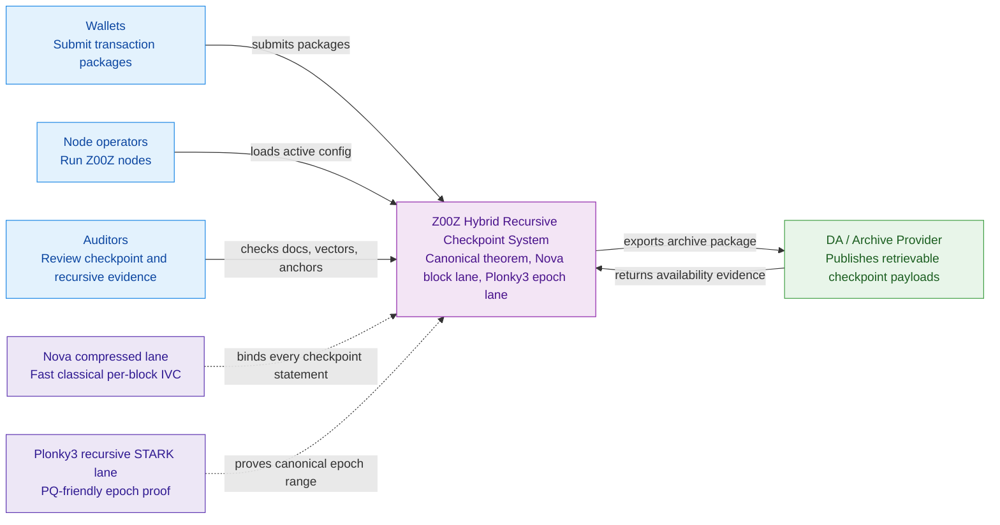
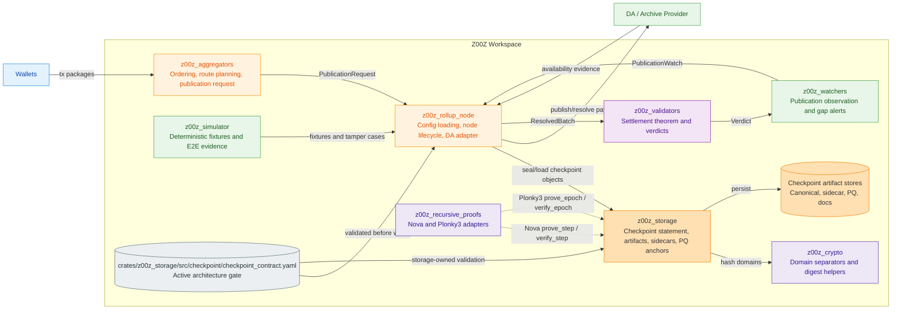
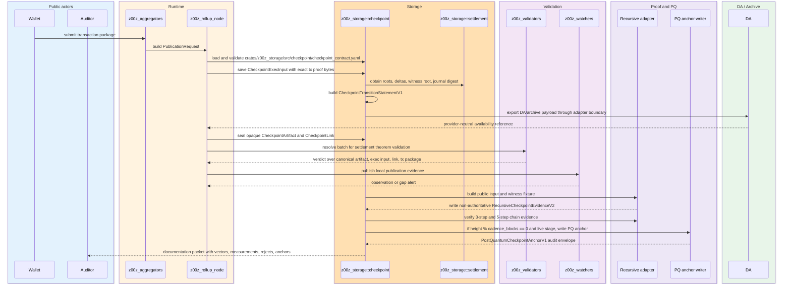
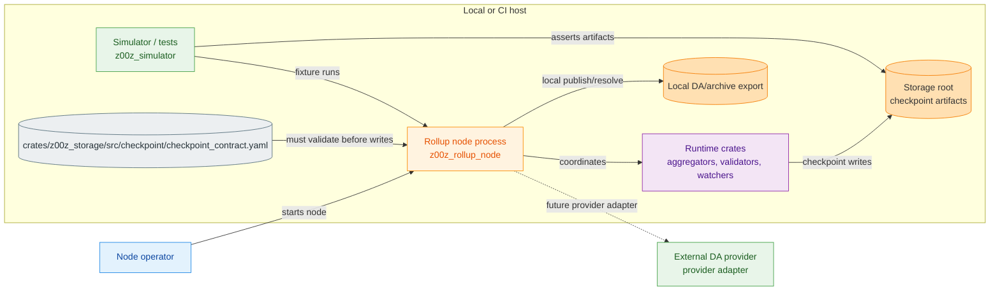
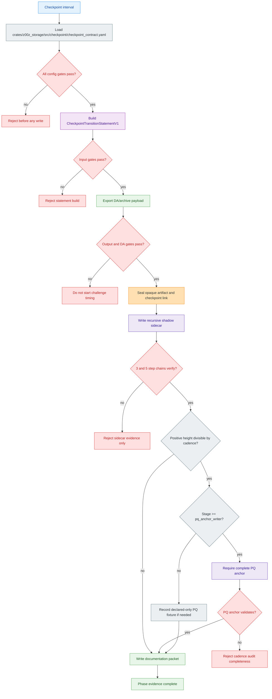
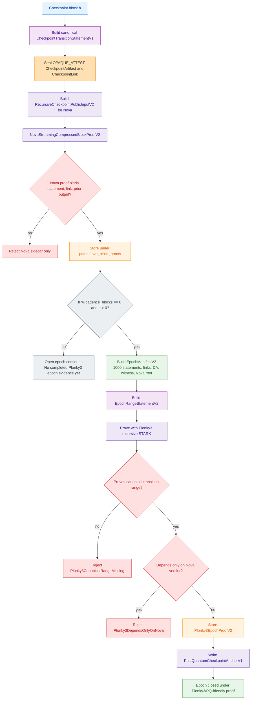
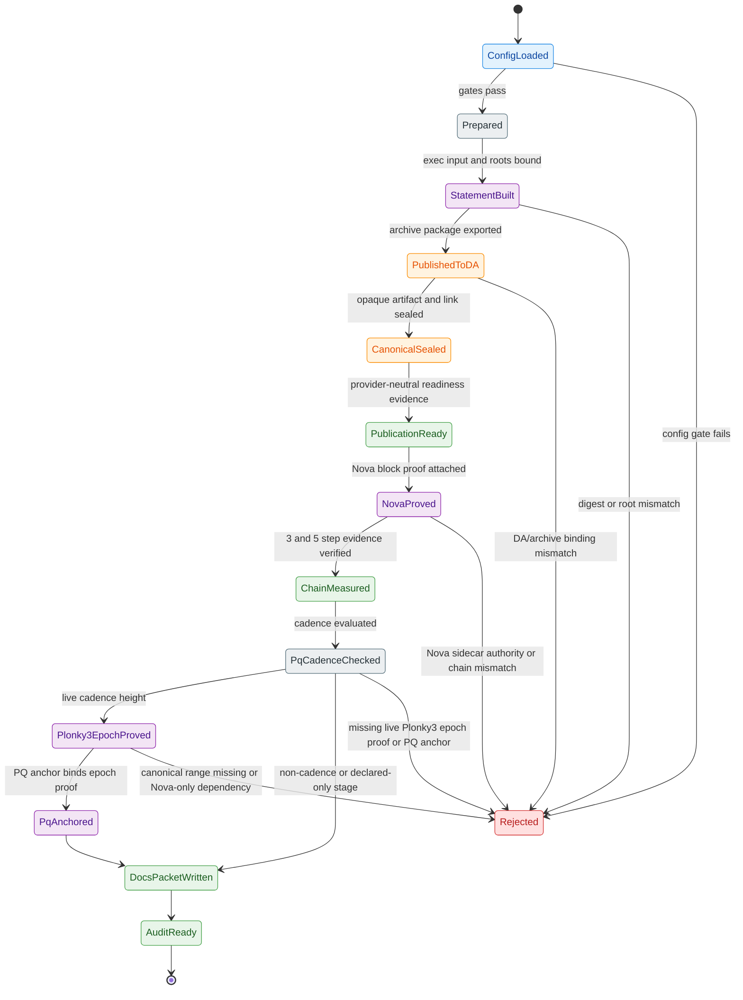

# Phase 069 Recursive Proof Spec

## 🎯 Purpose

📌 This document is the self-contained Phase 069 specification for recursive
checkpoint proof work in Z00Z. It converts the Phase 069 idea corpus into one
code-facing contract that can be implemented, tested, and audited without
promoting speculative proof claims into live checkpoint authority.

📌 Phase 069 MUST implement the recursive-ready proof architecture over the
checkpoint transition statement from
`docs/tech-papers/Recursive-Ready-Checkpoint-Contract.md`. The selected
implementation architecture is hybrid:

- Nova IVC fold on every checkpoint block, with compressed proof snapshots at
  a measured/configured cadence, as a fast classical lane.
- Plonky3 recursive STARK epoch proof every configured PQ cadence interval,
  default `1000` blocks, as PQ-oriented outer proof evidence over the accepted
  checkpoint transition-consistency predicate.
- Canonical checkpoint artifacts, exact transaction proof bytes, HJMT roots,
  witness roots, DA/archive manifests, and checkpoint links remain mandatory.

📌 The Plonky3 epoch proof MUST prove or re-check the accepted canonical
transition-consistency predicate for every step in the epoch. It MUST NOT be a
STARK wrapper that only proves "1000 Nova proofs verified". The epoch proof MAY
bind the Nova chain root as additional performance/audit evidence. It still
MUST NOT be described as end-to-end post-quantum checkpoint validity while the
accepted transaction theorem depends on classical signatures, commitments,
range proofs, or spend proofs. Phase 069 proves the explicitly scoped predicate;
it does not upgrade the assumptions of nested classical primitives.

📌 Phase 069 still MUST NOT replace the current spend verifier, range-proof
verifier, checkpoint artifact codec, checkpoint link, or canonical replay path.
`CheckpointProofSystem::VERIFIED` remains disabled until a later promotion
stage has real verifier code, codec support, rollback policy, benchmarks,
negative tests, and security review.

📌 The primary output of this phase is a deterministic hybrid recursive
checkpoint implementation over the existing storage contract: a real Nova IVC
step lane, a real Plonky3 base-STARK and recursive epoch lane, typed public
inputs, proof objects, epoch manifests, cryptographic verifier adapters, typed
reject reasons, measurements, storage path gates, and 3 to 5 step chain evidence
for prior-output binding. Shape validation or arbitrary non-empty proof bytes do
not satisfy this output.

📌 The secondary output is a recursive documentation and audit packet that makes
the hybrid lane reviewable: statement vectors, object schemas, rejection matrix,
benchmark metadata, backend-manifest red lines, Plonky3/Nova parameter
decisions, and PQ epoch artifact evidence for every configured 1000-block
boundary once enforcement is active.

## 🧭 Document Structure

📌 This spec is intentionally long-form. It is the Phase 069 single source of
truth. Implementation agents MUST NOT need to re-open the research chats to
decide what to build, reject, test, or measure.

Reading order:

1. Authority and source disposition define which upstream claims survived.
2. Current code truth anchors the design in live repository modules.
3. Architecture doublecheck ledger records each major decision, source, code
   confirmation, and gate.
4. Object contracts define the statement, public input, witness, proof, sidecar,
   chain evidence, measurements, PQ anchor, and documentation packet.
5. Config gates define the real repository YAML file that controls modes,
   limits, paths, stage promotion, retention, DA, and PQ cadence.
6. Module placement defines where the implementation lives across storage,
   runtime, rollup node, crypto, simulator, and `z00z_recursive_proofs`.
7. Diagrams provide C4 and Mermaid-spectrum views of the same architecture.
8. Failure model, tests, acceptance criteria, implementation slices, and
   artifacts define how Phase 069 is accepted.

## 🚦 Pre-Planning Readiness Gate

📌 Phase 068 completed after the first draft of this document and already
landed much of the storage contract that older Phase 069 slices described as
future work. Phase 069 planning MUST start from current source and tests, not
from the historical implementation tense in this spec.

⚠️ **Registration constraint:** The canonical phase directory already exists at
`.planning/phases/069-Recursive-Proof/`, while higher-numbered scenario/future
directories also exist. The append-only `gsd-add-phase` implementation scans
on-disk phase numbers and would allocate after the highest one rather than
register this existing Phase 069. Registration MUST reuse this exact directory
through an existing-phase roadmap registration/edit path. It MUST NOT call
`phase.add`, create a duplicate `069-*` directory, or renumber this spec.

| Surface | Current baseline on 2026-07-11 | Phase 069 planning treatment |
| --- | --- | --- |
| Statement/core/final digests | Implemented in `artifact_stmt.rs`. | Reuse and regression-test; do not introduce a second theorem. |
| Recursive public input, evidence, measurement, chain evidence, codec, and verifier | Absent at T0; the former implementation is eradicated. | T1 creates the sole V2 path `z00z_storage::checkpoint::recursive_v2`; no compatibility surface exists. |
| PQ anchor envelope and cadence gate | Implemented in `pq_anchor.rs` and `contract_config.rs`. | Reuse as audit metadata; bind only verified backend outputs. |
| Archive manifests/receipts, retrieval audits, snapshots, and pruning decisions | Implemented under `z00z_storage::checkpoint`. | Keep as inherited regression constraints; do not reimplement them in the V2 recursive module. |
| Nova backend | No `nova-snark` dependency, step circuit, prover, or verifier is present. | New Phase 069 implementation scope. |
| Plonky3 recursion backend | No `p3-recursion` dependency, checkpoint AIR, base proof, recursive aggregation, prover, or verifier is present. | New Phase 069 implementation scope. |
| Recursive implementation root | No recursive source exists at T0. | T1 creates only `z00z_storage::checkpoint::recursive_v2` after its dependency and predicate gates pass. |

📌 The planner MUST preserve these readiness decisions:

1. **No duplicate baseline work.** Existing storage-owned objects are inputs to
   the plan. Any replacement requires a migration and caller inventory, not a
   parallel type family.
2. **Dependency preflight first.** Record an exact compatible `nova-snark` and
   `p3-*` set, MSRV/toolchain impact, license, feature flags, transitive audit
   surface, and a compile-only compatibility probe before backend code.
3. **Predicate before prover.** Freeze the exact R1CS/AIR predicate, field
   encoding, hash gadgets, public-input order, witness schema, and golden vectors
   before implementing either backend.
4. **Real verification.** A plan cannot close a backend slice by accepting a
   boolean claim, digest-shaped placeholder, arbitrary bytes, or a shape-only
   verifier.
5. **Honest security vocabulary.** Existing identifiers such as
   `PqEpochFinality` and `is_pq_authoritative` are legacy configuration labels.
   They do not grant checkpoint finality or end-to-end PQ authority. Phase 069
   MUST either migrate them versionedly to evidence-oriented names or document
   their compatibility-only meaning at every public boundary.
6. **Spike failure is a valid stop.** If the exact checkpoint predicate cannot
   be represented with the selected backend within bounded proving time,
   memory, or auditability, stop after the feasibility packet and split a
   successor phase. Do not close Phase 069 with a mock backend.

📌 Planning readiness means the unknowns above are explicit, ordered gates. It
does not mean their technical outcomes are predetermined.

## 🔐 Authority Chain

📌 Live normative sources for this spec:

- This document as the Phase 069 single source of truth.
- `docs/tech-papers/Recursive-Ready-Checkpoint-Contract.md`
- `.planning/phases/068-Checkpoint-Contract/068-TODO.md`
- Current code under `crates/z00z_storage/src/checkpoint/`
- Current code under `crates/z00z_storage/src/settlement/`
- Current validator, watcher, rollup-node, and simulator checkpoint/publication
  seams under `crates/z00z_runtime/`, `crates/z00z_rollup_node/`, and
  `crates/z00z_simulator/`

📌 Historical Phase 069 proposal inputs fully incorporated into this spec and
removed from `.planning/phases/069-Recursive-Proof/` after extraction:

- `+69-70-proposal.md`
- `+69-70-proposal.audit.md`

📌 Historical supporting research inputs fully incorporated into this spec and
removed from `.planning/phases/069-Recursive-Proof/` after extraction:

- `README.md`
- `README-recursive_proofs.md`
- `z00z-recursive-proofs.md`
- `nova-supernova.md`
- `20-Recursive checkpoint proof.md`
- `11_Z00Z_Recursive_StateProof.md`
- `12_chat-PQ Recursive Proof-last.md`
- `13_chat-Recursive Proof Analysis.md`
- `14_chat-Обзор PQ рекурсивных доказательств.md`

⚠️ The supporting research inputs are not direct implementation authority.
They contribute failure cases, threat-model warnings, retention requirements,
measurement questions, and backend evaluation checklists only after they are
filtered by this spec and the recursive-ready checkpoint contract.

## 📚 Source Disposition

| Source | Accepted into Phase 069 | Rejected or deferred |
| --- | --- | --- |
| `README.md` and `README-recursive_proofs.md` | Exact statement first, no spend verifier replacement, 3 to 5 step chain, proof-size/prover/verifier measurements, recursive sidecar evidence. | Backend-first design that does not bind the checkpoint contract or tries to use proof-system choice as theorem authority. |
| `z00z-recursive-proofs.md` | State-transition model with `root_old`, update witness, `root_new`, prior-output binding, and Nova-compatible per-block IVC flow. | Nova or SuperNova as PQ/final authority. |
| `nova-supernova.md` | Nova per-block IVC lane, compression as a separately measured operation, SuperNova as future non-uniform-step comparison, and classical IVC measurement categories. | Proof-size claims as Z00Z implementation facts before local measurement; ECC proofs as quantum-safe history locks. |
| `20-Recursive checkpoint proof.md` | Historical baseline: no cryptographic recursive backend chain existed. Phase 068 later added storage-owned shape/chain evidence, but no real Nova or Plonky3 verification. | Treating shape-chain fields as live cryptographic proofs. |
| `11_Z00Z_Recursive_StateProof.md` | Chain failure cases, nullifier/spent retention, fraud/audit evidence categories. | Link tag as recursive proof authority, 100 byte proofs, 200 KB active state, IPFS-only history. |
| `12_chat-PQ Recursive Proof-last.md` | PQ cautions, storage/recovery warnings, nullifier permanence, DA availability warnings. | Magic aggregation, same-challenge aggregation, production PQ theorem closure. |
| `13_chat-Recursive Proof Analysis.md` | ECC attack model, RNG/reuse risks, genesis trust, quantum migration warning. | DLP-based proof as long-term PQ-safe authority. |
| `14_chat-Обзор PQ рекурсивных доказательств.md` | PQ backend evidence checklist: parameters, ABI, vectors, PoK, center-lift, domain slots, constant-time review; STARK/FRI as the practical PQ-friendly implementation direction for Phase 069. | Pedersen binding as PQ-safe, unproved RLWE/folding claims, LatticeFold/RLWE/Fractal as live production backends. |
| `plonky3-stark.md` | Primary real implementation target: Nova fold every block plus measured-cadence compression and a Plonky3 recursive STARK epoch proof every `post_quantum.cadence_blocks`; Plonky3 must prove the scoped canonical predicate and may bind Nova root. | Plonky3 proof that only verifies Nova proofs; permanent storage of all per-block STARK proofs; exact proof-size claims without Z00Z benchmarks. |
| `068-TODO.md` | Checkpoint-contract-first architecture, recursive branch surfaces, DA readiness gate, retention policy, stage transitions, and 1000-block PQ epoch cadence. | Treating a generic PQ anchor as enough once Plonky3 epoch proof is selected, or enabling live cadence before `pq_anchor_writer`. |
| `+69-70-proposal.md` | Wave 69 scope and Wave 70 dependency boundaries. | DA/publication evidence as recursive proof authority. |
| `+69-70-proposal.audit.md` | Conflict resolutions and residual risks. | Any source group marked rejected or research-only. |

### 🔗 Imported Backend Reference Ledger

📌 The following references were imported from `plonky3-stark.md` so the Phase
069 spec can stand alone after the idea file is removed. These links are
evidence for backend selection and risk classification; they are not runtime
configuration and MUST NOT bypass repository dependency pinning.

| Reference | Phase 069 use | Imported decision |
| --- | --- | --- |
| [Plonky3](https://github.com/Plonky3/Plonky3) | Primary STARK toolkit candidate. | Use as the default STARK family because it is Rust-native, supports FRI/STARK-oriented primitives, and includes KoalaBear/Poseidon2-relevant components. |
| [Plonky3-recursion](https://github.com/Plonky3/Plonky3-recursion/) | Primary recursive STARK implementation target. | Use for `plonky3_stark_epoch_v2` only behind non-authoritative Phase 069 gates until audit and promotion evidence exists. |
| [Plonky3-recursion benchmarks](https://plonky3.github.io/Plonky3-recursion/appendix/benchmark.html) | Measurement planning input. | Treat any timing or proof-size number as a Z00Z measurement target, not as a verified Z00Z result. |
| [Plonky3 audit report](https://leastauthority.com/wp-content/uploads/2024/11/Updated_071124_Polygon_Plonky3_Final_Audit_Report.pdf) | Security-review reference for the Plonky3 base stack. | Audit coverage is not equivalent to full audit coverage of `Plonky3-recursion`; Phase 069 must still record recursion-specific risk. |
| [Nova](https://github.com/microsoft/Nova) | Secondary fast classical IVC baseline. | Fold every block; choose compressed snapshot cadence from local measurements; never use Nova as PQ authority. |
| [Nova paper](https://par.nsf.gov/servlets/purl/10440508) | Classical proof-size and IVC reasoning reference. | Treat 8 KiB to 30 KiB as a rough planning target until Z00Z fixtures measure local proofs. |
| [Arecibo](https://github.com/lurk-lang/arecibo) | Nova/SuperNova-family comparison lane. | Keep as benchmark or future non-uniform-step candidate, not as the Phase 069 primary backend. |
| [LatticeFold](https://github.com/NethermindEth/latticefold) | PQ folding research track. | Keep as research-only until production parameters, ABI, vectors, audit, and implementation gates exist. |
| [Fractal paper](https://link.springer.com/chapter/10.1007/978-3-030-45721-1_27) and [libiop](https://github.com/scipr-lab/libiop) | Transparent recursive-proof design reference. | Do not use as implementation base because the available implementation path is C++/academic-reference oriented. |
| [HyperPlonk](https://github.com/EspressoSystems/hyperplonk) | Future prover/circuit comparison. | Do not select as primary because Phase 069 targets a recursion-first STARK epoch artifact. |
| [Winterfell](https://github.com/facebook/winterfell) | Generic STARK fallback reference. | Do not use standalone Winterfell as the recursive backend because Phase 069 selects Plonky3-recursion for the STARK lane. |
| [STARK paper](https://eprint.iacr.org/2018/046) | Transparent/STARK/FRI security-family reference. | Use only for security-family reasoning; implementation authority remains the selected, pinned backend plus local Z00Z tests. |

📌 `plonky3-stark.md` import coverage:

| Source block | Spec home | Status |
| --- | --- | --- |
| Backend pros/cons table for Nova, SuperNova, Plonky3, Fractal, HyperPlonk, LatticeFold, RLWE, and generic STARK/Winterfell. | `Hybrid Backend Architecture` and `Backend And PQ Policy`. | Imported and normalized into Phase 069 decisions. |
| Proof-size and overhead tables. | `Nova Block Proof Contract`, `Plonky3 Epoch Proof Contract`, `Config Gates`, and `Measurement Contract`. | Imported as targets and hard caps; exact numbers remain measurement-gated. |
| Hybrid flow: Nova every block, Plonky3 every 1000 blocks. | `Hybrid Backend Architecture`, `Post-Quantum Cadence Contract`, `Required Workflow`, and `Gate Flow`. | Imported and made normative through config gates. |
| Warning that Plonky3 must not only verify Nova proofs. | `Non-Negotiable Invariants`, `Plonky3 Epoch Proof Contract`, `Reject Reason Contract`, `Failure Model`, and acceptance criteria `RCP-AC-021`/`RCP-AC-022`. | Imported as a hard rejection rule. |
| Retention rule: do not store every per-block STARK proof permanently. | `Hybrid Backend Architecture`, `Long-Term Archive Retention Contract`, `Config Gates`, and `Required Artifacts`. | Imported and extended with archive manifests, receipts, retrieval audits, snapshots, and pruning gates. |
| Config deltas for Nova, Plonky3, PQ cadence, and proof-size caps. | `Config Gates`, `crates/z00z_storage/src/checkpoint/checkpoint_contract.yaml`, and `CheckpointContractConfigV1`. | Imported into the active runtime gate. |

⚠️ External source recheck on 2026-07-11:

- Official `Plonky3-recursion` documentation exposes `p3-recursion` `0.1.0`
  and the upstream repository states that the code is under active development,
  unaudited, and not recommended for production use.
- The workspace currently pins selected base `p3-*` crates at `0.4.2`; this is
  not evidence that they are API-compatible with the recursion crate.
- The official Nova implementation separates incremental folding from optional
  compressed proof generation. Phase 069 therefore measures compression
  cadence rather than assuming one compression per block.
- These are preflight inputs, not dependency selections. The implementation
  plan must recheck them and pin exact compatible revisions at execution time.

## 🧱 Implementation Dependency And Installation Matrix

📌 Phase 068 defines the checkpoint theorem, storage contract, and YAML gate.
It does not pin recursive backend libraries. Phase 069 is the dependency
authority for Nova, Plonky3, and IPFS/Kubo integration. It owns IPFS/Kubo pins
only if a live IPFS adapter is explicitly included in a Phase 069 execution
plan; storage schema support alone does not require installing Kubo.

📌 Default ownership for dependency wiring:

- `crates/z00z_storage/src/checkpoint/` keeps the statement, artifact, evidence,
  PQ anchor codecs, configuration validation, and the sole V2 recursive module.
- `z00z_storage::checkpoint::recursive_v2` owns the Nova and Plonky3 adapter
  boundary, proving/verifying APIs, benchmark harnesses, and backend dependency pins.
- `z00z_rollup_node` SHOULD own Kubo/IPFS RPC wiring and archive-operator
  process integration, not checkpoint theorem bytes.

| Dependency surface | Install target | Required package(s) | Primary docs | Phase 069 rule |
| --- | --- | --- | --- | --- |
| Nova block proof lane | `z00z_storage::checkpoint::recursive_v2::nova` | [`nova-snark`](https://docs.rs/nova-snark/), [Microsoft/Nova repository](https://github.com/microsoft/Nova), [Nova paper](https://par.nsf.gov/servlets/purl/10440508) | `docs.rs`, repository README/examples, paper | MUST implement `NovaStreamingCompressedBlockProofV2`; MUST stay non-PQ; MUST pin one exact crate version or git revision in workspace metadata before the first adapter lands. |
| Plonky3 recursion lane | `z00z_storage::checkpoint::recursive_v2::plonky3` | [`p3-recursion`](https://docs.rs/crate/p3-recursion/latest), [`p3-uni-stark`](https://docs.rs/crate/p3-uni-stark/latest), [`p3-fri`](https://docs.rs/crate/p3-fri/latest), [`p3-commit`](https://docs.rs/crate/p3-commit/latest), [`p3-challenger`](https://docs.rs/crate/p3-challenger/latest), [`p3-field`](https://docs.rs/crate/p3-field/latest), [`p3-matrix`](https://docs.rs/crate/p3-matrix/latest), [Plonky3 repository](https://github.com/Plonky3/Plonky3), and [Plonky3-recursion repository](https://github.com/Plonky3/Plonky3-recursion/) | `docs.rs`, upstream repositories, local benchmark vectors | MUST implement `Plonky3EpochProofV2`; MUST pin one approved compatibility set; MUST NOT mix unrelated `p3-*` release families inside the same workspace. |
| Plonky3 field/hash profile | Same V2 module plus shared crypto helpers | [`p3-koala-bear`](https://docs.rs/crate/p3-koala-bear/latest), [`p3-poseidon2`](https://docs.rs/crate/p3-poseidon2/latest), and when sponge helpers are needed [`p3-symmetric`](https://docs.rs/crate/p3-symmetric/latest) | `docs.rs` plus the upstream Plonky3 workspace manifest | MUST match config `field: koala_bear` and `hash: poseidon2`; any alternative field/hash pair rejects unless config, vectors, proofs, and tests move together. |
| IPFS archive RPC client | `z00z_rollup_node` archive adapter or future archive crate | [`ipfs-api-backend-hyper`](https://docs.rs/crate/ipfs-api-backend-hyper/latest) | `docs.rs` crate docs | Conditional scope only. If `ipfs_pinned` is exercised, the adapter MUST talk to an external pinned Kubo node over local or private RPC, emit receipts/pinning evidence, and keep SDK types outside canonical checkpoint modules. |
| IPFS/Kubo daemon | Operator host, CI fixture, archive node | [Kubo install guide](https://docs.ipfs.tech/install/command-line/), [Kubo quick start](https://docs.ipfs.tech/how-to/command-line-quick-start/), and [Kubo RPC reference](https://docs.ipfs.tech/reference/kubo/rpc/) | Official IPFS docs | Install only when a Phase 069 plan includes the `ipfs_pinned` integration fixture. RPC MUST stay localhost or otherwise private; public RPC exposure is forbidden. |

📌 Version-lock rules:

- A coder MUST NOT start the real backend implementation with floating versions
  such as `*`, `latest`, or unreviewed HEAD checkouts.
- The workspace already contains `p3-field`, `p3-goldilocks`,
  `p3-poseidon2`, and `p3-symmetric` under `crates/z00z_crypto/Cargo.toml`.
  Phase 069 implementation MUST either migrate that family to the selected
  recursion-compatible set in one reviewed wave or isolate recursive backend
  dependencies behind a compatibility-safe crate boundary.
- `cargo add` without an exact version or reviewed git revision is forbidden
  for `nova-snark`, `p3-*`, and the IPFS client crate.
- The exact pinned dependency set and the Kubo binary version used by local
  fixtures or CI MUST be recorded in the Phase 069 documentation packet and in
  the live backend crate manifest.
- `latest` documentation URLs in this section are discovery links only. They
  MUST NOT be copied into dependency commands or used as evidence of API
  compatibility.

## 🧾 Key Terms

| Term | Meaning in Phase 069 |
| --- | --- |
| `CheckpointTransitionStatementV1` | The canonical storage-owned statement defined by the recursive-ready checkpoint contract. Every recursive sidecar binds this exact statement digest. |
| `RecursiveCheckpointPublicInputV2` | The proof-facing public input object derived from the statement digest, roots, chain position, backend label, and prior-output binding. |
| `RecursiveCheckpointWitnessV2` | Missing Phase 069 contract that binds context/predicate plus bounded replay/HJMT/spent/delta material used by real proof adapters. It is not canonical state truth. |
| `RecursiveCheckpointProofV2` | Existing Phase 068 single-checkpoint proof envelope. Phase 069 may use it for Nova step/snapshot evidence, but MUST NOT overload its single-statement fields with an epoch proof. |
| `NovaStreamingCompressedBlockProofV2` | Classical compressed snapshot of the running per-block IVC state. It binds statement digest, checkpoint link, prior Nova output, output root, context, predicate, and parameters; it is not PQ authority. |
| `NovaEpochChainRootV2` | Merkle or commitment root over the ordered Nova block proof digests and statement digests for one epoch. It is optional evidence inside the Plonky3 epoch statement, not the source of PQ soundness. |
| `EpochRangeStatementV2` | Statement for one configured epoch range. It binds start/end heights, start/end roots, previous PQ anchor root, ordered statement root, DA/archive manifest root, witness/delta roots, and optional Nova chain root. |
| `Plonky3EpochProofV2` | Recursive STARK proof for one epoch range using Plonky3/Plonky3-recursion. It must prove the canonical transition range and bind public inputs; it is the selected PQ-friendly epoch lane. |
| `EpochManifestV2` | Retained manifest for a completed epoch: statements, canonical artifacts, links, DA refs, witness roots, Nova proof digests, Plonky3 proof digest, sizes, and retention locations. |
| `Archive Retention Layer` | Z00Z-owned long-term retrieval layer over content-addressed archive manifests, pinned IPFS/CID references, archive node replicas, provider receipts, and retrieval audits. It is separate from Celestia DA. |
| `CheckpointArchiveManifestV1` | Permanent compact metadata root over raw packages, exact proof bytes, witness chunks, deltas, DA payload commitment, archive provider receipts, and retrieval audit roots. |
| `ArchiveProviderReceiptV1` | Provider-neutral evidence that a configured archival backend stores a content-addressed object. It may reference IPFS pinning, paid archival providers, Filecoin-like storage, local archive nodes, or cold object storage. |
| `RetrievalAuditV1` | Periodic proof that archived objects are still retrievable from enough independent replicas. It is an availability/retrieval gate, not state validity. |
| `StateSnapshotV1` | Bootstrap object binding state root, settlement root, latest Plonky3 epoch proof, latest epoch manifest root, archive manifest root, snapshot chunk root, and PQ anchor root. |
| `Full-node pruning` | Local deletion of replay bytes by ordinary full nodes after dispute, Plonky3, manifest, archive replication, and retrieval-audit gates pass. |
| `Archive-node pruning` | Deletion by archive replicas. This is forbidden in the default Phase 069 profile. |
| `RecursiveCheckpointEvidenceV2` | Non-authoritative attachment that stores the proof object, verdict, reject reason, and measurements for one checkpoint transition or epoch proof reference. |
| `RecursiveCheckpointChainEvidenceV2` | A 3 to 5 step ordered chain of sidecars proving prior-output binding and tamper rejection. |
| `RecursiveCheckpointMeasurementV2` | Local measurement payload for proof bytes, witness bytes, prover time, verifier time, memory, chain length, and backend label. |
| `RecursiveCheckpointRejectReasonV2` | Stable machine-readable rejection taxonomy for sidecars, proof objects, codecs, and chains. |
| `Canonical branch` | The current authoritative checkpoint path using `CheckpointArtifact`, `CheckpointLink`, `CheckpointExecInput`, exact transaction proof bytes, and `CheckpointProofSystem::OPAQUE_ATTEST`. |
| `Recursive branch` | Hybrid proof lane over the same statement: Nova per block plus Plonky3 epoch proof. It cannot admit checkpoints in Phase 069. |
| `Fast classical lane` | Nova compressed per-block proof lane used for fast local recursion, UX, audit, and benchmarking inside an open epoch. |
| `PQ epoch lane` | Compatibility name for the Plonky3 recursive STARK lane that produces PQ-oriented outer proof evidence under declared hash/FRI/STARK assumptions. It is not end-to-end PQ checkpoint authority. |
| `Open epoch` | The last range of fewer than `post_quantum.cadence_blocks` blocks without a completed Plonky3 epoch proof. It remains protected by canonical replay and retention, not by completed epoch evidence. |
| `Future verified branch` | A later backend-promotion stage after proof object, verifier API, codec, negative tests, benchmarks, security review, and rollback rules exist. |
| `Prior-output binding` | The recursive chain rule where a previous proof output root equals the next statement previous root. |
| `Backend label` | A configured identifier for the proof lane. In the active profile the required labels are `nova_streaming_compressed_v2` and `plonky3_stark_epoch_v2`; local test labels cannot be promoted. |
| `PostQuantumCheckpointAnchorV1` | Epoch audit envelope emitted on configured cadence blocks after live enforcement starts. In this profile it binds Plonky3 epoch proof material, canonical archive roots, and the optional Nova chain root. |
| `PQ cadence` | The configured block interval, default `1000`, where a Plonky3 epoch proof and PQ anchor are required once `authority_promotion.stage >= pq_anchor_writer`. |
| `RecursiveCheckpointDocumentationPacketV2` | Phase 069 closeout packet containing schemas, vectors, chain evidence, measurements, reject matrix, PQ cadence evidence, and rejected-claim register. |

## 🧭 Current Code Truth

📌 Phase 069 starts from these live facts:

| Current surface | Current truth | Phase 069 implication |
| --- | --- | --- |
| `crates/z00z_storage/src/checkpoint/artifact_final.rs` | `CheckpointArtifact` carries version, height, roots, settlement roots, optional claim root, spent/created deltas, optional snapshot and exec IDs, proof system, and proof payload. | Extend by attachment and sidecar evidence only. Do not bypass the artifact. |
| `crates/z00z_storage/src/checkpoint/artifact_stmt.rs` | `CheckpointTransitionStatementV1` binds current checkpoint roots, settlement roots, optional claim root, deltas, prep snapshot ID, and exec input ID. | Phase 069 must derive recursive public inputs from the checkpoint statement, not from an ad hoc theorem. |
| `crates/z00z_storage/src/checkpoint/exec_input.rs` | `CheckpointExecTx` rejects empty input refs, outputs, or `tx_proof`; exact upstream proof bytes are preserved. | Recursive work must not remove or synthesize transaction proof bytes. |
| `crates/z00z_storage/src/checkpoint/artifact_types.rs` | `CheckpointProofSystem::OPAQUE_ATTEST` is live. `CheckpointProofSystem::VERIFIED` is reserved. | Phase 069 cannot enable verified admission. |
| `crates/z00z_storage/src/checkpoint/link.rs` | `CheckpointLink` binds checkpoint ID, prep snapshot ID, and exec input ID with a domain-separated link bind. | Recursive chain evidence must not replace checkpoint links. |
| `crates/z00z_storage/src/checkpoint/mod.rs` | Checkpoint public surface is already a narrow facade over split implementation files. | Add new surfaces through the facade only after ownership is stable. |
| `crates/z00z_storage/src/checkpoint/recursive_v2/` | Absent at T0 by design; no recursive schema, codec, size check, shape verifier, or digest path survives. | T1 creates one V2 relation and real verifier boundary in this exact module path before storage accepts evidence. |
| `crates/z00z_storage/src/checkpoint/pq_anchor.rs` | Phase 068 validates non-zero Plonky3/Nova digest fields and anchor binding, but does not verify the referenced proof bytes. | A digest-complete PQ anchor is not evidence that a Plonky3 proof exists or verifies. Phase 069 must bind it to an actual successful backend verification result. |
| Archive, retrieval, snapshot, and pruning modules | `archive_manifest.rs`, `archive_receipt.rs`, `retrieval_audit.rs`, `state_snapshot.rs`, and `pruning.rs` already implement the storage-owned contracts. | Preserve them as regression gates and integration inputs; do not schedule duplicate type implementations. |
| Recursive backend dependencies | T0 has no recursive dependency or smoke boundary. | Compatibility probing and exact pinning precede T1; existing `p3-*` pins do not prove recursion compatibility. |
| Chain identity | The inherited Phase 068 statement binds checkpoint data but V2 context must add network ID, genesis digest, chain ID, and contract/predicate identity. | Phase 069 adds the canonical V2 context bind before accepting portable proof bytes. |
| `crates/z00z_storage/src/settlement/` | Settlement owns HJMT roots, journals, proof blobs, witness DAGs, and state lineage. | Witness and delta roots must come from settlement-owned material. |
| Runtime publication seams | Phase 068 landed provider-neutral `CheckpointPublicationEvidenceV1` and shared validator/watcher readiness consumption over the local DA adapter. | Reuse the current non-authoritative publication boundary; do not rebuild it or claim live external DA. |
| Checkpoint contract config loader | `crates/z00z_storage/src/checkpoint/contract_config.rs` defines `CheckpointContractConfigV1`, loads `crates/z00z_storage/src/checkpoint/checkpoint_contract.yaml` through bounded YAML IO, denies unknown fields, and rejects every recursive backend enablement at T0. | Runtime writers must call this validated surface before checkpoint, V2 evidence, PQ, archive, snapshot, pruning, documentation, or promotion writes. |

## 🧪 Architecture Doublecheck Ledger

📌 Every major architecture decision below was checked against Phase 068,
Phase 069 source files, and live code. If a future implementation deviates, it
MUST update this ledger and add a test that proves the new boundary.

| Decision | Source confirmation | Code truth confirmation | Phase 069 result | Required gate |
| --- | --- | --- | --- | --- |
| Checkpoint contract first, not backend first. | Phase 068 `CheckpointTransitionStatementV1`; Phase 069 audit says exact statement first. | `z00z_storage::checkpoint` owns artifact, statement, exec input, link, and codec. | Recursive proof work binds one storage-owned statement. | `RCP-INV-001`, statement golden vectors. |
| V2 evidence is non-authoritative until T4. | Phase 069 requires V2 evidence and `VERIFIED` disabled; AUDIT-2 fixes Nova+Plonky3 roles. | `CheckpointProofSystem::OPAQUE_ATTEST` is live; `VERIFIED` is reserved and codec rejects unsupported proof classes. | V2 evidence cannot mutate or admit canonical artifacts before promotion. | Config branch gate plus artifact admission tests. |
| Storage owns contract objects. | Phase 068 says config validator and statement live under storage checkpoint module. | `CheckpointFsStore`, codec, link validation, exec input, and `CheckpointContractConfigV1` live under `crates/z00z_storage/src/checkpoint/`. | Add V2 evidence, PQ anchor binding, and digest helpers through the same storage facade; keep config validation storage-owned. | Storage config tests and path gates. |
| Runtime validators consume theorem; they do not redefine it. | Phase 068 forbids duplicate checkpoint theorem. | `crates/z00z_runtime/validators` is crate `z00z_validators`; `SettlementTheoremBundle` verifies artifact, exec input, link, and tx package. | Validators may reject sidecar authority but MUST NOT own recursive theorem. | Validator non-authority integration tests. |
| Rollup node wires lifecycle and DA adapters. | Phase 068 keeps provider SDKs behind DA/export adapter boundary. | `crates/z00z_rollup_node/src/da.rs` has `DaAdapter`, `LocalDaAdapter`, publication binding, and resolve path. | Rollup node loads/passes config and DA evidence; it does not define statement bytes. | DA SDK leakage tests. |
| Watchers observe publication readiness only. | Phase 068 says watcher evidence is not settlement authority. | `z00z_watchers::PublicationWatch` checks runtime, validator, and storage bindings. | Watchers can report readiness/gaps, not recursive validity. | Publication readiness and no-authority tests. |
| Real recursive implementation is active only after storage contract gates. | User-approved architecture selects real implementation targets, not placeholder scaffolds. | T0 contains no recursive backend; T1 creates `z00z_storage::checkpoint::recursive_v2` as the sole verifier-gated boundary. | The V2 module owns Nova and Plonky3 adapters while the checkpoint facade owns statement bytes, artifact codecs, path gates, and reject taxonomy. | Implementation slices `069-05` through `069-08`. |
| Nova compressed proof runs every block. | `plonky3-stark.md` resolves Nova as fast classical lane. | Config now contains `branches.nova.cadence_blocks: 1`, `proof_system: nova_streaming_compressed_v2`, and `is_pq_authoritative: false`. | Every checkpoint block should be able to emit a Nova proof binding statement digest, checkpoint link, prior Nova output, and output root. | Nova branch config tests and chain tests. |
| Plonky3 recursive STARK locks every epoch. | `plonky3-stark.md` resolves Plonky3/STARK as primary PQ-friendly epoch lane. | Config now contains `branches.plonky3_epoch.cadence_blocks: 1000`, `proof_system: plonky3_stark_epoch_v2`, `field: koala_bear`, `hash: poseidon2`, `security_bits: 124`, `recursion_library: p3_recursion`. | At every configured positive cadence height, emit a Plonky3 epoch statement/proof/anchor that binds the canonical 1000-block range. | Cadence tests at heights 999 and 1000; Plonky3 config tests. |
| Plonky3 MUST NOT depend only on Nova. | Quantum attack can break ECC/Nova and then a STARK wrapper over Nova verifier would only prove false classical proofs verify. | Config has `must_prove_canonical_transition_range: true` and `must_not_depend_only_on_nova: true`. | Plonky3 epoch proof may bind `nova_chain_root`, but PQ soundness must come from canonical transition range, roots, witnesses, deltas, and archive commitments. | `Plonky3DependsOnlyOnNova` negative test. |
| PQ epoch artifact budget is explicit. | Plonky3/STARK proofs are larger than ECC/Nova; per-block STARK retention is too expensive. | Config limits reserve 8 MiB recursive proof cap, 16 MiB Plonky3 epoch proof/PQ anchor caps, 128 KiB Nova block proof cap, and 128 MiB Nova epoch archive cap. | Store final epoch proof and manifest permanently; retain Nova block proofs through the PQ epoch window; avoid permanent storage of every internal STARK aggregation proof. | Proof-size cap tests and retention tests. |
| Celestia is DA, not forever archive. | Phase 068 separates DA reference from archive manifest; Celestia-style DA availability does not imply indefinite historical retrieval. | Config has `archive_retention.celestia_is_da_only: true` and long-term retrieval gates. | DA publication can start challenge timing, but Z00Z archive retention owns long-term retrieval. | Celestia-as-archive negative config test. |
| Recursive proofs do not replace retrievability. | Recursive proof validates a statement; it does not store raw tx packages, witness bytes, exact proof bytes, explorer data, or migration material. | Config requires archive manifests, provider receipts, retrieval audits, and snapshots in addition to Nova/Plonky3 proof objects. | Full nodes may prune locally only after archive/snapshot gates; archive replicas must not prune. | Archive retention and pruning tests. |
| IPFS requires pinning and receipts. | Content addressing alone only names bytes; it does not guarantee they remain hosted. | Config requires `ipfs_pinning_required: true`, provider receipts, and retrieval audits. | IPFS may be one backend, but never the only persistence guarantee without pins and audits. | IPFS-without-pinning negative test. |
| Exact tx proof bytes remain retained. | Phase 068 retention gate and Phase 069 audit require raw/witness retention. | `CheckpointExecTx::new` rejects empty `tx_proof` and stores exact bytes. | Recursive proofs cannot remove replay material. | Storage integration test. |
| Config YAML is a runtime gate, not documentation. | Phase 068 requires `crates/z00z_storage/src/checkpoint/checkpoint_contract.yaml` and startup validation; Phase 069 adds Nova and Plonky3 branch gates. | `z00z_storage::checkpoint::contract_config` now implements strict schema validation for this exact file; `z00z_rollup_node::config` has other YAML loaders and may call or mirror storage validation for startup reporting. | The repository config is active architecture state, not a decorative fixture. Runtime call-sites that write checkpoint-family artifacts must use the validated storage contract. | `cargo test -p z00z_storage checkpoint::contract_config -- --nocapture`. |

## 🎯 Scope

### ✅ In Scope

- Define the Phase 069 recursive sidecar data contract.
- Define `RecursiveCheckpointPublicInputV2` canonical binary bytes.
- Define `RecursiveCheckpointWitnessV2` local witness fixture requirements.
- Define `NovaStreamingCompressedBlockProofV2`, `Plonky3EpochProofV2`,
  `EpochRangeStatementV2`, and strict codec rules.
- Define `RecursiveCheckpointEvidenceV2` and storage attachment rules.
- Define `RecursiveCheckpointVerifierV2` and Nova/Plonky3 proof-adapter
  semantics.
- Define `RecursiveCheckpointRejectReasonV2` with deterministic failure outputs.
- Define `RecursiveCheckpointMeasurementV2` and benchmark metadata requirements.
- Build deterministic 3 to 5 step chain evidence over checkpoint statements,
  with Nova per-block proof semantics.
- Prove canonical checkpoint admission is unchanged by recursive sidecars.
- Preserve exact transaction proof bytes and witness/archive obligations.
- Reuse `PostQuantumCheckpointAnchorV1`; add the missing `EpochManifestV2` and
  bind both to actual backend verification receipts.
- Define Plonky3 epoch proof cadence, public inputs, proof-size limits,
  retention, and negative gates.
- Define Nova block proof cadence, per-block chain root, retention, and negative
  gates.
- Regression-test the existing Archive Retention Layer, provider receipts,
  retrieval audits, and Celestia-as-DA-only boundary against verified backend
  receipts.
- Regression-test the existing `StateSnapshotV1` and pruning contracts; Phase
  069 does not create replacement types.
- Define the required `RecursiveCheckpointDocumentationPacketV2` closeout
  content.
- Add tests, fixtures, and scenario evidence for all gates in this spec.

### 🚫 Out Of Scope

- Treating Nova, SuperNova, Fractal, HyperPlonk, LatticeFold, RLWE, or generic
  STARK claims as production truth outside the selected Nova+Plonky3 profile.
- Treating Nova compressed proofs as PQ authority.
- Treating a Plonky3 epoch proof that only wraps Nova verifier execution as
  PQ-oriented epoch evidence or finality.
- Permanently storing every internal per-block STARK aggregation proof as the
  default consensus retention path.
- Enabling `CheckpointProofSystem::VERIFIED` for canonical admission.
- Replacing current spend verification, range-proof verification, transaction
  package verification, or checkpoint replay verification.
- Removing exact transaction proof bytes from `CheckpointExecInput`.
- Treating link tags as recursive proof authority.
- Claiming 100 byte recursive proofs, 200 KB active state, or Mina-equivalent
  state size without measured backend evidence.
- Treating DA publication, watcher evidence, or publication readiness as
  state-transition validity.
- Treating Celestia DA as permanent historical storage.
- Treating IPFS CID publication without pinning, provider receipts, and
  retrieval audits as archival persistence.
- Treating recursive proofs or Plonky3 epoch proofs as a replacement for all
  retrievable raw/witness/archive material.
- Allowing archive nodes to prune retained history in the default profile.
- Claiming post-quantum recursive security from classical commitments,
  discrete-log assumptions, unproved folding sketches, or Nova proof validity.
- Implementing weak subjectivity, fraud economics, bridge support, or production
  DA provider integration as Phase 069 closure requirements.

## 🔒 Non-Negotiable Invariants

| Invariant | Requirement | Proof surface |
| --- | --- | --- |
| `RCP-INV-001 Statement First` | Every recursive object MUST bind the exact `CheckpointTransitionStatementV1` digest. | Codec tests, golden vectors, chain tests. |
| `RCP-INV-002 Same Theorem` | A backend MUST NOT introduce a second checkpoint theorem. | Public input tests, backend manifest review. |
| `RCP-INV-003 Shadow Only` | Recursive sidecars MUST remain non-authoritative in Phase 069. | Config tests, artifact admission tests. |
| `RCP-INV-004 Canonical Replay` | Exact `tx_proof` bytes MUST remain in canonical replay. | Storage integration tests. |
| `RCP-INV-005 Prior Binding` | Each chained step MUST prove prior-output binding. | 3-step and 5-step chain tests. |
| `RCP-INV-006 Strict Codec` | Version, length, digest, backend label, and unknown-field rules MUST fail closed. | Unit and fuzz tests. |
| `RCP-INV-007 Measurements Honest` | Measurements MUST be local evidence only, not production proof claims. | Measurement validation tests. |
| `RCP-INV-008 PQ Honesty` | PQ material is an audit/evaluation envelope only in Phase 069. | Red-line tests and docs audit. |
| `RCP-INV-009 Retention` | Raw, witness, delta, exact proof, and archive material MUST remain available through configured windows. | Retention tests and fixture checks. |
| `RCP-INV-010 No SDK Leakage` | Provider SDK types MUST NOT enter recursive statement or public input bytes. | Digest input tests. |
| `RCP-INV-011 PQ Cadence` | Every positive height divisible by configured `cadence_blocks` MUST have a complete Plonky3 epoch proof and PQ anchor once live cadence enforcement is active. | Config tests, cadence tests, audit packet. |
| `RCP-INV-012 Recursive Docs` | Phase 069 MUST leave enough stable docs, vectors, and rejection evidence for a future backend review without re-reading research chats. | Documentation packet and source audit. |
| `RCP-INV-013 Nova Classical Only` | Nova compressed proofs MUST NOT be described or enforced as PQ authority. | Config tests, backend manifest tests, docs audit. |
| `RCP-INV-014 Plonky3 Canonical Range` | A Plonky3 epoch proof MUST prove the canonical transition range, not only Nova verifier acceptance. | Epoch statement tests and negative backend manifest tests. |
| `RCP-INV-015 Epoch Evidence Window` | Blocks after the last completed Plonky3 cadence height are an open epoch and MUST be reported as lacking completed epoch evidence. | Cadence tests and operator status tests. |
| `RCP-INV-016 Safe Backend Disable` | Before verified-backend promotion, operators MUST be able to disable non-authoritative proving without disabling canonical checkpoint admission. Promotion evidence requires both selected backends enabled and healthy. | Config, lifecycle, and degraded-mode tests. |
| `RCP-INV-017 Proof Size Budgets` | Nova and Plonky3 proof objects MUST obey explicit byte caps and target/cap reporting. | Codec tests, limit tests, measurement tests. |
| `RCP-INV-018 DA Is Not Archive` | Celestia or any DA layer MUST NOT be treated as indefinite historical storage. | Config tests and docs audit. |
| `RCP-INV-019 Retrievability Is Not Validity` | Archive receipts and retrieval audits prove bytes are retrievable; they MUST NOT prove state-transition validity. | Validator and watcher non-authority tests. |
| `RCP-INV-020 Recursive Proof Is Not Storage` | Nova and Plonky3 proofs MAY justify local pruning after gates, but they MUST NOT remove network-level archive obligations. | Pruning tests and retention tests. |
| `RCP-INV-021 Snapshot Bootstrap` | `StateSnapshotV1` MUST bind the latest Plonky3 epoch proof, epoch manifest, archive manifest, state root, settlement root, chunk root, and PQ anchor root. | Snapshot binding tests. |
| `RCP-INV-022 Archive Replication Before Pruning` | Local full-node pruning MUST require archive replication threshold and retrieval audit success; archive-node pruning MUST reject. | Archive retention and pruning config tests. |

## 🧱 Statement Contract

📌 Phase 069 consumes the checkpoint statement defined by the recursive-ready
checkpoint contract. It MUST NOT define a smaller alternate statement.

```text
CheckpointTransitionStatementV1:
  height
  + prev_root
  + prev_settlement_root
  + checkpoint_exec_input_id
  + prep_snapshot_id
  + ordered tx_data_root
  + delta_root
  + witness_root
  + journal_digest
  + da_ref
  + optional claim_root
  + optional prior_recursive_output_root
  + optional pq_anchor_root
  -> new_root
  + new_settlement_root
```

📌 Phase 069 statement rules:

- The statement digest domain MUST be `z00z.checkpoint.transition.v1`.
- The V1 statement digest MUST include version, domain, field names,
  proof-system family, and length-delimited canonical field bytes exactly as
  implemented by the storage owner. It currently has no explicit chain/network
  identifier; recursive proofs MUST bind `RecursiveCheckpointContextV2`
  separately rather than silently changing V1 statement bytes.
- The same final `statement_digest_v1` MUST be used by canonical artifacts,
  recursive sidecars, and future verified backends.
- `statement_core_digest_v1` MUST bind the checkpoint theorem before DA and PQ
  evidence.
- `statement_digest_v1` MUST bind `statement_core_digest_v1`, `da_ref`, and
  optional future-era `pq_anchor_root` according to the checkpoint contract.
- Human-readable JSON, YAML, report paths, temp paths, hostnames, and local
  operator metadata MUST NOT be authoritative digest inputs.
- Missing optional fields MUST be encoded as explicit absence.
- V1 canonical admission MUST keep `pq_anchor_root` absent.
- `PostQuantumCheckpointAnchorV1` is external audit evidence in Phase 069. Its
  root MUST NOT be embedded into a V1 canonical admission artifact.
- A non-absent `pq_anchor_root` in a V1 canonical-admission path MUST reject as
  `PqInlineAnchorUnsupported`.
- If Phase 068 has not yet exposed one live field, Phase 069 tests MAY use a
  typed fixture with an explicit `fixture_only` label, but runtime code MUST
  fail closed rather than silently omitting the field.

## 🔢 Canonical Byte Contract

📌 Every Phase 069 committed object MUST have canonical binary bytes.

| Rule | Requirement |
| --- | --- |
| Versioning | Every committed object MUST include an explicit version. |
| Framing | Every variable-length field MUST be length-delimited. |
| Field order | Field order MUST be defined by this spec, not by serializer declaration order. |
| Optional fields | Optional fields MUST encode present or absent explicitly. |
| Collections | Ordered collections preserve semantic order; unordered collections sort by canonical key. |
| Paths | Local filesystem paths MUST NOT be digest inputs. |
| Unknown fields | Unknown fields reject in authoritative codecs. |
| Golden vectors | Every digest and root introduced by Phase 069 MUST ship with golden vectors. |

📌 Phase 069 MUST use the storage-owned 32-byte domain-separated digest helper
family already used by checkpoint IDs and storage proof binds unless a new
versioned statement era is created.

## 🧠 Proof Semantics And Completeness

### 🛡️ Threat Model

📌 Phase 069 protects canonical transition consistency and evidence integrity;
it does not claim transaction confidentiality improvements or end-to-end PQ
transaction validity.

| Dimension | Phase 069 assumption/goal |
| --- | --- |
| Assets | Canonical statement identity, state/settlement roots, witness confidentiality, proof soundness, parameter integrity, epoch order, archive bindings, and canonical checkpoint liveness. |
| Malicious prover | May choose arbitrary witness/proof bytes, omit rows, reorder steps, exploit field aliases, reuse another context, or claim false metadata. The verifier must reject without trusting prover reports. |
| Malicious sequencer/operator | May equivocate across forks, select stale parameters, replay proofs, force unsafe config, withhold evidence, or exhaust prover resources. It cannot make shadow evidence authoritative. |
| Malicious archive/DA provider | May return wrong, missing, stale, or unavailable bytes. Receipts/audits prove retrievability only and cannot create proof validity. |
| Compromised proving worker | May leak witness data, return malformed proofs, crash mid-write, or report false measurements. Only local verification plus atomic persistence can accept its output. |
| Quantum adversary | May break nested DLOG/ECC assumptions. A hash/FRI/STARK outer proof does not repair classical transaction authorization, commitments, range proofs, or spend proofs. |
| Trusted boundaries | Storage owns canonical bytes and reference replay semantics. Backend code and proving workers are untrusted until the local pinned verifier succeeds. Config/parameter manifests are trusted only after canonical digest validation. |
| Failure assumptions | Reorgs, restarts, partial writes, version skew, malformed inputs, entropy failure, queue/memory/time exhaustion, parameter rotation, and backend verification failure are expected and fail closed for evidence. |
| Liveness | Non-authoritative proving may lag or fail without blocking canonical checkpoint admission. Promotion remains disabled until the later authority gate. |

📌 Security priority is: preserve canonical admission and soundness first,
prevent cross-context/downgrade acceptance second, protect witness/parameter
material third, and optimize proving performance only after those gates hold.

📌 Committing to a statement, witness root, delta root, or manifest root proves
only that bytes were bound. It does not prove that the state transition was
executed correctly. Phase 069 therefore separates two predicates:

| Predicate | Required Phase 069 meaning | Security boundary |
| --- | --- | --- |
| `CheckpointTransitionConsistencyV2` | Re-execute the accepted checkpoint state update from bounded witness material; verify ordered input/output application, membership/non-membership paths, spent/nullifier transition, delta/journal commitments, root continuity, and both resulting roots. | Required in the Nova step circuit and Plonky3 base AIR. |
| `EndToEndCheckpointValidityV2` | Independently verify all transaction authorization, spend, range-proof, signature, commitment, and value-conservation semantics inside a PQ-safe theorem. | Not delivered by Phase 069 unless every nested classical primitive is replaced or separately proven under PQ-safe assumptions. |

📌 Mandatory completeness rules:

- Nova and Plonky3 MUST prove the same versioned
  `CheckpointTransitionConsistencyV2` predicate over the same canonical
  statement fields.
- Predicate equivalence MUST NOT rely on shared naming. A backend-neutral
  reference evaluator plus one positive/negative differential vector corpus
  MUST be executed against the native replay path, Nova R1CS, and Plonky3 AIR.
  Any acceptance disagreement blocks both backend receipts.
- The predicate MUST constrain witness contents to `tx_data_root`,
  `delta_root`, `witness_root`, `journal_digest`, `prev_root`, `new_root`,
  `prev_settlement_root`, and `new_settlement_root`; merely exposing these as
  public inputs is insufficient.
- Every storage-owned hash/root function used by the predicate MUST have an
  equivalent constrained gadget or a separately verified versioned translation
  proof. Replacing an existing Blake2/domain-separated/HJMT commitment with
  Poseidon2 only inside the backend would define a different theorem and is
  forbidden.
- The witness schema MUST enumerate exact replay rows, HJMT paths, old leaves,
  new leaves, spent/nullifier updates, transaction proof-byte digests, and all
  length bounds needed by the circuit/AIR. A witness object containing only
  roots or archive references is insufficient for proving the predicate.
- Transaction proof bytes MUST remain available and their digests MUST be
  constrained. If the recursive predicate calls a classical verifier, the
  resulting outer proof inherits that verifier's assumptions and MUST remain
  explicitly non-PQ end-to-end.
- `proves_canonical_transition_range`, `depends_only_on_nova`,
  `is_pq_authoritative`, and similar booleans are descriptive metadata checked
  after cryptographic verification. They MUST NOT be accepted as evidence of
  the property they name.
- A positive backend verdict MUST identify the backend revision, circuit/AIR
  digest, verifier-parameter digest, public-input digest, proof digest, and
  verification result. Storage shape validation alone cannot create it.
- Negative tests MUST mutate constrained witness/public-input/proof elements
  and call the actual backend verifier. Tests that only mutate envelope fields
  do not close backend soundness acceptance criteria.

📌 Cross-backend field encoding V1 MUST avoid modular aliasing:

- Every canonical 32-byte digest/root is exposed as sixteen little-endian
  `u16` limbs, and every limb is range-constrained to `0..=65535`.
- `u64` heights/counts are exposed as four little-endian `u16` limbs with full
  range constraints and reconstructed equality.
- Enum/version/string tags use their canonical framed bytes and the same
  limb/range rules; backends MUST NOT hash human-readable replacements.
- Direct reduction of a 256-bit digest modulo a backend field is forbidden
  because distinct canonical digests could alias.
- Any more efficient encoding requires a version bump, collision/alias analysis,
  and new cross-backend golden vectors.

### 🔑 Backend Parameter Manifest

📌 `verifier_params_digest` MUST commit to a canonical backend parameter
manifest. A backend name plus `security_bits` integer is insufficient.

| Backend | Required manifest fields |
| --- | --- |
| Nova | Exact crate revision, curve cycle, R1CS/predicate digest, commitment/evaluation argument, compressed SNARK variant, transcript/random-oracle configuration, setup mode, commitment-key/SRS digest when applicable, public-input encoding version, and feature flags. |
| Plonky3 | Exact compatible crate revisions, base/extension fields, AIR/predicate digest, Poseidon2 round constants and linear-layer parameter digest, MMCS/PCS configuration, FRI blowup/folding/final-poly/query/grinding parameters, ZK mode, recursion tree/packing parameters, public-input encoding version, and feature flags. |

📌 Parameter rules:

- Every transcript or Fiat-Shamir sponge MUST absorb context, predicate,
  parameter, public-input, algorithm, version, and proof-subject tags before
  deriving challenges.
- Poseidon2 constants and linear layers MUST come from the pinned upstream
  instantiation for the selected field; ad hoc generation or substitution is
  forbidden.
- If the Nova compression variant uses a universal setup, the manifest MUST
  bind the ceremony/source transcript and exact SRS digest. Random-tau or
  `test-utils` setup is forbidden outside test-only profiles.
- Parameter rotation starts a new versioned proof epoch. Silent fallback to
  older parameters, alternate curves/fields, or weaker FRI settings rejects.
- Claimed security bits MUST be derived from the complete manifest and reviewed
  composition, not copied from one upstream example.

### 🔗 Chain Context And Epoch Math

📌 Portable proofs require an explicit versioned namespace. Without changing
the V1 canonical checkpoint theorem, Phase 069 MUST bind a
`RecursiveCheckpointContextV2` into public-input and verifier-parameter digests:

```yaml
recursive_checkpoint_context_v2:
  version: 1
  chain_id: 0
  network_id: "0x..."
  genesis_digest: "0x..."
  checkpoint_config_digest: "0x..."
  predicate_digest: "0x..."
```

📌 Context and epoch rules:

- The context digest MUST reject cross-network, cross-genesis, cross-config,
  and cross-predicate replay.
- For cadence `C`, epoch index is `(height - 1) / C`, start height is
  `epoch_index * C + 1`, and end height is `(epoch_index + 1) * C`.
- Height `0` is genesis and is never an epoch member.
- A completed epoch MUST contain exactly `C` unique consecutive heights and one
  explicit leaf count. Implicit duplicate-last padding is forbidden.
- Any aggregation padding or arity conversion MUST use a versioned domain and
  bind real leaf count, ordered heights, and tree shape.
- Reorg or fork replacement invalidates every queued or persisted proof whose
  context, predecessor, statement digest, or checkpoint link no longer matches
  the canonical branch.

## 🧩 Public Input Contract

📌 `RecursiveCheckpointPublicInputV2` is the proof-facing public input. It is
derived from `CheckpointTransitionStatementV1`; it is not a new theorem.

```yaml
recursive_checkpoint_public_input_v2:
  version: 1
  context_digest: "0x..."
  statement_digest: "0x..."
  statement_core_digest: "0x..."
  height: 0
  chain_index: 0
  chain_length: 5
  epoch_index: 0
  epoch_start_height: 1
  epoch_end_height: 1000
  prev_root: "0x..."
  output_root: "0x..."
  prior_output_root: "0x..."
  delta_root: "0x..."
  witness_root: "0x..."
  checkpoint_link_digest: "0x..."
  backend_label: nova_streaming_compressed_v2
  verifier_params_digest: "0x..."
  proof_mode: fast_classical_compressed
```

📌 Public input rules:

- `context_digest` MUST equal the canonical
  `RecursiveCheckpointContextV2` digest and reject cross-context replay.
- `statement_digest` MUST equal the canonical checkpoint statement digest.
- `statement_core_digest` MUST equal the statement core digest from the
  checkpoint contract.
- `prev_root` MUST equal the statement `prev_root`.
- `output_root` MUST equal the statement `new_root`.
- `prior_output_root` MUST equal the statement `prev_root` for the current step.
- `delta_root` and `witness_root` MUST be copied from the statement, not rebuilt
  from sidecar-local bytes.
- `checkpoint_link_digest` MUST bind the storage-owned checkpoint link for the
  same statement.
- For real single-step proof input, `backend_label` MUST be
  `nova_streaming_compressed_v2` and `proof_mode` MUST be
  `fast_classical_compressed`.
- `plonky3_stark_epoch_v2` uses `EpochRangeStatementV2` public inputs. The
  inherited single-step `PqEpochFinality` mode is compatibility-only and MUST
  NOT be the public-input contract for a real epoch proof.
- `chain_length` MUST be at least 3 and no more than 5 for required local
  evidence unless a later spec changes the target.
- Public input digest MUST be computed from canonical public input bytes, not
  from proof bytes or measurement payloads.
- A local test profile MAY use `streaming_v2_unavailable`, but only behind a test-only
  config fixture that cannot pass the repository `crates/z00z_storage/src/checkpoint/checkpoint_contract.yaml`
  validator.

## 📦 Witness Contract

📌 `RecursiveCheckpointWitnessV2` is local proof input material. It exists to
drive mock and future candidate adapters. It is not canonical checkpoint truth.

```yaml
recursive_checkpoint_witness_v2:
  version: 1
  context_digest: "0x..."
  predicate_digest: "0x..."
  statement_digest: "0x..."
  exec_input_id: "0x..."
  prep_snapshot_id: "0x..."
  tx_data_root: "0x..."
  delta_root: "0x..."
  witness_root: "0x..."
  journal_digest: "0x..."
  witness_package_digest: "0x..."
  exact_tx_proof_bytes_root: "0x..."
  replay_row_count: 0
  hjmt_path_count: 0
  witness_byte_length: 0
  archive_manifest_root: "0x..."
  checkpoint_link_digest: "0x..."
  source: local_fixture_or_archive
```

📌 Witness rules:

- The witness MUST bind the same statement digest as the public input.
- The witness MUST bind the same context and predicate digests as the public
  input and backend parameter manifest.
- The witness MUST reference exact execution input and prep snapshot IDs.
- The witness MUST preserve exact transaction proof bytes through the canonical
  storage path.
- The witness MUST include enough fixture material to reproduce valid and
  tampered local transitions.
- Before proving, archive references MUST resolve to bounded
  `CheckpointTransitionWitnessMaterialV2` containing ordered replay rows, exact
  transaction proof bytes, HJMT membership/non-membership paths, old/new leaves,
  spent/nullifier updates, delta rows, and journal inputs. The material's roots,
  counts, and byte length MUST match this envelope.
- The witness MUST NOT contain wallet private keys, plaintext secrets, or
  provider SDK-native receipts.
- The witness MAY use archive references for large data, but those references
  MUST bind content digests and byte lengths.
- A missing witness package MUST reject sidecar creation.
- Witness fixture generation MUST be deterministic.

## 🧬 Hybrid Backend Architecture

📌 Phase 069 uses a two-lane recursive architecture:

| Lane | Cadence | Backend | Security role | Storage role |
| --- | --- | --- | --- | --- |
| Nova block lane | Fold every block; compress on measured cadence | `nova_streaming_compressed_v2` compatibility label | Fast classical recursion and local proof continuity. Not PQ. | Stored under `paths.nova_block_proofs`; retained at least until the enclosing Plonky3 epoch artifact is verified and persisted. |
| Plonky3 epoch lane | Every `post_quantum.cadence_blocks`, default `1000` | `plonky3_stark_epoch_v2` using `p3_recursion` | PQ-oriented outer proof evidence under declared STARK/FRI/hash assumptions; not end-to-end PQ authority. | Stored under `paths.plonky3_epoch_proofs` with permanent epoch manifest metadata. |

📌 Architecture rules:

- The canonical checkpoint artifact remains the source of state-transition
  truth.
- Nova proofs MUST bind canonical statement digests and checkpoint links.
- Plonky3 epoch proofs MUST bind an ordered 1000-block canonical transition
  range when default cadence is used.
- Plonky3 MAY bind `nova_chain_root` as a consistency/audit input.
- Plonky3 MUST NOT rely only on Nova proof verification for epoch evidence.
- A block inside an open epoch has canonical replay plus Nova evidence, but no
  completed Plonky3 epoch evidence until the epoch proof lands.
- Per-block STARK proofs are not the default permanent retention path. The
  permanent record is the final epoch proof plus `EpochManifestV2` and archive
  commitments.

📌 Backend decision matrix:

| Backend family | Phase 069 role | Why | Reject boundary |
| --- | --- | --- | --- |
| Nova / Arecibo | Required fast classical per-block lane and benchmark baseline. | Direct IVC fit, small compressed proofs, good model for step-by-step checkpoints. | Not PQ; cannot be final long-term history authority. |
| Plonky3 + Plonky3-recursion | Primary real implementation target for epoch PQ lane. | Rust STARK stack, recursive STARK verification support, transparent setup, field/hash choices aligned with Plonky3 recursion examples. | Recursion code is active-development/unaudited; cannot enable canonical `VERIFIED` without later audit/promotion gates. |
| SuperNova | Future comparison if checkpoint steps become materially non-uniform. | Better fit for non-uniform IVC than plain Nova. | Not active Phase 069 target; classical only. |
| Fractal | Design reference for transparent recursive proof reasoning. | Strong theoretical relevance. | C++/academic PoC, not Z00Z implementation base. |
| HyperPlonk | Future prover/circuit comparison only. | Rust and lookup/high-degree gate relevance. | Not recursion-first and not selected. |
| LatticeFold/RLWE | PQ research track. | Relevant to future lattice folding and commitment research. | Not live backend; no production parameters/audit/ABI in Phase 069. |
| Generic STARK/Winterfell | Fallback design vocabulary. | Transparent proof family. | Plonky3-recursion is the selected STARK path; standalone STARK claims are insufficient. |

## ⚡ Nova Block Proof Contract

📌 A Nova IVC step is updated for each block when `branches.nova.is_enabled` is
true. `NovaStreamingCompressedBlockProofV2` is a compressed snapshot of that running IVC
state. Compression on every block is a measurement target, not an assumption:
the first backend spike MUST compare per-block compression with configured
periodic/on-demand compression while preserving one statement-bound IVC step
per block.

```yaml
nova_streaming_compressed_block_proof_v2:
  version: 1
  proof_system: nova_streaming_compressed_v2
  mode: fast_classical_compressed
  height: 42
  statement_digest: "0x..."
  public_input_digest: "0x..."
  checkpoint_link_digest: "0x..."
  prior_nova_output_root: "0x..."
  nova_output_root: "0x..."
  prior_output_root: "0x..."
  output_root: "0x..."
  verifier_params_digest: "0x..."
  proof_bytes_digest: "0x..."
  proof_bytes: "0x..."
```

📌 Nova block proof rules:

- `height` MUST match the checkpoint statement height.
- `statement_digest` MUST match `CheckpointTransitionStatementV1`.
- `checkpoint_link_digest` MUST match the storage-owned checkpoint link.
- `prior_output_root` and `output_root` MUST match the checkpoint roots.
- `prior_nova_output_root` MUST equal the previous block's `nova_output_root`
  for contiguous chain evidence.
- `proof_system` MUST be `nova_streaming_compressed_v2`.
- `mode` MUST be `fast_classical_compressed`.
- `proof_bytes` MUST be non-empty and capped by
  `limits.max_nova_block_proof_bytes`.
- Nova proof digests for an epoch MUST be retained until the Plonky3 epoch proof
  and `EpochManifestV2` are finalized.
- The implementation MUST distinguish `fold_cadence_blocks: 1` from
  `compression_cadence_blocks`. The latter MUST be selected from measured
  proving latency, memory, proof size, crash-recovery cost, and block cadence.
- If the repository keeps `cadence_blocks: 1` as a compatibility field, it
  denotes fold cadence until a versioned config migration explicitly says
  otherwise.
- Nova MUST NOT be used as PQ authority. Any config or proof object that sets
  Nova as `is_pq_authoritative: true` MUST reject.

📌 Target and cap:

| Quantity | Target | Hard cap |
| --- | --- | --- |
| One compressed Nova proof snapshot | 8 KiB to 30 KiB imported planning target pending Z00Z measurement | 128 KiB via `max_nova_block_proof_bytes` |
| 1000 per-block compressed snapshots | Not a default retention assumption until measured | 128 MiB via `max_epoch_nova_archive_bytes` |

## 🛡️ Plonky3 Epoch Proof Contract

📌 `EpochRangeStatementV2` is the public epoch statement for the Plonky3 proof.

```yaml
epoch_range_statement_v2:
  version: 1
  proof_system: plonky3_stark_epoch_v2
  mode: pq_epoch_finality # Legacy wire label; semantically PQ-oriented epoch evidence.
  epoch_index: 0
  start_height: 1
  end_height: 1000
  cadence_blocks: 1000
  prev_pq_anchor_root: "0x..."
  start_root: "0x..."
  end_root: "0x..."
  statement_digest_root: "0x..."
  checkpoint_link_root: "0x..."
  delta_root: "0x..."
  witness_root: "0x..."
  da_archive_manifest_root: "0x..."
  nova_chain_root: "0x..."
  field: koala_bear
  hash: poseidon2
  recursion_library: p3_recursion
  security_bits: 124
```

📌 `Plonky3EpochProofV2` is emitted at each completed epoch boundary.

```yaml
plonky3_epoch_proof_v2:
  version: 1
  proof_system: plonky3_stark_epoch_v2
  mode: pq_epoch_finality # Legacy wire label; semantically PQ-oriented epoch evidence.
  epoch_statement_digest: "0x..."
  public_inputs_digest: "0x..."
  epoch_index: 0
  start_height: 1
  end_height: 1000
  cadence_blocks: 1000
  proves_canonical_transition_range: true
  depends_only_on_nova: false
  binds_nova_chain_root: true
  verifier_params_digest: "0x..."
  proof_bytes_digest: "0x..."
  proof_bytes: "0x..."
```

📌 Plonky3 epoch rules:

- `end_height - start_height + 1` MUST equal `cadence_blocks` for a completed
  default epoch unless a later profile explicitly changes partial-epoch rules.
- `end_height` MUST be a positive PQ cadence height.
- `statement_digest_root` MUST commit to every ordered checkpoint statement in
  the epoch.
- `checkpoint_link_root` MUST commit to the corresponding checkpoint links.
- `delta_root`, `witness_root`, and `da_archive_manifest_root` MUST commit to
  retained canonical replay material.
- `nova_chain_root` MAY be present and SHOULD bind the ordered Nova proof
  digests for the epoch.
- `proves_canonical_transition_range` MUST be true.
- `depends_only_on_nova` MUST be false.
- `field` MUST be `koala_bear`, `hash` MUST be `poseidon2`, and
  `recursion_library` MUST be `p3_recursion` for the default profile.
- `security_bits` MUST be at least `124` only after a parameter derivation
  records the concrete FRI query count, blowup, grinding, hash security,
  extension field, conjectured-security assumptions, and composition loss. A
  literal config value is not security evidence.
- Proof bytes MUST be capped by `limits.max_plonky3_epoch_proof_bytes`.
- Sidecar/report bytes for the epoch MUST be capped by
  `limits.max_plonky3_epoch_sidecar_bytes`.
- Plonky3-recursion's active-development/unaudited status MUST be recorded in
  the backend manifest. This blocks canonical `VERIFIED` promotion until a
  later review, but it does not block Phase 069 from targeting the real
  implementation architecture.

📌 Target and cap:

| Quantity | Target | Hard cap |
| --- | --- | --- |
| Final Plonky3 epoch proof for 1000 blocks | 0.5 MiB to 4 MiB imported planning target pending Z00Z measurement | 16 MiB via `max_plonky3_epoch_proof_bytes` |
| Final PQ-oriented anchor / epoch artifact | 0.5 MiB to 4 MiB imported target | 16 MiB via `max_pq_anchor_bytes` |
| Amortized permanent epoch-evidence storage per block | 0.5 KiB to 4 KiB imported target | 16 KiB per block budget implied by the 16 MiB epoch cap |

## 📦 Epoch Manifest Contract

📌 `EpochManifestV2` is the retained index for one completed epoch.

```yaml
epoch_manifest_v2:
  version: 1
  epoch_index: 0
  start_height: 1
  end_height: 1000
  cadence_blocks: 1000
  statement_digest_root: "0x..."
  checkpoint_artifact_root: "0x..."
  checkpoint_link_root: "0x..."
  da_archive_manifest_root: "0x..."
  witness_root: "0x..."
  delta_root: "0x..."
  nova_chain_root: "0x..."
  plonky3_epoch_statement_digest: "0x..."
  plonky3_epoch_proof_digest: "0x..."
  retention:
    nova_block_proofs: archive_until_pq_epoch
    plonky3_epoch_proofs: permanent_metadata
    epoch_manifests: permanent_metadata
```

📌 Manifest rules:

- The manifest MUST bind all statement digests and canonical artifact digests in
  the epoch.
- The manifest MUST bind the DA/archive root and witness/delta roots used by the
  Plonky3 epoch proof.
- The manifest MUST bind `nova_chain_root` when Nova proofs exist for the epoch.
- The manifest MUST bind the Plonky3 epoch statement and proof digests.
- A manifest missing any configured required artifact MUST reject.
- Manifest metadata is permanent. Large proof/witness/archive data follows the
  retention policy and content-addressed archive roots.

## 🗄️ Long-Term Archive Retention Contract

📌 Celestia and equivalent DA layers are publication and availability layers,
not indefinite history stores. Phase 069 MUST preserve this separation:

```text
DA layer                 -> data was published and available in the DA window
Archive Retention Layer  -> bytes remain retrievable after the DA window
Recursive proof layer    -> canonical transition validity is compactly proven
Snapshot layer           -> new nodes can bootstrap from a compact verified base
Pruning policy           -> ordinary full nodes can delete local bytes after gates
```

📌 `CheckpointArchiveManifestV1` is permanent compact metadata for one checkpoint
or epoch archive package.

```yaml
checkpoint_archive_manifest_v1:
  version: 1
  statement_digest: "0x..."
  epoch_manifest_root: "0x..."
  raw_tx_package_root: "0x..."
  exact_tx_proof_bytes_root: "0x..."
  witness_archive_root: "0x..."
  delta_journal_root: "0x..."
  da_payload_commitment: "0x..."
  archive_provider_receipt_root: "0x..."
  retrieval_audit_root: "0x..."
  content_address_root: "0x..."
  min_archive_replicas: 3
```

📌 `ArchiveProviderReceiptV1` records one configured archival backend.

```yaml
archive_provider_receipt_v1:
  version: 1
  backend: ipfs_pinned
  content_cid_or_digest: "0x..."
  byte_length: 0
  provider_identity_digest: "0x..."
  receipt_digest: "0x..."
  pinned: true
  paid_or_operator_committed: true
```

📌 `RetrievalAuditV1` records periodic retrieval evidence.

```yaml
retrieval_audit_v1:
  version: 1
  height: 1000
  interval_blocks: 1000
  archive_manifest_root: "0x..."
  requested_entries_root: "0x..."
  successful_receipts_root: "0x..."
  failed_receipts_root: "0x..."
  successful_replica_count: 3
  passed: true
```

📌 Archive retention rules:

- `archive_retention.celestia_is_da_only` MUST be true.
- DA publication readiness MAY start challenge timing, but MUST NOT satisfy
  long-term retrieval by itself.
- Every archive entry MUST be content addressed by digest or CID and bound by
  byte length, retention class, object type, and ordinal.
- IPFS MAY be used only as `ipfs_pinned`; plain CID publication without pinning
  MUST reject.
- At least `archive_retention.min_archive_replicas` independent archive receipts
  MUST exist before local full-node pruning.
- Replica independence MUST be enforced by a versioned provider/operator
  identity and failure-domain policy. Three receipts controlled by one operator,
  credential, endpoint, or storage failure domain do not satisfy three replicas.
- Retrieval audits MUST run every
  `archive_retention.retrieval_audit_interval_blocks`, default equal to PQ
  cadence `1000`.
- Retrieval-audit challenges MUST use approved unpredictable randomness and bind
  manifest, sample set, challenge epoch, provider identity, response digest, and
  timeout. Provider-selected samples do not prove retrievability.
- Retrieval audit success MUST NOT be treated as state validity. It only proves
  required bytes are still retrievable.
- Recursive proofs MAY reduce replay cost, but they MUST NOT remove the network
  obligation to keep enough raw/witness/archive bytes for audit, migration,
  recovery, and bug-forensics windows.

📌 Allowed archive backend classes in the default profile:

| Backend | Allowed role | Required gate |
| --- | --- | --- |
| `z00z_archive_node` | First-party or community archive replica. | Must serve content-addressed objects and retrieval audit challenges. |
| `ipfs_pinned` | CID-addressed replication. | Must be pinned and accompanied by provider/operator receipt. |
| `paid_archival_provider` | Commercial archival storage or DA archival endpoint. | Must provide receipt and retrieval proof material. |
| `filecoin_or_equivalent` | Incentivized storage backend. | Must bind storage deal/receipt to content digest and byte length. |
| `cold_object_store` | S3-compatible or offline cold archive. | Must provide digest-bound manifest and retrieval audit result. |

## 📸 State Snapshot Contract

📌 `StateSnapshotV1` is a bootstrap object, not a validity shortcut.

```yaml
state_snapshot_v1:
  version: 1
  height: 10000
  cadence_epochs: 10
  cadence_blocks: 10000
  state_root: "0x..."
  settlement_root: "0x..."
  last_plonky3_epoch_proof_digest: "0x..."
  last_epoch_manifest_root: "0x..."
  archive_manifest_root: "0x..."
  snapshot_chunk_root: "0x..."
  pq_anchor_root: "0x..."
  retrieval_audit_root: "0x..."
```

📌 Snapshot rules:

- `StateSnapshotV1` is bootstrap data, not a trust root.
- Snapshot cadence MUST be a positive multiple of PQ cadence.
- The default profile uses `cadence_epochs: 10` and `cadence_blocks: 10000`.
- A snapshot MUST bind state root and settlement root.
- A snapshot MUST bind the latest completed Plonky3 epoch proof digest.
- A snapshot MUST bind the latest epoch manifest root.
- A snapshot MUST bind archive manifest root and retrieval audit root.
- A snapshot MUST bind snapshot chunk root so chunks can be content-addressed
  and independently retrieved.
- A snapshot MUST bind PQ anchor root.
- Before a verified backend is explicitly promoted, bootstrap MAY load snapshot
  bytes as an acceleration path only after archive retrieval audit passes; the
  node MUST still validate the snapshot against the canonical checkpoint trust
  model and MUST NOT infer state validity from retrieval or shadow proof
  evidence.
- `bootstrap_allowed_from_snapshot: true` means snapshot data loading is
  permitted. It MUST NOT bypass canonical checkpoint verification, configured
  trust anchors, weak-subjectivity rules when later defined, or mixed-era gates.

## ✂️ Pruning Contract

📌 Pruning is local full-node storage relief, not network history deletion.

```yaml
pruning_decision_v1:
  version: 1
  node_class: full_node
  prune_scope: local_full_node_only
  target_epoch: 10
  dispute_window_elapsed: true
  plonky3_epoch_finalized: true
  epoch_manifest_finalized: true
  archive_replication_threshold_met: true
  retrieval_audit_passed: true
  compact_metadata_retained: true
  state_snapshot_retained: true
```

📌 Pruning rules:

- Full-node pruning MAY be allowed after all configured gates pass.
- Archive-node pruning MUST reject in the default Phase 069 profile.
- Local pruning MUST keep compact metadata, epoch manifests, state snapshots,
  PQ anchors, and archive manifests.
- Local pruning MUST NOT delete the last `pruning.min_retain_recent_epochs`
  epochs.
- Local pruning MUST NOT reduce archive replicas below
  `archive_retention.min_archive_replicas`.
- A pruning decision before dispute window elapsed MUST reject.
- A pruning decision before Plonky3 epoch proof finality MUST reject.
- A pruning decision before epoch manifest finality MUST reject.
- A pruning decision before archive replication threshold and retrieval audit
  success MUST reject.

## 🧪 Proof Object Contract

📌 `RecursiveCheckpointProofV2` is the inherited single-checkpoint envelope.
It may carry Nova step/snapshot proof bytes. `Plonky3EpochProofV2` has an epoch
statement and MUST remain a separate typed artifact. A versioned tagged
reference may link either artifact into a sidecar/manifest, but the
single-checkpoint `statement_digest`, height, prior root, and output root MUST
NOT be reinterpreted as epoch fields. `streaming_v2_unavailable` MAY exist only in
local tests and MUST NOT pass the default repository config.

```yaml
recursive_checkpoint_proof_v2:
  version: 1
  mode: fast_classical_compressed
  backend_label: nova_streaming_compressed_v2
  statement_digest: "0x..."
  public_input_digest: "0x..."
  prior_output_root: "0x..."
  output_root: "0x..."
  verifier_params_digest: "0x..."
  proof_bytes_digest: "0x..."
  proof_bytes: "0x..."
```

📌 Proof object rules:

- `RecursiveCheckpointProofV2.mode` MUST be
  `fast_classical_compressed` for Nova step/snapshot proofs after the Phase 069
  migration. The inherited `PqEpochFinality` variant is compatibility-only and
  MUST NOT carry a real epoch proof.
- `backend_label` MUST be configured and versioned.
- `statement_digest` MUST match the public input statement digest.
- `public_input_digest` MUST match canonical `RecursiveCheckpointPublicInputV2`
  bytes.
- `prior_output_root` MUST match public input `prior_output_root`.
- `output_root` MUST match public input `output_root`.
- `proof_bytes` MUST be non-empty for Nova, Plonky3, and any local test
  adapter.
- `proof_bytes_digest` MUST be computed from canonical proof bytes only.
- Nova proof bytes over `max_nova_block_proof_bytes` or the documented generic
  envelope cap MUST reject. `Plonky3EpochProofV2` uses its own epoch-proof and
  epoch-sidecar caps.
- A proof object claiming canonical admission or `VERIFIED` authority MUST reject.
- A separate `Plonky3EpochProofV2` with `depends_only_on_nova: true` MUST reject as
  `Plonky3DependsOnlyOnNova`.
- A Nova proof object claiming PQ authority MUST reject as
  `NovaPqAuthorityUnsupported`.

## 📎 Sidecar Contract

📌 `RecursiveCheckpointEvidenceV2` attaches recursive evidence to a checkpoint
statement without changing checkpoint admission.

```yaml
recursive_checkpoint_evidence_v2:
  version: 1
  mode: fast_classical_compressed
  statement_digest: "0x..."
  public_input_digest: "0x..."
  checkpoint_id_hint: "0x..."
  proof:
    version: 1
    backend_label: nova_streaming_compressed_v2
  verifier_verdict: accepted
  reject_reason: null
  chain_index: 0
  chain_length: 5
  measurements:
    version: 1
```

📌 Sidecar rules:

- A sidecar MUST bind the same statement digest as the canonical artifact.
- A single-checkpoint sidecar MAY reference an epoch artifact by typed digest,
  but MUST NOT embed or reinterpret the epoch proof as its single-step proof.
- A sidecar MAY include `checkpoint_id_hint` for local lookup, but the statement
  digest remains the proof authority for sidecar evidence.
- A sidecar MUST NOT mutate `CheckpointArtifact`, `CheckpointLink`, or
  `CheckpointProofSystem`.
- A sidecar MUST NOT make `CheckpointProofSystem::VERIFIED` admissible.
- A sidecar MUST NOT promote lifecycle status, start challenge timing, or decide
  settlement validity.
- Sidecars MUST be written under the configured recursive sidecar path and MUST
  NOT alias canonical artifact directories.
- Sidecars MUST remain immutable after write. Replacement requires a new object
  identity and a new chain evidence object.

## 🔗 Chain Evidence Contract

📌 `RecursiveCheckpointChainEvidenceV2` proves local recursive chain semantics
over 3 to 5 ordered checkpoint statements.

```yaml
recursive_checkpoint_chain_evidence_v2:
  version: 1
  mode: fast_classical_compressed
  backend_label: nova_streaming_compressed_v2
  chain_length: 5
  first_statement_digest: "0x..."
  last_statement_digest: "0x..."
  first_prev_root: "0x..."
  last_output_root: "0x..."
  nova_chain_root: "0x..."
  step_digests:
    - "0x..."
  measurements_root: "0x..."
```

📌 Chain rules:

- Required local evidence MUST include one 3-step chain and one 5-step chain.
- Step order MUST be deterministic.
- `step[i].statement_digest` MUST be unique within a chain.
- `step[i].output_root` MUST equal `step[i + 1].prior_output_root`.
- `step[i].statement.new_root` MUST equal `step[i + 1].statement.prev_root`.
- Step height MUST be strictly increasing.
- Skipped, repeated, or reordered steps MUST reject.
- A chain with a broken prior-output binding MUST reject.
- A chain with missing intermediate statement digest MUST reject.
- Chain evidence MUST be reproducible from persisted sidecars and fixtures.

## ⚙️ Adapter And Verifier API

📌 Phase 069 MUST define proof adapter seams for real target backends. The
storage statement contract remains backend-independent, but the implementation
plan targets Nova and Plonky3 adapters rather than placeholder scaffolds.

```rust
pub trait RecursiveCheckpointProofAdapter {
    fn prove_step(
        &self,
        input: &RecursiveCheckpointPublicInputV2,
        witness: &RecursiveCheckpointWitnessV2,
    ) -> Result<RecursiveCheckpointProofV2, RecursiveCheckpointRejectReasonV2>;

    fn verify_step(
        &self,
        input: &RecursiveCheckpointPublicInputV2,
        proof: &RecursiveCheckpointProofV2,
    ) -> Result<(), RecursiveCheckpointRejectReasonV2>;

    fn verify_chain(
        &self,
        chain: &RecursiveCheckpointChainEvidenceV2,
    ) -> Result<(), RecursiveCheckpointRejectReasonV2>;
}

pub trait RecursiveEpochProofAdapter {
    fn prove_epoch(
        &self,
        statement: &EpochRangeStatementV2,
        manifest: &EpochManifestV2,
    ) -> Result<Plonky3EpochProofV2, RecursiveCheckpointRejectReasonV2>;

    fn verify_epoch(
        &self,
        statement: &EpochRangeStatementV2,
        proof: &Plonky3EpochProofV2,
    ) -> Result<(), RecursiveCheckpointRejectReasonV2>;
}
```

📌 API rules:

- The adapter MUST be injected through traits, not hard-coded into checkpoint
  logic.
- The Nova adapter MUST fold one step per block over
  `RecursiveCheckpointPublicInputV2` and produce/verify compressed snapshots at
  the measured configured cadence.
- The Plonky3 adapter MUST prove and verify `EpochRangeStatementV2` and
  `Plonky3EpochProofV2`.
- `verify_step` MUST return typed reject reasons, not string-only errors.
- `verify_chain` MUST validate order, roots, statement digests, chain length,
  backend labels, and measurements.
- Production code MUST not use `unwrap()`, undocumented `expect()`, or panic
  control flow for adapter errors.
- Backend adapters MUST live behind explicit crate boundaries and MUST not own
  checkpoint theorem bytes.
- Local mock adapters MAY remain in tests for negative cases, but MUST be
  impossible to enable through the repository config.
- `RecursiveCheckpointVerifierV2` remains a storage shape verifier. A successful
  call to its current `verify_step` MUST NOT be reported as Nova or Plonky3
  cryptographic verification.
- Backend verification MUST parse and verify proof bytes with the pinned backend
  library, then return a typed receipt binding context, predicate, parameters,
  public inputs, proof digest, and backend revision.

## ⚙️ Prover Lifecycle And Fault Contract

📌 Recursive proving is CPU- and memory-bound while canonical checkpoint writes
remain authoritative. The shadow backend MUST therefore have an explicit
lifecycle contract:

- Canonical checkpoint admission MUST NOT wait for a non-authoritative Nova
  compression or Plonky3 epoch job. Backend lag is reported as evidence lag,
  not checkpoint invalidity.
- Prover jobs MUST use bounded queues, explicit memory/job limits, cancellation,
  and typed timeout/resource-exhaustion outcomes. Unbounded task spawning or
  unbounded witness allocation is forbidden.
- CPU work launched from an async runtime MUST use a bounded blocking/CPU pool;
  it MUST NOT run on the Tokio I/O executor.
- Job identity MUST bind chain context, height/range, statement digest(s),
  predecessor proof/accumulator digest, predicate digest, and parameter digest.
  Re-submission with the same identity is idempotent.
- Reorg, replacement, or predecessor drift MUST cancel or quarantine stale jobs
  and prevent their artifacts from entering the current chain/epoch manifest.
- Proof, manifest, receipt, and sidecar writes MUST be temp-write plus atomic
  rename through approved `z00z_utils` I/O surfaces. Partial write sets MUST be
  recoverable without presenting a complete epoch.
- Restart recovery MUST distinguish queued, proving, proved, verified,
  persisted, superseded, and rejected jobs. A crash after proof write but before
  manifest/anchor write MUST resume idempotently.
- Production proving randomness MUST come from the approved CSPRNG provider.
  Deterministic RNG is permitted only in explicitly test-only vectors and MUST
  use a separate domain/profile.
- Proof logs, errors, and measurements MUST NOT contain witness bytes, secrets,
  prover randomness, private keys, or provider credentials.
- Parameter/key rotation MUST be versioned and epoch-bound. Mixed parameter
  digests inside one epoch reject unless a versioned migration rule explicitly
  permits them.

## 🚫 Reject Reason Contract

📌 `RecursiveCheckpointRejectReasonV2` MUST be stable enough for deterministic
tests and operator diagnostics.

| Reason | Required trigger |
| --- | --- |
| `UnsupportedVersion` | Object version is unknown. |
| `UnknownField` | Authoritative codec receives unknown field. |
| `StatementDigestMismatch` | Proof, public input, witness, or sidecar binds a different statement. |
| `PublicInputDigestMismatch` | Proof digest does not match public input bytes. |
| `PriorOutputMismatch` | Prior-output root does not match the statement previous root or previous step output. |
| `OutputRootMismatch` | Proof output root does not match statement new root. |
| `BackendUnsupported` | Backend label is not configured. |
| `BackendClaimUnsupported` | Backend claims production, PQ, audited, or verified status without promotion. |
| `ProofBytesEmpty` | Proof bytes are empty. |
| `ProofBytesTooLarge` | Proof bytes exceed configured limit. |
| `NovaPqAuthorityUnsupported` | Nova proof or config claims PQ or end-to-end final authority. |
| `NovaChainRootMismatch` | Ordered Nova proof digests do not match the epoch `nova_chain_root`. |
| `Plonky3CanonicalRangeMissing` | Plonky3 epoch proof does not prove or bind the canonical transition range. |
| `Plonky3DependsOnlyOnNova` | Plonky3 epoch proof only proves Nova verifier acceptance. |
| `Plonky3UnauditedPromotion` | Plonky3 backend is promoted to canonical verified admission before audit and promotion gates. |
| `HybridCadenceMismatch` | Nova/Plonky3 branch cadence does not match the configured hybrid policy. |
| `EpochManifestIncomplete` | Epoch manifest misses required statement, archive, witness, Nova, or Plonky3 bindings. |
| `ProofSizeBudgetExceeded` | Nova, Plonky3, PQ anchor, or sidecar bytes exceed configured cap. |
| `CelestiaPermanentStorageUnsupported` | Config, docs, or runtime treats Celestia DA as indefinite historical storage. |
| `IpfsPinningMissing` | IPFS/CID archive reference lacks pinning, receipt, or retrieval-audit evidence. |
| `ArchiveReplicationInsufficient` | Archive replicas are below configured threshold. |
| `ArchiveProviderReceiptMissing` | Required archive provider receipt root or backend receipt is missing. |
| `RetrievalAuditMissing` | Required periodic retrieval audit is missing or stale. |
| `RetrievalAuditFailed` | Retrieval audit cannot fetch enough required archive objects. |
| `SnapshotBindingIncomplete` | `StateSnapshotV1` misses state, settlement, Plonky3, epoch manifest, archive manifest, chunk, PQ anchor, or retrieval audit binding. |
| `PruningBeforeArchiveFinality` | Full-node pruning is attempted before dispute, Plonky3, manifest, archive replication, or retrieval audit gates pass. |
| `ArchiveNodePruningUnsupported` | Archive node pruning is enabled or attempted in the default profile. |
| `SidecarAuthoritative` | Sidecar or config attempts to make recursive evidence authoritative. |
| `MeasurementMissing` | Required measurement field is absent. |
| `ChainTooShort` | Chain has fewer than 3 steps. |
| `ChainTooLong` | Chain has more than 5 required evidence steps. |
| `StepSkipped` | Required local chain step is missing. |
| `StepRepeated` | Statement digest or chain index repeats. |
| `StepReordered` | Step order is not deterministic or height is not increasing. |
| `WitnessUnavailable` | Required local witness fixture or archive reference is missing. |
| `CanonicalAdmissionAttempt` | Recursive proof is passed as checkpoint admission authority. |
| `VerifiedCodecMissing` | A verified proof class is used before explicit codec support. |
| `MixedEra` | Statement, proof, sidecar, or codec era mismatch lacks a compatibility adapter. |
| `DaReadinessMissing` | Runtime path requires DA readiness but no provider-neutral evidence is available. |
| `PqInlineAnchorUnsupported` | `pq_anchor_root` is present in a V1 canonical-admission statement or artifact. |
| `PqCadenceDisabled` | PQ policy is disabled under the recursive-ready checkpoint profile. |
| `PqCadenceInvalid` | Cadence is zero, overflows, or is not representable by the config type. |
| `PqLiveCadenceStageMismatch` | Live cadence enforcement is enabled before `pq_anchor_writer` or disabled at/after it. |
| `PqAnchorMissing` | A positive cadence height lacks `PostQuantumCheckpointAnchorV1` while live enforcement is active. |
| `PqAnchorDigestMismatch` | PQ anchor statement, delta, witness, or archive manifest binding mismatches the checkpoint. |
| `PqAnchorIncomplete` | A required PQ anchor artifact field is missing. |
| `RecursiveDocumentationIncomplete` | Closeout lacks required schemas, vectors, reject matrix, measurements, or PQ cadence evidence. |

## 📊 Measurement Contract

📌 `RecursiveCheckpointMeasurementV2` records local evidence only.

```yaml
recursive_checkpoint_measurement_v2:
  version: 1
  backend_label: nova_streaming_compressed_v2
  mode: fast_classical_compressed
  chain_length: 5
  epoch_length: 1000
  aggregation_nodes: 999
  proof_family: nova
  security_bits: 0
  proof_bytes: 0
  witness_bytes: 0
  prover_ms: 0
  verifier_ms: 0
  peak_memory_bytes: 0
  statement_bytes: 0
  public_input_bytes: 0
```

📌 Measurement rules:

- Every required field MUST be present before authority-promotion evidence is
  accepted.
- `chain_length` MUST match the chain evidence object.
- `backend_label` MUST match proof and sidecar backend labels.
- Nova measurements MUST be labeled `fast_classical_compressed` and
  `proof_family: nova`.
- Plonky3 measurements MUST be labeled `pq_epoch_finality`,
  `proof_family: stark`, and `security_bits >= 124`.
- A measurement with missing backend label, missing chain length, missing byte
  counts, or undocumented timing units MUST reject.
- Measurements MUST NOT be used to claim final throughput, production security,
  or final proof size before backend-specific benchmark gates pass.
- Benchmark harnesses SHOULD use repeatable local fixtures and Criterion once a
  candidate backend is explicitly evaluated.

## 🛂 Config Gates

📌 Phase 069 uses the storage-owned checkpoint contract config path:

```text
crates/z00z_storage/src/checkpoint/checkpoint_contract.yaml
```

📌 This file is an active runtime gate. Implementations MUST load and validate
it before checkpoint production, sidecar generation, PQ anchor writing,
publication readiness, pruning, or verified-backend promotion. A test fixture is
not enough; the repository file MUST be parseable by the storage-owned
validator.

📌 Current repository YAML baseline follows. It is evidence of the Phase 068
contract, not proof that the backend semantics are already correct. Phase 069
planning MUST include a versioned config migration before real backend writes
if any correction below changes serialized meaning.

```yaml
version: 1
profile: checkpoint-contract-recursive-ready-v1
architecture_mode: checkpoint_contract_first

statement:
  version: 1
  domain: z00z.checkpoint.transition.v1
  required_fields:
    - height
    - prev_root
    - new_root
    - prev_settlement_root
    - new_settlement_root
    - checkpoint_exec_input_id
    - prep_snapshot_id
    - tx_data_root
    - delta_root
    - witness_root
    - journal_digest
    - da_ref
  optional_fields:
    - claim_root
    - prior_recursive_output_root
    - pq_anchor_root

branches:
  canonical:
    is_enabled: true
    is_authoritative: true
    proof_system: opaque_attest
    has_exact_tx_proof_bytes: true
    has_checkpoint_link: true
    has_replay_ids: true
  recursive:
    is_enabled: true
    is_authoritative: false
    mode: hybrid_nova_plonky3
    proof_system: recursive_hybrid_v2
    has_prior_output_binding: true
    min_chain_steps: 3
    target_chain_steps: 5
  nova:
    is_enabled: true
    cadence_blocks: 1
    is_authoritative: false
    is_pq_authoritative: false
    mode: fast_classical_compressed
    proof_system: nova_streaming_compressed_v2
    has_prior_output_binding: true
    must_bind_statement_digest: true
    must_bind_checkpoint_link: true
    retain_until_pq_epoch: true
  plonky3_epoch:
    is_enabled: true
    cadence_blocks: 1000
    is_authoritative: false
    is_pq_authoritative: true # Legacy Phase 068 label; not checkpoint authority.
    mode: pq_epoch_finality
    proof_system: plonky3_stark_epoch_v2
    must_prove_canonical_transition_range: true
    may_bind_nova_chain_root: true
    must_not_depend_only_on_nova: true
    field: koala_bear
    hash: poseidon2
    security_bits: 124
    recursion_library: p3_recursion

authority_promotion:
  stage: spec_only
  recursive_authority_allowed: false
  verified_backend_allowed: false
  allowed_next_stages:
    - config_gate

gates:
  inputs:
    has_statement_fields: true
    has_exec_input_id: true
    has_prep_snapshot_id: true
    has_da_ref: true
    has_exact_tx_proof_bytes: true
  outputs:
    has_checkpoint_artifact: true
    has_checkpoint_link: true
    has_da_export: true
    has_archive_manifest: true
  artifacts:
    has_recursive_sidecar_non_authoritative: true
    has_pq_anchor_on_cadence: true
    has_mixed_era_fail_closed: true

da:
  provider_sdk_boundary: adapter_only
  publication_readiness_gate: required
  challenge_window_start: da_publication_ready
  allowed_sync_modes:
    - da_only
    - hybrid_p2p_da_verified
  provider_families:
    - local_archive
    - sovereign_sdk_adapter
    - celestia_adapter

archive_retention:
  celestia_is_da_only: true
  long_term_retrieval_required: true
  content_addressing_required: true
  ipfs_pinning_required: true
  provider_receipts_required: true
  retrieval_audit_required: true
  retrievability_is_not_validity: true
  min_archive_replicas: 3
  retrieval_audit_interval_blocks: 1000
  allowed_backends:
    - z00z_archive_node
    - ipfs_pinned
    - paid_archival_provider
    - filecoin_or_equivalent
    - cold_object_store
  required_artifacts:
    - archive_manifest_root
    - raw_tx_package_root
    - exact_tx_proof_bytes_root
    - witness_archive_root
    - delta_journal_root
    - da_payload_commitment
    - retrieval_audit_root
    - archive_provider_receipt_root

post_quantum:
  is_enabled: true
  cadence_blocks: 1000
  mode: plonky3_epoch_proof
  enforcement_stage: pq_anchor_writer
  enforce_live_cadence: false
  required_artifacts:
    - pq_statement_digest
    - pq_delta_root
    - pq_witness_root
    - pq_archive_manifest_root
    - plonky3_epoch_statement_digest
    - plonky3_epoch_proof_digest
    - plonky3_public_inputs_digest
    - nova_chain_root
    - pq_signature_or_commitment

snapshots:
  is_enabled: true
  cadence_epochs: 10
  cadence_blocks: 10000
  object_type: state_snapshot_v1
  bootstrap_allowed_from_snapshot: true
  requires_retrieval_audit: true
  must_bind_state_root: true
  must_bind_settlement_root: true
  must_bind_last_plonky3_epoch_proof: true
  must_bind_last_epoch_manifest_root: true
  must_bind_archive_manifest_root: true
  must_bind_snapshot_chunk_root: true
  must_bind_pq_anchor_root: true

pruning:
  full_node_pruning_allowed: true
  archive_node_pruning_allowed: false
  prune_scope: local_full_node_only
  min_retain_recent_epochs: 2
  requires_dispute_window_elapsed: true
  requires_plonky3_epoch_finalized: true
  requires_epoch_manifest_finalized: true
  requires_archive_replication_threshold_met: true
  requires_retrieval_audit_passed: true
  must_keep_compact_metadata: true
  must_keep_epoch_manifest: true
  must_keep_state_snapshot: true
  must_not_prune_archive_replicas: true

retention:
  dispute_window_blocks: 1555200
  challenge_window_start: da_publication_ready
  raw_tx_packages: archive_required
  witness_data: archive_required
  tx_proof_bytes: canonical_until_verified_backend
  nova_block_proofs: archive_until_pq_epoch
  plonky3_epoch_proofs: permanent_metadata
  epoch_manifests: permanent_metadata
  compact_metadata: permanent_metadata
  da_blobs: da_required_until_archive_replicated

paths:
  checkpoint_artifacts: artifacts/checkpoints/final
  checkpoint_links: artifacts/checkpoints/links
  exec_inputs: artifacts/checkpoints/exec_input
  prep_snapshots: artifacts/checkpoints/prep_snapshot
  delta_journals: artifacts/checkpoints/delta_journal
  witness_archives: artifacts/checkpoints/witness_archive
  recursive_sidecars: artifacts/checkpoints/recursive_shadow
  nova_block_proofs: artifacts/checkpoints/nova_block
  pq_checkpoints: artifacts/checkpoints/pq_anchor
  plonky3_epoch_proofs: artifacts/checkpoints/plonky3_epoch
  epoch_manifests: artifacts/checkpoints/epoch_manifest
  archive_manifests: artifacts/checkpoints/archive_manifest
  state_snapshots: artifacts/checkpoints/state_snapshot
  retrieval_audits: artifacts/checkpoints/retrieval_audit
  archive_receipts: artifacts/checkpoints/archive_receipt
  da_exports: artifacts/da/checkpoints
  documentation_packets: artifacts/checkpoints/recursive_docs

limits:
  max_batch_ops: 1000
  max_batch_bytes: 8388608
  max_witness_bytes: 67108864
  max_recursive_proof_bytes: 8388608
  max_recursive_sidecar_bytes: 12582912
  max_nova_block_proof_bytes: 131072
  max_epoch_nova_archive_bytes: 134217728
  max_plonky3_epoch_proof_bytes: 16777216
  max_plonky3_epoch_sidecar_bytes: 25165824
  max_pq_anchor_bytes: 16777216
  max_archive_manifest_bytes: 8388608
  max_state_snapshot_manifest_bytes: 16777216
  max_retrieval_audit_bytes: 4194304
  max_documentation_packet_bytes: 8388608

documentation:
  recursive_packet_required: true
  include_source_disposition: true
  include_object_schemas: true
  include_golden_vectors: true
  include_chain_evidence_ids: true
  include_measurements: true
  include_pq_cadence_evidence: true
  include_backend_manifest: true
  include_rejected_claim_register: true
```

📌 Required recursive subset:

```yaml
branches:
  recursive:
    is_enabled: true
    is_authoritative: false
    mode: hybrid_nova_plonky3
    proof_system: recursive_hybrid_v2
    has_prior_output_binding: true
    min_chain_steps: 3
    target_chain_steps: 5
  nova:
    is_enabled: true
    cadence_blocks: 1
    is_authoritative: false
    is_pq_authoritative: false
    mode: fast_classical_compressed
    proof_system: nova_streaming_compressed_v2
    has_prior_output_binding: true
    must_bind_statement_digest: true
    must_bind_checkpoint_link: true
    retain_until_pq_epoch: true
  plonky3_epoch:
    is_enabled: true
    cadence_blocks: 1000
    is_authoritative: false
    is_pq_authoritative: true # Legacy Phase 068 label; not checkpoint authority.
    mode: pq_epoch_finality
    proof_system: plonky3_stark_epoch_v2
    must_prove_canonical_transition_range: true
    may_bind_nova_chain_root: true
    must_not_depend_only_on_nova: true
    field: koala_bear
    hash: poseidon2
    security_bits: 124
    recursion_library: p3_recursion

authority_promotion:
  recursive_authority_allowed: false
  verified_backend_allowed: false

gates:
  artifacts:
    has_recursive_sidecar_non_authoritative: true
    has_pq_anchor_on_cadence: true
    has_mixed_era_fail_closed: true

archive_retention:
  celestia_is_da_only: true
  long_term_retrieval_required: true
  content_addressing_required: true
  ipfs_pinning_required: true
  provider_receipts_required: true
  retrieval_audit_required: true
  retrievability_is_not_validity: true
  min_archive_replicas: 3
  retrieval_audit_interval_blocks: 1000
  allowed_backends:
    - z00z_archive_node
    - ipfs_pinned
    - paid_archival_provider
    - filecoin_or_equivalent
    - cold_object_store
  required_artifacts:
    - archive_manifest_root
    - raw_tx_package_root
    - exact_tx_proof_bytes_root
    - witness_archive_root
    - delta_journal_root
    - da_payload_commitment
    - retrieval_audit_root
    - archive_provider_receipt_root

post_quantum:
  is_enabled: true
  cadence_blocks: 1000
  mode: plonky3_epoch_proof
  enforcement_stage: pq_anchor_writer
  enforce_live_cadence: false
  required_artifacts:
    - pq_statement_digest
    - pq_delta_root
    - pq_witness_root
    - pq_archive_manifest_root
    - plonky3_epoch_statement_digest
    - plonky3_epoch_proof_digest
    - plonky3_public_inputs_digest
    - nova_chain_root
    - pq_signature_or_commitment

snapshots:
  is_enabled: true
  cadence_epochs: 10
  cadence_blocks: 10000
  object_type: state_snapshot_v1
  bootstrap_allowed_from_snapshot: true
  requires_retrieval_audit: true
  must_bind_state_root: true
  must_bind_settlement_root: true
  must_bind_last_plonky3_epoch_proof: true
  must_bind_last_epoch_manifest_root: true
  must_bind_archive_manifest_root: true
  must_bind_snapshot_chunk_root: true
  must_bind_pq_anchor_root: true

pruning:
  full_node_pruning_allowed: true
  archive_node_pruning_allowed: false
  prune_scope: local_full_node_only
  min_retain_recent_epochs: 2
  requires_dispute_window_elapsed: true
  requires_plonky3_epoch_finalized: true
  requires_epoch_manifest_finalized: true
  requires_archive_replication_threshold_met: true
  requires_retrieval_audit_passed: true
  must_keep_compact_metadata: true
  must_keep_epoch_manifest: true
  must_keep_state_snapshot: true
  must_not_prune_archive_replicas: true

paths:
  recursive_sidecars: artifacts/checkpoints/recursive_shadow
  nova_block_proofs: artifacts/checkpoints/nova_block
  pq_checkpoints: artifacts/checkpoints/pq_anchor
  plonky3_epoch_proofs: artifacts/checkpoints/plonky3_epoch
  epoch_manifests: artifacts/checkpoints/epoch_manifest
  archive_manifests: artifacts/checkpoints/archive_manifest
  state_snapshots: artifacts/checkpoints/state_snapshot
  retrieval_audits: artifacts/checkpoints/retrieval_audit
  archive_receipts: artifacts/checkpoints/archive_receipt

limits:
  max_recursive_proof_bytes: 8388608
  max_recursive_sidecar_bytes: 12582912
  max_nova_block_proof_bytes: 131072
  max_epoch_nova_archive_bytes: 134217728
  max_plonky3_epoch_proof_bytes: 16777216
  max_plonky3_epoch_sidecar_bytes: 25165824
  max_pq_anchor_bytes: 16777216
  max_archive_manifest_bytes: 8388608
  max_state_snapshot_manifest_bytes: 16777216
  max_retrieval_audit_bytes: 4194304
```

📌 Gate rules:

- Before backend implementation, config V2 or an explicitly documented V1
  compatibility adapter MUST resolve the ambiguous `is_pq_authoritative` and
  `pq_epoch_finality` labels. Preferred target semantics are
  `provides_pq_epoch_evidence: true` and `pq_epoch_evidence`; keeping the old
  labels requires public compatibility documentation and tests proving they do
  not grant checkpoint authority.
- The config MUST distinguish Nova fold cadence from compressed-proof snapshot
  cadence. A single `cadence_blocks` field MUST NOT silently control both.
- The config MUST distinguish selected policy from live backend availability.
  Before `verified_backend_candidate`, a disabled or unavailable
  non-authoritative prover is a valid degraded mode and MUST NOT block canonical
  checkpoint admission. Promotion evidence requires both selected backends live,
  healthy, and fully verified.
- Generic and backend-specific proof caps MUST have one documented precedence.
  The current verifier uses the smaller cap, so the baseline
  `max_recursive_proof_bytes: 8388608` silently reduces the advertised 16 MiB
  Plonky3 cap to 8 MiB. The same conflict exists between the 12 MiB generic
  sidecar cap and 24 MiB Plonky3 sidecar cap. Phase 069 MUST resolve both and
  add boundary tests for the effective cap.
- `pruning.full_node_pruning_allowed: false` MUST be accepted as the safer
  operator choice. Pruning prerequisites are mandatory only when pruning is
  enabled; the default profile MUST NOT force deletion capability on.
- `pq_signature_or_commitment` MUST name and bind a concrete versioned
  algorithm, key/parameter identifier, and verification rule, or be renamed to
  a non-cryptographic `epoch_evidence_commitment`. Non-zero bytes are not a
  signature-verification contract.

- Missing or bypassed config validator rejects runtime sidecar use.
- `branches.recursive.is_authoritative: true` rejects.
- `authority_promotion.recursive_authority_allowed: true` rejects before
  `verified_backend_enabled`.
- `authority_promotion.verified_backend_allowed: true` rejects before proof
  object, verifier API, codec support, negative tests, benchmarks, security
  review, and rollback policy exist.
- `min_chain_steps < 3` rejects.
- `target_chain_steps < min_chain_steps` rejects.
- `target_chain_steps > 5` rejects for required Phase 069 evidence.
- `branches.recursive.mode != hybrid_nova_plonky3` rejects.
- `branches.recursive.proof_system != recursive_hybrid_v2` rejects.
- Missing `branches.nova` rejects. Under legacy V1, a disabled Nova branch
  rejects profile validation; the Phase 069 semantic migration MUST permit an
  explicitly disabled/degraded non-authoritative runtime before promotion.
- `branches.nova.cadence_blocks != 1` rejects.
- `branches.nova.is_pq_authoritative: true` rejects.
- `branches.nova.proof_system != nova_streaming_compressed_v2` rejects.
- Missing `branches.plonky3_epoch` rejects. Under legacy V1, a disabled
  Plonky3 branch rejects profile validation; the Phase 069 semantic migration
  MUST permit an explicitly disabled/degraded non-authoritative runtime before
  promotion.
- `branches.plonky3_epoch.cadence_blocks != post_quantum.cadence_blocks`
  rejects.
- Under the legacy V1 compatibility schema,
  `branches.plonky3_epoch.is_pq_authoritative: false` rejects. No planner may
  interpret the corresponding `true` value as canonical or end-to-end PQ
  authority; the semantic migration above is a pre-backend gate.
- `branches.plonky3_epoch.proof_system != plonky3_stark_epoch_v2` rejects.
- `branches.plonky3_epoch.must_prove_canonical_transition_range: false`
  rejects.
- `branches.plonky3_epoch.must_not_depend_only_on_nova: false` rejects.
- `branches.plonky3_epoch.field != koala_bear`, `hash != poseidon2`, or
  `recursion_library != p3_recursion` rejects in the default profile.
- `branches.plonky3_epoch.security_bits < 124` rejects.
- `archive_retention.celestia_is_da_only: false` rejects.
- `archive_retention.long_term_retrieval_required: false` rejects.
- `archive_retention.content_addressing_required: false` rejects.
- `archive_retention.ipfs_pinning_required: false` rejects.
- `archive_retention.provider_receipts_required: false` rejects.
- `archive_retention.retrieval_audit_required: false` rejects.
- `archive_retention.retrievability_is_not_validity: false` rejects.
- `archive_retention.min_archive_replicas < 3` rejects.
- `archive_retention.retrieval_audit_interval_blocks != post_quantum.cadence_blocks`
  rejects.
- Missing archive retention required artifacts reject.
- `snapshots.is_enabled: false` rejects.
- `snapshots.cadence_epochs == 0` rejects.
- `snapshots.cadence_blocks != snapshots.cadence_epochs * post_quantum.cadence_blocks`
  rejects.
- `snapshots.object_type != state_snapshot_v1` rejects.
- Any snapshot binding flag set to false rejects.
- If `pruning.full_node_pruning_allowed` is true, every pruning prerequisite
  flag and runtime decision gate is mandatory. A false value remains valid and
  disables pruning.
- `pruning.archive_node_pruning_allowed: true` rejects.
- `pruning.prune_scope != local_full_node_only` rejects.
- `pruning.min_retain_recent_epochs == 0` rejects.
- Any pruning prerequisite flag set to false rejects.
- Empty, absolute, traversing, or colliding recursive sidecar paths reject.
- Empty, absolute, traversing, or colliding Nova proof, Plonky3 epoch proof, or
  epoch manifest paths reject.
- Empty, absolute, traversing, or colliding archive manifest, state snapshot,
  retrieval audit, or archive receipt paths reject.
- Empty, absolute, traversing, or colliding PQ checkpoint paths reject.
- Zero or overflowed `max_recursive_proof_bytes` rejects.
- Zero or overflowed `max_recursive_sidecar_bytes` rejects.
- Zero or overflowed `max_nova_block_proof_bytes` rejects.
- Zero or overflowed `max_epoch_nova_archive_bytes` rejects.
- Zero or overflowed `max_plonky3_epoch_proof_bytes` rejects.
- Zero or overflowed `max_plonky3_epoch_sidecar_bytes` rejects.
- Zero or overflowed `max_pq_anchor_bytes` rejects.
- Zero or overflowed `max_archive_manifest_bytes` rejects.
- Zero or overflowed `max_state_snapshot_manifest_bytes` rejects.
- Zero or overflowed `max_retrieval_audit_bytes` rejects.
- Zero or overflowed `max_documentation_packet_bytes` rejects.
- `post_quantum.is_enabled: false` rejects for the default recursive-ready
  contract unless a later profile explicitly replaces PQ audit anchoring.
- `post_quantum.cadence_blocks == 0` rejects.
- `post_quantum.mode` MUST be `plonky3_epoch_proof` in the default Phase 069
  profile.
- `post_quantum.enforce_live_cadence: true` rejects while
  `authority_promotion.stage` is before `pq_anchor_writer`.
- `post_quantum.enforce_live_cadence: false` rejects at or after
  `pq_anchor_writer`.
- Missing `post_quantum.required_artifacts` entries reject.
- `documentation.recursive_packet_required: false` rejects.
- Any `documentation.include_*` flag set to false rejects Phase 069 closeout.
- Unknown YAML fields reject.

📌 Active-use rules:

- `z00z_storage::checkpoint::CheckpointContractConfigV1` MUST be the canonical
  typed representation of this file.
- `z00z_storage::checkpoint` exposes the canonical validator in
  `contract_config.rs`; implementations MUST call it before any checkpoint,
  sidecar, PQ anchor, documentation packet, or pruning write when the config is
  missing or invalid.
- `z00z_rollup_node::config` MAY load the file for node startup and config
  digest reporting, but it MUST call or mirror the storage-owned validator
  rather than inventing a second rule set.
- `CheckpointFsStore` and future sidecar/PQ stores SHOULD accept a validated
  config handle or a validated path policy before writing.
- Simulator and integration tests MUST use `crates/z00z_storage/src/checkpoint/checkpoint_contract.yaml`,
  not only an inline fixture.
- A repository state with this YAML file present but runtime writers bypassing
  `CheckpointContractConfigV1` MUST be treated as implementation-incomplete,
  not gate-complete.

## 🧬 Backend And PQ Policy

📌 Phase 069 backend policy:

- `recursive_hybrid_v2` is the required repository proof profile.
- `nova_streaming_compressed_v2` is the required fast classical per-block lane.
- `plonky3_stark_epoch_v2` is the required PQ-friendly epoch lane.
- Nova/Arecibo dependencies MUST be pinned by repository dependency policy
  before implementation work lands.
- Plonky3 and Plonky3-recursion dependencies MUST be pinned by commit or exact
  package version before implementation work lands.
- The Plonky3 epoch lane MUST use the configured default profile:
  `field: koala_bear`, `hash: poseidon2`, `recursion_library: p3_recursion`,
  and `security_bits >= 124`.
- A backend implementation MUST substitute proof bytes over the same checkpoint
  statement. It MUST NOT require a new checkpoint theorem.
- A backend implementation MUST provide parameter docs, canonical ABI, test
  vectors, reject reasons, measured fixtures, audit notes, and rollback policy
  before future canonical promotion review.
- `streaming_v2_unavailable` MAY remain only as a local test utility for codec and
  negative-path tests; it MUST NOT be the default repository profile.
- SuperNova, Fractal, HyperPlonk, LatticeFold, RLWE, and generic STARK
  references remain research or benchmark tracks unless a later spec promotes
  them with the same gates.

📌 Why this choice:

- Nova gives the best near-term shape for per-block IVC: it is naturally
  incremental, compressed, and small enough to attach every block.
- Nova is curve/ECC based and therefore cannot protect history after a quantum
  break of DLOG assumptions.
- Plonky3-recursion gives a real Rust recursive STARK path with transparent
  setup and hash/FRI security assumptions that match the outer-proof objective.
  Its upstream repository currently states that it is under active development,
  unaudited, and not recommended for production use; Phase 069 must preserve
  that red line in code and docs.
- Plonky3 proofs are larger and proving is more expensive, so they run at
  epoch cadence by default instead of every block.
- The 1000-block cadence is a configurable compromise: recent open-epoch blocks
  keep fast classical proofs and full replay material, while completed epochs
  gain Plonky3/STARK outer proof evidence.

📌 PQ red lines:

- Pedersen binding MUST NOT be described as post-quantum safe.
- Discrete-log, pairing, or curve-based security assumptions MUST NOT be used as
  PQ evidence.
- Nova compressed proofs MUST NOT be described as PQ evidence.
- A Plonky3 proof that only proves Nova verifier acceptance MUST NOT be
  described as PQ epoch evidence or finality.
- A Plonky3 proof of a predicate that accepts classical spend/range/signature
  verification MUST NOT be described as end-to-end PQ validity even when the
  outer proof itself uses hash/FRI/STARK assumptions.
- Same-challenge aggregation across proofs MUST NOT be accepted without a real
  reviewed folding construction.
- RLWE or lattice PoK sketches MUST NOT be promoted without explicit challenge
  domain, Fiat-Shamir with aborts if required, center-lift rules, canonical ABI,
  parameter compatibility, PoK reduction, test vectors, constant-time review,
  and implementation benchmarks.
- Plonky3 epoch proofs remain non-canonical admission evidence until a future
  verified backend is implemented, audited, reviewed, benchmarked, and
  explicitly promoted.

## 🧬 Post-Quantum Cadence Contract

📌 `PostQuantumCheckpointAnchorV1` is the existing compatibility name for the
Phase 069 PQ-oriented epoch audit object. It is external to V1 canonical
checkpoint admission and binds the Plonky3 epoch proof, retained canonical
material, and optional Nova chain root for long-horizon audit and migration. It
does not certify end-to-end PQ validity.

```yaml
post_quantum_checkpoint_anchor_v1:
  version: 1
  height: 1000
  cadence_blocks: 1000
  statement_digest: "0x..."
  pq_statement_digest: "0x..."
  pq_delta_root: "0x..."
  pq_witness_root: "0x..."
  pq_archive_manifest_root: "0x..."
  plonky3_epoch_statement_digest: "0x..."
  plonky3_epoch_proof_digest: "0x..."
  plonky3_public_inputs_digest: "0x..."
  nova_chain_root: "0x..."
  pq_signature_or_commitment: "0x..."
  mode: plonky3_epoch_proof
  enforcement_stage: pq_anchor_writer
```

📌 Cadence rules:

- Default cadence is exactly `1000` blocks.
- Cadence applies to positive non-genesis heights.
- `is_pq_cadence_height(height)` MUST return true when
  `height % cadence_blocks == 0` and `height > 0`.
- With default cadence, height `999` MUST NOT require an anchor and height
  `1000` MUST require an anchor once live enforcement is active.
- Before `pq_anchor_writer`, the policy is declared-only: fixtures and docs MAY
  be emitted, but runtime MUST NOT claim live PQ cadence enforcement.
- At `pq_anchor_writer` or later, every cadence height MUST write a complete
  Plonky3 epoch proof, epoch manifest, and PQ anchor before the cadence audit is
  considered complete.
- Live cadence enforcement MUST NOT start challenge timing, admit checkpoints,
  or replace canonical replay. It is an audit-completeness gate only unless a
  later authority spec expands its role.
- A completed cadence height closes the previous epoch. Heights after that
  boundary are an open epoch until the next Plonky3 epoch proof is written.

📌 Anchor binding rules:

- `statement_digest` MUST equal the checkpoint statement digest used by the
  canonical artifact and recursive sidecar.
- `pq_statement_digest` MUST be a domain-separated digest over the PQ anchor
  statement bytes, not a duplicate unframed string.
- `pq_delta_root` MUST bind the same touched-delta transition committed by the
  checkpoint statement.
- `pq_witness_root` MUST bind retained witness archive material.
- `pq_archive_manifest_root` MUST equal the archive manifest root used by the
  DA/archive contract for the same checkpoint.
- `plonky3_epoch_statement_digest` MUST equal the digest of
  `EpochRangeStatementV2`.
- `plonky3_epoch_proof_digest` MUST equal the digest of the
  `Plonky3EpochProofV2` proof bytes and metadata.
- `plonky3_public_inputs_digest` MUST equal the canonical public inputs used by
  the Plonky3 verifier.
- `nova_chain_root` MUST match the ordered Nova proof digest root when Nova
  proofs exist for the epoch.
- `pq_signature_or_commitment` MUST be present and versioned, but Phase 069 MUST
  describe it as auxiliary audit evidence, not as the primary PQ proof.
- The Plonky3 proof MUST prove the canonical transition range or reject as
  `Plonky3CanonicalRangeMissing`.
- The anchor MUST reject as `Plonky3DependsOnlyOnNova` if the epoch proof only
  demonstrates Nova verifier acceptance.
- The anchor MUST NOT include local filesystem paths, provider SDK-native
  receipts, hostnames, or operator notes in committed bytes.
- The anchor MUST be immutable after write. Correction requires a new versioned
  object and explicit audit linkage.

📌 Required PQ documentation:

- The closeout packet MUST contain at least one default-cadence fixture proving
  height `999` has no required anchor and height `1000` has a complete anchor in
  live-enforcement mode.
- The packet MUST include a rejected-claim register for any source text that
  implies classical commitments, DLP assumptions, or unreviewed folding sketches
  are already post-quantum secure.
- The packet MUST say explicitly that the Plonky3 epoch proof is the selected
  real PQ-friendly implementation target but is still not canonical admission
  authority until a later verified-backend promotion gate succeeds.

## 📚 Recursive Documentation Packet Contract

📌 `RecursiveCheckpointDocumentationPacketV2` is a required Phase 069 artifact.
It makes this spec operational by bundling the concrete evidence needed for
review, re-run, and backend promotion decisions.

```yaml
recursive_checkpoint_documentation_packet_v2:
  version: 1
  spec_path: .planning/phases/069-Recursive-Proof/069-TODO.md
  config_path: crates/z00z_storage/src/checkpoint/checkpoint_contract.yaml
  dependency_manifest_digest: "0x..."
  external_docs_root: "0x..."
  statement_schema_digest: "0x..."
  source_disposition_digest: "0x..."
  object_schema_digests:
    recursive_checkpoint_public_input_v2: "0x..."
    recursive_checkpoint_witness_v2: "0x..."
    recursive_checkpoint_proof_v2: "0x..."
    nova_streaming_compressed_block_proof_v2: "0x..."
    nova_epoch_chain_root_v2: "0x..."
    epoch_range_statement_v2: "0x..."
    plonky3_epoch_proof_v2: "0x..."
    epoch_manifest_v2: "0x..."
    checkpoint_archive_manifest_v1: "0x..."
    archive_provider_receipt_v1: "0x..."
    retrieval_audit_v1: "0x..."
    state_snapshot_v1: "0x..."
    pruning_decision_v1: "0x..."
    recursive_checkpoint_evidence_v2: "0x..."
    recursive_checkpoint_chain_evidence_v2: "0x..."
    recursive_checkpoint_measurement_v2: "0x..."
    post_quantum_checkpoint_anchor_v1: "0x..."
  golden_vector_root: "0x..."
  chain_evidence_root: "0x..."
  measurement_root: "0x..."
  pq_cadence_evidence_root: "0x..."
  archive_retention_evidence_root: "0x..."
  retrieval_audit_evidence_root: "0x..."
  snapshot_evidence_root: "0x..."
  pruning_decision_evidence_root: "0x..."
  backend_manifest_digest: "0x..."
  rejected_claim_register_digest: "0x..."
```

📌 Packet rules:

- The packet MUST be generated from persisted artifacts, not handwritten after
  the fact.
- It MUST include exact pinned versions or reviewed git revisions for
  `nova-snark` and the selected `p3-*` family. It MUST include
  `ipfs-api-backend-hyper` and Kubo pins only when those components are used by
  Phase 069 fixtures, CI, or operator runbooks.
- It MUST include direct documentation links for every external crate and
  binary named in the implementation dependency matrix.
- It MUST include source disposition for every Phase 069 idea file and
  `068-TODO.md`.
- It MUST include one positive and one negative vector for every object codec
  introduced by Phase 069.
- It MUST include 3-step and 5-step chain evidence IDs and the corresponding
  tamper-case IDs.
- It MUST include measurement IDs and state that measurements are local spike
  evidence only.
- It MUST include default PQ cadence evidence for heights `999` and `1000`,
  including the Plonky3 epoch statement/proof IDs for height `1000`.
- It MUST include archive retention evidence proving Celestia is DA-only,
  archive manifests are content-addressed, IPFS entries are pinned, provider
  receipts exist, and retrieval audits pass at the configured cadence.
- It MUST include state snapshot evidence binding state root, settlement root,
  latest Plonky3 epoch proof, latest epoch manifest, archive manifest, snapshot
  chunk root, PQ anchor, and retrieval audit.
- It MUST include pruning decision evidence showing full-node pruning is local
  only and archive-node pruning rejects.
- It MUST include a backend manifest that labels `nova_streaming_compressed_v2` as the
  per-block classical lane and `plonky3_stark_epoch_v2` as the epoch
  PQ-friendly lane.
- It MUST record that Plonky3-recursion is active-development/unaudited and
  therefore blocked from canonical `VERIFIED` promotion until later review.
- It MUST include a rejected-claim register for overclaims about production
  recursive validity, PQ safety, proof size, state size, DA-as-validity, or
  pruning.
- It MUST be written under `paths.documentation_packets`.
- A packet that omits required or actually used dependency pins or
  documentation links MUST reject closeout as incomplete.
- A missing packet or missing required section MUST reject Phase 069 closeout.

## 🧱 Module Placement

| Module or crate | Owns in Phase 069 | MUST NOT own |
| --- | --- | --- |
| `z00z_storage::checkpoint` | Statement binding, V2 evidence, epoch manifest, archive manifest, archive receipts, retrieval audits, state snapshots, pruning decisions, V2 codec, PQ anchor envelope, config subset, artifact attachment, and reject facade. | Archive provider SDK ownership or spend verifier replacement. |
| `z00z_storage::settlement` | HJMT roots, delta rows, witness roots, journal digest, witness package references. | Recursive proof theorem. |
| `z00z_crypto` | Domain separators and digest helper facades only. | Unreviewed recursive verifier truth. |
| `z00z_storage::checkpoint::recursive_v2` | Nova streaming adapter, Plonky3 epoch adapter, recursive verifier traits, chain verifier, and benchmark harness behind the completed storage contract gates. | Canonical checkpoint theorem, artifact codec authority, or spend/range verifier replacement. |
| `z00z_simulator` | Deterministic 3-step and 5-step chain evidence, Nova tamper fixtures, Plonky3 cadence fixtures, measurement output. | Production recursive backend claims before measured evidence. |
| `z00z_runtime::validators` | Rejection that sidecars are not admission authority. | Duplicate checkpoint theorem. |
| `z00z_runtime::watchers` | Gap reporting and publication observation when Phase 70 evidence exists. | Settlement validity. |
| `z00z_rollup_node` | DA/publication readiness dependencies for later phases. | Recursive statement bytes or provider SDK types in proof input. |

### Module Ownership Plan

📌 Phase 069 implementation MUST use this ownership plan unless a later spec
updates the architecture doublecheck ledger and tests the migration.

| Surface | Primary home | Candidate files | Runtime role | MUST NOT do |
| --- | --- | --- | --- | --- |
| Checkpoint contract config | `z00z_storage::checkpoint` | Implemented in `contract_config.rs`, exported from `mod.rs` | Validate `crates/z00z_storage/src/checkpoint/checkpoint_contract.yaml` before checkpoint, V2 evidence, PQ, pruning, documentation, or promotion writes. | Hide validation inside rollup-node only. |
| Extended transition statement | `z00z_storage::checkpoint` | `transition_statement.rs` or extension of `artifact_stmt.rs` | Produce statement/core/final digests from storage-owned fields. | Rebuild a second theorem in runtime or recursive crate. |
| Canonical artifact compatibility | `z00z_storage::checkpoint` | `codec.rs`, `artifact_final.rs`, `artifact_types.rs` | Keep `OPAQUE_ATTEST` canonical and `VERIFIED` reserved. | Admit recursive proof bytes as canonical. |
| V2 evidence envelope | `z00z_storage::checkpoint::recursive_v2` | `evidence.rs`, `store.rs`, `reject.rs` | Persist and verify non-authoritative V2 evidence. | Mutate `CheckpointArtifact` or `CheckpointLink`. |
| Nova block proof object | `z00z_storage::checkpoint::recursive_v2::nova` | `nova.rs`, `evidence.rs` | Bind one checkpoint statement and checkpoint link per block; retain until PQ epoch. | Claim PQ authority or bypass canonical replay. |
| Plonky3 epoch statement/proof | `z00z_storage::checkpoint::recursive_v2::plonky3` | `plonky3.rs`, `evidence.rs` | Bind configured epoch range, canonical statements, DA/archive manifests, witness roots, and optional Nova chain root. | Depend only on Nova verifier acceptance. |
| Epoch manifest | `z00z_storage::checkpoint` | `epoch_manifest.rs` | Persist permanent metadata tying canonical artifacts, Nova proof digests, Plonky3 proof digest, and archive roots. | Store unverifiable local paths as committed data. |
| Archive manifest and receipts | `z00z_storage::checkpoint` schema; rollup/storage exporter writes receipts | `archive_manifest.rs`, `archive_receipt.rs`, `retrieval_audit.rs` | Bind raw packages, exact proof bytes, witness chunks, deltas, DA payload commitment, provider receipts, and retrieval audits. | Treat Celestia DA or unpinned IPFS CID as permanent history. |
| State snapshot | `z00z_storage::checkpoint` schema; simulator/rollup fixture generation | `state_snapshot.rs` | Bind state root, settlement root, latest Plonky3 proof, latest epoch manifest, archive manifest, chunk root, PQ anchor, and retrieval audit. | Replace proof verification or archive retrieval with a naked root. |
| Pruning decision | `z00z_storage::checkpoint` | `pruning.rs` | Permit local full-node deletion only after dispute, Plonky3, manifest, archive replication, and retrieval audit gates pass. | Permit archive-node pruning or network-wide history deletion. |
| Recursive adapter trait | `z00z_storage::checkpoint::recursive_v2`; storage tests use the same owner | `nova.rs`, `plonky3.rs`, `evidence.rs` | Provide Nova `prove_step`/`verify_step` and Plonky3 `prove_epoch`/`verify_epoch`. | Own statement schema or settlement roots. |
| PQ anchor envelope | `z00z_storage::checkpoint` | `pq_anchor.rs` | Write and validate cadence audit objects under configured paths; bind Plonky3 epoch proof and manifest roots. | Claim canonical admission before verified-backend promotion. |
| Documentation packet | `z00z_storage::checkpoint` plus simulator/test harness | `documentation_packet.rs` or closeout artifact generator | Index vectors, chain evidence, measurements, PQ anchors, and rejected claims. | Replace tests or code validation with prose. |
| Rollup integration | `z00z_rollup_node` | `config.rs`, `runtime.rs`, `da.rs` | Load config path, pass validated gates, publish/resolve DA payloads. | Put provider SDK types into statement/public input bytes. |
| Validator integration | `crates/z00z_runtime/validators` crate `z00z_validators` | `checkpoint.rs`, `verdict.rs` | Verify canonical settlement theorem and reject sidecar authority. | Re-derive recursive theorem or mark sidecar as verdict authority. |
| Watcher integration | `crates/z00z_runtime/watchers` crate `z00z_watchers` | `publication.rs`, `evidence_export.rs`, `engine.rs` | Observe publication readiness, gaps, and evidence bindings. | Treat DA availability as validity. |
| Simulator evidence | `z00z_simulator` | scenario fixtures and test helpers | Produce deterministic 3-step, 5-step, Nova tamper, Plonky3 cadence, and doc-packet evidence. | Claim production backend performance. |
| Crypto helpers | `z00z_crypto` | domain separator and digest facade modules | Provide domain-separated digest helpers if storage needs a shared facade. | Import unreviewed backend security assumptions. |

📌 Module creation rule:

- `z00z_storage::checkpoint::recursive_v2` exists only after the storage-owned
  V2 evidence contract, reject taxonomy, public-input vectors, and active
  config gates stabilize.
- The live module MUST target real Nova and Plonky3 adapters, but it MUST remain
  non-authoritative until promotion gates pass.
- The live module MUST consume the storage statement contract and keep concrete
  backend types private to its adapter modules.
- Direct `nova-snark` and `p3-*` imports are permitted only inside this explicit
  V2 adapter boundary. Vendor/backend concrete types MUST NOT escape its
  project-owned public traits or receipts.
- Shared framing, domain separation, hashing, sensitive wrappers, and RNG
  providers MUST use `z00z_crypto`/`z00z_utils` facades. The V2 module MUST
  NOT create parallel consensus hash or randomness abstractions.
- Runtime integration that needs both storage and the backend belongs in an
  orchestration crate such as `z00z_rollup_node`; do not create a storage-to-
  concrete-backend dependency cycle.

## 🗺️ Architecture Diagrams

📌 Diagram plan:

- C4 system context: shows people and external systems around the
  recursive-ready checkpoint system.
- C4 container: shows workspace crates and artifact/config stores.
- C4 component: shows the `z00z_storage::checkpoint` implementation boundary.
- C4 dynamic: shows the end-to-end checkpoint, sidecar, DA, and PQ cadence flow.
- C4 deployment: shows local node/runtime placement and file-backed gates.
- Mermaid flowchart: shows gate execution and fail-closed branches.
- Mermaid state: shows checkpoint lifecycle states.
- Mermaid ER: shows persisted object relationships.
- Mermaid requirement trace: maps requirements to modules and tests.

### C4 System Context



### C4 Container View



### C4 Component View: `z00z_storage::checkpoint`

```mermaid
flowchart LR
  subgraph Checkpoint[z00z_storage::checkpoint]
    ConfigGate[CheckpointContractConfigV1\nValidates YAML gates]
    Statement[CheckpointTransitionStatementV1\nSingle checkpoint theorem]
    ExecInput[CheckpointExecInput\nExact replay and tx proof bytes]
    ArtifactCodec[CheckpointArtifact Codec\nOpaque canonical admission]
    LinkStore[CheckpointLink Store\nSnapshot and exec binding]
    SidecarCodec[RecursiveCheckpointEvidenceV2\nShadow proof evidence]
    NovaProof[NovaStreamingCompressedBlockProofV2\nPer-block classical IVC]
    EpochStmt[EpochRangeStatementV2\nCanonical 1000-block range]
    PlonkyProof[Plonky3EpochProofV2\nRecursive STARK epoch proof]
    EpochManifest[EpochManifestV2\nPermanent epoch metadata]
    ArchiveManifest[CheckpointArchiveManifestV1\nLong-term retrieval metadata]
    RetrievalAudit[RetrievalAuditV1\nReplica retrieval gate]
    StateSnapshot[StateSnapshotV1\nVerified bootstrap base]
    PruningDecision[PruningDecisionV1\nLocal full-node pruning gate]
    ChainVerifier[RecursiveCheckpointChainEvidenceV2\nPrior-output binding]
    PqAnchor[PostQuantumCheckpointAnchorV1\nCadence audit envelope]
    DocPacket[RecursiveCheckpointDocumentationPacketV2\nCloseout evidence]
    Store[CheckpointFsStore\nFile-backed persistence]
  end

  Settlement[z00z_storage::settlement\nHJMT roots, deltas, witnesses, journals]
  Crypto[z00z_crypto\nDigest helper facade]
  Rollup[z00z_rollup_node\nRuntime wiring]

  ConfigGate -->|enables safe modes| Store
  Settlement -->|roots and witness commitments| Statement
  ExecInput -->|exec id and replay bytes| Statement
  Statement -->|opaque payload today| ArtifactCodec
  ArtifactCodec -->|checkpoint id| LinkStore
  SidecarCodec -->|same statement digest| Statement
  NovaProof -->|binds statement and link| Statement
  EpochStmt -->|binds ordered statement root| Statement
  PlonkyProof -->|proves epoch statement| EpochStmt
  EpochManifest -->|indexes proof and archives| PlonkyProof
  EpochManifest -->|binds Nova chain root| NovaProof
  ArchiveManifest -->|binds raw, witness, delta, DA payload| EpochManifest
  RetrievalAudit -->|checks archive replicas| ArchiveManifest
  StateSnapshot -->|binds latest epoch and archive roots| EpochManifest
  StateSnapshot -->|requires retrieval audit| RetrievalAudit
  PruningDecision -->|requires finalized proof and archive audit| StateSnapshot
  ChainVerifier -->|loads sidecars| SidecarCodec
  PqAnchor -->|binds Plonky3 proof and archive roots| ArchiveManifest
  DocPacket -->|indexes vectors and evidence| SidecarCodec
  Store -->|persists canonical and shadow objects| ArtifactCodec
  Store -->|persists sidecars, PQ anchors, docs| SidecarCodec
  Statement -->|domain hashes| Crypto
  Rollup -->|calls through facade| ConfigGate

  style ConfigGate fill:#ECEFF1,stroke:#546E7A,stroke-width:1px,color:#263238
  style Statement fill:#F3E5F5,stroke:#8E24AA,stroke-width:1px,color:#4A148C
  style ExecInput fill:#FFE0B2,stroke:#F57C00,stroke-width:1px
  style ArtifactCodec fill:#FFE0B2,stroke:#F57C00,stroke-width:1px
  style LinkStore fill:#FFE0B2,stroke:#F57C00,stroke-width:1px
  style SidecarCodec fill:#EDE7F6,stroke:#5E35B1,stroke-width:1px,color:#311B92
  style NovaProof fill:#EDE7F6,stroke:#5E35B1,stroke-width:1px,color:#311B92
  style EpochStmt fill:#F3E5F5,stroke:#8E24AA,stroke-width:1px,color:#4A148C
  style PlonkyProof fill:#EDE7F6,stroke:#5E35B1,stroke-width:1px,color:#311B92
  style EpochManifest fill:#E8F5E9,stroke:#43A047,stroke-width:1px,color:#1B5E20
  style ArchiveManifest fill:#E8F5E9,stroke:#43A047,stroke-width:1px,color:#1B5E20
  style RetrievalAudit fill:#E8F5E9,stroke:#43A047,stroke-width:1px,color:#1B5E20
  style StateSnapshot fill:#E8F5E9,stroke:#43A047,stroke-width:1px,color:#1B5E20
  style PruningDecision fill:#ECEFF1,stroke:#546E7A,stroke-width:1px,color:#263238
  style ChainVerifier fill:#EDE7F6,stroke:#5E35B1,stroke-width:1px,color:#311B92
  style PqAnchor fill:#EDE7F6,stroke:#5E35B1,stroke-width:1px,color:#311B92
  style DocPacket fill:#E8F5E9,stroke:#43A047,stroke-width:1px,color:#1B5E20
  style Store fill:#FFF3E0,stroke:#FB8C00,stroke-width:1px,color:#E65100
  style Settlement fill:#FFE0B2,stroke:#F57C00,stroke-width:1px
  style Crypto fill:#EDE7F6,stroke:#5E35B1,stroke-width:1px,color:#311B92
  style Rollup fill:#FFF3E0,stroke:#FB8C00,stroke-width:1px,color:#E65100
```



### C4 Dynamic View: Checkpoint With Sidecar And PQ Cadence



### C4 Deployment View: Local Node And File Gates



### Gate Flow



### Hybrid Recursive Proof Flow



### Checkpoint Lifecycle



### Storage Data Model

```mermaid
erDiagram
  CHECKPOINT_STATEMENT ||--|| CHECKPOINT_ARTIFACT : admits
  CHECKPOINT_STATEMENT ||--|| CHECKPOINT_EXEC_INPUT : references
  CHECKPOINT_STATEMENT ||--|| PREP_SNAPSHOT : references
  CHECKPOINT_STATEMENT ||--|| DELTA_JOURNAL : commits
  CHECKPOINT_STATEMENT ||--|| WITNESS_ARCHIVE : commits
  CHECKPOINT_STATEMENT ||--|| DA_REFERENCE : binds
  CHECKPOINT_ARTIFACT ||--|| CHECKPOINT_LINK : links
  CHECKPOINT_ARTIFACT ||--o| PUBLICATION_EVIDENCE : gates_timing
  CHECKPOINT_STATEMENT ||--o{ RECURSIVE_SIDECAR : shadows
  RECURSIVE_SIDECAR ||--|| RECURSIVE_PROOF : contains
  RECURSIVE_SIDECAR ||--|| RECURSIVE_MEASUREMENT : measures
  RECURSIVE_SIDECAR ||--o{ CHAIN_EVIDENCE : participates
  CHECKPOINT_STATEMENT ||--|| NOVA_BLOCK_PROOF : proves_classically
  NOVA_BLOCK_PROOF }o--|| NOVA_EPOCH_CHAIN_ROOT : commits_to
  CHECKPOINT_STATEMENT }o--|| EPOCH_MANIFEST : indexed_by
  EPOCH_MANIFEST ||--|| PLONKY3_EPOCH_PROOF : binds
  EPOCH_MANIFEST ||--|| EPOCH_RANGE_STATEMENT : describes
  CHECKPOINT_STATEMENT ||--o| PQ_ANCHOR : anchors_on_cadence
  PQ_ANCHOR ||--|| PLONKY3_EPOCH_PROOF : anchors
  EPOCH_MANIFEST ||--|| ARCHIVE_MANIFEST : binds_retrieval
  ARCHIVE_MANIFEST ||--o{ ARCHIVE_PROVIDER_RECEIPT : replicated_by
  ARCHIVE_MANIFEST ||--o{ RETRIEVAL_AUDIT : audited_by
  STATE_SNAPSHOT ||--|| EPOCH_MANIFEST : bootstraps_from
  STATE_SNAPSHOT ||--|| ARCHIVE_MANIFEST : binds_archive
  PRUNING_DECISION ||--|| STATE_SNAPSHOT : requires
  PRUNING_DECISION ||--|| RETRIEVAL_AUDIT : requires
  CHECKPOINT_STATEMENT ||--o| DOCUMENTATION_PACKET : documents

  CHECKPOINT_STATEMENT {
    int version
    int height
    bytes statement_digest
    bytes prev_root
    bytes new_root
    bytes delta_root
    bytes witness_root
    bytes da_ref
  }
  CHECKPOINT_ARTIFACT {
    int version
    int proof_system
    bytes cp_proof
    bytes checkpoint_id
  }
  CHECKPOINT_EXEC_INPUT {
    int version
    bytes exec_input_id
    bytes prep_snapshot_id
    bytes exact_tx_proof_bytes
  }
  RECURSIVE_SIDECAR {
    int version
    string mode
    string backend_label
    bytes statement_digest
    bytes public_input_digest
  }
  NOVA_BLOCK_PROOF {
    int version
    int height
    bytes statement_digest
    bytes checkpoint_link_digest
    bytes nova_output_root
    bytes proof_bytes_digest
  }
  EPOCH_MANIFEST {
    int version
    int start_height
    int end_height
    bytes statement_digest_root
    bytes nova_chain_root
    bytes plonky3_epoch_proof_digest
  }
  EPOCH_RANGE_STATEMENT {
    int version
    int start_height
    int end_height
    bytes statement_digest_root
    bytes da_archive_manifest_root
  }
  PLONKY3_EPOCH_PROOF {
    int version
    bytes epoch_statement_digest
    bytes public_inputs_digest
    bool proves_canonical_transition_range
    bool depends_only_on_nova
  }
  PQ_ANCHOR {
    int version
    int height
    int cadence_blocks
    bytes pq_statement_digest
    bytes pq_archive_manifest_root
    bytes plonky3_epoch_proof_digest
    bytes nova_chain_root
  }
  ARCHIVE_MANIFEST {
    int version
    bytes raw_tx_package_root
    bytes exact_tx_proof_bytes_root
    bytes witness_archive_root
    bytes retrieval_audit_root
  }
  ARCHIVE_PROVIDER_RECEIPT {
    int version
    string backend
    bytes content_digest
    bool pinned
  }
  RETRIEVAL_AUDIT {
    int version
    int height
    int successful_replica_count
    bool passed
  }
  STATE_SNAPSHOT {
    int version
    int height
    bytes state_root
    bytes last_plonky3_epoch_proof_digest
    bytes snapshot_chunk_root
  }
  PRUNING_DECISION {
    int version
    string prune_scope
    bool archive_replication_threshold_met
    bool retrieval_audit_passed
  }
  DOCUMENTATION_PACKET {
    int version
    bytes packet_digest
    bytes vectors_root
    bytes reject_matrix_root
    bytes pq_cadence_evidence_root
  }
```



### Requirement Trace

```mermaid
requirementDiagram

requirement req_statement {
  id: "RCP-REQ-001"
  text: "Every proof lane shall bind the same CheckpointTransitionStatementV1"
  risk: High
  verifymethod: Test
}

requirement req_shadow {
  id: "RCP-REQ-002"
  text: "Recursive sidecars shall remain non-authoritative in Phase 069"
  risk: High
  verifymethod: Test
}

requirement req_pq {
  id: "RCP-REQ-003"
  text: "Live PQ cadence shall require an anchor on every positive configured cadence height"
  risk: Medium
  verifymethod: Test
}

requirement req_config {
  id: "RCP-REQ-004"
  text: "crates/z00z_storage/src/checkpoint/checkpoint_contract.yaml shall be a strict active runtime gate"
  risk: High
  verifymethod: Test
}

requirement req_hybrid {
  id: "RCP-REQ-005"
  text: "Nova shall prove every block classically and Plonky3 shall prove each completed epoch over canonical transition range"
  risk: High
  verifymethod: Test
}

requirement req_archive {
  id: "RCP-REQ-006"
  text: "Long-term retrieval shall be provided by archive manifests, provider receipts, retrieval audits, snapshots, and pruning gates; DA alone is insufficient"
  risk: High
  verifymethod: Test
}

element storage {
  type: "z00z_storage::checkpoint"
}

element rollup {
  type: "z00z_rollup_node"
}

element tests {
  type: "unit + integration + simulator tests"
}

storage - satisfies -> req_statement
storage - satisfies -> req_shadow
storage - satisfies -> req_pq
storage - satisfies -> req_config
storage - satisfies -> req_hybrid
storage - satisfies -> req_archive
rollup - satisfies -> req_config
tests - verifies -> req_statement
tests - verifies -> req_shadow
tests - verifies -> req_pq
tests - verifies -> req_config
tests - verifies -> req_hybrid
tests - verifies -> req_archive
```



## 🔄 Required Workflow

📌 The Phase 069 local sidecar workflow MUST be:

1. Load and validate checkpoint contract config.
2. Load or build a canonical `CheckpointTransitionStatementV1`.
3. Compute `statement_core_digest_v1` and `statement_digest_v1`.
4. Build `RecursiveCheckpointPublicInputV2`.
5. Load deterministic `RecursiveCheckpointWitnessV2` fixture or archive refs.
6. Run the Nova IVC fold step and actual backend verification.
7. At the configured compression snapshot cadence, compress and verify the Nova
   proof with the pinned backend.
8. Write `RecursiveCheckpointEvidenceV2` and the versioned Nova step/snapshot
   artifact under the configured recursive and Nova proof paths.
9. Repeat for 3 to 5 ordered checkpoint statements.
10. Build and verify `RecursiveCheckpointChainEvidenceV2`.
11. Emit `RecursiveCheckpointMeasurementV2`.
12. Prove canonical checkpoint admission remains unchanged.
13. If the fixture height is a PQ cadence height, build `EpochManifestV2` and
    `EpochRangeStatementV2` for the completed epoch.
14. In Phase 069 evaluation/tests, always run the real Plonky3 base proof and
    recursive epoch prover/verifier for the acceptance fixture. Live enforcement
    controls whether runtime requires the artifact at every cadence height; it
    does not permit Phase 069 to close without real backend verification.
15. Emit and validate `PostQuantumCheckpointAnchorV1` binding the Plonky3 epoch
    proof, epoch manifest, archive roots, and Nova chain root.
16. Emit or update `CheckpointArchiveManifestV1` with raw package, exact proof
    bytes, witness, delta, DA payload, provider receipt, and retrieval audit
    roots.
17. Emit `ArchiveProviderReceiptV1` entries for configured archive backends,
    including pinned IPFS entries when IPFS is used.
18. Run `RetrievalAuditV1` at configured archive cadence and require enough
    successful replicas before any local pruning decision.
19. If snapshot cadence is reached, emit `StateSnapshotV1` binding state root,
    settlement root, latest Plonky3 epoch proof, latest epoch manifest, archive
    manifest, snapshot chunk root, PQ anchor, and retrieval audit.
20. Allow `PruningDecisionV1` only for local full-node storage after all pruning
    gates pass. Archive-node pruning MUST reject.
21. Emit or update `RecursiveCheckpointDocumentationPacketV2` with vectors,
    measurements, reject matrix, backend manifest red lines, and PQ cadence
    evidence.

📌 Runtime MUST reject any attempt to shortcut from Nova sidecar or Plonky3
epoch proof directly to checkpoint admission. Phase 069 acceptance MUST also
reject any attempt to substitute the existing shape verifier for either real
backend verifier.

## 🧨 Failure Model

| Failure | Required response |
| --- | --- |
| Config missing recursive subset | Reject sidecar runtime mode. |
| Shape-only verifier returns success but backend proof was not verified | Reject backend evidence as incomplete. |
| Metadata claims canonical-range or PQ properties without an actual backend verification receipt | Reject as `BackendClaimUnsupported`. |
| Context digest mismatches chain, network, genesis, config, or predicate | Reject as `MixedEra` or a versioned context-mismatch reason. |
| Circuit/AIR or verifier parameter digest mismatches proof epoch | Reject before proof verification. |
| Classical nested verifier is presented as end-to-end PQ validity | Reject documentation/promotion evidence. |
| Reorg invalidates a queued or persisted proof job | Cancel or quarantine it; never attach it to the replacement branch. |
| Prover queue, memory, witness, or time budget is exhausted | Fail the shadow job with a typed resource outcome; do not block canonical admission. |
| Crash leaves a partial epoch artifact set | Recover idempotently and keep the epoch incomplete until every verified object is atomically persisted. |
| Recursive branch marked authoritative | Reject config fail-closed. |
| Missing statement digest | Reject public input. |
| Wrong statement digest in proof | Reject proof. |
| Wrong public input digest | Reject proof. |
| Wrong output root | Reject proof. |
| Wrong prior output root | Reject proof or chain. |
| Unsupported backend label | Reject sidecar. |
| Backend claims verified status | Reject sidecar and config. |
| Nova branch disabled or cadence not 1 | Reject config fail-closed. |
| Nova proof claims PQ authority | Reject as `NovaPqAuthorityUnsupported`. |
| Nova chain root mismatches ordered Nova proof digests | Reject epoch manifest or Plonky3 anchor. |
| Plonky3 branch disabled or cadence mismatches PQ cadence | Reject config fail-closed. |
| Plonky3 epoch proof omits canonical transition range | Reject as `Plonky3CanonicalRangeMissing`. |
| Plonky3 epoch proof depends only on Nova verifier acceptance | Reject as `Plonky3DependsOnlyOnNova`. |
| Plonky3 epoch proof exceeds size cap | Reject as `ProofSizeBudgetExceeded`. |
| Epoch manifest misses statement, link, archive, witness, Nova, or Plonky3 binding | Reject as `EpochManifestIncomplete`. |
| Empty proof bytes | Reject proof. |
| Oversized proof bytes | Reject proof before write. |
| Sidecar path aliases artifact path | Reject config before directory creation. |
| Unknown sidecar codec field | Reject decode. |
| Missing measurement field | Reject promotion evidence. |
| Broken 3-step chain | Reject chain evidence. |
| Broken 5-step chain | Reject chain evidence. |
| Skipped or repeated step | Reject chain evidence. |
| Reordered height | Reject chain evidence. |
| Missing exact tx proof bytes | Reject canonical replay. |
| `CheckpointProofSystem::VERIFIED` used for admission | Reject artifact until future codec support exists. |
| Provider SDK receipt enters public input bytes | Reject public input or statement fixture. |
| PQ claim from classical commitment | Reject documentation and backend manifest review. |
| PQ policy disabled in default recursive-ready profile | Reject config fail-closed. |
| PQ cadence is zero or overflows cadence arithmetic | Reject config fail-closed. |
| Live PQ cadence is enabled before `pq_anchor_writer` | Reject config fail-closed. |
| Live PQ cadence is disabled at or after `pq_anchor_writer` | Reject config fail-closed. |
| Height 1000 lacks Plonky3 epoch proof, epoch manifest, or PQ anchor while live enforcement is active | Reject cadence audit completeness. |
| Height 999 requires a PQ anchor under default cadence | Reject cadence calculator. |
| PQ anchor statement digest mismatches checkpoint statement | Reject PQ anchor. |
| PQ anchor archive manifest root mismatches DA/archive manifest | Reject PQ anchor. |
| PQ anchor omits required PQ commitment field | Reject PQ anchor. |
| PQ anchor omits Plonky3 epoch proof digest or Nova chain root | Reject PQ anchor. |
| `pq_anchor_root` appears in V1 canonical admission | Reject statement or artifact. |
| Config treats Celestia as permanent archive | Reject as `CelestiaPermanentStorageUnsupported`. |
| IPFS archive entry lacks pinning or receipt | Reject as `IpfsPinningMissing`. |
| Archive replica count is below threshold | Reject as `ArchiveReplicationInsufficient`. |
| Required archive provider receipt is missing | Reject as `ArchiveProviderReceiptMissing`. |
| Retrieval audit is missing, stale, or failed | Reject as `RetrievalAuditMissing` or `RetrievalAuditFailed`. |
| State snapshot misses Plonky3, epoch manifest, archive manifest, chunk, PQ, or retrieval binding | Reject as `SnapshotBindingIncomplete`. |
| Snapshot is treated as a validity trust root before verified-backend promotion | Reject bootstrap acceptance; loading bytes alone remains non-authoritative. |
| Full-node pruning is attempted before all configured gates pass | Reject as `PruningBeforeArchiveFinality`. |
| Archive node pruning is attempted or enabled | Reject as `ArchiveNodePruningUnsupported`. |
| Recursive documentation packet lacks vectors, reject matrix, or PQ cadence evidence | Reject phase closeout. |
| Witness or archive material unavailable | Reject sidecar creation. |

## 🧪 Test Plan

### ✅ Unit Tests

Phase 069 MUST add unit tests for:

- Config accepts the full repository `crates/z00z_storage/src/checkpoint/checkpoint_contract.yaml`.
- Config accepts the valid recursive subset only when embedded in the full
  checkpoint-contract profile.
- Unknown config fields reject.
- Recursive authority enabled rejects.
- Verified backend enabled rejects before promotion gates.
- Recursive profile that is not `hybrid_nova_plonky3` rejects.
- Missing Nova branch rejects; disabled Nova backend is accepted as degraded
  before promotion and rejects when promotion evidence requires it live.
- Nova cadence other than 1 rejects.
- Nova `is_pq_authoritative: true` rejects.
- Missing Plonky3 epoch branch rejects; disabled Plonky3 backend is accepted as
  degraded before promotion and rejects when promotion evidence requires it
  live.
- Plonky3 cadence mismatch with `post_quantum.cadence_blocks` rejects.
- Plonky3 `must_prove_canonical_transition_range: false` rejects.
- Plonky3 `must_not_depend_only_on_nova: false` rejects.
- Plonky3 field/hash/recursion library mismatch rejects.
- Plonky3 security bits below 124 rejects.
- `archive_retention.celestia_is_da_only: false` rejects.
- Archive replica threshold below 3 rejects.
- IPFS archive backend without pinning rejects.
- Missing provider receipts requirement rejects.
- Missing retrieval audit requirement rejects.
- Retrieval audit interval mismatch with PQ cadence rejects.
- Snapshot disabled rejects.
- Snapshot cadence not equal to `cadence_epochs * post_quantum.cadence_blocks`
  rejects.
- Snapshot missing latest Plonky3 epoch proof binding rejects.
- Snapshot missing archive manifest or retrieval audit binding rejects.
- Archive-node pruning enabled rejects.
- Full-node pruning without dispute, Plonky3, manifest, archive replication, or
  retrieval audit prerequisites rejects.
- Recursive chain length below 3 rejects.
- Recursive target chain length above 5 rejects for required evidence.
- Empty, absolute, traversing, and colliding recursive paths reject.
- Zero and overflowed recursive proof limits reject.
- Zero and overflowed recursive sidecar, PQ anchor, and documentation packet
  limits reject.
- Zero and overflowed Nova proof, Nova archive, Plonky3 proof, and Plonky3
  sidecar limits reject.
- Zero and overflowed archive manifest, state snapshot manifest, and retrieval
  audit limits reject.
- Missing or false documentation packet flags reject closeout.
- PQ policy disabled rejects under the recursive-ready profile.
- PQ cadence `0` rejects.
- `is_pq_cadence_height(999)` is false for default cadence.
- `is_pq_cadence_height(1000)` is true for default cadence.
- Live PQ cadence before `pq_anchor_writer` rejects.
- Non-live PQ cadence at or after `pq_anchor_writer` rejects.
- Missing required PQ anchor artifacts reject.
- Missing Plonky3 epoch proof artifacts reject.
- Missing Nova chain root artifact rejects.
- PQ anchor digest mismatch rejects.
- V1 canonical admission with `pq_anchor_root` rejects.
- Public input canonical bytes produce stable golden vectors.
- Public input digest rejects field mutation.
- Statement digest mismatch rejects public input, witness, proof, and sidecar.
- Proof object codec rejects unsupported version.
- Proof object codec rejects empty proof bytes.
- Proof object codec rejects oversized proof bytes.
- Proof object codec rejects wrong backend label.
- Nova proof codec rejects PQ authority claims.
- Plonky3 proof codec rejects `depends_only_on_nova: true`.
- Epoch manifest codec rejects missing canonical statement/link/archive roots.
- Archive manifest codec rejects missing raw package, exact proof bytes,
  witness, delta, DA payload, provider receipt, or retrieval audit roots.
- Archive provider receipt rejects unpinned IPFS records.
- Retrieval audit rejects insufficient successful replicas.
- Archive replica counting rejects duplicate operator/credential/endpoint or
  configured failure-domain identities.
- Retrieval audit rejects provider-selected, stale, replayed, or unbound
  challenge samples.
- State snapshot codec rejects missing Plonky3, epoch manifest, archive
  manifest, chunk, PQ, or retrieval bindings.
- Pruning decision rejects archive-node target and early full-node pruning.
- Sidecar codec rejects unknown fields.
- Sidecar marked authoritative rejects.
- Reject reason serialization is stable.
- Measurements reject missing units, missing byte counts, missing backend label,
  and mismatched chain length.
- Recursive context digest rejects cross-network, cross-genesis, cross-config,
  and cross-predicate replay.
- Epoch index/start/end formulas reject genesis, gaps, duplicates, overflow,
  and implicit duplicate-last padding.
- Effective generic/backend proof and sidecar caps match documented precedence.
- Disabling optional full-node pruning remains valid and performs no deletion.
- `pq_signature_or_commitment` uses a concrete verified algorithm contract or
  is treated only as a non-authoritative evidence commitment.

### ✅ Integration Tests

Phase 069 MUST add integration tests for:

- Recursive sidecar attaches to a checkpoint statement without changing
  `CheckpointArtifact`.
- Current checkpoint artifact codec still rejects verified proof-system
  admission until explicit future support exists.
- `CheckpointExecInput` preserves exact `tx_proof` bytes while sidecar evidence
  is built.
- `CheckpointLink` continuity remains required and sidecar evidence cannot
  replace it.
- Settlement roots, delta roots, witness roots, and journal digest are copied
  from storage-owned material.
- Nova block proof binds the same statement digest and checkpoint link as the
  canonical artifact.
- Nova block proof chain root matches ordered per-block proof digests.
- Plonky3 epoch statement binds the full canonical 1000-block statement range.
- Plonky3 epoch proof cannot pass when it only proves Nova verifier acceptance.
- Epoch manifest binds canonical artifacts, checkpoint links, DA/archive root,
  Nova chain root, and Plonky3 proof digest.
- Archive manifest binds raw packages, exact tx proof bytes, witness archive,
  delta journal, DA payload commitment, provider receipts, and retrieval audit.
- Celestia DA reference cannot satisfy long-term retrieval without archive
  receipts and retrieval audits.
- IPFS CID reference cannot satisfy long-term retrieval unless pinned and
  receipt-bound.
- State snapshot binds latest Plonky3 epoch proof, epoch manifest, archive
  manifest, snapshot chunks, PQ anchor, and retrieval audit.
- Full-node pruning passes only after dispute, Plonky3, manifest, archive
  replication, and retrieval audit gates pass.
- Archive-node pruning is rejected.
- Provider SDK-native receipts, locator structs, or local paths cannot enter
  public input digest bytes.
- Missing witness archive reference rejects sidecar creation.
- Replayed fixture generation is deterministic.
- PQ anchor fixture binds the same statement digest as the sidecar fixture.
- PQ anchor fixture binds the same archive manifest root as the DA/archive
  fixture.
- Cadence-height audit fails when the required anchor is missing under live
  enforcement and passes when the full anchor is present.
- Cadence-height audit fails when the Plonky3 epoch proof or epoch manifest is
  missing under live enforcement.
- The existing storage shape verifier cannot produce a cryptographic backend
  receipt.
- A real Nova proof verifies with the pinned backend and fails after constrained
  witness, public-input, proof-byte, parameter, or context mutation.
- A real Plonky3 base proof verifies the same transition-consistency predicate
  as Nova and fails after constrained witness/public-input mutation.
- A real recursive Plonky3 epoch proof verifies the ordered epoch and fails when
  one base proof, one height, the leaf count, tree shape, or parameter digest is
  changed.
- Reorged or superseded jobs cannot enter the current sidecar, epoch manifest,
  or PQ anchor.
- Crash recovery resumes an incomplete proof write set idempotently and never
  presents it as a complete epoch.

### ✅ Chain Tests

Phase 069 MUST add chain tests for:

- Valid 3-step and 5-step envelope/shape regression chains over the inherited
  Phase 068 fixture surface.
- Valid 3-step and 5-step chains backed by real Nova verification receipts.
- Broken prior-output binding.
- Wrong statement digest in one middle step.
- Skipped step.
- Repeated step.
- Reordered step.
- Wrong output root.
- Unsupported backend label in one step.
- Missing intermediate measurement.
- Nova proof digest root mismatch.
- Plonky3 epoch range with a missing middle statement.

### ✅ Simulator Tests

Phase 069 MUST add local simulator evidence for:

- A deterministic-input 3-step recursive sidecar run.
- A deterministic-input 5-step recursive sidecar run.
- A deterministic-input Nova per-block fold/proof run with real verification.
- A deterministic-input Plonky3 epoch proof fixture at height 1000 with real
  verification. Production prover randomness remains non-deterministic CSPRNG
  input under a separate profile.
- Tampered middle proof rejection.
- Tampered witness package rejection.
- Canonical checkpoint admission unchanged before and after sidecar emission.
- Measurement artifact emission with local-spike scope.
- Default PQ cadence evidence for height 999 and height 1000, including open
  epoch status at 999 and Plonky3 epoch closure at 1000.
- Archive retention evidence with at least three replica receipts.
- Retrieval audit evidence at height 1000.
- State snapshot evidence at height 10000.
- Local full-node pruning positive fixture after all gates pass and negative
  fixture before retrieval audit.
- Recursive documentation packet emission with schemas, golden-vector names,
  chain-evidence IDs, measurement IDs, PQ cadence IDs, and rejected-claim
  register.

### ✅ Property And Fuzz Tests

Phase 069 SHOULD add:

- Codec fuzz tests for malformed sidecar and proof bytes.
- Property tests that any mutation of statement digest, root, backend label, or
  chain order rejects.
- Property tests that repeated statement digests reject.
- Property tests that public input canonical bytes round-trip without changing
  digest.

### ✅ Audit Tests

Phase 069 MUST add source or documentation guards proving:

- No active code path describes recursive sidecars as canonical admission.
- No active docs claim production recursive backend security.
- No active docs claim Nova is PQ-safe.
- No active docs claim Plonky3 epoch proof can depend only on Nova.
- No active docs claim Pedersen binding is post-quantum safe.
- No active docs claim Celestia stores history forever.
- No active docs claim IPFS CID without pinning is archival persistence.
- No active docs claim recursive proofs remove all archive obligations.
- No active docs claim 100 byte proof size or 200 KB active state as current
  implementation fact.
- No Phase 069 output says DA publication proves state validity.
- No Phase 069 output says a Plonky3 epoch proof is canonical admission before
  promotion gates.
- Required recursive documentation packet sections are present.

## 🚪 Acceptance Criteria

| ID | Given | When | Then |
| --- | --- | --- | --- |
| `RCP-AC-001` | A valid checkpoint statement fixture | Public input is built | The public input digest matches the golden vector. |
| `RCP-AC-002` | A valid public input and witness | Nova adapter proves and verifies one step | `NovaStreamingCompressedBlockProofV2` verifies and remains non-authoritative. |
| `RCP-AC-003` | Three ordered checkpoint statements | Chain evidence is verified | The 3-step chain passes prior-output binding. |
| `RCP-AC-004` | Five ordered checkpoint statements | Chain evidence is verified | The 5-step chain passes prior-output binding. |
| `RCP-AC-005` | A middle step output root is tampered | Chain evidence is verified | The chain rejects with `PriorOutputMismatch` or `OutputRootMismatch`. |
| `RCP-AC-006` | A sidecar claims authority | Config or codec validates | Validation rejects fail-closed. |
| `RCP-AC-007` | A proof object exceeds size limit | Proof is decoded or written | The proof rejects before write. |
| `RCP-AC-008` | `CheckpointProofSystem::VERIFIED` is used for admission | Artifact codec validates | Artifact rejects until future verified codec support exists. |
| `RCP-AC-009` | Canonical replay includes exact transaction proof bytes | Sidecar evidence is created | Replay bytes remain unchanged. |
| `RCP-AC-010` | Measurement metadata is missing a required field | Promotion evidence is evaluated | Evidence rejects. |
| `RCP-AC-011` | A backend manifest claims PQ safety without evidence | Audit guard runs | The claim rejects. |
| `RCP-AC-012` | A provider SDK receipt is included in digest input | Public input digest is built | Digest construction rejects. |
| `RCP-AC-013` | Default PQ cadence is configured | Height 999 is evaluated | No PQ anchor is required. |
| `RCP-AC-014` | Default PQ cadence and live enforcement are active | Height 1000 is evaluated | A complete `PostQuantumCheckpointAnchorV1` is required. |
| `RCP-AC-015` | A PQ anchor binds the wrong archive manifest root | The anchor is validated | Validation rejects with `PqAnchorDigestMismatch`. |
| `RCP-AC-016` | A V1 canonical artifact contains `pq_anchor_root` | The artifact or statement is decoded | Validation rejects with `PqInlineAnchorUnsupported`. |
| `RCP-AC-017` | Phase 069 closeout is evaluated | Recursive docs packet is missing PQ cadence evidence | Closeout rejects with `RecursiveDocumentationIncomplete`. |
| `RCP-AC-018` | Active config is loaded | Nova branch is marked PQ authoritative | Config rejects with `NovaPqAuthorityUnsupported` or equivalent fail-closed config error. |
| `RCP-AC-019` | Active config is loaded | Plonky3 cadence differs from PQ cadence | Config rejects with `HybridCadenceMismatch` or equivalent fail-closed config error. |
| `RCP-AC-020` | A completed 1000-block epoch exists | `EpochRangeStatementV2` is built | It binds every canonical statement digest, checkpoint link, witness root, DA/archive root, and optional Nova chain root. |
| `RCP-AC-021` | A Plonky3 proof only verifies Nova proofs | Epoch proof is validated | Validation rejects with `Plonky3DependsOnlyOnNova`. |
| `RCP-AC-022` | A Plonky3 epoch proof omits canonical range binding | Epoch proof is validated | Validation rejects with `Plonky3CanonicalRangeMissing`. |
| `RCP-AC-023` | A valid height-1000 epoch proof exists | PQ anchor is built | Anchor binds Plonky3 epoch statement digest, proof digest, public inputs digest, archive roots, and Nova chain root. |
| `RCP-AC-024` | Nova or Plonky3 proof bytes exceed configured cap | Proof is decoded or written | Validation rejects with `ProofSizeBudgetExceeded` before write. |
| `RCP-AC-025` | Active config is loaded | `archive_retention.celestia_is_da_only` is false | Config rejects with `CelestiaPermanentStorageUnsupported` or equivalent fail-closed config error. |
| `RCP-AC-026` | An archive manifest uses IPFS | The IPFS entry is not pinned or receipt-bound | Validation rejects with `IpfsPinningMissing`. |
| `RCP-AC-027` | Archive receipts are counted | Fewer than 3 independent replicas are available | Validation rejects with `ArchiveReplicationInsufficient`. |
| `RCP-AC-028` | Retrieval audit cadence is evaluated | Height 1000 lacks `RetrievalAuditV1` | Archive completeness rejects with `RetrievalAuditMissing`. |
| `RCP-AC-029` | A state snapshot is emitted | It omits latest Plonky3 epoch proof or archive manifest binding | Validation rejects with `SnapshotBindingIncomplete`. |
| `RCP-AC-030` | A full node requests pruning | Dispute, Plonky3, manifest, archive replication, or retrieval audit gate is missing | Validation rejects with `PruningBeforeArchiveFinality`. |
| `RCP-AC-031` | An archive node requests pruning | Pruning decision is validated | Validation rejects with `ArchiveNodePruningUnsupported`. |
| `RCP-AC-032` | Arbitrary non-empty bytes satisfy the storage envelope | Backend verification is requested | Verification rejects; shape validity is not cryptographic validity. |
| `RCP-AC-033` | A pinned Nova backend, frozen predicate, and valid witness exist | One IVC step is folded and verified | The real backend verifies the statement-bound step and emits a parameter/context-bound receipt. |
| `RCP-AC-034` | A Nova proof or witness is mutated | The real Nova verifier runs | Verification rejects independently of envelope digest checks. |
| `RCP-AC-035` | A pinned Plonky3 backend and valid base trace exist | The base STARK verifier runs | It verifies `CheckpointTransitionConsistencyV2`, not only public-root equality. |
| `RCP-AC-036` | A completed epoch has exactly the configured consecutive steps | Recursive Plonky3 aggregation runs | The final proof verifies ordered statements, real leaf count, tree shape, context, predicate, and parameter digests. |
| `RCP-AC-037` | A recursive proof is replayed on another network, genesis, config, or predicate | Backend verification runs | Verification rejects on context mismatch. |
| `RCP-AC-038` | The outer Plonky3 proof verifies classical nested proof rules | Documentation and promotion evidence are evaluated | The artifact is labeled PQ-oriented outer evidence, not end-to-end PQ validity. |
| `RCP-AC-039` | A proof job becomes stale after a reorg | Persistence is attempted | The job is canceled or quarantined and cannot enter the canonical branch manifest. |
| `RCP-AC-040` | A prover exceeds queue, memory, or time budget | The shadow job fails | Canonical checkpoint admission continues and typed evidence-lag diagnostics are emitted. |
| `RCP-AC-041` | A retrievable, digest-consistent snapshot has no promoted validity trust path | A new node bootstraps | Snapshot bytes may load, but state acceptance rejects until canonical trust validation succeeds. |

## 🧱 Implementation Slices

| Slice | Goal | Exit gate |
| --- | --- | --- |
| `069-01` | Reconcile this spec with the completed Phase 068 baseline. | Current types/callers/tests are inventoried; duplicate implementation tasks are removed; inherited regression gates are named. |
| `069-02` | Run dependency, license, MSRV, API, and compile compatibility preflight. | One exact `nova-snark` pin and one internally compatible `p3-*`/`p3-recursion` set build in an isolated probe; no floating revision survives. |
| `069-03` | Freeze recursive context, predicate, witness, field encoding, hash gadgets, parameter manifest, and golden vectors. | `CheckpointTransitionConsistencyV2` has an auditable R1CS/AIR constraint map and cross-backend vectors; end-to-end PQ non-claims are explicit. |
| `069-04` | Create the backend crate and typed cryptographic receipt boundary. | Storage depends only on backend-neutral contracts; backend verification cannot be confused with the existing shape verifier. |
| `069-05` | Implement the real Nova per-block IVC fold step. | Pinned Nova prover/verifier passes valid and constrained mutation tests with context/predicate/parameter binding. |
| `069-06` | Resolve Nova compression cadence and chain recovery. | Measured per-block versus periodic compression decision is recorded; 3-step/5-step, restart, and reorg tests pass. |
| `069-07` | Implement the real Plonky3 base STARK for the same transition-consistency predicate. | Base proof verifies constrained state updates and rejects witness/public-input/parameter mutation. |
| `069-08` | Implement recursive Plonky3 epoch aggregation. | A configured epoch proof verifies exact ordered leaf count/tree shape and rejects Nova-only, missing-step, reordered, padded, or mixed-parameter inputs. |
| `069-09` | Bind verified backend receipts into existing sidecar, epoch manifest, archive, and PQ-anchor schemas. | Only actual backend verification can populate verified evidence; canonical admission remains unchanged. |
| `069-10` | Add bounded prover lifecycle, atomic persistence, restart, timeout, and reorg handling. | Resource exhaustion affects evidence availability only; stale/partial artifacts cannot appear complete. |
| `069-11` | Benchmark proof size, fold/compression/prover/verifier time, peak memory, and witness size. | Local reproducible results replace imported targets or record a justified stop/split decision. |
| `069-12` | Add simulator and cadence evidence over real backends. | Real 3-step/5-step Nova evidence and a bounded Plonky3 epoch fixture verify; height 999/1000 semantics remain non-authoritative. |
| `069-13` | Close documentation, security, dependency, retention, and overclaim audits. | Backend packet records pins, parameters, receipts, limitations, archive/snapshot/pruning regression evidence, and no finality/PQ/production overclaim survives. |

## 🧾 Required Artifacts

| Artifact | Required path or owner | Required content |
| --- | --- | --- |
| Spec | `.planning/phases/069-Recursive-Proof/069-TODO.md` | This document. |
| Source audit | Phase 069 closeout or audit doc | Source disposition and rejected-claim register. |
| Config fixture | `crates/z00z_storage/src/checkpoint/checkpoint_contract.yaml` | Full active config with canonical, recursive, DA, PQ, retention, paths, limits, and documentation gates. |
| Dependency manifest | Recursive proof crate `Cargo.toml` and Phase 069 closeout packet | Exact pinned `nova-snark` and compatible `p3-*` revisions plus documentation and compatibility notes; IPFS/Kubo pins are conditional on actual use. |
| Storage config validator | Existing `crates/z00z_storage/src/checkpoint/contract_config.rs` | Reused strict loader plus Phase 069 semantic migration, effective-cap, optional-pruning, and compression-cadence tests. |
| Predicate and constraint map | Recursive proof crate docs/tests | Exact `CheckpointTransitionConsistencyV2` R1CS/AIR mapping, witness columns/variables, bounds, hash gadgets, public-input order, and non-claims. |
| Recursive context | Storage schema plus backend crate | Versioned chain/network/genesis/config/predicate bind with cross-context replay tests. |
| Cryptographic verification receipt | Backend crate, consumed by storage integration | Backend revision, predicate/parameter/context/public-input/proof digests and actual verification verdict. |
| Golden vectors | Storage or recursive proof tests | Statement, public input, Nova proof, Plonky3 epoch statement/proof, epoch manifest, proof object, and sidecar digests. |
| Sidecar objects | `artifacts/checkpoints/recursive_shadow` in local runs | `RecursiveCheckpointEvidenceV2` bytes and JSON report if needed. |
| Nova IVC artifacts | `artifacts/checkpoints/nova_block` in local runs | Per-block fold state plus measured-cadence compressed proof snapshots, digests, statement/link/context/parameter binding, and real verifier receipts. |
| Chain evidence | Simulator output | 3-step and 5-step `RecursiveCheckpointChainEvidenceV2`. |
| Epoch manifest | `artifacts/checkpoints/epoch_manifest` in local runs | `EpochManifestV2` binding statement roots, canonical artifact roots, link roots, archive roots, Nova root, and Plonky3 proof digest. |
| Archive manifest | `artifacts/checkpoints/archive_manifest` in local runs | `CheckpointArchiveManifestV1` binding raw package, exact tx proof bytes, witness, delta, DA payload, provider receipts, retrieval audit, and content-address root. |
| Archive receipts | `artifacts/checkpoints/archive_receipt` in local runs | `ArchiveProviderReceiptV1` entries for archive replicas, including pinned IPFS receipts when IPFS is used. |
| Retrieval audits | `artifacts/checkpoints/retrieval_audit` in local runs | `RetrievalAuditV1` proving enough configured archive replicas remain retrievable. |
| State snapshots | `artifacts/checkpoints/state_snapshot` in local runs | `StateSnapshotV1` binding state, settlement, Plonky3, epoch manifest, archive manifest, chunk, PQ, and retrieval roots. |
| Pruning decisions | Storage checkpoint pruning tests | Positive local full-node pruning decision after gates and negative archive-node/early-pruning decisions. |
| Plonky3 base and epoch proofs | `artifacts/checkpoints/plonky3_epoch` in local runs | Real base proof of the accepted predicate and recursive epoch proof with exact leaf count/tree shape, backend receipts, and Nova-only rejection evidence. |
| Measurements | Simulator or benchmark output | `RecursiveCheckpointMeasurementV2` with local-spike label. |
| PQ anchor object | `artifacts/checkpoints/pq_anchor` in local runs | `PostQuantumCheckpointAnchorV1` at default cadence heights binding Plonky3 epoch proof and Nova chain root when live enforcement is active. |
| PQ cadence vectors | Storage, recursive proof, or simulator tests | Height 999 no-anchor fixture, height 1000 anchor fixture, stage-gate positive and negative cases. |
| Recursive docs packet | Phase 069 closeout | Schemas, vectors, sidecar and chain IDs, measurements, PQ cadence evidence, backend manifest, rejected-claim register. |
| Reject report | Test output or closeout | Stable reject reason matrix. |
| Audit report | Phase 069 closeout | Overclaim, PQ, DA, and canonical-admission guard results. |

## 🔭 Future Backend Promotion

📌 Phase 069 closure does not enable production recursive proofs. A future
verified backend needs a separate accepted spec and all of these gates:

- Stable verified proof object.
- Stable verifier API with typed rejects.
- Artifact codec support for verified proofs.
- Nova and Plonky3 backend adapters behind traits.
- Deterministic 3 to 5 step chain over the same statement.
- Negative tests for wrong root, wrong delta, wrong witness, wrong proof, wrong
  link, unsupported backend, and mixed-era artifacts.
- Benchmarks for proof size, prover time, verifier time, memory, and witness
  size.
- Security review of assumptions, parameters, implementation, and side-channel
  risks.
- Rollback procedure that disables the backend without changing the statement.
- Evidence that canonical replay and data-retention obligations remain safe.
- Evidence that archive manifests, provider receipts, retrieval audits, and
  snapshots preserve retrievability after DA windows expire.
- Evidence that pruning is local full-node cleanup only and cannot delete
  archive replicas.
- Third-party or equivalent security review of Plonky3-recursion integration
  before any canonical verified-admission enablement.

## 🚫 Non-Negotiable Rejections

Phase 069 MUST reject any design that:

- Makes recursive sidecars authoritative.
- Enables `CheckpointProofSystem::VERIFIED` without future codec support.
- Removes exact transaction proof bytes from canonical replay.
- Removes raw, witness, delta, or archive material before retention policy.
- Replaces spend verification or range-proof verification.
- Uses link tag proofs as checkpoint transition authority.
- Treats DA availability as state-transition validity.
- Treats Celestia DA as indefinite archive storage.
- Treats IPFS CID without pinning, receipts, and retrieval audits as archival
  persistence.
- Treats recursive proofs as replacement for all retrievable history.
- Treats watcher evidence as settlement authority.
- Imports provider SDK types into statement or public input bytes.
- Claims PQ safety from Pedersen binding, DLP assumptions, or unproved folding.
- Claims Nova compressed proofs are PQ-safe.
- Claims Plonky3 PQ epoch proof can depend only on Nova proof verification.
- Treats envelope/digest/boolean checks as cryptographic backend verification.
- Claims end-to-end PQ validity while nested transaction primitives remain
  classical.
- Accepts cross-chain, cross-genesis, cross-config, or cross-predicate proof
  replay.
- Forces optional full-node pruning to be enabled.
- Blocks canonical checkpoint admission on non-authoritative prover lag or
  resource exhaustion.
- Claims production proof sizes or state sizes without measured backend evidence.
- Adds a second checkpoint theorem.

## ✅ Phase 069 Done Definition

Phase 069 is complete only when:

- The Phase 068 baseline for `RecursiveCheckpointPublicInputV2`,
  `RecursiveCheckpointProofV2`,
  `RecursiveCheckpointEvidenceV2`, `RecursiveCheckpointRejectReasonV2`,
  `RecursiveCheckpointMeasurementV2`, and `RecursiveCheckpointChainEvidenceV2`
  is inventoried and reused without a duplicate storage authority path.
- Missing Phase 069 contracts, including `RecursiveCheckpointContextV2`, the
  bounded witness material, Nova IVC artifacts, cryptographic receipts,
  `EpochRangeStatementV2`, `Plonky3EpochProofV2`, and `EpochManifestV2`, are
  implemented and tested, not merely tracked as future tasks.
- Existing `CheckpointArchiveManifestV1`, `ArchiveProviderReceiptV1`,
  `RetrievalAuditV1`, `StateSnapshotV1`, and `PruningDecisionV1` are specified
  and pass Phase 069 regression/integration gates; they are not reimplemented.
- The Nova adapter cryptographically proves and verifies one real IVC step over
  the frozen predicate, and the compression cadence decision is measured.
- The Plonky3 adapter cryptographically proves and verifies the same base
  predicate and one recursive epoch fixture; Nova-only aggregation rejects.
- Shape-only verification, arbitrary proof bytes, metadata booleans, or a
  concrete future task do not satisfy either backend requirement.
- `RecursiveCheckpointContextV2` prevents cross-network, cross-genesis,
  cross-config, and cross-predicate replay.
- The accepted predicate and witness constraint map are complete, bounded, and
  covered by mutation tests against both real backend verifiers.
- Local 3-step and 5-step chain evidence passes.
- Tampered chain evidence rejects.
- Canonical checkpoint admission remains unchanged.
- Exact transaction proof bytes remain preserved.
- `CheckpointContractConfigV1` loads the repository config and config gates
  prevent recursive authority, invalid PQ cadence, invalid paths, path
  collisions, and incomplete documentation closeout.
- PQ cadence gates enforce height 1000 anchor requirements only at/after
  `pq_anchor_writer` and keep pre-stage policy declared-only.
- `PostQuantumCheckpointAnchorV1` is specified, tested, and documented as a
  Plonky3 epoch audit object, not canonical admission authority.
- Celestia is specified, tested, and documented as DA-only.
- IPFS is allowed only with pinning, provider receipts, and retrieval audits.
- State snapshot and local full-node pruning gates are specified and tested.
- Snapshot loading cannot become state-validity acceptance before a promoted
  canonical trust path succeeds.
- `RecursiveCheckpointDocumentationPacketV2` exists with all required sections
  and is generated from persisted evidence.
- Measurements are emitted as local spike evidence only.
- Prover lifecycle tests cover bounded resources, non-blocking canonical
  admission, atomic persistence, restart, parameter mismatch, and reorg
  invalidation.
- Audit guards reject production backend, PQ, DA, and size overclaims.
- Audit guards state that a PQ-oriented outer Plonky3 proof does not upgrade
  classical nested transaction primitives to end-to-end PQ validity.
- All required unit, integration, chain, simulator, and audit tests pass.

## ✅ Planning Handoff Checklist

📌 A planner may now decompose Phase 069 only if every generated plan preserves
the following checklist:

- [x] Phase 068 baseline work is referenced as existing and verified, not
  recreated.
- [x] Phase registration reuses `.planning/phases/069-Recursive-Proof/`; the
  append-only `phase.add` mutation is not used for this pre-existing phase.
- [ ] Dependency compatibility and predicate/constraint design precede backend
  crate implementation.
- [ ] Nova fold cadence is separated from compression cadence.
- [ ] Plonky3 base proof precedes recursive epoch aggregation.
- [ ] Both backends prove the same scoped transition-consistency predicate.
- [ ] Real backend verification receipts are required; storage shape checks are
  not accepted as cryptographic closure.
- [ ] Chain/network/genesis/config/predicate context is bound.
- [ ] Effective proof/sidecar cap precedence and legacy PQ label migration are
  explicit tasks.
- [ ] Reorg, restart, bounded-resource, atomic-write, and parameter-rotation
  behavior have executable tests.
- [x] Archive/snapshot/pruning contracts are regression gates, not duplicate
  implementation slices.
- [ ] Phase closure requires real Nova and real Plonky3 verification; a failed
  feasibility gate produces a stop/split packet, never a mock-backed success.
- [ ] No plan enables `CheckpointProofSystem::VERIFIED` or claims end-to-end PQ
  checkpoint validity.

📌 Phase 069 is registered in `ROADMAP.md` and `STATE.md` against the existing
phase directory. Registration did not create plan packets or execute
`/gsd-plan-phase`.

## ⚡ Live Scope Execution Directive

📌 During Phase 069 execution, every target-design, future-design, planned, or
otherwise forward-looking implementation statement in this specification and
its listed normative references is a mandatory live-code requirement for this
phase. Such wording records source history or implementation order; it does not
defer a Nova, Plonky3, storage, runtime, simulator, test, or documentation
deliverable outside Phase 069.

📌 The sole exception is an explicit authority-promotion exclusion: Phase 069
must implement and verify its scoped recursive evidence lanes while preserving
the fail-closed prohibition on canonical `CheckpointProofSystem::VERIFIED`
admission. A later promotion requirement is a security boundary, not permission
to leave a Phase 069 implementation requirement as a design-only placeholder.

## 📎 Related Documents

- `docs/tech-papers/Recursive-Ready-Checkpoint-Contract.md`
- `.planning/phases/068-Checkpoint-Contract/068-TODO.md`
- `crates/z00z_storage/src/checkpoint/checkpoint_contract.yaml`
- `crates/z00z_storage/src/checkpoint/mod.rs`
- `crates/z00z_storage/src/checkpoint/contract_config.rs`
- `crates/z00z_storage/src/checkpoint/artifact_final.rs`
- `crates/z00z_storage/src/checkpoint/artifact_stmt.rs`
- `crates/z00z_storage/src/checkpoint/exec_input.rs`
- `crates/z00z_storage/src/checkpoint/link.rs`
