# Z00Z Request-Bound Inbox Contract And Privacy Boundary

[TOC]

Version: 2026-07-18

Status: canonical design under formal audit; implementation closeout is blocked
until every open gate in Section 4.1 is closed.

Required canonical inbox gate path: `.planning/phases/071-Request-Bound-Inbox/Request-Bound-Inbox-Config.yaml`

Primary semantic owner crate: `z00z_wallets`

Opaque Encrypted Receipt Mailbox provider target:
`crates/z00z_networks/receipt_mailbox` (`z00z_receipt_mailbox`)

Historical fusion inputs absorbed into this paper:

- `.planning/phases/071-Request-Bound-Inbox/Request-Bound-Inbox-Spec.md`
- `.planning/phases/071-Request-Bound-Inbox/Request-Bound-Inbox-Spec-1.md`

Canonical artifact: `.planning/phases/071-Request-Bound-Inbox/071-Request-Bound-Inbox-Spec.md`

This paper is self-contained for implementation planning only when the canonical
config gate and the Phase-069 handoff artifacts named in Section 22 exist and
their digests match. Older specs and older config drafts are provenance or review
trace files, not implementation authority.

## Key Terms Used In This Paper

This paper defines the complete prose contract for the Request-Bound Inbox.
Executable planning completeness remains conditional on the artifacts named
above. Z00Z MUST satisfy both before durable request-inbox persistence, helper
exports, or network helper retrieval are promoted beyond the current wallet-
local advisory helper.

After the first expanded use, unqualified `mailbox` in this paper means the
Encrypted Receipt Mailbox. It never means the wallet-local Request-Bound Inbox.

| Term | Meaning in this specification |
| --- | --- |
| `Request-bound receive` | The privacy-preferred receive lane where sender output construction and receiver scanning are bound to a validated `PaymentRequest.req_id`. |
| `Request-Bound Inbox` | Wallet-local advisory helper that reduces scan work by ordering request-bound scan attempts and storing sanitized route/hint metadata. It is not the network receipt-delivery mailbox. |
| `Encrypted Receipt Mailbox` | Canonical human name for the Phase-071 network-helper profile that temporarily stores one opaque, per-output ciphertext for an offline recipient. The exact config key is `offline_receipt_mailbox`, and machine types use the `ReceiptMailbox*` prefix. “Network mailbox”, “offline receipt mailbox”, and “encrypted receipt-delivery mailbox” MUST NOT name separate concepts. It is not a `RequestInboxRecordV1`, HJMT state, history, DA, or ownership authority. |
| `RecipientRecoveryCapsuleV2` | Semantic current-state recovery contract from Phase 069. It SHOULD reuse the existing authenticated `{r_pub, tag16, enc_pack}` leaf material when the Phase-069 audit proves semantic equivalence; an additional permanent payload MUST NOT be created merely to satisfy the name. A content-addressed live-state chunk is allowed only when it preserves the same retention and witness contract. |
| `Legacy inbox record` | The current in-memory `RequestInboxRecord` shape that includes `RequestRecipientBinding { owner_handle, view_pk, identity_pk }`. It is transitional and in-memory only for this feature. |
| `Target inbox record` | `RequestInboxRecordV1`, the sanitized durable/helper record defined here. It can be encrypted into `.wlt` storage and redacted for helper export. |
| `Authoritative receive transaction core` | Private `WalletService::recv_range_authoritative(...)` plus `persist_scan_batch(...)`. This is the only transaction boundary allowed to persist owned assets or advance wallet scan cursor state. `recv_range(...)` is the canonical public entrypoint; typed wrappers MAY enter the same core only after their required validation gates. |
| `Advisory receive lane` | `WalletService::recv_range_with_inbox(...)`, which validates requests, records advisory metadata, orders approved requests, and then enters the authoritative receive transaction core. |
| `Remote scan worker` | Fetch-only helper that can return untrusted chunks, proof bytes, and resume hints. Raw `RemoteScanEvidence` cannot enter the authoritative receive transaction core; Section 12 requires local cryptographic promotion to `VerifiedScanBatch`. |
| `HJMT` | Storage-owned checkpoint and settlement evidence surface. It is not an inbox, registry, request validator, or wallet ownership authority. |
| `tag16` | A 16-bit local scan prefilter. It MAY reduce scan cost and MAY collide. It is never an identity token, ownership proof, auth token, or standalone DoS boundary. |
| `owner_handle` | Stable receiver handle derived from receiver secret material. It MAY appear in current live request validation inputs, but not in target durable/helper records. |
| `view_pk` | Receiver view public key bytes. It MAY appear in signed payment requests and live validation, but not in target durable/helper records. |
| `identity_pk` | Receiver identity public key bytes used for request signatures and TOFU/pinning checks. It MUST NOT be in target durable/helper records. |
| `route_bucket` | Domain-separated helper lookup value derived from request-bound context. It is not a receiver id and MUST NOT be inserted into public state. |
| `route_secret` | Required secret for every network-visible helper lookup. For the Encrypted Receipt Mailbox it is a per-output locator secret derived from the approved output ECDH context; it is never raw `req_id`, `request_id_hash`, or the local v1 route bucket. |
| `ReceiptMailboxCapabilityV1` | Recipient opt-in carried only by a newly registered, signed payment-request/receiver-card extension generation. It pins compatible mailbox registry/profile/route/crypto generations without containing a locator, provider account, or stable mailbox id. It is never inferred from `view_pk` and is not provider-visible admission authority. |
| `request_id_hash` | Wallet-local record key derived from `req_id` and chain id. It is not a public registry key. |
| `ZkPack_v1` | Current wallet pack contract using the live `ChaCha20Poly1305` facade. Field-native/Poseidon2 parity is future work. |
| `TxPackage` | Portable transaction package material. It remains sensitive when exported, forwarded, logged, backed up, or relayed. |
| `OnionNet` | Reserved future node-owned transport anonymity boundary under `crates/z00z_networks/onionnet`. It is not a shipped anonymity layer. |

## Naming And Symbol Conventions

The architecture MUST use wallet-first request-bound names. Inbox terms are
allowed only for advisory helper objects, not consensus, settlement, or rollup
truth.

| Concept | Preferred symbol | Rationale |
| --- | --- | --- |
| Document name | `071-Request-Bound-Inbox-Spec` | The fused document is the canonical planning spec for this feature. |
| Config path | `Request-Bound-Inbox-Config.yaml` | The stricter gate supersedes `Request-Bound-Inbox-Config-1.yaml`. |
| Config type | `RequestInboxConfigV1` | Future wallet runtime type for `wallet.receiver.inbox`. |
| Legacy record | `LegacyRequestInboxRecord` | Names the current binding-rich in-memory shape without making it the target schema. |
| Durable record | `RequestInboxRecordV1` | Sanitized target record with no stable receiver identifiers. |
| Export profile | `RequestInboxExportV1` | Redacted route-hint profile only. |
| Route bucket | `RequestInboxRouteBucketV1` | Helper lookup value, not a wallet id. |
| Request id hash | `InboxRequestHashV1` | Local duplicate/replacement key, not raw request id. |
| Hint AAD | `RequestInboxHintAadV1` | Explicit AEAD binding for encrypted hints. |
| Validation state | `RequestInboxValidationStateV1` | Exact wallet-local result: `Approved`, `RequiresUserConfirmation`, `IdentityMismatch`, or `Rejected(RequestInboxRejectClassV1)`. |
| Export class | `RequestInboxValidationClassV1` | Coarse redacted export/log class; it MUST NOT preserve detailed pin or identity state. |
| Reject class | `RequestInboxRejectClassV1` | Stable detailed reject cause stored only inside encrypted wallet trust. |
| Lifecycle state | `RequestInboxLifecycleStateV1` | Independent record lifecycle: `Active`, `Deferred`, `Quarantined`, `Expired`, `Revoked`, or `Pruned`. Scan results are not lifecycle states. |
| Abuse status | `RequestInboxAbuseStateV1` | Deferred/backoff/collision accounting without ownership meaning. |
| Approved request context | `ApprovedRequestContext` | Private, non-serializable type-state wrapper proving request validation for one receive operation. |
| Trusted local batch | `TrustedScanBatch` | Private type-state wrapper constructed only by the authenticated local canonical-chunk adapter. |
| Verified worker batch | `VerifiedScanBatch` | Private type-state result created only by the local evidence verifier after finality, authenticated-root, inclusion, range, and resume checks. |
| Core batch source | `ScanBatchSource` | Private enum containing only `Trusted(TrustedScanBatch)` or `Verified(VerifiedScanBatch)`; no raw-chunk variant. |

## 1. Why This Specification Exists

The fused architecture keeps the best parts of both:

1. Keep the current repository truth: a wallet-local advisory `RequestInbox`
   exists today.
2. Reject the unsafe promotion path: the current binding-rich record MUST NOT
   become durable/helper state.
3. Define one target sanitized record and one redacted export profile.
4. Keep all mutation in the authoritative receive transaction core and keep
   `recv_range(...)` as its canonical public entrypoint.
5. Treat HJMT, remote worker, runtime, rollup, and OnionNet as external
   supporting boundaries, never inbox authority.
6. Preserve the strongest test strategy from both drafts.
7. Preserve the strongest diagrams from both drafts while using parser-safe
   Mermaid syntax for the requirement trace.

This document supersedes both input specs for planning purposes. The input
documents MUST NOT be used as independent implementation authority after this
canonical specification is accepted.

## 2. Reader Contract

The table below is navigational only. Normative requirement identifiers live
only in Section 15; architecture contracts and release gates remain
authoritative in their referenced sections. After reading this document, an
engineer SHOULD be able to answer:

| Question | Correct answer source |
| --- | --- |
| Which crate owns Request-Bound Inbox v1? | Section 6 and Section 10: `z00z_wallets`. |
| Which receive path mutates wallet state? | Section 7 and Section 9: only the private authoritative receive transaction core; `recv_range(...)` is its canonical public entrypoint. |
| Which scan-batch and request-hint types may enter the authoritative core? | Sections 10, 12, and 15: `ScanBatchSource` and `&[ApprovedRequestContext]`; direct compatibility receive passes an empty approved-context set. |
| Can current `RequestRecipientBinding` be persisted as the inbox record? | No. Section 8 marks it legacy/in-memory only. |
| Are inbox records, mailbox entries, and recovery capsules one object family? | No. Section 8 and Section 22 require separate types, namespaces, lifecycles, codecs, and authority levels. |
| Can HJMT store helper records or route buckets? | No. Section 11 forbids that. |
| Can remote workers decide ownership? | No. Section 12 keeps them evidence-only. |
| Is `tag16` an ownership proof or anti-spam proof? | No. Section 13 and Section 15 keep it prefilter-only. |
| Which config gates the work? | Section 5: `Request-Bound-Inbox-Config.yaml`. |
| Can mailbox availability change admission, finality, ownership, spendability, or current-state recoverability? | No. Sections 9, 15, and 22 define it as best-effort and non-authoritative. |
| What is sensitive transport material? | Section 14. |
| Which pack contract is live? | Section 12: `ZkPack_v1` until all specified parity gates pass. |
| Which artifacts block release if absent or divergent? | Sections 4, 5, and 22: the canonical config, Phase-069 reservation manifest and handoff, plus matching registry/profile/source digests. |
| What tests are mandatory before closeout? | Section 16. |
| Which source-doc conflicts were resolved? | Section 4. |

## 3. Maturity Boundary

The architecture has current, target, and future lanes. Only rows explicitly
labeled “Current” are live today; no target durable inbox, cryptographic worker
promotion, or Encrypted Receipt Mailbox implementation is claimed as present.

| Lane | Present status | Authority | Correct wording |
| --- | --- | --- | --- |
| Current advisory inbox | Implemented as in-memory wallet-local helper | Advisory only | Existing metadata/order helper around the authoritative receive transaction core. |
| Current binding-rich record | Implemented | Legacy/transitional only | Sensitive local process-memory shape; not target durable/helper state. |
| Current worker receive wrapper | Implemented with shape-only evidence checks | Unsafe for release enablement | MUST remain disabled until `VerifiedScanBatch` cryptographic promotion and raw-input removal land. |
| Current raw receive inputs | Implemented | Transitional API only | Raw `ScanChunk`/`PaymentRequest` parameters MUST be replaced by the target type-state boundaries. |
| Target sanitized record | Specified here | Wallet-local durable/helper profile | Future `RequestInboxRecordV1` with no stable receiver identifiers. |
| Target config gate | Normative path is defined; artifact existence is a closeout gate | Normative planning gate | MUST exist and be mirrored or digest-validated by runtime config before implementation closeout. |
| v1 local route bucket | Specified here | Local helper only | MAY derive from `req_id`, chain id, and epoch only inside wallet-local trust. |
| Encrypted Receipt Mailbox | Phase-071 implementation target; Phase-069 reservation/profile artifacts are prerequisites | Non-authoritative helper only | Requires a per-output ECDH-derived locator secret; raw `req_id`, `request_id_hash`, and local route bucket are forbidden network lookup keys. |
| `FinalizedWalletReceiptV2` | Phase-069 target contract; not live Phase-071 code | Wallet receipt evidence only | Installed atomically with owned state and ACK outbox; it is not mailbox delivery authority. |
| `WalletBackupV5` | External target prerequisite | Encrypted personal history/restore authority | Full/spent history recovery remains backup-owned. |
| Field-native pack | Future | No live authority | `ZkPack_v1` remains live until parity is proven. |
| OnionNet transport | Future | Transport only | Reserved namespace; not shipped protocol anonymity and not wallet ownership logic. |

## 4. Fusion And Formal Logic Audit

### 4.1 Formal Audit Results

Severity is normative: `S1` blocks implementation/release, `S2` blocks spec
acceptance unless fixed in this document, and `S3` is a bounded maintainability
issue. `FIXED` means the ambiguity is resolved by this revision; it does not mean
the target code already exists.

| Audit ID | Severity | Status | Finding | Required gate |
| --- | --- | --- | --- | --- |
| `A-RBI-001` | S1 | FIXED IN SPEC | The document named only `recv_range(...)`, while live worker code enters private `recv_range_authoritative(...)` directly. | One authoritative transaction core; every wrapper crosses a typed validation gate before entering it. |
| `A-RBI-002` | S1 | OPEN IMPLEMENTATION BLOCKER | Live `validate_worker_evidence(...)` checks shape and non-empty proof bytes but does not verify finality/root/inclusion cryptographically. | `remote_scan.enabled` MUST remain `false` until forged-proof, wrong-root, fake-output, and valid-proof tests prove `VerifiedScanBatch` promotion. |
| `A-RBI-003` | S1 | OPEN ARTIFACT BLOCKER | The canonical config and Phase-069 generated handoff artifacts are required external inputs and cannot be assumed from prose. | Existence, strict parse, canonical re-encode, registry/profile/source-digest parity, and no duplicate/unknown keys MUST pass in CI. |
| `A-RBI-004` | S1 | FIXED IN SPEC | Encrypted Receipt Mailbox wire/provider/module interfaces were not precise enough to prevent incompatible implementations. | Sections 10, 12, and 22 define exact ownership, dependency direction, schemas, codec, lifecycle, and activation gates. |
| `A-RBI-005` | S2 | FIXED IN SPEC | Validation outcomes and record lifecycle/scan outcomes were conflated. | Separate validation and lifecycle enums; scan results never mutate lifecycle implicitly. |
| `A-RBI-006` | S2 | FIXED IN SPEC | A hypothetical v2 route helper reused a v1 domain while the mailbox uses a different locator. | Phase 071 implements local `RequestInboxRouteBucketV1` only; any network route-hint V2 needs a new spec/domain/codec. |
| `A-RBI-007` | S2 | FIXED IN SPEC | Dependency and network provider crate ownership were ambiguous. | New project-owned `z00z_receipt_mailbox` crate, exact internal edges, exact already-locked third-party dependencies, and forbidden edges are explicit. |
| `A-RBI-008` | S2 | FIXED IN SPEC | Existing diagrams incorrectly assigned persistence to the scanner and implied opaque proof validation. | Sections 7 and 9 now show scanner output returning to the service/core and cryptographic evidence promotion before mutation. |
| `A-RBI-009` | S1 | OPEN IMPLEMENTATION BLOCKER | Live public `recv_range(...)` still accepts raw `ScanChunk` slices, so caller trust is implicit rather than type-checked. | Phase G MUST make the private core accept only `ScanBatchSource`; production raw-chunk constructors and unchecked conversions are forbidden. |
| `A-RBI-010` | S1 | OPEN IMPLEMENTATION BLOCKER | The live private core accepts raw `PaymentRequest` values and filters only expiry before adding scan hints; signature/chain/pin approval is not type-enforced there. | Request-aware wrappers and core scan hints MUST accept only private `ApprovedRequestContext`; direct compatibility receive uses an empty hint set. |

Audit snapshot 2026-07-18: the canonical config path is absent from the working
tree, and neither generated Phase-069 handoff artifact named in Section 22.1 is
present. `A-RBI-003` therefore remains `OPEN ARTIFACT BLOCKER` until a later
change lands the artifacts and the required parity evidence.

### 4.2 Security And Drift Findings

| Finding ID | Severity | Source | Risk | Fusion resolution |
| --- | --- | --- | --- | --- |
| `F-RBI-001` | HIGH | `Spec-1` privacy/persistence wording | It allows wallet-local sensitive inbox records to remain inside encrypted wallet persistence, which can silently promote `owner_handle`, `view_pk`, and `identity_pk` into durable helper state. | Target durable/helper records are sanitized. Current binding-rich records are legacy, in-memory only for this feature, not durable `.wlt` inbox records. |
| `F-RBI-002` | MEDIUM | Both specs | A route bucket derived only from `req_id` can become a stable lookup surface if a request leaks and the helper is network-visible. | v1 `req_id` route buckets are local-only. Any network helper v2 requires `route_secret`. |
| `F-RBI-003` | MEDIUM | `Spec-1` export profile | `request_id_hash`, validation class, and time buckets can still leak correlation if exported too precisely. | Export profile is redacted, time-bucketed, checksum-bound, and helper-only; validation classes are coarse and never import-ready ownership claims. |
| `F-RBI-004` | MEDIUM | Both specs | `tag16` could be overpromoted into ownership or spam control under collision pressure. | Strict tag-only mode requires complete contexts; collision storms defer/backoff and fall back to direct/full scan. |
| `F-RBI-005` | HIGH | Both specs and live code | Shape-valid worker chunks with opaque proof bytes could be mistaken for canonical inclusion evidence. | Worker mode stays disabled until finality/root/inclusion verification promotes evidence to `VerifiedScanBatch`; wallet-local ownership checks remain mandatory afterward. |
| `F-RBI-006` | MEDIUM | Both specs | Logs, backups, debug exports, package handoffs, and request compact strings can leak receiver routing material. | Transport/package hygiene is elevated to an invariant; release plaintext debug exports are rejected. |
| `F-RBI-007` | MEDIUM | `Spec-1` E2E command examples | Recommended release commands use debug features such as `wallet_debug_tools` and `wallet_debug_dump`, which can normalize risky verification habits. | Fusion keeps debug features out of normative test commands; debug modes require explicit local-only justification. |
| `F-RBI-008` | LOW | `Spec-1` dependency table | `governor`, `postcard`, `bytes`, and `blake3` are listed as add-if-needed candidates, inviting dependency creep. | Fusion sets `add_now: []`; new crates require spec amendment and proof they reduce real complexity. |
| `F-RBI-009` | LOW | Both specs | Multiple config files can confuse authority. | Fusion uses `Request-Bound-Inbox-Config.yaml` and treats `Config-1` as non-normative draft input. |

### 4.3 Conflict Register

| Conflict ID | Topic | Source positions | Fusion decision |
| --- | --- | --- | --- |
| `C-RBI-001` | Recipient binding persistence | `Spec.md` forbids durable helper persistence; `Spec-1.md` allows sensitive local records inside encrypted wallet persistence. | Use `Spec.md`: binding-rich record is legacy/in-memory only for this feature; durable/helper profile is sanitized. |
| `C-RBI-002` | Canonical gate | `Spec.md` uses `Request-Bound-Inbox-Config.yaml`; `Spec-1.md` uses `Request-Bound-Inbox-Config-1.yaml`. | Use `Request-Bound-Inbox-Config.yaml`; `Config-1` contributes non-conflicting hints only. |
| `C-RBI-003` | Export schema | `Spec.md` defines route bucket plus encrypted hint; `Spec-1.md` defines request id hash plus validation/time buckets. | Fuse: export MAY contain route bucket, coarse range/expiry buckets, encrypted hint, checksum; no raw request id or receiver binding. |
| `C-RBI-004` | Dependency posture | `Spec.md` says add no crates now; `Spec-1.md` lists add-if-needed crates. | Use no-new-crate default. Candidate crates become research notes only. |
| `C-RBI-005` | Diagrams | `Spec.md` has formal C4 and sanitized ER; `Spec-1.md` has clearer component/fallback diagrams. | Keep formal C4 plus the clearer component/fallback ideas, revised for sanitized target state. |

The fusion-input conflicts above are resolved. Open implementation and artifact
blockers in Section 4.1 remain release-blocking.

## 5. Normative Configuration Gate

`Request-Bound-Inbox-Config.yaml` is part of the architecture, not decoration.
The file lives under the phase directory for planning hygiene, but its scope is
only `wallet.receiver.inbox`; it is not a phase-wide configuration surface.
Runtime implementation MUST expose or validate compatible settings under:

```yaml
wallet:
  receiver:
    inbox: {}
```

Environment override prefix:

```text
Z00Z_WALLET_RECEIVER_INBOX_
```

Environment overrides MAY disable a feature or reduce work/retention limits.
They MUST NOT enable release remote scan, enable plaintext sidecars, activate a
mailbox generation, or raise any record/hint/candidate/decrypt/provider cap above
the canonical gate. An attempted security-bound increase MUST fail config load;
clamping it silently is forbidden.

Implementation rules:

- Use `z00z_utils::config`, `z00z_utils::codec::YamlCodec`, and existing wallet
  runtime config patterns.
- Raw `std::fs` config reads and ad hoc YAML parsing MUST NOT be used.
- The canonical file MUST exist. CI MUST strictly reject malformed YAML,
  duplicate keys, unknown keys, missing required keys, non-canonical re-encode,
  source-spec digest mismatch, and runtime-mirror value drift.
- Missing optional keys MAY use only the bounded defaults encoded in the
  canonical gate; code-local defaults MUST match mechanically.
- The gate MUST include its schema version, source-spec digest, canonical config
  digest, and imported Phase-069 registry/profile/manifest digests.
- Release builds MUST reject plaintext sidecars and insecure debug export modes.

Digest construction MUST be acyclic. `source_spec_digest` is the 32-byte
domain-separated digest of the exact UTF-8 spec bytes including the declared EOF
newline. `canonical_config_digest` is the digest of the strict canonical YAML
re-encode with only that digest field replaced by 32 zero bytes. The config then
embeds the computed value; verifiers zero the same field and recompute. Phase-069
digests are imported values over Phase-069 artifacts, not recomputed from this
config. Normalizing whitespace, line endings, duplicate keys, or unknown fields
before the strict parse/digest comparison is forbidden.

Gate snapshot:

```yaml
inbox:
  mode: "wallet_local_advisory"
  mutation_authority: "authoritative_receive_transaction_core_only"
  current_legacy_shape:
    stores_recipient_binding: true
    allowed_scope: "transitional_in_memory_only"
    durable_persistence_allowed: false
    export_allowed: false
    projection_required: true
  target_record:
    name: "RequestInboxRecordV1"
    storage_profile: "encrypted_wlt_sanitized"
    export_profile: "redacted_route_hint_v1"
    max_encrypted_hint_bytes: 2048
    max_encoded_record_bytes: 8192
scan:
  tag16:
    role: "prefilter_only"
    add_request_authorizes_tag_only_scan: false
remote_scan:
  authority: "evidence_only"
  enabled: false
  enable_requires: "cryptographic_finality_root_inclusion_verifier"
storage_hjmt:
  use_for_inbox_authority: false
transport_privacy:
  plaintext_logging_allowed: false
```

The next canonical gate revision MUST set `config.version: "1.3.0"` and
`config.updated_at: "2026-07-18"`, replace `migration_required` with
`projection_required`, include `lifecycle_state`, encrypted-hint/checksum fields
and both record-size caps in the target schema, remove the out-of-scope v2 route-
helper inputs and the unused `record_id` crypto domain, replace raw route/epoch
outer-AAD fields with secret-keyed index tokens, encode the exact provider crate/
dependency boundary, and default remote scan to disabled. A gate retaining the
older values MUST fail parity; it MUST NOT be silently normalized to this
snapshot.
Config artifact semver, Rust `RequestInboxConfigV1`, local record version, and
mailbox wire version are independent axes; equality or suffixes MUST NOT select
a decoder.

## 6. Current Code Truth

The following repository facts are the current implementation baseline that
this fusion uses.

| Area | Current truth | Evidence |
| --- | --- | --- |
| Request model | `PaymentRequest` carries `owner_handle`, `view_pk`, `identity_pk`, `req_id`, chain id, optional amount, expiry, metadata, and signature. | `crates/z00z_wallets/src/receiver/payment_request_types.rs` |
| Request validation | Request validation enforces version, chain, expiry, key decoding, signature verification, and TOFU/pinning outcome. | `crates/z00z_wallets/src/receiver/request.rs` |
| Current inbox exists | `RequestInbox` has `upsert`, `record_result`, `get`, `list`, `remove`, `len`, `is_empty`, and `ordered_requests`. | `crates/z00z_wallets/src/receiver/request_inbox.rs` |
| Current inbox is sensitive | `RequestRecipientBinding` stores `owner_handle`, `view_pk`, and `identity_pk`. | `crates/z00z_wallets/src/receiver/request_inbox.rs` |
| Current inbox is advisory | Source comments say the helper is advisory and off-consensus. | `crates/z00z_wallets/src/receiver/request_inbox.rs` |
| Authoritative receive | Private `recv_range_authoritative(...)` scans and calls `persist_scan_batch(...)`; public `recv_range(...)` is the canonical entrypoint. | `crates/z00z_wallets/src/services/wallet_actions_receive.rs` |
| Current receive input | Public receive methods and the private core currently accept raw `ScanChunk` slices; the target `ScanBatchSource` type-state gate is not implemented. | `crates/z00z_wallets/src/services/wallet_actions_receive.rs` |
| Current request input | The private core currently accepts raw `PaymentRequest` slices and filters only `is_expired()` before `scanner.add_request(...)`; the target `ApprovedRequestContext` gate is not implemented. | `crates/z00z_wallets/src/services/wallet_actions_receive.rs` |
| Inbox receive | `recv_range_with_inbox(...)` validates requests, records outcomes, filters approved requests, orders them, and enters the same authoritative core through `recv_range(...)`. | `crates/z00z_wallets/src/services/wallet_actions_receive.rs` |
| Invalid request behavior | Existing tests cover wrong chain, expiry, bad signature, pin mismatch, unsupported version, and no wallet mutation. | `crates/z00z_wallets/tests/test_stealth_request.rs` |
| `tag16` boundary | Strict tag-only scanning requires complete contexts; `add_request(...)` alone never authorizes ownership. | `crates/z00z_wallets/src/receiver/asset_scan_tag_cache.rs`, `crates/z00z_wallets/src/receiver/wallet_asset_scanner.rs` |
| Remote worker | `validate_worker_evidence(...)` currently validates range shape, contiguous heights, non-empty proof bytes, and resume continuity only; `recv_range_with_worker(...)` then enters the private core. Cryptographic finality/root/inclusion verification is not yet present. | `crates/z00z_wallets/src/chain/scan_engine.rs`, `crates/z00z_wallets/src/services/wallet_actions_receive.rs` |
| Wallet storage | Native wallet storage uses encrypted redb `.wlt` object records and AAD-bound payloads. | `crates/z00z_wallets/src/db/mod.rs`, `crates/z00z_wallets/src/redb_store/` |
| Storage/HJMT | Settlement storage owns roots, proofs, checkpoint evidence, and publication snapshots. | `crates/z00z_storage/src/settlement/` |
| Runtime | Aggregators own planning, placement, publication binding, and recovery metadata; they do not own settlement or rollup proof truth. | `crates/z00z_runtime/aggregators/README.md` |
| Rollup | Rollup node verifies proof/theorem helper surfaces; it does not own wallet inbox semantics. | `crates/z00z_rollup_node/` |
| OnionNet | OnionNet is a future transport boundary, not a shipped anonymity layer or wallet ownership authority. | `crates/z00z_networks/onionnet/` |

## 7. Canonical Architecture Contract

### 7.1 System Context

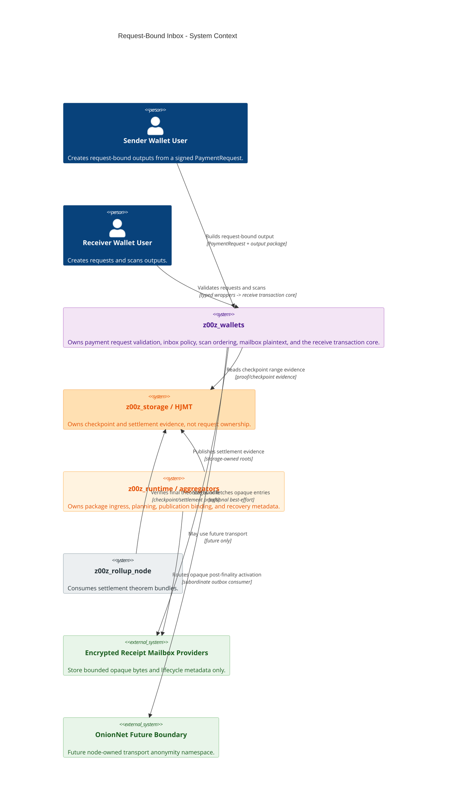

### 7.2 Wallet Container Boundary

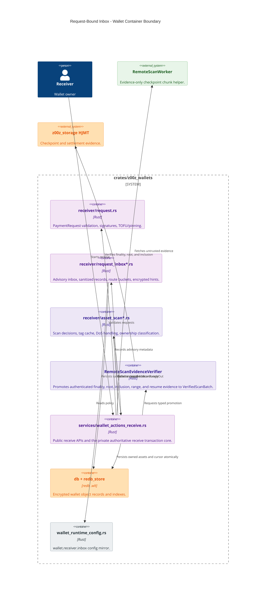

### 7.3 Wallet Receiver Component View

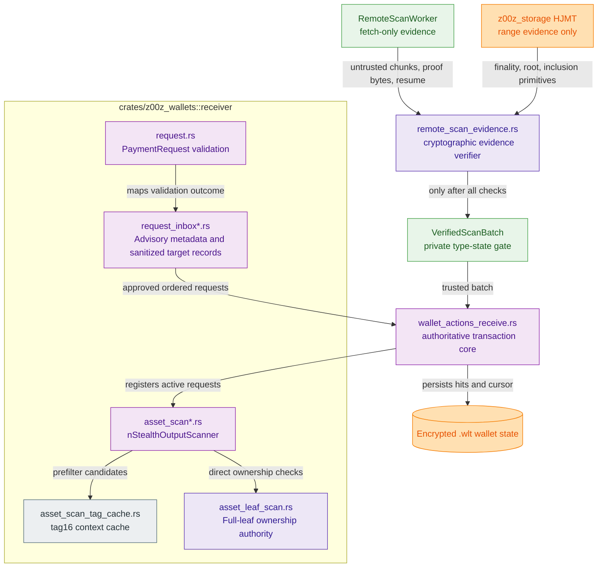

### 7.4 Module Dependency Direction

This dependency direction is normative. Arrows mean “MAY depend on”; a reverse
edge is a release blocker unless this specification is amended.

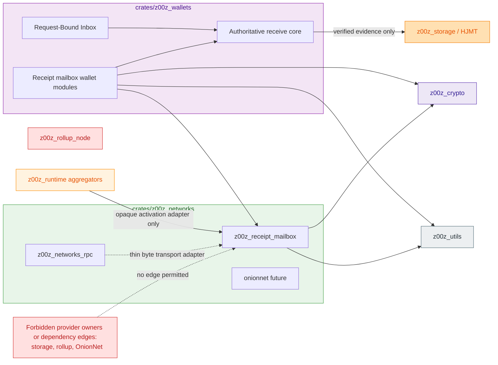

## 8. Data Contract

### 8.1 Legacy Current Shape

Current code has this binding-rich local shape:

```rust
pub struct RequestInboxRecord {
    pub request_id: [u8; 32],
    pub chain_id: u32,
    pub recipient: RequestRecipientBinding,
    pub expiry: u64,
    pub range_hint: Option<RequestRangeHint>,
    pub validation: RequestInboxValidation,
    pub created_at: u64,
}

pub struct RequestRecipientBinding {
    pub owner_handle: [u8; 32],
    pub view_pk: [u8; 32],
    pub identity_pk: [u8; 32],
}
```

Fusion rule: this shape is allowed only as transitional in-memory behavior. It
MUST NOT become durable `.wlt` inbox persistence, exported helper state, logged
state, backup plaintext, runtime message data, storage/HJMT state, or rollup
payload.

### 8.2 Target `RequestInboxRecordV1`

Target durable/helper record:

```rust
pub struct RequestInboxRecordV1 {
    pub version: u16,
    pub chain_id: u32,
    pub route_epoch: u64,
    pub route_bucket: [u8; 32],
    pub request_id_hash: [u8; 32],
    pub range_hint: Option<RequestRangeHintV1>,
    pub expiry_bucket: u64,
    pub validation_state: RequestInboxValidationStateV1,
    pub lifecycle_state: RequestInboxLifecycleStateV1,
    pub created_at_ms: u64,
    pub updated_at_ms: u64,
    pub defer_until_ms: Option<u64>,
    pub abuse_score: u16,
    pub encrypted_hint: Option<Vec<u8>>,
    pub checksum: [u8; 32],
}

pub struct RequestRangeHintV1 {
    pub start_height: u64,
    pub end_height: Option<u64>,
}
```

The codec MUST reject `version != 1`, unknown enum discriminants, duplicate or
unknown fields, non-canonical integer/optional encodings, trailing bytes, and any
encoded record larger than 8 KiB. `encrypted_hint` MUST be at most 2 KiB and its
length MUST be checked before allocation or decryption. These ceilings are
anti-amplification limits, not expected-size targets.

`checksum` MUST be the 32-byte `InboxRecordChecksumDomain` digest of the exact
canonical record encoding with only `checksum` replaced by 32 zero bytes. Decode
MUST canonical-reencode and verify the checksum before using any field. Outer
`.wlt` AEAD authentication remains mandatory; this checksum is canonical-object
binding, not a substitute for AEAD or an authorization proof.

The deterministic order is:

1. `range_hint`: `Some` before `None`,
2. for `Some`, `start_height` ascending,
3. for equal starts, `end_height` ascending with `None` last,
4. `route_epoch` ascending,
5. `created_at_ms` ascending,
6. `request_id_hash` bytewise ascending.

The implementation MUST use one comparator for memory, persistence queries,
fixtures, and exports. Golden tests MUST cover all ties and `None` ordering.

With non-zero configured `route_epoch_seconds`, derive
`route_epoch = floor((created_at_ms / 1000) / route_epoch_seconds)` and
`expiry_bucket = floor(request_expiry_unix_seconds / route_epoch_seconds)`.
The earliest prune time is
`checked((expiry_bucket + 1) * route_epoch_seconds + ttl_seconds_after_expiry)`;
using the bucket start would permit pre-expiry deletion and is forbidden.
Conversions and multiplication/addition used for pruning MUST be checked for
overflow. Only the projection constructor MAY set epoch/bucket fields and it
MUST compute them rather than accept caller values. Decode MUST reject
`updated_at_ms < created_at_ms` or `defer_until_ms < updated_at_ms`; the checksum
then preserves the originally computed epoch/bucket values.

`abuse_score` is a saturating local count of candidate/decrypt budget-exceeded
events for this record. It increments by one only on such an event, selects
`backoff_ms[min(score - 1, last_index)]`, and resets to zero only after a valid
trusted/verified scan completes within budget. Transport outage, no-hit, invalid
request, or hint corruption MUST NOT increment it. Saturation at `u16::MAX`
quarantines the record until explicit trusted reconstruction; the score MUST NOT
affect ownership or request-signature validity.

`RequestInboxValidationStateV1` MUST preserve exactly `Approved`,
`RequiresUserConfirmation`, `IdentityMismatch`, or
`Rejected(RequestInboxRejectClassV1)`. `RequestInboxRejectClassV1` MUST preserve
the current stable discriminants: `UnsupportedVersion`, `InvalidRequestSize`,
`InvalidRequestBytes`, `InvalidRequestFlag`, `InvalidRequestString`,
`WrongChainId`, `RequestExpired`, `PinRevoked`, `InvalidSignature`,
`VerifyFailed`, `InvalidPublicKey`, `IdentityPoint`, `RngFailure`,
`ClockUnavailable`, and `InvalidCompact`. New causes require a new stable
discriminant; they MUST NOT be folded into an unrelated class.

`RequestInboxValidationClassV1` MUST export only `Approved`, `ActionRequired`,
or `Rejected`. Both `RequiresUserConfirmation` and `IdentityMismatch` map to
`ActionRequired`; every detailed reject maps to `Rejected`. This coarsening is
one-way and MUST NOT be used to reconstruct automatic approval.

`RequestRangeHintV1` is advisory only. Decode MUST reject
`end_height < start_height`; `None` means “up to the operation’s already bounded
maximum checkpoint”, not an unbounded fetch. Range hints MUST NOT override the
requested scan range, authenticated batch range, cursor, or configured work
budgets.

Allowed plaintext fields:

Here “plaintext” means fields visible only after the encrypted `.wlt` object has
been authenticated and opened inside wallet trust. It does not authorize raw
redb keys, side tables, logs, RPC payloads, backups, or public exports.

- version,
- chain id,
- route epoch,
- route bucket,
- request id hash,
- range hint,
- expiry bucket,
- validation state,
- lifecycle state,
- created/updated/defer timestamps,
- abuse score,
- encrypted hint ciphertext,
- checksum.

Forbidden plaintext fields:

- `owner_handle`,
- `view_pk`,
- `identity_pk`,
- stable receiver id,
- raw `req_id`,
- amount,
- asset id,
- sender identity,
- plaintext memo,
- decrypted pack fields,
- receiver secrets,
- wallet file paths,
- TOFU or pin material.

### 8.3 Route Bucket

Local v1 compatibility:

```text
route_bucket = DomainHasher256<InboxRouteDomain>(label = "route_bucket")
  .update(frame_bytes(req_id))
  .update(frame_u32_le(chain_id))
  .update(frame_u64_le(route_epoch))
  .finalize_32()
```

This v1 derivation is local-only. It MUST NOT be used as a network-accessible
lookup surface by itself.

Phase 071 MUST implement only `RequestInboxRouteBucketV1`. A future
network-visible redacted route-hint helper requires a separate V2 specification,
new domain, new codec, secret input, privacy analysis, and provider namespace;
the v1 domain MUST NOT be reused with different inputs. The Encrypted Receipt
Mailbox is not that future helper and derives an independent 256-bit locator
from the per-output ECDH locator key under
`z00z.wallet.receipt-mailbox.locator-key.v1`.

### 8.4 Request Id Hash

```text
request_id_hash = DomainHasher256<InboxRequestDomain>(label = "request_id_hash")
  .update(frame_bytes(req_id))
  .update(frame_u32_le(chain_id))
  .finalize_32()
```

`InboxRouteDomain` and `InboxRequestDomain` MUST be declared with
`hash_domain!` for the exact domains in Section 12.2. Implementations MUST use
`z00z_crypto::{DomainHasher256, frame_bytes, frame_u32_le, frame_u64_le}` and
MUST NOT use ambiguous byte concatenation, host-endian integers, or a selectable
hash algorithm. Golden vectors MUST freeze both 32-byte outputs.

`request_id_hash` is a wallet-local duplicate/replacement key. It MUST NOT be
used as a public registry key, HJMT key, runtime routing key, rollup payload, or
plaintext export identifier.

### 8.5 Encrypted Hint

Encrypted hints MAY contain request id, memo hash, payment id hash, scan
priority, and wallet-local notes only when all values are encrypted and AAD-bound.

Hint AAD MUST bind:

- record version,
- chain id,
- wallet AAD identity,
- object id,
- payload version,
- route bucket,
- route epoch.

Construct it only with
`z00z_crypto::build_aad_multipart("z00z.wallet.request_inbox.hint_aad.v1",
parts)` using this exact ordered part list: `version.to_le_bytes()`,
`chain_id.to_le_bytes()`, wallet AAD identity bytes, `object_id.to_le_bytes()`,
`payload_version.to_le_bytes()`, the 32-byte route bucket, and
`route_epoch.to_le_bytes()`. Multipart length framing is part of the contract;
manual concatenation and reordered/omitted parts MUST reject golden parity.

Hint decrypt failure MUST quarantine the record or ignore the hint and fall
back to direct scan. It MUST NOT mutate wallet state.

### 8.6 Redacted Export Profile

```rust
pub struct RequestInboxExportV1 {
    pub version: u16,
    pub chain_id: u32,
    pub route_epoch: u64,
    pub route_bucket: [u8; 32],
    pub range_hint: Option<RequestRangeHintV1>,
    pub expiry_bucket: u64,
    pub validation_class: RequestInboxValidationClassV1,
    pub hint_ciphertext: Vec<u8>,
    pub checksum: [u8; 32],
}
```

The export codec MUST enforce `hint_ciphertext.len() <= 2048` and total canonical
encoded length `<= 8192` before allocation or checksum work, using the same
strict integer/optional/EOF rules as `RequestInboxRecordV1`.

Export records are helper hints only. They are not import-ready ownership claims
and cannot create owned assets or advance scan cursor state. “Redacted” does not
mean public: `RequestInboxExportV1` MUST remain encrypted/authenticated local or
explicit-recipient export material and MUST NOT be uploaded as a public lookup
record. Import MUST canonical-decode, verify checksum/AAD, and return only an
advisory record; it MUST NOT produce `VerifiedScanBatch` or owned state.

The export `checksum` uses the same zero-field construction under the distinct
`InboxExportChecksumDomain` and covers every encoded field including ciphertext
length and bytes. Record and export checksums MUST NOT be interchangeable.

### 8.7 Inbox, Delivery, And Recovery Object Separation

| Object | Semantic owner | Physical storage | Lookup | Lifetime | May mutate wallet ownership/cursor? |
| --- | --- | --- | --- | --- | --- |
| `RequestInboxRecordV1` | `z00z_wallets` advisory request policy | encrypted local `.wlt` only | wallet-local `request_id_hash`/route bucket | bounded local policy | No; it MAY only order work before the authoritative receive transaction core. |
| `EncryptedReceiptMailboxEntryV1` | `z00z_wallets` seals/decrypts; `z00z_receipt_mailbox` stores opaque bytes | temporary replicated Encrypted Receipt Mailbox namespace | 256-bit per-output ECDH-derived keyed locator | at most 1,555,200 finalized blocks, with ACK early GC | No; authenticated plaintext is still only a typed input to the authoritative receive transaction core. |
| `RecipientRecoveryCapsuleV2` | canonical current-state/HJMT owner; wallet authenticates/decrypts | live sharded unspent state | all-shard seed/view scan with `tag16` prefilter | while output remains unspent | No direct mutation; a fresh current-root witness is required before the authoritative receive transaction core commits. |
| `WalletBackupV5` | wallet | user-selected encrypted backup providers | authenticated backup head/generation | client policy; latest three successful generations protected | Restore input only; rollback/fork and trust-anchor rules still apply. |

The Encrypted Receipt Mailbox MUST NOT serialize, embed, export, index, or reuse
`RequestInboxRecordV1`, raw `req_id`, `request_id_hash`, the local route bucket,
recipient binding, or wallet backup metadata. Conversely the local request inbox
MUST NOT store mailbox provider receipts, activation/GC authority, or provider
route state as ownership evidence.

### 8.8 Persistence Relationship View

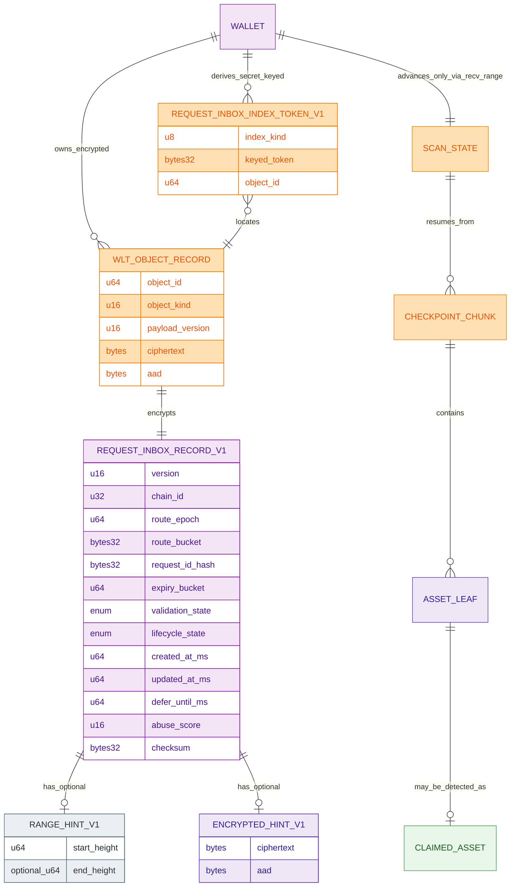

## 9. End-To-End Flow

### 9.1 Request-Bound Inbox Receive Sequence

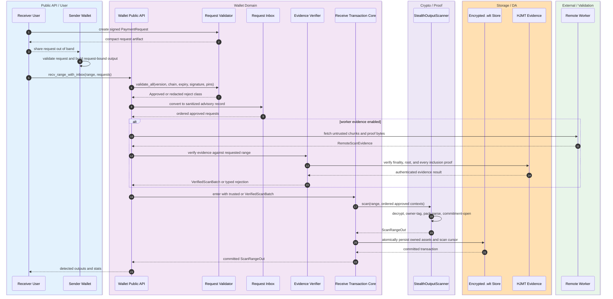

### 9.2 Fallback Flow

```mermaid
flowchart TD
  Start([Start receive]) --> Config{Config valid?}
  Config -- no --> FailClosed[Fail closed: invalid config]
  Config -- yes --> InboxEnabled{Inbox lane enabled?}
  InboxEnabled -- yes --> Validate[Validate PaymentRequest set]
  InboxEnabled -- no --> Direct[Load trusted local scan source]
  Validate --> Approved{Any approved request?}
  Approved -- no --> NoMutation[Return typed redacted error, no wallet mutation]
  Approved -- yes --> Inbox[Build sanitized inbox order]
  Inbox --> Direct
  Direct --> LocalOk{Trusted local source available?}
  LocalOk -- yes --> Scan[Enter authoritative receive core]
  LocalOk -- no --> Worker{Verified worker mode enabled?}
  Worker -- yes --> Evidence[Fetch untrusted RemoteScanEvidence]
  Evidence --> Verify[Verify finality, root, inclusion, range, resume]
  Verify --> EvidenceOk{Promoted to VerifiedScanBatch?}
  EvidenceOk -- yes --> Scan
  EvidenceOk -- no --> Defer
  Worker -- no --> Defer
  Scan --> ScanOk{Scan and source valid?}
  ScanOk -- no --> NoMutation
  ScanOk -- yes --> Overload{Candidate or decrypt budget exceeded?}
  Overload -- no --> MutationGate{Canonical batch and ownership checks passed?}
  Overload -- yes --> Defer[Persist advisory defer only and apply backoff]
  Defer --> Retry{Bounded retry permitted?}
  Retry -- yes --> Rescue[Trusted full scan or manual repair]
  Retry -- no --> NoMutation
  Rescue --> Scan
  MutationGate -- yes --> Commit[Atomically persist owned assets and cursor]
  MutationGate -- no --> NoMutation

  style Start fill:#E3F2FD,stroke:#1E88E5,stroke-width:1px,color:#0D47A1
  style Config fill:#ECEFF1,stroke:#546E7A,stroke-width:1px,color:#263238
  style FailClosed fill:#FFE0E0,stroke:#D32F2F,stroke-width:1px,color:#B71C1C
  style Validate fill:#F3E5F5,stroke:#8E24AA,stroke-width:1px,color:#4A148C
  style InboxEnabled fill:#ECEFF1,stroke:#546E7A,stroke-width:1px,color:#263238
  style Approved fill:#ECEFF1,stroke:#546E7A,stroke-width:1px,color:#263238
  style NoMutation fill:#FFE0E0,stroke:#D32F2F,stroke-width:1px,color:#B71C1C
  style Inbox fill:#F3E5F5,stroke:#8E24AA,stroke-width:1px,color:#4A148C
  style Scan fill:#EDE7F6,stroke:#5E35B1,stroke-width:1px,color:#311B92
  style Overload fill:#ECEFF1,stroke:#546E7A,stroke-width:1px,color:#263238
  style Commit fill:#FFE0B2,stroke:#F57C00,stroke-width:1px,color:#E65100
  style Defer fill:#FFF3E0,stroke:#FB8C00,stroke-width:1px,color:#E65100
  style Worker fill:#ECEFF1,stroke:#546E7A,stroke-width:1px,color:#263238
  style Evidence fill:#E8F5E9,stroke:#43A047,stroke-width:1px,color:#1B5E20
  style Verify fill:#EDE7F6,stroke:#5E35B1,stroke-width:1px,color:#311B92
  style EvidenceOk fill:#ECEFF1,stroke:#546E7A,stroke-width:1px,color:#263238
  style Direct fill:#EDE7F6,stroke:#5E35B1,stroke-width:1px,color:#311B92
  style LocalOk fill:#ECEFF1,stroke:#546E7A,stroke-width:1px,color:#263238
  style ScanOk fill:#ECEFF1,stroke:#546E7A,stroke-width:1px,color:#263238
  style MutationGate fill:#ECEFF1,stroke:#546E7A,stroke-width:1px,color:#263238
  style Retry fill:#ECEFF1,stroke:#546E7A,stroke-width:1px,color:#263238
  style Rescue fill:#EDE7F6,stroke:#5E35B1,stroke-width:1px,color:#311B92
```

The mutation gate has exactly two successful forms: a valid canonical batch with
verified ownership hits atomically commits those hits plus the derived cursor, or
a valid canonical batch with no hits commits only the derived cursor. Any source,
proof, scan, decrypt, parse, commitment, budget, or transaction error commits
neither. Advisory defer/backoff metadata MAY use its separate encrypted inbox
transaction but MUST NOT share or partially execute the ownership/cursor commit.

### 9.3 Validation And Inbox Record Lifecycle

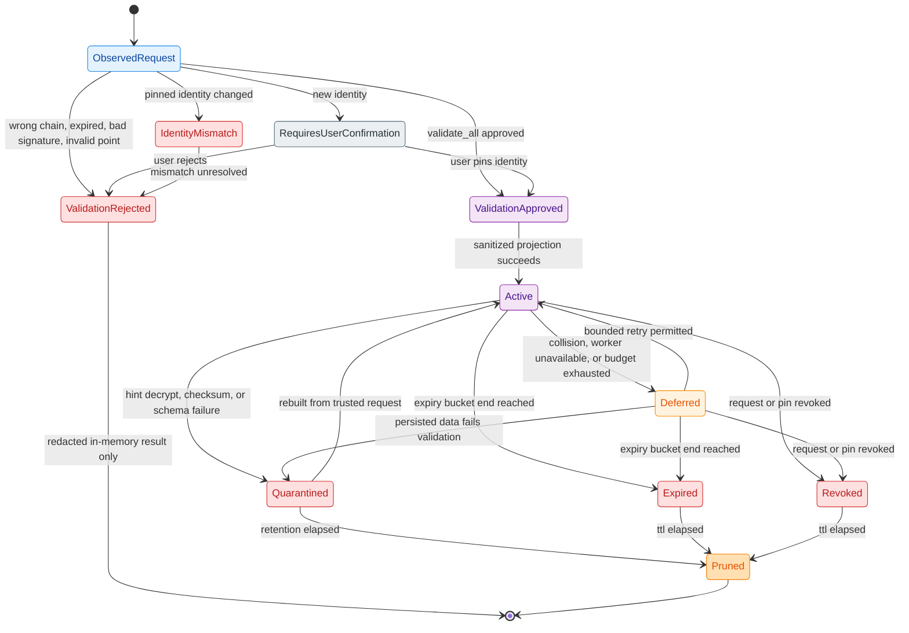

Validation and lifecycle are orthogonal fields. `Owned`, `NotMine`, `NoHit`,
`ScanFailed`, and `CursorAdvanced` are scan/transaction outcomes and MUST NOT be
encoded as `RequestInboxLifecycleStateV1`. A successful scan MUST NOT revoke or
consume a request unless a separately configured and tested policy says so;
the canonical default is reusable-until-expiry. Any transition not shown above
MUST return a typed error and leave the stored record unchanged.
The coarse lifecycle expiry uses the bucket end only for safe retention/pruning;
automatic receive approval still checks the exact signed request expiry through
`validate_all(...)` and MUST NOT accept a request merely because its record has
not yet entered `Expired`.

### 9.4 Encrypted Receipt Mailbox Flow

Phase 071 MUST implement this flow and consume the disabled handoff reserved
by Phase 069. It MUST preserve an acyclic digest graph and canonical liveness:

1. The sender validates the request, constructs the request-bound recipient
   output, and validates a recipient-signed `ReceiptMailboxCapabilityV1` plus
   sender-local policy. It freezes the canonical transaction bytes/digest
   without any mailbox digest or availability dependency. If capability/policy
   is absent or disabled, the sender skips mailbox construction and continues
   the canonical payment plus current-state recovery path.
2. Wallet code derives independent AEAD and locator keys from the approved
   per-output ECDH context, constructs one bounded `RecipientReceiptNoticeV1`,
   generates one fresh nonce and ACK secret, seals one immutable
   `EncryptedReceiptMailboxEntryV1`, and freezes its exact bytes/digest in memory.
3. The sender signs one detached `ReceiptMailboxAdmissionV1` using the same
   already-accepted regular transaction spend-authorization identity and a
   dedicated admission domain. It binds the final transaction/output/context,
   locator commitment, immutable entry digest, caps, quota, and profile
   generation; it is not part of the transition theorem. One sender-wallet
   transaction MUST then persist the final tx digest, exact immutable entry and
   admission bytes/digests, route/profile generation, send row, and upload
   outbox. Retry MUST replay those bytes and MUST NOT rebuild, re-encrypt, or
   re-sign from mutable config. Local derivation, entropy, codec, or signature
   failure MUST abort before broadcast; provider unavailability after this local
   commit MUST NOT block canonical transaction processing.
4. Opaque network providers stage at most one entry/output under the pinned cap.
   The locator and pinned route generation select exactly one of 16 logical
   partitions; only that partition stores three replicas in three distinct
   failure domains, obtains write quorum two plus authenticated readback, and
   returns typed provider receipts. Cross-partition broadcast/fan-out is
   forbidden. Provider failure never blocks canonical transaction processing.
5. After canonical finality, a subordinate durable consumer creates
   `ReceiptMailboxActivationV1` binding the exact admission/entry/output to the
   finalized checkpoint, current root, certificate, and height expiry. Finality
   never waits for staging, replication, or activation.
6. An offline recipient seed-scans every live-state shard, authenticates its
   recovery capsule locally, derives the private locator, fetches and decrypts
   the entry, verifies activation/finality/output binding, and fetches a fresh
   current-root HJMT membership witness.
7. Only the authoritative receive transaction core MAY atomically install the
   owned output, `FinalizedWalletReceiptV2`, scan cursor, and ACK outbox. A
   mailbox wrapper MUST pass a typed, locally verified output/activation/current-
   root context into that core and MUST NOT write those rows directly.
8. ACK replay is idempotent. ACK quorum MAY perform mailbox-namespace-only early
   GC; otherwise height expiry deletes entry, activation, replica receipts, ACK
   state, and bounded tombstone. Sender local retention ends after write quorum
   plus authenticated readback, not recipient ACK.
9. Any missing, corrupt, censored, replayed, unactivated, expired, or deleted
   entry returns `MailboxUnavailable`/`MailboxExpired` and continues current-
   unspent seed recovery. It cannot recover spent history, memo, labels, or
   contacts; those require `WalletBackupV5`.

The exact digest order is `canonical tx -> activation-context commitment ->
immutable entry -> detached admission -> post-finality activation`. The
activation-context commitment MUST exclude entry, admission, finality-
certificate, and activation digests so no direct or transitive cycle exists.

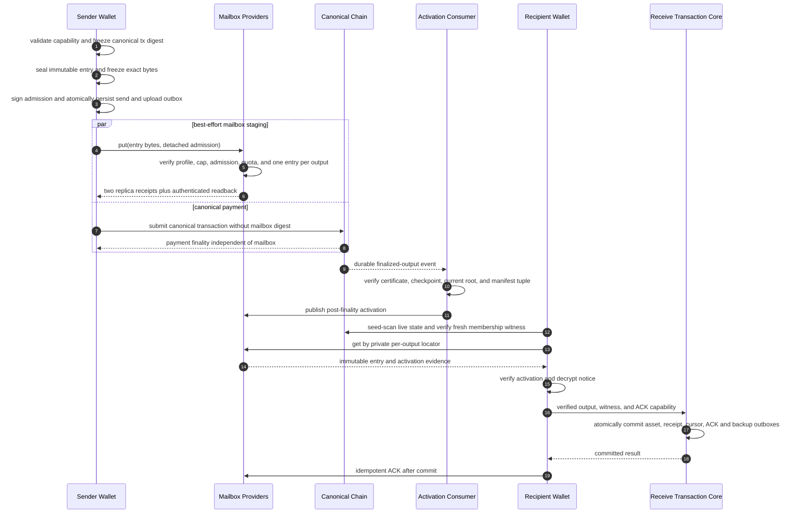

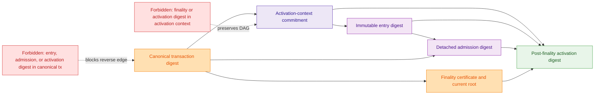

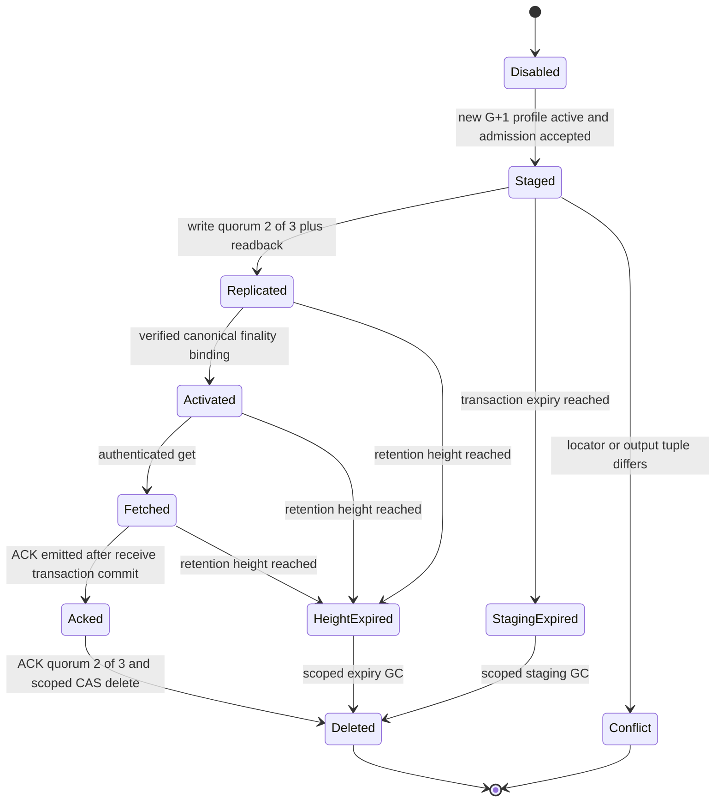

The lifecycle rules are exact: a repeated stage is idempotent only when locator,
profile/output tuple, exact entry bytes/digest, and exact admission bytes/digest
all match. Any difference for the same locator or output is `Conflict`; a
provider MUST NOT self-activate; staging expires at transaction expiry; ACK-
before-wallet-commit rejects; initial ACK quorum is two of three; and an early-
delete tombstone MUST be retained until the original height expiry to prevent
replay resurrection, then deleted within the same mailbox namespace.

## 10. Module Ownership

### 10.1 Wallet Receiver Modules

Implementation home:

- `crates/z00z_wallets/src/receiver/request.rs`
- `crates/z00z_wallets/src/receiver/payment_request_types.rs`
- `crates/z00z_wallets/src/receiver/request_inbox.rs`
- `crates/z00z_wallets/src/receiver/asset_scan*`

Future modules:

| Module | Purpose |
| --- | --- |
| `request_inbox_config.rs` | Typed `wallet.receiver.inbox` config. |
| `request_inbox_record.rs` | `RequestInboxRecordV1`, lifecycle states, redacted export DTOs. |
| `request_inbox_crypto.rs` | Route bucket, request id hash, hint AAD, record/export checksums, and index tokens. |
| `request_inbox_store.rs` | Encrypted `.wlt` persistence adapter for sanitized records only; implementation is required while runtime enablement remains policy-gated. |
| `request_inbox_projection.rs` | One-way in-memory projection from the current binding-rich shape to `RequestInboxRecordV1`; no disk migration is implied. |
| `request_inbox_abuse.rs` | Collision, rate, defer, and backoff policy if existing scan types are insufficient. |
| `remote_scan_evidence.rs` | `RemoteScanEvidenceVerifier` and private `VerifiedScanBatch` constructor. |
| `scan_batch_source.rs` | Private `TrustedScanBatch` and `ScanBatchSource` type-state boundary. |
| `receipt_mailbox_types.rs` | Wallet-private capability and decrypted notice types. |
| `receipt_mailbox_crypto.rs` | ECDH-derived keys, locator, entry AAD, seal/open, and ACK capability. |
| `receipt_mailbox_policy.rs` | Recipient capability and sender-local opt-in policy. |
| `receipt_mailbox_outbox.rs` | Exact immutable sender upload rows and recipient ACK/backup outbox rows with crash-safe replay. |

### 10.2 Wallet Services

`crates/z00z_wallets/src/services/wallet_actions_receive.rs` remains the
integration point.

Required behavior:

- `recv_range(...)` stays the canonical public receive entrypoint.
- Private `recv_range_authoritative(...)` plus `persist_scan_batch(...)` remains
  the sole authoritative receive transaction core.
- The target private core MUST accept `ScanBatchSource`, not `&[ScanChunk]`.
  Its request-hint parameter MUST be `&[ApprovedRequestContext]`, not
  `&[PaymentRequest]`; the direct compatibility path passes an empty slice.
  `recv_range(...)` MUST accept a `TrustedScanBatch` from the authenticated local
  adapter; fixture-only raw chunk builders MUST be gated under test cfg and MUST
  NOT compile into release artifacts.
- `recv_range_with_inbox(...)` validates, records advisory metadata, orders
  approved typed request contexts, and enters the core through `recv_range(...)`.
- No inbox path directly persists owned assets.
- No inbox path directly advances scan cursor.
- `recv_range_with_worker(...)` MUST accept only `VerifiedScanBatch` plus
  approved request contexts; raw `RemoteScanEvidence` MUST be verified before
  the call and MUST NOT expose a public conversion or unchecked constructor.
- `receipt_mailbox_sender.rs` MUST own sender seal/admission/outbox orchestration.
- `receipt_mailbox_receiver.rs` MUST own fetch/decrypt/evidence assembly and MUST
  enter the same core with a typed verified context.

### 10.3 Wallet Runtime Config

`wallet.receiver.inbox` MUST mirror the gate values needed at runtime:

```yaml
wallet:
  receiver:
    inbox:
      enabled: true
      max_records_per_wallet: 4096
      max_records_per_route_bucket: 64
      max_encrypted_hint_bytes: 2048
      max_encoded_record_bytes: 8192
      ttl_seconds_after_expiry: 86400
      route_epoch_seconds: 86400
      tag16:
        max_contexts_per_tag16: 32
      dos:
        max_candidates_per_checkpoint: 4096
        max_decrypt_per_checkpoint: 512
        defer_threshold: 1024
      remote_scan:
        enabled: false
```

`remote_scan.enabled` MUST remain `false` in every release profile until all
gates in Section 12.8 pass. A local override MUST NOT enable it without the same
cryptographic verifier and authority-pinned trust anchors.

`wallet.receiver.inbox.network_delivery` has three non-interchangeable planes:

- `wallet_policy` is local opt-in and MAY disable delivery or reduce local work;
  it cannot raise a network cap, change placement, or activate a generation.
- `global_profile_contract` is loaded from the authority-pinned
  `CheckpointVersionRegistryV2`/ConfigV3 generation and the digest-bound Phase-
  069 reservation manifest. It alone defines network type/version, admission,
  retention, placement, and activation truth.
- `provider_policy` MAY disable service or tighten local resource ceilings but
  cannot weaken the global profile, accept another generation, or reinterpret a
  wallet preference as authority.

Any wallet/provider-local activation, cap increase, replica reduction, route
change, or source-digest mismatch MUST fail closed before allocation or mutation.

### 10.4 Wallet Persistence

Durable Request-Bound Inbox storage belongs in wallet `.wlt` storage, not
storage/HJMT and not runtime.

Persistence rules:

- Persist only sanitized `RequestInboxRecordV1`.
- Encrypt through the existing wallet object encryption path.
- Bind outer `.wlt` AAD to wallet AAD identity, object kind/id, payload version,
  and the secret-keyed route/epoch index tokens. Raw route bucket and epoch stay
  inside the encrypted payload and MUST NOT appear in stored outer AAD.
- Implement exact-match `RequestInboxByRouteBucket` and
  `RequestInboxByValidationState` with secret-keyed tokens.
- `RequestInboxByExpiry` and `RequestInboxByRangeStart` are logical query names,
  not permission for order-revealing keys. They MUST use tokens over the exact
  configured expiry/range buckets and enumerate only a bounded requested bucket
  set, or decrypt/filter at most `max_records_per_wallet` records. Raw or order-
  preserving time/height indexes are forbidden.
- Every index key MUST be a wallet-secret, domain-separated
  `RequestInboxIndexTokenV1`; raw route buckets, request hashes, validation/time
  combinations, or receiver fields MUST NOT appear in redb keys or side tables.
- Derive index tokens under `z00z.wallet.request_inbox.index_token.v1` from
  `(index_kind, canonical_index_value, object_id)` and use constant-time equality
  where the store path compares sensitive tokens.
- The exact token is `compute_index_mac(INDEX_KEY, message)`, where `message` is
  `frame_str(domain) || index_kind_u8 || frame_bytes(canonical_index_value) ||
  frame_u64_le(object_id)`. `INDEX_KEY` MUST be the existing wallet-derived redb
  index key and MUST NOT be persisted with the token.
- Keep plaintext sidecars disabled outside gated dev fixtures.
- Do not create tx history rows merely because an inbox record exists.
- Do not advance scan cursor from inbox operations alone.

### 10.5 Encrypted Receipt Mailbox Module Boundary

Phase 071 owns the complete delivery feature, but ownership remains split by
trust boundary rather than by convenience:

- `z00z_wallets` MUST own notice construction, ECDH/KDF/AEAD/locator/ACK-secret
  derivation, capability negotiation, detached admission creation, immutable
  sender upload outbox,
  recipient decrypt/verification, and the ACK/backup outboxes joined to the
  authoritative receive transaction commit.
- `z00z_receipt_mailbox` MAY own the opaque provider/transport adapter for bounded
  put/get, replica/readback receipt, activation propagation, ACK, tombstone, and
  namespace-scoped GC. It MUST NOT receive plaintext, wallet/view/spend/backup
  keys, raw request ids, recipient binding, or an ownership verdict.
- The 16 mailbox logical partitions are an independent opaque-provider placement
  namespace, not the 16 HJMT current-state shards. Implementations MAY reuse a
  generic placement primitive only when route keys, manifests, authority,
  storage prefixes, retention, and delete capabilities remain disjoint; a
  mailbox route/GC operation MUST NOT address an HJMT shard and vice versa.
- `z00z_storage`/HJMT MUST continue to own canonical current-state leaves,
  `RecipientRecoveryCapsuleV2`, current roots, fresh membership witnesses, and
  the global type/config registry. It MUST NOT persist mailbox entries,
  locators, request inbox records, or provider indexes in settlement/HJMT.
- `z00z_runtime` MAY consume canonical finalized-output outbox events and route
  opaque activation work; it MUST NOT validate requests, decrypt entries,
  classify ownership, or make mailbox availability an admission/finality gate.
- `z00z_rollup_node` has no mailbox implementation role. It MUST ignore mailbox
  delivery state when proving or verifying the canonical transition predicate.

The opaque provider implementation MUST be a new project-owned workspace crate
at `crates/z00z_networks/receipt_mailbox`, package name
`z00z_receipt_mailbox`. This does not move the wallet-local Request-Bound Inbox
into a standalone crate. Provider code MUST NOT be placed in
`z00z_networks_rpc` (generic transport) or `onionnet` (future anonymity).
The sole RPC integration is a thin canonical-byte adapter at
`crates/z00z_networks/rpc/src/receipt_mailbox_adapter.rs`; it MUST delegate to
the provider trait and MUST NOT own storage, policy, codecs, crypto, lifecycle,
or alternate DTO schemas. It MUST carry each canonical object as one bounded
opaque byte field, configure the JSON-RPC request/response body cap from the
authority-pinned manifest before parsing, and reject length overflow. For base64
transport, each object’s encoded cap is `4 * ceil(binary_cap / 3)` plus one fixed
4 KiB method-envelope allowance. The body cap is the checked sum of every
method object cap plus that one allowance; overflow rejects startup. The adapter
MUST NOT accept JSON field-by-field mirrors of mailbox wire objects.

| Provider module | Required responsibility |
| --- | --- |
| `wire.rs` | Exact manifest-selected wire structs only. |
| `codec.rs` | Cap-before-allocation canonical encode/decode and exact EOF. |
| `profile.rs` | Authority-pinned registry/profile tuple validation and the narrow `ActivationVerifier` interface. |
| `provider.rs` | Narrow immutable put/get/activate/ACK/delete API. |
| `replication.rs` | One-partition placement, three failure domains, quorum/readback. |
| `lifecycle.rs` | Idempotency, expiry, ACK quorum, tombstone, and conflict transitions. |
| `store.rs` | Provider-local redb 3.1.0 storage for opaque namespaces, counters, CAS lifecycle, and expiry indexes; no wallet/request semantics. |
| `error.rs` | Stable fail-closed provider error taxonomy. |
| `lib.rs` | Narrow re-exports; no business logic. |

`provider.rs` MUST expose only the typed operations `stage`, `get`, `activate`,
`ack`, `repair`, and `gc`. `stage` accepts canonical entry and admission bytes
plus the validated profile tuple and returns signed replica receipts only after
exact-byte readback. `get` requires the 32-byte private locator and returns only
the exact entry/activation bytes or a typed unavailable/expired outcome.
`activate`, `ack`, `repair`, and `gc` accept only their corresponding canonical
wire objects and compare-and-swap generation. Listing, prefix/range scan,
owner/request lookup, mutable update, plaintext decode, and unscoped delete APIs
MUST NOT exist in the public trait.

`ActivationVerifier` MUST accept the canonical finality proof envelope plus the
expected tx/output/checkpoint/current-root/profile tuple and return only a
private `VerifiedActivation` or typed rejection. The provider crate defines the
interface but MUST NOT implement it by trusting provider state. The runtime
`receipt_activation.rs` adapter MUST supply the implementation backed by the
existing canonical finality verifier. This preserves independent provider
validation without adding a `z00z_receipt_mailbox -> z00z_storage` dependency.

Provider persistence MUST use a separate provider-local redb file, never wallet
`.wlt` or settlement/HJMT tables. Its primary key is the canonical fixed tuple
`(namespace_id, profile_generation, partition_id, locator)`; the value contains
only entry/activation bytes, exact digests/lengths, replica/ACK/tombstone state,
CAS generation, and height expiry. The same redb write transaction MUST enforce
one-entry/output, immutable same-locator semantics, global/per-partition counters,
and lifecycle transition. Expiry indexes MAY expose only provider-visible
height/profile/partition metadata. Public APIs still MUST NOT expose listing or
range scans, and crash recovery MUST recompute counters/digests before serving.
The store schema MUST contain exactly five logical table families: `Entries`
(primary tuple to immutable bytes/state), `OutputBindings` (profile plus exact
tx/output to locator/entry digest uniqueness), `Expiry` (height/profile/
partition to primary tuple), `BudgetCounters` (profile/block/partition byte,
entry, and reject-work totals), and `Tombstones` (primary tuple, original expiry,
entry/activation digest, CAS generation). Replica receipts and ACK state remain
bounded subrecords of `Entries`; they MUST NOT create owner/request indexes.

Dependency direction MUST be
`z00z_receipt_mailbox -> {z00z_crypto, z00z_utils}` and
`z00z_wallets -> z00z_receipt_mailbox`. Runtime MAY depend on the provider crate
only through an opaque activation adapter at
`crates/z00z_runtime/aggregators/src/receipt_activation.rs`.
`z00z_storage`, `z00z_rollup_node`, `z00z_networks_rpc`, and `onionnet` MUST NOT
become provider owners or dependencies of wallet ownership logic. The RPC crate
MAY depend on `z00z_receipt_mailbox` only for the thin adapter above. Phase 071
MUST NOT revive the Phase-069 draft paths
`z00z_storage::checkpoint::receipt_mailbox_store` or
`z00z_rollup_node::receipt_mailbox`.

## 11. Storage, HJMT, Runtime, Rollup, And Network Boundaries

### 11.1 Storage And HJMT

Allowed storage/HJMT roles:

- provide checkpoint chunks or terminal leaves for wallet-local scans,
- validate checkpoint roots and proof envelopes,
- support range evidence for remote scan workers,
- anchor cursor expectations through checkpoint height/hash continuity.

Forbidden storage/HJMT roles:

- store request inbox records as public settlement data,
- store route buckets, request id hashes, helper records, or helper ciphertext,
- classify wallet ownership,
- validate TOFU pins,
- expose `owner_handle`, `view_pk`, `identity_pk`, or request compact payloads,
- make `backend_root` public request routing truth.

### 11.2 Runtime Aggregators

Allowed runtime roles:

- digest-rebind `TxPackage` and `ClaimTxPackage`,
- plan verified work items,
- bind publication contracts,
- coordinate shard routing and recovery metadata.
- consume a generic finalized-output outbox and pass opaque activation work to
  `receipt_activation.rs` after validating the authority-pinned manifest tuple.

Forbidden runtime roles:

- own request inbox records,
- validate wallet TOFU pins,
- decide receiver ownership,
- replace wallet scan with planner metadata,
- log request artifacts or tx packages in plaintext.
- store mailbox entries, self-issue activation, or make delivery a finality gate.

### 11.3 Rollup Node

Allowed rollup roles:

- verify package/checkpoint/link/exec inclusion,
- reject settlement theorem mismatches,
- bind tx package structure to checkpoint evidence.

Forbidden rollup roles:

- interpret request inbox validation,
- persist request records,
- expose recipient material,
- use request metadata as settlement proof.

### 11.4 OnionNet

Allowed future OnionNet roles:

- anonymous or metadata-minimizing relay transport,
- relay handoff policy,
- transport replay control,
- operator privacy topology.

Forbidden OnionNet roles:

- wallet ownership classification,
- request signature validation authority,
- scan cursor mutation,
- HJMT proof authority.

## 12. Security And Cryptography Requirements

### 12.1 Request Validation

- `PaymentRequest.version` MUST equal the supported version.
- `PaymentRequest.chain_id` MUST match the persisted wallet chain id.
- Expired requests MUST fail closed.
- `view_pk` and `identity_pk` MUST decode as strict public keys.
- Request signature MUST verify over canonical unsigned bytes with
  `z00z.payment.request.v1`.
- TOFU/pinning MUST map to approved, requires-user-confirmation,
  identity-mismatch, or
  revoked-pin outcomes.
- Only approved requests MAY enter automatic receive scanning.
- Request-aware wrappers MUST construct an approved typed context; raw
  `PaymentRequest` values MUST NOT enter the automatic request-bound core path.
  The direct compatibility scan MAY run without request hints, but MUST NOT treat
  an unvalidated request as optimization or ownership context.

The target private wrapper is exact:

```rust
pub(crate) struct ApprovedRequestContext {
    request: PaymentRequest,
    validated: ValidatedRequest,
    wallet_chain_id: u32,
    approved_at_ms: u64,
}
```

Only `ValidatePaymentRequest::validate_all(...)` MAY construct it after returning
`Approved`. Fields and constructor MUST remain private; it MUST NOT implement
`Serialize`, `Deserialize`, `Default`, an unredacted `Debug`, or an unchecked
`From<PaymentRequest>`.
The wallet service MUST create and consume it under the same receive-operation
lock, recheck chain and expiry immediately before entering the core, and erase it
after the operation. `RequiresUserConfirmation`, `IdentityMismatch`, and every
reject class MUST NOT construct the wrapper.

### 12.2 Domain Separation

New helper crypto MUST use explicit wallet-local domains:

| Purpose | Domain |
| --- | --- |
| Route bucket | `z00z.wallet.request_inbox.route_bucket.v1` |
| Request id hash | `z00z.wallet.request_inbox.request_id_hash.v1` |
| Hint AAD | `z00z.wallet.request_inbox.hint_aad.v1` |
| Record checksum | `z00z.wallet.request_inbox.record_checksum.v1` |
| Export checksum | `z00z.wallet.request_inbox.export_checksum.v1` |
| Secret index token | `z00z.wallet.request_inbox.index_token.v1` |
| Spec digest | `z00z.wallet.request_inbox.spec_digest.v1` |
| Config digest | `z00z.wallet.request_inbox.config_digest.v1` |

These are wallet-local helper domains, not consensus domains. They MUST live
under `crates/z00z_wallets/src/domains/definitions.rs`; they MUST NOT be moved to
consensus merely for reuse. Do not overload `z00z.consensus.tag16.v1`.

The shared Encrypted Receipt Mailbox domains in Section 12.7 MUST live in the
non-vendor `z00z_crypto` domain registry because both `z00z_wallets` and
  `z00z_receipt_mailbox` consume them. Wallet-local Request-Bound Inbox domains
MUST NOT be imported by the provider crate, and receipt-mailbox domains MUST NOT
be aliases of request-inbox, `ZkPack_v1`, recovery-capsule, or backup domains.

### 12.3 Live Pack Boundary

`ZkPack_v1` remains the live wallet pack truth. This spec does not claim
Poseidon2, OWF parity, field-native proof parity, or a completed migration.

Field-native pack migration MUST:

- freeze current fixtures,
- preserve historical decryptability,
- support dual-read or equivalent compatibility,
- prove decrypt, commitment-open, and associated-data parity,
- avoid changing request-bound receive behavior before parity is accepted.

### 12.4 Sensitive Data Handling

Sensitive fields:

- receiver secret,
- view secret keys,
- `owner_handle`,
- `view_pk` when tied to request/inbox metadata,
- `identity_pk` when tied to request/inbox metadata,
- raw `req_id` outside encrypted wallet context,
- compact payment request strings,
- receiver cards and receiver card records,
- tx package bytes,
- decrypted `AssetPackPlain`,
- `s_out`, blinding, amount, and wallet reveal material.

Logging rules:

- log only stable redacted validation classes,
- never log raw request bytes,
- never log compact request strings,
- never log recipient binding fields,
- never log package bytes,
- never log decrypted pack fields,
- tests MUST assert protected logs do not contain forbidden substrings or
  serialized sensitive values.

### 12.5 Constant-Time And Zeroization

Use `subtle` or existing z00z abstractions for equality on route buckets,
request hashes, hint checksums, and candidate tags. New secret or sensitive
helper material MUST use existing `Hidden<T>`/`zeroize` patterns where
applicable.

Debug output MUST be explicit and redacted. `Debug` impls for route/hint records
MUST NOT print full bytes.

### 12.6 Anti-Patterns

- Do not promote `RequestInboxRecord` into consensus state.
- Do not make the current binding-rich record durable.
- Do not expose local-sensitive inbox records over RPC without redaction.
- Do not use HJMT proof hints as proof that an output belongs to a wallet.
- Do not treat remote worker evidence as ownership evidence.
- Do not pass raw `RemoteScanEvidence` or shape-only proof hints into the
  authoritative receive transaction core.
- Do not use `tag16` as an account id, receiver id, address, spam proof, or auth token.
- Do not add transport overlay code inside wallet receiver modules.
- Do not describe card-only or plain receive as privacy-equivalent to request-bound receive.

### 12.7 Encrypted Receipt Mailbox Cryptographic Contract

- Reuse the approved per-output ECDH context only: sender output ephemeral
  secret with receiver `view_pk`, and recipient `view_sk` with output `r_pub`.
  Do not introduce provider-assisted decryption or custom cryptography.
- Mailbox creation requires a non-expired recipient-signed
  `ReceiptMailboxCapabilityV1` from a separately registered request/card
  extension generation and sender-local opt-in. The capability MUST bind chain,
  request/card generation, registry/profile/route/crypto generations, bounded
  retention support, and expiry. It MUST NOT contain the locator, route secret,
  provider account, stable receiver id, or admission authority. Never infer it
  from `view_pk`, reinterpret current `PaymentRequest V1`, or silently downgrade
  an unknown capability.
- Derive independent keys/commitments under
  `z00z.wallet.receipt-mailbox.{aead-key,locator-key,entry-aad,admission,ack}.v1`.
  They MUST NOT reuse the live `ZkPack_v1`/recovery-capsule key, nonce, local
  request-inbox domains, or backup domains.
- The Phase-069 manifest MUST allocate the complete exact domain set:
  `aead-key`, `locator-key`, `locator-commitment`, `route-partition`, `activation-context`,
  `notice-digest`, `entry-aad`, `entry-digest`, `admission`, `activation`,
  `replica-receipt`, `ack`, `gc-ticket`, and `capability`, each under
  `z00z.wallet.receipt-mailbox.<name>.v1`. Missing rows, aliases, or an extra
  unregistered cryptographic domain block activation.
- Phase 071 MUST add a high-level `z00z_crypto::derive_mailbox_keys(...)` facade
  that rejects the identity ECDH point and derives independent 32-byte AEAD and
  locator keys with repository HKDF-SHA256. The canonical compressed ECDH point
  is IKM; the 32-byte activation-context commitment is salt; and each `info` is
  the canonically framed key-specific domain followed by chain/network, tx
  digest, exact output id/index/`r_pub`, and pinned crypto/profile generations.
  Wallet/provider business code MUST NOT call raw HKDF or choose IKM/salt/info
  bytes independently. Golden sender/recipient parity and cross-domain
  inequality vectors are release gates.
- The 256-bit network locator MUST be keyed by the per-output locator secret.
  Raw `req_id`, `request_id_hash`, local v1 route bucket, stable wallet id,
  receiver card, `owner_handle`, and `tag16` MUST NOT select a network object.
- Phase 071 MUST add high-level `z00z_crypto::derive_mailbox_locator(...)` and
  `z00z_crypto::derive_mailbox_partition(...)` facades. The locator is
  HMAC-SHA256 keyed by the 32-byte locator key over canonically framed domain,
  chain/network, tx digest, exact output id/index/`r_pub`, and pinned profile/
  route generations. The partition digest is HMAC-SHA256 keyed by the 32-byte
  locator over framed route-partition domain and route generation; for the
  initial 16-partition profile, `partition_id = digest[0] & 0x0f`. A distinct
  locator commitment domain binds the locator plus the same public tuple.
  Business code MUST use these facades and MUST NOT choose a different byte,
  nibble, endian order, hash, or framing rule. Golden vectors MUST cover all 16
  partition values.
- Derive `partition_id` from a separate
  `z00z.wallet.receipt-mailbox.route-partition.v1` keyed hash over the locator
  and pinned route generation. Because the initial partition count is exactly
  16, the specified four-bit selection is unbiased. One entry maps to exactly
  one logical partition and three failure-domain replicas inside that partition;
  providers MUST reject cross-partition fan-out or multi-partition duplication.
  Sender-controlled output entropy makes the selected partition grindable, so
  this mapping MUST NOT be claimed as adversarially uniform. Before any durable
  put, enforce both global and per-partition authority-pinned byte/entry budgets,
  one-entry/output, fee/quota/rate policy, and bounded reject work. Saturation
  returns mailbox-unavailable while canonical payment and seed recovery
  continue. A future unbiasable-beacon routing profile requires a separately
  registered design; Phase 071 MUST NOT assume one exists.
- Use `z00z_crypto::{seal, open, XCHACHA_KEY_SIZE, XCHACHA_NONCE_SIZE}` for the
  production mailbox envelope. Non-WASM deterministic injection MAY use
  `z00z_crypto::aead::seal_with_rng`; fixed-nonce helpers remain test-only.
  with a fresh CSPRNG 24-byte nonce generated exactly once. Persist one immutable
  envelope before retry; retries upload identical bytes and never re-encrypt
  with a reused key/nonce pair.
- AAD MUST bind type/wire/crypto generations, chain/network, final transaction
  digest, exact output ID/index/commitment/asset/`r_pub`, receiver-card
  generation, activation-context commitment, retention/profile, canonical
  lengths/caps, and ACK-secret commitment.
- The ACK secret is fresh random 32-byte material inside the ciphertext; only
  its commitment is public. Because the sender also knows it, ACK proves only
  possession of a delivery capability, not recipient identity, ownership, or
  payment receipt. An early malicious ACK is a delivery-liveness failure covered
  by current-state seed recovery.
- Phase 071 MUST add
  `z00z_crypto::derive_mailbox_ack_commitment(...)`. It is HMAC-SHA256 keyed by
  the 32-byte ACK secret over canonically framed ACK domain, chain/network, tx
  digest, exact output id/index, activation-context and locator commitments, and
  pinned profile/crypto generations. It intentionally excludes the later entry
  digest to keep sealing acyclic; `ReceiptMailboxAckV1` separately binds the
  resulting commitment, entry digest, and activation digest. Business code MUST
  NOT implement or frame this HMAC directly.
- Disclose provider-visible locator access, IP/timing/size, and activation
  association. Do not claim anonymity, unlinkability, guaranteed delivery,
  forward secrecy after later view-key compromise while ciphertext survives,
  or global erasure of third-party copies. PIR/onion routing requires a separate
  future profile and does not alter ownership authority.

`RecipientReceiptNoticeV1`, `EncryptedReceiptMailboxEntryV1`,
`ReceiptMailboxAdmissionV1`, `ReceiptMailboxActivationV1`,
`ReceiptMailboxReplicaReceiptV1`, `ReceiptMailboxAckV1`, and
`ReceiptMailboxGcTicketV1` are positive first-generation wire/domain-version-1
families with unique global type IDs. `ReceiptMailboxRejectReasonV1` is a local
typed outcome family, not a network object. Their `V1` suffix is unrelated to
eradicated recursive-proof V1 decoders and to local `RequestInboxRecordV1`;
dispatch uses the registry type ID plus exact row, never the suffix or fallback.
`ReceiptMailboxCapabilityV1` is a bounded signed request/card subrecord with its
own registered extension type/domain; it is not an independently accepted
Encrypted Receipt Mailbox wire object and does not authorize provider admission.

### 12.8 Remote Evidence Verification Gate

`RemoteScanEvidence` is untrusted transport input. The target verifier MUST:

1. Bind the requested chain, inclusive range, maximum checkpoint, and the
   wallet’s persisted cursor before decoding nested proof material.
2. Verify the canonical finality certificate with the existing authority-pinned
   verifier and derive the authenticated checkpoint/current root from it.
3. Verify every returned chunk/leaf inclusion against that authenticated root
   using the existing settlement inclusion primitives (including
   `chk_blob_settlement_inclusion(...)`/`MemberWit` where the proof family
   matches); a non-empty byte vector is never proof validity.
4. Reject gaps, duplicates, reordering, out-of-range heights, mixed roots,
   unknown proof families, stale/future resume hints, trailing bytes, or a resume
   cursor not derived from the verified terminal height.
5. Construct private `VerifiedScanBatch` only after all checks succeed. The type
   MUST own or immutably bind the verified chunks, root/certificate digest,
   range, and resume value and MUST have no `Default`, public field constructor,
   unchecked deserialize, or raw-evidence `From` implementation.
6. Pass the verified batch to the normal wallet-local scanner; ownership still
   requires decrypt, owner-tag, canonical pack parse, and commitment opening.

Failure MUST return a typed rejection and use a trusted local source or deferred
result. It MUST NOT partially scan worker chunks, advance the cursor, or persist
owned state. Release enablement requires the four named tests in Section 16.3
plus a static check proving the core has no raw-evidence entrypoint.

`TrustedScanBatch` is not a bypass. Its sole production constructor belongs to
the local canonical-chunk adapter and MUST bind an atomic storage snapshot,
authenticated root/certificate, exact inclusive range, terminal height, and
derived resume cursor. If the local adapter cannot prove those properties from
its storage authority, it MUST run the same inclusion verifier used for worker
evidence. File locality, process locality, caller identity, or a Rust module path
alone MUST NOT create trust.

### 12.9 Encrypted Receipt Mailbox Wire Contract

The generated Phase-069 reservation manifest is allocation authority for exact
type IDs, magic, wire/domain versions, and maximum lengths. Phase 071 MUST import
it by digest and MUST NOT duplicate numeric assignments in source. Each public
wire object MUST begin with one fixed bounded preheader sufficient to select the
exact registry row and reject the declared length before nested allocation.

| Object | Canonical fields in order | Authority and validation |
| --- | --- | --- |
| `ReceiptMailboxCapabilityV1` | version, chain, request/card generation, registry/profile/route/crypto generations and digests, max retention, expiry, receiver identity key id, signature | Signature MUST verify under the request/card `identity_pk` and capability domain over every preceding field. It contains no locator or admission authority. |
| `RecipientReceiptNoticeV1` | version, chain/network, tx digest, exact output id/index/commitment/asset/`r_pub`, receiver-card generation, activation-context commitment, ACK secret, optional bounded memo/payment references, expiry, notice length/digest | Wallet-private plaintext, maximum 2 KiB, canonical encoded before sealing; it MUST NOT contain a finality certificate/body, HJMT witness, proof parameters, private key, or ownership boolean. |
| `EncryptedReceiptMailboxEntryV1` | preheader, profile tuple, locator commitment, activation-context commitment, AEAD envelope length, canonical `z00z_crypto::seal` envelope, entry digest | Maximum 8 KiB. The AEAD envelope already contains its algorithm id, 24-byte nonce, ciphertext, and tag; the nonce MUST NOT be duplicated as another entry field. Entry digest covers the canonical preimage excluding only its own digest. Exact bytes are immutable across retry. |
| `ReceiptMailboxAdmissionV1` | preheader, chain/profile tuple, tx digest, output id/index, activation-context and locator commitments, entry digest/length, transaction expiry, quota/fee class, spend-authority key id, signature | Detached signature MUST verify through the existing accepted transaction spend-authorization identity and dedicated admission domain before durable put. |
| `ReceiptMailboxActivationV1` | preheader, profile tuple, tx/output/context/admission/entry digests, finalized height, expiry height, checkpoint/current-root/certificate digests, canonical finality proof envelope | Provider MUST validate the proof and exact bindings through `ActivationVerifier`. It MUST NOT self-activate, trust stored provider state as finality, or accept a provider-only signature as finality. |
| `ReceiptMailboxReplicaReceiptV1` | preheader, provider/failure-domain ids, route generation, locator commitment, entry digest, stored length, storage epoch, authenticated readback digest, expiry, provider signature | Counts toward quorum only after exact-byte readback and distinct failure-domain validation. |
| `ReceiptMailboxAckV1` | preheader, profile tuple, locator and ACK-secret commitments, activation/entry digests, ACK secret, recipient commit idempotency key | Valid only when the secret opens the entry-bound commitment. It is delivery capability, not identity/payment proof. |
| `ReceiptMailboxGcTicketV1` | preheader, namespace/profile tuple, locator/entry/activation digests, reason, ACK quorum or expiry evidence, store generation/CAS value, authorization proof | Delete authority is confined to the exact mailbox namespace and object generation. |

All codecs MUST use the repository canonical codec abstraction, reject unknown or
duplicate fields/discriminants, verify exact lengths and EOF, and require
`encode(decode(bytes)) == bytes`. Decoders MUST NOT try another family after a
type/row mismatch. Local `ReceiptMailboxRejectReasonV1` MUST map every failure to
a stable discriminant without echoing secrets or attacker-controlled bytes.
Within the manifest-selected row, unsigned integers are fixed-width little-
endian, fixed byte arrays have no length prefix, variable bytes use one checked
`u32` little-endian length, `Option` uses only discriminant `0` or `1`, enums use
registered `u16` discriminants, and signatures use the exact fixed length of the
registered signature generation. Native `usize`, host endian, maps, floating
point, serde field names/order, indefinite lengths, and implicit defaults are
forbidden on wire.

The exact reject discriminants are `MailboxDisabled`,
`MailboxAdmissionUnpinned`, `MailboxUnsupportedVersion`, `MailboxNonCanonical`,
`MailboxEntryTooLarge`, `MailboxAdmissionMissing`,
`MailboxAdmissionSignatureInvalid`, `MailboxQuotaExceeded`,
`MailboxEntryConflict`, `MailboxBindingMismatch`,
`MailboxAuthenticationFailed`, `MailboxReplicaQuorumMissing`,
`MailboxReadbackMismatch`, `MailboxUnactivated`,
`MailboxAckBeforeWalletCommit`, `MailboxAckInvalid`,
`MailboxGcUnauthorized`, `MailboxRouteGenerationMismatch`, and
`MailboxProviderPolicyViolation`. `MailboxUnavailable` and `MailboxExpired` are
typed non-error delivery outcomes that MUST continue current-unspent recovery;
they MUST NOT be folded into a rejection or payment failure.

## 13. Fallback And Recovery Mechanisms

Fallback order is normative:

1. Apply Request-Bound Inbox ordering to approved typed contexts.
2. Prefer a trusted local direct scan source and enter the authoritative receive
   transaction core through `recv_range(...)`.
3. Only when the trusted source is unavailable and verified worker mode is
   explicitly enabled, fetch untrusted evidence and promote it to
   `VerifiedScanBatch` before normal wallet-local scanning.
4. Run bounded trusted full-scan rescue with DoS mitigation.
5. Require explicit manual repair when bounded automatic paths are exhausted.

| Failure | Required response |
| --- | --- |
| Malformed config | Fail closed with typed config error; no wallet mutation. |
| No approved request | Return redacted `WalletError::InvalidParams`; no wallet mutation. |
| Wrong chain | Record redacted wrong-chain class; no wallet mutation. |
| Expired request | Record redacted expired class; no wallet mutation. |
| Bad signature | Record redacted signature failure; no wallet mutation. |
| Identity mismatch | Require user confirmation or rejection; no automatic scan. |
| Route bucket collision | Bounded decrypt/direct scan/defer; no ownership from collision. |
| `tag16` collision storm | Defer or fall back within configured budgets. |
| Remote worker transport error | Local direct scan or deferred result according to config; no cursor advance from worker error. |
| Non-contiguous chunks | Reject evidence; keep wallet state unchanged. |
| Stale resume hint | Reject evidence; keep current cursor unchanged. |
| Empty proof hint bytes | Reject evidence; keep wallet state unchanged. |
| Forged non-empty proof bytes | Reject cryptographic promotion; keep wallet state unchanged. |
| Finality/checkpoint/current-root mismatch | Reject evidence; do not scan worker chunks or advance cursor. |
| Inclusion proof/root mismatch | Reject evidence; do not accept the chunk as canonical input. |
| Hint decrypt/checksum failure | Quarantine or ignore hint and fall back; no wallet mutation. |

## 14. Package And Transport Privacy

Request-Bound Inbox does not make portable transaction packages safe to expose.

Sensitive artifacts:

- `TxPackage`,
- compact payment requests,
- receiver cards,
- forwarding bundles,
- inbox helper hints,
- mailbox capabilities, private locators, ACK secrets, and decrypted notices,
- canonical mailbox wire bytes and provider receipts when correlated with a tx,
- backup/export artifacts,
- relay handoff bytes,
- wallet logs.

Rules:

- Local verification does not solve transport anonymity.
- Every path where package or request bytes leave wallet-local trust requires
  encryption or explicit redaction.
- Logs/metrics MUST use typed result classes and bounded aggregate counters; they
  MUST NOT contain locators, ACK material, canonical entry/admission bytes,
  capability signatures, request ids, output-recipient correlations, or raw RPC
  bodies.
- Plaintext debug exports are forbidden in release builds.
- Future transport anonymity work belongs under OnionNet.
- OnionNet MUST remain transport-only and MUST NOT become wallet ownership
  authority.

## 15. Requirements And Traceability

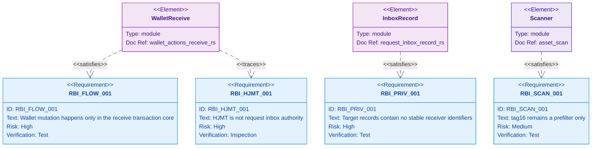

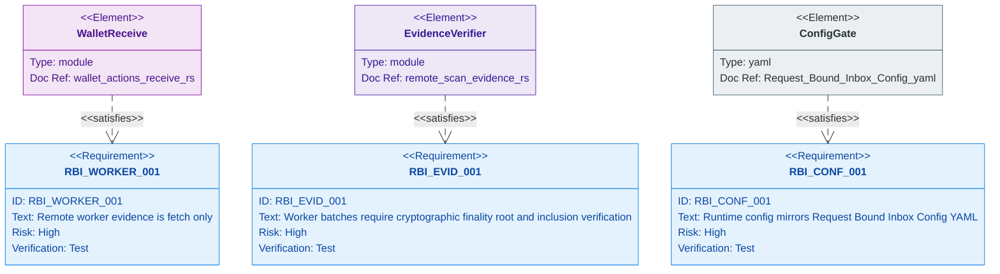

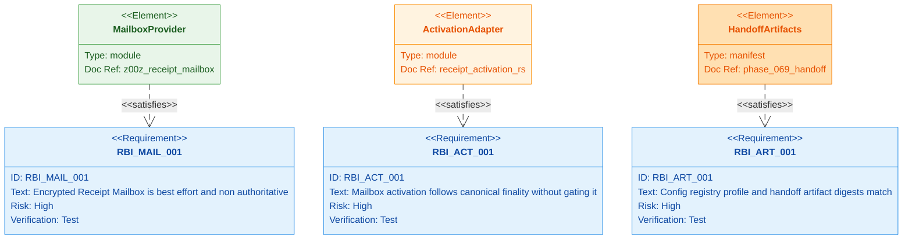

### 15.1 Functional Requirements

- `RBI-FUNC-001`: The system MUST validate every supplied payment request before using it for request-bound receive scanning.
- `RBI-FUNC-002`: The system MUST record only redacted validation classes outside encrypted wallet trust.
- `RBI-FUNC-003`: Only approved typed request contexts MAY enter automatic request-bound receive scanning.
- `RBI-FUNC-004`: Request ordering MUST use the exact comparator in Section 8.2.
- `RBI-FUNC-005`: Wallet mutation MUST happen only in the authoritative receive transaction core; `recv_range(...)` MUST remain its canonical public entrypoint.
- `RBI-FUNC-006`: Inbox insert/list/remove/reject recording MUST be metadata-only unless a later validated operation enters the receive transaction core.
- `RBI-FUNC-007`: Direct `recv_range(...)` fallback MUST remain available when inbox is disabled, unavailable, or unhealthy.
- `RBI-FUNC-008`: Remote worker fallback MUST accept only `VerifiedScanBatch` and MUST NOT allow worker mutation.
- `RBI-FUNC-009`: Phase 071 MUST implement Encrypted Receipt Mailbox delivery
  from the Phase-069 reserved profile without changing the canonical transaction
  digest, transition predicate, finality, or authoritative receive mutation lane.
- `RBI-FUNC-010`: Mailbox loss or expiry MUST fall back to all-shard current-
  state seed recovery and a fresh locally verified membership witness.

### 15.2 Privacy Requirements

- `RBI-PRIV-001`: Target durable/helper records MUST NOT contain `owner_handle`, `view_pk`, `identity_pk`, raw `req_id`, compact request bytes, amounts, asset ids, sender identity, or decrypted pack fields.
- `RBI-PRIV-002`: Current binding-rich inbox records MUST remain legacy/transitional and MUST NOT become durable helper records.
- `RBI-PRIV-003`: Card-only and plain receive MUST remain compatibility paths and MUST NOT be represented as privacy-equivalent.
- `RBI-PRIV-004`: `TxPackage`, compact request, receiver-card, forwarding bundle, and backup/export paths MUST be treated as sensitive transport material.
- `RBI-PRIV-005`: OnionNet MUST remain a future transport boundary and MUST NOT be used to claim shipped protocol-enforced anonymity.
- `RBI-PRIV-006`: Provider-visible metadata disclosure MUST include locator access, IP/timing/size, and tx/output activation association.

### 15.3 Security Requirements

- `RBI-SEC-001`: Request signatures MUST use the canonical request signing context.
- `RBI-SEC-002`: Wrong chain id, expired timestamp, invalid keys, invalid signatures, revoked pins, and identity mismatch MUST fail closed.
- `RBI-SEC-003`: `tag16` collisions MUST NOT produce ownership acceptance.
- `RBI-SEC-004`: Raw remote proof hints MUST NOT enter mutation; worker batches MUST verify canonical finality/root/inclusion before local scan.
- `RBI-SEC-005`: HJMT proof/root evidence MUST NOT be accepted as wallet ownership proof.
- `RBI-SEC-006`: New helper crypto MUST use project domain/KDF/AEAD facades and MUST NOT introduce custom crypto in wallet/network business modules.
- `RBI-SEC-007`: An Encrypted Receipt Mailbox locator MUST be derived from a per-output
  ECDH secret and MUST NOT use raw `req_id`, `request_id_hash`, a local route
  bucket, `tag16`, or a stable recipient identifier.
- `RBI-SEC-008`: Mailbox codecs MUST enforce caps before allocation/fan-out/
  decrypt, exact canonical EOF, immutable one-entry/output binding, detached
  admission authorization, post-finality activation, and mailbox-only GC.
- `RBI-SEC-009`: The mailbox `V1` families MUST use unique registry type IDs
  and exact positive rows; no suffix, recursive-V1 adapter, or decode fallback
  MAY select them.
- `RBI-SEC-010`: Mailbox creation MUST require explicit recipient capability
  negotiation and sender-local policy; current `PaymentRequest V1`, `view_pk`,
  or provider state MUST NOT imply opt-in.
- `RBI-SEC-011`: Raw wallet indexes MUST NOT expose route, request, validation,
  or time-linkage material; only secret-keyed index tokens are permitted.
- `RBI-SEC-012`: The authoritative receive transaction core MUST accept only
  `ScanBatchSource`; a raw `ScanChunk`, raw worker evidence, or unchecked
  deserialization MUST NOT reach it.
- `RBI-SEC-013`: Request-aware scan hints MUST accept only
  `ApprovedRequestContext`; raw `PaymentRequest` values MUST NOT reach the core,
  and direct compatibility receive MUST pass an empty approved-context set.

### 15.4 Configuration Requirements

- `RBI-CONF-001`: `Request-Bound-Inbox-Config.yaml` MUST exist and be the normative inbox gate for `wallet.receiver.inbox`, even though the file is stored under the phase planning path.
- `RBI-CONF-002`: Runtime config MUST expose or mechanically validate every `wallet.receiver.inbox` key and value.
- `RBI-CONF-003`: Runtime config MUST expose environment overrides under `Z00Z_WALLET_RECEIVER_INBOX_` without permitting security-bound increases beyond the authority-pinned profile.
- `RBI-CONF-004`: Malformed, duplicate-key, unknown-key, missing-required-key, or digest-divergent config MUST fail closed.
- `RBI-CONF-005`: Defaults MUST remain bounded, canonical, mechanically equal to the gate, and testable.
- `RBI-CONF-006`: Phase-069 ConfigV3 `offline_receipt_mailbox` remains
  `declared_only` with aggregate cap zero and no online writer. Phase 071 MAY
  activate only a new monotonic authority-pinned profile/registry generation
  after real size/traffic/90-day plateau measurements and security review.
- `RBI-CONF-007`: Release `remote_scan.enabled` MUST remain `false` until the
  cryptographic evidence verification gate and adversarial tests pass.

## 16. Test Strategy

### 16.1 Existing Tests To Preserve

| Test family | Coverage |
| --- | --- |
| Request validation tests | Wrong chain, expiry, bad signature, malformed keys, TOFU/pinning outcomes. |
| `test_inbox_orders_metadata_only` | Inbox ordering is metadata-only and deterministic. |
| `test_inbox_list_delete_metadata` | Inbox insert/list/remove does not mutate wallet state. |
| `test_valid_case_reenters_lane` | Approved request through inbox re-enters authoritative receive and persists only through canonical path. |
| `test_req_flow` | Request-bound tag behavior separates request ids and rejects unauthorized tag-only scan. |
| `test_fast_reject` | `tag16` prefilter skips high-volume noise while preserving owned outputs. |
| `test_prefilter_collision` | Collisions do not directly imply ownership. |
| `test_dos_resistance` | Collision-heavy scan remains bounded. |
| Remote worker tests | Worker evidence feeds authoritative wallet receive lane and stale/malicious/transport failure paths do not mutate wallet state. |

### 16.2 Required New Unit Tests

- `test_target_record_redacts_binding`
- `test_legacy_projection_drops_binding`
- `test_route_bucket_inputs_change`
- `test_route_bucket_chain_changes`
- `test_route_bucket_epoch_changes`
- `test_request_hash_domain`
- `test_hint_aad_route_binding`
- `test_record_checksum_binds_fields`
- `test_inbox_order_matches_config`
- `test_config_defaults_bounded`
- `test_config_rejects_unbounded`
- `test_release_rejects_sidecar`
- `test_inbox_log_summary_redacts`
- `test_tag16_requires_contexts`
- `test_index_tokens_hide_values`
- `test_mailbox_key_parity`
- `test_mailbox_domain_separation`
- `test_mailbox_partition_vectors`
- `test_mailbox_ack_binding`
- `test_mailbox_logs_redact`

### 16.3 Required Integration Tests

- `test_inbox_reenters_receive`
- `test_disabled_inbox_fallback`
- `test_wlt_inbox_roundtrip`
- `test_backup_export_redacts_inbox`
- `test_export_cannot_claim`
- `test_worker_after_inbox`
- `test_worker_forged_proof_rejected`
- `test_worker_wrong_root_rejected`
- `test_worker_fake_output_rejected`
- `test_worker_valid_proof_accepts`
- `test_core_rejects_raw_batch`
- `test_core_rejects_raw_request`
- `test_hjmt_range_mismatch_rejects`
- `test_plain_card_privacy_gap`
- `test_phase069_mailbox_unreachable`
- `test_mailbox_digest_dag`
- `test_mailbox_locator_secrecy`
- `test_mailbox_single_partition`
- `test_mailbox_partition_budget`
- `test_mailbox_opt_in`
- `test_request_v1_no_capability`
- `test_local_config_no_activation`
- `test_mailbox_sender_gc`
- `test_finality_ignores_activation`
- `test_ack_after_wallet_commit`
- `test_mailbox_gc_scope`
- `test_mailbox_loss_recovery`
- `test_mailbox_wire_canonical`
- `test_mailbox_locator_conflict`

### 16.4 Negative Tests

- wrong chain id request,
- expired request,
- unsupported request version,
- malformed compact encoding,
- invalid request size,
- invalid public key bytes,
- bad signature bytes,
- signature verify failure,
- pin revoked,
- identity mismatch,
- no approved requests,
- route bucket collision,
- `tag16` collision storm,
- incomplete tag context set,
- remote worker returned non-contiguous chunks,
- remote worker returned stale resume hint,
- remote worker returned empty proof hint bytes,
- remote worker returned forged non-empty proof bytes,
- remote worker returned valid shape but wrong finality/root,
- remote worker returned a fake output with no canonical inclusion,
- HJMT proof root mismatch,
- exported helper record contains sensitive field,
- logs contain compact request bytes,
- release build enables plaintext debug export.
- any Phase-069 mailbox reader/writer/decoder/activation path is reachable,
- mailbox locator derived from request id/local route bucket/`tag16`,
- missing, expired, malformed, forged, unknown, or downgraded recipient mailbox
  capability; mailbox entry count remains zero,
- one entry copied to multiple logical partitions or more than three configured
  failure-domain replicas,
- adversarial locator grinding exceeds a per-partition byte/entry/reject-work
  budget or is reported as uniform routing,
- cyclic or reordered tx/entry/admission/activation digest binding,
- arbitrary/free/duplicate/replacement/oversized mailbox staging,
- wrong output/network/generation/AAD/nonce/activation/expiry,
- sender required to retain until recipient ACK,
- ACK before authoritative receive transaction commit,
- mailbox GC addresses HJMT/current state/archive/snapshot/backup,
- mailbox loss changes finality, ownership, spendability, or seed recovery.

### 16.5 Simulation Scenarios

| Scenario | Goal | Expected result |
| --- | --- | --- |
| `scenario_rbi_request_happy_path` | Alice creates request, Bob builds request-bound output, Alice scans with inbox. | One owned output accepted through `recv_range(...)`; inbox has approved sanitized metadata. |
| `scenario_rbi_tag16_collision_storm` | Many adversarial leaves share candidate tags. | Scan remains bounded; no false ownership; some work deferred. |
| `scenario_rbi_expired_request_flood` | Many expired requests are submitted with chunks. | No wallet mutation; stable reject classes; expired records pruned. |
| `scenario_rbi_wrong_chain_replay` | Devnet wallet receives request bound to another chain. | Wrong chain reject; no cursor advance. |
| `scenario_rbi_remote_partition` | Remote worker transport fails while inbox has approved requests. | Direct fallback or deferred result according to config; no inconsistent state. |
| `scenario_rbi_stale_checkpoint_hint` | Worker supplies resume hint inconsistent with wallet cursor. | Fail closed and keep current cursor. |
| `scenario_rbi_offline_package_handoff` | Request-bound output is carried in offline `TxPackage`. | Package verifies locally, but transport remains sensitive and no anonymity claim is made. |
| `scenario_rbi_reorg_rescue_scan` | Checkpoint evidence rolls back after inbox hints exist. | Stale hints rejected; full scan rescue MAY rebuild local scan state. |
| `scenario_rbi_pruned_history` | Checkpoint history is not indefinitely available. | Inbox does not replace archive/witness/replay evidence; rescue depends on retained evidence. |
| `scenario_rbi_offline_receipt_delivery` | Sender stages one request-bound encrypted receipt and becomes unavailable after quorum/readback. | Recipient returns before expiry, derives the ECDH locator, verifies/decrypts the activated entry, then commits only through the authoritative receive transaction core. |
| `scenario_rbi_mailbox_expiry_loss` | All providers lose the mailbox or the recipient returns after the height window. | Current unspent output is recovered from seed/live state with a fresh witness; full/spent history remains backup-owned. |
| `scenario_rbi_mailbox_day100_plateau` | Fill the 90-day mailbox ring and advance to day 100 at 5-second blocks. | Logical and replication-adjusted physical bytes plateau; current state and compact notary history are untouched by mailbox GC. |

### 16.6 End-To-End Gates

The following commands are the minimum mandatory closeout gate after the target
test files and provider crate land. Every command MUST exit zero in the same
release-profile CI job; splitting them across incompatible configs is forbidden.

```bash
cargo test -p z00z_wallets --features test-params-fast --test test_stealth_request
cargo test -p z00z_wallets --features test-params-fast --test test_asset_scanner_prefilter
cargo test -p z00z_wallets --features test-params-fast --test test_remote_scan_worker
cargo test -p z00z_receipt_mailbox --all-targets
cargo test -p z00z_aggregators --features test-params-fast receipt_activation
cargo test -p z00z_simulator --features test-params-fast scenario_rbi
```

The same job MUST also prove: strict config canonicalization/digest parity,
Phase-069 handoff/registry/profile digest parity, no raw-evidence core entrypoint,
no forbidden dependency edge, no forbidden plaintext/index field, canonical
mailbox round trips with exact EOF, and successful rendering of every Mermaid
block. A missing artifact or missing test target fails the gate.

Debug-only features such as `wallet_debug_tools` or `wallet_debug_dump` MUST NOT
appear in normative closeout commands unless a local-only debugging note explains
why they are safe for that run.

## 17. Dependency Contract

Default rule: add no new third-party dependencies for v1. Phase 071 MUST add one
project-owned workspace crate, `z00z_receipt_mailbox`, for the opaque provider
boundary described in Section 10.5.

| Need | Required selection | Status |
| --- | --- | --- |
| Config | `z00z_utils::config` and `YamlCodec` | Existing abstraction. |
| Serialization | `serde` through z00z codec wrappers | Existing workspace dependency. |
| Errors | `thiserror` | Existing workspace dependency. |
| Wallet persistence | existing redb `.wlt` path | Existing wallet backend. |
| Provider persistence | `redb = "3.1.0"` in a separate provider-local database | Existing locked database family; no new engine and no `z00z_storage` tables. |
| Mailbox AEAD | root `z00z_crypto::{seal, open}`; non-WASM injected RNG through `z00z_crypto::aead::seal_with_rng`; exported XChaCha constants | Existing approved high-level facade; business modules MUST NOT call `chacha20poly1305` directly. |
| Live `ZkPack_v1` | existing wallet `ChaCha20Poly1305` path | Preserve the live pack contract; implementations MUST NOT conflate its 12-byte nonce with mailbox XChaCha. |
| Hash/KDF | project `z00z_crypto` domain/KDF facade | Business modules MUST NOT call `blake2`, `hkdf`, or `sha2` directly; add a non-vendor `z00z_crypto` wrapper if a required operation is missing. |
| Constant-time equality | `subtle` or existing wrappers | Existing dependency. |
| Secret cleanup | `zeroize` and existing `Hidden<T>` patterns | Existing dependency. |
| Async I/O | `tokio` at service/runtime boundaries only | Existing dependency. |
| CPU scan parallelism | `rayon` only where existing scanner design supports it | Existing dependency. |
| Property tests | `proptest` | Existing dev dependency. |
| Benchmarks | `criterion` | Existing dev dependency. |
| Temporary files | `tempfile` | Existing dev dependency. |
| Structured logs | `tracing` through z00z logging wrappers | Existing dependency. |
| Provider crate | internal `z00z_receipt_mailbox` workspace member | New project-owned crate; external dependency set remains unchanged. |

Required Cargo changes are exact:

- add `crates/z00z_networks/receipt_mailbox` to workspace members,
- add path dependency `z00z_receipt_mailbox` to `z00z_wallets`,
- add path dependency `z00z_receipt_mailbox` to `z00z_aggregators` only for the
  opaque activation adapter,
- add path dependency `z00z_receipt_mailbox` to `z00z_networks_rpc` only for
  `receipt_mailbox_adapter.rs`,
- provider runtime dependencies are exactly path `z00z_crypto`, path
  `z00z_utils`, workspace `thiserror`, `tokio = "1"` with only `rt`, `sync`, and
  `time` features, and `redb = "3.1.0"`,
- provider dev dependencies MAY use the already locked `proptest = "1.5"`,
  `criterion = "0.5"`, and `tempfile = "3.8"`, and
- business code MUST NOT add direct `chacha20poly1305`, `blake2`, `hkdf`,
  `sha2`, `serde_yaml`, `serde_json`, `async-trait`, or a new transport/database
  dependency.

External `add_now` is exactly `[]`, meaning no new package family/version beyond
the repository lockfile. Wiring the exact already-locked dependencies above into
the new project-owned crate is required and is not an `add_now` exception.
Adding any other third-party crate requires a spec amendment, license/security
review, and evidence that existing abstractions cannot satisfy the contract.

Rejected for v1:

- new embedded database,
- alternate AEAD for `ZkPack_v1`,
- OPRF/PIR crates,
- network overlay crates inside wallet receiver,
- custom crypto helper crates,
- raw `serde_yaml`/`serde_json` in business logic where z00z abstractions exist,
- `blake3` for cryptographic identity or helper commitments.

## 18. Implementation Phases

### Phase A: Fusion Spec And Gate Freeze

- Land this canonical specification and make every Section 4.1 status explicit.
- Restore or generate `Request-Bound-Inbox-Config.yaml` as the canonical gate;
  strict parse, canonical re-encode, and source-spec digest parity MUST pass.
- Treat `Spec.md`, `Spec-1.md`, and `Config-1.yaml` as optional provenance files after canonical acceptance.
- Add mandatory source-shape checks for outdated authority/type/dependency claims.

### Phase B: Runtime Config Gate

- Add typed `wallet.receiver.inbox` config under wallet runtime config.
- Add environment overrides with `Z00Z_WALLET_RECEIVER_INBOX_`.
- Add config bound tests.
- Validate release-mode security settings.

### Phase C: Sanitized Record And Projection

- Add `RequestInboxRecordV1`.
- Add route bucket, request id hash, hint AAD, checksum, and index-token helpers.
- Treat current `RequestInboxRecord` as in-memory legacy.
- Convert validated requests to sanitized target records.
- Add projection tests proving recipient binding is dropped. A durable migration
  MUST NOT be invented unless a persisted legacy fixture is first identified.

### Phase D: Redacted Export Profile

- Add `RequestInboxExportV1`.
- Add redacted debug output.
- Add export redaction tests and log guards.
- Prove exported helper profiles cannot create owned assets or advance cursor.

### Phase E: Feature-Gated Encrypted Persistence

- Add the wallet redb object kind and secret-keyed indexes. Runtime use MAY be
  disabled by policy, but an enabled config MUST NOT fall back to plaintext or
  an in-memory durability claim.
- Persist sanitized encrypted records only.
- Bind outer AAD to wallet identity, object kind/id, payload version, and keyed
  route/epoch tokens; keep raw route and epoch values inside ciphertext.
- Enforce the 2 KiB hint and 8 KiB record caps before allocation/decryption.
- Add prune, duplicate replacement, index-privacy, and backup/export tests.

### Phase F: Fallback And Abuse Hardening

- Wire configured candidate/decrypt/defer budgets.
- Add route collision and `tag16` storm tests.
- Add deferred processing status.
- Add worker evidence fallback coverage.
- Add bounded trusted full-scan rescue behavior.

### Phase G: Remote Worker, HJMT, Simulator, And E2E

- Implement `RemoteScanEvidenceVerifier` and private `VerifiedScanBatch` with
  finality, root, inclusion, range, and resume verification.
- Replace private raw chunk/request parameters with `ScanBatchSource` and
  `ApprovedRequestContext`; retain raw builders only under test cfg.
- Keep release remote scan disabled until the four adversarial proof tests pass.
- Reject cursor advancement from invalid evidence.
- Add HJMT mismatch tests.
- Keep HJMT out of request policy.
- Add simulator request-bound inbox scenarios.
- Add offline package handoff privacy checks.
- Add transport/log/export redaction checks.

### Phase H: Encrypted Receipt Mailbox

- Import the exact Phase-069 ConfigV3/registry handoff and prove its original
  generation is `declared_only`, cap zero, and unreachable from online ingress.
- Implement wallet-owned notice/envelope/admission/outbox and recipient decrypt/
  verification/ACK logic plus explicit recipient/sender opt-in negotiation,
  without persisting request ids or recipient binding in provider-visible state.
- Add `crates/z00z_networks/receipt_mailbox` as the project-owned
  `z00z_receipt_mailbox` workspace crate and implement only opaque bounded
  provider transport/storage there; do not create HJMT inbox rows, a rollup
  mailbox, or a second wallet mutation lane.
- Benchmark canonical object sizes, logical/physical plateau, partition skew,
  upload/readback/fetch/activation/ACK/repair traffic, reject cost, and wallet/
  provider CPU. The 2 KiB/8 KiB ceilings are DoS caps, not capacity estimates.
- Activate only a new monotonic authority-pinned global profile/registry
  generation with a measured positive finite aggregate admission cap. Preserve
  rollback to disabled/no-writer behavior without changing canonical state.
- Run day 0, expiry-1, expiry, day 100, sender-unavailable, replica-loss/
  partition/reorg, corrupt/replay, ACK-loss, crash-at-every-outbox-boundary, and
  all-provider-loss scenarios.

## 19. Completion Criteria

Request-Bound Inbox implementation is complete only when:

- the canonical config, Phase-069 reservation manifest, and explanatory handoff
  exist, strict-parse, canonical-reencode, and match all source/registry/profile
  digests,
- `RequestInbox` remains wallet-local and advisory,
- target durable/helper records contain no stable receiver identifiers,
- current binding-rich record shape is marked legacy and not persisted,
- wallet mutation happens only in the authoritative receive transaction core and
  `recv_range(...)` remains its canonical public entrypoint,
- invalid request paths do not mutate wallet state,
- `tag16` collision tests prove no ownership oracle,
- raw remote worker evidence cannot enter the core, release worker mode is off
  until cryptographic verification passes, and only `VerifiedScanBatch` MAY be
  scanned from a worker source,
- HJMT range evidence cannot become inbox authority,
- package/request/card/helper artifacts are redacted or encrypted on logs and exports,
- card/plain receive stays compatibility-only in docs and tests,
- current `ZkPack_v1` wording remains honest until field-native parity lands,
- the original Phase-069 mailbox profile remains disabled/unreachable and no
  same-generation activation or cap mutation exists,
- Phase-071 mailbox codecs/provider adapters/outboxes pass exact type/version,
  crypto, admission, replication/readback, activation, ACK, expiry, GC,
  crash-recovery, and 90-day plateau gates,
- mailbox delivery never bypasses the authoritative receive transaction core,
  stores request-inbox records in the network, gates finality, or replaces
  current-state seed recovery,
- mailbox locator/provider metadata contains no raw request id, local request
  hash/route bucket, `tag16`, stable receiver identifier, or wallet key,
- the internal `z00z_receipt_mailbox` crate has only the dependency edges in
  Sections 7.4, 10.5, and 17, and external dependency additions remain
  `add_now: []` unless this spec is amended,
- required unit, integration, simulation, and E2E tests pass,
- Section 4 and Section 20 have complete source coverage and no unresolved conflicts.

## 20. Evidence Map

Historical fusion inputs at the time this paper was cut:

- `.planning/phases/071-Request-Bound-Inbox/Request-Bound-Inbox-Spec.md`
- `.planning/phases/071-Request-Bound-Inbox/Request-Bound-Inbox-Spec-1.md`

Historical config draft inputs at the time this paper was cut:

- `pre-fusion .planning/phases/071-Request-Bound-Inbox/Request-Bound-Inbox-Config.yaml`
- `.planning/phases/071-Request-Bound-Inbox/Request-Bound-Inbox-Config-1.yaml`

Primary live-code evidence:

- `crates/z00z_wallets/src/receiver/request_inbox.rs`
- `crates/z00z_wallets/src/receiver/request.rs`
- `crates/z00z_wallets/src/receiver/payment_request_types.rs`
- `crates/z00z_wallets/src/services/wallet_actions_receive.rs`
- `crates/z00z_wallets/src/receiver/asset_scan_tag_cache.rs`
- `crates/z00z_wallets/src/receiver/wallet_asset_scanner.rs`
- `crates/z00z_wallets/src/receiver/asset_scan_support.rs`
- `crates/z00z_wallets/src/stealth/output_build.rs`
- `crates/z00z_wallets/src/stealth/tag16.rs`
- `crates/z00z_wallets/src/stealth/zkpack.rs`
- `crates/z00z_wallets/src/redb_store/`
- `crates/z00z_wallets/src/db/mod.rs`
- `crates/z00z_wallets/src/chain/scan_engine.rs`
- `crates/z00z_wallets/src/tx/state_witness.rs`
- `crates/z00z_wallets/tests/test_stealth_request.rs`
- `crates/z00z_wallets/tests/test_asset_scanner_prefilter.rs`
- `crates/z00z_storage/src/settlement/`
- `crates/z00z_crypto/src/aead/aead_envelope.rs`
- `crates/z00z_crypto/src/aead/mod.rs`
- `Cargo.toml`
- `crates/z00z_runtime/aggregators/README.md`
- `crates/z00z_rollup_node/`
- `crates/z00z_networks/onionnet/`

## 21. Fusion Doublecheck Closeout

| Claim | Status | Evidence |
| --- | --- | --- |
| Request-Bound Inbox v1 belongs in `z00z_wallets`. | Verified by source docs and live module layout. | Current inbox/request/receive code is in `z00z_wallets`. |
| Current binding-rich record MUST NOT become target durable/helper state. | Verified as fusion resolution. | Source phase non-negotiables forbid helper persistence of stable receiver identifiers; current code stores such fields. |
| The authoritative receive transaction core is the sole mutation authority. | Verified by live service flow. | `recv_range_authoritative(...)` calls `persist_scan_batch(...)`; public and typed wrapper paths MUST converge there. |
| `tag16` remains prefilter-only. | Verified by live scanner comments/tests and both specs. | Strict tag-only mode requires complete contexts. |
| HJMT and remote workers are non-ownership inputs. | Partially verified; implementation blocker open. | Storage owns roots/proofs, but current worker validation is shape-only and needs Section 12.8 cryptographic promotion. |
| Fusion-input conflicts are resolved. | Verified by in-document coverage ledger. | Section 4.3 resolves source conflicts; Section 4.1 separately tracks open implementation/artifact blockers. |
| This paper and its generated gates are self-contained for implementation planning. | Open artifact blocker. | Config and Phase-069 handoff artifacts MUST exist and pass digest parity; prose cannot substitute for them. |

## 22. Phase-069 Handoff And Activation Contract

### 22.1 What Phase 069 Must Deliver

Phase 069 is a prerequisite provider, not the mailbox implementation owner. It
MUST deliver exactly these seams:

1. A sharded current-state profile whose every live unspent recipient output
   semantically satisfies `RecipientRecoveryCapsuleV2`, preferably through the
   existing authenticated `{r_pub, tag16, enc_pack}` leaf fields when the audit
   proves equivalence, and wallet APIs that can seed-scan all active shards and
   verify a fresh current-root membership witness. Duplicate permanent recovery
   payload is forbidden.
2. A canonical transaction/finality contract whose transaction digest and
   transition predicate exclude every mailbox digest and availability outcome.
3. A generic durable finalized-output outbox/event containing the public
   transaction/output/checkpoint/current-root/certificate/height/profile
   bindings needed by a later subordinate consumer, without mailbox plaintext,
   locator, request id, receiver secret, or ownership verdict.
4. Global registry reservations for the mailbox families below, classified as
   `ReservedUnreachable`, with unique type IDs, wire/domain version 1, finite
   preheader caps, semantic owner Phase 071, and no online decoder/writer/reader.
   Phase 069 MUST export a machine-readable reservation manifest generated from
   the committed registry snapshot with the exact type IDs/magic, domains,
   versions, caps, lifecycle, namespace, profile generation, and registry/config
   digests; prose examples and suffixes are never allocation authority.
   The planned transfer artifact is
   `069-071-OFFLINE-DELIVERY-RESERVATIONS.json`, paired with the explanatory
   `069-071-OFFLINE-DELIVERY-HANDOFF.md`.
5. ConfigV3 `offline_receipt_mailbox` at `declared_only`, aggregate admission
   cap zero, no online path, and an explicit rule that only a new authority-
   pinned profile and registry generation MAY activate it.
6. The existing three top-level durable authority domains—canonical,
   recursive-evidence, and wallet/backup—with extension-safe durable outboxes.
   Phase 069 MUST NOT add a fourth mailbox authority or claim cross-node
   atomicity.
7. Static and executable negative evidence that the reserved generation cannot
   stage, decode, fetch, activate, ACK, or delete a mailbox object and that seed
   recovery succeeds with no mailbox implementation present.

Phase 069 MUST NOT add `receipt_mailbox_store` to `z00z_storage`, mailbox logic
to `z00z_rollup_node`, a network provider in runtime/aggregator code, wallet
mailbox codecs/outboxes, mailbox benchmarks, delivery scenarios, or a positive
admission cap. Those are Phase-071 deliverables.

### 22.2 Reserved Object Families

| Family | Phase-069 state | Phase-071 responsibility |
| --- | --- | --- |
| `ReceiptMailboxCapabilityV1` | extension name/type/domain reserved; no current-request reinterpretation or public ingress | Implement a recipient-signed, versioned request/card opt-in subrecord and sender-local policy gate. |
| `RecipientReceiptNoticeV1` | private local-codec name/domain reserved; no public ingress | Define exact bounded plaintext and seal/decrypt only inside wallet trust. |
| `EncryptedReceiptMailboxEntryV1` | unique type ID/wire-domain-1/cap reserved; unreachable | Implement immutable canonical ciphertext, locator lookup, cap-before-allocation, and exact EOF. |
| `ReceiptMailboxAdmissionV1` | unique row and admission domain reserved; unreachable | Implement detached existing-spend-identity authorization, quota/fee/rate, and one-entry/output enforcement. |
| `ReceiptMailboxActivationV1` | unique row reserved; no producer/consumer | Implement post-finality binding and reorg/idempotency rules without finality coupling. |
| `ReceiptMailboxReplicaReceiptV1` | unique row reserved | Implement exact-byte/readback/failure-domain/route-generation evidence. |
| `ReceiptMailboxAckV1` | unique row reserved | Emit only after authoritative receive transaction commit; treat as delivery capability, not payment proof. |
| `ReceiptMailboxGcTicketV1` | unique row reserved; no delete authority | Implement ACK/height-expiry CAS confined to the mailbox namespace. |
| `ReceiptMailboxRejectReasonV1` | local typed discriminants reserved; not a network object | Implement stable fail-closed mapping; keep `MailboxUnavailable`/`MailboxExpired` as non-error fallback outcomes. |

The reserved row is not a `TypedLegacyAdapter`. Mailbox wire V1 is a positive
first generation and is unrelated to recursive-proof V1, config V1, local
`RequestInboxRecordV1`, or `ZkPack_v1`. Type ID + exact registry row + expected
namespace selects the codec; a suffix, equal integer, backend label, decode
failure, or alternate decoder never does.

### 22.3 Activation And Rollback

Activation is two-generation and fail closed:

1. Phase 069 ships generation `G` with `declared_only`, cap `0`, reserved rows,
   and no online codec/provider path.
2. Phase 071 implements the feature behind disabled gates and proves canonical
   codecs, recipient/sender opt-in negotiation, cryptography, admission, abuse
   resistance, provider quorum/readback,
   wallet atomicity, expiry/GC, crash recovery, privacy, and seed fallback.
   Its build/test fixtures import the Phase-069 reservation manifest by digest;
   hard-coded duplicate IDs or a hand-copied divergent registry table reject.
3. Phase 071 measures actual p50/p95/max object sizes; entries/output/block/day;
   16-partition skew; proof that each entry occupies one partition and three
   replicas only; three-replica logical and physical 90-day/day-100 plateau;
   stage/readback/activation/fetch/ACK/repair traffic; reject CPU; and wallet/
   provider memory. No cap is used as an expected-size estimate.
4. Authority publishes new registry/profile generation `G+1` with explicit
   activation height, exact manifests/digests, positive finite aggregate and
   per-partition byte/entry/reject-work admission budgets, fee/quota/rate policy,
   and the online lifecycle.
5. Every consumer validates the whole `(type ID, wire/domain/crypto versions,
   registry digest, config schema, profile ID/generation/manifest digest,
   activation range)` tuple before allocation or state mutation.
6. Rollback disables new stage/activation/fetch work and drains or expires the
   already admitted mailbox namespace. It never rewrites generation `G`, changes
   canonical state, deletes live recovery capsules, or invalidates finalized
   payments.

Changing cap/policy/route/crypto under the same generation, activating the
reserved row in place, accepting an unmeasured or unbounded cap, or silently
falling back to a weaker route/replica profile is a release blocker.

### 22.4 Atomicity And Idempotency

The correct model remains three authority-local transactions connected by
digests, idempotency keys, and durable outboxes:

- Canonical commit atomically installs the finalized state/root/head/certificate
  and the generic finalized-output outbox event. A later mailbox activation is a
  subordinate idempotent consumer and cannot roll back the payment.
- Sender wallet commit atomically persists the final transaction digest,
  immutable entry bytes/digest, exact signed admission bytes/digest,
  route/profile generation, send row, and upload outbox. Recovery replays the
  exact persisted bytes and MUST NOT re-encrypt, rebuild, or re-sign from mutable
  current config.
- Recipient wallet commit enters the authoritative receive transaction core and
  atomically installs `FinalizedWalletReceiptV2`, owned output, scan cursor,
  wallet-state root, ACK outbox, and backup outbox. ACK-before-commit rejects;
  ACK replay after commit is idempotent.

Replica put/readback, activation, fetch, ACK, tombstone, repair, and GC are
subordinate sagas keyed by immutable entry/output/activation digests and route
generation. A design MUST NOT call them a fourth distributed transaction.

### 22.5 Retention, Availability, And Privacy Gates

- Initial target: 1,555,200 finalized blocks from output finality (nominal 90
  days at 5 seconds), exactly one locator-selected partition per entry out of 16
  logical partitions, exactly three replicas in three distinct failure domains
  within that partition, write quorum two, read quorum one, one entry/output,
  2 KiB notice cap, and 8 KiB entry cap. Cross-partition fan-out is forbidden.
  All size/count values are anti-amplification/config ceilings, not expected
  capacity.
- Locator routing is grindable by a malicious sender and is therefore protected
  by measured global plus per-partition byte/entry/reject-work budgets before
  storage. Honest-distribution measurements are operational evidence only, not a
  security theorem. Partition saturation degrades delivery, never finality or
  current-state recovery.
- Sender local GC is permitted after replica write quorum plus authenticated
  readback; recipient ACK is not required. Initial ACK quorum is two of three and
  MAY delete entry bytes early. Its tombstone MUST remain until original height
  expiry to prevent resurrection, then height expiry deletes all mailbox-only
  bytes and the bounded tombstone.
- Providers expose only immutable put, keyed get, activation, capability ACK,
  repair, and scoped delete. They cannot list by owner, request wallet keys,
  publish to a public DHT by default, or delete another namespace.
- A wallet creates or polls mailbox objects only when the recipient advertised a
  valid registered capability and the relevant local policy is enabled. Missing
  capability is normal and falls back to canonical current-state recovery; it is
  never a payment failure.
- Mailbox objects never enter HJMT/settlement state, DA/challenge archive,
  permanent notary history, wallet history, or backups by default. Current
  recovery capsules remain while outputs are unspent; full/spent personal
  history remains in `WalletBackupV5`.
- Production closeout requires day 0, expiry-1, expiry, and day 100; sender
  unavailable after quorum/readback; replica loss/partition/reorg; corrupt/
  replayed entry; ACK loss; crash at every durable boundary; all providers
  unavailable; and seed-only recovery after loss/expiry. Every failure preserves
  canonical finality and current-unspent recovery.
