# Z00Z Phase 072 Offline Transaction Specification

[TOC]

Specification version: `1.0.1`

Revision date: `2026-07-19`

Status: canonical fusion specification for Phase 072.

Canonical artifact: `.planning/phases/072-Offline-Transaction/072-Offline-Transaction-Spec.md`

Planned config gate path: `config/offline_transaction/offline-transaction-config.yaml`

Authority rule:

- This document MUST be the single source of truth for Phase 072.
- Earlier draft material has been folded into this document and MUST NOT be treated as parallel canonical content.
- If validated live code and this document diverge, the implementation team MUST update this document first or in the same change, then update implementation tasks and tests.
- Section 2 MUST be treated as the in-document fusion coverage ledger; no external audit file is required for implementation authority.

Owner crates:

- `crates/z00z_core`
- `crates/z00z_wallets`
- `crates/z00z_storage`
- `crates/z00z_runtime/validators`
- `crates/z00z_runtime/aggregators`
- `crates/z00z_rollup_node`
- `crates/z00z_simulator`
- `crates/z00z_networks/rpc`
- `crates/z00z_crypto`
- `crates/z00z_utils`

Normative language:

- `MUST`, `MUST NOT`, `SHOULD`, `SHOULD NOT`, and `MAY` are normative markers.
- `MUST` and `MUST NOT` are release gates.
- `SHOULD` and `SHOULD NOT` are expected defaults. An exception MUST identify the exact gate, accountable owner, reason, security/compatibility impact, expiry or permanent rationale, and a passing test or review artifact; an undocumented exception fails release review.

## Key Terms Used In This Paper

| Term | Meaning in this specification |
| --- | --- |
| `TxPackage` | The only current canonical portable transaction node, defined by the wallet transaction wire layer. |
| `TxWire` | The digest-bound transaction payload inside `TxPackage`. |
| `OfflineTxBundleV1` | Planned additive multi-node wrapper around existing `TxPackage` nodes. It is not a second transaction family. |
| `Bundle graph` | The canonical Phase 072 term for the packages/edges/order inside `OfflineTxBundleV1`; historical “DAG” and “package graph” wording is provenance only. |
| `VerifiedBundleGraphV1` | Private process-local capability proving bounded package/graph/source validity only; it is not a wallet readiness, ownership, admission, storage, theorem, or finality capability. |
| `Package-local validity` | The result of `verify_full_tx_package(...)`: structural, digest, fee/balance, signature, range-proof, and public-spend correctness for one package. |
| `Import-ready` | Wallet-local decision that package-local validity, chain identity, owned-output discovery, explicit import action, and the applicable readiness/evidence rules in Section 7.2.1 all pass. A mutable `status` string alone is never import authority. |
| `Publication-eligible` | Runtime submission decision for any holder: package/bundle validity, chain/graph/source commitments, runtime admission policy, and later storage/finality gates pass. It never requires the submitter to own an output and never grants wallet import authority. |
| `Minimal ancestor closure` | For one selected publish tip, exactly that tip plus every transitive parent package required to resolve its inputs; no unrelated sibling or second tip is allowed in v1. |
| `Working-window prepare` | Read-only storage planning on a scratch overlay where outputs from earlier bundle nodes can satisfy later inputs. It produces `BundleApplyPlanV1` and MUST NOT mutate committed state. |
| `BundleApplyPlanManifestV1` | Storage-owned canonical binary commitment for one `BundleApplyPlanV1`. It binds exact package-source commitments, roots, provenance, draft/exec identities, and config identity without embedding mutable status/evidence or large source blobs. |
| `Phase 078 canonical finalization` | The only canonical-state mutation path for a verified `BundleApplyPlanV1`: `CheckpointTransitionIntentV2` -> exact DA readiness -> `CanonicalFinalityCertificateV2` -> the `CanonicalCommitterV2` canonical-head transaction. Phase 072 performs no earlier canonical commit. |
| `SettlementTheoremBundle` | Live single-package validator consistency contract across one `TxPackage`, `CheckpointExecInput`, `CheckpointArtifact`, and `CheckpointLink`. Dependent bundles require the shared-primitives adapter in Section 9.3, not repeated unchanged calls. |
| `HJMT` | Storage-owned settlement tree, proof surfaces, and runtime topology used as the canonical committed-state substrate. |
| `Committed-state HJMT scan` | Proof-first wallet scan lane that validates settlement inclusion before ownership detection. |
| `Detached package scan` | Report-only wallet scan over portable package bytes before checkpoint finality exists. |
| `PaymentRequest` | Privacy-preferred request-bound receive artifact. |
| `ReceiverCard` | Signed direct routing artifact for sender-side stealth output construction. |
| `ReceiverCardRecord` | Published receiver-card trust record with registry, epoch, and revocation semantics. |
| `Request inbox` | Wallet-local advisory metadata surface for request ordering. It is not mutation authority. |
| `Remote scan evidence` | Worker hints, proof hints, chunk hints, and resume hints. They remain evidence-only. |
| `Offline holder` | Any actor that possesses package or bundle bytes and may relay or submit them for validation later; possession alone does not establish validity or publication eligibility. |
| `Atomic bundle reject` | V1 rule where any cycle, unresolved input, duplicate spend, competing child, or theorem mismatch rejects the whole bundle. |

## Naming And Symbol Conventions

| Concept | Canonical name | Rationale |
| --- | --- | --- |
| Document | `072-Offline-Transaction-Spec` | Canonical Phase 072 fusion spec. |
| Planned config gate | `config/offline_transaction/offline-transaction-config.yaml` | Phase-level runtime gate for wallet, storage, validators, rollup, and simulator behavior. |
| Canonical single-node payload | `TxPackage` | Already live in the codebase and MUST NOT be forked. |
| Inner payload | `TxWire` | Already digest-bound and checked by the current verifier. |
| Multi-node wrapper | `OfflineTxBundleV1` | Extends `TxPackage`; it does not replace it. |
| Canonical public receive entry | `WalletService::recv_range(...)` | Public entry that enters the same private authoritative receive transaction core used by approved helper lanes. |
| Authoritative receive transaction core | `WalletService::recv_range_authoritative(...)` plus `persist_scan_batch(...)` | The sole receive mutation boundary; helper lanes MUST re-enter it. |
| Advisory request-bound path | `WalletService::recv_range_with_inbox(...)` | Advisory orchestration helper that validates and orders inputs before entering the authoritative receive transaction core. |
| Worker-assisted path | `WalletService::recv_range_with_worker(...)` | Advisory evidence lane; release use MUST remain disabled until Phase 071 cryptographically promotes evidence to `VerifiedScanBatch`. |
| Local verifier | `verify_full_tx_package(...)` | The only package-local verifier for one package. |
| Public spend verifier | `verify_tx_public_spend_contract(...)` | Checks statement/auth scope, but does not replace the storage theorem. |
| Pre-DA storage handoff | `CheckpointDraft` / `CheckpointExecInput` / `PrepSnapshotId` | Candidate inputs produced by read-only prepare and bound into the Phase 078 intent. |
| Post-DA storage binding | `CheckpointArtifact` / `CheckpointLink` | Final checkpoint objects bound by storage only after Phase 078 reaches `DaReady`. |
| Validator theorem | `SettlementTheoremBundle` | Existing theorem boundary. |
| Committed-state receive proof | `proof-first HJMT scan` | Proof first, ownership second. |

## Invariant Navigation Map (Non-Normative)

This map is navigation only, is not an independent requirement layer, and intentionally defines no `ZINV-OTX-*` identifiers. The authoritative wording is in the referenced gates; if a summary below and a gate ever differ, the gate wins.

| Invariant topic | Authoritative gates and sections |
| --- | --- |
| One canonical node and additive bundle wrapper | Sections 7.2, 7.5, and 16; `DIG-001..005` |
| Verify/report has no mutation authority | Sections 7.6 and 8.3; `LIF-001..002`, `OTX-AC-001..002`, `OTX-AC-016` |
| Wallet, storage, validator, and transport ownership | Sections 6.1..6.3 and 9.1..9.3 |
| One base anchor, deterministic working-root construction/replay, exact closure/order, terminal-output import, exact plan-source freeze, and atomic rejection | Sections 7.5.1..7.6 and 9.2; `OTX-AC-006..009`, `OTX-AC-017..023`, `OTX-AC-031` |
| Transport metadata is outside semantic identity | Section 7.3 and Section 7.5.4; `DIG-004`, `OTX-AC-012` |
| Proof-first committed-state ownership | Section 9.5; `OTX-AC-010` |
| Holder relay neither bypasses admission nor inherits wallet ownership/readiness | Section 7.5.5 and Section 10.2; `OTX-AC-032` |
| No parallel crate, verifier, state tree, or crypto stack | Sections 6.3, 13.4, and 16 |
| Inbox and worker evidence remain non-authoritative | Sections 7.1.1 and 9.6; `OTX-AC-013..015` |
| Config, checkpoint, route, and HJMT drift fail closed | Section 5 and Section 9.4; `CFG-001..012`, `OTX-AC-011`, `OTX-AC-030` |

## 1. Why This Specification Exists

Phase 072 is wider than "export a package and import it later". The correct architecture question is:

1. how portable confidential outputs are built;
2. how one `TxPackage` is verified and imported;
3. how multiple dependent `TxPackage` values can travel safely as one publication-eligible minimal branch;
4. how a bundle becomes a checkpoint-valid state transition;
5. how request-bound receive, HJMT, rollup publication, and simulator evidence fit into one coherent system.

This fusion specification exists because the earlier draft corpus contained several useful but incomplete viewpoints:

- the final text keeps the strongest runtime-flow, request-bound receive, HJMT, acceptance, and architecture verification material;
- the final text also keeps the strongest stale-correction, digest, output-construction, persistence-model, property/fuzz, and decision-record material;
- historical package and DAG notes are preserved as bounded concepts without carrying forward stale signatures or parallel authority surfaces.

The final goal is to:

- preserve the strongest design from both documents;
- eliminate concept drift;
- record conflict resolution explicitly;
- make this document self-contained enough for implementation without reopening retired drafts.

## 2. Integrated Concept Ledger, Supersession, And Reader Contract

### 2.1 Integrated Concepts Brought Forward

| Concept family | Preservation status in this specification | Preserved material |
| --- | --- | --- |
| Runtime flow and architecture verification | folded as normative Phase 072 flow | C4 pack, config gate, request-bound receive integration, HJMT non-authority, traceability, stage-by-stage verification |
| Stale-correction and contract hardening | folded as normative correction ledger | key corrections, digest contract, output construction, persistence model, property/fuzz, decision record |
| Current package authority | folded as current-state baseline | `TxPackage`, receiver trust split, package-local verifier scope, import gate, lifecycle |
| Execution backlog and seam discipline | folded as implementation guardrail | one verifier, one readiness vocabulary, one import boundary, file-first seam discipline |
| Future DAG/package-graph ideas | folded as bounded bundle semantics | ancestor closure, digest-bound execution order, branch packaging, conflict policy, transport metadata outside digest |
| Original DAG drift guardrails | folded as prohibited-drift and bundle rules | holder-submission/publication-eligibility separation, no fake live bundle type, no standalone DAG authority |
| Request-bound inbox integration | folded as cross-phase compatibility | request priority, advisory inbox, authoritative receive transaction core entry, worker evidence-only rule |
| Module placement and simulator honesty | folded as ownership and verification rules | wallet/storage/runtime/rollup/simulator placement, storage reuse, simulator prototype boundaries |

### 2.2 Key Corrections Against Stale Or Ambiguous Text

| Topic | Stale or ambiguous formulation | Canonical fusion rule |
| --- | --- | --- |
| Import-ready statuses | mutable status text is admission evidence | Live `tx_rpc_support::is_import_ready(status)` recognizes `admitted`, `confirmed`, and `verified` for compatibility. Target bundle/safe-import code MUST also satisfy Section 7.2.1 and MUST NOT trust the status string by itself. |
| Digest semantics | raw package payload digest | The system MUST use `build_tx_package_digest(...)` and domain `z00z.tx.pkg.digest.v2`. |
| Output helper names | stale helper signatures | The system MUST use the live helper family: `build_card_stealth_output_validated(...)`, `build_tx_stealth_output_validated(...)`, `build_output_bundle(...)`, `build_output_bundle_with_rng(...)`, `bind_output_wire(...)`, `decode_output_pack(...)`, `verify_self_decrypt(...)`. |
| Receiver record path | stale planning path | The live path is `crates/z00z_wallets/src/chain/receiver_card_record.rs`. |
| RPC paths | stale `adapters/rpc/methods/*` paths | The live paths are under `crates/z00z_wallets/src/rpc/*`. |
| Wallet ownership scan | remote workers or runtime can decide ownership | Wallet-local receive and scan MUST remain authority; remote workers MAY only supply evidence. |
| DAG implementation | separate transaction family or standalone service | Bundle graph support MUST be a wrapper around `TxPackage`, not a separate protocol. |
| Graph dependency crate | `petgraph` as immediate add-now | V1 MUST use `BTreeMap` and `BTreeSet`; `petgraph` MAY be reconsidered later only after profiling and RFC review. |

### 2.3 Maturity Boundary

The following labels are normative architecture facts. A developer MUST NOT implement a target rule as though its prerequisite already exists, and MUST NOT weaken a target gate to match incomplete live code.

| Surface | Maturity | Required interpretation |
| --- | --- | --- |
| `TxPackage`, `TxWire`, `build_tx_package_digest(...)`, `verify_full_tx_package(...)` | live | These surfaces MUST be reused exactly; a parallel node, digest, or verifier MUST NOT be introduced. |
| Single-package verify/import RPCs | live, compatibility-limited | Current behavior MUST be preserved, but mutable `status` MUST remain advisory until Section 7.2.1 evidence is implemented. |
| `RuntimeAdmissionReceipt`, `RuntimeConfirmationReceipt`, and `TxConfirmationEvidence` | live wallet/runtime reconciliation DTOs | They are useful owner inputs, but a received `verified: true` flag MUST NOT be promoted to portable cryptographic authority without the Section 7.2.1 owner verifier/capability boundary. |
| `OfflineTxBundleV1`, bundle RPCs, bundle digest, and bundle reports | target, not live | These surfaces MUST remain disabled until `CFG-009` and the bundle acceptance gates pass. |
| `BundleApplyPlanV1` and working-input overlay | target extension | Current checkpoint DTOs are the output boundary, but current `apply_batch_checkpoint(...)` MUST NOT be called unchanged for ancestor-created inputs. Phase 072 MUST hand the verified immutable plan to Phase 078; it MUST NOT install a canonical root before Phase 078 reaches `DaReady`, obtains `CanonicalFinalityCertificateV2`, and executes its canonical-head transaction. |
| `SettlementTheoremBundle` | live single-package validator boundary | Its checks MUST be reused/refactored into shared private primitives; the target bundle adapter MUST preserve single-package behavior but MUST NOT repeatedly call the unchanged base-root equality gate for dependent children. |
| Authoritative receive transaction core | live | Follow Phase 071 ownership and terminology. |
| Worker-assisted receive promotion to `VerifiedScanBatch` | target, release-blocked | `remote_scan.enabled` MUST remain false until Phase 071 cryptographic promotion gates pass. |
| HJMT proof-first simulator scan | live evidence/prototype | It demonstrates the proof-first contract but is not production wallet authority. |
| Phase 078 rollup publication orchestration | adjacent target/live mix | Phase 072 MUST consume its gates and MUST NOT claim they are implemented here. |

### 2.4 Reader Contract

After reading this document, an engineer MUST be able to answer:

| Question | Answer source |
| --- | --- |
| What is the only canonical offline transaction node? | Section 7.2 |
| Where does multi-node logic live? | Sections 6 and 7.5 |
| How does request-bound inbox relate to receive authority? | Sections 7.1.1, 8.1.1, and 9.6 |
| Who owns base-state resolution, working-window prepare, and canonical finalization? | Sections 6.1, 9.2, and 9.7 |
| Which real config gates must align? | Sections 5 and 9.4 |
| Which tests are release gates? | Section 12 |
| Which security claims are allowed or forbidden? | Section 10 |
| What prior material is superseded? | Section 2 |
| Which surfaces are live versus target-only? | Section 2.3 |

## 3. Current Code Truth

The current codebase already contains critical parts of this architecture. This specification MUST respect those facts instead of replacing them with planning abstractions.

| Current code object | Current truth | Architectural implication |
| --- | --- | --- |
| `crates/z00z_wallets/src/tx/tx_wire.rs` | `TxPackage` and `TxWire` are live; `kind = TxPackage`, `package_type = regular_tx`, `tx_type = regular_tx`. | Phase 072 MUST extend the current model rather than replacing it. |
| `crates/z00z_wallets/src/tx/tx_verifier.rs` | `verify_full_tx_package(...)` is already the package-local verifier. | A parallel verifier path MUST NOT appear. |
| `crates/z00z_wallets/src/tx/spend_verification.rs` | `verify_tx_public_spend_contract(...)` checks the public spend envelope. | Public spend verification is real, but it MUST NOT be described as the final settlement theorem. |
| `crates/z00z_wallets/src/rpc/tx_rpc_support.rs` | `is_import_ready(status)` accepts `admitted`, `confirmed`, and `verified`. `status` is not package-digest-bound. | The vocabulary MUST be preserved for compatibility, but status alone MUST NOT establish admission, confirmation, or spendability. |
| `crates/z00z_wallets/src/rpc/tx_rpc_server_lifecycle.rs` | Verify/report and owned-output reporting are separated from import. | Reporting MUST remain report-only. |
| `crates/z00z_wallets/src/rpc/tx_rpc_server_finalize.rs` | Import revalidates, checks chain, mutable readiness status, owned outputs, duplicate/conflict, and already-spent conditions, then uses rollback-backed persistence. | The live API MUST be preserved, but safe/bundle import MUST require evidence-bound readiness and one atomic batch boundary; a loop over single-package import MUST NOT be used. |
| `PortableWalletTxPackage` in `crates/z00z_wallets/src/rpc/tx_types.rs` | Metadata hash binds wrapper version, chain id, and tx hash; package equality intentionally ignores status. | The wrapper MUST be treated as transport compatibility only. It does not authenticate status and MUST NOT replace package/evidence verification. |
| `crates/z00z_wallets/src/services/wallet_actions_receive.rs` | Public `recv_range(...)` and approved helper lanes enter private `recv_range_authoritative(...)`, which persists through `persist_scan_batch(...)`. | The private core plus persistence helper is the sole mutation boundary. |
| `crates/z00z_wallets/src/receiver/request_inbox.rs` | Inbox metadata is local advisory state and off-consensus. | Inbox code MUST NOT mutate wallet state by itself. |
| `crates/z00z_storage/src/checkpoint/build.rs` | `InputResolver`, `ResolvedInput`, `TxPkgSum`, `build_cp_draft(...)`, and `apply_batch_checkpoint(...)` exist; live resolved inputs carry base-root witnesses and batch apply rejects a tx whose `prev_root` differs from the initial root. | Current DTO/output surfaces MUST be reused. Section 9.2 construction/working-input/root-replay extensions MUST be added; release claims MUST NOT state that live apply already supports dependent nodes. |
| `crates/z00z_storage/src/checkpoint/mod.rs` | `CheckpointDraft`, `CheckpointExecInput`, `CheckpointLink`, and `CheckpointArtifact` are live, with current validator binding over artifact/link/exec input | Bundle prepare MUST feed draft/exec candidate inputs; Phase 078 MUST bind final artifact/link after `DaReady` before exact-core theorem verification. |
| `crates/z00z_runtime/validators/src/verdict.rs` | `SettlementTheoremBundle` and `verify_settlement_theorem` are live. | Validators already own theorem binding. |
| `config/hjmt_runtime/sim_5a7s/*` | Manifest, planner, storage, and aggregator configs already exist. | HJMT config MUST be treated as a real runtime gate. |
| `crates/z00z_simulator/src/scenario_1/stage_11/jmt_wallet_scan.rs` | Committed-state scan is already proof-first. | HJMT committed-state ownership MUST remain a stronger statement than detached package reporting. |
| `crates/z00z_wallets/tests/test_stealth_request.rs` | Tests already confirm inbox metadata-only and re-entry behavior. | Request-bound receive integration MUST rely on this authority split. |

## 4. Architecture Contract

Phase 072 architecture MUST be wallet-first for package semantics, storage-first for state truth, validator-first for theorem truth, and rollup-first for publication orchestration.

Normative architecture rules:

1. The single-package path is already production-shaped and MUST remain the canonical base.
2. The bundle path MUST be additive wrapper behavior.
3. Request-bound inbox MUST improve privacy and orchestration, but MUST NOT become state authority.
4. HJMT MUST strengthen committed-state evidence, but MUST NOT replace wallet-local receive or import policy.
5. Storage, validators, and rollup MUST consume package truth, but MUST NOT reconstruct wallet ownership logic themselves.

### 4.1 C4 System Context

This flowchart is the orientation view: it exposes external actors and the authority boundary between wallet, rollup, storage, validator, DA, and archive lanes.

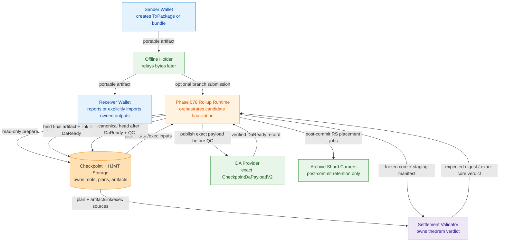

### 4.2 C4 Container View

This container view is needed to freeze production dependency direction between owner crates and external provider adapters.

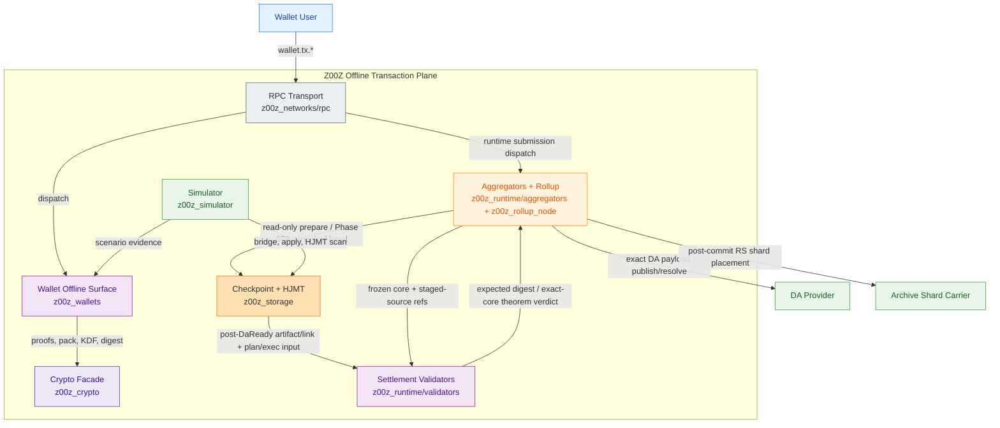

### 4.3 C4 Component View

This component view is needed to show the internal wallet mutation boundary and the exact storage/validator/rollup handoffs without implying shared ownership.

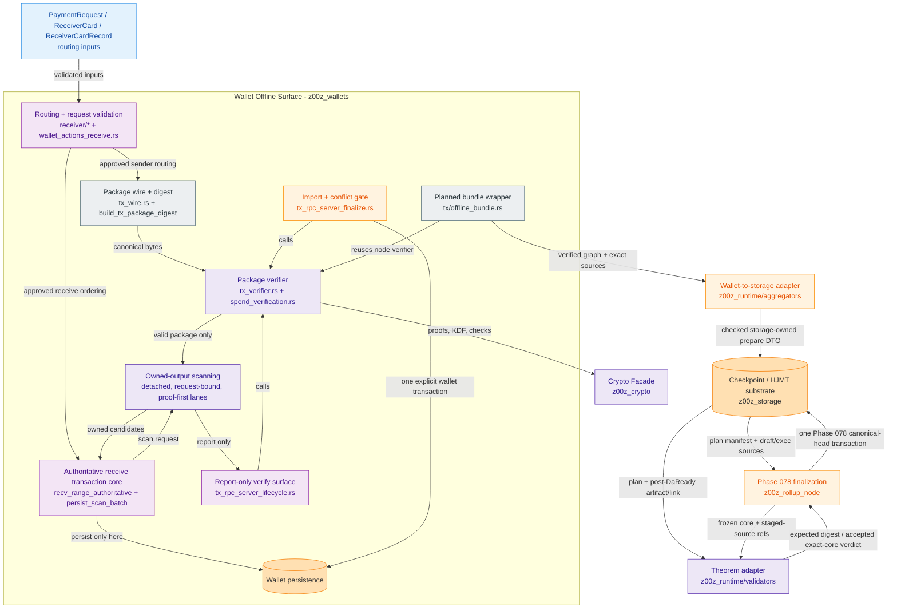

### 4.4 C4 Deployment View

This deployment view is needed to show route/config placement, competing aggregator candidates, and the single CAS-fenced canonical committer.

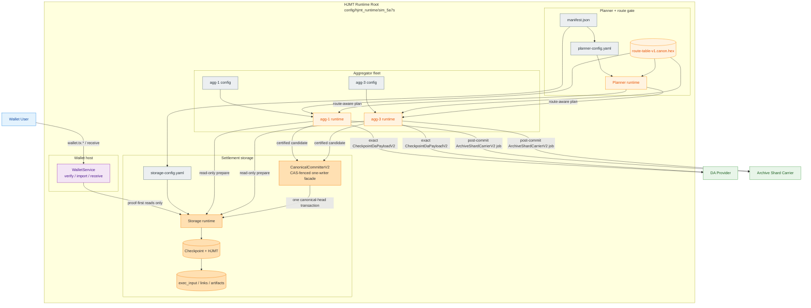

## 5. Normative Configuration Gate

The following YAML is the normative planning schema, not a runtime substitute. Until `config/offline_transaction/offline-transaction-config.yaml` is materialized and loaded through the bounded config path, every new bundle surface MUST remain disabled. Existing single-package APIs remain governed by their current configuration and MUST NOT be disabled merely because the Phase 072 bundle gate is absent.

```yaml
offline_transaction:
  meta:
    id: "offline-transaction"
    version: "1.0.1"
    authority_generation: 1
    status: "normative-fusion-gate"
    updated_at: "2026-07-19"
    source_spec: ".planning/phases/072-Offline-Transaction/072-Offline-Transaction-Spec.md"
    planned_gate_path: "config/offline_transaction/offline-transaction-config.yaml"

  authority:
    canonical_single_package_kind: "TxPackage"
    canonical_package_type: "regular_tx"
    canonical_tx_type: "regular_tx"
    digest_builder: "z00z_wallets::tx::build_tx_package_digest"
    digest_domain: "z00z.tx.pkg.digest.v2"
    local_verifier: "z00z_wallets::tx::verify_full_tx_package"
    public_spend_verifier: "z00z_wallets::tx::verify_tx_public_spend_contract"
    canonical_receive_entry: "WalletService::recv_range"
    authoritative_receive_transaction_core: "WalletService::recv_range_authoritative + persist_scan_batch"
    advisory_inbox_receive: "WalletService::recv_range_with_inbox"
    worker_receive: "WalletService::recv_range_with_worker"
    theorem_bundle: "z00z_runtime::validators::SettlementTheoremBundle"

  repo_rules:
    use_z00z_utils: true
    config_loader: "z00z_utils::io::read_file_bounded"
    yaml_codec: "z00z_utils::codec::YamlCodec"
    max_config_bytes: 65536
    protected_paths:
      - "crates/z00z_crypto/tari/"
    forbidden_shortcuts:
      - "new standalone offline crate"
      - "new regular transaction family"
      - "raw std::fs config reads"
      - "ad hoc YAML parsing"
      - "custom cryptography"
      - "parallel state engine"

  module_ownership:
    core:
      owner_crate: "crates/z00z_core"
      owns:
        - "pure strict offline config DTOs and immutable snapshot value"
      must_not_own:
        - "config file I/O"
        - "wallet package behavior"
        - "storage or publication orchestration"
    wallets:
      owner_crate: "crates/z00z_wallets"
      owns:
        - "TxPackage build, verify, export, import"
        - "wallet-owned output discovery"
        - "receiver routing and request validation"
        - "request-bound inbox orchestration"
        - "planned OfflineTxBundleV1 wire and report-only APIs"
      must_not_own:
        - "checkpoint semantic roots"
        - "HJMT proof truth"
        - "rollup publication authority"
    storage:
      owner_crate: "crates/z00z_storage"
      owns:
        - "InputResolver and pre-state resolution"
        - "TxPkgSum preparation"
        - "read-only working-window prepare"
        - "Phase 078 canonical-head transaction implementation"
        - "CheckpointDraft, CheckpointExecInput, CheckpointLink, CheckpointArtifact"
        - "HJMT roots and proof blobs"
      must_not_own:
        - "wallet ownership classification"
        - "request validation policy"
        - "raw transport helper semantics"
    validators:
      owner_crate: "crates/z00z_runtime/validators"
      owns:
        - "SettlementTheoremBundle"
        - "verify_settlement_theorem"
        - "checkpoint-bound theorem consistency"
      must_not_own:
        - "wallet import policy"
        - "DA readiness or archive custody as settlement validity"
    aggregators:
      owner_crate: "crates/z00z_runtime/aggregators"
      owns:
        - "route-aware planning"
        - "batch ordering after validator-approved inputs"
        - "publication orchestration inputs"
      must_not_own:
        - "wallet private ownership logic"
        - "custom checkpoint semantics"
    networks_rpc:
      owner_crate: "crates/z00z_networks/rpc"
      owns:
        - "bounded raw request envelope and method dispatch"
        - "transport authentication and rate limiting"
      must_not_own:
        - "Base64 or bundle decoding"
        - "wallet session capability or business policy"
        - "storage or theorem calls"
    rollup:
      owner_crate: "crates/z00z_rollup_node"
      owns:
        - "HJMT runtime preflight"
        - "separate DA and archive adapter orchestration"
        - "status and runtime topology"
      must_not_own:
        - "wallet package semantics"
        - "receiver ownership classification"
    simulator:
      owner_crate: "crates/z00z_simulator"
      owns:
        - "deterministic offline bundle scenarios"
        - "bridge and checkpoint fixtures"
        - "HJMT scan examples and tamper evidence"
      must_not_own:
        - "production settlement authority"

  runtime_surfaces:
    canonical_single_package:
      verify_api: "wallet.tx.verify_transaction_package"
      import_api: "wallet.tx.import_transaction"
      export_api: "wallet.tx.export_transaction"
      compatibility_status_vocabulary:
        - "admitted"
        - "confirmed"
        - "verified"
    bundle_wrapper:
      enabled: false
      planned_wire: "OfflineTxBundleV1"
      owner_module: "crates/z00z_wallets/src/tx/offline_bundle.rs"
      codec_module: "crates/z00z_wallets/src/tx/offline_bundle_codec.rs"
      verify_api: "wallet.tx.verify_offline_bundle"
      import_api: "wallet.tx.import_offline_bundle"
      base_anchor_required: true
      minimal_ancestor_closure_required: true
      selected_publish_tip_required: true
      conflict_policy: "atomic_reject"
      cycle_policy: "fail_closed"
      duplicate_package_policy: "reject"
      over_inclusion_policy: "reject_unrelated_nodes"
      transport_metadata_digest_bound: false
      holder_submission_without_ownership_allowed: true
      publication_requires_all_runtime_gates: true
    bundle_settlement:
      adapter: "z00z_runtime::aggregators::offline_bundle_route"
      prepare_input: "z00z_storage::checkpoint::BundlePrepareInputV1"
      input_resolver: "z00z_storage::checkpoint::InputResolver"
      tx_pkg_sum: "z00z_storage::checkpoint::TxPkgSum"
      target_prepare: "z00z_storage::checkpoint::bundle_prepare::prepare_offline_bundle"
      phase078_transition_intent: "CheckpointTransitionIntentV2"
      phase078_canonical_committer: "CanonicalCommitterV2"
      require_da_ready_before_qc: true
      forbid_phase072_canonical_write: true
      current_draft_output: "z00z_storage::checkpoint::build_cp_draft"
      current_apply_limitation: "base-root member witnesses only; not direct ancestor-created inputs"
      exec_input: "z00z_storage::checkpoint::CheckpointExecInput"

  package_limits:
    max_package_bytes: 1048576
    max_outputs_per_package: 16
    max_inputs_per_package: 16
    max_owned_outputs_reported: 16
    max_error_codes: 16
    reject_unknown_fields: true
    require_lowercase_hex: true

  lifecycle:
    compatibility_status_vocabulary:
      - "admitted"
      - "confirmed"
      - "verified"
    readiness_requires_bound_evidence: true
    status_string_is_authority: false
    report_only_statuses:
      - "created"
      - "prepared"
      - "submitted"
    terminal_failure_statuses:
      - "failed"
      - "cancelled"
      - "conflicted"
      - "already_spent"
    reconciled_conflict_persisted_status: "conflicted"

  receiver_routing:
    prefer_payment_request: true
    allow_raw_receiver_card: true
    allow_published_receiver_record: true
    require_card_signature: true
    require_record_registry_binding: true
    reject_revoked_record: true
    reject_stale_record_epoch: true
    raw_card_not_publication_trust: true

  public_spend:
    require_proof_and_auth_together: true
    reject_half_populated_spend: true
    require_prev_root_binding: true
    require_receiver_card_binding: true
    require_statement_integrity: true
    require_duplicate_nullifier_rejection: true
    public_verifier_not_storage_authority: true

  bundle_graph:
    max_nodes: 128
    max_edges: 256
    max_evidence_entries: 256
    max_evidence_entry_bytes: 262144
    max_issuer_domain_bytes: 64
    allowed_issuer_domains:
      admission: "z00z.runtime.admission.v1"
      confirmation: "z00z.checkpoint.confirmation.v1"
    max_request_bytes: 12582912
    max_bundle_bytes: 8388608
    max_ancestor_depth: 32
    max_parallel_proof_verifications: 8
    max_parallel_bundle_requests: 4
    max_terminal_owned_outputs: 256
    max_transient_owned_outputs: 256
    conflict_policy: "atomic_reject"
    order_contract: "explicit_digest_bound_topological_order"
    require_base_anchored_root_chain: true
    dedupe_by_tx_digest: true
    reject_cycles: true
    reject_unresolved_inputs: true
    reject_duplicate_spends: true
    exclude_unrelated_siblings: true
    transport_metadata_in_digest: false

  storage_handoff:
    backend_mode: "hjmt"
    checkpoint_exec_version: 1
    max_plan_manifest_bytes: 1048576
    max_committed_source_bytes: 50331648
    max_package_source_pack_bytes: 8388608
    max_package_source_packs: 2
    max_committed_pack_bytes: 67108864
    require_checkpoint_exec_input: true
    require_base_member_witnesses: true
    allow_working_input_provenance: true
    require_spent_index: true
    reject_physical_as_public_root: true
    remote_scan_worker_authority: "evidence_only"
    wallet_scan_authority: "wallet_local"

  hjmt:
    runtime_root: "config/hjmt_runtime/sim_5a7s"
    planner_config: "config/hjmt_runtime/sim_5a7s/planner/planner-config.yaml"
    storage_config: "config/hjmt_runtime/sim_5a7s/storage/storage-config.yaml"
    manifest: "config/hjmt_runtime/sim_5a7s/manifest.json"
    route_table_rel_path: "shard_route_tables/route-table-v1.canon.hex"
    committed_scan_requires_proof_blob: true
    committed_scan_requires_storage_root: true
    evidence_only_remote_worker: true

  crypto:
    domain_separation_required: true
    vendor_crypto_read_only: true
    live_pack_contract: "ZkPack_v1"
    live_pack_aead: "ChaCha20Poly1305"
    key_derivation:
      - "Argon2id"
      - "HKDF-SHA256"
    constant_time_compare_required:
      - "secret-derived tags and tokens"
      - "keyed fingerprints and MACs"
    forbid_custom_crypto: true

  transport_privacy:
    request_bound_receive_preferred: true
    raw_receiver_card_compatibility: true
    sensitive_artifacts:
      - "PaymentRequest"
      - "ReceiverCard"
      - "ReceiverCardRecord"
      - "TxPackage"
      - "OfflineTxBundleV1"
      - "checkpoint proof bytes"
      - "HJMT proof blobs"
      - "wallet export files"

  receive_integration:
    request_validation_surface: "receiver::ValidatePaymentRequest"
    advisory_inbox_entrypoint: "WalletService::recv_range_with_inbox"
    canonical_receive_entrypoint: "WalletService::recv_range"
    authoritative_receive_transaction_core: "WalletService::recv_range_authoritative + persist_scan_batch"
    request_scan_support: "receiver::ReceiverManager::scan_range_with_requests"
    inbox_metadata_only: true
    inbox_reenters_receive_core: true
    remote_scan_evidence_only: true
    remote_scan_release_enabled: false
    remote_scan_promotion_type: "VerifiedScanBatch"
    allow_direct_receive_without_inbox: true
    forbid_inbox_owned_asset_persistence: true
    forbid_inbox_scan_cursor_advance: true

  retry_and_fallback:
    thin_transport_fallback: "thick_package"
    missing_snapshot_fallback: "thick_package"
    stale_snapshot_fallback: "thick_package"
    digest_mismatch_fallback: "reject"
    public_spend_error_fallback: "reject"
    bundle_graph_error_fallback: "reject_bundle"
    remote_scan_unavailable_fallback: "local_scan_only"

  simulation:
    scenario_1_enabled: true
    scenario_11_enabled: true
    release_required_for_range_proofs: true
    wallet_debug_tools_test_only: true

  observability:
    redact_package_bytes: true
    redact_wallet_secrets: true
    redact_receiver_secret_material: true
    log_error_codes: true
    log_lifecycle: true
    package_digest_log_policy: "post_admission_only"
    pre_admission_fingerprint: "hmac_sha256_truncated"
    fingerprint_domain: "z00z.offline_transaction.log"
    fingerprint_label: "bundle_v1"
    fingerprint_bytes: 16
    log_owned_output_count: true
    never_log_asset_secret: true
    never_log_blinding: true

  dependency_posture:
    add_now: []
    reuse_through_owner_facades:
      - "z00z_utils::{codec, config, io}"
      - "z00z_crypto and existing wallet crypto wrappers"
      - "existing wallet hex/base64 dependencies through offline_bundle_codec"
      - "z00z_storage checkpoint/HJMT APIs"
      - "existing z00z_networks/rpc transport stack"
      - "serde derives and thiserror"
      - "std::collections::{BTreeMap, BTreeSet}"
    may_add_later:
      - "smallvec"
      - "serial_test"
    avoid_now:
      - "petgraph"
      - "daggy"
      - "second JMT implementation"
      - "second RPC stack"
      - "custom AEAD crate"
```

The file remains one strict-deserialized object and one exact-byte digest, but its fields have three non-overlapping roles:

| Projection | Exact top-level keys | Permitted use |
| --- | --- | --- |
| Startup identity assertions | `meta`, `authority` | The composition root MUST compare compiled protocol symbols/version/domain/path expectations at startup; any mismatch MUST fail startup. Runtime decisions MUST NOT select alternate functions from these strings. |
| Runtime policy | `runtime_surfaces`, `package_limits`, `lifecycle`, `receiver_routing`, `public_spend`, `bundle_graph`, `storage_handoff`, `hjmt`, `crypto`, `transport_privacy`, `receive_integration`, `retry_and_fallback`, `simulation`, `observability` | The only fields allowed to branch production behavior after startup validation. |
| Review manifest | `repo_rules`, `module_ownership`, `dependency_posture` | CI/spec-review assertions only. Production code MUST parse them strictly for full-file integrity but MUST NOT branch on paths, prose, dependency suggestions, or ownership strings. |

The pure strict DTOs `OfflineTransactionConfigV1`, `OfflineTransactionRuntimeV1`, `OfflineReviewManifestV1`, and `OfflineConfigSnapshotV1` MUST live in `z00z_core::offline_transaction`; they MUST contain no I/O, wallet, storage, RPC, or provider types. Each process composition root MUST perform exactly one bounded read/decode and distribute one immutable `Arc<OfflineConfigSnapshotV1>` containing the typed runtime projection, schema version, file-supplied `authority_generation`, process-local `load_generation`, raw 32-byte runtime digest, and raw 32-byte exact-file digest. Owner modules MUST NOT reopen/reparse the path or cache partial projections independently. RPC transport receives only copied scalar size/concurrency gates from the wallet composition root and MUST NOT gain a dependency on `z00z_core` solely for this config.

Config enforcement rules:

- `CFG-001`: The system MUST load and validate the materialized config before either bundle handler accepts a payload; this gate MUST NOT disable existing single-package APIs.
- `CFG-002`: Startup validation is mandatory. Hot reload MAY atomically swap only a fully validated immutable snapshot. Each request MUST retain its captured `Arc`; Phase 078 intent freeze and canonical-head preflight MUST compare the captured `(version, authority_generation, runtime_digest)` with the active snapshot and reject `ConfigDrift` if that tuple changed. `authority_generation` MUST be a non-zero `u64`; an increment MUST be checked and overflow MUST fail startup. `load_generation` MUST be a process-local non-zero `u64`, is diagnostics only, and MUST NOT be compared across processes or enter a wire/digest.
- `CFG-003`: `wallet.tx.verify_offline_bundle` and `wallet.tx.import_offline_bundle` MUST remain discoverable but MUST return stable `FeatureDisabled` before payload parsing when the file/field is missing, version/limit is invalid, or `enabled` is false.
- `CFG-004`: Unknown fields MUST be rejected by strict deserialization; configuration MUST NOT be silently ignored.
- `CFG-005`: The file MUST be read once with `z00z_utils::io::read_file_bounded(..., 65_536)`, hashed as those exact bytes, and decoded from the same byte buffer with `z00z_utils::codec::YamlCodec`. Raw `std::fs`, ad hoc YAML parsing, a second time-of-check/time-of-use read, and unbounded reads MUST NOT be used.
- `CFG-006`: Wallet, storage, validators, rollup, and simulator MUST use the exact vocabulary and values in the one loaded config snapshot.
- `CFG-007`: `file_digest` MUST be `z00z_crypto::blake2b_hash(b"z00z.offline_transaction.config_file.v1", &[exact_file_bytes])` and is audit/TOCTOU evidence only. `runtime_digest` MUST be `z00z_crypto::blake2b_hash(b"z00z.offline_transaction.runtime.v1", &[canonical_json_startup_and_runtime_projection])`, where the projection uses `to_canonical_json_bytes` over exactly `meta.{id,version,authority_generation}`, `authority`, and the runtime-policy keys in the table above. Plans/cores MUST bind version, `authority_generation`, and `runtime_digest`; they MUST NOT bind `file_digest`, `load_generation`, YAML formatting, or review-manifest content. Any startup/runtime-policy change MUST increment `authority_generation`; review-only or formatting changes MUST NOT.
- `CFG-008`: Tests MUST include enabled, disabled, missing, malformed, duplicate/unknown-field, unsupported-version, out-of-range, authority-generation/runtime-digest drift, file-only drift, and process-local load-generation fixtures.
- `CFG-009`: `bundle_wrapper.enabled` MAY become `true` only after the wire types, both bundle RPCs, typed errors, bounded raw-byte transport ingress and method-specific size gate, bounded bundle parser, bounded executor, evidence gate, storage-owned prepare DTO/adapter and canonical plan-manifest codec, construction/read-only prepare split, terminal-output filtering, holder-publication separation, shared-primitives theorem adapter, Phase 078 finalization handoff, atomicity tests, and all `OTX-AC-006..032` gates exist and pass.
- `CFG-010`: `bundle_graph` is the sole source for Bundle graph limits and the execution-order contract. A second limit or order knob MUST NOT be added elsewhere.
- `CFG-011`: The full-file DTO and all nested DTOs MUST use `#[serde(deny_unknown_fields)]`. Duplicate keys, unknown keys, invalid projection ownership, or a review-manifest value used as a runtime selector MUST fail config/review gates.
- `CFG-012`: One process MUST expose exactly one active immutable config snapshot. Wallet, aggregator, storage, validator, rollup, and simulator calls MUST receive that snapshot or its typed borrowed projection explicitly; globals, path reopens, component-local snapshots, and silent defaulting MUST NOT be used. Cross-process equality is the canonical `(version, authority_generation, runtime_digest)` tuple; each process's `load_generation` and `file_digest` are non-authoritative diagnostics.

## 6. Module Ownership And Placement

### 6.1 Normative Ownership

Phase 072 MUST live in the existing owner crates and MUST NOT start with a new standalone crate.

| Concern | Canonical home | Rationale |
| --- | --- | --- |
| Shared strict config DTOs/snapshot value | `crates/z00z_core` | All production owner crates already depend on core or receive scalar gates from their composition root; pure types here avoid a wallet/storage/rollup dependency cycle. |
| Portable node contract, local verify/report/import, receiver routing, bundle wire | `crates/z00z_wallets` | Live package semantics and wallet receive/import authority already live here. |
| Base-state resolution, working-window prepare, checkpoint draft/output, HJMT proofs, canonical-head transaction | `crates/z00z_storage` | Roots, proofs, checkpoint DTOs, and the Phase 078 canonical transaction already belong to storage; Phase 072 MUST NOT add an earlier commit path. |
| Theorem and inclusion consistency | `crates/z00z_runtime/validators` | `SettlementTheoremBundle` already lives here. |
| Route-aware planning and publication handoff | `crates/z00z_runtime/aggregators` | Batch and route orchestration belong here. |
| Runtime preflight, separate DA-plane/archive-plane orchestration, canonical finalization status | `crates/z00z_rollup_node` | Phase 078 owns exact DA readiness, QC ordering, canonical finalization orchestration, and the separate post-commit archive plane. |
| Deterministic end-to-end evidence | `crates/z00z_simulator` | Stage 6/7/11/13 already model the offline-to-checkpoint-to-HJMT story. |
| Transport dispatch only | `crates/z00z_networks/rpc` | Transport MUST remain separate from business logic. |

### 6.2 Planned Module Interfaces

| Planned module | Required input -> output | MUST own | MUST NOT own |
| --- | --- | --- | --- |
| `z00z_core::offline_transaction` | exact decoded YAML object + authority/load generations + runtime/file digests -> strict config/runtime/review/snapshot DTOs | pure DTO shape, projection accessors, invariant validation without I/O | file loading, RPC, wallet/storage/provider behavior, mutable globals |
| `z00z_wallets::tx::offline_bundle_codec` | bounded wrapper bytes -> `OfflineTxBundleV1` / `OfflineBundleError` | request/decoded/field limits, strict canonical-JSON decode/re-encode, canonical Base64/hex adaptation, bounded visitors, transport checksum | graph decisions, proof verification, storage reads, wallet persistence |
| `z00z_wallets::tx::offline_bundle` | decoded `OfflineTxBundleV1` -> private `VerifiedBundleGraphV1` / `OfflineBundleError` | node verification dispatch, edge validation, closure, ordering, conflict checks, bundle digest, package-source commitments | transport encoding, owned-output scanning, storage reads, wallet persistence, theorem verdict, transport dispatch |
| `z00z_wallets::tx::offline_bundle_executor` | cheap-gate-passed Bundle graph -> ordered package verification results | one service-owned eight-thread Rayon pool, four-request fail-fast admission semaphore, cancellation-safe result collection | per-request pools, unbounded queues/tasks, graph ordering, wallet/storage mutation |
| `z00z_wallets::tx::offline_bundle_builder` | selected logical step + storage construction context -> canonical `TxPackage` prefix / final bundle | orchestrate existing package builders in the chosen execution order, preserve private wallet construction authority | invent roots/witnesses, canonical-head mutation, new proof or digest semantics |
| `z00z_wallets::tx::offline_bundle_report` | `VerifiedBundleGraphV1` + wallet scanner -> `BundleVerifyReportV1` | report-only owned-output discovery and stable error mapping | claimed-asset writes, import readiness by status alone, checkpoint mutation |
| `z00z_wallets::rpc::tx_rpc_offline_bundle` | already bounded/decoded RPC request -> wallet report or explicit wallet import result | `wallet.tx.verify_offline_bundle`, `wallet.tx.import_offline_bundle`, wallet session capability, feature, executor-permit, and encoded/decoded bundle gates | raw transport-body parsing, graph algorithms, crypto primitives, canonical-state calls |
| `z00z_storage::checkpoint::bundle_prepare` | storage-owned `BundlePrepareInputV1` + immutable state/config snapshot -> `BundleApplyPlanV1` | committed/working input provenance, scratch overlay, draft/exec candidate preparation | wallet types/package parsing, committed-state writes, wallet ownership, publication |
| `z00z_storage::checkpoint::bundle_plan_codec` | verified `BundleApplyPlanV1` -> bounded canonical manifest/source-pack bytes and digests | strict plan/source-pack codecs, per-entry commitments, exact re-encode, cap enforcement, content-addressed identities | wallet package parsing, evidence/status identity, provider encoding, canonical mutation |
| `z00z_storage::checkpoint::bundle_construction` | checked storage-owned construction step + requested next input refs + pinned snapshot -> single-use `BundleConstructionContextV1` | read-only scratch root progression, prefix binding, and next-step witness context | wallet package parsing/signing, receiver routing, wallet secrets, committed writes |
| `z00z_runtime::validators::bundle_verdict` | plan + post-`DaReady` artifact/link + exec input -> `BundleSettlementVerdictV1` | shared-primitives adaptation of the live single-package theorem, ordered node/verdict digests, deterministic exact-binding errors | copied/weaker theorem logic, persistence, routing, package ownership, DA readiness |
| `z00z_runtime::aggregators::offline_bundle_route` | private `VerifiedBundleGraphV1` -> storage-owned prepare DTO -> immutable plan/draft/exec -> Phase 078 candidate input | pure package/graph-to-storage DTO adaptation, route-aware handoff, bind `plan_digest` as the Phase 078 transition intent's plan digest | reinterpreting package validity, wallet ownership/readiness, custom checkpoint semantics, theorem verdict, canonical commit |
| Phase 078 `CanonicalCommitterV2` + storage finalization facade | immutable transition intent + `DaReady` + exact-core theorem verdict + `CanonicalFinalityCertificateV2` -> canonical head | the one canonical-head transaction and its predecessor/generation/config/plan rechecks | Phase 072 wallet import, package verification, pre-DA canonical mutation |
| `z00z_networks::rpc` bounded ingress/dispatch | raw bounded request/frame -> decoded transport envelope -> wallet RPC method | deployment-wide body/frame cap, bounded envelope/method extraction, bundle-method raw-size gate, transport authentication/rate limit, registration | Base64/bundle decoding, wallet session capability, business decisions, direct storage calls |

Execution rules:

- Decode, length checks, canonicalization, and cheap graph checks MUST finish before proof verification or storage access.
- CPU-heavy proof verification MUST run through one `OfflineBundleExecutorV1` created once with the wallet service, backed by a dedicated `rayon::ThreadPool` with exactly `max_parallel_proof_verifications = 8` worker threads. A handler MUST NOT run proofs on a Tokio reactor, use Rayon global-pool defaults, or create a pool per request.
- Before Base64/inner decode, and after the transport raw-request-size gate followed by transport auth/rate, wallet session-capability, and feature gates, the handler MUST call `try_acquire` on a service-owned semaphore of exactly `max_parallel_bundle_requests = 4`. No waiter queue is permitted: exhaustion returns `VerifierBusy` before decode/proof/storage work and releases no partial result. The permit MUST remain held through proof-result collection and MUST be released before any wallet import transaction begins.
- Each accepted request MAY schedule at most one proof job per package onto that pool, MUST NOT create nested Rayon/Tokio work, and MUST collect by package digest/execution ordinal so task completion order cannot affect reports, errors, or digests. Cancellation MAY abandon the response, but verification jobs MUST remain read-only and bounded; cancellation MUST NOT begin wallet or canonical-state mutation.
- Each proof job MUST convert a panic into `InternalError` at the executor boundary, preserve pool/semaphore usability, discard every partial result, and release the request permit. It MUST NOT unwind across RPC/service boundaries, poison shared mutation state, or continue to import after any job panic.
- `wallet.tx.import_offline_bundle` MUST use one wallet transaction for the entire bundle. It MUST NOT call `wallet.tx.import_transaction` once per node because that permits partial import.

### 6.3 Explicit Rejections

The following placements and shortcuts MUST NOT be used for v1:

- root-level `crates/z00z_offline_tx`;
- a second verifier path outside `z00z_wallets::tx`;
- a second checkpoint/state engine outside `z00z_storage`;
- wallet ownership logic inside `z00z_rollup_node`;
- HJMT proof truth inside `z00z_networks/rpc`;
- parallel Bundle graph state storage separate from HJMT/checkpoint surfaces.

## 7. Canonical Data Contracts

### 7.1 Receiver Routing And Privacy

Routing input priority:

| Artifact | Status | Rule |
| --- | --- | --- |
| `PaymentRequest` | privacy-preferred | SHOULD be preferred when present and valid. |
| `ReceiverCardRecord` | canonical published compatibility lane | MUST be used when publication, epoch, registry-entry, or revocation semantics matter. |
| `ReceiverCard` | direct compatibility lane | MAY be used for direct offline relay when the request-bound lane is unavailable. |

`TxPackage` and `OfflineTxBundleV1` MUST NOT embed raw `PaymentRequest`, `ReceiverCard`, or `ReceiverCardRecord` as digest-bound fields. These artifacts remain upstream routing inputs to output construction and authorization.

### 7.1.1 Request-Bound Receive And Inbox Contract

Phase 072 MUST integrate with the privacy-preferred request-bound lane without capturing its authority.

Required rules:

- `PaymentRequest` MUST be validated through the canonical request-validation surface before it influences receive ordering or output interpretation.
- `WalletService::recv_range_with_inbox(...)` MUST remain advisory and, after validation and ordering, MUST enter the same private `recv_range_authoritative(...)` core as public `recv_range(...)`.
- Request inbox records MUST remain metadata-only and MUST NOT become a second wallet mutation authority.
- Request-bound inbox metadata MUST NOT claim assets, create tx-history rows, or advance the scan cursor.
- Remote scan worker chunks, proof hints, and resume hints MUST remain advisory inputs to the same authoritative wallet-local receive core. `remote_scan.enabled` MUST remain false for release until Phase 071 promotes cryptographically checked inputs to `VerifiedScanBatch`.
- Offline package verify/import and request-bound range receive MUST remain separate concerns, even when used in the same user journey.

Normative integration rules:

- Request-bound receive SHOULD be used for privacy-preserving owned-output discovery when a valid `PaymentRequest` exists.
- `ReceiverCardRecord` or `ReceiverCard` MAY be used when the request-bound lane is unavailable or intentionally not used.
- Inbox metadata, worker evidence, and HJMT proof hints MUST NOT be promoted into independent receive authority.

### 7.2 Current `TxPackage` Contract

`TxPackage` remains the canonical node contract:

| Field | Rule |
| --- | --- |
| `kind` | MUST equal `TxPackage` |
| `package_type` | MUST equal `regular_tx` |
| `version` | MUST be non-zero and supported |
| `chain_id` | MUST be non-zero and match the wallet/runtime chain |
| `chain_type` | MUST be non-empty |
| `chain_name` | MUST be non-empty |
| `tx` | MUST contain live `TxWire` |
| `tx_digest_hex` | MUST equal `build_tx_package_digest(...)` |
| `status` | MUST be a supported lifecycle hint. It is not digest-bound and MUST NOT by itself establish local verification, admission, confirmation, import authority, or spendability. |

`TxWire` contract:

- `tx_type` MUST equal `regular_tx`;
- `inputs` MUST contain only reference-only `TxInputWire` values;
- `outputs` MUST contain portable `TxOutputWire` values;
- `fee` MUST match the sum of fee outputs and calculated fee units;
- `nonce` MUST be non-zero at output level;
- `context` MUST remain explicit even when empty;
- `proof.spend` and `auth.spend` are optional containers, but if either one is present, both MUST be present.

`TxInputWire` MUST NOT inline membership witnesses or consumed leaf bytes. Membership remains a checkpoint/pre-state concern.

`TxOutputWire` MUST carry one semantic role:

- `recipient`
- `change`
- `fee`

### 7.2.1 Status And Evidence Gate

The received `TxPackage.status` value is advisory transport metadata. The current compatibility helper `is_import_ready(status)` recognizes `admitted`, `confirmed`, and `verified`, but a new Phase 072 wallet-import path MUST derive its effective readiness tier locally. These tiers MUST NOT be reused as runtime publication eligibility:

| Effective tier | Required local evidence | Allowed result |
| --- | --- | --- |
| `LocalVerified` | `verify_full_tx_package(...)` passed in the current request; chain matched; owned output exists | report or explicit pending/quarantined import; output MUST NOT be presented as admitted, confirmed, final, or spendable |
| `Admitted` | `LocalVerified` plus canonical runtime admission evidence cryptographically bound to chain id and recomputed package digest | admitted pending import; no checkpoint-finality claim and no general-wallet spendability |
| `Confirmed` | `LocalVerified` plus owner-verified `FinalizedCheckpointRecordV2`/`CanonicalFinalityCertificateV2` and canonical-head inclusion that bind the same `CheckpointArtifact`, `CheckpointLink`, settlement verdict, package digest, and chain | confirmed, wallet-spendable import according to wallet policy |

`OfflinePackageEvidenceV1` is the target additive evidence envelope. Its wire shape MUST be equivalent to:

```rust
#[serde(deny_unknown_fields)]
pub struct OfflinePackageEvidenceV1 {
    pub version: u8,
    pub chain_id: u32,
    pub package_tx_digest_hex: String,
    pub issuer_domain: String,
    pub evidence: OfflinePackageEvidenceKindV1,
}

#[serde(tag = "kind", rename_all = "snake_case", deny_unknown_fields)]
pub enum OfflinePackageEvidenceKindV1 {
    Admission { evidence: RuntimeAdmissionEvidenceWireV1 },
    Confirmation { evidence: CheckpointConfirmationEvidenceWireV1 },
}
```

The envelope MUST bind version `1`, active `chain_id`, the recomputed 32-byte package digest, evidence kind, issuer domain, and the canonical receipt or finalized-checkpoint reference. `issuer_domain` MUST be ASCII, MUST be at most 64 bytes, and MUST equal `z00z.runtime.admission.v1` for `Admission` or `z00z.checkpoint.confirmation.v1` for `Confirmation`; case folding, aliases, and unknown domains MUST be rejected. Confirmation evidence MUST prove the referenced `FinalizedCheckpointRecordV2` is the canonical committed head/ancestor and carries the exact `CanonicalFinalityCertificateV2`; pre-commit `DaReady`, artifact/link existence, archive receipts, and mutable lifecycle booleans MUST NOT confirm a package. It MUST be verified by the existing runtime/checkpoint owner; wallet code MUST NOT implement a second receipt or theorem verifier.

The wire enum MUST have only those two transmitted variants. `LocalVerified` is computed in-process and MUST NOT be accepted from wire bytes. Owner verifiers MUST convert those untrusted wires into non-deserializable, private-field `VerifiedRuntimeAdmissionEvidenceV1` or `VerifiedCheckpointConfirmationEvidenceV1` capability types only after validating the canonical receipt/checkpoint artifacts and inclusion evidence. Each canonically encoded evidence entry MUST be at most `262_144` bytes before cryptographic verification; every nested string, receipt, reference, proof, and inclusion path MUST additionally obey the canonical owner type's stricter field/count limits. A type without such owner limits MUST remain disabled rather than inheriting the 256 KiB envelope cap as permission for unbounded nested allocation. A received `RuntimeAdmissionReceipt.verified` or `TxConfirmationEvidence.verified` boolean is not cryptographic proof by itself. Until the owner crates expose canonical bounded wire forms and verifiers for these capability types, admission/confirmation promotion MUST remain disabled.

Later conflict reconciliation is local and MUST NOT add a third portable evidence variant. The reconciliation owner MUST construct a private, non-deserializable `VerifiedWalletConflictEvidenceV1` only after binding chain id, original package digest, exact consumed `(TerminalId, serial_id)`, conflicting canonical transaction/checkpoint/finalized-record identity, and a closed reason enum to the current canonical head. Until that owner verifier/capability exists, automatic `ReconciledConflict` promotion MUST remain disabled; mutable status, provider receipt, or unbound spent boolean is insufficient.

Evidence rules:

- `EVD-001`: The effective tier MUST be computed from local verification and verified evidence, never copied from `TxPackage.status`.
- `EVD-002`: A received `admitted` or `confirmed` claim without matching verified evidence MUST return `StatusEvidenceMismatch`. A lower/stale hint such as `created` or `prepared` MUST NOT suppress a locally derived tier; reports MUST expose received status and effective tier separately and MUST NOT silently rewrite persistent state.
- `EVD-003`: Status-only changes MUST NOT create a second package identity and MUST NOT be reported as a payload conflict. A change to any digest-bound field under the same external transaction id MUST return `DuplicateConflict`.
- `EVD-004`: Evidence MAY be refreshed without changing package or bundle semantic identity because each evidence object is self-bound to the package digest.
- `EVD-005`: Live `wallet.tx.import_transaction` behavior is compatibility-limited until it enforces these tiers. Release claims MUST NOT describe its mutable status gate as authenticated admission or confirmation.

### 7.3 Digest Contract

`build_tx_package_digest(...)` is the only canonical digest function for regular `TxPackage`.

Digest MUST bind:

- `kind`
- `package_type`
- `version`
- `chain_id`
- `chain_type`
- `chain_name`
- normalized `TxWire`

Live digest normalization rules:

- input `asset_id_hex` canonicalized to lowercase 32-byte hex;
- output `range_proof` removed from digest input;
- output `owner_signature` removed from digest input;
- regular transaction `auth` cleared for digest input;
- spend `statement_hex` and `proof_hex` cleared for digest input;
- canonical spend wire fields normalized before digest input;
- `TxPackage.status` is not part of the digest input and MUST be treated according to Section 7.2.1;
- final hash domain MUST be `z00z.tx.pkg.digest.v2`.

Normative rules:

- `DIG-001`: Implementations MUST NOT use any alternate digest scheme for package identity.
- `DIG-002`: Thin wrappers MUST preserve and revalidate the canonical thick package digest.
- `DIG-003`: Graph node identity MUST be the recomputed `tx_digest_hex`, not transport position.
- `DIG-004`: Transport-only metadata MUST NOT enter the canonical digest.
- `DIG-005`: Digest mismatch MUST reject before owned-output reporting, import, Bundle graph prepare, or runtime admission.

### 7.4 Output Construction Contract

Sender output construction is a cryptographic construction path, not a serializer shortcut.

Canonical live helper surfaces:

- `z00z_wallets::stealth::build_card_stealth_output_validated(...)`
- `z00z_wallets::stealth::build_tx_stealth_output_validated(...)`
- `z00z_wallets::stealth::build_output_bundle(...)`
- `z00z_wallets::stealth::build_output_bundle_with_rng(...)`
- `z00z_wallets::tx::bind_output_wire(...)`
- `z00z_wallets::tx::decode_output_pack(...)`
- `z00z_wallets::tx::verify_self_decrypt(...)`

Output construction MUST enforce or preserve:

- verified receiver routing;
- request approval when request-bound output is used;
- Diffie-Hellman shared key derivation;
- owner tag derivation;
- encrypted asset pack construction;
- output secret derivation;
- commitment construction;
- range-proof generation;
- tag recomputation;
- self-decryption;
- commitment opening check;
- range-proof verification.

Simulator code MUST reuse or mirror wallet helpers. It MUST NOT create a packageable output lane that skips self-decrypt, commitment, or range-proof checks.

### 7.5 Planned `OfflineTxBundleV1` Contract

`OfflineTxBundleV1` is the only allowed future multi-node wire for regular offline transfer.

```rust
#[serde(deny_unknown_fields)]
pub struct OfflineTxBundleV1 {
    pub version: u8,
    pub chain_id: u32,
    pub chain_type: String,
    pub chain_name: String,
    pub base_prev_root_hex: String,
    pub selected_tip_tx_digest_hex: String,
    pub execution_order_tx_digests: Vec<String>,
    pub packages: Vec<TxPackage>,
    pub edges: Vec<OfflineBundleEdgeV1>,
    pub evidence: Vec<OfflinePackageEvidenceV1>,
    pub bundle_digest_hex: String,
}

#[serde(deny_unknown_fields)]
pub struct OfflineBundleEdgeV1 {
    pub parent_tx_digest_hex: String,
    pub parent_output_index: u16,
    pub child_tx_digest_hex: String,
    pub child_input_index: u16,
    pub consumed_asset_id_hex: String,
    pub consumed_serial_id: u32,
}

#[serde(deny_unknown_fields)]
pub struct PortableOfflineTxBundleV1 {
    pub wrapper_version: u16,
    pub chain_id: u32,
    pub bundle_digest_hex: String,
    pub bundle_b64: String,
    pub artifact_checksum_hex: String,
}
```

#### 7.5.1 Wire And Decode Gates

- `version` MUST equal `1`; unsupported versions MUST return `UnsupportedVersion`.
- `PortableOfflineTxBundleV1.wrapper_version` MUST equal `1`; its chain id and advertised bundle digest MUST equal the decoded/recomputed core values.
- Decoded `bundle_b64` bytes MUST be canonical JSON generated by `z00z_utils::codec::to_canonical_json_bytes(&bundle)`. Decode MUST use `z00z_utils::codec::JsonCodec` plus bounded field/sequence visitors owned by `offline_bundle_codec`; decode -> validate -> canonical re-encode MUST equal the original decoded bytes exactly. Pretty JSON, alternate key order, duplicate keys, trailing whitespace/bytes, YAML, bincode, and provider-specific serialization MUST reject as `InvalidEncoding`.
- Bundle `chain_id`, `chain_type`, and `chain_name` MUST equal the active runtime identity and the corresponding fields of every contained package; implementations MUST NOT normalize mismatched spellings.
- An untrusted byte-oriented JSON-RPC transport MUST apply its existing deployment-wide body/frame cap before any JSON parsing and MUST NOT raise that cap for unrelated methods merely to expose bundle APIs. A bounded envelope decoder MAY then read only the JSON-RPC envelope fields needed to identify `method` and retain `params` as a bounded raw slice; for either bundle method it MUST reject a raw request above `12_582_912` bytes before constructing `Value`, deserializing parameters, or allocating Base64 output. The live `RpcDispatcher::dispatch(method, Value)` boundary receives an already allocated value and therefore cannot satisfy this gate by itself: the composition root MUST install a bounded byte-ingress adapter before that dispatcher. If the active transport exposes no raw-envelope boundary, or its reviewed deployment-wide cap is below the required bundle request size, both bundle methods MUST remain `FeatureDisabled`; a trusted in-process call with a prebuilt `Value` MUST NOT be counted as raw-size-gate coverage.
- After bounded envelope dispatch and before Base64 allocation/decode, the wallet-owned `offline_bundle_codec` MUST require encoded length to be a multiple of four, reject above `11_184_812` characters, compute the padded decoded length with checked arithmetic, and reject a predicted result above `8_388_608` bytes. It MUST use the existing `base64` crate only inside that adapter and MUST also reject any actual decoded-length mismatch. Graph, verifier, RPC business, and storage modules MUST NOT decode Base64 independently.
- `bundle_b64` MUST use padded RFC 4648 standard base64 with no whitespace; decode then canonical re-encode MUST equal the received string.
- The decoder MUST enforce `packages <= 128`, `edges <= 256`, `evidence <= 256`, each encoded evidence entry `<= 262_144` bytes, each `issuer_domain <= 64` bytes, ancestor depth `<= 32`, and the Section 5 per-package/evidence-owner limits while decoding. A post-deserialization length check alone is insufficient because allocation already happened.
- Structs and enums MUST reject unknown fields/variants. Hex roots and digests MUST be exactly 32 bytes encoded as 64 lowercase hex characters.
- `packages` input order is transport order only and MUST NOT affect graph identity, verification result, or apply order. `execution_order_tx_digests` is the sole state-execution order and is digest-bound.
- Each node MUST pass `verify_full_tx_package(...)`, chain identity checks, and recomputed digest checks on every verify, prepare, import, transition-intent freeze, or canonical-finalization use.
- Before calling the full verifier, the handler MUST complete bounded decode, envelope shape/version/chain checks, digest recomputation, duplicate/output indexing, edges, closure, cycle, execution-order, and duplicate-spend checks. These cheap gates MUST NOT be reordered behind proof verification.
- `evidence` and the outer `PortableOfflineTxBundleV1` are mutable adjuncts. They MUST NOT enter package or bundle semantic identity.
- The outer wrapper checksum MUST be lowercase hex of `z00z_crypto::blake2b_hash(b"z00z.tx.bundle.transport.v1", &[canonical_json_bundle_bytes])`; wrapper version, chain id, recomputed bundle digest, canonical re-encode equality, and checksum MUST all be verified before using decoded evidence. The checksum detects corruption only and MUST NOT become admission evidence.
- Evidence entries MUST reference a contained recomputed package digest. At most one entry per `(package_digest, evidence_kind)` is allowed; duplicate or invalid supplied evidence MUST reject rather than being ignored. The strongest verified tier is `Confirmed`, then `Admitted`, then locally computed `LocalVerified`.

Only after every bounded wire, cheap graph, package-verification, and package-source-commitment gate succeeds MAY `z00z_wallets::tx::offline_bundle` construct a private-field, non-`Serialize`, non-`Deserialize`, process-local `VerifiedBundleGraphV1`. Its checked constructor MUST bind version `1`, active config identity, canonical chain/base/tip/order/edges, recomputed bundle digest, and every verified package plus exact package-source digest/length/bytes. It grants package/graph validity only: it MUST NOT contain an ownership result, effective readiness tier, admission/confirmation capability, storage plan, theorem verdict, or finality claim. Wallet reporting MAY combine it with an owned-output scanner; holder publication MAY pass it to the aggregator without scanning. A wire/process boundary MUST discard the capability and re-run verification from canonical bytes; a DTO, boolean, status, or caller-constructed graph MUST NOT substitute for it.

#### 7.5.2 Edge And Minimal-Closure Gates

For every edge, the implementation MUST:

1. resolve both endpoint digests to exactly one package and reject self-edges;
2. bounds-check `parent_output_index` and `child_input_index`;
3. canonically decode the referenced parent output and recompute its asset id;
4. require that asset id and serial equal both the edge fields and the referenced child `TxInputWire`;
5. reject duplicate edge tuples, duplicate child-input mappings, and any edge that does not represent a real dependency;
6. require exactly one edge for every child input sourced from another package in the bundle.

Before edge resolution, the implementation MUST index every created `(asset_id, serial_id)` and return `DuplicateCreatedOutput` if more than one package/output position claims the same key.

Across the complete closure, any repeated consumed `(asset_id, serial_id)` or repeated decoded spend nullifier MUST return `DuplicateSpend`, including repetitions split across otherwise valid packages.

`selected_tip_tx_digest_hex` MUST identify exactly one contained package. Starting at that tip, reverse edge traversal MUST produce exactly the set in `packages`: the tip plus every transitive parent and nothing else. A missing parent returns `MissingAncestor`; a second tip, unrelated sibling, or any extra node returns `OverIncludedNode`. V1 intentionally rejects multi-tip bundles.

`base_prev_root_hex` is the initial anchor, not the `prev_root` of every node. Starting from it, scratch apply in declared execution order MUST compute `working_root_before[i]` and `working_root_after[i]` for each package. Package `i`'s spend proof `prev_root_hex` MUST equal `working_root_before[i]`; the first node therefore binds the bundle base, while a dependent child binds the deterministic root produced by all earlier execution-order nodes. Any mismatch returns `RootChainMismatch`.

Every input leaf of a node MUST exist in the scratch overlay at its `working_root_before`. An ancestor-created input is identified only by a valid edge and MUST NOT be misrepresented as a base-root membership witness. This rule is why a dependent bundle cannot require every child proof to bind the same base root.

#### 7.5.3 Digest-Bound Execution Ordering

The creator MUST choose the topological execution order before constructing root-dependent child packages, build packages sequentially against that order's working roots, and then encode their recomputed digests in `execution_order_tx_digests`. It MUST NOT derive order from `tx_digest` because each digest binds `prev_root`, which itself depends on order.

Construction MUST use a pinned, storage-produced `BundleConstructionContextV1` containing the base root, current scratch root, canonical `base_state_generation`, config version/authority-generation/runtime-digest, validated prior package prefix, and bounded witness material for the next step. Wallet code MUST use existing package/proof builders against that context and MUST NOT guess roots, fabricate witnesses, or copy every node to the base root. The context is construction evidence only and MUST NOT be serialized as admission/finality authority. If the next context cannot be derived, construction MUST fail closed.

The context MUST be a private, non-`Clone`, in-process storage value with exactly: version `1`; base/current `CheckRoot`; non-zero `base_state_generation`; `PrepSnapshotId`; config version/authority-generation/runtime-digest; checked `next_execution_ordinal`; an ordered prefix of `(tx_digest, package_source_digest, working_root_before, working_root_after)` rows; and bounded next-input provenance/witness rows using the same committed-versus-working distinction as Section 9.2. The initial context MUST have ordinal zero, empty prefix, and `base_root == current_root`. A context with more than 128 prefix rows, more than 16 next inputs, a prefix/root discontinuity, source mismatch, stale snapshot/head/config tuple, or a working parent not earlier in the prefix MUST reject.

Wallet code MUST convert each locally full-verified package into the same storage-owned checked step fields used by `BundlePrepareTxV1`; storage MUST NOT accept or parse `TxPackage`. `advance_bundle_context_v1(...)` MUST take ownership of the prior context and checked step, require the package spend root to equal `current_root`, perform one read-only scratch apply, append exactly one prefix row, and return a new context for caller-specified next input refs; it MUST NOT expose a borrowed-context or clone-based advance API. Storage MAY independently issue alternative contexts over the same immutable snapshot, but they reserve no state and their alternative children MUST NOT coexist in one V1 minimal closure. Skipping an ordinal or changing the pinned snapshot/config MUST fail. Final bundle assembly MUST use one context prefix exactly; later `prepare_offline_bundle(...)` MUST independently replay the same roots and MUST NOT trust the construction context as settlement evidence.

Verification MUST require that the list length equals `packages.len()`, contains every recomputed package digest exactly once, places every parent before its child, and ends with `selected_tip_tx_digest_hex`. The graph MUST also be checked independently for cycles. An acyclic graph with an incomplete, duplicate, or parent-after-child list returns `InvalidExecutionOrder`; a cyclic graph returns `Cycle`.

Package/edge vector order, map hash seed, task completion order, and locale-aware string comparison MUST NOT influence execution. Two artifacts that choose different valid execution orders are different semantic bundles and will have different package root chains and bundle digests.

#### 7.5.4 Bundle Digest

`build_offline_bundle_digest_v1(...)` MUST frame the fields below with the existing `z00z_crypto` framing helper and return lowercase hex of `z00z_crypto::blake2b_hash(b"z00z.tx.bundle.v1", &[framed_payload])`. It MUST frame, in this order:

1. bundle version and canonical chain identity;
2. raw 32-byte `base_prev_root` and selected-tip digest;
3. `execution_order_tx_digests` as raw recomputed package digests in the exact declared order;
4. edge tuples sorted by `(parent_digest, parent_output_index, child_digest, child_input_index, asset_id, serial_id)` and encoded with fixed-width integers.

The exact payload sequence MUST be `frame_bytes([version])`, `frame_u32_le(chain_id)`, `frame_str(chain_type)`, `frame_str(chain_name)`, `frame_bytes(base_prev_root)`, `frame_bytes(selected_tip_digest)`, `frame_u32_le(execution_order_count)`, each ordered digest through `frame_bytes`, `frame_u32_le(edge_count)`, then for each sorted edge: framed parent digest, parent output index, framed child digest, child input index, framed asset id, and serial id. Counts and integers MUST be checked-converted to `u32`; every `u32` MUST use `frame_u32_le`; each `u16` edge index MUST first be losslessly promoted to `u32`. Variable bytes/strings MUST use `frame_bytes`/`frame_str`. Implementations MUST NOT use concatenation without this framing or platform-native integer encoding.

It MUST NOT separately bind `TxPackage.status`, the transport order of the `packages` vector, `evidence`, the outer portable wrapper, filenames, timestamps, courier data, or human-readable diagnostics. Each package digest still binds the normalized `TxWire`, including its transaction input order. Because bundle identity is semantic rather than an exact-byte checksum, every package and evidence object MUST still be reverified at every trust boundary.

#### 7.5.5 Holder Publication

Possession of valid bytes grants only the ability to relay or submit. Any holder MAY submit the selected tip plus its exact minimal ancestor closure without the original intermediary being online and without owning any output. Publication eligibility MUST require package-local verification, chain/graph/source-commitment checks, runtime admission policy, read-only storage prepare, and the Phase 078 theorem/finality pipeline; it MUST NOT require wallet-owned-output scanning, `LocalVerified`, wallet import, or the submitter's wallet keys. Supplied admission/confirmation evidence, when present, MUST still be checked by its owner and MUST NOT be copied from status, but runtime admission MAY be established during the submission pipeline. Possession is never validity, ownership, admission, wallet import authority, or finality.

#### 7.5.6 Stable Errors And Precedence

The target `OfflineBundleError` and RPC code mapping MUST use this first-failure precedence: `RequestTooLarge`, `FeatureDisabled`, `VerifierBusy`, `InvalidEncoding`, `UnsupportedVersion`, `InvalidTransportChecksum`, `LimitExceeded`, `WrongChain`, `InvalidDigest`, `InvalidPackageShape`, `DuplicatePackage`, `DuplicateCreatedOutput`, `InvalidEdge`, `DuplicateEdge`, `MissingAncestor`, `OverIncludedNode`, `Cycle`, `InvalidExecutionOrder`, `DuplicateSpend`, `InvalidPackageProof`, `InvalidEvidence`, `StatusEvidenceMismatch`, `DuplicateConflict`, `NoOwnedOutputs`, `RootChainMismatch`, `AlreadySpent`, `ConfigDrift`, `ApplyPlanDrift`, `TheoremMismatch`, `InternalError`. A deployment-wide transport cap that rejects before bounded method extraction remains a transport failure outside `OfflineBundleError`. Once the bounded envelope identifies a bundle method, its `12_582_912`-byte gate maps to `RequestTooLarge` and MUST run before parameter deserialization and wallet dispatch. Existing transport authentication/rate-limit failures remain outside `OfflineBundleError` and run after bounded envelope/size gates but before the handler; wallet session-capability failure remains the existing wallet auth error. Once those pass, a disabled handler MUST return `FeatureDisabled` before Base64 or inner-bundle decode. A syntactically decoded wrapper MUST reject an unsupported wrapper version before hashing its potentially large payload; checksum verification then precedes all inner semantic/graph limits except the streaming decoded-byte cap, which maps to `RequestTooLarge`.

Within one class, package failures MUST sort by recomputed package digest; created-output failures by `(asset_id, serial_id, package_digest, output_index)`; edge failures by the Section 7.5.4 edge tuple; and evidence failures by `(package_digest, evidence_kind)`. Human-readable text MAY improve, but stable machine codes and precedence MUST NOT change without a versioned contract update.

Both raw-request and decoded-bundle byte limit failures map to `RequestTooLarge`; node/edge/depth/per-package count failures map to `LimitExceeded`.

The stable wire code is the lower-snake-case enum name (for example `root_chain_mismatch`) in structured RPC error data/report fields. The outer JSON-RPC numeric category MUST reuse the wallet RPC transport registry; callers MUST NOT parse human text or rely on a new Phase 072 numeric namespace.

Each API applies precedence only to gates within its declared scope. Wallet-only verify MAY report `NoOwnedOutputs` as a report diagnostic but MUST NOT fail an otherwise valid report for that reason; wallet import maps that condition to a rejecting `NoOwnedOutputs`, while holder publication MUST NOT. `DuplicateConflict` is import/persistence-only. Wallet-only verify MUST NOT emit `RootChainMismatch`, `AlreadySpent`, `ConfigDrift`, `ApplyPlanDrift`, or `TheoremMismatch`; those codes require import-state, storage, or validator evaluation. Storage/validator owner errors MUST map one-to-one into this stable RPC vocabulary at the wallet/rollup facade; they MUST NOT create a competing public error namespace.

### 7.6 Planned Bundle Verify Report

`wallet.tx.verify_offline_bundle` MUST be report-only and MUST return a wallet-scoped `BundleVerifyReportV1`:

| Field | Meaning |
| --- | --- |
| `verified_scope` | Fixed value `wallet_bundle_graph`; MUST NOT imply storage, theorem, admission, or finality validity |
| `bundle_digest_hex` | Canonical semantic bundle digest |
| `bundle_graph_valid` | Package-local, chain-identity, edge, closure, topology, and digest gates passed; this does not include storage root replay |
| `base_prev_root_hex` | Initial anchor from which per-node working roots are deterministically derived |
| `root_chain_status` | Fixed `not_evaluated` for wallet-only verification; only `BundleApplyPlanV1` may report verified before/after roots |
| `execution_order_tx_digests` | Validated digest-bound package execution order |
| `valid_package_count` | Number of individually valid nodes |
| `received_statuses` | Per-package untrusted lifecycle hints, reported separately from effective readiness |
| `effective_readiness` | Per-package `Option<EffectiveReadinessTierV1>` derived from Section 7.2.1; `None` plus `NoOwnedOutputs` is required when package-local validity passes but that wallet owns no output, and it says nothing about holder publication eligibility |
| `owned_outputs_at_tip` | Wallet-owned outputs not consumed by any later declared-order node; the only bundle output set eligible for claimed-asset import |
| `transient_owned_outputs` | Wallet-owned parent outputs consumed later in the same bundle; audit/history only and never claimed or exposed as spendable |
| `config_version`, `config_authority_generation`, `config_runtime_digest_hex` | Canonical cross-process runtime config identity used for the report |
| `config_load_generation`, `config_file_digest_hex` | Process-local audit diagnostics only; MUST NOT affect package/bundle/plan identity or be compared across processes |
| `errors`, `error_codes`, `errors_truncated` | First 16 diagnostics in Section 7.5.6 order plus an explicit truncation flag |

The report MUST NOT contain `is_valid`, `settlement_valid`, `confirmed`, or similarly unscoped booleans. Storage MUST separately produce `BundleApplyPlanV1`; validators MUST separately produce `BundleSettlementVerdictV1`; only the Phase 078 canonical-head transaction after `DaReady` and `CanonicalFinalityCertificateV2` may mutate canonical state.

Owned-output classification MUST use validated edges and declared execution order after every package passes. If an owned parent output appears in the bundle consumed set, it MUST be `transient_owned_outputs`, even when its package status/evidence is stronger. Bundle import MUST require at least one `owned_outputs_at_tip` entry, persist only those entries as claimed assets, and MAY retain transient package/output references only in non-spendable audit history.

Terminal and transient lists MUST NOT be silently truncated. More than 256 entries in either class returns `LimitExceeded` before wallet import; `max_owned_outputs_reported = 16` remains the single-package report limit only.

### 7.7 Persistence Model

An entity-relationship view is used here because persistence cardinality and identity binding are clearer than they would be in another control-flow chart.

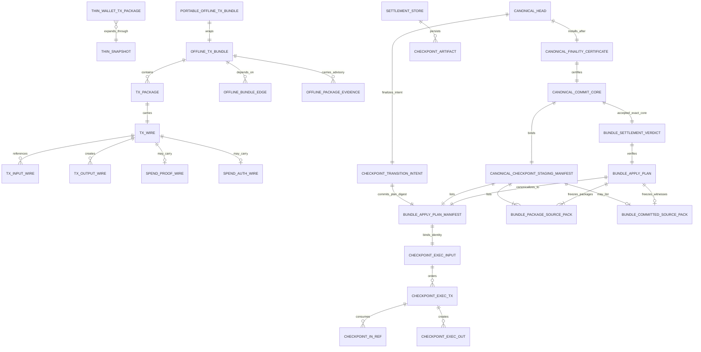

## 8. End-To-End Runtime Flow

### 8.1 Single-Package Flow

The sequence view preserves who sends, verifies, scans, imports, and admits a single package, including the wallet/runtime authority split.

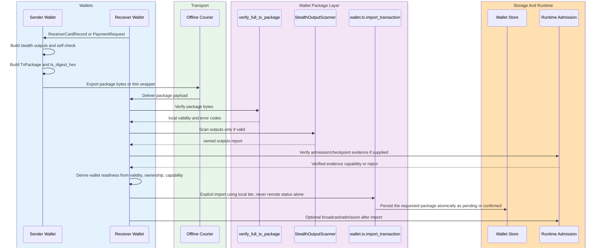

### 8.1.1 Request-Bound Receive Lane

The flowchart is needed here because request approval and worker-promotion branches converge on one receive mutation core.

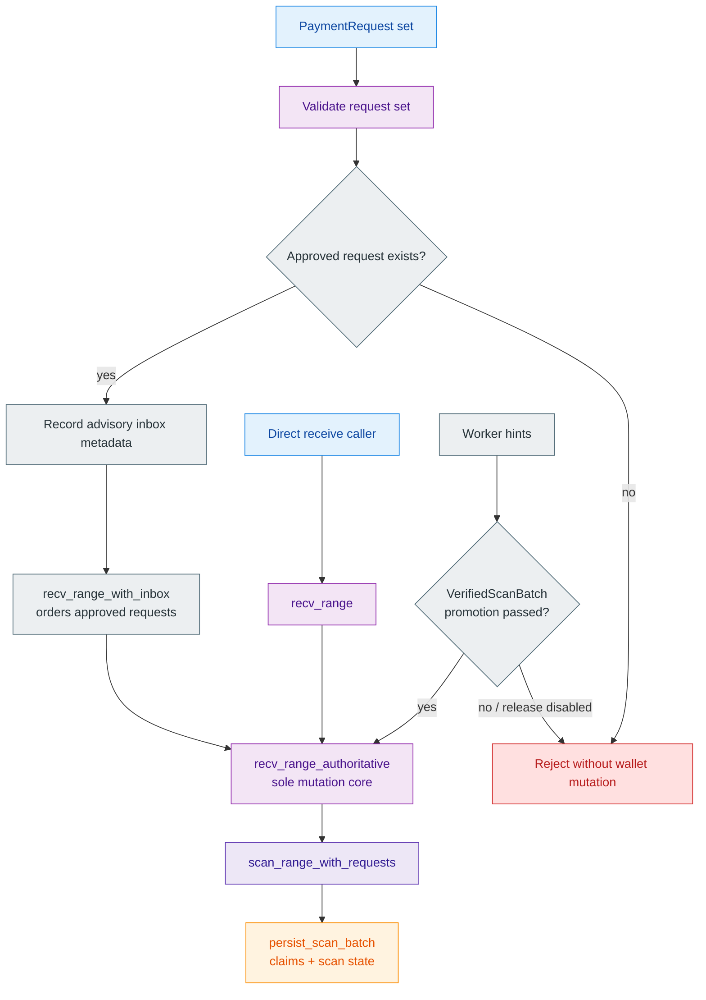

Canonical order:

1. The receiver validates `PaymentRequest`.
2. The advisory inbox MAY record metadata and range hints.
3. Approved requests MAY be ordered through `recv_range_with_inbox(...)`.
4. The ordered set and public `recv_range(...)` MUST enter `recv_range_authoritative(...)`.
5. Wallet mutation MUST happen only through `persist_scan_batch(...)` inside that authoritative receive transaction core.
6. Exported/imported `TxPackage` artifacts MUST remain separate from inbox metadata.

### 8.2 Bundle Flow

Bundle flow adds only the following responsibilities:

1. bounded-decode package, edge, evidence, and declared-order fields;
2. perform cheap node envelope/chain/digest checks and index created outputs;
3. validate edges, exact ancestor closure, cycle freedom, declared topological execution order, and graph conflicts;
4. verify every node with the same full single-package verifier;
5. return the wallet-scoped report without writes, or feed the verified graph into storage-owned read-only prepare;
6. verify the working-root chain and produce `CheckpointDraft`/`CheckpointExecInput` candidate inputs in `BundleApplyPlanV1`; pre-DA prepare MUST NOT manufacture a final `CheckpointArtifact` or `CheckpointLink`;
7. hand the immutable plan and candidate inputs to Phase 078; `CheckpointTransitionIntentV2` MUST bind the same `plan_digest`;
8. after exact `CheckpointDaPayloadV2` reaches `DaReady`, let storage bind the final `CheckpointArtifact`/`CheckpointLink`, deterministically derive the expected theorem/verdict digest, and freeze `CanonicalCommitCoreV2` with that digest;
9. obtain the validator-owned accepted exact-core theorem capability only by rechecking the frozen core, then allow canonical mutation only after `CanonicalFinalityCertificateV2` verifies and `CanonicalCommitterV2` executes the one canonical-head transaction; archive placement remains a separate post-commit lane.

### 8.3 Canonical Bundle Verification Ladder

This flowchart makes the fail-closed gates and the one post-QC canonical mutation boundary explicit.

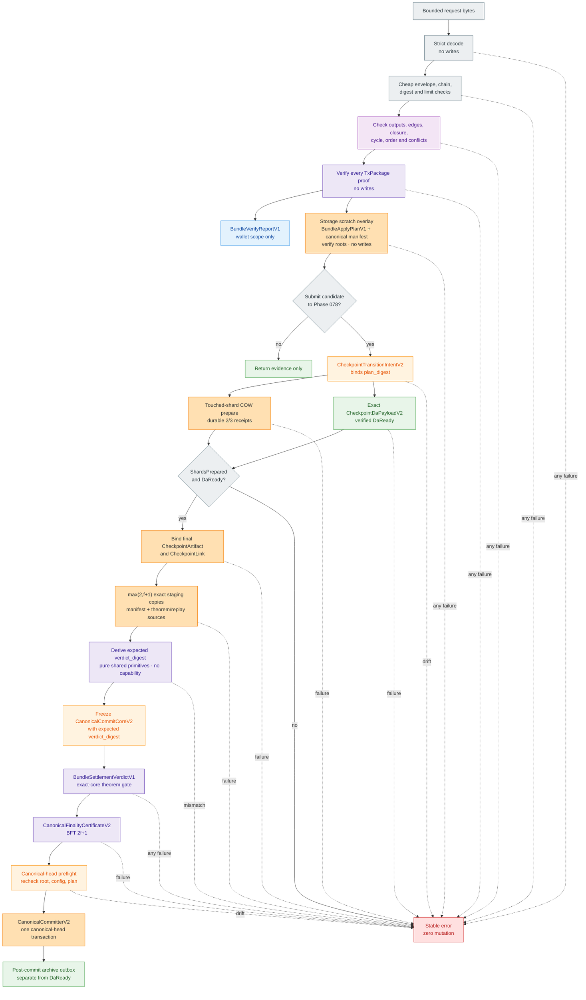

Atomicity scopes are intentionally separate. `wallet.tx.import_offline_bundle` is one wallet-local transaction and MUST NOT commit checkpoint/HJMT state. The only canonical runtime mutation is Phase 078's storage-local canonical-head transaction and it MUST NOT write wallet rows. Pre-QC shard/state work is immutable or copy-on-write preparation and MUST NOT be visible as the canonical head. Phase 072 MUST NOT add a cross-crate two-phase commit; wallet reconciliation consumes later verified admission/confirmation evidence through Section 7.2.1.

### 8.4 Dynamic Runtime Story

The sequence view is needed to preserve the exact prepare, DA, theorem, core, QC, commit, and archive message order across actors.

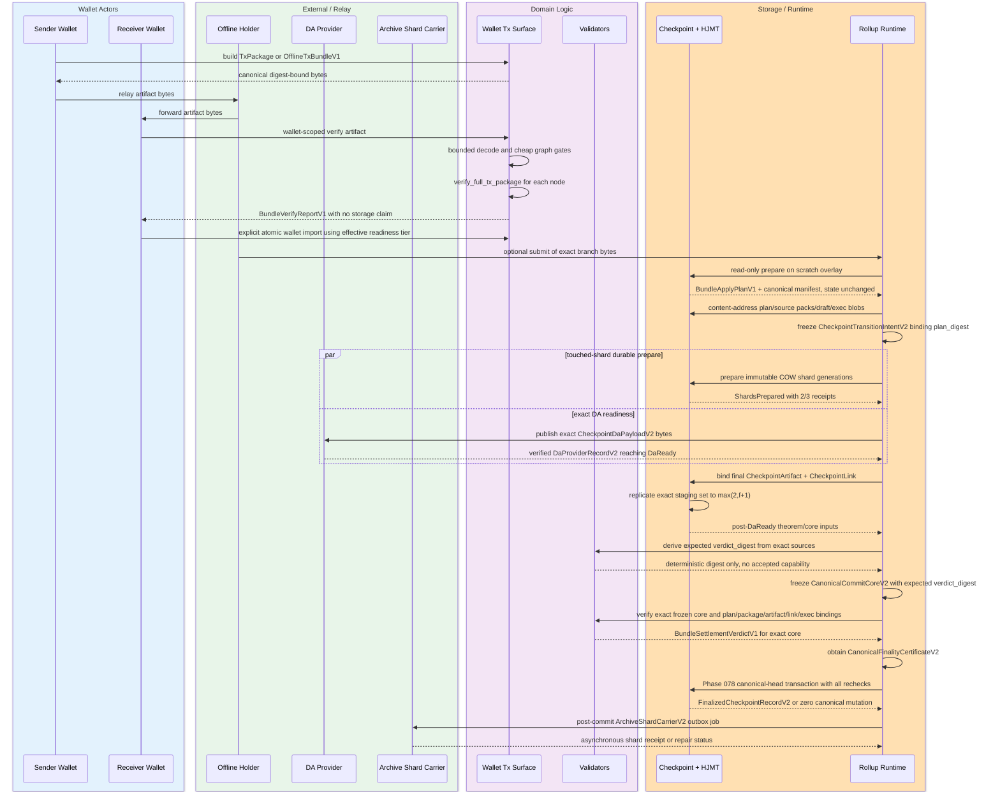

### 8.5 Lifecycle And Import Gate

The state diagram defines legal wallet-local transitions and separates failed import rollback from later reconciliation conflict.

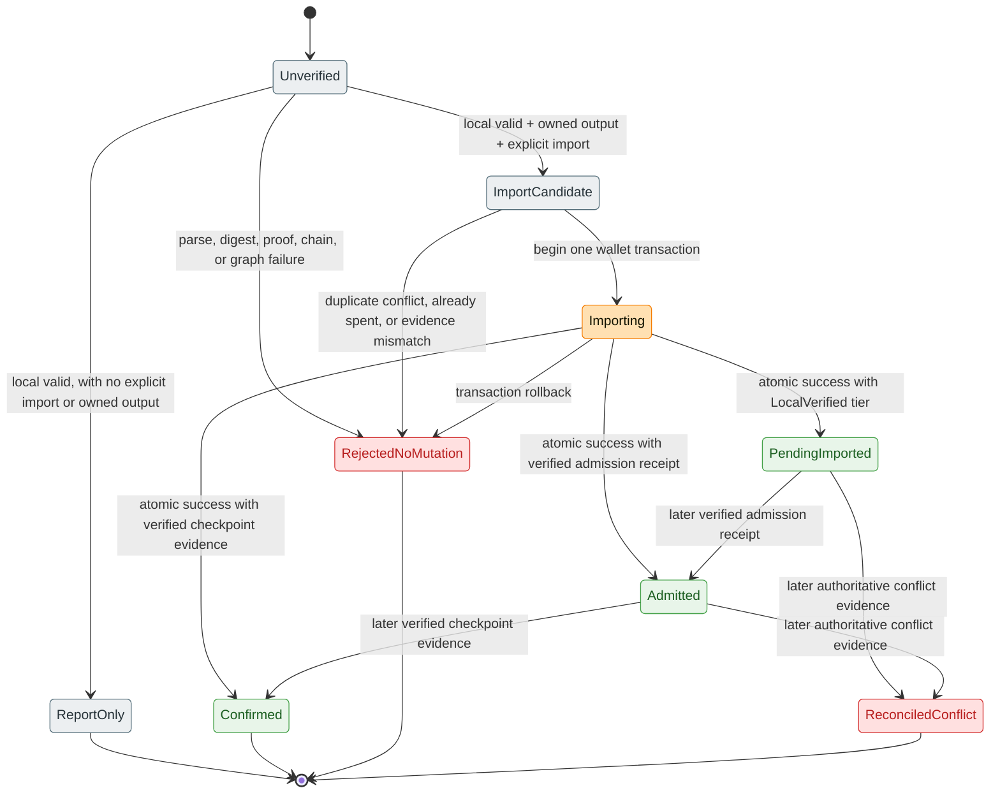

Rules:

- `LIF-001`: Verify MUST NOT persist assets.
- `LIF-002`: Report-only owned output discovery MUST NOT imply import authority.
- `LIF-003`: Import MUST require local validity, matching chain id, locally derived Section 7.2.1 readiness, and at least one owned output; received status text alone is insufficient.
- `LIF-004`: Import MUST be idempotent for the same digest-bound package identity; status/evidence refresh MUST NOT duplicate assets or history.
- `LIF-005`: Import MUST reject different digest-bound payloads under the same external tx id. A status-only change is not `DuplicateConflict`.
- `LIF-006`: Already-spent conflicts MUST be machine-readable and MUST NOT duplicate owned assets.
- `LIF-007`: Promotion reconciliation to `Confirmed` MUST require Section 7.2.1 confirmation evidence; conflict reconciliation instead MUST require owner-verified authoritative conflict/spent evidence and MUST NOT reuse a mutable status hint.
- `LIF-008`: A failed import attempt MUST end in `RejectedNoMutation`; failure during a transaction MUST NOT be modeled as a transition out of a successfully imported state.
- `LIF-009`: Bundle wallet import MUST commit all terminal-owned-output/history changes in one transaction or none; it MUST NOT use per-node import loops or claim transient outputs.
- `LIF-010`: Pending or admitted output MUST remain non-spendable and MUST NOT be presented as confirmed/final. The only exception is controlled bundle-construction/prepare scratch consumption by a later validated node in the same bundle; it MUST NOT expose general wallet spendability.
- `LIF-011`: Later authoritative conflict evidence MUST transition pending/admitted outputs to non-spendable `ReconciledConflict` atomically while preserving tx history and conflict evidence for audit; it MUST NOT be modeled as an import rollback.

## 9. Storage, HJMT, And Rollup Integration

### 9.1 Wallet Boundary

Wallet-local verification proves package-local correctness only. It does not prove:

- global spent-state uniqueness;
- checkpoint finality;
- HJMT inclusion by itself.

Therefore:

- `verify_full_tx_package(...)` MUST remain the first gate;
- owned-output scan MUST happen only after local validity;
- import MUST remain explicit;
- checkpoint finality MUST remain external to wallet verify/report.

### 9.2 Storage Working-Window Prepare And Phase 078 Handoff

Production dependency direction is fixed: `z00z_wallets` already depends on `z00z_storage`, while `z00z_storage` has no production dependency on `z00z_wallets`. Therefore storage MUST NOT accept `OfflineTxBundleV1`, `TxPackage`, or a wallet-owned graph type. `z00z_runtime::aggregators::offline_bundle_route`, which already depends on both owner crates, MUST perform a pure checked conversion into a storage-owned in-process DTO equivalent to:

```rust
struct BundlePrepareInputV1 {
    version: u8,
    bundle_digest: [u8; 32],
    base_prev_root: CheckRoot,
    selected_tip_digest: [u8; 32],
    execution_order: Vec<BundlePrepareTxV1>,
}

struct BundlePrepareTxV1 {
    tx_digest: [u8; 32],
    package_source_digest: [u8; 32],
    package_source_len: u32,
    package_source_bytes: Vec<u8>,
    working_root_claim: CheckRoot,
    input_refs: Vec<BundlePrepareInputRefV1>,
    outputs: Vec<BundlePrepareOutputV1>,
    tx_proof: Vec<u8>,
}

struct BundlePrepareOutputV1 {
    definition_id: DefinitionId,
    leaf: TerminalLeaf,
}

enum BundlePrepareInputRefV1 {
    Committed { terminal_id: TerminalId, serial_id: u32 },
    Working {
        parent_tx_digest: [u8; 32],
        parent_output_index: u16,
        terminal_id: TerminalId,
        serial_id: u32,
    },
}
```

These fields MUST be private and constructed through a storage-owned checked constructor that enforces version `1`, Section 5 node/input/output/depth limits, exact execution-order uniqueness, selected-tip placement as the final execution-order entry, non-empty proof/source bytes, exact checked source length/digest, package-source pack count/per-pack limits, and edge/source consistency. `package_source_bytes` is bounded opaque canonical input to storage: storage MUST verify its declared length/domain digest and pack it, but MUST NOT parse it as a wallet type. `tx_proof` MUST equal the current theorem-compatible `z00z_utils::codec::JsonCodec.serialize(&package.tx.proof)` bytes and MUST be copied exactly into the corresponding `CheckpointExecInput` row. For each output, the aggregator MUST take `definition_id` only from the validated `TxOutputWire.asset_wire.to_wire().definition.id` and `leaf` only from that same decoded wire through `z00z_wallets::tx::asset_wire_to_leaf(...)`, matching the current theorem's `CheckpointExecOut` comparison. Storage MUST copy that exact pair into `CheckpointExecOut`; it MUST NOT use hand-built leaves, default/substitute definition ids, or re-derivation from `TerminalLeaf.asset_id`. This DTO is in-process only in v1 and MUST NOT be serialized, persisted, or exposed over RPC. The adapter MUST NOT perform storage reads or reinterpret package validity. Validators MUST later rebind every DTO row and plan digest to the exact canonical source/package objects, so a compromised or buggy adapter cannot create settlement truth.

```rust
#[serde(deny_unknown_fields)]
struct BundlePackageSourceV1 {
    source_version: u8,
    kind: String,
    package_type: String,
    package_version: u8,
    chain_id: u32,
    chain_type: String,
    chain_name: String,
    tx_digest_hex: String,
    tx: TxWire,
}

#[serde(deny_unknown_fields)]
struct BundleResolvedInputSourceV1 {
    version: u8,
    path: SettlementPath,
    leaf: TerminalLeaf,
    member_wit: MemberWit,
}
```

`package_source_digest` is an exact-theorem-source commitment, not a second transaction identity. Wallet validation MUST construct exactly the private fields shown for `BundlePackageSourceV1`, require `source_version = 1`, and exclude `TxPackage.status`, evidence, and transport-wrapper fields. It MUST canonicalize that projection with `z00z_utils::codec::to_canonical_json_bytes`, reject more than `1_048_576` source bytes, set `package_source_len` to the checked `u32` byte length, and compute `package_source_digest = z00z_crypto::blake2b_hash(b"z00z.tx.bundle.package_source.v1", &[source_bytes])`. Decode MUST be bounded, consume all bytes, validate all fields and recomputed transaction digest, and require exact canonical re-encode equality. When a reused live verifier requires a full `TxPackage`, the adapter MUST reconstruct an ephemeral private package with status fixed to the non-authoritative literal `prepared`; received status MUST NOT enter staged bytes or theorem behavior. Validators MUST reconstruct the same projection and compare its exact length/digest before theorem verification. This commitment freezes proof/auth/output-signature bytes that the live semantic package digest intentionally normalizes away; it MUST NOT replace `build_tx_package_digest(...)` for node, package, or bundle identity.

Each committed-input source blob MUST be a version-`1` storage projection containing exactly `SettlementPath`, `TerminalLeaf`, and `MemberWit` from the verified `ResolvedInput`, in that field order. It MUST use `z00z_utils::codec::BincodeCodec`, reject above configured `max_committed_source_bytes = 50_331_648` before decode, consume the entire input, validate membership under the plan base root, and require exact decode -> validate -> re-encode equality. Its digest MUST be `z00z_crypto::blake2b_hash(b"z00z.tx.bundle.resolved_input_source.v1", &[canonical_source_bytes])`; all committed-input lengths plus the exact committed-pack header/directory bytes MUST be checked-summed from the manifest before loading any blob and MUST remain within the checkpoint contract's `max_witness_bytes = 67_108_864`. A `BincodeCodec` change that alters these canonical bytes MUST bump the source schema/domain and Phase 078 cap generation; V1 MUST NOT silently reinterpret changed bytes. Overflow, a source above either cap, a proof bound to another root/path/leaf, or a codec limit/configuration mismatch MUST reject before intent freeze. Working inputs MUST NOT carry or fabricate this blob.

Phase 078 staging MUST aggregate the exact source blobs into a bounded collection of package-source packs plus at most one committed-source pack so the 64 KiB `CanonicalCheckpointStagingManifestV2` never needs one entry per transaction input. One package-source pack is insufficient at the configured maximum because its directory/projection overhead can make the packed representation larger than the `8_388_608`-byte inner bundle even though every input limit passed.

Each `BundlePackageSourcePackV1` MUST encode version `1`, `pack_ordinal: u32-le`, `pack_count: u32-le`, an `entry_count: u32-le` in `1..=128`, an execution-order directory of `(execution_ordinal, package_source_digest, package_source_len)`, then the exact package-source payloads concatenated in that directory order without padding. The checked sum `13 + 40 * entry_count + sum(package_source_len)` and complete pack bytes MUST both be at most configured `max_package_source_pack_bytes = 8_388_608`; `pack_count` MUST be in `1..=max_package_source_packs = 2`, and `pack_ordinal` MUST satisfy `pack_ordinal < pack_count`.

The encoder MUST deterministically partition the complete execution-order source list by greedily taking the longest non-empty consecutive prefix that fits one pack, then repeat; it MUST reject if more than two packs are required. Across the collection, `(pack_ordinal, execution_ordinal)` MUST be strictly increasing, pack ordinals MUST be contiguous from zero, all headers MUST declare the same final `pack_count`, and every plan package-source row MUST occur exactly once. Alternate partitions, empty packs, reordered packs, and duplicate/missing/extra execution ordinals MUST reject. The configured `max_bundle_bytes`, per-source `1_048_576`-byte cap, two-pack count, and per-pack cap are jointly normative; boundary tests MUST prove every accepted maximum-size bundle either produces this canonical one/two-pack collection or rejects before prepare with a stable size error, never after intent freeze.

`BundleCommittedSourcePackV1` MUST encode version `1`, a `u32-le` count in `1..=2_048`, a lexicographically ordered directory of `(execution_ordinal, input_ordinal, source_digest, source_len)`, then exact committed-input source payloads in that order without padding. The checked sum `5 + 44 * count + sum(source_len)` and complete pack bytes MUST both be at most configured `max_committed_pack_bytes = 67_108_864`. `encode_package_source_packs_v1(...)` and `encode_committed_source_pack_v1(...)` plus their bounded inverses MUST live beside the plan codec, precheck pack-count/directory arithmetic before allocation/slicing, consume every complete pack, reject non-canonical partitioning and duplicate/missing/extra entries against the plan manifest, verify every entry digest/length, and require exact re-encode equality. Every individual pack digest MUST use domain `z00z.tx.bundle.package_source_pack.v1` or `z00z.tx.bundle.committed_source_pack.v1`; the package pack's encoded ordinal/count header binds collection position. When the plan has no committed input, the committed-source pack MUST be absent; an encoded zero-count committed pack or empty package pack MUST NOT be emitted or accepted.

Bundle output MUST reuse current storage DTOs and theorem surfaces:

- `InputResolver`
- `ResolvedInput`
- `TxPkgSum`
- `build_cp_draft(...)`
- `CheckpointDraft`
- `CheckpointExecInput`
- `CheckpointLink`
- `CheckpointArtifact`

`CheckpointDraft` and `CheckpointExecInput` are pre-DA candidate inputs. Final `CheckpointArtifact` and `CheckpointLink` are post-`DaReady` objects in the Phase 078 pipeline; read-only Phase 072 prepare MUST NOT create substitutes or claim their final identities early.

The live `ResolvedInput`/`apply_batch_checkpoint(...)` path assumes membership witnesses under the initial `prev_root`. It does not by itself model an input created by an earlier transaction in the same bundle. Implementations MUST NOT call it unchanged in a per-node loop and MUST NOT fabricate a base-root witness for a working output.

The target storage extension MUST use an internal provenance type equivalent to:

```rust
enum BundleInputSourceV1 {
    Committed(ResolvedInput),
    Working {
        parent_tx_digest: [u8; 32],
        parent_output_index: u16,
        leaf: TerminalLeaf,
    },
}
```

`Committed` MUST verify the live membership witness under `base_prev_root_hex`. `Working` MUST identify an output created by an earlier declared-execution-order node, byte-match the validated parent output, and be consumed at most once; it requires no base-root membership witness.

`prepare_offline_bundle(...)` MUST be read-only and produce `BundleApplyPlanV1` containing at least the bundle digest, ordered package-source digest/length pairs, the canonical one- or two-pack package-source collection, optional canonical committed-source pack, base root, canonical current-head `base_state_generation`, `execution_order_tx_digests`, every node's `working_root_before`/`working_root_after`, every input provenance, created/spent identifiers, `CheckpointDraft`, `CheckpointExecInput`, `PrepSnapshotId`, config version/authority-generation/runtime-digest, canonical `BundleApplyPlanManifestV1` bytes, and a plan digest. Preparing or verifying a plan MUST NOT write HJMT, spent indices, final artifacts/links, wallet state, or publication state.

All base/working roots in bundle contracts are semantic checkpoint `CheckRoot`/settlement roots. HJMT physical node roots MUST remain storage-private and MUST NOT satisfy or replace these fields.

The storage-owned `BundleApplyPlanManifestV1` MUST have private fields and exactly this logical field order: version `1`; bundle digest; base root; `base_state_generation`; config version, `authority_generation`, and runtime digest; `PrepSnapshotId`; ordered `(execution_ordinal, tx_digest, package_source_digest, package_source_len, working_root_before, working_root_after)` rows; ordered input-provenance rows keyed by `(execution_ordinal, input_ordinal)`; sorted created identifiers; sorted spent identifiers; final root; and the digest plus checked canonical byte length of `encode_draft_bin(checkpoint_draft)` and `encode_exec_bin(checkpoint_exec_input)`. A committed provenance row MUST bind terminal id, serial id, and the digest/length of its canonical `ResolvedInput`/witness source blob; a working row MUST bind terminal id, serial id, parent package digest, and parent output index, whose exact leaf is already bound by the parent package-source commitment.

The binary layout MUST start with the version byte and then append the fields above without padding. `config_version` MUST be 1..32 ASCII bytes framed by a `u32-le` byte length; `authority_generation` and `base_state_generation` MUST be `u64-le`. Provenance tags MUST be `0 = Committed` and `1 = Working`; every vector count, execution/input ordinal, source length, serial id, and output index MUST be checked then encoded as `u32-le`; every digest/root/id MUST be raw fixed 32 bytes. A `u16` wire index MUST be losslessly promoted to `u32`. The manifest MUST NOT contain hex, platform-width integers, implicit enum discriminants, map iteration order, inlined proof/source blobs, status, evidence, diagnostics, or provider data.

`encode_apply_plan_manifest_bin_v1(...)` and its inverse MUST live in `z00z_storage::checkpoint::bundle_plan_codec` and use one checked bounded byte writer/cursor plus the existing Z00Z framing/hash helpers; they MUST NOT use serde/bincode-derived layout because it would not enforce the fixed-width contract above. Decode MUST reject above the configured `max_plan_manifest_bytes`, which MUST equal `1_048_576` for V1, before proportional allocation; enforce all Section 5 counts while reading each count; validate every ordering/uniqueness/length invariant; consume the entire input; and require decode -> validate -> canonical re-encode byte equality. The codec MUST NOT use JSON, YAML, a generic `BundleApplyPlanV1` serde dump, or provider-specific encodings. `build_apply_plan_digest_v1(...)` MUST equal `z00z_crypto::blake2b_hash(b"z00z.tx.bundle.apply_plan.v1", &[canonical_manifest_bytes])`; a second digest path MUST NOT independently re-frame the same fields. `file_digest`, `load_generation`, filenames, and in-memory addresses MUST NOT enter plan identity.

Required prepare algorithm:

1. start from the shared `base_prev_root_hex`;
2. capture immutable storage and config snapshots;
3. resolve state-anchored inputs through `InputResolver` and verify their base-root witnesses;
4. before each node, require its spend proof root to equal the current scratch semantic root;
5. resolve ancestor-provided inputs only from earlier ordered nodes in the scratch working window;
6. require each resolved input to match the child reference and declared edge exactly;
7. reject any input that is neither state-anchored nor ancestor-provided;
8. apply the node to scratch state and record the deterministic before/after roots;
9. reject double consumption, duplicate created keys, creation over a key already live at that step, root/config drift, and nondeterministic ordering; later consumption of an earlier working output is allowed only through its validated edge;
10. produce one deterministic `BundleApplyPlanV1` with `CheckpointDraft`/`CheckpointExecInput` candidate inputs and no committed writes or premature final artifact/link.

Required Phase 078 handoff and finalization gates:

1. accept only a locally package-valid, internally consistent plan whose canonical manifest/digest, package-source commitments, draft/exec canonical bytes, snapshot, and working-root replay have been rechecked against its exact source bytes;
2. Phase 078 MUST persist the canonical plan manifest, every canonical package-source pack in ordinal order, the optional canonical committed-source pack, `CheckpointDraft`, `CheckpointExecInput`, and other required checkpoint witness/delta sources as content-addressed blobs before candidate construction. Every blob MUST use its owner codec/cap; no large source blob may be inlined into the plan manifest, transition intent, commit core, or staging-manifest entry;
3. supply the immutable manifest/digest and exact source-pack/blob references to Phase 078 candidate construction. The `CheckpointTransitionIntentV2` plan-digest component MUST equal this `plan_digest`, and its exec/snapshot/root components MUST equal the plan fields. `CanonicalCheckpointStagingManifestV2` MUST list the plan manifest, one or two package-source packs in ordinal order, the optional committed-source pack, and the bounded checkpoint theorem/replay blobs by object type, digest, canonical byte length, and cap class so every voter can reload them without exceeding its 64 KiB metadata cap. If the Phase 078 wire freeze cannot represent these bindings exactly, integration MUST remain disabled until that wire contract is amended;
4. before intent freeze, recheck bundle digest, plan digest, base semantic root, canonical `base_state_generation`, config version/authority-generation/runtime-digest, every source digest/length, and spent-index expectations; drift MUST return `ConfigDrift`, `ApplyPlanDrift`, or `AlreadySpent` with zero canonical mutation;
5. after intent freeze, any changed package source, order, plan, root, route, config, or checkpoint input MUST abort that candidate and MUST NOT be silently re-planned under the same intent or core identity;
6. Phase 078 MUST then complete durable copy-on-write shard prepares plus exact `CheckpointDaPayloadV2` resolution to `DaReady`; only after `DaReady` may storage bind final `CheckpointArtifact`/`CheckpointLink` and validators deterministically derive the expected verdict digest for the exact plan/package/artifact/link/exec set. This pre-core derivation MUST NOT issue an accepted `BundleSettlementVerdictV1` capability;
7. Phase 078 MUST compute the expected deterministic `verdict_digest` from the exact source objects, bind it into immutable `CanonicalCommitCoreV2`, then construct the accepted capability only after local exact-core verification. Each BFT voter MUST independently reload the staged plan/package/draft/exec sources, recompute/verify the same plan and verdict digests, and only then vote; Phase 078 MUST obtain `CanonicalFinalityCertificateV2` before invoking `CanonicalCommitterV2`;
8. the canonical-head transaction MUST recheck the predecessor/head generation and every Phase 078 core binding. Phase 072 MUST NOT introduce `commit_offline_bundle`, a pre-DA semantic-root update, or any second canonical visibility boundary;
9. a failure before the canonical-head transaction MUST leave the prior canonical head visible. Post-commit archive, recursive-proof, snapshot, or wallet-handoff failure MUST enter the Phase 078 outbox/hold path and MUST NOT roll back the canonical head.

### 9.3 Theorem Binding

After read-only storage prepare, exact DA readiness, and final artifact/link binding, validator-owned pure primitives MUST bind the plan back to package truth and deterministically derive the expected verdict digest. Phase 078 MUST bind that digest into and freeze `CanonicalCommitCoreV2`; only then may the validator recheck the exact frozen core and construct an accepted `BundleSettlementVerdictV1`. Pre-core digest derivation and post-core capability construction MUST use the same shared primitives and source objects, and a mismatch MUST abort before `LocallyValidated` or voting.

The live `SettlementTheoremBundle::new(...)` is a single-package contract: it requires that package's spend root to equal the overall `CheckpointExecInput.prev_root`. Calling it unchanged for every node is invalid for a dependent bundle because only the first node binds the base root; later nodes bind their plan `working_root_before`. The implementation MUST refactor the live theorem into shared private verification primitives while preserving all existing single-package results and vectors. It MUST NOT copy those checks into a second weaker verifier.

Pre-core `derive_bundle_expected_verdict_v1(...)` MUST return a private non-serializable `BundleExpectedVerdictV1` value containing the deterministic fields/digest only; that value is not an accepted capability and cannot authorize `LocallyValidated`, voting, or commit. After core freeze, `verify_bundle_settlement_core_v1(...)` MUST re-run the shared checks, require the frozen core's expected verdict digest and every source/staging binding to match, then return `Result<BundleSettlementVerdictV1, BundleSettlementRejectV1>`.

The target `BundleSettlementVerdictV1` MUST be an accepted-only, private-field, constructor-gated capability with at least: `version: u32 = 1`, raw `core_digest`, raw `bundle_digest`, raw `plan_digest`, `checkpoint_id`, `CheckpointExecInputId`, canonical `CheckpointLink` digest, ordered per-node theorem digests in `execution_order_tx_digests` order, `validator_contract_version: u32 = 1`, and `verdict_digest`. `core_digest` is a separate capability binding and MUST NOT enter `verdict_digest`, because the core already contains the expected verdict digest. Rejection is a separate stable-code diagnostic and MUST NOT be constructible or serializable as an accepted verdict. The capability MUST NOT contain or derive acceptance from a boolean and MUST NOT be accepted from wire or reused for a different core with the same expected verdict digest.

For each node, the shared adapter MUST:

1. run the same package structure, canonical package digest, public-spend, proof, auth, and inclusion checks used by the live theorem;
2. bind its recomputed package digest and exact `working_root_before`/`working_root_after` from the verified plan;
3. require the package spend root to equal that node's `working_root_before`, not the overall exec base except for node zero;
4. require the exact package/proof row to occur once in `CheckpointExecInput` at the same declared execution ordinal;
5. reject any package, row, root, or ordering mismatch before constructing an accepted capability.

The shared checkpoint primitive MUST once verify final `CheckpointArtifact` statement/proof integrity, `CheckpointExecInputId`, `PrepSnapshotId`, overall base/final roots, derived `checkpoint_id`, canonical `CheckpointLink`, and exact plan final-root equality. The adapter MUST reject if the exec input contains a package row outside the bundle or omits a bundle node.

The canonical link digest MUST be `z00z_crypto::blake2b_hash(b"z00z.tx.bundle.checkpoint_link.v1", &[encode_link_bin(link)])`. For each node, `build_node_theorem_digest_v1(...)` MUST hash domain `z00z.tx.bundle.node_theorem.v1` over exactly this payload sequence: `frame_u32_le(1)`, `frame_bytes(package_digest)`, `frame_u32_le(execution_ordinal)`, `frame_bytes(working_root_before)`, `frame_bytes(working_root_after)`, `frame_bytes(checkpoint_id)`, `frame_bytes(exec_input_id)`, and `frame_bytes(canonical_link_digest)`. The execution ordinal MUST be losslessly promoted to `u32`. All fixed digests, roots, and ids MUST enter as raw 32-byte values; implementations MUST NOT use implicit concatenation, hex strings, or native-width integers.

`build_bundle_verdict_digest_v1(...)` MUST use the existing framing helpers and domain `z00z.tx.bundle.settlement_verdict.v1`. It MUST bind exactly this payload sequence: `frame_u32_le(1)`, `frame_bytes(bundle_digest)`, `frame_bytes(plan_digest)`, `frame_bytes(checkpoint_id)`, `frame_bytes(exec_input_id)`, `frame_bytes(canonical_link_digest)`, `frame_u32_le(validator_contract_version)`, `frame_u32_le(node_count)`, then four `frame_bytes` calls per ordered row for `(package_digest, working_root_before, working_root_after, node_theorem_digest)`. `validator_contract_version` is a `u32`, MUST equal `1` in V1, and is independent of crate/package versions. `node_count` MUST be in `1..=128` and MUST equal the lengths of the execution-order, root-before, root-after, and node-theorem vectors before encoding; the function MUST NOT use alternate counts, truncation, zip-to-shortest behavior, or implicit concatenation. The function MUST NOT bind JSON, task completion order, filenames, wall time, reject diagnostics, or human text. Phase 078 `CanonicalCommitCoreV2` MUST bind this expected `verdict_digest`; local validation and every BFT voter MUST recompute it from exact source objects before an accepted capability or vote exists.

This verdict authorizes only exact-core certification. It MUST NOT count as a finality vote or QC. The coordinator MAY persist Phase 078 `LocallyValidated(core_digest, verdict_digest)` only after rechecking the immutable `CanonicalCommitCoreV2`; every BFT voter MUST independently recompute the same verdict digest from the exact core inputs before voting.

This means:

- theorem verification MUST re-check package theorem assumptions;
- every package spend-proof root MUST equal the corresponding plan `working_root_before`, and every recorded `working_root_after` MUST match deterministic scratch replay;
- checkpoint proof payload MUST match statement payload;
- execution replay ids MUST match current checkpoint surfaces;
- package inclusion MUST be explicit, not inferred from archive or DA receipts;
- theorem mismatch MUST reject the whole bundle.

### 9.4 Rollup Runtime And HJMT Config

Rollup publication MUST consume the live checkpoint contract and current HJMT runtime configs:

- `crates/z00z_storage/src/checkpoint/checkpoint_contract.yaml`
- `config/hjmt_runtime/sim_5a7s/planner/planner-config.yaml`
- `config/hjmt_runtime/sim_5a7s/storage/storage-config.yaml`
- `config/hjmt_runtime/sim_5a7s/manifest.json`
- `config/hjmt_runtime/sim_5a7s/aggregators/*/aggregator-config.yaml`

Phase 072 MUST treat these as real gates for:

- route digest and placement checks;
- storage backend generation checks;
- proof codec checks;
- handoff readiness checks;
- canonical runtime-config identity evidence, with exact-file digest retained only for local audit;
- preflight report evidence.

### 9.5 HJMT Committed-State Scan

Committed-state ownership detection MUST use the proof-first lane:

1. load committed post-tx candidate leaves from settlement storage;
2. load corresponding proof blob;
3. validate `chk_blob_settlement_inclusion(...)`;
4. only then run `receiver_scan_report(...)` and `receiver_scan_leaf(...)`;
5. emit an artifact that distinguishes committed-state scan from detached package scan.

This is a critical boundary: proof-first JMT scan is a stronger claim than detached offline package report and MUST be treated that way.

### 9.6 Request-Bound Receive, Remote Workers, And HJMT Non-Authority

Phase 072 MUST remain aligned with the wallet-first receive model:

- `recv_range_with_inbox(...)` is advisory orchestration, not settlement truth.
- public `recv_range(...)` and approved helper lanes MUST enter the private `recv_range_authoritative(...)` core; persistence MUST occur only through `persist_scan_batch(...)`.
- authenticated local canonical chunks MAY enter only through Phase 071's private `TrustedScanBatch` constructor, while remote-worker chunks/evidence remain untrusted until the separate cryptographic verifier constructs `VerifiedScanBatch`; neither type promotes into the other, and the authoritative receive core accepts them only through `ScanBatchSource`.
- `remote_scan.enabled` MUST remain false in release profiles until that promotion boundary and its negative tests exist; shape/continuity checks alone are insufficient.
- HJMT proof inclusion strengthens settlement evidence, but MUST NOT bypass wallet-local request validation, scan logic, or import gates.

### 9.7 Cross-Phase Compatibility With 067–069, 071, And 078

Phase 072 MUST compose with the adjacent phase authorities without weakening any of them.

| Phase | Required compatibility rule |
| --- | --- |
| 067 Sharded Consensus | The live `CommitSubject`/`ShardQuorumCertificate` lane MAY provide route, placement, replay, and legacy local-quorum evidence for the same prepared transition, but it MUST NOT be relabeled as the Phase 078 QC. Production canonical finalization MUST use the exact immutable `CanonicalCommitCoreV2` and BFT `2f+1` `CanonicalFinalityCertificateV2`; `MajorityCft`, a legacy `ShardQuorumCertificate`, routing evidence, or shard-local ordering MUST NOT become wallet ownership, checkpoint validity, or final settlement by itself. |
| 068 Checkpoint Contract | Bundle output MUST feed the checkpoint contract through `CheckpointExecInput`, `CheckpointArtifact`, `CheckpointLink`, archive manifest, DA reference, and publication-evidence lanes. Phase 078 refines the timing rule: candidate `DaReady` is pre-QC state, while the authoritative `da_publication_ready` height exists only in the canonical-head transaction and starts the height-based challenge window; neither field decides settlement validity by itself. |
| 069 Recursive Proof | Recursive sidecars and future proof backends MUST bind the same checkpoint statement as the canonical branch. Phase 072 MUST NOT drop raw packages, exact proof bytes, witness data, or replay material merely because recursive compression exists or is planned. |
| 078 Rollup Node | The DA plane MUST publish/resolve exact `CheckpointDaPayloadV2` bytes through `DaAdapter` until `DaReady`; only then may Phase 078 obtain `CanonicalFinalityCertificateV2` and execute its canonical-head transaction. The archive plane MUST place `EpochChallengePackV2` shards through `ArchiveShardCarrierV2` asynchronously after commit and MUST NOT establish `DaReady`. Provider receipts, CIDs, blob hashes, archive receipts, or external SDK receipts MUST NOT become wallet package validity or settlement validity by themselves. |
| 071 Request-Bound Inbox | Phase 071 remains the canonical authority for `wallet.receiver.inbox`, sanitized durable/helper records, request id hashes, route buckets, redacted exports, and tag16 limits. Phase 072 MAY consume request-bound receive results, but MUST NOT redefine the inbox data model or persist binding-rich request records through transaction packages. |

Cross-phase dataflow is intentionally asymmetric: Phase 072 consumes adjacent authority outputs, but it MUST NOT absorb their authority into wallet package validity.

The following flowchart visualizes that asymmetric authority transfer and keeps evidence-only lanes distinct from mutation/finality lanes.

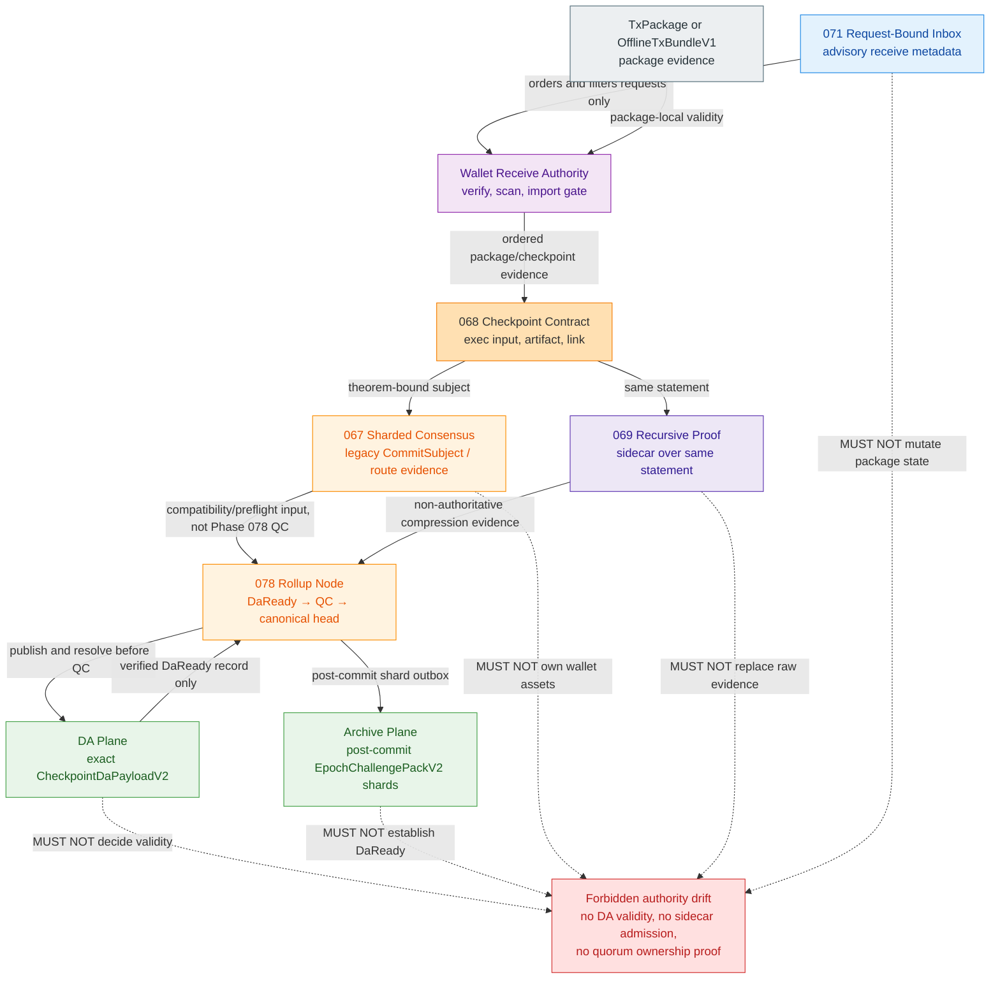

Cross-phase rejection rules:

- Phase 072 MUST NOT call the live Phase 067 `ShardQuorumCertificate` the Phase 078 QC; production finality requires BFT `2f+1` `CanonicalFinalityCertificateV2` over the exact immutable core.
- Phase 072 MUST NOT collapse the DA and archive planes: DA readiness is a pre-QC Phase 078 gate, while archive custody/audit is asynchronous post-commit evidence; neither is settlement validity by itself.
- Phase 072 MUST NOT treat recursive sidecar acceptance as canonical admission before the recursive authority-promotion gates close.
- Phase 072 MUST NOT treat `wallet.receiver.inbox` config as a sub-key owned by the offline transaction config. The offline config may reference or mirror the inbox gate, but Phase 071 owns the inbox policy.

## 10. Security, Cryptography, Privacy, And Historical Risk Analysis

### 10.1 Cryptographic Requirements

- `OTX-SEC-001`: Offline transaction code MUST use domain-separated hashing for every new digest, bundle digest, route checksum, or export checksum.
- `OTX-SEC-002`: All sensitive key, pack, and secret handling MUST route through `z00z_crypto` and current wallet secret wrappers.
- `OTX-SEC-003`: `TxPackage`, `OfflineTxBundleV1`, and `PortableOfflineTxBundleV1` MUST be treated as sensitive transport artifacts and MUST NOT be logged in plaintext.
- `OTX-SEC-004`: New bundle logic MUST NOT introduce custom crypto, custom AEAD, or direct vendor-code edits.
- `OTX-SEC-005`: Secret-derived tags/tokens and keyed artifact/route checks MUST use the project constant-time equality wrapper. Public package and bundle digests MAY use ordinary equality, but implementations MUST use one canonical decoding/equality helper and MUST NOT add bespoke comparison code.
- `OTX-SEC-006`: Public spend proof and auth MUST arrive together.
- `OTX-SEC-007`: Local package verification MUST run before owned-output scanning.
- `OTX-SEC-008`: Import MUST require explicit user or API action after verification.
- `OTX-SEC-009`: Bundle graph publication MUST reject cycles, unresolved inputs, duplicate spends, and sibling over-inclusion.
- `OTX-SEC-010`: HJMT physical roots MUST NOT be exposed as public root authority.
- `OTX-SEC-011`: Raw byte limits, decoded-byte/collection limits, and cheap structural checks MUST run before proof verification, storage access, or unbounded allocation.
- `OTX-SEC-012`: Pre-admission logs MUST NOT contain package/bundle bytes, raw receiver artifacts, raw package digests, owned asset ids, or proof bytes. Correlation MUST use the configured keyed/redacted fingerprint; raw digest logging is allowed only after public admission and policy approval.
- `OTX-SEC-013`: Worker-assisted receive MUST remain release-disabled until Phase 071 produces and verifies `VerifiedScanBatch`; evidence shape and continuity are not cryptographic authority.
- `OTX-SEC-014`: After a bundle digest is recomputed, its pre-admission log fingerprint MUST be lowercase hex of the first 16 bytes of `z00z_crypto::hmac_sha256(key, "z00z.offline_transaction.log", "bundle_v1", raw_bundle_digest)`. The key MUST be exactly 32 secret-provider bytes, MUST NOT come from YAML, persist, or appear in logs, and SHOULD rotate per deployment/security policy. Before a bundle digest exists, logging MAY use only a transport-generated opaque request id. A missing/invalid key MUST disable content fingerprint logging; logging MUST NOT fall back to raw digest/content.

### 10.2 Verification Scope Honesty

- passing `verify_tx_public_spend_contract(...)` MUST NOT be presented as checkpoint finality;
- passing `verify_full_tx_package(...)` MUST NOT be presented as proof of global spent-state uniqueness;
- committed-state HJMT scan MUST NOT be skipped when the caller requires proof of inclusion rather than a report-only ownership hint.

### 10.3 Replay And Conflict Handling

- duplicate package digests in one bundle MUST reject;
- duplicate consumed input refs in one bundle MUST reject;
- competing children spending the same unresolved parent output MUST reject the whole bundle in v1;
- repeated import identical portable package MUST be idempotent;
- changed digest-bound payload under the same external `tx_id` MUST be conflict;
- status or evidence refresh under the same recomputed package digest MUST NOT be treated as a payload conflict and MUST still pass Section 7.2.1;
- already-spent input conflict MUST surface `AlreadySpent` and MUST NOT mutate claimed-asset state.

### 10.4 Privacy Boundary

The system MUST remain honest about privacy:

- request-bound receive is privacy-preferred;
- raw card transport is compatibility-only;
- package portability is not transport anonymity;
- HJMT inclusion proof is not metadata secrecy;
- archive retention is not wallet confidentiality.

### 10.5 Historical Draft Risk Analysis And Fusion Resolution

| Historical draft class | Strengths | Risk if used alone | Fusion resolution |
| --- | --- | --- | --- |
| Runtime-heavy architecture draft | Strong runtime flow, request-bound receive, HJMT, acceptance, and stage-by-stage verification. | Stale corrections, property/fuzz, and persistence model are less explicit. | Those gaps are closed in Sections 2, 7.4, 7.7, 12.4, 12.5, and 14.3. |
| Contract-heavy architecture draft | Strong correction ledger, output construction, persistence, and decision record. | Request-bound receive boundaries, HJMT non-authority, and evidence ledger are weaker; it treats `petgraph` as add-now. | Request-bound and HJMT rules are strengthened here, and `petgraph` is rejected for v1 dependency posture. |
| Historical package/backlog notes | Strong one-package, one-verifier, import-gate, and seam-reuse discipline. | Some signatures and paths are stale. | The concepts are preserved while live paths and helper names are corrected. |
| Historical DAG notes | Strong ancestor-closure, publishability, topological execution, and conflict-rejection ideas. | They can be misread as a second DAG runtime or second transaction family. | The concepts are constrained to `OfflineTxBundleV1` as a wrapper around `TxPackage` and storage-owned checkpoint apply. |

Security conclusion:

- using only the first spec risks under-specifying property/fuzz and stale-path corrections;
- using only the second spec risks weakening wallet authority and expanding dependency surface unnecessarily;
- this fusion document removes both risk classes while keeping wallet, storage, validator, and rollup boundaries strict.

## 11. Fallback, Failure, And Recovery Rules

| Situation | Required behavior |
| --- | --- |
| Invalid package bytes | The wallet MUST reject before owned-output scan. |
| Valid package but no stronger admission/confirmation evidence | The wallet MUST derive only `LocalVerified`; it MAY report or explicitly import into pending/quarantined state and MUST NOT create admitted, confirmed, or spendable state. |
| Valid package but no owned outputs | Verify MUST return a report-only `NoOwnedOutputs` diagnostic; import MUST reject with `NoOwnedOutputs`. |
| Wrong chain | Bundle verify MUST reject during cheap chain gates; single-package import MUST reject before wallet mutation. |
| Same external `tx_id` but different digest-bound payload | Import MUST return `DuplicateConflict` and leave persistent state unchanged; a status/evidence-only refresh MUST NOT count as a payload conflict. |
| Already-spent input | Import MUST return `AlreadySpent` and leave outputs, history, and claimed-asset state unchanged. |
| Missing ancestor in bundle | The verifier MUST reject the full bundle. |
| Cycle in dependency graph | The verifier MUST reject the full bundle. |
| Unrelated over-included node | The verifier MUST reject the full bundle. |
| Missing HJMT proof blob for committed scan | The wallet MUST reject committed-state scan authority and MAY fall back only to a detached package report. |
| Request inbox disabled or bypassed | The direct receive lane MUST remain available; inbox MUST NOT become a hard dependency. |
| Remote scan worker evidence unavailable | Wallet receive authority MUST remain local; the caller MAY retry with direct receive or new evidence. |
| Thin snapshot missing or stale | Resolution MUST fall back to the thick canonical package. |
| Thin wrapper digest mismatch | Resolution MUST reject without fallback. |
| Rollup preflight or route-digest drift | Publication MUST stop; wallet state MUST remain local and unchanged by that failure. |
| Base root, config authority-generation/runtime-digest, or plan digest changes after prepare | Phase 078 MUST reject before intent freeze or canonical-head transaction with `ConfigDrift` or `ApplyPlanDrift`; file-only/load-generation drift is audit-only and the prior canonical head MUST remain unchanged. |
| DA unavailable before `DaReady` | Phase 078 MAY retain the immutable candidate for its bounded retry path or abort it under its exact state machine; in either case the prior canonical head MUST remain unchanged and `da_publication_ready` MUST NOT be claimed. |
| Archive unavailable after canonical commit | Phase 078 MUST keep the committed canonical head, enqueue archive repair/outbox work, and MUST NOT weaken or rewrite DA/finality evidence. |

Recovery posture:

- repeated identical import MUST be idempotent;
- bundle re-verification MUST be deterministic for the same semantic graph and config snapshot;
- rollup-side restart MUST reuse persisted HJMT/runtime config evidence and MUST fail closed on digest drift;
- simulator scenarios MUST regenerate the same result under deterministic profiles.

## 12. Test, Simulation, End-To-End, And Acceptance Strategy

### 12.1 Positive Test Matrix

- `OTX-TEST-001`: `TxPackage` digest framing remains stable across canonical fields and rejects drift.
- `OTX-TEST-002`: `ReceiverCard` and `ReceiverCardRecord` roundtrip and reject malformed, expired, revoked, and stale cases.
- `OTX-TEST-003`: `verify_full_tx_package(...)` accepts a valid single package and reports owned outputs only after validity.
- `OTX-TEST-004`: Safe import derives `LocalVerified`, `Admitted`, or `Confirmed` from local checks/evidence and never from received status alone.
- `OTX-TEST-005`: identical repeated import is idempotent.
- `OTX-TEST-006`: minimal parent-child construction starts at the declared base, and prepare reproduces every node's deterministic `working_root_before`.
- `OTX-TEST-007`: valid ordered bundle yields a read-only `BundleApplyPlanV1` plus draft/exec inputs, binds its `plan_digest` into `CheckpointTransitionIntentV2`, reaches `DaReady`, binds final artifact/link, passes the exact-core theorem, obtains `CanonicalFinalityCertificateV2`, and changes canonical state only through the Phase 078 canonical-head transaction.
- `OTX-TEST-008`: post-`DaReady` theorem verification succeeds only when package/plan, final checkpoint artifact/link, and exec input all bind exactly.
- `OTX-TEST-009`: committed-state HJMT scan validates proof first and then detects ownership.
- `OTX-TEST-010`: rollup runtime preflight succeeds against canonical HJMT runtime fixture config.
- `OTX-TEST-011`: valid request-bound inbox flow enters `recv_range_authoritative(...)` and mutates wallet state only through `persist_scan_batch(...)`.
- `OTX-TEST-012`: worker input remains disabled until cryptographically promoted to `VerifiedScanBatch`, then enters only the authoritative receive transaction core.
- `OTX-TEST-013`: status/evidence refresh under the same package digest neither changes semantic identity nor promotes state without verified evidence.
- `OTX-TEST-014`: bundle wallet import persists all owned outputs/history in one transaction and identical retry is idempotent.
- `OTX-TEST-015`: package/edge vector permutations with the same declared execution order produce the same bundle digest, report ordering, and plan digest.
- `OTX-TEST-016`: the non-clone single-use `BundleConstructionContextV1` consumes one checked storage step per ordinal, advances the same working-root/source-prefix sequence later reproduced independently by read-only prepare, and never mutates committed state.
- `OTX-TEST-017`: owned parent output consumed by a later child is reported as transient audit history, while only unconsumed terminal owned outputs are claimed.
- `OTX-TEST-018`: canonical inner bundle JSON and padded RFC 4648 Base64 round-trip byte-for-byte through the one wallet codec and preserve the advertised transport checksum.
- `OTX-TEST-019`: the refactored shared theorem primitives reproduce all live single-package verdict/digest vectors, while a valid dependent child binds its plan `working_root_before`, contributes exactly one ordered node theorem digest, and yields an accepted capability bound to the exact frozen `core_digest`.
- `OTX-TEST-020`: owner-verified finalized-record, exact QC, canonical-head ancestry, artifact/link/verdict, package digest, and chain bindings promote a locally valid owned output to `Confirmed`.
- `OTX-TEST-021`: the service-owned executor never exceeds four concurrent bundle requests or eight proof workers, and reversed completion timing preserves ordered reports/errors/digests.
- `OTX-TEST-022`: aggregator converts private `VerifiedBundleGraphV1` into private-field `BundlePrepareInputV1`; every output preserves the exact decoded `DefinitionId`/`TerminalLeaf` pair, and storage prepare plus later validator rebinding reproduce the same package/order/proof/root identities without a storage-to-wallet production dependency.
- `OTX-TEST-023`: one bounded config read produces one strict immutable snapshot; every owner observes the same version/authority-generation/runtime-digest values, while load generation, file digest, formatting, and review-manifest strings never alter runtime identity or behavior.
- `OTX-TEST-024`: canonical plan-manifest, deterministic one- or two-pack package-source partitioning, and committed-source-pack encode/decode/re-encode paths are byte-stable; their digests bind every package/committed source, root/provenance/config/draft/exec identity, each blob fits its Phase 078 cap, staging metadata fits at maximum counts, and every voter reproduces the same plan/verdict digest from staged packs/blobs.
- `OTX-TEST-025`: a non-owner holder with valid minimal closure can submit a publication-eligible bundle through runtime admission/prepare/finality without wallet scanning or import, while the holder receives no wallet readiness or ownership capability.
- `OTX-TEST-026`: pre-admission fingerprinting is deterministic for one key/digest, changes after key rotation or digest change, emits exactly 32 lowercase hex characters, and never emits raw package/bundle/digest/proof/asset data.
- `OTX-TEST-027`: owner-verified conflict evidence atomically moves matching pending/admitted outputs to non-spendable `ReconciledConflict`, preserves history/evidence, and cannot affect another package/input.

### 12.2 Negative Test Matrix

- `OTX-NEG-001`: bad `tx_digest_hex` rejects with `InvalidDigest`.
- `OTX-NEG-002`: half-populated spend proof/auth rejects.
- `OTX-NEG-003`: wrong chain rejects at import.
- `OTX-NEG-004`: valid package with no owned outputs rejects at import and stays report-only.
- `OTX-NEG-005`: different digest-bound payload under the same external `tx_id` rejects with `DuplicateConflict` and leaves assets/history/status unchanged; status/evidence-only refresh does not count as a conflict.
- `OTX-NEG-006`: already-spent input rejects with `AlreadySpent` and leaves assets/history/status unchanged.
- `OTX-NEG-007`: bundle cycle rejects.
- `OTX-NEG-008`: bundle missing ancestor rejects.
- `OTX-NEG-009`: bundle with competing child spends rejects atomically.
- `OTX-NEG-010`: post-`DaReady` theorem mismatch rejects before QC/canonical commit even if package-local verification and DA readiness passed.
- `OTX-NEG-011`: HJMT scan without proof blob rejects committed-state authority.
- `OTX-NEG-012`: route-table digest or config-digest drift fails rollup preflight.
- `OTX-NEG-013`: rejected, expired, wrong-chain or identity-mismatch request leaves wallet state unchanged.
- `OTX-NEG-014`: advisory proof hints or resume hints MUST NOT claim assets or advance cursor outside `recv_range_authoritative(...)` plus `persist_scan_batch(...)`.
- `OTX-NEG-015`: forged `admitted`/`confirmed` status or an untrusted DTO carrying only `verified: true` without owner-verified capability evidence returns `StatusEvidenceMismatch` or `InvalidEvidence` and cannot create a stronger state.
- `OTX-NEG-016`: duplicate created-output keys, invalid edge indices, spurious edges, duplicate child-input mappings, second tips, and unrelated nodes reject before storage prepare.
- `OTX-NEG-017`: any package/graph failure leaves wallet and storage unchanged; any prepare/theorem/config-drift/intent/DA/QC/pre-commit failure leaves the prior canonical head unchanged and MUST NOT roll back or rewrite a wallet transaction that completed earlier as a separate operation.
- `OTX-NEG-018`: ancestor-created input presented with a fabricated base-root witness rejects.
- `OTX-NEG-019`: guessed root, fabricated next-step witness, stale or clone/borrow-reused construction context, skipped ordinal, source-prefix mismatch, alternative children coexisting in one V1 closure, or construction/prepare root divergence rejects before Phase 078 intent freeze.
- `OTX-NEG-020`: deployment-wide transport cap, bundle-method `12_582_912`-byte cap, oversized decoded bundle, more than 256 evidence entries, owner-limit-violating evidence, non-canonical base64, or transport-checksum mismatch rejects before package verification; the test MUST enter through raw byte ingress, prove no `Value`/parameter allocation or wallet dispatch on the method-specific oversize case, and prove bundle enablement did not raise the cap for an unrelated RPC method.
- `OTX-NEG-021`: valid-looking but non-canonical inner JSON, duplicate/unknown fields, trailing bytes, YAML, or bincode rejects as `InvalidEncoding` before package verification.
- `OTX-NEG-022`: repeated unchanged single-package theorem calls for a dependent child, altered node roots/order, duplicate or omitted exec rows, mismatched final artifact/link/frozen core, or reuse of an accepted capability for another core rejects before `LocallyValidated` and QC.
- `OTX-NEG-023`: `DaReady`, artifact/link existence, archive receipt, QC without committed-record/head inclusion, or a mutable confirmed/verified boolean cannot produce `VerifiedCheckpointConfirmationEvidenceV1`.
- `OTX-NEG-024`: a fifth concurrent bundle request returns `VerifierBusy` before Base64/inner decode, and cancellation or panic in one proof job produces no wallet/storage mutation or leaked admission permit.
- `OTX-NEG-025`: forged adapter digest/order/source/proof/output data, substituted/default/re-derived output `DefinitionId`, serialized prepare DTO input, or any production `z00z_storage -> z00z_wallets` dependency rejects review/tests before storage prepare.
- `OTX-NEG-026`: duplicate/unknown config keys, partial component reparsing, path reopen, split active snapshots, authority-generation/runtime-digest mismatch, silent default, or runtime selection from review-manifest strings fails startup/review before bundle enablement.
- `OTX-NEG-027`: oversized/non-canonical plan manifest/source pack, more than two package packs, alternate partition, inconsistent/non-contiguous pack ordinal/count, directory arithmetic overflow, duplicate/missing/extra pack entry, changed proof/auth/output/witness source bytes, wrong source length/digest, altered draft/exec bytes, missing staged source, or a voter that does not reload/recompute exact sources rejects before `LocallyValidated`/vote with zero canonical mutation.
- `OTX-NEG-028`: possession alone, a status-only claim, or a publication path that requires holder-owned outputs/reuses wallet `LocalVerified` MUST fail the applicable architecture/admission gate; no case may grant wallet import authority.
- `OTX-NEG-029`: missing, short, config-sourced, or logged fingerprint key disables content fingerprinting and MUST NOT fall back to raw digest/content or an unkeyed hash.
- `OTX-NEG-030`: mutable conflicted/already-spent status, provider receipt, unbound spent boolean, wrong input/package/head, or deserialized fake conflict capability cannot trigger `ReconciledConflict`.

### 12.3 Simulation And E2E Lanes

Existing simulator configuration/evidence lanes that MUST back this spec:

- `stage6_bundle`
- `stage7_apply`
- `stage11_apply` plus `jmt_scan`
- `stage13_hjmt_settlement_examples`

These are checkpoint/HJMT prototype and regression substrates, not an implementation of `OfflineTxBundleV1`. Release MUST also add dedicated bundle fixtures covering the exact wire, edges, closure, digest, prepare/finalization split, Phase 078 ordering, and atomic wallet import defined here.

Additional wallet receive evidence lanes:

- request-bound receive tests proving advisory inbox ordering and no-mutation reject paths;
- worker-assisted receive tests proving advisory evidence cannot mutate wallet state by itself.

### 12.4 End-To-End Tests

- `E2E-001`: Existing single-package configuration permits the path, sender builds a package, and receiver verifies/reports/imports it with exactly one owned asset record; the absent bundle gate does not disable this path.
- `E2E-002`: Bundle config gate disabled, new bundle APIs return `FeatureDisabled` before bundle parsing while existing single-package APIs remain available.
- `E2E-003`: Valid receiver-card record path proves registry-bound trust, while raw receiver-card path remains compatibility-only.
- `E2E-004`: Request-bound receive proves `PaymentRequest` priority and then enters `recv_range_authoritative(...)`/`persist_scan_batch(...)` for mutation.
- `E2E-005`: Thin transport path resolves thick package, recomputes digest, then follows same verify/report/import path.
- `E2E-006`: Stale thin snapshot path falls back to thick package and never admits snapshot-only evidence.
- `E2E-007`: Parent-child bundle verifies every node, exact minimal closure, declared execution order, construction/prepare root replay, and current checkpoint execution input.
- `E2E-008`: Conflicting child graph path rejects atomically and does not partially import, checkpoint, or publish any child branch.
- `E2E-009`: Runtime admission path rejects forged `tx_digest_hex` metadata and accepts only recomputed canonical digest.
- `E2E-010`: Storage handoff path rejects HJMT physical-root substitution and accepts only semantic settlement/check roots.
- `E2E-011`: Rollup finalization publishes exact DA bytes first, then requires post-`DaReady` checkpoint artifact/link, runtime verdict, package/plan digest agreement, and exact-core QC before the canonical-head transaction.
- `E2E-012`: Release-disabled remote scan rejects unpromoted worker hints; after Phase 071 promotion exists, only `VerifiedScanBatch` may enter the authoritative receive transaction core and it still cannot mutate independently.
- `E2E-013`: Prepare returns a plan without committed-state changes; config/root drift before intent freeze or canonical commit rejects with zero canonical mutation; unchanged inputs become visible exactly once only after `DaReady`, `CanonicalFinalityCertificateV2`, and the Phase 078 canonical-head transaction.
- `E2E-014`: Bundle wallet import fails on one conflicting node and persists none of the bundle's owned outputs or history rows.

### 12.5 Property And Fuzz Tests

- `PROP-001`: `TxPackage` serialize/deserialize round-trips without changing digest.
- `PROP-002`: Wire validation rejects short, long, non-hex, and uppercase hex; internal comparisons use decoded fixed-size bytes.
- `PROP-003`: Execution-order validation accepts each complete parent-before-child list and rejects missing, duplicate, extra, or parent-after-child entries deterministically.
- `PROP-004`: Ancestor closure includes all required parents and excludes unrelated siblings.
- `PROP-005`: Import idempotency holds for repeated identical package bytes.
- `PROP-006`: Package/edge vector permutations preserve the validated execution order and bundle digest; changing declared execution order creates a different semantic bundle.
- `PROP-007`: Status, evidence, and transport changes preserve bundle semantic identity but cannot change effective readiness without valid evidence.
- `FUZZ-001`: Fuzz package parser and verifier with arbitrary bytes.
- `FUZZ-002`: Fuzz thin wrapper resolver against stale, missing, and conflicting snapshots.
- `FUZZ-003`: Fuzz the Bundle graph dependency parser for cycles and duplicate edges.
- `FUZZ-004`: Fuzz bounded bundle decode with oversized lengths, deep graphs, unknown fields, invalid indices, and allocation pressure; the process MUST remain within configured time/memory limits.

### 12.6 Acceptance Criteria

- `OTX-AC-001`: Given a valid `TxPackage`, verify MUST structurally validate package before any owned-output scan.
- `OTX-AC-002`: Given a package whose only readiness claim is received status `prepared`, that status MUST NOT establish any readiness tier; local validity and owned outputs MAY independently derive only `LocalVerified`.
- `OTX-AC-003`: Given a locally valid package, wallet-owned output, and `VerifiedRuntimeAdmissionEvidenceV1`, import MUST persist an admitted pending output; the received status string alone MUST fail this promotion.
- `OTX-AC-004`: Given the same digest-bound package imported twice, claimed assets and tx-history rows MUST remain unchanged even if status/evidence metadata was refreshed.
- `OTX-AC-005`: Given an already-spent input, import MUST fail with `AlreadySpent` and MUST NOT mutate claimed-asset state.
- `OTX-AC-006`: Given valid nodes and exact minimal ancestor closure, bundle verify MUST accept only a complete digest-bound parent-before-child execution order ending at the selected tip.
- `OTX-AC-007`: Given a bundle with cycle, full bundle MUST reject.
- `OTX-AC-008`: Given a bundle missing one required ancestor, full bundle MUST reject.
- `OTX-AC-009`: Given a valid ordered bundle, read-only prepare MUST output `BundleApplyPlanV1` plus `CheckpointDraft`/`CheckpointExecInput` candidate inputs, not a premature final artifact/link, parallel settlement format, or committed mutation.
- `OTX-AC-010`: Given a committed-state HJMT candidate, when proof bytes are absent or invalid, ownership detection MUST NOT proceed.
- `OTX-AC-011`: Given canonical HJMT runtime fixture config, rollup preflight MUST pass route, placement, proof, lineage, and config-digest checks together or fail closed together.
- `OTX-AC-012`: Given transport-only helper metadata, canonical package or bundle digest MUST NOT change.
- `OTX-AC-013`: Given approved request-bound inbox inputs, inbox ordering MUST remain metadata-only and mutation MUST occur only through `recv_range_authoritative(...)` plus `persist_scan_batch(...)`.
- `OTX-AC-014`: Given invalid, expired, wrong-chain or identity-mismatch requests, wallet state and claimed assets MUST remain unchanged.
- `OTX-AC-015`: Given worker evidence, release use MUST remain disabled until cryptographic checks produce `VerifiedScanBatch`; only that type may enter the authoritative receive transaction core.
- `OTX-AC-016`: Given `wallet.tx.verify_offline_bundle`, wallet rows, HJMT roots, spent indices, checkpoint artifacts, and publication state MUST be byte-for-byte unchanged.
- `OTX-AC-017`: Given any edge, endpoint indices and asset/serial identity MUST match the parent output and child input exactly or the bundle MUST reject.
- `OTX-AC-018`: Given equivalent package/edge permutations and the same declared execution order, bundle digest, diagnostics, and plan digest MUST be identical.
- `OTX-AC-019`: Given an unchanged prepared plan, Phase 078 MUST bind it into `CheckpointTransitionIntentV2`, reach `DaReady`, bind final artifact/link, obtain an exact-core theorem verdict and QC, and make the complete bundle canonically visible exactly once through its canonical-head transaction; any pre-commit failure MUST leave the prior canonical head unchanged.
- `OTX-AC-020`: Given a bundle with two tips, an unrelated sibling, a missing ancestor, a cycle, or a duplicate spend, the entire bundle MUST reject before committed mutation.
- `OTX-AC-021`: Given declared execution order, each package spend proof MUST bind the scratch overlay root immediately before that node; requiring every dependent node to bind the initial base or accepting any other root MUST fail `RootChainMismatch`.
- `OTX-AC-022`: Given dependent package construction, wallet builders MUST consume a pinned single-use storage `BundleConstructionContextV1` one ordinal at a time, storage MUST accept only its checked step DTO rather than wallet types, and prepare MUST independently reproduce the complete source/root sequence or reject with zero mutation.
- `OTX-AC-023`: Given a wallet-owned parent output consumed later in the same bundle, verify/import MUST classify it transient and MUST NOT persist it as a claimed or spendable asset; only unconsumed terminal owned outputs may be claimed.
- `OTX-AC-024`: Given a verified bundle plan, neither Phase 072 nor Phase 078 may expose its new semantic root as canonical before exact `CheckpointDaPayloadV2` reaches `DaReady` and `CanonicalFinalityCertificateV2` passes; archive receipts MUST NOT satisfy either gate.
- `OTX-AC-025`: Given portable bundle bytes, only canonical JSON whose decode -> validate -> canonical re-encode equals the decoded bytes exactly may pass; any alternate inner encoding MUST reject before proof or storage work.
- `OTX-AC-026`: Given a dependent bundle, the validator MUST reuse shared live theorem primitives, bind each child to its exact plan working root/exec ordinal, preserve all single-package vectors, and construct an accepted capability only after binding the exact frozen `core_digest`; an unchanged repeated single-package base-root check, copied weaker verifier, pre-core capability, or cross-core capability reuse MUST fail release review.
- `OTX-AC-027`: Given confirmation evidence, wallet promotion to `Confirmed` MUST require an owner-verified finalized record, exact QC, and canonical-head inclusion bound through artifact/link/verdict to the same package and chain; every pre-commit or receipt-only claim MUST reject.
- `OTX-AC-028`: Given concurrent bundle verification, one service-owned executor MUST enforce four request permits and eight proof workers without reactor blocking, global/per-request pools, unbounded waiters, or completion-order nondeterminism.
- `OTX-AC-029`: Given package/graph-to-storage handoff, aggregator MUST accept only private `VerifiedBundleGraphV1`, construct the storage-owned checked `BundlePrepareInputV1`, storage MUST accept no wallet-owned type, and validators MUST rebind every row to exact package/plan bytes before certification.
- `OTX-AC-030`: Given the materialized config, each process MUST distribute one immutable strict snapshot from one bounded read; only runtime-policy fields may branch behavior, all owners MUST bind the same version/authority-generation/runtime-digest, and process-local load/file diagnostics MUST NOT enter semantic identity.
- `OTX-AC-031`: Given a prepared bundle, storage MUST produce one capped canonical `BundleApplyPlanManifestV1` and bounded package/committed source packs whose digests bind package-source, root, provenance, config, draft, exec, and witness identities; Phase 078 staging metadata MUST remain within 64 KiB, every voter MUST reload/recompute the exact entries, and any byte/directory/length/digest/cap mismatch MUST reject before a vote.
- `OTX-AC-032`: Given a holder that owns no bundle output, a valid minimal closure MAY be publication-eligible after runtime/package/graph/source gates without wallet scan/import; ownership-dependent wallet readiness MUST remain `None` and MUST NOT block or authorize runtime publication.

### 12.7 Requirement Traceability Diagram

This traceability flowchart maps each owner to normative gate families and their concrete positive/negative test groups.

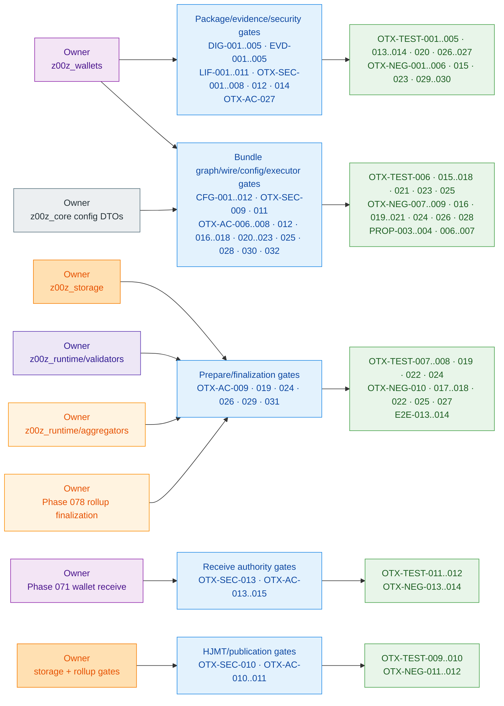

## 13. Dependency And Library Contract

### 13.1 Add Now

No library installation and no new core runtime dependency is required for v1 bundle support. Implementers MUST NOT run `cargo add` for Phase 072 unless a separately reviewed spec amendment names the crate, owning manifest, feature set, audit result, and removal/rollback plan.

Rationale:

- the existing workspace already contains sufficient crypto, transport, storage, concurrency, and testing foundations;
- cycle/order validation, closure, and conflict detection under `max_nodes = 128` MUST use bounded `BTreeMap`/`BTreeSet` structures for v1;
- minimizing new runtime crates reduces audit surface and dependency sprawl.

### 13.2 Reuse Now

Implementation MUST reuse the existing dependency surfaces as follows:

| Need | Required connection | Direct-use rule |
| --- | --- | --- |
| Shared config contract | `z00z_core::offline_transaction` pure DTOs; generic loading through `z00z_utils` | Owner crates MUST receive the immutable snapshot/projection and MUST NOT define parallel Phase 072 config structs. RPC receives scalar gates from wallet and adds no core dependency. |
| DTO derives and typed errors | workspace `serde` derives and `thiserror` | Modules MAY use direct derives; all untrusted DTOs MUST deny unknown fields. |
| JSON/YAML, bounded binary, and files | `z00z_utils::{codec, config, io}` including `JsonCodec`, `BincodeCodec`, `to_canonical_json_bytes`, and bounded loaders | New business logic MUST NOT call `serde_json`, `serde_yaml`, `bincode`, or `std::fs` directly. Inner bundle/package-source bytes MUST use canonical JSON; committed-input source blobs MUST use bounded `BincodeCodec`; the fixed-width plan manifest MUST use its one storage-owned checked codec, exactly as Sections 7.5.1 and 9.2 require. |
| Hashes, framing, HMAC/fingerprint, secret equality, AEAD, KDF, proofs, zeroization | `z00z_crypto` and existing wallet crypto wrappers | New business logic MUST use `hmac_sha256` for Section 10.1 fingerprinting and MUST NOT call `sha2`, `hmac`, `subtle`, `chacha20poly1305`, `argon2`, `hkdf`, `merlin`, Tari vendor crates, or another primitive stack directly. |
| Hex/Base64 wire representation | existing `hex` and `base64` dependencies in `crates/z00z_wallets/Cargo.toml`, confined to `z00z_wallets::tx::offline_bundle_codec` | The adapter MUST enforce lowercase fixed-size hex and canonical padded RFC 4648 Base64. Other Phase 072 business, RPC, verifier, storage, and validator modules MUST call the adapter and MUST NOT encode/decode ad hoc. |
| Checkpoint, HJMT, persistence | `z00z_storage` APIs | Wallet/runtime code MUST NOT call `jmt` or `redb` directly. |
| RPC | the existing `z00z_networks/rpc`/wallet RPC stack and its existing `serde_json` dependency | Only the transport-owned bounded ingress adapter MAY use `serde_json` raw-value/streaming visitors to extract the JSON-RPC method while retaining bounded raw params; it MUST apply Section 7.5.1 caps before constructing `Value`. Business logic MUST NOT call `serde_json` directly or depend on `jsonrpsee` request types outside transport adapters. |
| Async and CPU execution | existing Tokio and Rayon dependencies in the wallet manifest, confined to `OfflineBundleExecutorV1` | Implementations MUST use exactly the Section 6.2 service-owned pool/semaphore design; proof work MUST NOT block the reactor and completion order MUST NOT affect output order. |
| Graph algorithms | `std::collections::{BTreeMap, BTreeSet}` | V1 consensus/trust-sensitive ordering MUST NOT use hash iteration order or new graph crates. |
| Property tests and benchmarks | existing `proptest` and `criterion` dev-dependencies in the relevant workspace manifests | These dependencies MUST be used only in tests/benches; runtime features MUST NOT depend on them. |

The expected existing manifests are workspace `Cargo.toml`, `crates/z00z_core/Cargo.toml`, `crates/z00z_wallets/Cargo.toml`, `crates/z00z_storage/Cargo.toml`, and the current runtime/rollup/wallet/network RPC manifests. A Phase 072 implementation PR MUST list which existing dependency surface each new module uses; an unexplained new dependency fails review.

### 13.3 May Add Later

The following additions MAY be discussed later only after profiling or a narrow reproducible test need:

- `smallvec` for hot-path small bounded vectors;
- `serial_test` for an unavoidable test-global mutation, after first preferring dependency injection;
- `petgraph` only under a separate RFC if bounded in-house graph logic stops being transparently auditable.

### 13.4 Must Not Add For V1

- `petgraph` as immediate default dependency;
- `daggy`;
- another JMT implementation;
- a second RPC stack;
- a second AEAD library;
- a second range-proof stack;
- direct low-level crypto or serialization dependencies in the new business modules.

## 14. Architecture Verification, Fusion Coverage, And Decision Record

### 14.1 Stage-By-Stage Architecture Verification

| Stage | Architecture claim | Workspace evidence | Status |
| --- | --- | --- | --- |
| Stage A | `TxPackage` remains the only live canonical transaction node and digest contract | `crates/z00z_wallets/src/tx/tx_wire.rs`, `crates/z00z_wallets/src/tx/tx_verifier.rs` | Verified live |
| Stage B | verify/report and import/persist are separate wallet phases | `crates/z00z_wallets/src/rpc/tx_rpc_server_lifecycle.rs`, `crates/z00z_wallets/src/rpc/tx_rpc_server_finalize.rs` | Verified live |
| Stage C | inbox/public entry points converge on the private authoritative receive transaction core; worker cryptographic promotion is separate | `crates/z00z_wallets/src/services/wallet_actions_receive.rs`, Phase 071 spec/tests | Authoritative receive transaction core verified live; `VerifiedScanBatch` promotion is an implementation blocker |
| Stage D | storage owns base-root resolver truth and checkpoint DTOs; ancestor-created inputs require the Section 9.2 overlay | `crates/z00z_storage/src/checkpoint/build.rs`, `crates/z00z_storage/src/checkpoint/mod.rs` | Base substrate verified live; working-input overlay is target-only and canonical mutation remains Phase 078-owned |
| Stage E | validators own checkpoint-bound theorem binding after Phase 078 has `DaReady` and final artifact/link inputs | `crates/z00z_runtime/validators/src/verdict.rs`, Phase 078 spec | Live theorem requires artifact/link/exec bindings; bundle exact-core adapter and ordering are target-only |
| Stage F | committed-state HJMT scan is proof-first | `crates/z00z_simulator/src/scenario_1/stage_11/jmt_wallet_scan.rs` | Verified live |
| Stage G | HJMT runtime/checkpoint gate artifacts are real; Phase 072-to-078 publication integration remains separate work | `crates/z00z_storage/src/checkpoint/checkpoint_contract.yaml`, `config/hjmt_runtime/sim_5a7s/*`, Phase 078 spec | Gate artifacts verified live; full integration target-only |
| Stage H | simulator provides bridge/prototype/evidence substrate but is not production authority | `crates/z00z_simulator/src/scenario_1/stage_6/mod.rs`, `stage_9/bundle_lane_impl.rs`, `stage_13/scan.rs` | Verified live |
| Stage I | there is no live standalone offline DAG engine or second runtime transaction family | repo search over `crates/` for prohibited names | Verified exclusion |
| Stage J | dependency posture is reuse-first and already supported by current Cargo surfaces | relevant `Cargo.toml` files | Verified live |
| Stage K | received `status` is not package-digest-bound and cannot authenticate readiness | live digest builder, portable package parser, `is_import_ready(...)` | Trust gap verified live; Section 7.2.1 enforcement is an implementation blocker |
| Stage L | shared config DTO/snapshot ownership must avoid component-local parsing and runtime use of review strings | current manifests plus Section 5 target | Dependency direction verified; `z00z_core::offline_transaction` and one-snapshot distribution are target-only |
| Stage M | plan identity must freeze theorem-relevant bytes normalized out of the package digest and be reloadable by every voter | live package digest normalization, checkpoint codecs, and Phase 078 staging contract | Substrate verified live; package-source commitment and canonical plan manifest are implementation blockers |

### 14.2 Folded Concept Coverage Map

| Concept input | Preserved concepts now carried here | Where preserved in this spec |
| --- | --- | --- |
| Runtime architecture | C4 pack, request-bound receive, HJMT non-authority, fallback matrix, acceptance, evidence ledger | Sections 4, 5, 7.1.1, 8, 9, 11, 12, 14 |
| Contract hardening | correction ledger, output construction, digest contract, persistence model, property/fuzz, decision record | Sections 2, 5, 7.3, 7.4, 7.7, 12.5, 14.3 |
| Current package and backlog discipline | one-node truth, one verifier, import boundary, lifecycle, seam reuse | Invariant navigation map; Sections 6, 7.1-7.4, 8.1, 12, 15 |
| DAG/package-graph concepts | bundle closure, topological apply, drift guardrails, holder submission/publication eligibility | Invariant navigation map; Sections 6, 7.5, 8.2, 9.2, 16 |
| Request-bound inbox work | advisory inbox, authoritative receive transaction core entry, worker evidence-only boundary | Invariant navigation map; Sections 7.1.1, 8.1.1, 9.6, 10, 12 |

### 14.3 Doublecheck Decision Record

| Decision | Evidence status | Verification result |
| --- | --- | --- |
| Keep `TxPackage` as the only package node | Live-confirmed | Confirmed by live `TxPackage` in `tx_wire.rs` |
| Use digest domain `z00z.tx.pkg.digest.v2` | Live-confirmed | Confirmed by live digest path |
| Preserve `admitted`/`confirmed`/`verified` as compatibility vocabulary, not authority | Live-confirmed trust gap | `is_import_ready(status)` recognizes the words, while the digest/parser do not authenticate `status`; Section 7.2.1 supplies the target evidence gate |
| Keep verify/report separate from import | Live-confirmed | Confirmed by separate lifecycle and finalize RPC surfaces |
| Keep wallet-local scan authority | Live-confirmed substrate | Confirmed by wallet receive/scanner surfaces |
| Use storage checkpoint DTOs but add explicit working-input provenance | Live-confirmed substrate, graph feed target-only | Current `ResolvedInput` is base-witness-oriented; Section 9.2 defines the required non-fabricating extension |
| Keep HJMT physical roots private | Live-confirmed | Confirmed by settlement/HJMT boundary |
| Avoid standalone offline crate | Architecture decision | Consistent with current crate ownership and design discipline |
| Keep request-bound inbox advisory | Live-confirmed | Confirmed by `recv_range_with_inbox(...)` and test suite |
| Reject `petgraph` as add-now dependency | Fusion conflict resolved | Chosen to minimize dependency surface for bounded graph logic in v1 |

### 14.4 Repository Evidence Anchors

- `crates/z00z_wallets/src/tx/tx_wire.rs`
- `crates/z00z_wallets/src/tx/tx_digest.rs`
- `crates/z00z_wallets/src/tx/tx_verifier.rs`
- `crates/z00z_wallets/src/tx/spend_verification.rs`
- `crates/z00z_wallets/src/tx/spend_proof_backend.rs`
- `crates/z00z_wallets/src/chain/receiver_card_record.rs`
- `crates/z00z_wallets/src/rpc/tx_rpc_support.rs`
- `crates/z00z_wallets/src/rpc/tx_types.rs`
- `crates/z00z_wallets/src/rpc/tx_rpc_server_lifecycle.rs`
- `crates/z00z_wallets/src/rpc/tx_rpc_server_finalize.rs`
- `crates/z00z_wallets/src/services/wallet_actions_receive.rs`
- `crates/z00z_wallets/src/receiver/request_inbox.rs`
- `crates/z00z_wallets/src/chain/scan_engine.rs`
- `crates/z00z_storage/src/checkpoint/mod.rs`
- `crates/z00z_storage/src/checkpoint/build.rs`
- `crates/z00z_runtime/validators/src/verdict.rs`
- `crates/z00z_rollup_node/src/lib.rs`
- `crates/z00z_simulator/src/scenario_1/stage_11/jmt_wallet_scan.rs`
- `config/hjmt_runtime/sim_5a7s/manifest.json`
- `config/hjmt_runtime/sim_5a7s/planner/planner-config.yaml`
- `config/hjmt_runtime/sim_5a7s/storage/storage-config.yaml`
- `crates/z00z_storage/src/checkpoint/checkpoint_contract.yaml`
- `.planning/phases/071-Request-Bound-Inbox/071-Request-Bound-Inbox-Spec.md`
- `.planning/phases/078-Rollup-Node/78-Rollup_Node-Spec.md`

### 14.5 Formal Cross-Logic Audit

`Resolved in spec` means the normative contradiction is removed here; it does not mean target code exists. Every `implementation blocker` below MUST close before `bundle_wrapper.enabled` becomes `true`.

| Finding | Architecture classification | Resolution | Status |
| --- | --- | --- | --- |
| `ZINV-OTX-*` duplicated gates and could drift | parallel authority layer | Replaced with a non-normative navigation map pointing to exact gates | Resolved in spec |
| Live and planned surfaces were described as equally available | maturity-boundary violation | Section 2.3 labels every major surface live, target, or release-blocked | Resolved in spec |
| Mutable, non-digest-bound `status` was treated as admission evidence | trust-boundary violation | Effective tier now requires locally verified evidence; status is a hint only | Spec resolved; implementation blocker |
| Evidence had no frozen envelope or collection bound | unbounded trust-boundary input | Versioned two-variant wire, exact issuer domains, 256-entry/256-KiB-entry/64-byte-domain limits, stricter owner field/count caps, and capability verifiers are mandatory | Spec resolved; implementation blocker |
| Bundle closure lacked a selected tip and edge positions | under-specified interface | Tip, indices, exact edge checks, minimal closure, and multi-tip rejection are frozen | Resolved in spec; target implementation required |
| A dependent child was required to bind the same pre-state root as its parent | unsatisfiable proof/state invariant | One bundle base seeds pinned storage construction contexts and deterministic per-node `working_root_before/after`; prepare must replay them | Resolved in spec; implementation blocker |
| `BundleConstructionContextV1` named no exact fields, ownership progression, or wallet-free storage input | under-specified builder interface | Froze the private single-use context fields, checked storage step, ordinal/source/root progression, alternative-candidate semantics, and independent prepare replay | Resolved in spec; builder/compile-fail tests required |
| Bundle verification flowed through potentially mutating apply | state-consistency hazard | Wallet report, storage prepare, theorem verdict, Phase 078 intent, DA/QC gates, and canonical-head transaction are separate typed phases | Resolved in spec; implementation blocker |
| One failure gate implied cross-crate wallet/storage rollback | atomicity-scope contradiction | Wallet import and the Phase 078 canonical-head transaction are separate owner-local transactions; a later runtime failure never rewrites earlier wallet state | Resolved in spec |
| Phase 072 committed the semantic root before Phase 078 DA readiness and QC | cross-phase finality-order violation | Removed the Phase 072 commit path; the plan digest now enters `CheckpointTransitionIntentV2`, and canonical visibility is exclusively `DaReady -> CanonicalFinalityCertificateV2 -> canonical-head transaction` | Resolved in spec; Phase 078 integration blocker |
| Read-only prepare required final `CheckpointArtifact`/`CheckpointLink` before DA readiness | circular object-order violation | Prepare now emits only draft/exec/snapshot candidate inputs; Phase 078 binds final artifact/link after `DaReady`, then runs the exact-core theorem before QC | Resolved in spec; Phase 078 integration blocker |
| Live `SettlementTheoremBundle` base-root equality was implicitly reusable for every dependent node | unsatisfiable validator invariant | Bundle validation must refactor and reuse shared theorem primitives, preserve single-package vectors, bind each node to its plan working root/exec ordinal, and produce one ordered verdict digest | Resolved in spec; validator implementation blocker |
| An accepted theorem capability was required before the immutable core existed, while that capability also had to bind the core | circular capability-order invariant | Pre-core validation now derives only a non-serializable expected verdict digest with exact V1 framing; Phase 078 freezes that digest in the core, and only an exact-core recheck may construct the accepted `BundleSettlementVerdictV1` capability bound to `core_digest` | Resolved in spec; validator/Phase 078 implementation blocker |
| Artifact/link or `DaReady` could be misread as wallet confirmation | lifecycle/finality promotion violation | `Confirmed` now requires owner-verified finalized record, exact Phase 078 QC, canonical-head inclusion, and transitive package/chain binding; pre-commit and receipt-only evidence rejects | Resolved in spec; evidence verifier blocker |
| DA publication and archive custody were modeled as one provider lane | authority/state-machine collapse | Split exact `CheckpointDaPayloadV2`/`DaAdapter` readiness from post-commit `EpochChallengePackV2`/`ArchiveShardCarrierV2` custody in text and diagrams | Resolved in spec |
| Base64 representation was assigned to `z00z_crypto` | dependency-owner error | Existing `base64`/`hex` crates are confined to one wallet codec adapter; crypto primitives and framing remain behind `z00z_crypto` | Resolved in spec |
| `bundle_b64` had no canonical inner byte codec | cross-implementation wire ambiguity | Inner bytes are canonical JSON through `JsonCodec`/`to_canonical_json_bytes`, with exact decode/re-encode equality and bounded visitors; JSON variants, YAML, and bincode reject | Resolved in spec; target implementation required |
| Proof concurrency referred to a nonexistent bounded wallet executor | resource/async architecture gap | Added one service-owned Rayon pool, four-request fail-fast semaphore, deterministic collection, cancellation/no-mutation rules, and overload tests using existing dependencies | Resolved in spec; target implementation required |
| The raw-request cap was assigned to `RpcDispatcher::dispatch(method, Value)` after allocation and could imply raising a global cap for every RPC | transport-boundary / resource-exhaustion violation | Split deployment-wide cap, bounded envelope/method extraction, method-specific raw-size rejection, and wallet codec limits; bundle enablement now fails closed when no raw ingress exists | Resolved in spec; transport adapter/negative tests required |
| Storage prepare accepted an untyped wallet-owned graph, while holder publication could be misread as requiring wallet readiness | production dependency-cycle / capability-boundary violation | Wallet package logic constructs private package/graph-only `VerifiedBundleGraphV1`; report scanning is optional, aggregator converts only that capability to private `BundlePrepareInputV1`, storage imports no wallet type, and validators rebind exact package/plan bytes | Resolved in spec; target implementation required |
| Wallet-to-storage output handoff carried `TerminalLeaf` without the `DefinitionId` required by `CheckpointExecOut` and the live theorem | lossy adapter / theorem-binding violation | Added private `BundlePrepareOutputV1` with the exact decoded definition-id/leaf pair and forbade defaults or re-derivation | Resolved in spec; adapter/negative tests required |
| Runtime knobs and architecture prose shared one undifferentiated config object | config authority/branching ambiguity | One strict full-file DTO exposes startup assertions, runtime policy, and review-only projections; separate runtime/file digests and one immutable snapshot prevent review strings from branching production | Resolved in spec; target implementation required |
| Exact YAML bytes and process-local generation entered cross-process plan identity | canonical identity / distributed-consistency violation | Runtime identity is canonical startup+runtime JSON with file-supplied authority generation; exact-file digest and local load generation are audit-only and excluded from plan/core digests | Resolved in spec; target implementation required |
| Scanning every package output could import an owned parent output already consumed by its child | wallet state-consistency hazard | Report/import separates terminal owned outputs from transient audit-only outputs | Resolved in spec; implementation blocker |
| Live base-root witnesses cannot represent ancestor-created working inputs | substrate mismatch / hidden coupling | `BundleInputSourceV1` provenance and scratch overlay are required; unchanged per-node apply MUST NOT be used | Spec resolved; implementation blocker |
| Graph limits and order contract had conflicting/circular definitions | configuration split-brain / circular definition | `bundle_graph` is the sole source and order is explicit, digest-bound, and topologically validated before root replay | Resolved in spec; materialized config is an implementation blocker |
| Lifecycle transitioned from successful import to import failure/conflict causes | invalid state causality | Failure/rollback now ends before success; later reconciliation conflict is distinct | Resolved in spec |
| Adjacent rollup authority was mislabeled Phase 070 | cross-document reference error | Corrected to Phase 078 and retained its non-authority boundaries | Resolved in spec |
| Phase 071 worker evidence was described as locally validated authority, and local trust could be misread as an intermediate worker-promotion tier | cross-phase contract drift | `TrustedScanBatch` is now exclusively the authenticated local lane, `VerifiedScanBatch` exclusively the cryptographically checked worker lane, both enter through `ScanBatchSource`, and worker release remains disabled until the latter exists | Spec resolved; implementation blocker |
| Direct low-level dependency list bypassed owner facades | boundary violation / audit expansion | Section 13 freezes existing facade use and requires no new library installation | Resolved in spec |
| Traceability diagram used undefined `OTX-REQ-*` identifiers | false traceability | Diagram now maps real `CFG/DIG/EVD/LIF/SEC/AC` gates to owners and tests | Resolved in spec |
| Plan digest did not freeze proof/auth/output source bytes normalized out of package identity or define a voter-reloadable codec | prepare-to-vote TOCTOU / canonical-wire ambiguity | Added non-identity package-source commitments, capped storage-owned canonical plan manifest, content-addressed Phase 078 staging, and mandatory per-voter source reload/recomputation | Resolved in spec; storage/validator/Phase 078 implementation blocker |
| Listing every committed-input witness separately could overflow Phase 078's 64 KiB staging-manifest cap at maximum bundle input count | cross-phase metadata-cap contradiction | Added exact bounded package/committed source packs; staging lists pack metadata while voters verify every plan-bound directory entry/payload | Resolved in spec; pack codec/cap tests required |
| A single 8 MiB package-source pack could overflow from directory/projection overhead even when an 8 MiB inner bundle passed | accepted-input / downstream-blob cap contradiction | Package sources now use one or two deterministically partitioned packs, each capped at 8 MiB with ordinal/count headers and exact collection coverage | Resolved in spec; boundary/partition tests required |
| Lifecycle/import outcomes used `DuplicateConflict`, `NoOwnedOutputs`, and `AlreadySpent` outside the stable bundle error contract | cross-surface error vocabulary drift | Added all three to one ordered public mapping and fixed per-API scopes | Resolved in spec; typed mapping tests required |
| The failed same-`tx_id`/different-payload path said to persist a conflicted mark | failed-import atomicity contradiction | `DuplicateConflict` and `AlreadySpent` now leave wallet state unchanged; only later owner-verified canonical conflict evidence may enter `ReconciledConflict` | Resolved in spec; atomic negative tests required |
| `ReconciledConflict` accepted unspecified “authoritative conflict evidence” | lifecycle trust-boundary ambiguity | Added a private owner-verified capability bound to package/input/conflicting canonical record/current head and disabled automatic promotion until it exists | Resolved in spec; reconciliation capability tests required |
| Holder publication inherited wallet readiness even though `LocalVerified` requires wallet-owned output, and a config key implied possession alone was publishable | authority/capability conflation | Defined separate publication eligibility over `VerifiedBundleGraphV1` with no ownership/scan/import prerequisite, renamed the policy to holder submission without ownership, and still requires every runtime/settlement gate | Resolved in spec; publication separation tests required |
| Pre-admission `keyed_redacted` logging named no primitive, key source, truncation, or fail-closed fallback | observability/security ambiguity | Fixed existing `z00z_crypto::hmac_sha256`, domain/label/input/truncation, secret-provider key requirements, and disable-without-raw-fallback behavior | Resolved in spec; redaction tests required |

## 15. Definition Of Done

Phase 072 is complete only when all of the following conditions are true:

- implementation still uses `TxPackage` as the canonical node contract;
- any new bundle wire is a wrapper, not a second transaction family;
- the materialized bounded config exists, defaults bundle surfaces off, distributes one immutable snapshot, and passes `CFG-001..012`;
- received status cannot promote readiness without Section 7.2.1 evidence;
- `Confirmed` promotion requires finalized-record/QC/canonical-head inclusion, not pre-commit DA/artifact/archive evidence;
- wallet verify/report and import/persist remain separated;
- bundle wallet import is one atomic transaction and never a per-node import loop;
- holder publication starts only from private `VerifiedBundleGraphV1`, remains independent of wallet ownership/readiness, and grants no wallet capability;
- bundle proof work uses the four-request/eight-worker service-owned executor and never blocks the Tokio reactor;
- request-bound inbox remains advisory and enters the private authoritative receive transaction core;
- worker receive remains release-disabled until `VerifiedScanBatch` promotion is implemented and tested;
- storage-owned working-window prepare is read-only and produces draft/exec/snapshot candidate inputs without premature final artifact/link;
- aggregator-to-storage handoff converts private `VerifiedBundleGraphV1` into checked `BundlePrepareInputV1` with no storage production dependency on wallet types;
- storage emits the capped canonical `BundleApplyPlanManifestV1`, deterministic one/two-pack package-source collection, and optional committed-source pack; Phase 078 stages those packs plus exact checkpoint blobs, and every voter reloads/recomputes package-source, witness, plan, and verdict bindings;
- the verified plan is bound into Phase 078 intent/core inputs and Phase 072 exposes no pre-DA canonical commit;
- Phase 078 reaches `DaReady`, verifies `CanonicalFinalityCertificateV2`, and only then executes the canonical-head transaction;
- archive placement remains a separate post-commit lane and cannot establish `DaReady`;
- shared theorem primitives preserve live single-package vectors, bind dependent nodes to plan working roots/exec ordinals, and reject exact-core mismatches;
- HJMT committed-state scan stays proof-first;
- rollup preflight consumes canonical HJMT runtime and checkpoint gates;
- simulator Stage 6, Stage 7, Stage 11, and Stage 13 evidence stays green;
- no new standalone offline crate or parallel verifier/state engine was introduced;
- no new runtime dependency was added without explicit spec amendment and review;
- all `CFG-001..012`, `DIG-001..005`, `EVD-001..005`, `LIF-001..011`, `OTX-SEC-001..014`, `OTX-TEST-001..027`, `OTX-NEG-001..030`, `E2E-001..014`, `PROP-001..007`, `FUZZ-001..004`, `OTX-AC-001..032`, and Mermaid render gates pass.

## 16. Prohibited Drift

Phase 072 MUST NOT introduce:

- `TxPackage_v1` as a second regular transaction package;
- `BundlePackage_v1` as a supposedly live container without complete code, verifier, storage, and tests;
- `receiver_view` embedded into `TxPackage`;
- inline membership witness bytes inside `TxInputWire`;
- `offline_chain.rs`, `dag_storage.rs`, `offline_service.rs`, or `dag_validator.rs` as authority modules;
- direct wallet secret scanning in runtime, storage, rollup, or remote workers;
- direct `std::fs`, ad hoc `serde_yaml`, raw RNG, or raw time calls in new business logic where `z00z_utils` already provides an abstraction;
- public APIs exposing vendor concrete types when Z00Z wrappers already exist.

## 17. Glossary

| Term | Meaning |
| --- | --- |
| Authoritative receive transaction core | The private `WalletService::recv_range_authoritative(...)` plus `persist_scan_batch(...)` boundary through which public and approved helper lanes must pass before wallet receive mutation. |
| Advisory inbox | Metadata-only request store that helps ordering and UX but does not own state mutation. |
| Minimal ancestor closure | One selected tip plus exactly the transitive parent nodes without which it cannot be validated and applied. |
| Bundle graph | The canonical package/edge/execution-order structure inside `OfflineTxBundleV1`; historical DAG/package-graph wording is non-authoritative provenance. |
| `VerifiedBundleGraphV1` | Private process-local capability proving canonical package/graph/source validity only; it grants no ownership, readiness, admission, storage, theorem, or finality authority. |
| Bundle apply plan manifest | The capped canonical `BundleApplyPlanManifestV1` bytes whose digest freezes plan/source/draft/exec identities for Phase 078 staging and voter replay. |
| Bundle source packs | Bounded canonical package-source and committed-input-source containers that keep Phase 078 staging metadata within 64 KiB while preserving per-entry digest/length verification. |
| Bundle over-inclusion | A case where unrelated siblings are included in the publication artifact; v1 MUST reject it. |
| Checkpoint DTOs | `CheckpointExecInput`, `CheckpointLink`, `CheckpointArtifact`, and related storage-owned types. |
| Committed-state scan | Ownership scan against committed settlement state with proof validation first. |
| Detached package report | Ownership hint over package bytes before committed-state proof exists. |
| Digest drift | Mismatch between the recomputed canonical digest and transmitted digest metadata. |
| Effective readiness tier | Locally derived `LocalVerified`, `Admitted`, or `Confirmed` result from package verification plus the evidence required by Section 7.2.1; received status alone is not a tier. |
| Import-ready | Wallet-local decision that validity, chain, owned-output, user/API action, and effective readiness gates pass. |
| Holder submission permission | A holder may relay or submit one selected tip plus its exact minimal ancestors for evaluation; permission to submit is not publication eligibility, acceptance, ownership, or finality. |
| Publication-eligible | Runtime decision that holder submission gates pass without requiring wallet ownership or granting wallet readiness/import authority. |
| Request-bound receive | Privacy-preferred receive lane driven by validated `PaymentRequest`. |
| Reconciled conflict | Later authoritative evidence that invalidates a pending/admitted assumption; persisted lifecycle status is `conflicted`, while audit history is retained. |
| Settlement theorem | Validator-level consistency theorem between packages, execution input, checkpoint artifact, and link. |
| Terminal owned output | Wallet-owned bundle output not consumed by any later declared-order node; eligible for claimed-asset import after readiness gates. |
| Thin transport | Helper transport format that MUST rehydrate exact thick package bytes before trust-sensitive use. |
| Transient owned output | Wallet-owned parent output consumed by a later node in the same bundle; audit/history only and never a claimed/spendable asset. |
| Working-window prepare | Read-only deterministic scratch-overlay resolution producing `BundleApplyPlanV1`. |
| Phase 078 canonical finalization | Exact `CheckpointDaPayloadV2` reaching `DaReady`, followed by `CanonicalFinalityCertificateV2` and the one `CanonicalCommitterV2` canonical-head transaction; Phase 072 contributes the verified plan but owns no earlier canonical commit. |

This document is self-contained for implementation, review, test planning, and architecture audit. Section 2 preserves the one-time source coverage and conflict-resolution record; implementation work MUST use this document rather than retired drafts.
