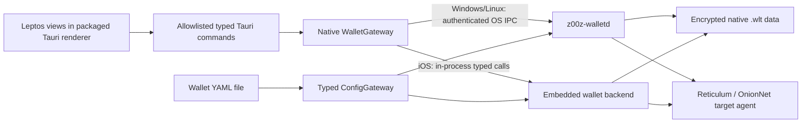
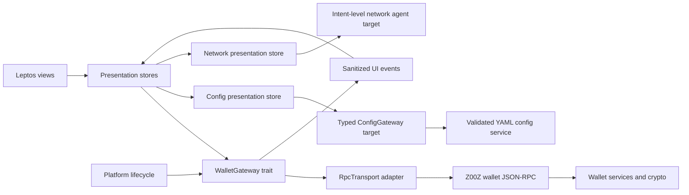
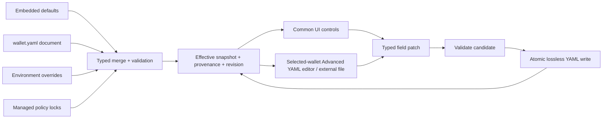

<!-- markdownlint-disable MD013 -->

# Z00Z Wallet UI/UX Specification

| Field | Value |
| --- | --- |
| Status | Product, interaction, configuration, and target-network baseline for prototype validation |
| Version | 0.5.3 |
| Date | 2026-07-19 |
| Last updated | 2026-07-23 |
| Targets | Windows, Linux, iOS |
| Prototype | [`demo/index.html`](demo/index.html) |
| Production UI decision | Tauri 2 + Leptos is a packaged standalone shell; no browser, container, or hosted-wallet profile |
| Backend boundary | Typed local-only gateway over in-process calls or authenticated OS IPC; no HTTP/WebSocket wallet listener |

## 🎯 Purpose

This document is the implementation contract for the Z00Z Wallet user interface. It fixes the product model, information architecture, screen behavior, interaction flows, content, visual system, security behavior, responsive rules, and RPC ownership before production implementation begins.

The accompanying HTML prototype is the executable design reference. It demonstrates contextual navigation, responsive layout, lock state, object-family separation, payment, receiving, asset claiming, vouchers, permissions, activity, layered network status, policy profiles, UI/YAML configuration, theme switching, and representative error/success states. It does not perform cryptography or connect to a live wallet.

Version 0.5 fixes a standalone-only deployment model: Z00Z Wallet is a packaged application for Windows, Linux, and iOS. Its UI and wallet backend run on the same device; frontend-to-backend traffic never crosses TCP, HTTP, WebSocket, a LAN, or the Internet. A Z00Z **Claim** is an asset-claim transaction with its own source proof, authority, recipient binding, and replay nullifier; it is not a voucher action. A `Right` is strictly zero-value, so a monetary budget cannot be represented as a bare permission card. Voucher actions are Accept, Reject, Transfer, Redeem, Refund, and Expire. UI/YAML synchronization, detailed Reticulum/OnionNet health, compliance profiles, and a wallet-facing claim-package intake remain target capabilities where current RPC is incomplete.

The intended result is a wallet implementer who translates defined behavior into Rust rather than inventing product behavior inside view code.

## 🧭 Authority and source precedence

When sources disagree, use this order:

1. Current wallet code and RPC types in `crates/z00z_wallets/src`.
2. Z00Z protocol and design requirements in `.github/requirements`.
3. Product direction in `chat.md`.
4. This specification after it is reviewed and accepted.
5. Existing phase sketches and `egui_views` as inventories only.

The old ASCII screens and egui views are not visual contracts. They contain useful capability inventory, but also expose development terminology, fragment related work into too many tabs, and include assumptions that conflict with current code. In particular, recovery uses the current 24-word English mnemonic contract, not the older 12/24-word sketch.

## 💡 Product concept: Quiet Private Object Wallet

Z00Z Wallet is a calm private-action workspace, not a trading terminal and not a protocol explorer.

The interface has two layers:

- **Everyday layer:** assets, recent activity, requests, asset claims, vouchers, and permissions expressed as human tasks.
- **Expert layer:** identifiers, package data, receipts, lifecycle events, network diagnostics, and compatibility operations. It is deliberately opt-in.

The home screen answers four questions in this order:

1. How much private money can I use now?
2. Is the wallet safe, private, and synchronized?
3. What can I do next?
4. What still needs my attention or settlement?

The core action language is fixed:

| Product verb | User meaning | Backend concept | MVP placement |
| --- | --- | --- | --- |
| Pay | Send private money | Canonical transaction lane | Primary |
| Claim | Prove one authorized claim source and receive its private asset output once | `ClaimTxPackage` / asset claim lane | Primary, capability-gated |
| Use | Exercise a granted capability | Right consumption | Secondary; future-ready |
| Delegate | Give a narrower permission that I already control | Right delegation | Primary as a safe recipe |
| Prove | Show a fact or receipt without exposing more | Receipt/public material | Secondary; future-ready |

The five verbs are the durable action ontology, but they are not object families. The first release promotes **Pay**, **Receive**, and **Give permission**; **Claim** appears only when the build exposes a verified claim-package intake. Voucher review and redemption remain explicit voucher actions rather than being renamed Claim.

### 🧬 Object-family mental model

The protocol has three object families. The wallet presents their consequences before their technical names:

| Family | Everyday label | What it means | Balance treatment | Primary UI |
| --- | --- | --- | --- | --- |
| `Asset` | Asset / money | Final-value property the wallet can possess; native cash is the primary spendable projection | Count only verified, spendable cash in Available | Wallet → Assets |
| `Voucher` | Voucher / offer | Conditional value that requires explicit acceptance and can have redemption, transfer, partial-redemption, refund, and expiry rules | Never Available until redeemed into a settled spendable asset | Wallet → Vouchers |
| `Right` | Permission | Zero-value authority scoped by action, object/policy/domain, use count, delegation, and attenuation | Never a monetary balance | Wallet → Permissions |

`Asset` and `Voucher` are value-bearing protocol families; only settled spendable assets contribute to the main balance. `Right` is zero-value authority. A voucher card states its concrete outcome and backing rather than implying every voucher is cash. A right card never carries a monetary balance. If a future product offers an agent budget, it is a composed recipe that binds a zero-value authority to separately controlled value and fee support; the UI must not project the amount onto `RightLeaf` or claim that `wallet.object.delegate_right` creates money.

`Claim` is not a fourth object family. It is a transaction lane that consumes a verified claim source and produces one or more `Asset` outputs. A successful claim therefore appears in Activity as an asset acquisition and, once settled and spendable, in Wallet → Assets. `OwnedAssetSource::ManualClaim` describes provenance; it does not turn the resulting asset into a voucher.

## 🧱 Non-negotiable product principles

1. **Available is not an object total.** Spendable assets use the cash projection. Vouchers and permissions have separate sections and never inflate the displayed balance.
2. **Human language first, object family always recoverable.** Normal users see asset, claim funds, voucher, permission, request, receipt, recipient, available, and settling. Expert details show `Asset`, `Voucher`, `Right`, `ClaimTxPackage`, package, policy, and identifiers without creating a separate protocol product.
3. **One intent, one dominant action.** Every flow has one primary button. Destructive or irreversible actions require a separate review step.
4. **Fees are explained, not configured.** The UI states Included, Sponsored, or Deducted. Manual fee controls are not part of the standard flow.
5. **Settlement is honest.** A successful submission is not presented as final settlement.
6. **Safety is the default.** Main network, valid recipient/request, attenuated permissions, finite expiry, local lock, and backup reminders are defaults.
7. **Privacy is a state, not decoration.** Connection route and sensitive-display state are visible and understandable.
8. **No speculative finance UI.** No market charts, fiat gain/loss, price tickers, or portfolio performance without an authoritative price service.
9. **Progressive disclosure.** Protocol detail is available for support and verification without occupying everyday screens.
10. **Cross-platform parity, platform-native behavior.** The same task model applies everywhere; window chrome, back behavior, share sheet, biometrics, keyboard, and safe areas follow each OS.
11. **Configuration has one effective truth.** UI controls and YAML are two editors of the same versioned configuration; provenance, validation, conflicts, and restart requirements are visible.
12. **Policy can restrict, never silently expand.** Protocol rules are immutable in the wallet. Organization and user profiles may only narrow allowed behavior; ambiguous or unsupported policy fails closed.
13. **Privacy claims are measurable and capability-bound.** Say what an authoritative network API verified—overlay route, privacy floor, hop count, carrier—not “anonymous” or “untraceable.” When that API is absent, say unavailable/target rather than fabricating health.

## 👥 Users and jobs

| User | Primary job | Interface response |
| --- | --- | --- |
| Everyday holder | Safely pay, receive, and understand available money | Large balance, four quick actions, plain status language |
| Claim recipient | Claim an authorized asset allocation once | Claim review with source, output asset, authority/proof result, replay protection, and settlement state |
| Voucher holder | Inspect, accept, redeem, transfer, or refund a conditional-value offer | Voucher card with issuer, backing, remaining value, validity, state-driven actions, and review |
| Delegator | Give an app/person narrower authority from a held delegable right | Recipe-based permission with source authority, scope, action, uses, expiry, attenuation, and revoke |
| Managed user | Operate under organization or safety restrictions | Signed profile status, effective restrictions, source, version, and a plain “Why blocked?” explanation |
| Network-sensitive user | Prefer privacy, resilience, or controlled fallback | Mode-level choices with concrete OnionNet and Reticulum health, not raw ports |
| Power user | Inspect receipts, identifiers, networks, and packages | Expert details drawer, copy/export actions, diagnostics |
| Recovering user | Restore access without ambiguity | Guided 24-word recovery, validation, clear destructive warnings |

### 🧭 Scenario-to-screen derivation

The interface is derived from concrete jobs rather than from RPC namespaces. Every visible element must support at least one row below; unsupported placeholders are removed.

| Scenario | User starts from | Dominant task | Result and durable location |
| --- | --- | --- | --- |
| Pay private money | Home or a spendable asset | Validate recipient → enter amount → review → send once | Settling/settled asset activity |
| Receive private money | Home or a spendable asset | Create and share a payment request | Receiving/settled asset activity |
| Claim an allocation | Home Claim action, deep link, QR, or imported package | Verify claim source, authority, recipient binding, outputs, and replay protection → authorize once | Asset activity; settled output appears under Assets |
| Review a voucher | Attention or Wallet → Vouchers | Inspect issuer, backing, value, validity, and policy-driven actions | Accepted/redeemable/refunded/expired voucher state |
| Redeem a voucher | Redeemable voucher detail | Review output and requirements → redeem full/partial as allowed | Voucher lifecycle plus any settled asset output |
| Use a permission | Wallet → Permissions | Inspect the exact action, scope, uses, and expiry → use | Consumed/active permission activity |
| Give a permission | Held delegable permission | Choose recipient and narrower scope/uses/expiry → review attenuation → delegate | Given permission; source authority remains explicit |
| Resolve unsafe input | Attention or family filter | Read quarantine reason → discard/export diagnostics or retry with supported policy | Object remains non-spendable until authoritative promotion |
| Diagnose connectivity | Header health or Settings → Network | Identify overlay, carrier, chain, and scan independently | Actionable degraded/unavailable state; no invented privacy claim |
| Change configuration | Application control or selected-wallet Advanced YAML | Edit the configuration at its owning scope → validate → preview provenance/restart → apply | UI and YAML converge on one revision |

### 🧱 UI element work plan

Implementation and review proceed from general to specific:

1. **Shell:** global destinations, title/context, wallet identity, privacy/scan signal, lock behavior, and responsive safe areas.
2. **Context navigation:** one internal navigation rail for peer sections and nested settings; one active state; deep-linkable route; mobile adaptation.
3. **Action hierarchy:** one primary action per view, safe secondary actions, destructive actions separated and named.
4. **Object projections:** Assets, Vouchers, and Permissions each receive their own icon grammar, fields, filters, statuses, empty/loading/error/quarantine states, and detail flow.
5. **Lists and cards:** one row geometry, divider rule, padding rhythm, metadata alignment, and interactive/static distinction across Attention, Activity, and object inventories.
6. **Interaction states:** default, hover, keyboard focus, pressed, selected, disabled-with-reason, loading, success, warning, and error for every interactive component.
7. **Responsive composition:** two aligned Home columns at desktop, stable two-by-two quick actions on mobile, internal rail collapse, and bottom-sheet flows.
8. **Validation:** screenshot all main routes and states, keyboard traverse, 200% zoom, reduced motion, light/dark/forced-colors, and automated accessibility checks.

An element that has no scenario, no authoritative/target data owner, or no useful action is not added to the demo.

## 🧰 Technology decision

### 🏗️ Production stack

Use:

- **Tauri 2** as the packaged cross-platform application shell for Windows, Linux, and iOS.
- **Leptos static CSR** as the Rust/WASM declarative view layer, compiled into the Tauri application with Trunk; it is not served to, or opened by, a browser.
- **CSS custom properties and component styles** for the design system and responsive behavior.
- **Inline SVG icon components** from a single curated outline icon set; no emoji or icon fonts.
- **Existing `RpcTransport` and typed RPC DTOs** behind a UI-owned `WalletGateway` trait.

Tauri is the host, lifecycle, window, secure storage integration, platform bridge, and packaging layer. It is not the wallet domain API. Leptos owns views, local interaction state, routing, focus management, and presentation models. Tauri uses an embedded platform WebView as a renderer; it does **not** start an external browser, host a website, or expose a network wallet API.

This is a **TARGET architecture decision**, not a description of the current repository. Exact Tauri, Leptos, Trunk, and plugin versions are pinned only after the implementation spike verifies Windows/Linux/iOS lifecycle, accessibility trees, secure-storage integration, binary size, and local-IPC packaging. The official Tauri Leptos guide itself is version-specific, so this specification deliberately does not freeze a Leptos minor version before that spike.

### 📱 Mobile platform-adaptation contract

**One visual system, not two mobile products.** Windows, Linux, and iOS share the same Leptos component tree, design tokens, CSS layout rules, route names, content, and wallet task flows. The responsive HTML prototype is the visual source of truth. iOS may adjust safe-area padding, system font fallback, window chrome, sheet presentation, and platform affordances, but must not fork the information architecture, colours, object grammar, or review flows.

| Concern | Shared Leptos/UI responsibility | iOS Tauri adapter responsibility |
| --- | --- | --- |
| Layout | Breakpoints, 44 px targets, responsive cards, bottom navigation, sheets | Apply actual safe-area insets; test notches, home indicator, cut-outs, foldables, rotation, and split-screen/window resize |
| Keyboard and forms | Keep the focused field and primary action visible; use semantic amount/password fields | Reconcile visual viewport and native keyboard; scroll/reposition the sheet rather than allowing the keyboard to obscure a review/submit action |
| Back/navigation | Route state, modal stack, focus return, unsaved-input confirmation | iOS back gesture/control first closes the top dialog/sheet, then follows the route stack and never bypasses a required review |
| Lifecycle and lock | Clear secret presentation state and stop foreground polling | Forward `backgrounded`, `suspended`, and `screen_locked` to the gateway; invoke the platform lock/privacy screen and refresh/re-auth on foreground. The wallet process remains authoritative for revocation/timeout |
| Authentication | Explain why authentication is needed; never retain password/seed in component state | Use OS biometric/keychain/secure-storage integration only through a narrow Tauri command; no biometric result, session token, seed, or private key enters renderer-side persistent storage |
| Share/files | Offer Copy, Share, Export, Import, and backup flows with clear review/error states | Use native share sheet, document picker, and destination abstraction; the frontend never receives arbitrary filesystem paths or opens host files directly |
| Accessibility | Semantic DOM, visible focus, labels, live regions, reduced motion, text scaling | Validate real native accessibility trees and gestures with VoiceOver; honor OS text scale, contrast, motion, and screen-reader settings |

**Mobile behavior rules:**

1. A mobile bottom sheet is full-screen when the task needs keyboard entry, long review text, recovery words, or an irreversible confirmation. It is never a clipped desktop dialog.
2. App backgrounding, suspension, or screen lock immediately hides sensitive balances/identifiers and clears all seed/password/recovery words from rendered and in-memory UI state. Foregrounding does not imply an unlocked wallet.
3. A native back/gesture never discards entered non-secret data silently and never confirms, signs, exports, or redeems an action. It closes only the top transient layer before route navigation.
4. Mobile does not rely on hover, a permanent sidebar, a right-click, or desktop-width tables. The labelled context route strip remains scrollable and the current route stays visible.
5. Native capabilities are optional adapters with an unavailable state. If biometric, share, file, or secure-storage support is unavailable, the UI explains the fallback rather than imitating success.

**Release gate:** validate the same build on an iPhone/iPad target for cold start, foreground/background/suspend/lock, keyboard overlap, safe areas, rotation, iOS return gesture, biometrics, share/import/export, VoiceOver, large text, reduced motion, and failed/unavailable native capability states. This is a platform-adaptation spike, not a justification for a second UI implementation.

Official references:

- [Tauri platform support](https://tauri.app/)
- [Tauri frontend configuration](https://v2.tauri.app/start/frontend/)
- [Tauri and Leptos integration](https://v2.tauri.app/start/frontend/leptos/)
- [Tauri content security policy](https://v2.tauri.app/security/csp/)
- [Leptos book](https://book.leptos.dev/)

### ⚖️ Decision matrix

Scores use 1 (poor/high risk) to 5 (strong/low risk). Mobile UX, accessibility, and transfer from the HTML prototype have the highest weight.

| Option | Three target OSes | Responsive/mobile UX | Accessibility | Rust fit | Prototype transfer | Licensing/operational risk | Weighted conclusion |
| --- | ---: | ---: | ---: | ---: | ---: | ---: | --- |
| Tauri 2 + Leptos | 5 | 5 | 4 | 5 | 5 | 5 | **Selected** |
| Slint | 4 | 4 | 4 | 5 | 2 | 3 | Strong native alternative; licensing and HTML translation add risk |
| Dioxus | 5 | 4 | 3 | 5 | 4 | 4 | Viable, but mobile native-widget/animation story is less aligned |
| eframe/egui | 4 | 2 | 2 | 5 | 1 | 3 | Keep only for internal/debug tooling during migration |
| Flutter host + Rust core | 5 | 5 | 5 | 2 | 4 | 4 | Good UX, but creates a second primary language/runtime |

Why the existing egui direction is not selected for the product UI:

- The current views are mostly functional sketches and technical tab inventory.
- Immediate-mode layout is efficient for tools but works against DOM-grade responsive composition and the target mobile information architecture.
- Platform accessibility support and native-feeling mobile behavior are weaker than the selected embedded-renderer route.
- Current dependency is `eframe 0.28`; upgrading and redesigning it would still not solve prototype-to-production transfer.

Do not delete the egui application during initial implementation. Keep it as a diagnostic client until the new gateway and core flows reach parity.

### 📦 Deployment decision: standalone local application only

**Decision:** Z00Z Wallet ships only as a packaged standalone application for Windows, Linux, and iOS. There is no browser companion, web application, Docker wallet profile, hosted wallet, local HTTP server, WebSocket server, TCP listener, LAN listener, or Internet-facing wallet RPC.

The Tauri WebView is an embedded renderer inside the signed application bundle; it is not a deployment target or a browser session. The wallet backend and encrypted `.wlt` data remain on the same device. Reticulum/OnionNet traffic is a separate backend-to-network concern and must never become a route for UI-to-wallet commands.

| Platform | Runtime shape | Wallet/key location | Required local boundary |
| --- | --- | --- | --- |
| **Windows/Linux** | Tauri application process plus local `z00z-walletd` process | `z00z-walletd` owns encrypted native `.wlt` data and key-bearing sessions | Authenticated Unix-domain socket (Linux) or Windows named pipe; never TCP |
| **iOS** | One signed application with native embedded Rust backend | App-private native storage; backend owns session/key material | In-process typed gateway; no daemon, listener, or container |

#### 🧱 Target standalone topology



#### 🛡️ Local IPC and reliability contract

1. The application never binds a wallet command port. It has no HTTP, HTTPS, WebSocket, TCP, LAN, loopback-browser, or remote-RPC mode. `LocalRpcTransport` remains an in-process test/adapter seam, not the production desktop IPC transport.
2. On Linux, `z00z-walletd` listens only on a Unix-domain socket under a user-private runtime directory. On Windows it uses a named pipe restricted by a current-user DACL. The daemon validates the OS peer identity; the client validates the daemon created by the signed application. No secret is passed in command-line arguments, URLs, or logs.
3. The channel starts with protocol-version negotiation and a one-time, short-lived pairing capability. Requests have bounded size, deadline, cancellation, and structured error limits; stale sockets/pipes are removed only after peer/process validation.
4. The Tauri command surface is a small allowlist of typed user intents—never generic `rpc.call(method, params)`, arbitrary package mutation, arbitrary file path access, or `sign(bytes)`. It maps flows such as `create payment draft → review → approve → submit`.
5. `z00z-walletd` retains the raw `SessionToken`, private keys, and `WalletSessionManager` key-bearing session state. The renderer receives only presentation-safe state. High-risk commands require fresh local confirmation and, where enabled, operating-system biometric confirmation.
6. A mutation receives an operation ID and idempotency key. The daemon atomically journals the intent/request digest before external broadcast, then records submitted/settled/failed status. On timeout, restart, or disconnect the UI shows **Checking result** and reconciles by operation/transaction identity; it never retries a money-moving command blindly.
7. Lifecycle signals are accepted only from the authenticated native platform bridge. They immediately hide sensitive UI state and trigger the wallet lock contract; no other local process may call raw `wallet.lifecycle.on_event`.

This boundary protects against network exposure and other OS users/processes. It cannot make a compromised operating-system account or kernel trustworthy; the residual protection is platform code-signing, OS permissions, secure storage, the key/session lock, and user confirmation for high-risk actions.

### 📡 Offline-first renderer and resource contract

Z00Z Wallet must start, unlock, and expose locally held wallet state while the device has no Internet, no DNS, no LAN, and no reachable Internet gateway. A Reticulum radio link is an optional native transport capability; it is never a prerequisite for rendering, navigation, localization, icons, fonts, or a local wallet action.

1. The packaged Tauri resource bundle contains all Leptos CSR/WASM output, CSS, Geist font files, inline SVG icon components, raster/SVG imagery, locale catalogues, syntax-highlighting themes, and static configuration schemas. The renderer must not rely on a CDN, remote font, remote icon, image host, analytics tag, remote configuration, browser translation service, market-data endpoint, or web-hosted changelog.
2. The renderer communicates only with the typed `WalletGateway` over the native bridge. It must not call `fetch`, `XMLHttpRequest`, `WebSocket`, `EventSource`, `sendBeacon`, a browser storage API, or a generic RPC dispatcher. Native Rust adapters own all network I/O, including optional Reticulum radio transport, and return typed, redacted presentation state.
3. Existing local data remains readable offline: selected-wallet identity, cached assets/objects, recent local history, backup metadata, settings, and wallet-local configuration. Network-derived values carry source and freshness state. When no local source exists, the interface explicitly shows **Unavailable**, **Last known**, **Queued locally**, or **Waiting for radio**; it never blocks, silently retries through the public Internet, or fabricates a live value.
4. A local command may be drafted, reviewed, and stored as a pending local intent while no carrier is available only when its native contract supports queuing. Submission and settlement stay distinct. The renderer never implies that radio delivery, publication, acceptance, or settlement occurred merely because a local draft was saved.
5. App telemetry and diagnostics are optional, local, bounded, redacted, and visible through the status bar or diagnostics flow. They do not create a network dependency and cannot expose wallet labels, full addresses, receiver data, route paths, keys, or seeds.
6. Production packaging applies an equivalent restrictive WebView/CSP policy: only packaged application resources and the native bridge are permitted. Remote `http:`, `https:`, `ws:`, and `wss:` sources are denied. The exact Tauri protocol allowlist is platform-specific, but it must not broaden to arbitrary web origins.
7. GitHub Pages may host a read-only visual prototype for review, but it is not the product runtime and cannot be used as evidence that the production wallet needs a browser or an Internet connection.

The prototype enforces the renderer part of this contract with `demo/scripts/check-port-readiness.mjs`: it rejects remote script/style/asset URLs, verifies vendored Geist files, and rejects direct browser-network APIs from runtime files. Production adds an equivalent packaged-resource check and an airplane-mode launch test for each Tauri target.

### 🧪 Design and prototype tooling

The primary design proof is a **self-contained responsive HTML/CSS/JavaScript prototype** in `demo/`.

Reasons:

- It proves flow, focus, resizing, mobile navigation, validation, and state transitions.
- Its CSS tokens and layout model transfer directly to Leptos.
- It runs locally without an account, plugin, CDN, or build step.
- It can become the basis for screenshot regression tests.

Figma is optional and downstream. Use it after the product flows stabilize for component-library publishing, annotations, asset export, and stakeholder comments. Figma must mirror this specification and prototype; it must not become an independent behavior source.

### 🧠 Alternatives and resolved pitfalls

| Decision | Alternative considered | Why this contract wins | Failure to guard against |
| --- | --- | --- | --- |
| Workspaces + context navigation | One global tab for every RPC capability | Stable four-item global navigation plus a tree/rail where wallet and settings depth belongs | Tab explosion and empty speculative pages |
| Wallet rail Assets/Vouchers/Permissions | A technical “Object explorer” or horizontal tab strip | Preserves the three protocol families, scales to badges/quarantine, and keeps long labels readable | Mixing conditional or zero-value objects into Available |
| Permission as durable label | Call every `Right` a Budget | Covers action/domain/object-scoped authority correctly | Showing a fake monetary limit for a non-monetary right |
| OnionNet overlay + Reticulum carrier | Tor/OnionNet/Reticulum as equivalent route toggles | Matches Phase 080 layering and enables measurable privacy status | False privacy claims and unsafe fallback |
| Typed config service + lossless YAML | Separate UI preferences database or full YAML overwrite | One effective truth, preserves advanced keys/comments | Silent divergence, lost settings, race overwrites |
| Restriction-profile intersection | Arbitrary “last profile wins” merging | No lower layer can expand protocol/managed authority | A local toggle bypassing managed controls |
| Self-contained HTML first | Figma-only clickable frames | Validates responsive behavior, focus, errors, and synchronization states | Beautiful screens with undefined state transitions |
| Tauri + Leptos | Continue egui sketches | Four-OS shell plus DOM-grade responsive/accessibility behavior | Desktop tool UI forced onto mobile |

Concept-drift gate for every new screen:

1. Which user intent or object-family outcome does it serve?
2. Is the displayed value final, conditional, settling, zero-value authority, or quarantined?
3. Which current RPC/capability supplies each claim, and is it live, stubbed, or target-only?
4. Could the action broaden authority, weaken privacy, overwrite config, or imply compliance? If yes, block or add explicit review/attenuation.
5. Can a common user finish without identifiers, YAML, route internals, or policy encoding?

### 🔎 CodeGraph evidence ledger

Every implementation claim in this specification is classified. `LIVE` means verified against current on-disk source through CodeGraph. `TARGET` means a required future contract and must be labelled/capability-gated in the demo/product. `UX` is a design decision derived from user scenarios and usability constraints; it is not presented as backend fact.

| Claim | Class | CodeGraph/source evidence | UI consequence |
| --- | --- | --- | --- |
| Protocol object families are Asset, Voucher, Right; only Asset/Voucher are value-bearing | LIVE | `ObjectFamily`, `ObjectFamily::is_value_bearing` — `crates/z00z_core/src/assets/object_family.rs` | Three Wallet routes; Right never enters balance |
| Wallet inventory stores Asset, Voucher, Right separately | LIVE | `WalletInventoryPayload`, `OwnedObjectFamily`, status enums — `crates/z00z_wallets/src/redb_store/tables.rs` | Lists/actions are family and status specific |
| Asset classes are Coin, Token, Nft, Void | LIVE | `AssetClass` — `crates/z00z_core/src/assets/asset_class.rs`; `AssetDefinition` — `assets/definition.rs` | Visible class labels; Void expert/quarantine only |
| Claim is an asset-claim transaction, not a voucher action | LIVE | `ClaimTxPackage`, `ClaimInputWire`, `ClaimOutputWire`, `ClaimContextWire` — `crates/z00z_wallets/src/tx/claim_tx_wire.rs`; `ClaimTxVerifier` — `tx/claim_tx.rs`; `verify_nullifier`, `build_claim_stmt` — claim verification modules | Claim review shows source proof, authority, recipient binding, asset outputs, nullifier |
| Claim-related outputs persist as Assets with explicit source | LIVE | `put_claimed_asset` uses `OwnedAssetSource::ManualClaim`; `import_claimed_assets` uses `OwnedAssetSource::Import` — `services/wallet_actions_reachability.rs` | Claim/import provenance stays distinct; neither becomes a Voucher |
| No dedicated current wallet-facing claim build/intake RPC | LIVE negative check | Complete `register_all_wallet_rpc_methods` path plus `ObjectRpc` — `wallet_dispatcher_wiring.rs`, `object_rpc.rs` | Claim action is TARGET/capability-gated despite live verifier libraries |
| Voucher lifecycle/actions are independent | LIVE | `VoucherLeaf` — `z00z_storage/src/settlement/record.rs`; `VoucherLifecycleV1` — `z00z_core/src/vouchers/voucher_lifecycle.rs`; `VoucherAction` — `settlement/tx_plan_types.rs`; dedicated voucher methods in `ObjectRpc`/`ObjectRpcImpl` | Voucher screen uses Offered/Accepted/Redeemable/etc. and state-valid verbs |
| Right is zero-value; budget/value semantics are forbidden | LIVE | `RightLeaf`; `RightPolicyV1::validate`; `FORBIDDEN_RIGHT_KEYS` includes `budget`, `amount`, `nominal`, `backing`, `value` — `rights/config.rs` | Permission card shows class/action/scope/uses/expiry, no Z00Z remainder |
| High-level right actions exist, but dedicated `grant_right` does not | LIVE | `ObjectRpc::{delegate_right,consume_right,revoke_right,challenge_right}`; generic `build_package`; `ObjectRpcImpl::delegate_right` forces Right transfer | Normal Give permission attenuates held authority; issuer create is separate/gated |
| Object policy projection includes availability/manual review/quarantine | LIVE | `OwnedObjectPolicy`, `WalletPolicyAvailability` — `redb_store/tables.rs`; `RuntimeObjectPolicyState` — `rpc/object_types.rs` | Trust/review badges use authoritative availability, not marketing copy |
| Current wallet policy supports spend limits/allowlists/confirmation/time | LIVE | `PolicyRules`, `PolicyImpl::validate_definition_with_context` — `wallet/policy.rs` | Basic safety-rule explanations may be live |
| Signed compliance profile load/apply/persistence is absent | LIVE negative check | CodeGraph search of live types plus complete wallet RPC registry finds no profile loader/signature/apply/disable RPC | Rich profile UI is TARGET preview, never “applied” without capability |
| Runtime config reads embedded YAML + optional overlay and selected env overrides | LIVE | `wallet_config_override_yaml_checked`, `merge_wallet_yaml_value`, `load_wallet_config_yaml_checked`, `resolve_wallet_identity_checked` — `services/wallet_runtime_config.rs` | Current config surface is read/merge baseline only |
| Lossless UI↔YAML write/watch/revision/diff RPC does not exist | LIVE negative check | Complete current registration path (68 RPC method annotations at review time) has no config/settings/YAML methods; merge serializes `YamlValue` | Full synchronization service below is TARGET |
| OnionNet code is a placeholder; network switch RPC is stubbed | LIVE | `crates/z00z_networks/onionnet/src/lib.rs` placeholder modules; `AppService::switch_to_onionet` returns `success: false`; `switch_to_tor` returns placeholder Devnet/localhost settings | No live Healthy/Verified route claim; demo says Target simulation |
| Current product-view sketch is feature-gated egui/eframe, not Tauri/Leptos | LIVE | `crates/z00z_wallets/src/lib.rs` gates `egui_views` behind `feature = "egui"`; `crates/z00z_wallets/Cargo.toml` binds that feature to optional `eframe = "0.28"`; CodeGraph plus manifest search finds no current Tauri/Leptos dependency | Preserve egui as a diagnostic client during migration; treat the selected production stack as TARGET |
| Current RPC has no production local-IPC transport | LIVE | `LocalRpcTransport` calls the dispatcher directly; `RpcTransport` documents peer identity/authentication/retry/lifecycle as higher-layer concerns; CodeGraph finds no Unix socket, named pipe, or server listener | Implement the standalone local IPC contract below; the WASM/WebSocket seam is explicitly outside this product |
| Wallet key-bearing sessions and `.wlt` persistence are native/process-local | LIVE | `WalletSessionManager` owns `BTreeMap<PersistWalletId, ManagedSession>` and revokes expired/locked sessions; `SessionToken` is a serializable bearer object; `db/mod.rs` documents native-only `redb` `.wlt` persistence; `FileKeyStore` is file-based | Raw session tokens and key material stay in the native gateway/daemon, never in renderer state, persistent storage, URLs, logs, or telemetry |
| Current session token authenticates a session but is not a UI authorization model | LIVE | `SessionToken.permissions` is documented as future/optional and issued as `vec![]`; `WalletSessionManager::verify` checks token, wallet, and expiry | The contract never trusts a frontend-supplied role, balance, policy, recipient, or permission. The daemon revalidates policy, ownership, state, and high-risk confirmation for every mutation |
| Current RPC idempotency is not crash-durable or universal | LIVE | `wallet.tx.send_transaction` has an in-memory response cache with a 10-minute TTL in `rpc/tx_rpc_idempotency.rs`; generic `RpcTransport` has no timeout/retry/reconnect policy and other mutations do not share that cache | After an ambiguous result the UI reconciles instead of blind-retrying. The production gateway requires a durable operation/intent journal for money-moving actions before it can advertise crash-safe retries |
| Lifecycle events have no RPC session guard | LIVE | `wallet.lifecycle.on_event` is registered without a `SessionToken` guard in `rpc/wallet_dispatcher_routes.rs`; it calls the service lifecycle path which locks wallets on background/suspend/screen-lock | This is safe only for the present in-process caller. The future local IPC adapter accepts lifecycle signals only from the authenticated platform bridge and never publishes this raw method to arbitrary local peers |
| Reticulum under OnionNet is target architecture, not current API | TARGET | Phase 080 `080-Reticulum-OnionNet.md`; CodeGraph finds no live Reticulum runtime/API | Reticulum/OnionNet tree exists as target design with unavailable capability state |
| Grouped context rail/tree plus rounded filter chips | UX | Scenario depth, label length, mobile transformation, consistency review | Exactly two selection patterns: route navigation and choices/filters |
| Home quick actions align as two pairs over two equal lower panels | UX | Visual hierarchy and requested alignment contract | Same outer grid/gap tokens; two equal cards per pair |

If a future code change invalidates a `LIVE` row, update this ledger, RPC traceability, scenarios, demo copy/state, and acceptance tests together. Planning graphs may locate code but are never evidence for a `LIVE` claim.

## 🔌 Frontend isolation and architecture



### 🛡️ Boundary rules

- Views never import wallet service implementations, key managers, databases, or crypto primitives.
- Views never retain seeds, passwords, session tokens, raw transaction packages, or private material in renderer-side persistent storage.
- `WalletGateway` returns presentation-safe typed results and structured errors.
- Session tokens live only in the gateway/runtime memory and are redacted from logs.
- Desktop uses authenticated Unix-domain socket (Linux) or Windows named-pipe IPC for a separated `z00z-walletd`; iOS uses typed in-process calls. Every path uses the same `WalletGateway` API. `LocalRpcTransport` is an in-process adapter, not that production IPC implementation. No UI-to-wallet WebSocket, HTTP, TCP, or remote transport exists.
- The renderer has no dependency on an Internet, LAN, DNS, CDN, or Reticulum gateway; all renderer assets ship locally and native adapters own optional transport.
- Tauri commands must be a thin, allowlisted intent bridge—not a generic `rpc.call(method, params)` or arbitrary-byte signing API. The native gateway maps `create payment draft → review → approve → submit` and retains the raw wallet session.
- Frontend input is untrusted at the boundary: the gateway/daemon rechecks object ownership, recipient binding, chain, policy, state transition, amount, and fresh-confirmation requirements for every mutation. UI state and future token `permissions` fields never grant authority by themselves.
- Every money-moving request carries an idempotency key where the backend supports it. A timeout is an **unknown outcome**, never permission to submit again: reconcile by operation/transaction identity. The current 10-minute in-memory `send_transaction` cache is useful against double-clicks but is not sufficient across daemon restart; the production daemon persists the operation/intent record before external broadcast.
- The raw `wallet.lifecycle.on_event` method is private to the authenticated platform bridge in a separated-process deployment. It is not exposed to the renderer or arbitrary local peers.
- Lifecycle events (`backgrounded`, `foregrounded`, `suspended`, `screen_locked`) are forwarded immediately. Background, suspend, and screen lock revoke sensitive UI state and trigger the backend lifecycle contract.
- Views request intent-level network modes and status. They never sign arbitrary bytes, derive network identities from the wallet seed, or configure raw Reticulum/OnionNet internals directly.
- Configuration reads and writes cross a typed config service. The UI never rewrites YAML text from renderer state or treats a successful file write as a successfully applied configuration.

### 🤝 Stable UI contract and team boundary

**Decision:** retain RPC as the logical command/query boundary, but do not make the raw current JSON-RPC method catalogue the UI's product API. The current method registry is an evolving backend inventory: it is incomplete, includes target/stub/feature-gated work, and may grow substantially as wallet functionality is implemented. It is neither a ceiling on future wallet capabilities nor a contract that the UI consumes directly. `WalletGateway v1` is the stable, typed contract shared by the UI and backend teams; local IPC is only one adapter that carries it. Replacing Leptos, changing the Tauri renderer, moving from direct calls to a daemon, or adding/refactoring internal RPC methods must not require a change to wallet services, cryptography, storage, or already-shipped UI semantics.

| Layer | Owner | May depend on | Must not depend on |
| --- | --- | --- | --- |
| `wallet_ui_contract` | Shared API ownership | Serde/basic types and generated neutral schemas | `z00z_wallets` services, database, private keys, Tauri/Leptos |
| UI application | UI team | `wallet_ui_contract`, `WalletGateway`, presentation models, platform adapter | RPC method strings, `SessionToken`, wallet DB, crypto, key/session implementations |
| Gateway client | App/platform team | Contract plus local IPC or direct-call adapter | View components and UI state |
| Gateway/daemon adapter | Backend team | Contract plus current wallet RPC/services | Renderer storage, arbitrary UI code |
| Mock gateway and fixtures | Shared | Contract and deterministic fixture data | A live wallet, network, wallet files, or secrets |

The stable contract exposes human intents and presentation-safe results, for example `load_home`, `list_assets`, `create_payment_draft`, `approve_payment`, `submit_payment`, `reconcile_operation`, `lock_wallet`, `load_effective_config`, and their explicit unavailable/target states. It does **not** expose generic `call(method, params)`, raw package mutation, database paths, raw seed/key material, or arbitrary signing. Current and future `wallet.*` methods remain an internal backend implementation detail behind the adapter.

#### ➕ Capability-extension rule

1. The backend team may add, split, rename, deprecate, or replace internal RPC/service methods whenever wallet implementation requires it. An internal addition by itself creates no UI dependency and does not require a UI release.
2. A capability becomes visible to the UI only when there is a user scenario, an authoritative backend owner, a safety/confirmation model, and a `WalletGateway` command/query with typed request/result/error/capability state.
3. The shared team then publishes an additive contract-minor change, JSON Schema, golden fixtures, mock behavior, adapter conformance tests, and UX copy/state. Until that work exists, the UI does not invent a button or label a backend stub as available.
4. Internal adapters may compose several low-level RPC calls behind one UI intent, or replace one low-level method without changing the UI contract. Conversely, one backend method may support several UI read projections; no one-to-one mapping is required.
5. Removing or changing an already-exposed intent follows the contract-major/deprecation policy. Adding unexposed backend methods never changes that version.

#### 📜 Contract versioning and local protocol

1. `wallet_ui_contract` has its own semantic major/minor version, changelog, canonical JSON Schema, and redacted golden fixtures. A breaking DTO/error/state change increments the major; additive optional fields or commands increment the minor. The schema/fixtures let a separately staffed non-Rust UI use a generated client without importing backend code.
2. Both direct and IPC adapters accept the same typed request/response DTOs. IPC begins with a version handshake; incompatible major versions fail closed with an update-required state, while supported minor versions negotiate the lower feature set.
3. Every response contains a correlation/request ID; mutations also return an operation ID. Progress and final-state updates are typed events or polling projections, never UI guesses from transport success.
4. The contract has a complete error taxonomy: validation, authentication, authorization, unavailable capability, conflict, timeout/unknown outcome, integrity, and internal failure. It never return-leaks a Rust stack trace, filesystem path, key, seed, raw token, or a security policy implementation detail.
5. Contract fixtures cover lock/unlock, unavailable target capabilities, every object family/state, malformed input, disconnect/restart during submit, and reconciliation. The UI team develops against `MockWalletGateway`; backend changes are accepted only after the live adapter passes the same contract suite.

This yields two independent deliverables: the UI team can build and test every screen without a wallet node or access to wallet internals, while the backend team evolves storage, crypto, networking, and local IPC behind a versioned compatibility boundary. RPC is therefore the isolation mechanism—not a commitment to a browser or network service.

### 🧩 Suggested Rust module shape

```text
crates/z00z_wallet_ui_contract/
  src/
    gateway.rs            # WalletGateway v1 trait and typed intent/query methods
    dto/                  # versioned request, result, event, and error DTOs
    schema/               # generated canonical JSON Schema for non-Rust UI clients
    capability.rs         # explicit live/target/unavailable capability states
    fixtures/             # redacted deterministic contract fixtures

crates/z00z_wallet_ui/
  src/
    app.rs
    route.rs
    gateway/
      mod.rs              # re-export/consume WalletGateway v1 only
      local_ipc_gateway.rs # Windows/Linux authenticated IPC adapter
      direct_gateway.rs   # iOS in-process adapter
      mock_gateway.rs     # deterministic UI tests/story states
    model/                # presentation models only
    store/                # session, wallet, objects, activity, config, network
    view/
      shell/
      home/
      wallet/             # Assets, Vouchers, Permissions context routes
      activity/
      settings/           # Application: General, Appearance, Network & privacy
      onboarding/
    component/
    accessibility/
    platform/
  styles/
    colors.css
    base.css
    components.css
    responsive.css

crates/z00z_walletd/      # Windows/Linux only; ships the z00z-walletd binary
  contract_adapter/        # WalletGateway v1 -> current wallet services/RPC
  ipc/                     # UDS/named-pipe handshake, limits, peer checks
  operation_journal/       # durable idempotency and reconciliation records
```

`crates/z00z_wallets` remains the domain/backend owner. A separate UI crate prevents dependency leakage.

## 🗺️ Information architecture

### 🖥️ Desktop and tablet landscape

Persistent left rail:

1. Z00Z identity lockup
2. Scrollable wallet profiles
3. Network telemetry shortcuts: OnionNet, Reticulum, and Aggregators
4. Add/Remove wallet actions
5. Settings and Log out

The Wallets placeholder reserves the vertical capacity of exactly three list rows. Wallet cards, Add, and Remove are direct children of one ordered scroll area: all three scroll together. Remove becomes disabled when no local wallet profiles exist.

Network shortcuts open distinct read-only telemetry workspaces. OnionNet reports future local route evidence, Reticulum reports future local interface and receipt evidence, and Aggregators reports future local publication evidence. They never perform route setup or configuration and must display unavailable until an authoritative bridge is registered. Runtime route/scan summary remains in the selected-wallet status bar. The header contains the selected-wallet address and copy action, balance-visibility toggle, notifications, and account menu.

The desktop rail has one active destination only: a selected wallet profile, a selected Network shortcut, or Settings. Selecting any one clears the other rail active states and leaves exactly one rail `aria-current="page"`; wallet tabs and the Settings context rail keep their own scoped current route.

The global rail selects a workspace. Inside Wallet and Settings, a compact **context rail/tree** selects the main-panel route. It follows the section rhythm of `z00z.io` while behaving as an application: the selected entry replaces the main panel rather than opening another window.

- Wallet peer entries: **Assets**, **Vouchers**, **Permissions**, and capability-gated **Quarantine**.
- Wallet tabs start at **Assets** and continue through **History**, **Swap**, **Exchange**, **Stacking**, **Backup**, and **Settings**. `Overview` is not a wallet tab; Home is an app-level snapshot only.
- Wallet Settings is local to the selected wallet and has its own context rail: **General**, **Security**, **Backup**, **Policies**, and **Advanced**. It must not mutate global language, appearance, notifications, or another wallet profile.
- Application Settings groups: **Application** (General, Appearance) and **Connectivity** (Network & privacy). Security, Backup, Policies, and Advanced belong only to the selected wallet’s Settings context rail.
- Network is the only expandable branch. Selecting it opens the **Overview** and expands **Reticulum**, **OnionNet**, **Carriers**, and capability-gated **Diagnostics** in place; selecting it again collapses that branch and restores Overview. A child route reopens its parent branch. Exactly one route has `aria-current="page"`: the parent for Overview, otherwise the selected child.

The context rail is navigation, not a tab widget: use `nav`, links/buttons, and `aria-current="page"`; do not apply `tablist/tab/tabpanel`. Rounded `ChoiceChip` controls are reserved for filtering or a small mutually exclusive view mode. Activity filters therefore remain rounded chips. These two patterns must not be restyled into look-alike third and fourth variants.

### 📱 Mobile and narrow tablet

Bottom navigation contains four destinations:

1. Home
2. Wallet
3. Activity
4. Settings

Quick actions are stable two-by-two cards, not a carousel. The context rail becomes one labelled horizontal route strip on narrow screens; it retains the active item in view and never becomes unlabeled icons. Native back closes the most recent sheet/dialog before navigating away, then returns to the preceding route/workspace.

### 🧭 Route contract

| Route | Screen | Navigation label | Authentication |
| --- | --- | --- | --- |
| `/welcome` | Wallet list and first-run entry | — | No |
| `/create` | Create wallet | — | No |
| `/recover` | Recover wallet | — | No |
| `/unlock/:wallet_id` | Unlock | — | No |
| `/home` | Home snapshot | Home | Yes |
| `/wallet/assets` | Spendable asset projection | Wallet → Assets | Yes |
| `/wallet/vouchers` | Conditional-value offers and lifecycle | Wallet → Vouchers | Yes |
| `/wallet/vouchers/:id` | Voucher details | — | Yes |
| `/wallet/permissions` | Rights and safe permission recipes | Wallet → Permissions | Yes |
| `/wallet/permissions/:id` | Permission details | — | Yes |
| `/wallet/quarantine` | Unsupported/invalid objects | Wallet → Quarantine | Yes + capability |
| `/wallet/settings` | Selected-wallet settings | Wallet → Settings | Yes |
| `/wallet/settings/security` | Lock, public material, seed reveal, master-key rotation | Wallet → Settings → Security | Yes + re-auth for sensitive actions |
| `/wallet/settings/backup` | Selected-wallet backup schedule and recovery scope | Wallet → Settings → Backup | Yes + re-auth for restore |
| `/wallet/settings/policies` | Local `PolicyRules` and compliance-profile preview | Wallet → Settings → Policies | Yes + re-auth to apply local rules |
| `/wallet/settings/advanced` | Safe selected-wallet YAML | Wallet → Settings → Advanced | Yes + explicit local/runtime boundary |
| `/activity` | Unified activity | Activity | Yes |
| `/activity/:tx_id` | Activity details and receipt | — | Yes |
| `/settings` | Settings index | Settings | Yes |
| `/settings/network` | Route and chain | Network | Yes |
| `/settings/network/reticulum` | Resilient carrier and interfaces | Reticulum | Yes |
| `/settings/network/onionnet` | Privacy overlay and route health | OnionNet | Yes |
| `/settings/appearance` | Theme and accessibility preferences | Appearance | Yes |

## 🖼️ Global shell

### 🧷 Header

Desktop order:

1. Page title and optional one-line context.
2. Sync/privacy health pill. Activating opens the connection panel.
3. Wallet switcher showing wallet name and abbreviated fingerprint.
4. Hide/show sensitive values.
5. Notifications.
6. Account menu.

Mobile order:

1. Z00Z mark or contextual back button.
2. Page title.
3. Compact sync/privacy dot with accessible text.
4. Account button.

Never place the full receiver ID, seed, session state, chain height, or route diagnostics in the default header.

### 🔒 Lock surface

The lock surface replaces all wallet content; it is not a translucent overlay that leaves sensitive values in the accessibility tree.

It contains:

- Selected wallet name and abbreviated fingerprint.
- Password field with show/hide control.
- Unlock button with in-button progress.
- Biometric action only when platform capability and policy allow it.
- Switch wallet.
- Recovery entry.
- Rate-limit feedback that does not reveal whether a guessed wallet/password pair was partially valid.

After screen lock, suspend, or configured inactivity, clear sensitive view stores, close dialogs, remove copied-sensitive-state affordances, and call `wallet.lifecycle.on_event` plus session lock as appropriate.

## 🏠 Home screen

### 💰 Balance hero

The balance hero shows:

- Label: **Available privately**.
- Amount in the selected native/cash asset.
- Optional secondary fiat estimate only after an authoritative service is approved; absent in MVP.
- Pending line: incoming/outgoing amount that is not settled.
- Hide/reveal button; hidden state persists only as a non-sensitive preference.

Do not sum unsettled claim outputs, vouchers, permissions, delegated limits, quarantined objects, or incompatible assets into this number.

### ⚡ Quick actions

Fixed order:

1. Pay
2. Receive
3. Claim
4. Give permission

Claim means a verified asset claim, not voucher acceptance or redemption. Give permission means attenuated delegation from a held delegable right, not creation of a monetary allowance. Both actions are capability-gated when their required high-level gateway methods are unavailable.

Desktop geometry is fixed as two outer pairs aligned to the two lower Home panels: Pay/Receive over **Needs your attention**, Claim/Give permission over **Recent activity**. The outer gap, pair widths, and lower-panel gap use the same grid token. At narrow widths the two pairs stack, but each pair remains two equal columns when labels fit.

Each action is a button with icon, verb, and six-word maximum helper. No action is represented only by a colored icon.

### 📥 Attention queue

Shows at most three items, ordered by required user action and then age:

- Voucher requiring acceptance or expiring soon.
- Asset claim package requiring review when claim intake is available.
- Permission approaching use limit or expiry.
- Payment requiring retry/reconciliation.
- Backup overdue.
- Wallet still scanning.

Empty state: **You're all caught up.**

### 🕘 Recent activity

Show the five most recent records with counterparty/intent, amount or object label, relative time, and user status. A single **View all** action opens Activity.

## 💵 Wallet → Assets

This screen is the owned-`Asset` projection. Its first summary is the spendable native-cash projection, while the inventory below distinguishes the live `AssetClass` variants `Coin`, `Token`, `Nft`, and expert-only/unsupported `Void`. Non-native tokens and collectibles do not silently enter **Available privately**.

A newly created local wallet starts with exactly one inventory row: native `Z00Z` with a `0.00 Z00Z` balance. It must not inherit sample tokens, NFTs, vouchers, permissions, or activity from another wallet. Every asset/object/activity collection is keyed by wallet identity.

### 🧾 Asset card/list fields

| Field | Default | Notes |
| --- | --- | --- |
| Asset name, symbol, class | Visible | `Coin`, `Token`, or `Collectible`; raw enum/identifier in details |
| Available | Visible | Spendable amount only |
| Settling | Visible when non-zero | Separate incoming/outgoing semantics |
| Trust/policy state | Visible | Native/trusted catalog, declared domain, review required, policy unavailable, or quarantined; `domain_name` alone is not a trust verdict |
| Pay / Receive | Visible | Context-preserving actions |
| Raw asset ID | Hidden | Expert details only |

Desktop uses a compact list with cards for the selected asset. Mobile uses stacked cards. Never force a horizontally scrollable table.

Filters are `All`, `Coin`, `Token`, `Collectible`, and `Needs review`. An NFT uses item count/serial-oriented copy, never a decimal money balance. `Void` is excluded from normal inventory and shown only in expert/quarantine handling when present.

### 🚧 Compatibility operations

Merge, split, stake, unstake, and swap RPCs exist, but code marks several asset operations as compatibility/noncanonical. They must not be top-level consumer navigation.

Rules:

- Keep them disabled in production until the canonical spend/settlement authority is confirmed end to end.
- If enabled for testing, place them under Wallet Settings → Advanced → Experimental recipes.
- Label the environment and risk; never imply final settlement from a compatibility response.

## 🪄 Wallet → Vouchers and Permissions

The Wallet context rail gives every protocol family one stable route: Assets, Vouchers, Permissions. Expert mode may add the protocol type beside the human label, but it never collapses these families into one “balance”.

### 🎟️ Vouchers

A voucher is conditional value, not an asset claim. Cards project the live voucher fields/statuses and contain:

- Human label and issuer; never infer “verified issuer” from a commitment or declared domain alone.
- Backing class: reserve commitment, consumed asset, or genesis reserve.
- Face value and remaining value.
- Validity window, beneficiary/refund consequence, acceptance requirement, and reject availability.
- Wallet status: Offered, Pending accept, Accepted, Redeemable, Partially redeemed, Redeemed, Rejected, Refunded, Expired, or Quarantined.
- Only state-valid actions: Accept, Reject, Transfer, Redeem full/partial, Refund, or no action.

Filters are `Needs action`, `Redeemable`, `History`, and `Quarantined`. Voucher value never enters Available. A redeemed voucher may produce or release an asset outcome, but the asset becomes Available only after the asset/transaction authority reports it settled and spendable. The normal card never shows raw commitments or package bytes.

When the selected wallet has no vouchers, the screen shows a concise empty state and **Create voucher**. The demo adapter creates a wallet-scoped transferable voucher; production routes the same intent through a typed, capability-checked native gateway. A created transferable voucher appears both in Vouchers and as a distinct option in Send. Transferring it changes its lifecycle/status and removes it from the transferable Send inventory; it never becomes an asset balance.

### 🔑 Permissions

A permission is the human-facing projection of a zero-value `Right`. Cards contain:

- Right class: Machine capability, Data access, Service entitlement, Validator mandate, or One-time use.
- Holder/delegate and issuer/provider scope; trust is shown only when an authoritative policy/catalog verdict exists.
- Allowed action and scope: object family, specific object, policy, or domain.
- Uses remaining when limited and the validity/challenge windows.
- Delegation allowed/forbidden and attenuation-only requirements.
- Expiry.
- Wallet status: Granted, Held, Delegated, Consumed, Revoked, Expired, Challenged, or Quarantined.
- Revoke action, always confirmed.

Normal **Give permission** flow delegates/attenuates a held delegable right through `wallet.object.delegate_right`. It first selects source authority, then delegate, action, scope, uses, and expiry; values broader than the source are unavailable rather than merely warned. When the selected wallet has no permissions, the screen shows **Create permission**. The demo adapter creates a wallet-scoped bounded Right; production must capability-check and authorize the equivalent generic Right package because current code exposes no dedicated `grant_right` method. The created permission appears in Permissions and as a distinct option in Send until transferred. It remains zero-value throughout.

The standard UI never asks for asset, amount, balance, spend cap, fee, backing, or reserve on a permission: current right configuration rejects those semantics. A future “agent budget” is a composed product over a Right plus separately controlled value/fee support and needs its own protocol/gateway contract. It must not be presented as a current `RightLeaf` field or a current `delegate_right` capability.

### 🧯 Quarantine

Unknown policies, invalid signatures, unsupported schema versions, malformed packages, and objects the wallet cannot safely project go to Quarantine. They never disappear and never enter Available. The card states the reason, source, received time, safe actions, and a sanitized support code. Importing or viewing an object is not the same as trusting or applying it.

### 🧪 Use and Prove

Reserve component and routing capacity for Use and Prove. Do not ship empty navigation items. Expose them only when backend flows and content have passed acceptance tests.

## 🧾 Activity screen

Activity unifies asset transactions (including claim-origin assets), voucher events, permission events, policy/config changes, backup/security events that affect user trust, and reconciliation alerts.

Filters:

- All
- Assets
- Vouchers
- Permissions
- System
- Needs attention

Search matches user-visible labels, counterparty, abbreviated ID, and memo. It must not load or index secrets.

### 🚦 User status model

| Internal lifecycle | User status | Meaning shown to user |
| --- | --- | --- |
| Created, Imported | Ready | Prepared but not submitted |
| Exported | Ready elsewhere | Package exported; another device may continue |
| Submitted, Admitted | Sending / Receiving | Accepted for processing, not settled |
| Confirmed | Settled | Final state confirmed by current authority |
| Failed | Failed | No successful completion; retry may be possible |
| Cancelled | Cancelled | User/system stopped it before settlement |
| Conflicted, AlreadySpent | Needs attention | State conflicts; reconciliation or support is required |

The detail timeline may show technical lifecycle names under **Technical details**, but the primary badge uses the user status.

### 🔍 Activity details

Default summary:

- What happened.
- Amount or object outcome.
- Counterparty/request label.
- Current status with plain explanation.
- Created/updated/settled timestamps.
- Fee treatment: Included, Sponsored, or Deducted.
- Receipt action when available.

Expert disclosure:

- Transaction/object identifier.
- Chain and network.
- Lifecycle timeline.
- Receipt hash/public proof.
- Exported package metadata.
- Reconcile action for eligible states.

## 🔁 Core flows

### 🌱 First run, create, and recover

#### Create wallet

1. Welcome: **Create wallet** primary, **Recover wallet** secondary.
2. Name the wallet, choose **Mainnet**, **Testnet-1**, **Testnet-2**, **Devnet-1**, or **Devnet-2**, then set and confirm the password.
3. Explain that the wallet is private and local. Mainnet is the default, but the selected chain is bound to the wallet profile at creation and cannot be changed afterward.
4. Create through `app.wallet.create_wallet`.
5. Show the 24-word recovery phrase once, after explicit privacy confirmation.
6. Require four unique randomly selected word positions. Each **View words again** cycle regenerates all four positions so none match the immediately preceding challenge.
7. Confirm backup responsibility, then enter Home.

Seed rules:

- Never copy automatically.
- Copy is behind a warning, times out visually, and is unavailable where platform policy forbids it.
- Block OS screenshots/screen recording where supported; state clearly that prevention is best-effort.
- Remove seed content from the DOM/accessibility tree immediately after leaving the step.
- Never log, persist, or include words in crash reports.

#### Recover wallet

1. Choose Recover wallet.
2. Enter exactly 24 English words with indexed paste-aware inputs.
3. Validate locally without sending telemetry.
4. Enter the phrase again as required by the live recovery contract, or use the reviewed challenge mechanism only after backend contract changes.
5. Set the wallet name/password. Recovery/import reads and validates the chain binding from authoritative wallet or backup metadata; it must not silently rewrite the profile chain.
6. Recover with `app.wallet.recover_from_seed`.
7. Show scanning state with useful progress and allow safe background continuation.

Do not offer development-only no-lock modes.

### 💸 Pay

1. Open Pay from Home or an asset card.
2. Recipient step: scan/paste payment request or receiver card. Validate before moving on.
3. Amount step: choose cash asset, amount, optional memo. Show available amount.
4. Review step: recipient label/fingerprint, amount, fee treatment, privacy route, and expected state.
5. Authenticate again only when policy/risk requires it.
6. Submit exactly once with an idempotency key through `wallet.tx.send_transaction` or build/verify/broadcast when an offline/package flow is selected.
7. Show **Sent · settling**, not Settled.
8. Add to Activity and update via pending/history/reconciliation.

Validation:

- Amount must be positive and no greater than spendable balance after deducted fee.
- Recipient/request must pass the corresponding key validation RPC.
- Main/test/dev mismatch blocks submission and explains how to resolve it.
- Button stays disabled while submitting; closing the sheet does not create a second send.
- Ambiguous timeout produces **Checking result**, calls history/pending/reconcile, and never encourages blind retry.

### 📲 Receive

1. Open Receive from the wallet tab or Home quick action; both routes open the same selected-wallet view.
2. Render one Receiver Card and no asset list, filters, amount/memo/expiry form, explanatory header, or secondary CTA.
3. The card contains only the receiver QR and one compact address control with an abbreviated receiver plus Copy icon.
4. The address and QR belong to the selected wallet. Switching wallets replaces both together.
5. Copy exposes the full public receiver value through the platform clipboard boundary and gives explicit completion feedback; the persistent screen keeps the abbreviated form.
6. Incoming results appear separately in History as **Receiving · settling**, then **Settled** after confirmation.

The prototype matrix is a deterministic visual fixture. Production must render receiver-card material returned by `wallet.key.get_receiver_card`; it must not synthesize a receiver from display text in the renderer.

### 🧬 Claim an asset allocation

This flow is capability-gated until a dedicated claim-package gateway/RPC exists.

1. Open Claim from Home, a deep link/QR, or imported `ClaimTxPackage`.
2. Verify the source proof/root, claim authority signature, recipient binding, claim scope, output asset wires, output owner attestations, and chain-bound nullifier.
3. Show the human source label only when supplied by a trusted catalog; otherwise show an abbreviated source identifier and `Unknown source`.
4. Show output asset class/name/amount, recipient wallet, one-time/replay protection, expected fee treatment, and network/environment.
5. Authorize once with **Verify and claim once**. A duplicate activation cannot submit a second claim.
6. Persist/report the output as an Asset with claim provenance only after the backend returns an accepted result.
7. Activity says **Asset receiving · settling**; the output enters Assets and Available only under authoritative asset status.

This flow never calls `wallet.object.accept_voucher` and never displays voucher lifecycle terms.

### 🎟️ Accept and redeem a voucher

1. Open an Offered/Pending-accept voucher from Home or Wallet → Vouchers.
2. Preview the package and show issuer, backing, face/remaining value, acceptance/reject flags, validity, beneficiary/refund effect, policy availability, and quarantine state.
3. Offer only status-valid actions. **Accept voucher** calls `wallet.object.accept_voucher`; **Reject voucher** is destructive and names the consequence.
4. Accepted/active vouchers remain in Vouchers. Redeemable vouchers offer `redeem_voucher`; partial redemption is visible only when the package/policy supports it.
5. A redeem/refund result is **settling** until the authoritative object and asset states update.

### 🔑 Delegate a permission

1. Choose one held right that is delegable.
2. Select a delegate from a validated request or known identity.
3. Choose a permitted action and narrow its scope, use count, validity, and delegation behavior within the source authority.
4. Review **Can**, **Only within**, **Uses**, **Ends**, **Cannot**, and **Monetary value: none**. Expert disclosure shows the source/right package.
5. Authenticate and call `wallet.object.delegate_right` through the gateway.
6. Show **Delegating · settling** until the backend inventory reports Delegated/Held as applicable.

Revocation:

1. Open permission detail and choose **Revoke permission**.
2. Explain that work already accepted by the protocol may have its own terminal outcome.
3. Confirm the permission label/scope, re-authenticate, then call `wallet.object.revoke_right`.
4. Show Revoking until the authoritative state becomes Revoked or returns a conflict.

### 🧾 Backup and restore

Backup lives in selected-wallet Settings → Backup and surfaces a reminder on Home when overdue.

- Create: destination summary → re-auth → progress → integrity result.
- List: date, target label, size, compatibility/version, integrity status.
- Restore: choose backup → validate → explain replacement/merge behavior → type wallet name → re-auth → restore → mandatory integrity and scan status.
- Configuration: schedule/target only when supported by platform; never imply cloud upload without an explicit configured provider.

Use `wallet.backup.create_backup`, `list_backups`, `restore_backup`, and `configure_backup`.

## ⚙️ Settings

Settings uses the grouped context rail defined in the IA; it is neither a horizontal tab bar nor one long miscellaneous form. The selected route fills the main panel. Changes show **Saved**, **Applying**, **Restart required**, **Managed**, **Invalid**, or **Target capability** at field and page level. Every effective value can expose its source: Default, YAML file, UI patch, Environment, or Managed profile.

**Layout contract:** the page heading spans the workspace above the content. At desktop width, the context rail and detail card begin on the same horizontal line beneath it; the rail is 240 px with a 32 px gutter. A context item must never exceed the rail: labels truncate within it. The Settings rail begins directly with its first group, **Wallet**; it does not repeat a redundant `Settings` caption already established by the workspace header and page heading. Network is the only accordion branch: its parent carries `aria-expanded` and the disclosure mark, toggles open/closed on repeated activation, restores Overview when closing, and exposes Overview, Reticulum, OnionNet, and Carriers only while open. A selected child, not its parent, is the current route; leaf routes have no trailing disclosure/chevron. A common settings row is a two-column grid (label/help + control) with one shared control edge; buttons/toggles align to that edge. At narrow width it becomes one vertical row without document-level horizontal overflow. Interactive setting rows use the same contained hover and focus treatment as list rows; static information does not pretend to be a control.

### 🧭 General

- Application language/number format, notification preferences, and safe startup behavior. Selected-wallet name, display currency, and transaction defaults belong only in Selected-wallet Settings.
- A compact **Configuration status** card shows the active file, schema version, effective revision, last valid load, external-change status, and restart requirement.
- Normal users see only validated common controls. Advanced wallet fields remain available in selected-wallet YAML and Wallet Settings → Advanced.

### 👛 Selected-wallet Settings

Selected-wallet Settings is deliberately separate from the application Settings tree. Its local context rail contains General, Security, Backup, Policies, and Advanced.

1. **General** exposes the local display label, immutable chain badge, currency presentation, and default fee. The address, wallet ID, and chain stay read-only. Chain is selected only during new-wallet creation from Mainnet, Testnet-1, Testnet-2, Devnet-1, or Devnet-2. A rename is a re-authenticated local-concept flow until a durable rename route exists.
2. **Security** exposes Lock now, a per-wallet auto-lock preference, encrypted public-material export, recovery-phrase reveal, and master-key rotation. The UI never renders private keys. Seed reveal requires a password plus `SHOW SEED`; rotation requires a password plus `ROTATE`, displays a backup reminder, and must surface rate-limit/failure states.
3. **Backup** exposes encrypted-backup enablement, interval, create/restore entry points, integrity, and recovery scope. A filesystem destination is selected through the platform bridge and never represented as YAML or raw renderer text.
4. **Policies** exposes current local `PolicyRules` (maximum transaction/daily amount, confirmation, asset/recipient allowlists, and time restrictions as supported). Applying a local rule requires review plus re-auth. A jurisdiction/compliance profile remains a labelled preview until signed load, verify, apply, disable, persistence, and effective-profile explanation capabilities exist. It never displays a compliance verdict.
5. **Advanced** shows the same non-secret selected-wallet controls as safe YAML. YAML validation and browser-concept apply must not imply a durable runtime write without a revisioned wallet-settings bridge.

### 🔐 Security

- Lock now.
- Auto-lock duration when an authoritative settings RPC exists.
- Lock on screen lock/background according to platform policy.
- Biometrics toggle when available.
- Show recovery phrase, requiring re-auth and privacy confirmation.
- Rotate master key, requiring explanation, re-auth, progress, and backup reminder.
- Sensitive-value visibility preference.

#### 🔒 Wallet session lock

The UI exposes a **wallet session lock**, not a client-side key locker. The wallet service alone owns decrypted key material and the active key-bearing session. UI code never reads, stores, derives, exports, or attempts to erase a private key itself.

1. **Lock now** is a persistent shell action and a Security-page action. It calls `wallet.session.lock_wallet` through `WalletGateway`; a successful result immediately closes transient UI, clears password/seed/recovery fields and sensitive presentation state, makes the application shell inert, and opens the locked screen.
2. The locked screen shows only the minimum safe identity needed to choose the wallet (for example, wallet label). It does not render balances, activity, receiver material, copied values, diagnostics, seed words, or a reusable session token.
3. Unlock submits the chosen wallet ID and password to the gateway. Although current RPC returns `SessionToken`, the token is gateway-owned memory only: it must never enter Leptos state persisted to disk, DOM attributes, renderer/WASM storage, URLs, logs, telemetry, or error text. The UI receives only a success/failure/locked presentation state.
4. On `backgrounded`, `suspended`, or `screen_locked`, the platform bridge first hides sensitive presentation state and forwards `wallet.lifecycle.on_event`; current wallet service behavior then locks all wallets and drops their in-memory sessions. Foregrounding requires session validation/re-authentication; it never implies that the wallet remained unlocked.
5. Invalid-password, corrupted-wallet, and rate-limited unlock responses use a safe generic error. The rate-limit wait is visible when supplied. No retry UI exposes backend internals or retains the password.
6. The current RPC has no authoritative session-status or remaining-time query. Until that API exists, do not display a live countdown, a claimed remaining auto-lock duration, or a switch that appears to persist auto-lock policy. The settings field is a labelled **TARGET** configuration requirement.

The HTML demo must prove manual lock/unlock and immediate sensitive-field clearing. It may simulate lifecycle lock visually, but production platform events remain a Tauri bridge integration test.

### 🌐 Network and privacy

The target network model follows Phase 080:

```text
Wallet intent
  → OnionNet privacy overlay (route, membership, replay policy, fixed geometry)
    → carrier adapter (Reticulum primary; QUIC/TLS or Tor optional)
      → ingress / settlement service
```

Reticulum is the resilient delivery fabric and path/interface abstraction. OnionNet is the privacy overlay above it. They are not peer choices and OnionNet is not implemented as a Reticulum fork or plugin. The initial production direction is OnionNet over Reticulum, with a desktop `z00z-netd` sidecar and a mobile embedded Reticulum client. Reticulum identity must be independent of the wallet seed.

**Evidence boundary:** the current live tree has no Reticulum runtime/API. `crates/z00z_networks/onionnet/src/lib.rs` explicitly exports placeholder module roots, including placeholder telemetry, and current `app.network.switch_to_onionet` returns `success: false`; `switch_to_tor` returns placeholder Devnet/localhost settings. Therefore every detailed status below is a **TARGET contract**. The demo labels it `Target simulation`; a production build without the future capability shows only unavailable/stub status.

Default Overview surface:

- Mode: Auto, Private, Resilient, or Direct.
- Privacy: Onion route verified/unverified, privacy floor, hop count, and epoch.
- Carrier: Reticulum, QUIC/TLS, Tor, or unavailable; active interface is summarized without leaking unnecessary detail.
- Chain: Main, Test, Dev.
- Local scan: current, progress, and last successful sync.

Mode behavior:

| Mode | Allowed behavior | User promise |
| --- | --- | --- |
| Auto | Prefer OnionNet over Reticulum; try allowed private carriers; resilient fallback only when policy permits | Best available private path, with explicit degradation |
| Private | OnionNet and configured privacy floor required; no direct fallback | Action blocks rather than silently weakening privacy |
| Resilient | Reticulum mesh is allowed; higher latency and underlay diversity may be unverified | Delivery prioritized; privacy limitations remain visible |
| Direct | Explicit test/emergency path with metadata warning and confirmation | No privacy-overlay claim |

Network tree entries:

- **Overview:** effective mode, privacy result, carrier, chain, scan, and one-line degradation reason.
- **Reticulum:** service state, interfaces, mesh/bridge state, independent identity fingerprint, resource use, and restart requirement. Common UI controls are mode and allowed interface classes; raw interface configuration requires a future privileged runtime configuration route.

The standalone Reticulum telemetry workspace uses the same sticky, fully opaque horizontal tab grammar as selected-wallet tabs. Its seven read-only tabs are **Node**, **Interfaces**, **Radio**, **Entry points**, **Paths**, **Probes**, and **Links**. Each tab owns one metric family: a managed RNS instance; local interfaces; RNode/LoRa-only physical metrics; trusted local interface discovery; path/control-plane summaries; probes to controlled destinations; and application-owned logical links/receipts. The UI must label the observing node/scope and freshness. It must never claim a global node count, global topology, global availability/free bandwidth, RF metrics for intermediate hops, or a universal peer list. No tab may offer transport configuration, remote management, route changes, or a raw diagnostics dump.
The standalone OnionNet telemetry workspace uses the same sticky, fully opaque horizontal tab grammar. Its seven read-only tabs are **Overview**, **Epoch**, **Privacy floor**, **Transport**, **Queues & replay**, **Probation**, and **Ingress boundary**. It separates public deterministic control-plane data from local node/client evidence and aggregate synthetic measurements. Public fields may cover epoch, registry/policy roots, deterministic active/reserve selection, lane contracts, lifecycle counts, diversity headroom, and aggregate carrier distribution. Local-only fields cover queue/replay/backpressure, route construction, and ingress timing; a global view exposes them only in privacy-preserving aggregates. It must never reveal a complete route, next hop, endpoint, circuit/session ID, packet trace, replay tag, ciphertext/hash, recipient identity, or a linkable cross-hop correlation ID. `selected active` is never represented as `currently reachable`; selected, observed, and probe coverage are separate labels. The UI must not synthesize a universal privacy/anonymity score. Privacy-floor, lane, diversity, and cover-traffic contract indicators remain separate and unavailable until a verified source exists. No tab may offer route rebuild, route setup, policy edits, transport configuration, or raw diagnostics.
- **OnionNet:** the read-only dashboard above; no “anonymous” badge.
- **Carriers:** priority and allow/deny for Reticulum, QUIC/TLS, and optional Tor compatibility. Changing priority previews fallback consequences.
- **Diagnostics:** sanitized state transitions, test connection, export support bundle, and capability/backend status.

Rules:

- Main uses neutral/gold environment treatment.
- Test uses persistent blue **TEST** label.
- Dev uses persistent amber **DEV** label.
- Switching away from Main requires confirmation and names the consequence.
- Privacy overlay, carrier, and chain are three separate concepts. Never call Tor or Reticulum a chain, and never present Reticulum as the privacy guarantee.
- Raw node/port/height/log controls require a future privileged runtime configuration route.
- If the active backend only exposes the current `switch_to_onionet` / `switch_to_tor` stubs, the UI shows **Target capability unavailable in this build**. It must not fabricate connected route properties.

### 🛡️ Policies

The common-language label is **Safety & policy profiles**. Managed/advanced screens may say **Compliance profile**, but the wallet never claims that a profile alone proves legal or regulatory compliance.

Four non-bypassable layers determine effective behavior:

1. Protocol/consensus policies—immutable in the wallet, including the fixed native-cash policy.
2. Signed organization profile—may add restrictions.
3. Wallet-local user safety profile—may add stricter restrictions.
4. Per-action rule—may attenuate the effective result for one action, never broaden it.

The effective result is the intersection of allowed behavior. An ambiguous, unsupported, expired, invalidly signed, or conflicting rule fails closed. Every blocked action links to **Why this is blocked**, listing the controlling layer, rule, source, and safe remediation.

Profile card fields:

- Name, status, source, signer/issuer, version, schema, fingerprint.
- Scope: wallet, asset, recipient/domain, object family, action, network, schedule.
- Restrictions: transaction/daily limit, assets, recipients, confirmation, time window, required rights/signatures/attestations, network privacy floor.
- Last validated, applied time, expiry, replacement/supersession status.
- Actions: Preview, Verify, Apply, Disable, Export; Apply/Disable requires consequence review and re-auth.

Lifecycle is Draft → Validated → Applied → Superseded/Disabled. Failed validation goes to quarantine and never changes effective behavior. Imported profiles should be signed, versioned, schema-validated, previewed as a diff, and capability-checked before Apply. Jurisdiction-named profiles are not shipped without qualified ownership and release review.

Current wallet-local `PolicyRules` support maximum transaction/daily amounts, allowed assets/recipients, confirmation, and time restrictions. `OwnedObjectPolicy` separately carries policy ID, availability (`Available`, `Unknown`, `Missing`), manual-review, and quarantine reason for inventory projection. CodeGraph finds no live compliance-profile loader, signature/apply/disable/persistence RPC, or effective-profile explanation service. Rich profiles are therefore **TARGET** capabilities behind a capability flag; the demo calls its example a target preview.

### 🎨 Appearance

- System, Dark, Light.
- YAML code highlighting is application-wide and independently selectable: One Light, Xcode, One Dark, and Night Owl. These presets change code-surface tokens only and do not alter safety semantics, wallet data, or runtime state.
- Accent presets: Z00Z Gold, Private Cyan, Neutral, and validated Custom. Brand gold remains the default.
- Text scale, information density, and high-contrast mode.
- Compact mode for desktop lists only; it must not reduce touch targets.
- Reduced motion follows OS and can be made stricter.
- Language and number format when localization ships.
- Custom colors may change brand/decorative tokens only in the common UI. Success, warning, failure, network-environment, focus, and privacy semantics keep protected contrast-safe tokens. Advanced YAML customizations are rejected when required contrast falls below WCAG AA.

### 🔄 UI ↔ YAML configuration contract

**Target invariant:** UI and YAML are two synchronized editors of one versioned configuration. The UI may expose fewer keys, but it must never maintain a second settings store.

**Current live baseline:** wallet runtime config merges the embedded YAML with an optional file selected by `Z00Z_WALLET_CONFIG_PATH` (or the default file) and then applies selected environment overrides such as wallet network/chain. The merge deserializes and reserializes YAML values, so it does not provide a lossless comment/order-preserving editor. The complete current wallet RPC registration path (68 method annotations at review time) has no config/settings/YAML get-set, watch, diff, revision, apply, or reload surface. Everything in the following synchronization loop beyond current read/merge/validation is **TARGET**.



Required behavior:

1. Backend loads embedded defaults, overlays YAML, applies documented environment overrides/managed locks, validates, and publishes an effective typed snapshot with per-field provenance.
2. A common UI control sends a typed path patch with the current revision/hash. It never serializes the whole form over the file.
3. The config service applies the patch to a lossless YAML concrete-syntax tree, preserving unknown keys, comments, and ordering.
4. It validates the complete candidate, writes a same-directory temporary file, flushes, atomically renames, retains last-known-good metadata, increments revision, and emits `config.changed`.
5. External file changes go through the same parse/merge/validate path. Valid changes update open controls. Invalid changes show file, line/column, and issue; the running wallet keeps the last-known-good snapshot.
6. Revision mismatch opens a three-way diff: current file, user's attempted change, and effective result. No last-writer-wins overwrite.
7. Environment/managed overrides remain visible as read-only effective values with their source. The UI must not claim that editing the YAML changed an overridden value.
8. Restart-required fields are staged and labelled; live-safe fields apply only after backend acknowledgement.
9. Secrets never appear in YAML. Configuration stores secure-store/keychain references only.
10. Schema versioning, migrations, export, redacted support bundle, and rollback to last known good are required.
11. In the standalone application, only the native ConfigGateway owns configuration mutation. The renderer cannot directly browse arbitrary paths, rewrite YAML text, or bypass the revisioned validation/reconciliation path; external changes still reconcile through the same snapshot.

Selected-wallet Settings → Advanced has a rounded `ChoiceChip` view selector for **Form**, **YAML**, and **Diff**, plus Validate, Apply, Reload, Export, and Open file. These are peer representations of one selected-wallet document, not route tabs. The YAML editor is optional for normal use and must provide schema-aware completion, inline errors, search, and protected secret paths. External editors remain fully valid.

Target configuration service methods—names to finalize during backend design—are `app.config.get_schema`, `get_snapshot`, `validate_patch`, `apply_patch`, `validate_document`, `apply_document`, `reload`, `rollback`, and a `config.changed` event. These do not exist in the current RPC registry and must not be represented as live in production until implemented.

Example target document (not the current runtime schema):

```yaml
schema_version: 2
wallet:
  settings:
    auto_lock_timeout_seconds: 300
    default_fee: 1000
  appearance:
    theme: dark
    accent: z00z-gold
    density: comfortable
  network:
    mode: private
    privacy_overlay: onionnet
    carriers: [reticulum, quic_tls]
    reticulum:
      deployment: auto       # sidecar desktop, embedded mobile
    onionnet:
      privacy_floor: standard
  policy_profiles:
    organization: null       # signed profile reference, never secret material
    user: personal-safe-v1
```

### 🧑‍🔧 Selected-wallet Advanced

Off by default. Enabling it requires a plain warning that technical operations can reveal metadata or create unusable packages.

Contains:

- Full identifiers and public material.
- Import/export/verify transaction package.
- Receiver management and labels.
- Reconciliation tools.
- Logs with automatic secret redaction.
- Experimental compatibility recipes behind build/runtime flags.
- Configuration Form/YAML/Diff with provenance, revision, validation, atomic apply, reload, and rollback.
- Protocol/genesis policy files are never editable as wallet compliance configuration.

## 🎨 Visual design system

### 🌗 Design character

The character is **calm, precise, private, and warm**. Avoid cyberpunk neon, glassmorphism, token-trading dashboards, excessive gradients, large empty marketing panels, and sci-fi display fonts.

Use the gold Z00Z coin/wordmark sparingly for identity and authorization. Blue/cyan communicates network/private rails, mint communicates confirmed success, amber communicates attention, and red is reserved for destructive or failed states.

The relationship to `z00z.io` is structural and tonal:

- Compact sticky header/rail rhythm, clear section hierarchy, thin borders, restrained cards, readable prose, and gold primary accent.
- The exact typography contract below: Geist for interface language and the Z00Z wordmark, Geist Mono for data.
- Site-like section selection becomes the grouped context rail/tree inside the wallet's main window; rounded chips remain filter controls.
- The wallet remains dark-first because private desktop/mobile sessions benefit from reduced glare, while the light theme uses the site's neutral corporate surfaces.
- Do not import the site's marketing/documentation density, web links, or browse hierarchy into transactional review screens.

### 🎨 Color Lookup Table (LUT)

**Canonical editable source:** [`demo/styles/colors.css`](demo/styles/colors.css). It is the only file permitted to contain literal application colours (`#…`, `rgb()`, `hsl()`, or named colours). Component CSS and JavaScript consume semantic variables only. This prevents a new yellow, red, blue, or green variant from silently appearing in one screen while remaining absent from the rest of the application.

The LUT has three layers:

1. **Source values** use the `--lut-{palette}-{mode}-{role}` convention and hold every literal value.
2. **Semantic variables** (`--brand`, `--success`, `--rail`, `--danger`, etc.) are the only colour interface for components.
3. **Derived treatments** use `color-mix()` from a semantic variable; a component may not mix from a literal value.

The following are full review tables for the application palette. Values are authoritative only when they match `styles/colors.css`; edit the CSS LUT, not this specification table.

#### Surface and overlay values

| Palette / mode | Canvas | Sidebar | Surface | Raised | Overlay |
| --- | --- | --- | --- | --- | --- |
| Z00Z Default / dark | `#081019` | `#0B1520` | `#101D29` | `#162635` | `rgb(1 8 14 / 78%)` |
| Z00Z Default / light | `#F4F7FA` | `#FFFFFF` | `#FFFFFF` | `#EDF2F6` | `rgb(20 30 40 / 48%)` |
| Black & Gold / dark | `#000000` | `#14213D` | `#14213D` | `#1D2D4D` | `rgb(0 0 0 / 92%)` |
| Black & Gold / light | `#F6F7F8` | `#FFFFFF` | `#FFFFFF` | `#E8EBEF` | `rgb(0 0 0 / 48%)` |
| Moonlit Stroll / dark | `#10284E` | `#14365C` | `#14365C` | `#105E60` | `rgb(16 40 78 / 92%)` |
| Moonlit Stroll / light | `#F2F7F7` | `#FFFFFF` | `#FFFFFF` | `#E4EFEF` | `rgb(16 40 78 / 44%)` |
| Walking at Night / dark | `#0E191F` | `#2B3C43` | `#2B3C43` | `#423A37` | `rgb(14 25 31 / 92%)` |
| Walking at Night / light | `#F3F6F7` | `#FFFFFF` | `#FFFFFF` | `#E7EDEF` | `rgb(14 25 31 / 44%)` |

| Semantic token | Meaning |
| --- | --- |
| `--bg-canvas` | Application background |
| `--bg-sidebar` | Global navigation background |
| `--bg-surface` | Cards, sheets, and content regions |
| `--bg-raised` | Hover, selected, and nested surface |
| `--bg-overlay` | Dialog and privacy overlay |

#### Text and divider values

| Palette / mode | Primary text | Secondary text | Tertiary text | Divider | Strong divider |
| --- | --- | --- | --- | --- | --- |
| Z00Z Default / dark | `#F5F7F8` | `#A9B6C2` | `#788997` | `#263847` | `#395063` |
| Z00Z Default / light | `#12202C` | `#526272` | `#728190` | `#D5DEE6` | `#B5C3CF` |
| Black & Gold / dark | `#FFFFFF` | `#E5E5E5` | `#BFC5CA` | `#37445C` | `#5A6680` |
| Black & Gold / light | `#14213D` | `#45546A` | `#6C7888` | `#C9D1DA` | `#AEB9C7` |
| Moonlit Stroll / dark | `#F3F8F8` | `#C9DADA` | `#9BB5B7` | `#356B70` | `#6B7D7F` |
| Moonlit Stroll / light | `#10284E` | `#315B68` | `#5D7C82` | `#C5D9DA` | `#9ABDC0` |
| Walking at Night / dark | `#F3F6F7` | `#C7D1D6` | `#A1B2BC` | `#597276` | `#7B6D62` |
| Walking at Night / light | `#0E191F` | `#43535C` | `#687780` | `#C7D1D3` | `#A7B5B8` |

| Semantic token | Meaning |
| --- | --- |
| `--text-primary` | Readable interface language and key values |
| `--text-secondary` | Supporting copy and secondary data |
| `--text-tertiary` | Quiet labels and metadata |
| `--border` | Default component boundary and divider |
| `--border-strong` | Hover, field, and raised boundary |

#### Brand, network, and state values

| Palette / mode | Brand | Brand strong | Brand ink | Private rail | Success | Warning | Danger | Focus |
| --- | --- | --- | --- | --- | --- | --- | --- | --- |
| Z00Z Default / dark | `#E3B341` | `#F4C95D` | `#1E1704` | `#32A9E8` | `#4CD29B` | `#F3B65B` | `#FF6B72` | `#7CCBFF` |
| Z00Z Default / light | `#9C6B00` | `#704B00` | `#FFFFFF` | `#006FA8` | `#087A52` | `#8A5200` | `#B4232C` | `#005FCC` |
| Black & Gold / dark | `#FCA311` | `#FFD166` | `#1A1200` | `#66C5E8` | `#4CD29B` | `#FCA311` | `#FF6B72` | `#9BDCFF` |
| Black & Gold / light | `#9C6500` | `#704B00` | `#FFFFFF` | `#006FA8` | `#087A52` | `#8A5200` | `#B4232C` | `#005FCC` |
| Moonlit Stroll / dark | `#FCA311` | `#FFD166` | `#1A1200` | `#79C6E8` | `#4CD29B` | `#F3B65B` | `#FF6B72` | `#9BDCFF` |
| Moonlit Stroll / light | `#9C6500` | `#704B00` | `#FFFFFF` | `#006F94` | `#087A52` | `#8A5200` | `#B4232C` | `#005FCC` |
| Walking at Night / dark | `#FCA311` | `#F3B65B` | `#1E1704` | `#76C5E5` | `#4CD29B` | `#F3B65B` | `#FF6B72` | `#9BDCFF` |
| Walking at Night / light | `#9C6500` | `#704B00` | `#FFFFFF` | `#006F94` | `#087A52` | `#8A5200` | `#B4232C` | `#005FCC` |

#### Moonlit Stroll and Walking at Night source-role order

| Preset | Source order retained by the five card swatches | Application role order | Primary-action rationale |
| --- | --- | --- | --- |
| Moonlit Stroll | Midnight green `#004955` → Caribbean current `#105E60` → Slate gray `#6B7D7F` → Berkeley blue `#14365C` → Oxford blue `#10284E` | source swatch → raised → strong border → sidebar → canvas | Z00Z amber remains the action colour; the moonlit teal/navy source values stay structural so destructive red is never confused with selection. |
| Walking at Night | Dim gray `#7B6D62` → Van Dyke `#423A37` → Rich black `#0E191F` → Gunmetal `#2B3C43` → Payne's gray `#597276` | strong border → raised → canvas → surface → border | Z00Z amber remains the action colour; cool blue-charcoal and stone brown distinguish route context without replacing safety semantics. |

| Semantic token | Meaning | Never use for |
| --- | --- | --- |
| `--brand` / `--brand-strong` / `--brand-ink` | Authorization, primary action, selection, and its readable foreground | Failure, health, or network state |
| `--rail` | OnionNet/Reticulum/aggregator route and privacy capability | Success or warning |
| `--success` | Settled, healthy, trusted, active | Primary action or warning |
| `--warning` | Pending, review, unsettled, degraded | Failure or confirmation |
| `--danger` | Failed, destructive, blocked | Attention or selection |
| `--focus` | Keyboard focus ring only | Persistent selected state |

#### YAML highlighting LUT

| Theme | Background | Border | Foreground | Comment | Key | String | Number | Title |
| --- | --- | --- | --- | --- | --- | --- | --- | --- |
| One Light | `#FAFAFA` | `#D6D6D6` | `#0D161B` | `#64560D` | `#F23173` | `#BD5200` | `#CF4DFF` | `#007400` |
| Xcode | `#FAFAFA` | `#D6D6D6` | `#000000` | `#007400` | `#AA0D91` | `#C41A16` | `#1C00CF` | `#1C00CF` |
| One Dark | `#0D161B` | `#181A1F` | `#CACED6` | `#75715E` | `#F92672` | `#E5C07B` | `#C678DD` | `#98C379` |
| Night Owl | `#011627` | `#13344A` | `#D6DEEB` | `#637777` | `#C792EA` | `#ECC48D` | `#F78C6C` | `#DCDCAA` |

YAML uses only `--code-bg`, `--code-border`, `--code-fg`, `--code-comment`, `--code-keyword`, `--code-string`, `--code-number`, and `--code-title`; it never inherits app safety colours.

#### Utility and derived values

| Token | Value / source | Use |
| --- | --- | --- |
| `--shadow` | Dark: `0 20px 60px rgb(0 0 0 / 32%)`; light: `0 20px 60px rgb(36 50 64 / 18%)` | Dialog/sheet elevation |
| `--shadow-float` | `0 8px 26px rgb(0 0 0 / 18%)` | Floating controls |
| `--elevation-highlight-*` | Theme-aware neutral alpha source | Inset elevation only |
| `--ambient-rail`, `--ambient-rail-mobile` | `color-mix()` from `--rail` | Decorative background glow only |
| `--logo-glow` | `color-mix()` from `--brand` | Z00Z logo only |
| `--qr-light`, `--qr-dark` | LUT neutral/contrast values | QR code only |

**Change rules:**

1. Change a colour at the matching `--lut-{palette}-{mode}-{role}` entry and verify both themes plus all five palette cards.
2. A new colour requires a semantic role, a dark/light value, a palette mapping, a WCAG contrast check, and a documented use. Copying a hex value into component CSS or JavaScript is prohibited.
3. Custom Appearance may override only `--brand` and `--rail`. It must not override success, warning, danger, focus, code, QR, or security meaning.
4. Never encode state with colour alone; pair it with a label, icon, or status text.

### 🔤 Typography

The typography system is a strict three-family contract. The prototype may load the families from Google Fonts for visual review. Production packages the same font files locally; remote font loading is not allowed in the packaged wallet.

| Family token | Family and available weights | Sole purpose | Not allowed for |
| --- | --- | --- | --- |
| `--font-sans` | `Geist`; 400, 500, 600, 700 | All interface language: headings, labels, controls, short readable descriptions | Long identifiers, financial values, addresses, timestamps, YAML |
| `--font-mono` | `Geist Mono`; 400, 500, 600, 700 | Verbatim/technical text and tabular data: balances, asset quantities, addresses, IDs, timestamps, prices, code/YAML, compact metadata | Long prose, page headings, ordinary action names |
| `--font-logo` | `Geist`; variable 400/780 | Z00Z wordmark at 780 and selected desktop-wallet address at 400 | Navigation, buttons, values, labels, body copy, section headings |

`Inter`, `Open Sans`, `JetBrains Mono`, `IBM Plex Mono`, Rajdhani, browser defaults, and arbitrary display faces are not part of this wallet contract. They are fallback or replacement candidates only after an explicit design-spec revision.

#### 📏 Typography Lookup Table (LUT)

Every visible text node must map to exactly one LUT row. `px` values assume the prototype root size of 16 px. The named token is the production source of truth; the selector column identifies the executable demo reference.

| ID / token | Family | Weight | Desktop size | Mobile size | Line height | Tracking | Case | Demo selectors / semantic purpose |
| --- | --- | ---: | ---: | ---: | ---: | ---: | --- | --- |
| `TYPE-01` `--type-balance` | Geist Mono | 700 | 50.4 px max; fluid | 35.2 px min; fluid | 1.00 | -0.045em | Sentence | `.balance-amount`; the primary available balance only |
| `TYPE-02` `--type-address` | Geist | 400 | 25 px | 20 px compact top bar | 1.04 | 0.045em desktop; -0.025em mobile | Mixed case | `.page-heading h1.is-wallet-address`; a 13 px / 16 px wallet-name line pairs with it to match Copy-control height while remaining outside that button |
| `TYPE-03` `--type-page-title` | Geist | 700 | 28 px | 20 px | 1.20 | -0.025em | Sentence | standalone page/lock titles; one title per view |
| `TYPE-04` `--type-page-section` | Geist | 700 | 23.2 px | 20 px | 1.20 | -0.025em | Sentence | `.page-intro h2`, major workspace sections |
| `TYPE-05` `--type-section` | Geist | 700 | 20 px | 18 px | 1.20 | -0.025em | Sentence | `h2`, panel and dialog section headings |
| `TYPE-06` `--type-card-title` | Geist | 700 | 16 px | 16 px | 1.25 | -0.018em | Sentence | `.quick-action strong`, tool-card headings, primary action-card titles |
| `TYPE-07` `--type-row-title` | Geist | 700 | 16 px | 16 px | 1.30 | -0.018em | Sentence | `.list-copy strong`, `.activity-copy strong`, asset names, wallet card names |
| `TYPE-08` `--type-control` | Geist | 600 | 15 px | 15 px | 1.20 | -0.010em | Sentence | `.button`, inputs, compact controls, selectable chips |
| `TYPE-18` `--type-nav` | Geist | 600/700 | 16 px | 16 px | 1.20 | 0 | Sentence / short uppercase | `.wallet-tab`, `.nav-item`, `.sidebar-label`; high-visibility navigation |
| `TYPE-09` `--type-body` | Geist | 400 | 16 px | 16 px | 1.50 | 0 | Sentence | explanatory paragraphs, review copy, empty/error content |
| `TYPE-10` `--type-support` | Geist | 500 | 15 px | 15 px | 1.45 | 0 | Sentence | page introductions, card descriptions, helper text that is not technical data |
| `TYPE-11` `--type-metric` | Geist Mono | 700 | 21.6 px | 21.6 px | 1.15 | -0.025em | Verbatim | `.metric-card strong`; compact total in a metric card |
| `TYPE-12` `--type-data-key` | Geist Mono | 700 | 15 px | 15 px | 1.25 | -0.025em | Verbatim | `.list-meta strong`, `.activity-value strong`, asset amount/price |
| `TYPE-13` `--type-data-meta` | Geist by default; Geist Mono for literal data | 500 | 14 px | 14 px | 1.35 | -0.025em | Sentence / verbatim | Supporting metadata; use Mono only for literal address, amount, timestamp, or identifier |
| `TYPE-14` `--type-label` | Geist | 700 | 13 px | 13 px | 1.25 | 0.08em | Uppercase only when short | `.eyebrow`, `.asset-table-head`, field and column labels |
| `TYPE-15` `--type-status` | Geist | 600 | 13 px | 13 px | 1.25 | 0.02em | Short status / uppercase when needed | badges, state chips, status-bar labels, environment tags |
| `TYPE-16` `--type-id` | Geist Mono | 500 | 14 px | 14 px | 1.35 | 0 | Verbatim | address-copy tooltip, receipt/object IDs, technical details, YAML/code text |
| `TYPE-17` `--type-brand` | Geist | 780 | 34 px max; fluid | 26 px | 1.00 | 0.045em | Uppercase | `.brand > span`; Z00Z wordmark only |

#### 🧭 Component mapping and exceptions

| Surface | Required LUT rows | Rule |
| --- | --- | --- |
| Sidebar, top bar, wallet tabs, bottom navigation | `TYPE-02`, `TYPE-08`, `TYPE-13`, `TYPE-14`, `TYPE-16`, `TYPE-18` | Active state changes colour/border only; it does not change font family or size. The selected desktop-wallet address shares the Z00Z family, size, and tracking at normal weight; high-visibility navigation uses `TYPE-18`. |
| Wallet cards in the left rail | `TYPE-07` name, `TYPE-13` supporting copy, `TYPE-12` literal amount | Wallet names and readable copy use Geist; literal amounts use tabular Geist Mono. |
| Home balance and privacy cards | `TYPE-01`, `TYPE-10`, `TYPE-11`, `TYPE-12`, `TYPE-13` | Only the main available balance may use `TYPE-01`; metric cards use `TYPE-11`. Privacy labels and route states are never display type. |
| Quick-action cards | `TYPE-06` action, `TYPE-10` explanation | A quick action never uses a generic 12 px title. |
| Attention, Activity, Voucher, Permission rows | `TYPE-07` title, `TYPE-12` description/time, `TYPE-11` amount/use count | All four rows share one text hierarchy and right-edge numeric alignment. |
| Assets table and asset detail | `TYPE-13` header, `TYPE-07` asset name, `TYPE-12` asset note, `TYPE-11` Balance/Value/Price, `TYPE-15` identifiers | `Name`, `Balance`, `Value`, and `Price` align to their data columns; columns do not use icon geometry as a text anchor. |
| Forms, settings, dialogs, notices | `TYPE-03`/`TYPE-05` title, `TYPE-08` controls, `TYPE-09` prose, `TYPE-10` helper text, `TYPE-13` labels, `TYPE-15` copied technical value | Password/seed content follows the sensitive-data policy; a monospace family never makes secret text safe to expose. |
| Status bar, badges, chips, table headers | `TYPE-13` or `TYPE-14` only | Visible supporting text is never smaller than 12 px; badges do not use all caps for ordinary words. |
| Logo / product lock screen | `TYPE-17` wordmark plus `TYPE-03`/`TYPE-09` content | Geist variable 780 matches the public Z00Z docs header; it is not a general UI weight. |

#### ⚙️ Token implementation contract

The production token names below mirror the executable demo. Components must consume these tokens rather than introduce an isolated `font-family`, arbitrary numeric weight, or one-off size.

```css
:root {
  --font-sans: "Geist", "Geist Fallback", sans-serif;
  --font-mono: "Geist Mono", "Geist Mono Fallback", ui-monospace, monospace;
  --font-logo: var(--font-sans);

  --type-balance: clamp(2.2rem, 4.2vw, 3.15rem);
  --type-address: 1.5625rem;
  --type-page-title: 1.75rem;
  --type-page-section: 1.45rem;
  --type-section: 1.25rem;
  --type-card-title: 1rem;
  --type-row-title: 1rem;
  --type-control: 0.9375rem;
  --type-nav: 1rem;
  --type-body: 1rem;
  --type-support: 0.9375rem;
  --type-metric: 1.35rem;
  --type-data-key: 0.9375rem;
  --type-data-meta: 0.875rem;
  --type-label: 0.8125rem;
  --type-status: 0.8125rem;
  --type-id: 0.875rem;
  --type-brand: clamp(1.625rem, 2.2vw, 2.125rem);
}
```

Rules:

1. Geist uses 400, 500, 600, and 700 for interface language; the Z00Z wordmark alone uses variable weight 780. The selected desktop-wallet address uses the same Geist family at normal weight 400. A component must not introduce another ad-hoc weight.
2. Every financial quantity, address, ID, timestamp, tabular field, code/YAML value, or copied technical string uses Geist Mono with `font-variant-numeric: tabular-nums` where column alignment matters, except the selected desktop-wallet address in `TYPE-02`, which deliberately uses normal-weight Geist to align with the Z00Z header treatment.
3. The minimum visible supporting size is 12 px. A text node may be visually hidden for accessibility support, but an on-screen label, tooltip, badge, table heading, or status value must not be smaller.
4. Uppercase is limited to compact labels, table headers, environment tags, and the Z00Z wordmark. Ordinary button, tab, and card text stays sentence case.
5. Headings use tight tracking; compact labels use positive tracking; data uses modest negative tracking only when it improves tabular scanability. No component may apply a transform, scale, or hover state that changes type metrics.
6. Mobile uses the same semantic rows. Only `TYPE-01` through `TYPE-05` may reduce according to the mobile column; controls, rows, labels, metadata, and statuses retain their readable LUT size.
7. The desktop sidebar brand row uses the same 80 px vertical frame as the sticky top bar. The logo, `Z00Z` wordmark, selected wallet address, and copy control share one centered horizontal axis.
8. Route/network telemetry is shown as a non-interactive status-bar item for the selected wallet. It does not occupy the global top bar or masquerade as an actionable control when unavailable.

#### ✅ Typography acceptance

1. At 1440 px and 390 px viewport widths, the computed family for normal UI text and the Z00Z wordmark is Geist, while key values/technical strings use Geist Mono; the wordmark uses reserved weight 780, while the selected desktop-wallet address uses normal weight 400 with the same desktop size and `0.045em` tracking.
2. Quick actions, Activity, Attention, Voucher, Permission, Asset, and sidebar wallet cards match their mapped LUT row without a smaller local override.
3. The smallest visible supporting text is 12 px or larger at default zoom; 200% zoom does not create clipping or page-level horizontal scroll.
4. Numeric columns use tabular numerals and their headers align to their own values, including Name/Balance/Value/Price in Assets.
5. A screenshot review covers dark and light themes, 320 × 700, 390 × 844, and 1440 × 1000 viewports; it includes normal/hidden sensitive balance state, an asset table, an activity row, a wallet-settings route, a telemetry route, and a destructive wallet-selection dialog.
6. At desktop width, the `WALLETS` label and wallet tabs are at least 16 px and the sidebar brand/top-bar content centers within the same top navigation frame.

### 📐 Spacing, shape, elevation

- Base spacing unit: 4 px.
- Common gaps: 8, 12, 16, 24, 32 px.
- Card padding: 20 px desktop, 16 px mobile.
- Control height: 44 px minimum; primary mobile actions 48–52 px.
- Radius: 10 px controls, 14 px cards, 20 px sheets; pills only for status/chips.
- Border: 1 px; primary action may use a subtle inner highlight.
- Shadow: low blur and opacity; distinguish surfaces primarily with tone and border.

### 🖱️ Interaction-state consistency

- Every interactive control has `default`, `hover` (pointer devices), `focus-visible`, `pressed`, `selected/current`, `disabled`, and `loading` where applicable.
- Ordinary hover uses `--bg-raised` plus `--border-strong`; it never shifts layout, translates, or scales the component. Global workspace selection uses the neutral raised surface/text/border treatment, so it does not compete with the active local context route. Gold is reserved for current local context, primary authorization, and meaningful status—not sprayed across every hover.
- `focus-visible` is at least a 3 px protected focus ring and must not be replaced by hover styling.
- Static cards never acquire a hover border. Clickable cards/rows are real buttons/links and receive the shared interactive treatment.
- Attention, Activity, Voucher, and Permission lists use the same row geometry and 1 px horizontal dividers; the last row omits its trailing divider. Hover replaces the divider with a contained outline without changing height.
- Settings context items and interactive setting rows follow that same contained hover/focus rule. Settings labels remain left-aligned; their editable controls, status chips, and actions share the right-side grid edge.
- Touch operation never depends on hover. Selected/current state remains visible after the pointer leaves.
- Home quick-action cards use identical height, padding, icon geometry, border, focus, and hover. Color may distinguish the action icon, never the card interaction behavior.

### 🧿 Icons and imagery

- 20/24 px outline icons with 1.75–2 px stroke.
- Every unlabeled icon button has an accessible name and tooltip on pointer platforms.
- QR codes retain a quiet zone and high contrast; do not place the logo over data modules.
- No decorative cryptocurrency coins in asset lists.
- No emoji in production controls or status badges.

### 🎞️ Motion

- Interaction feedback: 120–180 ms.
- Sheet/dialog transition: 180–240 ms.
- Progress/skeleton only while actual work is pending.
- Never animate balances counting up.
- Respect `prefers-reduced-motion`; reduce transitions to near-zero and eliminate parallax/pulsing.

## 📏 Responsive behavior

| Width | Shell | Content | Dialog behavior |
| --- | --- | --- | --- |
| 0–380 px | Top bar + bottom nav | One column, 12 px compact gutters | Bottom sheet; full screen for seed/recovery |
| 381–599 px | Top bar + bottom nav | One column, 16 px gutters | Bottom sheet; full screen for seed/recovery |
| 600–1023 px | Compact rail or bottom nav by orientation | One or two columns, 24 px gutters | Center dialog or side sheet |
| 1024–1439 px | 248 px left rail | Max 1120 px, adaptive grid | Right sheet up to 520 px |
| 1440+ px | 264 px left rail | Max 1240 px; no uncontrolled stretching | Right sheet up to 560 px |

Additional rules:

- Respect iOS safe-area insets.
- Never rely on hover.
- Software keyboard must not cover the active field or primary action.
- Use numeric/decimal keyboards for amounts. Wallet-secret inputs remain application-local and suppress browser password-manager overlays; any production OS credential integration must be an explicit native-shell action rather than browser chrome.
- Cards become stacked lists; tables do not create page-level horizontal scrolling.
- The longest supported translated labels must fit or wrap without clipping.
- At 0–380 CSS px, every edge-to-edge scroll strip uses the same 12 px gutter as its containing content. Wallet tabs, context routes, and filters may scroll internally, but `documentElement.scrollWidth` must equal `clientWidth`; no strip may create page-level horizontal scroll.
- A selected wallet tab or context route is fully visible within its own horizontal strip. Its target is never compressed below 44 px merely to show more neighbours.
- The fixed mobile bottom nav includes the safe-area inset. Scrollable content, including a static wallet status bar and the final card or notice, can always be brought completely above that navigation surface.

## ♿ Accessibility contract

Target WCAG 2.2 AA for all core flows.

- Complete keyboard operation on desktop: logical tab order, visible focus, Escape closes the top modal, arrow keys only inside proper composite widgets.
- On dialog open, focus moves to the heading/first meaningful control; on close, focus returns to the trigger.
- Use semantic headings, navigation landmarks, forms, lists, tables, status regions, and real buttons/links.
- Dynamic submission and settlement updates use non-disruptive live regions.
- Errors are attached to fields, summarized at form start, and never represented by color alone.
- Touch targets are at least 44 × 44 CSS px.
- Text supports 200% zoom without lost content or horizontal page scrolling.
- Sensitive values have explicit labels; screen readers do not announce hidden values.
- QR-only flows always provide copy/share text alternatives.
- Time, amounts, and abbreviations have accessible expanded forms.
- Test Windows with keyboard and a screen reader; test iOS VoiceOver before release.

## 🔐 Security and privacy UX

### 🧯 Sensitive information classes

| Class | Examples | UI policy |
| --- | --- | --- |
| Secret | Seed, password, private key, session token | Never persist/log; explicit reveal; clear on lifecycle change |
| Sensitive | Full balance, receiver IDs, memo, counterparties | Hide mode; redact notifications/app switcher where supported |
| Public but linkable | Public material, receipt, tx/object ID | Deliberate copy/export; explain metadata risk |
| Operational | Route, chain, scan state | Visible health summary; details opt-in |

### ✅ Confirmation policy

| Risk | Pattern | Examples |
| --- | --- | --- |
| Low | Immediate with undo where meaningful | Hide balance, dismiss notification |
| Medium | Review screen | Pay, claim asset allocation, accept/redeem voucher, create payment request |
| High | Review + re-auth | Delegate/revoke permission, seed reveal, key rotation, restore |
| Destructive | Consequence text + explicit confirmation | Delete wallet, reject/refund, overwrite on restore |

Do not use generic **Are you sure?**. Name the object and consequence. Never ask the user to type a seed or password into an untrusted external website.

### 🧱 Error model

`WalletGatewayError` maps backend/transport failures to:

- `validation`: correct a field, no retry.
- `authentication`: re-auth or rate-limit wait.
- `authorization`: action is outside permission/scope.
- `network`: offline/route unavailable; safe retry when idempotent.
- `conflict`: refresh/reconcile; never blind retry.
- `not_found`: refresh and explain stale item.
- `backend_busy`: retain input and retry with backoff.
- `integrity`: stop, preserve evidence, direct to recovery/support.
- `unknown`: incident reference, sanitized diagnostics, no internal stack text.

The UI must preserve entered non-secret data after recoverable errors. Error messages must not include raw backend payloads.

## ✍️ Content and terminology

### 🗣️ Language mapping

| Do not lead with | Use instead | Expert detail allowed |
| --- | --- | --- |
| Asset object | Asset name / private money when spendable cash | Asset ID and family |
| Voucher object | Voucher / offer | Voucher ID, backing, lifecycle |
| Claim transaction | Claim asset allocation | `ClaimTxPackage`, source proof, nullifier |
| Right | Permission | Right ID/class/scope |
| Consume right | Use permission | Operation name |
| Delegate right | Give permission | Delegation package |
| Transaction admitted | Sending / Receiving | Admitted event |
| Confirmed transaction | Settled | Confirmed event |
| UTXO/input/output | Money source/result | Technical transaction view |
| Policy | Rules | Policy encoding |
| Fee rate | Fee included/sponsored/deducted | Exact fee in receipt |

### 💬 Canonical microcopy

| Context | Copy |
| --- | --- |
| Balance | Available privately |
| Pending outgoing | Sending · waiting to settle |
| Pending incoming | Receiving · waiting to settle |
| Target route demo | Target simulation · OnionNet over Reticulum |
| Live route unavailable | Private-route telemetry unavailable in this build |
| Scanning | Updating your wallet — {progress}% |
| Asset claim action | Claim asset allocation |
| Voucher action | Review voucher / Accept voucher / Redeem voucher |
| Generic permission summary | Can {action} within {scope} · {uses/expiry} |
| Policy block | Blocked by {profile}: {plain rule}. Why this is blocked |
| Config source | Effective value from {source} · revision {revision} |
| Pay success | Payment sent. It is waiting to settle. |
| Ambiguous timeout | Checking whether your payment was accepted… |
| No attention | You're all caught up. |
| Empty activity | Your private activity will appear here. |
| Seed warning | Anyone with these 24 words can control this wallet. |

Buttons use verbs: Pay, Review payment, Send payment, Verify and claim once, Accept voucher, Redeem voucher, Give permission, Revoke permission, Validate configuration, Apply profile, Lock now. Avoid OK, Submit, Continue when the action can be named.

## 🔗 RPC traceability

The method names below are current source contracts, not invented frontend endpoints.

| UI surface | RPC methods | Notes |
| --- | --- | --- |
| Wallet list/create/import | `app.wallet.list_wallets`, `app.wallet.create_wallet`, `app.wallet.import_wallet`, `app.wallet.open_wallet_source` | UI never opens paths directly |
| Recover | `app.wallet.recover_from_seed` | Current contract: 24 English words, confirmation required |
| Delete/export | `app.wallet.delete_wallet`, `app.wallet.export_wallet` | High-risk confirmation; export destination via platform bridge |
| Unlock/lock | `wallet.session.unlock_wallet`, `wallet.session.lock_wallet` | Token retained only inside gateway memory |
| Lifecycle | `wallet.lifecycle.on_event` | Forward background/suspend/screen lock |
| Seed reveal | `wallet.session.show_seed_phrase` | Re-auth, rate-limited, ephemeral view |
| Money list/detail | `wallet.asset.list_assets`, `wallet.asset.get_asset_balance`, `wallet.asset.get_asset_details`, `wallet.asset.get_asset_metadata` | Cash-only projection |
| Pay | `wallet.key.validate_payment_request`, `wallet.key.validate_receiver_card`, `wallet.tx.send_transaction` | Canonical online payment path |
| Offline pay | `wallet.tx.build_transaction`, `wallet.tx.verify_transaction_package`, `wallet.tx.broadcast_transaction`, `wallet.tx.export_transaction`, `wallet.tx.import_transaction` | Advanced only |
| Receive | `wallet.key.derive_receiver`, `wallet.key.get_receiver_card`, `wallet.key.create_payment_request` | Share/copy via platform bridge |
| Activity | `wallet.tx.get_transaction_history`, `wallet.tx.list_pending_transactions`, `wallet.tx.get_transaction_details` | Merge into user status model |
| Reconcile/cancel | `wallet.tx.reconcile_transaction`, `wallet.tx.cancel_transaction` | Only when lifecycle permits |
| Fee explanation | `wallet.tx.estimate_transaction_fee` | Display treatment, not tuning |
| Asset claim verification/storage | `ClaimTxVerifier` library path; `put_claimed_asset` / `import_claimed_assets` persistence paths | No dedicated current wallet-facing claim build/intake RPC; Claim UI is capability-gated and never aliases voucher RPC |
| Vouchers list/preview | `wallet.object.list_vouchers`, `wallet.object.list_objects`, `wallet.object.preview_package` | Do not mix conditional value with balance |
| Voucher actions | `wallet.object.accept_voucher`, `wallet.object.redeem_voucher`, `wallet.object.reject_voucher`, `wallet.object.refund_voucher`, `wallet.object.transfer_voucher` | Action availability is status/package driven |
| Voucher creation | Generic object/package build path; deterministic demo `create_voucher` gateway intent | Production capability-checks issuer authority and validates backing/lifecycle before exposing the action |
| Permissions list | `wallet.object.list_rights` | Present exact class/scope/actions/uses; never show a monetary balance |
| Permission delegate/use/revoke | `wallet.object.delegate_right`, `wallet.object.consume_right`, `wallet.object.revoke_right`, `wallet.object.challenge_right` | `delegate_right` forces a Right transfer; generic `build_package` is not a dedicated grant UI |
| Permission creation/transfer | Generic Right package build plus `wallet.object.delegate_right`; deterministic demo `create_permission`/`transfer_permission` intents | Permission remains zero-value; production revalidates issuer authority, attenuation, scope, uses, expiry, and recipient |
| Backups | `wallet.backup.create_backup`, `wallet.backup.list_backups`, `wallet.backup.restore_backup`, `wallet.backup.configure_backup` | Platform destination abstraction |
| Receiver management | `wallet.key.list_receivers`, `wallet.key.label_receiver`, `wallet.key.export_public_material` | Advanced except current receive identity |
| Key rotation | `wallet.key.rotate_master_key` | Security, re-auth, progress |
| Current network switches | `app.network.switch_to_tor`, `app.network.switch_to_onionet` | Methods exist, but current implementation is stubbed; capability-gate and do not infer Reticulum/Onion route health |
| Chain | Current RPC exposes `app.chain.switch_to_mainnet`, `app.chain.switch_to_testnet`, and `app.chain.switch_to_devnet`; the wallet UI does not expose post-creation switching | Bind a validated chain ID at profile creation, persist it with the wallet, and render it afterward as read-only environment labeling |
| Compatibility assets | `wallet.asset.send_asset`, `wallet.asset.receive_asset`, `wallet.asset.merge_assets`, `wallet.asset.split_asset`, `wallet.asset.stake_assets`, `wallet.asset.unstake_assets`, `wallet.asset.swap_assets` | Experimental only; canonical authority remains tx/reconcile |

Current-source boundary notes:

- `WalletService` has in-memory/persistable `policy_rules`, but no current RPC exposes a complete get/set settings contract.
- `wallet_runtime_config.rs` reads embedded YAML plus an optional `Z00Z_WALLET_CONFIG_PATH` overlay and selected environment overrides; it has no UI write, watcher, revision, or hot-reload API.
- Phase 080 defines the target Reticulum/OnionNet architecture; the current network RPC cannot yet supply the detailed target status model.
- Therefore configuration sync, managed profiles, and layered network diagnostics in this specification are explicit implementation requirements, not descriptions of finished backend behavior.

### 🔄 Fetch and synchronization policy

- On unlock: load wallet summary, cash assets/balances, pending transactions, recent history, vouchers, rights, quarantine count, backup status, effective configuration/provenance, network capability/status, chain, and scan status.
- Critical first paint: wallet identity, balance skeleton, privacy/sync state, and quick actions. Secondary action inventories may stream later.
- On foreground: forward lifecycle event, validate session, refresh pending/recent state, then balances and objects.
- While a transaction is pending: subscribe when events exist; otherwise poll with exponential backoff and a capped interval. Stop at terminal state or background.
- On mutation: optimistically show only **Submitting/Creating**, never a settled business result. Replace with authoritative data.
- Cache public/presentation data only in memory by default. Persistent cache requires a separate threat review and encrypted storage design.

## 🧩 Component contract

Required reusable components:

| Component | Variants/states |
| --- | --- |
| `AppShell` | desktop rail, tablet compact rail, mobile bottom nav, locked |
| `ContextNav` | grouped rail/tree, nested current route, badge, disabled capability, mobile labelled route strip; `aria-current`, not tab semantics |
| `ChoiceChip` | filter or compact view choice, active/inactive, overflow scroll, count, disabled; never used for route hierarchy |
| `HealthPill` | healthy, syncing, degraded, offline, wrong environment |
| `NetworkLayerStatus` | OnionNet overlay, Reticulum/carrier, chain, scan; never collapsed into one ambiguous dot |
| `SensitiveAmount` | visible, hidden, loading, unavailable |
| `ActionCard` | default, hover/focus, disabled with reason, attention |
| `AssetCard` | verified/unverified/quarantined, available/settling/non-spendable, selected |
| `StatusBadge` | ready, settling, settled, attention, failed, cancelled |
| `InteractiveRow` | shared geometry/divider/hover/focus for attention, activity, voucher, permission, and settings actions |
| `ActivityRow` | asset (including claim provenance), voucher, permission, policy/config/security; incoming/outgoing/neutral |
| `AssetClaimReview` | unavailable, verifying, replay conflict, submitting, asset receiving, settled/failed |
| `VoucherCard` | offered, pending accept, accepted, redeemable, partially redeemed, redeemed, rejected, refunded, expired, quarantined |
| `PermissionCard` | class/action/scope/uses/expiry/delegation, granted/held/delegated/consumed/revoked/expired/challenged/quarantined; zero-value |
| `PolicyProfileCard` | draft, validating, valid, applied, managed, superseded, invalid/quarantined |
| `ConfigField` | effective value, source, overridden/managed, staged, restart-required, invalid/conflicted |
| `YamlWorkspace` | form, YAML, diff, external change, validation, apply, rollback |
| `ReviewBlock` | label/value rows, warning, expert disclosure |
| `StepFlow` | entry, validation, review, submitting, result |
| `SheetDialog` | right sheet, center dialog, mobile bottom/full-screen; every footer action group is centered by the shared component contract |
| `Field` | default, focused, filled, invalid, disabled, loading validation |
| `Toast` | informative, success, warning, error; timed except actionable errors |
| `EmptyState` | first-use, filtered-empty, offline, error |
| `TechnicalDetails` | closed by default, copy-safe rows, redacted secret rows |

Every component documents keyboard behavior, accessible name, loading state, error state, empty state, and responsive behavior before implementation is considered complete.

## 🧪 Prototype contract

The HTML prototype must demonstrate:

1. Desktop global rail and mobile bottom navigation plus Wallet/Settings context rail/tree that becomes a labelled narrow-screen route strip.
2. Dark/light appearance and system token structure.
3. Visible/hidden sensitive balances.
4. Lock and mock unlock.
5. Wallet switching, create with one-time 24-word reveal/check, and two-entry recovery with scan result.
6. Home, Wallet (Assets/Vouchers/Permissions), Activity, and Settings workspaces.
7. Pay flow through entry, review, submission, and settling result.
8. Selected-wallet Receiver Card with QR, abbreviated address, and copy feedback.
9. Capability-gated asset Claim review with source/authority/recipient/output/nullifier and asset-settling result; separate Voucher accept/redeem lifecycle.
10. Permission attenuation with held source, class, action, scope, use limit, expiry, delegation rule, zero-value review, and delegated result.
11. Activity filtering and details.
12. Layered OnionNet/Reticulum/carrier status, modes, capability disclaimer, and TEST/DEV treatment.
13. Policy-profile preview with immutable protocol layer, signed managed layer, local restrictions, and “Why blocked?” explanation.
14. UI/YAML configuration status, provenance, valid external update, invalid-file last-known-good behavior, conflict/diff, and restart-required state.
15. Dark/light theme toggle (Dark by default), accent presets, protected semantic colors, keyboard focus, dialog focus return, reduced motion, and 44 px targets.
16. Mobile-adapter simulation: safe-area-aware bottom navigation, keyboard-safe entry/review sheet, back closes only the top transient layer, and background/lock clears sensitive presentation state before foreground refresh.

The demo uses fabricated values and must display **Interactive concept · no real funds**. It must not import production wallet code or give the impression that it signs transactions.

## ✅ Acceptance criteria

### 🧭 Product acceptance

- A new user can identify Available, Pay, Receive, Claim, Vouchers, and Permissions within five seconds.
- No standard screen requires understanding voucher, right, package, UTXO, fee rate, Reticulum interface syntax, Tor port, or chain height.
- Asset claims, vouchers, and permissions cannot be mistaken for spendable balance; non-native/non-cash assets cannot silently enter Available.
- A user can explain that OnionNet provides the privacy route and Reticulum carries it after viewing Network Overview.
- A managed user can identify which profile blocked an action and cannot weaken it through UI or YAML.
- The same common setting edited in UI or YAML converges to the same effective value and exposes overrides/conflicts.
- Every submitted action differentiates acceptance from settlement.
- Main, Test, and Dev can never be visually confused during a payment review.

### 🧑‍💻 Implementation acceptance

- `z00z_wallet_ui_contract` has no dependency on wallet database, key manager, cryptographic implementation, Tauri, or Leptos modules.
- UI crate has no direct dependency on wallet database, key manager, or cryptographic implementation modules.
- The packaged renderer launches in airplane mode with only bundled resources; its source contains no remote resource URL or direct browser-network API.
- All domain calls cross versioned `WalletGateway`; method-to-screen traceability is testable, and a contract-major mismatch fails closed with update-required state.
- Adding or refactoring an unexposed internal RPC method causes no UI change. Every new user-visible capability has a scenario, typed contract addition, schema, fixture, mock state, adapter-conformance test, and explicit availability/confirmation rule before a UI control is enabled.
- No secret reaches renderer-side persistent storage, logs, analytics, panic payloads, or screenshot fixtures.
- Core flows have deterministic mock-gateway tests and the direct/iOS and local-IPC/desktop adapters pass the same contract suite.
- Responsive screenshots exist at 320 × 700, 390 × 844, 768 × 1024, 1280 × 800, and 1920 × 1080.
- iOS release candidates pass the mobile-adaptation contract on real/emulated targets: safe areas, keyboard, rotation/window resize, iOS navigation gesture, lifecycle lock, biometrics, share/files, VoiceOver, large text, and reduced motion.
- Keyboard-only Pay, asset Claim, Voucher, Permission, policy profile, configuration, lock/unlock, and settings flows pass.
- Config tests cover comment/unknown-key preservation, invalid YAML, external edits, revision conflict, atomic write failure, last-known-good rollback, environment provenance, migration, and secret rejection.
- Network tests cover no fabricated privacy health, Private-mode no-fallback, resilient degradation copy, independent Reticulum identity, and chain/carrier/overlay separation.
- WCAG 2.2 AA automated checks pass and manual screen-reader tests cover critical flows.
- No page-level horizontal scroll exists at 320 CSS px.
- Destructive flows name the consequence and require the correct risk-level confirmation.

### 🔍 Design QA checklist

- Use tokens only; no isolated hard-coded component colors.
- One primary action per panel.
- Icons are SVG and have accessible names where unlabeled.
- Loading buttons disable repeated activation and retain their label context.
- Empty, loading, error, offline, locked, and permission-denied states are designed.
- Long IDs are truncated visually but copied in full.
- Date/amount localization and long text do not break layout.
- Light and dark themes preserve semantic contrast.
- Reduced motion and high text zoom remain usable.
- Context routes use navigation semantics and `aria-current`; ChoiceChip groups expose a clear accessible label/selected state; neither pattern leaves hidden focus targets.
- User-selected accent/theme combinations preserve protected status colors and 4.5:1 text contrast.

## 🚫 Explicit non-goals for this phase

- Implementing cryptography, wallet persistence, or protocol settlement in the prototype.
- A market-data portfolio, fiat on-ramp, NFT gallery, exchange, or social feed.
- A raw protocol policy language editor for normal users. Advanced wallet YAML is allowed, schema-validated, and is not a protocol/genesis policy editor.
- Promoting compatibility swap/stake/merge/split operations to supported consumer flows.
- Defining a remote, hosted, browser, or container custody model.
- Treating Figma as a second behavior specification.
- Pixel-copying Zano, Guarda, Atomic, or the existing egui sketch.

## 🛣️ Delivery sequence

1. Validate this specification and HTML prototype with product/security stakeholders.
2. Run eight task-based usability sessions: unlock, Pay, Receive, asset Claim, accept/redeem Voucher, delegate/revoke Permission, apply/explain a policy profile, and change the same setting through UI then YAML.
3. Freeze language, navigation, status mapping, and responsive behavior.
4. Create `z00z_wallet_ui_contract v1`: intent/query DTOs, error/status taxonomy, capability states, version handshake, correlation/operation IDs, redacted fixtures, and a contract test suite.
5. Create `z00z_wallet_ui`, tokens, shell, `MockWalletGateway`, and component story states against that contract—without linking wallet services.
6. Implement the backend contract adapter: direct typed calls for iOS and authenticated Unix-socket/Windows-pipe IPC for desktop. Add peer checks, bounded requests, deadline/cancellation, and the durable operation journal before enabling money mutations.
7. Implement onboarding/session and Wallet/Activity reads through both adapters.
8. Implement Pay/Receive with idempotency, reconciliation, and restart/disconnect contract fixtures.
9. Implement asset Claim intake behind its capability flag; implement Vouchers/Permissions from their distinct contract commands and gate unavailable mutations.
10. Design and implement the typed configuration service, YAML migration/write/watch contract, and settings API before enabling configuration controls.
11. Implement Reticulum/OnionNet intent/status API from Phase 080 before enabling detailed network health.
12. Implement signed policy profiles and effective-rule explanation behind capability flags.
13. Integrate platform lifecycle, secure display, biometrics, share, and file bridges per OS.
14. Run accessibility, security, config-failure, IPC failure/restart, and cross-platform release gates.
15. Retire egui product views only after functional parity and diagnostic replacement.

## 📚 Reviewed local inputs

- `.planning/phases/110-Wallet-UX-UI/old-sources/chat.md`
- `.planning/phases/110-Wallet-UX-UI/old-sources/ascii-mockups/`
- `.planning/phases/110-Wallet-UX-UI/old-sources/z00z_wallet_sketch_1920x1080.png`
- `.planning/phases/110-Wallet-UX-UI/old-sources/crypto_wallet_figma_sketch_1920x1080 - orig.svg`
- `crates/z00z_wallets/src/egui_views/`
- `crates/z00z_wallets/src/rpc/`
- `crates/z00z_wallets/src/services/`
- `crates/z00z_wallets/src/config/wallet_config.yaml`
- `crates/z00z_wallets/src/services/wallet_runtime_config.rs`
- `crates/z00z_protocol/src/object.rs` and policy descriptors/validators in `crates/z00z_protocol/src/`
- `.planning/phases/080-Network-Reticulum/080-Reticulum-OnionNet.md`
- `.github/requirements/Z00Z_DESIGN_FOUNDATION.md`
- Current public Z00Z documentation surface at `https://www.z00z.io`
