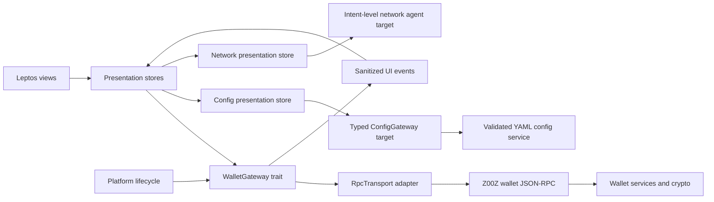

<!-- markdownlint-disable MD013 -->

# Z00Z Wallet UI/UX Specification

| Field | Value |
| --- | --- |
| Status | Product, interaction, configuration, and target-network baseline for prototype validation |
| Version | 0.2.0 |
| Date | 2026-07-19 |
| Targets | Windows, Linux, iOS, Android |
| Prototype | [`demo/index.html`](demo/index.html) |
| Production UI decision | Tauri 2 shell + Leptos 0.8 CSR view layer |
| Backend boundary | Typed UI gateway over the existing JSON-RPC transport |

## 🎯 Purpose

This document is the implementation contract for the Z00Z Wallet user interface. It fixes the product model, information architecture, screen behavior, interaction flows, content, visual system, security behavior, responsive rules, and RPC ownership before production implementation begins.

The accompanying HTML prototype is the executable design reference. It demonstrates contextual tabs, responsive layout, lock state, object-family separation, payment, receiving, claims, permissions, activity, layered network status, policy profiles, UI/YAML configuration, theme switching, and representative error/success states. It does not perform cryptography or connect to a live wallet.

Version 0.2 corrects three conceptual drifts found during verification: Reticulum is the resilient carrier under OnionNet rather than a competing privacy route; a budget is one useful recipe for a `Right`, not the whole right model; and UI/YAML synchronization plus compliance-profile loading are target capabilities that are not exposed by the current RPC surface.

The intended result is a wallet implementer who translates defined behavior into Rust rather than inventing product behavior inside view code.

## 🧭 Authority and source precedence

When sources disagree, use this order:

1. Current wallet code and RPC types in `crates/z00z_wallets/src`.
2. Z00Z protocol and design requirements in `.github/requirements`.
3. Product direction in `chat.md`.
4. This specification after it is reviewed and accepted.
5. Existing phase sketches and `egui_views` as inventories only.

The old ASCII screens and egui views are not visual contracts. They contain useful capability inventory, but also expose development terminology, fragment related work into too many tabs, and include assumptions that conflict with current code. In particular, recovery uses the current 24-word English mnemonic contract, not the older 12/24-word sketch.

## 💡 Product concept: Quiet Private Object Wallet

Z00Z Wallet is a calm private-action workspace, not a trading terminal and not a protocol explorer.

The interface has two layers:

- **Everyday layer:** assets, recent activity, requests, claims, and permissions expressed as human tasks.
- **Expert layer:** identifiers, package data, receipts, lifecycle events, network diagnostics, and compatibility operations. It is deliberately opt-in.

The home screen answers four questions in this order:

1. How much private money can I use now?
2. Is the wallet safe, private, and synchronized?
3. What can I do next?
4. What still needs my attention or settlement?

The core action language is fixed:

| Product verb | User meaning | Backend concept | MVP placement |
| --- | --- | --- | --- |
| Pay | Send private money | Canonical transaction lane | Primary |
| Claim | Accept or redeem something offered to me | Voucher/object lane | Primary |
| Use | Exercise a granted capability | Right consumption | Secondary; future-ready |
| Delegate | Give a bounded permission | Right delegation | Primary as a safe recipe; **Budget** is one recipe |
| Prove | Show a fact or receipt without exposing more | Receipt/public material | Secondary; future-ready |

The five verbs are the durable ontology. The first release promotes **Pay**, **Claim**, and **Give permission**. **Budget** remains the clearest initial permission recipe. Receive is a necessary counterpart to Pay and appears as a primary quick action.

### 🧬 Object-family mental model

The protocol has three object families. The wallet presents their consequences before their technical names:

| Family | Everyday label | What it means | Balance treatment | Primary UI |
| --- | --- | --- | --- | --- |
| `Asset` | Asset / money | Final-value property the wallet can possess; native cash is the primary spendable projection | Count only verified, spendable cash in Available | Wallet → Assets |
| `Voucher` | Claim / offer | Conditional value that can require acceptance or redemption and can have transfer/refund rules | Never Available until its outcome settles | Wallet → Claims |
| `Right` | Permission | Zero-value authority scoped by action, object/policy/domain, use count, delegation, and attenuation | Never a monetary balance | Wallet → Permissions |

`Asset` and `Voucher` are value-bearing protocol families; only settled spendable assets contribute to the main balance. `Right` is zero-value authority. A voucher card must state its concrete outcome and backing rather than implying every voucher is cash. A right may control spending, use, delegation, proof, or another bounded action; the budget recipe is used only when an amount limit actually exists.

## 🧱 Non-negotiable product principles

1. **Available is not an object total.** Spendable assets use the cash projection. Claims and permissions have separate tabs and never inflate the displayed balance.
2. **Human language first, object family always recoverable.** Normal users see asset, claim, permission, request, receipt, recipient, available, and settling. Expert details show `Asset`, `Voucher`, `Right`, package, policy, and identifiers without creating a separate protocol product.
3. **One intent, one dominant action.** Every flow has one primary button. Destructive or irreversible actions require a separate review step.
4. **Fees are explained, not configured.** The UI states Included, Sponsored, or Deducted. Manual fee controls are not part of the standard flow.
5. **Settlement is honest.** A successful submission is not presented as final settlement.
6. **Safety is the default.** Main network, valid recipient/request, scoped budgets, finite expiry, local lock, and backup reminders are defaults.
7. **Privacy is a state, not decoration.** Connection route and sensitive-display state are visible and understandable.
8. **No speculative finance UI.** No market charts, fiat gain/loss, price tickers, or portfolio performance without an authoritative price service.
9. **Progressive disclosure.** Protocol detail is available for support and verification without occupying everyday screens.
10. **Cross-platform parity, platform-native behavior.** The same task model applies everywhere; window chrome, back behavior, share sheet, biometrics, keyboard, and safe areas follow each OS.
11. **Configuration has one effective truth.** UI controls and YAML are two editors of the same versioned configuration; provenance, validation, conflicts, and restart requirements are visible.
12. **Policy can restrict, never silently expand.** Protocol rules are immutable in the wallet. Organization and user profiles may only narrow allowed behavior; ambiguous or unsupported policy fails closed.
13. **Privacy claims are measurable.** Say what is verified—Onion route, privacy floor, hop count, Reticulum carrier—not “anonymous” or “untraceable.”

## 👥 Users and jobs

| User | Primary job | Interface response |
| --- | --- | --- |
| Everyday holder | Safely pay, receive, and understand available money | Large balance, four quick actions, plain status language |
| Claim recipient | Inspect and accept/redeem an offer | Claim card with issuer, value, expiry, terms summary, review |
| Delegator | Give an app/person bounded authority | Recipe-based permission with scope, action, uses, expiry, review, attenuation, revoke |
| Managed user | Operate under organization or safety restrictions | Signed profile status, effective restrictions, source, version, and a plain “Why blocked?” explanation |
| Network-sensitive user | Prefer privacy, resilience, or controlled fallback | Mode-level choices with concrete OnionNet and Reticulum health, not raw ports |
| Power user | Inspect receipts, identifiers, networks, and packages | Expert details drawer, copy/export actions, diagnostics |
| Recovering user | Restore access without ambiguity | Guided 24-word recovery, validation, clear destructive warnings |

## 🧰 Technology decision

### 🏗️ Production stack

Use:

- **Tauri 2.11+** as the cross-platform application shell for Windows, Linux, iOS, and Android.
- **Leptos 0.8 stable, CSR mode** as the Rust/WASM declarative view layer.
- **CSS custom properties and component styles** for the design system and responsive behavior.
- **Inline SVG icon components** from a single curated outline icon set; no emoji or icon fonts.
- **Existing `RpcTransport` and typed RPC DTOs** behind a UI-owned `WalletGateway` trait.

Tauri is the host, lifecycle, window, secure storage integration, platform bridge, and packaging layer. It is not the wallet domain API. Leptos owns views, local interaction state, routing, focus management, and presentation models.

Official references:

- [Tauri platform support](https://tauri.app/)
- [Tauri frontend configuration](https://v2.tauri.app/start/frontend/)
- [Tauri and Leptos integration](https://v2.tauri.app/start/frontend/leptos/)
- [Tauri content security policy](https://v2.tauri.app/security/csp/)
- [Leptos book](https://book.leptos.dev/)

### ⚖️ Decision matrix

Scores use 1 (poor/high risk) to 5 (strong/low risk). Mobile UX, accessibility, and transfer from the HTML prototype have the highest weight.

| Option | Four target OSes | Responsive/mobile UX | Accessibility | Rust fit | Prototype transfer | Licensing/operational risk | Weighted conclusion |
| --- | ---: | ---: | ---: | ---: | ---: | ---: | --- |
| Tauri 2 + Leptos | 5 | 5 | 4 | 5 | 5 | 5 | **Selected** |
| Slint | 4 | 4 | 4 | 5 | 2 | 3 | Strong native alternative; licensing and HTML translation add risk |
| Dioxus | 5 | 4 | 3 | 5 | 4 | 4 | Viable, but mobile native-widget/animation story is less aligned |
| eframe/egui | 4 | 2 | 2 | 5 | 1 | 3 | Keep only for internal/debug tooling during migration |
| Flutter host + Rust core | 5 | 5 | 5 | 2 | 4 | 4 | Good UX, but creates a second primary language/runtime |

Why the existing egui direction is not selected for the product UI:

- The current views are mostly functional sketches and technical tab inventory.
- Immediate-mode layout is efficient for tools but works against DOM-grade responsive composition and the target mobile information architecture.
- Platform accessibility support and native-feeling mobile behavior are weaker than the selected webview route.
- Current dependency is `eframe 0.28`; upgrading and redesigning it would still not solve prototype-to-production transfer.

Do not delete the egui application during initial implementation. Keep it as a diagnostic client until the new gateway and core flows reach parity.

### 🧪 Design and prototype tooling

The primary design proof is a **self-contained responsive HTML/CSS/JavaScript prototype** in `demo/`.

Reasons:

- It proves flow, focus, resizing, mobile navigation, validation, and state transitions.
- Its CSS tokens and layout model transfer directly to Leptos.
- It runs locally without an account, plugin, CDN, or build step.
- It can become the basis for screenshot regression tests.

Figma is optional and downstream. Use it after the product flows stabilize for component-library publishing, annotations, asset export, and stakeholder comments. Figma must mirror this specification and prototype; it must not become an independent behavior source.

### 🧠 Alternatives and resolved pitfalls

| Decision | Alternative considered | Why this contract wins | Failure to guard against |
| --- | --- | --- | --- |
| Workspaces + contextual tabs | One global tab for every RPC capability | Stable four-item navigation with family/settings depth where it belongs | Tab explosion and empty speculative pages |
| Wallet tabs Assets/Claims/Permissions | A technical “Object explorer” as the default | Preserves the protocol families without requiring protocol vocabulary | Mixing conditional or zero-value objects into Available |
| Permission as durable label | Call every `Right` a Budget | Covers action/domain/object-scoped authority correctly | Showing a fake monetary limit for a non-monetary right |
| OnionNet overlay + Reticulum carrier | Tor/OnionNet/Reticulum as equivalent route toggles | Matches Phase 080 layering and enables measurable privacy status | False privacy claims and unsafe fallback |
| Typed config service + lossless YAML | Separate UI preferences database or full YAML overwrite | One effective truth, preserves advanced keys/comments | Silent divergence, lost settings, race overwrites |
| Restriction-profile intersection | Arbitrary “last profile wins” merging | No lower layer can expand protocol/managed authority | A local toggle bypassing managed controls |
| Self-contained HTML first | Figma-only clickable frames | Validates responsive behavior, focus, errors, and synchronization states | Beautiful screens with undefined state transitions |
| Tauri + Leptos | Continue egui sketches | Four-OS shell plus DOM-grade responsive/accessibility behavior | Desktop tool UI forced onto mobile |

Concept-drift gate for every new screen:

1. Which user intent or object-family outcome does it serve?
2. Is the displayed value final, conditional, settling, zero-value authority, or quarantined?
3. Which current RPC/capability supplies each claim, and is it live, stubbed, or target-only?
4. Could the action broaden authority, weaken privacy, overwrite config, or imply compliance? If yes, block or add explicit review/attenuation.
5. Can a common user finish without identifiers, YAML, route internals, or policy encoding?

## 🔌 Frontend isolation and architecture



### 🛡️ Boundary rules

- Views never import wallet service implementations, key managers, databases, or crypto primitives.
- Views never retain seeds, passwords, session tokens, raw transaction packages, or private material in persistent browser storage.
- `WalletGateway` returns presentation-safe typed results and structured errors.
- Session tokens live only in the gateway/runtime memory and are redacted from logs.
- Desktop may use an in-process/local transport; separated processes may use authenticated local IPC; browser-like targets may use WebSocket/HTTP. The view API is identical.
- Tauri commands must be a thin transport bridge, not a parallel business API.
- Every mutating request carries an idempotency key where the backend supports it.
- Lifecycle events (`backgrounded`, `foregrounded`, `suspended`, `screen_locked`) are forwarded immediately. Background, suspend, and screen lock revoke sensitive UI state and trigger the backend lifecycle contract.
- Views request intent-level network modes and status. They never sign arbitrary bytes, derive network identities from the wallet seed, or configure raw Reticulum/OnionNet internals directly.
- Configuration reads and writes cross a typed config service. The UI never rewrites YAML text from browser state or treats a successful file write as a successfully applied configuration.

### 🧩 Suggested Rust module shape

```text
z00z_wallet_ui/
  src/
    app.rs
    route.rs
    gateway/
      mod.rs              # WalletGateway trait
      rpc_gateway.rs      # RpcTransport implementation
      mock_gateway.rs     # deterministic UI tests/story states
    model/                # presentation models only
    store/                # session, wallet, objects, activity, config, network
    view/
      shell/
      home/
      wallet/             # Assets, Claims, Permissions tabs
      activity/
      settings/           # General, Security, Network, Policies, Backups, Appearance, Advanced
      onboarding/
    component/
    accessibility/
    platform/
  styles/
    tokens.css
    base.css
    components.css
    responsive.css
```

`crates/z00z_wallets` remains the domain/backend owner. A separate UI crate prevents dependency leakage.

## 🗺️ Information architecture

### 🖥️ Desktop and tablet landscape

Persistent left rail:

1. Home
2. Wallet
3. Activity
4. Settings

The rail footer contains privacy route, network, lock, and build channel. The header contains wallet switcher, sync state, balance-visibility toggle, notifications, and account menu.

The rail selects a workspace. A compact horizontal contextual tab bar then selects the content inside that workspace, matching the information rhythm of `z00z.io` without copying its documentation layout. Tabs change the main panel; they do not open floating windows or multiply global navigation.

- Wallet tabs: **Assets**, **Claims**, **Permissions**, and capability-gated **Quarantine**.
- Settings tabs: **General**, **Security**, **Network**, **Policies**, **Backups**, **Appearance**, **Advanced**.
- Network tabs: **Overview**, **Reticulum**, **OnionNet**, **Carriers**, **Diagnostics**.

### 📱 Mobile and narrow tablet

Bottom navigation contains four destinations:

1. Home
2. Wallet
3. Activity
4. Settings

Quick actions are horizontally stable two-by-two cards, not a horizontally scrolling carousel. Contextual tabs scroll as one labelled tab strip when they cannot fit, retain the active item in view, and never turn into unlabeled icons. Native back closes the most recent sheet/dialog before navigating away, then returns to the preceding tab/workspace.

### 🧭 Route contract

| Route | Screen | Navigation label | Authentication |
| --- | --- | --- | --- |
| `/welcome` | Wallet list and first-run entry | — | No |
| `/create` | Create wallet | — | No |
| `/recover` | Recover wallet | — | No |
| `/unlock/:wallet_id` | Unlock | — | No |
| `/home` | Overview | Home | Yes |
| `/wallet/assets` | Spendable asset projection | Wallet → Assets | Yes |
| `/wallet/claims` | Voucher outcomes and offers | Wallet → Claims | Yes |
| `/wallet/claims/:id` | Claim details | — | Yes |
| `/wallet/permissions` | Rights and safe permission recipes | Wallet → Permissions | Yes |
| `/wallet/permissions/:id` | Permission details | — | Yes |
| `/wallet/quarantine` | Unsupported/invalid objects | Wallet → Quarantine | Yes + capability |
| `/activity` | Unified activity | Activity | Yes |
| `/activity/:tx_id` | Activity details and receipt | — | Yes |
| `/settings` | Settings index | Settings | Yes |
| `/settings/security` | Lock, seed, key rotation | Security | Yes + re-auth for secrets |
| `/settings/backup` | Backups | Backups | Yes + re-auth for restore |
| `/settings/network` | Route and chain | Network | Yes |
| `/settings/network/reticulum` | Resilient carrier and interfaces | Reticulum | Yes |
| `/settings/network/onionnet` | Privacy overlay and route health | OnionNet | Yes |
| `/settings/policies` | Safety/compliance profiles | Policies | Yes + re-auth to apply |
| `/settings/appearance` | Theme and accessibility preferences | Appearance | Yes |
| `/settings/advanced` | Expert and diagnostics | Advanced | Yes + opt-in |

## 🖼️ Global shell

### 🧷 Header

Desktop order:

1. Page title and optional one-line context.
2. Sync/privacy health pill. Activating opens the connection panel.
3. Wallet switcher showing wallet name and abbreviated fingerprint.
4. Hide/show sensitive values.
5. Notifications.
6. Account menu.

Mobile order:

1. Z00Z mark or contextual back button.
2. Page title.
3. Compact sync/privacy dot with accessible text.
4. Account button.

Never place the full receiver ID, seed, session state, chain height, or route diagnostics in the default header.

### 🔒 Lock surface

The lock surface replaces all wallet content; it is not a translucent overlay that leaves sensitive values in the accessibility tree.

It contains:

- Selected wallet name and abbreviated fingerprint.
- Password field with show/hide control.
- Unlock button with in-button progress.
- Biometric action only when platform capability and policy allow it.
- Switch wallet.
- Recovery entry.
- Rate-limit feedback that does not reveal whether a guessed wallet/password pair was partially valid.

After screen lock, suspend, or configured inactivity, clear sensitive view stores, close dialogs, remove copied-sensitive-state affordances, and call `wallet.lifecycle.on_event` plus session lock as appropriate.

## 🏠 Home screen

### 💰 Balance hero

The balance hero shows:

- Label: **Available privately**.
- Amount in the selected native/cash asset.
- Optional secondary fiat estimate only after an authoritative service is approved; absent in MVP.
- Pending line: incoming/outgoing amount that is not settled.
- Hide/reveal button; hidden state persists only as a non-sensitive preference.

Do not sum claims, vouchers, permissions, delegated limits, quarantined objects, or incompatible assets into this number.

### ⚡ Quick actions

Fixed order:

1. Pay
2. Receive
3. Claim
4. Give permission

The fourth card may summarize the initial **Budget** recipe in its helper, but its durable destination is Permissions.

Each action is a button with icon, verb, and six-word maximum helper. No action is represented only by a colored icon.

### 📥 Attention queue

Shows at most three items, ordered by required user action and then age:

- Claim expiring soon.
- Permission approaching use limit or expiry.
- Payment requiring retry/reconciliation.
- Backup overdue.
- Wallet still scanning.

Empty state: **You're all caught up.**

### 🕘 Recent activity

Show the five most recent records with counterparty/intent, amount or object label, relative time, and user status. A single **View all** action opens Activity.

## 💵 Wallet → Assets

This screen is the cash-only projection of `wallet.asset.*` plus canonical transaction state.

### 🧾 Asset card/list fields

| Field | Default | Notes |
| --- | --- | --- |
| Asset name and symbol | Visible | Verified label first; identifier in details |
| Available | Visible | Spendable amount only |
| Settling | Visible when non-zero | Separate incoming/outgoing semantics |
| Verification state | Visible | Trusted, unverified, or local |
| Pay / Receive | Visible | Context-preserving actions |
| Raw asset ID | Hidden | Expert details only |

Desktop uses a compact list with cards for the selected asset. Mobile uses stacked cards. Never force a horizontally scrollable table.

### 🚧 Compatibility operations

Merge, split, stake, unstake, and swap RPCs exist, but code marks several asset operations as compatibility/noncanonical. They must not be top-level consumer navigation.

Rules:

- Keep them disabled in production until the canonical spend/settlement authority is confirmed end to end.
- If enabled for testing, place them under Advanced → Experimental recipes.
- Label the environment and risk; never imply final settlement from a compatibility response.

## 🪄 Wallet → Claims and Permissions

The Wallet workspace gives each object family a stable tab. This keeps the everyday model simple while making the three-family protocol structure discoverable. Each tab header shows the everyday label and, in expert mode only, its protocol family.

### 🎟️ Claims

Claims are vouchers with a conditional outcome that may require acceptance or redemption. Cards contain:

- Human label.
- Issuer/counterparty and verification state.
- Outcome type, backing, and what the user receives if the claim succeeds.
- Expiry or no-expiry statement.
- One-line terms summary.
- State: Ready to claim, Claimed · settling, Settled, Expired, Rejected, Needs attention.
- Primary action based on state.
- Transfer, partial-redemption, refund, beneficiary, and required-right restrictions when the policy enables them.

The normal card never shows voucher ID or package bytes.

### 🔑 Permissions

A permission is the human-facing projection of a `Right`. Cards contain:

- Holder/delegate, issuer, and verification state.
- Allowed actions.
- Scope: object family, specific object, policy, or domain.
- Uses remaining when limited.
- Delegation allowed/forbidden and attenuation-only state.
- Expiry.
- State: Active, Paused, Exhausted, Expired, Revoked, Challenged, Needs attention.
- Revoke action, always confirmed.

Initial safe recipes:

1. **Service allowance** — provider, total limit, expiry.
2. **Recurring allowance** — per-period limit, total cap, expiry.
3. **Single-use permission** — exact maximum, one use, short expiry.
4. **Scoped action** — one action on one object/policy/domain, no monetary implication.

Only amount-bearing recipes use the word **Budget**. A generic right is always **Permission**. No raw policy builder appears in the normal interface, and a delegated permission can never be broader than the authority held by the delegator.

### 🧯 Quarantine

Unknown policies, invalid signatures, unsupported schema versions, malformed packages, and objects the wallet cannot safely project go to Quarantine. They never disappear and never enter Available. The card states the reason, source, received time, safe actions, and a sanitized support code. Importing or viewing an object is not the same as trusting or applying it.

### 🧪 Use and Prove

Reserve component and routing capacity for Use and Prove. Do not ship empty navigation items. Expose them only when backend flows and content have passed acceptance tests.

## 🧾 Activity screen

Activity unifies asset transactions, claims, permission events, policy/config changes, backup/security events that affect user trust, and reconciliation alerts.

Filters:

- All
- Assets
- Claims
- Permissions
- Policy & settings
- Needs attention

Search matches user-visible labels, counterparty, abbreviated ID, and memo. It must not load or index secrets.

### 🚦 User status model

| Internal lifecycle | User status | Meaning shown to user |
| --- | --- | --- |
| Created, Imported | Ready | Prepared but not submitted |
| Exported | Ready elsewhere | Package exported; another device may continue |
| Submitted, Admitted | Sending / Receiving | Accepted for processing, not settled |
| Confirmed | Settled | Final state confirmed by current authority |
| Failed | Failed | No successful completion; retry may be possible |
| Cancelled | Cancelled | User/system stopped it before settlement |
| Conflicted, AlreadySpent | Needs attention | State conflicts; reconciliation or support is required |

The detail timeline may show technical lifecycle names under **Technical details**, but the primary badge uses the user status.

### 🔍 Activity details

Default summary:

- What happened.
- Amount or object outcome.
- Counterparty/request label.
- Current status with plain explanation.
- Created/updated/settled timestamps.
- Fee treatment: Included, Sponsored, or Deducted.
- Receipt action when available.

Expert disclosure:

- Transaction/object identifier.
- Chain and network.
- Lifecycle timeline.
- Receipt hash/public proof.
- Exported package metadata.
- Reconcile action for eligible states.

## 🔁 Core flows

### 🌱 First run, create, and recover

#### Create wallet

1. Welcome: **Create wallet** primary, **Recover wallet** secondary.
2. Name wallet; select password and confirm it.
3. Explain that the wallet is private and local; show network as Main by default.
4. Create through `app.wallet.create_wallet`.
5. Show the 24-word recovery phrase once, after explicit privacy confirmation.
6. Require a short verification challenge using selected word positions.
7. Confirm backup responsibility, then enter Home.

Seed rules:

- Never copy automatically.
- Copy is behind a warning, times out visually, and is unavailable where platform policy forbids it.
- Block OS screenshots/screen recording where supported; state clearly that prevention is best-effort.
- Remove seed content from the DOM/accessibility tree immediately after leaving the step.
- Never log, persist, or include words in crash reports.

#### Recover wallet

1. Choose Recover wallet.
2. Enter exactly 24 English words with indexed paste-aware inputs.
3. Validate locally without sending telemetry.
4. Enter the phrase again as required by the live recovery contract, or use the reviewed challenge mechanism only after backend contract changes.
5. Set wallet name/password and select network/chain only when importing a known non-main wallet.
6. Recover with `app.wallet.recover_from_seed`.
7. Show scanning state with useful progress and allow safe background continuation.

Do not offer development-only no-lock modes.

### 💸 Pay

1. Open Pay from Home or an asset card.
2. Recipient step: scan/paste payment request or receiver card. Validate before moving on.
3. Amount step: choose cash asset, amount, optional memo. Show available amount.
4. Review step: recipient label/fingerprint, amount, fee treatment, privacy route, and expected state.
5. Authenticate again only when policy/risk requires it.
6. Submit exactly once with an idempotency key through `wallet.tx.send_transaction` or build/verify/broadcast when an offline/package flow is selected.
7. Show **Sent · settling**, not Settled.
8. Add to Activity and update via pending/history/reconciliation.

Validation:

- Amount must be positive and no greater than spendable balance after deducted fee.
- Recipient/request must pass the corresponding key validation RPC.
- Main/test/dev mismatch blocks submission and explains how to resolve it.
- Button stays disabled while submitting; closing the sheet does not create a second send.
- Ambiguous timeout produces **Checking result**, calls history/pending/reconcile, and never encourages blind retry.

### 📲 Receive

1. Open Receive.
2. Choose cash asset and optional requested amount/memo/expiry.
3. Derive/select a receiver and create a payment request with `wallet.key.*`.
4. Display QR, human label, abbreviated receiver, and share/copy actions.
5. State what the payer will see and when the request expires.
6. Incoming result appears as **Receiving · settling**, then **Settled** after confirmation.

The full receiver value is selectable only in a deliberate details region. Copy feedback names exactly what was copied.

### 🎟️ Claim

1. Open a claim from attention queue, Actions, QR/deep link, or imported package.
2. Validate and preview using `wallet.object.preview_package`.
3. Show issuer, outcome, expiry, requirements, and verification state.
4. Primary button states the action: **Accept claim** or **Redeem now**.
5. Review any money movement or external effect.
6. Call the corresponding accept/redeem operation.
7. Show **Claimed · settling** until authoritative settlement is observed.

Reject and refund are secondary/destructive actions with explicit consequences.

### 🧰 Create budget

1. Choose a recipe.
2. Select delegate/app from a validated request or known identity.
3. Set asset, maximum amount, purpose/provider scope, recurrence if allowed, and expiry.
4. Preview human rules first, with protocol package under expert disclosure.
5. Review: **Can spend**, **Cannot spend**, **Ends**, and **You can revoke**.
6. Authenticate and call `wallet.object.delegate_right` through the gateway.
7. Show Active only after the backend confirms the delegation state; otherwise **Creating · settling**.

Revocation:

1. Open budget detail.
2. Choose Revoke.
3. Explain whether already-authorized/in-flight use can still settle.
4. Confirm with budget name, then call `wallet.object.revoke_right`.
5. Show Revoking until confirmed.

### 🧾 Backup and restore

Backup lives in Settings → Backups and surfaces a reminder on Home when overdue.

- Create: destination summary → re-auth → progress → integrity result.
- List: date, target label, size, compatibility/version, integrity status.
- Restore: choose backup → validate → explain replacement/merge behavior → type wallet name → re-auth → restore → mandatory integrity and scan status.
- Configuration: schedule/target only when supported by platform; never imply cloud upload without an explicit configured provider.

Use `wallet.backup.create_backup`, `list_backups`, `restore_backup`, and `configure_backup`.

## ⚙️ Settings

Settings is a tabbed workspace, not a long miscellaneous list. The selected tab fills the main panel. Changes show **Saved**, **Applying**, **Restart required**, **Managed**, or **Invalid** at field and page level. Every value can expose its source: Default, YAML file, UI, Environment, or Managed profile.

### 🧭 General

- Wallet name, language/number format, default display asset, notification preferences, and safe startup behavior.
- A compact **Configuration status** card shows the active file, schema version, effective revision, last valid load, external-change status, and restart requirement.
- Normal users see only validated common controls. Advanced fields remain available in YAML and Advanced → Configuration.

### 🔐 Security

- Lock now.
- Auto-lock duration.
- Lock on screen lock/background according to platform policy.
- Biometrics toggle when available.
- Show recovery phrase, requiring re-auth and privacy confirmation.
- Rotate master key, requiring explanation, re-auth, progress, and backup reminder.
- Sensitive-value visibility preference.

### 🌐 Network and privacy

The target network model follows Phase 080:

```text
Wallet intent
  → OnionNet privacy overlay (route, membership, replay policy, fixed geometry)
    → carrier adapter (Reticulum primary; QUIC/TLS or Tor optional)
      → ingress / settlement service
```

Reticulum is the resilient delivery fabric and path/interface abstraction. OnionNet is the privacy overlay above it. They are not peer choices and OnionNet is not implemented as a Reticulum fork or plugin. The initial production direction is OnionNet over Reticulum, with a desktop `z00z-netd` sidecar and a mobile embedded Reticulum client. Reticulum identity must be independent of the wallet seed.

Default Overview surface:

- Mode: Auto, Private, Resilient, or Direct.
- Privacy: Onion route verified/unverified, privacy floor, hop count, and epoch.
- Carrier: Reticulum, QUIC/TLS, Tor, or unavailable; active interface is summarized without leaking unnecessary detail.
- Chain: Main, Test, Dev.
- Local scan: current, progress, and last successful sync.

Mode behavior:

| Mode | Allowed behavior | User promise |
| --- | --- | --- |
| Auto | Prefer OnionNet over Reticulum; try allowed private carriers; resilient fallback only when policy permits | Best available private path, with explicit degradation |
| Private | OnionNet and configured privacy floor required; no direct fallback | Action blocks rather than silently weakening privacy |
| Resilient | Reticulum mesh is allowed; higher latency and underlay diversity may be unverified | Delivery prioritized; privacy limitations remain visible |
| Direct | Explicit test/emergency path with metadata warning and confirmation | No privacy-overlay claim |

Network contextual tabs:

- **Overview:** effective mode, privacy result, carrier, chain, scan, and one-line degradation reason.
- **Reticulum:** service state, interfaces, mesh/bridge state, independent identity fingerprint, resource use, and restart requirement. Common UI controls are mode and allowed interface classes; raw interface config is YAML/Advanced.
- **OnionNet:** route status, privacy floor, route age/epoch, hop count, replay/membership health, and rebuild action. No “anonymous” badge.
- **Carriers:** priority and allow/deny for Reticulum, QUIC/TLS, and optional Tor compatibility. Changing priority previews fallback consequences.
- **Diagnostics:** sanitized state transitions, test connection, export support bundle, and capability/backend status.

Rules:

- Main uses neutral/gold environment treatment.
- Test uses persistent blue **TEST** label.
- Dev uses persistent amber **DEV** label.
- Switching away from Main requires confirmation and names the consequence.
- Privacy overlay, carrier, and chain are three separate concepts. Never call Tor or Reticulum a chain, and never present Reticulum as the privacy guarantee.
- Raw node/port/height/log controls are Advanced only.
- If the active backend only exposes the current `switch_to_onionet` / `switch_to_tor` stubs, the UI shows **Target capability unavailable in this build**. It must not fabricate connected route properties.

### 🛡️ Policies

The common-language label is **Safety & policy profiles**. Managed/advanced screens may say **Compliance profile**, but the wallet never claims that a profile alone proves legal or regulatory compliance.

Four non-bypassable layers determine effective behavior:

1. Protocol/consensus policies—immutable in the wallet, including the fixed native-cash policy.
2. Signed organization profile—may add restrictions.
3. Wallet-local user safety profile—may add stricter restrictions.
4. Per-action rule—may attenuate the effective result for one action, never broaden it.

The effective result is the intersection of allowed behavior. An ambiguous, unsupported, expired, invalidly signed, or conflicting rule fails closed. Every blocked action links to **Why this is blocked**, listing the controlling layer, rule, source, and safe remediation.

Profile card fields:

- Name, status, source, signer/issuer, version, schema, fingerprint.
- Scope: wallet, asset, recipient/domain, object family, action, network, schedule.
- Restrictions: transaction/daily limit, assets, recipients, confirmation, time window, required rights/signatures/attestations, network privacy floor.
- Last validated, applied time, expiry, replacement/supersession status.
- Actions: Preview, Verify, Apply, Disable, Export; Apply/Disable requires consequence review and re-auth.

Lifecycle is Draft → Validated → Applied → Superseded/Disabled. Failed validation goes to quarantine and never changes effective behavior. Imported profiles should be signed, versioned, schema-validated, previewed as a diff, and capability-checked before Apply. Jurisdiction-named profiles are not shipped without qualified ownership and release review.

Current wallet-local `PolicyRules` support maximum transaction/daily amounts, allowed assets/recipients, confirmation, and time restrictions. The repository's compliance-profile directory is presently a placeholder and no settings RPC exposes profile persistence. Rich profile loading, signatures, and object-policy integration are therefore target capabilities behind a capability flag.

### 🎨 Appearance

- System, Dark, Light.
- Accent presets: Z00Z Gold, Private Cyan, Neutral, and validated Custom. Brand gold remains the default.
- Text scale, information density, and high-contrast mode.
- Compact mode for desktop lists only; it must not reduce touch targets.
- Reduced motion follows OS and can be made stricter.
- Language and number format when localization ships.
- Custom colors may change brand/decorative tokens only in the common UI. Success, warning, failure, network-environment, focus, and privacy semantics keep protected contrast-safe tokens. Advanced YAML customizations are rejected when required contrast falls below WCAG AA.

### 🔄 UI ↔ YAML configuration contract

UI and YAML are two synchronized editors of one versioned configuration. The UI may expose fewer keys, but it must never maintain a second settings store.


Required behavior:

1. Backend loads embedded defaults, overlays YAML, applies documented environment overrides/managed locks, validates, and publishes an effective typed snapshot with per-field provenance.
2. A common UI control sends a typed path patch with the current revision/hash. It never serializes the whole form over the file.
3. The config service applies the patch to a lossless YAML concrete-syntax tree, preserving unknown keys, comments, and ordering.
4. It validates the complete candidate, writes a same-directory temporary file, flushes, atomically renames, retains last-known-good metadata, increments revision, and emits `config.changed`.
5. External file changes go through the same parse/merge/validate path. Valid changes update open controls. Invalid changes show file, line/column, and issue; the running wallet keeps the last-known-good snapshot.
6. Revision mismatch opens a three-way diff: current file, user's attempted change, and effective result. No last-writer-wins overwrite.
7. Environment/managed overrides remain visible as read-only effective values with their source. The UI must not claim that editing the YAML changed an overridden value.
8. Restart-required fields are staged and labelled; live-safe fields apply only after backend acknowledgement.
9. Secrets never appear in YAML. Configuration stores secure-store/keychain references only.
10. Schema versioning, migrations, export, redacted support bundle, and rollback to last known good are required.

Advanced → Configuration has **Form**, **YAML**, and **Diff** tabs plus Validate, Apply, Reload, Export, and Open file. The YAML editor is optional for normal use and must provide schema-aware completion, inline errors, search, and protected secret paths. External editors remain fully valid.

Target configuration service methods—names to finalize during backend design—are `app.config.get_schema`, `get_snapshot`, `validate_patch`, `apply_patch`, `validate_document`, `apply_document`, `reload`, `rollback`, and a `config.changed` event. These do not exist in the current RPC registry and must not be represented as live in production until implemented.

Example target document (not the current runtime schema):

```yaml
schema_version: 2
wallet:
  settings:
    auto_lock_timeout_seconds: 300
    default_fee: 1000
  appearance:
    theme: system
    accent: z00z-gold
    density: comfortable
  network:
    mode: private
    privacy_overlay: onionnet
    carriers: [reticulum, quic_tls]
    reticulum:
      deployment: auto       # sidecar desktop, embedded mobile
    onionnet:
      privacy_floor: standard
  policy_profiles:
    organization: null       # signed profile reference, never secret material
    user: personal-safe-v1
```

### 🧑‍🔧 Advanced

Off by default. Enabling it requires a plain warning that technical operations can reveal metadata or create unusable packages.

Contains:

- Full identifiers and public material.
- Import/export/verify transaction package.
- Receiver management and labels.
- Reconciliation tools.
- Logs with automatic secret redaction.
- Experimental compatibility recipes behind build/runtime flags.
- Configuration Form/YAML/Diff with provenance, revision, validation, atomic apply, reload, and rollback.
- Protocol/genesis policy files are never editable as wallet compliance configuration.

## 🎨 Visual design system

### 🌗 Design character

The character is **calm, precise, private, and warm**. Avoid cyberpunk neon, glassmorphism, token-trading dashboards, excessive gradients, large empty marketing panels, and sci-fi display fonts.

Use the gold Z00Z coin/wordmark sparingly for identity and authorization. Blue/cyan communicates network/private rails, mint communicates confirmed success, amber communicates attention, and red is reserved for destructive or failed states.

The relationship to `z00z.io` is structural and tonal:

- Compact sticky header/rail rhythm, clear section hierarchy, thin borders, restrained cards, readable prose, and gold primary accent.
- Geist/Open Sans/Inter-compatible typography with strong labels and generous line height; monospace only for identifiers/YAML.
- Site-like section selection becomes workspace tabs inside the wallet's main window.
- The wallet remains dark-first because private desktop/mobile sessions benefit from reduced glare, while the light theme uses the site's neutral corporate surfaces.
- Do not import the site's marketing/documentation density, web links, or browse hierarchy into transactional review screens.

### 🎨 Color tokens

All final pairs must pass WCAG contrast tests in implementation. Initial token contract:

| Token | Dark | Light | Use |
| --- | --- | --- | --- |
| `--bg-canvas` | `#081019` | `#F4F7FA` | App background |
| `--bg-sidebar` | `#0B1520` | `#FFFFFF` | Navigation |
| `--bg-surface` | `#101D29` | `#FFFFFF` | Cards and sheets |
| `--bg-raised` | `#162635` | `#EDF2F6` | Hover/selected/nested |
| `--text-primary` | `#F5F7F8` | `#12202C` | Primary text |
| `--text-secondary` | `#A9B6C2` | `#526272` | Supporting text |
| `--border` | `#263847` | `#D5DEE6` | Dividers |
| `--brand` | `#E3B341` | `#9C6B00` | Primary authorization/action |
| `--brand-strong` | `#F4C95D` | `#704B00` | Hover/active |
| `--rail` | `#32A9E8` | `#006FA8` | Network/private route |
| `--success` | `#4CD29B` | `#087A52` | Settled/healthy |
| `--warning` | `#F3B65B` | `#8A5200` | Pending/attention |
| `--danger` | `#FF6B72` | `#B4232C` | Failure/destructive |
| `--focus` | `#7CCBFF` | `#005FCC` | Keyboard focus ring |

Never encode state by color alone. Pair color with icon and text.

### 🔤 Typography

- UI: `Inter`, `Geist`, system sans fallback. Package locally for production or use system fonts; no remote font request.
- Technical identifiers: `JetBrains Mono`, `IBM Plex Mono`, system monospace fallback.
- Use tabular numerals for balances and timestamps.
- Minimum body: 16 px mobile, 15–16 px desktop.
- Page title: 28/34 desktop, 22/28 mobile.
- Balance: clamp from 34 px mobile to 48 px desktop.
- Avoid all caps except short environment tags such as TEST and DEV.

### 📐 Spacing, shape, elevation

- Base spacing unit: 4 px.
- Common gaps: 8, 12, 16, 24, 32 px.
- Card padding: 20 px desktop, 16 px mobile.
- Control height: 44 px minimum; primary mobile actions 48–52 px.
- Radius: 10 px controls, 14 px cards, 20 px sheets; pills only for status/chips.
- Border: 1 px; primary action may use a subtle inner highlight.
- Shadow: low blur and opacity; distinguish surfaces primarily with tone and border.

### 🧿 Icons and imagery

- 20/24 px outline icons with 1.75–2 px stroke.
- Every unlabeled icon button has an accessible name and tooltip on pointer platforms.
- QR codes retain a quiet zone and high contrast; do not place the logo over data modules.
- No decorative cryptocurrency coins in asset lists.
- No emoji in production controls or status badges.

### 🎞️ Motion

- Interaction feedback: 120–180 ms.
- Sheet/dialog transition: 180–240 ms.
- Progress/skeleton only while actual work is pending.
- Never animate balances counting up.
- Respect `prefers-reduced-motion`; reduce transitions to near-zero and eliminate parallax/pulsing.

## 📏 Responsive behavior

| Width | Shell | Content | Dialog behavior |
| --- | --- | --- | --- |
| 0–599 px | Top bar + bottom nav | One column, 16 px gutters | Bottom sheet; full screen for seed/recovery |
| 600–1023 px | Compact rail or bottom nav by orientation | One or two columns, 24 px gutters | Center dialog or side sheet |
| 1024–1439 px | 248 px left rail | Max 1120 px, adaptive grid | Right sheet up to 520 px |
| 1440+ px | 264 px left rail | Max 1240 px; no uncontrolled stretching | Right sheet up to 560 px |

Additional rules:

- Respect iOS/Android safe-area insets.
- Never rely on hover.
- Software keyboard must not cover the active field or primary action.
- Use numeric/decimal keyboard for amounts and password manager-compatible semantics for passwords.
- Cards become stacked lists; tables do not create page-level horizontal scrolling.
- The longest supported translated labels must fit or wrap without clipping.

## ♿ Accessibility contract

Target WCAG 2.2 AA for all core flows.

- Complete keyboard operation on desktop: logical tab order, visible focus, Escape closes the top modal, arrow keys only inside proper composite widgets.
- On dialog open, focus moves to the heading/first meaningful control; on close, focus returns to the trigger.
- Use semantic headings, navigation landmarks, forms, lists, tables, status regions, and real buttons/links.
- Dynamic submission and settlement updates use non-disruptive live regions.
- Errors are attached to fields, summarized at form start, and never represented by color alone.
- Touch targets are at least 44 × 44 CSS px.
- Text supports 200% zoom without lost content or horizontal page scrolling.
- Sensitive values have explicit labels; screen readers do not announce hidden values.
- QR-only flows always provide copy/share text alternatives.
- Time, amounts, and abbreviations have accessible expanded forms.
- Test Windows with keyboard and a screen reader; test Android TalkBack and iOS VoiceOver before release.

## 🔐 Security and privacy UX

### 🧯 Sensitive information classes

| Class | Examples | UI policy |
| --- | --- | --- |
| Secret | Seed, password, private key, session token | Never persist/log; explicit reveal; clear on lifecycle change |
| Sensitive | Full balance, receiver IDs, memo, counterparties | Hide mode; redact notifications/app switcher where supported |
| Public but linkable | Public material, receipt, tx/object ID | Deliberate copy/export; explain metadata risk |
| Operational | Route, chain, scan state | Visible health summary; details opt-in |

### ✅ Confirmation policy

| Risk | Pattern | Examples |
| --- | --- | --- |
| Low | Immediate with undo where meaningful | Hide balance, dismiss notification |
| Medium | Review screen | Pay, accept claim, create payment request |
| High | Review + re-auth | Create/revoke budget, seed reveal, key rotation, restore |
| Destructive | Consequence text + explicit confirmation | Delete wallet, reject/refund, overwrite on restore |

Do not use generic **Are you sure?**. Name the object and consequence. Never ask the user to type a seed or password into an untrusted external website.

### 🧱 Error model

`WalletGatewayError` maps backend/transport failures to:

- `validation`: correct a field, no retry.
- `authentication`: re-auth or rate-limit wait.
- `authorization`: action is outside permission/scope.
- `network`: offline/route unavailable; safe retry when idempotent.
- `conflict`: refresh/reconcile; never blind retry.
- `not_found`: refresh and explain stale item.
- `backend_busy`: retain input and retry with backoff.
- `integrity`: stop, preserve evidence, direct to recovery/support.
- `unknown`: incident reference, sanitized diagnostics, no internal stack text.

The UI must preserve entered non-secret data after recoverable errors. Error messages must not include raw backend payloads.

## ✍️ Content and terminology

### 🗣️ Language mapping

| Do not lead with | Use instead | Expert detail allowed |
| --- | --- | --- |
| Asset object | Asset name / private money when spendable cash | Asset ID and family |
| Voucher | Claim | Voucher ID/type |
| Right | Permission; Budget only for an amount-limited recipe | Right ID/scope |
| Consume right | Use permission | Operation name |
| Delegate right | Give permission / Create budget | Delegation package |
| Transaction admitted | Sending / Receiving | Admitted event |
| Confirmed transaction | Settled | Confirmed event |
| UTXO/input/output | Money source/result | Technical transaction view |
| Policy | Rules | Policy encoding |
| Fee rate | Fee included/sponsored/deducted | Exact fee in receipt |

### 💬 Canonical microcopy

| Context | Copy |
| --- | --- |
| Balance | Available privately |
| Pending outgoing | Sending · waiting to settle |
| Pending incoming | Receiving · waiting to settle |
| Healthy route | Onion route verified · Reticulum carrier |
| Scanning | Updating your wallet — {progress}% |
| Claim action | Review claim |
| Budget recipe summary | Can use up to {amount} for {purpose} until {date} |
| Generic permission summary | Can {action} within {scope} · {uses/expiry} |
| Policy block | Blocked by {profile}: {plain rule}. Why this is blocked |
| Config source | Effective value from {source} · revision {revision} |
| Pay success | Payment sent. It is waiting to settle. |
| Ambiguous timeout | Checking whether your payment was accepted… |
| No attention | You're all caught up. |
| Empty activity | Your private activity will appear here. |
| Seed warning | Anyone with these 24 words can control this wallet. |

Buttons use verbs: Pay, Review payment, Send payment, Accept claim, Give permission, Create budget, Revoke permission, Validate configuration, Apply profile, Lock now. Avoid OK, Submit, Continue when the action can be named.

## 🔗 RPC traceability

The method names below are current source contracts, not invented frontend endpoints.

| UI surface | RPC methods | Notes |
| --- | --- | --- |
| Wallet list/create/import | `app.wallet.list_wallets`, `app.wallet.create_wallet`, `app.wallet.import_wallet`, `app.wallet.open_wallet_source` | UI never opens paths directly |
| Recover | `app.wallet.recover_from_seed` | Current contract: 24 English words, confirmation required |
| Delete/export | `app.wallet.delete_wallet`, `app.wallet.export_wallet` | High-risk confirmation; export destination via platform bridge |
| Unlock/lock | `wallet.session.unlock_wallet`, `wallet.session.lock_wallet` | Token retained only inside gateway memory |
| Lifecycle | `wallet.lifecycle.on_event` | Forward background/suspend/screen lock |
| Seed reveal | `wallet.session.show_seed_phrase` | Re-auth, rate-limited, ephemeral view |
| Money list/detail | `wallet.asset.list_assets`, `wallet.asset.get_asset_balance`, `wallet.asset.get_asset_details`, `wallet.asset.get_asset_metadata` | Cash-only projection |
| Pay | `wallet.key.validate_payment_request`, `wallet.key.validate_receiver_card`, `wallet.tx.send_transaction` | Canonical online payment path |
| Offline pay | `wallet.tx.build_transaction`, `wallet.tx.verify_transaction_package`, `wallet.tx.broadcast_transaction`, `wallet.tx.export_transaction`, `wallet.tx.import_transaction` | Advanced only |
| Receive | `wallet.key.derive_receiver`, `wallet.key.get_receiver_card`, `wallet.key.create_payment_request` | Share/copy via platform bridge |
| Activity | `wallet.tx.get_transaction_history`, `wallet.tx.list_pending_transactions`, `wallet.tx.get_transaction_details` | Merge into user status model |
| Reconcile/cancel | `wallet.tx.reconcile_transaction`, `wallet.tx.cancel_transaction` | Only when lifecycle permits |
| Fee explanation | `wallet.tx.estimate_transaction_fee` | Display treatment, not tuning |
| Claims list/preview | `wallet.object.list_vouchers`, `wallet.object.list_objects`, `wallet.object.preview_package` | Do not mix with balance |
| Claim actions | `wallet.object.accept_voucher`, `wallet.object.redeem_voucher`, `wallet.object.reject_voucher`, `wallet.object.refund_voucher`, `wallet.object.transfer_voucher` | Action availability is state-driven |
| Permissions list | `wallet.object.list_rights` | Present exact scope/actions/uses; Budget is one recipe |
| Permission create/use/revoke | `wallet.object.delegate_right`, `wallet.object.consume_right`, `wallet.object.revoke_right`, `wallet.object.challenge_right` | High-risk flows, attenuation, and settlement honesty |
| Backups | `wallet.backup.create_backup`, `wallet.backup.list_backups`, `wallet.backup.restore_backup`, `wallet.backup.configure_backup` | Platform destination abstraction |
| Receiver management | `wallet.key.list_receivers`, `wallet.key.label_receiver`, `wallet.key.export_public_material` | Advanced except current receive identity |
| Key rotation | `wallet.key.rotate_master_key` | Security, re-auth, progress |
| Current network switches | `app.network.switch_to_tor`, `app.network.switch_to_onionet` | Methods exist, but current implementation is stubbed; capability-gate and do not infer Reticulum/Onion route health |
| Chain | `app.chain.switch_to_mainnet`, `app.chain.switch_to_testnet`, `app.chain.switch_to_devnet` | Persistent environment labeling |
| Compatibility assets | `wallet.asset.send_asset`, `wallet.asset.receive_asset`, `wallet.asset.merge_assets`, `wallet.asset.split_asset`, `wallet.asset.stake_assets`, `wallet.asset.unstake_assets`, `wallet.asset.swap_assets` | Experimental only; canonical authority remains tx/reconcile |

Current-source boundary notes:

- `WalletService` has in-memory/persistable `policy_rules`, but no current RPC exposes a complete get/set settings contract.
- `wallet_runtime_config.rs` reads embedded YAML plus an optional `Z00Z_WALLET_CONFIG_PATH` overlay and selected environment overrides; it has no UI write, watcher, revision, or hot-reload API.
- Phase 080 defines the target Reticulum/OnionNet architecture; the current network RPC cannot yet supply the detailed target status model.
- Therefore configuration sync, managed profiles, and layered network diagnostics in this specification are explicit implementation requirements, not descriptions of finished backend behavior.

### 🔄 Fetch and synchronization policy

- On unlock: load wallet summary, cash assets/balances, pending transactions, recent history, vouchers, rights, quarantine count, backup status, effective configuration/provenance, network capability/status, chain, and scan status.
- Critical first paint: wallet identity, balance skeleton, privacy/sync state, and quick actions. Secondary action inventories may stream later.
- On foreground: forward lifecycle event, validate session, refresh pending/recent state, then balances and objects.
- While a transaction is pending: subscribe when events exist; otherwise poll with exponential backoff and a capped interval. Stop at terminal state or background.
- On mutation: optimistically show only **Submitting/Creating**, never a settled business result. Replace with authoritative data.
- Cache public/presentation data only in memory by default. Persistent cache requires a separate threat review and encrypted storage design.

## 🧩 Component contract

Required reusable components:

| Component | Variants/states |
| --- | --- |
| `AppShell` | desktop rail, tablet compact rail, mobile bottom nav, locked |
| `WorkspaceTabs` | keyboard roving focus, overflow/active reveal, deep-link, badge, capability-disabled |
| `HealthPill` | healthy, syncing, degraded, offline, wrong environment |
| `NetworkLayerStatus` | OnionNet overlay, Reticulum/carrier, chain, scan; never collapsed into one ambiguous dot |
| `SensitiveAmount` | visible, hidden, loading, unavailable |
| `ActionCard` | default, hover/focus, disabled with reason, attention |
| `AssetCard` | verified/unverified/quarantined, available/settling/non-spendable, selected |
| `StatusBadge` | ready, settling, settled, attention, failed, cancelled |
| `ActivityRow` | asset/claim/permission/policy/config/security, incoming/outgoing/neutral |
| `ClaimCard` | ready, settling, settled, expiring, expired/rejected |
| `PermissionCard` | budget/scoped action/delegated, active, limited, exhausted, expiring, revoked/challenged |
| `PolicyProfileCard` | draft, validating, valid, applied, managed, superseded, invalid/quarantined |
| `ConfigField` | effective value, source, overridden/managed, staged, restart-required, invalid/conflicted |
| `YamlWorkspace` | form, YAML, diff, external change, validation, apply, rollback |
| `ReviewBlock` | label/value rows, warning, expert disclosure |
| `StepFlow` | entry, validation, review, submitting, result |
| `SheetDialog` | right sheet, center dialog, mobile bottom/full-screen |
| `Field` | default, focused, filled, invalid, disabled, loading validation |
| `Toast` | informative, success, warning, error; timed except actionable errors |
| `EmptyState` | first-use, filtered-empty, offline, error |
| `TechnicalDetails` | closed by default, copy-safe rows, redacted secret rows |

Every component documents keyboard behavior, accessible name, loading state, error state, empty state, and responsive behavior before implementation is considered complete.

## 🧪 Prototype contract

The HTML prototype must demonstrate:

1. Desktop rail and mobile bottom navigation with workspace-level contextual tabs.
2. Dark/light appearance and system token structure.
3. Visible/hidden sensitive balances.
4. Lock and mock unlock.
5. Wallet switching, create with one-time 24-word reveal/check, and two-entry recovery with scan result.
6. Home, Wallet (Assets/Claims/Permissions), Activity, and Settings workspaces.
7. Pay flow through entry, review, submission, and settling result.
8. Receive request creation and copy feedback.
9. Claim review and settling result.
10. Permission recipes including Budget, scope/action/use limits, review, creation, and active result.
11. Activity filtering and details.
12. Layered OnionNet/Reticulum/carrier status, modes, capability disclaimer, and TEST/DEV treatment.
13. Policy-profile preview with immutable protocol layer, signed managed layer, local restrictions, and “Why blocked?” explanation.
14. UI/YAML configuration status, provenance, valid external update, invalid-file last-known-good behavior, conflict/diff, and restart-required state.
15. System/dark/light themes, accent presets, protected semantic colors, keyboard focus, dialog focus return, reduced motion, and 44 px targets.

The demo uses fabricated values and must display **Interactive concept · no real funds**. It must not import production wallet code or give the impression that it signs transactions.

## ✅ Acceptance criteria

### 🧭 Product acceptance

- A new user can identify Available, Pay, Receive, Claim, and Permissions within five seconds.
- No standard screen requires understanding voucher, right, package, UTXO, fee rate, Reticulum interface syntax, Tor port, or chain height.
- Claims and permissions cannot be mistaken for spendable balance; non-cash assets cannot silently enter Available.
- A user can explain that OnionNet provides the privacy route and Reticulum carries it after viewing Network Overview.
- A managed user can identify which profile blocked an action and cannot weaken it through UI or YAML.
- The same common setting edited in UI or YAML converges to the same effective value and exposes overrides/conflicts.
- Every submitted action differentiates acceptance from settlement.
- Main, Test, and Dev can never be visually confused during a payment review.

### 🧑‍💻 Implementation acceptance

- UI crate has no direct dependency on wallet database, key manager, or cryptographic implementation modules.
- All domain calls cross `WalletGateway`; method-to-screen traceability is testable.
- No secret reaches persistent web storage, logs, analytics, panic payloads, or screenshot fixtures.
- Core flows have deterministic mock-gateway tests and live transport contract tests.
- Responsive screenshots exist at 390 × 844, 768 × 1024, 1280 × 800, and 1920 × 1080.
- Keyboard-only Pay, Claim, Permission, policy profile, configuration, lock/unlock, and settings flows pass.
- Config tests cover comment/unknown-key preservation, invalid YAML, external edits, revision conflict, atomic write failure, last-known-good rollback, environment provenance, migration, and secret rejection.
- Network tests cover no fabricated privacy health, Private-mode no-fallback, resilient degradation copy, independent Reticulum identity, and chain/carrier/overlay separation.
- WCAG 2.2 AA automated checks pass and manual screen-reader tests cover critical flows.
- No page-level horizontal scroll exists at 320 CSS px.
- Destructive flows name the consequence and require the correct risk-level confirmation.

### 🔍 Design QA checklist

- Use tokens only; no isolated hard-coded component colors.
- One primary action per panel.
- Icons are SVG and have accessible names where unlabeled.
- Loading buttons disable repeated activation and retain their label context.
- Empty, loading, error, offline, locked, and permission-denied states are designed.
- Long IDs are truncated visually but copied in full.
- Date/amount localization and long text do not break layout.
- Light and dark themes preserve semantic contrast.
- Reduced motion and high text zoom remain usable.
- Contextual tabs have correct `tablist`/`tab`/`tabpanel` semantics, arrow-key navigation, active focus, deep links, and no hidden focus targets.
- User-selected accent/theme combinations preserve protected status colors and 4.5:1 text contrast.

## 🚫 Explicit non-goals for this phase

- Implementing cryptography, wallet persistence, or protocol settlement in the prototype.
- A market-data portfolio, fiat on-ramp, NFT gallery, exchange, or social feed.
- A raw protocol policy language editor for normal users. Advanced wallet YAML is allowed, schema-validated, and is not a protocol/genesis policy editor.
- Promoting compatibility swap/stake/merge/split operations to supported consumer flows.
- Defining a remote custody model.
- Treating Figma as a second behavior specification.
- Pixel-copying Zano, Guarda, Atomic, or the existing egui sketch.

## 🛣️ Delivery sequence

1. Validate this specification and HTML prototype with product/security stakeholders.
2. Run seven task-based usability sessions: unlock, Pay, Receive, Claim, create/revoke Permission, apply/explain a policy profile, and change the same setting through UI then YAML.
3. Freeze language, navigation, status mapping, and responsive behavior.
4. Create the UI crate, tokens, shell, mock gateway, and component story states.
5. Implement onboarding/session and Wallet/Activity reads.
6. Implement Pay/Receive with idempotency and reconciliation.
7. Implement Claims/Permissions behind capability flags.
8. Design and implement the typed configuration service, YAML migration/write/watch contract, and settings RPC before enabling configuration controls.
9. Implement Reticulum/OnionNet intent/status API from Phase 080 before enabling detailed network health.
10. Implement signed policy profiles and effective-rule explanation behind capability flags.
11. Integrate platform lifecycle, secure display, biometrics, share, and file bridges per OS.
12. Run accessibility, security, config-failure, and cross-platform release gates.
13. Retire egui product views only after functional parity and diagnostic replacement.

## 📚 Reviewed local inputs

- `.planning/phases/110-Wallet-UX-UI/old-sources/chat.md`
- `.planning/phases/110-Wallet-UX-UI/old-sources/ascii-mockups/`
- `.planning/phases/110-Wallet-UX-UI/old-sources/z00z_wallet_sketch_1920x1080.png`
- `.planning/phases/110-Wallet-UX-UI/old-sources/crypto_wallet_figma_sketch_1920x1080 - orig.svg`
- `crates/z00z_wallets/src/egui_views/`
- `crates/z00z_wallets/src/rpc/`
- `crates/z00z_wallets/src/services/`
- `crates/z00z_wallets/src/config/wallet_config.yaml`
- `crates/z00z_wallets/src/services/wallet_runtime_config.rs`
- `crates/z00z_protocol/src/object.rs` and policy descriptors/validators in `crates/z00z_protocol/src/`
- `.planning/phases/080-Network-Reticulum/080-Reticulum-OnionNet.md`
- `.github/requirements/Z00Z_DESIGN_FOUNDATION.md`
- Current public Z00Z documentation surface at `https://www.z00z.io`
