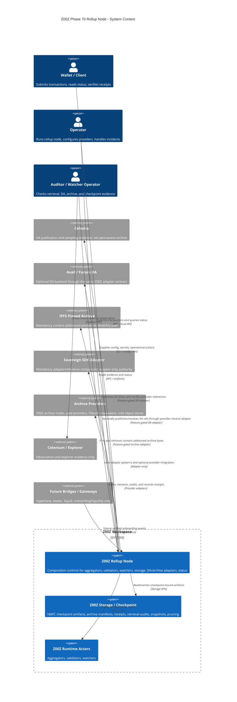
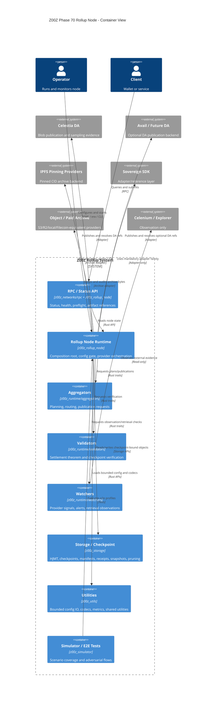
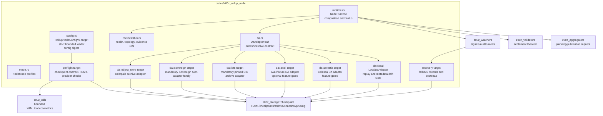
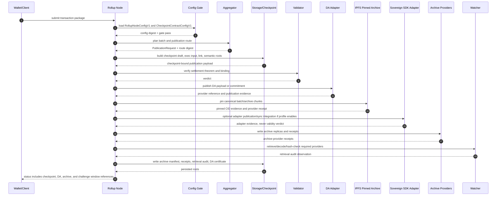
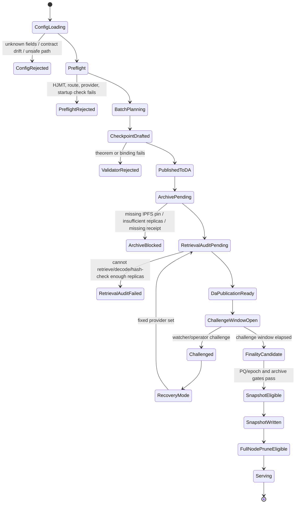
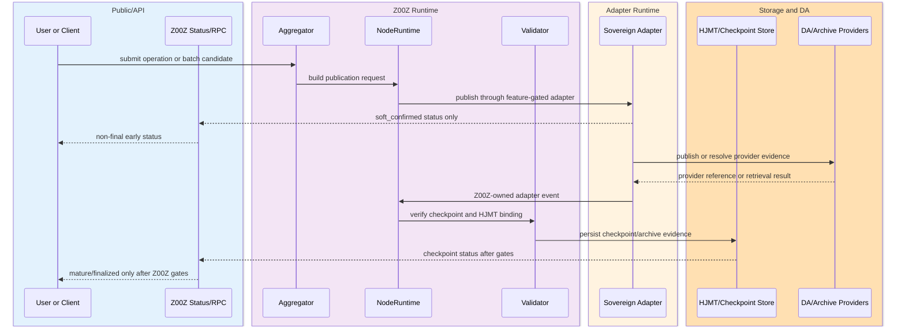
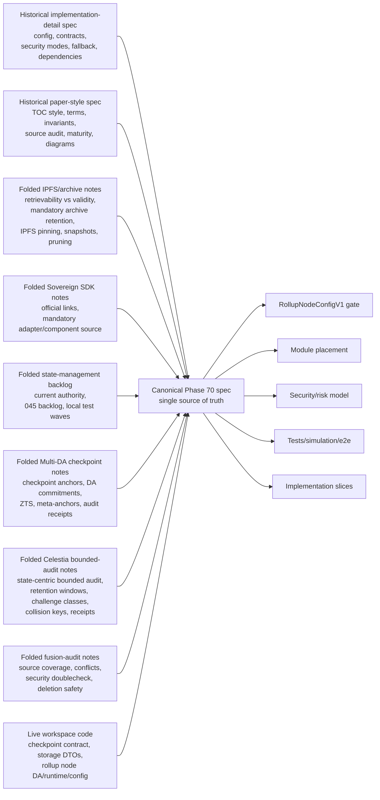

# Z00Z Phase 70 Rollup Node Fusion Specification

[TOC]

Version: 2026-07-04

Status: Canonical fused Phase 70 specification.

Folded source corpus:

- Historical implementation-detail rollup-node spec content.
- Historical paper-style rollup-node spec content.
- Historical IPFS/archive-retention source notes.
- Historical Sovereign SDK adapter/reference source notes.
- Historical Phase 70 state-management backlog notes.
- Historical Multi-DA/checkpoint architecture source notes.
- Historical Celestia/archive bounded-audit source notes.
- Historical deletion-safety and fusion-audit evidence.

Supersession rule:

- This canonical specification supersedes all historical pre-fusion Phase 70 rollup-node source notes that were folded into it.
- This canonical specification is the only live Markdown source of truth in the Phase 70 rollup-node planning directory.
- Historical source names in this document are provenance labels only; they are not live file paths or links.

Required runtime config gate:

- Target path: `config/rollup_node/rollup-node-config.yaml`
- Future mirror path: `config/rollup_node/rollup_node_contract.yaml`
- Checkpoint contract gate path: `crates/z00z_storage/src/checkpoint/checkpoint_contract.yaml`

Owner crates:

- `crates/z00z_rollup_node`
- `crates/z00z_runtime/aggregators`
- `crates/z00z_runtime/validators`
- `crates/z00z_runtime/watchers`
- `crates/z00z_storage`
- `crates/z00z_utils`
- `crates/z00z_networks/rpc`
- `crates/z00z_simulator`

Normative language:

- `MUST`, `MUST NOT`, `SHOULD`, `SHOULD NOT`, and `MAY` are used as normative keywords.
- A requirement with `MUST` or `MUST NOT` is a release gate.
- A requirement with `SHOULD` is expected behavior unless an implementation note explicitly documents why a local exception is safe.

This document is the single source of truth for Phase 70 rollup-node architecture. It intentionally copies and fuses the best architecture, security, data-contract, testing, source-audit, state-management backlog, and integration content from the folded historical source corpus listed above. Live Rust and YAML files remain the authority for implemented signatures, but any Phase 70 architectural change MUST update this fused specification first or in the same change.

## Key Terms Used In This Paper

| Term | Meaning |
|---|---|
| `Rollup node` | The composition root that wires aggregators, validators, watchers, storage, DA/archive adapters, RPC/status, and operator preflight into one coherent runtime. It MUST NOT become a second settlement authority. |
| `Checkpoint settlement` | Z00Z's authoritative state-transition boundary. It is represented by checkpoint statements, checkpoint artifacts, checkpoint links, execution inputs, HJMT roots, and settlement roots owned by storage/checkpoint code. |
| `Checkpoint contract` | The live configuration and schema gate at `crates/z00z_storage/src/checkpoint/checkpoint_contract.yaml` plus `CheckpointContractConfigV1`. It defines settlement, DA, archive-retention, snapshot, pruning, and recursive/PQ gates. |
| `Publication plane` | The rollup-node subsystem that publishes batch/checkpoint bytes and evidence to local archive, Sovereign SDK adapter, Celestia adapter, IPFS pinned archive, paid provider, Filecoin-equivalent, and cold object-store backends. |
| `DA publication` | A provider-facing publication event that proves bytes or commitments were made available according to provider rules. DA publication is not the same as state validity and MUST NOT decide Z00Z settlement truth. |
| `DA publication ready` | The state where provider publication, local archive evidence, retrieval checks, and required receipts have passed enough gates to start the challenge window. |
| `Data availability` | The property that new block/batch data was published and sampled or retrievable during the availability window. DA does not imply permanent historical storage. |
| `DA adapter trait` | The Z00Z-owned abstraction boundary for DA publish/resolve behavior. Implementations MAY target local archive, Celestia, Avail, Sovereign SDK adapter paths, or future DA networks, but MUST expose Z00Z-owned DTOs and MUST NOT leak provider client types into stable public APIs. |
| `DA backend` | A concrete provider implementation behind the DA adapter trait. A backend can be Celestia, Avail, local test DA, or another future DA system if it satisfies the same publication, resolve, checkpoint-binding, retrieval, and test contract. |
| `Data retrievability` | The ability to retrieve historical bytes later. It is an archive property with a 1-of-N keeper assumption, not a validity property. |
| `HJMT` | The hierarchical/Jellyfish Merkle Tree settlement storage line used by Z00Z for roots, proof envelopes, state scans, historical proofs, and checkpoint binding. HJMT authority belongs to storage, not to DA providers. |
| `Batch body` | The canonical bundle of batch bytes, proof bytes, witness roots, delta journals, checkpoint execution input, prep snapshot, and previous checkpoint references that is published and archived. |
| `Rollup batch manifest` | A manifest binding one published batch to state roots, settlement roots, route/table roots, DA references, archive references, challenge deadlines, and retention requirements. |
| `Publication binding` | The digest tying batch id, checkpoint id, route table digest, and checkpoint public inputs into a provider-independent binding. Live local DA uses `bind_publication_contract`. |
| `DA certificate` | Evidence that publication and retrieval gates passed for a batch. It is retrievability and audit evidence only. It is not a validity proof. |
| `Archive manifest` | The storage-owned manifest binding raw transaction package root, exact transaction proof bytes root, witness archive root, delta journal root, DA payload commitment, content-address root, retrieval-audit root, and archive-provider-receipt root. |
| `Archive provider receipt` | Provider evidence that a backend accepted bytes under a content digest or CID and committed to storing them. IPFS receipts MUST be pinned. |
| `IPFS pinned archive` | The mandatory content-addressed archive path. IPFS gives CID-based integrity if bytes are present, but persistent availability requires pinning and audits. |
| `Sovereign SDK adapter` | Mandatory provider-family and integration reference boundary for rollup node shape, DA abstractions, full-node/sequencer patterns, module adapters, and operational references. It MUST remain adapter-only and MUST NOT own Z00Z settlement semantics. |
| `Retrieval audit` | Periodic evidence that required archive entries were requested, retrieved, decoded, hash-checked, and replicated above threshold. |
| `State snapshot` | A checkpoint-bound bootstrap object that binds state root, settlement root, latest PQ/epoch proof digest, epoch manifest root, archive manifest root, snapshot chunk root, PQ anchor root, and retrieval audit root. |
| `Pruning decision` | A storage-owned decision that permits local full-node raw-history pruning only after dispute, PQ/epoch, archive-replica, retrieval-audit, and metadata-retention gates pass. |
| `Challenge window` | The dispute/audit interval that starts at `da_publication_ready`, not at local batch execution and not at receipt creation alone. |
| `Watcher` | An observation and alert actor. Watchers produce evidence and signals. They MUST NOT become a hidden settlement committee. |
| `Validator` | A settlement verifier actor. Validators verify theorem/checkpoint/binding semantics. They MUST NOT rely on DA/archive receipts as state-validity proof. |
| `Aggregator` | Batch planning and publication initiator. Aggregators create publication requests and route batches but MUST NOT bypass storage/checkpoint gates. |
| `Recursive proof` | A compressed validity artifact such as Nova or Plonky3/PQ epoch proof. It compresses correctness evidence but does not replace raw history, witness bytes, retrieval audits, or archive manifests. |
| `Bounded-audit checkpointed state ledger` | The Z00Z state-centric model where raw transaction envelopes are not canonical forever, but enough effect/audit data is retained during a bounded challenge window to prove collisions, double-spends, unauthorized updates, bad state transitions, and conservation violations. |
| `Effect/audit data` | Canonical transition evidence such as consumed object roots, created object roots, updated object roots, nullifier deltas, authorization commitments, policy evaluations, Merkle update witnesses, state diffs, ordering roots, and receipt roots. It is narrower and cleaner than raw transaction envelopes. |
| `Batch audit bundle` | The challenge-window object that binds old/new state roots, consumed/created/updated object roots, nullifier deltas, collision keys, policy/authorization evidence, Merkle update witnesses, state-diff root, receipt root, and checkpoint reference. |
| `Collision key` | A deterministic public or verifiably revealed fingerprint for consumed/spent assets, vouchers, rights, or nullifiers. It MUST be visible enough during the challenge window for an independent challenger to prove double spend or collision. |
| `Checkpoint anchor` | A compact proof reference binding a checkpoint boundary and publication evidence to a Z00Z epoch or finalized checkpoint context. It identifies the boundary; it does not replace settlement verification. |
| `Anchor calendar` | The ordered sequence of timestamp batches and roots used to verify ZTS timestamp proofs independently. It is timestamp evidence, not canonical asset state. |
| `ZTS` | Z00Z Timestamp Service, a service-layer proof surface for batching external hashes into Z00Z evidence. It proves hash inclusion, not truth of the underlying statement. |
| `ZTS batch` | A versioned timestamp batch containing submitted hashes, a batch root, checkpoint context, and verification metadata. It SHOULD avoid human labels and application metadata that leak meaning. |
| `ZTS proof` | A proof from an external submitted hash through a ZTS batch root into checkpoint context and optional external witness references. |
| `Meta-anchor` | Optional external witness path that pins selected Z00Z checkpoint or ZTS roots into another network. It MUST NOT validate Z00Z transitions or finality. |
| `Audit receipt` | A long-lived evidence object kept by a wallet, enterprise, auditor, or counterparty to verify a transaction, disclosure package, document hash, checkpoint anchor, or ZTS proof later. |
| `Disclosure package` | Higher-layer retained evidence revealed to a specific reviewer or purpose. It MUST NOT change base protocol validity and MUST NOT make Z00Z the universal host of business records. |
| `User receipt` | A user-held proof package containing operation reference, affected object ids, object payload or encrypted note reference, Merkle proof/witness update, checkpoint reference, and signed operation hash when needed for disputes. |
| `State-management local backlog` | The folded execution backlog from historical Phase 70 state-management notes that maps current state-management authority, claim roots, checkpoint verifier convergence, receive taxonomy, scan orchestration, nullifier transition, and simulator closure into local crate/test work. |
| `Deletion-safety certificate` | The integrated proof in Section 24 that requested superseded Markdown source files can be removed from the working tree only after their unique provisions are represented in this canonical specification. |
| `Pending finality` | The period where a recently created or updated object can be usable but remains challengeable until audited/economic/archival finality levels mature. |
| `Celenium` | External explorer/indexing observation surface. It MAY help operators inspect Celestia evidence but MUST NOT be an authority for Z00Z state. |
| `Avail adapter` | Optional future DA backend family that MAY be connected through the same Z00Z DA adapter trait and provider-neutral DTOs. It is not a Phase 70 required provider family unless the checkpoint contract and config gate are explicitly extended. |
| `Hybrid sync` | Bootstrap mode using verified snapshot plus recent DA/archive history, HJMT scans, and retrieval audits instead of replaying every historical byte locally. |

## Naming And Symbol Conventions

| Symbol | Meaning |
|---|---|
| `RN` | Rollup node requirement family. |
| `ZINV-RN-FUS-*` | Fusion invariant anchors. |
| `RN-REQ-*` | Normative requirement IDs. |
| `RN-AC-*` | Acceptance criteria IDs. |
| `RN-RISK-*` | Security or operational risk IDs. |
| `BatchBodyV1` | Planned additive batch-body DTO. |
| `RollupBatchManifestV1` | Planned additive publication manifest DTO. |
| `DaCertificateV1` | Planned additive DA/retrieval certificate DTO. |
| `BatchAuditBundleV1` | Planned additive challenge-window effect/audit bundle DTO. |
| `CheckpointAnchorV1` | Planned additive compact checkpoint-bound anchor DTO. |
| `ZtsBatchV1` | Planned additive timestamp batch DTO. |
| `ZtsProofV1` | Planned additive timestamp proof DTO. |
| `UserReceiptV1` | Planned additive wallet/user receipt DTO. |
| `CheckpointHeaderV1` | Planned additive permanent checkpoint header DTO for state-centric verification. |
| `CheckpointArchiveManifestV1` | Live storage DTO exported by `z00z_storage::checkpoint`. |
| `ArchiveProviderReceiptV1` | Live storage DTO exported by `z00z_storage::checkpoint`. |
| `RetrievalAuditV1` | Live storage DTO exported by `z00z_storage::checkpoint`. |
| `StateSnapshotV1` | Live storage DTO exported by `z00z_storage::checkpoint`. |
| `PruningDecisionV1` | Live storage DTO exported by `z00z_storage::checkpoint`. |
| `config_digest` | Hash of architecture-impacting config fields. It MUST be stable, reproducible, and recorded in preflight evidence. |
| `artifact_root` | A 32-byte semantic root, commitment, or digest. Zero roots MUST be rejected unless a field explicitly permits an all-zero sentinel. |
| `cid_digest` | A digest form of a CID or content-address root used inside fixed-width Z00Z manifests. The raw CID representation MAY be stored in provider metadata, but canonical storage DTOs SHOULD bind fixed-width digests. |

## Invariant Anchors

### ZINV-RN-FUS-001

Checkpoint settlement is the only authoritative Z00Z state-validity boundary. The rollup node MUST compose existing actors and evidence, but MUST NOT create an alternate validity path through Celestia, IPFS, Sovereign SDK, Celenium, object storage, a watcher committee, or a bridge provider.

### ZINV-RN-FUS-002

Storage owns HJMT state, roots, proof envelopes, nullifier truth, checkpoint artifacts, checkpoint links, archive manifests, archive receipts, retrieval audits, state snapshots, and pruning decisions. DA/archive providers MAY carry bytes and evidence; they MUST NOT own semantic roots.

### ZINV-RN-FUS-003

The checkpoint contract gate at `crates/z00z_storage/src/checkpoint/checkpoint_contract.yaml` is a live runtime gate. Phase 70 rollup-node config MUST validate against it and MUST fail closed when required DA, archive, snapshot, pruning, or authority-promotion fields drift.

### ZINV-RN-FUS-004

Retrievability is not validity. A provider receipt, IPFS CID, archive pin, Celestia blob reference, Celenium observation, or Sovereign SDK adapter event MUST NOT be accepted as a state-validity proof.

### ZINV-RN-FUS-005

IPFS is mandatory as a content-addressed archive backend family, but IPFS alone is not an archival guarantee. Every IPFS-backed Phase 70 archive path MUST require pinning, independent pinner/provider evidence, archive-provider receipts, retrieval audits, and fallback providers.

### ZINV-RN-FUS-006

Sovereign SDK is mandatory as an adapter/component and architecture reference for rollup node composition, DA abstraction, sequencer/full-node patterns, soft-confirmation reference design, and integration tests. It MUST remain adapter-only and MUST NOT replace Z00Z runtime, storage, HJMT, checkpoint, validator, watcher, or settlement authority.

### ZINV-RN-FUS-007

The challenge window starts at `da_publication_ready`. It MUST NOT start merely when an aggregator executes a batch, a local adapter stores bytes, a CID is created, or a provider API returns a superficial success response.

### ZINV-RN-FUS-008

Raw transaction packages, exact transaction proof bytes, witness archives, delta journals, DA payload commitments, archive receipts, retrieval audits, and manifests MUST be retained through the challenge window and according to the archive-retention gate. Recursive/PQ proof artifacts MUST NOT be used as a reason to delete all history network-wide.

### ZINV-RN-FUS-009

Full nodes MAY prune local raw history only after configured gates pass. Archive nodes and archive-provider replicas MUST NOT prune under the full-node pruning policy.

### ZINV-RN-FUS-010

State snapshots are subordinate to checkpoint, epoch, archive, retrieval-audit, and PQ-anchor lineage. Snapshot bootstrap MUST verify all bound roots and run HJMT scans before the node enters service.

### ZINV-RN-FUS-011

The first external DA implementation MUST be provider-neutral at the project trait boundary. Concrete Celestia, Avail, IPFS, Sovereign SDK, object-store, and paid-provider client types MUST be hidden behind Z00Z-owned DTOs and adapter traits.

### ZINV-RN-FUS-012

Watchers produce evidence, alerts, and retrieval-audit observations. They MUST NOT decide finality, mutate checkpoint truth, or override validators.

### ZINV-RN-FUS-013

All architecture-impacting config MUST be loaded through bounded, deny-unknown-fields, project-owned configuration utilities. Business crates MUST NOT parse unbounded YAML or accept unknown config fields silently.

### ZINV-RN-FUS-014

Every provider-facing fallback MUST produce an explicit recovery record. Silent provider failover is forbidden because it makes later audit, challenge handling, and state reconstruction ambiguous.

### ZINV-RN-FUS-015

The fused architecture MUST integrate with the current Z00Z workspace. It MUST NOT import an external rollup framework as a second application runtime before adapter-only integration and compliance tests pass.

### ZINV-RN-FUS-016

Z00Z Phase 70 MUST preserve the state-centric bounded-audit model: raw transaction envelopes are not canonical forever, but effect/audit data sufficient to prove illegal transitions during the configured challenge window MUST be retained and retrievable.

### ZINV-RN-FUS-017

Checkpoint anchors, ZTS timestamp proofs, audit receipts, disclosure packages, and meta-anchors are service-layer or proof-reference evidence. They MUST NOT replace checkpoint settlement validation, HJMT state validity, or validator/proof semantics.

### ZINV-RN-FUS-018

Collision keys, nullifiers, spent markers, or equivalent double-spend fingerprints MUST be publicly visible or independently verifiable enough during the challenge window for a challenger to prove collisions without raw transaction envelopes.

### ZINV-RN-FUS-019

User data availability is separate from global state validity. Wallets, users, or recovery services MUST retain user receipts, encrypted notes, object payloads, Merkle proofs, and recovery packages needed to prove or recover their own assets, vouchers, rights, and claims.

### ZINV-RN-FUS-020

After archival finality, Phase 70 MUST NOT allow late discovery of old fraud to silently rewrite canonical settlement history. The design MUST define correction, compensation, revocation, or governance paths separately from canonical rollback.

### ZINV-RN-FUS-021

Folded reference: `ZINV: CHECKPOINT-001`. Genesis bootstrap authority and every later checkpoint publication MUST remain on one replay-safe lineage. The accepted checkpoint path MUST preserve prior-root to next-root continuity and MUST NOT consume the same input twice.

### ZINV-RN-FUS-022

Folded reference: `ZINV: CHECKPOINT-002`. Every DA commitment, checkpoint anchor, ZTS proof, audit receipt, disclosure package, and meta-anchor flow MUST remain subordinate to committed checkpoint state. Publication evidence MAY witness an accepted checkpoint, but MUST NOT authorize publication before commit or replace checkpoint validity.

## 1. Why This Specification Exists

Phase 70 defines the Z00Z rollup node: the runtime composition layer that turns existing storage, checkpoint, aggregator, validator, watcher, DA, archive, snapshot, pruning, and status pieces into one operational node.

The previous two specs each had strong parts:

- The historical implementation-detail predecessor had stronger implementation details, richer config, data contracts, dependency recommendations, security modes, fallback states, and implementation slices.
- The historical paper-style predecessor had a stronger structure, key terms, invariant anchors, maturity boundary, source audit, and explicit integration with the live checkpoint contract.

This fusion keeps both strengths and resolves their conflicts. The most important conflict is the old treatment of Sovereign SDK and IPFS:

- Earlier wording sometimes treated Sovereign SDK as a reference only. The corrected Phase 70 position is that Sovereign SDK is a mandatory adapter/component and architecture reference, but adapter-only and non-authoritative.
- Earlier wording sometimes said IPFS CID root "if used". The corrected Phase 70 position is that IPFS pinned archive is mandatory as one content-addressed archive backend family, but never sufficient by itself.

The final architecture is:

```text
Checkpoint settlement = authoritative validity
HJMT storage = authoritative roots, proofs, nullifiers, archive/snapshot/pruning DTOs
Rollup node = composition runtime and provider orchestrator
Celestia = DA/public publication evidence, not permanent archive
IPFS pinned archive = mandatory content-addressed retrievability path, not availability by itself
Sovereign SDK = mandatory adapter/component reference, not Z00Z settlement owner
Archive layer = long-term retrieval guarantee through replicas, receipts, audits, and fallback
Snapshots = fast bootstrap with lineage verification
Pruning = local full-node optimization only after gates
```

## 2. Reader Contract

This paper is written for implementers, reviewers, and operators. A reader should leave with the ability to answer:

- Where each Phase 70 module lives in the current Z00Z workspace.
- Which crate owns each authority boundary.
- Which config fields are real release gates.
- Which external systems are mandatory, optional, or forbidden as authority.
- Which bytes must be retained and which may be pruned.
- Which tests are required before Phase 70 can be accepted.
- Which risks must be mitigated before mainline deployment.

The document is self-contained. It repeats the necessary decisions from prior docs, IPFS notes, Sovereign SDK links, live checkpoint contract, and current crate boundaries so implementers do not need to cross-read older planning files to understand Phase 70.

## 3. Maturity Boundary

| Area | Current workspace truth | Phase 70 target | Authority rule |
|---|---|---|---|
| HJMT storage and settlement roots | Live in `z00z_storage` tests and APIs. | Continue as storage-owned authority. | Rollup node MUST call/compose; it MUST NOT re-own HJMT. |
| Checkpoint artifact/link/exec input | Live in `z00z_storage::checkpoint`. | Remain canonical. | Validators and DA adapters bind to these objects. |
| Checkpoint contract YAML | Live at `crates/z00z_storage/src/checkpoint/checkpoint_contract.yaml`. | Used as mandatory rollup-node gate. | Rollup node config MUST refuse drift. |
| Archive manifest/receipt/retrieval/snapshot/pruning DTOs | Live in storage modules and exported from `checkpoint/mod.rs`. | Integrated into publication, status, tests, and recovery. | Storage owns schemas and semantic binding. |
| Local DA adapter | Live in `z00z_rollup_node::da::LocalDaAdapter`. | Keep as deterministic local/test provider. | Local adapter MUST enforce replay and metadata checks. |
| Celestia adapter | Not yet implemented as concrete adapter. | Required external DA adapter target. | Celestia MUST be DA-only and not archive-only. |
| IPFS pinned archive | Storage DTOs support `IpfsPinned`; config requires pinning. | Mandatory archive backend family. | IPFS receipts MUST prove pinned status and retrieval audits. |
| Sovereign SDK adapter | Checkpoint contract names `sovereign_sdk_adapter`; source note gives official links. | Mandatory adapter/component integration target. | Adapter-only; no Z00Z authority transfer. |
| Aggregator/validator/watcher composition | Existing crates and tests. | Rollup node composes them into operational runtime. | Each actor keeps its authority boundary. |
| RPC/status | Rollup node status exists. | Extend status for DA/archive/recovery/preflight. | Status MUST be observational, not authoritative mutation. |
| Recursive/PQ branches | Checkpoint contract has non-authoritative recursive branches and PQ stage gates. | Integrate as evidence and retention gates. | Recursive proofs are not archive replacement. |
| Bridge/onboarding ecosystems | Hyperlane/Axelar/Squid references only. | Future integration only. | MUST NOT decide Z00Z ownership or settlement. |

## 4. Current Code Truth

Phase 70 MUST build on current code instead of bypassing it.

| Surface | Current file(s) | Relevant truth |
|---|---|---|
| Workspace crates | `Cargo.toml` | `z00z_rollup_node`, `z00z_storage`, `z00z_runtime/aggregators`, `z00z_runtime/validators`, `z00z_runtime/watchers`, `z00z_simulator`, and `z00z_utils` are existing workspace members. |
| Rollup node runtime | `crates/z00z_rollup_node/src/runtime.rs` | `NodeRuntime<A,V,W,D>` composes aggregator, validator, watcher, DA adapter, publication records, status, placement, verdict, provider signal, and observation. |
| Rollup node config | `crates/z00z_rollup_node/src/config.rs` | Existing config supports node mode, DA provider string, RPC flag, HJMT config, planner/storage/aggregator configs, strict serde DTOs, digests, startup preflight, and path validation. |
| Local DA adapter | `crates/z00z_rollup_node/src/da.rs` | `DaAdapter` trait exposes `publish` and `resolve`; `LocalDaAdapter` rejects replay, missing resolve, metadata drift, and mismatched published batch. |
| Checkpoint contract | `crates/z00z_storage/src/checkpoint/checkpoint_contract.yaml` | Live gate requires `local_archive`, `sovereign_sdk_adapter`, `celestia_adapter`, content addressing, IPFS pinning, provider receipts, retrieval audits, min archive replicas 3, snapshots, pruning gates, and DA publication readiness. |
| Checkpoint config validator | `crates/z00z_storage/src/checkpoint/contract_config.rs` | `CheckpointContractConfigV1` uses `serde(deny_unknown_fields)` and bounded YAML via `z00z_utils::io::load_yaml_bounded`; it validates DA, archive, retention, snapshot, pruning, post-quantum, paths, and limits. |
| Archive receipt | `crates/z00z_storage/src/checkpoint/archive_receipt.rs` | `ArchiveProviderReceiptV1` has backends `Z00zArchiveNode`, `IpfsPinned`, `PaidArchivalProvider`, `FilecoinOrEquivalent`, `ColdObjectStore`; unpinned IPFS receipt rejects. |
| Archive manifest | `crates/z00z_storage/src/checkpoint/archive_manifest.rs` | `CheckpointArchiveManifestV1` requires non-zero roots and `min_archive_replicas >= 3`. |
| Retrieval audit | `crates/z00z_storage/src/checkpoint/retrieval_audit.rs` | `RetrievalAuditV1` requires interval alignment, passed audit, and successful replica count >= 3. |
| State snapshot | `crates/z00z_storage/src/checkpoint/state_snapshot.rs` | `StateSnapshotV1` binds state root, settlement root, last Plonky3 epoch proof digest, epoch manifest root, archive manifest root, snapshot chunk root, PQ anchor root, and retrieval audit root. |
| Pruning decision | `crates/z00z_storage/src/checkpoint/pruning.rs` | `PruningDecisionV1` permits only `FullNode` with `local_full_node_only` and requires all finality/retention gates. |
| Public checkpoint exports | `crates/z00z_storage/src/checkpoint/mod.rs` | Archive, retrieval, snapshot, pruning, checkpoint artifact, checkpoint link, exec input, ids, codecs, and contract config are exported from storage. |
| Existing tests | `crates/z00z_* / tests` | There are live tests for HJMT root generation, batch proofs, snapshots, checkpoint contract, publication contract, local DA, topology, simulator settlement, and object/watcher/validator boundaries. |

## 5. Canonical Architecture Statement

The Z00Z rollup node MUST be a composition runtime. It owns:

- Loading and validating `RollupNodeConfigV1`.
- Loading and cross-checking `CheckpointContractConfigV1`.
- Attaching aggregator, validator, watcher, storage, DA/archive, and RPC/status services.
- Publishing batches through provider adapters.
- Recording provider evidence and recovery records.
- Driving preflight checks.
- Exposing operator status.
- Coordinating fallback, retrieval audits, snapshot bootstrap, and pruning gates.

The rollup node MUST NOT own:

- HJMT state semantics.
- Nullifier truth.
- Checkpoint state-transition validity.
- Validator theorem semantics.
- Wallet key/material authority.
- External bridge ownership semantics.
- Permanent archive truth without storage-owned manifests and audits.

The architecture is deliberately provider-neutral at the Z00Z trait boundary. Celestia, IPFS, Sovereign SDK, object stores, paid archival providers, Filecoin-equivalent storage, Celenium, bridges, and future DA systems MAY be integrated through adapters, but their concrete client types MUST NOT leak into the default public API of storage, validators, or watchers.

## 6. Architecture Diagrams

### 6.1 C4 System Context



### 6.2 C4 Container View



### 6.3 Component View Of `z00z_rollup_node`



### 6.4 End-To-End Publication Sequence



### 6.5 Checkpoint Lifecycle State



### 6.6 Requirement Trace Diagram

```mermaid
requirementDiagram
  requirement RN_REQ_001 {
    id: RN-REQ-001
    text: "Rollup node MUST be composition root, not settlement authority"
    risk: high
    verifymethod: inspection
  }
  requirement RN_REQ_002 {
    id: RN-REQ-002
    text: "RollupNodeConfigV1 MUST gate runtime parameters and paths"
    risk: high
    verifymethod: test
  }
  requirement RN_REQ_003 {
    id: RN-REQ-003
    text: "CheckpointContractConfigV1 MUST remain authoritative for storage/checkpoint gates"
    risk: high
    verifymethod: test
  }
  requirement RN_REQ_004 {
    id: RN-REQ-004
    text: "IPFS pinned archive MUST be mandatory and audited"
    risk: high
    verifymethod: test
  }
  requirement RN_REQ_005 {
    id: RN-REQ-005
    text: "Sovereign SDK MUST be adapter-only and non-authoritative"
    risk: medium
    verifymethod: inspection
  }
  requirement RN_REQ_006 {
    id: RN-REQ-006
    text: "Celestia MUST be DA/publication evidence, not permanent archive"
    risk: high
    verifymethod: test
  }
  requirement RN_REQ_024 {
    id: RN-REQ-024
    text: "DA MUST remain provider-neutral behind DaAdapter"
    risk: high
    verifymethod: test
  }
  requirement RN_REQ_007 {
    id: RN-REQ-007
    text: "Recursive/PQ proofs MUST NOT replace retrievability"
    risk: high
    verifymethod: inspection
  }
  requirement RN_REQ_008 {
    id: RN-REQ-008
    text: "Pruning MUST be local full-node-only after all gates"
    risk: high
    verifymethod: test
  }
  requirement RN_REQ_009 {
    id: RN-REQ-009
    text: "Snapshot bootstrap MUST verify lineage and run HJMT scans"
    risk: high
    verifymethod: test
  }
  requirement RN_REQ_010 {
    id: RN-REQ-010
    text: "Watchers MUST observe and alert, not decide finality"
    risk: high
    verifymethod: test
  }

  element RollupNode {
    type: crate
    docref: "crates/z00z_rollup_node"
  }
  element Storage {
    type: crate
    docref: "crates/z00z_storage"
  }
  element Tests {
    type: validation
    docref: "Phase 70 test matrix"
  }

  RollupNode - satisfies -> RN_REQ_001
  RollupNode - satisfies -> RN_REQ_002
  Storage - satisfies -> RN_REQ_003
  Storage - satisfies -> RN_REQ_004
  RollupNode - satisfies -> RN_REQ_005
  RollupNode - satisfies -> RN_REQ_006
  RollupNode - satisfies -> RN_REQ_024
  Storage - satisfies -> RN_REQ_007
  Storage - satisfies -> RN_REQ_008
  Storage - satisfies -> RN_REQ_009
  Tests - verifies -> RN_REQ_001
  Tests - verifies -> RN_REQ_004
  Tests - verifies -> RN_REQ_008
  Tests - verifies -> RN_REQ_024
```

## 7. Module Placement And Crate Ownership

### 7.1 Ownership Matrix

| Capability | Owner crate/module | Consuming crates | Rule |
|---|---|---|---|
| Runtime composition | `z00z_rollup_node::runtime` | RPC, simulator, tests | MUST compose actors through traits and status snapshots. |
| Rollup-node config gate | `z00z_rollup_node::config` target additions | Rollup node, simulator | MUST load bounded YAML and produce config digest/preflight report. |
| Checkpoint contract config | `z00z_storage::checkpoint::contract_config` | Rollup node, tests | MUST remain storage-owned; rollup node MUST cross-check it. |
| HJMT roots/proofs/nullifiers | `z00z_storage` | Aggregators, validators, rollup node | MUST NOT move into rollup node. |
| Checkpoint artifact/link/exec input | `z00z_storage::checkpoint` | Rollup node, validators, aggregators | MUST remain canonical DTOs. |
| Archive manifest/receipt/audit/snapshot/pruning | `z00z_storage::checkpoint` | Rollup node, watchers, simulator | MUST remain storage-owned data contracts. |
| Aggregator planning/publication request | `z00z_runtime/aggregators` | Rollup node | Aggregator owns planning and routing; storage owns semantic root truth. |
| Settlement verification | `z00z_runtime/validators` | Rollup node | Validator verdicts MUST be based on checkpoint/settlement theorem, not provider receipts. |
| Watcher observation | `z00z_runtime/watchers` | Rollup node, status | Watchers observe, retrieve, alert, and emit evidence; no settlement authority. |
| Local DA adapter | `z00z_rollup_node::da` | Tests, simulator | MUST remain deterministic and strict. |
| Celestia adapter | `z00z_rollup_node::da::celestia` target | Rollup node | SHOULD be first external DA adapter. |
| Avail adapter | `z00z_rollup_node::da::avail` target | Rollup node | MAY be added as an optional DA backend after checkpoint-contract and config-family gates are extended; MUST satisfy the same `DaAdapter` contract as Celestia. |
| IPFS archive adapter | `z00z_rollup_node::da::ipfs` or `archive::ipfs` target | Rollup node, watchers | MUST exist as mandatory archive backend family; feature-gated implementation is acceptable during bring-up. |
| Sovereign SDK adapter | `z00z_rollup_node::da::sovereign` target | Rollup node | MUST be adapter-only; direct runtime replacement forbidden. |
| Object-store/paid archive adapter | `z00z_rollup_node::da::object_store` target | Rollup node | SHOULD use `object_store` crate behind Z00Z-owned trait. |
| Config IO/codecs | `z00z_utils` | All crates | Business crates MUST use project utilities for bounded config and canonical codecs. |
| RPC/status | `z00z_rollup_node::status`, `z00z_networks/rpc` | Operators, tests | MUST be observational and auditable. |
| Simulations | `z00z_simulator` | All relevant crates | MUST exercise end-to-end publication, archive, recovery, snapshot, and pruning flows. |

### 7.2 Separate Crate Decision

Phase 70 SHOULD NOT create a default `z00z_da` crate in the first implementation slice. The current best placement is inside `z00z_rollup_node` because:

- The current live DA seam is already `z00z_rollup_node::da::DaAdapter`.
- External provider adapters are runtime orchestration details, not storage authority.
- Storage already owns canonical archive DTOs.
- Creating a new crate too early would increase dependency sprawl before the adapter trait stabilizes.

A future `z00z_da` crate MAY be extracted only after all of these gates pass:

- At least two external provider adapters are implemented and tested.
- Provider DTOs are stable and do not leak concrete client types into storage/validator/watcher APIs.
- Rollup-node tests prove the same publication and retrieval semantics across local, Celestia, Avail or other future DA, IPFS, Sovereign SDK, and object-store adapters.
- The extraction reduces dependencies or compile times instead of adding wrapper churn.

### 7.3 Target Internal Module Shape

```text
crates/z00z_rollup_node/src/
  config.rs              # current HJMT config plus RollupNodeConfigV1 target gate
  runtime.rs             # NodeRuntime composition root
  mode.rs                # NodeMode and runtime profiles
  status.rs              # StatusSnapshot plus DA/archive/recovery extensions
  rpc.rs                 # status and control surface
  da.rs                  # current trait and local adapter; split when large
  da/
    mod.rs               # provider-neutral traits and common DTO conversions
    local.rs             # local/test adapter
    celestia.rs          # Celestia DA adapter
    avail.rs             # optional Avail DA adapter target
    ipfs.rs              # mandatory pinned IPFS archive adapter
    sovereign.rs         # mandatory Sovereign SDK adapter family
    object_store.rs      # paid/cold object-store archive adapter
    certificate.rs       # DaCertificateV1 target DTO
  archive/
    manifest_bridge.rs   # conversion to storage-owned archive DTOs
    retrieval.rs         # retrieval audit orchestration
    receipts.rs          # provider receipt collection
  recovery.rs            # fallback state machine and recovery records
  preflight.rs           # config, checkpoint contract, HJMT, provider preflight
```

This module shape is a target. The implementation MAY stage it incrementally, but public authority boundaries MUST match this document.

## 8. Normative Configuration Gate

### 8.1 Configuration Is Runtime Authority For Parameters And Paths

`RollupNodeConfigV1` MUST be a real runtime gate, not documentation-only. The rollup node MUST refuse startup when:

- The YAML contains unknown fields.
- A required field is absent.
- A path escapes the configured repository/runtime roots.
- A provider family required by the checkpoint contract is missing.
- IPFS pinning is disabled.
- Sovereign SDK adapter family is absent.
- Celestia is configured as permanent archive instead of DA/publication evidence.
- Avail or any future DA backend is enabled without explicit checkpoint-contract provider-family support and a matching config block.
- Archive retention allows fewer than 3 independent replicas.
- Retrieval audits are disabled.
- Snapshot/pruning gates conflict with `CheckpointContractConfigV1`.
- Secrets appear inline in YAML instead of environment/secret-store references.
- Config digest cannot be reproduced.

The loader MUST use bounded YAML IO through `z00z_utils` or an equivalent project-owned wrapper. Business crates MUST NOT use unbounded YAML parsing. DTO structs MUST use `serde(deny_unknown_fields)` or equivalent fail-closed schema validation.

### 8.2 Canonical `RollupNodeConfigV1`

The following YAML is the normative target config shape. It MUST be materialized at `config/rollup_node/rollup-node-config.yaml` when implementation begins. Until that file exists, this inline block is the Phase 70 source of truth for target fields, parameter names, and path gates.

```yaml
version: 1
profile: rollup-node-phase70-v1
architecture_mode: checkpoint_contract_first

node:
  id: z00z-rollup-node-local-0
  mode: full_rollup_node
  network: local
  rpc_enabled: true
  status_enabled: true
  metrics_enabled: true
  unsafe_dev_overrides_allowed: false
  config_digest_algorithm: sha256
  config_digest_output: var/rollup_node/evidence/config-digest.json
  preflight_report_output: var/rollup_node/evidence/preflight-report.json

authority:
  settlement_authority: checkpoint_contract
  checkpoint_contract_path: crates/z00z_storage/src/checkpoint/checkpoint_contract.yaml
  checkpoint_contract_profile: checkpoint-contract-recursive-ready-v1
  checkpoint_contract_architecture_mode: checkpoint_contract_first
  recursive_authority_allowed: false
  verified_backend_allowed: false
  external_provider_authority_allowed: false
  watchers_are_authority: false
  bridges_are_authority: false
  explorer_is_authority: false

mandatory_components:
  ipfs_pinned_archive:
    enabled: true
    role: content_addressed_archive_backend
    must_be_pinned: true
    min_independent_pinners: 3
    provider_receipts_required: true
    retrieval_audit_required: true
    cid_version: 1
    multihash_policy: sha2_256_or_stronger
    fail_closed_on_unpinned_cid: true
    fail_closed_on_gateway_only_success: true
    api_endpoint_env: Z00Z_IPFS_API_ENDPOINT
    api_token_env: Z00Z_IPFS_API_TOKEN
    pinset_manifest_path: artifacts/checkpoints/archive_receipt/ipfs-pinset.json
  sovereign_sdk_adapter:
    enabled: true
    role: adapter_family_and_architecture_reference
    integration_mode: reference_adapter
    feature_gate: sovereign_sdk_adapter
    authority_mode: adapter_only
    dependency_mode: no_core_import_until_gate
    public_api_policy: z00z_owned_dtos_only
    sdk_type_leak_allowed: false
    official_docs_review_required: true
    official_docs_reviewed_on: "2026-07-04"
    license_review_required: true
    commercial_revenue_share_review_required: true
    may_supply_da_adapter: true
    may_supply_full_node_reference_patterns: true
    may_supply_sequencer_reference_patterns: true
    may_supply_module_adapter_patterns: true
    may_replace_z00z_runtime: false
    may_replace_z00z_storage: false
    may_replace_z00z_checkpoint_contract: false
    may_replace_z00z_validators: false
    may_replace_z00z_watchers: false
    target_crate: crates/z00z_rollup_node
    target_da_module: crates/z00z_rollup_node/src/da/sovereign.rs
    optional_compat_module: crates/z00z_rollup_node/src/compat/sovereign.rs
    target_tests:
      - crates/z00z_rollup_node/tests/test_sovereign_adapter_contract.rs
      - crates/z00z_rollup_node/tests/test_sovereign_soft_confirm.rs
      - crates/z00z_rollup_node/tests/test_sovereign_license_gate.rs
    maps_to:
      sovereign_da_service: z00z_rollup_node::da::DaAdapter
      sovereign_da_verifier: z00z_validator_checkpoint_verification
      sovereign_full_node: z00z_rollup_node::runtime::NodeRuntime_reference
      sovereign_runtime: z00z_runtime_boundary_reference
      sovereign_modules: z00z_actor_and_adapter_patterns
      sovereign_state: z00z_hjmt_objects
      sovereign_soft_confirmation: z00z_status_soft_confirmed_non_final
      sovereign_events: z00z_observability_events_non_authoritative
    required_artifacts:
      - SovereignAdapterEventV1
      - SovereignSoftConfirmationV1
      - SovereignDaReferenceV1
      - SovereignModuleMirrorV1
      - SovereignCompatibilityReportV1
    allowed_sdk_patterns:
      - da_service_da_verifier_split
      - runtime_module_separation
      - sequencer_full_node_split
      - soft_confirmation_status
      - isolated_module_test_runner
      - native_only_metrics
      - state_access_bundling
      - forced_inclusion_concept
    forbidden_replacements:
      - z00z_runtime
      - z00z_storage_hjmt
      - z00z_checkpoint_contract
      - z00z_validators
      - z00z_watchers
      - z00z_crypto_authority
      - z00z_finality_ladder
    source_links:
      - https://github.com/Sovereign-Labs/sovereign-sdk
      - https://docs.sovereign.xyz
      - https://docs.sovereign.xyz/4-1-anatomy-of-a-module.html
      - https://docs.sovereign.xyz/4-2-testing-your-module.html
      - https://docs.sovereign.xyz/4-5-performance.html
      - https://docs.sovereign.xyz/4-6-prebuilt-modules.html
      - https://docs.sovereign.xyz/6-1-metrics.html
      - https://docs.sovereign.xyz/7-2-abstractions.html
      - https://docs.sovereign.xyz/7-3-forced-sequencer-registration.html

runtime:
  aggregator:
    attach: true
    crate: z00z_aggregators
    config_root: config/hjmt_runtime/sim_5a7s/aggregators
    route_table_required: true
    route_digest_required: true
    publication_binding_required: true
  validator:
    attach: true
    crate: z00z_validators
    theorem_verification_required: true
    reject_provider_receipt_as_validity: true
  watcher:
    attach: true
    crate: z00z_watchers
    retrieval_observation_required: true
    provider_signal_required: true
    finality_authority_allowed: false
  storage:
    attach: true
    crate: z00z_storage
    backend: hjmt
    root_generation: hierarchical_jmt
    checkpoint_store_required: true
    archive_objects_required: true
    snapshot_objects_required: true
    pruning_objects_required: true
    data_dir: var/rollup_node/storage

planner:
  mode: central
  route_table_path: config/hjmt_runtime/sim_5a7s/shard_route_tables/route-table-v1.canon.hex
  expected_route_digest_env: Z00Z_ROLLUP_EXPECTED_ROUTE_DIGEST
  reject_cross_shard: true
  shard_local_only: true
  cadence_ms: 250
  max_batch_ops: 1000
  max_batch_bytes: 8388608

data_availability:
  challenge_window_start: da_publication_ready
  publication_readiness_gate: required
  provider_sdk_boundary: adapter_only
  concrete_provider_types_in_public_api_allowed: false
  allowed_sync_modes:
    - da_only
    - hybrid_p2p_da_verified
  provider_families:
    - local_archive
    - sovereign_sdk_adapter
    - celestia_adapter
  optional_provider_families:
    - avail_adapter
    - eigenda_adapter
    - ethereum_blob_adapter
    - near_da_adapter
    - zero_g_da_adapter
    - arbitrum_anytrust_dac_adapter
    - tezos_dal_adapter
    - nubit_da_adapter
    - future_da_adapter
  multi_da_candidate_register_reviewed_on: "2026-07-04"
  multi_da_candidate_families_require_explicit_provider_block: true
  backend_extension_policy:
    enabled_only_if_checkpoint_contract_lists_family: true
    must_implement_da_adapter_trait: true
    must_emit_z00z_owned_dtos: true
    provider_client_type_leak_allowed: false
  providers:
    local_archive:
      enabled: true
      role: deterministic_test_and_local_archive
      url: local-da://z00z-local
      replay_protection_required: true
      metadata_drift_rejection_required: true
    celestia_adapter:
      enabled: true
      role: da_publication_not_permanent_archive
      network_env: Z00Z_CELESTIA_NETWORK
      rpc_endpoint_env: Z00Z_CELESTIA_RPC_ENDPOINT
      auth_token_env: Z00Z_CELESTIA_AUTH_TOKEN
      namespace_env: Z00Z_CELESTIA_NAMESPACE
      require_blob_commitment: true
      require_height_reference: true
      require_retrieval_before_da_ready: true
      treat_historical_retrieval_as_best_effort: true
      must_not_be_only_archive: true
    avail_adapter:
      enabled: false
      role: optional_da_publication_backend
      feature_gate: avail_adapter
      require_checkpoint_contract_family: true
      require_block_or_blob_reference: true
      require_namespace_or_app_id_reference: true
      require_retrieval_before_da_ready: true
      treat_historical_retrieval_as_best_effort: true
      must_not_be_only_archive: true
    sovereign_sdk_adapter:
      enabled: true
      role: adapter_only_component
      feature_gate: sovereign_sdk_adapter
      integration_mode: reference_adapter
      require_z00z_checkpoint_binding: true
      require_z00z_hjmt_roots: true
      require_z00z_validator_verdict: true
      accept_soft_confirmation_as_finality: false
      require_license_gate: true
      require_sdk_type_isolation: true
      require_adapter_event_version: SovereignAdapterEventV1
      require_soft_confirmation_status: soft_confirmed_non_final
      sdk_da_service_semantics: native_fetch_publish_untrusted_until_verified
      sdk_da_verifier_semantics: proof_public_input_binding_not_provider_finality
      allowed_dependency_surface:
        - adapter_harness
        - integration_tests
        - optional_feature_module
      forbidden_dependency_surface:
        - storage_public_api
        - validator_public_api
        - watcher_public_api
        - checkpoint_contract
    celenium_observer:
      enabled: true
      role: explorer_observation_only
      endpoint_env: Z00Z_CELENIUM_ENDPOINT
      may_block_finality_on_conflict: true
      may_create_settlement_truth: false

archive_retention:
  celestia_is_da_only: true
  long_term_retrieval_required: true
  content_addressing_required: true
  ipfs_pinning_required: true
  provider_receipts_required: true
  retrieval_audit_required: true
  retrievability_is_not_validity: true
  min_archive_replicas: 3
  retrieval_audit_interval_blocks: 1000
  allowed_backends:
    - z00z_archive_node
    - ipfs_pinned
    - paid_archival_provider
    - filecoin_or_equivalent
    - cold_object_store
  required_artifacts:
    - archive_manifest_root
    - raw_tx_package_root
    - exact_tx_proof_bytes_root
    - witness_archive_root
    - delta_journal_root
    - da_payload_commitment
    - content_address_root
    - retrieval_audit_root
    - archive_provider_receipt_root
  backends:
    z00z_archive_node:
      enabled: true
      min_replicas: 1
      endpoint_env_prefix: Z00Z_ARCHIVE_NODE
      receipt_required: true
    ipfs_pinned:
      enabled: true
      min_independent_pinners: 3
      cid_required: true
      pinned_required: true
      gateway_only_success_allowed: false
      receipt_required: true
      audit_required: true
    paid_archival_provider:
      enabled: true
      min_replicas: 1
      paid_or_operator_committed_required: true
      receipt_required: true
    filecoin_or_equivalent:
      enabled: true
      role: long_term_storage_deal_or_equivalent
      retrieval_latency_class: cold_or_warm
      receipt_required: true
    cold_object_store:
      enabled: true
      object_store_kind_env: Z00Z_OBJECT_STORE_KIND
      endpoint_env: Z00Z_OBJECT_STORE_ENDPOINT
      bucket_env: Z00Z_OBJECT_STORE_BUCKET
      credentials_env: Z00Z_OBJECT_STORE_CREDENTIALS
      receipt_required: true

bounded_audit:
  model: bounded_audit_checkpointed_state_ledger
  raw_transactions_are_canonical_history: false
  raw_transactions_are_private_witness_material: true
  effect_audit_data_required: true
  challenge_window_days_min: 90
  challenge_window_days_target: 180
  hot_challenge_window:
    min_days: 7
    target_days: 30
    requires_fast_retrieval: true
    requires_archive_replica_threshold: true
  warm_recovery_window:
    min_days: 90
    target_days: 180
    supports_wallet_resync: true
    supports_receipt_disputes: true
    supports_collision_challenges: true
  cold_historical_archive:
    enabled: true
    target_duration: year_plus_or_foreverish
    security_guarantee: best_effort_forensics_debug_compliance
    canonical_finality_dependency: false
  required_audit_roots:
    - consumed_objects_root
    - created_objects_root
    - updated_objects_root
    - nullifier_delta_root
    - asset_collision_keys_root
    - rights_delta_root
    - voucher_delta_root
    - authorization_commitments_root
    - policy_evaluation_root
    - merkle_update_witness_root
    - state_diff_root
    - ordering_root
    - receipt_root
  challenge_classes:
    - collision_challenge
    - unauthorized_transition_challenge
    - bad_state_transition_challenge
    - conservation_violation_challenge
    - omission_or_censorship_challenge
    - user_data_availability_challenge
  object_finality_statuses:
    - pending
    - mature
    - finalized
    - disputed
    - revoked
  after_archival_finality:
    canonical_rollback_allowed: false
    correction_checkpoint_allowed: true
    compensation_or_insurance_allowed: true
    fraud_certificate_required_for_late_action: true
  user_receipts:
    required: true
    must_bind_checkpoint_reference: true
    must_bind_object_witness: true
    must_bind_signed_operation_hash_or_commitment: true
    encrypted_backup_recommended: true

checkpoint_anchors:
  enabled: true
  authority_mode: proof_reference_only
  must_bind_checkpoint_boundary: true
  must_bind_da_commitment_digest: true
  must_bind_parameter_version: true
  meta_anchors:
    enabled: false
    authority_mode: external_witness_only
    may_pin_selected_roots_externally: true
    may_validate_z00z_transitions: false
  zts_timestamp_service:
    enabled: false
    maturity: future_service_layer
    proves_hash_inclusion_only: true
    may_host_raw_documents: false
    anchor_calendar_required: true
    disclosure_packages_are_higher_layer: true

snapshots:
  enabled: true
  object_type: state_snapshot_v1
  cadence_epochs: 10
  cadence_blocks: 10000
  bootstrap_allowed_from_snapshot: true
  requires_retrieval_audit: true
  must_bind_state_root: true
  must_bind_settlement_root: true
  must_bind_last_plonky3_epoch_proof: true
  must_bind_last_epoch_manifest_root: true
  must_bind_archive_manifest_root: true
  must_bind_snapshot_chunk_root: true
  must_bind_pq_anchor_root: true
  must_run_hjmt_scan_after_bootstrap: true

pruning:
  full_node_pruning_allowed: true
  archive_node_pruning_allowed: false
  prune_scope: local_full_node_only
  min_retain_recent_epochs: 2
  requires_dispute_window_elapsed: true
  requires_plonky3_epoch_finalized: true
  requires_epoch_manifest_finalized: true
  requires_archive_replication_threshold_met: true
  requires_retrieval_audit_passed: true
  must_keep_compact_metadata: true
  must_keep_epoch_manifest: true
  must_keep_state_snapshot: true
  must_not_prune_archive_replicas: true

watchers:
  provider_signal_required: true
  retrieval_audit_required: true
  challenge_detection_required: true
  finality_authority_allowed: false
  celenium_observation_allowed: true
  celenium_as_authority_allowed: false
  alert_on:
    - da_provider_mismatch
    - missing_ipfs_pin
    - insufficient_archive_replicas
    - retrieval_audit_failed
    - checkpoint_contract_drift
    - publication_binding_mismatch
    - route_digest_mismatch
    - archive_receipt_bind_mismatch
    - snapshot_lineage_mismatch

fallback:
  silent_failover_allowed: false
  recovery_record_required: true
  states:
    - primary_pending
    - primary_failed
    - local_archive_ready
    - ipfs_threshold_ready
    - object_store_ready
    - celestia_ready
    - sovereign_adapter_ready
    - dual_published
    - recovery_recorded
    - finality_blocked
    - finality_ready
  provider_order:
    - local_archive
    - ipfs_pinned
    - cold_object_store
    - paid_archival_provider
    - filecoin_or_equivalent
    - celestia_adapter
    - sovereign_sdk_adapter

security:
  mode: committee_retrieval
  domain_separation_required: true
  zero_roots_rejected: true
  provider_receipts_are_not_validity: true
  da_refs_are_not_validity: true
  cids_are_not_availability: true
  recursive_proofs_are_not_retrieval: true
  secrets_in_config_allowed: false
  secret_env_prefixes:
    - Z00Z_CELESTIA_
    - Z00Z_IPFS_
    - Z00Z_OBJECT_STORE_
    - Z00Z_ARCHIVE_
  log_redaction_required: true
  public_status_redaction_required: true
  fail_closed_on_mixed_era_artifacts: true
  fail_closed_on_unknown_provider: true

paths:
  artifact_root: artifacts
  rollup_node_root: artifacts/rollup_node
  checkpoints: artifacts/checkpoints/final
  checkpoint_links: artifacts/checkpoints/links
  exec_inputs: artifacts/checkpoints/exec_input
  delta_journals: artifacts/checkpoints/delta_journal
  witness_archives: artifacts/checkpoints/witness_archive
  da_exports: artifacts/da/checkpoints
  archive_manifests: artifacts/checkpoints/archive_manifest
  archive_receipts: artifacts/checkpoints/archive_receipt
  retrieval_audits: artifacts/checkpoints/retrieval_audit
  state_snapshots: artifacts/checkpoints/state_snapshot
  pruning_decisions: artifacts/checkpoints/pruning_decision
  recovery_records: artifacts/rollup_node/recovery
  preflight_reports: var/rollup_node/evidence
  status_snapshots: var/rollup_node/status

limits:
  max_config_bytes: 262144
  max_batch_ops: 1000
  max_batch_bytes: 8388608
  max_witness_bytes: 67108864
  max_archive_manifest_bytes: 8388608
  max_state_snapshot_manifest_bytes: 16777216
  max_retrieval_audit_bytes: 8388608
  max_archive_receipt_bytes: 1048576
  max_provider_retries: 3
  provider_timeout_ms: 30000

libraries:
  existing_workspace_must_reuse:
    - serde
    - thiserror
    - sha2
    - redb
    - jmt
    - rayon
    - z00z_utils
  evaluate_add_now:
    celestia:
      crates:
        - celestia-client
        - celestia-rpc
        - celestia-types
        - celestia-grpc
      mode: feature_gated_adapter
    content_addressing:
      crates:
        - cid
        - multihash
        - ipld-core
        - serde_ipld_dagjson
      mode: adapter_dto_conversion
    ipfs:
      crates:
        - ipfs-api
        - ipfs-api-backend-hyper
      mode: isolated_pinning_adapter
      note: stale_crate_risk_requires_wrapper_or_alternative_evaluation
    object_store:
      crates:
        - object_store
      mode: generic_archive_adapter
    security_config_helpers:
      crates:
        - secrecy
        - serde_with
      mode: optional_if_aligned_with_z00z_utils
  evaluate_but_do_not_import_as_core:
    sovereign_sdk:
      crates:
        - sov-rollup-interface
        - sov-modules-api
        - sov-stf-runner
        - sov-db
      mode: adapter_reference_or_separate_feature_only
      reason: crates_io_releases_are_old_relative_to_official_repository; avoid core runtime replacement
  defer:
    - libp2p
    - alternate_embedded_database
    - alternate_rpc_stack
    - bridge_sdks_in_core_runtime
    - full_external_rollup_framework_runtime_replacement

preflight:
  required_checks:
    - config_schema
    - config_digest
    - checkpoint_contract_load
    - checkpoint_contract_archive_retention
    - checkpoint_contract_provider_families
    - hjmt_root_generation
    - route_table_digest
    - publication_binding
    - validator_theorem
    - watcher_signal_surface
    - local_da_roundtrip
    - celestia_adapter_config_if_enabled
    - ipfs_pinning_config
    - sovereign_sdk_adapter_config
    - archive_receipt_backend_set
    - retrieval_audit_threshold
    - snapshot_lineage
    - pruning_gate
```

### 8.3 Config Cross-Checks

At startup, rollup node MUST:

1. Load `RollupNodeConfigV1`.
2. Load `CheckpointContractConfigV1::load_repo_default()` or the configured checkpoint-contract path.
3. Confirm `architecture_mode == checkpoint_contract_first` in both configs.
4. Confirm `authority.settlement_authority == checkpoint_contract`.
5. Confirm checkpoint contract provider families include `local_archive`, `sovereign_sdk_adapter`, and `celestia_adapter`.
6. Confirm rollup config includes mandatory `ipfs_pinned_archive` and `sovereign_sdk_adapter`.
7. Confirm checkpoint contract `archive_retention.ipfs_pinning_required == true`.
8. Confirm checkpoint contract `archive_retention.min_archive_replicas >= 3`.
9. Confirm checkpoint contract `archive_retention.retrieval_audit_required == true`.
10. Confirm rollup config and checkpoint contract agree on `challenge_window_start == da_publication_ready`.
11. Confirm snapshot cadence and pruning gates do not weaken storage contract gates.
12. Emit a preflight report and config digest.
13. Refuse service on any mismatch.

## 9. End-To-End Protocol Flow

### 9.1 Happy Path

1. Operator starts rollup node with `RollupNodeConfigV1`.
2. Rollup node loads bounded YAML and rejects unknown fields.
3. Rollup node loads checkpoint contract and verifies mandatory provider families, archive retention, snapshot, pruning, and authority-promotion gates.
4. Rollup node attaches aggregator, validator, watcher, storage, local DA, and configured external adapters.
5. Aggregator plans a batch and produces a publication request with route/table binding.
6. Storage creates checkpoint draft, execution input, link, HJMT/settlement roots, and archive roots.
7. Validator verifies the theorem/checkpoint binding.
8. DA adapter publishes to local archive and Celestia target path as configured.
9. IPFS adapter pins batch/archive chunks and records pinned CID evidence.
10. Sovereign SDK adapter participates only through adapter-only provider path or reference integration checks; no state authority changes.
11. Object-store/paid/Filecoin-equivalent archive adapters store replicas and return receipts.
12. Watchers retrieve provider bytes, decode chunks, verify CIDs/digests, verify archive receipts, and emit retrieval observations.
13. Storage writes archive manifest, provider receipts, retrieval audit, DA certificate, and status roots.
14. `da_publication_ready` opens the challenge window.
15. After dispute/PQ/archive/audit gates pass, state snapshot may be written.
16. After snapshot and pruning gates pass, local full-node raw-history pruning may be allowed.

### 9.2 State-Centric Protocol Boundary

Z00Z remains state-centric. The canonical question is not "which provider accepted a blob?" The canonical question is:

```text
Given checkpoint N, did the transition from prior HJMT/settlement roots to new HJMT/settlement roots follow Z00Z rules, and are the bytes/evidence needed to audit that transition retrievable through the required retention window?
```

The answer is split:

- Validity comes from checkpoint artifacts, checkpoint links, execution inputs, HJMT roots, nullifier state, validator theorem, and eventually promoted proof systems.
- Retrievability comes from DA references, IPFS pinned CIDs, archive manifests, archive receipts, retrieval audits, snapshots, and fallback records.
- Observability comes from watchers, Celenium, RPC status, metrics, and operator reports.

Merging these into one "provider succeeded, therefore checkpoint is final" rule is forbidden.

### 9.3 Challenge Flow

The challenge flow MUST follow this order:

1. Watcher or operator detects missing bytes, mismatched digest, bad receipt, insufficient replicas, provider inconsistency, route mismatch, or checkpoint binding mismatch.
2. Watcher records observation and emits an alert.
3. Rollup node marks finality blocked for the affected checkpoint/batch.
4. Rollup node runs fallback retrieval through local archive, IPFS pinned providers, object store, paid provider, Filecoin-equivalent, Celestia retrieval, and Sovereign SDK adapter if configured.
5. Every fallback attempt writes a recovery record.
6. Storage recomputes relevant roots and verifies archive manifest, retrieval audit, state snapshot lineage, and HJMT proof paths.
7. Validator re-verifies checkpoint theorem if recovered bytes affect settlement evidence.
8. Finality remains blocked until required retrieval audit passes and all roots match.

## 10. Canonical Data Objects

### 10.1 Live Objects Already Present

| Object | Current owner | Required Phase 70 use |
|---|---|---|
| `CheckpointArtifact` | `z00z_storage::checkpoint` | Canonical finalized checkpoint evidence. |
| `CheckpointDraft` | `z00z_storage::checkpoint` | Draft transition before proof/finalization. |
| `CheckpointProof` | `z00z_storage::checkpoint` | Proof artifact for checkpoint finalization. |
| `CheckpointStatement` / `CheckpointTransitionStatementV1` | `z00z_storage::checkpoint` | Statement truth and digest binding. |
| `CheckpointExecInput` | `z00z_storage::checkpoint` | Replay/input evidence and prep snapshot binding. |
| `CheckpointLink` | `z00z_storage::checkpoint` | Chain/linkage evidence. |
| `CheckpointArchiveManifestV1` | `z00z_storage::checkpoint` | Storage-owned archive manifest. |
| `ArchiveProviderReceiptV1` | `z00z_storage::checkpoint` | Backend receipt with mandatory IPFS pin check. |
| `RetrievalAuditV1` | `z00z_storage::checkpoint` | Periodic retrieval audit with replica threshold. |
| `StateSnapshotV1` | `z00z_storage::checkpoint` | Snapshot lineage and bootstrap anchor. |
| `PruningDecisionV1` | `z00z_storage::checkpoint` | Full-node-only pruning gate. |
| `PublicationRequest` | `z00z_aggregators` | Input to DA publication path. |
| `PublishedBatch` | `z00z_aggregators` | Publication result bound to route and checkpoint. |
| `ResolvedBatch` | `z00z_validators` | Result of provider resolution tied to settlement theorem. |
| `SettlementTheoremBundle` | `z00z_validators` | Verification bundle used by local DA and validators. |
| `ProviderSignal` / `ObservationSnapshot` | `z00z_watchers` | Observation/status evidence only. |

### 10.2 `BatchBodyV1`

`BatchBodyV1` is a planned additive DTO. It MUST be deterministic, bounded, and domain-separated. It MUST bind enough data for archive retention and future proof regeneration.

Required fields:

| Field | Meaning | Rule |
|---|---|---|
| `version` | DTO version | MUST be `1`. |
| `batch_id` | Batch identifier | MUST bind to publication request. |
| `tx_package_bytes_root` | Root of canonical transaction package bytes | MUST be non-zero. |
| `exact_tx_proof_bytes_root` | Root of exact transaction proof bytes | MUST be non-zero while canonical proof bytes remain required. |
| `claim_package_bytes_root` | Root of claim package bytes if present | MUST be explicit; zero sentinel only if schema permits no-claim batch. |
| `nullifier_delta_root` | Root of nullifier changes | MUST bind state transition. |
| `commitment_delta_root` | Root of commitment changes | MUST bind state transition. |
| `object_delta_root` | Root of object changes | MUST bind object policy where applicable. |
| `witness_archive_root` | Root of witness archive bytes | MUST be retained. |
| `delta_journal_root` | Root of delta journal | MUST be retained. |
| `checkpoint_exec_input_id` | Execution input id | MUST match storage checkpoint exec input. |
| `prep_snapshot_id` | Prep snapshot id | MUST match checkpoint draft/proof. |
| `previous_checkpoint_id` | Previous checkpoint id | MUST bind lineage. |
| `content_address_root` | Root of CID/digest list | MUST include IPFS pinned archive entries. |

### 10.3 `RollupBatchManifestV1`

`RollupBatchManifestV1` is the provider-facing index for a published batch. It MUST NOT be the settlement authority; it binds provider evidence to checkpoint truth.

Required semantics:

- MUST bind batch id, checkpoint id, publication route, route table digest, previous and new state roots, previous and new settlement roots.
- MUST include batch body root, transaction package root, nullifier root, commitment root, object root, witness archive root, and delta journal root.
- MUST include DA provider references, Celestia blob/namespace/height references when Celestia is enabled, IPFS CID root, archive-provider-receipt root, retrieval-audit root, and content-address root.
- MUST include challenge window start and challenge deadline.
- MUST include retain-until metadata.
- MUST include status indicating whether `da_publication_ready` has been reached.
- MUST NOT assert finality without validator and checkpoint gates.

### 10.4 `DaCertificateV1`

`DaCertificateV1` is a planned additive DTO for publication/retrieval readiness. It MUST be treated as evidence, not validity.

It MUST include:

- `version`
- `batch_id`
- `checkpoint_id`
- `publication_provider_set`
- `da_payload_commitment`
- `celestia_blob_reference` when enabled
- `local_archive_reference`
- `ipfs_cid_root`
- `sovereign_adapter_reference` when enabled
- `archive_provider_receipt_root`
- `retrieval_audit_root`
- `watcher_observation_root`
- `da_publication_ready`
- `challenge_window_start`
- `certificate_bind`

`da_publication_ready` MUST be false unless:

- Required DA provider references exist.
- IPFS pinned CID threshold is met.
- Archive receipt threshold is met.
- Retrieval audit passed.
- Watcher observations do not conflict with roots.
- Checkpoint contract gates match runtime config.

### 10.5 `DaCommitmentV1`

`DaCommitmentV1` is the provider-facing commitment object folded from the historical Multi-DA/checkpoint architecture source notes. It answers where batch bytes were published, under which provider semantics, and which observation/recovery evidence exists. It MUST be resolved by DA and watcher tooling, not by wallet-local ownership logic.

Required fields:

| Field | Meaning | Rule |
|---|---|---|
| `kind` | Object discriminator | SHOULD be `z00z-da-commitment`. |
| `version` | DTO version | MUST be `1`. |
| `provider_family` | Provider family such as `celestia_adapter`, `avail_adapter`, or another gated backend | MUST match checkpoint-contract and config provider family. |
| `provider_instance` | Provider instance id, domain, namespace, app id, or endpoint commitment | MUST be privacy-reviewed and MUST NOT expose secrets. |
| `batch_id` | Published batch id | MUST bind to `RollupBatchManifestV1`. |
| `checkpoint_id` | Checkpoint id | MUST bind to checkpoint lineage. |
| `batch_digest` | Digest of published bytes or canonical batch body | MUST verify against retrieved bytes. |
| `blob_reference` | Provider-specific blob, namespace, height, app id, slot, DACert, or equivalent reference | MUST stay inside provider-facing DTOs and adapter internals. |
| `publication_state` | Accepted, delayed, failed, retried, recovered, or equivalent status | MUST NOT imply settlement validity. |
| `observed_by` | Watcher observations and heights | SHOULD bind watcher evidence without giving watchers finality authority. |
| `retry_state` | Retry or failover state | MUST be present when primary publication degraded. |
| `recovery_record_root` | Root of recovery/failover records | MUST be non-zero when failover occurred. |
| `commitment_bind` | Domain-separated commitment over the object | MUST include provider family, checkpoint id, batch digest, config digest, and route digest where applicable. |

Rules:

- A `DaCommitmentV1` proves publication/retrieval evidence only.
- It MUST NOT decide transaction validity, object ownership, nullifier truth, checkpoint validity, pruning eligibility, or finality.
- Provider failure MAY affect liveness, recovery, and auditability, but MUST NOT silently redefine Z00Z state transition rules.
- Wallet-local ownership logic MUST consume checkpoint and receipt evidence, not provider-specific DA commitment internals.

### 10.6 `CheckpointArchiveManifestV1`

`CheckpointArchiveManifestV1` is already live in storage. Phase 70 MUST use it as the archive-truth object.

It binds:

- `statement_digest`
- `epoch_manifest_root`
- `raw_tx_package_root`
- `exact_tx_proof_bytes_root`
- `witness_archive_root`
- `delta_journal_root`
- `da_payload_commitment`
- `archive_provider_receipt_root`
- `retrieval_audit_root`
- `content_address_root`
- `min_archive_replicas`

Rules:

- `min_archive_replicas` MUST be at least 3.
- All roots MUST be non-zero.
- The object MUST be encoded/decoded through checked storage codecs.
- Rollup node MUST NOT create a parallel manifest type with weaker validation.

### 10.7 `ArchiveProviderReceiptV1`

`ArchiveProviderReceiptV1` is already live in storage. Supported backends are:

- `z00z_archive_node`
- `ipfs_pinned`
- `paid_archival_provider`
- `filecoin_or_equivalent`
- `cold_object_store`

Rules:

- `IpfsPinned` receipts MUST have `pinned == true`.
- `byte_length` MUST be non-zero.
- `content_cid_or_digest`, `provider_identity_digest`, and `receipt_digest` MUST be non-zero.
- `paid_or_operator_committed` MUST be true.
- A gateway response without pinning evidence MUST NOT produce a valid IPFS receipt.

### 10.8 `RetrievalAuditV1`

`RetrievalAuditV1` is already live in storage. It MUST be created on configured intervals and before finality/pruning gates that require retrieval evidence.

Rules:

- `height` MUST be non-zero and aligned to `interval_blocks`.
- `interval_blocks` MUST be non-zero.
- `successful_replica_count` MUST be at least 3.
- `passed` MUST be true.
- Required roots MUST be non-zero.
- Failed receipts root MAY be zero only if there were no failed receipts and the schema explicitly permits it.

### 10.9 `StateSnapshotV1`

`StateSnapshotV1` is already live in storage. It MUST support fast bootstrap without deleting archive requirements.

Rules:

- Snapshot height MUST align to cadence.
- It MUST bind state root, settlement root, last Plonky3 epoch proof digest, last epoch manifest root, archive manifest root, snapshot chunk root, PQ anchor root, and retrieval audit root.
- Snapshot bootstrap MUST re-verify all bound roots and run HJMT scans.
- Snapshot availability MUST NOT imply historical bytes are safely pruned network-wide.

### 10.10 `PruningDecisionV1`

`PruningDecisionV1` is already live in storage. It MUST only authorize local full-node pruning.

Rules:

- `node_class` MUST be `FullNode`.
- `prune_scope` MUST be `local_full_node_only`.
- `target_epoch` MUST be non-zero.
- Dispute window, Plonky3 epoch finality, epoch manifest finality, archive replication threshold, retrieval audit, compact metadata retention, epoch manifest retention, and state snapshot retention MUST all pass.
- Archive nodes MUST NOT use this object to prune required replicas.

### 10.11 `BatchAuditBundleV1`

`BatchAuditBundleV1` is a planned additive DTO that preserves the non-raw effect evidence needed to challenge illegal transitions during the bounded challenge window. It is the fused form of the "effect log / audit bundle" requirement from the Multi-DA/Celestia source material.

The object MUST exist because raw transaction envelopes are not the canonical long-lived history in the Z00Z state-centric model. Raw transactions MAY be private witness material for proving or executing a transition, but the protocol MUST preserve enough canonical effect/audit data to prove fraud before the finality deadline.

Required fields:

| Field | Meaning | Rule |
|---|---|---|
| `version` | DTO version | MUST be `1`. |
| `batch_id` | Batch identifier | MUST bind to the batch manifest and checkpoint reference. |
| `old_state_root` | State root before transition | MUST match checkpoint public input. |
| `new_state_root` | State root after transition | MUST match checkpoint public input. |
| `consumed_objects_root` | Root of consumed objects/assets/rights/vouchers | MUST be non-zero for any consuming batch. |
| `created_objects_root` | Root of created objects/assets/rights/vouchers | MUST bind new state effects. |
| `updated_objects_root` | Root of updates/revocations/expiry effects | MUST bind changed object effects. |
| `nullifier_delta_root` | Root of new nullifiers/spent markers | MUST support double-spend and collision checks. |
| `asset_collision_keys_root` | Root of deterministic collision fingerprints | MUST be visible or independently verifiable enough for challenge. |
| `rights_delta_root` | Rights/policy state delta root | MUST bind rights transfer and revocation effects. |
| `voucher_delta_root` | Voucher/claim delta root | MUST bind voucher issuance, consumption, and expiry. |
| `authorization_commitments_root` | Root of authorization evidence commitments | MUST support unauthorized-transition challenge. |
| `policy_evaluation_root` | Root of policy evaluation records | MUST bind issuer, service, expiry, conservation, and permission checks. |
| `merkle_update_witness_root` | Root of Merkle update witnesses | MUST support recomputing `old_state_root -> new_state_root`. |
| `state_diff_root` | Canonical state-diff root | MUST be sufficient to audit the committed transition. |
| `ordering_root` | Operation ordering root | MUST support deterministic replay of effects if required. |
| `receipt_root` | User/service receipt root | MUST bind user-held receipts and dispute evidence. |
| `aggregator_signature_root` | Aggregator/proposer signature or commitment root | MUST bind proposer responsibility. |
| `checkpoint_reference` | Checkpoint id/header/anchor reference | MUST bind to the checkpoint chain. |

Challenge-window rules:

- `BatchAuditBundleV1` MUST be retained for the configured hot and warm windows.
- It MUST be retrievable through IPFS pinned archive, Z00Z archive nodes, object storage, or other configured archive providers.
- It MUST NOT include raw transaction transport metadata unless that metadata is explicitly required for a challenge class.
- It MUST include enough effect evidence to prove collision, double spend, unauthorized transition, bad state transition, and conservation violation claims without relying on raw transaction envelopes.

### 10.12 `CheckpointAnchorV1`

`CheckpointAnchorV1` is a planned additive compact proof-reference object. It binds checkpoint settlement context to publication evidence and optional service-layer anchors.

Required semantics:

- MUST bind `chain_id`, `epoch_id`, `checkpoint_id`, `prior_state_root`, `next_state_root`, `checkpoint_artifact_digest`, `da_commitment_digest`, and `parameter_version`.
- MUST identify the checkpoint boundary and its publication evidence.
- MUST be compact enough for receipts, audit packages, external verifiers, and long-lived recordkeeping.
- MUST NOT be treated as the settlement theorem, checkpoint proof, or HJMT state validity.

Verifier rule:

```text
Checkpoint anchor proves that a checkpoint boundary and publication digest were anchored.
It does not prove the full state transition unless the verifier also checks the checkpoint relation.
```

### 10.13 `ZtsBatchV1` And `ZtsProofV1`

ZTS is a future service-layer proof system for timestamping external hashes through Z00Z. It is included in Phase 70 because the rollup node is the natural integration point for checkpoint anchors, audit receipts, and optional external witnesses.

`ZtsBatchV1` MUST contain:

- `version`
- `chain_id`
- `batch_id`
- `epoch_id`
- `submitted_hashes_root` or `merkle_root`
- `submitted_hashes_count`
- `checkpoint_anchor`
- minimal verification metadata

`ZtsProofV1` MUST contain:

- `version`
- `submitted_hash`
- `batch_id`
- `leaf_index`
- `merkle_branch`
- `checkpoint_anchor`
- optional `meta_anchor_references`

ZTS rules:

- ZTS MUST prove hash inclusion only.
- ZTS MUST NOT prove that the underlying document, invoice, event, business statement, or off-chain fact is true.
- ZTS batches SHOULD avoid human labels, application names, or document descriptions unless a higher-layer disclosure package explicitly accepts privacy leakage.
- ZTS MUST remain service-layer evidence and MUST NOT define canonical asset state.

### 10.14 Meta-Anchors And External Witnesses

`MetaAnchorV1` MAY be introduced later as an optional external witness object. It pins selected Z00Z checkpoint or ZTS roots into another network for long-term legal evidence, cross-ecosystem verification, or conservative external witnessing.

Rules:

- Meta-anchors MUST be optional.
- Meta-anchors MUST NOT become the source of Z00Z settlement authority.
- Meta-anchors MUST NOT imply that a foreign chain validates Z00Z transactions.
- The only safe claim is that a selected Z00Z root was later witnessed by another system.
- A meta-anchor cadence MUST NOT be added unless there is a real verifier audience and an operating cost model.

### 10.15 `AuditReceiptV1`, Disclosure Packages, And `UserReceiptV1`

Audit receipts and disclosure packages are higher-layer recordkeeping artifacts. They are important for wallets, enterprises, regulated services, auditors, counterparties, and user dispute workflows, but they MUST NOT turn Z00Z into the default long-term host for business records.

`AuditReceiptV1` SHOULD bind:

- transaction, object, document, or disclosure hash;
- checkpoint anchor or ZTS proof;
- retained evidence package root;
- issuer/service identity commitment;
- verification policy version;
- purpose or disclosure scope when privacy policy permits it.

`UserReceiptV1` MUST bind enough information for a user to dispute or recover their own object state:

- operation id or operation hash/commitment;
- affected object ids or object commitments;
- object payload reference or encrypted note reference;
- Merkle proof or witness update;
- checkpoint reference;
- receipt root inclusion proof;
- signed operation copy or hash when required for challenge;
- recovery package reference if used.

User data availability rules:

- A globally valid state root is insufficient for user recovery if the user lost object payloads, encrypted notes, or witness data.
- Wallets, users, or recovery services MUST retain encrypted notes, object payloads, recovery packages, and receipts needed to prove or recover their own assets, vouchers, rights, and claims.
- Base protocol storage SHOULD retain roots and proof references, not private business records or user documents by default.

### 10.16 `CheckpointHeaderV1`

`CheckpointHeaderV1` is the minimal permanent record needed for microservices to verify current object validity without replaying raw transaction history from genesis.

Required fields:

- `checkpoint_id`
- `previous_checkpoint_hash`
- `old_state_root`
- `new_state_root`
- `object_root`
- `nullifier_root`
- `rights_root`
- `voucher_root`
- `audit_bundle_root`
- `state_diff_root`
- `receipt_root`
- `challenge_deadline`
- `finality_status`
- `protocol_version`
- `aggregator_set_id`
- `celestia_anchor` or equivalent public checkpoint anchor

Rules:

- `CheckpointHeaderV1` MUST remain after raw/effect data is pruned or moved to cold archive.
- Microservices SHOULD verify object payloads and Merkle proofs against finalized roots from checkpoint headers.
- `CheckpointHeaderV1` MUST NOT be used to reopen decade-old canonical history after archival finality unless a separate governance/correction policy explicitly permits non-rollback remediation.

## 11. Security And Cryptography Requirements

### 11.1 Settlement Security

- Settlement validity MUST be based on checkpoint/HJMT/validator semantics.
- DA/archive provider success MUST NOT be considered settlement validity.
- External bridge messages MUST NOT decide ownership, nullifier validity, or checkpoint finality.
- Celenium/explorer observations MUST remain observational.
- Sovereign SDK soft confirmations MUST NOT be considered Z00Z finality.

### 11.2 Domain Separation

Every new digest introduced by Phase 70 MUST have an explicit domain label and version. New roots MUST NOT reuse generic labels. The style SHOULD follow current storage modules that use `hash_domain!` and checked binding versions.

Required domains include:

- `z00z.rollup.batch_body.v1`
- `z00z.rollup.batch_manifest.v1`
- `z00z.rollup.da_certificate.v1`
- `z00z.rollup.provider_recovery_record.v1`
- `z00z.rollup.config_digest.v1`
- `z00z.rollup.ipfs_pinset.v1`
- `z00z.rollup.sovereign_adapter_event.v1`
- `z00z.rollup.batch_audit_bundle.v1`
- `z00z.rollup.checkpoint_anchor.v1`
- `z00z.rollup.zts_batch.v1`
- `z00z.rollup.zts_proof.v1`
- `z00z.rollup.user_receipt.v1`
- `z00z.rollup.checkpoint_header.v1`

### 11.3 Privacy

- Raw transaction packages, proof bytes, witness bytes, provider credentials, API tokens, and user-identifying retrieval metadata MUST NOT appear in public logs or public status APIs.
- Config MUST reference secrets through environment variables or secret-store handles only.
- IPFS/public archive publication MUST be reviewed for privacy leakage. If bytes are encrypted/compressed, the encryption metadata and key-management plan MUST be documented before mainnet use.
- Watcher observations SHOULD report roots, digests, provider identities, and status codes, not raw private payloads.
- Celenium/explorer links MUST NOT leak user metadata beyond already-public DA references.

### 11.4 Trust Modes

| Mode | Evidence | Trust assumption | Allowed use |
|---|---|---|---|
| `checkpoint_only` | Checkpoint roots, links, validator signatures/verdicts | Trust configured validators/aggregators and local storage; weak retrievability | Dev and controlled deployments only. MUST NOT be marketed as trustless. |
| `committee_retrieval` | Checkpoint roots plus DA certificate, watcher evidence, archive receipts, retrieval audits | Trust at least one honest archive keeper plus configured validator rules | Phase 70 practical target mode. |
| `validity_proof_first` | Checkpoint roots plus promoted validity/PQ proof, archive evidence, retrieval audits | Validity compressed by proof; retrieval still archive-dependent | Future high-assurance target after promotion gates. |

Phase 70 default SHOULD be `committee_retrieval` because current code already has checkpoint contract, archive receipts, retrieval audits, snapshots, and pruning DTOs, while recursive/PQ authority remains staged.

### 11.5 Risk Register

| ID | Risk | Impact | Mitigation |
|---|---|---|---|
| RN-RISK-001 | Treating Celestia as permanent archive | New nodes cannot sync historical data; fraud/audit material lost | Celestia DA-only invariant; mandatory archive layer; retrieval audits. |
| RN-RISK-002 | Treating IPFS CID as availability | CID resolves only if someone pins/stores content | Mandatory pinning, independent pinners, receipts, audits, fallback. |
| RN-RISK-003 | Sovereign SDK becomes second runtime authority | Z00Z settlement semantics drift | Adapter-only boundary; no HJMT/checkpoint ownership transfer; tests. |
| RN-RISK-004 | Watcher committee becomes hidden finality authority | Governance/security confusion | Watchers only observe/alert; validators/checkpoint decide. |
| RN-RISK-005 | Silent provider failover | Audit trail impossible | Recovery records required for every fallback. |
| RN-RISK-006 | Unknown config field accepted | Unsafe deployment with ignored policy | `deny_unknown_fields`, bounded loader, config digest. |
| RN-RISK-007 | Archive receipts forged or mismatched | False finality or pruning | Domain-separated bind, provider identity digest, checked codecs. |
| RN-RISK-008 | Snapshot bootstrap skips HJMT scans | Node serves corrupted state | Mandatory lineage verification and HJMT scans. |
| RN-RISK-009 | Recursive proof used to delete history | Cannot replay, audit, or recover after bugs | Recursive proof is validity compression only; archive retention remains mandatory. |
| RN-RISK-010 | Secrets leak via config/status | Credential compromise | Env/secret-store references, redaction, no inline secrets. |
| RN-RISK-011 | Dependency zoo | Maintenance/security burden | Reuse workspace crates; isolate external clients behind adapters; defer broad framework imports. |
| RN-RISK-012 | Celenium/explorer data used as truth | External indexer outage or inconsistency affects settlement | Observation only; conflict may block finality but never create truth. |
| RN-RISK-013 | Audit bundle is too poor to prove fraud | Collisions, unauthorized updates, or conservation breaks cannot be challenged | `BatchAuditBundleV1` MUST include consumed/created/updated roots, nullifier deltas, collision keys, authorization commitments, policy evaluation, Merkle witnesses, state diff, ordering, and receipt roots. |
| RN-RISK-014 | Collision keys are invisible | Independent challengers cannot prove double-spend | Nullifier/spent/collision surfaces MUST be public or independently verifiable during the challenge window. |
| RN-RISK-015 | Omission or censorship is not represented | Aggregator can exclude submitted operations without objective challenge evidence | Forced-inclusion queue, public intent commitment, user submission receipt, timeout escape, alternate aggregator, or equivalent liveness evidence MUST be designed before production reliance. |
| RN-RISK-016 | Circuit or verifier incompleteness | Validity proof accepts a transition that violates Z00Z rules | Authorization, ownership, no-double-spend, nullifier correctness, voucher issuance, rights transfer, asset conservation, expiry, revocation, policy constraints, permissions, and schema upgrades MUST be formalized and versioned. |
| RN-RISK-017 | User loses object data despite valid global root | User cannot recover balance, voucher, right, or claim | User receipts, encrypted notes, object payloads, Merkle proofs, and recovery packages MUST be retained by wallet/user/recovery layer. |
| RN-RISK-018 | Late fraud discovery rewrites settled history | Finality becomes meaningless | After archival finality, canonical rollback MUST NOT be automatic; remediation MUST use correction checkpoint, compensation, revocation, insurance, governance, or fraud certificate policy. |

### 11.6 External Source Security Notes

The IPFS source note and official IPFS persistence docs agree on the core rule: content should be pinned to one or more nodes to persist, and pinning services are third-party dependencies that still need due diligence. Therefore Z00Z MUST treat IPFS as content-addressed integrity plus retrievability evidence only after pinning and audits.

The Celestia retrievability documentation states that DA layers ensure publication/availability but do not inherently guarantee permanent historical storage; rollups are responsible for storing historical data. Therefore Z00Z MUST treat Celestia as DA/publication evidence and MUST provide its own archive-retention layer.

The Sovereign SDK official docs and repository describe a Rust modular rollup toolkit with full-node, sequencer, DA adapter, zkVM adapter, API, indexer, and observability concepts. Z00Z MUST use this as a mandatory integration/reference component, but MUST NOT import its runtime authority into Z00Z settlement unless a future explicit authority-promotion spec says so.

## 12. Retention, Finality, Snapshots, And Pruning

### 12.1 Retention Windows

During the challenge window, Z00Z MUST retain:

- Raw transaction package bytes.
- Exact transaction proof bytes.
- Witness archive bytes.
- Delta journal bytes.
- DA payload commitments and provider refs.
- IPFS CID/pinset evidence.
- Archive provider receipts.
- Retrieval audit observations.
- Checkpoint artifacts, links, statements, and execution inputs.
- Route table digests and publication bindings.
- Validator theorem bundles or sufficient verification references.

After finality and snapshot/pruning gates:

- Full nodes MAY prune local raw history according to `PruningDecisionV1`.
- Full nodes MUST retain compact metadata, epoch manifests, state snapshots, and enough roots to verify lineage.
- Archive nodes MUST retain required replicas.
- Network-wide deletion is forbidden.

Phase 70 MUST distinguish raw transaction envelopes from effect/audit data:

- Raw transaction envelopes, transport metadata, temporary signatures, full execution traces, debug logs, and intermediate service messages MAY be deleted or moved to cold archive after finality gates.
- Canonical effect/audit data needed to prove bounded-window fraud MUST remain available through the hot and warm windows.
- Permanent checkpoint headers, roots, fraud certificates, finality certificates, snapshot hashes, protocol version records, and aggregator/proposer signatures MUST remain after effect data is pruned or moved to cold archive.

### 12.1A Hot, Warm, And Cold Retention Windows

Phase 70 MUST use three retention windows:

| Window | Target duration | Required storage behavior | Purpose |
|---|---:|---|---|
| Hot challenge window | 7-30 days | Fast retrieval from IPFS pins, Z00Z archive nodes, watcher/auditor storage, and object storage | Immediate challenge, replay, automated scans, receipt disputes, user support. |
| Warm recovery window | 90-180 days | Effect/audit bundles remain retrievable; raw envelopes MAY be compressed, de-duplicated, or moved to warm/cold storage | Offline users, wallet reinstall, collision detection, receipt disputes, forensic recovery. |
| Cold historical archive | 1 year+ or forever-ish | Best-effort cheaper archive for snapshots, checkpoint bundles, proof certificates, watcher certificates, audit logs, and selected compressed archives | Forensics, debug, compliance, migration evidence; not the only finality guarantee. |

The configured warm recovery target SHOULD be 180 days when storage cost permits. The system MUST NOT claim decade-old collision checks if the configured model finalizes and prunes effect data after the warm window.

### 12.2 Finality Levels

| Level | Name | Requirements | Meaning |
|---|---|---|---|
| `L0` | Executed locally | Aggregator/storage executed local batch | Not published and not final. |
| `L1` | Checkpoint drafted | Checkpoint draft, exec input, and link exist | Candidate transition only. |
| `L2` | Validator accepted | Validator theorem/checkpoint binding passes | Validity accepted by configured validators. |
| `L3` | DA published | DA/local/Celestia provider references exist | Publication evidence exists; not enough for challenge start if archive gates fail. |
| `L4` | Archive replicated | IPFS pinning, archive receipts, and replica threshold exist | Retrievability evidence exists. |
| `L5` | DA publication ready | Retrieval audit passes and no provider conflicts | Challenge window starts. |
| `L6` | Challenge elapsed | Dispute window elapsed without unresolved challenge | Finality candidate. |
| `L7` | PQ/epoch anchored | Required epoch/PQ proof or configured stage artifact exists | Stronger proof lineage. |
| `L8` | Snapshot eligible | Snapshot binds state/settlement/archive/retrieval/PQ lineage | Bootstrap anchor ready. |
| `L9` | Local prune eligible | `PruningDecisionV1` gates pass | Full node may prune local raw bytes only. |

Phase 70 also exposes product-facing object finality classes:

| Status | Meaning | Rule |
|---|---|---|
| `pending` | Object/asset/right/voucher is recent and still inside deep challenge window | Low-risk services MAY accept; high-value services SHOULD require collateral, insurance, or maturity. |
| `mature` | Automated scans and short/economic windows passed | Medium-risk services MAY accept under policy. |
| `finalized` | Archival finality reached and canonical rollback is closed | Microservices MAY use finalized root as settlement base. |
| `disputed` | Active challenge exists | Services SHOULD block or degrade dependent operations. |
| `revoked` | Fraud/correction/revocation process changed object status | Services MUST respect current finalized state and revocation evidence. |

The user-visible confirmation ladder SHOULD be:

| Confirmation | Typical time | Meaning |
|---|---:|---|
| Soft confirmation | seconds/minutes | Aggregator accepted operation; no settlement finality. |
| Operational confirmation | minutes/hours | Batch included in checkpoint candidate. |
| Audited confirmation | 24-72 hours | Automated scans/replays/retrieval checks passed. |
| Economic finality | 7-30 days | Short challenge/bond period passed. |
| Archival finality | 90-180 days | Old raw/effect data may be pruned or cold-archived; canonical rollback closes. |

### 12.3 Snapshot Bootstrap

Bootstrap from snapshot MUST:

1. Load a trusted checkpoint/snapshot anchor.
2. Retrieve and decode `StateSnapshotV1`.
3. Verify state root and settlement root.
4. Verify last Plonky3 epoch proof digest or configured proof-stage artifact.
5. Verify last epoch manifest root.
6. Verify archive manifest root.
7. Verify snapshot chunk root.
8. Verify PQ anchor root.
9. Verify retrieval audit root.
10. Retrieve recent epochs from archive/DA providers.
11. Run HJMT inclusion, non-inclusion, deletion, and historical witness scans.
12. Refuse service if roots, lineages, or provider receipts drift.

### 12.4 Pruning

Full-node pruning MAY happen only when:

- `PruningDecisionV1` builds successfully.
- Node class is `FullNode`.
- Scope is `local_full_node_only`.
- Dispute window elapsed.
- Plonky3 epoch finalized or configured proof gate passed.
- Epoch manifest finalized.
- Archive replication threshold met.
- Retrieval audit passed.
- Compact metadata retained.
- Epoch manifest retained.
- State snapshot retained.

Archive-node pruning MUST remain forbidden for Phase 70.

### 12.5 Late Fraud And No-Canonical-Rollback Rule

Phase 70 MUST define what happens if fraud is discovered before and after the challenge deadline.

Before the challenge deadline, a successful challenge MAY:

- mark checkpoint `C_k` invalid;
- mark descendants of `C_k` provisional or invalid unless replayed from the last valid root;
- slash aggregator/proposer bond if the economics layer exists;
- freeze or roll back affected assets;
- generate a replacement checkpoint from the last valid root;
- anchor a fraud certificate in Celestia or equivalent public checkpoint anchor.

If product requirements cannot tolerate global rollback, the implementation MAY use a correction-checkpoint model:

- fraud affects only the conflicting object subtree where possible;
- global root is patched through a correction checkpoint;
- fraudulent assets are revoked;
- victims are compensated from bond/insurance/governance fund.

After archival finality, Phase 70 MUST NOT silently rewrite canonical settlement history for old fraud. Late discoveries MAY trigger fraud certificates, revocation of future activity, compensation, insurance, governance action, or reputation penalties, but canonical rollback MUST require a separate explicit governance/upgrade path.

## 13. Fallbacks, Recovery, And HJMT Scans

### 13.1 Fallback State Machine

Required fallback states:

- `primary_pending`
- `primary_failed`
- `local_archive_ready`
- `ipfs_threshold_ready`
- `object_store_ready`
- `celestia_ready`
- `sovereign_adapter_ready`
- `dual_published`
- `recovery_recorded`
- `finality_blocked`
- `finality_ready`

Every state transition MUST be explicit in status and recovery records. A provider retry without a record is invalid for audit purposes.

### 13.2 Provider Failure Classes

| Failure | Detection | Required response |
|---|---|---|
| Local archive missing bytes | Resolve/read failure | Mark finality blocked; try IPFS/object/paid providers; record recovery. |
| IPFS CID unpinned | Pinset/receipt/audit failure | Reject `ipfs_pinned` receipt; continue fallback; block finality until threshold met. |
| IPFS gateway resolves but pin missing | Pinning proof missing | Treat as insufficient; gateway-only success forbidden. |
| Celestia blob missing or stale | Adapter resolve/audit failure | Treat as DA/provider incident; do not delete archive evidence. |
| Sovereign adapter mismatch | Adapter event does not bind Z00Z checkpoint | Reject adapter evidence; no state authority change. |
| Object store digest mismatch | Hash check mismatch | Reject provider receipt and trigger recovery. |
| Archive replicas below threshold | Retrieval audit reports <3 successes | Block finality/pruning. |
| Checkpoint contract drift | Config cross-check failure | Refuse startup or service transition. |
| Route digest mismatch | Publication binding/preflight failure | Reject publication. |
| HJMT root mismatch | Storage scan failure | Refuse service and require recovery/manual incident. |

### 13.3 HJMT Scan Rules

HJMT recovery scans MUST:

- Recompute semantic roots from canonical storage data.
- Verify flat root compatibility only where explicitly required by migration or compatibility tests.
- Verify inclusion proofs.
- Verify non-inclusion proofs.
- Verify deletion proofs.
- Verify historical witness paths.
- Rebuild checkpoint evidence.
- Reject persisted flat roots as semantic roots unless the schema explicitly identifies compatibility mode.
- Export scan status through rollup node status without becoming settlement authority.

### 13.4 Recovery Records

Every recovery record MUST bind:

- Recovery id.
- Batch id and checkpoint id.
- Failed provider family.
- Attempted fallback provider family.
- Previous provider reference.
- New provider reference.
- Content digest or CID digest.
- Archive receipt root.
- Retrieval audit root.
- Watcher observation root.
- Timestamp/height.
- Operator action reference if manual.
- Result status.
- Domain-separated recovery bind.

### 13.5 Bounded Challenge Classes

Phase 70 MUST support challenge classes that operate on canonical effect/audit data, not raw transaction envelopes.

| Challenge | Claim | Required evidence | Result if proven before deadline |
|---|---|---|---|
| Collision challenge | Same asset, voucher, right, or nullifier was consumed twice | Two committed audit records, Merkle proofs into audit bundle roots, same consume key/nullifier, checkpoint commitments | Double-spend/collision fraud certificate; checkpoint/object status changes according to recovery policy. |
| Unauthorized transition challenge | Object was changed without valid authorization | State diff record, authorization commitment, policy id, object policy proof, audit-bundle inclusion proof | Transition invalid for affected object or checkpoint. |
| Bad state transition challenge | Applying committed state diff to old root does not produce new root | Old root, state diff, Merkle update witnesses, recomputation trace | Checkpoint invalid or correction checkpoint required. |
| Conservation violation | Outputs exceed inputs, voucher minted without authority, or asset/right conservation broke | Input commitments, output commitments, policy rule, issuer authorization proof, inclusion proofs | Illegal mint/conservation fraud certificate. |
| Omission/censorship challenge | User submitted before deadline but aggregator omitted operation | User submission receipt, public intent commitment or encrypted pointer, timeout proof, queue inclusion proof | Forced inclusion, alternate aggregator, slashing, or escape path. |
| User data availability challenge | User cannot recover required object payload/note/receipt despite valid global root | User receipt, encrypted note reference, recovery package reference, wallet proof, archive retrieval result | Recovery flow, support remediation, or service-level incident; not automatic settlement invalidity unless state evidence is wrong. |

Challenge evidence MUST be objectively verifiable:

- A watcher MUST bring records, Merkle proofs, collision keys, checkpoint commitments, and recomputation traces where applicable.
- A watcher MUST NOT merely assert "I checked it"; trust belongs in the evidence, not in watcher identity.
- If evidence is insufficient because the audit bundle omitted required roots, the implementation MUST treat this as a spec violation, not as an acceptable unresolved challenge.

### 13.6 Forced Inclusion And Omission Handling

Validity proofs or checkpoint roots prove that included operations were valid. They do not prove that every operation that should have been included was included. Phase 70 therefore MUST reserve an omission/censorship surface before production reliance.

Acceptable mechanisms include:

- forced inclusion queue;
- public transaction or intent commitment queue;
- user submission receipt;
- timeout-based escape;
- alternative aggregator/proposer path;
- liveness SLA with slashing or bond penalty;
- encrypted transaction pointer plus commitment when raw transaction publication is not acceptable.

The forced-inclusion mechanism MAY publish `hash(tx)`, encrypted payload pointer, or user intent commitment instead of raw transaction content. It MUST still prove that the user submitted before deadline and aggregator/proposer ignored the operation.

## 14. Ecosystem Integration

### 14.1 Celestia

Celestia is required as the first external DA target. Phase 70 MUST treat Celestia as:

- DA/publication evidence.
- Challenge-window input.
- Provider observation surface.
- Historical retrieval helper when available.

Phase 70 MUST NOT treat Celestia as:

- Permanent archive by itself.
- Settlement validity authority.
- Substitute for IPFS pinned archive.
- Substitute for Z00Z archive nodes, paid providers, Filecoin-equivalent, object stores, retrieval audits, or snapshots.

### 14.1A DA Provider Abstraction And Optional Backends

DA is an abstract Z00Z-owned layer, not a hardcoded Celestia integration. The canonical live port is `z00z_rollup_node::da::DaAdapter`, currently exposing `publish` and `resolve` behavior. `NodeRuntime<A,V,W,D>` MUST remain generic over `D: DaAdapter`, and provider-specific implementation details MUST stay behind adapter modules.

Concrete DA backends MAY include:

- `LocalDaAdapter` for deterministic local tests and simulator flows.
- `z00z_rollup_node::da::celestia` as the first required external DA target.
- `z00z_rollup_node::da::avail` as an optional future DA backend.
- Additional future DA networks when they satisfy this same contract.

Every concrete DA backend MUST:

- Implement the Z00Z `DaAdapter` publish/resolve contract or its explicitly versioned successor.
- Produce Z00Z-owned DTOs such as `DaCertificateV1`, `RollupBatchManifestV1`, provider references, retrieval evidence, and config/preflight evidence.
- Bind provider references to Z00Z checkpoint IDs, HJMT roots, route digest, batch manifest digest, and config digest where relevant.
- Treat provider publication/retrieval evidence as DA evidence only, never as settlement validity.
- Pair public DA evidence with archive-retention and retrieval-audit gates before challenge/finality/pruning progression.
- Reject replay, metadata drift, mismatched batch digest, missing provider reference, missing checkpoint binding, and stale retrieval evidence.
- Hide provider SDK/client types from storage, validators, watchers, checkpoint contracts, and stable rollup-node public APIs.

Adding Avail or any other future DA backend MUST follow this sequence:

1. Extend `CheckpointContractConfigV1` with the provider family and invariants.
2. Add the provider block to `RollupNodeConfigV1` with `enabled: false` by default unless the phase explicitly makes it mandatory.
3. Add a feature gate and adapter module under `z00z_rollup_node::da::<provider>`.
4. Add positive adapter tests proving publish/resolve and checkpoint binding.
5. Add negative adapter tests for provider type leakage, missing checkpoint-contract family, provider receipt as validity, replay, drift, and retrieval failure.
6. Add simulator scenarios proving backend substitution does not change settlement authority.
7. Update dependency/advisory review before importing provider SDK crates.

Avail is therefore allowed by architecture but not silently enabled by this spec. The current mandatory external DA target remains Celestia. Avail becomes active only when the checkpoint contract, config gate, adapter module, dependency review, tests, and simulator evidence are added together.

### 14.1B Multi-DA Alternatives To Celestia

This register was reviewed from primary/official sources on 2026-07-04. It is not an enablement list. A row in this table means "candidate backend worth evaluating", not "backend accepted for production". Every backend below MUST still pass the `DaAdapter`, checkpoint-contract, config, dependency, security, retrieval-audit, and simulator gates from Section 14.1A.

Official sources checked:

- Avail DA docs: <https://docs.availproject.org/docs/da/concepts/what-is-avail-da> and <https://docs.availproject.org/docs/da/concepts/how-avail-da-works>
- EigenDA docs: <https://docs.eigencloud.xyz/eigenda/core-concepts/overview>
- Ethereum data availability docs and EIP-4844: <https://ethereum.org/developers/docs/data-availability/> and <https://eips.ethereum.org/EIPS/eip-4844>
- NEAR DA docs: <https://docs.near.org/chain-abstraction/data-availability>
- 0G DA docs: <https://docs.0g.ai/concepts/da>
- Arbitrum DA/AnyTrust docs: <https://docs.arbitrum.io/run-arbitrum-node/data-availability>
- Tezos DAL docs: <https://docs.tezos.com/architecture/data-availability-layer>
- Nubit DA orange paper: <https://www.nubit.org/nubit_orangepaper.pdf>

| Candidate backend | Short description | Pros for Z00Z | Cons and risks | Z00Z Phase 70 decision |
|---|---|---|---|---|
| Avail DA | Purpose-built modular DA layer for rollups using erasure coding, KZG commitments, data availability sampling, app IDs, and light-client verification. | Strong conceptual fit for `DaAdapter`; app-id style namespacing maps cleanly to Z00Z provider references; light-client sampling helps independent verification. | New provider trust/economic assumptions; SDK and operational maturity must be reviewed; still not permanent archive. | Keep as first optional non-Celestia DA backend candidate. `avail_adapter` remains disabled by default until full gates pass. |
| EigenDA | Data availability protocol by Eigen Labs, built on EigenLayer/restaking and documented as live for rollups on mainnet/testnets. | Ethereum-aligned operator/restaking ecosystem; attractive for high-throughput DA; likely useful if Z00Z later anchors more strongly to Ethereum. | Security model depends on EigenLayer/restaking and EigenDA operator assumptions; integration surface is heavier than local/Celestia; not archive or settlement truth. | Add `eigenda_adapter` as researched candidate only. MUST NOT import EigenDA clients into core crates before dependency/security review. |
| Ethereum blobs / calldata | Ethereum L1 DA path: calldata is permanent but expensive; EIP-4844 blobs are cheaper but not permanent and are only guaranteed by Ethereum protocol for a short fixed window. | Strongest direct Ethereum security and settlement alignment; good fallback/public witness path; widely understood rollup DA route. | Blob retention window is too short for Z00Z archival needs; calldata can be expensive; Ethereum congestion and fee volatility affect liveness/cost. | Add `ethereum_blob_adapter` as candidate public DA/witness backend, paired with mandatory archive retention. MUST NOT be sole archive. |
| NEAR DA | NEAR DA exposes blob-store contracts, RPC submission, light-client verification, and rollup integrations. | Potentially cost-efficient DA; concrete blob/RPC/light-client architecture maps to adapter design; useful cross-ecosystem candidate. | Requires NEAR light-client and account/contract integration review; proof and finality semantics differ from Z00Z checkpoint truth; not permanent archive. | Add `near_da_adapter` as candidate. Evaluate after Celestia/Avail path stabilizes. |
| 0G DA | 0G presents a programmable/high-throughput DA layer linked to the 0G ecosystem and storage concepts. | Potential fit for high-volume workloads and AI/data-heavy application classes; storage-adjacent design may help future archive/provider work. | Ecosystem and client maturity must be re-checked; marketing claims MUST NOT become protocol assumptions; security/advisory review required. | Add `zero_g_da_adapter` as watch-list candidate only. Not Phase 70 mandatory. |
| Arbitrum AnyTrust / DAC model | Committee-based DA where data is stored by a Data Availability Committee and parent chain receives a DACert instead of full data. | Cheap operational model; useful template for permissioned enterprise/private deployments or emergency fallback. | Adds explicit committee trust assumption; permissioned DAC is weaker than public DA sampling for open Z00Z settlement; DACert is not validity. | Add `arbitrum_anytrust_dac_adapter` as DAC-pattern candidate, not default public DA. MUST require governance/security approval before production. |
| Tezos DAL | Tezos Data Availability Layer is a companion P2P network for Tezos Smart Rollups with L1 baker attestations and temporary availability. | Strong design reference for L1-attested DA and refutation-game integration; permissionless posting/reading model is useful. | Ecosystem-specific to Tezos Smart Rollups; data is temporary and must be stored promptly; integration only makes sense with Tezos settlement/bridge context. | Add `tezos_dal_adapter` as ecosystem-specific candidate/reference, not default backend. |
| Nubit DA | Bitcoin-native DA proposal using NubitBFT, DAS, storage nodes/light clients, and Bitcoin anchoring according to the orange paper. | Interesting if Z00Z later needs Bitcoin-aligned publication or witness path; DAS and Bitcoin anchoring concepts are relevant. | Maturity, docs, SDK, live-network status, and security assumptions require heavy re-check; paper claims MUST NOT be treated as production guarantees. | Add `nubit_da_adapter` as research/watch-list only. MUST stay disabled until official SDK/docs and independent review are available. |

Multi-DA policy:

Multi-DA MUST grow in stages:

1. One primary provider path with deterministic publish and resolve semantics.
2. Watcher evidence that distinguishes missing, delayed, failed, accepted, retried, and recovered publication.
3. Recovery records that preserve checkpoint continuity under provider failure.
4. A secondary provider path only after the first path has operational evidence.
5. Multi-provider policy defining when a batch needs one provider, multiple providers, or failover publication.

- Z00Z SHOULD support a provider-neutral Multi-DA posture, but MUST enable only one backend at a time until conflict handling, duplicate publication, fee policy, and provider quorum semantics are specified.
- Multi-DA publication MAY later mean parallel publication to more than one DA provider, but this spec does not yet authorize provider quorum finality.
- A DA provider receipt, DACert, blob reference, light-client observation, or explorer observation MUST NOT be interpreted as Z00Z state validity.
- Each provider MUST define `publish`, `resolve`, provider reference schema, retrieval proof, failure taxonomy, replay protection, metadata drift checks, and archive pairing.
- Any provider whose data is temporary, committee-held, or best-effort historical retrieval MUST be paired with IPFS pinned archive, object/cold archive, provider receipts, and retrieval audits.
- The first implementation SHOULD finish local/Celestia/IPFS/Sovereign paths before adding a second external DA SDK. Avail is the preferred next DA candidate because its fit is already explicit in module placement, config, tests, and `RN-REQ-024`.

### 14.2 IPFS

IPFS pinned archive is mandatory. It provides:

- Content-addressed locators.
- Integrity check after retrieval.
- A practical distribution path for archived batch/proof/witness chunks.
- Pinset evidence and provider receipts when integrated correctly.

IPFS does not provide by itself:

- Guaranteed permanent availability.
- Settlement validity.
- Challenge-window readiness without pinning/audit evidence.
- Finality.

Required IPFS rules:

- Every archive manifest MUST include a content-address root that covers IPFS entries.
- Every IPFS archive receipt MUST be `IpfsPinned`.
- At least 3 independent pinners/providers MUST pass retrieval audit before `da_publication_ready`.
- Gateway-only retrieval MUST NOT satisfy pinning.
- IPFS client dependencies MUST remain isolated behind adapter traits.

### 14.3 Sovereign SDK + Z00Z Integration Contract

This section is the canonical Phase 70 interpretation of the folded Sovereign SDK adapter/reference source notes. Those historical notes were intentionally thin and pointed to the official Sovereign SDK repository and documentation. This specification resolves that source material into a bounded Z00Z contract: Sovereign SDK is mandatory as an adapter family, compatibility target, architecture reference, and test harness source, but it is not a replacement for Z00Z settlement, runtime authority, HJMT storage, checkpoint contracts, validators, watchers, or cryptography.

#### 14.3.1 Source Authority And Review Status

The following source authority is frozen into this spec on 2026-07-04:

| Source | What it contributes to Z00Z | Z00Z interpretation |
|---|---|---|
| Folded Sovereign SDK notes | Mandatory pointer to Sovereign SDK official sources. | Makes the component mandatory for Phase 70 coverage, not automatically authoritative for runtime semantics. |
| Sovereign SDK repository | Public project shape: crates, module system, full node, adapters, soft-confirming sequencer, DA/zkVM adapters, prebuilt modules, observability, and license warning. | Use as implementation reference and optional feature-gated dependency source after license/API review. |
| Sovereign SDK Book introduction | Dedicated rollup model, soft-confirmation flow, DA publication, full-node re-execution, and proof/attestation posture. | Map to Z00Z aggregator/status/DA/checkpoint flow without importing finality semantics. |
| Anatomy of a Module | Runtime/module split, module state types, module calls, events, and structured errors. | Use as module-boundary reference for optional compatibility facade and test harnesses. |
| Main Abstractions | `Rollup Interface`, `DaService`, `DaVerifier`, STF, native-vs-ZK split, module system, sequencer, DB, and absence of SDK-owned P2P. | Map `DaService`/`DaVerifier` concepts onto Z00Z `DaAdapter` and checkpoint/proof verification boundaries. |
| Testing Your Module | Temporary test runtime and `TestRunner` approach for isolated module tests. | Use as inspiration for `test_sovereign_adapter_contract.rs`; do not require a Sovereign runtime to test Z00Z core behavior. |
| Performance | Minimize distinct cold state accesses and bundle related state when it reduces proof/access cost. | Apply to Z00Z audit bundles, checkpoint evidence, and HJMT access planning; do not migrate storage to SDK state. |
| Prebuilt Modules | Bank, paymaster, chain state, EVM/SVM, accounts, uniqueness, blob storage, Hyperlane, sequencer registry, prover/attester incentives, revenue share, and test helpers. | Evaluate as patterns only unless a future spec explicitly adopts a module behind a feature gate. |
| Metrics | Native-only metrics patterns and explicit warning that metrics are not reverted with transactions. | Metrics are operational telemetry only and MUST NOT be accepted as state evidence. |
| Forced Sequencer Registration | Forced inclusion concept for censorship resistance, limited by SDK-specific transaction rules. | Use the anti-censorship concept for Z00Z omission design, not the exact Sovereign transaction type. |

Any implementation wave that adds a Sovereign SDK crate MUST re-check the official repository, docs, release state, license, revenue-share terms, advisories, and API signatures during that wave. This spec does not freeze third-party APIs.

#### 14.3.2 Architectural Decision

The Phase 70 decision is:

- Z00Z MUST implement a `sovereign_sdk_adapter` configuration surface.
- Z00Z MUST keep Sovereign SDK integration feature-gated under `sovereign_sdk_adapter`.
- Z00Z MUST treat Sovereign SDK as an adapter/reference boundary by default.
- Z00Z MUST keep all public storage, validator, watcher, checkpoint, and runtime APIs expressed in Z00Z-owned DTOs.
- Z00Z MUST NOT expose Sovereign SDK concrete types from stable public APIs.
- Z00Z MUST NOT let Sovereign SDK sequencer soft confirmations, events, metrics, DA receipts, or full-node execution status become Z00Z finality.
- Z00Z SHOULD use Sovereign SDK concepts where they improve Z00Z implementation discipline: DA abstraction split, runtime/module isolation, isolated module tests, event streaming, native-only metrics, and state-access performance.

This is a deliberate vendor-isolation design. It allows Z00Z to benefit from the SDK architecture without surrendering the project-specific privacy, checkpoint, HJMT, and bounded-audit model.

#### 14.3.3 C4 Component View: Sovereign Adapter Inside Z00Z

```mermaid
flowchart LR
  subgraph Z00Z["Z00Z Rollup Node Container"]
    Config["RollupNodeConfigV1\nRuntime gate"]
    Runtime["NodeRuntime\nAggregator / validator / watcher composer"]
    DaPort["DaAdapter trait\nZ00Z-owned provider port"]
    SovAdapter["sovereign.rs\nFeature-gated adapter"]
    Dtos["Z00Z DTOs\nDaCertificateV1 / manifests / receipts"]
    Status["Status and RPC projection\nNon-authoritative UX"]
  end

  subgraph Storage["Z00Z Storage Container"]
    Hjmt["HJMT state\nCanonical roots"]
    Checkpoint["Checkpoint contract\nSettlement gate"]
    Archive["Archive manifests\nRetrieval audits"]
  end

  subgraph Sovereign["Sovereign SDK Reference Boundary"]
    SovDa["DaService / DaVerifier concepts"]
    SovSeq["Sequencer soft-confirmation pattern"]
    SovModules["Runtime / module / event patterns"]
    SovTests["TestRunner-style harness ideas"]
  end

  Config -->|enables feature gate| SovAdapter
  Runtime -->|calls provider port| DaPort
  DaPort -->|publishes or resolves evidence| SovAdapter
  SovAdapter -->|converts into project-owned records| Dtos
  Dtos -->|binds checkpoint evidence| Checkpoint
  Dtos -->|stores retrievable evidence| Archive
  Checkpoint -->|owns validity boundary| Hjmt
  SovAdapter -->|reports soft status only| Status
  SovDa -. reference mapping .-> SovAdapter
  SovSeq -. reference mapping .-> Status
  SovModules -. reference mapping .-> Runtime
  SovTests -. reference mapping .-> Config

  style Config fill:#E3F2FD,stroke:#1E88E5,stroke-width:1px,color:#0D47A1
  style Runtime fill:#F3E5F5,stroke:#8E24AA,stroke-width:1px,color:#4A148C
  style DaPort fill:#ECEFF1,stroke:#546E7A,stroke-width:1px,color:#263238
  style SovAdapter fill:#FFF3E0,stroke:#FB8C00,stroke-width:1px,color:#E65100
  style Dtos fill:#ECEFF1,stroke:#546E7A,stroke-width:1px,color:#263238
  style Status fill:#E3F2FD,stroke:#1E88E5,stroke-width:1px,color:#0D47A1
  style Hjmt fill:#FFE0B2,stroke:#F57C00,stroke-width:1px
  style Checkpoint fill:#EDE7F6,stroke:#5E35B1,stroke-width:1px,color:#311B92
  style Archive fill:#FFE0B2,stroke:#F57C00,stroke-width:1px
  style SovDa fill:#E8F5E9,stroke:#43A047,stroke-width:1px,color:#1B5E20
  style SovSeq fill:#E8F5E9,stroke:#43A047,stroke-width:1px,color:#1B5E20
  style SovModules fill:#E8F5E9,stroke:#43A047,stroke-width:1px,color:#1B5E20
  style SovTests fill:#E8F5E9,stroke:#43A047,stroke-width:1px,color:#1B5E20
```



This diagram is a component-level C4 view. It intentionally keeps Sovereign SDK outside the Z00Z trust boundary and shows only adapter/reference relationships.

#### 14.3.4 Sovereign Concept To Z00Z Implementation Map

| Sovereign SDK concept | Sovereign role | Z00Z implementation decision |
|---|---|---|
| Dedicated rollup | Application-specific execution with custom rules. | Z00Z rollup node remains application-specific and checkpoint-first; Sovereign validates the shape, not the authority. |
| Runtime | Orchestrates transaction deserialization and routes calls to modules. | `z00z_rollup_node::runtime::NodeRuntime` stays the composer for aggregators, validators, watchers, storage, DA, and status. |
| Module | Business-logic unit with state, call messages, events, and typed errors. | Z00Z MAY add an optional `compat::sovereign` facade, but core business logic stays in Z00Z crates and actors. |
| `ModuleInfo` / module prefix | Module state namespace separation. | Z00Z MAY mirror namespace discipline for adapter DTOs; HJMT key/domain separation remains canonical. |
| `StateValue`, `StateMap`, `StateVec` | SDK state abstractions over an authenticated store. | Z00Z MUST keep HJMT-backed storage and use SDK state design only as a performance/state-bundling reference. |
| Accessory state | State used for API reads or non-consensus convenience. | Z00Z MAY expose non-authoritative status/index views, but they MUST NOT be settlement evidence. |
| Events | Atomic with transaction execution in SDK module flow. | Z00Z status/RPC events MUST be explicitly labeled observational unless they are backed by checkpoint evidence. |
| Sequencer soft confirmation | Low-latency response before DA-backed finality. | Z00Z MAY expose `soft_confirmed`, but MUST NOT treat it as finality, checkpoint maturity, or pruning permission. |
| Full node | Downloads ordered data from DA and executes to derive rollup state. | Z00Z full node validates checkpoints, HJMT roots, archive records, and provider evidence through Z00Z gates. |
| `DaService` | Native-side DA fetching/publishing and proof construction. | Maps to the Z00Z `DaAdapter` publish/resolve surface and external provider clients behind a feature gate. |
| `DaVerifier` | Verifiable DA-side proof check against public inputs. | Maps to Z00Z validator/checkpoint verification, not provider truth or soft confirmation. |
| ZKVM adapter | Makes STF verification possible in a chosen proof system. | Future proof lanes MAY evaluate Risc0/SP1/Nova/Plonky-style integration separately; Phase 70 does not adopt SDK proof authority. |
| Module `TestRunner` | Isolated runtime for module tests. | Z00Z MUST create adapter contract tests with deterministic fixtures and no core runtime replacement. |
| Prebuilt modules | Reusable blockchain modules. | Z00Z MAY study them; direct adoption needs a future feature gate, license review, and authority review. |
| Metrics | Operational telemetry, native-only in SDK examples. | Z00Z metrics MUST remain telemetry and MUST NOT be used as rollback-safe evidence. |
| Forced inclusion | Censorship-resistance mechanism for specific SDK sequencer registration. | Z00Z MUST design its own omission/censorship queue and submission receipts; SDK rule shape is reference only. |

#### 14.3.5 Exact Z00Z Module Placement

The Sovereign SDK mixture MUST live in existing Z00Z boundaries first:

| Target | Required placement | Responsibility | Forbidden responsibility |
|---|---|---|---|
| Runtime composition | `crates/z00z_rollup_node/src/runtime.rs` | Continue composing aggregator, validator, watcher, DA adapter, and status. | MUST NOT become a Sovereign runtime wrapper. |
| DA adapter family | `crates/z00z_rollup_node/src/da/sovereign.rs` | Feature-gated adapter boundary that maps SDK-style DA evidence into Z00Z DTOs. | MUST NOT expose SDK concrete types to storage, validators, watchers, or checkpoint contracts. |
| Optional compatibility facade | `crates/z00z_rollup_node/src/compat/sovereign.rs` | Host reference-only mapping helpers and compatibility reports if needed. | MUST NOT carry settlement logic or HJMT writes. |
| Config gate | `crates/z00z_rollup_node/src/config.rs` | Parse and enforce `mandatory_components.sovereign_sdk_adapter` and `data_availability.providers.sovereign_sdk_adapter`. | MUST NOT silently default to enabled without explicit config. |
| Checkpoint contract cross-check | `crates/z00z_storage/src/checkpoint/contract_config.rs` | Verify `sovereign_sdk_adapter` remains one provider family in the live contract. | MUST NOT accept drift between runtime config and checkpoint contract. |
| Storage DTOs | `crates/z00z_storage/src/checkpoint/*` | Store Z00Z-owned manifests, certificates, archive receipts, retrieval audits, snapshots, and pruning decisions. | MUST NOT store SDK-native state objects as canonical Z00Z storage records. |
| Tests | `crates/z00z_rollup_node/tests/test_sovereign_adapter_contract.rs` and simulator scenarios | Prove adapter-only semantics, soft-confirmation non-finality, license/config gates, and fallback behavior. | MUST NOT require a live Sovereign network for deterministic CI. |

A new crate such as `z00z_sov_compat` SHOULD NOT be created in Phase 70 unless the adapter grows beyond the rollup-node boundary and two independent crates need the same compatibility code. The default design is a feature-gated module inside `z00z_rollup_node`.

#### 14.3.6 Required Adapter Artifacts

The adapter MUST convert all SDK-shaped evidence into Z00Z-owned artifacts before crossing the public boundary:

| Artifact | Purpose | Authority level |
|---|---|---|
| `SovereignAdapterEventV1` | Normalized event from the feature-gated adapter. | Provider observation only. |
| `SovereignSoftConfirmationV1` | UX/status record for sequencer-style early response. | Non-final, non-pruning, non-settlement. |
| `SovereignDaReferenceV1` | Provider DA reference, height/blob/id/proof metadata as available. | Publication/retrieval evidence only. |
| `SovereignModuleMirrorV1` | Optional report mapping SDK module concepts to Z00Z actor/module boundaries. | Architecture/test evidence only. |
| `SovereignCompatibilityReportV1` | Generated report proving config, feature gate, DTO isolation, and license gate. | Preflight evidence only. |

These artifacts MUST be versioned, bounded, canonicalized, and encoded through project codec abstractions. They MUST include enough source/provider metadata to audit a provider path, but MUST minimize user metadata and MUST NOT include plaintext secrets, private keys, encrypted-note plaintext, wallet seed material, or unaudited SDK-internal debug dumps.

#### 14.3.7 Adapter Boundary Contract

The target adapter contract is conceptual and Z00Z-owned:

- `SovereignAdapterBoundary` SHOULD be the internal seam that maps SDK-style provider activity to Z00Z DTOs.
- `map_publication_request` SHOULD convert a Z00Z `PublicationRequest` into an SDK-style publication envelope or test fixture input.
- `ingest_adapter_event` SHOULD convert a provider event into `SovereignAdapterEventV1` plus a candidate `DaCertificateV1` only when all required Z00Z bindings exist.
- `verify_checkpoint_binding` MUST verify the checkpoint id, route digest, HJMT roots, batch manifest digest, and provider reference before evidence can enter the checkpoint/archive path.
- `project_soft_status` MAY expose a soft status to the node API, but it MUST label the status as non-final.
- `build_compat_report` MUST report feature gate, license gate, public-type isolation, config digest, and checkpoint-contract provider-family match.

The adapter MUST fail closed when:

- The checkpoint id is absent or mismatched.
- The route digest is absent or mismatched.
- The HJMT root binding is absent.
- The adapter event claims finality or settlement authority.
- A soft confirmation is presented as checkpoint maturity.
- A provider reference cannot be resolved into Z00Z-owned evidence.
- A configured SDK dependency is missing license approval.
- SDK concrete types leak into a stable public API.

#### 14.3.8 Soft-Confirmation Flow



Rules:

- Soft confirmation MAY improve UX latency.
- Soft confirmation MUST be lower than `checkpoint_included` in the finality ladder.
- Soft confirmation MUST NOT start pruning, close challenge windows, or satisfy archive readiness.
- Soft confirmation MUST NOT suppress watcher conflicts or retrieval audit failures.
- A later provider/checkpoint rejection MUST downgrade or revoke the soft status without mutating settled checkpoint history.

#### 14.3.9 Runtime, Module, And Actor Mixture

Z00Z should borrow the SDK's separation of runtime orchestration and module business logic, but implement it with Z00Z actors:

| Z00Z actor/module | Sovereign idea to borrow | Concrete Phase 70 behavior |
|---|---|---|
| Aggregator | Sequencer receives operations and prepares ordered data. | Aggregator builds bounded publication requests, route digests, and checkpoint references. |
| Validator | Full nodes independently execute/verify ordered data. | Validator checks Z00Z theorem/proof semantics, HJMT roots, nullifiers, conservation, and checkpoint contract. |
| Watcher | Off-chain systems consume ordered events and provider data. | Watcher performs retrieval audits, conflict alerts, and fallback evidence without finality authority. |
| Storage | Authenticated state store and DB separation. | Z00Z HJMT and checkpoint store remain canonical; SDK DB/state is not imported. |
| Status/RPC | REST/WebSocket/indexer style developer experience. | Z00Z exposes status projections and evidence links with explicit authority labels. |
| Simulator/tests | Temporary runtime and transaction test cases. | Z00Z builds deterministic adapter tests and failure-injection scenarios. |

If a future implementation introduces module-like boundaries for Z00Z actions, each module MUST define:

- A Z00Z-owned call/message DTO.
- A bounded state-access profile.
- A typed error enum.
- Event/status outputs with explicit rollback/finality semantics.
- Test fixtures that exercise positive and negative cases through public APIs.

#### 14.3.10 DA Service And Verifier Mapping

Sovereign SDK separates native DA interaction from verifiable DA checks. Z00Z MUST preserve the same separation in project terms:

- Native provider clients MAY fetch, publish, retry, and construct provider references.
- Native provider clients MUST be treated as untrusted until Z00Z verification binds their outputs to configured checkpoint, route, HJMT, batch, and archive evidence.
- Z00Z `DaAdapter::publish` and `DaAdapter::resolve` remain the project port.
- Z00Z `DaCertificateV1` remains the provider-neutral result shape.
- Z00Z validator/checkpoint verification remains the verifier authority.
- Provider receipts MUST be evidence inputs, not finality outputs.
- DA publication readiness MUST still require archive and retrieval gates when configured.

This mapping prevents a common integration mistake: confusing successful provider publish/fetch with valid state transition.

#### 14.3.11 HJMT State And Performance Rules

Sovereign SDK performance guidance emphasizes reducing distinct state accesses. Z00Z MUST apply the idea without replacing its state system:

- HJMT remains the canonical authenticated state and proof structure.
- Audit-bundle DTOs SHOULD group fields that are always consumed together: consumed roots, created roots, updated roots, nullifier deltas, collision keys, authorization commitments, policy roots, witness roots, state diff roots, ordering roots, receipt roots, and checkpoint references.
- Checkpoint/archive loaders SHOULD avoid repeated cold lookups for logically adjacent evidence.
- State scans SHOULD use bounded iterators and explicit budgets.
- No optimization MAY hide collision keys, omission evidence, user receipt roots, or challenge evidence needed by the bounded-audit model.
- SDK state types MUST NOT be persisted as canonical Z00Z records.

#### 14.3.12 Events, Indexing, And Observability

Z00Z MAY copy the SDK's developer-experience shape for APIs, indexers, WebSocket streams, and OpenAPI-like documentation, subject to authority labels:

- Events emitted before checkpoint maturity MUST be tagged as `observational`.
- Events backed by checkpoint and archive evidence MAY be tagged as `checkpoint_bound`.
- Metrics MUST be native/operational only.
- Metrics MUST NOT be used as rollback-safe evidence.
- High-cardinality labels such as wallet address, note id, object id, nullifier, route path, or raw provider debug string MUST NOT be emitted without a privacy review.
- Error rates, adapter latency, publication attempts, retrieval audit status, fallback count, and soft-status downgrade count SHOULD be measured.
- Logs and metrics MUST NOT include secrets, private keys, plaintext notes, wallet seeds, encrypted-note plaintext, or raw user payloads.

#### 14.3.13 Prebuilt Module Policy

Sovereign SDK prebuilt modules are useful reference material, but Phase 70 does not adopt them as authority:

| SDK module family | Possible Z00Z use | Phase 70 decision |
|---|---|---|
| Bank | Token and transfer module shape. | Reference only; Z00Z asset/confidential-transfer semantics remain project-owned. |
| Paymaster | Gas sponsorship and meta-transaction UX. | Future UX/economic reference only; no Phase 70 fee authority. |
| Chain State | Block metadata access. | Reference for status/index views; checkpoint contract remains source of settlement metadata. |
| EVM/SVM | Compatibility execution layers. | Out of scope for Phase 70. |
| Accounts | Account/public-key/nonce management. | Reference only; Z00Z wallet/nullifier/key model remains canonical. |
| Uniqueness | Transaction dedup by nonce/generation. | Useful reference for omission/collision prevention; Z00Z nullifiers and collision keys remain canonical. |
| Blob Storage | Deferred blob availability with soft confirmation. | Reference for DA/soft-confirm split; Z00Z archive and retrieval audit gates remain mandatory. |
| Hyperlane | Cross-chain messaging/bridge pattern. | Future bridge reference only; bridge messages MUST NOT define Z00Z finality. |
| Sequencer Registry | Sequencer bonding and decentralization. | Future economic/governance layer only. |
| Prover/Attester Incentives | Proof/attestation economics. | Future incentive layer only; validator theorem semantics remain Z00Z-owned. |
| Revenue Share | Commercial/premium SDK compliance. | License/commercial gate before any dependency import. |
| Synthetic Load / Module Template | Testing and module hygiene. | Useful for load simulation and scaffold comparison. |

#### 14.3.14 Forced Inclusion And Omission Handling

Sovereign SDK forced sequencer registration is a narrow anti-censorship feature. Z00Z MUST NOT copy its exact transaction semantics blindly. Z00Z MUST design omission/censorship handling around its own bounded-audit model:

- A user or service SHOULD receive an objective submission receipt, intent commitment, or encrypted operation commitment.
- The receipt MUST include enough information to prove timely submission without revealing private payloads.
- The rollup node SHOULD define a forced-inclusion or escape lane for objectively submitted but omitted operations.
- Omission challenges MUST be time-bounded and evidence-backed.
- Forced inclusion MUST respect Z00Z privacy, nullifier, authorization, policy, and checkpoint gates.
- A successful omission challenge MAY create a correction checkpoint, compensation path, slash/fraud certificate, or forced inclusion in a later batch, depending on finality level.
- An omission claim without a receipt, commitment, or independently verifiable submission trace MUST reject.

#### 14.3.15 Security And Risk Controls

| Risk | Required control |
|---|---|
| SDK soft confirmation mistaken for finality. | Status labels and tests MUST prove `soft_confirmed` cannot satisfy checkpoint/finality/pruning gates. |
| SDK DA receipt mistaken for validity. | `DaCertificateV1` MUST bind checkpoint, HJMT, route digest, manifest digest, and verifier outcome before use. |
| SDK state store replaces HJMT. | Config and review gates MUST reject storage replacement in Phase 70. |
| SDK module events become rollback-safe evidence. | Event status MUST declare whether it is observational or checkpoint-bound. |
| Metrics leak private information. | Metrics schema MUST avoid secrets and high-cardinality user identifiers. |
| SDK concrete types leak into stable APIs. | Public facade review MUST reject concrete SDK types outside `compat` or feature-gated internals. |
| Commercial or revenue-share terms are ignored. | Dependency gate MUST require license/commercial review before import. |
| Prebuilt modules bypass Z00Z cryptography. | Any module adoption MUST pass future crypto/security architecture review. |
| Forced inclusion enables spam/DoS. | Submission receipts, quotas, fees/bonds, payload bounds, and retry budgets MUST be specified before implementation. |
| Native-vs-ZK data confusion. | Native provider data MUST be treated as untrusted until verified by Z00Z public inputs and checkpoint gates. |

#### 14.3.16 Dependency And License Policy

Implementation MUST prefer the workspace first. Sovereign SDK dependencies MAY be introduced only after all of these gates pass:

1. Official repository and docs reviewed during the implementation wave.
2. License and commercial/revenue-share terms reviewed and approved.
3. Crates.io release state, git revision, advisories, transitive dependencies, and maintenance posture reviewed.
4. Dependency is isolated behind `sovereign_sdk_adapter` feature.
5. No SDK concrete types leak through stable public APIs.
6. Adapter tests pass without a live Sovereign network.
7. Cargo feature matrix proves default build remains SDK-free unless explicitly enabled.

Recommended adoption stages:

| Stage | Dependency posture | What may be built |
|---|---|---|
| Stage 0 | No SDK crate import. | Documentation, config gate, DTOs, mock adapter, compatibility report. |
| Stage 1 | No SDK crate import in core. | Deterministic adapter tests using Z00Z-owned fixtures. |
| Stage 2 | Optional feature-gated SDK import in `z00z_rollup_node`. | Adapter harness or provider prototype only. |
| Stage 3 | Optional shared compatibility crate if justified. | `z00z_sov_compat` only if multiple Z00Z crates need the same stable boundary. |
| Stage 4 | Future authority promotion spec. | Only if a separate spec explicitly changes settlement/proof authority. |

Phase 70 SHOULD NOT import `sov-rollup-interface`, `sov-modules-api`, `sov-stf-runner`, or `sov-db` into default core builds. These crates MAY be evaluated in a feature-gated harness after the gates above pass.

#### 14.3.17 Test And Simulation Contract

Positive tests MUST prove:

- Valid config enables `sovereign_sdk_adapter` only when mandatory component, provider family, feature gate, and license gate are consistent.
- Mock Sovereign adapter event converts into Z00Z-owned DTOs.
- Adapter event binds checkpoint id, route digest, HJMT roots, and manifest digest.
- Soft confirmation appears in status as non-final.
- Provider publish/resolve evidence can be stored as provider evidence without changing settlement truth.
- Compatibility report proves SDK type isolation and feature-gate state.
- Fallback can attempt the Sovereign adapter after local/archive/IPFS/object-store/Celestia attempts according to config.

Negative tests MUST prove:

- Missing mandatory `sovereign_sdk_adapter` rejects startup.
- Missing checkpoint-contract provider family rejects startup.
- Adapter event claiming finality rejects.
- Soft confirmation used as pruning or finality evidence rejects.
- SDK concrete type exposed in a stable public API fails review/test lint.
- SDK dependency enabled without license gate rejects.
- Adapter event without route digest rejects.
- Adapter event without HJMT root binding rejects.
- Metrics/log payload containing sensitive user fields rejects in privacy tests.
- Omission claim without objective receipt/commitment rejects.

Simulation scenarios MUST cover:

- Happy-path soft confirmation followed by checkpoint-bound maturity.
- Soft confirmation followed by provider rejection and status downgrade.
- Sovereign adapter unavailable; fallback continues and records recovery.
- Adapter returns conflicting provider metadata; watcher blocks maturity and records conflict.
- License gate disabled while feature is enabled; preflight rejects.
- SDK API shape drift detected by compatibility harness; adapter is disabled until updated.
- High-latency adapter path; timeout budget triggers fallback without duplicate checkpoint publication.

#### 14.3.18 Acceptance Criteria

The Sovereign SDK integration is complete for Phase 70 only when:

- `RollupNodeConfigV1` contains the full `mandatory_components.sovereign_sdk_adapter` gate.
- The live checkpoint contract still lists `sovereign_sdk_adapter` as a provider family and config cross-check passes.
- A feature-gated adapter/harness exists or a tracked implementation slice explicitly defers it with tests planned.
- Public APIs expose only Z00Z-owned DTOs.
- Positive and negative adapter contract tests pass.
- Soft confirmation cannot satisfy finality, challenge-window, archive, or pruning gates.
- License/commercial review is recorded before any SDK crate import.
- The adapter can be removed or disabled without changing Z00Z settlement semantics.

### 14.4 Celenium

Celenium MAY be used for external Celestia observation, explorer links, and operator debugging. It MAY block finality if it reveals a conflict that requires investigation, but it MUST NOT create settlement truth.

### 14.5 Checkpoint Anchors, ZTS, Audit Receipts, And Meta-Anchors

Checkpoint anchors, ZTS, audit receipts, disclosure packages, and external meta-anchors are part of the wider Z00Z evidence ecosystem, but not part of the settlement authority.

Required integration boundaries:

- Checkpoint anchors SHOULD be generated from finalized or candidate checkpoint boundaries and publication evidence.
- ZTS MAY batch external hashes into timestamp proofs after a future service-layer gate.
- Audit receipts MAY be carried by wallets, services, enterprises, auditors, or counterparties.
- Disclosure packages MAY reveal selected evidence for a specific purpose but MUST remain higher-layer and privacy-reviewed.
- Meta-anchors MAY pin selected Z00Z roots into another network but MUST remain external witness evidence only.

Correct authority by verification question:

| Verification question | Correct authority |
|---|---|
| Was a Z00Z state transition accepted under protocol rules? | Checkpoint/HJMT/settlement theorem or promoted validity proof path. |
| Were batch/effect bytes published or recoverable through provider path? | DA commitment, provider receipt, watcher evidence, retrieval audit, recovery records. |
| Was an external document hash included in a ZTS batch? | ZTS proof and anchor calendar. |
| Did a selected Z00Z root exist and was it witnessed externally? | Checkpoint anchor plus optional meta-anchor. |
| Did an invoice, document, service event, or business statement contain true facts? | Outside Z00Z; the responsible actor keeps the record. |

Required verification workflows:

| Workflow | Use when | Required steps | Non-authority rule |
|---|---|---|---|
| Settlement verification | The question is whether a Z00Z transition was accepted. | Verify transaction/claim package under current rules; verify checkpoint execution input and checkpoint artifact relation; verify prior-root and next-root continuity; verify consumed and created state commitments. | Anchor objects are references only and MUST NOT replace the settlement relation. |
| DA availability verification | The question is whether batch bytes were published or recoverable. | Resolve `DaCommitmentV1` through the provider adapter; verify retrieved bytes against batch digest; check watcher observations and provider status; check retry, recovery, and failover records when primary path degraded. | DA evidence MUST remain separate from settlement validity. |
| ZTS timestamp verification | The question is whether an external hash was timestamped. | Recompute the external hash locally; verify Merkle branch from hash to ZTS batch root; verify `ZtsBatchV1`; verify checkpoint anchor/context; optionally verify external meta-anchor. | ZTS proves hash inclusion only, not truth of the underlying statement. |
| Audit receipt verification | The question is whether a retained audit/disclosure record is sufficient. | Verify local receipt or disclosure package against transaction/document hash; verify checkpoint anchor or ZTS proof; verify retained records satisfy the legal/accounting/business purpose. | Z00Z MUST NOT be assumed to store the original business record. |

### 14.6 Evolve/Rollkit, Prism, Hyperlane, Axelar, Squid

Evolve/Rollkit and Prism remain architecture references for sovereign rollup node shape, DA-only sync, hybrid sync, key transparency, JMT proof patterns, and split-view protection. Hyperlane, Axelar, and Squid remain future onboarding/liquidity/gateway references.

None of these systems MAY decide Z00Z ownership, checkpoint validity, nullifier truth, or finality in Phase 70.

### 14.7 Open Evidence-Layer Implementation Decisions

The following questions are folded from the historical Multi-DA/checkpoint architecture source notes and MUST be resolved during implementation slices before the relevant feature is treated as production-ready:

| Decision | Default Phase 70 stance | Required resolution evidence |
|---|---|---|
| Which fields are mandatory in the first checkpoint anchor encoding? | Use Section 10.12 as the minimum semantic field set. | Golden serialization tests and verifier tests. |
| Should ZTS use a plain Merkle tree first, or reuse a JMT-compatible proof shape later? | Start with the simplest checked Merkle proof unless implementation proves JMT reuse reduces risk. | ZTS proof verification tests and codec review. |
| Which hash algorithms are allowed for user-submitted hashes, batch roots, and checkpoint anchors? | Use project-approved domain-separated hash policy; do not accept arbitrary user-selected algorithms by default. | Hash policy doc, negative tests for unsupported algorithms, and migration story. |
| Which metadata fields are forbidden because they leak user or application meaning? | Human labels, application names, document descriptions, private customer identifiers, invoice text, and payload hints are forbidden by default. | Privacy review and log/status redaction tests. |
| How does the DA adapter expose provider receipts, watcher observations, and retry state? | Through Z00Z-owned `DaCommitmentV1`, `DaCertificateV1`, provider signals, and recovery records. | Adapter contract tests and DTO type-leak tests. |
| What is the smallest external meta-anchor cadence that serves a real verifier audience? | No cadence by default; add only with named verifier audience and cost model. | Operator policy, cost model, and meta-anchor verification tests. |
| Which verifier library owns settlement, DA, ZTS, and meta-anchor proof validation? | Settlement remains storage/validator-owned; DA remains adapter/watcher-owned; ZTS/meta-anchor verification remains service-layer until promoted. | Ownership matrix update and public API review. |

## 15. Dependency Recommendations

The dependency policy is to reuse the workspace first, add narrow provider crates behind adapters second, and defer broad framework imports.

Crates.io availability was checked on 2026-07-04 for the following candidates. Implementation MUST re-check versions and advisories before adding dependencies.

| Area | Crate(s) | Current recommendation | Reason |
|---|---|---|---|
| Existing config/codecs/errors | `serde`, `thiserror`, `sha2`, `z00z_utils` | MUST reuse | Already used; avoid parallel primitives. |
| Existing storage/parallelism | `redb`, `jmt`, `rayon` | MUST reuse | Existing HJMT/storage implementation depends on them. |
| Celestia adapter | `celestia-client`, `celestia-rpc`, `celestia-types`, `celestia-grpc` | SHOULD evaluate/add behind feature gate | Current crates exist and align with Celestia DA adapter needs. |
| Avail adapter | Official Avail Rust client/SDK crates | MAY evaluate behind `avail_adapter` feature only after API, license, maintenance, and advisory review | Optional DA backend; MUST use the same Z00Z adapter/DTO isolation as Celestia. Do not pin crate names in this spec without implementation-time re-check. |
| Content addressing | `cid`, `multihash`, `ipld-core`, `serde_ipld_dagjson` | SHOULD use behind adapter DTO conversion | Avoid hand-rolling CID/multihash/IPLD parsing. |
| IPFS adapter | `ipfs-api`, `ipfs-api-backend-hyper` | MAY use only behind isolated adapter; SHOULD evaluate maintenance risk | Crates exist but are older; wrapper boundary required. |
| Object store archive | `object_store` | SHOULD evaluate/add | Mature generic abstraction for S3/GCS/Azure/local style storage. |
| Erasure/chunk redundancy | `reed-solomon-erasure` | MAY evaluate | Useful for archive chunk redundancy; older release means review required. |
| Secret wrappers | `secrecy` | MAY use if it complements existing `Hidden` wrappers | Good for accidental log/copy protection; avoid duplicate semantics. |
| Serde helpers | `serde_with` | MAY use | Useful for strict fixed-width/base encodings; keep behind project codecs. |
| Sovereign SDK crates | `sov-rollup-interface`, `sov-modules-api`, `sov-stf-runner`, `sov-db` | SHOULD NOT import into core by default; MAY use in separate feature/harness | crates.io releases are old relative to official repository; adapter/reference integration is safer. |
| P2P sync | `libp2p` | DEFER | Do not add before archive/provider path is green. |
| Alternate DB/RPC stack | Any replacement for `redb`/current RPC stack | MUST NOT add in Phase 70 core | Avoid dependency zoo and authority drift. |

## 16. Testing, Simulation, And E2E Requirements

### 16.1 Existing Test Anchors

Phase 70 implementation MUST preserve and extend these existing anchors:

- `crates/z00z_storage/tests/test_hjmt_root_generation.rs`
- `crates/z00z_storage/tests/test_hjmt_batch_proof.rs`
- `crates/z00z_storage/tests/test_hjmt_batch_proof_negative.rs`
- `crates/z00z_storage/tests/test_hjmt_historical_proofs.rs`
- `crates/z00z_storage/tests/test_snapshot_path_bind.rs`
- `crates/z00z_storage/tests/test_snapshot_root_bind.rs`
- `crates/z00z_storage/tests/test_checkpoint_codec.rs`
- `crates/z00z_rollup_node/tests/test_da_local_sim.rs`
- `crates/z00z_rollup_node/tests/test_hjmt_preflight.rs`
- `crates/z00z_rollup_node/tests/test_hjmt_topology.rs`
- `crates/z00z_rollup_node/tests/test_hjmt_node_lifecycle.rs`
- `crates/z00z_runtime/aggregators/tests/test_hjmt_publish.rs`
- `crates/z00z_runtime/aggregators/tests/test_publication_binding.rs`
- `crates/z00z_runtime/aggregators/tests/test_hjmt_failover_same_lineage.rs`
- `crates/z00z_runtime/validators/tests/test_hjmt_publication_contract.rs`
- `crates/z00z_runtime/watchers/tests/test_hjmt_publication_contract.rs`
- `crates/z00z_simulator/tests/scenario_1/test_scenario_settlement.rs`
- `crates/z00z_simulator/tests/scenario_1/test_hjmt_e2e.rs`

### 16.2 Positive Tests

Required positive tests:

- Load valid `RollupNodeConfigV1` and checkpoint contract, produce stable config digest.
- Local DA publish/resolve roundtrip with checkpoint binding.
- `DaCommitmentV1` builds with provider family, provider instance, batch digest, publication state, watcher observation, retry state, recovery record root, and domain-separated bind.
- Celestia adapter mock publishes DA reference and resolves enough evidence.
- Avail/future DA adapter mock, when feature-enabled, publishes DA reference and resolves enough evidence through the same Z00Z `DaAdapter` DTOs.
- IPFS adapter mock pins CIDs through 3 independent pinners and passes retrieval audit.
- Sovereign SDK adapter mock binds adapter event to Z00Z checkpoint without claiming authority.
- Sovereign SDK compatibility report proves feature gate, license gate, config digest, checkpoint-contract provider-family match, and SDK type isolation.
- Sovereign SDK soft confirmation projects as `soft_confirmed` and remains below checkpoint maturity/finality.
- Archive manifest builds with non-zero roots and `min_archive_replicas >= 3`.
- Archive receipt builds for `IpfsPinned` only when `pinned == true`.
- Retrieval audit builds when interval aligns, replica count >= 3, and `passed == true`.
- State snapshot builds on cadence and verifies lineage.
- Pruning decision builds only for full node after all gates.
- Watcher observation blocks finality on provider conflict without changing settlement truth.
- Snapshot bootstrap verifies archive manifest, retrieval audit, PQ anchor, and HJMT scans.
- Fallback recovery records local archive -> IPFS -> object store -> paid provider -> Celestia -> Sovereign adapter attempts.
- Batch audit bundle builds with consumed/created/updated roots, nullifier deltas, collision keys, authorization commitments, policy evaluation root, Merkle witness root, state diff root, ordering root, receipt root, and checkpoint reference.
- Collision challenge proves two committed audit records consumed the same collision key/nullifier without raw transaction envelopes.
- Checkpoint anchor verifies boundary and publication evidence while settlement verification still requires checkpoint theorem/proof path.
- ZTS proof verifies external hash inclusion and rejects claims about underlying document truth.
- User receipt binds operation hash/commitment, object witness, receipt root, and checkpoint reference.
- Pending/mature/finalized/disputed/revoked object statuses project into status/RPC without changing settlement truth.

### 16.3 Negative Tests

Required negative tests:

- Unknown config field rejects.
- Inline secret in YAML rejects.
- Missing `ipfs_pinned_archive` rejects.
- Missing `sovereign_sdk_adapter` rejects.
- IPFS receipt with `pinned == false` rejects.
- IPFS gateway-only success rejects.
- Archive replicas count 2 rejects.
- Retrieval audit with `passed == false` rejects.
- Retrieval audit height not multiple of interval rejects.
- Celestia-only archive rejects.
- `DaCommitmentV1` missing checkpoint id, batch digest, provider family, publication state, watcher observation root, required retry/recovery state, or domain-separated bind rejects.
- Avail/future DA backend enabled without checkpoint-contract provider family rejects.
- Avail/future DA concrete client type exposed from stable storage, validator, watcher, checkpoint, or runtime public API rejects review.
- Avail/future DA provider receipt used as settlement validity rejects.
- Sovereign SDK adapter event claiming settlement authority rejects.
- Sovereign SDK soft confirmation used as pruning, archive readiness, challenge-window, or finality evidence rejects.
- Sovereign SDK feature enabled without license/commercial gate rejects.
- Sovereign SDK adapter event without route digest or HJMT root binding rejects.
- Sovereign SDK concrete type exposed from stable storage, validator, watcher, checkpoint, or runtime public API rejects review.
- Celenium observation claiming truth rejects.
- Watcher finality authority flag rejects.
- Route digest mismatch rejects.
- Publication binding mismatch rejects.
- DA metadata drift rejects.
- DA replay id rejects.
- Snapshot with zero root rejects.
- Pruning for archive node rejects.
- Pruning before dispute/PQ/archive/retrieval gates rejects.
- Recursive proof present but archive roots missing rejects.
- Provider fallback without recovery record rejects.
- Batch audit bundle missing collision keys rejects for spend/collision-bearing batches.
- Batch audit bundle missing Merkle update witnesses rejects bad-state-transition challenge readiness.
- ZTS proof claiming document truth rejects.
- Meta-anchor claiming external chain validates Z00Z transition rejects.
- User receipt without checkpoint reference or object witness rejects.
- Late fraud attempting automatic canonical rollback after archival finality rejects unless explicit governance/upgrade policy exists.
- Omission challenge without submission receipt or public intent commitment rejects as insufficient evidence.

### 16.4 Simulation Scenarios

Required simulation scenarios:

1. Normal full flow: aggregator -> storage checkpoint -> validator -> Celestia/local DA -> IPFS pin -> archive receipts -> retrieval audit -> challenge window -> snapshot -> local prune.
2. IPFS degradation: one pinner missing, threshold not met, finality blocked until replacement pinner passes audit.
3. Celestia DA unavailable after local archive succeeds: finality blocked until configured DA readiness conditions are recovered or policy explicitly enters recovery state.
4. Avail/future DA substitution: optional backend passes the same publish/resolve/checkpoint-binding flow as Celestia without becoming archive or settlement authority.
5. Avail/future DA config drift: backend enabled without checkpoint-contract provider family rejects during preflight.
6. Sovereign SDK adapter mismatch: adapter event does not bind checkpoint, adapter evidence rejected, Z00Z settlement unchanged.
7. Sovereign SDK soft-confirm downgrade: soft status is emitted, provider binding later fails, status downgrades without checkpoint mutation.
8. Sovereign SDK license gate: feature enabled but license/commercial gate missing, preflight rejects before runtime start.
9. Object-store digest mismatch: paid/cold provider receipt rejected and fallback attempts recorded.
10. Snapshot bootstrap from valid snapshot plus recent epochs.
11. Snapshot bootstrap with stale archive manifest root rejects.
12. Pruning attempt before retrieval audit rejects.
13. Watcher conflict from Celenium/explorer blocks finality but does not mutate checkpoint truth.
14. Recursive/PQ proof present but raw witness archive missing; finality/pruning remain blocked.
15. Collision challenge: two audit records with same collision key/nullifier and valid Merkle proofs produce fraud certificate before deadline.
16. Unauthorized transition challenge: state diff lacks valid authorization commitment and blocks finality.
17. Bad transition challenge: committed state diff does not recompute `old_state_root -> new_state_root`.
18. Conservation violation: output rights/assets exceed input commitments or issuer authority is missing.
19. Omission/censorship: user submission receipt proves deadline miss and triggers forced-inclusion/escape path.
20. ZTS timestamp proof: external hash inclusion verifies, while document truth remains outside Z00Z.
21. Archival finality: late fraud after 180-day policy triggers correction/compensation path, not silent canonical rollback.

### 16.5 Required Commands

Baseline commands:

```bash
cargo test -p z00z_storage --features test-params-fast
cargo test -p z00z_rollup_node --features test-params-fast
cargo test -p z00z_aggregators --features test-params-fast
cargo test -p z00z_validators
cargo test -p z00z_watchers
cargo test -p z00z_simulator --features test-params-fast
```

Targeted Phase 70 commands:

```bash
cargo test -p z00z_rollup_node --test test_da_local_sim --features test-params-fast
cargo test -p z00z_rollup_node --test test_hjmt_preflight --features test-params-fast
cargo test -p z00z_storage --test test_snapshot_root_bind --features test-params-fast
cargo test -p z00z_storage --test test_snapshot_path_bind --features test-params-fast
cargo test -p z00z_aggregators --test test_publication_binding --features test-params-fast
cargo test -p z00z_rollup_node --test test_sovereign_adapter_contract --features test-params-fast,sovereign_sdk_adapter
cargo test -p z00z_rollup_node --test test_sovereign_soft_confirm --features test-params-fast,sovereign_sdk_adapter
cargo test -p z00z_rollup_node --test test_sovereign_license_gate --features test-params-fast,sovereign_sdk_adapter
```

If package names differ from the command examples, implementation MUST use the actual workspace package names from `Cargo.toml` and update this section.

## 17. Implementation Slices

### 17.1 Slice 70-01: Canonical Spec And Config Contract

Deliverables:

- This canonical specification.
- Audit artifact proving input coverage and conflict resolution.
- Target `RollupNodeConfigV1` schema plan.
- Tests for config reject/pass once schema is implemented.

Exit criteria:

- Canonical specification accepted as single source of truth.
- Mandatory IPFS and Sovereign SDK positions are explicit.

### 17.2 Slice 70-02: Rollup Node Config Loader

Deliverables:

- `RollupNodeConfigV1` DTOs with `serde(deny_unknown_fields)`.
- Bounded loader via `z00z_utils`.
- Config digest output.
- Cross-check against `CheckpointContractConfigV1`.
- Preflight report.

Exit criteria:

- Unknown fields, missing mandatory components, inline secrets, unsafe paths, and checkpoint-contract drift all reject.

### 17.3 Slice 70-03: DA Certificate And Batch Manifest DTOs

Deliverables:

- `BatchBodyV1`.
- `RollupBatchManifestV1`.
- `DaCertificateV1`.
- `DaCommitmentV1`.
- Checked codecs and domain-separated binds.
- Conversion from current `PublicationRequest`, `PublishedBatch`, storage checkpoint objects, archive manifests, and retrieval audits.

Exit criteria:

- DTOs are deterministic and roundtrip-tested.
- Provider evidence cannot be confused with validity.

### 17.4 Slice 70-04: Provider Adapter Expansion

Deliverables:

- Split `da.rs` as needed.
- Celestia adapter trait implementation or mock harness.
- Avail/future DA adapter extension harness behind optional feature and checkpoint-contract family gate.
- IPFS pinned archive adapter or mock harness.
- Sovereign SDK adapter family/harness.
- Sovereign SDK compatibility report, license/commercial gate, type-isolation check, and soft-confirmation downgrade tests.
- Object-store/paid archive adapter or mock harness.

Exit criteria:

- Local and mocked external providers share the same Z00Z-owned provider DTOs.
- Concrete external client types do not leak into storage/validator/watcher public APIs.
- Optional DA backend enablement fails closed unless the checkpoint contract and config gate both list the provider family.

### 17.5 Slice 70-05: Watcher Retrieval Audit

Deliverables:

- Watcher-driven retrieval audit orchestration.
- Provider signal extensions for IPFS, Celestia, Sovereign adapter, object store.
- Retrieval audit roots persisted via storage DTOs.
- Status/RPC evidence references.

Exit criteria:

- Finality is blocked on failed retrieval audit.
- Watchers cannot mark finality true.

### 17.6 Slice 70-06: Snapshot Bootstrap And Pruning Gate

Deliverables:

- Snapshot bootstrap orchestration.
- HJMT scan integration.
- Pruning decision gate integration.
- Status and simulation coverage.

Exit criteria:

- Invalid snapshot lineage rejects.
- Archive-node pruning rejects.
- Full-node pruning only passes after all gates.

### 17.7 Slice 70-07: E2E Rollup Simulation

Deliverables:

- End-to-end scenario profiles.
- Failure injection for IPFS, Celestia, Sovereign adapter, object store, watcher, checkpoint drift.
- Evidence artifacts for each profile.

Exit criteria:

- Positive and negative simulations pass.
- Recovery records are emitted for every fallback.

### 17.8 Slice 70-08: Bounded Audit Bundle And Challenge Layer

Deliverables:

- `BatchAuditBundleV1` DTO and checked codecs.
- Collision-key/nullifier visibility rules.
- Challenge evidence DTOs for collision, unauthorized transition, bad state transition, conservation violation, omission/censorship, and user data availability.
- Object finality status projection: `pending`, `mature`, `finalized`, `disputed`, `revoked`.
- No-late-canonical-rollback policy gate.

Exit criteria:

- Challenges can be proven from committed audit records and Merkle proofs without raw transaction envelopes.
- Missing audit roots reject before production finality.
- Late fraud after archival finality cannot silently rewrite canonical history.

### 17.9 Slice 70-09: Checkpoint Anchors, ZTS, Audit Receipts, And User Receipts

Deliverables:

- `CheckpointAnchorV1` DTO and verifier.
- `ZtsBatchV1` and `ZtsProofV1` service-layer DTOs or explicit future-gated stubs.
- `AuditReceiptV1` and `UserReceiptV1` schemas.
- Meta-anchor boundary tests.
- Privacy review for receipt/disclosure metadata.

Exit criteria:

- Checkpoint anchors are proof references only.
- ZTS proves hash inclusion only.
- Meta-anchors are external witnesses only.
- User receipts bind object witness and checkpoint reference.

## 18. Requirements Traceability Matrix

| ID | Requirement | Owner | Positive evidence | Negative evidence |
|---|---|---|---|---|
| RN-REQ-001 | Rollup node MUST be composition root, not settlement authority. | `z00z_rollup_node` | Runtime composes aggregator/validator/watcher/storage/DA. | Test rejects provider finality authority. |
| RN-REQ-002 | Config MUST be a real runtime gate. | `z00z_rollup_node::config` | Valid config starts and emits digest. | Unknown field/inline secret/missing IPFS rejects. |
| RN-REQ-003 | Checkpoint contract MUST gate archive/DA/snapshot/pruning. | `z00z_storage::checkpoint` | Cross-check passes with repo YAML. | Drift rejects startup. |
| RN-REQ-004 | IPFS pinned archive MUST be mandatory. | Rollup node + storage | 3 pinners, receipts, retrieval audit pass. | Unpinned CID rejects. |
| RN-REQ-005 | Sovereign SDK MUST be mandatory adapter-only component. | Rollup node | Adapter event binds checkpoint and stays non-authoritative. | Adapter finality claim rejects. |
| RN-REQ-006 | Celestia MUST be DA-only. | DA adapter | Celestia DA ref recorded with archive replicas. | Celestia-only archive rejects. |
| RN-REQ-007 | Archive manifests MUST bind required roots. | Storage | Non-zero roots and replicas >=3 pass. | Zero root or replicas <3 rejects. |
| RN-REQ-008 | Retrieval audit MUST pass before finality/pruning gates. | Watchers + storage | Audit interval, roots, replica count pass. | Failed audit blocks finality. |
| RN-REQ-009 | Snapshot bootstrap MUST verify lineage. | Storage + rollup node | Valid snapshot bootstraps after HJMT scan. | Stale archive root rejects. |
| RN-REQ-010 | Pruning MUST be local full-node-only. | Storage | Full node after gates passes. | Archive node prune rejects. |
| RN-REQ-011 | Watchers MUST observe and alert only. | Watchers | Alert blocks finality via status. | Watcher finality mutation rejects. |
| RN-REQ-012 | Recursive/PQ proof MUST NOT replace archive. | Storage + rollup node | Proof plus archive gates pass. | Proof without archive rejects. |
| RN-REQ-013 | Provider fallback MUST record recovery. | Rollup node | Every fallback has recovery record. | Silent failover rejects. |
| RN-REQ-014 | External client types MUST not leak into core APIs. | Rollup node adapters | Z00Z-owned DTO traits. | Public storage API with Celestia/IPFS/Sov concrete types rejects review. |
| RN-REQ-015 | Bounded audit bundles MUST preserve effect evidence during challenge window. | Storage + rollup node | Bundle includes required roots and checkpoint reference. | Missing collision/policy/witness roots rejects. |
| RN-REQ-016 | Collision keys/nullifiers MUST be independently challengeable. | Storage + validators/watchers | Collision proof from two audit records succeeds. | Hidden-only collision key rejects for spend-bearing batch. |
| RN-REQ-017 | Checkpoint anchors, ZTS, receipts, and meta-anchors MUST remain non-authoritative proof references. | Rollup node + future service layer | Anchor/ZTS inclusion verifies as reference evidence. | Anchor/ZTS/meta-anchor finality claim rejects. |
| RN-REQ-018 | User receipts MUST bind object witness and checkpoint reference. | Wallet/user receipt layer + rollup node | Receipt verifies object proof and checkpoint reference. | Receipt missing object witness/checkpoint rejects. |
| RN-REQ-019 | Omission/censorship challenges MUST have objective submission evidence. | Aggregators + rollup node | Submission receipt or intent commitment triggers forced inclusion/escape. | Omission claim without receipt/commitment rejects. |
| RN-REQ-020 | Archival finality MUST close silent canonical rollback. | Storage + governance/correction policy | Late fraud uses correction/compensation/fraud certificate path. | Automatic canonical rollback after archival finality rejects. |
| RN-REQ-021 | Sovereign SDK mapping MUST pass feature, license, DTO isolation, soft-confirmation, and checkpoint-binding gates. | `z00z_rollup_node::da::sovereign` | Compatibility report and adapter tests prove feature/license gates, Z00Z-owned DTOs, non-final soft status, and checkpoint/HJMT binding. | Missing license gate, SDK type leak, soft-confirmation finality claim, or unbound adapter event rejects. |
| RN-REQ-022 | Phase 70 MUST preserve the folded state-management local backlog without reopening obsolete Phase 049 authority. | Storage + wallets + simulator | Section 24 maps claim roots, checkpoint verifier convergence, receive taxonomy, scan orchestration, nullifier bridge, and simulator closure to local test waves. | Any plan that depends on obsolete Phase 049 paths, a second scanner authority, a second checkpoint verifier, or live validator networking rejects. |
| RN-REQ-023 | Requested source Markdown files MAY be removed only after this canonical specification contains deletion-safety proof. | Canonical spec | Section 24 records source inventory, coverage verdict, unresolved conflict count, and deletion decision. | Deleting a source with unmapped provisions rejects. |
| RN-REQ-024 | DA MUST remain a provider-neutral trait layer that supports local, Celestia, Avail, and future DA backends behind `DaAdapter`. | `z00z_rollup_node::da` | Local/Celestia/Avail/future mocks produce the same Z00Z-owned DTOs and config/preflight evidence. | Concrete provider type leak, backend enabled without checkpoint-contract family, or provider receipt treated as validity rejects. |

## 19. Fusion Conflict Register

| Conflict | Prior position | Fusion resolution |
|---|---|---|
| Sovereign SDK status | One prior spec treated it as reference only; checkpoint contract and user correction make it mandatory. | Mandatory adapter/component and provider family; adapter-only and non-authoritative. |
| IPFS status | Some wording said `if used`; IPFS source and live storage gates make pinning mandatory. | Mandatory pinned content-addressed archive backend; never sufficient alone. |
| New `z00z_da` crate | One prior spec leaned toward eventual separate crate. | Do not create by default in v1; keep adapters in `z00z_rollup_node` until extraction gates pass. |
| Celestia historical data | Some ecosystem language could imply long-term retrievability. | Celestia is DA/publication evidence only; archive layer is mandatory. |
| Recursive proof and pruning | Possible confusion that recursive/PQ proof can replace history. | Recursive/PQ proof compresses validity only; archive retention remains mandatory. |
| Watcher certificates | Watchers produce important evidence. | Evidence may block/alert, but no finality authority. |
| Explorer/Celenium | Useful external observation. | Observation only; conflict can block investigation but cannot create truth. |
| Provider failover | Failover needed for liveness. | Failover MUST be explicit and recorded; silent failover forbidden. |
| Raw transactions vs effect/audit data | Chat source says raw tx are disposable in state-centric model but effect/audit data is mandatory. | Fusion preserves raw tx as non-canonical long-lived history while requiring `BatchAuditBundleV1` and hot/warm challenge retention. |
| ZTS/meta-anchor scope | Architecture blueprint includes ZTS and meta-anchors, but these can look like new authority layers. | Fusion includes them as service-layer proof references only; they MUST NOT replace checkpoint validation. |
| Late fraud after warm window | Chat source says decade-old collisions should not reopen canonical state by default. | Fusion adds archival-finality no-silent-rollback rule plus correction/compensation paths. |

## 20. Source-Backed Doublecheck Matrix

| Decision | Source backing | Architecture confirmation |
|---|---|---|
| Rollup node is composition root. | Both specs and current `NodeRuntime<A,V,W,D>`. | Confirmed: runtime composes actors and does not own storage authority. |
| DA is an abstract adapter layer, not Celestia hardcoding. | Live `DaAdapter`, `NodeRuntime<A,V,W,D>`, config `provider_sdk_boundary: adapter_only`, and Section 14.1A. | Confirmed: Celestia, Avail, and future DA backends are allowed only behind Z00Z-owned adapter/DTO/config/checkpoint-contract gates. |
| Multi-DA alternatives to Celestia exist but are not automatically enabled. | Official Avail, EigenDA, Ethereum, NEAR, 0G, Arbitrum, Tezos, and Nubit sources reviewed on 2026-07-04. | Confirmed: Section 14.1B records candidates, pros/cons, and fail-closed enablement policy. |
| Checkpoint contract remains authority gate. | Both specs and live `checkpoint_contract.yaml`/`CheckpointContractConfigV1`. | Confirmed: rollup config cross-checks it. |
| IPFS pinned archive is mandatory. | User correction, folded IPFS/archive notes, live `ArchiveBackend::IpfsPinned`, checkpoint contract `ipfs_pinning_required`. | Confirmed: mandatory component, but not validity. |
| Sovereign SDK adapter is mandatory. | User correction, folded Sovereign SDK notes, live checkpoint contract provider family. | Confirmed: mandatory adapter/component, non-authoritative. |
| Celestia is DA-only. | Folded IPFS/archive notes, prior spec content, Celestia retrievability docs, checkpoint contract `celestia_is_da_only`. | Confirmed: must be paired with archive layer. |
| Storage owns archive/snapshot/pruning DTOs. | Live storage modules and exports. | Confirmed: no duplicate weaker rollup-node DTOs for those objects. |
| Watchers are not finality authority. | Both specs and watcher role. | Confirmed: status/alerts only. |
| Recursive/PQ does not replace archive. | Folded IPFS/archive notes and checkpoint contract branches. | Confirmed: proof and archive are separate gates. |
| Config must be strict and bounded. | Both specs and `z00z_utils::io::load_yaml_bounded` use in checkpoint config. | Confirmed: rollup config follows same style. |
| Dependency policy must avoid zoo. | Both specs, workspace dependencies, crates.io check. | Confirmed: feature-gated adapters and no core framework replacement. |
| Checkpoint anchors/ZTS/meta-anchors are non-authoritative. | Folded Multi-DA/checkpoint architecture notes. | Confirmed: included as proof-reference/service-layer objects only. |
| Raw transaction envelopes are not canonical forever, but effect/audit data is mandatory. | Folded Celestia/archive bounded-audit notes. | Confirmed: `BatchAuditBundleV1`, hot/warm/cold retention, and bounded challenge classes added. |
| Collision visibility is required for independent challenge. | Folded Celestia/archive bounded-audit notes. | Confirmed: collision keys/nullifier surfaces are normative requirements. |
| User data availability is separate from global state validity. | Folded Celestia/archive bounded-audit notes. | Confirmed: `UserReceiptV1`, encrypted notes/object witness/recovery package requirements added. |
| State-management backlog is local and current. | Folded state-management backlog notes. | Confirmed: Section 24 folds current state-management source authority, local execution backlog, test waves, and non-goals into this specification. |
| Deletion safety is self-contained. | Folded fusion-audit notes. | Confirmed: Section 24 preserves the audit's source inventory, conflict/risk decisions, diagram coverage, residual risks, and deletion verdict. |

## 21. Source Coverage Map



## 22. Non-Negotiable Rejections

The implementation MUST reject:

- Any design that makes Celestia, IPFS, Sovereign SDK, Celenium, bridge providers, object stores, or watchers the source of Z00Z settlement truth.
- Any DA backend that bypasses `z00z_rollup_node::da::DaAdapter` or its explicitly versioned successor.
- Any Avail or future DA provider enabled without checkpoint-contract provider-family support and matching `RollupNodeConfigV1` gate.
- Any design that removes storage ownership of HJMT/checkpoint/archive/snapshot/pruning semantics.
- Any config parser that accepts unknown fields silently.
- Any startup path that ignores checkpoint contract drift.
- Any IPFS archive path without pinning and retrieval audits.
- Any archive-retention plan with fewer than 3 successful archive replicas.
- Any challenge-window rule that starts before `da_publication_ready`.
- Any pruning rule that allows archive nodes to prune required history.
- Any recursive/PQ proof plan that deletes all raw history network-wide.
- Any dependency plan that imports an external rollup framework as core runtime authority.
- Any provider fallback without recovery records.
- Any public status/log path that leaks secrets or private payloads.
- Any bounded-audit design that deletes effect/audit data before configured challenge/finality windows close.
- Any audit bundle that lacks collision keys/nullifiers, authorization commitments, policy evaluation records, Merkle update witnesses, or state-diff evidence required by active challenge classes.
- Any checkpoint anchor, ZTS proof, audit receipt, disclosure package, or meta-anchor that claims to prove settlement validity by itself.
- Any design where user recovery depends only on global state roots and ignores user receipts, encrypted notes, object payloads, Merkle proofs, or recovery packages.
- Any automatic canonical rollback for fraud discovered after archival finality without an explicit governance/upgrade/correction policy.
- Any Phase 70 state-management plan that resurrects obsolete Phase 049 paths as current authority.
- Any Phase 70 state-management plan that creates a second scanner authority, second checkpoint verifier, duplicate claim-source helper, or live validator networking dependency for the local backlog.
- Any deletion of a source Markdown file before this canonical specification records the source as covered or explicitly blocked.

## 23. Architecture Review Verdict

Phase 70 architecture is accepted when all of the following are true:

- The rollup node is implemented as composition runtime only.
- `RollupNodeConfigV1` is a strict, bounded, real runtime gate.
- The rollup-node config cross-checks `CheckpointContractConfigV1`.
- Mandatory IPFS pinned archive and mandatory Sovereign SDK adapter family are present.
- DA provider abstraction remains explicit: local, Celestia, Avail, and future DA backends can only integrate through the Z00Z adapter/DTO/config/checkpoint-contract gate.
- Celestia is implemented or mocked as DA-only provider.
- Storage-owned archive/snapshot/pruning DTOs are used directly.
- Watchers observe and alert but do not decide finality.
- Provider fallback emits recovery records.
- HJMT scan and snapshot bootstrap gates are implemented.
- Positive, negative, simulation, and e2e tests cover the matrix in this document.
- `BatchAuditBundleV1` and challenge classes preserve bounded-window fraud evidence without requiring raw transaction envelopes.
- Collision keys/nullifiers are visible or independently verifiable enough for double-spend challenges.
- Checkpoint anchors, ZTS, audit receipts, disclosure packages, and meta-anchors are implemented only as proof-reference or service-layer evidence.
- User receipts and recovery package requirements are specified and tested.
- Archival finality/no-silent-rollback policy is specified and tested.
- The folded state-management backlog in Section 24 is represented in local crate and simulator test planning.
- The deletion-safety certificate in Section 24 remains present if superseded Phase 70 Markdown source files are removed from the working tree.

Until these conditions pass, Phase 70 is a design and implementation-in-progress. After they pass, this fused specification remains the architecture source of truth for future changes.

## 24. Folded Source Archive And Deletion-Safety Certificate

This section folds the remaining unique content from historical state-management backlog notes and the historical fusion-audit notes into this specification. It exists so superseded source artifacts can stay removed from the working tree without losing meaning.

### 24.1 Folded State-Management Current Spec

The folded state-management backlog makes the moved state-management requirements the current source for implementation work. Phase 70 MUST treat those moved state-management requirements as current authority and MUST NOT rely on obsolete Phase 049 paths when planning storage, wallet, validator-facing verification, or simulator work.

Source fragments folded into this Fusion:

| Source fragment | Folded Phase 70 meaning |
|---|---|
| Folded state-management purpose fragment | Current state-management requirements belong to the moved state-management scope, not obsolete Phase 049 material. |
| `#required-execution-order` | Work MUST preserve the dependency order from storage facade and authority seams into checkpoint, wallet, simulator, and closure phases. |
| `#consolidated-implementation-backlog` | Claim roots, checkpoint proof verification, validator-facing checkpoint flow, receive taxonomy, scan orchestration, nullifier transitions, regression waves, and simulator closure remain actionable. |
| `#validation-and-test-work-that-still-matters` | Local crate tests and deterministic simulator runs are the evidence path; no live network or testnet is required. |

Required local mapping:

- Phase 70 MUST map state-management items into phases `0`, `8`, `9`, `10`, `13`, `14`, `16`, and `19` through `21`.
- Phase 70 MUST keep phase `0` storage-facade dependency explicit before downstream wallet/checkpoint/simulator work.
- Phase 70 MUST map honest `claim_root` propagation into storage tests and simulator checkpoint evidence.
- Phase 70 MUST converge checkpoint proof verification into one authoritative `z00z_storage` verifier entrypoint.
- Phase 70 MUST map validator checkpoint flow into local verdict/checkpoint tests without adding live validator networking.
- Phase 70 MUST preserve explicit unsupported receive taxonomy in wallet receive/report/import APIs.
- Phase 70 MUST use one real wallet scan-engine cursor model and runtime scan status.
- Phase 70 MUST map the nullifier reserved-to-spent bridge into wallet/storage transition tests.
- Phase 70 MUST keep obsolete ideas dropped unless the current state-management authority explicitly reopens them.
- Phase 70 MUST maintain traceability from each current state-management backlog item to one or more local plan sections or Fusion requirements.

Out of scope:

- Obsolete Phase 049 source resurrection.
- A second scanner authority.
- A second checkpoint verifier.
- Live validator networking as part of this local plan.
- Node rollout, DA rollout, external bridge work, live OnionNet work, governance work, extension work, or duplicate wallet/storage authority planes.

Done when:

- The state-management current spec is represented by local implementation phases and tests.
- The phase `0` storage facade dependency is explicit.
- Developers can delete or ignore superseded roadmap fragments without losing actionable state-management work.
- No state-management task depends on a live network or testnet.

### 24.2 Folded State-Management Execution Backlog

The folded execution backlog is a local checklist over storage, wallets, simulator, and local validator-facing tests:

| Backlog item | Required owner/path | Required evidence |
|---|---|---|
| `045-01` claim-source baseline recheck and cleanup decision | `z00z_storage` | Storage tests identify current claim-source path and reject obsolete duplicate authority. |
| `045-02` honest `claim_root` propagation | Storage checkpoint batches | Checkpoint batch tests prove `claim_root` propagation into expected evidence. |
| `045-03` shared checkpoint proof verifier and seal/reload convergence | `z00z_storage` verifier entrypoint | Seal/reload and tamper-rejection tests use the same verifier. |
| `045-04` validator checkpoint flow over storage authority | Local validator-facing tests | Verdict tests prove validator behavior without live networking. |
| `045-05` unsupported-version receive taxonomy | `z00z_wallets` receive/report/import APIs | Wallet tests reject unsupported receive versions with explicit taxonomy. |
| `045-06` wallet scan-engine orchestration | Wallet runtime scan status and cursor model | Scan orchestration tests prove one cursor model and durable status. |
| `045-07` nullifier reserved-to-spent bridge | Wallet/storage transition seam | Transition tests prove reserved nullifiers become spent through the canonical path. |
| `045-08` harness and seam-reuse lock-in | Test harness and shared seams | Harness tests prove no parallel claim-source, scanner, or checkpoint verifier is added. |
| `045-09` checkpoint claim-root and proof-verifier wave | Storage/checkpoint tests | Targeted tests run before simulator closure. |
| `045-10` receive taxonomy and import-boundary wave | Wallet tests | Unsupported receive and import-boundary regressions pass. |
| `045-11` nullifier transition wave | Wallet/storage tests | Reserved-to-spent regressions pass. |
| `045-12` simulator closure and release regression wave | Simulator | Receive, import, checkpoint, theorem, tamper, and restart evidence pass. |

Execution order:

- Single-team order MUST be `0.1 -> 0.2 -> 9 -> 13 -> 14 -> 15 -> 16 -> 19 -> 20 -> 21`.
- Phase `0.1` boundary work MUST start first.
- Phase `0.2` authority-facade consumption MUST follow.
- Phase `0.3` forest rollout MAY start early once `0.1` and `0.2` make that safe.
- Phase `27` is optional measurement sidecar only.
- In split-team mode, one engineer/agent MAY carry `0.3` after the facade is stable, while the wallet critical path remains `13 -> 14 -> 15 -> 16` on top of the stable facade.
- Checkpoint evidence phase `20` and wallet evidence phase `21` MAY split after phase `19` is stable.
- Broad workspace commands MUST run only after targeted crate and simulator evidence exists for the slice under review.

Tests and simulation:

- Storage unit tests MUST cover claim roots, checkpoint proof verifier, seal/reload convergence, and tamper rejection.
- Wallet unit tests MUST cover unsupported receive versions, scan orchestration, import-boundary behavior, and nullifier transition.
- Local validator-facing tests MUST cover checkpoint verdict behavior over storage authority.
- Simulator closure MUST cover receive, import, checkpoint, theorem, tamper, and restart evidence.
- Harness tests MUST prove existing seams are reused and no parallel claim-source, scanner, or checkpoint verifier is added.
- Phase-level verification MUST prove targeted crate tests ran first, simulator/theorem tests ran second, and broad workspace checks were saved for stable slices.
- Negative scheduling checks MUST prove this backlog did not create node-process rollout, DA-provider rollout, live OnionNet work, governance work, extension work, or duplicate wallet/storage authority planes.

### 24.3 Integrated Fusion Audit Summary

Historical review and audit material is folded into this section. After this section exists, no separate audit artifact is required as a source of truth.

Source inventory covered by this canonical specification:

| Source | Coverage in Fusion | Deletion safety |
|---|---|---|
| Historical implementation-detail spec content | Sections 1-23 preserve purpose, authority, code inputs, module placement, config, data contracts, security, fallback, tests, dependencies, acceptance criteria, rejections, and architecture confirmation. | `PASS` |
| Historical paper-style spec content | Sections 1-23 preserve TOC style, terms, invariants, maturity boundary, C4/sequence/state/requirement diagrams, retention/finality model, source-backed decisions, and done conditions. | `PASS` |
| Folded IPFS/archive notes | Sections 8, 10-16, 22, and 24 preserve recursive proof limits, archive retention, IPFS pinning, provider receipts, retrieval audits, snapshots, pruning gates, and Celestia-vs-archive distinctions. | `PASS` |
| Folded Sovereign SDK notes | Sections 8, 11, 14.3, 15-18, 22, and 24 preserve official SDK links, mandatory adapter status, feature/license gates, type isolation, soft-confirmation limits, and SDK/Z00Z mapping. | `PASS` |
| Folded state-management backlog notes | Section 24 preserves state-management source authority, execution backlog, local-only scope, phase order, test waves, and closure gates. | `PASS` |
| Folded Multi-DA/checkpoint architecture notes | Sections 1-24 preserve checkpoint settlement authority, DA commitments, checkpoint anchors, ZTS batches/proofs, meta-anchors, audit receipts, verification question authority, verification workflows, Multi-DA staging, security/privacy/legal boundaries, roadmap position, non-claims, glossary terms, and implementation questions. | `PASS` |
| Folded Celestia/archive bounded-audit notes | Sections 8-18 and 20-24 preserve bounded audit, hot/warm/cold retention, raw-vs-effect data, challenge classes, collision keys, user receipts, omission handling, Celestia role, and finality caveats. | `PASS` |
| Folded fusion-audit notes | Sections 19-24 preserve source inventory, conflict register, security/risk doublecheck, dependency doublecheck, diagram coverage, final verdict, and residual risks. | `PASS` |

Coverage gates:

| Gate | Result |
|---|---|
| Source H1-H4 coverage for listed deletion candidates, including all 30 H1-H4 sections from the folded Multi-DA/checkpoint architecture notes | `PASS` |
| Provision coverage for listed deletion candidates, including Architecture blueprint sections 1-10 and Appendices A-B | `PASS` |
| Duplicate removal | `PASS` |
| Unresolved duplicate propositions | `0` |
| Unresolved semantic conflicts | `0` for deletion-safety; conflicts that matter are resolved in Section 19 and Section 24. |
| Deletion-safety after Section 24 exists | `PASS` for the requested delete set. |

Conflict resolutions preserved from the folded review ledger:

- Sovereign SDK is mandatory but adapter-only and non-authoritative.
- IPFS pinned archive is mandatory but CID/pinning is not state validity.
- Celestia is DA/publication evidence only and not permanent archive.
- Recursive/PQ proof compresses validity only and cannot replace archive retention.
- Watchers observe and alert but do not decide finality.
- External client types remain behind Z00Z-owned DTOs and adapter seams.
- Checkpoint anchors, ZTS proofs, audit receipts, disclosure packages, and meta-anchors are non-authoritative proof references.
- Raw transaction envelopes may be bounded-retention artifacts, but effect/audit data remains mandatory through configured challenge/finality windows.
- State-management TODO content is local crate/simulator work and MUST NOT reopen obsolete Phase 049 authority or duplicate wallet/storage/checkpoint seams.

Residual risks retained from the folded review ledger:

- This spec is architectural; code changes are still required to materialize `RollupNodeConfigV1`, external adapters, state-management backlog items, and full e2e coverage.
- Sovereign SDK official APIs, license, and commercial/revenue-share terms MUST be re-checked before any SDK crate import.
- Crates.io recommendations MUST be re-checked before dependency changes.
- ZTS, meta-anchors, user receipts, bounded-audit DTOs, and state-management backlog items still need implementation schemas and tests.

### 24.4 Deletion-Safety Verdict

Requested deletion candidates are the superseded source artifacts and historical pre-fusion content. The current canonical file at `.planning/phases/70-Rollup_Node/70-Rollup_Node-Spec.md` MUST NOT be deleted.

- Historical implementation-detail spec source content, now folded into the current canonical file.
- Historical paper-style spec source content.
- Historical IPFS/archive-retention source notes.
- Historical Sovereign SDK adapter/reference source notes.
- Historical state-management backlog notes.
- Historical Multi-DA/checkpoint architecture source notes.
- Historical Celestia/archive bounded-audit source notes.
- Historical fusion-audit evidence.

Verdict: `PASS` for superseded source artifacts only.

These superseded files MAY be moved to Trash after this section is present, because this canonical specification now contains the architectural decisions, source coverage, state-management backlog, audit conclusions, conflict resolutions, residual risks, and deletion-safety verdict needed to reconstruct their implementation meaning.

Files intentionally not covered by this deletion verdict:

- `.planning/phases/70-Rollup_Node/70-Rollup_Node-Spec.md` as the current canonical single source of truth.

They are not deleted by this action unless separately requested.

## 25. Phase 70 Functional Additions To Z00Z

When Phase 70 is implemented, Z00Z gains the following user-visible and operator-visible functionality. This list is normative: implementation planning SHOULD map every item to a slice, test, or explicit future-gated non-goal.

### 25.1 Rollup Node Runtime And Startup

- A real rollup-node composition runtime that wires aggregator, validator, watcher, storage, DA adapter, status, publication records, placement decisions, verdicts, provider signals, and observations.
- A strict `RollupNodeConfigV1` YAML runtime gate at `config/rollup_node/rollup-node-config.yaml`.
- Config digest generation and reproducible startup preflight reporting.
- Fail-closed config parsing for unknown fields, missing required fields, path escapes, inline secrets, provider-family drift, retention drift, and checkpoint-contract drift.
- Cross-checking between rollup-node config and `CheckpointContractConfigV1`.
- Runtime profiles for local development, simulator/e2e, archive node, full node, and provider-enabled node operation.
- Status/RPC projection for current mode, config digest, checkpoint contract digest, DA readiness, archive readiness, fallback state, retrieval audit state, finality blockers, snapshot state, pruning eligibility, and provider incidents.

### 25.2 Provider-Neutral DA Layer

- A provider-neutral DA abstraction layer centered on `z00z_rollup_node::da::DaAdapter`.
- `LocalDaAdapter` retained as strict deterministic local/test DA with replay rejection, metadata-drift rejection, and resolve validation.
- Celestia adapter target as the first required external DA backend.
- Optional Avail/future DA adapter extension path behind checkpoint-contract, config, feature, dependency, and test gates.
- Researched Multi-DA candidate register for Avail, EigenDA, Ethereum blobs/calldata, NEAR DA, 0G DA, Arbitrum AnyTrust/DAC, Tezos DAL, and Nubit DA.
- Shared Z00Z-owned DA DTOs, including `DaCertificateV1`, provider references, retrieval evidence, and manifest bindings.
- `DaCommitmentV1` as provider-facing publication, observation, retry, and recovery evidence.
- Provider publication and retrieval evidence treated as DA evidence only, not settlement validity.
- Provider SDK/client type isolation from storage, validators, watchers, checkpoint contracts, and stable runtime APIs.

### 25.3 Archive, IPFS, Retrieval, And Fallback

- Mandatory pinned IPFS archive backend family.
- Archive manifest generation with content-address root, checkpoint binding, batch manifest binding, provider receipt root, retrieval audit root, and replica policy.
- IPFS pin receipt validation that rejects gateway-only success and unpinned CIDs.
- Minimum 3 independent archive replicas before readiness/finality progression.
- Retrieval-audit orchestration by watchers with interval checks, digest verification, replica verification, and pass/fail evidence.
- Object-store/paid/cold archive adapter target behind Z00Z-owned adapter boundaries.
- Fallback state machine across local archive, IPFS, object store, paid provider, Celestia retrieval, and Sovereign SDK adapter when configured.
- Recovery records for every fallback attempt; silent provider failover becomes invalid.

### 25.4 Checkpoint, Batch, And Evidence Objects

- `BatchBodyV1` as the bounded batch body surface.
- `RollupBatchManifestV1` as the canonical batch publication manifest.
- `DaCertificateV1` as the provider-neutral DA certificate.
- `DaCommitmentV1` as the provider-facing DA commitment object.
- `CheckpointArchiveManifestV1` for archive binding.
- `ArchiveProviderReceiptV1` for provider receipt evidence.
- `RetrievalAuditV1` for retrieval verification evidence.
- `StateSnapshotV1` and `PruningDecisionV1` for bootstrap/prune gates.
- `BatchAuditBundleV1` for bounded-window fraud/challenge evidence without requiring raw transaction envelopes forever.
- `CheckpointHeaderV1`, `CheckpointAnchorV1`, `ZtsBatchV1`, `ZtsProofV1`, `AuditReceiptV1`, disclosure packages, and `UserReceiptV1` as proof-reference/service-layer objects.

### 25.5 Settlement, Security, And Challenge Semantics

- Checkpoint settlement remains the only authoritative Z00Z state-validity boundary.
- Explicit finality ladder from pending/provider evidence through archival finality.
- Challenge-window start gated on DA/archive/retrieval readiness, not provider receipt alone.
- Challenge classes for collision/double-spend, unauthorized transition, bad state transition, conservation violation, omission/censorship, and user data availability.
- Collision-key/nullifier evidence retained or made independently verifiable for challenge purposes.
- Omission/censorship flow with submission receipt or public intent commitment and forced-inclusion/escape path.
- Late-fraud policy that blocks silent canonical rollback after archival finality and routes to correction/compensation/governance policy instead.
- Domain-separated hashes and signatures for config, provider evidence, checkpoint references, archive manifests, audit bundles, receipts, and snapshots.
- Privacy rules that forbid secrets, private payloads, encrypted-note plaintext, wallet seeds, and unaudited SDK debug dumps in config, status, logs, provider receipts, and public DTOs.

### 25.6 Sovereign SDK Integration

- Mandatory Sovereign SDK adapter family as architecture reference, compatibility target, and test-harness inspiration.
- Adapter-only mapping from SDK-style `DaService`/`DaVerifier` concepts to Z00Z `DaAdapter` and checkpoint verification boundaries.
- Sovereign adapter event versioning and compatibility report.
- Feature gate, license/commercial gate, config digest gate, checkpoint-contract provider-family gate, and SDK type-isolation gate.
- Soft confirmation projection as non-final status only.
- Tests proving Sovereign SDK evidence cannot become pruning, finality, archive readiness, or settlement authority.

### 25.7 HJMT, Snapshot, Pruning, And State Management

- HJMT preflight and topology checks integrated into rollup-node startup.
- HJMT scan rules for snapshot bootstrap, archive verification, and recovery.
- Snapshot bootstrap from valid snapshot plus recent epochs.
- Stale snapshot/archive root rejection.
- Full-node-only pruning after archive, retrieval, challenge, PQ/recursive proof, and finality gates pass.
- Archive-node pruning rejection.
- State-management backlog preservation: claim-root propagation, shared checkpoint verifier, local validator-facing checkpoint tests, unsupported receive taxonomy, wallet scan orchestration, nullifier reserved-to-spent bridge, harness seam reuse, and simulator closure.

### 25.8 Tests, Simulation, And Operational Evidence

- Positive tests for config, checkpoint contract cross-checks, DA publish/resolve, Celestia mock, optional Avail/future DA mock, IPFS pinning, Sovereign adapter, archive manifests, retrieval audits, snapshots, pruning, challenges, anchors, ZTS proofs, and user receipts.
- Negative tests for unknown config fields, inline secrets, missing mandatory providers, unpinned IPFS, gateway-only retrieval, too few replicas, failed retrieval audit, Celestia-only archive, optional DA config drift, provider type leakage, provider evidence as validity, watcher finality authority, route digest mismatch, replay, metadata drift, invalid snapshots, invalid pruning, missing audit evidence, bad ZTS/meta-anchor claims, and insufficient omission evidence.
- E2E simulation profiles for normal publication, IPFS degradation, Celestia outage, optional DA substitution, optional DA config drift, Sovereign mismatch, Sovereign soft-confirm downgrade, Sovereign license failure, object-store digest mismatch, snapshot bootstrap, pruning rejection, Celenium conflict, recursive/PQ archive gap, all challenge classes, ZTS timestamp proof, and archival-finality late-fraud handling.
- Required commands and verification sequence for targeted crate tests, simulator scenarios, formatting, clippy, audit checks, and final broad workspace validation.

## Glossary

| Term | Short definition |
|---|---|
| `DA` | Data availability; publication confidence for new data. |
| `Retrievability` | Ability to get historical bytes later. |
| `CID` | Content identifier used by IPFS/content-addressing. |
| `Pinning` | Keeping IPFS content from garbage collection by explicitly retaining it on nodes/providers. |
| `HJMT` | Z00Z hierarchical/Jellyfish Merkle storage line. |
| `Archive replica` | Independent backend/provider copy that can retrieve bytes. |
| `Receipt` | Provider commitment evidence bound by storage DTO. |
| `Audit` | Retrieval and verification procedure for archive data. |
| `Soft confirmation` | Fast sequencer acknowledgement; not Z00Z finality. |
| `Adapter-only` | Integration may carry data/events but cannot own validity semantics. |
| `Finality blocked` | Status where a checkpoint cannot advance due to provider, archive, retrieval, challenge, or root conflict. |
| `Prune eligible` | Local full node may delete local raw bytes after all required gates pass. |
| `Bounded audit` | Challenge model where fraud must be proven before finality deadline from retained effect/audit evidence. |
| `Effect data` | Canonical transition effects retained for challenge, not raw transport envelopes. |
| `Audit bundle` | Rooted bundle of effect records, witnesses, policy checks, and receipts. |
| `Collision key` | Deterministic fingerprint proving double-spend/collision when reused. |
| `Checkpoint anchor` | Compact reference to checkpoint boundary and publication evidence. |
| `ZTS` | Timestamp-service layer proving external hash inclusion. |
| `Meta-anchor` | Optional external witness for selected Z00Z roots. |
| `User receipt` | User-held object/witness/checkpoint evidence package. |
| `Archival finality` | Long retention/finality point after which silent canonical rollback is closed. |
