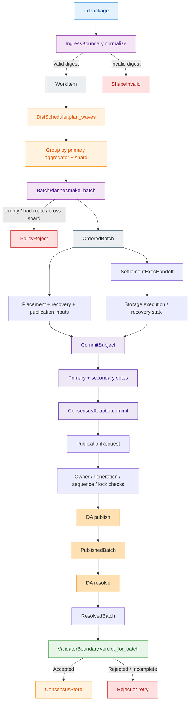

## 🎯 Главное

Да, Tx превращается в `WorkItem`, затем из нескольких `WorkItem` формируется `OrderedBatch`. Но важная деталь: `BatchPlanner` сам не ждёт Tx по таймеру и не накапливает их во внутренней очереди. Он получает уже подготовленный срез `&[WorkItem]`.

В текущем коде полный путь явно показан в `scenario_11`; production-интерфейс aggregator пока разделён на boundary-трейты: `admit`, `order`, `build_publication`, `record_publication` (`crates/z00z_runtime/aggregators/src/service.rs:27`).



## 🔢 Пошаговый путь

### 1. Tx приходит на ingress boundary

Входной тип:

```rust
WorkPayload::Tx(Box<TxPackage>)
```

(`crates/z00z_runtime/aggregators/src/types.rs:86`).

Фактический первый вызов:

```rust
IngressBoundary.normalize(WorkPayload::Tx(...))
```

(`crates/z00z_runtime/aggregators/src/ingress.rs:12`).

На этом этапе aggregator:

1. Берёт поля `TxPackage`.
2. Заново вычисляет digest через `build_tx_package_digest`.
3. Сравнивает вычисленный digest с `pkg.tx_digest_hex`.
4. Проверяет, что digest — корректный lowercase hex размером 32 байта.
5. При несовпадении возвращает `RejectClass::ShapeInvalid`.

(`crates/z00z_runtime/aggregators/src/ingress.rs:27`, `crates/z00z_runtime/aggregators/src/ingress.rs:57`).

То есть caller не может прислать Tx с одним payload и поддельным `tx_digest_hex`.

### 2. Tx превращается в `WorkItem`

После успешной проверки создаётся:

```rust
WorkItem {
    payload,
    payload_digest,
    admission_digest,
    intake_id,
    object_package,
}
```

(`crates/z00z_runtime/aggregators/src/types.rs:115`).

Изначально:

- `payload_digest` = canonical digest Tx;
- `admission_digest` = тот же digest;
- `intake_id` = hex-представление digest;
- `payload` содержит сам `TxPackage`.

(`crates/z00z_runtime/aggregators/src/types.rs:124`).

Для маршрутизации используется `payload_digest`:

```
route_key() -> payload_digest.bytes()
```

(`crates/z00z_runtime/aggregators/src/types.rs:157`).

Важно: здесь ещё не происходит полноценная проверка UTXO, settlement root, quorum или proof. Ingress только связывает digest с фактическим payload.

### 3. Несколько `WorkItem` группируются по shard

Если входов несколько, используется `DistScheduler`.

Он для каждого `WorkItem`:

1. Вычисляет shard через `route_table.lookup(item.route_key())`.
2. Находит placement этого shard.
3. Группирует Tx по паре:

```
(primary aggregator, shard)
```

(`crates/z00z_runtime/aggregators/src/dist_scheduler.rs:52`, `crates/z00z_runtime/aggregators/src/dist_scheduler.rs:58`).

Затем для каждой такой группы вызывает:

```
BatchPlanner::make_batch(batch_id, &grouped_items)
```

(`crates/z00z_runtime/aggregators/src/dist_scheduler.rs:80`).

То есть batch не смешивает Tx разных shard и разных владельцев.

`DistScheduler` также создаёт детерминированный `BatchId`, который зависит от route, количества элементов и digest каждого элемента (`crates/z00z_runtime/aggregators/src/dist_scheduler.rs:134`).

### 4. `BatchPlanner` канонически строит batch

`BatchPlanner::make_batch` получает:

```
batch_id: BatchId
items: &[WorkItem]
```

(`crates/z00z_runtime/aggregators/src/batch_planner.rs:299`).

Дальше он:

1. Отклоняет пустой batch.
2. Проверяет весь `ShardRouteTable`.
3. Для каждого Tx вычисляет route key.
4. Определяет shard.
5. Сортирует элементы по:

```
route_key
kind_tag
digest_hex
```

(`crates/z00z_runtime/aggregators/src/batch_planner.rs:316`, `crates/z00z_runtime/aggregators/src/batch_planner.rs:340`).

1. Проверяет, что все элементы принадлежат одному shard.
2. Если Tx относятся к разным shard, batch отклоняется:

```
multi-shard batch admission stays closed
```

(`crates/z00z_runtime/aggregators/src/batch_planner.rs:347`).

Текущая runtime-волна поддерживает только single-shard batch (`crates/z00z_runtime/aggregators/README.md:10`).

### 5. Формируется `BatchPlanned`

После сортировки создаётся metadata:

```rust
BatchPlanned {
    batch_id,
    route,
    route_table_digest,
    intake_ids,
    op_count,
    plan_digest,
}
```

(`crates/z00z_runtime/aggregators/src/batch_planner.rs:360`).

`plan_digest` связывает:

- `batch_id`;
- shard;
- routing generation;
- digest route table;
- количество элементов;
- kind каждого Tx;
- route key;
- intake digest.

(`crates/z00z_runtime/aggregators/src/batch_planner.rs:475`).

Это защита от ситуации, когда разные aggregator’ы построили разные batch из одного и того же набора Tx.

### 6. Формируется `OrderedBatch`

`OrderedBatch` содержит:

```rust
OrderedBatch {
    batch_id,
    items,
    created_leaves: Vec::new(),
    planned,
}
```

(`crates/z00z_runtime/aggregators/src/batch_planner.rs:299`).

На этом этапе batch только:

- проверен;
- отсортирован;
- привязан к shard;
- снабжён digest’ами.

Он ещё не исполнил Tx и не изменил settlement state.

### 7. Batch отправляется владельцу shard

`DistDispatch::dispatch_batch` повторно вызывает planner и проверяет:

- существует ли placement;
- правильный ли aggregator указан владельцем;
- совпадает ли routing generation;
- совпадает ли route-table digest;
- доступен ли владелец;
- корректны ли process epoch и delivery sequence;
- не было ли duplicate/reorder;
- можно ли захватить storage lock.

(`crates/z00z_runtime/aggregators/src/dist_dispatch.rs:397`, `crates/z00z_runtime/aggregators/src/dist_dispatch.rs:418`).

При успехе возвращается `DispatchStage::Delivered` (`crates/z00z_runtime/aggregators/src/dist_dispatch.rs:551`).

### 8. Создаются execution/recovery inputs

`OrderedBatch::exec_handoff(...)` превращает batch в `SettlementExecHandoff`.

В него попадают:

- `batch_id`;
- shard id;
- routing generation;
- route-table digest;
- `StoreOp`;
- `CheckpointExecTx`.

(`crates/z00z_runtime/aggregators/src/types.rs:255`).

Aggregator передаёт semantic operations, но не становится владельцем settlement proof или backend tree truth. Это прямо зафиксировано в README (`crates/z00z_runtime/aggregators/README.md:32`).

### 9. Создаётся commit subject и собираются голоса

После подготовки recovery/publication данных создаётся `CommitSubject`, который связывает:

- ordered batch;
- route;
- plan digest;
- journal lineage;
- state roots;
- publication binding;
- theorem digest.

В happy-path это видно в `scenario_11` (`crates/z00z_simulator/src/scenario_11/mod.rs:1191`).

Затем primary и secondary формируют votes. `ConsensusAdapter::commit` проверяет votes и создаёт `ShardQuorumCertificate` (`crates/z00z_runtime/aggregators/src/consensus_adapter.rs:142`).

### 10. Строится `PublicationRequest`

После quorum commit создаётся `PublicationRequest`, в который входят:

- подготовленная publication;
- `OrderedBatch`;
- commit subject;
- quorum certificate;
- replay/idempotency key.

(`crates/z00z_simulator/src/scenario_11/mod.rs:1245`).

### 11. DA adapter публикует batch

Перед публикацией проверяются:

1. повторный `idempotency_key`;
2. повторный `batch_id`;
3. payload digest;
4. checkpoint artifact;
5. theorem;
6. checkpoint id;
7. publication binding;
8. quorum binding.

(`crates/z00z_rollup_node/src/da.rs:288`, `crates/z00z_rollup_node/src/da.rs:228`).

Результатом становится `PublishedBatch`, содержащий:

- `batch_id`;
- `checkpoint_id`;
- publication route;
- state roots;
- subject digest;
- certificate digest;
- theorem digest;
- `blob_ref`.

(`crates/z00z_rollup_node/src/da.rs:257`).

### 12. Выполняется `resolve`

`DA::resolve` не просто возвращает сохранённый объект. Он повторно проверяет:

- batch существует;
- publication не помечена missing;
- полученный `PublishedBatch` совпадает с сохранённым;
- payload digest совпадает;
- publication/certificate/theorem metadata совпадают;
- theorem можно пересобрать;
- quorum binding остаётся корректным.

(`crates/z00z_rollup_node/src/da.rs:311`, `crates/z00z_rollup_node/src/da.rs:322`).

После этого создаётся `ResolvedBatch`.

### 13. Validator выносит итоговый verdict

`ValidatorBoundary.verdict_for_batch` сначала запускает `CheckpointFlow::try_from_resolved`.

Проверяются:

- совпадение `batch_id`;
- checkpoint id;
- publication link;
- state roots;
- runtime route;
- route-table digest;
- shard;
- routing generation;
- publication binding;
- quorum certificate.

(`crates/z00z_runtime/validators/src/checkpoint.rs:23`).

Если всё корректно, дополнительно проверяются object packages. Итог:

```
Accepted
Rejected
Incomplete
```

(`crates/z00z_runtime/validators/src/engine.rs:62`).

### 14. Результат сохраняется и используется для recovery

После успешной проверки сохраняются:

1. consensus commit;
2. publication record;
3. validator decision.

Это видно в happy-path (`crates/z00z_simulator/src/scenario_11/mod.rs:1312`).

При restart secondary aggregator может продолжить работу только если совпадают:

- shard;
- routing generation;
- journal lineage;
- state root;
- recovery metadata;
- batch id.

(`crates/z00z_runtime/aggregators/README.md:39`).

## 📌 Самое важное уточнение

Aggregator не делает из Tx сразу proof и не пишет Tx напрямую в checkpoint. Его собственная роль:

```
TxPackage
→ canonical WorkItem
→ route
→ deterministic OrderedBatch
→ owner-bound dispatch
→ execution/publication/consensus handoff
```

А уже затем отдельные подсистемы выполняют settlement, quorum, DA publication, resolve и final validation.

| Файл                                                         | Роль                                     |
| ------------------------------------------------------------ | ---------------------------------------- |
| [ingress.rs (line 12)](/home/vadim/Projects/z00z/crates/z00z_runtime/aggregators/src/ingress.rs:12) | Проверка Tx digest и создание `WorkItem` |
| [dist_scheduler.rs (line 52)](/home/vadim/Projects/z00z/crates/z00z_runtime/aggregators/src/dist_scheduler.rs:52) | Группировка Tx по owner + shard          |
| [batch_planner.rs (line 299)](/home/vadim/Projects/z00z/crates/z00z_runtime/aggregators/src/batch_planner.rs:299) | Канонический batch и `plan_digest`       |
| [dist_dispatch.rs (line 397)](/home/vadim/Projects/z00z/crates/z00z_runtime/aggregators/src/dist_dispatch.rs:397) | Проверка владельца и доставка batch      |
| [da.rs (line 288)](/home/vadim/Projects/z00z/crates/z00z_rollup_node/src/da.rs:288) | Publish/resolve через DA                 |
| [engine.rs (line 62)](/home/vadim/Projects/z00z/crates/z00z_runtime/validators/src/engine.rs:62) | Финальный validator verdict              |
| [scenario_11/mod.rs (line 1150)](/home/vadim/Projects/z00z/crates/z00z_simulator/src/scenario_11/mod.rs:1150) | Полный демонстрационный happy-path       |

Проверка по исходникам отдельно отделила реализованный pipeline `scenario_11` от boundary-контрактов, которые пока не собраны в одну production-функцию aggregator’а.