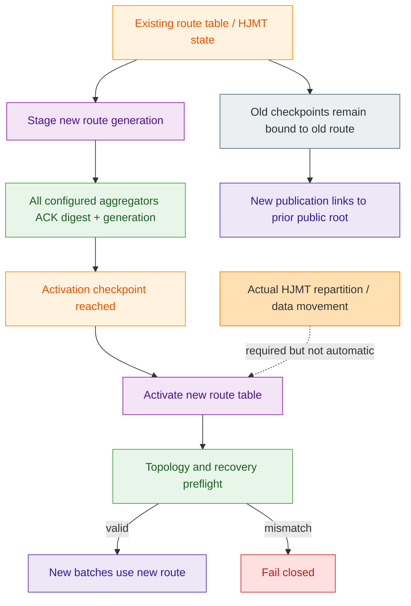

## 🎯 Короткий вывод

| Сценарий                                                     | Текущий статус                                               |
| ------------------------------------------------------------ | ------------------------------------------------------------ |
| Добавить/убрать aggregator, сохранив число shard’ов          | Поддержано через новую `routing_generation`                  |
| Передать shard другому владельцу                             | Поддержано при checkpoint, lineage и placement checks        |
| Изменить 5 shard’ов на 50                                    | Есть route/publication primitives, но нет готового автоматического HJMT resharding |
| Изменить число shard’ов «на лету»                            | Нет полноценного hot-reload пути                             |
| Остановить процессы, мигрировать состояние, запустить новую topology | Возможно только как отдельная управляемая migration-процедура |

## ⚙️ Что умеет текущий код

`ShardRouteTable` действительно может описывать другой набор shard’ов:

```
ShardRouteTable {
    routing_generation,
    shard_set,
    rules,
    previous_generation_digest,
    activation_checkpoint,
}
```

(`crates/z00z_runtime/aggregators/src/batch_planner.rs:83`).

Новая таблица обязана:

1. иметь больший `routing_generation`;
2. ссылаться на digest предыдущей таблицы;
3. иметь неубывающий activation checkpoint;
4. покрывать весь hash-domain без gaps/overlaps;
5. иметь уникальные shard id.

(`crates/z00z_runtime/aggregators/src/batch_planner.rs:237`).

Есть отдельный runtime-механизм `RouteRollout`:

```
old route
  → stage(new route)
  → every process ACKs generation + digest
  → checkpoint reached
  → activate(new route)
```

(`crates/z00z_runtime/aggregators/src/dist_dispatch.rs:127`, `:172`, `:219`).

Без всех ACK или до нужного checkpoint активация отклоняется. Это проверяется тестами (`crates/z00z_runtime/aggregators/tests/test_hjmt_route_rollout.rs:29`).



## ✅ Что реально покрыто тестами

### 1. Изменение числа aggregator’ов при том же числе shard’ов

Это поддерживается.

Например, тест добавляет шестой aggregator к topology из семи shard’ов, но route table остаётся byte-identical (`crates/z00z_runtime/aggregators/tests/test_hjmt_join.rs:35`).

Также поддерживается смена primary owner:

- старая generation: owner `0`;
- новая generation: owner `5`;
- старый owner остаётся secondary;
- generation увеличивается с `1` до `2`.

(`crates/z00z_runtime/aggregators/tests/test_hjmt_join.rs:63`).

Удаление aggregator’а тоже проверяется через generation-bound migration (`crates/z00z_runtime/aggregators/tests/test_hjmt_migrate.rs:82`).

### 2. Изменение route generation

Publication-контракт умеет принять successor с новым route digest:

```
old route digest, generation 7
        ↓
new route digest, generation 8
```

Тест проверяет, что новый publication продолжает цепочку от старого public root и все новые shard leaves используют новый digest (`crates/z00z_storage/tests/test_hjmt_root_generation.rs:355`).

Но это проверка continuity publication, а не автоматическое перемещение всех старых HJMT leaves.

## ❌ Что не делается автоматически

### 1. Route rollout не меняет live topology сам

`RouteRollout` — runtime primitive. Вызовы `.stage()`, `.ack()` и `.activate()` находятся в тестах; я не нашёл production-пути, который бы автоматически применял новую route table ко всем живым `NodeRuntime`, aggregator process и `SettlementStore`.

Node при загрузке читает route table из canonical-файла, проверяет его digest и затем выполняет startup preflight (`crates/z00z_rollup_node/src/config.rs:381`, `crates/z00z_rollup_node/src/config.rs:1510`).

То есть текущая модель ближе к:

```
подготовить новую конфигурацию
→ выполнить rollout protocol
→ остановить/перезапустить нужные процессы
→ пройти preflight
```

а не к полноценному:

```
live process reloads 5 shards into 50 without interruption
```

### 2. Topology должна точно совпадать с route table

Preflight требует, чтобы:

```
route_table.shard_set == declared topology shard ids
```

(`crates/z00z_rollup_node/src/config.rs:1247`).

Также:

- все aggregator’ы должны иметь одну `routing_generation`;
- planner должен иметь ту же generation;
- placement должен покрывать каждый route shard;
- у каждого shard должен быть корректный primary и secondary.

(`crates/z00z_rollup_node/src/config.rs:1116`, `crates/z00z_rollup_node/src/config.rs:1222`).

Поэтому нельзя просто заменить route-файл с 5 shard’ами на route-файл с 50 shard’ами, оставив старые process configs.

### 3. Старый recovery state не совместим автоматически с новой route

Recovery хранит route context:

```
SettlementRouteCtx {
    batch_id,
    shard_id,
    routing_generation,
    route_table_digest,
}
```

(`crates/z00z_storage/src/settlement/store.rs:78`).

При recovery проверяются:

- shard id;
- routing generation;
- route-table digest;
- journal lineage;
- batch id;
- state root;
- backend generation.

(`crates/z00z_runtime/aggregators/src/recovery.rs:80`).

Если старый HJMT recovery state относится к generation 1, а live topology уже generation 2, recovery отклоняется как `wrong generation`. Это специально проверено тестом route migration during crash (`crates/z00z_runtime/aggregators/tests/test_hjmt_migrate.rs:198`).

## 🧱 Что происходит с уже существующим HJMT

`SettlementStore` содержит локальное HJMT state и recovery metadata; сам store не содержит встроенной операции вида:

```
reshard(old_count = 5, new_count = 50)
```

(`crates/z00z_storage/src/settlement/store.rs:51`).

При применении execution handoff HJMT меняет свой state root, но route context лишь прикрепляется к commit/journal metadata (`crates/z00z_storage/src/settlement/hjmt_commit.rs:190`, `crates/z00z_storage/src/settlement/hjmt_journal.rs:62`).

Следовательно, для перехода `5 → 50` потребуется отдельно:

1. остановить или заморозить старый write path;
2. получить консистентный старый public/root state;
3. построить новую 50-shard route table;
4. создать новую placement topology;
5. физически или логически распределить прежние данные по новым shard’ам;
6. создать новые shard roots и publication leaves;
7. связать новую publication с предыдущим public root;
8. обновить recovery/journal route metadata;
9. пройти preflight всех aggregator’ов;
10. только после checkpoint activation разрешить новые записи.

В коде есть контракты для проверки нового route и publication continuity, но готового общего шага «прочитать старый 5-shard HJMT и автоматически разложить его в 50 shard’ов» нет.

## 🔒 Можно ли писать сначала в 5, потом в 50?

Исторически — да, если это оформлено как route migration:

```
checkpoint N: 5-shard route
checkpoint N+1: 50-shard route
```

Старый checkpoint должен оставаться привязанным к старому digest, а новый — содержать новую route snapshot и новые shard leaves. Publication route требует, чтобы число handoff rows и shard leaves точно совпадало с активным route (`crates/z00z_storage/src/settlement/proof_batch_verify.rs:90`).

Но произвольно чередовать записи:

```
Tx → old 5-shard route
Tx → new 50-shard route
Tx → old 5-shard route снова
```

нельзя. Для каждого batch и recovery должны совпадать generation и route digest. Старый batch нельзя продолжить через новую placement table (`crates/z00z_runtime/aggregators/src/recovery.rs:130`).

## ✅ Итог

Система сохраняет consistency при изменении числа shard’ов только при полноценной versioned migration.

Текущий код уже хорошо защищает границы:

- generation monotonicity;
- route digest binding;
- exact topology coverage;
- recovery lineage;
- publication shard count;
- old/new public root continuity.

Но автоматического live resharding существующего HJMT `5 → 50` сейчас нет. Без отдельной repartition/migration-фазы система должна fail-closed, а не продолжать запись в смешанную topology.

| Файл                                                         | Роль                                                   |
| ------------------------------------------------------------ | ------------------------------------------------------ |
| [batch_planner.rs (line 237)](/home/vadim/Projects/z00z/crates/z00z_runtime/aggregators/src/batch_planner.rs:237) | Проверка migration между route generations             |
| [dist_dispatch.rs (line 127)](/home/vadim/Projects/z00z/crates/z00z_runtime/aggregators/src/dist_dispatch.rs:127) | Stage/ACK/activate route rollout                       |
| [config.rs (line 1222)](/home/vadim/Projects/z00z/crates/z00z_rollup_node/src/config.rs:1222) | Проверка соответствия route table и topology           |
| [recovery.rs (line 80)](/home/vadim/Projects/z00z/crates/z00z_runtime/aggregators/src/recovery.rs:80) | Fail-closed recovery при route/generation drift        |
| [store.rs (line 78)](/home/vadim/Projects/z00z/crates/z00z_storage/src/settlement/store.rs:78) | Route context существующего HJMT state                 |
| [proof_batch_verify.rs (line 90)](/home/vadim/Projects/z00z/crates/z00z_storage/src/settlement/proof_batch_verify.rs:90) | Проверка полного набора active shard leaves            |
| [test_hjmt_join.rs (line 63)](/home/vadim/Projects/z00z/crates/z00z_runtime/aggregators/tests/test_hjmt_join.rs:63) | Поддержанный owner/generation migration                |
| [test_hjmt_migrate.rs (line 198)](/home/vadim/Projects/z00z/crates/z00z_runtime/aggregators/tests/test_hjmt_migrate.rs:198) | Запрет recovery во время несовместимой route migration |