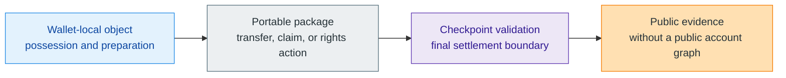
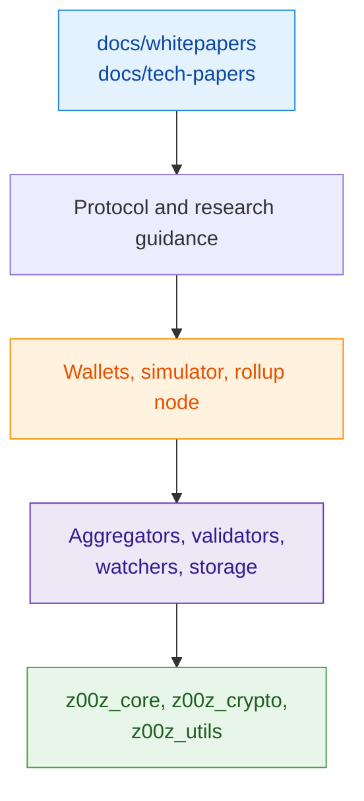

# Z00Z

> **Private objects. Wallet-local possession. Checkpointed settlement. Narrow public evidence.**

Z00Z is a private-object and settlement architecture. It keeps the private meaning of value and rights in wallets, moves transfers and claims as portable packages, and uses checkpoints to decide when a typed transition becomes final settlement.

Unlike a public-account chain, Z00Z is not designed around a permanent public graph of reusable accounts, balances, and ownership history. The public layer keeps the narrower artifacts required for shared verification: commitments, roots, deltas, proofs, checkpoint references, and settlement evidence. The wallet keeps the private context needed to recognize objects, prepare actions, and decide what to disclose.

The goal is not to hide an ordinary account system behind stronger encryption. The goal is to change what must be public in the first place, while preserving replay-safe and independently verifiable settlement.

This repository is the implementation and validation workspace for that model. It gives protocol, wallet, storage, and runtime builders concrete Rust crates, simulator scenarios, and verification gates without presenting the entire research architecture as an already deployed production network.

## Table of Contents

- [Why Z00Z Exists](#why-z00z-exists)
- [How Z00Z Works](#how-z00z-works)
- [What Z00Z Is Not](#what-z00z-is-not)
- [Repository Scope](#repository-scope)
- [Quickstart](#quickstart)
- [Workspace Map](#workspace-map)
- [Documentation Map](#documentation-map)
- [Installation](#installation)
- [Common Workflows](#common-workflows)
- [Verification](#verification)
- [Maturity Model](#maturity-model)
- [Troubleshooting](#troubleshooting)
- [Contributing](#contributing)
- [License](#license)

## Why Z00Z Exists

Public-account systems usually make shared state answer a broad question: who owns what, under which address, after which public execution history? That model is easy to inspect, but it also creates a reusable public economic graph.

Z00Z separates two kinds of truth:

- **Wallet-local possession:** the wallet holds private object meaning, receiver material, local history, and the information needed to prepare a transfer or claim.
- **Public settlement:** the checkpoint layer records only the bounded evidence needed to establish that a typed transition is valid, ordered, and replay-safe.

This separation lets privacy and verifiability live at different layers. Privacy does not mean that nothing ever becomes public. It means the public surface is limited to what shared settlement actually needs.

The target architecture extends the same model beyond coin balances to private assets, vouchers, payment requests, claims, and rights-oriented objects without turning every private relationship into a permanent public account row. That broader rights economy is corpus-backed direction and is not presented here as a fully deployed system.

## How Z00Z Works



1. **Possess locally.** A wallet recognizes private objects and holds the private context needed to act on them.
2. **Prepare a portable package.** A transfer, claim, or rights action carries bounded proof and transition material instead of exposing the wallet's full history.
3. **Validate at a checkpoint.** Publication or local acceptance is not finality. Checkpoint rules decide whether the transition becomes canonical, ordered, and replay-safe settlement.
4. **Publish narrow evidence.** The public record exposes what independent verification requires without becoming a reusable public ownership graph.

## What Z00Z Is Not

| Misleading category | Why it misses the project |
| --- | --- |
| A privacy coin with hidden balances | Z00Z changes the default object and settlement boundary rather than only hiding an account ledger. |
| A generic private smart-contract chain | A universal hidden VM is not the primary model; typed objects, packages, checkpoints, and evidence are. |
| A hosted wallet or payment network | Wallets and operators can provide services, but those services do not become the protocol's settlement authority. |
| An official DEX, bridge, or custodian | Trading, bridging, custody, redemption, and issuer promises remain separate service roles with their own trust boundaries. |
| A promise of total anonymity | Public proofs, roots, checkpoints, publication timing, and external services still create observable surfaces that must be evaluated separately. |

## Repository Scope

This repository combines two evidence layers that must be read separately:

- **Live implementation:** Rust crates, binaries, tests, benchmarks, configuration fixtures, and verification tooling.
- **Architecture corpus:** whitepapers and technical papers that define the wider protocol direction, maturity boundaries, and open research.

The live workspace currently contains:

- foundational crates for cryptography, typed objects, and shared utilities;
- storage and proof surfaces for checkpointed settlement;
- runtime crates for aggregation, validation, watching, and rollup-node orchestration;
- wallet code with native, WASM, and GUI-oriented surfaces;
- simulator binaries and tests for scenario-driven validation.

> [!IMPORTANT]
> Working crates and runnable tooling are real repository evidence. Broader claims from the research corpus—including some rights, service, disclosure, and migration lanes—remain target architecture until current code and tests prove them directly.

## Quickstart

> [!IMPORTANT]
> The active workspace is a Rust monorepo. The fastest successful first run is a workspace check plus CLI surface inspection, not a full protocol deployment. Run Cargo workflows with `--release`: debug binaries and test runs can be substantially slower.

```bash
rustup toolchain install stable
rustup component add rustfmt clippy
git clone https://github.com/z00z-labs/z00z.git
cd z00z
cargo check --workspace --release
cargo run --release -p z00z_rollup_node -- --help
cargo run --release -p z00z_simulator --bin scenario_1 -- --help
```

What this proves:

- the workspace resolves and compiles locally;
- the current rollup-node CLI contract is present;
- the simulator binary surface is present.

## Workspace Map

| Area | Packages | Purpose |
| --- | --- | --- |
| Foundations | `z00z_utils`, `z00z_crypto`, `z00z_core` | Shared abstractions, cryptography, and object semantics |
| Storage | `z00z_storage` | Settlement roots, checkpoints, and storage contracts |
| Runtime | `z00z_aggregators`, `z00z_validators`, `z00z_watchers`, `z00z_rollup_node` | Aggregation, validation, watcher logic, and rollup-node execution |
| Client surfaces | `z00z_wallets` | Wallet logic, WASM output, native tools, and GUI-facing entrypoints |
| Integration | `z00z_simulator`, `z00z_telemetry` | Scenario runners, integration harnesses, and observability helpers |
| Transport | `z00z_networks_rpc`, `onionnet` | RPC and network-boundary crates in the active workspace |



## Documentation Map

The tracked documentation surface under `docs/` is intentionally narrow:

- [`docs/whitepapers/`](docs/whitepapers) holds the main architecture corpus, including privacy, checkpoints, smart cash, cross-chain integration, post-quantum migration, and legal boundaries.
- [`docs/tech-papers/`](docs/tech-papers) holds narrower technical notes, specs, benchmarks, verification notes, and design follow-ups.

Recommended reading order:

1. Start with [`docs/whitepapers/Main-Whitepaper.md`](docs/whitepapers/Main-Whitepaper.md) for the system thesis.
2. Use [`docs/whitepapers/Privacy-Threat-Model.md`](docs/whitepapers/Privacy-Threat-Model.md) and [`docs/whitepapers/Post-Quantum-Migration.md`](docs/whitepapers/Post-Quantum-Migration.md) for security and migration boundaries.
3. Use `docs/tech-papers/` when you need a narrower implementation or research lane such as rollup-node, recursive checkpoints, benchmarks, or verification notes.

> [!NOTE]
> The repository keeps live implementation and target architecture separate. Research papers can describe system direction more broadly than the currently shipped Rust runtime surfaces.

## Installation

### Required prerequisites

- Rust stable toolchain with `rustfmt` and `clippy`
- `jq` if you want to reuse some workspace inspection commands

```bash
rustup toolchain install stable
rustup component add rustfmt clippy
```

### Optional prerequisites

Use these only if you need the wallet WASM path:

```bash
rustup target add wasm32-unknown-unknown
cargo install wasm-pack
```

If you want optimized WASM output from `scripts/build_wasm.sh`, install `wasm-opt` through Binaryen or another compatible package source.

## Common Workflows

### Build the workspace

```bash
cargo check --workspace --release
cargo test --workspace --release
```

### Inspect the current rollup-node CLI contract

```bash
cargo run --release -p z00z_rollup_node -- --help
```

Current help output defines this live entrypoint:

```text
z00z_rollup_node --mode aggregator --aggregator-config <path> --planner-config <path> --storage-config <path>
```

> [!IMPORTANT]
> The current CLI help states that only `--mode aggregator` is executable in the live process contract.

### Run the simulator surface

```bash
cargo run --release -p z00z_simulator --bin scenario_1 -- --help
```

### Build wallet WASM artifacts

```bash
./scripts/build_wasm.sh
./scripts/serve_wasm.sh 8000
```

`./scripts/build_wasm.sh` writes optimized release artifacts into `www/pkg/`. `./scripts/serve_wasm.sh` serves the `www/` directory for local testing. Use `./scripts/build_wasm.sh --dev` only for short iteration loops.

## Verification

For normal development, use the standard Rust gates first:

```bash
cargo fmt --check
cargo clippy --workspace --release --all-targets --all-features -- -D warnings
cargo test --workspace --release
```

For the repository-wide verification sweep, use the canonical script:

```bash
./.github/skills/z00z-full-verify-gate/scripts/full_verify.sh
```

That script runs a broader gate that includes:

- formatting check;
- workspace clippy with warnings denied;
- workspace tests for libs, bins, tests, examples, and doctests;
- bench compilation;
- whitelisted runnable targets;
- long-running test reporting;
- optional heavy validation stages when enabled by environment flags.

Its Cargo clippy, test, and benchmark stages already use the release profile.

## Maturity Model

The repository follows a strict distinction between what is currently proved by code and what is currently described by the architecture corpus.

| Evidence band | What it means here |
| --- | --- |
| Live repository evidence | Rust crates, binaries, tests, scripts, manifests, and tracked documentation in this repo |
| Corpus-backed target architecture | Whitepapers and technical papers that define intended protocol behavior beyond the currently proved code surface |
| Open research or hardening | Topics still being refined through technical papers, benchmarks, and validation notes |

Practical rule:

- if a statement is about a command, crate, binary, feature, or script, verify it against the current repository;
- if a statement is about the broader settlement model, rights model, privacy posture, or future protocol lanes, verify it against `docs/whitepapers/` and keep the wording maturity-aware.

## Troubleshooting

- `cargo check --workspace --release` fails immediately: verify that your Rust toolchain is new enough for the workspace `rust-version = "1.90.0"`.
- WASM build fails on `wasm-pack`: install `wasm-pack` and the `wasm32-unknown-unknown` target before running `scripts/build_wasm.sh`.
- WASM build skips optimization: `wasm-opt` is optional; the script can still produce development output without it.
- Full verification takes a long time: start with `cargo check --workspace --release`, `cargo test --workspace --release`, and only then run `full_verify.sh`.
- A research paper sounds broader than the shipped code: treat the paper as target architecture unless the current crate surfaces prove the claim directly.

## Contributing

Before opening a change:

1. Keep code, docs, comments, and technical artifacts in English.
2. Prefer existing abstractions from `z00z_utils` instead of bypassing them in business crates.
3. Do not modify vendored Tari code under `crates/z00z_crypto/tari/`.
4. Run the verification commands above for the scope you changed.
5. Keep documentation claims aligned with the current maturity band.

Useful local instruction surfaces:

- [`.github/copilot-instructions.md`](.github/copilot-instructions.md)
- [`.github/requirements/Z00Z_DESIGN_FOUNDATION.md`](.github/requirements/Z00Z_DESIGN_FOUNDATION.md)

## License

The workspace manifest declares `MIT` at the root. Some member crates declare crate-level licensing such as `MIT OR BSD-3-Clause`.

If you redistribute or package a specific crate independently, check that crate's `Cargo.toml` rather than assuming a single license applies uniformly to every member.
