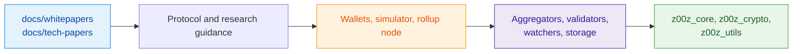

# Z00Z

Z00Z is a privacy-first Rust workspace for private objects, wallet-local possession, checkpointed settlement, storage proofs, rollup services, and scenario-driven validation.

This repository combines two layers that should be read separately:

- live implementation crates and runnable tooling;
- research and architecture corpus in `docs/whitepapers/` and `docs/tech-papers/`.

The codebase already exposes real Rust crates, tests, binaries, and verification gates. Some broader protocol claims in the research corpus still describe target architecture rather than fully shipped runtime behavior, so the README keeps those boundaries explicit.

## Table of Contents

- [Quickstart](#quickstart)
- [What Is In This Repository](#what-is-in-this-repository)
- [Workspace Map](#workspace-map)
- [Documentation Map](#documentation-map)
- [Installation](#installation)
- [Common Workflows](#common-workflows)
- [Verification](#verification)
- [Maturity Model](#maturity-model)
- [Troubleshooting](#troubleshooting)
- [Contributing](#contributing)
- [License](#license)

## Quickstart

> [!IMPORTANT]
> The active workspace is a Rust monorepo. The fastest successful first run is a workspace check plus CLI surface inspection, not a full protocol deployment.

```bash
rustup toolchain install stable
rustup component add rustfmt clippy
git clone https://github.com/z00z-labs/z00z.git
cd z00z
cargo check --workspace
cargo run -p z00z_rollup_node -- --help
cargo run -p z00z_simulator --bin scenario_1 -- --help
```

What this proves:

- the workspace resolves and compiles locally;
- the current rollup-node CLI contract is present;
- the simulator binary surface is present.

## What Is In This Repository

Z00Z is not just a paper dump and not just a single crate. The repository currently contains:

- foundational crates for cryptography, typed objects, and shared utilities;
- storage and proof surfaces for checkpointed settlement;
- runtime crates for aggregation, validation, watching, and rollup-node orchestration;
- wallet crates with native, WASM, and GUI-oriented surfaces;
- simulator binaries and tests for scenario-driven validation;
- curated research and architecture documents in `docs/whitepapers/` and `docs/tech-papers/`.

## Workspace Map

| Area | Packages | Purpose |
| --- | --- | --- |
| Foundations | `z00z_utils`, `z00z_crypto`, `z00z_core` | Shared abstractions, cryptography, and object semantics |
| Storage | `z00z_storage` | Settlement roots, checkpoints, and storage contracts |
| Runtime | `z00z_aggregators`, `z00z_validators`, `z00z_watchers`, `z00z_rollup_node` | Aggregation, validation, watcher logic, and rollup-node execution |
| Client surfaces | `z00z_wallets` | Wallet logic, WASM output, native tools, and GUI-facing entrypoints |
| Integration | `z00z_simulator`, `z00z_telemetry` | Scenario runners, integration harnesses, and observability helpers |
| Transport | `z00z_networks_rpc`, `onionnet` | RPC and network-boundary crates in the active workspace |



## Documentation Map

The tracked documentation surface under `docs/` is intentionally narrow:

- [`docs/whitepapers/`](docs/whitepapers) holds the main architecture corpus, including privacy, checkpoints, smart cash, cross-chain integration, post-quantum migration, and legal boundaries.
- [`docs/tech-papers/`](docs/tech-papers) holds narrower technical notes, specs, benchmarks, verification notes, and design follow-ups.

Recommended reading order:

1. Start with [`docs/whitepapers/Main-Whitepaper.md`](docs/whitepapers/Main-Whitepaper.md) for the system thesis.
2. Use [`docs/whitepapers/Privacy-Threat-Model.md`](docs/whitepapers/Privacy-Threat-Model.md) and [`docs/whitepapers/Post-Quantum-Migration.md`](docs/whitepapers/Post-Quantum-Migration.md) for security and migration boundaries.
3. Use `docs/tech-papers/` when you need a narrower implementation or research lane such as rollup-node, recursive checkpoints, benchmarks, or verification notes.

> [!NOTE]
> The repository keeps live implementation and target architecture separate. Research papers can describe system direction more broadly than the currently shipped Rust runtime surfaces.

## Installation

### Required prerequisites

- Rust stable toolchain with `rustfmt` and `clippy`
- `jq` if you want to reuse some workspace inspection commands

```bash
rustup toolchain install stable
rustup component add rustfmt clippy
```

### Optional prerequisites

Use these only if you need the wallet WASM path:

```bash
rustup target add wasm32-unknown-unknown
cargo install wasm-pack
```

If you want optimized WASM output from `scripts/build_wasm.sh`, install `wasm-opt` through Binaryen or another compatible package source.

## Common Workflows

### Build the workspace

```bash
cargo check --workspace
cargo test --workspace
```

### Inspect the current rollup-node CLI contract

```bash
cargo run -p z00z_rollup_node -- --help
```

Current help output defines this live entrypoint:

```text
z00z_rollup_node --mode aggregator --aggregator-config <path> --planner-config <path> --storage-config <path>
```

> [!IMPORTANT]
> The current CLI help states that only `--mode aggregator` is executable in the live process contract.

### Run the simulator surface

```bash
cargo run -p z00z_simulator --bin scenario_1 -- --help
```

### Build wallet WASM artifacts

```bash
./scripts/build_wasm.sh --dev
./scripts/serve_wasm.sh 8000
```

`./scripts/build_wasm.sh` writes browser artifacts into `www/pkg/`. `./scripts/serve_wasm.sh` serves the `www/` directory for local testing.

### Inspect wallet-oriented binaries

The wallet crate currently declares these notable binaries:

- `z00z_wallet_egui`
- `z00z-wallet-validate`
- `gen_password_bloom`

See [`crates/z00z_wallets/Cargo.toml`](crates/z00z_wallets/Cargo.toml) for the current binary, benchmark, feature, and target matrix.

## Verification

For normal development, use the standard Rust gates first:

```bash
cargo fmt --check
cargo clippy --workspace --all-targets --all-features -- -D warnings
cargo test --workspace
```

For the repository-wide verification sweep, use the canonical script:

```bash
./.github/skills/z00z-full-verify-gate/scripts/full_verify.sh
```

That script runs a broader gate that includes:

- formatting check;
- workspace clippy with warnings denied;
- workspace tests for libs, bins, tests, examples, and doctests;
- bench compilation;
- whitelisted runnable targets;
- long-running test reporting;
- optional heavy validation stages when enabled by environment flags.

## Maturity Model

The repository follows a strict distinction between what is currently proved by code and what is currently described by the architecture corpus.

| Evidence band | What it means here |
| --- | --- |
| Live repository evidence | Rust crates, binaries, tests, scripts, manifests, and tracked documentation in this repo |
| Corpus-backed target architecture | Whitepapers and technical papers that define intended protocol behavior beyond the currently proved code surface |
| Open research or hardening | Topics still being refined through technical papers, benchmarks, and validation notes |

Practical rule:

- if a statement is about a command, crate, binary, feature, or script, verify it against the current repository;
- if a statement is about the broader settlement model, rights model, privacy posture, or future protocol lanes, verify it against `docs/whitepapers/` and keep the wording maturity-aware.

## Troubleshooting

- `cargo check --workspace` fails immediately: verify that your Rust toolchain is new enough for the workspace `rust-version = "1.90.0"`.
- WASM build fails on `wasm-pack`: install `wasm-pack` and the `wasm32-unknown-unknown` target before running `scripts/build_wasm.sh`.
- WASM build skips optimization: `wasm-opt` is optional; the script can still produce development output without it.
- Full verification takes a long time: start with `cargo check --workspace`, `cargo test --workspace`, and only then run `full_verify.sh`.
- A research paper sounds broader than the shipped code: treat the paper as target architecture unless the current crate surfaces prove the claim directly.

## Contributing

Before opening a change:

1. Keep code, docs, comments, and technical artifacts in English.
2. Prefer existing abstractions from `z00z_utils` instead of bypassing them in business crates.
3. Do not modify vendored Tari code under `crates/z00z_crypto/tari/`.
4. Run the verification commands above for the scope you changed.
5. Keep documentation claims aligned with the current maturity band.

Useful local instruction surfaces:

- [`.github/copilot-instructions.md`](.github/copilot-instructions.md)
- [`.github/requirements/Z00Z_DESIGN_FOUNDATION.md`](.github/requirements/Z00Z_DESIGN_FOUNDATION.md)

## License

The workspace manifest declares `MIT` at the root. Some member crates declare crate-level licensing such as `MIT OR BSD-3-Clause`.

If you redistribute or package a specific crate independently, check that crate's `Cargo.toml` rather than assuming a single license applies uniformly to every member.
