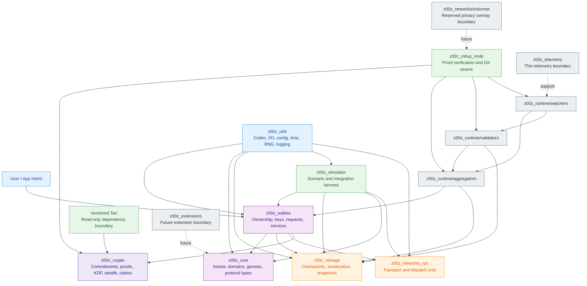
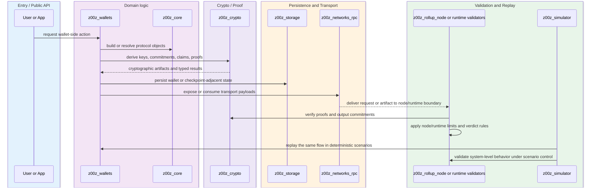
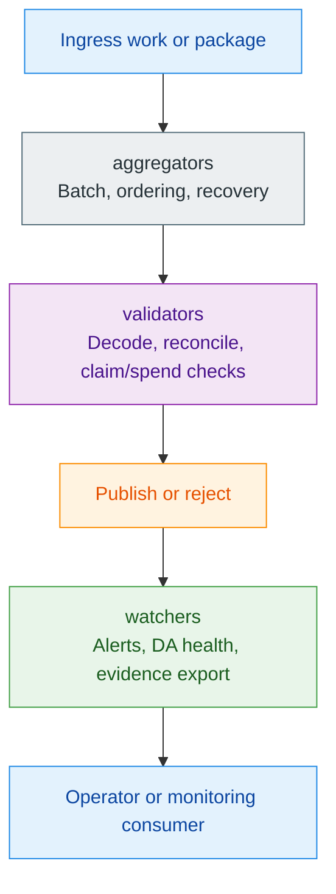

# Z00Z Crates Workspace — Technical Story

## 🎯 1. Story Hook

The `crates/` subtree is the executable heart of Z00Z: it turns the project from a set of ideas about private, asset-oriented blockchain flows into a layered Rust workspace with concrete protocol, cryptography, wallet, storage, transport, and simulator surfaces. The current workspace layout and crate-root docs present a deliberate pattern: `z00z_utils` defines the reusable operating boundaries, `z00z_crypto` hides vendor crypto behind a Z00Z-shaped API, `z00z_core` models the protocol itself, and the remaining crates compose those layers into persistence, wallets, transport, rollup verification, runtime services, and scenario-driven validation. Taken together, the crates read not as one monolith but as a staged system where ownership logic lives close to wallets and proofs, while the chain-facing pieces stay narrow, typed, and reviewable. For a new contributor, the most important mental model is this: Z00Z is built as a privacy-first protocol stack with strict crate boundaries, not as a single node binary that owns everything.

## 📌 2. Scope Declaration

- **Requested scope:** `/home/vadim/Projects/z00z/crates`
- **Depth mode:** `deep-dive`
- **Focus:** `overall z00z functionality description - detailed`
- **Output path:** `crates/z00z_overview.md`
- **Primary entry evidence:** workspace manifest at `/home/vadim/Projects/z00z/Cargo.toml`
- **Boundary note:** this scope is workspace-wide across the first-party crates subtree, so this document is a crate-level deep dive rather than a file-by-file inventory of every Rust file under `crates/`
- **Compression note:** exhaustive per-file tracing of every source file inside `crates/` would be too large and would blur the architectural story. This document therefore accounts for every relevant crate and every visible top-level module boundary in the active first-party workspace, while explicitly compressing the vendored Tari subtree and other non-facade implementation details.
- **Inferred exclusions:** vendored Tari sources under `crates/z00z_crypto/tari/` are included as a dependency boundary, not as editable owned implementation; fuzz-only and bench-only subpackages are referenced as verification surfaces, not unpacked module-by-module.

## 🔑 3. Knowledge Map

### 📌 Workspace root and membership

- **Workspace orchestration**
  - `Cargo.toml` - declares the active workspace members and shared dependency policy

### 🔑 Foundation layer

- **Cross-cutting abstractions**
  - `z00z_utils/` - shared utilities for codec, config, I/O, logging, metrics, RNG, time, compression, and OS hardening

### 🔑 Cryptography and protocol layer

- **Crypto facade and vendor isolation**
  - `z00z_crypto/` - Z00Z-owned cryptographic API over vendored Tari primitives
  - `z00z_crypto/tari/` - read-only vendored dependency boundary
- **Protocol domain**
  - `z00z_core/` - asset model, genesis, hashing, domains, state-related protocol logic

### ⚙️ Persistence and chain-facing application layer

- **Persistence and snapshots**
  - `z00z_storage/` - checkpointing, serialization, snapshots, asset-oriented persistence helpers
- **Wallet and user-side ownership flows**
  - `z00z_wallets/` - wallet core, services, RPC adapters, persistence backends, WASM support, optional desktop UI
- **Scenario and validation harness**
  - `z00z_simulator/` - deterministic scenario execution and integration-level workflow replay

### 🚩 Transport and node-facing layer

- **Transport-only RPC**
  - `z00z_networks/rpc/` - dispatch and transport abstraction, not the full network stack
- **Privacy overlay placeholder boundary**
  - `z00z_networks/onionnet/` - reserved node-owned privacy overlay boundary
- **Rollup-facing proof verification**
  - `z00z_rollup_node/` - proof verification helpers, DA adapter seams, runtime lifecycle scaffolding

### 👁️‍🗨️ Runtime monitoring and orchestration layer

- **Batching and publication**
  - `z00z_runtime/aggregators/` - aggregation, ordering, recovery, scheduling seams
- **Validation engine**
  - `z00z_runtime/validators/` - checkpoint, claim, spend, and transaction package validation boundaries
- **Operational watchers**
  - `z00z_runtime/watchers/` - alerts, censorship watch, DA health, evidence export, publication watch

### ⚠️ Thin or emerging boundaries

- **Telemetry surface**
  - `z00z_telemetry/` - thin crate-level telemetry boundary
- **Extension boundary**
  - `z00z_extensions/` - reserved extension layer with minimal present implementation
- **Offline or adjacent subtree**
  - `z00z-offline/` - present in `crates/` but not declared as an active workspace member in the root manifest

## 📌 4. Story Walkthrough

### 🎯 4.1 The big idea

Z00Z is structured like a privacy-oriented protocol factory rather than a classic monolithic node. The inner layers define rules and cryptographic operations. The middle layers persist, package, and move those rules through wallet and simulation flows. The outer layers translate those flows into RPC, rollup verification, runtime orchestration, and operator-facing monitoring. The repository structure and crate docs consistently reserve separate boundaries for cryptographic correctness, wallet ownership semantics, transport mechanics, and operational policy instead of collapsing them into one tangled code surface.

### 🔑 4.2 Foundation first: `z00z_utils`

#### 🔑 `z00z_utils`

- **Responsibility:** Provides the repository-wide one-source-of-truth abstractions for generic operational concerns such as codec, configuration, file I/O, logging, metrics, RNG, time, compression, and OS hardening.
- **Visibility:** Public foundation crate used by higher-level crates.
- **Used by (upstream):** `z00z_core`, `z00z_wallets`, `z00z_storage`, `z00z_simulator`, and other first-party crates.
- **Depends on (downstream):** Standard Rust ecosystem libraries plus its own internal modules such as `codec`, `config`, `io`, `logger`, `metrics`, `rng`, and `time`.
- **Splitability:** Already well-factored at module level. Future splits would likely only happen if a subdomain such as logging or config becomes independently heavy.
- **Provides:** `prelude` re-exports and the core traits and helpers that other crates are expected to consume instead of directly binding low-level libraries.
- **Notes:** This crate is the architectural discipline anchor. If business crates start bypassing it for raw file I/O, config parsing, time, logging, or RNG, the workspace loses one of its main design guarantees.

What story it tells:

- Z00Z does not want operational concerns scattered across the repo.
- Instead, it centralizes those concerns into explicit abstractions so higher layers can stay deterministic, testable, and policy-driven.

### 🔑 4.3 Hidden backend, visible contract: `z00z_crypto`

#### 🔑 `z00z_crypto`

- **Responsibility:** Exposes the Z00Z-approved cryptographic contract while hiding backend-specific implementation details and keeping vendored Tari code behind a wrapper boundary.
- **Visibility:** Public crypto crate and approved crypto integration surface.
- **Used by (upstream):** `z00z_core`, `z00z_wallets`, `z00z_rollup_node`, `z00z_simulator`, and other proof-facing higher layers.
- **Depends on (downstream):** Its public modules (`claim`, `commitments`, `hash`, `kdf`, `range_proofs`, `secret`, `validation`, `vendor`, `zkpack`, `types`) plus private backend files such as `backend.rs`, `backend_handles.rs`, and `backend_tari.rs`.
- **Splitability:** The crate is broad but deliberately facade-based. Split pressure exists around AEAD, hash policy, KDF, and proof logic, but the current broad surface still serves the project's “single approved crypto entrypoint” goal.
- **Provides:** Commitments, range-proof helpers, claim statement and proof helpers, KDFs, stealth binding helpers, typed scalars and commitments, HMAC and framing helpers, and selective re-exports of Tari-backed primitives.
- **Notes:** The crate mixes public protocol-facing exports with internal backend ownership. That is intentional: outside code should use Z00Z crypto types and functions without depending on Tari shapes directly.

Top-level module map inside `src/`:

- **Public crypto workflows**
  - `claim/` - claim-related proof statements and verification surfaces
  - `commitments.rs` - commitment generation and opening helpers
  - `hash.rs`, `hash_*` - hash policy, typed hashes, HMAC, domain hashing
  - `kdf.rs`, `kdf_domains.rs`, `argon2_*`, `hkdf_*` - derivation surfaces
  - `range_proofs.rs` - proof generation and verification
  - `aead*.rs`, `zkpack.rs` - encrypted payload and package surfaces
  - `stealth_bind.rs`, `ecdh.rs` - stealth and ECDH-related flows
  - `types.rs`, `types_validation.rs` - shared type layer and validation helpers
- **Backend ownership**
  - `backend.rs`, `backend_tari.rs`, `backend_handles.rs`, `backend_*` - backend selection and vendor-specific bridging
- **Vendor boundary**
  - `vendor.rs` - approved exposure point for vendored primitives

What story it tells:

- Z00Z wants strong cryptography, but it does not want the rest of the workspace to know or care exactly how the backend is wired.
- This crate is the membrane between protocol code and cryptographic substrate.

### 🔑 4.4 Protocol domain: `z00z_core`

#### 🔑 `z00z_core`

- **Responsibility:** Owns protocol-facing data and behavior: assets, domains, genesis construction, hashing, and state-adjacent core rules.
- **Visibility:** Public protocol crate and central domain model.
- **Used by (upstream):** Wallets, storage, simulator, rollup-related logic, and any future runtime components that need protocol-level types.
- **Depends on (downstream):** `z00z_crypto`, `z00z_utils`, and internal modules such as `assets/`, `domains.rs`, `genesis/`, and `hashing.rs`.
- **Splitability:** The crate is intentionally broad because it is the protocol nucleus. Internal areas such as assets or genesis can evolve independently, but cross-splitting should preserve the curated root facade.
- **Provides:** Asset definitions, commitments-oriented asset structures, chain type, domain-level types, hashing surfaces, and genesis-related contracts.
- **Notes:** The root documentation describes the protocol in terms of confidential multi-asset handling, deterministic genesis, gas or fee behavior, and validation-ready outputs. That frames the rest of the workspace: many outer crates are adapters around this domain.

Top-level module map inside `src/`:

- `assets/` - multi-asset data model and related logic
- `domains.rs` - domain separation and protocol-facing typed namespaces
- `genesis/` - deterministic initial-state generation
- `hashing.rs` - protocol hashing layer
- `recursive_proofs/` - advanced proof-related boundary

What story it tells:

- If `z00z_crypto` answers “how do we prove and hide things safely?”, `z00z_core` answers “what is the protocol actually made of?”
- It is where privacy-oriented asset semantics become first-class types instead of loose conventions.

### ⚙️ 4.5 Persistence and artifact continuity: `z00z_storage`

#### ⚙️ `z00z_storage`

- **Responsibility:** Stores, serializes, snapshots, and checkpoints protocol-adjacent state.
- **Visibility:** Public persistence crate.
- **Used by (upstream):** Wallets, simulator, and potentially rollup or runtime services that need state materialization.
- **Depends on (downstream):** Internal modules `assets/`, `checkpoint/`, `serialization/`, `snapshot/`, error types, plus direct crate dependencies on `z00z_core`, `z00z_crypto`, and `z00z_utils`.
- **Splitability:** Well-grouped by storage concern. The presence of `vizualization/` suggests a support or inspection-oriented lane that could stay separate if it expands.
- **Provides:** Checkpoint errors and results, serialization results, snapshot boundary modules, and storage-specific supporting types.
- **Notes:** This crate is about continuity: converting transient proof- or asset-centric data into recoverable artifacts and verifiable persisted state.

Top-level module map inside `src/`:

- `assets/` - storage surfaces for asset-related records
- `checkpoint/` - checkpoint persistence and recovery boundary
- `serialization/` - codec and storage serialization logic
- `snapshot/` - snapshot construction and restoration
- `vizualization/` - support or inspection-oriented storage view boundary

What story it tells:

- Z00Z’s privacy model still needs durable state transitions, replay protection, and recoverable artifacts.
- `z00z_storage` is the place where protocol objects become stable, serialized records with checkpoint semantics.

### 🔑 4.6 User ownership boundary: `z00z_wallets`

#### 🔑 `z00z_wallets`

- **Responsibility:** Implements the wallet-side ownership model, service orchestration, RPC adaptation, persistence backends, and WASM portability.
- **Visibility:** Public application-facing crate with native and WASM targets.
- **Used by (upstream):** End-user applications, simulator scenarios, potentially rollup or service surfaces that need wallet behavior.
- **Depends on (downstream):** `z00z_core`, `z00z_crypto`, `z00z_storage`, `z00z_utils`, `z00z_networks_rpc`, and many internal modules under `core/`, `adapters/`, `services/`, `db/`, and `wasm/`.
- **Splitability:** High. This is one of the largest and richest crates in the workspace. Its current structure already acknowledges that by separating core, services, adapters, db, wasm, and ui.
- **Provides:** Wallet facades, address and receiver surfaces, key derivation, sender stealth output helpers, wallet service boundaries, RPC-compatible shapes, and portable wallet storage routes.
- **Notes:** This crate is where the project's “no accounts, asset-based HD wallet” philosophy becomes concrete. It is also where many future implementation waves will land because it mediates between user intent, proofs, storage, and transport.

Top-level module map inside `src/`:

- `core/` - wallet domain, address, key, chain, tx, storage, stealth, scan, crypto helper facades
- `adapters/` - RPC and external integration surfaces
- `services/` - orchestration layer and service boundaries
- `db/` - native RedB-backed wallet persistence
- `wasm/` - browser-compatible surfaces
- `wallet_config.yaml` - crate-local config artifact

What story it tells:

- This is the user-side operating system of Z00Z.
- It binds together keys, stealth outputs, requests, storage, and RPC-facing methods so the protocol can be used instead of merely described.

### ✅ 4.7 Integration reality check: `z00z_simulator`

#### ✅ `z00z_simulator`

- **Responsibility:** Replays scenario-driven actor workflows to validate how protocol, wallet, storage, and transport pieces behave together.
- **Visibility:** Public integration and scenario harness crate.
- **Used by (upstream):** Developer workflows, regression testing, scenario validation, and design-level simulation.
- **Depends on (downstream):** Wallet, storage, RPC, core, crypto, utils, plus its own scenario-oriented modules.
- **Splitability:** Reasonably modular already. `scenario_1/` and `template/` suggest the intended pattern: scenario logic sits beside reusable simulator infrastructure.
- **Provides:** Actor helpers, config, context, event summaries, result models, RNG mode selection, and reusable scenario runtime scaffolding.
- **Notes:** This crate is the practical bridge between design intent and executable evidence. It tells you whether the higher-level story still works when multiple crates interact under deterministic conditions.

Top-level module map inside `src/`:

- `actors.rs` - actor model helpers
- `claim_pkg_consumer.rs` and `claim_pkg_store.rs` - claim-oriented scenario helpers
- `config*.rs` - scenario configuration and defaults
- `context.rs` - scenario runtime context
- `design.rs` - design-stage metadata and workflow documentation
- `event.rs` - event and summary models
- `result.rs` - scenario completion and stage states
- `rng_mode.rs` - deterministic vs alternate RNG mode selection
- `scenario_1/` - concrete scenario implementation
- `template/` - reusable template lane for future scenarios

What story it tells:

- The simulator is where Z00Z proves that its layered architecture can act like a system, not just a collection of libraries.

### 🚩 4.8 Transport is not networking: `z00z_networks/rpc`

#### 🚩 `z00z_networks_rpc`

- **Responsibility:** Owns transport and request dispatch semantics for JSON-RPC style communication.
- **Visibility:** Public adapter crate reused by wallets and node-like crates.
- **Used by (upstream):** `z00z_wallets`, `z00z_simulator`, and future transport consumers.
- **Depends on (downstream):** `error`, `transport`, native-only `dispatcher`, `local_transport`, and WASM-only `wasm_client`.
- **Splitability:** Good current split. The crate is deliberately narrow and should stay that way.
- **Provides:** `RpcTransport`, `RpcDispatcher`, `LocalRpcTransport`, `WasmRpcClient`, and shared `RpcError`.
- **Notes:** The crate documentation is explicit that higher-order networking concerns such as authentication, peer identity, retry policy, and connection lifecycle do not belong here.

Top-level module map inside `src/`:

- `transport.rs` - generic transport trait
- `dispatcher.rs` - native method routing
- `local_transport.rs` - in-process test transport
- `wasm_client.rs` - browser transport lane
- `error.rs` - shared RPC error model

What story it tells:

- Z00Z wants reusable transport mechanics without letting “RPC” quietly become “the whole network stack.”

### ⚠️ 4.9 Future privacy overlay: `z00z_networks/onionnet`

#### ⚠️ `z00z_networks_onionnet`

- **Responsibility:** Reserves the namespace and design boundary for a node-owned privacy overlay.
- **Visibility:** Public crate boundary, but still placeholder-level in implementation depth.
- **Used by (upstream):** Not visibly mature yet; intended for future node and transport integration.
- **Depends on (downstream):** Placeholder submodules such as `config`, `identity`, `bootstrap`, `transport_quic`, `link_crypto`, `packet`, `sphinx_path`, `session`, `bridge_api`, `edge`, `relay`, `exit`, and `telemetry`.
- **Splitability:** Already pre-split conceptually. The crate is scaffolding a future architecture rather than compressing it into one file.
- **Provides:** Placeholder public types that declare the future shape of OnionNet concerns.
- **Notes:** Even in its placeholder state, this crate is useful because it nails down the fact that OnionNet is node-owned privacy infrastructure, not a wallet RPC alias and not a separate app service.

What story it tells:

- The project has carved out a future privacy-routing boundary before the full implementation arrives.

### ⚙️ 4.10 Chain-facing execution seams: `z00z_rollup_node`

#### ⚙️ `z00z_rollup_node`

- **Responsibility:** Exposes rollup-facing proof verification helpers, DA adapter seams, lifecycle management, mode selection, RPC state, and status reporting.
- **Visibility:** Public node-facing crate.
- **Used by (upstream):** Node or service executables that need rollup-specific proof handling.
- **Depends on (downstream):** `z00z_crypto` plus direct runtime-crate dependencies on `z00z_aggregators`, `z00z_validators`, and `z00z_watchers`, along with internal modules `config`, `da_adapter`, `lifecycle`, `mode`, `rpc`, and `status`.
- **Splitability:** Good current split. Verification helpers currently live near the crate root because they are the clearest public contract.
- **Provides:** `NodeConfig`, `DaAdapter`, `NodeRuntime`, `NodeMode`, `RpcState`, `StatusSnapshot`, zero-out limit validation, and proof verification helpers.
- **Notes:** This crate is where private output proofs get checked in a rollup-facing or DA-adjacent context. It narrows cryptographic outputs into node-operational acceptance rules.

What story it tells:

- The protocol is not only about generating private artifacts; it also needs a node boundary that knows how to validate and publish them responsibly.

### 👁️‍🗨️ 4.11 Runtime orchestration trio: aggregators, validators, watchers

#### 👁️‍🗨️ `z00z_runtime/aggregators`

- **Responsibility:** Defines publication-oriented aggregation, ordering, recovery, scheduling, and work-item surfaces.
- **Visibility:** Public runtime crate.
- **Used by (upstream):** Runtime or node orchestration layers.
- **Depends on (downstream):** `agg_iface`, `agg_ingress`, `agg_ordering`, `agg_recovery`, `agg_scheduler`, and `agg_types`, plus direct crate dependencies on `z00z_core`, `z00z_storage`, and `z00z_wallets`.
- **Splitability:** Already divided cleanly by operational responsibility.
- **Provides:** Ingress, ordering, recovery, and scheduling boundaries plus publication-related types.
- **Notes:** The crate reads like an operations pipeline for “how batches get admitted, ordered, recovered, and published.”

#### 👁️‍🗨️ `z00z_runtime/validators`

- **Responsibility:** Defines package decoding, checkpoint flow, claim-nullifier handling, claim package verification, spend rules, transaction package verification, and verdict production.
- **Visibility:** Public runtime crate.
- **Used by (upstream):** Runtime execution and potentially node-bound validation orchestration.
- **Depends on (downstream):** `artifact_decode`, `checkpoint_flow`, `claim_nulls`, `claim_pkg_verify`, `reconcile_rules`, `spend_rules`, `tx_pkg_verify`, `val_engine`, and `verdicts`, plus direct crate dependencies on `z00z_aggregators` and `z00z_storage`.
- **Splitability:** Already decomposed by validation subproblem.
- **Provides:** `ValidatorBoundary`, `ValidatorService`, verdict types, and the named validation modules.
- **Notes:** This crate is the closest thing to an execution-policy brain for runtime validation.

#### 👁️‍🗨️ `z00z_runtime/watchers`

- **Responsibility:** Monitors publication health, censorship risk, provider behavior, evidence export, and alert surfaces.
- **Visibility:** Public runtime monitoring crate.
- **Used by (upstream):** Operational and observability tooling.
- **Depends on (downstream):** `alerts`, `censorship_watch`, `da_health`, `evidence_export`, `provider_compare`, `publication_watch`, `status_view`, and `watcher_engine`, plus direct crate dependencies on `z00z_aggregators` and `z00z_validators`.
- **Splitability:** Already well-separated by observation concern.
- **Provides:** Watcher services, alert models, evidence records, provider outcomes, and observation snapshots.
- **Notes:** This crate answers the operator-side question: “if publication or DA behavior degrades, who notices and how is evidence surfaced?”

What story these three crates tell together:

- `aggregators` asks how work gets packaged.
- `validators` asks whether the package is allowed.
- `watchers` asks whether the broader publication environment is behaving and whether anomalies are observable.

### ⚠️ 4.12 Thin or emerging surfaces: `z00z_telemetry`, `z00z_extensions`, `z00z-offline`

#### ⚠️ `z00z_telemetry`

- **Responsibility:** Declares the workspace telemetry boundary.
- **Visibility:** Public crate, currently thin.
- **Used by (upstream):** Not visibly rich in the inspected root file.
- **Depends on (downstream):** README-backed docs and future telemetry internals.
- **Splitability:** N/A at present depth.
- **Provides:** Crate boundary more than logic.
- **Notes:** Treat as reserved architecture surface, not yet a mature subsystem.

#### ⚠️ `z00z_extensions`

- **Responsibility:** Declares the extension boundary for future protocol or app extensions.
- **Visibility:** Public crate, currently thin.
- **Used by (upstream):** No substantial visible usage in the inspected façade.
- **Depends on (downstream):** Minimal current implementation.
- **Splitability:** N/A at present depth.
- **Provides:** Namespace and future insertion point.
- **Notes:** Signals extensibility intent without yet proving a stable extension runtime.

#### ⚠️ `z00z-offline`

- **Responsibility:** Present as a crate subtree but not listed as an active workspace member in the root manifest.
- **Visibility:** Repository-local boundary outside the verified active member set.
- **Used by (upstream):** Not inferred from the current workspace manifest.
- **Depends on (downstream):** Not inspected in this story.
- **Splitability:** Not assessed.
- **Provides:** Out-of-band or future-oriented subtree.
- **Notes:** Mentioned here so it is not silently omitted from the `crates/` story, but it is not part of the declared active workspace graph.

## ⚙️ 5. Flows (Mermaid)

### 📌 5.1 Workspace layer map

### 📌 5.2 Typical private asset flow through the workspace

### 📌 5.3 Runtime publication oversight loop

## ⚙️ 6. Integration Points

### 📌 Who calls this scope

- Developers and CI enter the workspace through Cargo at the root `Cargo.toml`
- Applications and scenario harnesses most visibly enter through `z00z_wallets`, `z00z_simulator`, and future node-facing executables
- Validation or node flows enter through `z00z_rollup_node` and the runtime crates

### 📌 What this scope calls

- `z00z_wallets` calls into `z00z_core`, `z00z_crypto`, `z00z_storage`, `z00z_utils`, and `z00z_networks_rpc`
- `z00z_simulator` composes wallet, storage, core, crypto, and transport crates to replay end-to-end flows
- `z00z_rollup_node` calls into `z00z_crypto` for proof verification and composes the runtime crates for aggregation, validation, and watcher-facing seams
- Many crates call into `z00z_utils` for shared operational abstractions

### 🔑 Shared types and protocols that bind the workspace together

- Cryptographic primitives and typed wrappers from `z00z_crypto`
- Asset and protocol types from `z00z_core`
- Serialization and checkpoint contracts from `z00z_storage`
- Wallet-facing address, stealth-output, and service contracts from `z00z_wallets`
- `RpcTransport` and related RPC dispatch semantics from `z00z_networks_rpc`

### 🚨 Breaking surfaces

- `z00z_utils` trait contracts and prelude-level exports
- `z00z_crypto` public proof, commitment, KDF, and typed export surface
- `z00z_core` root facade and protocol-facing types
- `z00z_storage` checkpoint and serialization contracts
- `z00z_wallets` crate-root re-exports and service-facing/public address types
- `z00z_networks_rpc::RpcTransport`, `RpcDispatcher`, and `RpcError`
- `z00z_rollup_node` proof verification helper signatures and node status types
- Runtime crate exported service and verdict types once those crates are consumed by outer orchestrators

### 🛑 Ownership boundaries that should stay stable

- Vendor-specific Tari concerns must remain hidden behind `z00z_crypto`
- Low-level operational concerns should remain behind `z00z_utils`
- Transport-only logic should remain in `z00z_networks_rpc`, not absorb identity or retry policy
- Wallet-side ownership logic should remain centered in `z00z_wallets`, not leak into transport crates

## ⚙️ 7. How to Work With It

### ✅ Add feature

- If the feature changes low-level operational behavior such as config, I/O, logging, timing, or RNG, start in `z00z_utils`.
- If the feature changes commitments, proofs, stealth semantics, claim verification, or key derivation, add it through `z00z_crypto` instead of touching vendored Tari directly.
- If the feature changes protocol-level asset, genesis, or domain semantics, put the typed domain behavior in `z00z_core` first.
- If the feature needs durable state, snapshotting, or checkpoint continuity, extend `z00z_storage`.
- If the feature is user-facing or ownership-facing, wire it through `z00z_wallets` and then expose only the minimum required transport or service surface.
- If the feature is transport-only, add it in `z00z_networks_rpc`; if it is privacy-overlay networking, it likely belongs in `z00z_networks/onionnet` once that crate matures.
- If the feature changes end-to-end system behavior, add a scenario or regression coverage path in `z00z_simulator`.

### ⚙️ Refactor

- Safest refactor targets are large public crates that already have clear internal sublayers, especially `z00z_wallets` and `z00z_crypto`.
- Preserve crate-root facades when splitting internals. The workspace relies heavily on curated root exports.
- Do not refactor vendor code under `crates/z00z_crypto/tari/`; wrap or adapt it from the Z00Z-owned crypto layer.
- Be careful when moving typed protocol, checkpoint, or proof contracts across crate boundaries because many downstream consumers depend on those stable shapes.
- If a refactor touches multiple layers, update the highest stable contract first (`z00z_utils`, `z00z_crypto`, `z00z_core`) and then repair outer crates in dependency order.

### ✅ Test

- Unit-test pure protocol or crypto behavior in the owning crate: `z00z_core`, `z00z_crypto`, `z00z_storage`, or `z00z_wallets`.
- Use crate-local benches and fuzz packages when changing proof, hash, serialization, or wallet derivation behavior.
- Use `z00z_simulator` when the change affects cross-crate workflows or scenario correctness.
- Use runtime crate tests when adjusting publication, verdict, or operational monitoring behavior.
- Lock down regressions at the thinnest layer that can prove correctness, then add simulator coverage if the change crosses persistence, wallet, and validation boundaries.

## 📌 8. Glossary

- **One source of truth:** Repository rule that business crates should use `z00z_utils` abstractions for operational concerns instead of raw low-level libraries.
- **Vendor isolation:** Architectural rule that vendored Tari code is read-only and should be consumed through `z00z_crypto` wrappers.
- **Curated root facade:** Pattern where a crate re-exports the intended stable public API from `lib.rs` while keeping deeper internal files private or less prominent.
- **Ownership logic:** Wallet-side semantics for keys, stealth outputs, claim flows, and user-controlled state that are intentionally not modeled as classic account balances.
- **Transport-only RPC:** The design rule that `z00z_networks_rpc` handles request dispatch and transport mechanics but not full networking policy.
- **Scenario harness:** The simulator role of turning architecture assumptions into reproducible, deterministic flows.

## ⭐ 9. Short Summary

The `crates/` workspace tells the story of a privacy-first blockchain stack that starts with shared operational abstractions, hides its crypto backend behind a strict facade, models protocol objects explicitly, and then builds persistence, wallets, transport, runtime validation, and scenario replay as layered consumers of that core.
