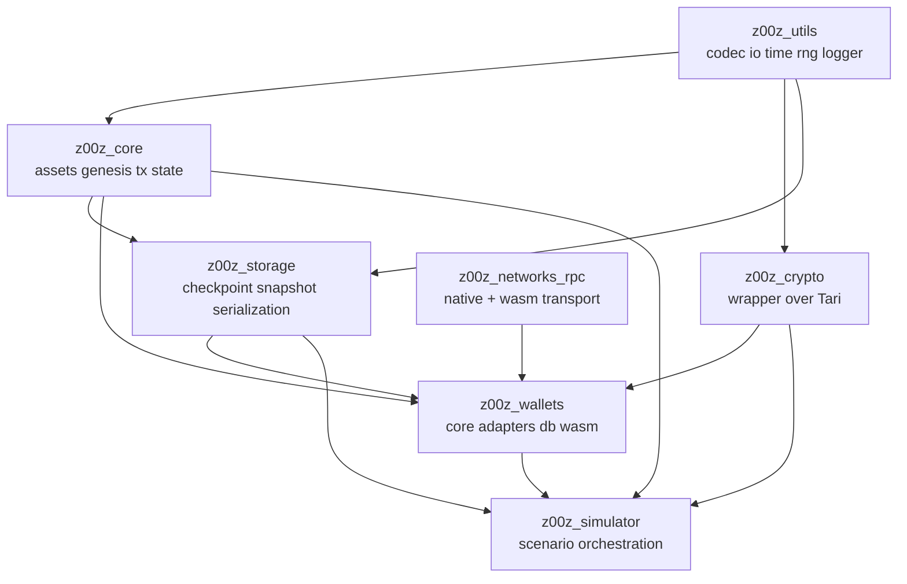

<!-- markdownlint-disable MD003 MD022 MD041 -->
---
post_title: "Z00Z Crates Technology Stack Blueprint"
author1: "GitHub Copilot"
post_slug: "z00z-crates-technology-stack-blueprint"
microsoft_alias: "not-applicable"
featured_image: "not-applicable"
categories: [Engineering]
tags: [rust, cargo, blockchain, architecture, wasm]
ai_note: "Generated with AI assistance from repository evidence."
summary: "Comprehensive, evidence-driven technology stack blueprint for the crates subtree of the Z00Z workspace."
post_date: "2026-04-11"
---

## Scope And Detection Summary

📌 Requested scope: `crates/` with output saved to
`crates/z00z_tech_stack_blueprint.md`.

📌 Applied defaults and assumptions:

- Project type: `Auto-detect`
- Depth: `Comprehensive`
- Output format: `Markdown`
- Versions: included only when explicitly declared in manifests
- Licenses: not inventoried beyond visible manifest fields
- Diagrams: enabled
- Usage patterns: enabled
- Conventions: enabled
- Categorization: `Layer`

📌 Detection basis used for this blueprint:

- Workspace manifest: `Cargo.toml`
- Release catalog: `versions.yaml`
- Workspace cargo behavior: `.cargo/config.toml`
- Crate manifests under `crates/**/Cargo.toml`
- Crate facades such as `src/lib.rs`
- Supporting build and verification scripts under `scripts/`
- Crate-local helper scripts such as
  `crates/z00z_storage/scripts/run_storage_settlement_bench.py`

📌 Detected stack summary:

- Primary stack: Rust workspace with Cargo path dependencies
- Secondary stack: Python and Bash for build orchestration, verification,
  benchmark helpers, and test bootstrapping
- Version provenance: local manifests still declare crate-local versions such
  as `0.1.0` and `0.22.1`, while `versions.yaml` tracks the broader release-line
  catalog at `2.36.0`
- Cross-target support: native plus `wasm32` feature and dependency splits in
  multiple crates
- Crypto substrate: local `z00z_crypto` wrapper over vendored Tari crates
- Network topology note: the workspace includes both `z00z_networks_rpc` and
  the placeholder privacy-ingress crate `onionnet`
- Maturity profile: mixed. Core, utils, wallets, storage, simulator, and RPC
  are active; OnionNet, runtime, telemetry, extensions, and some rollup
  surfaces remain thin or scaffold-level in the inspected manifests

## Version Provenance Notes

📌 Two explicit version sources coexist in the repository and both matter for a
technology blueprint:

- Manifest versions in `Cargo.toml` files describe the crate-local package
  versions that Cargo sees directly in the inspected workspace.
- `versions.yaml` records the repository release-line catalog, which is
  currently `2.36.0` and includes per-crate mappings for both first-party and
  vendored Tari packages.

📌 The tables below keep manifest versions in the `Version` column, then call
out the release catalog separately where it changes interpretation. This avoids
flattening two distinct versioning surfaces into one misleading number.

## Technology Inventory

### Workspace And Build Orchestration

| Technology | Version | Evidence | Purpose | Scope |
| --- | --- | --- | --- | --- |
| Rust workspace | workspace package `0.1.0` | `Cargo.toml` | Monorepo crate orchestration | Workspace-wide |
| Rust edition | `2021` workspace default | `Cargo.toml` | Main edition baseline | Workspace-wide |
| Rust MSRV or pinned compiler intent | `1.90.0` | `Cargo.toml` | Compiler baseline for workspace package | Workspace-wide |
| Release version catalog | total `2.36.0` with per-crate mappings | `versions.yaml` | Repository release-line tracking across first-party and vendored crates | Workspace-wide |
| Cargo resolver | `2` | `Cargo.toml` | Feature resolution model | Workspace-wide |
| Cargo aliases | explicit aliases | `.cargo/config.toml` | Fast test and clippy helper commands | Workspace-wide |
| Clippy lint policy | explicit allow list | `Cargo.toml`, `.cargo/config.toml` | Keep workspace checks green while preserving vendored subtree | Workspace-wide |
| Bash automation | not versioned | `./.github/skills/smart-tests-bootstrap/scripts/bootstrap_tests.sh`, `./.github/skills/z00z-full-verify-gate/scripts/full_verify.sh`, `scripts/cargo_build.sh` | Test bootstrapping, verification gate, and build orchestration | Workspace-wide |
| Python automation | interpreter version not pinned in manifests | `scripts/cargo_build.py`, `crates/z00z_storage/scripts/run_storage_settlement_bench.py` | Crate discovery, config sync, bench automation | Workspace-wide and crate-local |

### Foundational Crates

| Layer | Crate | Version | License | Purpose | Evidence |
| --- | --- | --- | --- | --- | --- |
| Foundation | `z00z_utils` | `0.1.0` | `MIT OR BSD-3-Clause` | Cross-cutting abstractions for codec, config, I/O, logger, metrics, RNG, time, compression, OS hardening | `crates/z00z_utils/Cargo.toml`, `crates/z00z_utils/src/lib.rs` |
| Crypto wrapper | `z00z_crypto` | `0.22.1` | `BSD-3-Clause` | Z00Z crypto facade and domain-specific wrappers over Tari primitives | `crates/z00z_crypto/Cargo.toml` |
| Core protocol | `z00z_core` | `0.1.0` | `MIT OR BSD-3-Clause` | Assets, genesis, hashing, state, transaction and validation logic | `crates/z00z_core/Cargo.toml`, `crates/z00z_core/src/lib.rs` |
| Persistence | `z00z_storage` | `0.1.0` | not detected | Storage, checkpoint, serialization, snapshot handling | `crates/z00z_storage/Cargo.toml`, `crates/z00z_storage/src/lib.rs` |

### Application And Adapter Crates

| Layer | Crate | Version | License | Purpose | Evidence |
| --- | --- | --- | --- | --- | --- |
| Transport | `z00z_networks_rpc` | `0.1.0` | `MIT OR Apache-2.0` | Generic RPC transport layer with native and WASM split | `crates/z00z_networks/rpc/Cargo.toml`, `crates/z00z_networks/rpc/src/lib.rs` |
| Transport | `onionnet` | `0.1.0` | `MIT OR Apache-2.0` | Placeholder privacy-ingress and overlay network surface | `crates/z00z_networks/onionnet/Cargo.toml` |
| Wallet/app | `z00z_wallets` | `0.1.0` | not detected | Wallet core, services, RPC adapters, RedB persistence, optional desktop UI, WASM support | `crates/z00z_wallets/Cargo.toml`, `crates/z00z_wallets/src/lib.rs` |
| Simulator | `z00z_simulator` | `0.1.0` | not detected | Scenario execution, actor flows, deterministic test and validation workflows | `crates/z00z_simulator/Cargo.toml`, `crates/z00z_simulator/src/lib.rs` |
| Rollup node | `z00z_rollup_node` | `0.1.0` | not detected | Minimal manifest-level dependency surface in inspected scope | `crates/z00z_rollup_node/Cargo.toml` |

### Runtime, Telemetry, And Extension Surfaces

| Layer | Crate | Version | Observed state | Evidence |
| --- | --- | --- | --- | --- |
| Runtime | `z00z_aggregators` | `0.1.0` | Early-stage runtime crate with explicit links to core, storage, and wallets | `crates/z00z_runtime/aggregators/Cargo.toml`, `src/lib.rs` |
| Runtime | `z00z_validators` | `0.1.0` | Thin validator layer currently wired to aggregators and storage | `crates/z00z_runtime/validators/Cargo.toml`, `src/lib.rs` |
| Runtime | `z00z_watchers` | `0.1.0` | Thin watcher layer currently wired to aggregators and validators | `crates/z00z_runtime/watchers/Cargo.toml`, `src/lib.rs` |
| Telemetry | `z00z_telemetry` | `0.1.0` | Minimal telemetry crate with empty manifest dependency surface in the inspected scope | `crates/z00z_telemetry/Cargo.toml`, `src/lib.rs` |
| Extensions | `z00z_extensions` | `0.1.0` | Minimal extension crate with empty manifest dependency surface in the inspected scope | `crates/z00z_extensions/Cargo.toml`, `src/lib.rs` |

### Vendored And Read-Only Crypto Subtree

| Technology | Version | Role | Evidence | Scope |
| --- | --- | --- | --- | --- |
| `tari_crypto` | `0.22.1` | Vendored core crypto primitives | `crates/z00z_crypto/tari/crypto/Cargo.toml` | Local path dependency |
| `tari_bulletproofs_plus` | `0.4.1` | Vendored Bulletproofs+ implementation | `crates/z00z_crypto/tari/bulletproofs_plus/Cargo.toml` | Local path dependency |
| `tari_utilities` | `0.8.0` | Vendored utilities | `crates/z00z_crypto/tari/utils/Cargo.toml` | Local path dependency |

### Language And Tooling Inventory

| Category | Technology | Version | Purpose | Evidence |
| --- | --- | --- | --- | --- |
| Serialization | `serde` | `1.x` | Core serialization across crates | multiple `Cargo.toml` files |
| JSON | `serde_json` | `1.0` | Export, config, RPC payloads, debug surfaces | `z00z_core`, `z00z_utils`, `z00z_wallets`, `z00z_simulator`, `z00z_networks_rpc` manifests |
| Binary codec | `bincode` | `2.0.1` in active crates | Binary export and persistence | `z00z_core`, `z00z_utils`, `z00z_wallets` manifests |
| YAML | `serde_yaml` | `0.9` | YAML handling in core and utils | `z00z_core/Cargo.toml`, `z00z_utils/Cargo.toml` |
| Error handling | `thiserror` | `2.0` | Typed error surfaces | multiple manifests |
| Async runtime | `tokio` | `1.x` | Native runtime, simulator, wallet, RPC | `z00z_wallets`, `z00z_simulator`, `z00z_networks_rpc` manifests |
| RPC | `jsonrpsee` | `0.26` | Native server/client and WASM client transport | `z00z_networks_rpc`, `z00z_wallets` manifests |
| Storage engine | `redb` | `2` and `3.1.0` | Storage crate backend and wallet persistence | `z00z_storage/Cargo.toml`, `z00z_wallets/Cargo.toml` |
| Merkle/state | `jmt` | `0.12.0` | Storage state structure | `z00z_storage/Cargo.toml` |
| Observability | `tracing` | `0.1` | Logging and diagnostics | multiple manifests |
| Metrics | `prometheus` | `0.13` optional | Metrics sink in utils | `z00z_utils/Cargo.toml` |
| Crypto support | `blake2`, `sha2`, `argon2`, `hkdf`, `merlin`, `chacha20poly1305`, `bip39`, `bip32`, `k256` | explicit per crate | Privacy wallet and crypto workflows | `z00z_crypto/Cargo.toml`, `z00z_wallets/Cargo.toml` |
| GUI | `eframe`, `crossterm`, `qrcode` | explicit per manifest | Optional desktop wallet UI and QR support | `z00z_wallets/Cargo.toml` |
| Browser storage | `rexie` | `0.5` | IndexedDB persistence in WASM wallet builds | `z00z_wallets/Cargo.toml` |
| Spreadsheet export | `rust_xlsxwriter` | `0.79` | Simulator report export | `z00z_simulator/Cargo.toml` |
| Fuzzing harnesses | local `fuzz/` Cargo packages | crate package `0.0.0` | Input hardening for core and crypto | `crates/z00z_core/fuzz/Cargo.toml`, `crates/z00z_crypto/fuzz/Cargo.toml` |
| Benchmarking | `criterion` | `0.5` | Performance benches in active crates | multiple manifests |

## Core Stack Analysis

### Rust And Cargo Reality

📌 The inspected scope is a Rust-first monorepo organized as a Cargo workspace
with local path dependencies. The workspace members explicitly include core,
crypto, simulator, storage, utils, wallets, RPC, runtime crates, rollup node,
extensions, and telemetry.

📌 Edition usage is mixed. Most active first-party crates use Rust `2021`, while
vendored Tari crates and `z00z_crypto` still declare `2018`. This means new code
generation should follow 2021 idioms in first-party crates while respecting
vendored boundaries.

### Foundation Layer

📌 `z00z_utils` is the architectural foundation. Its public modules are
`codec`, `compression`, `config`, `io`, `logger`, `metrics`, `os_hardening`,
`rng`, and `time`. The crate also exposes a `prelude` that re-exports common
abstractions, which signals a preferred shared surface for future code.

📌 `z00z_core` is the main protocol/domain crate. Its facade exposes `assets`,
`domains`, `genesis`, `hashing`, and `state`, and its module docs describe
confidential assets, deterministic genesis, gas metering, and proof validation.

📌 `z00z_storage` adds persistence, checkpoint, snapshot, and serialization
surfaces on top of the foundation and protocol crates. The active storage stack
includes `redb` and `jmt`.

### Crypto Layer

📌 `z00z_crypto` is a wrapper crate around vendored Tari components. It brings in
wallet-oriented primitives such as `bip39`, `bip32`, `argon2`, `hkdf`, and
`chacha20poly1305`, while the workspace root points to local Tari path
dependencies instead of registry crates.

📌 The vendored subtree is an explicit part of the build graph, but it is a
boundary, not an open refactor target. Workspace lint policy and local comments
treat `crates/z00z_crypto/tari/` as protected and read-only.

### RPC, Native, And WASM Layer

📌 `z00z_networks_rpc` is a transport-oriented adapter crate. It uses `jsonrpsee`
with native `server`, `client`, and `macros` features on non-WASM builds and a
reduced `wasm-client` feature set for `wasm32`. It also uses `tokio` in both
worlds with different feature profiles.

📌 `z00z_wallets` is the richest multi-target crate in the inspected scope. It
ships as both `cdylib` and `rlib`, layers `core`, `adapters`, `services`, `db`,
`wasm`, and contains native-only RedB persistence as
well as browser-specific IndexedDB support through `rexie`.

### Simulator And Test Workflow Layer

📌 `z00z_simulator` is a scenario runner and validation harness rather than a
generic library crate. Its manifest exposes `scenario_1` as an explicit binary,
keeps a repository-standard `wallet_debug_tools` compatibility feature, and
depends on wallet, storage, RPC, and core crates, which makes it an important
integration surface.

### Low-Maturity Or Placeholder Layer

📌 `onionnet`, `z00z_aggregators`, `z00z_validators`, `z00z_watchers`,
`z00z_telemetry`, and `z00z_extensions` currently expose thin or placeholder
surfaces in the inspected files. They should be treated as reserved or
emerging stack surfaces, not as mature modules with demonstrated internal
conventions.

## Tooling And Build Pipeline

📌 Workspace-level Cargo behavior is customized through `.cargo/config.toml`.
Important aliases include:

- `cargo t` as `test --features test-params-fast`
- `cargo rt` as `test --release --features test-params-fast`
- `cargo clippy-clean`, `cargo clippy-clean-fast`, and `cargo clippy-clean-all`
  for warning-controlled clippy runs that account for vendored lint noise

📌 `./.github/skills/z00z-full-verify-gate/scripts/full_verify.sh` is the strongest visible quality gate in the
inspected scope. It coordinates formatting, clippy, tests, runnable targets,
and long-running test reporting.

📌 `./.github/skills/smart-tests-bootstrap/scripts/bootstrap_tests.sh` is the
physical fast-fail regression subset. It prioritizes library tests in `z00z_crypto`,
`z00z_core`, `z00z_storage`, `z00z_utils`, then selected wallet integration tests
and compile-only bench/example checks. `./.github/skills/smart-tests-bootstrap/scripts/bootstrap_tests.sh`
is the invokable skill-owned launcher used because skill names cannot contain `_`.

📌 Python is part of the engineering workflow, even though the product stack is
Rust-first. Evidence includes:

- `scripts/cargo_build.py` for crate discovery and config synchronization
- `crates/z00z_storage/scripts/run_storage_settlement_bench.py` for bench execution
  and report generation

📌 `versions.yaml` is also part of the engineering workflow. It is not a Cargo
manifest, but it is an authoritative repository-local release catalog that
captures the broader `2.36.0` version line used across first-party and vendored
packages.

📌 Fuzzing is not just aspirational. Dedicated fuzz Cargo packages exist under:

- `crates/z00z_core/fuzz`
- `crates/z00z_crypto/fuzz`
- `crates/z00z_crypto/tari/bulletproofs_plus/fuzz`

📌 Benchmarks are first-class in several active crates. `criterion` benches are
declared in `z00z_core`, `z00z_crypto`, `z00z_storage`, and `z00z_wallets`.

## Conventions And Implementation Patterns

### Architecture And Dependency Direction

📌 The dominant architectural convention is an abstraction-first foundation.
`z00z_utils` is intended to centralize low-level operations such as codec,
config, I/O, time, RNG, logging, and compression.

📌 Path dependencies communicate layering directly. Typical dependency flow in
the active stack is:

- `z00z_wallets` depends on `z00z_core`, `z00z_crypto`, `z00z_storage`,
  `z00z_utils`, and `z00z_networks_rpc`
- `z00z_simulator` depends on wallet, storage, RPC, crypto, core, and utils
- `z00z_storage` depends on core, crypto, and utils
- `z00z_aggregators`, `z00z_validators`, and `z00z_watchers` already form a
  thin runtime dependency chain even though their implementation surfaces are
  still early-stage

### Safety And Public Facades

📌 `#![forbid(unsafe_code)]` appears across many crate facades. `z00z_utils`
uses `#![warn(unsafe_code)]` instead, which aligns with its OS hardening and
platform-boundary role.

📌 Crate roots favor facade-style exports. Evidence includes public module trees
plus selective `pub use` re-exports in `z00z_utils`, `z00z_core`,
`z00z_networks_rpc`, `z00z_storage`, `z00z_simulator`, and `z00z_wallets`.
This indicates that new code should usually attach to a stable crate facade
rather than expose deep internal file paths directly.

### Feature Gating Patterns

📌 Feature flags are a core implementation tool, not a minor add-on.
Representative patterns include:

- `test-params-fast` propagated across multiple crates for lighter-weight tests
- `wallet_debug_tools` and `wallet_debug_tools` for debug-only wallet export
  surfaces
- `qr-codes`, `wasm`, `os_hardening`, `verbose-logging`, and
  `eviction-logs` in `z00z_wallets`
- native versus `wasm32` dependency blocks in `z00z_wallets` and
  `z00z_networks_rpc`

📌 Security-sensitive features are explicitly labeled as non-production in
manifest comments. That is an implementation signal future contributors should
keep preserving.

### Documentation And Module Shape

📌 Active crates commonly include crate docs via `#![doc = include_str!("../README.md")]`
and maintain descriptive `//!` module headers. This suggests README-backed API
documentation is part of the intended developer experience.

📌 Wallet crate documentation explicitly marks some layers as partial or stubbed.
That is a useful convention for future incremental development in unfinished
areas.

### Representative Usage Patterns

📌 Pattern: multi-target adapter crate.

```rust
#[cfg(target_arch = "wasm32")]
pub mod wasm_client;

#[cfg(not(target_arch = "wasm32"))]
pub mod dispatcher;
```

📌 Pattern: foundation prelude for shared abstractions.

```rust
pub mod prelude {
    pub use crate::codec::{BincodeCodec, Codec, JsonCodec, YamlCodec};
    pub use crate::time::{MockTimeProvider, SystemTimeProvider, TimeProvider};
}
```

📌 Pattern: app crate built as both library and embeddable target.

```toml
[lib]
crate-type = ["cdylib", "rlib"]
```

📌 Pattern: debug surfaces isolated behind features.

```toml
wallet_debug_tools = ["serde_json_support"]
wallet_debug_tools = ["wallet_debug_tools"]
```

## Integration Points

📌 Important integration paths in the inspected stack are:

- `z00z_core` and `z00z_crypto` provide protocol and cryptographic primitives
- `z00z_utils` provides shared low-level abstractions consumed across the stack
- `z00z_storage` persists protocol state and snapshots
- `z00z_networks_rpc` provides transport abstraction for native and browser
  clients
- `z00z_wallets` composes protocol, crypto, storage, utils, and RPC into a user
  facing wallet surface
- `z00z_simulator` exercises end-to-end flows across those same crates

📌 Configuration and runtime behavior are strongly shaped by feature selection,
target architecture, and workspace cargo aliases. This means reproducible
commands matter as much as source structure.

## Decision Context And Constraints

📌 The stack is optimized for privacy-sensitive blockchain work, which explains
the heavy crypto surface, storage checkpoints, wallet hardening flags, and the
presence of simulation and proof-oriented validation flows.

📌 A major boundary is vendor isolation. The local Tari subtree is part of the
build graph, but comments and workspace policy treat it as read-only. New work
should wrap or re-export it, not modify it.

📌 Another constraint is mixed maturity. Some crates are clearly active and rich
in features, while others are currently placeholders. Blueprint consumers should
avoid copying conventions from scaffold crates when richer evidence exists in
wallets, utils, core, storage, simulator, and RPC.

📌 Exact resolved dependency graph versions are intentionally not inferred from
registry state. This blueprint only records versions visible in manifests.

## Diagrams



## Unknowns And Follow-Ups

📌 Unknown or intentionally limited areas in this blueprint:

- Internal implementation depth of OnionNet, runtime, telemetry, extensions,
  and rollup crates was not inferred beyond the inspected manifests and minimal
  facades
- No license inventory beyond visible manifest fields was requested or compiled
- No CI workflow inventory was added because the requested scope was `crates/`
  plus directly governing workspace cargo and release-catalog files
- Exact resolved transitive versions were not extracted from a lockfile in this
  pass

📌 High-value follow-up analyses if you want a narrower next artifact:

- Wallet-only implementation blueprint for native versus WASM delivery
- Storage and checkpoint stack blueprint focused on persistence guarantees
- RPC transport blueprint focused on `jsonrpsee`, browser transport, and local
  dispatcher patterns
- Runtime maturity audit to separate scaffold crates from implementation-ready
  crates
