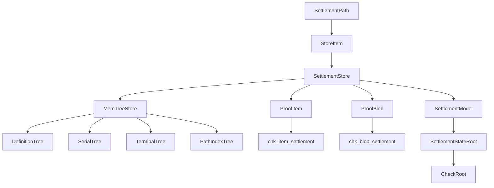
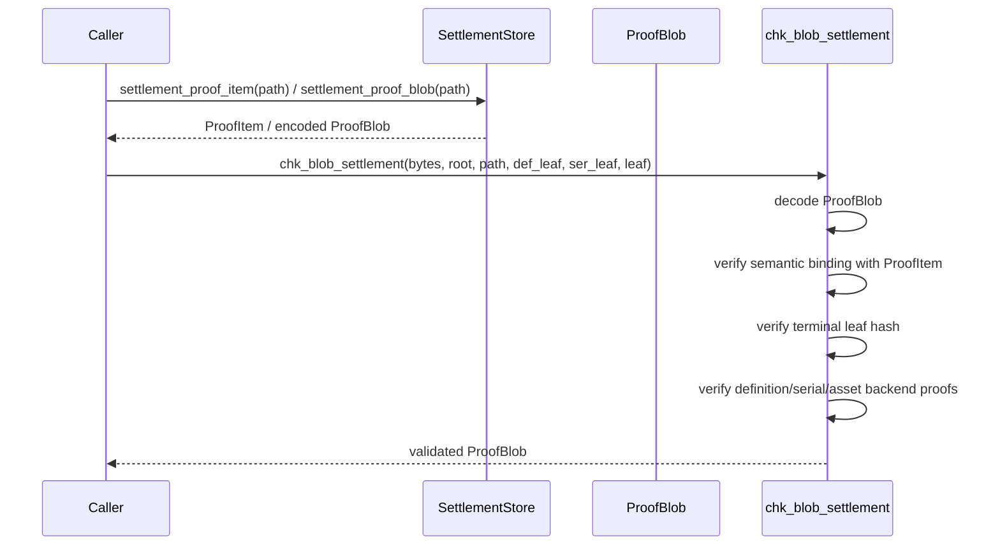

# z00z_storage settlement

📌 This module is the canonical first-party settlement storage contract for Z00Z.

🎯 It defines typed settlement paths, storage-owned roots, typed proof boundaries, and
HJMT-backed storage contracts used by higher layers such as wallets and simulator stages.

⚙️ The canonical path shape is:

```text
definition_id -> serial_id -> terminal_id
```

🚫 Flat alias behavior, root/digest conflation, and raw backend proof types are not part of the
public contract.

## 📚 Table of Contents

- [What This Module Exports](#-what-this-module-exports)
- [Core Model](#-core-model)
- [Semantic and Physical Roots](#-semantic-and-physical-roots)
- [Architecture](#architecture)
- [Live Hard Cutover Boundary](#live-hard-cutover-boundary)
- [Proof Validation Flow](#-proof-validation-flow)
- [Quick Start](#-quick-start)
- [API Examples](#-api-examples)
- [Operator Notes](#-operator-notes)
- [Search Surface](#-search-surface)
- [Testing](#-testing)
- [Module Layout](#module-layout)
- [Serialization Inspection](#-serialization-inspection)
- [Boundaries](#-boundaries)

## ✨ What This Module Exports

✅ Public exports are re-exported from [mod.rs](mod.rs):

- `TerminalLeaf`
- `TerminalId`
- `SettlementStateRoot`
- `RootGeneration`
- `SettlementPath`
- `TerminalId`
- `SettlementLeaf`
- `RightLeaf`
- `VoucherLeaf`
- `FeeEnvelope`
- `AdaptiveBucket`
- `BucketEpoch`
- `BucketOccupancyEvidence`
- `BucketOccupancyMetric`
- `SplitProof`
- `MergeProof`
- `PolicyTransitionProof`
- `CheckRoot`
- `DefinitionId`
- `BatchProofBlobV1`
- `ProofBlob`
- `ProofChkErr`
- `ProofItem`
- `SerialId`
- `StoreItem`
- `SettlementStore`
- `StoreOp`
- `batch_proof_transcript_domain_v1`
- `check_batch_contract_v1`
- `chk_blob_settlement`
- `chk_item_settlement`
- `SettlementLookup`
- `SettlementScope`
- `SettlementListReq`
- `SettlementPage`
- `SettlementPageTok`

⚙️ The live contract exposes only settlement-native roots, paths, proofs, and query types. Legacy
asset-path adapters, old-root projections, and stale query aliases are not part of the
runtime or canonical test surface.

🎯 These types exist to keep downstream code on a typed, storage-owned contract instead of
depending on raw JMT internals.

## 🧭 Core Model

✅ The storage model is hierarchical and namespace-safe:

- `DefinitionId` identifies a definition namespace.
- `SerialId` identifies a serial bucket inside one definition namespace.
- `TerminalId` identifies the terminal settlement leaf.
- `SettlementPath` binds the full generalized canonical address.
- There is no live asset-path adapter or stale query lane.

⚙️ Public writes and deletes are path-bound, not flat-id-bound.

✅ The exported root contract is semantic:

- `SettlementStateRoot` is the live generalized settlement-state commitment.
- `RootGeneration::SettlementV1` is the live settlement root generation marker.
- `CheckRoot` is the checkpoint-facing type derived from `SettlementStateRoot`.
- There is no legacy asset-root projection in the live storage contract.
- `TxDigest` is deliberately not convertible into `CheckRoot`.

🚫 Do not treat a transaction digest as a storage checkpoint root.

## 🔑 Semantic and Physical Roots

📌 This module intentionally separates semantic state from physical backend proof state.

- `SettlementStateRoot`: public semantic state commitment for the canonical hierarchy and the
  live generalized settlement generation.
- `CheckRoot`: typed checkpoint-facing root derived from `SettlementStateRoot`.
- `backend_root` inside `ProofBlob`: private physical shared-root bytes used to verify backend
  branch proofs.

⚙️ `ProofBlob` carries both layers:

- `ProofItem` binds the semantic expectations.
- `backend_root` plus opaque proof bytes bind the physical JMT verification path.

🚫 `backend_root` is not the exported storage root and must not replace
`SettlementStateRoot` in public APIs.

## Architecture

📌 Semantic modeling and backend persistence are separated on purpose.



✅ `SettlementStore` is the storage facade.

✅ `SettlementTreeBackend` is the live generalized settlement facade.

✅ The settlement module exposes no legacy `compat` namespace, path adapter, or old-root
projection. Live settlement entrypoints must not route through a stale adapter path.

✅ `SettlementModel` is the deterministic semantic reference model.

✅ `MemTreeStore` and the store-private modules keep the physical logical-tree routing private.

🚫 Live settlement work must route through the HJMT hjmt surface. Legacy asset-lane
helpers must not become a second live authority layer or expose physical roots as public state
roots.

## Live Hard Cutover Boundary

📌 The live cutover promotes generalized settlement contracts into the storage surface while keeping
physical HJMT layout private to storage internals.

✅ Root semantics are intentionally narrow:

- `SettlementStateRoot` is the live public generalized settlement-state root for
  `RootGeneration::SettlementV1`.
- `CheckRoot` is checkpoint-facing evidence derived from `SettlementStateRoot`.
- `backend_root` is proof-local or diagnostic physical backend data.
- There is no old-root shim or alias layer for `SettlementStateRoot`.

✅ Settlement contracts are storage-owned:

- `SettlementLeaf::Terminal(TerminalLeaf)`, `SettlementLeaf::Right(RightLeaf)`, and
  `SettlementLeaf::Voucher(VoucherLeaf)` are distinct terminal families under one
  `SettlementStateRoot`.
- `SettlementExecHandoff` carries one runtime batch's semantic `StoreOp` set plus committed route
  context into storage without promoting runtime-owned planner metadata into subtree authority.
- `SettlementStore::apply_exec_handoff(...)` is the live semantic handoff path for route-bound
  runtime work. If checkpoint exec rows are present, the batch must stay terminal-only; non-terminal
  scope work uses the same API without checkpoint exec rows.
- `ScopeFlow` is evidence only. It records batch id, shard id, routing generation, first-seen scope
  status, and root progression without exporting storage-private `HjmtTreeId` internals.
- `FeeEnvelope` is processing support, not right meaning or ownership evidence.
- `AdaptiveBucket`, `BucketEpoch`, `BucketOccupancyEvidence`, `BucketOccupancyMetric`,
  `SplitProof`, `MergeProof`, and `PolicyTransitionProof` are HJMT policy contracts.
- `BucketOccupancyMetric` is local diagnostics only; exact counts must not become proof-visible
  activity telemetry.

🚫 The live settlement contract must not route production callers through a legacy storage reader, stale adapter,
alias layer, or public physical-layout authority.

## Recovery And Journal Baseline

📌 Restart and failover evidence is exported through `SettlementRecoveryState` and
`SettlementRouteCtx`, not raw backend tables.

✅ `SettlementStore::recovery_state()` exports version, `SettlementStateRoot`, root/proof
generation, bucket policy metadata, and `journal_lineage`.

✅ `JournalBackend` is the single durability seam below settlement semantics.

✅ Version 1 keeps the RedB-backed local durable journal as the baseline implementation.

✅ Restart evidence must preserve route metadata, journal lineage, and backend generation metadata
across export/import roundtrips.

🚫 A shared cross-aggregator WAL is not live protocol truth.

🚫 Recovery metadata must not become a second semantic authority beside the active settlement root.

## 🔍 Proof Validation Flow

📌 The proof boundary is storage-owned from encoding to verification.



✅ `chk_item_settlement(...)` checks semantic consistency:

- root matches
- path matches
- definition leaf matches
- serial leaf matches
- terminal leaf matches

✅ `chk_blob_settlement(...)` extends that with backend validation:

- encoded witness blob decodes cleanly
- terminal leaf hash matches
- definition proof verifies against `backend_root`
- serial proof verifies against `backend_root`
- asset proof verifies against `backend_root`

✅ The additive shared-proof surface is separate:

- `ProofBlob` stays the single-path envelope.
- `Vec<ProofBlob>` remains the independent batch baseline.
- `BatchProofBlobV1` is the shared batch envelope and must verify fail-closed
  through `BatchProofBlobV1::decode(...)` or `check_batch_contract_v1(...)`.

## 🚀 Quick Start

📌 Smallest useful storage round-trip:

```rust
use z00z_storage::settlement::{
  TerminalLeaf, SettlementStore, CheckRoot, DefinitionId, SerialId, SettlementLookup,
  SettlementPath, StoreItem, TerminalId,
};

let path = SettlementPath::new(
    DefinitionId::new([1u8; 32]),
    SerialId::new(7),
  TerminalId::new([9u8; 32]),
);

let mut leaf = TerminalLeaf::default();
leaf.set_terminal_id(path.terminal_id());
leaf.serial_id = path.serial_id.get();

let item = StoreItem::new(path, leaf)?;
let mut store = SettlementStore::new();

let root = store.put_settlement_item(item)?;
let loaded = store
  .lookup_settlement(SettlementLookup::Terminal(path.terminal_id))?
  .expect("stored item");

assert_eq!(loaded.path(), path);
assert_eq!(store.settlement_root()?.into_bytes(), root.into_bytes());
assert_eq!(CheckRoot::from(store.settlement_root()?).into_bytes(), root.into_bytes());
# Ok::<(), Box<dyn std::error::Error>>(())
```

⚙️ For batched transitions, prefer `apply_settlement_ops(Vec<StoreOp>)` over repeated single-item writes.

## 🧩 API Examples

📌 The snippets below reflect the live settlement surface. Their
end-to-end equivalents are covered by
`crates/z00z_storage/tests/test_readme_examples.rs`.

✅ Create a bounded non-coin right with explicit fee support:

```rust
use z00z_storage::settlement::{
  SettlementStore, FeeActorCtx, FeeEnvelope, RightActionCtx, RightClass, RightLeaf, SettlementPath,
  StoreItem, StoreOp, TerminalId,
};

let mut store = SettlementStore::new();
let right_path = SettlementPath::new([3u8; 32].into(), 7u32.into(), TerminalId::new([9u8; 32]));
let right_leaf = RightLeaf {
    version: 1,
    terminal_id: right_path.terminal_id,
    right_class: RightClass::MachineCapability,
    issuer_scope: [11u8; 32],
    provider_scope: [12u8; 32],
    holder_commitment: [13u8; 32],
    control_commitment: [14u8; 32],
    beneficiary_commitment: [15u8; 32],
    payload_commitment: [16u8; 32],
    valid_from: 0,
    valid_until: 80,
    challenge_from: 0,
    challenge_until: 0,
    use_nonce: [17u8; 32],
    revocation_policy_id: [18u8; 32],
    transition_policy_id: [19u8; 32],
    challenge_policy_id: [20u8; 32],
    disclosure_policy_id: [21u8; 32],
    retention_policy_id: [22u8; 32],
};
let ops = vec![StoreOp::Put(Box::new(StoreItem::new(right_path, right_leaf)?))];
let support = store.fee_support_ctx(&ops)?;
let support_ref = Some([31u8; 32]);
let budget_units = support.required_units + 1;
let envelope = FeeEnvelope {
    version: 1,
    payer_commitment: [23u8; 32],
    sponsor_commitment: [0u8; 32],
    budget_units,
    budget_commitment: FeeEnvelope::budget_bind(budget_units, support_ref),
    domain_id: support.domain_id,
    expires_at: 80,
    nonce: [24u8; 32],
    transition_id: support.transition_id,
    replay_key: [25u8; 32],
    support_ref,
    failure_policy_id: [26u8; 32],
};
let actor = FeeActorCtx {
    now: 15,
    payer_commitment: Some([23u8; 32]),
    sponsor_commitment: None,
};
let ctx = RightActionCtx {
    now: 15,
    expected_holder: Some([13u8; 32]),
    expected_control: Some([14u8; 32]),
    ..RightActionCtx::default()
};
let root = store.create_right_with_fee(right_path, right_leaf, ctx, envelope, actor)?;
# let _ = root;
# Ok::<(), Box<dyn std::error::Error>>(())
```

✅ Transition, deletion proof, and non-existence proof stay on the same
settlement API:

```rust
use z00z_storage::settlement::{HjmtProofFamily, SettlementLeafFamily, SettlementLookup};

let deletion = store.settlement_proof_blob(&right_path)?;
assert_eq!(deletion.hjmt_proof_family(), Some(HjmtProofFamily::Deletion));
store.validate_settlement_proof_blob(&deletion)?;

let missing_path = SettlementPath::new([7u8; 32].into(), 9u32.into(), TerminalId::new([99u8; 32]));
let absence = store.settlement_nonexistence_proof_blob(
    &missing_path,
    SettlementLeafFamily::Right,
)?;
store.validate_settlement_nonexistence_proof_blob(&absence, SettlementLeafFamily::Right)?;

let voucher_absence = store.settlement_nonexistence_proof_blob(
    &missing_path,
    SettlementLeafFamily::Voucher,
)?;
store.validate_settlement_nonexistence_proof_blob(
    &voucher_absence,
    SettlementLeafFamily::Voucher,
)?;
assert!(store.lookup_settlement(SettlementLookup::Path(missing_path))?.is_none());
# Ok::<(), Box<dyn std::error::Error>>(())
```

✅ Adaptive proofs and bounded metrics stay storage-owned:

```rust
let split = store.split_proof(&hot_path)?;
store.validate_split_proof(&split)?;

let merge = store.merge_proof(&left_path, &right_path)?;
store.validate_merge_proof(&merge)?;

let next_policy = z00z_storage::settlement::BucketPolicy::new(2, 1, 512, 2)?;
let transition = store.policy_transition_proof(next_policy)?;
store.validate_policy_transition_proof(&transition, next_policy)?;

let batch = store.settlement_proof_blobs(&[hot_path, left_path, right_path])?;
let cache = store.forest_cache_metrics();
let sched = store.forest_scheduler_metrics();
assert!(!batch.is_empty());
assert!(cache.proof_segment.hits + cache.proof_segment.misses > 0);
assert!(sched.last_batch > 0);
# Ok::<(), Box<dyn std::error::Error>>(())
```

## 🛠 Operator Notes

📌 The live settlement contract is a hard cutover to the generalized HJMT settlement surface.

✅ Runtime mode and policy controls come from live storage seams:

- `Z00Z_SETTLEMENT_BACKEND_MODE`: leave unset or set to `hjmt`. Any other value
  rejects fail-closed.
- `Z00Z_SETTLEMENT_BUCKET_BITS`: optional fixed-bucket override for the live bucket
  policy. If unset, storage uses the default fixed policy from
  `bucket_policy_from_env()`.
- `Z00Z_STORAGE_SCHED_CPU` and `Z00Z_STORAGE_SCHED_QUEUE`: optional scheduler
  limits for worker count and queued batch capacity.

✅ Cache and metrics rules are bounded:

- Forest cache layers stay storage-owned and default to a per-layer limit of
  `512` entries in the live cache implementation.
- Exact `BucketOccupancyMetric` counts are local diagnostics only; proof-visible
  surfaces must stay on bounded `BucketOccupancyEvidence`.
- Use `forest_cache_metrics()` and `forest_scheduler_metrics()` for operator
  diagnostics instead of treating cache or queue counters as semantic state.

✅ Development inputs must be regenerated from the live generalized corpus:

- `crates/z00z_core/configs/README.md` and `GenesisConfig` remain the
  canonical bootstrap authority for assets, rights, policies, and vouchers.
- `crates/z00z_core/configs/devnet_assets_config.yaml` is asset-registry data for
  examples, fixtures, or compatibility-oriented registry loading; it is not a
  second bootstrap authority.
- `crates/z00z_core/configs/devnet_genesis_config.yaml` is the
  canonical dev generalized genesis input consumed by `scenario_1`.
- `crates/z00z_simulator/src/scenario_1/scenario_config.yaml` owns the
  `stage13_hjmt_settlement_examples` lane and its HJMT artifacts.

🚫 Old storage artifacts are unsupported after the cutover. There is no live
conversion shim from old asset-only stores into the live generalized
runtime lane.

## 🔎 Search Surface

📌 Phase 016 adds a storage-owned deterministic search surface on top of canonical path order.

✅ Public search helpers remain subordinate to the canonical path contract:

- `SettlementLookup::Path` and `SettlementLookup::Terminal` provide exact lookup.
- `SettlementListReq` scopes listing to all rows, one definition, or one scoped serial bucket.
- `SettlementPageTok` replays pagination from canonical `definition_id -> serial_id -> terminal_id` order.

🚫 Search helpers are convenience APIs only.

🚫 They must not redefine committed roots, canonical path ownership, or consensus semantics.

## 🧪 Testing

✅ Useful commands for this module and its immediate downstream checks:

```bash
cargo test -p z00z_storage --release --lib
cargo test -p z00z_storage --release --test test_live_guardrails
cargo test -p z00z_storage --release --test test_settlement_root
cargo test -p z00z_storage --release --test test_fee_replay
cargo test -p z00z_wallets --release --test test_tx_spent_gate
cargo test -p z00z_wallets --release --test test_tx_wrong_root
cargo test -p z00z_wallets --release --test test_tx_gate
cargo test -p z00z_simulator --release --test test_stage4_digest
cargo test -p z00z_simulator --release --test test_stage6_checkpoint
bash scripts/audit/audit_release_feature_guards.sh
```

✅ Full workspace verification, including runnable targets and the max-safe sweep, is driven by:

```bash
./.github/skills/z00z-full-verify-gate/scripts/full_verify.sh --max-safe-run
```

## Module Layout

✅ The layout is split by responsibility:

- `mod.rs`: public boundary and re-exports
- `leaf.rs`: storage-owned `TerminalLeaf` wrapper
- `identity.rs`: typed ids, paths, root generation, and root/provider contracts
- `query.rs`: storage-owned lookup, pagination, and listing contracts
- `record.rs`: settlement leaves, right records, proof records, and policy proofs
- `model.rs`: deterministic semantic hierarchy
- `keys.rs`: namespace key derivation helpers
- `proof.rs`: witness blob codec and validation
- `store.rs`: canonical storage facade and batch commit flow
- `hjmt_*.rs`: live HJMT cache, scheduler, proof, policy, commit, and store internals
- `tree_id.rs` and `timing.rs`: store-private support
- `test_live_recovery.rs`: store-private source-shape guardrails kept one level up to avoid nested test-only paths
- `backend/{codec,query,roots,rows,types}.rs`: shared backend-agnostic helpers
- `backend/redb/*`: durable storage backend internals
- `tx_plan_help.rs` and `tx_plan_types.rs`: store-local precheck and snapshot planning helpers
- `../fixture_support/*` and `../../tests/test_snapshot_*.rs`: canonical non-production helper and flat snapshot integration layout after the alias or shim cleanup

## 🔭 Serialization Inspection

📌 Phase 015 adds a storage-owned inspection surface under `crate::serialization`.

✅ This surface is inspection-only:

- canonical artifacts are built from current storage-owned state
- saved artifacts can be reloaded and reconstructed for debugging or equivalence checks
- DOT and plain-text renderers operate on typed artifacts instead of raw live `jmt` nodes

🚫 These artifacts do not replace `SettlementStateRoot`, `CheckRoot`, or the existing proof
boundary.

⚙️ Higher layers that need human-readable tree inspection should consume the typed serialization module,
not private backend nodes or witness internals.

## 🚫 Boundaries

📌 This README describes the accepted public and semantic contract, not every internal JMT detail.

🚫 Do not expose raw `jmt` proof or node types from higher layers.

🚫 Do not treat `backend_root` as the public state root.

🚫 Do not collapse `definition_id`, `serial_id`, and `terminal_id` into one flat identity.

⚙️ Downstream code that needs membership proofs should consume storage-owned `ProofItem`,
`ProofBlob`, `chk_item_settlement`, and `chk_blob_settlement` instead of reconstructing
witness semantics by hand.

✅ See [root_types.md](root_types.md) for the settlement-root boundary and proof contract.
