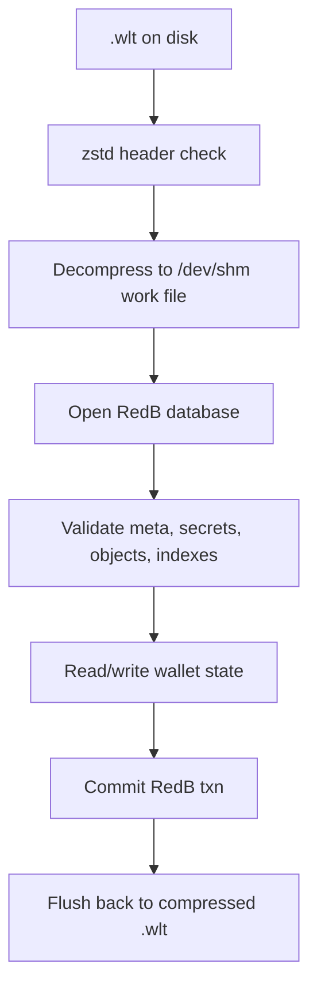

# 🔐 WLT RedB Breakdown

## 🔑 Bottom Line

The `.wlt` file is a zstd-compressed RedB database that stores wallet state, secrets, encrypted object records, and wallet index state. It is opened through a tmpfs-backed work file under `/dev/shm`, validated, and then flushed back to the compressed `.wlt` atomically.

The canonical live tx-history does **not** live inside `.wlt`. The live history store is `wallet_<stem>_tx_history.jsonl`, and the repo policy treats `.wlt` as wallet-state-only.

## 🧱 Storage Stack

The open path is intentionally strict:

1. The file must start with zstd magic bytes.
2. The compressed payload is streamed to a tmpfs work file.
3. RedB is opened from the work file, not directly from the compressed file.
4. Meta, secrets, and object records are validated before the wallet session becomes usable.

## 📦 Table Inventory

| Table | Key type | Value type | What it stores | Notes |
| --- | --- | --- | --- | --- |
| `meta` | `&str` | `&[u8]` | Wallet identity, schema/version gates, timestamps, integrity marker, and object pointers | The most important control table |
| `secrets` | `&str` | `&[u8]` | Encrypted master key, main seed secret, and seed-reveal marker | Secrets are sealed with the master key |
| `objects` | `&[u8]` | `&[u8]` | Encrypted object records keyed by canonical 16-byte object IDs | Object values are bincode-encoded `EncryptedObjectRecord` blobs |
| `index_account_by_label` | `&[u8]` | `&[u8]` | Account lookup rows indexed by semantic label | Privacy-preserving key framing |
| `index_receiver_by_kind` | `&[u8]` | `&[u8]` | Receiver rows indexed by kind | Domain-specific lookup table |
| `index_asset_def_by_symbol` | `&[u8]` | `&[u8]` | Asset definitions indexed by symbol | Symbol lookup index |
| `index_asset_out_by_def` | `&[u8]` | `&[u8]` | Asset outputs indexed by definition | Used for asset output discovery |
| `index_asset_out_by_spentflag` | `&[u8]` | `&[u8]` | Asset outputs indexed by spent flag | Supports spent/unspent queries |
| `index_tracked_asset_by_spentflag` | `&[u8]` | `&[u8]` | Tracked assets indexed by spent flag | Separate from raw asset outputs |
| `index_tx_by_status` | `&[u8]` | `&[u8]` | Transactions indexed by status | Transaction workflow lookup |
| `index_tx_by_time` | `&[u8]` | `&[u8]` | Transactions indexed by time | Time-ordered query support |
| `index_pending_by_status_expiry` | `&[u8]` | `&[u8]` | Pending items indexed by status and expiry | Used for pending queue management |
| `index_receipt_by_txhash` | `&[u8]` | `&[u8]` | Receipts indexed by transaction hash | Receipt lookup by hash |
| `index_wallet_by_wallet_id` | `&[u8]` | `&[u8]` | Wallet rows indexed by wallet id | Wallet discovery index |
| `index_owned_asset_by_id` | `&[u8]` | `&[u8]` | Owned assets indexed by asset id | Cash-asset lookup |
| `index_owned_asset_by_def_status` | `&[u8]` | `&[u8]` | Owned assets indexed by definition id and status | Spendability and balance queries |
| `index_owned_asset_by_status` | `&[u8]` | `&[u8]` | Owned assets indexed by wallet status | Status-filtered asset queries |
| `index_owned_asset_by_tx` | `&[u8]` | `&[u8]` | Owned assets indexed by pending or confirmed tx id | Tx-to-asset lookup |
| `index_owned_asset_by_scan` | `&[u8]` | `&[u8]` | Owned assets indexed by scan reference | Receive/scan recovery lookup |
| `index_owned_object_by_family` | `&[u8]` | `&[u8]` | Non-asset inventory indexed by family | Voucher/right projection |
| `index_owned_object_by_status` | `&[u8]` | `&[u8]` | Non-asset inventory indexed by family and status | Lifecycle queries |
| `index_owned_object_by_policy` | `&[u8]` | `&[u8]` | Non-asset inventory indexed by policy availability | Quarantine and policy queries |
| `index_owned_object_by_holder` | `&[u8]` | `&[u8]` | Non-asset inventory indexed by holder commitment | Holder lookup |
| `index_owned_voucher_by_id` | `&[u8]` | `&[u8]` | Vouchers indexed by terminal id | Voucher lookup |
| `index_owned_right_by_id` | `&[u8]` | `&[u8]` | Rights indexed by terminal id | Right lookup |
| `index_manifest` | `&[u8]` | `&[u8]` | Previous index entries per object ID | Used to remove stale index rows on overwrite |

## 🗝️ Meta Table

The `meta` table stores plain string keys with binary values. Most values are bincode-encoded scalars or structs, except for object pointer keys and the integrity marker.

### Identity, config, and lifecycle keys

| Key | Stored type | Purpose | Required when |
| --- | --- | --- | --- |
| `wallet.id` | `bincode(PersistWalletId)` | Wallet identifier | Open and discovery |
| `wallet.schema_version` | `bincode<u32>` | Schema version gate | Open and discovery |
| `wallet.kdf` | `bincode<KdfParams>` | Persisted KDF parameters for master-key unwrap | Open and discovery |
| `wallet.initialized` | `bincode<u8>` | Initialization flag, expected to be `1` | Open and discovery |
| `wallet.created_at` | `bincode<u64>` | Creation timestamp in unix millis | Write path and open validation |
| `wallet.updated_at` | `bincode<u64>` | Last update timestamp in unix millis | Write path and open validation |
| `wallet.save_seq` | `bincode<u64>` | Monotonic save sequence | Write path and open validation |
| `wallet.chain` | `bincode<String>` | Chain identifier | Open and discovery |
| `wallet.network` | `bincode<String>` | Network identifier | Open and discovery |

### Migration markers

| Key | Stored type | Purpose | Notes |
| --- | --- | --- | --- |
| `wallet.index_format_version` | `bincode<u32>` | Index-key format marker | New wallets start on the current format; older wallets may migrate on open |
| `wallet.aad_secret_version` | `bincode<u32>` | Secret AAD format marker | Open fails if the version is missing or unsupported |
| `wallet.hkdf_info_version` | `bincode<u32>` | HKDF info scheme marker | Open fails if the version is missing or unsupported |

### Integrity and pointer keys

| Key | Stored type | Purpose | Notes |
| --- | --- | --- | --- |
| `wallet.integrity.v1` | raw 32 bytes | Integrity digest derived from `save_seq` | Updated on each write |
| `wallet.derivation_state_object_id` | raw 16-byte big-endian object ID | Pointer to the derivation-state object | Written during create; used by higher-level derivation state paths |
| `wallet.scan_state_object_id` | raw 16-byte big-endian object ID | Pointer to the scan-state object | Required on open |
| `wallet.app_object_id` | raw 16-byte big-endian object ID | Pointer to the app-state object | Required on open |
| `wallet.chain_object_id` | raw 16-byte big-endian object ID | Pointer to the chain-state object | Required on open |
| `wallet.keys_object_id` | raw 16-byte big-endian object ID | Pointer to the keys object | Required on open |
| `wallet.stealth_meta_object_id` | raw 16-byte big-endian object ID | Pointer to stealth metadata | Written during create; used by higher-level features |
| `wallet.tofu_pins_object_id` | raw 16-byte big-endian object ID | Pointer to TOFU pins | Written during create; used by higher-level features |
| `wallet.profile_object_id` | raw 16-byte big-endian object ID | Pointer to the wallet-profile object | Written by the canonical profile-first persistence path |

## 🗝️ Secrets Table

The `secrets` table stores encrypted records. Keys are human-readable strings, but the values are sealed records that must be decrypted with the master key.

| Key | Stored type | Decrypts to | Meaning |
| --- | --- | --- | --- |
| `master_key` | `bincode<MasterKeyRecord>` | Encrypted master key envelope + optional KDF params | Primary secret used to unlock the wallet |
| `seed_main` | `bincode<SecretsRecord>` | Main seed secret plaintext | The payload may decode as `SeedMainEntropyPayload` or UTF-8 seed phrase text |
| `seed_main.revealed_at` | `bincode<SecretsRecord>` | `u64` unix millis | Marker that records when the seed was revealed |

`MasterKeyRecord` stores an AEAD envelope plus persisted KDF parameters. `SecretsRecord` stores `kind`, `label`, `version`, and the AEAD envelope. The AAD for secret records is derived from the wallet ID and secret name.

## 📦 Objects Table

The `objects` table is the encrypted object store. It is keyed by canonical 16-byte big-endian object IDs and stores `EncryptedObjectRecord` values.

### Record shape

| Layer | Shape | Notes |
| --- | --- | --- |
| RedB key | raw 16-byte big-endian object ID | The object identifier itself |
| RedB value | `bincode<EncryptedObjectRecord>` | The stored encrypted record |
| Encrypted record | `AeadEnvelope` + `payload_version` | The `AeadEnvelope` holds the sealed payload bytes |
| Payload inside envelope | `bincode<EncryptedObjectPayload>` | Contains `payload_version`, `kind_id`, and encrypted data |
| Inner object body | custom `ZWL1` header + compressed bytes | The payload bytes are wrapped and compressed before sealing |

`AeadEnvelope` uses the canonical format `algo_id || nonce || ciphertext_with_tag`.

### Object kinds stored in `.wlt`

| Kind | Kind ID | Payload struct / body | Stored meaning |
| --- | --- | --- | --- |
| `WalletRoot` | `1` | `WalletRootPayload { version, main_account_id, created_at, chain }` | Root wallet container object |
| `Account` | `2` | `AccountPayload { account_id, parent_wallet, name, derivation_path, public_key, created_at }` | Main account record |
| `DerivationState` | `7` | `DerivationStatePayload { next_account_index, next_address_index }` | HD derivation cursor |
| `ScanState` | `8` | `ScanStatePayload { last_scanned_height, last_scanned_hash }` | Scan resume cursor |
| `App` | `15` | `AppPayload { app_id, app_name, app_version, platform, instance_id, created_at, last_opened_at, notes }` | App-local wallet metadata |
| `Chain` | `16` | `ChainPayload { chain, chain_id, genesis_hash, params, created_at }` | Chain configuration state |
| `Keys` | `17` | `KeysPayload { keyset_id, account_id, signing_keys, created_at, updated_at }` | Wallet keyset inventory |
| `StealthMeta` | `18` | `StealthMetaPayload { view_key_version, receiver_mode, stealth_activated_at, mode_audit }` | Stealth-receiver metadata |
| `TofuPins` | `19` | `TofuPinsPayload { pins, updated_at }` | TOFU pin store |
| `WalletProfile` | `20` | `WalletProfilePayload` bytes | Canonical profile metadata and verifier state |
| `OwnedAsset` | `21` | `OwnedAssetPayload` bytes | Canonical wallet-owned cash-asset rows |
| `WalletTx` | `22` | `WalletTxPayload` bytes | Canonical tx record rows |
| `WalletTxEvent` | `23` | `WalletTxEventPayload` bytes | Canonical tx event rows |
| `BackupManifest` | `24` | `BackupManifestPayload` bytes | Canonical export/restore manifest row |
| `OwnedVoucher` | `25` | `OwnedVoucherPayload` bytes | Canonical wallet-owned voucher rows |
| `OwnedRight` | `26` | `OwnedRightPayload` bytes | Canonical wallet-owned right rows |

### What is actually created on wallet bootstrap

The create path seeds the following object records and stores their IDs in `meta`:

- `WalletRoot`
- `Account`
- `DerivationState`
- `ScanState`
- `App`
- `Chain`
- `Keys`
- `StealthMeta`
- `TofuPins`

No legacy snapshot object is created. The live wallet state is stored through the explicit payload kinds listed above.
`WalletProfile` is written by the profile persistence path rather than by this
bootstrap object seed list.

## 🧭 Index Manifest

`index_manifest` is a bookkeeping table keyed by object ID. Its value is a bincode-encoded `Vec<IndexManifestEntry>`, where each entry stores:

- the index table that received a row, and
- the exact canonical index key bytes that were inserted.

This table exists so the writer can remove stale index rows before inserting new rows for the same object. In other words, the manifest is the cleanup ledger for overwrites.

## 🔎 Domain Index Tables

All domain index tables use the same canonical key framing and bounded value storage. The key carries the semantic meaning; the value is an opaque bounded byte payload.

### Canonical key format

The code defines two layers of index-key framing:

- Semantic key: `b"zsem" || version(u8) || domain_len(u16be) || domain || field_len(u16be) || field || value_len(u32be) || value`
- Stored index key: `b"zidx" || table_tag(u8) || semantic_len(u16be) || semantic_key || object_id_be(16)`

For privacy-default mode, the semantic portion is HMACed with the derived `INDEX_KEY`, so plaintext semantic labels do not appear in the raw key bytes.

### Table-by-table intent

| Table | Semantic focus | Typical meaning |
| --- | --- | --- |
| `index_account_by_label` | Account label lookup | Find an account by human label |
| `index_receiver_by_kind` | Receiver kind lookup | Find receiver entries by kind |
| `index_asset_def_by_symbol` | Asset definition lookup | Find asset definitions by symbol |
| `index_asset_out_by_def` | Asset output lookup | Find outputs by definition |
| `index_asset_out_by_spentflag` | Asset output status lookup | Split spent and unspent outputs |
| `index_tracked_asset_by_spentflag` | Tracked asset status lookup | Split tracked assets by spent flag |
| `index_tx_by_status` | Transaction status lookup | Query transactions by workflow state |
| `index_tx_by_time` | Transaction chronology lookup | Query transactions in time order |
| `index_pending_by_status_expiry` | Pending queue lookup | Query pending items by state and expiry |
| `index_receipt_by_txhash` | Receipt lookup | Find receipts by transaction hash |
| `index_wallet_by_wallet_id` | Wallet lookup | Find wallet rows by wallet id |
| `index_owned_asset_by_id` | Owned asset lookup | Find a cash-asset row by asset id |
| `index_owned_asset_by_def_status` | Owned asset definition/status lookup | Query asset rows by definition and lifecycle status |
| `index_owned_asset_by_status` | Owned asset status lookup | Query asset rows by wallet-local status |
| `index_owned_asset_by_tx` | Owned asset transaction lookup | Find rows linked to a pending or confirmed tx id |
| `index_owned_asset_by_scan` | Owned asset scan lookup | Find rows linked to scan progress |
| `index_owned_object_by_family` | Non-asset family lookup | Split typed inventory into voucher/right families |
| `index_owned_object_by_status` | Non-asset lifecycle lookup | Query voucher/right rows by status |
| `index_owned_object_by_policy` | Non-asset policy lookup | Find unavailable or quarantined policy rows |
| `index_owned_object_by_holder` | Non-asset holder lookup | Find voucher/right rows by holder commitment |
| `index_owned_voucher_by_id` | Voucher terminal lookup | Find a voucher by canonical terminal id |
| `index_owned_right_by_id` | Right terminal lookup | Find a right by canonical terminal id |

### Value bytes

The `value` column is a bounded opaque byte buffer (`IndexValueBytes`, max 1024 bytes). The key already contains the object ID, so the value is intentionally small and table-specific. If a table needs larger payloads, the payload should live in an object record instead of an index row.

## 🚦 Open and Validation Semantics

The wallet does not open on trust alone. It fails closed on the common corruption and mismatch cases:

1. `discover_wallet_store` checks the zstd header and requires `/dev/shm` for the work file.
2. `read_wallet_meta_header` enforces required meta keys, wallet ID, chain,
   network, schema version, KDF validity, initialization state, write-time
   timestamps/save sequence, and the required open pointers:
   `wallet.scan_state_object_id`, `wallet.app_object_id`,
   `wallet.chain_object_id`, and `wallet.keys_object_id`.
3. `open_session` checks `wallet.index_format_version`, `wallet.aad_secret_version`, and `wallet.hkdf_info_version`.
4. The master key record must be present and decryptable.
5. The main seed secret must be present, valid, and decryptable.
6. Every stored object record is decrypted and validated on open.

Practical failure outcomes observed in code and tests include:

- invalid config for malformed or missing meta keys,
- invalid password for corrupted encrypted secrets or object records,
- wallet chain mismatch,
- wallet network mismatch,
- unsupported schema / KDF / secret format versions.

## ❌ What Is Not Stored in `.wlt`

The canonical live tx-history is outside the RedB wallet file:

- `wallet_<stem>_tx_history.jsonl` is the live history store.
- The `.wlt` file remains wallet-state-only.
- Legacy per-tx JSON directories are treated as migration input, not as the canonical source of truth.

## 📚 Source Map

- [schema_keys.rs](../src/db/schema_keys.rs) - canonical meta keys, secrets
  keys, and `IndexTable` enum.
- [tables.rs](../src/redb_store/tables.rs) - RedB table definitions, object
  kinds, payload versions, and `WltBacking`.
- [meta.rs](../src/redb_store/meta.rs) - required meta keys, pointer keys, and
  open/write validation.
- [open_discovery.rs](../src/redb_store/open_discovery.rs) - zstd magic check,
  tmpfs work file, and RedB discovery.
- [open_wallet.rs](../src/redb_store/open_wallet.rs) - unlock flow, version
  gates, and object validation on open.
- [mutations_create_wallet.rs](../src/redb_store/mutations_create_wallet.rs) -
  initial meta/secrets/object writes for a new wallet.
- [initial_wallet_objects.rs](../src/redb_store/initial_wallet_objects.rs) -
  initial object payloads and object kinds.
- [object_writes.rs](../src/redb_store/object_writes.rs) - object store,
  `index_manifest`, and index update application.
- [profile.rs](../src/redb_store/profile.rs) - canonical wallet-profile
  persistence and profile object reuse.
- [crypto_ops.rs](../src/redb_store/crypto_ops.rs) - object and secret sealing,
  integrity marker updates, and decrypt paths.
- [wallet_store_crypto_models.rs](../src/db/wallet_store_crypto_models.rs) -
  `AeadEnvelope`, `MasterKeyRecord`, and `SecretsRecord`.
- [object_types.rs](../src/wasm/object_types.rs) - `EncryptedObjectPayload` and
  `EncryptedObjectRecord`.
- [index_codecs.rs](../src/db/index_codecs.rs) - `zidx` and `zsem` canonical
  key formats.
- [test_redb_wlt_open.rs](../tests/test_redb_wlt_open.rs) - canonical
  `wallet_<stem>_tx_history.jsonl` boundary.
- [test_wlt_validator.rs](../tests/test_wlt_validator.rs) - validator semantics
  for wallet files.

## ✅ Final Takeaway

If you are looking for the exact contents of `.wlt`, the answer is:

1. `meta` for identity, versioning, integrity, timestamps, and object pointers.
2. `secrets` for the encrypted master key, main seed, and the seed-reveal marker.
3. `objects` for encrypted wallet objects such as profile, asset, voucher,
   right, transaction, and manifest payloads.
4. `index_*` tables for canonical query/index state.
5. `index_manifest` for overwrite cleanup bookkeeping.

Everything else, especially live tx-history, is outside `.wlt`.
