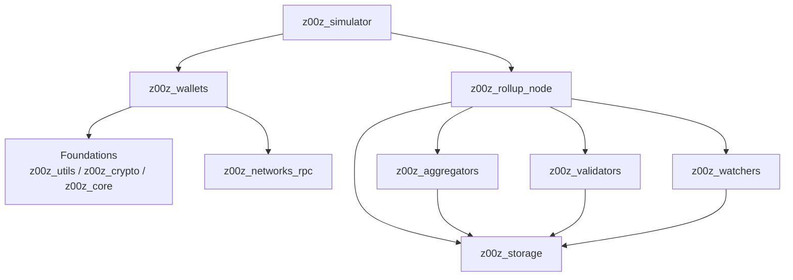

<!-- generated-by: gsd-doc-writer -->
# Architecture

Z00Z is a layered Rust workspace for confidential asset handling, typed settlement objects, and reproducible runtime execution. At a high level, wallet or simulator inputs are turned into object packages, the runtime routes and binds them to settlement execution, storage owns roots and proof state, validators resolve verdicts, and watchers publish observation and alert evidence.

## 🎯 System Overview

The live architecture is crate-oriented rather than service-oriented. Shared foundations live in `z00z_utils`, `z00z_crypto`, and `z00z_core`; runtime authority is split across `z00z_aggregators`, `z00z_validators`, `z00z_watchers`, and `z00z_rollup_node`; persistence lives in `z00z_storage`; client-side packaging and backup flows live in `z00z_wallets`; reproducible cross-crate execution is owned by `z00z_simulator`.

## 🧭 Component Diagram



`onionnet` is intentionally excluded from the live flow above because its public crate surface is still a placeholder boundary, not an active transport implementation.

## 🔄 Data Flow

1. `z00z_wallets` or `z00z_simulator` produces typed wallet or scenario inputs using shared asset and crypto primitives from `z00z_core`, `z00z_crypto`, and `z00z_utils`.
2. `z00z_rollup_node` loads aggregator, planner, and storage configuration through `AggRunArgs` and `NodeConfig`, then composes `NodeRuntime`.
3. `z00z_aggregators` recomputes package-bound digests, applies the shard route table, and binds runtime execution handoff and publication metadata.
4. `z00z_storage` owns settlement roots, proof contracts, journal lineage, snapshot/export flows, and backend durability.
5. `z00z_validators` consumes resolved runtime batches and storage-owned proof state to emit verdicts and settlement theorem bundles.
6. `z00z_watchers` consumes publication and provider health signals to export evidence and alerts without becoming a second semantic authority.
7. `z00z_simulator` replays the same crate boundaries with checked-in manifests and fixture directories to validate end-to-end behavior.

## 🔑 Key Abstractions

| Abstraction | Location | Why it matters |
|---|---|---|
| `AssetDefinitionRegistry` | `crates/z00z_core/src/assets/registry.rs` | Canonical asset catalog and registry snapshot authority |
| `GenesisConfig` | `crates/z00z_core/src/genesis/genesis_config.rs` | Typed bootstrap manifest for live genesis/bootstrap generation |
| `SettlementStore` | `crates/z00z_storage/src/settlement/store.rs` | Storage-owned settlement root and proof persistence surface |
| `WalletService` | `crates/z00z_wallets/src/services/wallet_service_core.rs` | Native wallet orchestration facade behind the crate-root re-export |
| `RpcTransport` | `crates/z00z_networks/rpc/src/transport.rs` | Transport-only RPC abstraction reused across wallet and node callers |
| `AggregatorService` | `crates/z00z_runtime/aggregators/src/service.rs` | Runtime-owned ingress, ordering, recovery, and publication binding surface |
| `ValidatorService` | `crates/z00z_runtime/validators/src/engine.rs` | Canonical validator execution boundary over resolved batches |
| `WatcherService` | `crates/z00z_runtime/watchers/src/engine.rs` | Observation and alert boundary for publication and provider health |
| `NodeConfig` / `AggRunArgs` | `crates/z00z_rollup_node/src/config.rs` | Rollup-node process configuration and CLI contract |

## 🗂️ Directory Structure Rationale

```text
crates/
  z00z_utils
  z00z_crypto
  z00z_core
  z00z_storage
  z00z_wallets
  z00z_runtime/{aggregators,validators,watchers}
  z00z_rollup_node
  z00z_networks/{rpc,onionnet}
  z00z_simulator
  z00z_telemetry
config/
docs/
scripts/
.github/
.planning/
```

## 📌 Top-Level Areas

| Path | Purpose |
|---|---|
| `crates/` | Owns the live Rust workspace and its explicit crate boundaries |
| `config/` | Checked-in runtime manifests, planner/storage configs, and aggregator fixture inputs |
| `docs/` | Whitepapers, technical papers, and now the canonical generated docs set |
| `scripts/` | Build, verification, fuzzing, profiling, and environment bootstrap helpers |
| `.github/` | Repository-local skills, prompts, workflows, and operational guardrails |
| `.planning/` | Planning artifacts, codebase analyses, and temporary workflow state |

`crates/z00z_extensions/` is deliberately outside the active workspace membership list. It can be documented as adjacent research or future extension work, but it is not part of the default build, test, or verification graph today.
