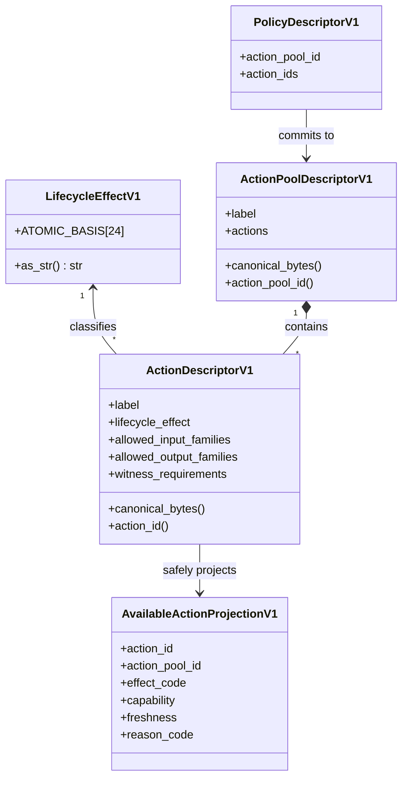
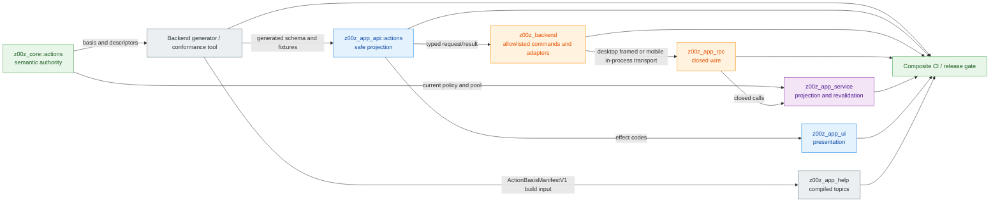
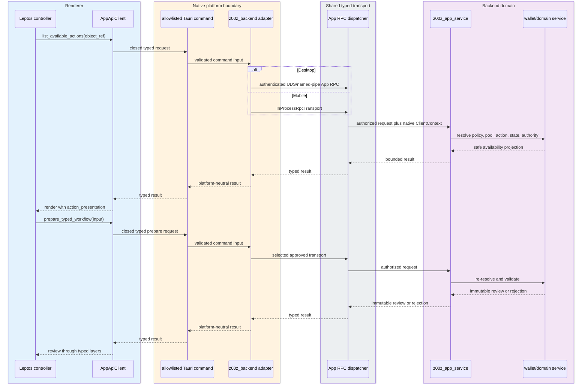
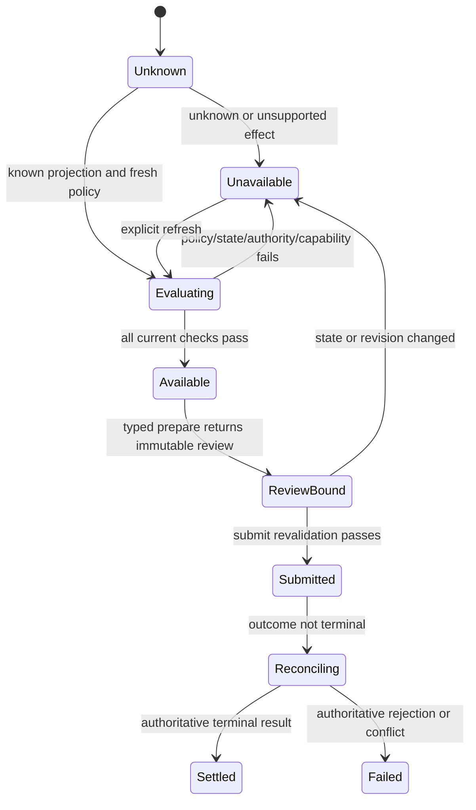

# Z00Z V1 Actions Pool And App Projection Specification

[TOC]

Status: Proposed contract; backend basis is present only in the current dirty worktree
Date: 2026-07-30
Scope: Core action vocabulary, policy action pools, App API/RPC projection, UI/Help synchronization
Canonical artifact: `docs/tech-papers/Z00Z-Actions-Pool-Spec.md`
Source directory: `/home/vadim/Projects/z00z-app/.temp`
Output path: `/home/vadim/Projects/z00z/docs/tech-papers/Z00Z-Actions-Pool-Spec.md`
Reference specs:

- [Z00Z App production port specification](../../../z00z-app/.planning/phases/Z00Z-App-SPEC.md)
- [Z00Z Help production specification](../../../z00z-app/.planning/phases/Z00Z-Help-SPEC.md)

Owner modules/packages/crates: `z00z_core::actions`, `z00z_app_api::actions`, `z00z_app_rpc`, `z00z_app_service`, `z00z_app_ui`, `z00z_backend`, `z00z_app_help`

## 🎯 0. Executive Summary

The V1 action contract has three distinct layers:

1. `LifecycleEffectV1::ATOMIC_BASIS` is the closed 24-effect semantic
   vocabulary.
2. `ActionPoolDescriptorV1` is a policy-specific, content-addressed set of
   concrete action descriptors selected from that vocabulary or from an
   explicitly retained compatibility lane.
3. `AvailableActionProjectionV1` is the backend-authoritative result of
   evaluating one current object, policy, state, authority, witnesses, and
   runtime capability.

These layers MUST NOT be collapsed. Membership in the global basis does not
prove that an action belongs to a policy, is implemented by the wallet, is
currently authorized, or should be visible in the UI.

`z00z_core::actions` remains the only semantic owner. `z00z_app_api::actions`
MUST expose a generated or exhaustively verified, bounded, renderer-safe
projection. `z00z_app_rpc` MUST provide only closed typed query and workflow
operations. `z00z_app_ui` and compiled Help MUST provide exhaustive
presentation for the projected basis without redefining its semantics.
One deterministic `ActionBasisManifestV1`, generated from the core basis
through governed `z00z_utils` codec tooling, is the sole cross-workspace
generation/conformance input. It is build-time evidence, not a runtime wallet
API and not a second semantic owner.

## 🔑 1. Glossary

| Term | Contract meaning |
| --- | --- |
| Atomic basis | The exact ordered 24-effect `LifecycleEffectV1::ATOMIC_BASIS` |
| Lifecycle effect | One semantic object-state effect, serialized with a stable snake-case wire name |
| Action descriptor | A concrete effect plus object-family, witness, acceptance, beneficiary, and refund-authority rules |
| Action pool | A deterministic policy-specific set of action descriptors |
| Action identity | Content-addressed `ActionId` derived from canonical descriptor bytes |
| Pool identity | Content-addressed `ActionPoolId` derived from canonical pool bytes |
| Available action | A safe backend projection of one action after current policy/state/authority/capability evaluation |
| Product workflow | A typed multi-step operation such as Pay, payroll, subscription, escrow, or offline transfer |
| Compatibility effect | `NoStateChange` / `no_state_change`; retained for existing descriptors but excluded from the atomic basis |
| Action basis manifest | Versioned deterministic build artifact containing only backend base revision, action-source digest, canonical basis digest, ordinals, stable wire names, and explicit compatibility exclusion |

## 👁️‍🗨️ 2. Reader Contract

Normative words have their usual meanings:

- **MUST** and **MUST NOT** define release-blocking requirements.
- **SHOULD** defines the default implementation unless a reviewed alternative
  proves the same properties.
- **MAY** defines optional behavior.
- **FAIL CLOSED** means the action is unavailable and no mutation is prepared
  or submitted.

This document distinguishes current implementation evidence from target
architecture. A type present in dirty source is not a shipped or released
contract.

## 🔍 3. Current Implementation Truth

### ✅ 3.1 Present in the dirty Z00Z worktree

- `z00z_core::actions::LifecycleEffectV1` contains the 24-entry
  `ATOMIC_BASIS` plus compatibility-only `NoStateChange`.
- `LifecycleEffectV1::as_str()` defines stable snake-case names.
- `ActionDescriptorV1` contains one `lifecycle_effect`, allowed input/output
  families, witness requirements, receiver-acceptance policy, beneficiary
  preservation, and refund-authority preservation.
- `ActionPoolDescriptorV1` validates a non-empty deterministic
  `BTreeSet<ActionDescriptorV1>`.
- canonical descriptor and pool bytes produce `ActionId` and `ActionPoolId`.
- action-basis tests verify exact order, uniqueness, YAML round trips, stable
  names, and `NoStateChange` exclusion.
- `z00z_wallets::rpc::object_rpc_impl` maps a subset of voucher/right actions
  and currently accepts context-bound legacy effects: voucher `Issue` accepts
  `Issue` or `Offer`, voucher `Transfer` accepts `Transfer` or `Offer`, and
  voucher `Reject` accepts `Reject` or `Refund`.

### ⚠️ 3.2 Partial or compatibility-only behavior

- `fixed_cash_action_pool_descriptor()` still uses `NoStateChange` for existing
  `cash_split` and `cash_merge` descriptors. Those descriptors MUST NOT be
  silently rewritten because their canonical bytes participate in identities.
- the wallet mapping covers only current voucher/right operations; it is not an
  implementation of every basis effect.
- current compatibility unit tests cover voucher Issue/Offer and
  Reject/Refund, but do not yet cover the existing voucher Transfer/Offer
  mapping.
- `ActionDescriptorV1` carries exactly one lifecycle effect. Multi-effect
  workflows are application/service compositions today, not one fully modeled
  composite descriptor.
- no checked-in golden baseline currently proves that every pre-existing
  `ActionId`, `ActionPoolId`, and dependent policy identity stayed unchanged
  after the enum expansion.

### ❌ 3.3 Missing target components

- `/home/vadim/Projects/z00z/crates/z00z_app_api`
- `/home/vadim/Projects/z00z/crates/z00z_app_rpc`
- `/home/vadim/Projects/z00z/crates/z00z_app_service`
- deterministic `ActionBasisManifestV1` generator and checked fixture
- generated action schemas and golden vectors
- App RPC action projection methods
- production `z00z_backend` action commands and platform adapters; the current
  app-local crate is only a placeholder
- UI action-presentation registry
- compiled Help action-topic coverage
- composite-checkout drift and release gates

## 🧾 4. Source Assimilation Matrix

| Source | Extracted concept | Decision | Reason | Spec section |
| --- | --- | --- | --- | --- |
| `z00z-app/.temp/Actions-pool.md` | Exact 24-effect member set | Keep | Members match current dirty core source; draft grouping is not canonical order | Section 7 |
| `z00z-app/.temp/Actions-pool.md` | Product-to-effect examples | Keep as composition guidance | Useful vocabulary, not runtime evidence | Section 7.1 |
| `z00z-app/.temp/Actions-pool.md` | Basis is complete forever | Reject | V1 completeness is scoped to the current object model/catalogue | Section 5 |
| `z00z_core/src/actions/action_descriptor.rs` | Enum, stable names, descriptors | Keep as implementation authority | Live source defines current bytes and types | Sections 3, 7, 8 |
| `z00z_core/src/actions/action_pool.rs` | Deterministic pools and IDs | Keep | Content-addressed policy boundary | Section 8 |
| `z00z_wallets/src/rpc/object_rpc_impl.rs` | Runtime subset and legacy aliases | Keep as partial evidence | Proves only mapped paths | Sections 3, 14 |
| `z00z-app/.planning/phases/Z00Z-App-SPEC.md` | Typed App projection and UI isolation | Keep | Required frontend/backend boundary | Sections 9, 13 |

## 🚩 5. Stale Material And Conflict Resolution

| Old or conflicting item | Resolution | Reason | Spec impact |
| --- | --- | --- | --- |
| Draft groups `Cancel` before transfer effects | Use live `LifecycleEffectV1::ATOMIC_BASIS` order, where `Cancel` follows `Release` | Core source and tests are the canonical ordered authority; the draft is a conceptual grouping | Section 7 freezes the live order |
| `ActionPool` described only as future paper vocabulary | Current core types are live in dirty source; release status remains unproven | Code now contains exact types | Current truth is updated without claiming shipment |
| `Issue` represented as `Offer` | New descriptors use `Issue`; reviewed legacy inputs MAY remain accepted | Preserve compatibility without semantic drift | Alias stays backend-only and tested |
| Voucher `Transfer` represented as `Offer` | New descriptors use `Transfer`; reviewed legacy inputs MAY remain accepted | Preserve existing context-bound behavior without redefining `Offer` | Alias stays backend-only and tested |
| `Reject` represented as `Refund` | New descriptors use `Reject`; reviewed legacy inputs MAY remain accepted | Reject and refund are distinct effects | Alias stays backend-only and tested |
| Cash split/merge use `NoStateChange` | Preserve current canonical bytes until a versioned migration exists | Silent rewrite changes identities | App availability does not reinterpret IDs client-side |
| Product names proposed as enum variants | Reject; model them as typed workflows | Product orchestration is not one atomic effect | No `Batch`, `Payroll`, `HTLC`, or similar basis variants |
| Basis membership treated as capability | Reject and FAIL CLOSED | Policy, state, witnesses, authority, and implementation remain required | Claim stays unavailable without its separate capability |

## 🎯 6. Goals And Non-Goals

### ✅ 6.1 Goals

- freeze the exact V1 basis, order, meanings, and stable wire names;
- preserve one backend semantic owner;
- expose only bounded safe projections to clients and renderer code;
- keep policy-specific pools and current availability backend-authoritative;
- support alternative local clients through the same typed App API/RPC;
- fail CI and release on cross-workspace semantic or presentation drift;
- preserve existing content-addressed identities until an explicit migration.

### 🚫 6.2 Non-goals

- claiming the basis is complete for all future protocol versions;
- claiming every effect has a current runtime implementation;
- exposing a generic action executor;
- letting the renderer author descriptors, pools, witnesses, or identities;
- linking the full `z00z_core` implementation graph into renderer WASM;
- retroactively rewriting existing descriptors merely to use newer effect
  names;
- turning product workflows into atomic enum variants.

## 💯 7. Canonical V1 Atomic Basis

The exact order and stable wire names are normative:

| Index | Rust effect | Wire name | Atomic meaning |
| ---: | --- | --- | --- |
| 1 | `Create` | `create` | Create a non-value definition, request, agreement, or object |
| 2 | `Issue` | `issue` | Issue a value-bearing claim or policy-authorized asset instance |
| 3 | `Offer` | `offer` | Present an object or proposal for another party's decision |
| 4 | `Accept` | `accept` | Accept a pending offer, request, or agreement |
| 5 | `Reject` | `reject` | Reject a pending item without conflating rejection with refund |
| 6 | `Transfer` | `transfer` | Move ownership or control without changing object identity or value |
| 7 | `Split` | `split` | Replace one object with value-conserving descendants |
| 8 | `Merge` | `merge` | Replace compatible objects with one value-conserving descendant |
| 9 | `Lock` | `lock` | Put value or authority into an enforceable conditional state |
| 10 | `Claim` | `claim` | Present the condition witness requesting a conditional outcome |
| 11 | `Release` | `release` | Release locked value after the declared condition succeeds |
| 12 | `Cancel` | `cancel` | Close a pending action under its cancellation policy |
| 13 | `Redeem` | `redeem` | Consume a full claim and release its final output |
| 14 | `PartialRedeem` | `partial_redeem` | Consume part while preserving an exact residual claim |
| 15 | `Refund` | `refund` | Return conditional value to its committed fallback target |
| 16 | `Burn` | `burn` | Irreversibly retire policy-authorized supply |
| 17 | `Expire` | `expire` | Close an object after its committed validity window |
| 18 | `Grant` | `grant` | Create bounded authority |
| 19 | `Delegate` | `delegate` | Transfer or attenuate bounded authority |
| 20 | `Use` | `use` | Exercise bounded authority or consume one allowed use |
| 21 | `Revoke` | `revoke` | Terminate bounded authority under its revocation policy |
| 22 | `Challenge` | `challenge` | Open a bounded dispute or challenge path |
| 23 | `Resolve` | `resolve` | Close a challenge with a policy-authorized outcome |
| 24 | `Disclose` | `disclose` | Produce bounded receipt, audit, or selective-disclosure evidence |

`NoStateChange` / `no_state_change` MUST remain outside
`ATOMIC_BASIS`. It MAY appear only in an explicit compatibility/evidence lane.

### 🧩 7.1 Product Composition

| Product/workflow family | Composition examples |
| --- | --- |
| Pay, donation, payroll | typed payment using `transfer`; backend may select `split`/`merge` |
| Asset lifecycle | `create`, `issue`, `transfer`, `split`, `merge`, `burn` |
| Voucher or service credit | `issue`, `offer`, `accept`/`reject`, `redeem`/`partial_redeem`, `refund`, `expire` |
| Subscription or agent budget | `grant`, `use`, `revoke`, `expire` |
| Escrow, bounty, locker, HTLC | `lock`, `claim`, `release` or `expire` plus `refund` |
| Permission, ticket, digital good | `grant`, `delegate`, `use`, `revoke` |
| Dispute | `challenge`, `resolve` |
| Receipt or selective disclosure | `disclose` |

These rows define vocabulary only. They MUST NOT be used as proof of a live
backend adapter, policy, authority, or UI capability.

## 🧱 8. Object Model



### 🔑 8.1 Invariants

- every action descriptor MUST validate before hashing or projection;
- every action pool MUST validate before identity derivation;
- IDs MUST be derived only from governed canonical bytes;
- a projection MUST carry opaque App-owned ID wrappers, not core
  implementation types;
- a projection MUST NOT contain witness values, secrets, internal session
  state, mutable descriptors, or arbitrary payloads;
- an available action MUST bind to one current policy and pool revision;
- prepare and submit MUST independently re-resolve the current authority.

## 🧭 9. Ownership

| Subsystem/object/flow | Owner | Consumer | MUST own | MUST NOT own |
| --- | --- | --- | --- | --- |
| Atomic basis and meanings | `z00z_core::actions` | Core, service, generator | order, names, semantics | UI copy or route availability |
| Descriptor and pool identities | `z00z_core::actions` | Policy/runtime/wallet | canonical bytes and hashes | renderer-generated IDs |
| Cross-workspace basis manifest | `z00z_core::actions` generator using `z00z_utils` | API/RPC/UI/Help conformance builds | base revision, action-source and basis digests, ordinal, wire name, compatibility exclusion | runtime state, policy, witness, availability, or presentation |
| Safe public action DTOs | `z00z_app_api::actions` | All conforming clients | bounded transport-neutral projections | core implementation or UI |
| Closed wire mapping | `z00z_app_rpc` | Desktop/mobile clients | method IDs, bounds, vectors | generic method/value executor |
| Projection and revalidation | `z00z_app_service` plus domain owner | App RPC dispatcher | policy/state/authority checks | presentation strings |
| Native platform composition | `z00z_backend` | Packaged Wallet renderer | allowlisted Tauri commands, desktop App RPC client, mobile `InProcessRpcTransport` | action semantics, policy decisions, or a second dispatcher |
| UI presentation | `z00z_app_ui::action_presentation` | Wallet renderer | locale keys, icons, review language | action semantics or availability |
| Action Help topics | `z00z_app_help` content/compiler | Isolated Help renderer | explanatory content and topic integrity | App API or wallet capability |

## ⚙️ 10. Config Gate YAML

```yaml
version: 1
profile: "z00z-actions-pool-v1"
architecture_mode: "backend-owned-generated-projection"

features:
  atomic_basis_version: 1
  atomic_effect_count: 24
  compatibility_effects:
    - "no_state_change"
  generic_action_executor: false

modules:
  semantic_owner: "z00z_core::actions"
  api_projection_owner: "z00z_app_api::actions"
  wire_owner: "z00z_app_rpc"
  service_owner: "z00z_app_service"
  platform_owner: "z00z_backend"
  ui_owner: "z00z_app_ui::action_presentation"
  help_owner: "z00z_app_help"

paths:
  core_source: "crates/z00z_core/src/actions/action_descriptor.rs"
  pool_source: "crates/z00z_core/src/actions/action_pool.rs"
  api_projection: "crates/z00z_app_api/src/actions"
  rpc_projection: "crates/z00z_app_rpc/src"
  app_ui_projection: "../z00z-app/crates/z00z_app_ui/src/action_presentation"
  app_backend_projection: "../z00z-app/crates/z00z_backend/src"
  app_help_projection: "../z00z-app/crates/z00z_app_help"

limits:
  action_id_bytes: 32
  action_pool_id_bytes: 32
  basis_effects: 24
  max_actions_per_pool:
    value: "TBD"
    decision_required: true
  max_available_actions_page:
    value: "TBD"
    decision_required: true

gates:
  inputs:
    basis_source_present: "MUST compile from z00z_core::actions"
    basis_unique: "MUST contain 24 unique effects"
    wire_names_stable: "MUST equal the canonical ordered snapshot"
  outputs:
    app_schema: "MUST contain the exact generated safe projection"
    platform_mapping: "MUST use allowlisted commands and one shared dispatcher"
    rpc_vectors: "MUST match the App API schema"
    ui_coverage: "MUST cover every atomic effect exactly once"
    help_coverage: "MUST resolve one reviewed Help topic per effect"
  artifacts:
    basis_fixture: "ActionBasisManifestV1 MUST be deterministic and checked in"
    identity_goldens: "MUST cover retained descriptor and pool identities"
    coverage_report: "MUST prove backend-to-Help traceability"
  conditions:
    compatibility_lane: "MUST NOT enter ATOMIC_BASIS"
    capability_gate: "MUST NOT infer availability from basis membership"
    mutation_gate: "MUST revalidate policy, pool, action, state, witnesses, authority, and capability"
  security:
    renderer_authored_descriptor: "MUST be rejected"
    renderer_authored_identity: "MUST be rejected"
    generic_executor: "MUST be absent"
  compatibility:
    legacy_aliases: "MUST be explicit, backend-only, tested, and version-bounded"
    mixed_versions: "FAIL CLOSED unless protocol negotiation proves compatibility"

retention:
  identity_goldens: "retain for every supported contract version"
  generated_fixtures: "retain while the corresponding API version is supported"

fallbacks:
  unknown_effect: "unavailable"
  schema_mismatch: "fail_closed"
  stale_availability: "refresh_then_fail_closed"

observability:
  log_effect_code: true
  log_action_id_fingerprint: true
  log_witness_values: false
  log_secrets: false

tests:
  require_unit_tests: true
  require_integration_tests: true
  require_negative_tests: true
  require_e2e_tests: true
  require_property_tests: true
  require_fuzz_tests: true
```

### 🔎 10.1 Gate Contract

| Gate ID | Class | Condition | Evidence | Owner | Failure behavior |
| --- | --- | --- | --- | --- | --- |
| ACT-BASIS-01 | Input | Exact ordered 24-effect basis | core unit test and fixture | `z00z_core` | Build fails |
| ACT-BASIS-02 | Output | App schema equals core fixture | regeneration diff | `z00z_app_api` | CI fails |
| ACT-BASIS-03 | Artifact | Retained IDs match goldens | golden tests | `z00z_core` | Migration required |
| ACT-BASIS-04 | Security | No generic executor or renderer-authored descriptor | API/RPC/source scan | API/RPC owners | Release fails |
| ACT-BASIS-05 | Compatibility | Legacy aliases remain exact and bounded | wallet regression tests | `z00z_wallets` | Alias input rejected |
| ACT-BASIS-06 | Coverage | UI, locales, review, and Help cover all effects | composite coverage report | App owners | Release fails |
| ACT-BASIS-07 | Platform | Desktop framed and mobile in-process adapters enter one dispatcher | command inventory and cross-transport vectors | `z00z_backend` | Release fails |

## 📊 11. Component Presence Matrix

| Component | Present | Partial | Stub | Missing | Evidence path | Required action |
| --- | --- | --- | --- | --- | --- | --- |
| Core basis | Yes, dirty | No | No | No | `action_descriptor.rs` | Commit only after full review |
| Basis tests | Yes, dirty | Yes | No | No | `test_action_descriptor.rs` | Add identity and negative goldens |
| Policy action pools | Yes | Yes | No | No | `action_pool.rs` | Add explicit bounds and compatibility coverage |
| Wallet mappings | Yes | Yes | No | No | `object_rpc_impl.rs` | Inventory every supported effect |
| App API projection | No | No | No | Yes | target path absent | Implement generated safe DTOs |
| App RPC vectors | No | No | No | Yes | target path absent | Implement closed mapping |
| Application facade | No | No | No | Yes | target path absent | Implement projection/revalidation |
| Native platform adapter | No | No | Placeholder only | Yes | `z00z-app/crates/z00z_backend` | Implement allowlisted commands and desktop/mobile transport composition |
| UI presentation | No | No | Placeholder only | Yes | `z00z-app/crates/z00z_app_ui` | Build exhaustive registry |
| Help coverage | No | No | Demo content only | Yes | `z00z-app/demo/help` | Compile reviewed effect topics |

## 🚧 12. Implementation Gap Matrix

| Required capability | Current evidence | Gap | Why it matters | Fix path |
| --- | --- | --- | --- | --- |
| Stable old identities | Content-addressed implementation | No pre/post golden set | Silent rehash can break policy references | Add retained ID vectors before migration |
| Bounded pool decoding | Non-empty validation | No explicit action-count limit | Untrusted data may force excess work | Decide and enforce a protocol bound |
| Safe renderer projection | Design only | No App API crate | UI cannot safely consume backend authority | Build `z00z_app_api::actions` |
| Closed cross-platform wire | Design only | No App RPC crate | Desktop/mobile can drift | Build one dispatcher and vectors |
| Enforced renderer/native hop | Design only | No production action command/adapter | Renderer could bypass the approved trust boundary | Implement allowlisted `z00z_backend` commands and adapter tests |
| Exhaustive presentation | Design only | No Rust registry | Missing labels can become unsafe generic UI | Generate/verify all 24 mappings |
| Runtime capability truth | Partial wallet mapping | Basis and implementation are not linked | UI may show unsupported actions | Backend availability query and revalidation |
| Composite effects | One effect per descriptor | No versioned multi-effect model | Complex operations can be underspecified | Keep typed workflows; research V2 separately |

## 🔁 13. End-To-End Synchronization Flow



### 🔄 13.1 Runtime Query And Mutation

The packaged Wallet path is normative and complete:

```text
Leptos component
  -> feature controller/store
  -> typed Z00Z App API client
  -> allowlisted Tauri command
  -> z00z_backend platform adapter
       Desktop: App RPC client -> authenticated UDS/named pipe -> z00z-walletd
       Mobile: InProcessRpcTransport -> same App RPC dispatcher
  -> application service facade
  -> internal z00z_wallets RPC/services
```



### 🚦 13.2 Availability State



## 🔌 14. Public API And RPC Boundary

The App API SHOULD expose:

```text
load_action_basis() -> ActionBasisProjectionV1
list_available_actions(object_ref, page) -> Page<AvailableActionProjectionV1>
```

It MUST NOT expose:

```text
execute_action(effect, payload)
submit_action_descriptor(descriptor)
submit_action_pool(pool)
compute_action_id(bytes)
compute_action_pool_id(bytes)
```

The global basis query is read-only vocabulary. It never enables a route.
Mutations remain closed product/domain workflows with prepare, immutable
review, confirmation, submit, and reconciliation.

In the packaged app these reads and workflows cross only named, allowlisted
Tauri commands implemented by `z00z_backend`. Desktop commands use the
authenticated App RPC client over UDS/named pipe; mobile commands use
`InProcessRpcTransport`. Both enter the same typed App RPC dispatcher and
`z00z_app_service` implementation. No Tauri command may accept a method name,
effect-selected payload, descriptor, pool, or raw RPC value.

`ActionEffectCodeV1` SHOULD represent the exact 24 atomic effects.
Compatibility-only `no_state_change` MUST NOT become an actionable basis code.
If pool inspection must report a compatibility entry, it MUST use an explicit
non-actionable compatibility status rather than reinterpret the descriptor in
the client.

`ActionBasisManifestV1` is not returned by an App RPC method. The runtime
`load_action_basis()` result is an App API projection generated or exhaustively
checked against it. Help consumes the same manifest only during compilation
and acquires no App API, core, wallet, or backend runtime dependency.

## 🔄 15. Compatibility And Migration

- new descriptors SHOULD use exact `Issue`, `Transfer`, and `Reject` effects;
- legacy `Offer` for voucher Issue or Transfer and `Refund` for voucher Reject
  MAY be accepted only by the reviewed backend compatibility map;
- compatibility matching MUST be keyed by typed action/domain context, never by
  UI label text;
- existing descriptor bytes MUST NOT be mutated in place;
- any canonical-byte change requires a new version, identity migration plan,
  old/new golden vectors, policy-reference migration, rollback plan, and
  mixed-version negative tests;
- `NoStateChange` cash entries remain non-actionable compatibility data until a
  separately specified migration exists.

## 🔐 16. Security, Correctness, And Trust Boundaries

| Boundary | Threat | Required control |
| --- | --- | --- |
| Renderer -> App API | forged effect, descriptor, pool, or ID | accept only closed typed workflow requests |
| App API -> native adapter | generic invoke or command confusion | exact Tauri allowlist, closed command DTOs, per-window capabilities |
| App RPC -> service | replay, downgrade, oversized data, grant reuse | authenticated transcript, bounds, version negotiation, native client context |
| Service -> wallet/domain | stale policy or authority | re-resolve before prepare and submit |
| Core -> generated projection | enum/schema drift | deterministic generation and clean-diff gate |
| Projection -> UI/Help | missing or misleading presentation | exhaustive locale/review/topic coverage |
| Compatibility lane | alias confusion or identity rewrite | explicit backend-only map and golden vectors |

Security claims remain planned until implementation, adversarial tests, and
native transport evidence exist.

## 💥 17. Failure Model

| Failure | Detection | Required response | Test |
| --- | --- | --- | --- |
| Unknown effect/version | closed decode | FAIL CLOSED | unknown-variant test |
| Basis count/order/name drift | generator comparison | fail build | golden fixture test |
| Duplicate basis effect | uniqueness gate | fail build | core unit/property test |
| Stale policy/pool/action ID | prepare/submit revalidation | reject and refresh | integration test |
| Missing witness/authority | domain validation | reject without mutation | negative test |
| Unsupported runtime effect | capability inventory | unavailable | capability test |
| Missing UI/locale/Help mapping | composite coverage gate | fail release | cross-workspace test |
| Legacy alias outside reviewed context | compatibility map | reject | regression test |
| Ambiguous transport outcome | durable operation lookup | reconcile, never blind retry | crash/restart test |

## ♻️ 18. Fallback And Recovery

| Fallback | When allowed | Owner | MUST preserve | MUST NOT bypass |
| --- | --- | --- | --- | --- |
| Refresh availability | stale read projection | App controller/service | selected object and safe draft | policy/authority validation |
| Show unavailable | unknown or unsupported effect | UI | sanitized reason and Help access | generic execution |
| Use legacy alias | exact reviewed old descriptor context | backend service | original identities | client-side label matching |
| Reconcile operation | timeout/crash after submit | application service | operation identity and review binding | duplicate mutation |

## 👁️‍🗨️ 19. Observability And Evidence

Logs MAY record:

- API/protocol version;
- effect wire code;
- redacted action/pool ID fingerprint;
- capability and rejection reason code;
- request/review/operation correlation IDs.

Logs MUST NOT record:

- witness values;
- private object openings;
- wallet session tokens;
- secrets or recovery material;
- full untrusted descriptors/packages;
- raw internal errors.

## 🧪 20. Test Requirements

### ✅ 20.1 Unit Tests

| Test | Owner | Purpose | Required assertion |
| --- | --- | --- | --- |
| Exact basis | `z00z_core` | Freeze order/names | exactly 24 unique effects |
| Compatibility exclusion | `z00z_core` | Separate lanes | `NoStateChange` absent |
| Canonical IDs | `z00z_core` | Preserve identity | retained descriptors/pools match goldens |
| Projection bounds | `z00z_app_api` | Renderer safety | oversized/unknown values reject |

### 🔗 20.2 Integration Tests

- `ActionBasisManifestV1` -> App API schema -> App RPC golden vector equality;
- desktop and mobile dispatchers return equivalent availability;
- prepare and submit both reject stale policy/pool/action revisions;
- UI action registry and Help topics cover every basis effect.

### 🚫 20.3 Negative Tests

- raw descriptor/pool/effect submission;
- client-generated action/pool identity;
- generic method/value or generic action payload;
- basis-only Claim activation;
- unsupported effect represented as available;
- compatibility alias in an unapproved action/domain context.

### 🎲 20.4 Property Tests

- basis values are unique and stable under round trip;
- descriptor and pool canonicalization is deterministic;
- action-pool set ordering does not change identity;
- any input-state/authority attenuation cannot widen availability;
- product composition never creates a new atomic wire name.

### 🐞 20.5 Fuzz Tests

- descriptor, pool, projection, and App RPC decoders;
- unknown enum and malformed ID inputs;
- oversized pool/page counts and nested witness metadata;
- mixed-version and compatibility-alias inputs.

### 🌐 20.6 End-To-End Tests

- one object availability read through Tauri/App RPC/service/wallet;
- desktop framed and mobile in-process adapters enter the same dispatcher and
  return equivalent semantic results;
- one typed mutation from availability to review to submit/reconcile;
- unavailable effect remains hidden/disabled with exact Help topic;
- reference non-Tauri client returns the same semantic result.

### 🎭 20.7 Simulation And Scenario Tests

- payment/payroll/donation composition;
- voucher issue/offer/accept/reject/redeem/refund/expire;
- permission grant/delegate/use/revoke;
- escrow lock/claim/release/expire/refund;
- dispute challenge/resolve;
- selective disclosure.

### 🔁 20.8 Regression Tests

- existing fixed-cash descriptor and pool identities;
- exact Issue/Offer, Transfer/Offer, and Reject/Refund compatibility behavior;
- no action-basis member silently becomes a visible product capability;
- adding one core effect fails until API/RPC/UI/locale/Help updates land.

## 📦 21. Dependencies And Tooling

| Role | Existing dependency? | Recommendation | Use | Reason | Risk |
| --- | --- | --- | --- | --- | --- |
| Canonical encoding | Yes, `z00z_utils` | Reuse governed codec | Now | One serialization owner | Missing projection helpers may require a narrow addition |
| Content addressing | Yes, `z00z_crypto::DomainHasher` | Reuse | Now | Existing identity contract | Golden migration coverage is incomplete |
| Collections | Yes, standard `BTreeSet` | Reuse | Now | Deterministic ordering | Explicit decode/count bound still required |
| Code generation | No accepted action generator | Add a repository-owned `ActionBasisManifestV1` generator/conformance target | Phase 1 | Prevent manual enum drift | Generated output must be reproducible |

### ⚙️ 21.1 Installation And Enablement

No package or tool installation is required for this specification update.
Implementation SHOULD reuse the existing Rust toolchain and repository
abstractions. Any future generator MUST be added as reviewed workspace source,
not installed as an opaque global binary.

## 🚫 22. Rejected Alternatives

| Alternative | Why rejected |
| --- | --- |
| Hand-copy the enum into UI | Creates a second semantic owner and drift |
| Link full `z00z_core` into renderer WASM | Breaks isolation and expands the renderer graph |
| Generic `execute_action` API | Bypasses policy, authority, witness, review, and capability boundaries |
| Add product names as effects | Confuses orchestration with atomic semantics |
| Rewrite old descriptors immediately | Silently changes content-addressed identities |
| Expose current internal wallet RPC | Couples clients to an evolving private implementation |
| Let the renderer call App RPC directly | Bypasses Tauri capability policy and platform composition |
| HTTP/WebSocket action API | Violates the local-only App API/RPC architecture |

## 🛠️ 23. Implementation Phases

| Phase | Goal | Work | Exit gate |
| --- | --- | --- | --- |
| 1 | Freeze basis and identities | core fixtures, old-ID goldens, explicit bounds | core gates pass |
| 2 | Build safe public projection | `z00z_app_api::actions`, schemas, bounds | API conformance passes |
| 3 | Build closed wire/service mapping | App RPC vectors and service revalidation | desktop/mobile dispatcher parity |
| 4 | Build presentation | UI registry, locales, review language, Help topics | exact 24-effect coverage |
| 5 | Harden compatibility | alias inventory, mixed-version and migration tests | no implicit alias/rewrite |
| 6 | Release gate | composite checkout generation and artifact evidence | clean reproducible release |

## ✅ 24. Acceptance Gates

| Gate | Required evidence | Blocks release if missing |
| --- | --- | --- |
| Exact basis | ordered 24-entry fixture and tests | Yes |
| Identity stability | retained descriptor/pool/policy goldens | Yes |
| Safe API | bounded generated DTO/schema tests | Yes |
| Closed RPC | method registry and vectors | Yes |
| Platform isolation | allowlisted command inventory and desktop/mobile dispatcher parity | Yes |
| Revalidation | stale/forged policy/pool/action negative tests | Yes |
| UI/locale/Help coverage | composite coverage report | Yes |
| Compatibility | exact reviewed alias matrix | Yes |
| No generic executor | API/RPC/Tauri source and schema scan | Yes |
| Recovery | crash/timeout/reconciliation evidence | Yes |

## ⛔ 25. Non-Negotiable Rejections

- bypassing config or conformance gates;
- treating future architecture as current implementation;
- weakening validation to pass tests;
- using debug strings as canonical bytes;
- relying on local paths as authoritative commitments;
- skipping negative tests or compatibility tests;
- bypassing the App API/RPC/service boundary;
- silently accepting mixed-version artifacts;
- claiming runtime availability from basis membership;
- claiming security properties without implementation evidence.

## 🔍 26. Architecture Doublecheck

| Requirement | Covered by section | Doublecheck result |
| --- | --- | --- |
| Exact 24-effect basis | 7 | Covered and source-aligned |
| Basis/pool/availability separation | 0, 1, 8 | Covered |
| Backend semantic ownership | 8, 9 | Covered |
| App API/RPC projection | 9, 13, 14 | Covered as target |
| UI and Help synchronization | 9, 13, 20 | Covered as target |
| No generic executor | 6, 14, 16, 25 | Covered |
| Compatibility and identity safety | 3, 5, 15 | Covered; old-ID goldens remain missing |
| Current versus future status | 3, 11, 12 | Covered |
| Security and failure behavior | 16, 17, 18 | Covered |
| Positive, negative, property, fuzz, E2E tests | 20 | Covered |
| Installation and alternatives | 21, 22 | Covered |

## ⚠️ 27. Open Risks And Deferred Work

- the basis implementation and its tests are still uncommitted dirty source;
- current old-ID preservation is not proven by a checked-in pre/post golden
  corpus;
- explicit action-pool and available-action page limits are undecided;
- the App API/RPC/service target crates do not exist;
- the one-effect descriptor may be insufficient for a future formally
  committed multi-effect operation;
- current product catalogue coverage is design-level decomposition, not
  runtime implementation evidence;
- this canonical specification is still untracked in the sibling worktree and
  is not durable Git/release provenance until reviewed and versioned.

## 💯 28. Bottom Line

V1 freezes 24 atomic lifecycle effects and keeps `NoStateChange` in an explicit
compatibility lane. The backend owns semantics, policy pools, identities, and
availability. The App API/RPC exposes only generated safe projections and
closed typed workflows. UI and Help own presentation only. Any drift,
client-authored authority, generic execution surface, or capability inferred
from basis membership MUST FAIL CLOSED.
