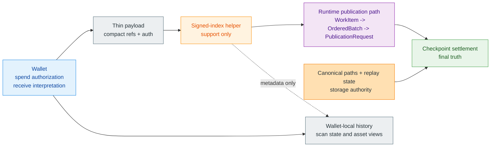
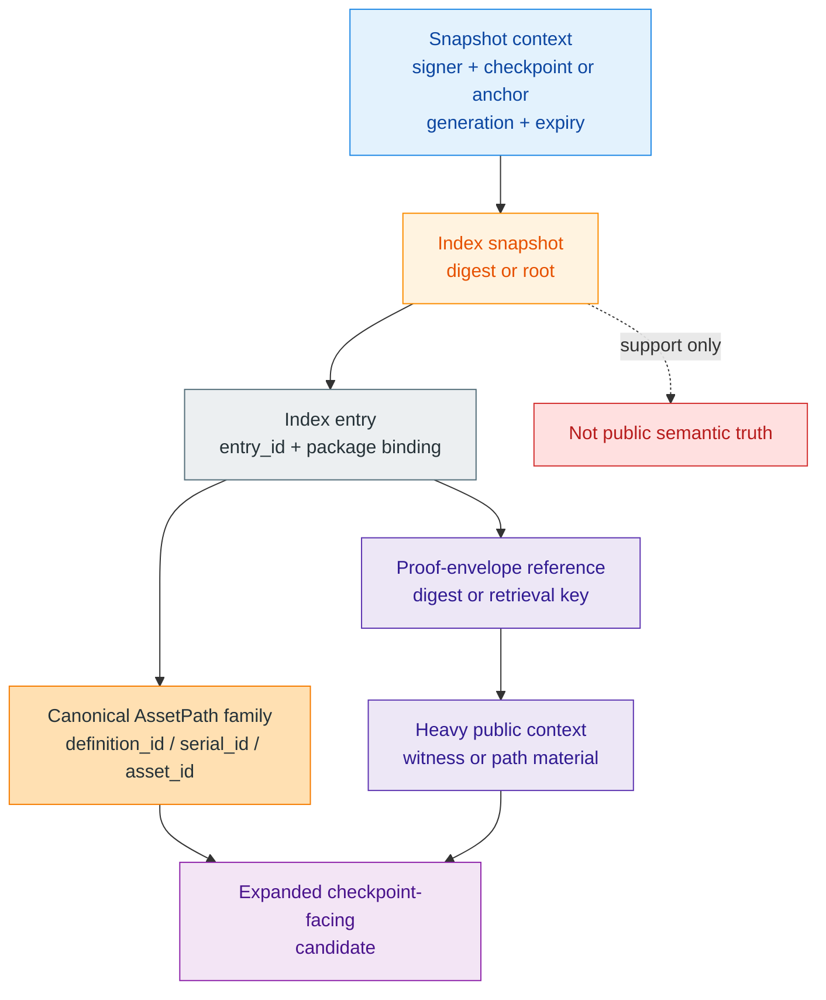
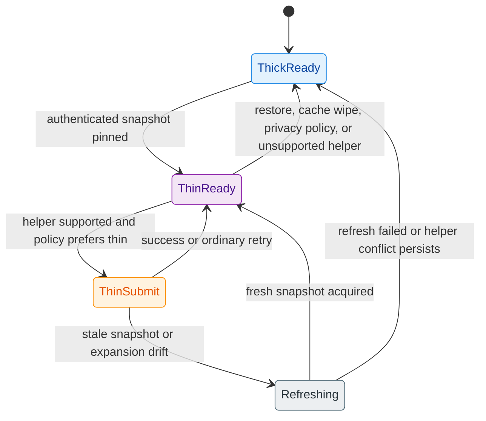

# Z00Z Thin Transaction Mode

[TOC]

Version: 2026-05-27

## Key Terms Used In This Paper

This paper uses a compact transport vocabulary because the design is about
reducing wallet-to-aggregator payload size without moving settlement authority
out of the wallet and checkpoint boundaries.

- `Signed index`: The aggregator-provided, signed or checkpoint-bound compact
  index that lets wallets refer to known state locations without resending full
  path witnesses every time.
- `Helper`: The aggregator-side service role that stores signed-index support
  material and expands thin references before the normal runtime publication
  path begins.
- `Thin transaction mode`: The wallet transport mode in which the wallet sends
  compact references and authorization material instead of the full heavy
  witness bundle.
- `Thick transaction mode`: The fallback mode in which the wallet sends full
  path, witness, or proof material directly.
- `Snapshot context`: The signed and checkpoint-bound context that tells the
  wallet which settlement era a thin reference is allowed to expand against.
  In this paper it means a helper-index context, not the storage
  `PrepSnapshotId` unless a future implementation explicitly bridges them.
- `Index entry`: The compact record that maps a wallet-relevant object to the
  proof or path material the aggregator can later expand.
- `Wallet authority`: The rule that the wallet still owns spend authorization,
  receive interpretation, and local privacy boundaries even when it uses an
  aggregator index.

## 1. Why This Document Is Needed

Z00Z already has a strong wallet-local settlement story, canonical package
surfaces, and a storage model that treats semantic roots and checkpoint truth
as primary protocol boundaries. What the corpus does not yet have in one place
is the transport and trust model for a compact wallet-to-aggregator path that
reduces bandwidth without quietly transferring authority to a server.

The missing question is practical and architectural:

1. how can a wallet avoid sending the full heavy witness bundle every time;
2. how can an aggregator assist without becoming a hidden authority;
3. how should thin mode and fallback thick mode coexist inside one truthful
   wallet model.

### 1.1 Design Thesis

The design thesis of this paper is:

> Z00Z should support a signed or checkpoint-authenticated wallet-aggregator
> index and a thin transaction mode that reduce transport cost while preserving
> wallet-owned authorization, storage-owned settlement truth, and a fully
> functional thick fallback mode.

### 1.2 What This Document Does Not Claim

This paper does not claim that every wallet must use an aggregator index, or
that thin mode should replace offline-capable thick mode. It also does not
claim that remote indexing changes who owns receive interpretation, spend
authorization, or checkpoint finality.

The narrower claim is that the corpus needs one stable specification for
compact wallet transport before ad hoc “remote scan,” “path lookup,” or
“aggregator help” ideas drift into inconsistent authority models.

### 1.3 Questions Resolved Here

This document resolves the exact questions that otherwise drift into wallet
folklore or helper-specific behavior:

1. What concrete transport cost problem thin mode solves, and for which wallet
   scenarios it is worth the added helper complexity?
2. What exactly a signed index authenticates, and which parts of truth remain
   owned by storage roots and checkpoints instead of the aggregator?
3. What the wallet still must authorize, verify, and interpret locally even
   when it uses index-assisted transaction building?
4. When thin mode is permitted, when thick fallback mode is mandatory, and how
   mode switching behaves across restart, stale cache, offline operation, or
   storage-generation changes.
5. How wrong-index, stale-index, equivocation, withholding, and metadata-leak
   failures are detected and contained without creating a hidden authority
   plane.

### 1.4 Maturity Position

This document is a target transport specification layered over a live
settlement nucleus, not a claim that the current repository already ships a
finished signed-index lane.

The live nucleus already exists and is the reason this paper can stay narrow:

- wallet-side `TxPackage` and `ClaimTxPackage` are already the canonical
  transfer-candidate envelopes;
- `CheckpointExecInput`, `CheckpointArtifact`, and `CheckpointLink` already
  define the checkpoint-facing settlement boundary;
- runtime publication vocabulary such as `WorkItem`, `OrderedBatch`,
  `PublicationRequest`, `PublishedBatch`, `PublicationRecord`,
  `SoftConfirmation`, `ResolvedBatch`, and `Verdict` already defines the live
  service-layer path around that boundary.

What is still target architecture is the compact helper layer around that core:

- signed snapshot formats;
- thin request DTOs;
- helper-side expansion rules;
- equivocation and stale-snapshot handling;
- semantic-equivalence and fallback verification.

That maturity ordering is part of the design. The correct sequence is to keep
the live thick path and settlement theorem authoritative first, then add a
thin helper wrapper that collapses back into the same runtime vocabulary before
publication and checkpoint settlement continue.

## 2. Corpus Review And Source Basis

This paper is a corpus-synthesis document. Its job is to gather the compact
wallet-to-helper transport story into one place without promoting helper-side
indexing into a new authority plane. The source of truth for live claims is the
`docs/` corpus itself. Any signed-index, lookup-cache, or thin-transport idea
that survives into this paper must therefore be expressed as an extension of
the existing corpus boundaries rather than as a replacement for them.

Temporary planning notes under `.planning/temp/ideas-docs` were used only as
design pressure. They are not required reading for this paper. The useful
material from those notes has been reinterpreted in Appendix B through
Appendix D, using the live Z00Z vocabulary and removing draft-only DTO names,
unchecked byte claims, and trust assumptions that do not match the current
corpus.

### 2.1 Live Corpus Sources

- [Z00Z Main Whitepaper](../Z00Z-Main-Whitepaper.md)
- [Z00Z Smart Cash](../Z00Z-Smart-Cash-Whitepaper.md)
- [Z00Z Multi-DA And Checkpoint Architecture Blueprint](Z00Z-Multi-DA-and-Checkpoint-Architecture.md)
- [Z00Z Privacy Threat Model And Metrics](../Z00Z-Privacy-Threat-Model-Whitepaper.md)
- [Z00Z Agentic Offline Economy Whitepaper](../Z00Z-Agentic-Offline-Economy-Whitepaper.md)
- [Z00Z Roadmap Blueprint](Z00Z-Roadmap-Blueprint.md)
- [Z00Z JMT Asset And Right Storage Design](done/Z00Z-HJMT-Design.md)
- [Z00Z Corpus Terminology And Abbreviations Reference](../Z00Z-Corpus-Terminology-Reference.md)

### 2.2 Temporary Planning Inputs And Non-Authority Pressure

Older ideation notes under `.planning/temp/ideas-docs` about signed indexes,
proof refresh, witness hydration, or helper-assisted transaction upload remain
useful as design prompts, but they are not authoritative inputs for this paper.
They may suggest candidate shapes; they may not override live corpus claims
about wallet authority, storage-owned replay, checkpoint truth, privacy
boundaries, or present-tense maturity.

The rule for this document is therefore strict:

- live claims must come from the `docs/` corpus;
- target architecture may extend those claims only in future-tense language;
- temporary planning inputs may pressure-test transport options, but they do
  not define what Z00Z is allowed to claim here;
- all retained ideas from `.planning/temp/ideas-docs` must appear inside the
  appendices in rewritten Z00Z vocabulary rather than as copied draft text.

### 2.3 Source Roles

The live corpus already defines the authority map that thin mode must preserve.
This paper may extend the transport story only if each extension keeps those
owners intact.

| Source | What it owns | What this paper may safely add |
| --- | --- | --- |
| Main whitepaper | wallet-local possession, package vocabulary, checkpoint-bound settlement, protocol-versus-service separation | a thin helper path that stays below the same settlement theorem and does not rewrite package meaning |
| JMT design | canonical `AssetPath`, proof-envelope discipline, path-index non-authority, storage-owned leaf presence and deletion | a helper-side index snapshot that points at canonical paths and proof envelopes without becoming semantic truth |
| Smart-cash paper | client-side FSM posture, local action before publication, later checkpointed reconciliation | mode-selection logic that treats thin mode as optional service-lane optimization rather than as a new smart-contract family |
| Multi-DA blueprint | compact evidence, holder-retained receipts, publication evidence, anchors, DA commitments, and the non-claim against second authority planes | helper signatures, snapshot digests, receipts, or anchors as evidence references only, not settlement substitutes |
| Privacy paper | operator leakage, timing linkage, service metadata, thin delayed-connectivity privacy pressure | an explicit privacy-cost section for helper-index use |
| Roadmap blueprint | maturity labels and helper/runtime subsystem honesty | future-tense signed-index claims and explicit fallback to the live thick path |
| Terminology reference | stable corpus nouns and scope rules | normalized thin-mode vocabulary that does not collide with checkpoint, receipt, or wallet terms |

Any imported idea that cannot be placed cleanly in the right-hand column should
be rejected or left as an open question rather than normalized into the paper.

### 2.4 Critical Questions And Expected Source Owners

This source-owner split keeps the document honest:

- `Z00Z-Main-Whitepaper.md` anchors wallet-owned authorization, wallet-owned
  receive interpretation, checkpoint truth, and the rule that packages are
  meaningful before publication but are not final settlement by themselves.
- `Z00Z-HJMT-Design.md` anchors path identity, proof-envelope vocabulary, and
  the rule that operational lookup planes do not become public semantic roots.
- `Z00Z-Smart-Cash-Whitepaper.md` anchors the client-side, bounded-rights
  narrative in which local action may precede publication while authoritative
  settlement remains checkpoint-bound.
- `Z00Z-Multi-DA-and-Checkpoint-Architecture.md` anchors both the distinction
  between settlement evidence and publication evidence and the anti-drift rule
  that compact support surfaces must not become canonical history or a second
  ledger of truth.
- `Z00Z-Privacy-Threat-Model-Whitepaper.md` anchors the operator-metadata and
  repeated-query privacy costs of thin helper lanes.
- `Z00Z-Roadmap-Blueprint.md` anchors the maturity claim that helper-assisted
  publication remains a future transport optimization over a live thick core.
- `Z00Z-Corpus-Terminology-Reference.md` anchors the vocabulary needed to keep
  thin mode aligned with wallet, checkpoint, receipt, and support-surface
  language already used across the corpus.

## 3. Problem Statement And Requirements

The signed-index design solves a transport and helper-coordination problem, not
an authority problem. Z00Z already has a live settlement nucleus built around
wallet-local possession, canonical packages, storage-owned replay, and
checkpoint-coupled acceptance. Thin mode becomes useful only if it reduces the
cost of moving those already-defined artifacts through helper-assisted
publication lanes without weakening any of them.

### 3.1 Transport Cost Problem

The problem is narrower than "transactions are large." The live corpus already
separates wallet-local meaning from checkpoint settlement and already treats
publication, DA, and helper roles as service layers around a narrower protocol
core. In that setting, repeated wallet-to-helper transfer of full path,
proof-envelope, or publication-context material becomes a service-lane cost
that may be worth optimizing, especially when the wallet is bandwidth-limited,
retrying, or reconnecting after delayed connectivity.

This pressure is strongest in three situations:

1. when a wallet repeatedly hands the same canonical pre-state references and
   proof context to a helper across retries or helper changes;
2. when mobile or constrained clients pay the upload cost for heavy witness
   material that a helper could already expand from an authenticated snapshot;
3. when publication is service-assisted, but the current transport still forces
   the wallet to resend full heavy context even though the underlying
   settlement meaning has not changed.

Thin mode is a helper-assisted transport optimization over repeated proof
carriage. It is not the removal of checkpoint evidence, the replacement of
storage proofs, or the creation of a new lightweight settlement theorem.

### 3.2 Authority Requirements

The authority requirements are non-negotiable:

- wallet authorization remains wallet-owned:
  the wallet still chooses the transfer meaning, binds the relevant inputs and
  outputs, and approves the final settlement candidate;
- receive interpretation remains wallet-owned:
  a helper index may point at public objects or proof material, but it does not
  decide what the wallet owns or how the wallet interprets a receive event;
- storage-owned replay remains authoritative:
  canonical path presence or deletion, claim replay rows, and root continuity
  remain owned by storage and checkpoint logic rather than by helper caches;
- checkpoint truth remains final:
  helper admission, signed snapshots, soft confirmations, DA commitments, or
  publication records may support liveness and diagnostics, but they do not
  replace checkpoint-bound settlement;
- helper infrastructure remains auditable and replaceable:
  a wallet must be able to refresh, switch helpers, or fall back to thick mode
  without changing transaction meaning.

### 3.3 Compatibility Requirements

Thin mode must coexist with the thick path as one transport wrapper over the
same canonical transaction meaning. It must not introduce a rival settlement
object family, a second wallet history surface, or a new dependency that makes
helper state mandatory for correctness.

| Requirement | Thin-mode consequence |
| --- | --- |
| Same settlement theorem | Thin and thick mode must resolve to the same checkpoint-facing package meaning and the same replay-critical checks. |
| Offline-capable workflows remain meaningful | Wallets must still be able to prepare or carry thick material when helper state is absent, stale, or intentionally bypassed. |
| Restart and restore safety | Snapshot caches and helper references must be treated as replaceable support state, not as the only copy of replay-critical meaning. |
| Mixed fleet compatibility | Thin-aware wallets and helpers must remain able to fall back to thick submission when the counterparty or publication lane does not support signed-index expansion. |
| Future storage generations | Snapshot entries must carry explicit generation and compatibility metadata so thin references cannot be replayed silently across storage-shape changes. |

**Figure 3.1 - Thin-mode authority boundary.** The helper can compress
transport and expand omitted public context, but authority still remains split
the same way as the live corpus already defines it: wallet-owned meaning,
storage-owned replay, checkpoint-bound settlement, and wallet-local history as
support state.

## 4. Signed Index Model

The aggregator index should be defined as an optional helper-side lookup plane
that compresses repeated wallet-to-helper transport. It must be described more
like the storage paper's operational `Path index` than like a new semantic
state root: useful, cacheable, and performance-relevant, but never a
replacement for canonical paths, proof envelopes, or checkpoint-bound truth.

### 4.1 Index Entry Shape

An `IndexEntry` should be a compact helper record that maps one wallet-relevant
object to the public material a helper needs in order to expand a thin request
back into a checkpoint-facing transaction candidate.

At minimum, an entry should carry:

- a stable helper-scoped `entry_id` so the wallet can reference the record
  compactly across retries;
- the canonical path identity or object-reference family the helper is allowed
  to expand, which in the current asset-centric generation means the same
  `definition_id / serial_id / asset_id` hierarchy used elsewhere in the
  corpus;
- a proof-envelope reference, digest, or retrieval key that identifies the
  heavy public witness material the helper may hydrate;
- the checkpoint or compatibility-generation context for which the entry is
  valid;
- an expiry or rollover boundary that lets wallets reject stale helper state
  without heuristic guesswork;
- any compact package-binding field needed to prevent one entry from being
  replayed against a different transaction meaning.

The entry is intentionally narrow. It is not a second wallet record, not a
receive oracle, and not a public account-style ownership map. Its only job is
to tell the helper how to reconstruct already-defined public context from a
wallet-approved compact reference.

### 4.2 Index Root And Authentication

The safest corpus-compatible model is dual authentication:

- a helper signature says who published a snapshot and makes equivocation
  attributable;
- a checkpoint-bound or anchor-bound context says which settlement generation
  the snapshot expands against.

Under that model, an index snapshot commitment is not itself a settlement root.
It is a helper commitment over helper records. The checkpoint or anchor context
does not certify that the helper is semantically correct; it only pins the
helper's claims to one explicit settlement era so wallets can detect stale or
cross-generation drift.

For this paper, the required authentication fields are:

- snapshot version and compatibility generation;
- signer identity or signer set;
- snapshot digest or root over the included entries;
- explicit checkpoint, anchor, or epoch context;
- expiry or rollover semantics;
- enough metadata to detect when two different signed snapshots claim the same
  settlement context.

Equivocation is a helper behavior that must remain detectable and
attributable, not a silent semantic ambiguity the wallet is expected to
tolerate.

### 4.3 Index Publication And Refresh

Wallets should obtain signed-index snapshots as helper-side support material,
cache them locally by snapshot digest and compatibility generation, and pin the
exact snapshot they relied on when building a thin request. That pinning turns
"the helper knows the rest" into a checkable statement instead of a vague
dependency.

The refresh rules are fail-closed:

- refresh when the helper rolls the signed snapshot;
- refresh when checkpoint or publication context advances beyond the pinned
  snapshot's validity range;
- refresh when the wallet sees a path mismatch, proof-envelope mismatch, or
  generation mismatch during expansion;
- fall back to thick mode if a fresh authenticated snapshot cannot be obtained
  promptly.

To reduce privacy leakage, the default retrieval posture should prefer reusable
snapshot chunks or manifests over per-leaf live queries whenever feasible. A
wallet that must ask the helper one-by-one about every live object gives away
far more operational structure than a wallet that reuses a pinned snapshot.

### 4.4 Index Scope And Non-Claims

The safest way to keep this design aligned with the corpus is to say plainly
what the index is not.

An index snapshot is not:

- a replacement for `AssetPath`;
- a public semantic root parallel to `AssetStateRoot`;
- a receipt proving settlement;
- a wallet history ledger;
- a soft-finality signal;
- a substitute for `CheckpointExecInput`, `CheckpointArtifact`, or
  `CheckpointLink`.

Its scope is narrower and more operational. It is a helper cache that reduces
repeated upload of heavy public context while remaining rebuildable, replaceable,
and semantically subordinate to the same canonical path and checkpoint
boundaries the rest of the corpus already uses.

| Surface | What it helps with | What it must not become |
| --- | --- | --- |
| Index snapshot | locating helper-side expansion material for thin submission | public semantic truth |
| Snapshot digest and context | pinning one helper view to one settlement era | a settlement receipt |
| Entry reference | compactly naming omitted public context | proof that a spend already settled |
| Helper refresh API | rolling or replacing support state | a new wallet-ownership oracle |

**Figure 4.1 - Signed-index snapshot structure.** The snapshot is a support
layer that binds helper entries to one signed context and one settlement era,
while still remaining subordinate to canonical paths and proof-envelope
material.

## 5. Thin Transaction Mode

Thin mode should be defined as a transport wrapper over the same canonical
transaction candidate the wallet would otherwise send in thick form. The wallet
still owns the meaning. The helper only expands compact references into the
public context needed for publication and later checkpoint verification.

### 5.1 Wallet Payload In Thin Mode

The wallet's thin payload stays compact, but it must remain explicit enough
that the helper cannot rewrite settlement meaning during expansion.

A thin payload carries:

- the canonical package or statement digest that binds the wallet's intended
  transfer meaning;
- compact references to authenticated snapshot entries for the consumed-side
  public context;
- the created-side package data, output descriptors, or other wallet-chosen
  fields the helper must not reinterpret;
- the relevant authorization, signature, or fee-side material that remains
  wallet-owned;
- the exact snapshot id or digest the wallet expects the helper to use;
- any local assertion needed to reject expansion drift, such as expected path
  family or expected checkpoint generation.

What thin mode omits is only the heavy public context the helper can rehydrate
from the authenticated snapshot. It does not omit the wallet's control over
input choice, output meaning, recipient binding, or fee intent.

### 5.2 Aggregator Expansion Duties

The helper's expansion duty is narrow: recover omitted public context from the
authenticated snapshot and rebuild the same checkpoint-facing candidate the
wallet already authorized in compact form.

The helper may:

- hydrate proof envelopes, path witnesses, or publication-facing references
  from the pinned snapshot;
- deduplicate heavy material across multiple thin submissions before later
  publication;
- reject a thin request when the pinned snapshot no longer supports safe
  expansion.

The helper must never:

- substitute a different canonical path because it appears equivalent;
- reinterpret receiver, output, or fee meaning that the wallet already bound;
- widen a thin request into a helper-owned discretionary settlement action;
- treat helper admission or soft confirmation as final acceptance;
- hide missing expansion data instead of triggering a refresh or thick fallback.

If the helper cannot reconstruct the exact candidate the wallet intended, the
correct behavior is to fail closed and request thick mode, not to guess.

### 5.3 Thin Mode Verification

Thin mode does not create a different validity ladder; it only splits the same
validity ladder across a compact request and helper-side expansion.

| Stage | Required checks |
| --- | --- |
| Wallet before send | verify that the referenced snapshot is authenticated, fresh enough for policy, compatible with the expected storage generation, and still consistent with the wallet's intended input family |
| Helper on accept | verify the wallet authorization, verify that every compact reference expands under the pinned snapshot, and verify that the rebuilt candidate matches the package meaning the wallet bound |
| Publication lane | treat the rebuilt candidate like any other candidate for admission, ordering, and publication; helper-local success is not final settlement |
| Storage and checkpoint path | run the same replay, path, proof, root-continuity, and settlement-theorem checks that thick mode would have faced |

The design requirement is semantic equivalence: a thin request that expands
correctly should settle under the same conditions as the thick request it
replaces. If the two modes do not remain equivalent, thin mode is no longer a
transport optimization and should be treated as a design failure.

### 5.4 Collapse Into Existing Runtime Vocabulary

The most important anti-drift rule for implementation is that thin mode should
stop being a distinct concept before the existing runtime publication pipeline
begins to branch semantically.

In the live corpus, publication already has a typed path:

1. a wallet prepares a `TxPackage` or `ClaimTxPackage`;
2. the aggregator normalizes admitted work as `WorkItem`;
3. ordering yields an `OrderedBatch`;
4. publication handoff becomes a `PublicationRequest`;
5. DA-facing tracking yields `PublishedBatch` and `PublicationRecord`;
6. early acknowledgement may emit `SoftConfirmation`;
7. resolution produces `ResolvedBatch`;
8. validation returns a `Verdict`;
9. final settlement still depends on the checkpoint-facing theorem path.

Thin mode collapses into that same path instead of creating a parallel runtime
object family such as a hypothetical `ThinWorkItem`,
`ThinPublicationRequest`, or `ThinVerdict`. The helper may need thin-specific
logic before or during admission, but once the request has been expanded into a
canonical package candidate, downstream runtime stages continue to use the
same object vocabulary the live corpus already owns.

| Lifecycle stage | Thin-specific responsibility | Live downstream object family that must remain unchanged |
| --- | --- | --- |
| Wallet preparation | bind the compact references and snapshot context | `TxPackage` or `ClaimTxPackage` meaning |
| Helper expansion | hydrate omitted public context and reject drift | `WorkItem` intake meaning |
| Ordering and handoff | none beyond carrying the rebuilt candidate | `OrderedBatch` and `PublicationRequest` |
| Publication tracking | none beyond ordinary staged publication | `PublishedBatch`, `PublicationRecord`, `SoftConfirmation` |
| Resolution and validation | none beyond ordinary replay-coupled checks | `ResolvedBatch` and `Verdict` |
| Settlement | no thin-specific theorem | `CheckpointExecInput`, `CheckpointArtifact`, `CheckpointLink`, and the settlement theorem path |

**Figure 5.1 - Thin mode collapses back into the live runtime path.** Thin
transport is a wrapper around the left edge of the pipeline; it must not fork
the publication and settlement vocabulary downstream.

```mermaid
flowchart LR
  ThinReq["Thin payload
  compact refs + snapshot context"] --> Expand["Helper expansion
  hydrate public context"]
  Expand --> Package["TxPackage or ClaimTxPackage
  canonical meaning restored"]
  Package --> Work["WorkItem"]
  Work --> Ordered["OrderedBatch"]
  Ordered --> PubReq["PublicationRequest"]
  PubReq --> Pub["PublishedBatch / PublicationRecord"]
  Pub --> Soft["Soft confirmation"]
  Pub --> Resolved["ResolvedBatch"]
  Resolved --> Verdict["Verdict"]
  Verdict --> Checkpoint["CheckpointExecInput + CheckpointArtifact + CheckpointLink"]

  style ThinReq fill:#E3F2FD,stroke:#1E88E5,stroke-width:1px,color:#0D47A1
  style Expand fill:#FFF3E0,stroke:#FB8C00,stroke-width:1px,color:#E65100
  style Package fill:#ECEFF1,stroke:#546E7A,stroke-width:1px,color:#263238
  style Work fill:#ECEFF1,stroke:#546E7A,stroke-width:1px,color:#263238
  style Ordered fill:#ECEFF1,stroke:#546E7A,stroke-width:1px,color:#263238
  style PubReq fill:#F3E5F5,stroke:#8E24AA,stroke-width:1px,color:#4A148C
  style Pub fill:#F3E5F5,stroke:#8E24AA,stroke-width:1px,color:#4A148C
  style Soft fill:#EDE7F6,stroke:#5E35B1,stroke-width:1px,color:#311B92
  style Resolved fill:#EDE7F6,stroke:#5E35B1,stroke-width:1px,color:#311B92
  style Verdict fill:#E8F5E9,stroke:#43A047,stroke-width:1px,color:#1B5E20
  style Checkpoint fill:#E8F5E9,stroke:#43A047,stroke-width:1px,color:#1B5E20
```

## 6. Thick Fallback Mode

Thick fallback mode is not optional legacy support. It is the safety rail that
keeps helper-assisted transport from becoming hidden authority.

### 6.1 Why Thick Mode Must Remain Canonical

The live corpus already insists that local possession can remain meaningful
before publication and that surrounding services must remain replaceable. A
design that cannot still carry full public context when helper state is stale,
missing, censored, or distrusted would quietly move control away from the
wallet and checkpoint boundary.

Thick mode therefore remains necessary for:

- offline-capable or deliberately helper-minimized workflows;
- recovery after restart, restore, or cache loss;
- interop with mixed fleets where not every helper supports signed-index
  expansion;
- debugging, audit, and semantic-equivalence checks between compact and full
  transport;
- fail-closed operation when a helper is stale, equivocating, or withholding
  expansion data.

### 6.2 Mode Selection Rules

Mode selection should be policy-driven and explicit:

| Condition | Preferred mode | Reason |
| --- | --- | --- |
| Fresh authenticated snapshot, helper reachable, wallet policy favors lower upload cost | Thin | Helper-assisted expansion is available without changing settlement meaning |
| Snapshot missing, expired, or generation-mismatched | Thick | The wallet must not guess against stale helper state |
| Restart, restore, or cache corruption event | Thick until a new authenticated snapshot is pinned | Support state must be re-established safely |
| Cross-helper mismatch or signed-snapshot conflict | Thick | Helper equivocation must not block publication |
| High-sensitivity privacy flow where helper metadata concentration is undesirable | Thick by policy | Lower helper observability may matter more than byte savings |
| Mixed fleet or unsupported helper | Thick | Thick mode is the universal compatibility lane |

Thin mode may be the preferred convenience path in good conditions, but thick
mode remains the canonical interoperability and safety path.

**Figure 6.1 - Mode-switch lifecycle.** Thin mode is a convenience state that
exists only while authenticated helper support is healthy. The system must
always have a safe path back to thick mode on restore, privacy policy, stale
snapshot drift, or helper conflict.

## 7. Threat Model And Failure Modes

This section treats the helper as a potentially faulty or adversarial service
layer. The goal is not to make helper failure impossible. The goal is to keep
helper failure attributable, bounded, and survivable without rewriting the
protocol's authority map.

### 7.1 Wrong Index Or Stale Index

Wrong-index and stale-index failures are the first threat, not an edge case.
The wallet should treat the following as hard drift signals:

- snapshot digest or signer mismatch;
- compatibility-generation mismatch;
- expired snapshot epoch or rollover window;
- expanded proof material that resolves to a different canonical path family
  than the wallet expected;
- helper expansion against a checkpoint context older or different from the one
  the wallet pinned.

The wallet reaction rule is simple:

1. reject the expanded result;
2. refresh the snapshot or switch helpers;
3. fall back to thick mode if fresh authenticated helper state is unavailable;
4. retain the conflicting snapshot metadata for later audit or operator review.

The helper is allowed to be wrong. It is not allowed to be silently right
"enough."

### 7.2 Equivocation And Selective Withholding

Equivocation occurs when a helper serves different signed snapshots for the
same claimed checkpoint context, or signs one snapshot while expanding against
another. Selective withholding occurs when the helper accepts thin references
but refuses to return the heavy expansion material needed to publish or verify
the candidate later.

The corpus-compatible response is attribution plus survivability:

- wallets should retain the signed snapshot id, snapshot digest, signer, and
  claimed checkpoint context they relied on;
- conflicting helper behavior should be detectable across retries, devices, or
  later support tooling;
- withholding should force refresh, helper change, or thick fallback, not
  broader helper authority.

If thin mode cannot survive helper refusal, then the helper has become too
powerful for the architecture this paper is trying to preserve.

### 7.3 Privacy And Metadata Risks

Thin mode saves bytes by shifting repeated proof carriage into a helper layer,
but that shift also concentrates metadata. A helper can correlate which compact
entries are queried together, when one wallet retries, which snapshots are hot,
and which transactions are likely about to enter publication. The privacy paper
already treats service operators, aggregators, and publishers as actors who can
correlate timing, batching, and service-side metadata without becoming
settlement truth.

Thin mode is a privacy trade-off, not a free win. Safe defaults include:

- favoring coarse-grained snapshot fetches over per-object live lookups;
- reusing pinned snapshots across multiple sends where policy permits;
- keeping helper logging and retention narrow;
- allowing later OnionNet-style or multi-helper transport options without
  making them protocol requirements;
- letting wallet policy prefer thick mode when metadata minimization matters
  more than upload reduction.

The cost model is simple: less wallet upload can mean more helper
observability.

## 8. Relationship To Wallet Authority And Scan Ownership

Thin mode must compose with the current wallet model, not rewrite it. The
wallet's private meaning layer already includes receiver material, scan
decisions, local history, owned-output interpretation, and package preparation.
A signed index may assist transport around those surfaces, but it must not
become their hidden owner.

### 8.1 Receive And Scan Boundaries

Index assistance is not receive detection. The wallet still owns receiver
secrets, request-bound receive context, tag-based candidate filtering, and the
final decision that a created object is "mine." A helper index may accelerate
retrieval of public path or proof material after the wallet has already
identified a relevant object family, but it must not replace the wallet's local
ownership test.

This is the same discipline the storage paper already uses for operational
lookup planes: a `Path index` may be useful, but semantic truth still belongs
to canonical paths, committed leaves, and wallet-local interpretation.
Thin-mode indexing follows that same discipline.

### 8.2 History And Asset Views

History and asset views remain support surfaces above settlement. The live
corpus already separates wallet-local history, holder-retained receipts, and
checkpoint-bound settlement evidence. Thin mode should preserve that split.

An index-assisted send may improve local UX in several ways:

- it may let the wallet track compact helper references alongside its local
  package record;
- it may shorten retries or later proof retrieval for one pending transfer;
- it may help hydrate receipt-like support material after settlement.

Even so, it must not become the canonical source of:

- final accepted status;
- authoritative wallet inventory;
- replay truth;
- universal transaction history.

Checkpoint-bound evidence still decides settlement, while local wallet views
decide what the user sees and retains.

The roadmap already treats tx-history and `wallet.asset.*` convergence as a
near-term wallet-storage closure issue precisely so runtime and node surfaces do
not start reading split wallet history as protocol authority. Thin mode should
respect that closure direction:

- helper references may annotate wallet-local history;
- helper snapshot metadata may help explain retries or later proof retrieval;
- accepted-status evidence must still bind back to the ordinary wallet import,
  confirmation, and checkpoint-facing paths.

The safest ownership split is therefore:

| Surface | Correct owner |
| --- | --- |
| `ScanStatePayload`, receive cursors, and owned-output interpretation | wallet |
| `ReceiverCard` and `PaymentRequest` validation policy | wallet |
| tx-history and `wallet.asset.*` user-facing views | wallet-local support surfaces |
| helper snapshot ids and compact transport metadata | support annotations only |
| replay truth and settled-state continuity | storage and checkpoint path |

## 9. Implementation And Verification Checklist

This section is explicitly future-facing. It does not claim that the current
repository already ships a finished signed-index transport lane. Its job is to
keep later code work aligned with the same anti-drift rules used throughout
the paper.

### 9.1 Implementation Surfaces

The first implementation wave should preserve one invariant: thin mode changes
transport assembly, not settlement semantics.

- wallet transport DTOs:
  add a thin wrapper that carries canonical package binding plus compact
  snapshot references, while preserving the current thick transport shape as
  the universal fallback;
- aggregator intake normalization:
  expand thin references before or during admission so downstream runtime can
  continue to speak in the existing `WorkItem`, `OrderedBatch`, and
  `PublicationRequest` vocabulary;
- aggregator index storage:
  keep helper snapshot state, entry digests, proof-envelope references, and
  rollover metadata clearly separate from canonical storage roots and replay
  tables;
- signed-index APIs:
  support snapshot fetch, digest pinning, refresh, and typed errors for stale,
  missing, or conflicting helper state;
- thin/thick transaction builders:
  share the same semantic input and output construction so mode choice affects
  payload size, not transaction meaning;
- runtime publication tracking:
  keep `PublishedBatch`, `PublicationRecord`, `SoftConfirmation`,
  `ResolvedBatch`, and `Verdict` free of thin-specific semantic branching so
  support metadata never becomes a second settlement language;
- restart and cache management:
  treat signed-index caches as replaceable support state and default to thick
  mode whenever snapshot integrity is uncertain.

### 9.2 Required Test Classes

The mandatory verification matrix should include:

- thin-versus-thick semantic-equivalence tests so both modes reach the same
  checkpoint-facing result;
- stale-index rejection tests covering expiry, rollover, and generation drift;
- wrong-path and wrong-proof rejection tests where helper expansion mismatches
  the wallet-pinned snapshot;
- equivocation and cache-corruption tests proving that conflicting helper state
  fails closed;
- fallback-recovery tests showing that wallets can switch helpers or re-submit
  in thick mode without changing transaction meaning;
- bandwidth and payload-size measurements labeled as local evidence only, not
  as corpus-wide performance authority.

## 10. Open Questions

Several design questions remain open until implementation evidence exists:

- whether the safest first-generation authentication is helper signature only,
  checkpoint-bound digest only, or explicit dual binding;
- how coarse or fine snapshot distribution should be by default, given the
  privacy cost of per-entry queries and the cache cost of larger bundles;
- whether the claim lane should gain thin support in the same wave as ordinary
  spend transport or only after the simpler lane is stable;
- what minimum audit trail a wallet should retain in order to make helper
  equivocation provable later;
- how thin helper references should compose with future canonical receipt,
  bridge, or locker flows without becoming their own long-lived authority
  surface;
- what the strictest safe fallback policy should be after restore, cache wipe,
  or prolonged offline operation.

## 11. Conclusion

The corpus-compatible conclusion is narrow and strong. A signed
wallet-to-helper index is valuable only as a transport optimization over an
already-defined settlement path. It can reduce repeated proof carriage, shorten
helper-assisted retries, and make constrained-wallet publication more practical.
It becomes architecturally harmful the moment it starts acting like a hidden
replacement for wallet-owned meaning, storage-owned replay, or checkpoint-bound
truth.

Thin mode is therefore worth adding only under one rule: it must always remain
thin in authority, not only in bytes.

## Appendix A. Glossary

| Term | Meaning in this paper |
| --- | --- |
| `Signed index` | The optional helper-provided compact lookup surface that lets a wallet refer to already-known public context without resending the full heavy material every time. |
| `Index snapshot` | One signed helper-side commitment over a set of compact lookup entries used to expand thin requests. |
| `Snapshot digest` | The digest or root that identifies the exact helper snapshot the wallet pinned for one thin request. |
| `Snapshot context` | The signed and checkpoint-bound helper-index context that tells the wallet which settlement era a thin reference is valid for; it is not the storage `PrepSnapshotId` unless future code explicitly binds the two. |
| `Thin transaction mode` | The transport mode in which the wallet sends compact authenticated references plus wallet-owned meaning, while the helper rehydrates omitted public context. |
| `Thick transaction mode` | The fallback mode in which the wallet carries the heavy public context directly instead of relying on helper-side snapshot expansion. |
| `Index entry` | One compact helper record that maps a wallet-relevant object to the public expansion material the helper may later hydrate. |
| `Thin payload` | A wallet transport wrapper that carries compact authenticated references plus wallet-owned transaction meaning. |
| `Thick payload` | The full transport form that carries the heavy public context directly and does not depend on helper-side snapshot expansion. |
| `Expansion duty` | The helper's narrow obligation to rebuild omitted public context from the pinned snapshot without rewriting transaction meaning. |
| `Fallback trigger` | A condition such as stale snapshot state, equivocation, cache uncertainty, or privacy policy that requires thick resubmission. |
| `Entry equivocation` | Conflicting helper claims about the same compact entry or snapshot context. |
| `Proof-envelope reference` | The compact pointer, digest, or retrieval handle that lets a helper locate the heavy public witness material needed for expansion. |
| `Receive boundary` | The rule that wallet-local receive recognition and owned-output interpretation remain in the wallet even when helper indexing is used. |
| `Support surface` | A helpful but non-authoritative plane such as receipts, helper caches, publication evidence, or wallet-local history. |

## Appendix B. Absorbed Temporary Planning Inputs

This appendix replaces the need to read the temporary planning notes that
inspired the signed-index lane. The notes used phrases such as short index
IDs, index checkpoints, thin transactions, fallback transactions, witness
hydration, and aggregator-side proof building. This paper keeps only the parts
that survive the live Z00Z authority model.

| Planning pressure | Retained design idea | Z00Z rewrite used in this paper |
| --- | --- | --- |
| A compact directory can reduce wallet upload size. | Wallets may refer to helper-held public context by compact entry references. | A signed index is a helper-side support plane, not a semantic state root. |
| The directory should be versioned and signed. | Snapshot identity, signer identity, digest/root, checkpoint or anchor context, generation, and expiry must be explicit. | Authentication makes helper behavior attributable and freshness-checkable; it does not make helper state final settlement. |
| Wallets should not resend full path witnesses on every retry. | Thin mode omits only heavy public context that the helper can rehydrate from a pinned snapshot. | Wallet-owned package meaning, authorization, receiver binding, fee intent, and local privacy boundaries remain in the wallet. |
| A full transaction mode is needed when the index is missing. | Thick mode remains a mandatory fallback. | Thick mode is the universal safety and interoperability lane, not legacy support. |
| The helper can expand compact references into full public context. | Helper expansion is allowed before aggregator admission or at the admission edge. | Once expanded, the candidate collapses into the existing `WorkItem`, `OrderedBatch`, `PublicationRequest`, `PublishedBatch`, `PublicationRecord`, `SoftConfirmation`, `ResolvedBatch`, and `Verdict` vocabulary. |
| A validator or chain should be able to check public state evidence. | Expanded candidates still face ordinary storage, replay, proof, root-continuity, and checkpoint checks. | Signed-index checks are support checks. Final settlement still belongs to `CheckpointExecInput`, `CheckpointArtifact`, `CheckpointLink`, and the settlement theorem path. |
| Short references create freshness and availability risks. | Snapshots need generation, expiry, rollover, and conflict handling. | Stale, conflicting, missing, or withheld helper material triggers refresh, helper change, or thick fallback. |
| Wallets may need refreshed witnesses after state advances. | Helper refresh APIs may provide fresh snapshot chunks or proof-envelope references. | Refresh is a support operation. If freshness cannot be proven, the wallet must use thick mode instead of trusting stale helper state. |
| Per-leaf lookup can leak wallet structure. | Snapshot distribution should avoid unnecessary live per-object queries. | Privacy policy may prefer coarse snapshot fetches, reusable pinned chunks, multi-helper routing later, or thick mode. |
| Batch-level witness deduplication may improve service efficiency. | Helpers may deduplicate expansion material internally. | Deduplication must stay below settlement semantics and must not introduce thin-specific downstream verdicts. |
| IBLT-style reconciliation, compression, and aggregate signatures may reduce bytes further. | These remain possible future optimizations. | They are not required for first-generation thin mode and must not appear as live Z00Z protocol claims until implemented and measured. |

The retained core is therefore small: a wallet pins an authenticated helper
snapshot, sends compact references plus wallet-owned meaning, and requires the
helper to rebuild the same checkpoint-facing candidate that thick mode would
have carried directly. Everything else is optimization pressure.

## Appendix C. Code And Corpus Signature Alignment

This appendix records the live names that constrain thin-mode wording. It is a
signature check, not a new API proposal. Any future thin DTO must bind to these
surfaces instead of renaming them into a separate settlement family.

| Live surface | Current signature shape | Thin-mode constraint |
| --- | --- | --- |
| `TxPackage` | `kind`, `package_type`, `version`, `chain_id`, `chain_type`, `chain_name`, `tx`, `tx_digest_hex`, `status` | Thin mode must bind the package digest and package meaning; it must not replace the ordinary transfer envelope. |
| `TxWire` | `inputs`, `outputs`, `fee`, `nonce`, `context`, `proof`, `auth` | A thin request may omit helper-hydratable public context, but it must not omit wallet-owned authorization, fee intent, or output meaning. |
| `ClaimTxPackage` | `kind`, `package_type`, `version`, `chain_id`, `chain_type`, `chain_name`, `tx`, `tx_digest_hex`, `status` | Claim-domain thin support, if added, must stay distinct from ordinary spend transport and must preserve claim replay context. |
| `ClaimTxWire` | `tx_type`, `inputs`, `outputs`, `fee`, `nonce`, `context`, `proof`, `auth` | Claim thin mode cannot be treated as an ordinary spend shortcut without claim-specific binding and replay checks. |
| `WorkPayload` and `WorkItem` | `WorkPayload::Tx(Box<TxPackage>)`, `WorkPayload::Claim(Box<ClaimTxPackage>)`, plus `WorkItem { intake_id, payload }` | Thin expansion should end before normalized runtime work is admitted. There should not be a downstream `ThinWorkItem` family. |
| `OrderedBatch` | `batch_id`, `items`, `created_assets` | Ordering remains over normalized work items and created assets, not over helper index entries. |
| `PublicationRequest` | `batch_id`, `draft`, `nullifiers`, `idempotency_key` | Publication handoff remains checkpoint-draft oriented. Signed-index metadata is support context, not a publication substitute. |
| `PublishedBatch` | `batch_id`, `checkpoint_id`, `pub_in`, `da_provider`, `blob_ref` | DA publication records provider evidence; they do not certify helper-index correctness as settlement truth. |
| `PublicationRecord` | `batch_id`, optional `checkpoint_id`, `state` | Helper snapshot metadata may explain retries, but publication state remains the runtime publication state. |
| `SoftConfirmation` | `intake_id`, `batch_id`, `pub_in` | Soft confirmation is pre-final runtime acknowledgement, not proof that a thin helper snapshot was correct. |
| `ResolvedBatch` | `published`, `ordered`, `artifact`, `nullifiers` | Resolution joins published evidence with ordered work and checkpoint artifact; it should not branch on thin-versus-thick semantics. |
| `Verdict` | `batch_id`, optional `checkpoint_id`, `kind`, optional `reject` | Validator outcomes remain `Accepted`, `Rejected`, or `Incomplete` over resolved public artifacts. |
| `CheckpointExecInput` | `version`, `prep_snapshot_id`, `prev_root`, `txs` | The thin-mode `Snapshot context` is not automatically the storage `prep_snapshot_id`; future code must bridge them explicitly if needed. |
| `CheckpointArtifact` | `version`, `height`, `prev_root`, `new_root`, optional `claim_root`, spent and created deltas, optional `prep_snapshot_id`, optional `exec_input_id`, proof system, proof bytes | Helper index commitments must never be described as checkpoint artifacts. |
| `CheckpointLink` | `version`, `checkpoint_id`, `prep_snapshot_id`, `exec_input_id`, `link_bind` | Thin-mode context must not bypass canonical checkpoint linkage. |
| `AssetPath` | `definition_id`, `serial_id`, `asset_id` | Index entries should point at this asset-path family or an explicit future generation equivalent; they must not replace it with generic note terminology. |
| `AssetStateRoot` | 32-byte live asset-state root | A signed index root is not an `AssetStateRoot`, `CheckRoot`, or generalized settlement root. |
| `ReceiverCard` | `version`, `owner_handle`, `view_pk`, `identity_pk`, optional `card_id`, optional metadata, signature | Helper lookup is not receive authority and does not replace receiver routing or approval policy. |
| `PaymentRequest` | `version`, `owner_handle`, `view_pk`, `identity_pk`, `req_id`, `chain_id`, optional `amount`, `expiry`, optional metadata, signature | Thin mode must preserve request-bound receive semantics and cannot turn the helper into a receive oracle. |
| `ScanStatePayload` | `last_scanned_height`, `last_scanned_hash` | Wallet scan progress remains wallet-native support state. Helper snapshots may annotate transport, not own scan state. |
| `verify_settlement_theorem(...)` | Verifies package, execution input, checkpoint artifact, link, roots, proof payload, replay identity, and inclusion using public artifacts only | Thin mode must ultimately feed the same public theorem path as thick mode. |
| `AggregatorIngress::admit(...)`, `AggregatorOrdering::order(...)`, `AggregatorRecovery::build_publication(...)`, `ValidatorService::validate(...)` | Runtime traits move work from admission to ordering, publication build, and validation | Thin-specific logic belongs at transport/admission expansion, not as a parallel runtime settlement pipeline. |

The corpus also constrains wording:

- `AssetStateRoot` is the live asset-centric semantic root; `SettlementStateRoot`
  remains future generalized vocabulary unless a mixed asset/right generation
  lands.
- `Path index` is an operational lookup plane and does not become public
  semantic truth by default.
- `TxPackage` and `ClaimTxPackage` are canonical wallet-side package envelopes,
  not final settlement.
- `Soft confirmation` is a pre-checkpoint acknowledgement only.
- Publication evidence, DA commitments, anchors, helper signatures, and signed
  index snapshots are support evidence unless a checkpoint-facing proof path
  binds them into settlement.

## Appendix D. Concept-Drift Guardrails

The temporary planning notes contained useful engineering pressure, but several
ideas would drift if imported directly. These guardrails are the rules this
paper applies when translating that material.

| Draft idea or wording | Guardrail used here |
| --- | --- |
| A live `ThinTx` type with its own transaction family | Treat thin payloads as future transport DTOs only. Downstream meaning must become `TxPackage` or `ClaimTxPackage`. |
| `index_id -> note_id / note / Merkle path` as the protocol signature | Use `entry_id` plus `AssetPath` family and proof-envelope references. Generic note terms are not current Z00Z corpus signatures. |
| A signed `index_root` as something validators rely on for settlement | Use helper signatures and snapshot digests as attributable support evidence only. Settlement still requires storage and checkpoint verification. |
| A trusted aggregator as the default security model | Allow helper assistance, but preserve thick fallback and fail-closed expansion so helper trust does not become mandatory. |
| Exact byte-saving ratios as product claims | Treat byte estimates as motivation only. The implementation checklist requires local measurements before making performance claims. |
| Multi-aggregator quorum as a baseline requirement | Keep it as a possible future hardening option, not a first-generation requirement. |
| IBLT or set-reconciliation sync as required wallet behavior | Keep it as optional optimization pressure. First-generation correctness must not depend on it. |
| Aggregate signatures or compression as part of the core theorem | Keep them out of settlement semantics. They may reduce payloads later if implemented under stable package binding. |
| Celestia-specific blob, header, or witness-bundle formats as thin-mode requirements | Keep this paper provider-neutral. DA-specific evidence belongs to the Multi-DA and publication layer, not to the thin transport definition. |
| Helper index lookup as receive detection | Reject. Receive interpretation remains wallet-local through receiver material, scan state, and owned-output checks. |
| Helper snapshot history as wallet history | Reject. Helper metadata may annotate local history but cannot become canonical inventory, accepted status, or replay truth. |
| `Snapshot context` as a synonym for storage `PrepSnapshotId` | Reject unless future code creates an explicit binding. In this paper, snapshot context means helper-index validity context. |
| Thin mode replacing offline mode | Reject. Thick mode remains mandatory for offline, restore, privacy-sensitive, mixed-fleet, stale-cache, and helper-conflict cases. |

The intended result is not a bigger protocol. It is a smaller transport layer
that can fail, refresh, or disappear without changing who owns transaction
meaning or settlement truth.
