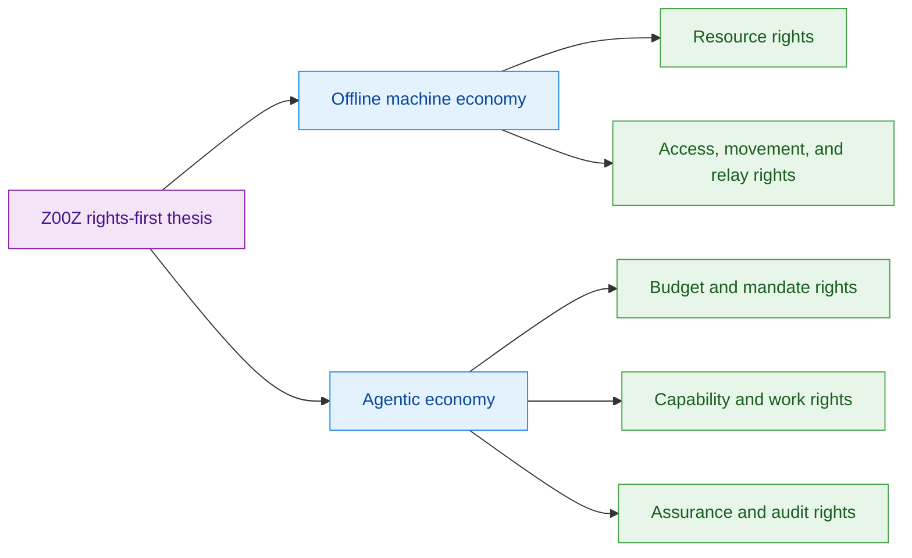
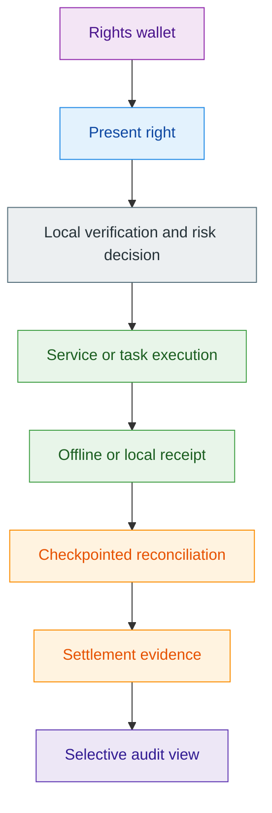
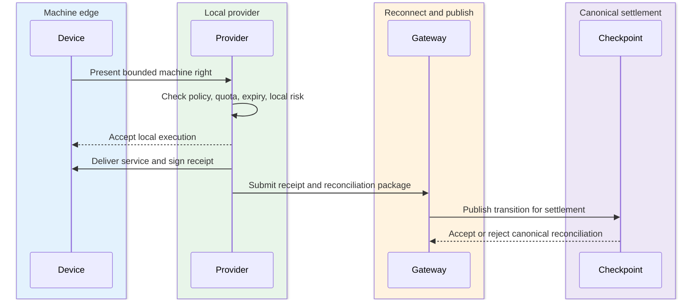
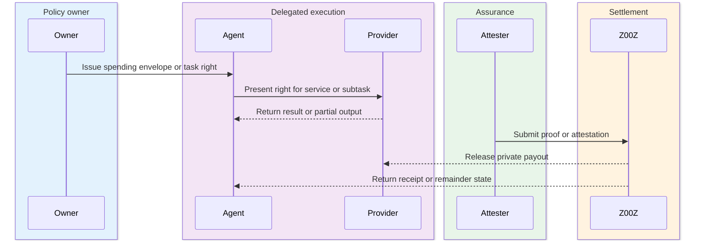
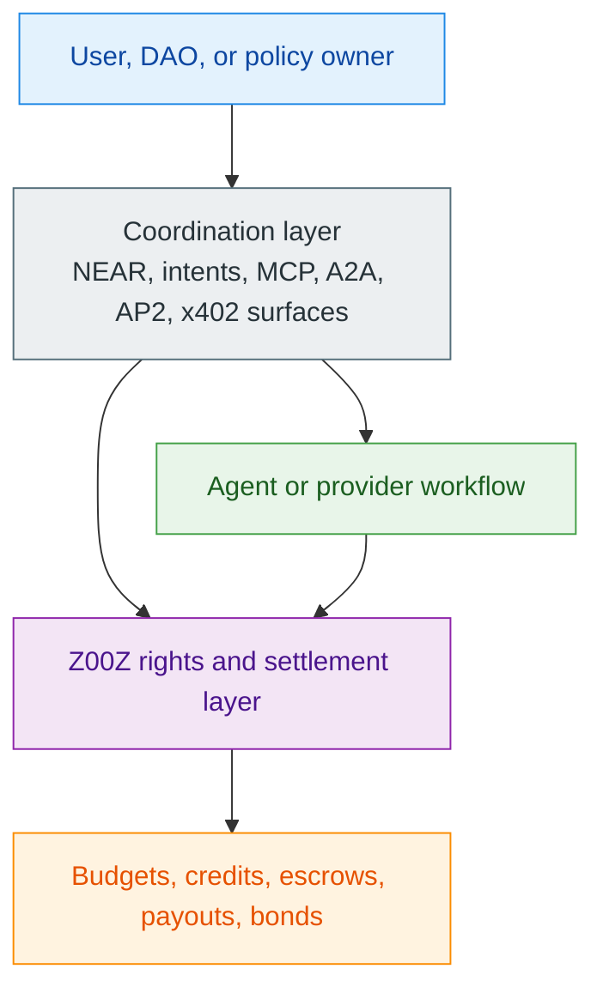
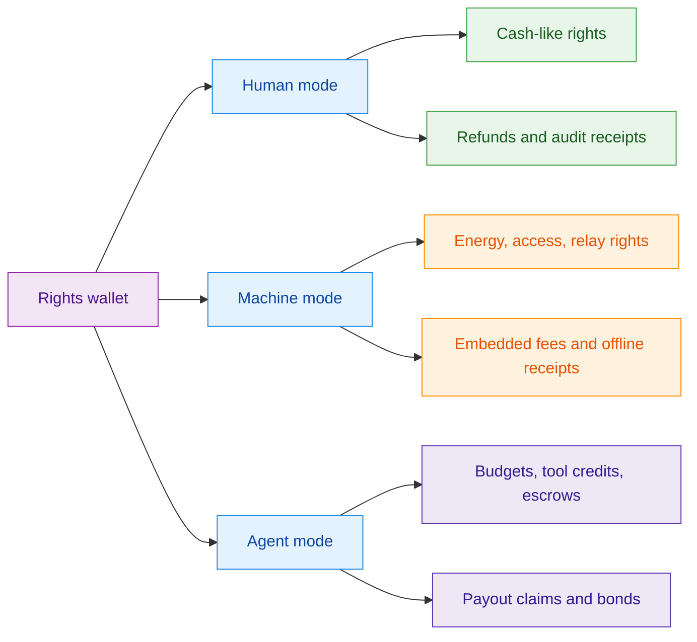
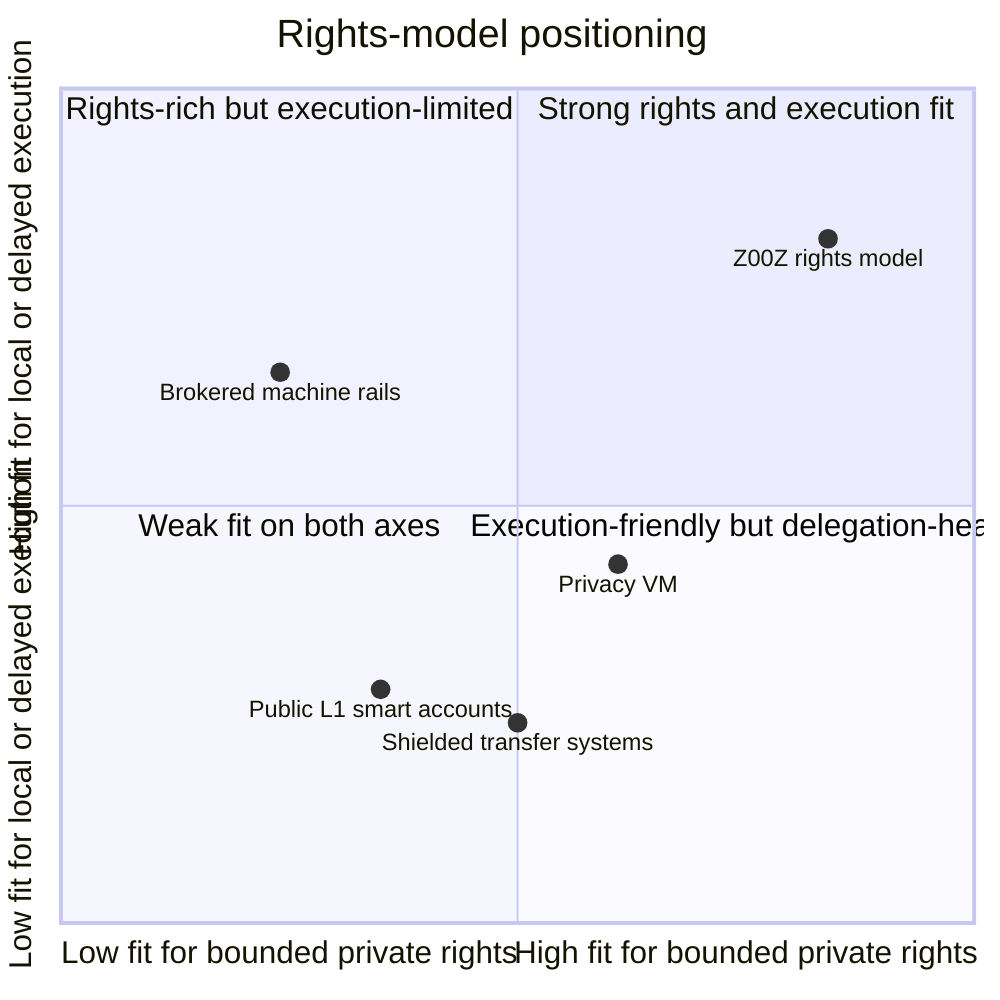

# Z00Z Agentic Offline Economy Whitepaper

[TOC]

Version: 2026-07-09

## Key Terms Used In This Paper

This paper uses a focused vocabulary because the argument depends on a small number of recurring ideas. Appendix A and [Z00Z Corpus Terminology And Abbreviations Reference](Corpus-Terminology-Reference.md) provide the broader reference layer, while the main text keeps the core nouns stable and disciplined.

- `Spendable right`: A private wallet-local object that represents bounded economic authority rather than a reusable public account permission.
- `Spendable capability object`: A broader private right object representing bounded service, machine, access, compute, data, mandate, or reward authority rather than only money.
- `MachineCapabilityObject`: A private spendable right held by an autonomous physical object to authorize bounded offline access to energy, movement, relay, compute, or emergency resources before later reconciliation.
- `Agent spending envelope`: A bounded private mandate that gives an agent a task-scoped budget, fee capacity, and action limits without giving it full wallet authority.
- `FeeEnvelope`: The processing guarantee paired with a right transition. It defines how verification, batching, publication, or relay are paid even when the right itself is not a coin.
- `Offline receipt`: A signed local proof that a machine or agent presented a right, a provider or peer accepted it, and a service or action was executed before checkpoint settlement.
- `Selective audit`: A disclosure mode that reveals only the minimum evidence needed for operator, enterprise, attester, or regulatory review without exposing the full economic graph.
- `Checkpointed reconciliation`: The later settlement stage in which locally exchanged rights and receipts are published, checked for conflict, and turned into replay-safe canonical evidence.
- `Rights wallet`: A wallet that holds not only money, but also tool rights, compute credits, access rights, task claims, reputation bonds, and settlement receipts.

**Infographic 0.1 - Document map and vocabulary overview.** This overview gives the reader a fast orientation to the document's key terms, lifecycle, and shared thesis before the section-by-section argument begins.

## 1. Why Is This Document Needed?

This paper exists to explain where the Z00Z architecture becomes most clearly necessary rather than merely interesting. The strongest claim is not that Z00Z hides some transaction fields better than a public smart-contract chain. The stronger claim is that certain workflows are naturally forced into a public, online-only, account-shaped form on ordinary systems, while Z00Z can express the same workflows as private wallet-local rights with delayed settlement and narrow public evidence.

That framing matters most when the economic actor is no longer just a human user with a browser wallet. Autonomous physical objects and autonomous software agents both need bounded economic authority, local execution, and later reconciliation. In both cases, the wrong base abstraction is a permanently visible account with open-ended permission. The better abstraction is a private right that can be carried, verified, consumed, and later settled under explicit limits.

**Infographic 1.1 - Why this document is needed.** This summary compresses the public-account versus rights-first contrast and previews the two-family structure used throughout the paper.

### 1.1 Scope Of The Paper

This paper is intentionally narrow. It focuses on two high-priority families because they are the clearest way to show what the Z00Z state model is for: offline machine economy and agentic economy. The point is not to produce a long list of industries. The point is to show that both families rely on the same architectural stack and therefore strengthen one another as a single thesis rather than as disconnected market narratives.

#### The Reader Question

The central reader question is simple: why do offline physical-object economies and agentic economies need the same underlying rights architecture, and why is that architecture a better fit for Z00Z than a public account ledger? The answer developed through this paper is that both families require private bounded authority, local execution before final settlement, and later replay-safe reconciliation. A public account model exposes too much and delegates too much. A rights-first model can reveal less while still settling correctly later.

#### What This Paper Deliberately Excludes

This paper deliberately excludes several adjacent topics. It is not a general legal-architecture paper, not a full protocol specification, and not a broad catalog of every privacy-related application. It also does not try to reargue the entire case for private money or external-asset rights, except where those ideas are needed to explain machine and agent flows. The document stays focused on the smallest number of distinct wedges that prove the non-human rights-settlement thesis.

### 1.2 Core Thesis

The core thesis of this paper is that autonomous machines and autonomous agents should not need continuous internet access or full wallet authority to verify every economic action. They should instead hold bounded private Z00Z rights that can be carried locally, checked locally, consumed locally, and later reconciled through checkpointed settlement evidence.

#### The Unifying Claim

This is the unifying claim. Z00Z is not best understood as an "AI chain" or a "robotics chain." It is better understood as a private rights and settlement layer for non-human economies. That means the fundamental object is not an always-online account and not an unrestricted delegated wallet. The fundamental object is a bounded spendable right.

For machines, the right may authorize energy, route access, local relay, compute, or emergency resources. For agents, the right may authorize tool use, budget-limited spending, task escrow, compute purchase, or payout after proof of work. In both cases, the right is meaningful before checkpoint settlement, while the chain becomes the reconciliation boundary rather than the first moment of economic meaning.

#### Why These Two Families Belong Together

Offline machine economy and agentic economy belong together because they are both consequences of the same design move: replacing public account permissions with private spendable rights. In a machine setting, that shift allows an autonomous object to keep operating through local communication, cached policy roots, and later reconciliation rather than depending on live RPC and immediate broadcast. In an agent setting, the same shift allows an owner to grant a bounded budget or capability without exposing the owner's full wallet, counterparties, or strategy.

The family resemblance runs deeper than privacy. Both machine and agent flows require explicit bounds, explicit fee handling, and explicit post-action settlement discipline. Both need the ability to act before the public chain updates canonical state. Both become weaker if every meaningful step must be published as visible contract-state in real time. The two chapters are best read as one thesis with two operating environments rather than as two unrelated market opportunities.

## 2. Selection Discipline And Diversity Test

This paper has to earn credibility through disciplined selection. If every adjacent scenario is promoted into its own pillar, the architecture disappears under labels. The final narrative therefore keeps only those use cases that depend strongly on wallet-local possession, bounded rights, delayed reconciliation, and narrow public evidence, and it merges cases that are business variations of the same underlying object model.

**Infographic 2.1 - Selection discipline and diversity test.** This image helps the reader see which scenarios are merged, which families survive, and why the final structure is intentionally compact.

### 2.1 Inclusion Filter

Every use case in this paper passes the same inclusion filter. It is architecturally native to Z00Z rather than merely compatible with Z00Z. It exposes a failure mode in public account systems that is legible to a skeptical reader. It requires some meaningful combination of local execution, privacy, bounded delegation, or delayed settlement. Finally, it remains conceptually distinct from the other included families after duplicates are merged away.

| Filter | What it asks | Why it matters |
| --- | --- | --- |
| Wallet-local possession | Does the right matter before a public state update? | Separates a rights-first model from an account-first model |
| Delayed or offline execution | Can the action happen before live settlement? | Captures the machine case and staged agent workflows |
| Bounded private authority | Can the actor receive a scoped right instead of broad wallet power? | Limits damage and disclosure at the same time |
| Distinct operational pain | Does it solve a concrete problem rather than abstract privacy preference? | Prevents the paper from inflating speculative verticals |

#### What Makes A Use Case Strong Enough

The strongest use cases in this paper satisfy four tests at once. First, they depend on wallet-local possession rather than on a public account table. Second, they benefit from delayed or offline execution rather than from only faster public settlement. Third, they need bounded private rights rather than exposed account permissions or full wallet delegation. Fourth, they map to a recognizable pain: degraded-connectivity machine operation, confidential agent budgeting, private tool spending, or similar concrete operational needs rather than abstract privacy preference.

#### What Gets Merged Instead Of Split

Several attractive labels are conceptually the same use case and stay merged. Drone charging, EV local charging, emergency fuel, emergency medicine, and microgrid energy purchase belong to one resource-right family because the core novelty is bounded access to local resources under offline or delayed reconciliation. Warehouse corridor rights, gate access, docking permissions, and mesh relay participation belong to one access, movement, and relay family because they all authorize local infrastructure interaction under explicit policy.

The same rule applies on the agent side. Tool-call credits, compute credits, API credits, and data-access credits belong to one capability-credit family. Agent payroll, task budgets, risk firewalls, and capped delegation belong to one bounded-budget family. Reputation bonds and proof-triggered payouts belong to one assurance family. This consolidation is not cosmetic. It is what keeps the paper from multiplying near-duplicates and mistaking business labels for new protocol categories.

### 2.2 Final Family Map

The final clustering is intentionally compact because the paper is not trying to map every possible future vertical. It is trying to show the clearest two families that prove the same rights-first architecture under different operating conditions.

#### Family A: Offline Machine Economy

Offline machine economy is the strongest physical-world wedge because it turns the Z00Z model into a direct operational claim. Autonomous objects can hold private spendable rights for energy, access, movement, relay, compute, or emergency resources; exchange those rights over local communication when the internet is unavailable; and reconcile the resulting transitions later. This family matters because it is not just "private payment for devices." It is bounded offline machine coordination.

#### Family B: Agentic Economy

Agentic economy is the strongest digital non-human wedge because it replaces delegated wallet authority with bounded private rights. An agent can receive a private budget, a tool-use credit, a compute or data right, a task escrow, a payout claim, or a reputation bond without receiving unrestricted control over the owner's wallet. This family matters because it aligns directly with how tool protocols, intent systems, and multi-agent workflows are evolving.

| Family | Core right types | Primary examples | Distinctive wedge |
| --- | --- | --- | --- |
| Offline machine economy | Energy, access, relay, compute, emergency rights | Charging, warehouse access, mesh relay | Local physical or infrastructure action before reconciliation |
| Agentic economy | Budgets, capabilities, escrows, payout claims, bonds | Spending envelopes, tool credits, workflow escrow | Private bounded delegation for software actors |

**Figure 2.1 - The two-family map.** The paper's core thesis splits into one physical operating environment and one software operating environment, both driven by the same rights-first logic.

### 2.3 Narrative Order

The order of the paper makes the architectural claim easier to understand rather than merely following trend value. Offline machine economy comes first because local execution under degraded connectivity makes the spend-then-reconcile model concrete. Agentic economy comes second because it broadens the same rights model into the coming software economy without changing the core state logic.

#### Why Offline Machine Economy Comes First

The machine chapter comes first because it exposes the contrast with conventional blockchains in the clearest possible way. Ordinary ledgers assume live internet, current chain state, immediate broadcast, and a public account or contract lookup at the moment of action. The machine chapter shows a different model: local communication, cached rights, signed policies, bounded offline execution, and later reconciliation. Once that model is clear, the reader can more easily understand why agents also need rights instead of direct wallet access.

#### Why Agentic Economy Comes Second

The agent chapter follows because it is the most strategically visible expansion of the same architecture. Systems such as MCP, A2A, AP2, x402, and intent-based orchestration all point toward a world in which software actors buy services, consume capabilities, and coordinate execution. Z00Z is framed not as the place where those agents think, but as the place where they hold and settle bounded economic rights privately.

## 3. Shared Z00Z Primitives For Non-Human Economies

Before splitting into machines and agents, the paper needs to define the shared primitives that make them one category. Those primitives are rights instead of accounts, fee guarantees that travel with non-coin actions, and local execution that becomes canonical only after reconciliation. Without that layer, the later chapters risk sounding like separate application pitches rather than one coherent protocol argument.

**Infographic 3.1 - Shared Z00Z primitives for non-human economies.** This visual summary sits well before the detailed lifecycle and table because it shows the common architecture shared by machines and agents at a glance.

| Primitive | Machine role | Agent role | Why a public-account model is awkward |
| --- | --- | --- | --- |
| Rights instead of accounts | Lets a device carry bounded local authority | Lets an agent receive scoped operational power | Accounts expose permission surfaces and broader wallet control |
| FeeEnvelope | Gives offline or delayed machine actions a processing guarantee | Funds tool use and task execution without liquid wallets | Account gas models often require broader delegated balances |
| Offline or local receipt | Records locally accepted physical service | Records task, tool, or workflow execution before settlement | Public ledgers tend to make every step visible too early |
| Selective audit | Gives operators and providers scoped evidence | Gives users and enterprises policy evidence | Public graphs overshare by default |

**Figure 3.1 - Shared rights lifecycle.** The same execution spine appears in both machine and agent flows: a bounded right is carried locally, used locally, receipted locally, and only then reconciled into canonical evidence.

### 3.1 Rights Instead Of Accounts

The core economic object in this paper is a bounded private right rather than a public account permission or a public balance mutation. This is the deepest architectural difference between Z00Z and ordinary smart-contract systems. In a public account model, authority is attached to a visible account or contract permission surface. In the Z00Z model, authority is attached to a wallet-local object that carries private ownership meaning and can later become settlement evidence.

#### Spendable Right Objects

The object families used throughout this paper all share the same shape even when their business meanings differ. A spendable right may represent energy, route access, data relay, local compute, tool use, API access, a bounded agent mandate, a task escrow, a reward claim, or a reputation bond. The holder carries that object privately, a counterparty can verify some bounded claim about it locally, and the object later enters canonical state only through settlement evidence.

In the broader corpus vocabulary, this family is best named **spendable capability objects**. The name is useful because it keeps the emphasis on capability rather than coin balance: a right can authorize an action, enforce a quota, carry an encrypted policy payload, reference a provider or issuer domain, expire, split, delegate, redeem, revoke, or convert into a receipt-bearing claim. Those nouns are architectural roles, not a promise that every field already exists as one finished consensus wire type. The current live core is still asset-centric; this paper explains how the same settlement discipline naturally widens toward bounded non-human authority.

This is the logic behind both `MachineCapabilityObject` and `Agent spending envelope`. The former generalizes bounded rights for autonomous physical objects: resource access, movement, relay participation, compute usage, or emergency action under offline or delayed reconciliation. The latter generalizes bounded rights for autonomous software agents: spend up to a limit, pay only allowed providers, consume a defined fee budget, or claim payout only after a task-specific proof path. These are not separate protocol species. They are two examples of the same rights-oriented state model.

#### Wallet-Local Possession And Delayed Settlement

The base Z00Z move is simple but powerful. Possession begins in the wallet. Verification can happen locally. Final settlement happens later through checkpointed reconciliation. This ordering is what makes the system feel closer to digital cash and portable claims than to a public account ledger.

That claim stays disciplined. The paper does not imply universal trustless offline finality. The stronger and more defensible claim is narrower: a holder can present a right locally, a counterparty can evaluate local policy and local risk, an action can happen before publication, and later settlement can accept valid non-conflicting transitions while rejecting or escalating conflicting ones. The architecture is therefore best described as spend-then-reconcile rather than final-offline-by-default.

### 3.2 Fee And Processing Guarantees

Non-coin rights still consume network resources. Verification, batching, data publication, and settlement all need to be paid for even when the right being consumed is not itself a coin. This is not a side note. It is one of the central reasons the machine and agent stories either work cleanly or collapse back into hidden custodial wallets.

#### FeeEnvelope As A Separate Primitive

The clean architectural answer is `FeeEnvelope`. A spendable right answers one question: what can be done. A fee envelope answers a different question: who pays, with what asset, under what ceiling, and under what priority class for processing that action. Keeping those questions separate is what allows Z00Z to support non-coin rights without giving every agent or device an unrestricted liquid wallet.

The sources behind this paper converge on the same fee patterns. A right transition may carry a native fee output, consume a prepaid fee-credit, draw from an embedded fee budget, rely on a sponsor authorization, or settle against a batch-level fee pool. That distinction matters especially for machines and agents because both categories often need bounded rights without also holding free-form balances that can be drained or repurposed.

#### Why Unpaid Later Promises Do Not Work

The protocol should not rely on unpaid later promises to aggregators, relayers, or publishers. Delayed payment is acceptable only when the payment path is already committed through a valid fee envelope, sponsor reserve, embedded fee budget, or prepaid credit. In other words, the right may be non-monetary, but the transaction that consumes it must still carry a real processing guarantee.

This matters even more for machines and agents than for ordinary wallets. An autonomous device may need to keep operating when offline without carrying a freely spendable liquid balance. An agent may need to buy compute or call tools without ever receiving full wallet authority. Fee envelopes make that possible by separating operational rights from processing guarantees.

### 3.3 Local Verification And Later Reconciliation

Machine and agent flows share the same basic execution shape. A right is preloaded. A local or near-local interaction happens. A counterparty decides whether to accept the presented right under its policy and risk model. A receipt is produced. Later, that receipt and right transition are reconciled through checkpoint settlement. This flow is the operational spine of the paper.

#### Offline Receipt Flow

The common flow is `preload -> present -> verify -> execute -> receipt -> reconcile`. For a machine, this may mean a charger, gateway, locker, or robot corridor verifying a bounded right over Wi-Fi Direct, BLE, NFC, LoRa, or local mesh before delivering a service and signing an offline receipt. For an agent, it may mean a provider, peer agent, or workflow coordinator checking a budget envelope, tool-use credit, or task escrow before executing work and producing a claimable receipt.

The important boundary is between local acceptance and canonical settlement. Local verification is a real economic event, but it is not yet the final public state transition. The provider or peer still decides what offline or delayed risk to accept. Canonical acceptance happens later when the resulting package is published and reconciled against checkpoint rules.

#### Selective Audit And Settlement Evidence

The reconciliation path does not need to turn the public chain into a universal behavior diary. What the chain needs is narrow settlement evidence: enough to show that the right transition is well formed, conflict-checked, and linked into canonical state. Everything else can remain either wallet-local or selectively disclosed above the protocol line.

That is what makes the same architecture useful for enterprises, operators, attesters, and emergency authorities. A machine operator may need proof that a relay, charge, or access event was valid without exposing every device relationship. An enterprise may need proof that an agent stayed inside a budget category without exposing every tool call and counterparty. Selective audit is therefore not an extra feature on top of the rights model. It is one of the reasons the model is commercially usable.

## 4. Offline Machine Economy

This chapter argues that Z00Z is a natural settlement model for autonomous physical objects that continue operating during degraded connectivity. The key claim is not merely that a device can pay privately. It is that an autonomous object can hold bounded private rights, exchange them over local communication, execute a physical action before live chain settlement, and later reconcile the result under explicit risk limits.

**Infographic 4.1 - Offline machine economy.** This section opener works as a high-level map of object families, local rails, flow shape, and representative machine use cases before the prose goes deeper.

### 4.1 Problem Statement

Physical-object economies break down quickly when the payment model assumes a live internet connection, current global chain state, and immediate broadcast for every economically meaningful action. That assumption is weak in exactly the environments where machine autonomy becomes valuable: warehouses, roads, charging networks, buildings, rural networks, ad hoc local infrastructure, and disaster or blackout conditions.

#### Why Online-Only Ledgers Fail For Physical Objects

Ordinary blockchain interaction asks a machine to do too much at the moment of action. It must have internet access, access to fresh chain state, a route to an RPC surface, and enough live settlement support to broadcast immediately. That model may be acceptable for a cloud-mediated device that only acts through a central controller. It is much weaker for local machine-to-machine interaction where the object itself should keep working even when the network does not.

This is why offline machine economy is a meaningful category rather than a decorative extension of private payments. If a drone cannot buy local charging when the network is down, if a warehouse robot cannot prove corridor access without a live cloud roundtrip, or if a local relay node cannot accept a bounded service right without querying a public account system, then the machine is not economically autonomous in the moment that matters.

#### Why Channels, Brokers, And Custodial Rails Are Not The Same Thing

Payment channels, centralized brokers, and prepaid custodial tabs can all approximate parts of this story, but they do not provide the same primitive. Channel systems depend on pre-opened relationships, locked liquidity, or online monitoring assumptions. Brokered systems reintroduce dependence on a central cloud or service operator at the moment of action. Prepaid custodial tabs solve convenience by moving trust into an operator rather than by making the right itself portable.

Z00Z aims at a different primitive: a locally verifiable, bounded, portable machine right that can move over local communication and be reconciled later. That is closer to cash-like machine authority than to always-online routing infrastructure.

### 4.2 Machine Right Object Families

The machine chapter stays disciplined by organizing use cases around object families rather than around industries. The purpose of the section is to show that a small number of right categories can explain a large number of machine scenarios without multiplying slight variants of the same idea.

#### Resource Rights

The first family is resource rights. These objects authorize bounded access to locally delivered resources such as energy, fuel, medicine, local compute, bandwidth, or other service units that can be consumed by a machine before public settlement. In this framing, drone charging, EV local charging, emergency fuel rights, emergency medicine rights, and microgrid energy purchases are not five distinct conceptual categories. They are examples of one underlying primitive: private rights to acquire bounded local resources.

This grouping matters because the architecture is the same across all of them. A device holds a private right, presents it to a provider over local communication, the provider checks the right against local policy and offline risk, a local service is delivered, and the resulting state change is reconciled later. Once the paper is written at that level, the examples strengthen the chapter instead of fragmenting it.

#### Access, Movement, And Relay Rights

The second family is access, movement, and relay rights. These objects authorize interaction with local infrastructure rather than direct consumption of a single physical resource. A machine may need to pass a gate, enter a warehouse corridor, dock at a station, use a locker, traverse a route segment, or participate in local data relay. The service is different, but the economic shape is the same: bounded permission to use a local infrastructure path under explicit policy.

This is why `RouteAccessRight` and `DataRelayCredit` belong in the same section even though one concerns movement and the other concerns communication. Both are infrastructure-use rights that may need to be checked locally and reconciled later. Warehouse robots, delivery drones, autonomous carts, local gateways, and facility devices all fit naturally into this family.

### 4.3 Offline Execution Flow

The machine-economy thesis only becomes credible when it is expressed as an operational flow. The core Z00Z story in this chapter is not "machines use crypto." It is "machines carry bounded rights, act locally, issue receipts, and reconcile later."

#### Preload, Verify, Execute, Reconcile

The canonical machine flow starts before the moment of action. A device receives or caches its rights, any needed policy commitments, and an available fee path. When the action is needed, it presents the right over a local communication rail. The provider checks validity, quota, expiry, allowed-provider membership, and any local spent or conflict information it maintains. If the provider accepts the risk, it performs the physical service and both sides produce a signed offline receipt or equivalent local proof.

Later, a gateway, provider, or reconnecting device submits the resulting package for reconciliation. At that point, the system moves from local acceptance into checkpointed settlement. The chain does not create the economic meaning of the action from scratch. It decides whether the locally accepted action can become canonical without conflict.

**Figure 4.1 - Offline machine execution flow.** A machine action becomes economically meaningful in the local interaction first and only later becomes canonical through reconciliation.

#### Communication Rails And Local Trust Modes

The communication layer matters because it shapes local trust and operational constraints. NFC and BLE suit short-range direct exchange. Wi-Fi Direct and local LAN exchange can support richer proofs and receipts between nearby devices. LoRa and mesh networks fit sparse or degraded environments where bandwidth is low but resilient local coordination matters. The chapter remains focused on trust and settlement rather than radio engineering, but it stays explicit that the local rail changes what can be verified immediately and what must wait for later reconciliation.

Offline execution remains bounded by policy, not romanticized as costless trustlessness. Local spent caches, short expiry windows, embedded fee credits, provider acceptance policies, and later slashing or rejection are part of the operational story. They are what turn offline machine rights from a slogan into a realistic system design.

### 4.4 Representative Use Cases

The machine chapter ranks scenarios by explanatory power rather than by novelty theater. The strongest scenarios are those that make the architecture understandable in one step: a bounded machine right is presented locally, a real physical or infrastructure service is delivered, and later reconciliation turns the local event into settlement evidence.

| Scenario | Right family | Typical local rail | What it proves |
| --- | --- | --- | --- |
| Drone or EV charging | Resource rights | NFC, BLE, Wi-Fi Direct | Local energy purchase can happen before reconciliation |
| Warehouse robot access | Access and movement rights | BLE, NFC, local LAN | Infrastructure permission can be private and bounded |
| Mesh data relay | Relay rights | Mesh, LoRa, local LAN | Micro-service infrastructure does not need a public packet-level graph |
| Local energy market | Resource rights | Local LAN, Wi-Fi Direct | Bounded resource trading can stay local first |
| Emergency fuel or medicine | Resource rights | Short-range local rails plus policy controls | High-stakes rights can still be bounded and later reconciled |

#### Primary Scenarios

The primary machine scenarios are drone and EV charging, warehouse robot access, and mesh data relay. Drone and EV charging are the clearest resource-right example: a machine presents an energy right over local communication, the provider checks local policy and quota, a charging session happens, and the resulting receipt is later reconciled. Warehouse robot access is the clearest access-right example: the relevant object is not abstract payment, but bounded movement authority inside a facility. Mesh data relay is the clearest infrastructure-right example: a node presents a relay right or earns a relay receipt without requiring every local interaction to become a live public-chain event.

These three scenarios are enough to prove the category because together they cover resource acquisition, movement or access, and local service infrastructure without multiplying variants of the same underlying primitive. They also map directly onto the source concepts of energy credits, route access rights, data relay credits, local communication rails, offline receipts, and later checkpointed reconciliation.

#### Secondary Scenarios

Local energy markets, autonomous logistics, and emergency medicine or fuel rights belong in the chapter as secondary extensions. They widen the range of the model without changing the architecture. A local energy market is still a resource-right system. Autonomous logistics is still an access, movement, and reconciliation system. Emergency fuel or medicine distribution is still a bounded resource-right system with tighter local trust rules and higher stakes.

These secondary cases widen the range of the model after the mechanism is already established. They do not become separate flagship families, because doing so would mistake sector labels for new protocol structures.

### 4.5 Investor And Market Thesis

The machine chapter matters strategically because it pushes Z00Z into categories where public blockchains and conventional payment rails both become structurally awkward. The pitch is not "private payments for IoT." The stronger pitch is that Z00Z can become a private rights and reconciliation layer for degraded-connectivity robotics, local infrastructure, DePIN-style resource systems, and emergency or resilience networks.

#### Why This Chapter Is High-Priority

Offline machine economy is a bridge from Z00Z into robotics, DePIN, local energy, municipal or enterprise infrastructure, and emergency response systems. This is high-priority because it gives Z00Z a differentiated thesis that is neither just "better private payments" nor "another smart-contract platform." It says that the protocol has a natural place in the economic layer of autonomous physical systems that cannot depend on live internet settlement for every step.

That matters for investors and partners because the chapter connects Z00Z to markets that are both strategically large and technically distinctive. If the protocol can credibly own the private-rights layer for charging, relay, access, and bounded machine cooperation, then it becomes relevant to the next generation of machine coordination rather than remaining confined to an abstract privacy niche.

#### What The Full Draft Must Still Prove

The chapter still carries a real burden of proof. A credible deployment story requires acceptable offline risk limits, conflict and replay handling, provider acceptance policies, fee sponsorship or embedded fee design, and a precise boundary between local trust decisions and canonical settlement guarantees. With those questions handled honestly, the machine chapter reads as forward-looking but credible rather than overclaimed.

## 5. Agentic Economy

This chapter argues that Z00Z is the private budget, rights, and settlement layer for software agents and multi-agent systems. The important claim is not that agents can hold tokens. Public chains already allow that. The stronger claim is that agents need bounded economic authority, private capability rights, task-specific escrows, and selective audit without receiving full wallet control or exposing their entire operational graph.

**Infographic 5.1 - Agentic economy.** This summary is useful near the top of the chapter because it compresses bounded delegation, right families, commerce patterns, and integration surfaces into one reader-friendly map.

### 5.1 Problem Statement

Ordinary agent wallets are the wrong abstraction because they solve agency by delegation of account power. They give the agent a wallet, a session key, or a contract permission and then try to constrain misuse at the account layer. That approach can work functionally, but it usually leaves the underlying problem intact: too much authority is delegated, and too much behavior remains publicly visible.

#### Why Agents Need Rights Instead Of Wallet Authority

The better model for agentic systems is a rights model. Instead of handing an agent full wallet authority, the owner gives it a bounded private object. That object may say: spend up to this amount, buy only compute or API access, act only inside this task, post only this bounty, or consume only this fee budget before expiring. This is the logic of the agent spending envelope and the broader capability-right families built around it.

This difference is more than UX. It changes the failure surface. If an agent is compromised, poorly aligned, or simply wrong, a bounded right limits damage by construction. The agent was never given a general-purpose wallet in the first place. It was given a private task-scoped operational right.

#### Why Public Economic Graphs Break Agent Privacy

Agentic systems do not only need safe delegation. They also need privacy of economic behavior. Public payment trails reveal owner strategy, service relationships, tooling patterns, research direction, timing of activity, and operational topology. A public chain may show not only that an agent paid, but which providers it used, how often it switched, when it escalated work, and where its budget pressure changed.

For human users, some of that leakage is already undesirable. For software agents, it is often fatal to the product value. A research agent, trading agent, legal agent, security agent, or workflow agent can leak most of its strategy through its payment graph alone. Agent privacy is therefore a core functional requirement rather than an optional cosmetic benefit.

### 5.2 Agent Right Object Families

The agent chapter clusters the strongest objects into a few stable families instead of turning every workflow into a new primitive. The objective is to show that the coming agentic economy can be described as a rights wallet with bounded budgets, capability credits, work escrows, and assurance objects rather than as a collection of unrelated one-off contracts.

| Family | Typical objects | What it limits or proves | Example flows |
| --- | --- | --- | --- |
| Budget and mandate rights | Spending envelopes, task budgets, fee budgets, bounded mandates | Amount, provider scope, time window, task scope | Agent spending, payroll, risk firewall |
| Capability and work rights | Tool credits, compute credits, API rights, data-access rights, task escrows | Service scope and payout conditions | MCP, x402, AP2, A2A, private tool use |
| Assurance and audit rights | Reputation bonds, proof-of-agent-work claims, audit packages | Trust, attestation path, disclosure scope | Attested payout, enterprise review, multi-agent workflows |

#### Budget And Mandate Rights

The first family is budget and mandate rights. This includes agent spending envelopes, bounded mandates, task-specific budget objects, operational fee budgets, and emergency revoke or expiry semantics. Agent payroll, risk firewalls, capped delegation, and one-time authority grants all belong here because they are variations of one idea: bounded operational authority without full wallet delegation.

This is the cleanest way to explain why Z00Z matters for agentic systems. On ordinary chains, a comparable design usually lives as public contract policy or account permission. In the Z00Z model, the bound lives in the private right itself. The network later sees valid settlement evidence, but it does not need to see the full delegated-control surface as a public account graph.

#### Capability And Work Rights

The second family is capability and work rights. This includes tool credits, compute credits, API credits, data-access rights, task escrows, reward claims, and capability tokens more broadly. These objects let an agent consume a bounded service, fund a narrowly scoped task, or claim payout only after a defined proof or attestation path. In this paper they form one coherent family of pay-per-use and proof-triggered rights rather than a set of separate flagship categories.

This family is where the broader integration story becomes visible. MCP tool calls, x402-style service payments, AP2 mandates, A2A collaboration, private data access, and proof-triggered useful-work payouts all map naturally onto the same wallet model. The point is not that every integration already exists in finished form. The point is that they all want the same underlying primitive: a private spendable right that can fund action without exposing an entire account-based behavioral history.

### 5.3 Agentic Commerce Patterns

The object model becomes economically real only when it supports concrete market behavior. For agents, that means private service purchase, private workflow settlement, and private funding of action without broad wallet delegation. These patterns are where the rights-wallet thesis moves from architecture into product surface.

#### Agent-To-Agent Service Purchase

One of the strongest patterns is agent-to-agent service purchase. An agent needs a service such as code review, legal research, dataset verification, GPU rental, translation, or tool invocation. Another agent or provider can perform it. The missing primitive in ordinary public systems is not merely payment. It is private task funding without public exposure of who hired whom, how often, for what category of work, and with what budget pattern.

Z00Z is well positioned here because the funding object can be a private escrow, bounded payment right, or task-specific claim rather than a visible wallet transfer. The market can still be real, but the public chain does not need to become a directory of commercial relationships between agents. That is what makes private micro-task markets and bounded service purchase a strong chapter component rather than just another "agents can pay" example.

#### Multi-Agent Workflow Settlement

The second pattern is multi-agent workflow settlement. Real agentic work is often staged: planner, researcher, coder, tester, auditor, publisher, or solver roles contribute partial outputs and do not all deserve payment at the same time or on the same terms. A useful economic layer must therefore support staged release, proof-triggered payout, dispute or attester roles, and task-scoped escrow.

This is another area where Z00Z is best described as a settlement layer rather than as an execution VM. The agents do not need to run inside Z00Z. They need Z00Z to hold the bounded rights that release value as each subtask is completed or attested. That framing keeps the chapter aligned with the source materials on private escrows, proof-triggered payouts, and agent-to-agent commerce while avoiding the weaker story that Z00Z is simply a generic marketplace token rail.

**Figure 5.1 - Agent workflow settlement.** The owner does not hand out a full wallet; the agent spends a bounded right, the provider does work, and payout is released only after the defined attestation path is satisfied.

### 5.4 Trust, Audit, And Assurance

Private payment is necessary for agentic systems, but it is not sufficient. Commercially useful multi-agent systems also need trust, quality control, auditability, and bounded dispute handling. The assurance layer in this paper is therefore treated as a first-class family rather than as an appendix to payments.

#### Reputation Bonds And Proof Of Agent Work

Anonymous reputation bonds and proof-of-agent-work belong together because both solve the same trust problem from different sides. A reputation bond lets an agent prove that it has stake and can be penalized for failure or fraud without exposing its full owner and client graph. Proof-of-agent-work lets a payout be released only when an artifact, attestation, benchmark result, or other defined evidence path has been satisfied. One object creates accountable risk. The other creates accountable reward.

This combined assurance family matters because multi-agent systems are exposed to sybils, fake agents, low-quality output, collusion, and agents that accept work but disappear. Ordinary public-chain bonds often make trust publicly legible at the cost of strategy and privacy leakage. The Z00Z framing is different: trust should be slashable and auditable, but not necessarily doxxed. The chapter therefore groups private reputation bonds, attester-mediated payout, and proof-triggered reward release into one assurance architecture.

#### Selective Audit Without Full Trace Exposure

Agentic systems also need audit without total exposure. A user, enterprise, or platform may need to prove that an agent stayed within a budget category, paid only approved providers, completed a task under a valid attestation path, or used sponsored fees correctly. None of those requirements imply that the full tool-call graph, full payment graph, or full reasoning trace should become public.

Selective audit is explicit in the chapter rather than left as a generic privacy afterthought. The agent economy becomes much easier to adopt once the paper makes clear that there can be a settlement view, an operator or auditor evidence view, and a wallet-local secrecy view without collapsing those into a single universal transparency model.

### 5.5 Integration Surface

The agent chapter shows clearly where Z00Z sits in a broader stack. It does not claim that Z00Z is the place where every agent executes. It shows that Z00Z is the place where bounded economic rights are held, settled, and selectively revealed, while other systems can handle identity, scheduling, service discovery, and public coordination.

#### NEAR, Intents, And Public Coordination

The cleanest comparison in the current materials is the NEAR-style split. Systems such as NEAR can act as coordination, identity, intent-expression, scheduling, and solver-market layers. In this architecture, Z00Z acts as the private cash, rights, and settlement layer. That means a public coordination layer can express the desired outcome, while Z00Z holds the bounded budget, private payout, task escrow, fee right, or reputation object needed to settle the action privately.

This division of labor is important because it keeps the Z00Z thesis sharp. The paper does not drift into the weaker claim that Z00Z is just another agent execution environment. The stronger and more defensible claim is that other systems can coordinate agent behavior, while Z00Z makes the economic rights private, bounded, and replay-safe.

#### MCP, A2A, AP2, And x402

MCP, A2A, AP2, and x402 all point toward the same economic primitive from different directions. MCP turns tool access into a standard service surface. A2A turns inter-agent collaboration into a first-class interaction model. AP2-like mandates turn delegated action into a bounded authority surface. x402 turns network services into pay-per-use payment surfaces. What they all still need is a private settlement object that can fund action without exposing the owner's full wallet and without turning every service purchase into public behavioral history.

That is why the paper treats these technologies as integration surfaces for the same bounded-rights wallet model rather than as separate chapters. Z00Z does not need to absorb them. It needs to give them a private economic substrate: tool credits, capability rights, fee envelopes, task escrows, payout claims, and selective audit paths.

**Figure 5.2 - Coordination versus settlement split.** Public coordination and private economic settlement are separate layers, not one merged execution surface.

## 6. Unified Rights Wallet Architecture

Machines and agents should not force Z00Z into two separate architectural languages. The deeper abstraction behind both chapters is the rights wallet: a wallet whose primary job is not only to hold coin balances, but to hold bounded private rights, the fee paths that let those rights be processed, and the receipts and audit views that make later reconciliation usable. This chapter explains that shared wallet model and keeps it distinct from both a classic token wallet and a public smart-account permission system.

### 6.1 Rights Wallet For Humans, Agents, And Machines

The rights wallet is the most useful way to unify the machine and agent stories without flattening their differences. It can hold money-like objects, access rights, task rights, settlement claims, fee credits, and disclosure artifacts in one architecture. That makes it broader than a classic token wallet, but also narrower and safer than giving every actor a general-purpose delegated account.

| Wallet mode | Main holdings | Operating environment | Failure it helps avoid |
| --- | --- | --- | --- |
| Human rights wallet | Cash-like rights, refunds, selective audit receipts | User-driven payments and claims | Full public payment graph |
| Machine rights wallet | Energy, access, relay rights, embedded fees, offline receipts | Degraded connectivity and local machine exchange | Live-RPC dependency and cloud-only control |
| Agent rights wallet | Budgets, tool credits, task escrows, payout claims, bonds | Delegated software execution | Full wallet delegation and public strategy leakage |

**Figure 6.1 - Rights wallet architecture.** One wallet abstraction can support human, machine, and agent modes without reducing them to the same operational surface.

#### Why One Wallet Model Can Hold More Than Coins

The most important shift is conceptual. A classic wallet is usually described as the place where a user holds coins, tokens, and perhaps NFTs. A rights wallet is the place where a holder carries private spendable authority in several forms: cash-like objects, compute credits, API credits, task escrows, route access rights, relay rights, payout claims, reputation bonds, refund rights, and scoped receipts. The wallet is therefore not merely a balance viewer. It is the local container for bounded economic meaning before that meaning becomes public settlement evidence.

This broader wallet model matters because the new machine and agent economy is not built only from "payments." It is built from intents, mandates, tool calls, data-access rights, workflow claims, and proof-triggered rewards. A rights wallet is the abstraction that can hold those objects without forcing them to become public account permissions or visible contract state first. That is why the term belongs near the center of the whitepaper rather than at its edge.

#### How Agent Wallets And Machine Wallets Diverge Operationally

The shared wallet model does not erase the operational difference between machines and agents. A machine wallet is optimized for local exchange under degraded connectivity. It cares about cached policy roots, short-range communication, hardware-linked constraints, embedded fee capacity, offline receipt generation, and local risk limits. Its rights often authorize physical service or infrastructure interaction and therefore have to survive periods without live cloud or chain access.

An agent wallet is optimized for bounded delegation and rapid service settlement. It cares about task-scoped authority, fee budgets, provider constraints, tool-call funding, task escrows, payout claims, and selective audit views. Its rights are often consumed faster and more often than machine rights, but the underlying structure is the same: a private object defines what the actor may do, under what limit, with what fee path, and with what later settlement consequences. The object model stays unified even though the operating conditions differ.

### 6.2 Settlement Objects And Receipts

The rights wallet only becomes practical once the paper is explicit about the kinds of objects it is expected to hold and emit. This section defines the recurring whitepaper-level object catalog. These are not all claims about finalized live protocol wire types. They are the recurring settlement abstractions that make the machine and agent chapters legible and reusable.

#### Private Right Objects

The first object family is the private right itself. On the machine side, the recurring catalog includes `MachineCapabilityObject`, `EnergyCredit`, `RouteAccessRight`, `DataRelayCredit`, and `LocalComputeCredit`, with `EmergencyResourceRight` as the high-stakes extension. On the agent side, the recurring catalog includes spending envelopes, bounded mandates, tool credits, compute credits, data-access rights, task escrows, payout claims, capability tokens, and reputation bonds. Some of these rights are transferable, some are split-capable, some are non-transferable but consumable, and some exist mainly to unlock a later claim path rather than immediate payment.

What unifies them is not fungibility or identical lifecycle rules. What unifies them is that they are all privately held bounded objects that can be checked against policy and later reconciled through settlement evidence. The paper keeps that level of abstraction visible so that the reader does not mistake each business use case for a new protocol species.

#### Offline Receipts, Claim Receipts, And Audit Packages

The second object family is the receipt and evidence family. A local or offline receipt records that a right was presented, accepted under local policy, and used to trigger a service or action before checkpoint settlement. A provider receipt records the provider-side claim that a service was delivered and may later need reimbursement, recognition, or proof of completed work. A settlement receipt records that the relevant transition was actually reconciled into canonical state. A selective audit package records only the bounded slice of evidence needed by an operator, enterprise, attester, or regulator.

Separating these receipts matters because the same event should not automatically imply one universal visibility layer. A machine charger, a relay node, an enterprise auditor, and a user wallet do not need to see the same thing. The machine and agent chapters both rely on this multi-view structure: wallet-local secrecy for the holder, scoped evidence for the relevant counterparty or reviewer, and narrow settlement evidence for the chain.

### 6.3 Fee Envelope Design

The rights wallet must also answer a practical question that ordinary token stories often hide: how does the network get paid when the object being consumed is not itself a coin. The answer in this paper is the fee envelope design. It keeps operators, relayers, publishers, and verification infrastructure economically grounded without forcing every machine or agent to hold an unrestricted balance.

| Fee mode | Best fit | Main strength | Main tradeoff |
| --- | --- | --- | --- |
| Inline native fee | Connected users and operators | Simple and canonical | Requires a liquid balance |
| Prepaid fee credit | Agents and autonomous devices | Preloadable and non-withdrawable | Needs credit issuance and reserve logic |
| Embedded fee budget | Reusable or offline rights | Fee path travels with the right | Adds object complexity |
| Sponsor-backed fee | Platforms, issuers, providers | Frictionless holder UX | Requires sponsor guarantees and policy limits |
| Batch fee pool | High-volume micro-right usage | Amortizes publication cost | Depends on operator economics and batching policy |

#### Prepaid Credits, Embedded Fees, And Sponsor Models

The fee model stays plural rather than pretending that one mechanism fits every environment. Inline native fees are the simplest and cleanest path when a holder can safely keep a small liquid balance. Prepaid fee credits are often the best fit for agents and autonomous devices because they let an operator preload processing capacity without handing out freely spendable coin. Embedded fee budgets are especially powerful when a right is expected to be used repeatedly or offline, because the processing budget travels with the object itself. Sponsor-backed fees fit cases where a provider, platform, issuer, or relayer wants frictionless UX and is willing to underwrite processing. Batch fee models fit high-volume micro-right consumption such as local relay, API micro-usage, or clustered reconciliation flows.

The whitepaper is explicit about preferred patterns rather than listing them as neutral options only. For agents, prepaid fee credits and bounded operational fee budgets are usually the cleanest answer because the agent should not hold unrestricted liquid coin. For offline machines, embedded fee budgets and provider-sponsored or batch-sponsored reconciliation are usually stronger because the device may act before reconnecting. The base protocol can still preserve a native fee asset and canonical fee output logic while allowing these bounded higher-level fee patterns above it.

#### Why This Matters More For Agents And Machines

The fee problem matters more for agents and machines than for ordinary human wallets because the naive fallback is especially damaging in these environments. If the only clean way to use a right is to also give the holder a freely spendable coin balance, then the system slides back toward the very model this paper is trying to escape. A machine becomes dependent on live top-ups or hidden custodial support. An agent becomes more dangerous because it now holds broad liquid value rather than a bounded operational object.

That is why fee envelopes are a central part of the rights thesis rather than a technical footnote. They preserve the separation between "what the actor may do" and "how the system gets paid to process it." Without that separation, the rights-wallet model collapses into a disguised account wallet. With it, Z00Z can remain a true private rights layer for non-human economies.

## 7. Competitive Boundary And Positioning

This chapter sets the competitive boundary honestly. Z00Z does not need a myth that nothing comparable can exist elsewhere. The stronger and more defensible claim is narrower: other systems can reproduce parts of the story, but they usually do so by combining public account logic, trusted service layers, privacy pools, private execution environments, or application-specific middleware. Z00Z is strongest where those pieces need to become one coherent rights-and-settlement model.

**Infographic 7.1 - Competitive boundary and positioning.** This visual summary helps a reader compare adjacent systems quickly before reading the finer distinctions in the prose and the positioning matrix.

| System type | What it already does well | What still leaks or breaks | Where Z00Z differs |
| --- | --- | --- | --- |
| Public L1 plus smart accounts | Wallets, intents, paymasters, session keys, token payments | Public permissions, account graphs, broader delegated power | Private bounded rights instead of visible delegated accounts |
| Privacy VM | Private app logic and private execution | Execution-first framing, not rights-object-first | Portable rights plus delayed reconciliation |
| Shielded pool or confidential transfer system | Hides transfer data and balances | Weaker fit for capabilities, mandates, and offline rights | Capability-style settlement objects and fee-backed non-coin actions |
| Brokered or cloud-managed machine rails | Pragmatic local machine operations | Trusted operator at the moment of action | Locally checkable portable rights that reconcile later |

### 7.1 What Public L1s And Smart Accounts Can Already Do

Public L1s, smart accounts, and session-key systems already solve several useful problems. They can let agents hold wallets, execute intents, call contracts, pay for services, and receive payouts. Machines can already interact through brokers, channels, or custodial tabs. The paper becomes more credible when it acknowledges these commodity capabilities directly instead of pretending they do not exist.

#### What Is Already Commodity

It is already commodity for an agent to hold a wallet, use a session key, sign a task, pay for an API, or receive a token payout on a conventional chain. It is already possible to build smart-account permissions, paymasters, and gas abstraction around that flow. It is also already possible for machines to act through centralized brokers, channel systems, prepaid operator accounts, or cloud-managed infrastructure. Those facts are real and the whitepaper says so.

This honesty helps the actual Z00Z distinction. The paper is not claiming that agents cannot pay elsewhere or that devices cannot transact unless Z00Z exists. It is claiming that the ordinary way they do so elsewhere remains rooted in public accounts, visible permissions, or trusted intermediaries.

#### What Still Leaks Or Breaks

What still breaks in those systems is the combination, not the individual feature list. Public L1 and smart-account designs still tend to expose account graphs, permission surfaces, counterparties, timing patterns, and service relationships. Session keys and smart-account rules can limit actions, but those limits usually live in public contract or account logic. That means the very existence of the delegated authority often remains publicly legible even when the action is constrained.

The same problem appears on the machine side. Brokered systems and prepaid tabs can preserve usability, but they do so by inserting a trusted operator at the moment of action. Channel-style systems reduce on-chain frequency, but they still assume pre-opened structures, online monitoring, locked liquidity, or limited transfer semantics. The result is that public chains and smart accounts can approximate pieces of the Z00Z story, but they do not naturally produce private bounded rights that can be locally used and later reconciled without broader wallet delegation.

### 7.2 What Privacy VMs And Shielded Systems Can Already Do

The overlap with privacy VMs, shielded systems, and confidential execution environments is real, and the whitepaper says so clearly. Systems in these categories are strong where the goal is to hide transfer data, shield app state, or run private contract logic. They are not fake competitors. They are the most serious adjacent alternatives.

#### Where The Overlap Is Real

Privacy-first smart-contract systems, multi-asset shielded pools, and confidential execution environments overlap with Z00Z in important ways. They can hide data, shield balances, protect transaction contents, or support private application logic. In some areas, such as private DeFi or private smart-contract state, they may even be the stronger starting point. The paper does not blur that reality away.

This overlap matters because many readers will correctly ask whether a privacy VM, shielded pool, or confidential transfer system could cover part of the same territory. The honest answer is yes, in part. The key question is not whether there is overlap. The key question is what kind of primitive sits at the center.

#### Where Z00Z Remains Different

Z00Z is strongest when it is framed not as another private VM, but as a rights-and-settlement substrate built around portable bounded objects, delayed reconciliation, and narrow public evidence. A privacy VM is execution-first. A shielded pool is transfer-first. A confidential execution environment is compute-first. Z00Z, by contrast, is rights-object first. It is built around the idea that a bounded private object can carry economic meaning locally and only later become settlement evidence.

That difference is what keeps the machine and agent chapters coherent. The whitepaper does not need to claim that privacy VMs cannot express private budgets, or that shielded systems cannot hide transfers. It only needs to show that Z00Z is unusually well matched to private spendable rights, offline or delayed settlement, external custody separation, fee-envelope-carrying non-coin actions, and capability-style delegation without full account exposure.

### 7.3 The Defensible Wedge

The defensible wedge is therefore not "privacy in general" and not "agent payments in general." It is the combination of private bounded rights, local or delayed execution, fee-backed processing guarantees, and later replay-safe reconciliation. That combination is where Z00Z can say something sharper than a generic private chain or generic smart-account system can say.

#### Offline Physical Rights

Z00Z is unusually well positioned where physical objects need locally checkable rights without live internet settlement for every step. That includes energy access, charging, movement permissions, relay participation, local compute consumption, and emergency resource access. The relevant differentiator is not just confidentiality. It is the ability to let a bounded machine right matter before publication and still preserve a later settlement discipline.

#### Bounded Private Agent Rights

Z00Z is also unusually well positioned where agents need bounded private budgets, tool credits, task rights, fee capacity, and confidential payouts without full wallet delegation or public economic traces. That is the strongest way to position the system for the agentic economy. Other networks can let agents act. Z00Z can let them hold, spend, prove, escrow, and receive bounded economic rights privately.

**Figure 7.1 - Qualitative positioning map.** This view compresses the competitive section into two dimensions: fit for private bounded rights and fit for local or delayed execution. The placements are qualitative rather than metric claims.

## 8. Go-To-Market And Sequencing

The architecture becomes easier to believe when the paper is disciplined about sequencing. The purpose of this chapter is not to turn the whitepaper into a business plan. It is to show which entry points communicate the thesis most clearly, which claims are strong enough to make now, and what evidence would make the story more credible to investors, partners, and builders.

**Infographic 8.1 - Go-to-market and sequencing.** This section opener is especially helpful for investors and strategic readers because it compresses beachheads, dependency order, and evidence priorities into one page.

### 8.1 First Beachheads

The first beachheads are chosen for clarity, not for maximal breadth. Each one demonstrates a distinct rights pattern with minimal explanation overhead. If the first examples are too abstract, the paper will feel speculative. If they are too numerous, the thesis will dissolve into a list.

| Entry point | Category | Why it belongs first | What it demonstrates |
| --- | --- | --- | --- |
| Offline charging | Machine | Instantly legible operational pain | Local resource right plus later reconciliation |
| Warehouse robotics | Machine | Easy to explain bounded access | Movement authority without live cloud dependence |
| Mesh relay | Machine | Shows infrastructure cooperation, not just payment | Relay right and receipt logic |
| Agent spending envelopes | Agent | Clearest answer to delegated-wallet risk | Bounded private budget instead of full wallet access |
| Tool and compute credits | Agent | Maps directly to current agent tooling | Capability rights for paid service consumption |
| Agent-to-agent escrow | Agent | Turns the model into visible workflow settlement | Proof-triggered private payout and collaboration |

#### Machine-Economy Entry Points

The strongest machine-economy entry points are offline charging, warehouse robotics, and mesh relay or local infrastructure settlement. Offline charging is strong because the benefit is instantly understandable: the device should keep operating even when the network is unavailable. Warehouse robotics is strong because bounded access rights are easier to explain than abstract autonomous payments. Mesh relay is strong because it shows that Z00Z is not only about physical resource consumption, but also about local infrastructure cooperation.

These entry points are also strategically useful because they are concrete enough to demo. A reader can imagine the right, the local interaction, the receipt, and the later reconciliation without already believing the full protocol thesis. That makes them much better opening wedges than a broad futuristic promise about "machine economies" in the abstract.

#### Agentic-Economy Entry Points

The strongest agentic entry points are agent spending envelopes, private tool and compute credits, and agent-to-agent escrow with proof-triggered payout. Spending envelopes are the cleanest answer to the most obvious market problem: how to let an agent spend without handing it the owner's wallet. Tool and compute credits are strong because they connect directly to MCP-, API-, and GPU-like service surfaces that agents already need. Agent-to-agent escrow with proof-triggered payout is strong because it turns the rights model into a visible workflow rather than a generic privacy claim.

Together these entry points show that the agent chapter is not about an abstract "AI future." It is about concrete operational primitives for the next wave of agent tooling: bounded spend, bounded service consumption, bounded collaboration, and bounded reward release.

### 8.2 Dependency Stack

The paper also separates what is already coherent enough to state strongly from what still needs careful future-tense language. This distinction protects the document from sounding either timid or overclaimed.

#### What Can Be Written As A Strong Near-Term Thesis

Several claims are already strong enough to state with confidence. Z00Z can be described as a rights-first settlement model rather than an account-first one. It can be described as especially well matched to bounded private rights, delayed reconciliation, fee-envelope-backed non-coin actions, and selective audit. It can also be described as a promising private economic layer for offline machine coordination and bounded agent workflows. These claims are internally coherent across the current source materials and do not require the paper to invent a new consensus story.

The document can also state with confidence that agent spending envelopes, capability credits, task escrows, and machine capability objects are the right whitepaper abstractions for the use-case family even where the exact live protocol surface is still narrower. That is an architectural claim about the direction and fit of the model, not a false claim that every named object already exists as a finalized production primitive.

#### What Needs Softer Or Future-Tense Wording

Other areas still need careful wording. The generalized right-object catalog is presented as an architectural direction rather than as a fully frozen consensus taxonomy. Richer offline trust theorems, local conflict handling, and some emergency-resource semantics remain explicitly bounded by provider policy and offline risk limits. Reputation-bond semantics and some proof-of-agent-work flows are positioned as strong extensions rather than already standardized infrastructure. Cross-stack integrations with MCP, AP2, A2A, x402, and broader intent systems are described as especially natural fits, not as already-completed platform integrations.

This distinction is important for tone. The paper is ambitious, but it remains careful about the boundary between a rights-native architecture and a finished ecosystem surface.

### 8.3 Evidence Package For Investors And Partners

The whitepaper becomes more persuasive when it is paired with an evidence package. That does not mean the paper must turn into a metrics deck. It means the narrative should point clearly toward the demonstrations, measurements, and integration signals that would make the thesis easier to trust.

#### Demonstration Flows

The most valuable demonstrations are the ones that mirror the core wedges already established in the text. A machine-side evidence package includes offline drone or EV charging, warehouse access settlement, and mesh or local-infrastructure relay settlement. An agent-side evidence package includes a bounded spending-envelope flow, an agent tool or compute purchase funded by capability rights, and a proof-triggered multi-agent payout or escrow release. These are the flows that make the rights model concrete to a new reader.

They are also the right demos because they show more than privacy. They show bounded authority, local or staged execution, and later settlement discipline in one motion. That is much more persuasive than a generic "private transfer demo."

#### Metrics And Adoption Signals

The eventual evidence categories should also be clear. The paper can later be supported by lower disclosure surface compared with public smart-contract workflows, reduced need for full wallet delegation, operator acceptability under bounded offline risk, and integration value for agent or machine platforms that already need tool credits, capability objects, or delayed settlement. Cost and complexity comparisons may also matter, especially where the alternative design would otherwise require a patchwork of public contracts, trusted middleware, privacy pools, and custom coordination logic.

This chapter should therefore leave the reader with a practical expectation: the next proof step after the whitepaper is not a theoretical appendix alone, but a compact set of demonstrations and measurements that make the thesis falsifiable.

## 9. Conclusion

This paper ends with a narrow and repeatable claim. It does not close as a manifesto about the future of AI or robotics in general. The stronger ending is much simpler: Z00Z is unusually well positioned where non-human actors need bounded private rights that can matter before full public settlement and still be reconciled later under disciplined evidence rules.

**Infographic 9.1 - Conclusion and synthesis.** This closing visual works as a one-page recap of the full argument and prepares the reader for the proof path and appendices that follow.

### 9.1 Final Claim

The final claim is that offline machine economy and agentic economy are not two unrelated opportunity buckets. They are two operating environments for one rights-first settlement architecture. In both environments, the ordinary public-account model either leaks too much or delegates too much. In both environments, the better primitive is a bounded private right carried in a rights wallet and reconciled later through narrow public evidence.

#### Z00Z As Rights Settlement For Non-Human Economies

Z00Z is therefore presented as the private rights wallet and settlement layer for autonomous physical objects and autonomous software agents. The key idea is not privacy in the abstract. It is bounded rights that can move locally, be consumed under explicit limits, pay for their own processing through fee envelopes, and later settle through replay-safe reconciliation.

#### What The Reader Should Walk Away With

After reading the paper, the reader comes away with three beliefs. First, the machine and agent use cases are not duplicates, but they are also not disconnected; they are expressions of one shared rights architecture. Second, the decisive difference is not "better privacy" by itself, but the combination of private bounded authority, delayed reconciliation, and narrow public settlement evidence. Third, this combination creates a wedge that public account systems, smart accounts, privacy pools, and private VMs each address only partially and rarely as one unified model.

### 9.2 Proof Path

The next stage is disciplined validation rather than category expansion. The architecture now stands on one rights model across two operating environments. What follows is tighter alignment with live Z00Z vocabulary and a compact set of demonstrations that make the thesis falsifiable.

#### Protocol Alignment

Market-facing abstractions such as rights wallet, machine capability object, and agent spending envelope remain useful explanatory objects. They are strongest when kept clearly aligned with the live asset-centric Z00Z core and with the paper's deliberate distinction between live protocol terms and forward architectural direction.

#### Demonstration Priorities

The highest-value proof path is a small set of concrete flows: offline charging, warehouse access or relay settlement, bounded agent spending, private tool or compute purchase, and proof-triggered multi-agent payout. Those demonstrations turn the thesis from a strong conceptual argument into an operational one.

## Appendix A. Glossary

This appendix turns the short front-of-document term list into a reusable reference. The glossary is split into two layers: protocol terms that stay close to the main Z00Z whitepaper, and market-facing right objects that this paper introduces to explain machine and agent workflows. Unless noted otherwise, the object names below are reference abstractions for this paper rather than claims about finalized live consensus wire types.

### A.1 Core Protocol Terms

This section aligns the paper's vocabulary with the main Z00Z protocol paper and keeps the boundary between live protocol nouns and broader rights-language extensions explicit.

#### Terms Reused From The Main Whitepaper

The following terms are reused from the main Z00Z paper and keep the same architectural meaning here.

| Term | Meaning in this paper | Why it matters here |
| --- | --- | --- |
| `AssetLeaf` | The public checkpointed settlement object that represents a confidential asset right in canonical state. | Grounds the broader rights thesis in a live asset-centric protocol core. |
| `RightLeaf` | The live HJMT settlement object for confidential non-coin rights under the current generalized settlement contract. | Use as the narrow settlement noun first; broader offline-right widening should be stated explicitly rather than implied. |
| `Checkpoint` | The validation boundary that commits ordered publication into replay-safe state. | Separates local use of a right from final canonical settlement. |
| `Settlement evidence` | The public roots, typed deltas, proofs, and publication artifacts needed to verify a transition. | Explains why the chain only needs narrow public facts instead of a full economic diary. |
| `Wallet-local possession` | Ownership material and transfer preparation that remain in the wallet until publication. | Explains why a right can matter before the network has observed it. |
| `TxPackage` | The wallet-side canonical envelope for ordinary transfer preparation. | Anchors the portable-envelope logic behind delayed or staged settlement. |
| `Nullifier` | A domain-separated anti-replay artifact used by current protocol flows. | Matters for replay safety, but should not be overstated as the whole state model. |
| `Soft confirmation` | A pre-checkpoint acknowledgement that a package or batch entered the publication path. | Helps distinguish local or service-layer acceptance from final settlement. |
| `Checkpointed reconciliation` | The later settlement stage in which locally used rights and receipts are published and conflict-checked against canonical state. | Provides the most disciplined wording for the paper's `spend-then-reconcile` model. |

#### New Terms Introduced Here

The following terms are introduced by this paper to explain machine and agent workflows in a market-facing but still protocol-disciplined way.

| Term | Definition | Why it matters |
| --- | --- | --- |
| `Spendable right` | A private wallet-local object that represents bounded economic authority rather than reusable public account permission. | It is the paper's core abstraction for both machine and agent economies. |
| `Spendable capability object` | A broader private right object representing bounded service, machine, access, compute, data, mandate, or reward authority rather than only money. | It names the shared object family behind machine capabilities and agent spending envelopes. |
| `Rights wallet` | A wallet that holds not only money, but also access rights, budgets, escrows, credits, bonds, and receipts. | It unifies the human, machine, and agent chapters under one holder model. |
| `MachineCapabilityObject` | A private spendable right held by an autonomous physical object to authorize bounded offline access to resources or infrastructure. | It is the most important machine-side reference object in the paper. |
| `Agent spending envelope` | A bounded private mandate that gives an agent a task-scoped budget, fee capacity, and action limits without full wallet authority. | It is the clearest answer to delegated-agent wallet risk. |
| `FeeEnvelope` | The processing guarantee paired with a right transition that defines who pays, with what asset, under what limit, and under what fee mode. | It preserves the separation between the right itself and the network payment path. |
| `Offline receipt` | A signed local proof that a right was presented, accepted, and used before checkpoint settlement. | It turns local execution into something that can later be reconciled. |
| `Selective audit` | A disclosure mode that reveals only the minimum evidence needed for operator, enterprise, attester, or regulatory review. | It is the commercial bridge between privacy and accountability. |
| `Selective audit package` | A bounded evidence bundle produced for a specific reviewer or policy purpose rather than for universal public disclosure. | It makes selective audit operational rather than purely rhetorical. |
| `Task escrow` | A bounded private settlement object that holds value or payout authority for a specific task until completion conditions are met. | It is central to multi-agent workflow settlement. |
| `Payout claim` | A private claim object that becomes redeemable only after a defined proof or attestation path is satisfied. | It separates work performance from immediate unconditional payment. |
| `Reputation bond` | A private or selectively disclosed bonded-status object that supports slashable accountability without a public identity graph. | It adds trust and penalty semantics to agent commerce. |
| `Proof of agent work` | The attestation or evidence path required before a task-linked payout is released. | It links reward release to verifiable task completion rather than to mere intent. |

### A.2 Object Catalog

This section keeps the recurring right-object families easy to reference. The catalog is grouped by operating environment rather than by industry label so that similar use cases stay clustered under one object logic.

#### Machine Objects

The machine-side catalog is centered on locally useful rights that can be presented over short-range or degraded-connectivity communication and later reconciled through checkpoint settlement.

| Object | Primary purpose | Typical policy fields | Typical outputs after use |
| --- | --- | --- | --- |
| `MachineCapabilityObject` | General bounded machine authority for offline or delayed physical-world action. | Holder type, allowed provider root, expiry, quota, offline risk limit, local quorum rule. | Reduced right state, provider receipt, reconciliation package. |
| `EnergyCredit` | Authorizes bounded charging or local energy consumption. | Unit, total quota, per-session cap, allowed charger set, expiry. | Reduced energy right, charger receipt, fee output or sponsored batch claim. |
| `RouteAccessRight` | Authorizes traversal of gates, corridors, docking points, or route segments. | Allowed route root, time window, one-time or multi-use count, location class. | Consumed passage right, local access receipt, audit record if needed. |
| `DataRelayCredit` | Authorizes local relay, bandwidth contribution, or mesh participation. | Relay class, byte or session quota, provider set, expiry, fee mode. | Relay receipt, reduced relay balance, provider reimbursement claim. |
| `LocalComputeCredit` | Authorizes bounded local or edge compute consumption. | Compute unit budget, provider class, proof requirement, expiry. | Compute receipt, reduced compute credit, proof-linked settlement claim. |
| `EmergencyResourceRight` | Authorizes tightly bounded access to fuel, medicine, or emergency supplies under stricter local controls. | Emergency class, quorum requirement, short expiry, issuer domain, override rules. | Emergency service receipt, incident audit package, later reconciliation claim. |

These objects are intentionally described as a family. The exact resource differs, but the recurrent shape does not: a machine presents a bounded right locally, a provider applies local policy and risk controls, a service is delivered, and the resulting receipt is reconciled later.

#### Agent Objects

The agent-side catalog is centered on bounded software authority, private service purchase, staged workflow settlement, and selective accountability.

| Object | Primary purpose | Typical policy fields | Typical outputs after use |
| --- | --- | --- | --- |
| `Agent spending envelope` | Gives an agent a task-scoped operational budget without full wallet delegation. | Max spend, allowed provider class, expiry, purpose tag, revocation or one-time-use rule. | Reduced envelope, provider receipt, remaining budget state. |
| `FeeCredit` | Provides non-withdrawable processing capacity for agent or machine actions. | Fee units, per-tx cap, daily cap, issuer or sponsor domain, expiry. | Burned or reduced fee credit, fee output, reconciliation evidence. |
| `ToolCredit` | Authorizes a bounded number or class of tool invocations. | Tool class, usage quota, provider set, expiry, disclosure policy. | Reduced tool right, tool-use receipt, optional task linkage. |
| `ComputeCredit` | Authorizes bounded purchase of compute or inference service. | Compute units, provider class, proof requirement, price ceiling, expiry. | Reduced compute balance, provider claim, proof-bound payout release. |
| `DataAccessRight` | Authorizes bounded access to APIs, datasets, or query surfaces. | Query count, provider root, allowed data class, expiry, resale rule. | Reduced access right, provider receipt, optional enterprise audit package. |
| `TaskEscrow` | Holds value or conditional payout authority for a specific task or subtask. | Task scope, release conditions, dispute path, attester set, timeout. | Completion claim, refund path, or staged payout release. |
| `PayoutClaim` | Gives a worker, provider, or agent the right to redeem value after proof or attestation. | Required proof, claimant class, expiry, release ceiling, dispute rule. | Private payout, partial release, or claim rejection. |
| `ReputationBond` | Stakes accountable trust without requiring a public identity account. | Bond size, slash conditions, scope, validity window, reviewer rights. | Continued bonded status, slash event, or policy review evidence. |

The most important design discipline is that these are not just token labels. Each object encodes bounds, permitted action, fee path, expiry, and later settlement consequences in a way that reduces both delegated-risk surface and public behavioral leakage.

## Appendix B. Use-Case Matrix

This appendix gives the paper a compact reference map without bloating the main narrative. The tables below are designed to help a reader compare scenarios quickly, see where use cases collapse into the same primitive, and understand which assumptions change from one environment to another.

### B.1 Offline Machine Economy Matrix

This section maps machine scenarios to right families, local rails, and offline risk controls.

#### Scenario-To-Primitive Mapping

The table below keeps the machine chapter deduplicated by showing that several industry labels reduce to the same few object families.

| Scenario | Primary right object(s) | Local rail | Typical local action | Settlement shape |
| --- | --- | --- | --- | --- |
| Drone or EV charging | `EnergyCredit`, `MachineCapabilityObject` | NFC, BLE, Wi-Fi Direct | Request and deliver bounded charging session. | Charger or gateway submits receipt and reduced-right transition for checkpointed reconciliation. |
| Warehouse robot access | `RouteAccessRight`, `MachineCapabilityObject` | BLE, NFC, local LAN | Permit bounded corridor, gate, or dock traversal. | Facility controller records access receipt and reconciles later. |
| Mesh data relay | `DataRelayCredit` | Mesh, LoRa, local LAN | Accept packet relay, forwarding duty, or local bandwidth participation. | Relay receipts are batched and redeemed later. |
| Local energy market | `EnergyCredit`, `LocalComputeCredit` | Local LAN, Wi-Fi Direct | Match local supply and demand under bounded energy rights. | Resource receipts and settlement claims are published in batch form. |
| Autonomous logistics handoff | `RouteAccessRight`, `DataRelayCredit` | BLE, Wi-Fi Direct, local LAN | Pass a route, dock, locker, or custody checkpoint. | Multi-step receipts reconcile into a later movement or custody record. |
| Emergency fuel or medicine | `EmergencyResourceRight`, `MachineCapabilityObject` | Short-range local rails with optional quorum | Deliver tightly bounded emergency resource under stricter policy. | Receipt is later reconciled with higher audit and policy scrutiny. |

#### Risk And Trust-Assumption Mapping

The table below shows where the real differences sit: not in the object family alone, but in the acceptable offline risk envelope and the local controls wrapped around it.

| Scenario | Main offline risk | Typical local controls | Reconciliation posture | Why the risk can stay bounded |
| --- | --- | --- | --- | --- |
| Drone or EV charging | Reuse of stale quota or conflicting local spend view. | Small-value limits, short expiry, local spent cache, embedded fee budget. | Normal delayed checkpoint submission. | Resource size is bounded and the provider chooses its offline risk ceiling. |
| Warehouse robot access | Replayed access right or route misuse. | Time windows, local route policy, facility logs, one-time or short-count rights. | Fast facility-side batch reconciliation. | Rights are narrow and infrastructure is controlled by one operator domain. |
| Mesh data relay | Fake relay claims or uneconomic micro-claims. | Relay receipts, provider policy, batch economics, fee-credit gating. | Batched settlement favored over per-event settlement. | High-volume micro-events are amortized and can be rejected if not profitable. |
| Local energy market | Disputed quantity or delayed publication. | Metered local receipts, provider whitelist, policy commitments, sponsor-backed fees. | Batch reconciliation with provider or microgrid gateway. | Resource accounting is narrow and counterparties are policy-scoped. |
| Autonomous logistics handoff | Conflicting custody or route-state evidence. | Local receipts, route root checks, short expiry, operator policy. | Multi-party reconciliation package if needed. | Each step can be receipted separately instead of assuming one global trust leap. |
| Emergency fuel or medicine | Overuse of emergency override or false urgent claim. | Very short expiry, local quorum, issuer domain rules, higher audit expectations. | Reconcile with stronger review and possible post-event dispute path. | Emergency rights stay tightly bounded and can require multiple local approvers. |

### B.2 Agentic Economy Matrix

This section maps agent integrations and workflow types to the right objects and evidence paths they need.

#### Integration Mapping

The goal of this table is to keep the integration story disciplined: the coordination surface changes, but the required economic primitives stay recognizable.

| Integration surface | Primary right objects | Typical settlement flow | Why Z00Z fits |
| --- | --- | --- | --- |
| MCP tool access | `ToolCredit`, `FeeCredit`, `DataAccessRight` | Agent presents bounded tool right, provider executes, receipt is later settled or batched. | It funds tool use without exposing the owner's full wallet or tool graph. |
| A2A workflows | `TaskEscrow`, `PayoutClaim`, `ReputationBond` | Agents negotiate publicly or semi-publicly, but escrow, bond, and result claim settle privately. | It adds trust, payment, slashing, and receipts without public workflow finance. |
| AP2-like mandates | `Agent spending envelope`, `Spendable right` | Owner issues bounded mandate object, agent consumes it under policy, settlement reveals only bounded evidence. | It turns delegated authorization into a private consumable object instead of a visible account permission. |
| x402-style API payments | `DataAccessRight`, `ToolCredit`, `FeeEnvelope` | API signals payment-needed surface, agent presents request-right, provider redeems privately or in batch. | It makes per-request payment capability-based and privacy-native. |
| Intent systems and solver markets | `Agent spending envelope`, `TaskEscrow`, `FeeEnvelope` | Public coordination expresses desired outcome; private rights fund solver execution and payout. | It preserves the split between public coordination and private settlement. |
| Verifiable compute markets | `ComputeCredit`, `PayoutClaim`, `Proof of agent work` | Agent or provider submits proof path, payout releases only after required evidence. | It joins verifiable compute with private budget and conditional reward release. |
| Enterprise delegation | `Agent spending envelope`, `Selective audit package`, `FeeCredit` | Internal agent spends within bounded scope and later produces enterprise audit evidence. | It supports policy review without exposing the full economic graph publicly. |

#### Audit And Disclosure Mapping

The table below maps common agent flows to the minimum evidence each viewer actually needs.

| Agent use case | Wallet-local view | Reviewer or counterparty view | Minimal public settlement evidence |
| --- | --- | --- | --- |
| Spending envelope execution | Full remaining budget state and private provider history. | User or enterprise sees category, cap compliance, and receipt summary. | Valid settlement of the reduced right and fee path. |
| Private tool or data purchase | Query pattern, provider choice, and remaining right state. | Provider sees bounded authorization and service receipt; enterprise may see policy-class compliance only. | Proof that the right transition and fee package were valid. |
| Task escrow release | Escrow state, payout conditions, and any local workflow context. | Counterparty sees task scope, attestation result, and payout outcome. | Settlement evidence for escrow consumption or payout claim redemption. |
| Proof-triggered payout | Full proof bundle or linked work artifact context. | Attester sees the proof path required for release; payer sees release policy satisfaction. | Canonical evidence that the payout claim was validly exercised. |
| Reputation-bonded service | Private history of bond use and service relationships. | Platform or attester sees bonded status and slashability conditions. | Evidence that bond state changed, persisted, or was slashed. |
| Sponsored or prepaid fee use | Remaining fee credits and internal budget policy. | Sponsor or operator sees fee consumption and policy conformance. | Fee output, sponsor-backed authorization, or batch-settlement record only. |

## Appendix C. Open Questions And Drafting Risks

This appendix protects the paper from overstating what is already true, what is only directionally true, and what still depends on service-layer policy or future protocol work. The purpose of this appendix is not to weaken the thesis. It is to keep the strongest claims defensible.

### C.1 Protocol Questions

This section lists the technical questions that most affect how aggressively the paper can describe local execution, fee handling, and generalized rights.

#### Offline Conflict And Replay Handling

The machine chapter keeps offline execution language precise. The open design issue is not whether local use is meaningful. It is how much local risk a provider accepts before later checkpoint settlement makes that use canonical.

| Question | Preferred wording in this paper | Why this boundary matters |
| --- | --- | --- |
| Can a right be used locally before final settlement? | Yes, under `spend-then-reconcile` semantics. | This is the paper's core claim and remains explicit. |
| Is offline local acceptance equivalent to trustless finality? | No. Local acceptance is real economic action, but final canonical acceptance still happens at reconciliation. | Overclaiming here would collapse the paper's credibility. |
| What prevents unlimited offline fraud? | Bounded quotas, short expiry, local spent caches, provider policy, optional quorum, and later slashing or rejection. | The thesis depends on bounded risk, not on risk magically disappearing. |
| Who decides whether to accept local risk? | The provider, operator, or local policy domain decides how much offline exposure to take. | This is a service-layer and policy boundary, not a consensus theorem. |
| How should conflicts be described? | Conflicting or stale local transitions can later be rejected, escalated, or penalized during reconciliation. | The paper preserves replay-safe settlement language. |
| Does every machine use case require the same trust controls? | No. Emergency resources, route access, relay, and charging can use different local controls and audit depth. | It keeps the machine chapter from pretending one safety profile fits all scenarios. |

#### Fee Sponsorship And Credit Semantics

The fee model is one of the most important places where the paper stays both ambitious and careful.

| Question | Preferred wording in this paper | Why this boundary matters |
| --- | --- | --- |
| Can a non-coin right be used without a separate coin balance? | Yes, if the transition carries a valid `FeeEnvelope`, prepaid fee credit, embedded fee budget, sponsor reserve, or batch fee path. | It preserves the rights-first model without pretending fees disappear. |
| Can aggregators be paid later without commitment? | No. Delayed payment is acceptable only when the fee path is already committed. | This is the key discipline behind the fee-envelope thesis. |
| Is the fee constitution fully fixed? | No. The exact fee-revenue split and some operator-economics details remain policy-layer questions. | The paper does not imply a frozen final economics design where none exists yet. |
| Are stablecoin fee modes first-class in v1? | Not necessarily. Native-fee or fee-credit-first wording is safer for this paper. | This prevents premature claims about operator complexity and liquidity assumptions. |
| Which fee modes fit agents best? | Prepaid fee credits and bounded operational fee budgets. | Agents do not need unrestricted liquid balances. |
| Which fee modes fit offline machines best? | Embedded fee budgets plus provider-sponsored or batch-sponsored reconciliation. | Machines may act before reconnecting and remain operational under bounded rules. |

### C.2 Market And Service-Layer Questions

This section marks the ecosystem boundaries that the paper keeps clear so that protocol claims do not blur into operational promises made by external services, coordinators, or enterprise workflows.

#### Service-Layer Responsibility Boundaries

The tables and chapters in this paper repeatedly rely on service-layer actors. The whitepaper makes those boundaries explicit rather than hiding them in prose.

| Surface | What lives above the protocol line | What the protocol can credibly claim |
| --- | --- | --- |
| Provider acceptance policy | Offline risk threshold, allowed right classes, local cache policy, profitability threshold. | A right can be presented and later reconciled under explicit provider-chosen risk. |
| Attester policy | Which proof counts, who may attest, how disputes are escalated. | Payout claims and escrow releases can be conditioned on defined evidence paths. |
| Emergency acceptance rules | Quorum, override authority, crisis policy, post-event review. | Emergency rights can be bounded and auditable without claiming one universal emergency rulebook. |
| Coordination layers such as NEAR, MCP, A2A, AP2, and x402 | Scheduling, discovery, communication, public coordination, and execution orchestration. | Z00Z can serve as the private rights, budget, escrow, and settlement layer beneath them. |
| Enterprise wrappers and custodial UX | Internal policy dashboards, approvals, compliance workflows, and reporting. | Selective audit and bounded settlement objects make those layers easier to build without making them part of consensus. |

#### Which Claims Need The Softest Wording

Some claims are directionally strong and remain future-facing or carefully bounded.

| Claim area | Strong but safe wording | Why softer wording is still needed |
| --- | --- | --- |
| Universal machine autonomy | Autonomous objects can hold bounded rights, operate under degraded connectivity, and later reconcile results. | Not every network condition or physical-risk environment is solved equally. |
| Offline finality | Local execution can be meaningful before settlement under `spend-then-reconcile` semantics. | The current defensible claim is delayed reconciliation, not universal trustless offline finality. |
| Generalized rights object model | The asset-centric core points toward broader spendable right objects such as machine and agent capability rights. | The live repository remains asset-centric even if the architectural direction is broader. |
| Agent reputation semantics | Private or selectively disclosed reputation bonds are a strong direction for accountable agent commerce. | Universal agent reputation semantics are not yet a finalized protocol standard. |
| Completed integration surface | MCP, A2A, AP2, x402, and intent systems are natural coordination or payment-surface fits for Z00Z rights. | Natural fit is not the same thing as already completed native integration. |
| Full service-layer coverage | The model can support enterprise audit, attested workflows, and provider-side reconciliation. | The protocol does not claim that every workflow above it is already implemented or standardized. |
