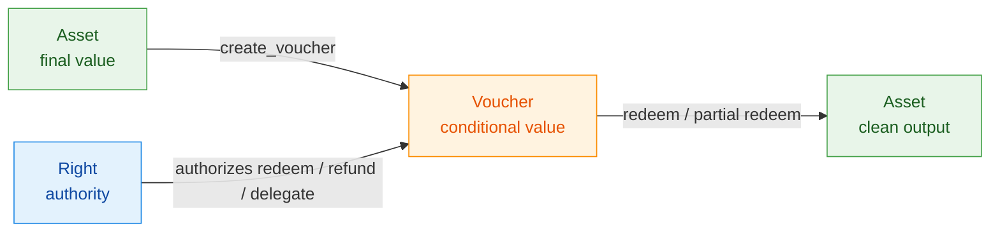
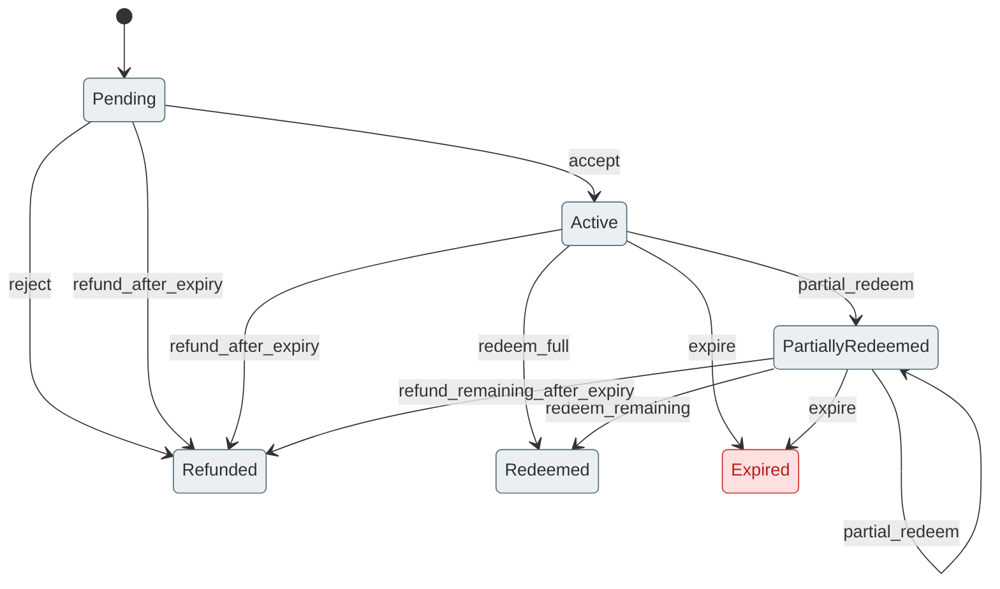
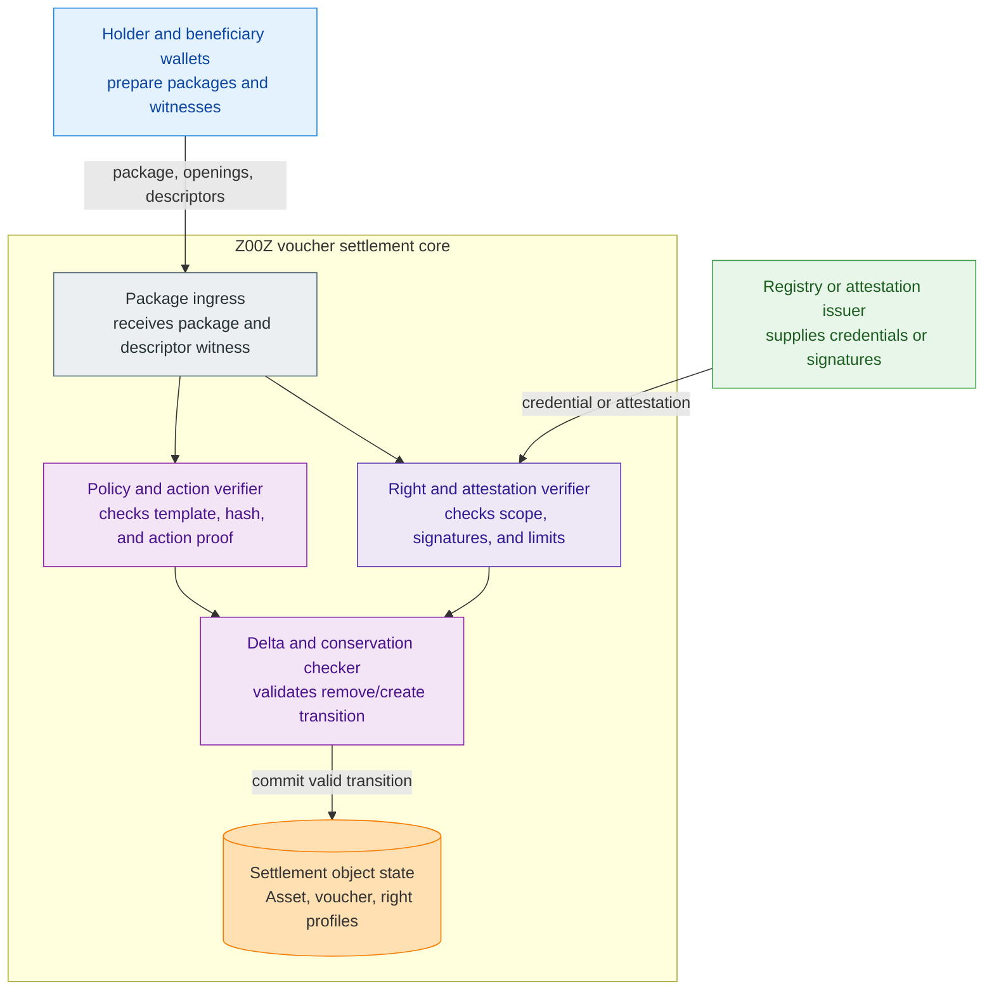
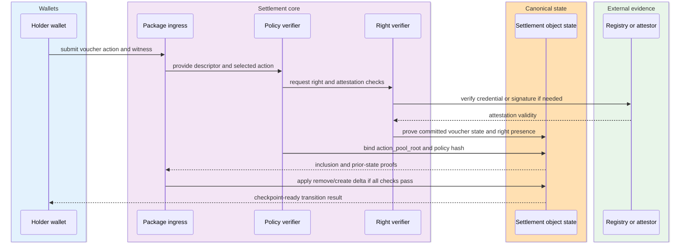
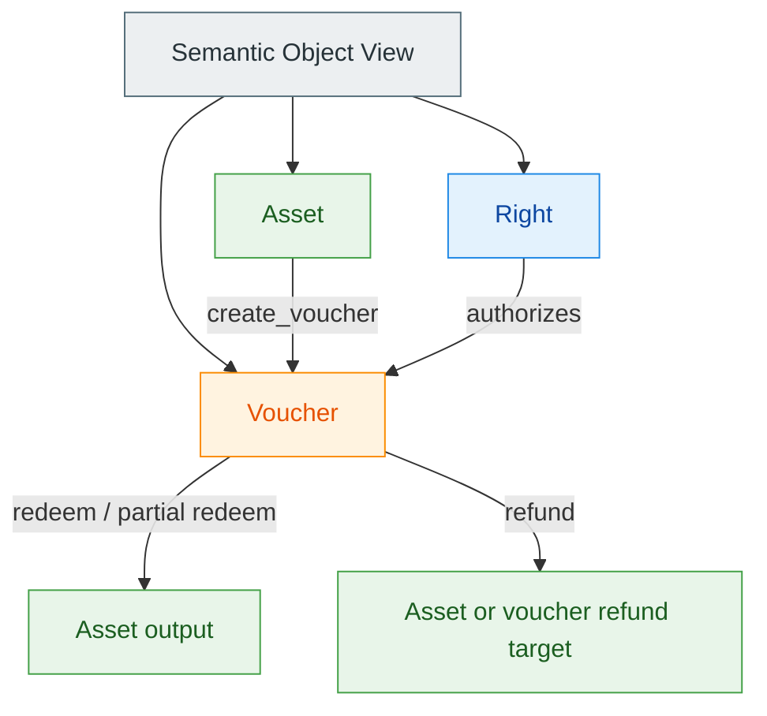

# Z00Z Assets, Rights, And Vouchers Whitepaper

[TOC]

Version: 2026-07-09

## Key Terms Used In This Paper

This paper uses a narrow vocabulary because its job is to stabilize one object
boundary, not to widen the Z00Z category claim beyond what the current corpus
and the proposed companion architecture can defend.

- `Asset`: The final-value object. In the native cash case, it represents clean
  `Z00Z` that should preserve cash-like semantics.
- `Voucher`: A conditional value claim over `Z00Z`, backed by reserved or
  consumed value and governed by a bounded lifecycle.
- `Right`: An authorization object that grants bounded authority over an
  `Asset` or `Voucher`, but does not carry value itself.
- `CashPolicy`: The fixed protocol rule set for native `Z00Z` cash behavior.
- `VoucherPolicy`: The paper-level bounded voucher rule set that defines how a
  voucher may be accepted, redeemed, reduced, refunded, or expired.
- `RightPolicy`: The paper-level bounded right rule set that defines how a
  right may be used, delegated, attenuated, revoked, expired, or disclosed.
- `ActionPool`: The paper-level committed set of declarative actions allowed by
  a voucher policy.
- `FeeEnvelope`: A separate fee-support or publication-support object that
  answers how a voucher or right transition is paid for. In current HJMT/right
  flows it is already a live adjacent fee-support object, and it is not the
  voucher itself and not the right itself.
- `Fully backed voucher`: A voucher whose redeemable `Z00Z` value is already
  reserved by consuming or locking the source value at creation time.
- `Checkpoint`: The public settlement boundary that makes a state transition
  canonical.
- `Settlement evidence`: The public roots, deltas, proofs, signatures, and
  publication artifacts needed to validate a transition.
- `Soft confirmation`: A pre-checkpoint admission or publication-path signal
  that a package has entered processing, but has not yet become final
  settlement.
- `SettlementStateRoot`: The live HJMT public settlement root for committed
  settlement state.
- `SettlementPath`: The live HJMT canonical settlement path
  `{ definition_id, serial_id, terminal_id }`.
- `SettlementLeaf`: The live HJMT settlement leaf family. In current code it
  appears as `SettlementLeaf::Terminal(TerminalLeaf)` for asset-bearing state
  and `SettlementLeaf::Right(RightLeaf)` for live non-coin rights.
- `Typed Object View`: This paper's semantic shorthand for classifying
  `Asset`, `Voucher`, and `Right` state under one settlement-root contract. In
  live HJMT that contract is expressed through `SettlementStateRoot`,
  `SettlementPath`, and the `SettlementLeaf` family. It is not a second
  structural tree or a parallel storage API.

## 1. Why This Paper Exists

The Z00Z corpus already argues for privacy-first digital cash, wallet-local
possession, bounded smart-cash semantics, asynchronous settlement, and a future
rights-first expansion of the protocol. What the corpus has not yet had in one
dedicated place is a stable answer to a recurring object-model confusion:

1. Should native `Z00Z` itself carry arbitrary policy and custom actions?
2. Is a voucher just a dressed-up right?
3. Should authority live in many specialized right types or in one generic
   authorization object?
4. Should programmability sit on the cash object, on the voucher object, or in
   some larger hidden smart-contract runtime?
5. Where do these objects belong in state, and what belongs in wallet-local
   payloads instead?

This paper exists to answer those questions as one cold-reader document rather
than as a chain of exploratory notes.

### 1.1 Design Problem

Without a stable boundary, concept drift follows quickly.

If the protocol says that any `Asset` may carry arbitrary restrictions, native
cash starts losing fungibility and receiver clarity. If the protocol says that
a `Voucher` is only a permission, the distinction between value and authority
collapses. If the protocol says that a `Right` may also hold backing,
remaining value, refund state, and redemption state, then the right has become
a hidden value container. If the protocol says that asset-local custom actions
are routine, then native cash starts drifting toward a disguised smart-contract
runtime.

Those confusions are not semantic noise. They directly affect payment UX,
wallet safety, supply accounting, replay rules, storage design, and the honest
scope of Z00Z smart-cash claims.

### 1.2 Design Thesis

The design thesis of this paper is:

> Native `Z00Z` should remain clean final-value cash.
> Conditional value should live in vouchers.
> Authority should live in rights.
> Programmability should live in bounded voucher policies and declarative
> voucher action pools, not in arbitrary native-asset code.

This is the narrowest model that preserves:

- cash-like finality for native value;
- programmable conditional value without toxic recipient outputs;
- delegated authority without wallet custody transfer;
- explicit refund and partial-redeem paths;
- clean supply accounting across final and conditional value;
- a bounded, auditable settlement surface instead of a universal hidden VM.

### 1.3 Reader Outcome

After reading, a fresh reader should be able to answer one concrete question:

**What is the clean architectural split between `Asset`, `Voucher`, and
`Right` in Z00Z, and why is that split better than restricted cash, policy
envelopes on native money, or rights that silently carry value?**

## 2. Position In The Z00Z Corpus

This paper is a companion boundary document. It does not replace the main
protocol, smart-cash, use-case, or uniqueness papers. Its role is narrower: it
defines the clean object split that those papers can assume when they talk
about cash, claims, vouchers, delegated budgets, and rights.

### 2.1 Corpus Role

| Paper | What it owns | What this paper adds |
| --- | --- | --- |
| [Z00Z Main Whitepaper](Main-Whitepaper.md) | wallet-local possession, checkpoint settlement, asset-centric public evidence | clarifies how final value, conditional value, and authority should split into distinct objects |
| [Z00Z Smart Cash](Smart-Cash.md) | the smart-cash boundary versus a universal private VM | pins smart cash to clean native cash plus bounded vouchers and rights |
| [Z00Z Use Cases Whitepaper](UseCases.md) | where the architecture matters in practice | explains which object owns each use-case semantic: cash, voucher, or right |
| [Z00Z Uniqueness Whitepaper](Uniqueness.md) | rights-first uniqueness against public-account systems | narrows the object model so the uniqueness claim does not become vague |
| [Z00Z JMT Asset And Right Storage Design](../tech-papers/done/Z00Z-HJMT-Design.md) | storage, semantic roots, canonical object paths | anchors this paper's object model to the live `SettlementStateRoot` / `SettlementPath` HJMT contract |

### 2.2 Current Maturity Versus Target Architecture

This paper is intentionally disciplined about maturity.

It does **not** claim that the current repository already ships the full
voucher semantics described here. Current HJMT code and companion documents
already expose one live `SettlementStateRoot`, one canonical `SettlementPath`,
asset-bearing `SettlementLeaf::Terminal(TerminalLeaf)` state whose inner
payload is `AssetLeaf`, live `SettlementLeaf::Right(RightLeaf)` state, and
live `SettlementLeaf::Voucher(VoucherLeaf)` state. This paper proposes the
wider object boundary that the companion architecture should converge toward
without overstating current runtime maturity.

The maturity split is:

- the current corpus already supports wallet-local possession, checkpointed
  settlement evidence, asset-bearing canonical state under HJMT, and live
  `RightLeaf` and `VoucherLeaf` lanes under the same settlement family;
- this paper defines the target semantic split and policy discipline for that
  widening;
- where it discusses `VoucherLeaf` or a typed `Asset / Voucher / Right`
  semantic view beyond the current committed record shape, it speaks in
  design-direction language unless another corpus source already treats the
  term as current.

That maturity discipline matters because this paper is meant to clarify the
architecture, not to overstate current implementation status.

## 3. Core Thesis: Asset, Voucher, And Right

The clean Z00Z object model is a three-part split:

```text
Asset   = final value
Voucher = conditional value
Right   = authority
```

This triad is the stable center of the paper.

### 3.1 The Minimal Triad

| Object | Economic meaning | Carries value? | Carries authority? | Typical lifecycle |
| --- | --- | --- | --- | --- |
| `Asset` | final spendable value | yes | only implicit ownership/spend authority in the native cash case | spend, split, merge, transfer, pay fee, create voucher |
| `Voucher` | conditional claim over value | yes | no, except through attached policy meaning | create, accept, redeem, partial redeem, reject, refund, expire |
| `Right` | bounded authority over an object | no | yes | grant, use, reduce, delegate, expire, revoke, recycle through state update |

The split is deliberate:

- `Asset` answers: what value is already final and spendable?
- `Voucher` answers: what value is reserved, conditional, or not yet final for
  the recipient?
- `Right` answers: who may take which action under which limits?

### 3.2 Why This Split Is Minimal

The triad is minimal because anything smaller collapses useful distinctions,
and anything larger usually turns into a taxonomy explosion.

If the system removes `Voucher`, then `Right` starts carrying backing,
remaining amount, refund state, and partial-redemption state. That turns
authority into value. If the system removes `Right`, then all authority lives
inside value objects and becomes harder to delegate safely. If the system
multiplies value objects into `BudgetAsset`, `GrantAsset`, `AllowanceAsset`,
`EscrowAsset`, and many more, the architecture loses its unified value class
and starts looking like a marketplace of bespoke token types.

The triad avoids all three failure modes:

- no dirty native cash;
- no authority object that secretly carries value;
- no long-term proliferation of special-purpose asset species.

### 3.3 Why Voucher Is Not Redundant With Right

The cleanest test is this:

- `Right` must not carry value.
- `Voucher` must not be mere authority.

If an object stores `amount_remaining`, `backing_mode`, `redeemed_amount`,
`expiry`, and `refund_target`, it is functioning as conditional value whether
it is named `Right` or not. If an object only says "holder X may redeem under
condition Y" and has no backing, no remaining amount, no conditional value
state, and no refund path, it is functioning as authority whether it is named
`Voucher` or not.

This distinction is why vouchers remain useful without becoming a duplicate of
rights.

**Figure 3.1 - The three-object model.** Native cash stays clean. Conditional
value lives in vouchers. Authority lives in rights.



### 3.4 Cross-Object Binding Rules

The triad becomes specification-ready only when the relations between the three
objects are explicit.

| Relation | What must be explicit | What must never be implicit |
| --- | --- | --- |
| `Asset -> Voucher` | source value or restricted source context, selected `VoucherPolicy` lineage, amount moved into conditional form | "this cash is secretly conditional because the issuer remembers extra rules" |
| `Voucher -> Asset` | redeem branch, beneficiary rule, amount delta, clean output rule, refund or exhaustion result | hidden mutation of unrelated balances or silent value creation |
| `Voucher -> Right` | required right set, action scope, disclosure or attestation requirements, beneficiary or controller role | "holder may redeem because some off-chain operator says so" |
| `Right -> Voucher` | target voucher or declared voucher family, allowed actions, quota or attenuation scope, expiry, revocation semantics | authority inferred from wallet brand, issuer reputation, or UI text alone |
| `Right -> Right` | parent-child monotonic weakening, action subset, narrower scope, shorter or equal lifetime, explicit delegation chain | delegation that increases power or escapes the parent boundary |

One voucher may require zero, one, or several rights depending on policy, but
the requirement must be declared. One right may scope over one object or over a
declared object family, but that scope must also be declared. The whitepaper
should not leave those bindings to folklore.

## 4. Asset: Final Value And Cash Boundary

The first rule of this paper is that native `Z00Z` cash should remain boring.

### 4.1 What Asset Means

In this paper, an `Asset` is the final-value object. For native `Z00Z`, that
means:

- the holder has final spendable value, not a pending claim;
- the object should preserve one-sided payment semantics;
- the object should remain legible to the receiver as ordinary money rather
  than as an application-specific conditional instrument.

The canonical native-cash operations are therefore narrow:

```text
spend
split
merge
transfer
pay_fee
create_voucher
```

Those are protocol operations under a fixed `CashPolicy`, not a general-purpose
per-asset programmable behavior surface.

### 4.2 Why Asset Must Stay Clean

If native `Asset` objects can carry arbitrary custom restrictions and arbitrary
custom action pools, the system starts degrading in predictable ways.

| If native cash is made programmable by default | What breaks |
| --- | --- |
| any sender may attach arbitrary restrictions | receiver clarity and cash-grade fungibility |
| outputs may require hidden acceptance or hidden fee paths | one-sided payment semantics |
| custom actions may sit directly on cash | the cash layer drifts toward a disguised smart-contract runtime |
| every output may carry a unique shell | wallet accounting and "what counts as money?" become unstable |
| restrictions may silently propagate to receivers | toxic-asset attacks become normal protocol behavior |

The clean boundary is therefore:

> Native `Asset` in core Z00Z should carry fixed cash semantics, not arbitrary
> programmable value semantics.

### 4.3 Cash-Grade Invariants

A native cash object should satisfy cash-grade invariants:

- the receiver can recognize it as money rather than as a conditional claim;
- the holder can spend, split, merge, transfer, and pay fees under a stable
  protocol rule set;
- there is no hidden sender clawback or hidden issuer mutation path;
- there is no hidden requirement that the receiver first accepts an unknown
  policy shell;
- the object does not rely on a custom per-instance action grammar to behave as
  money.

This paper does not need to claim that every legal or governance concern is
solved at the cash-object level. It only claims that the native cash object
must remain semantically clean enough to preserve cash-like expectations.

### 4.4 What This Paper Does Not Claim About Assets

This paper does not claim that **no future object in Z00Z may ever have custom
actions**. The narrower claim is that **native cash should not**.

Non-cash application objects may eventually justify richer transition surfaces.
That is a separate design space. The cash object should not be used as the
default host for that experimentation.

## 5. Voucher: Conditional Value, Not Dirty Cash

A voucher exists because some valuable economic object is real, bounded, and
worth transferring, but should not yet be treated as final unrestricted cash by
the recipient.

### 5.1 Economic Meaning

A voucher is a conditional claim over `Z00Z` value.

That claim may mean:

- value is redeemable only under time or quota conditions;
- value is redeemable only to particular recipients, services, or policy
  domains;
- value may be partially redeemed across several transactions;
- value may be rejected or refunded under explicit rules;
- value is already reserved, but is not yet final cash for the beneficiary.

The important distinction is that the voucher is **not** dirty cash. It is a
different economic mode:

- `Asset`: "I already hold final value."
- `Voucher`: "A value claim exists, but it is still conditional."

### 5.2 Fully Backed Vouchers

For MVP discipline, the cleanest model is a fully backed voucher.

In that model:

1. source `Z00Z` value is consumed or reserved at voucher creation time;
2. the voucher becomes the live carrier of that conditional value;
3. redeem, refund, and partial redeem only transform already-reserved value;
4. the voucher never mints new `Z00Z`.

This gives the cleanest safety invariant:

> A voucher cannot create value. It can only release, reduce, refund, or
> transform already reserved value.

Treasury-backed or liability-style vouchers may be useful later, but they
introduce extra trust and accounting assumptions. They should be treated as
future or app-layer extensions, not as the default MVP claim.

A second MVP safety rule follows from restricted source contexts. If a voucher
was created from a treasury, grant, allowance, or other bounded source, refund
should return to that declared source context rather than to an operator's
unrelated clean-cash balance. Otherwise voucher reject-and-refund flows become
a bypass lane that strips the original restriction model.

### 5.3 Voucher Is Not Final Cash

Voucher transfer and cash transfer are not the same event.

| Transfer type | What the receiver has after receipt |
| --- | --- |
| clean cash transfer | final spendable `Z00Z` |
| voucher transfer | a conditional value claim |

This distinction is operationally important:

- a cash transfer can remain one-sided and final;
- a voucher transfer may be an offer, a claim, or an accepted conditional
  settlement depending on policy and receiver expectations;
- wallet UX should not count vouchers as ordinary spendable balance.

### 5.4 Voucher Lifecycle

The voucher lifecycle is what makes vouchers better than "encumbered cash with
hidden rules".

The core lifecycle is:

1. create voucher from source value;
2. optionally accept or reject;
3. redeem in full or in part;
4. refund under explicit conditions;
5. expire cleanly if the claim window closes.

**Figure 5.1 - Voucher lifecycle.** The important property is that stuck value
does not silently remain in a poisoned receiver output. It stays in a bounded
conditional object with explicit redemption and refund branches.



### 5.5 Partial Redeem

Partial redeem is not an edge case. It is one of the main reasons vouchers are
useful.

It allows one conditional value object to express:

- daily or per-transaction redemption caps;
- employee or agent budgets with controlled drawdown;
- grants and allowances that release in slices;
- claim instruments that remain live after one partial cash-out.

Without a voucher object, partial redeem pressures `Right` to carry remaining
value state or pressures native cash to absorb restriction semantics. Both are
worse than keeping conditional value in a voucher.

### 5.6 Why Vouchers Are Better Than Encumbered Cash

The voucher model is cleaner than "native cash plus arbitrary policy envelopes"
for one basic reason: it preserves the semantic difference between final money
and conditional money.

When a holder sees a voucher, the protocol is saying:

- this is not yet ordinary cash;
- this object has an explicit lifecycle;
- if conditions fail, there is a declared outcome path;
- if value is redeemable, redemption produces clean output rather than a
  permanent poisoned shell.

That is a much safer boundary than forcing every receiver to guess whether a
cash-looking object is really cash.

## 6. Right: Authority Without Value

Rights exist because value and authority are not the same thing.

### 6.1 What Right Means

A right is an authorization object. It answers a narrow question:

> Does this holder have bounded authority to perform action `X` over object `Y`
> under context `Z`?

Typical actions include:

- redeem;
- partial redeem;
- refund;
- delegate;
- view;
- audit;
- operate a bounded protocol function over a scoped object.

The important negative statement is just as important:

> A right does not carry value. It authorizes state transitions over value.

### 6.2 Stateless And Stateful Rights

Some rights are stateless:

- view-only authority;
- reusable audit access;
- a non-consuming proof of authority.

Some rights are stateful:

- quota-limited redeem authority;
- per-period capped agent authority;
- authority that expires, depletes, or narrows over time.

Stateful rights need state updates because otherwise a malicious wallet could
silently reset counters or reuse exhausted authority. This is why the target
architecture treats stateful rights as canonical state objects rather than as
wallet-only hints.

The same evidence discipline used for voucher conditions applies here too.
Deterministic state checks and attested approvals are the clean core.
Registry-backed constraints are a bounded extension. Oracle-heavy or subjective
conditions make a right higher-risk and should not be narrated as low-trust
core authority.

### 6.3 Rights And Delegation

Delegation is one of the main reasons rights should exist as a separate object.

A treasury, DAO, or operator should be able to grant:

- a narrower redeem budget;
- a shorter validity window;
- a smaller scope;
- fewer allowed actions.

That gives a clean delegation rule:

> A child right must be weaker than or equal to its parent.

That monotonic-delegation rule is much easier to reason about when authority is
modeled explicitly as a right rather than silently embedded in value.

### 6.4 Why Right Does Not Duplicate Voucher

The difference can be stated directly:

- `Voucher`: how much conditional value exists, what backing exists, what
  remains, when it expires, where it refunds.
- `Right`: who may take which action over that voucher, under what limits.

If a right starts carrying `amount_remaining`, `backing_mode`, or refund state,
it is no longer acting like authority. It is acting like conditional value.

That is why the split is not redundant.

## 7. Policy, ActionPool, And Condition Model

This paper does not reject programmability. It localizes it.

### 7.1 Fixed CashPolicy For Native Asset

Native cash should have a fixed protocol cash policy.

That policy may define:

- spend;
- split;
- merge;
- transfer;
- fee payment;
- voucher creation.

What it should not define is an arbitrary per-instance custom action surface
that turns each cash object into its own mini-application runtime.

### 7.2 VoucherPolicy And ActionPool

If programmability exists in the value layer, it should live on vouchers.

`VoucherPolicy` defines bounded conditions and lifecycle rules.
`ActionPool` defines the committed set of allowed voucher actions.

These names define semantic contract surfaces for this paper and a later full
spec. They are not a claim that the current crates already expose exact
`VoucherPolicy` or `ActionPool` type names.

Typical voucher actions are:

- accept;
- reject;
- redeem;
- partial redeem;
- refund after expiry;
- expire;
- transfer voucher under policy;
- disclose receipt or scoped audit evidence.

The crucial constraint is that the action pool should be declarative and
bounded. The protocol should not need a universal hidden smart-contract engine
to understand a voucher transition.

In the same spirit, a voucher should remain a closed-world object. Its valid
transitions may consume the voucher, create clean asset outputs, create reduced
vouchers, refund remaining value, consume required rights, or emit bounded
receipt evidence. They should not call arbitrary external logic, mutate
unrelated objects, or hide upgrade hooks behind a policy name.

### 7.3 Core-Safe Condition Classes

Not every interesting business condition belongs in protocol core.

| Condition class | Example | Core-safe? | Why |
| --- | --- | --- | --- |
| protocol-native deterministic condition | expiry, amount remaining, scope match, quota remains | yes | validator can verify directly from state and witness |
| signature or threshold attestation | DAO approval, controller sign-off, beneficiary signature | yes | validator verifies authorized signatures, not external truth |
| registry or credential proof | merchant allowlist, approved vendor membership, credential root inclusion | bounded | allowed if registry trust is explicit and evidence is verifiable |
| external real-world oracle fact | delivery happened, work was really done, off-chain event truth | not core-safe by default | requires external trust, dispute, or app-layer governance |

The paper therefore recommends:

- core voucher conditions should be deterministic or attested;
- registry-backed conditions may exist with explicit trust boundaries;
- oracle-heavy or subjective conditions should stay app-layer or high-risk.

A useful shorthand is to classify voucher policies into trust tiers:

| Tier | Label | Typical evidence | MVP stance |
| --- | --- | --- | --- |
| 0 | Pure voucher | state proofs, epoch checks, amount checks, typed delta validation | core-safe default |
| 1 | Attested voucher | authorized signatures or threshold approvals | core-safe default |
| 2 | Registry voucher | credentials and registry inclusion proofs | bounded extension |
| 3 | Oracle voucher | external data oracle outputs | high-risk, app-layer |
| 4 | Subjective voucher | manual review, arbitration, or discretionary approval | non-automatic, app-layer |

For MVP discipline, Tier 0 and Tier 1 are the clean default. Higher tiers may
still be useful, but they should not be narrated as low-trust core semantics.

### 7.4 Validator And Wallet Responsibilities

The wallet is not the source of truth for policy satisfaction.

| Component | What it may do | What it must not be trusted to assert by itself |
| --- | --- | --- |
| wallet | hold secrets, prepare witness, gather signatures, assemble package | "condition satisfied because my local app says so" |
| validator | verify state inclusion, signatures, policy commitments, action membership, value conservation, delta correctness | external truth that was never converted into verifiable evidence |
| external service or issuer | issue credentials, attest approvals, maintain app-layer registries | silently overwrite protocol state without evidence |

This is the clean rule:

> Conditions are valid only when they compile into verifiable evidence.

### 7.5 Minimum Policy Contract Surface

If this paper is meant to support a later full specification, it must say not
only that policies exist, but what each policy contract owns.

| Contract | Minimum semantic contents | Used by | Must not become |
| --- | --- | --- | --- |
| `CashPolicy` | allowed native actions, fee lane, voucher-creation boundary, supply discipline | wallets, aggregators, validators | a per-instance script shell on ordinary cash |
| `VoucherPolicy` | backing mode, beneficiary or scope model, expiry rules, refund route, partial-redeem rule, required rights, disclosure rule, committed `ActionPool`, trust tier | wallets, aggregators, validators, watchers | mutable prose whose real meaning changes after issuance |
| `RightPolicy` | right class, target object family, allowed actions, delegation attenuation rule, revocation rule, expiry or reuse model, disclosure and audit rule, evidence class | wallets, validators, watchers | a hidden value container or a fee surrogate |

At minimum, a committed policy header should let every role classify the object
the same way before reading a longer descriptor. That means the header should
stably identify object family, template or descriptor lineage, version, and
trust tier.

In the same maturity discipline, `VoucherPolicy`, `RightPolicy`, and
`ActionPool` are paper-level semantic contract names. Current right-side code
already commits several dedicated policy identifiers inside `RightLeaf` rather
than one generic `RightPolicy` field.

### 7.6 Minimum Action Semantics

The action surface should also be explicit enough that a downstream spec can
turn prose into a deterministic transition table.

| Action | Objects it reads | Minimum state effect | Checks that must succeed |
| --- | --- | --- | --- |
| `create_voucher` | source `Asset` or reserved source context, selected `VoucherPolicy`, optional issuing authority | consumes or reserves source value and creates a voucher | source authorization, backing rule, policy commitment, value conservation |
| `accept` | voucher, selected acceptance branch, optional holder attestation | records acceptance or moves the voucher into its active claim mode | holder authorization if required, action membership, no hidden value change |
| `reject` | voucher, reject branch, refund rule | closes or consumes the voucher and routes remaining value to the declared refund target | reject precondition, refund target match, value conservation |
| `redeem_full` | voucher, optional right, selected redeem branch | consumes voucher and creates clean asset output or outputs | action membership, beneficiary rule, right scope, value conservation |
| `partial_redeem` | voucher, optional right, selected redeem branch | creates clean asset output and a reduced surviving voucher | amount delta, quota or cap checks, remaining-value rule, value conservation |
| `refund_after_expiry` | voucher, expiry rule, refund branch | consumes or replaces the voucher and routes remaining value to refund target | expiry proof, refund rule, no clawback outside policy |
| `delegate_right` | parent right, `RightPolicy`, optional target object ref | creates a weaker child right and may narrow or replace the parent right | monotonic attenuation, scope binding, expiry monotonicity, action subset |
| `revoke_or_expire_right` | right, revocation or expiry rule | consumes the right or replaces it with an inactive terminal state | revocation authority or deterministic expiry proof |

The important whitepaper-level rule is that each action must have a legible
object effect. Actions should consume, replace, or create explicit objects.
They should not hide their real outcome inside invisible side effects.

These action labels are semantic action classes for a downstream spec. They are
not a claim that the current repository already exports matching function names
or a second function-layer runtime.

### 7.7 Package And Witness Boundary

Live asset lanes already use wallet-side package envelopes such as
`TxPackage` and `ClaimTxPackage`. A future voucher and right lane should keep
the same architectural split even if the concrete package types evolve.

At minimum, a package for `Asset` / `Voucher` / `Right` transitions should bind:

- referenced live objects and intended deletions or replacements;
- intended created objects;
- selected action name and action-membership evidence;
- policy commitments plus any required descriptor preimage or template ref;
- right references and authorization evidence;
- prior-state or checkpoint-facing root references;
- optional disclosure, audit, or receipt artifacts if the action emits them.

The package is a transition proposal, not settlement truth by itself. A wallet
assembles it, an aggregator may admit or defer it, a validator replays it
against committed state, and a watcher observes its publication path. None of
those roles should be allowed to guess missing semantics once commitment binding
fails.

### 7.8 Separate Fee-Support Boundary

Voucher and right flows also need an honest answer to the question "who pays to
publish, relay, verify, or settle this transition?"

That answer should remain a separate contract family. In companion documents it
appears as `FeeEnvelope` or an equivalent bounded fee-support object. The
important rule is architectural, not cosmetic:

- fee support may fund publication, relay, or verification;
- fee support may be attached to voucher or right flows;
- fee support must not be used to smuggle extra authority into `Right`;
- fee support must not be used to smuggle extra value semantics into `Voucher`.

The three-object model therefore remains:

- `Asset` for final value;
- `Voucher` for conditional value;
- `Right` for authority;
- plus an adjacent fee-support path when bounded publication funding is needed.

That keeps spending authority, conditional value, and operational funding as
separate contracts even when one business flow needs all of them.

## 8. Payment, Acceptance, And Receiver Safety

One of the strongest reasons to keep assets clean and vouchers separate is
receiver safety.

### 8.1 Clean Payment Versus Voucher Transfer

The protocol should preserve two distinct settlement modes:

| Mode | Receiver experience |
| --- | --- |
| clean cash payment | "I received final spendable `Z00Z`." |
| voucher transfer | "I received a conditional claim that I may accept, redeem, reject, or ignore under policy." |

This difference prevents the protocol from claiming that every conditional
object is already payment-final money.

### 8.2 One-Sided Cash Stays

Native cash should preserve one-sided payment semantics.

If a sender produces a clean cash output for the receiver, the receiver should
not need to be synchronously present to make the payment legible as money. This
is one of the main reasons native cash should stay clean.

Voucher flows are different. A voucher may still move asynchronously, but it
should be presented as a claim-like object rather than as unconditional final
cash.

### 8.3 Refund Is Not Arbitrary Clawback

Refund is legitimate only when it is an explicit branch of the voucher
lifecycle.

That means:

- refund must be policy-declared;
- refund must depend on conditions such as rejection, expiry, or unmet redeem
  path;
- refund must not remain a hidden sender "take back whenever desired" power;
- refund after partial redeem must preserve already redeemed value.

One case deserves extra emphasis: if source value came from a restricted
treasury or budget context, refund should return to that declared source
context rather than to an operator's unrelated clean `Z00Z` output. Otherwise
the voucher path becomes a covert restriction-stripping mechanism.

This distinction is what makes vouchers safer than "receiver-owned cash that
the sender can maybe reclaim later."

### 8.4 Unknown Policy And Wallet Quarantine

Wallets should not pretend that every incoming object is ordinary money.

If a voucher policy or descriptor is unavailable, unknown, or outside a known
safe template family, the wallet should not auto-count it as ordinary spendable
cash. A mature wallet may quarantine, defer, or explicitly classify such
objects instead of flattening them into one undifferentiated balance display.

That is a UX rule, but it is also a security rule.

## 9. Storage And Settlement Architecture

The object split becomes real only when storage and settlement follow it.

### 9.1 One Settlement-Root Contract And Semantic Object View

The live HJMT contract should be named with current terms first:

- one public `SettlementStateRoot`;
- one canonical `SettlementPath { definition_id, serial_id, terminal_id }`;
- one live `SettlementLeaf` family under that root.

Within this paper, the object-model shorthand is:

```text
Asset | Voucher | Right
```

Those labels describe semantic categories. They are not a claim that live HJMT
exports a second object-key layer, nor a claim that the live backend is one
monolithic physical JMT. Current HJMT is physically a bucketed root-chained JMT
forest.

The reason for one settlement-root contract and one semantic object model is
clarity:

- one canonical replay-safe settlement root contract;
- one unified object transition model;
- typed categories that preserve semantic separation without multiplying public
  roots or reviving archived `AssetPath` / `AssetStateRoot` vocabulary.

### 9.2 Live HJMT Leaves And The Voucher Target

In live HJMT terms today:

- the structural settlement family is `SettlementLeaf`;
- asset-bearing structural state appears as
  `SettlementLeaf::Terminal(TerminalLeaf)`, where `TerminalLeaf` carries the
  asset-side payload;
- `RightLeaf` is the live non-coin terminal variant under the same settlement
  family, not a second tree;
- `VoucherLeaf` is also a live `SettlementLeaf` variant and committed record
  name in the repository, but this paper sometimes uses the noun for a wider
  conditional-value semantics than the current runtime fully enforces.

The semantic rule is simple regardless of the final voucher policy surface:

- `Asset` contributes to final value supply;
- `Voucher` contributes to conditional reserved value supply;
- `Right` contributes zero value.

### 9.3 What Belongs In Canonical State

The committed settlement object state should hold commitments for live objects,
not every full policy descriptor in plaintext.

| Surface | What belongs there |
| --- | --- |
| settlement-root contract | live object commitments, object identifiers, policy hashes, action roots, state commitments |
| wallet payload | secrets, openings, decrypted payloads, local caches, private metadata |
| transaction or DA witness | policy descriptors, action proofs, attestations, registry evidence, openings needed for validation |

This preserves three goals at once:

- validators have a binding state commitment to trust;
- wallets may remain private and rich in local metadata;
- full policy text does not need to bloat the canonical state tree.

### 9.3.1 Per-Object Storage Split

The storage split should also be readable per object, not only as one generic
table.

| Object | Committed state should hold | Witness or transport should hold | Wallet-local state may hold |
| --- | --- | --- | --- |
| `Asset` | live final-value commitment, object identifier, fixed cash-policy reference, transition-visible spend or create relation | transaction proofs, signatures, checkpoint-facing transition evidence | secrets, decrypted payloads, local labels, wallet inventory views |
| `Voucher` | live remaining value state, `voucher_policy_hash`, `action_pool_root`, expiry or refund branch commitments, required-right references where applicable | policy descriptor preimage, selected action proof, attestations, registry evidence, disclosure receipts | presentation metadata, acceptance preference, quarantine status, local reminders |
| `Right` | target scope, action subset, authority commitments, validity windows, revocation or delegation state, and right-side policy commitments such as transition, revocation, challenge, disclosure, and retention policy identifiers | signatures, registry proofs, delegation chain evidence, scoped disclosure artifacts | control keys, local draft packages, non-authoritative workflow hints |

One discipline matters here: state that changes authority or value must not live
only in the wallet. If a field affects replay safety, remaining value, quota,
revocation, or validity, it belongs either in committed state or in the
verifier-owned witness path.

### 9.4 Why Policies And ActionPool Live Mostly Outside The Committed State

The settlement-root contract should commit to policy, not necessarily embed full
policy text.

That means the tree stores:

- `cash_policy_ref` for native assets;
- `voucher_policy_hash` and `action_pool_root` for vouchers;
- right-side policy commitments for rights, which live code already models as
  dedicated policy identifiers rather than one generic policy hash.

The full policy descriptor or action descriptor may travel through wallet
payloads, packages, or DA-backed witnesses as long as the validator can bind
them back to the committed hash or root.

That split is especially important for rights. Live `RightLeaf` state already
leans toward multiple dedicated policy commitments such as revocation,
transition, challenge, disclosure, and retention policy identifiers instead of
one monolithic `right_policy_hash`.

For MVP discipline, policy provenance should prefer protocol templates first
and content-hashed custom descriptors second. A mature implementation may
therefore distinguish:

- protocol templates, where the leaf carries a stable template reference that
  the validator already knows;
- custom policy descriptors, where the leaf commits only to the policy hash and
  the witness carries the descriptor preimage;
- an optional immutable policy registry later, but only as a content-addressed
  availability surface rather than as a mutable source of truth.

When vouchers use custom descriptors, the action commitment should stay
structurally bound to the policy commitment. A clean rule is:

```text
voucher_policy_hash = H(policy_header || action_pool_root || version)
```

If a transition needs a selected action or descriptor, the witness should carry
the action proof or descriptor preimage that binds back to the committed
`voucher_policy_hash` and `action_pool_root`. If that material is unavailable,
the wallet should quarantine the object and the validator should refuse the
action rather than guess the semantics.

**Figure 9.1 - C4 component view of the voucher settlement core.** The target
system boundary is one settlement core that validates policy, authority, and
value conservation before it updates settlement-committed object state.



**Figure 9.2 - Dynamic voucher partial-redeem path.** The runtime path matters
because the system must bind descriptor evidence, authority checks, and
settlement-state updates into one replay-safe transition.



The canonical settlement unit is a typed remove/create delta rather than a
vague status mutation:

```yaml
CheckpointDelta:
  removed:
    assets: [ASSET/A1]
    vouchers: [VOUCHER/V1]
    rights: [RIGHT/R1]
  created:
    assets: [ASSET/A2]
    vouchers: [VOUCHER/V2]
    rights: [RIGHT/R2]
```

At the HJMT contract level, each entry still resolves through
`SettlementPath`, and one `SettlementStateRoot` commits the resulting state.

Semantically this is one settlement-root transition. Physically, live HJMT may
realize it as a bucketed root-chained JMT forest. By contrast, words such as
`mempool`, `voucher discovery pool`, or `policy descriptor cache` should be
reserved for transport, indexing, and availability conveniences. They are not
consensus truth.

### 9.5 Conservation And Supply

Once vouchers carry conditional value, supply accounting must be explicit.

The simplest invariant is:

```text
sum(input Assets + input Vouchers)
=
sum(output Assets + output Vouchers + fees)
```

Rights are excluded from value supply because they do not carry value.

This makes the design honest about both final and conditional value:

- `Asset` carries final `Z00Z`;
- `Voucher` carries conditional reserved `Z00Z`;
- `Right` carries zero `Z00Z`.

### 9.6 Why Not Nested Rights Or Nested Vouchers

The paper prefers sibling live objects over deep nesting for the core model.

If rights are nested only inside vouchers:

- delegation becomes harder;
- independent revocation becomes harder;
- quota updates force voucher rewrites;
- one right cannot naturally scope across several vouchers.

If vouchers are nested only inside assets:

- it becomes harder to say which object really carries live value;
- refund and redemption semantics become less explicit;
- double-accounting risk increases.

The cleaner target is sibling live objects under one settlement-root contract.

**Figure 9.3 - Semantic object view and transition surface.** Final value,
conditional value, and authority remain distinct even when they participate in
one checkpointed transition.



### 9.7 Where Objects Live And Who Uses Them

The paper becomes much more specification-ready once it is explicit about where
object material lives and which role is allowed to do what with it.

| Role or surface | Primary object view | What it stores or uses | What it must not claim |
| --- | --- | --- | --- |
| wallet | local possession, local classification, package assembly | secrets, decrypted payloads, policy descriptors, signatures, local acceptance or quarantine state, object references | final settlement merely because the wallet assembled a valid-looking package |
| aggregator or publication lane | pending transition admission and batching | package queue, attached witnesses, descriptor preimages, admission result, soft confirmation, batch candidate metadata | canonical truth, external truth, or silent policy reinterpretation |
| validator | committed-state transition verification | live object commitments, policy hashes, action-membership proofs, attestation evidence, root continuity, conservation checks | wallet-local truth or mutable business prose without committed evidence |
| watcher | observation, divergence detection, evidence export | publication status, verdict snapshots, alert context, missing-artifact or lag evidence | an alternate settlement authority or a hidden control plane |
| registry or issuer | bounded external evidence source | credentials, signatures, allowlist proofs, approval attestations | direct mutation of protocol state without a verifiable transition |
| settlement-root contract | canonical public commitment | live object commitments, typed deltas, proof bindings, checkpoint-coupled root history | wallet inventory, mutable registry prose, or transport caches |

This role split is what keeps the architecture honest. Wallets can be rich,
aggregators can be operationally useful, validators can be strict, and watchers
can be noisy about failures without any of them becoming a second source of
truth next to the committed settlement contract.

### 9.8 End-To-End Role Path

The full interaction path should also be readable as one bounded state machine
across roles rather than as disconnected local tricks.

| Stage | Main role | What happens | What it still is **not** |
| --- | --- | --- | --- |
| local construction | wallet | build package, gather witness, classify object, collect signatures or attestations | final settlement |
| local risk decision | receiving wallet or service | accept, reject, quarantine, or defer the package under local policy | global proof that no conflict exists |
| admission | aggregator | parse, classify, soft-admit, defer, or reject for publication | canonical acceptance |
| replay-safe verification | validator | resolve committed state, verify policy and action bindings, check rights, conservation, and delta shape | operator business approval without evidence |
| publication and checkpoint | settlement path | commit accepted object delta under the public root | proof that every external business promise was honored |
| observation and escalation | watcher | detect lag, missing artifacts, divergence, invalid batches, or incomplete publication; export evidence | a second validator or a hidden rollback authority |

One operational rule deserves explicit emphasis:

> A soft confirmation from the aggregator means only that a package entered an
> admission or publication path. It does not mean that the package survived
> validator replay or became part of canonical checkpointed state.

### 9.9 Admission, Verdict, And Alert Surfaces

To make the role path spec-writable, the outputs of each runtime role should be
explicit as well.

| Role | Minimum output shape | Typical negative outcomes |
| --- | --- | --- |
| aggregator | admit, defer, reject, batch inclusion, soft confirmation, publication handoff | parse failure, auth failure, shape failure, local replay suspicion, policy rejection, deferred retry |
| validator | accepted, rejected, incomplete verdict over a bounded public-artifact set | missing artifact, artifact version mismatch, proof invalid, replay conflict, reconcile invalidity, state-root mismatch, provider invalidity |
| watcher | observation snapshot, evidence record, alert stream, lag or divergence report | publication lag, missing blob, censorship suspicion, provider divergence, retry stagnation, invalid batch, validator incomplete |

The exact enum names may evolve, but the semantic split should stay stable. A
downstream spec should preserve this three-layer output model even if it later
adds voucher-specific or right-specific subcodes.

## 10. Security Boundary And Non-Goals

The object model only helps if the security boundary is explicit.

### 10.1 What Validators Must Verify

At minimum, a mature settlement path over these objects must verify:

- referenced object presence or valid prior-state relation;
- policy or template commitment match;
- action membership in the committed voucher action pool;
- required right presence and scope match;
- holder authorization or attestation evidence;
- quota, expiry, and other deterministic condition satisfaction;
- value conservation across asset and voucher objects;
- correct deletion and creation of old and new live objects.

The protocol should verify transitions, not trust a wallet's description of the
transition.

### 10.2 What Core Z00Z Should Refuse

This paper recommends that core Z00Z refuse the following by default:

- native cash with arbitrary custom per-instance action pools;
- wallet-only policy logic that is not committed into canonical state;
- rights that silently carry value state;
- vouchers that mint value without backing;
- voucher actions that call arbitrary external logic or mutate unrelated live
  objects;
- mutable-by-name policies that can change semantics after issuance;
- arbitrary hidden code execution as a precondition for understanding value
  semantics;
- silent conversion of unknown conditional objects into ordinary cash balance.

### 10.3 Residual Risks

Even with the clean triad, several real risks remain:

- delayed-connectivity conflict risk before checkpoint reconciliation;
- registry and credential issuer trust for registry-backed conditions;
- oracle or subjective-condition trust whenever the protocol leaves purely
  deterministic conditions;
- app-layer treasury or issuer assumptions for anything beyond fully backed
  vouchers;
- wallet UX failure if conditional value and final cash are flattened into one
  surface.

This paper does not claim those risks disappear. It claims the triad localizes
them more honestly than restricted native cash or value-bearing rights would.

### 10.4 Non-Goals

This paper explicitly does **not** claim:

- that Z00Z core should become a universal private smart-contract VM;
- that all interesting real-world conditions are safe to encode in core
  voucher logic;
- that all authority should become explicit rights even for ordinary native
  cash ownership;
- that the current repository already ships the full typed
  `Asset / Voucher / Right` runtime described here;
- that all future non-cash application objects must follow exactly the native
  cash boundary recommended for `Z00Z`.

## 11. MVP Recommendation

The narrow MVP recommendation of this paper is straightforward.

### 11.1 MVP Object Set

The first disciplined object family should be:

- clean native `Asset` with fixed `CashPolicy`;
- fully backed `Voucher` with bounded `VoucherPolicy` and declarative action
  pool;
- generic `Right` for bounded authority over vouchers and selected protocol
  functions.

This is already enough to express:

- conditional payment instruments;
- allowances and grants;
- agent and employee spending budgets;
- refund-capable delayed settlement claims;
- bounded delegated authority without full wallet custody.

### 11.2 MVP Use-Case Priority

The cleanest early use cases for this object split are:

1. agent or DAO budget vouchers;
2. employee or contractor spend vouchers;
3. grant and allowance vouchers with partial redeem;
4. bounded claim instruments that must support explicit reject or refund paths.

These cases stress the model enough to prove that the object split is useful
without first requiring a universal execution system.

### 11.3 Future Expansion

If the MVP is successful, later expansion may widen the design in several
controlled directions:

- treasury-backed voucher families with explicit issuer trust surfaces;
- broader right families and a more mature generalized `RightLeaf` runtime;
- non-cash application objects with richer action surfaces outside the native
  cash boundary;
- stronger liability, fraud-proof, or challenge frameworks for delayed and
  offline flows.

But the expansion rule should remain stable:

> widen from a clean final-value cash core outward, not by turning native cash
> itself into a universal programmable shell.

### 11.4 From Whitepaper To Full Spec

After Sections 7 through 9 are read together, this paper is strong enough to
anchor a full architecture and behavior specification for the `Asset` /
`Voucher` / `Right` model. It is still intentionally not the wire-format,
proof-format, or API specification itself.

A downstream full spec should freeze at least:

- exact committed record schemas for voucher and right state;
- exact package envelope fields and digest bindings for voucher and right
  transitions;
- verifier decision tables for each action and each reject family;
- publication, checkpoint, and root-binding artifacts;
- watcher alert classes, evidence export surfaces, and operator-visible failure
  signals;
- wallet classification and quarantine rules for unknown or high-risk policy
  objects.

That is the correct division of labor. The whitepaper should define the object
model, transition semantics, trust boundary, and role responsibilities clearly
enough that the later spec is mostly a freezing exercise rather than a second
round of architecture invention.

## 12. Conclusion

This paper makes one narrow but important claim: Z00Z becomes clearer, safer,
and more composable when it separates final value, conditional value, and
authority into distinct objects.

Native `Asset` should remain clean final-value cash. `Voucher` should carry
conditional value with an explicit lifecycle. `Right` should carry authority
without carrying value. Programmability should live in bounded voucher policy
and action definitions, not in arbitrary native-asset behavior.

That split does not make Z00Z smaller. It makes the smart-cash claim more
disciplined. It preserves one-sided native cash, gives conditional value an
honest home, gives delegation an explicit object, and keeps the settlement
surface bounded enough to remain legible as protocol architecture rather than
as a disguised universal private runtime.

## Appendix A. Core Claims And Non-Claims

The paper is strongest when its promises remain explicit.

| Claims this paper makes | Claims this paper does not make |
| --- | --- |
| Native `Z00Z` cash should stay semantically clean. | Every future Z00Z object must be as simple as native cash. |
| Conditional value belongs in vouchers, not in poisoned cash outputs. | Every voucher family is equally safe or equally mature. |
| Rights should remain authority objects and should not carry value. | Current code already ships the full voucher semantics and policy surface described here, or that the voucher lane and generalized `RightLeaf` lane are both at full target maturity. |
| Voucher programmability should be bounded and declarative. | Z00Z core should become a universal private smart-contract VM. |
| One live settlement-root contract can host a typed `Asset / Voucher / Right` object model. | All real-world conditions should be core protocol conditions. |

## Appendix B. Reading Map

| If the next question is... | Read... |
| --- | --- |
| How does the live settlement core work today? | [Z00Z Main Whitepaper](Main-Whitepaper.md) |
| Why is Z00Z framed as smart cash rather than as a universal private VM? | [Z00Z Smart Cash](Smart-Cash.md) |
| Where does the rights-first architecture matter most in practice? | [Z00Z Use Cases Whitepaper](UseCases.md) |
| Why is Z00Z a different category from public-account systems? | [Z00Z Uniqueness Whitepaper](Uniqueness.md) |
| How do storage paths and committed object roots fit together? | [Z00Z JMT Asset And Right Storage Design](../tech-papers/done/Z00Z-HJMT-Design.md) |
