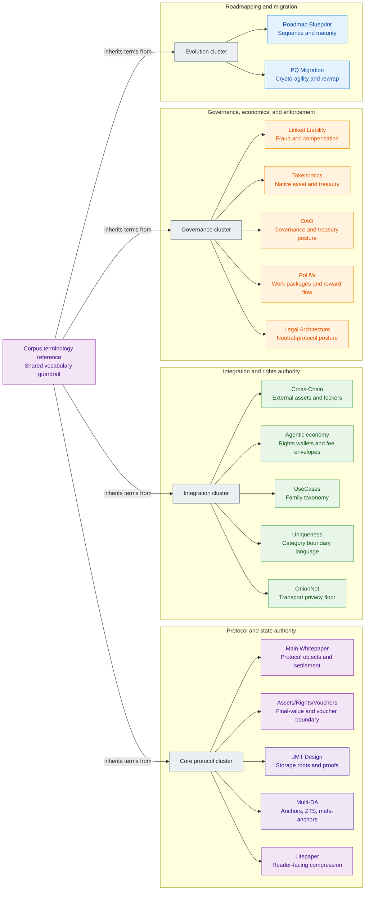

# Z00Z Corpus Terminology And Abbreviations Reference

[TOC]

Version: 2026-07-09

## Purpose

This document is the corpus-level terminology reference for the Z00Z paper
family. It is meant to be exhaustive across the explicit terminology layers in
the repository docs corpus, not merely a short shared-style guide.

For this reference, "explicit terminology layers" means:

- every `## Key Terms Used In This Paper` section in `docs/whitepapers/*.md`;
- every `## Appendix A. Glossary` section and its term tables or bullet lists;
- every appendix abbreviation or symbol table used as a terminology layer, even
  when it lives in Appendix B rather than Appendix A.

This reference does not try to index every type, function, or code symbol named
incidentally in prose. It indexes the places where the corpus explicitly says,
in effect, "these are the terms this paper defines and reuses."

## 1. Coverage Boundary

The current coverage set is the full `docs/whitepapers/*.md` paper corpus, with
`Assets-Rights-Vauchers.md` treated as the companion object-boundary paper:

- `Main-Whitepaper.md`
- `Litepaper.md`
- `Cross-Chain-Integration.md`
- `Agentic-Offline-Economy.md`
- `UseCases.md`
- `Uniqueness.md`
- `Linked-Liability.md`
- `OnionNet.md`
- `Tokenomics.md`
- `DAO.md`
- `Proof-of-Useful-Work.md`
- `Legal-Architecture.md`
- `Z00Z-HJMT-Design.md`
- `Z00Z-Roadmap-Blueprint.md`
- `Z00Z-Multi-DA-and-Checkpoint-Architecture.md`
- `PQ-Migration.md`
- `Assets-Rights-Vauchers.md`

Two papers need special handling:

- `Litepaper.md` does not use Appendix A as a glossary. Its Appendix A is
  a reading map across the corpus, so its terminology layer is front-loaded in
  `Key Terms Used In This Paper`.
- `Legal-Architecture.md` also does not use Appendix A as a
  glossary. Its appendices are claims, red-line, and documentary-control
  appendices, so its terminology layer is also front-loaded.

One companion paper also needs special handling:

- `Assets-Rights-Vauchers.md` uses Appendix A for
  claims/non-claims plus Appendix B for a reading map, so its terminology
  layer is front-loaded in `Key Terms Used In This Paper`.

One paper stores part of its terminology layer outside Appendix A:

- `Uniqueness.md` puts its main glossary in Appendix A, but its
  abbreviation and short-symbol tables live in Appendix B and are therefore
  included in this reference.

## 2. Corpus Coverage Map

This table shows where each paper defines its local terminology and what kind
of terminology layer it uses.

| Document | Front term layer | Appendix term layer | Coverage note |
| --- | --- | --- | --- |
| `Main-Whitepaper.md` | `Key Terms Used In This Paper` | `Appendix A. Glossary` | Canonical protocol object language |
| `Litepaper.md` | `Key Terms Used In This Paper` | no glossary appendix; Appendix A is reading map | Short public summary plus corpus navigation |
| `Cross-Chain-Integration.md` | `Key Terms Used In This Paper` | `Appendix A. Glossary` | Cross-chain and locker vocabulary |
| `Agentic-Offline-Economy.md` | `Key Terms Used In This Paper` | `Appendix A. Glossary` | Rights, machine, agent, and object catalog vocabulary |
| `UseCases.md` | `Key Terms Used In This Paper` | `Appendix A. Glossary` with `A.1 Abbreviations` | Use-case family and expansion vocabulary |
| `Uniqueness.md` | `Key Terms Used In This Paper` | `Appendix A. Glossary` plus `Appendix B. Abbreviation and Symbol Table` | Category-boundary and uniqueness vocabulary |
| `Linked-Liability.md` | `Key Terms Used In This Paper` | `Appendix A. Glossary` | Liability, fraud, lock, and compensation vocabulary |
| `OnionNet.md` | `Key Terms Used In This Paper` | `Appendix A. Glossary` | Network, route, lane, and transport vocabulary |
| `Tokenomics.md` | `Key Terms Used In This Paper` | `Appendix A. Glossary` | Native-asset, treasury, and fee-lane vocabulary |
| `DAO.md` | `Key Terms Used In This Paper` | `Appendix A. Glossary` | Governance and AI-DAO vocabulary |
| `Proof-of-Useful-Work.md` | `Key Terms Used In This Paper` | `Appendix A. Glossary` with `A.1 Abbreviations` | Useful-work and reward-routing vocabulary |
| `Legal-Architecture.md` | `Key Terms Used In This Paper` | no glossary appendix; Appendix A-C serve legal-control functions | Legal-boundary and non-control vocabulary |
| `Z00Z-HJMT-Design.md` | `Key Terms Used In This Paper` | `Appendix A. Glossary` | Storage, root, proof, and JMT vocabulary |
| `Z00Z-Roadmap-Blueprint.md` | `Key Terms Used In This Paper` | `Appendix A. Glossary` | Maturity, sequencing, and workstream vocabulary |
| `Z00Z-Multi-DA-and-Checkpoint-Architecture.md` | `Key Terms Used In This Paper` | `Appendix A. Glossary` | Checkpoint, anchor, timestamp, and meta-anchor vocabulary |
| `PQ-Migration.md` | `Key Terms Used In This Paper` | `Appendix A. Glossary` | Post-quantum migration and crypto-agility vocabulary |
| `Assets-Rights-Vauchers.md` | `Key Terms Used In This Paper` | no glossary appendix; Appendix A is claims/non-claims and Appendix B is reading map | Asset, voucher, right, and conditional-value boundary vocabulary |

## 3. Canonical Shared Term Contract

This section normalizes the shared terms that recur across multiple papers or
act as canonical boundary nouns for one major topic area.

### 3.1 Core Protocol And Wallet Terms

| Term | Preferred corpus meaning | Scope rule | Primary authority |
| --- | --- | --- | --- |
| `AssetLeaf` | The public, checkpointed settlement object that represents one confidential asset right in canonical state. | Live asset-centric settlement noun. | [Main-Whitepaper.md](Main-Whitepaper.md) |
| `RightLeaf` | The live generalized settlement object for one confidential non-coin right in the current HJMT settlement contract. | Prefer as the present-tense HJMT noun; if a paper uses it for broader future rights architecture, mark that widening explicitly. | [Main-Whitepaper.md](Main-Whitepaper.md), [Z00Z-HJMT-Design.md](../tech-papers/done/Z00Z-HJMT-Design.md) |
| `VoucherLeaf` | The live settlement object for one conditional-value voucher in the current HJMT settlement contract. | Use as the present-tense voucher-lane noun; if a paper widens it beyond the current record shape or policy surface, state that widening explicitly. | [Assets-Rights-Vauchers.md](Assets-Rights-Vauchers.md), [Z00Z-HJMT-Design.md](../tech-papers/done/Z00Z-HJMT-Design.md) |
| `SettlementLeaf` | The live generalized HJMT settlement leaf family over `TerminalLeaf`, `RightLeaf`, and `VoucherLeaf`. | Use when a paper needs the structural settlement family rather than one semantic subtype. | [Assets-Rights-Vauchers.md](Assets-Rights-Vauchers.md), [Z00Z-HJMT-Design.md](../tech-papers/done/Z00Z-HJMT-Design.md) |
| `Asset` | The final-value object. In the native cash case, it should remain clean `Z00Z` under a fixed `CashPolicy`. | Use in object-split papers when distinguishing final cash from conditional value and authority. | [Assets-Rights-Vauchers.md](Assets-Rights-Vauchers.md) |
| `Voucher` | A conditional value claim over `Z00Z`, distinct from final cash and distinct from authority. | Use for backed conditional value, acceptance, redeem, partial redeem, refund, and expiry semantics. | [Assets-Rights-Vauchers.md](Assets-Rights-Vauchers.md) |
| `Right` | A bounded authority object that authorizes action over an `Asset` or `Voucher` without carrying value itself. | Use for authority, not for conditional value state. | [Assets-Rights-Vauchers.md](Assets-Rights-Vauchers.md), [Main-Whitepaper.md](Main-Whitepaper.md) |
| `CashPolicy` | The fixed protocol cash rule set for native `Z00Z` asset behavior. | Keep distinct from voucher-local programmability. | [Assets-Rights-Vauchers.md](Assets-Rights-Vauchers.md) |
| `VoucherPolicy` | The paper-level bounded voucher rule set committed by a voucher that defines allowed actions and conditions. | Distinct from arbitrary general program execution and not yet a guaranteed live crate type name. | [Assets-Rights-Vauchers.md](Assets-Rights-Vauchers.md) |
| `RightPolicy` | The paper-level bounded right rule set that defines how a right may be exercised, delegated, revoked, expired, or disclosed. | Semantic contract surface; current right-side code commits dedicated policy identifiers rather than one generic `RightPolicy` field. | [Assets-Rights-Vauchers.md](Assets-Rights-Vauchers.md) |
| `ActionPool` | The paper-level committed set of allowed voucher actions, typically bound through `action_pool_root` inside the voucher policy commitment. | Descriptor surface, not a free-floating runtime or guaranteed live crate type name. | [Assets-Rights-Vauchers.md](Assets-Rights-Vauchers.md) |
| `Typed Object View` | The paper-level semantic classification of `Asset`, `Voucher`, and `Right` under one replay-safe settlement contract. | Semantic view only; do not read it as a second structural tree or parallel storage API. | [Assets-Rights-Vauchers.md](Assets-Rights-Vauchers.md), [Z00Z-HJMT-Design.md](../tech-papers/done/Z00Z-HJMT-Design.md) |
| `AssetDefinition` | The semantic definition of an asset family. | Use when a paper needs asset-family meaning, issuer scope, or redemption semantics. | [Cross-Chain-Integration.md](Cross-Chain-Integration.md) |
| `SettlementPath` | The live canonical storage path for one committed settlement leaf. | Preferred live HJMT path term; keep the `definition_id / serial_id / terminal_id` hierarchy stable. | [Z00Z-HJMT-Design.md](../tech-papers/done/Z00Z-HJMT-Design.md), [Assets-Rights-Vauchers.md](Assets-Rights-Vauchers.md) |
| `AssetPath` | The archived compatibility storage path name for older asset-centric materials. | Compatibility-only alias; use `SettlementPath` for live HJMT prose. | [Z00Z-HJMT-Design.md](../tech-papers/done/Z00Z-HJMT-Design.md) |
| `Checkpoint` | The public validation boundary that commits ordered publication into replay-safe state. | Canonical settlement boundary noun. | [Main-Whitepaper.md](Main-Whitepaper.md) |
| `SettlementTheorem` | The checkpoint-coupled public consistency relation that verifies package, execution input, checkpoint artifact, link, roots, proofs, replay, and inclusion under the current settlement rules. | Use for settlement validity; anchors, DA commitments, and timestamps are supporting evidence, not substitutes. | [Main-Whitepaper.md](Main-Whitepaper.md), [Z00Z-Roadmap-Blueprint.md](../tech-papers/Z00Z-Roadmap-Blueprint.md) |
| `Anchor` | A verifiable binding between a hash and a Z00Z checkpoint, timestamp batch, or optional external meta-anchor. | Use for proof references, not as a replacement for settlement validation. | [Z00Z-Multi-DA-and-Checkpoint-Architecture.md](../tech-papers/Z00Z-Multi-DA-and-Checkpoint-Architecture.md) |
| `Settlement evidence` | The public roots, typed deltas, proofs, and publication artifacts needed to verify a transition. | Prefer this over broader phrases like "everything public at settlement." | [Main-Whitepaper.md](Main-Whitepaper.md) |
| `Asynchronous rights settlement` | The architecture in which wallet-local possession and local acceptance may precede publication, while authoritative settlement remains checkpoint-bound and replay-safe. | Use for the shared pattern across offline cash, external-asset rights, claims, machine rights, and agent budgets. | [Main-Whitepaper.md](Main-Whitepaper.md), [UseCases.md](UseCases.md) |
| `Privacy threat model` | The visibility boundary that separates hidden wallet-local ownership meaning from public settlement evidence, operational metadata, service disclosures, bridge edges, and fraud-triggered reveal. | Use for privacy claims and adversary analysis; do not imply absolute invisibility across services or transport. | [Main-Whitepaper.md](Main-Whitepaper.md) |
| `Wallet-local possession` | Ownership material and transfer preparation that remain in the wallet before publication. | Core Z00Z possession boundary. | [Main-Whitepaper.md](Main-Whitepaper.md) |
| `TxPackage` | The wallet-side canonical envelope for ordinary transfer preparation before checkpoint settlement. | Transport and settlement-candidate state, not canonical settled state. | [Main-Whitepaper.md](Main-Whitepaper.md) |
| `ClaimTxPackage` | The wallet-side canonical envelope for claim-domain settlement flows. | Keep distinct from ordinary spend and replay context. | [Main-Whitepaper.md](Main-Whitepaper.md) |
| `Nullifier` | A domain-separated anti-replay artifact used by current protocol flows. | Do not narrate it as a universal replacement for state presence or absence. | [Main-Whitepaper.md](Main-Whitepaper.md) |
| `Claim replay record` | The replay-protection artifact used for claim-domain settlement paths. | Claim-specific replay boundary noun. | [Main-Whitepaper.md](Main-Whitepaper.md) |
| `Soft confirmation` | A pre-checkpoint acknowledgement that a package or batch entered the publication path but is not yet final settlement. | Use for pre-final admission state. | [Main-Whitepaper.md](Main-Whitepaper.md) |
| `ReceiverCard` | A receiver-facing routing and approval input package used by the live request-bound receive flow. | Do not present it as a permanent public account address. | [Main-Whitepaper.md](Main-Whitepaper.md) |
| `PaymentRequest` | A wallet-side receive-intent object carrying receiver parameters and handoff context. | Keep distinct from ownership itself. | [Main-Whitepaper.md](Main-Whitepaper.md) |
| `EncPack` | The encrypted payload surface attached to confidential ownership or receiver metadata. | Main-paper glossary noun. | [Main-Whitepaper.md](Main-Whitepaper.md) |
| `Tag16` | A short scan or routing tag used with owner metadata and encrypted payload lookup. | Main-paper glossary noun. | [Main-Whitepaper.md](Main-Whitepaper.md) |

### 3.2 Rights, Machine, Agent, And Service Terms

| Term | Preferred corpus meaning | Scope rule | Primary authority |
| --- | --- | --- | --- |
| `Spendable right` | A private wallet-local object representing bounded economic authority rather than a reusable public account permission. | General rights-first abstraction. | [Agentic-Offline-Economy.md](Agentic-Offline-Economy.md) |
| `Rights wallet` | A wallet that holds not only money, but also rights, credits, claims, bonds, and receipts. | Use when the paper intentionally widens beyond a classic token wallet. | [Agentic-Offline-Economy.md](Agentic-Offline-Economy.md) |
| `Spendable capability object` | A broader future private right object representing bounded service, machine, access, compute, data, mandate, or reward authority rather than only money. | Preferred full phrase for the broader future-right family. | [UseCases.md](UseCases.md), [Agentic-Offline-Economy.md](Agentic-Offline-Economy.md) |
| `Agent spending envelope` | A bounded private mandate that gives an agent task-scoped budget, fee capacity, and action limits without full wallet authority. | Preferred canonical noun for bounded agent budget rights. | [Agentic-Offline-Economy.md](Agentic-Offline-Economy.md) |
| `MachineCapabilityObject` | A private spendable right held by an autonomous physical object to authorize bounded offline resource or infrastructure access. | Agentic/machine paper authority. | [Agentic-Offline-Economy.md](Agentic-Offline-Economy.md) |
| `FeeEnvelope` | The processing guarantee paired with a right transition. It answers who pays, with what asset, under what limit, and under what fee mode. | Keep separate from the right itself. | [Agentic-Offline-Economy.md](Agentic-Offline-Economy.md) |
| `FeeCredit` | A non-transferable prepaid processing entitlement backed by locked or budgeted `Z00Z`. | Use `FeeCredit` for the typed noun and `fee credit` for the generic category. | [Tokenomics.md](Tokenomics.md) |
| `Offline receipt` | A signed local proof that a machine or agent presented a right, a provider accepted it, and an action was executed before checkpoint settlement. | Machine/agent local-execution noun. | [Agentic-Offline-Economy.md](Agentic-Offline-Economy.md) |
| `Checkpointed reconciliation` | The later settlement stage in which locally exchanged rights and receipts are published, checked for conflict, and turned into replay-safe canonical evidence. | Preferred disciplined wording for `spend-then-reconcile`. | [Agentic-Offline-Economy.md](Agentic-Offline-Economy.md) |
| `Selective audit` | A disclosure mode that reveals only the minimum evidence needed for operator, enterprise, attester, or regulatory review. | Distinct from `Selective disclosure`, which is the broader corpus term. | [Agentic-Offline-Economy.md](Agentic-Offline-Economy.md) |
| `Selective audit package` | A bounded evidence bundle produced for one reviewer or policy purpose rather than for universal public disclosure. | Agentic-paper extension term. | [Agentic-Offline-Economy.md](Agentic-Offline-Economy.md) |
| `ToolCredit` | A bounded right authorizing a limited number or class of tool invocations. | Agentic appendix object catalog noun. | [Agentic-Offline-Economy.md](Agentic-Offline-Economy.md) |
| `ComputeCredit` | A bounded right authorizing a limited amount of compute or inference service. | Agentic appendix object catalog noun. | [Agentic-Offline-Economy.md](Agentic-Offline-Economy.md) |
| `DataAccessRight` | A bounded right authorizing access to APIs, datasets, or query surfaces. | Agentic appendix object catalog noun. | [Agentic-Offline-Economy.md](Agentic-Offline-Economy.md) |
| `TaskEscrow` | A bounded private settlement object that holds value or payout authority for one task until completion conditions are met. | Agentic appendix object catalog noun. | [Agentic-Offline-Economy.md](Agentic-Offline-Economy.md) |
| `PayoutClaim` | A private claim object that becomes redeemable only after a defined proof or attestation path is satisfied. | Agentic appendix object catalog noun. | [Agentic-Offline-Economy.md](Agentic-Offline-Economy.md) |
| `ReputationBond` | A private or selectively disclosed bonded-status object supporting slashable accountability without a public identity graph. | Agentic appendix object catalog noun. | [Agentic-Offline-Economy.md](Agentic-Offline-Economy.md) |
| `Proof of agent work` | The attestation or evidence path required before a task-linked payout is released. | Agentic appendix object catalog noun. | [Agentic-Offline-Economy.md](Agentic-Offline-Economy.md) |

### 3.3 Cross-Chain And External-Asset Terms

| Term | Preferred corpus meaning | Scope rule | Primary authority |
| --- | --- | --- | --- |
| `content_id` | The asset-family identifier that separates externally backed assets, issuer-native assets, and synthetic internal units. | Cross-chain paper-local noun. | [Cross-Chain-Integration.md](Cross-Chain-Integration.md) |
| `Locker` | An external custody surface that holds an asset outside Z00Z while Z00Z privately transfers the internal ownership right. | Cross-chain and litepaper noun. | [Cross-Chain-Integration.md](Cross-Chain-Integration.md) |
| `LockerID` | The internal right or handle representing control over an externally custodied asset without exposing a public reassignment graph. | Cross-chain authority noun. | [Cross-Chain-Integration.md](Cross-Chain-Integration.md) |
| `BridgeInTx` | The integration-side transition that materializes an internal private right after an external deposit, lock, burn, or attested source event. | Cross-chain paper-local noun. | [Cross-Chain-Integration.md](Cross-Chain-Integration.md) |
| `BridgeOutTx` | The integration-side transition that consumes the internal private right and authorizes external release, mint, or redemption. | Cross-chain paper-local noun. | [Cross-Chain-Integration.md](Cross-Chain-Integration.md) |
| `Attestation` | External proof material that confirms a deposit, burn, work result, policy event, or other imported fact. | Cross-chain primary noun; reused by PoUW and governance papers in narrower contexts. | [Cross-Chain-Integration.md](Cross-Chain-Integration.md) |
| `Service layer` | Any external system adding UX, identity, coordination, liquidity, or access control without replacing Z00Z settlement truth. | Cross-chain integration noun for protocol-versus-service separation. | [Cross-Chain-Integration.md](Cross-Chain-Integration.md) |
| `Externally backed asset` | A private Z00Z-side right whose economic meaning depends on outside custody or redemption rails. | Appendix A cross-chain noun. | [Cross-Chain-Integration.md](Cross-Chain-Integration.md) |
| `Stable asset right` | A private Z00Z-side right whose stable-value meaning comes from external backing, issuer promise, or synthetic policy rather than from a Z00Z protocol guarantee. | Cross-chain and stable-asset boundary noun. | [Cross-Chain-Integration.md](Cross-Chain-Integration.md) |
| `Issuer-native asset` | An asset family defined directly in Z00Z whose external meaning depends on issuer promise rather than on locked outside collateral alone. | Appendix A cross-chain noun. | [Cross-Chain-Integration.md](Cross-Chain-Integration.md) |
| `Synthetic internal unit` | A private internal accounting, reward, or bounded-use asset with no default outside redemption claim unless separately stated. | Appendix A cross-chain noun. | [Cross-Chain-Integration.md](Cross-Chain-Integration.md) |
| `Trust tier` | The disclosure label showing whether dominant risk is protocol-native, issuer-native, custody-route-specific, or service-specific. | Appendix A cross-chain noun. | [Cross-Chain-Integration.md](Cross-Chain-Integration.md) |
| `Monitoring surface` | The relayer, watcher, archive, or status system used to observe route health without becoming settlement authority. | Appendix A cross-chain noun. | [Cross-Chain-Integration.md](Cross-Chain-Integration.md) |

### 3.4 Liability, Accountability, And Recovery Terms

| Term | Preferred corpus meaning | Scope rule | Primary authority |
| --- | --- | --- | --- |
| `LiabilityDomain` | The hidden responsibility scope attached to a bounded offline, delayed, or autonomous execution lane. | Linked-Liability primary noun. | [Linked-Liability.md](Linked-Liability.md) |
| `HiddenLiabilityCommitment` | The privacy-preserving commitment that binds a right or spend lane to a liability domain without exposing it during honest use. | Linked-Liability primary noun. | [Linked-Liability.md](Linked-Liability.md) |
| `FraudProof` | The conflict-triggered evidence object that proves double-spend, abusive reuse, or another punishable policy violation. | Linked-Liability primary noun. | [Linked-Liability.md](Linked-Liability.md) |
| `BondRef` | The reference to collateral, reserve, or bonded value that can be frozen, slashed, or used for compensation. | Linked-Liability primary noun. | [Linked-Liability.md](Linked-Liability.md) |
| `PenaltyPolicy` | The rule set that defines lock, slash, quarantine, cooldown, compensation, and unlock behavior. | Linked-Liability primary noun. | [Linked-Liability.md](Linked-Liability.md) |
| `LockRegistry` | The public or checkpoint-visible registry of activated liability locks, quarantine states, and unlock conditions. | Linked-Liability primary noun. | [Linked-Liability.md](Linked-Liability.md) |
| `Selective Reveal` | The property that liability information stays hidden in the honest case and becomes revealable only under provable fraud. | Distinct from `Selective disclosure`. | [Linked-Liability.md](Linked-Liability.md) |
| `Exculpability` | The property that no honest wallet, agent, or device can be framed by a false fraud proof. | Linked-Liability primary noun. | [Linked-Liability.md](Linked-Liability.md) |
| `Future Rights Freeze` | The rule that selected future spends or capabilities from a liability domain can be rejected until resolution. | Linked-Liability primary noun. | [Linked-Liability.md](Linked-Liability.md) |
| `Victim Compensation` | The recovery path that routes bonded value, penalties, or reserved collateral to harmed counterparties. | Linked-Liability primary noun. | [Linked-Liability.md](Linked-Liability.md) |
| `Liability Bond` | The bonded collateral that answers for delayed-connectivity fraud, offline misuse, or autonomous execution abuse. | Tokenomics-side economic collateral noun that pairs with liability semantics. | [Tokenomics.md](Tokenomics.md) |
| `Anonymous Trust Score` | A wallet-local, domain-scoped trust construction that reveals only coarse tier, threshold, bond, or no-active-fraud-lock statements rather than exact history. | Optional reputation extension; must not become a public score table or global identity graph. | [Linked-Liability.md](Linked-Liability.md), [Uniqueness.md](Uniqueness.md) |

### 3.5 Economics, Governance, Useful-Work, And Legal Terms

| Term | Preferred corpus meaning | Scope rule | Primary authority |
| --- | --- | --- | --- |
| `Z00Z` | The proposed ticker and native economic asset of the Z00Z system. | Use only `Z00Z`, never `ZOOZ`, in corpus docs. | [Tokenomics.md](Tokenomics.md) |
| `Bootstrap Reserve` | The genesis-allocated reserve used for early operator liveness, challenger bounties, and first-use adoption before organic fees are enough. | Tokenomics noun. | [Tokenomics.md](Tokenomics.md) |
| `Protocol Treasury` | The long-duration rule-bound reserve for grants, ecosystem support, infrastructure, and controlled incentive programs. | Tokenomics noun. | [Tokenomics.md](Tokenomics.md) |
| `Stewardship Endowment` | The bounded operating reserve for audits, documentation, legal defense, standards, and coordination. | Tokenomics noun. | [Tokenomics.md](Tokenomics.md) |
| `Operator Bond` | The slashable collateral posted by aggregators, sequencers, relays, or similar network operators. | Tokenomics noun. | [Tokenomics.md](Tokenomics.md) |
| `Accepted Reserve Basket` | The governance-limited basket of high-quality reserve assets allowed to satisfy part of selected bond requirements under haircuts. | Tokenomics noun. | [Tokenomics.md](Tokenomics.md) |
| `Launch Capsule` | The asset-local bootstrap package declaring reward pool, liquidity support, bond policy, quorum target, and security tier. | Tokenomics noun. | [Tokenomics.md](Tokenomics.md) |
| `Proof-of-Useful-Work` / `PoUW` | The rule-bound reward system for verifiable useful outcomes rather than passive holding or price promotion. | Use full term on first mention in a paper. | [Proof-of-Useful-Work.md](Proof-of-Useful-Work.md) |
| `Rule-bound treasury` | A treasury whose payout behavior is constrained by published rules rather than by open-ended discretion. | Shared economics/governance/legal noun. | [DAO.md](DAO.md), [Legal-Architecture.md](Legal-Architecture.md) |
| `Challenge window` | The bounded interval during which a proposal, claim, score, proof, or payout authorization may still be contested before final execution. | Shared governance and reward noun. | [DAO.md](DAO.md), [Proof-of-Useful-Work.md](Proof-of-Useful-Work.md) |
| `Proof of Non-Control` | The recurring evidence discipline showing which actors cannot unilaterally redirect treasury, hot-swap models, or recombine hidden powers. | Shared governance and legal noun. | [DAO.md](DAO.md), [Legal-Architecture.md](Legal-Architecture.md) |
| `Technical impossibility` | A real architectural limit under which the protocol does not possess the accounts, identity registry, balances, or service records needed to behave like an intermediary. | Shared governance and legal noun. | [DAO.md](DAO.md), [Legal-Architecture.md](Legal-Architecture.md) |
| `Do-not-operate zone` | A category of behavior that Z00Z core or official governance/steward surfaces must not operate directly. | Governance/legal noun. | [DAO.md](DAO.md) |
| `AI reviewer` | A model or agent surface that evaluates evidence, scores usefulness, estimates value, or surfaces fraud without directly owning treasury authority. | DAO noun. | [DAO.md](DAO.md) |
| `Model registry` | The published record of active models, hashes, prompts or policy bundles, benchmark references, activation states, and pending changes. | DAO noun. | [DAO.md](DAO.md) |
| `Private reward claim` | A privacy-preserving payout path that preserves contributor privacy while still enforcing reward or treasury policy. | DAO and PoUW noun. | [DAO.md](DAO.md), [Proof-of-Useful-Work.md](Proof-of-Useful-Work.md) |
| `Attestation lane` | A bounded eligibility path in which a contributor proves narrow facts through privacy-preserving credentials rather than public identity disclosure. | DAO noun. | [DAO.md](DAO.md) |
| `WorkPackage` | The canonical submission envelope for a claimed contribution. | PoUW primary noun. | [Proof-of-Useful-Work.md](Proof-of-Useful-Work.md) |
| `WorkReceipt` | A signed or attestable artifact showing that a bounded service, task, or contribution occurred. | PoUW primary noun. | [Proof-of-Useful-Work.md](Proof-of-Useful-Work.md) |
| `RewardAuthorization` | The bounded authorization object produced by useful-work review and consumed by the payout path. | PoUW primary noun. | [Proof-of-Useful-Work.md](Proof-of-Useful-Work.md) |
| `Neutral protocol` | A published cryptographic and settlement system that validates correctness and policy boundaries without operating user financial services. | Legal architecture noun. | [Legal-Architecture.md](Legal-Architecture.md) |
| `Steward` | A legal wrapper or coordination entity whose legitimate role is documentation, research, audits, IP holding, public explanation, and ecosystem support rather than financial operation. | Shared legal/PoUW noun with context-specific detail. | [Legal-Architecture.md](Legal-Architecture.md) |
| `Independent issuer` | A third party that bears responsibility for its own asset design, reserves, disclosures, marketing, and regulatory obligations. | Legal architecture noun. | [Legal-Architecture.md](Legal-Architecture.md) |
| `Compliance-profile wallet` | A wallet or interface family that adds disclosure, retention, warning, or jurisdictional behavior above the core protocol. | Shared legal and governance noun. | [Legal-Architecture.md](Legal-Architecture.md) |
| `Evidence Package` | A structured object that binds a transaction, proof, policy, and supporting metadata into a form an enterprise, auditor, or counterparty can retain and verify. | Legal and PoUW noun. | [Legal-Architecture.md](Legal-Architecture.md), [Proof-of-Useful-Work.md](Proof-of-Useful-Work.md) |
| `Corporate Archive` | Long-lived records retained outside the base protocol by the actor that needs them for accounting, audit, tax, or regulated-service purposes. | Legal and PoUW noun. | [Legal-Architecture.md](Legal-Architecture.md), [Proof-of-Useful-Work.md](Proof-of-Useful-Work.md) |
| `Bad-use isolation` | A design posture that allows risky assets, interfaces, or service patterns to be isolated at the wallet, issuer, or regulated-service layer. | Legal architecture noun. | [Legal-Architecture.md](Legal-Architecture.md) |

### 3.6 Network, Storage, And Roadmap Terms

| Term | Preferred corpus meaning | Scope rule | Primary authority |
| --- | --- | --- | --- |
| `Public membership registry` | The public state that records node identity commitments, role capabilities, diversity metadata, bond state, descriptor commitments, and lifecycle status. | OnionNet primary noun. | [OnionNet.md](OnionNet.md) |
| `Eligible set` | The registry-derived pool of nodes that may enter deterministic active-set selection. | OnionNet primary noun. | [OnionNet.md](OnionNet.md) |
| `Active set` | The role-specific live subset chosen for one epoch from public inputs under deterministic derivation rules. | OnionNet primary noun. | [OnionNet.md](OnionNet.md) |
| `Lane contract` | The public epoch output that defines lane count, bucket sequence, compatibility rules, diversity filters, expiry bounds, and route-validity commitments. | OnionNet primary noun. | [OnionNet.md](OnionNet.md) |
| `Compatibility generation` | The public generation or version bound that lets clients reject stale or incompatible route inputs. | OnionNet and JMT both use the phrase in domain-specific ways. Context must make the layer clear. | [OnionNet.md](OnionNet.md), [Z00Z-HJMT-Design.md](../tech-papers/done/Z00Z-HJMT-Design.md) |
| `Route witness` | Authenticated material proving bucket membership or route compatibility without turning another service into the route authority. | OnionNet noun. | [OnionNet.md](OnionNet.md) |
| `Epoch witness bundle` | A bulk or coarsely sharded witness package that lets clients retrieve route-validation material without revealing exact route intent through narrow lookup patterns. | OnionNet noun. | [OnionNet.md](OnionNet.md) |
| `Privacy floor` | The minimum diversity, lane-population, and traffic-shape threshold below which OnionNet must contract or fail closed. | OnionNet noun. | [OnionNet.md](OnionNet.md) |
| `Break-glass authority` | A tightly bounded bootstrap-only emergency override surface, if one exists at all. | OnionNet noun. | [OnionNet.md](OnionNet.md) |
| `ZTS` | The Z00Z Timestamp Service that batches external hashes and returns verifiable inclusion proofs. | Service-layer proof surface, not raw data hosting. | [Z00Z-Multi-DA-and-Checkpoint-Architecture.md](../tech-papers/Z00Z-Multi-DA-and-Checkpoint-Architecture.md) |
| `DA commitment` | The data-availability-facing commitment, reference, receipt, or provider evidence that lets a verifier locate or audit published batch bytes. | Publication evidence only; not settlement authority. | [Z00Z-Multi-DA-and-Checkpoint-Architecture.md](../tech-papers/Z00Z-Multi-DA-and-Checkpoint-Architecture.md) |
| `Anchor calendar` | The batching schedule and root sequence used to make submitted hashes independently verifiable. | Timestamp-service noun. | [Z00Z-Multi-DA-and-Checkpoint-Architecture.md](../tech-papers/Z00Z-Multi-DA-and-Checkpoint-Architecture.md) |
| `Meta-anchor` | An optional secondary anchor that pins a Z00Z checkpoint or anchor root into an external network. | External witness only; not a settlement authority. | [Z00Z-Multi-DA-and-Checkpoint-Architecture.md](../tech-papers/Z00Z-Multi-DA-and-Checkpoint-Architecture.md) |
| `PQ-friendly boundary` | A protocol surface that relies primarily on hash-bound state, replay artifacts, and symmetric cryptography rather than elliptic-curve hardness. | Migration posture, not a claim of full post-quantum security. | [PQ-Migration.md](PQ-Migration.md) |
| `Hybrid suite` | A transition suite that requires both the legacy elliptic-curve path and a post-quantum path, or derives protection from both. | Migration-lane noun. | [PQ-Migration.md](PQ-Migration.md) |
| `Legacy lane` | The current elliptic-curve transaction lane used by existing receiver, stealth, signature, commitment, and range-proof flows. | Use when discussing migration and cutoff policy. | [PQ-Migration.md](PQ-Migration.md) |
| `Migration lane` | A suite-versioned lane that carries explicit post-quantum or hybrid cryptographic requirements. | Future transition noun. | [PQ-Migration.md](PQ-Migration.md) |
| `Integrity firewall` | The rule set that prevents broken legacy cryptography from authorizing new valid settlement after a declared cutover. | PQ migration control noun. | [PQ-Migration.md](PQ-Migration.md) |
| `Rewrap` | A one-way conversion in which a legacy asset right is consumed and reissued under a stronger cryptographic suite. | Migration action noun. | [PQ-Migration.md](PQ-Migration.md) |
| `Confidential amount frontier` | The harder migration track for replacing or constraining confidential amount commitments and range proofs under post-quantum assumptions. | Use when separating authorization migration from amount-proof migration. | [PQ-Migration.md](PQ-Migration.md) |
| `AssetStateRoot` | The archived compatibility asset-state root name retained for migration evidence and older asset-centric materials. | Compatibility-only alias; do not use as the preferred live HJMT public root. | [Z00Z-HJMT-Design.md](../tech-papers/done/Z00Z-HJMT-Design.md) |
| `SettlementStateRoot` | The live generalized semantic root over checkpointed terminal settlement leaves. | Preferred live public root term for current HJMT code and docs. | [Z00Z-HJMT-Design.md](../tech-papers/done/Z00Z-HJMT-Design.md) |
| `CheckRoot` | Checkpoint evidence root that binds checkpoint artifacts to a state transition. | JMT glossary noun. | [Z00Z-HJMT-Design.md](../tech-papers/done/Z00Z-HJMT-Design.md) |
| `Bucketed root-chained JMT forest` | The recommended Z00Z storage topology in which semantic parent trees commit child roots while hot leaf sets are split into deterministic fixed buckets. | JMT design noun. | [Z00Z-HJMT-Design.md](../tech-papers/done/Z00Z-HJMT-Design.md) |
| `Path index` | A storage-internal lookup plane mapping asset identity to full path without becoming public semantic truth by default. | JMT design noun. | [Z00Z-HJMT-Design.md](../tech-papers/done/Z00Z-HJMT-Design.md) |
| `Forest commit journal` | The atomic commit record that makes multi-tree updates crash-safe and replayable. | JMT design noun. | [Z00Z-HJMT-Design.md](../tech-papers/done/Z00Z-HJMT-Design.md) |
| `Live core contract` | A typed protocol or wallet contract that already has code-backed present-tense behavior and verification evidence. | Roadmap maturity noun. | [Z00Z-Roadmap-Blueprint.md](../tech-papers/Z00Z-Roadmap-Blueprint.md) |
| `In-progress subsystem` | A subsystem whose role boundaries are real but whose operator or service closure is still incomplete. | Roadmap maturity noun. | [Z00Z-Roadmap-Blueprint.md](../tech-papers/Z00Z-Roadmap-Blueprint.md) |
| `Reserved boundary` | A crate, namespace, or architecture seam reserved early so later work lands without renaming or ownership drift. | Roadmap maturity noun. | [Z00Z-Roadmap-Blueprint.md](../tech-papers/Z00Z-Roadmap-Blueprint.md) |
| `Workstream` | A dependency-shaped lane of work that can span multiple crates and execution lanes. | Roadmap maturity noun. | [Z00Z-Roadmap-Blueprint.md](../tech-papers/Z00Z-Roadmap-Blueprint.md) |
| `Planning record` | A repository-local execution record for one bounded lane, including scope, summaries, and verification artifacts. | Roadmap maturity noun. | [Z00Z-Roadmap-Blueprint.md](../tech-papers/Z00Z-Roadmap-Blueprint.md) |
| `Maturity gate` | The evidence threshold required to reclassify a surface. | Roadmap maturity noun. | [Z00Z-Roadmap-Blueprint.md](../tech-papers/Z00Z-Roadmap-Blueprint.md) |
| `Authority plane` | The canonical owner of one class of truth, such as wallet-owned possession, storage-owned replay, or checkpoint-bound settlement. | Roadmap maturity noun. | [Z00Z-Roadmap-Blueprint.md](../tech-papers/Z00Z-Roadmap-Blueprint.md) |

## 4. Variant, Alias, And Casing Rules

Use the preferred forms below when the same idea appears with multiple spellings
or scope levels across the corpus.

| Preferred form | Variant or neighboring form | Rule |
| --- | --- | --- |
| `Z00Z` | `ZOOZ` | Use `Z00Z` only in corpus docs. |
| `Agent spending envelope` | `Agent Spending Envelope` | Prefer the lower-case noun form. The title-case form appears in one paper-local glossary and should be normalized in shared references. |
| `Spendable capability object` | `Spendable Capability Object`, `SCO` | Prefer the full lower-case phrase in cross-paper prose. Use `SCO` only after explicit introduction where that paper chooses the shorthand. |
| `FeeEnvelope` | `fee envelope` | Use `FeeEnvelope` for the defined noun and `fee envelope` only as a generic descriptive phrase. |
| `FeeCredit` | `fee credit`, `fee-credit` | Use `FeeCredit` for the defined typed noun and `fee credit` for the generic category. Avoid inconsistent hyphenation unless the paper is quoting itself. |
| `Proof-of-Useful-Work` | `PoUW` | Use the full term on first mention in a document, then `PoUW` is acceptable. |
| `Settlement evidence` | `Checkpoint settlement evidence` | Prefer `Settlement evidence` as the cross-paper shared term. The uniqueness-paper phrasing is acceptable when the checkpoint emphasis matters. |
| `Selective disclosure` | `Selective audit`, `Selective Reveal` | Do not collapse these into one synonym family. `Selective disclosure` is the broad scoped-visibility concept, `Selective audit` is the enterprise or reviewer-facing disclosure mode, and `Selective Reveal` is the fraud-triggered liability property. |
| `DA adapter` | `DaAdapter` | Use `DA adapter` in prose and `DaAdapter` only when referring to the concrete code symbol. |
| `Soft confirmation` | `SoftConfirmation` | Use the spaced prose noun in papers and the code-style identifier only when referring to code or roadmap object names. |
| `SettlementStateRoot` | `AssetStateRoot` | Prefer `SettlementStateRoot` for live HJMT public-root prose. Reserve `AssetStateRoot` for archived compatibility or explicitly historical asset-centric contexts. |
| `Neutral protocol` | `reference wallet`, `independent issuer`, `external integrator` | These are not synonyms. `Neutral protocol` describes the core system posture; the other terms describe surrounding service and responsibility boundaries. |
| `DePIN` | `DEPIN`, `DePin`, `depin` | Prefer `DePIN` consistently. |
| `LoRa` | `LORA`, `lora` | Prefer `LoRa` consistently. |

## 5. Master Abbreviation List

This list consolidates the explicit abbreviation and shorthand tables used
across the corpus. Status indicates whether the abbreviation is a broad
corpus-default shorthand or a document-local shorthand that should be
introduced before use.

| Abbreviation | Meaning | Status | Source |
| --- | --- | --- | --- |
| `AA` | Account Abstraction | document-local | [Uniqueness.md](Uniqueness.md) |
| `AAD` | Associated data or equivalent binding surface | document-local | [OnionNet.md](OnionNet.md) |
| `AEAD` | Authenticated encryption with associated data | corpus-acceptable after first mention | [OnionNet.md](OnionNet.md) |
| `A2A` | Agent-to-agent coordination shorthand | corpus-acceptable after first mention | [Agentic-Offline-Economy.md](Agentic-Offline-Economy.md) |
| `AML` | Anti-money-laundering | corpus-acceptable after first mention | [Legal-Architecture.md](Legal-Architecture.md) |
| `AP2` | AP2-style mandates shorthand | corpus-acceptable after first mention | [Agentic-Offline-Economy.md](Agentic-Offline-Economy.md) |
| `API` | Application programming interface | corpus-default | multiple papers |
| `ASN` | Autonomous System Number | document-local | [OnionNet.md](OnionNet.md) |
| `ATS` | Anonymous Trust Score | document-local | [Uniqueness.md](Uniqueness.md) |
| `B2B` | Business-to-business settlement or obligation flow | corpus-acceptable after first mention | [UseCases.md](UseCases.md) |
| `BLE` | Bluetooth Low Energy | corpus-default | agentic paper |
| `CPA` | Cost Per Action | document-local | [Proof-of-Useful-Work.md](Proof-of-Useful-Work.md) |
| `CPM` | Cost Per Mille | document-local | [Proof-of-Useful-Work.md](Proof-of-Useful-Work.md) |
| `CCTP` | Cross-Chain Transfer Protocol | document-local | [Uniqueness.md](Uniqueness.md) |
| `DA` | Data Availability | corpus-default after first mention | multiple papers |
| `ECC` | Elliptic-curve cryptography | corpus-acceptable after first mention in cryptography context | [PQ-Migration.md](PQ-Migration.md) |
| `EAS` | Ethereum Attestation Service | document-local | [Uniqueness.md](Uniqueness.md), [Proof-of-Useful-Work.md](Proof-of-Useful-Work.md) |
| `ERR` | Emergency Resource Right | document-local | [Uniqueness.md](Uniqueness.md) |
| `EVM` | Ethereum Virtual Machine | corpus-acceptable after first mention | [Uniqueness.md](Uniqueness.md) |
| `EVM L2s` | Ethereum-compatible Layer 2 ecosystems | corpus-acceptable after first mention | [Cross-Chain-Integration.md](Cross-Chain-Integration.md) |
| `FE` | FeeEnvelope | document-local shorthand; avoid as a corpus-default | [Uniqueness.md](Uniqueness.md) |
| `IOU` | A private claim or delayed obligation note | document-local | [UseCases.md](UseCases.md) |
| `IoT` | Internet of Things | corpus-default | agentic paper |
| `KEM` | Key-encapsulation mechanism | corpus-acceptable after first mention in cryptography context | [PQ-Migration.md](PQ-Migration.md) |
| `KPI` | Key Performance Indicator | document-local | [Proof-of-Useful-Work.md](Proof-of-Useful-Work.md) |
| `LAN` | Local area network | corpus-default | agentic paper |
| `LL` | Linked Liability | document-local shorthand; avoid as a corpus-default | [Uniqueness.md](Uniqueness.md) |
| `LoRa` | Long Range radio shorthand | corpus-default | agentic paper |
| `MCP` | Model Context Protocol or MCP-style tool surface shorthand in context | corpus-acceptable after first mention | [Agentic-Offline-Economy.md](Agentic-Offline-Economy.md) |
| `ML-DSA` | Module-Lattice-Based Digital Signature Algorithm | corpus-acceptable after first mention in post-quantum migration context | [PQ-Migration.md](PQ-Migration.md) |
| `ML-KEM` | Module-Lattice-Based Key-Encapsulation Mechanism | corpus-acceptable after first mention in post-quantum migration context | [PQ-Migration.md](PQ-Migration.md) |
| `N-of-M` | A quorum rule in which at least `N` of `M` bounded reviewers, attesters, or validators must agree | document-local | [Proof-of-Useful-Work.md](Proof-of-Useful-Work.md) |
| `NFC` | Near-field communication | corpus-default | agentic paper |
| `NMT` | Namespaced Merkle Tree or equivalent inclusion structure | document-local | [Proof-of-Useful-Work.md](Proof-of-Useful-Work.md) |
| `PMTU` | Path maximum transmission unit | document-local | [OnionNet.md](OnionNet.md) |
| `PoUW` | Proof-of-Useful-Work | corpus-default after first mention | tokenomics and PoUW papers |
| `QUIC` | QUIC transport family | corpus-acceptable after first mention | [OnionNet.md](OnionNet.md) |
| `RLN` | Rate-Limiting Nullifier | document-local | [Proof-of-Useful-Work.md](Proof-of-Useful-Work.md) |
| `SDK` | Software development kit | corpus-default | [OnionNet.md](OnionNet.md) |
| `SCO` | Spendable Capability Object | document-local shorthand; use only after explicit introduction | [Uniqueness.md](Uniqueness.md) |
| `SLH-DSA` | Stateless Hash-Based Digital Signature Algorithm | corpus-acceptable after first mention in post-quantum migration context | [PQ-Migration.md](PQ-Migration.md) |
| `SLA` | Service Level Agreement | document-local | [Proof-of-Useful-Work.md](Proof-of-Useful-Work.md) |
| `SMT` | Sparse Merkle Tree or equivalent state inclusion structure | document-local | [Proof-of-Useful-Work.md](Proof-of-Useful-Work.md) |
| `SPV` | Simplified Payment Verification or equivalent inclusion-style proof path | document-local | [Proof-of-Useful-Work.md](Proof-of-Useful-Work.md) |
| `STF` | State transition function | document-local | [OnionNet.md](OnionNet.md) |
| `TLS` | Transport Layer Security | corpus-default after first mention | [OnionNet.md](OnionNet.md) |
| `UBI` | Universal Basic Income | document-local but readable corpus shorthand | [UseCases.md](UseCases.md), [Uniqueness.md](Uniqueness.md) |
| `VM` | Virtual machine | corpus-default after first mention | [UseCases.md](UseCases.md), [Uniqueness.md](Uniqueness.md) |
| `VRF` | Verifiable Random Function | document-local | [Proof-of-Useful-Work.md](Proof-of-Useful-Work.md) |
| `ZTS` | Z00Z Timestamp Service | corpus-acceptable after first mention in timestamp or anchor context | [Z00Z-Multi-DA-and-Checkpoint-Architecture.md](../tech-papers/Z00Z-Multi-DA-and-Checkpoint-Architecture.md) |
| `x402` | x402-style API payment surface shorthand | corpus-acceptable after first mention | [Agentic-Offline-Economy.md](Agentic-Offline-Economy.md) |

## 6. Full Document Terminology Inventory

This section is the exhaustive document-by-document index for all explicit term
layers covered by this reference.

### 6.1 `Main-Whitepaper.md`

- `Key Terms`: `AssetLeaf`, `RightLeaf`, `Checkpoint`, `Settlement evidence`,
  `Asynchronous rights settlement`, `Wallet-local possession`, `TxPackage`,
  `Nullifier`, `Soft confirmation`.
- `Appendix A` additions: `ClaimTxPackage`, Canonical asset path, Claim replay
  record, `ReceiverCard`, `PaymentRequest`, `EncPack`, `Tag16`, `LockerID`,
  Privacy threat model.
- Authority role: canonical protocol object language and wallet-versus-public
  settlement boundary.

### 6.2 `Litepaper.md`

- `Key Terms`: `AssetLeaf`, `TxPackage`, `ClaimTxPackage`, `Checkpoint`,
  `Wallet-local possession`, `Linked Liability`, `Locker`, `FeeCredit`,
  `FeeEnvelope`, `Agent spending envelope`.
- Appendix note: Appendix A is a corpus reading map and Appendix B is a claims
  versus non-claims appendix, so this paper does not add a separate glossary
  layer beyond the front key terms.
- Authority role: short public summary and corpus entry point.

### 6.3 `Cross-Chain-Integration.md`

- `Key Terms`: `AssetDefinition`, `AssetLeaf`, `content_id`, `Locker`,
  `LockerID`, `BridgeInTx`, `BridgeOutTx`, `Attestation`, `DA adapter`,
  `Service layer`.
- `Appendix A` additions: Wallet-local possession, `Checkpoint`, `Settlement evidence`,
  `TxPackage`, `ClaimTxPackage`, `Nullifier`, Claim replay record, Soft confirmation,
  Checkpoint artifact, `deposit_id` or external event ID, Release condition,
  Adapter route, Externally backed asset, Stable asset right, Issuer-native asset,
  Synthetic internal unit, Trust tier, Monitoring surface.
- Authority role: cross-chain, locker, and protocol-versus-service split.

### 6.4 `Agentic-Offline-Economy.md`

- `Key Terms`: `Spendable right`, `Spendable capability object`,
  `MachineCapabilityObject`, `Agent spending envelope`, `FeeEnvelope`,
  `Offline receipt`, `Selective audit`, `Checkpointed reconciliation`,
  `Rights wallet`.
- `Appendix A` core-protocol additions: `AssetLeaf`, `RightLeaf`, `Checkpoint`,
  `Settlement evidence`, `Wallet-local possession`, `TxPackage`, `Nullifier`,
  `Soft confirmation`.
- `Appendix A` machine-and-agent additions: `Selective audit package`,
  `Task escrow`, `Payout claim`, `Reputation bond`, `Proof of agent work`,
  `EnergyCredit`, `RouteAccessRight`, `DataRelayCredit`, `LocalComputeCredit`,
  `EmergencyResourceRight`, `FeeCredit`, `ToolCredit`, `ComputeCredit`,
  `DataAccessRight`.
- Authority role: rights-first machine and agent economy language, plus the
  canonical `FeeEnvelope` boundary.

### 6.5 `UseCases.md`

- `Key Terms`: `AssetLeaf`, `Cash policy`, `External asset right`,
  `Offline check`, `Selective disclosure`, `Settlement evidence`, `TxPackage`,
  `Spendable capability object`.
- `Appendix A.1` abbreviations: `B2B`, `IOU`, `UBI`, `VM`.
- `Appendix A.2` additions: `Offline-first private cash`,
  `Asynchronous rights settlement`, Private right over an external asset,
  `Maturity tier`.
- Authority role: use-case family taxonomy and the broader
  `Spendable capability object` framing.

### 6.6 `Uniqueness.md`

- `Key Terms`: `Agent Spending Envelope`, `Anonymous Trust Score`,
  `Checkpoint settlement evidence`, `Emergency Resource Right`,
  `External asset right`, `FeeEnvelope`, `Liability domain`,
  `Linked Liability`, `Spendable Capability Object (SCO)`,
  `Wallet-local possession`.
- `Appendix A` glossary restates and stabilizes the same family around
  uniqueness and category-boundary language.
- `Appendix B.1` abbreviations: `AA`, `ATS`, `CCTP`, `DA`, `EAS`, `ERR`,
  `EVM`, `FE`, `LL`, `PoUW`, `SCO`, `UBI`.
- `Appendix B.2` short-symbol additions: `rights-first model`,
  `public-account model`, `wallet-local`.
- Authority role: category-boundary language and uniqueness framing for the
  rights-first model.

### 6.7 `Linked-Liability.md`

- `Key Terms`: `LiabilityDomain`, `HiddenLiabilityCommitment`, `FraudProof`,
  `BondRef`, `PenaltyPolicy`, `LockRegistry`, `Selective Reveal`,
  `Exculpability`, `Future Rights Freeze`, `Victim Compensation`.
- `Appendix A.1` liability terms restate and stabilize the same family.
- `Appendix A.2` reputation extension terms: Anonymous Trust Score, Private
  reputation receipt, Trust tier proof.
- `Appendix A.3` symbols: `R`, `LID`, `C_L`, `B_ref`, `P_pol`, `S_1`, `S_2`,
  `FP`, `LR`, `U_proof`.
- Authority role: fraud, freeze, slashing, lock, and compensation semantics.

### 6.8 `OnionNet.md`

- `Key Terms`: `Public membership registry`, `Eligible set`, `Active set`,
  `Lane contract`, `Compatibility generation`,
  `Client-owned route construction`, `Bounded topology disclosure`,
  `Route witness`, `Epoch witness bundle`, `Adjacency ticket`,
  `Contact capsule`, `Double-envelope packet`, `Ingress decryptor`,
  `Replay ledger`, `Shadow traffic`, `Privacy floor`,
  `Break-glass authority`.
- `Appendix A` abbreviation and term additions: `AAD`, `AEAD`, `ASN`, `Bucket`,
  `DA`, `Epoch view`, `Ingress recipient key`, `PMTU`, `QUIC`, `SDK`,
  `Shadow-only handling`, `STF`, `Thin lane`, `TLS`.
- Authority role: route, lane, ingress, privacy-floor, and metadata-hardening
  vocabulary.

### 6.9 `Tokenomics.md`

- `Key Terms`: `Z00Z`, `FeeCredit`, `Bootstrap Reserve`,
  `Protocol Treasury`, `Stewardship Endowment`, `Operator Bond`,
  `Liability Bond`, `Accepted Reserve Basket`, `Launch Capsule`, `PoUW`.
- `Appendix A.1` native-asset additions: `fee lane`, `Reserve Sink`.
- `Appendix A.2` treasury additions: `Spend caps`, `Challenge Window`,
  `Emergency Override`, `Prohibited Treasury Uses`.
- `Appendix A.3` incentive additions: `Security Tier`, `Stage Labels`.
- Authority role: native asset, treasury constitution, fee lane, and operator
  bond vocabulary.

### 6.10 `DAO.md`

- `Key Terms`: `Constitutional proposal`, `Policy proposal`,
  `Operational proposal`, `Signaling vote`, `Rated signaling vote`,
  `Rule-bound treasury`, `Challenge window`, `Proof of Non-Control`,
  `Technical impossibility`, `Do-not-operate zone`, `AI reviewer`,
  `Model registry`, `Private reward claim`, `Attestation lane`,
  `Compliance-profile wallet`.
- `Appendix A.1` governance additions: `Signaling proposal`, `Delegation`,
  `Quorum`, `Veto path`, `Timelock`.
- `Appendix A.2` AI-DAO additions: `Evidence agent`, `Valuation agent`,
  `Evaluation lane`, `Rating lane`, `Routing lane`, `Execution lane`,
  `Evaluation right`, `Transfer right`.
- Authority role: governance-lane, evaluator-registry, and treasury-control
  vocabulary.

### 6.11 `Proof-of-Useful-Work.md`

- `Key Terms`: `Proof-of-Useful-Work` (`PoUW`), `Useful outcome`,
  `WorkPackage`, `WorkReceipt`, `RewardAuthorization`,
  `Private reward claim`, `ClaimNullifier`, `Challenge window`,
  `Negative value`, `Rule-bound treasury`, `Steward`,
  `Optional ecosystem coordination layer`.
- `Appendix A.1` abbreviations: `PoUW`, `KPI`, `SLA`, `N-of-M`, `EAS`,
  `RLN`, `NMT`, `SMT`, `VRF`, `SPV`, `CPA`, `CPM`, `DA`.
- `Appendix A.2` additions: `pre-scoped grant`, `open useful work`,
  `fact consensus`, `value consensus`, `selective disclosure`,
  `Evidence Package`, `Corporate Archive`, `Passport gate`,
  `RLN or Semaphore rate limit`, `Ack note`, `retro-microgrant`,
  `Growth Oracle`.
- Authority role: useful-work, challengeable evaluation, and
  review-to-payout vocabulary.

### 6.12 `Legal-Architecture.md`

- `Key Terms`: `Neutral protocol`, `Steward`, `Rule-bound treasury`,
  `Technical impossibility`, `Proof of Non-Control`, `Independent issuer`,
  `Compliance-profile wallet`, `Evidence Package`, `Corporate Archive`,
  `Bad-use isolation`.
- Appendix note: Appendix A-C are `Claims Matrix`, `Red-Line Checklist`, and
  `Required Governance And Legal Documents`, not local glossary appendices.
- Authority role: legal boundary formulas, neutral-protocol posture, and
  non-control language.

### 6.13 `Z00Z-HJMT-Design.md`

- `Key Terms`: `AssetLeaf`, `RightLeaf`, `SettlementPath`, `AssetPath`,
  `AssetStateRoot`, `SettlementStateRoot`, `Definition`, `Serial bucket`,
  `Fixed bucket`,
  `Bucketed root-chained JMT forest`, `Parent root leaf`, `Path index`,
  `Forest commit journal`, `Proof envelope`, `FeeEnvelope`,
  `Compatibility backend`.
- `Appendix A` additions: `Asset JMT`, `AssetPathProof`, `asset_id`,
  `backend_root`, `Bucket JMT`, `bucket_bits`, `bucket_hash_domain`,
  `bucket_id`, `bucket_id_width`, `bucket_policy_id`, `Bucket policy`,
  `BucketRootLeaf`, `Canonical encoding`, `CheckRoot`,
  `Checkpoint evidence`, `ChildrenCommitted`, `Child root`, `Commit digest`,
  `Compatibility generation`, `Definition JMT`, `DefinitionRootLeaf`,
  `Deletion proof`, `Fail closed`, `Forest backend`,
  `ForestCommitJournalEntry`, `Golden test`, `Inclusion proof`,
  `Journal status`, `leaf_count`, `max_target_leaf_count`,
  `min_bucket_count`, `Non-existence proof`, `Parent root`,
  `ParentsCommitted`, `PathIndexRec`, `Physical root`, `Prepared`,
  `ProofBlob`, `Proof family`, `Root binding`, `RootPublished`,
  `Semantic root`, `Spendable capability object`, `serial_id`,
  `Serial JMT`, `SerialRootLeaf`, `Agent spending envelope`,
  `Target forest`.
- Authority role: storage, root, path, bucket, and proof-contract vocabulary.

### 6.14 `Z00Z-Roadmap-Blueprint.md`

- `Key Terms`: `Live core contract`, `In-progress subsystem`,
  `Reserved boundary`, `Workstream`, `Planning record`, `Maturity gate`,
  `Authority plane`.
- `Appendix A.1` maturity additions restate the same family with examples.
- `Appendix A.2` core object and service additions: `TxPackage`,
  `ClaimTxPackage`, `ClaimNullifier`, `CheckpointExecInput`,
  `CheckpointArtifact`, `CheckpointLink`, `SettlementTheorem`,
  `OwnedAssetPayload`, `recv_range(...)`, `StealthOutputScanner`,
  `WorkItem`, `PublicationRequest`, `PublishedBatch`, `SoftConfirmation`,
  `Verdict`, `ObservationSnapshot`, `DaAdapter`, `NodeMode`.
- Authority role: maturity labels, sequencing, and workstream dependency
  vocabulary.

### 6.15 `Z00Z-Multi-DA-and-Checkpoint-Architecture.md`

- `Key Terms`: `Checkpoint`, `DA commitment`, `Anchor`, `ZTS`,
  `Anchor calendar`, `Meta-anchor`.
- `Appendix A` additions: Checkpoint anchor, DA provider path, Provider receipt,
  Watcher evidence, Recovery record, ZTS batch, ZTS proof, External meta-anchor,
  Audit receipt, Disclosure package, `SettlementTheorem`.
- Authority role: checkpoint, DA, timestamp, audit-receipt, and external-witness
  vocabulary without moving settlement authority outside the checkpoint theorem.

### 6.16 `PQ-Migration.md`

- `Key Terms`: `PQ-friendly boundary`, Legacy lane, Migration lane,
  Hybrid suite, Integrity firewall, Rewrap, Confidential amount frontier.
- `Appendix A` additions: Active authorization failure, Amount integrity
  failure, Cryptographic suite identity, `ECC`, Fixed-denomination lane, `KEM`,
  Legacy cutoff, `ML-DSA`, `ML-KEM`, Passive harvest-now-decryption-later,
  `SLH-DSA`, Suite registry, Transcript binding.
- Authority role: post-quantum migration and crypto-agility vocabulary while
  preserving the non-claim that current transaction cryptography is not
  end-to-end post-quantum secure.

### 6.17 `Assets-Rights-Vauchers.md`

- `Key Terms`: `Asset`, `Voucher`, `Right`, `CashPolicy`, `VoucherPolicy`,
  `RightPolicy`, `ActionPool`, `FeeEnvelope`, `Fully backed voucher`,
  `Checkpoint`, `Settlement evidence`, `Soft confirmation`,
  `SettlementStateRoot`, `SettlementPath`, `Typed Object View`.
- Appendix handling: no glossary appendix; Appendix A is claims/non-claims and
  Appendix B is a corpus reading map.
- Authority role: final value versus conditional value versus authority split;
  voucher trust tiers; typed object tree boundary framed under the live
  `SettlementStateRoot` / `SettlementPath` HJMT contract; explicit
  `wallet -> aggregator -> validator -> watcher` role path for object
  transitions; separate fee-support boundary and per-object storage split.

## 7. Glossary And Appendix Convention

Use the following corpus conventions when editing or adding long-form docs:

- Keep `## Key Terms Used In This Paper` near the front of a long-form paper.
- Prefer `## Appendix A. Glossary` when the document uses Appendix A as a term
  appendix.
- If Appendix A is reserved for a different function, the front matter should
  say so clearly and should point readers to this corpus reference or to a
  reading map.
- If a paper needs an abbreviation table for real reader navigation, placing it
  in `Appendix A` is preferred, but `Appendix B` is acceptable if Appendix A is
  already serving a glossary role.
- Companion papers outside the `Z00Z-*` filename pattern may still join the
  corpus authority set when they define stable shared vocabulary and follow the
  same terminology-layer discipline.
- Document-local shorthands such as `FE`, `LL`, or `SCO` should never be
  assumed to be corpus-default shorthand unless another paper reintroduces them.
- When a concept has both a live-core noun and a future-architecture noun,
  prefer the live-core noun unless the paper is explicitly discussing target
  architecture.

## 8. Cross-Paper Authority Map

Use this map when a wording dispute exists between two papers or when a new
document needs to know where to inherit its shared definitions from.

| Question | Primary document |
| --- | --- |
| Core protocol object model, wallet-local possession, checkpoint settlement, and receiver-native flows | [Main-Whitepaper.md](Main-Whitepaper.md) |
| Cross-chain, lockers, external assets, and protocol-versus-service split at integration boundaries | [Cross-Chain-Integration.md](Cross-Chain-Integration.md) |
| Service, machine, and agent rights; `FeeEnvelope`; bounded-right wallet logic | [Agentic-Offline-Economy.md](Agentic-Offline-Economy.md) |
| Use-case family taxonomy and `Spendable capability object` framing | [UseCases.md](UseCases.md) |
| Category-boundary language for why Z00Z is not just a transparent account chain with privacy | [Uniqueness.md](Uniqueness.md) |
| Fraud, liability, freeze, slashing, and compensation semantics | [Linked-Liability.md](Linked-Liability.md) |
| Transport privacy, route validity, ingress hardening, and privacy-floor language | [OnionNet.md](OnionNet.md) |
| Native asset role, fee lane, operator bonds, and treasury economics | [Tokenomics.md](Tokenomics.md) |
| Governance roles, evaluator separation, challenge windows, and treasury execution posture | [DAO.md](DAO.md) |
| Useful-work reward flow, `WorkPackage`, `RewardAuthorization`, and challengeable payout discipline | [Proof-of-Useful-Work.md](Proof-of-Useful-Work.md) |
| Legal boundary formulas, neutral-protocol posture, and compliance-profile language | [Legal-Architecture.md](Legal-Architecture.md) |
| Clean separation between final cash, conditional value, and authority; `CashPolicy`; `VoucherPolicy`; voucher action commitments | [Assets-Rights-Vauchers.md](Assets-Rights-Vauchers.md) |
| Storage roots, `SettlementPath`, JMT proof boundaries, and mixed asset/right root naming | [Z00Z-HJMT-Design.md](../tech-papers/done/Z00Z-HJMT-Design.md) |
| Sequence, maturity boundary, and workstream ordering across the corpus | [Z00Z-Roadmap-Blueprint.md](../tech-papers/Z00Z-Roadmap-Blueprint.md) |
| Checkpoint anchors, DA commitments, ZTS timestamp proofs, and optional external meta-anchors | [Z00Z-Multi-DA-and-Checkpoint-Architecture.md](../tech-papers/Z00Z-Multi-DA-and-Checkpoint-Architecture.md) |
| Post-quantum migration language, suite-versioning, hybrid lanes, rewrap, integrity firewall, and confidential amount frontier | [PQ-Migration.md](PQ-Migration.md) |
| Short public-facing compression and reader navigation into the rest of the corpus | [Litepaper.md](Litepaper.md) |

**Figure 8.1 - Corpus authority landscape.** The terminology reference is the
reader-facing vocabulary guardrail, while authority over each concept family
still lives in the paper that owns that domain boundary.

## 9. Editorial Guardrails

When two phrasings sound close, prefer the one that preserves the corpus
boundary more honestly and more narrowly.

- Prefer `asset-centric live core` over language that implies the generalized
  rights runtime has already landed.
- Prefer `independent issuer`, `external integrator`, and `reference wallet`
  over language that implies project-sponsored market or service operation.
- Prefer `privacy-preserving`, `limited public observability`, and
  `optional disclosure` over absolutist claims such as `untraceable` or
  `regulation-proof`.
- Prefer `checkpointed settlement evidence` and `wallet-local possession` over
  vague claims that "everything important is off-chain."
- Keep the boundary between the right itself and the fee path explicit:
  `FeeEnvelope` and `FeeCredit` are support surfaces, not silent expansions of
  the right object itself.

## Appendix A. Research-Derived Term Additions

These terms translate selected research ideas into the Z00Z corpus. They are
not automatically live APIs. A term becomes code-backed only when a later spec,
implementation, and roadmap maturity gate promote it.

| Term | Z00Z meaning | Scope note | Source article anchor |
| --- | --- | --- | --- |
| `LeakageContract` | A declaration of what a proof, view key, audit package, or disclosure credential intentionally reveals to each audience. | Use before claiming that a scoped-view feature is privacy-preserving. | [Functional Encryption - Definitions and Challenges, pp. 1, 4, 8-16](<../articles/Functional Encryption - Definitions and Challenges.pdf#page=1>) |
| `PrivacyAxisMatrix` | A review table that separates sender graph, receiver graph, amount, network origin, unlinkability, auditability, and misuse reveal. | Prevents one privacy improvement from being mistaken for total privacy. | [A Survey on Anonymity, Confidentiality, and Auditability, pp. 6, 21, 24-30](<../articles/A Survey on Anonymity, Confidentiality, and Auditability.pdf#page=6>) |
| `AnonymityBudget` | A policy object that limits private use within an epoch or domain without becoming a reusable public identity handle. | Future selective-audit or regulated-overlay vocabulary; not a live core object. | [A Survey on Anonymity, Confidentiality, and Auditability, pp. 24-25](<../articles/A Survey on Anonymity, Confidentiality, and Auditability.pdf#page=24>) |
| `OperatingLimit` | A cap on value, count, frequency, geography, right family, or policy scope for a private flow. | Should be proven or checked without broad transaction disclosure where possible. | [A Survey on Anonymity, Confidentiality, and Auditability, pp. 24-28](<../articles/A Survey on Anonymity, Confidentiality, and Auditability.pdf#page=24>) |
| `VerificationWithoutDisclosure` | An audit mode where the reviewer verifies a metric, cap, predicate, or policy condition without receiving the full underlying records. | Preferred phrase for aggregate or selective audit designs. | [A Survey on Anonymity, Confidentiality, and Auditability, pp. 27-28, 39-40](<../articles/A Survey on Anonymity, Confidentiality, and Auditability.pdf#page=27>) |
| `ConflictDetector` | A target verifier component that decides whether a portable right conflicts with already accepted or settled evidence. | Z00Z analogue of e-cash double-spend checking; future linked-liability work. | [Transferable E-cash - A Cleaner Model, pp. 3-5, 26](<../articles/Transferable E-cash - A Cleaner Model.pdf#page=3>) |
| `GuiltVerifier` | A target verifier component that checks whether a `FraudProof` validly activates one liability domain. | Z00Z analogue of public guilt verification; must preserve exculpability. | [Transferable E-cash - A Cleaner Model, pp. 3-5, 26](<../articles/Transferable E-cash - A Cleaner Model.pdf#page=3>) |
| `RefusalWithEvidence` | A rejection mode where the rejecting verifier returns bounded invalidity or fraud evidence instead of an opaque denial. | Target architecture for offline and delayed-settlement accountability. | [Transferable E-cash - A Cleaner Model, pp. 8-9](<../articles/Transferable E-cash - A Cleaner Model.pdf#page=8>) |
| `TwoShowLiabilityExtraction` | A conflict-triggered reveal rule where one honest presentation stays private, but two incompatible presentations reveal the bounded liability lane needed for enforcement. | Descriptive design term; not a chosen tag algorithm. | [Anonymous Transferable E-Cash, pp. 14-16](<../articles/Anonymous Transferable E-Cash.pdf#page=14>) |
| `ReturnUnlinkability` | The property that a refreshed right returning to a former holder is not recognizable from stable public or counterparty-visible fields alone. | Z00Z adaptation of coin-transparency pressure. | [Transferable E-cash - A Cleaner Model, pp. 11-12, 28](<../articles/Transferable E-cash - A Cleaner Model.pdf#page=11>) |
| `SupplyAuditRoot` | A root or commitment family that lets auditors verify issuance, outstanding supply, or invalidation without tracing ordinary holders. | Future issuer-backed, voucher, or smart-cash audit vocabulary. | [Auditable, Anonymous Electronic Cash, pp. 1-2, 8, 10, 13](<../articles/Auditable, Anonymous Electronic Cash.pdf#page=1>) |
| `NonRigidInvalidation` | A bounded ability to invalidate or correct a withdrawn or issued right through policy and root updates. | Targets the right or issuance domain, not a public wallet identity. | [Auditable, Anonymous Electronic Cash, pp. 2, 8, 13-15](<../articles/Auditable, Anonymous Electronic Cash.pdf#page=2>) |
| `PackageHistoryBound` | A maximum portable-history rule for offline packages, note wrappers, or transferable-right envelopes. | Prevents unbounded growth; requires compaction or reconciliation policy. | [Fully Anonymous Transferable Ecash, pp. 13-14](<../articles/Fully Anonymous Transferable Ecash.pdf#page=13>) |
| `RefreshPresentation` | A target operation that changes a right's presentation evidence while preserving its settlement relation. | Use as a requirement phrase without committing to malleable signatures. | [Anonymous Transferable E-Cash, pp. 17-22](<../articles/Anonymous Transferable E-Cash.pdf#page=17>) |
| `ReusableDepositCertificate` | A future channel-layer certificate that lets locked value be split or reused across private virtual channels. | Optional ecosystem term; not a base settlement object. | [PCH-based privacy-preserving with reusability, pp. 1-7, 9, 11-14](<../articles/PCH-based privacy-preserving with reusability.pdf#page=1>) |
| `DepositSplitProof` | A proof that a reusable deposit was divided into new committed balances while preserving value and policy constraints. | Future L2/channel vocabulary. | [PCH-based privacy-preserving with reusability, pp. 5-7, 11](<../articles/PCH-based privacy-preserving with reusability.pdf#page=5>) |
| `VirtualChannelWallet` | A future wallet-scoped channel object derived from a reusable deposit certificate. | Must not let a hub learn the payer-payee relationship graph by default. | [PCH-based privacy-preserving with reusability, pp. 4-7](<../articles/PCH-based privacy-preserving with reusability.pdf#page=4>) |
| `NetworkPrivacyAxis` | The transport-side privacy review axis covering ingress path, relay diversity, timing, helper dependency, cover budget, and degraded mode. | Separate from state privacy and amount confidentiality. | [A Survey on Anonymity, Confidentiality, and Auditability, pp. 21, 28-30](<../articles/A Survey on Anonymity, Confidentiality, and Auditability.pdf#page=21>) |
| `PrivacyUndoWarning` | A wallet UX warning shown before the user merges separated objects, reuses receiver material, creates unique amount or timing fingerprints, exports broad audit views, or sends through degraded transport. | Product and wallet requirement, not consensus vocabulary. | [Usability of Cryptocurrency Wallets, pp. 3-10](<../articles/Usability of Cryptocurrency Wallets.pdf#page=3>) and [User-Perceived Privacy in Blockchain, pp. 7-15, 26-28](<../articles/User-Perceived Privacy in Blockchain.pdf#page=7>) |
| `BuiltInPrivacyPosture` | The product rule that privacy should be the normal transaction posture rather than a visibly marked add-on mode. | Supports public wording and wallet defaults; does not remove scoped audit or fraud reveal. | [User-Perceived Privacy in Blockchain, pp. 9-15](<../articles/User-Perceived Privacy in Blockchain.pdf#page=9>) |
