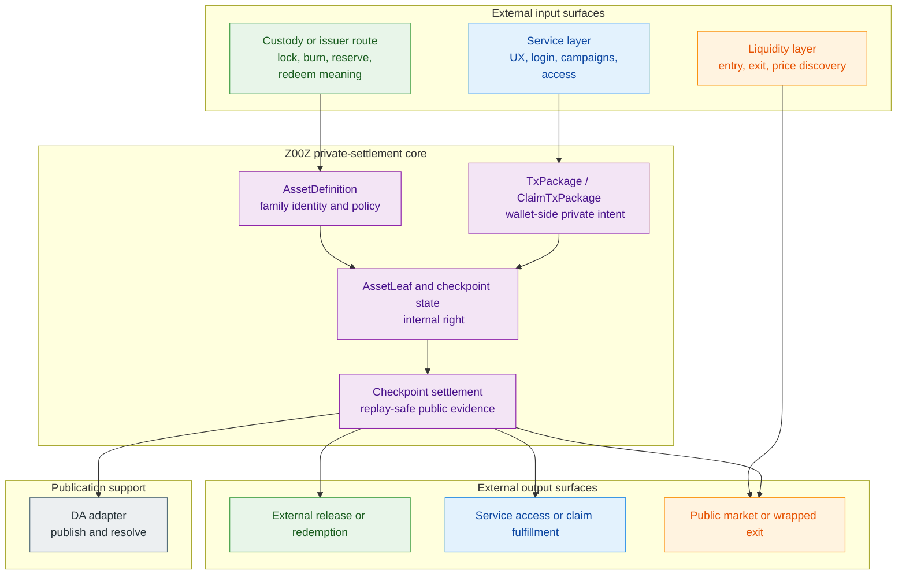
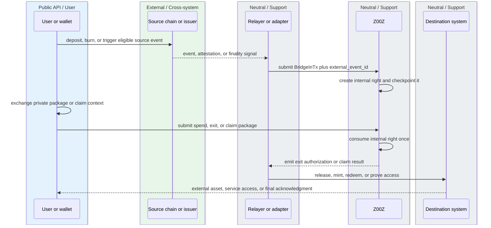
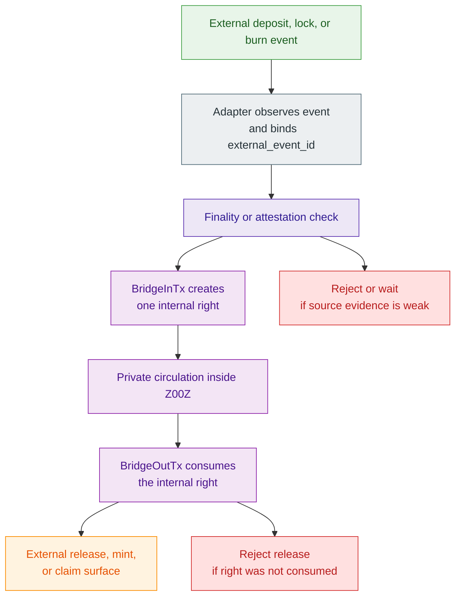
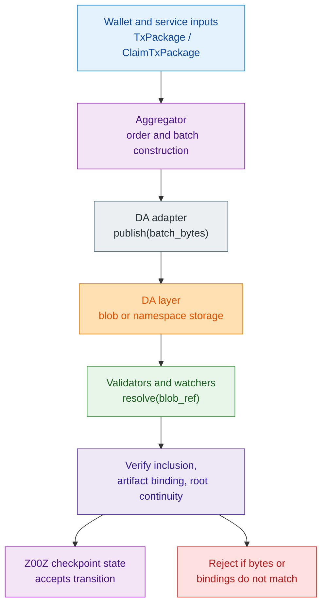
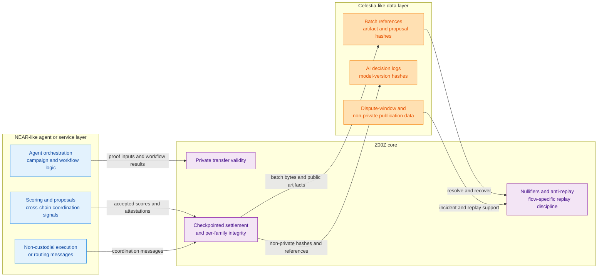
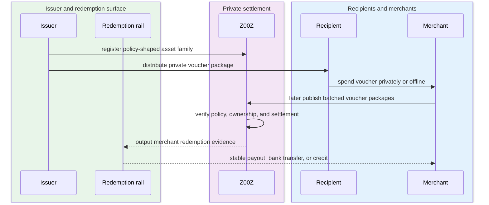
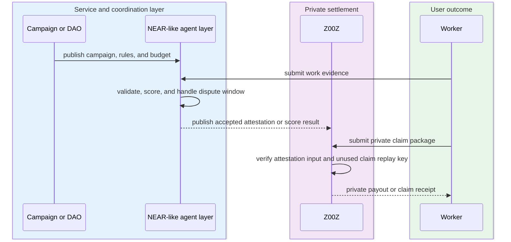
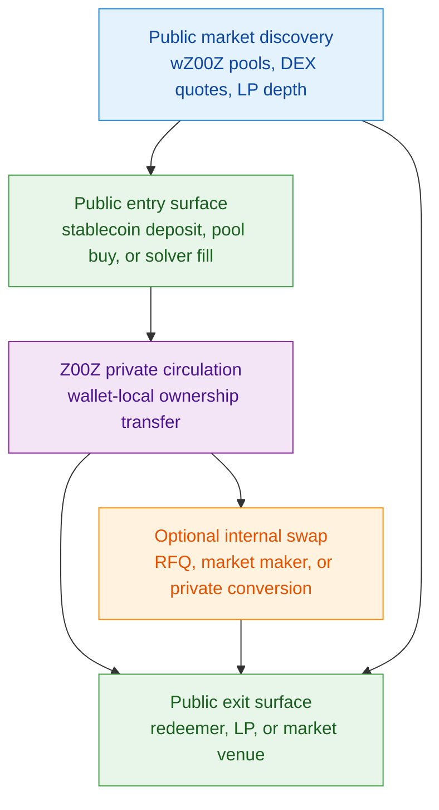

# Z00Z Cross-Chain Integration Whitepaper

[TOC]

Version: 2026-07-09

## Key Terms Used In This Paper

This paper uses a compact integration vocabulary so that readers can distinguish protocol guarantees from external service assumptions without ambiguity. The goal is to keep the cross-chain discussion precise: Z00Z settles private rights, while external systems continue to supply custody, issuance, liquidity, identity, or service logic where those surfaces already exist.

- `AssetDefinition`: The semantic definition of an asset family, including issuer meaning, policy flags, and the intended redemption model.
- `AssetLeaf`: The confidential settlement object that represents one live right inside Z00Z canonical state.
- `content_id`: The asset-family identifier that separates externally backed assets, issuer-native assets, and synthetic internal units.
- `Locker`: An external custody surface that holds an asset outside Z00Z while Z00Z privately transfers the internal ownership right.
- `LockerID`: The internal right that represents control over an externally custodied asset without exposing a public reassignment graph.
- `BridgeInTx`: The integration-side transition that materializes an internal private right after an external deposit, lock, burn, or attested source event.
- `BridgeOutTx`: The integration-side transition that consumes the internal private right and authorizes external release, mint, or redemption.
- `Attestation`: External proof material that confirms a deposit, burn, work result, policy event, or other imported fact.
- `DA adapter`: The publication interface that writes and resolves Z00Z batch data without becoming a settlement authority.
- `Service layer`: Any external system that adds UX, identity, coordination, liquidity, or access control without replacing Z00Z settlement truth.

## 1. Why Cross-Chain Integration?

Cross-chain integration is not an admission that Z00Z must become dependent on other chains for its protocol identity. It is the opposite: it is the consequence of keeping the Z00Z protocol boundary narrow. The archived integration thesis is consistent on this point. External ecosystems already host real assets, issuer trust, liquidity venues, consumer account surfaces, merchant applications, and redemption rails. Z00Z does not improve its privacy model by pretending all of those functions should be rebuilt inside one monolithic private chain. It improves its privacy model by refusing to make those functions the source of settlement truth.

The right way to read cross-chain integration in Z00Z is therefore not "how do we make every external token exist everywhere at once." The right question is **where should public asset custody stop and where should private ownership reassignment begin**. The answer proposed in the source material is disciplined: external systems keep the public-facing layers they already do well, while Z00Z becomes the private settlement layer in which ownership rights, claims, vouchers, and payment objects move without exposing a public reassignment graph.

### 1.1 Why Z00Z Integrates Instead Of Replacing Other Chains

Z00Z integrates because other chains already perform important economic jobs that privacy alone does not replace. Ethereum and EVM L2s are useful because they already host stablecoins, custody contracts, liquid markets, and wrapped representations that can be listed on major venues. Sui and Solana are useful because they already provide native asset and object custody surfaces that can be adapted into private ownership flows. NEAR and similar ecosystems are useful because they can operate as application and coordination layers with human-readable accounts, access control, and consumer-facing logic. These systems are not architectural enemies of Z00Z. They are the places where the public world already keeps assets, contracts, and service interfaces.

What Z00Z adds is not another public execution layer competing to host the same balance graph. It adds a private interval between deposit and redemption. Once an external asset has been locked, attested, or otherwise mapped into Z00Z, ownership can move privately inside Z00Z without publishing every intermediate reassignment step to the external custody chain. That is why integration is the correct expansion path. It lets Z00Z use existing public ecosystems for what they already do well without giving up the protocol thesis that confidential possession and replay-safe settlement should remain the core product.

The role split is easier to see in a compact map:

| External surface | What it already does well | Why Z00Z should not replace it |
| --- | --- | --- |
| Ethereum and EVM L2s | Stablecoin custody, public liquidity, wrapped market access | They already host deep markets, visible redemption rails, and standardized token interfaces |
| Sui and Solana | Object or escrow custody, native token wrappers, transferable on-chain objects | They provide chain-native containers that can host externally visible rights while Z00Z keeps transfer private |
| NEAR and similar app layers | Login, account UX, service access, campaign and coordination logic | They are useful as public-facing application surfaces, not as privacy cores |
| External issuers and lockers | Reserve claims, redemption promises, custody operations | Their economic meaning exists outside Z00Z and must remain disclosed as such |

#### External Chains As Asset And Liquidity Hosts

External chains remain important because they are where many economically meaningful things are already anchored. Stablecoins such as USDC and USDT already circulate on public networks. Liquidity already lives in ERC-20 pools, wrapped asset venues, and public routing systems. Issuers already maintain reserve claims, redemption policies, and branded asset families outside Z00Z. Consumer applications already rely on readable accounts, web login surfaces, merchant access systems, and familiar app contracts. None of that disappears just because a private settlement layer exists.

The integration thesis therefore begins by treating these public systems as hosts for assets, custody, liquidity, and service logic. An Ethereum vault may hold the actual token. A Solana escrow account may hold the actual SPL asset. A NEAR application may manage the public subscription surface or campaign registry. Those roles remain public because they are supposed to remain public. What changes is that the right to control or claim the economic value tied to those public anchors can move privately inside Z00Z instead of being reassigned publicly on every hop.

#### Z00Z As Private Ownership Transfer Layer

Z00Z should be understood as the layer that holds and privately transfers the internal right, not as the layer that must always hold the external asset itself. In the source material, that pattern appears repeatedly: a user locks an external asset, an attested entry event creates an internal private object, the object moves privately between wallets, and a later exit consumes that object in order to release or re-mint value outside Z00Z. Between those two public edges, the meaningful thing is not a public token account. It is wallet-local possession of a privately spendable right.

This is also why the whitepaper must describe Z00Z in terms of `AssetLeaf`, `SettlementPath`, checkpoint roots, and replay-safe state transitions rather than in terms of public user balances. The chain sees committed state objects and their settlement evidence. The wallet sees the local ownership logic. Cross-chain integration is valuable precisely because it preserves that division of labor: public systems can see entry and exit, while Z00Z protects the private transfer interval between them.

### 1.2 Design Goals

The design goals for cross-chain integration follow directly from that boundary choice. Integration must not turn Z00Z into a generic bridge marketing layer that hand-waves over custody, redemption, and trust. It must not flatten all private assets into one vague "private dollar" category. And it must not force every external ecosystem into one chain-specific adapter model. The architecture has to be strict enough to say what Z00Z guarantees, strict enough to say what it does not guarantee, and flexible enough to connect to different public systems without losing semantic clarity.

Those goals also keep the integration paper aligned with the main whitepaper. The main Z00Z thesis already emphasizes protocol-versus-service separation, wallet-local possession, and public settlement minimalism. The cross-chain version of that thesis simply adds one more requirement: when an asset or right is imported from elsewhere, the paper must preserve the meaning of that external source instead of hiding it behind a privacy label.

#### Privacy Without Breaking External Asset Meaning

Privacy is only useful here if it does not destroy asset meaning. `USDC@Z00Z` should not be treated as "some private coin that happens to be dollar-like." Its meaning comes from a specific external asset family, a specific custody or issuer route, and a specific redemption path. The same is true for issuer-native private assets and even more so for synthetic internal units. The protocol may hide internal ownership movement, but it must not blur whether the holder ultimately has a claim on locked USDC, on an issuer promise, or on a non-redeemable internal unit.

This is why the source material insists on asset families, `content_id`, and trust tiers. Privacy is attached to transfer and possession. Economic meaning remains attached to asset definition, backing model, and redemption policy. A serious cross-chain paper must keep both layers visible at the same time: confidential movement inside Z00Z, and honest description of what the asset actually means outside it.

#### Honest Separation Of Guarantees And Assumptions

The strongest recurring idea in the archive is that Z00Z must be honest about what belongs to the protocol and what remains external. Z00Z can guarantee that an internal right was not privately reassigned twice, that a checkpointed transition preserved the relevant replay boundary, and that settlement evidence lines up with the protocol's state rules. It cannot by itself guarantee that an external locker remained solvent, that a reserve claim was truthful, that an issuer will redeem on demand, or that a service-layer operator behaved fairly.

That separation is not a weakness. It is the condition for conceptual clarity. The moment the paper starts speaking as if private settlement also proves reserves, custody honesty, or legal redemption, the architecture becomes misleading. The correct framing is narrower and stronger: **Z00Z guarantees private transfer and replay-safe internal settlement; external operators guarantee custody, reserves, redemption, identity, or service behavior where those functions exist.**

#### Composability Across Different Network Types

Cross-chain integration also has to work across different categories of systems. An EVM vault does not look like a Sui object locker. A Solana escrow program does not look like a NEAR paywall contract. A DA layer such as Celestia is not even trying to be a settlement chain for user balances at all. If Z00Z required a different core settlement model for each of those surfaces, the architecture would collapse into adapter-specific special cases.

The more durable approach is to keep one internal settlement language and let adapters translate external events into that language. Deposit events, burn attestations, receiver bindings, imported claims, and service-layer proofs may differ by network, but the internal logic remains the same: create or consume a private right, preserve per-asset integrity, and settle through checkpointed public evidence. That is the level on which composability matters.

## 2. Integration Thesis

The core claim of this paper is simple: **external systems hold assets, contracts, liquidity, identity, or application logic; Z00Z privately moves the right that refers to those external anchors**. That claim is stronger than ordinary bridge language because it changes what the integrated unit actually is. The paper is not primarily about mirrored token balances. It is about private reassignment of a spendable or claimable object that remains meaningful between public entry and public exit.

Once that claim is accepted, the rest of the architecture becomes easier to state correctly. A lock, burn, or attested source event outside Z00Z can create a private internal object. That object can circulate privately through wallet-local possession and checkpointed settlement. A later burn or claim inside Z00Z can authorize release, re-mint, access, payout, or redemption outside Z00Z. This is the same pattern whether the asset is an externally backed stablecoin, an issuer-native private unit, a voucher, a payroll object, or a useful-work claim. The external system still matters. But it no longer needs to publish the whole ownership graph.

### 2.1 External Chains Hold Assets, Z00Z Moves Rights

The most compact way to express the design is this: the public world keeps the asset, the reserve, the contract, or the service surface; Z00Z keeps the private ownership-transfer path. In practice, that means an external chain may continue to store the locked USDC, the wrapped governance asset, the merchant access contract, or the campaign registry. Z00Z does not replace those things. It creates the confidential interval in which the corresponding right can move without advertising every transfer to the public host chain.

This framing is especially important for stablecoins. The source material does not treat USDC, USDT, D7-like assets, DCC-like assets, and SUS-like assets as one unified "private dollar" balance. It treats them as different families whose internal movement can all become private inside Z00Z, but whose external meaning still comes from different issuers, collateral routes, or policy systems. The thing Z00Z standardizes is not the issuer promise. It is the private transfer and settlement discipline.

#### From Token Bridging To Private Ownership Reassignment

Traditional bridge narratives often focus on visible token motion between public chains: lock here, mint there, burn there, release here. That framing is useful for public accounting, but it misses the main reason to use Z00Z at all. If every meaningful reassignment is still visible as a public balance transition somewhere, the system has preserved cross-chain portability without solving the privacy problem. Z00Z changes the unit of transfer from "public mirrored token balance" to "private ownership right linked to an external asset family or claim source."

That change matters because the right can move many times between entry and exit without forcing the custody chain to publish every reassignment. The external host still sees that value entered and later left. What it no longer sees is the full intermediate graph of who held the right, how often it moved, or how it was grouped with other private payments, vouchers, or claims. Cross-chain integration in Z00Z should therefore be described as private ownership reassignment, not as a prettier version of transparent token teleportation.

#### Wallet-Local Possession Between Deposit And Redemption

The economically meaningful interval in this design is the interval between public entry and public exit. After deposit, lock, burn, or attestation, the user does not need the external chain to keep reassigning ownership on every transfer. The right can live as a wallet-local object inside Z00Z. It can be transferred privately, included in batched settlement, used in internal swaps, or converted into another private claim flow before any external redemption occurs.

This is the interval where Z00Z does real work. The external chain still provides the anchor and the final redemption path. But during the life of the internal right, possession is local to the wallet and settlement is narrowed to Z00Z's checkpoint model. That is why the architecture can support cash-like transfer, vouchers, subscriptions, payroll, or private claims without turning the custody chain into a universal source of user-visible ownership history.

### 2.2 Cross-Chain Integration As Service Composition

The source material repeatedly resists the idea that Z00Z should become the place where every surrounding function is absorbed. The better architecture is compositional. The protocol enforces private settlement rules. A locker or issuer route provides the external asset meaning. A DA layer provides publication and recoverability. A service layer provides UX, access control, campaign logic, or application routing. A liquidity venue provides entry and exit depth. These are connected systems, but they are not the same system.

That distinction matters because it prevents category mistakes. A DA provider is not an issuer. A wallet app is not a settlement rule. A bridge observer is not a reserve proof. A NEAR consumer app is not a privacy core. The paper should therefore describe cross-chain integration as a stack of cooperating layers with different trust and failure profiles, not as one magical privacy chain that inherits the guarantees of everything it touches.

The compositional boundary can be stated more directly in one table:

| Layer | What it owns | What it does not prove by itself |
| --- | --- | --- |
| Z00Z protocol | Private right creation and consumption, replay safety, checkpoint settlement, per-asset integrity | Reserve solvency, locker honesty, issuer redemption, app-layer identity or access decisions |
| Custody or issuer route | External asset meaning, reserves, release or redemption mechanics | Internal private transfer correctness inside Z00Z |
| DA layer | Batch publication, recoverability, blob resolution | Whether a Z00Z state transition is semantically valid |
| Service layer | UX, login, subscriptions, campaigns, coordination, access control | Canonical settlement truth inside Z00Z |
| Liquidity layer | Entry and exit markets, price discovery, market-making | Whether any private right was validly created, transferred, or consumed |

**Figure 2.1 - External surfaces around one private-settlement core.** Public custody, service, and liquidity layers remain useful, but they do not replace the Z00Z core that creates, transfers, and settles the private right.

#### Protocol Responsibilities

Inside the protocol boundary belong the things Z00Z must defend directly: canonical asset-family identity, private output creation and consumption, replay-safe state transitions, package validation, checkpoint continuity, and per-asset settlement integrity. The protocol decides whether an internal right was created from an acceptable imported event, whether it was privately transferred under valid conditions, and whether it was consumed only once before exit or claim. It also decides how these events become public settlement evidence.

In other words, the protocol owns the internal truth of the private right. It does not need to own every external fact in order to enforce that truth. It needs a narrow set of imported inputs, clear replay boundaries, and a checkpointed settlement surface that can reject malformed or duplicated transitions. That is the point at which Z00Z remains sovereign even while integrating outward.

#### Service-Layer Responsibilities

Outside the protocol boundary remain the functions whose meaning is inherently external: custody contracts, reserve attestations, issuer operations, routing UIs, merchant portals, readable account systems, consumer subscriptions, campaign registries, anti-sybil inputs, work validation flows, and public liquidity venues. These systems can be deeply important to the user experience and to the economic utility of an asset family. They are still not consensus truth inside Z00Z.

This is why the paper can simultaneously describe NEAR as a valuable application layer, Celestia as a valuable publication layer, and EVM systems as valuable custody and liquidity layers without confusing any of them with the Z00Z protocol itself. Service composition is a feature here, not a compromise. It lets the ecosystem stay modular while the settlement core stays disciplined.

### 2.3 Asset Families Instead Of Token Equivalence

Cross-chain privacy becomes misleading very quickly if every stable or payment-like object is described as if it were the same asset in different wrappers. The archive explicitly argues against that shortcut. Different stable asset families may all move privately inside Z00Z, but they do not carry the same trust assumptions, redemption guarantees, or legal meaning. An externally backed wrapper refers to locked collateral or an external issuer rail. An issuer-native asset refers to a particular issuer promise defined inside Z00Z. A synthetic internal unit may refer to no external redeemability at all.

For that reason, the paper should center asset families instead of token equivalence. What unifies the families is the Z00Z transfer model. What differentiates them is the backing model, the issuer domain, the redemption path, and the trust tier. Privacy applies across all of them. Economic meaning does not.

The distinction between the three main families is central enough to summarize explicitly:

| Asset family | Example framing | Where meaning comes from | What Z00Z guarantees | Main external dependency |
| --- | --- | --- | --- | --- |
| Externally backed | `USDC@Z00Z` backed by locked or attested external USDC | External custody or issuer rail | Private transfer of the internal right and replay-safe settlement | Custody solvency, reserve integrity, exit execution |
| Issuer-native | `SUS@Z00Z` or other issuer-defined private unit | Issuer definition and issuer redemption promise | Private transfer after valid mint and checkpoint settlement | Issuer policy, supply discipline, redemption credibility |
| Synthetic internal | Non-redeemable internal accounting or incentive unit | Internal definition only | Private transfer within its own rules | Correct disclosure that no external redemption claim exists |

#### Why `USDC@Z00Z` Is Not The Same As `SUS@Z00Z`

`USDC@Z00Z` and `SUS@Z00Z` may both appear as privately transferable payment assets, but they should not be explained as interchangeable variants of one protocol-native dollar. `USDC@Z00Z` is meaningful only if it maps back to a specific external custody or issuer route for USDC. Its credibility depends on that external route remaining valid. `SUS@Z00Z`, by contrast, is meaningful because an issuer defines and stands behind an asset family directly in Z00Z, even if reserves or settlement outside Z00Z are used to support redemption in practice.

The transfer mechanism can look similar inside Z00Z while the economic promise remains different. That is exactly why the asset-family model is necessary. The paper must not let privacy flatten economically distinct objects into one semantic category merely because they share a unit-of-account target.

#### Naming, `content_id`, And Trust-Tier Disclosure

The archive points toward a simple discipline for avoiding that confusion: keep asset naming and registry design explicit. A private asset should carry a stable family identity through `content_id`, issuer domain, and user-facing naming that signals whether the asset is externally backed, issuer-native, or synthetic. That identity is not a cosmetic label. It is the handle by which wallets, operators, and users understand what a holder ultimately has a claim on.

Trust-tier disclosure follows from the same rule. If an asset depends on external collateral, say so. If it depends on an issuer promise, say so. If it has no redemption claim outside Z00Z, say so. The privacy property of Z00Z transfer is powerful, but it should never be allowed to hide the economic boundary of the asset itself.

### 2.4 From Cash To Private Cross-Chain Rights

Digital cash is the cleanest first use case because it is easy to see why users want a private transfer interval between public entry and public exit. But the same structure can carry more than payment coins. Once Z00Z is understood as a layer for privately transferring rights that later settle through checkpointed evidence, the category naturally widens. A right may represent a stable asset, a voucher, a reward claim, a payroll distribution object, a subscription-linked payment credential, or authority over an externally custodied asset.

The source material is especially clear that this generalization should stay disciplined. Z00Z is not being described as a place where every workflow fully executes. It is being described as a place where the private right moves. Execution, redemption, access, validation, and user-facing logic may continue outside. That is the architectural bridge between the cash thesis and the broader cross-chain integration thesis.

#### Stablecoins, Vouchers, Claims, And Subscriptions

Stablecoins are only the first member of a broader family of privately transferable objects. The archive extends the same logic to local-economy vouchers, aid distribution units, reward claims, and subscription or paywall flows. In each case, the pattern is the same. A bounded right is defined. The right is held and transferred privately in Z00Z. A later event outside Z00Z may redeem it, verify it, accept it, or convert it into access.

This is a better fit for Z00Z than trying to make the protocol itself become the full merchant system, the full social login system, or the full attestation marketplace. The protocol carries the right privately. External systems decide how that right is consumed in public economic or service environments.

#### Enterprise And Agent-Mediated Workflows

The same logic extends naturally to higher-order workflows. A payroll object is still a right to value that should not expose the whole salary graph publicly. A B2B clearing object is still a right to settlement that benefits from private netting before a smaller final publication event. A useful-work payout claim is still a right that can be created only after an external validation process and then claimed privately inside Z00Z.

What changes across these examples is not the core settlement model. What changes is the external context around the right: enterprise accounting, merchant redemption, campaign validation, or service access logic. This is why the paper should treat enterprise and agent-mediated flows as expansions of the same rights-transfer architecture rather than as unrelated side products.

## 3. Canonical Integration Objects

Cross-chain integration is easiest to misunderstand when everything is described with the loose language of "bridged tokens." Z00Z needs a stricter object vocabulary. Some objects already belong to the live settlement core described in the main whitepaper. Other objects belong to the integration architecture that maps external events into that settlement core. The paper must separate those layers carefully. Otherwise readers will confuse external custody references with internal settlement state, or treat pre-publication package movement as if it were already canonical state transition.

The most important distinction is this: **Z00Z settles confidential internal rights through a typed object graph, while adapters translate external deposits, burns, claims, and attestations into that graph**. The internal graph is where replay-safe state continuity is enforced. The adapter layer is where external meaning is imported. Both matter, but they do different jobs.

### 3.1 Core Settlement Objects

The core settlement objects are the same objects that make the main Z00Z architecture legible: asset definitions, committed confidential leaves, wallet transport packages, and checkpoint-coupled evidence paths. Cross-chain integration does not replace them. It depends on them. The reason a locker, attestation route, or service-layer proof can be imported at all is that Z00Z already has a narrow internal settlement language into which these external facts can be translated.

For the purposes of this paper, the most important consequence is that external integrations should terminate in canonical Z00Z objects rather than inventing special-case state models. An external deposit does not become "some custom bridge balance." It becomes a private asset-family instance inside the same settlement discipline as any other privately spendable object. That is what keeps the integrated system coherent.

The core object set can be kept compact:

| Object | Visibility locus | Primary job | Becomes authoritative at |
| --- | --- | --- | --- |
| `AssetDefinition` | Canonical semantic registry | Defines family meaning, issuer scope, and policy context | When an asset family is recognized by protocol and wallet rules |
| `AssetLeaf` | Public committed state | Carries one live confidential settlement right | Canonical state at the checkpoint boundary |
| `TxPackage` | Wallet-side transport | Carries ordinary private transfer intent before settlement | Package verification first, then checkpoint inclusion |
| `ClaimTxPackage` | Wallet-side transport | Carries claim-domain intent and replay-bound claim context | Claim verification first, then checkpoint inclusion |
| Checkpoint evidence | Public settlement boundary | Binds package intent to root continuity and typed state transition | Final checkpoint acceptance |

#### `AssetDefinition` As The Semantic Root

Every integrated asset family begins with semantic definition before it begins with private circulation. `AssetDefinition` is the place where that meaning belongs. In the cross-chain setting, that includes more than fungibility and cryptographic versioning. It also includes issuer domain, policy flags, family identity, and the intended interpretation of redemption or claim behavior. Without that semantic root, a private asset may move correctly while still being economically ambiguous.

This is especially important because the archive distinguishes three stable-asset modes: externally backed wrappers, issuer-native assets, and synthetic internal units. Those are not merely three UX categories. They are three different semantic families. `AssetDefinition` is what allows the paper to say that an internal object belongs to one of those families before a particular `AssetLeaf` is ever created for a holder. In other words, private settlement begins with a meaning boundary, not just with a commitment.

#### `AssetLeaf` As The Private Settlement Object

`AssetLeaf` is the committed settlement object that actually lives inside Z00Z canonical state. In cross-chain integration, that point matters even more than it does in the base whitepaper. When an external asset is locked or an issuer-native asset is minted, the resulting internal object is not a public account balance on the source chain and not a mirror of a public token account. It is an `AssetLeaf` under Z00Z's own state rules, with confidential payload fields and replay-safe settlement handled by Z00Z.

That is the object that can later be recognized and spent privately by the wallet. The public chain sees that a leaf exists, that a path was consumed or created, and that the checkpointed transition is valid. It does not see a reusable public identity for the holder. This is why the paper should keep saying that Z00Z transfers private rights rather than public token balances. The live settlement object is already designed for that narrower role.

#### `TxPackage` And `ClaimTxPackage` As Wallet Transport

`TxPackage` and `ClaimTxPackage` matter because private movement begins before final publication. A wallet needs a portable object that carries spend or claim intent, references what is being consumed, defines what is being created, and can later be checked against settlement rules. Those package families are the bridge between wallet-local possession and public checkpoint settlement. They are not the same thing as canonical state, but they are the means by which canonical state is proposed and later verified.

The distinction is critical in cross-chain workflows. An externally sourced right may be created in response to a deposit event, transferred privately through package exchange, and only later enter a checkpointed publication path. A claim-based reward may similarly depend on an externally validated condition before a `ClaimTxPackage` can produce a private output. In both lanes, packages are wallet transport and settlement candidates. They do not become authoritative until the checkpoint boundary accepts the resulting transition.

### 3.2 Integration-Specific Objects

The core settlement graph is not sufficient on its own to explain cross-chain meaning. The paper also needs a smaller set of integration objects that sit around the live core and tie external events to internal state. Some of these names are architecture-level names from the archive rather than existing canonical live repository types, but the distinction is useful because it tells readers what an adapter must track before Z00Z can settle anything privately.

These integration objects do not replace `AssetLeaf`, packages, or checkpoints. They explain how something outside Z00Z becomes eligible to create or consume those internal objects. That includes custody-linked rights, entry and exit transitions, imported event identifiers, and mapping data that says which external family corresponds to which internal family.

These paper-level integration objects can be summarized just as narrowly:

| Integration object | Role in the flow | Anchored in | Why it exists |
| --- | --- | --- | --- |
| `LockerID` | Names the privately transferable right over an externally custodied asset | External vault or custody slot plus Z00Z internal family identity | Separates public custody from private reassignment |
| `BridgeInTx` | Converts an eligible external event into an internal private object | External deposit, burn, or attested source event | Makes import explicit and replay-safe |
| `BridgeOutTx` | Consumes the internal right and authorizes external effect | Z00Z spend proof plus external destination semantics | Makes exit explicit and one-directional |
| `external_event_id` | Identifies the imported event that must not be replayed | Source-chain logs, issuer attestations, or adapter proofs | Prevents duplicate mint or duplicate claim |
| Attestation input | Imports non-token facts into Z00Z claim or mint logic | Issuer, oracle, campaign, or service proof surface | Lets external facts enter the settlement model without becoming generic chain balances |
| Mapping registry | Connects external asset references to internal families | Governance, issuer registry, or adapter metadata | Preserves semantic identity across chains |

#### `LockerID`, `BridgeInTx`, And `BridgeOutTx`

The archive repeatedly uses the locker pattern to show how an externally custodied asset should enter the Z00Z world. A locker or vault holds the external asset on its host chain. Z00Z then carries an internal right that represents authority over that externally anchored value. `LockerID` is a useful name for that idea: an internally transferable right over an external custody slot without a public reassignment graph on the custody chain.

`BridgeInTx` and `BridgeOutTx` then describe the two integration edges of that lifecycle. `BridgeInTx` is the structured transition that materializes a private internal object after an external lock, burn, or attested source event. `BridgeOutTx` is the structured transition that consumes that internal object and authorizes external release, mint, or redemption. Whether those names remain paper-level names or become concrete implementation names later, they are the correct conceptual edges for the integration model.

#### `external_event_id`, Attestations, And Replay Inputs

Cross-chain privacy is meaningless if import and exit boundaries can be replayed. That is why the archive emphasizes event IDs, nullifier-like replay keys, attestation inputs, and claim-domain anti-replay logic. The purpose of an `external_event_id` or equivalent imported replay key is simple: one external deposit, burn, or validation event must not create more than one internal right unless the asset model explicitly allows it. The same principle applies on exit and on externally driven claim flows.

Attestations matter for the same reason. Some external facts are not represented as raw token transfers. A useful-work claim, a native issuer burn-and-mint rail, or an external scoring result may enter Z00Z through proof material rather than through direct custody observation. But once imported, these facts still need replay-safe binding to Z00Z's internal state transition model. The source of the fact may differ. The replay discipline cannot.

#### Issuer Domains, Asset Registries, And Mapping Tables

Integration also requires a stable naming and mapping layer. An adapter needs to know which external token, issuer family, or custody path corresponds to which internal asset family. A wallet needs to know whether a private object belongs to an externally backed route, an issuer-native route, or a synthetic route. Governance and user interfaces need to know what is being listed, labeled, or disclosed. That is why issuer domains, asset registries, and mapping tables are not optional metadata. They are part of the semantic safety of the system.

This is also where the paper prevents semantic drift. A `content_id` is not just a hash label on an otherwise generic private coin. It is the anchor that allows a holder, operator, or verifier to say which family this private object belongs to and what external meaning the family carries. In a multi-chain, multi-issuer world, that identity layer is part of correctness.

### 3.3 Cross-Chain State Transition Model

The cross-chain lifecycle is easiest to reason about as a state machine with three phases: external entry, private internal movement, and external exit or claim. The important thing is that the state machine changes form at the boundary. Outside Z00Z, the system reasons about locked assets, burns, custody contracts, merchant contracts, service proofs, or attestation issuers. Inside Z00Z, it reasons about private rights, package flows, and checkpointed settlement objects.

That change in form is the core of the architecture. A user does not keep reusing the source chain as the authoritative record of every ownership change. Once an entry condition is satisfied, Z00Z becomes the authoritative settlement environment for the internal right. Later, when exit or redemption occurs, the state machine hands authority back to the external system for the final public effect.

The three-phase model is clearer in table form:

| Phase | External system role | Z00Z role | Main question |
| --- | --- | --- | --- |
| Entry | Confirms a deposit, burn, custody event, or attested source fact | Creates the eligible internal private right | Was the imported event real, final enough, and replay-safe? |
| Private circulation | Remains mostly passive while the right moves privately | Transfers, verifies, and settles the internal right through packages and checkpoints | Did the right move correctly without revealing the public reassignment graph? |
| Exit or claim | Releases, redeems, mints, grants access, or accepts the final public effect | Consumes the internal right and authorizes the external consequence | Was the right consumed exactly once before external effect? |

**Figure 3.1 - Deposit, private circulation, and exit sequence.** The runtime order matters: external systems originate or receive public effects, while the privacy-preserving ownership interval lives inside the Z00Z package and checkpoint path.

#### Deposit, Private Transfer, And Exit Lifecycle

The archived stablecoin flow provides the canonical example. First, an external event occurs: tokens are locked in a vault, burned on an issuer-native rail, or otherwise attested as eligible input. Second, that event is translated into a private internal object with a specific asset-family identity, receiver binding, and replay key. Third, that internal object moves privately inside Z00Z through normal wallet and checkpoint mechanics. Finally, a burn, claim, or exit consumes the internal object so that a public release, mint, redemption, or service action can occur outside Z00Z.

This lifecycle is broader than stablecoins. A voucher follows the same shape. A payroll right follows the same shape. A useful-work payout claim follows the same shape. The external trigger differs, the redemption context differs, and the asset semantics differ. The state transition pattern remains the same: public entry, private circulation, public effect.

#### Internal Spend Safety Versus External Release Finality

One reason this model must be stated carefully is that internal settlement finality and external release finality are not the same event. Z00Z can prove that an internal right was consumed exactly once under its checkpoint rules. That does not automatically mean the foreign chain has already released collateral, finalized a mint, or accepted a merchant redemption. The opposite is also true: an external event may be final on its host chain before Z00Z has finished its own publication and settlement cycle.

The architecture therefore needs a two-boundary vocabulary. There is internal spend safety inside Z00Z, and there is external effect finality on the destination system. Good cross-chain design keeps them linked, but it does not collapse them into one vague notion of "bridge success." This matters for user communication, for relayer logic, and for failure handling later in the paper.

### 3.4 Multi-Asset Integrity Rules

Once several asset families can circulate privately at once, privacy is no excuse for semantic or accounting collapse. The archive is explicit that stablecoin families do not automatically merge into one hidden balance pool. Different assets may share the same transfer model and the same wallet experience, but they still need separate accounting rules, separate family identity, and separate inflation boundaries. Cross-chain privacy must therefore preserve per-family integrity, not just aggregate confidentiality.

This is also where the paper avoids a subtle mistake. A private system can hide amounts and still accidentally hide inflation, cross-family leakage, or issuer confusion if the accounting rules are not defined carefully. That is why the integration model needs explicit per-family balance preservation, explicit swap framing, and explicit fee boundaries.

The accounting boundary is easy to blur unless it is stated explicitly:

| Situation | Correct interpretation | What must remain separate |
| --- | --- | --- |
| Private transfer within one family | Conservation of that family under its own rules | Holder privacy and family accounting are different concerns |
| Movement from one family to another | A swap, conversion, or issuer action | Asset identity, pricing, and redemption meaning |
| Fee abstraction | UX may hide fee complexity from the user | Native protocol fee logic and quoted user payment asset |
| Issuer-controlled mint or burn | A governed or issuer-defined state change | Ordinary wallet-to-wallet transfer semantics |

#### Per-`content_id` Balance Preservation

The archive proposes the right rule: integrity is enforced per `content_id`. If a transaction consumes 100 units of one family, it must recreate 100 units of that same family except where the rules explicitly allow fees, burns, or issuer-controlled changes. The same applies independently to every other family in the transaction. This is what prevents a private multi-asset transaction from quietly converting one family into another through protocol ambiguity.

Per-family balance preservation is especially important in a world of mixed stable assets. Externally backed units, issuer-native units, and synthetic units may all circulate privately, but they cannot share one undifferentiated hidden accounting surface. The system should be private about holders and flows, not vague about which asset was conserved.

#### Swaps As Market Actions, Not Protocol Conflation

When one private asset family becomes another, the correct interpretation is a swap, not protocol magic. The archive makes this point directly for D7-like, DCC-like, and SUS-like assets. If a user gives one family and receives another, a market maker, issuer route, or pricing surface must explain the conversion. The protocol's job is to preserve each family's integrity and settle the multi-asset transition correctly. It is not the protocol's job to declare that different issuer or collateral models are secretly the same asset.

This distinction protects both technical correctness and economic honesty. Privacy lets the swap happen without exposing the whole trading graph publicly. It does not abolish price, spread, redemption difference, or trust difference. The paper should keep that boundary sharp from the start.

## 4. Cross-Chain Asset Models

Cross-chain integration only becomes readable if the paper names the asset models clearly. The source material repeatedly returns to three stable families because they solve different problems and expose different risks. Some private assets are anchored by collateral or token custody outside Z00Z. Some are issued natively inside Z00Z by an identified issuer that still controls supply and redemption meaning. Others are intentionally synthetic internal units that do not promise external redemption at all. These families can all circulate privately, but they should never be collapsed into one vague "private dollar" abstraction.

That distinction matters for both technical correctness and user honesty. The protocol can protect private transfer in all three cases. It cannot make an external locker more solvent than it is, cannot make an issuer more honest than it is, and cannot turn a synthetic internal unit into a redeemable stable asset by labeling it optimistically. The paper should therefore classify each family by origin of backing, redemption path, and trust surface before discussing integration flow.

### 4.1 Externally Backed Assets

Externally backed assets are the cleanest first example because they follow the core thesis almost literally. The external chain or reserve system continues to hold the economically meaningful asset. Z00Z does not pretend to replace that custody surface. Instead, a confirmed deposit, lock, or attested burn event becomes the input that allows Z00Z to create a private internal right with a specific `content_id`. Once that right exists, value can move privately inside Z00Z even though the public anchor remains outside it.

This family is especially useful for stablecoins and other already-liquid public assets. A user can lock ERC-20 USDC, a Sui coin object, or a Solana escrowed token outside Z00Z and then carry the corresponding right privately inside Z00Z without exposing every subsequent reassignment. What matters is that the imported right remains explicitly tied to the source family. `USDC@Ethereum -> Z00Z` is not just "100 private dollars." It is a private right whose meaning still depends on a specific external asset and a specific release path.

#### Lock-And-Mint Deposit Flow

The entry flow begins outside Z00Z. A user deposits into a locker, triggers a native issuer burn-and-attest route, or otherwise satisfies a source event that an adapter is allowed to import. The adapter then has to bind four things before Z00Z should mint anything: the external event identity, enough finality or attestation to trust that the event happened once, the asset-family mapping, and a receiver binding that tells Z00Z which wallet should be able to recognize the resulting private right. Without those four pieces, a "bridge in" is just unaudited event gossip.

Replay safety is the decisive discipline at this boundary. One deposit event must not mint two internal rights. That is why the archive emphasizes imported event identifiers, receiver-bound replay keys, and a one-time conversion into a specific internal family. The external asset remains public and externally visible. The internal right remains private. The bridge event is the one place where both surfaces have to agree on identity and one-time import semantics.

#### Private Transfer Inside Z00Z

Once imported, the externally backed asset behaves like any other Z00Z private right under its own family rules. The custody chain does not need to witness every transfer. Wallets exchange and settle private packages; checkpoints record only the committed transition evidence. The public world can still see that some externally backed value entered the system, and later that value may leave the system, but it does not learn the full intermediate ownership graph.

This private interval is the main reason to integrate instead of simply bridging balances between public chains. The external host sees the visible custody edges. Z00Z carries the private reassignment interval between those edges. That makes externally backed assets suitable for private transfer, payroll-like flows, vouchers, merchant settlement, and internal swaps, while keeping the source asset meaning intact.

#### Burn-And-Release Exit Flow

Exit has to be modeled more strictly than ordinary private transfer because it crosses back into a public release surface. The internal right must be consumed first, and the release path must be authorized only from that consumed state. In other words, the protocol should treat exit as **burn before release**, not as "release now, reconcile later if convenient." That invariant is the most valuable security lesson to preserve from the older cross-chain notes: once a right is exported, released, or made claimable outside Z00Z, the corresponding internal right must no longer remain live inside Z00Z.

This is also where privacy pressure returns. Entry and exit are visible on the external system, so tight timing, identical amounts, or direct user-controlled withdrawal addresses can create correlation risk. The archive is therefore right to treat batching, delayed release windows, and liquidity-provider exits as privacy-improving options rather than as cosmetic UX ideas. Z00Z can make internal transfer private. It cannot make a public exit stop being public. The job of the integration architecture is to narrow what that public edge reveals.

### 4.2 Issuer-Native Assets Inside Z00Z

Issuer-native assets invert the externally backed pattern. The asset is born inside Z00Z rather than arriving from an outside locker. Its first authoritative supply surface is an issuer-controlled policy inside the private settlement system. That does not mean the asset is ungrounded. The issuer may still point to reserves, bank rails, merchandise, service obligations, or redemption rights outside Z00Z. What changes is where mint authority begins.

This model is attractive for organizations that want native private circulation rather than a wrapped version of some pre-existing public token. It is also the family that most clearly requires disciplined separation between protocol guarantees and issuer promises. Z00Z can enforce private transfer, replay safety, and family integrity. It cannot prove reserves merely because an issuer minted an internally private stable asset and wrote reassuring metadata around it.

#### Mint Authority, Supply Policy, And Reserve Claims

An issuer-native asset should begin with an explicit `AssetDefinition` that names the family, the issuer domain, the supply policy, and the intended redemption model. The paper should assume that minting is governed, signed, and tied to clearly stated policy flags such as whether the family is mintable, burnable, issuer-redeemable, or supply-capped. Without those definitions, a private issuer asset can circulate correctly while still being semantically under-specified.

Reserve claims, collateral promises, or legal wrappers may still matter, but they remain external to protocol truth. The right way to describe them is as disclosed backing assertions, not as protocol-proven facts. A serious cross-chain whitepaper should resist the temptation to imply that issuer-native privacy equals trustless reserve verification. It does not. It means the asset moves privately inside Z00Z while supply and redemption meaning remain attached to issuer policy.

#### Redemption Meaning And Issuer Risk

Redemption credibility in this family depends on the issuer's willingness and ability to honor the asset. That may mean redeeming into fiat, public stablecoins, goods, services, or other obligations. The exact form can vary. What must not vary is the paper's honesty about where the risk sits. A holder of an issuer-native private asset is relying on the issuer's reserve discipline, governance process, legal wrapper, and operational competence. Z00Z settles the transfer. The issuer provides the economic promise.

That makes issuer-native assets appropriate when privacy of circulation matters more than inheriting an already public liquidity surface. They are especially relevant for private business settlement, internal treasury units, merchant rails, club or membership economies, and other environments where the issuer wants native private control over minting and redemption. They are less appropriate when a user expects the protocol itself to prove external solvency.

### 4.3 Synthetic Internal Units

Synthetic internal units are the family that most benefits from blunt language. They are useful precisely because they do **not** need to promise external redemption. A system may need internal accounting units, campaign budgets, grant credits, vouchers, reputation-tied reward points, bounded game money, or temporary quote units. None of those are invalid concepts. They only become dangerous when they are marketed as though they carry the same redeemability meaning as collateral-backed or issuer-native stable assets.

By keeping synthetic units explicit, the protocol gains flexibility without semantic fraud. Z00Z can host private multi-asset activity even when some assets are purely internal instruments. The key is that the naming, UI, and documentation make this unmistakable. A synthetic unit can be valuable, transferable, and useful. It is simply not the same type of promise as a locked stablecoin or an issuer-redeemable asset.

#### Correct Labeling For Non-Redeemable Assets

The naming rule should be conservative: if an asset is not redeemable through an external locker, issuer promise, or formally declared conversion path, the paper should not let it inherit the language of "stablecoin" by implication. Synthetic units should be labeled as synthetic, internal, voucher-like, or bounded-purpose units. Wallets should expose that distinction visibly, and documentation should state whether any external claim exists at all.

This is more than branding hygiene. It protects users from silently confusing transfer privacy with redemption certainty. Privacy can hide holders and flows. It cannot create collateral. The whitepaper should preserve that sentence in substance throughout the asset-model section.

#### Appropriate Use Cases For Synthetic Units

Synthetic units fit best where the objective is coordination, accounting, or bounded incentive design rather than a generalized public redeem path. The archive points to internal accounting, incentives, games, grants, and local experiments; the broader Z00Z thesis adds vouchers, campaign credits, private access passes, and other rights-like units that benefit from confidential movement without demanding public stablecoin semantics.

This family is also useful as a safety valve for experimentation. A project can test local private economies, service access credits, or incentive loops without pretending to have solved reserve management. The result is a healthier document and a healthier ecosystem boundary: some assets are promises about money, and some assets are private instruments for coordination. The paper should say which is which.

### 4.4 Asset Family Interoperability

Private multi-asset circulation is valuable only if it preserves family boundaries. The archive is explicit that D7-like, DCC-like, SUS-like, and externally backed dollar assets should not collapse into one silent accounting pool. They may all circulate inside one privacy system, and a wallet may present them through similar transfer ergonomics, but each family still carries different redemption meaning, different trust assumptions, and possibly different pricing.

#### Private Swaps Between Stable Asset Families

When one family becomes another, the correct interpretation is a swap, conversion, or issuer-defined state change. It is not protocol-level proof that both families were always equivalent. If a user gives one family and receives another, a market maker, a quoted route, an issuer conversion policy, or some other explicit pricing surface must explain the transition. The protocol's role is narrower: preserve each family's balance under its own `content_id`, settle the packages correctly, and keep the transfer private.

That discipline is important because privacy can otherwise hide conceptual mistakes as easily as it hides counterparties. A private swap should conceal the trading graph, not erase price, spread, reserve difference, or redemption difference. In a serious whitepaper, private settlement and economic equivalence remain separate concepts.

#### Fee Abstraction Versus Fee Asset Sovereignty

Fee abstraction is one place where the paper should be careful not to accidentally muddle asset identity. A relayer or wallet may quote user-visible fees in a stable asset or subsidize the protocol fee path for usability. That is a service-layer convenience. It does not imply that the native protocol fee and the user-facing payment asset have merged into one sovereign accounting surface.

The clean way to describe this is simple: the user may experience "paying the fee in SUS" or "paying the fee in a wrapped stable asset," while under the hood a relayer converts or sponsors the actual protocol fee requirement. That keeps UX flexible without blurring which asset family secures protocol economics and which family the user happened to spend for convenience.

## 5. Lockers And External Custody

The locker model is the clearest expression of the integration thesis because it draws one hard line through the architecture. The external system keeps the asset in public custody. Z00Z keeps the privately transferable right that governs who can ultimately reclaim that asset. Everything interesting happens at that seam. If the seam is described honestly, readers can understand what the protocol proves and what it still has to trust.

A locker is therefore not "the protocol in another chain." It is an optional external custody surface that exposes a public deposit and release boundary. The protocol remains Z00Z's private settlement machinery. The locker remains the place where the outside world can see that a real asset was parked, and later that some authorized release occurred.

### 5.1 Locker Thesis

The central insight of the locker thesis is that custody and ownership transfer do not have to live in the same public place. A public vault or escrow contract can continue to hold the collateral, while the authority to claim that collateral can move privately inside Z00Z. That is more precise than ordinary bridge rhetoric because it says exactly which part remains public and which part becomes private.

The paper should also be explicit that "locker" is an architecture term, not a promise that one custody implementation fits every chain or every trust model. A locker may be an ERC-20 vault, a Move object, a Solana escrow program, or an issuer-operated attestation rail that plays the same practical role. The unifying feature is not identical code. It is the existence of an external custody or source event that can be mapped into one private internal right.

#### External Vaults As Optional Service Surfaces

Lockers should be treated as optional service surfaces because they do not define canonical settlement truth inside Z00Z. Their job is narrower: hold assets, emit auditable deposit and release events, and expose a public boundary that an adapter can observe. Once a deposit has been translated into an internal right, the locker does not continue to author every private movement. Z00Z does.

This framing prevents a common conceptual mistake. If the locker is described as though it were the protocol, then every custody operator assumption starts to sound like a protocol guarantee. The correct framing is the opposite. The locker is one public service boundary. The protocol is the private settlement engine that uses that boundary as input.

#### Private Control Of Custodied Assets Through `LockerID`

`LockerID` is a useful paper-level name for the privately transferable right over a custody slot or externally anchored asset position. The external vault keeps the actual asset. The `LockerID`-style internal object keeps the authority to decide who may eventually exit that position. That means the economically meaningful right can move many times without the public custody chain having to publish every reassignment.

The important nuance is that `LockerID` should be read as an integration noun, not as a claim that the live repository has already frozen that exact type name everywhere. Its purpose in the paper is to keep the explanation clean: one public custody anchor, one private internal right, one later release path. That vocabulary is more honest and more useful than speaking in loose bridge metaphors.

### 5.2 Locker Lifecycle

The locker lifecycle has three operational phases: observe the deposit or source event, mint the internal right once, and consume that right before authorizing external release. Stating those phases explicitly is not just a documentation convenience. It is how the paper keeps replay, double-mint, and double-release risks visible.

#### Deposit Observation And Attestation

The lifecycle begins with deposit observation. A locker event, burn attestation, or equivalent source fact has to be noticed, tied to a unique event identity, and judged final enough for import. The adapter or relayer may perform this observation, but the paper should describe the process as evidence gathering rather than as blind trust in a bot. A valid import needs event identity, family mapping, destination binding, and enough finality or attestation quality to justify creating one internal right.

This is also where heterogeneous chains can differ without changing the core rule. An EVM locker may expose logs and transaction finality. A native issuer rail may expose a signed attestation. An object-oriented chain may expose an object event. The input format changes. The requirement to bind a unique imported event does not.

#### Minting The Internal Ownership Right

Once the source event is accepted, the adapter translates it into one internal family instance under the correct `content_id`. At this point the external asset remains where it was locked or acknowledged, while the holder receives a private internal right inside Z00Z. That right is now the thing that can circulate. The source chain does not need to know where it goes next.

The archive's stablecoin flow is valuable here because it makes the mint boundary concrete. The external event does not create a public mirror balance. It creates a private settlement object with receiver binding and anti-replay context. This is the point where the protocol stops being about external custody mechanics and starts being about private reassignment under checkpoint rules.

#### Burning The Right And Releasing The External Asset

Redemption must consume the internal right before any external asset becomes freely available again. This is the core one-way safety boundary of the locker model. A release flow that can happen without prior internal consumption is effectively inviting duplicate claims across domains. The older cross-chain notes are most useful exactly at this point: whatever the adapter pattern, export should invalidate the prior internal ownership state before the external representation becomes live.

Some adapters may express that release surface through a direct locker withdrawal. Others may express it through a wrapper, temporary claim object, or NFT-like placeholder in another environment. Those patterns can be useful for UX, routing, or marketplace integration, but they should still obey the same invariant: a claimable external representation must not coexist with a still-live internal spend right that refers to the same value.

**Figure 5.1 - Locker lifecycle and one-way release invariant.** The external asset stays public, but the internal right is minted exactly once and must be consumed before external release or claimability becomes valid.

### 5.3 Trust, Reserve, And Redemption Assumptions

This is the section where the paper must become deliberately non-magical. A locker architecture makes some things stronger and some things merely clearer. It makes internal transfer private. It makes imported event handling explicit. It makes release authorization one-directional if designed correctly. It does not, by itself, make external reserves incorruptible or redemption operators always available.

#### What Z00Z Can Guarantee

Z00Z can guarantee properties of its own settlement system. It can guarantee that one live internal right was not privately spent twice if the state transition passed its replay and checkpoint rules. It can guarantee that the asset family identity remained explicit through `content_id` and mapping logic. It can guarantee that a release path, when modeled correctly, depended on prior internal consumption rather than on an unrelated public withdrawal request.

These are meaningful guarantees. They are also precisely scoped guarantees. They are about internal correctness and the relationship between internal correctness and explicit import or exit hooks. The architecture is strongest when the paper keeps that scope narrow and unambiguous.

#### What Lockers, Issuers, And Relayers Must Guarantee

Lockers, issuers, relayers, and service operators must still guarantee everything that lies outside Z00Z settlement truth. That includes reserve integrity, contract solvency, correct release execution, event observation quality, service liveness, lawful redemption handling, and any operational compliance behavior attached to the asset. None of those promises become true merely because the asset later moved privately inside Z00Z.

This is where user disclosure matters most. A wallet or whitepaper should say whether an asset depends on audited collateral, a multisig vault, an issuer attestation service, a single relayer, a market-maker route, or a redeem-on-request legal promise. Those are not embarrassing caveats. They are the difference between a serious integration paper and a marketing brochure.

### 5.4 Stable Asset Families And Trust Tiers

Trust tiers are the reader-facing consequence of the asset-model section. Once the paper has classified externally backed, issuer-native, and synthetic assets, the locker section should show how those classes translate into practical risk tiers. Two assets can both move privately and still deserve very different trust labels because one depends on locked public collateral while another depends on an issuer promise or on no redemption promise at all.

#### Externally Backed, Issuer-Native, And Synthetic Tiers

The top-level taxonomy should remain simple. Externally backed assets carry source-chain or collateral-route risk. Issuer-native assets carry issuer governance and redemption risk. Synthetic units carry labeling and bounded-utility risk because they are not promising general redemption in the first place. That is enough for a user to understand the category before digging into the details of a specific implementation.

This tiering also helps with governance and listing policy. A private asset registry does not need to decide that one family is morally superior to the others. It only needs to make sure they are not presented as equivalent when they are not.

#### User-Facing Disclosure And Naming Policy

User-facing naming should communicate both the private transfer surface and the external meaning surface. A good asset label should tell the holder whether the family is externally backed, issuer-native, or synthetic, and where the redemption or claim meaning comes from. The paper does not need to prescribe one UI string format, but it should insist on this semantic disclosure principle.

That principle becomes especially important for wallets and marketplaces that may later list many private assets side by side. Privacy should make holdings discreet, not semantically mysterious. The holder should know whether a unit is a wrapped claim on locked USDC, an issuer-native private stable asset, a synthetic internal voucher, or some other clearly bounded family.

## 6. External Network Adapters

The adapter layer is where the paper proves that the integration thesis is chain-agnostic without pretending that all external networks look the same. An EVM vault, a Circle burn-and-attest rail, a Sui object locker, a Solana escrow program, and a NEAR application surface all expose very different interfaces. The reason the architecture still holds together is that each adapter terminates in the same narrow internal language: one imported or consumed private right, one explicit family identity, one checkpointed settlement path.

Readers benefit from seeing the adapter families side by side:

| Adapter family | Best role in the architecture | Typical import surface | Typical export surface |
| --- | --- | --- | --- |
| Ethereum and EVM L2s | Custody, liquidity, wrapped market access | ERC-20 or contract deposit event | Locker release, wrapped market exit, public liquidity route |
| Native issuer rails such as USDC CCTP | Attested burn-and-mint import path | Issuer attestation over burn | Supported issuer-side mint or release route |
| Sui, Solana, and similar asset systems | Object, escrow, or resource custody | Object lock or escrow-program event | Object unlock, escrow release, or controlled external claim |
| NEAR and similar app layers | Login, coordination, access, agent workflow, orchestration | Proof submission, app action, campaign or service event | Service access, coordination outcome, or later payout trigger |

### 6.1 Ethereum And EVM L2 Integration

Ethereum and EVM L2s are the most natural first adapter family because they already combine token standards, public liquidity, custody contracts, and familiar wrapped-asset markets. In the Z00Z architecture, they should be used for exactly those strengths. They are good places to hold collateral, to expose public entry and exit, and to host wrapped external representations that interact with deep visible liquidity. They are not the place where private ownership transfer should be forced to stay visible.

#### ERC-20 Locker Pattern

The ERC-20 locker pattern is the default example of externally backed import. A user approves a vault, deposits a token, the vault emits a deposit event, and an adapter later submits the corresponding import evidence into Z00Z. Once imported, the asset family circulates privately as a Z00Z right rather than as a public ERC-20 balance transfer. On exit, the internal right is consumed and the vault releases the ERC-20 asset to a destination address or routed liquidity path.

The main advantage of the EVM family is not elegance of custody semantics but market reality. Stablecoins, wrapped tokens, and liquid trading venues already live there in abundance. The cross-chain paper should therefore present EVM lockers as high-value public anchors that Z00Z can privately route around between deposit and release.

#### `wZ00Z` As External Liquidity Representation

`wZ00Z` or a similar wrapped external representation is useful as a public liquidity instrument, not as a replacement for canonical internal Z00Z rights. Its job is to make Z00Z legible to public markets: DEX pools, price discovery, bridge incentives, market-making, and publicly visible route depth. That is valuable because private settlement still benefits from visible entry and exit liquidity.

The paper should keep one boundary sharp here as well. A wrapped public representation is a market-access surface. It is not the canonical internal private asset object. Confusing the two would make the architecture sound more like a conventional bridge and less like the private-rights system it is trying to be.

### 6.2 USDC-Specific Native Rails

Some assets deserve a more specialized route than a generic locker. USDC is the obvious example because native issuer-operated cross-chain rails can provide a cleaner import signal than a project-specific vault in some circumstances. The point is not that Z00Z should become dependent on one issuer. The point is that an attested issuer rail can sometimes serve as the external source fact more directly than a custom lock-and-release wrapper.

#### CCTP As An Attested Burn-And-Mint Route

In a CCTP-style route, the relevant source event is an issuer-recognized burn plus attestation rather than a token sitting idle in a generic project vault. Z00Z can use that attestation as the imported fact that authorizes one private internal right. On exit, the reverse route can later mint or release supported USDC through the issuer's own path. This preserves the same architectural thesis while changing the type of source evidence.

The important conceptual boundary is that Z00Z remains a consumer of the attested fact, not the issuer of USDC. The asset meaning still belongs to the issuer rail. Z00Z only provides the private interval in which the corresponding right can move without becoming a public balance graph.

#### When Native Issuer Rails Replace Custom Lockers

Native issuer rails are preferable when they reduce custody duplication, provide cleaner replay-safe source evidence, and align with the asset's actual redemption model. A generic locker is preferable when no such issuer route exists, when the asset is not designed around issuer-native cross-chain burns, or when the operational trade-off of a custom custody surface is acceptable.

This decision should be presented as an adapter selection problem, not as a theological preference. The architecture can support both. The question is which public source fact best preserves one-time import, honest asset meaning, and realistic redemption behavior for the specific asset family.

### 6.3 Sui, Solana, And Object-Oriented Networks

Sui, Solana, and other non-EVM networks matter because they show that the architecture does not depend on ERC-20 balances. What the protocol needs is not one specific token interface. It needs a public source event that can be translated into one private internal right and a later release path that depends on consuming that right. Object ownership, resource custody, and escrow-program models can all satisfy that pattern in different ways.

#### Sui And Move Resource Lockers

Sui and other Move-style environments are especially natural fits for locker-style reasoning because object or resource custody is already explicit. A resource can be parked in a dedicated locker object, and the right to reclaim it can then move privately inside Z00Z as a custody-linked internal family. The external system still sees where the resource lives. Z00Z carries the hidden reassignment of the claim over that resource.

This is also one place where wrapper-style patterns from the older notes remain useful if translated carefully. An externally visible object or NFT-like placeholder can sometimes act as a temporary public carrier of claim status, marketplace visibility, or transfer orchestration. But the wrapper should be treated as an adapter pattern, not as the universal definition of cross-chain ownership. Its validity still has to depend on the same burn-before-release discipline as every other export pattern.

#### Solana Program And Escrow Adapters

Solana fits the model through program-controlled escrow rather than through ERC-20 approvals or Move resources. A token is transferred into an escrow program or controlled account, the program emits a structured event or log, and the adapter uses that source fact to mint the corresponding private right inside Z00Z. Later, a valid exit consumes the internal right and authorizes the escrow release.

The important point is not that Solana should imitate Ethereum or Sui. It is that the Z00Z side of the boundary remains stable. The adapter translates SPL-style custody semantics into the same import, family mapping, and one-time release discipline used elsewhere.

#### One Invariant Across Heterogeneous Chains

Across all of these adapters, one invariant survives every chain-specific difference: the external system sees the public source and destination edges, while Z00Z privately carries the intermediate ownership transfers. If that sentence stops being true, the architecture has drifted. Either the external chain is still being used as the full ownership graph, which weakens privacy, or the protocol has stopped being honest about where redemption meaning comes from.

That invariant is the real portability layer of the paper. Not shared bytecode, not shared token standards, but shared separation of public custody edges from private transfer interior.

### 6.4 NEAR And Other Service Layers

Some external ecosystems are more useful as service and orchestration layers than as custody cores. The archive is consistent that NEAR belongs in this category. Human-readable accounts, application-facing login, coordination workflows, and agent-oriented orchestration can be extremely valuable around Z00Z. They simply should not be mistaken for the private settlement core itself.

That distinction also aligns with the broader Z00Z direction around proof-of-useful-work, subscriptions, campaigns, and service access. A public-facing app layer can collect inputs, expose coordination logic, or manage agent workflows, while Z00Z remains the private movement and payout layer underneath.

#### Login, Application UX, And Account Surfaces

NEAR-like account systems can provide a friendly public shell around a private wallet experience. A user may log in through a human-readable account, interact with an application, and trigger app-level actions without converting the underlying Z00Z private wallet into a public account balance graph. This is a productive division of labor: the application gets readable UX, and Z00Z preserves wallet-local ownership for private value movement.

The paper should therefore describe such service layers as interfaces, not as canonical private state. They can onboard users, route requests, and host app contracts. They should not be described as the authoritative record of who privately owns what inside Z00Z.

#### Access Control, Paywalls, And Coordination Workflows

Service layers are also where proof-consuming applications belong. A paywall can verify that a private payment or receipt condition was satisfied. A campaign system can accept work attestations, ranking outcomes, or coordination proofs. An agent layer can orchestrate claims, scoring, or execution routes. In each case the external app consumes a proof or attestation and grants a public consequence such as access, recognition, or workflow progression.

The architectural limit remains the same. The service layer may coordinate, observe, or verify imported facts, but settlement truth for private asset movement remains inside Z00Z. This is exactly why NEAR is better described as an app and orchestration layer in the paper than as a competing privacy chain. It complements the protocol boundary instead of trying to replace it.

## 7. Data Availability And Service Composition

Data availability is important to the integration architecture, but it is important for a narrow reason. Z00Z needs a place to publish batch data, commitments, proofs, inclusion material, and related public artifacts so that validators and other participants can later recover and verify what was published. It does not need the DA layer to become a second settlement engine or a public wallet history archive. The archive is disciplined on this point: DA stores the bytes needed for publication and recovery, while Z00Z remains the system that interprets whether those bytes describe a valid private state transition.

This section also benefits from a hard boundary about what belongs in a DA layer. The newer integration notes are useful here because they spell out both sides of the rule. DA is a good place for temporary proof packets, public proposal data, dispute-window artifacts, model or metadata hashes, receipt commitments, and other non-private publication inputs. It is the wrong place for sender identity, receiver identity, clear amounts, wallet linkage, or full private payloads. The architecture should make that distinction explicit instead of assuming that every data store touching the protocol is allowed to remember everything.

The publication split is easiest to keep in one table:

| Publication class | Good fit for DA | Should stay out of DA |
| --- | --- | --- |
| Batch transport | Batch bytes, package digests, blob references, inclusion metadata | Wallet-local inventories or receiver secrets |
| Verification inputs | Commitments, nullifiers, proof payloads, checkpoint-linked public artifacts | Clear ownership graph or reconstructed private history |
| Operational evidence | Dispute-window data, non-private attestation packets, receipt commitments, public proposal data | Sender, receiver, clear amount, wallet linkage, private transfer payload |
| Recovery support | Namespace IDs, provider IDs, timestamps, archival references | Canonical interpretation of who privately owns what |

### 7.1 Data Availability As Publication Layer

In this architecture, DA is best understood as a publication layer for settlement evidence rather than as a generalized execution environment. Wallets and services prepare `TxPackage` or `ClaimTxPackage` material. Aggregators order that material into publishable batches. A DA adapter writes the batch bytes and related public artifacts somewhere recoverable. Validators and other verifying parties later resolve those bytes and check whether the resulting checkpointed transition is consistent. That is the role. It is narrow by design, and that narrowness is a strength.

The benefit of this framing is that it allows Z00Z to remain state-first instead of history-maximal. The protocol can retain the public evidence needed to settle and replay-check a transition without treating permanent public memory as the product. A DA layer helps publication and recovery. It does not become the place where private ownership meaning is reconstructed.

#### Why DA Stores Batches Instead Of Executing Privacy Logic

The DA layer stores bytes because batch publication and batch interpretation are different responsibilities. A DA provider can answer questions such as whether a blob was published, how to retrieve it, and whether the referenced bytes match the stated namespace or blob identifier. It should not answer the deeper settlement questions that belong to Z00Z: whether a private right was validly created, whether a claim replay key was already consumed, whether a package and checkpoint artifact agree, or whether a given transition preserved per-family accounting.

Keeping this boundary sharp prevents a common architectural failure. If DA starts being described as though it validates privacy logic, then publication liveness and settlement correctness get blurred together. The cleaner model is that DA gives Z00Z a recoverable publication surface, while Z00Z supplies the authoritative interpretation of what those published bytes mean.

#### Batch Bytes, Blob References, And Verification Inputs

The archived DA flow already suggests the correct artifact family: batch bytes, commitments, nullifiers, proofs, receipt or attestation material, and enough metadata to later resolve and verify the publication path. In practical terms, that means the paper should treat the following as sufficient publication inputs: the serialized batch or checkpoint execution bytes, a blob or namespace reference, provider metadata, timestamps, package digests, and the public proof inputs needed to verify inclusion and settlement continuity later.

The important nuance is that these artifacts are public verification inputs, not a substitute for wallet-local knowledge. They allow a validator, watcher, or recovery process to fetch what was published and confirm that the settlement path is coherent. They do not reveal the full private transfer interior that the wallet experienced before publication.

**Figure 7.1 - Publication flow from wallet packages to recoverable checkpoint evidence.** The DA layer carries batch data and references, while validators recover and verify those bytes before accepting the checkpointed transition.

### 7.2 Celestia-First And Multi-DA Topologies

Celestia is useful in this paper not because it should become the ownership layer, but because it is a strong candidate for external batch publication and short-to-medium-term recoverability. The archive's phrasing is directionally right: Celestia behaves like external data availability or temporary protocol memory, while Z00Z remains the private control and settlement layer. That makes a Celestia-first publication topology easy to explain without overstating what Celestia itself proves.

At the same time, the archived integration plan does not treat one DA provider as sacred. It explicitly leaves room for multi-DA policy with a primary route, secondary routes, and colder archival paths. That is a healthier design for a system that cares about recoverability and operational resilience but does not want to promote any one provider into protocol mythology.

#### Primary DA Path

The primary path should be described as follows: an aggregator orders packages into a batch, builds the publication artifact, and asks a DA adapter to publish the serialized batch and related public references to the chosen primary provider. The adapter then returns a blob or namespace reference together with provider metadata. Z00Z records enough of that metadata to allow later resolution and inclusion verification.

At minimum, the paper should retain the same metadata family suggested in the archive: provider identity, namespace, blob reference, publication timestamp, and the batch or checkpoint root that the publication is meant to support. With those fields, validators and recovery processes have a concrete route back from public settlement evidence to the published batch bytes.

#### Secondary And Recovery Paths

A multi-DA policy is valuable because publication liveness and archival recoverability do not always fail at the same time or for the same reason. A primary provider may be healthy while a recovery path is still desirable for audit, replay investigation, or resilience planning. Likewise, a temporary outage or policy issue on the primary provider should not force the system to act as though all publication evidence vanished conceptually.

This is why the archive's example list is useful: secondary DA providers, a private DA fork, or colder archival storage can all serve as recovery paths without changing settlement truth. These secondary routes do not replace the canonical checkpoint boundary. They improve the odds that the bytes behind that boundary can still be found, re-fetched, and verified later.

### 7.3 Aggregators, Relayers, And Validators

The publication path only stays understandable if the paper names the actors separately. Aggregators order packages into publishable units. Relayers or adapters carry imported facts and export authorizations across system boundaries. Validators verify settlement transitions against recovered publication data. Optional watchers monitor claimability, conflict, or operational status for external surfaces that benefit from that visibility. None of these roles should be collapsed into one generic "bridge node."

The role split becomes clearer in one compact table:

| Role | Main responsibility | What it should not be treated as |
| --- | --- | --- |
| Aggregator | Order packages, build batches, prepare publication artifacts | Final settlement authority by itself |
| Relayer or adapter | Import source events, carry proofs, trigger external effects | Proof that reserves or operators are honest |
| Validator | Recover publication data, verify inclusion, check state transition continuity | Wallet owner, app operator, or market maker |
| Watcher or monitor | Surface status such as claimable, redeemed, conflicting, delayed | Canonical settlement oracle |

#### Ordering And Batch Construction

Batch construction is the point where wallet-local transport becomes public verification input. Aggregators receive packages, order them according to protocol and operational policy, and build the corresponding checkpoint execution input or equivalent settlement artifact. That artifact is then what gets published and later verified. The key design constraint is that ordering should transform packages into publishable evidence without changing the meaning of the packages themselves.

This matters in cross-chain integration because the same batch may contain ordinary private transfers, imported stablecoin rights, claim-domain packages, and externally attested payout logic. A good batch builder preserves that diversity while still producing one coherent public settlement candidate.

#### Inclusion Resolution And Stateless Verification

Validators and other verifiers do not need a public account graph to confirm a transition. They need recoverable publication bytes, the corresponding blob or namespace references, and the public settlement artifacts that tie those bytes to a checkpointed state transition. That is the key benefit of the DA-plus-checkpoint model. The system can remain private about the internal ownership graph while still allowing stateless or semi-stateless recovery and verification of published transitions.

This is also the safest place to reuse the watcher idea from the older notes. A watcher can help answer operational questions such as whether an exported wrapper or public receipt is still claimable, whether a known commitment has already been consumed, or whether an external route is delayed or conflicting. That visibility can be very useful for applications and marketplaces. It should still be described as monitoring and status evidence around the protocol, not as the place where canonical settlement becomes true.

### 7.4 Service Composition Beyond The Protocol Core

DA is only one part of service composition. The broader architecture also includes imported attestations, scoring systems, coordination layers, payout triggers, and access-control systems that use Z00Z proofs without trying to replace Z00Z settlement truth. The paper becomes much easier to trust when it says this directly: useful services can sit around the protocol core, but they should remain optional layers that consume or publish evidence rather than redefining the meaning of a valid private state transition.

The layered split is easier to read when written as one explicit responsibility map:

| Layer | What it should own | What it should not be stretched into |
| --- | --- | --- |
| Z00Z core | Privacy-preserving transfer validity, replay discipline through nullifiers or other flow-specific anti-replay inputs, checkpointed state continuity, per-family settlement integrity, and no public sender, receiver, or amount disclosure at the canonical settlement layer | Public scoring system, app orchestration layer, permanent public account graph, or a blanket claim that every integrated asset has one universal supply model |
| NEAR-like agent or service layer | AI-agent orchestration, scoring, campaign and governance proposal workflows, cross-chain coordination signals, access control, and non-custodial execution or routing messages | Canonical private ownership truth, reserve proof, or final settlement authority over Z00Z rights |
| Celestia-like data layer | Public proposal data, hashes of artifacts, AI decision logs, model-version hashes, dispute-window data, batch references, and other non-private publication inputs | Private transfer metadata, sender or receiver identity, clear amounts, wallet linkage, or direct validation of private settlement semantics |

**Figure 7.2 - Three-layer responsibility split around the private settlement core.** The point is not merely that the layers are different, but that the evidence path between them is narrow and typed: NEAR-like layers coordinate and attest, Z00Z settles, and Celestia-like layers retain recoverable public artifacts without learning private transfer metadata.

One subtle point is worth stating directly. The source documents support strong protocol claims about replay safety, settlement validity, and confidentiality boundaries. They do not support a blanket statement that every cross-chain asset in the ecosystem follows one universal fixed-supply rule. The paper already distinguishes protocol-native economics from issuer-native and synthetic asset families with their own policy surfaces. The more accurate core claim is therefore **settlement and anti-replay discipline**, with supply semantics remaining protocol-native or asset-family specific where explicitly defined.

#### External Attestations, Oracles, And Agent Layers

External attestations are how non-token facts enter the Z00Z world without forcing Z00Z to become a public identity, scoring, or workflow chain. A useful-work claim, a paywall receipt, a supplier invoice condition, a campaign score, or an eligibility proof may all begin outside the core settlement engine. The paper should describe these as imported proof inputs that unlock later private claims, payouts, or access consequences.

The NEAR-oriented agent material is especially useful as a concrete example. Independent agents can validate work, propose scores, or coordinate execution; a service layer can publish the accepted result; and Z00Z can later consume that result as input to a private claim or payout. This preserves the most important boundary: Z00Z settles private rights, while external agent layers evaluate or coordinate the facts that may justify creating those rights.

#### Keeping Settlement Truth Separate From Service Logic

The architecture stays coherent only if service logic never becomes confused with settlement truth. A login surface may onboard the user. A campaign system may decide that work was accepted. A watcher may flag that a wrapper looks redeemed. A DA provider may retain the bytes. None of these facts by themselves define canonical private ownership. They contribute evidence, coordination, or visibility around the protocol. The protocol itself still decides whether a package, claim, or checkpoint transition is valid.

That separation is not just a theoretical nicety. It is what allows Z00Z to integrate with public chains, DA systems, apps, and agent layers without becoming a sprawling everything-chain. The service ecosystem may grow wide. The settlement core stays narrow.

## 8. Integration Packages And Use Cases

The architecture becomes easier to evaluate once it is mapped to concrete package families. The archive already points to four strong clusters: private stablecoin rails, local economy and voucher systems, enterprise or payroll settlement, and service-access or useful-work flows. These clusters are valuable because they each highlight a different reason to use private transfer instead of a permanently public balance graph.

These packages should be read as architecture-supported target patterns, not as a claim that every route described below is already production-live in one uniform maturity tier. Later sections and Appendix F narrow the maturity boundary further. Section 8 exists to show what the model is for once the core design is understood.

The main use-case map can be kept compact:

| Use-case family | Dominant asset model | External surfaces it depends on | Why privacy matters most |
| --- | --- | --- | --- |
| Private stablecoin rails | Externally backed or issuer-native | EVM lockers, issuer rails, liquidity exits | Hides payment and treasury graph between entry and exit |
| Local economy, aid, and vouchers | Issuer-native or synthetic policy-shaped assets | Issuers, merchant networks, bounded redemption routes | Hides beneficiary and merchant relationship graph |
| Enterprise, payroll, and B2B clearing | Issuer-native or externally backed settlement assets | Treasury operators, auditors, suppliers, redemption rails | Hides salary, supplier, and working-capital graph while preserving auditability |
| Service access and useful-work flows | Claim-driven, synthetic, or issuer-native payout units | NEAR-like app layers, agent attestations, access systems | Hides user payment history or contributor identity while still enabling eligibility checks |

### 8.1 Private Stablecoin Rails

Private stablecoin rails are the most direct integration package because they translate immediately into a user-recognizable benefit: dollar-denominated or otherwise stable value can move privately between deposit and redemption instead of leaving a permanent public payment graph. This is the point where the external-backed and issuer-native asset families become easiest to compare operationally.

#### Stable Asset Rights Are External Claims, Not Z00Z-Issued Money

The central boundary is simple: Z00Z does not need to own, issue, or guarantee a stablecoin in order to privately transfer a stable-value right. For an external-backed route, Z00Z carries the internal right over value custodied, burned, minted, reserved, or redeemed elsewhere. For an issuer-native route, Z00Z carries the issuer-defined private unit and the issuer remains responsible for supply discipline, reserve statements, redemption promises, and applicable legal obligations. For a synthetic internal unit, Z00Z carries an internal accounting or reward right that has no outside redemption claim unless that claim is separately stated.

That distinction should remain visible in every stablecoin-facing paragraph. The private interval belongs to Z00Z settlement. The economic promise belongs to the external custodian, issuer, route, or application that gives the asset its outside meaning. This lets the paper explain USDC, USDT, D7-like units, DCC-like units, SUS-like units, vouchers, and internal credits without turning them into one misleading "Z00Z dollar" category.

#### External-Backed Dollar Rails

The externally backed path is straightforward. Public stablecoins such as USDC or USDT enter through a locker or an issuer-attested route, become private rights inside Z00Z, move privately through normal package settlement, and later exit through a release or liquidity route. The public chain still sees deposit and exit. What it no longer sees is every private reassignment in between.

This package is especially strong for treasury movement, merchant settlement, payroll staging, and cross-community transfer where the user wants familiar stable value but not public relationship graphs. It is also the package most naturally connected to public liquidity because the underlying asset family already has visible market depth outside Z00Z.

#### Issuer-Native Private Payment Systems

Issuer-native private payment systems are appropriate when the issuer wants private circulation to begin inside Z00Z rather than wrapping an already public token. A stable family such as SUS-like or DCC-like units can be minted under explicit issuer policy, transferred privately among users, and later redeemed through the issuer's declared rails or obligations. In this model, privacy of circulation is primary and public liquidity inheritance is secondary.

This is often the better package for closed or semi-closed private economies: company treasury units, merchant networks, business settlement systems, creator or club currencies, and other environments where the issuer controls redemption terms directly. The cost is that the holder is relying more visibly on issuer behavior than in a pure external-backed locker route.

### 8.2 Local Economy, Aid, And Voucher Systems

Local-economy and aid assets are powerful because they combine policy rules with privacy. A city, DAO, aid program, or community issuer may want an asset that can circulate within bounded rules such as expiry, merchant allowlists, geographic scope, or purpose restriction. Public blockchains can encode such rules, but they often expose the entire beneficiary and merchant graph at the same time. Z00Z offers a different balance: policy-shaped private transfer with later checkpoint settlement and bounded redemption.

#### Policy-Shaped Assets For Distribution

The archive's voucher model is a strong example of issuer-defined assets that are not just money substitutes but policy-shaped distribution tools. An issuer can define expiry windows, merchant allowlists, purpose restrictions, or bounded circulation flags at the asset-family level and then distribute many private leaves or claim packages to recipients. The recipients hold privately spendable units, not publicly indexed aid accounts.

This makes voucher assets useful for food aid, local spending campaigns, educational credits, municipal support programs, club benefits, and other forms of conditional distribution. The policy lives in the asset family. The day-to-day relationship graph stays private.

#### Merchant Redemption And Offline Circulation

Voucher and local-economy packages also benefit from the wallet-local and intermittent-connectivity direction of Z00Z. Distribution can happen through mobile wallets, QR payloads, or other bounded transfer surfaces that later reconcile through checkpoints when connectivity is available. The important claim is not that every offline scenario is fully solved forever. The stronger and more defensible claim is that the public chain does not need to record every local transfer in real time for the system to remain useful.

Merchant redemption then becomes a later public or semi-public effect. A merchant can accumulate valid private units, batch them, and redeem them with the issuer for inventory credit, stable settlement assets, bank transfer, or other agreed compensation. The redemption surface becomes visible. The full beneficiary graph does not.

**Figure 8.1 - Policy-shaped voucher lifecycle from distribution to merchant redemption.** The privacy value comes from what stays hidden in the middle: recipients and merchants can transact without forcing the public chain to hold the full beneficiary graph in real time.

### 8.3 Enterprise, Payroll, And B2B Clearing

Enterprise and B2B flows are where the architecture becomes commercially legible. Companies often care as much about hiding counterparties, payroll schedules, invoice timing, and treasury behavior as they care about moving value itself. Public chains are good at transparent settlement and poor at protecting that relationship graph. Z00Z is strongest exactly where the graph matters.

#### Private Payroll And Treasury Distribution

Private payroll is the simplest enterprise package. An employer or treasury operator deposits or mints the relevant private settlement asset, creates batched salary or supplier outputs, and distributes those outputs privately. The public settlement layer sees that a batch was published and accepted. It does not see the full salary graph, supplier graph, or recurring payment pattern.

The same package generalizes to supplier payouts, internal treasury routing, partner distributions, and other batched business flows. The private interval is not a cosmetic enhancement here. It is the point of the system.

#### Audit Views And Selective Disclosure

Private business settlement does not remove the need for accounting. It changes the visibility model. The newer ideas document is useful here because it repeatedly returns to receipts, audit archives, and selective disclosure. The clean whitepaper version is that an enterprise can preserve private transfer by default while still producing bounded evidence packages for auditors, controllers, tax advisors, or counterparties when required.

The paper should avoid pretending that one disclosure mechanism is already universal. Different implementations may use scoped view keys, receipt packages, export logs, aggregate proofs, or other bounded-evidence surfaces. What matters conceptually is that accounting becomes multi-view rather than universally public: the public chain sees settlement evidence, the enterprise keeps a richer internal archive, and authorized reviewers receive only the portion of that archive they are meant to inspect.

#### Netting And Minimal Final Settlement

Many B2B obligations do not need one public on-chain movement per invoice. Off-chain or locally coordinated obligations can be privately netted, consolidated, or otherwise reduced before the final settlement package is created. Z00Z is useful here because the system can preserve private obligation structure while publishing only the smaller final settlement footprint that actually needs canonical execution.

This is conceptually similar to private treasury compression. The protocol does not need to become an ERP or invoice database. It needs to be a private settlement layer capable of accepting the final netted result without exposing the whole working-capital graph that led there.

### 8.4 Private Service Access And Useful-Work Economies

Not every valuable integration is "money in, money out." Some integrations are about proving that a payment, claim, or eligibility condition was satisfied so that another system can grant access, execute a workflow, or release a reward. This is where service layers, agent layers, and attestation systems become particularly important.

#### Subscription, Paywall, And Access Proof Flows

Subscription and paywall flows are the cleanest examples. A user pays privately in Z00Z or satisfies a claim condition there; the service layer later receives a proof, receipt commitment, or attestation that the condition was met; and the application grants access without learning the user's entire payment history. The archive's NEAR examples are especially strong for this because they show how a public-facing app can handle login and access decisions while leaving private payment movement to Z00Z.

This package also extends naturally to membership passes, service credits, access tickets, or public receipts whose deeper ownership logic remains private. The public app sees enough to grant or deny access. It does not become a universal observer of the user's financial graph.

#### Proof-Of-Useful-Work Claims And Private Payouts

Proof-of-useful-work is the strongest example of an externally evaluated fact feeding a private payout. The source material is consistent that work validation, scoring, dispute handling, and reward estimation should live in an external agent or coordination layer rather than inside Z00Z core. Z00Z then consumes the accepted attestation as input to a private claim or payout. That keeps the privacy core from turning into a public scoring bureaucracy.

This package is useful for bounties, grants, contributor rewards, audits, research, moderation, and other work streams where both validation and privacy matter. If the reward amount is fixed in advance, the claim path can simply prove eligibility. If the reward amount depends on evaluation, the external agent layer can reach an accepted score or payout proposal first, and Z00Z can then settle the resulting private reward claim with normal anti-double-claim discipline.

**Figure 8.2 - Useful-work validation outside the core, private payout inside it.** This sequence makes the architectural boundary explicit: NEAR-like agents coordinate and evaluate, while Z00Z consumes the accepted attestation to settle one private reward claim.

## 9. Liquidity, Market Access, And Growth Programs

Public liquidity remains useful even when ownership transfer becomes private. The source material is consistent on this point: Z00Z should not try to rebuild all visible market structure inside the privacy core on day one. Public pools, wrapped representations, market makers, solver routes, and incentive campaigns are still valuable because they provide entry depth, exit depth, price discovery, and external discoverability. What must remain disciplined is the division of labor. Public markets help users enter and leave the private interval; they do not replace the private interval itself.

This makes liquidity a perimeter function rather than an internal definition of ownership. A user may discover a price through `wZ00Z` pools, enter through an externally backed stablecoin route, circulate value privately through Z00Z, and later exit through a redeemer, solver, or liquidity provider. That sequence is compatible with privacy because the public venue continues to host public market activity while Z00Z continues to host private reassignment.

### 9.1 External Liquidity Surfaces

The strongest public liquidity surface in the source notes is a wrapped market representation such as `wZ00Z` on Ethereum or an EVM L2. The purpose of that surface is not to make the private chain transparent again. The purpose is to give external markets something listable, tradeable, and observable. Public pools create price discovery, visible market depth, arbitrage links, and entry points for users who would never start from a private-native asset graph.

The paper therefore treats external liquidity as a deliberate complement to private settlement. A public pool does some things better than a private object graph: it exposes visible quotes, provides shared liquidity, and gives integrators a familiar contract surface. Z00Z does different things better: it hides the internal reassignment graph, separates asset meaning by family, and keeps settlement rights wallet-local between entry and exit.

#### `wZ00Z` Pools And Price Discovery

`wZ00Z`-style pools are useful because they provide an external market footprint without forcing every internal transfer to become a public event. A wrapped representation on an EVM venue can support listings on pools such as `wZ00Z/USDC` or `wZ00Z/ETH`, create a visible market reference for the broader ecosystem, and help users understand entry and exit conditions. That is especially valuable in early phases when public discoverability matters as much as private utility.

The important limit is semantic. A public wrapped market pair is not the same thing as the private ownership graph inside Z00Z. It is one external surface that helps with valuation and routing. Internal ownership can still move privately many times between the moment value enters Z00Z and the moment some user later touches a public venue again.

#### Entry, Exit, And Market Maker Access

Public liquidity venues also matter because they reduce the need for every exit to be an immediate, one-user, one-transaction redemption back to the custody chain. The source notes explicitly call out batching, delay windows, and liquidity-provider exits as privacy-preserving operational tools. A market maker or solver can provide public-side liquidity while the user's internal ownership history stays private. In practice, that means a user may enter through a locker route, circulate privately, and later leave through a public liquidity provider rather than by creating a highly linkable exact-amount redemption on the original host chain.

The external market footprint is easier to summarize directly:

| Surface | Primary job | What becomes public | Why it helps the private system |
| --- | --- | --- | --- |
| `wZ00Z` pool on EVM | Price discovery and external listing | Pool reserves, LP positions, and public trades | Creates visible market access without exposing internal Z00Z ownership movement |
| Externally backed stablecoin route | User onboarding and redemption | Deposits, burns, releases, and bridge-facing events | Connects existing stable liquidity to private transfer inside Z00Z |
| LP or solver exit route | Fast market exit and route compression | Solver fill, pool trade, or public redemption event | Reduces direct timing linkage between a private holder and a custody-chain withdrawal |
| Internal private swap path | Family-to-family conversion under Z00Z rules | Only settlement evidence, not a public order book | Preserves privacy when users need conversion before public exit |

### 9.2 Bridge And Activity Incentives

Growth programs can make cross-chain privacy useful sooner, but they should be designed so that the reward system does not recreate the same public behavioral graph that Z00Z is trying to avoid. The source notes suggest practical patterns such as bridge CPA rewards, usage milestones, cashback programs, and claim-based incentive flows. The common idea is that public eligibility inputs can exist, while the final reward claim is still settled privately.

That design works especially well for onboarding. Deposit events, first-use milestones, merchant acceptance campaigns, or useful-work programs can all use public or attested eligibility inputs. But a user does not need to receive a transparent public drip every time they qualify. They can receive a private claim right that is later exercised through normal replay-safe Z00Z settlement.

#### Bridge CPA And Usage Rewards

Bridge CPA rewards are the most direct example. A campaign may decide to reward a user who deposits a supported asset into Z00Z, performs a minimum amount of private activity, or completes a target use case such as merchant payment or subscription funding. The proof material can combine an external deposit event with a later private-activity attestation or epoch summary. That is enough to decide eligibility without publishing the user's entire internal transfer history.

The same pattern extends to trade cashback, merchant incentives, or internal ecosystem bootstrapping. The public input identifies a real event. The private settlement path keeps the reward from turning into a permanent public behavior profile. This is one reason the claim model matters so much: it allows growth programs to be concrete without requiring total transparency.

#### Private Claim-Based Distribution

Once eligibility is established, the cleaner distribution model is a private claim flow rather than a public per-address payout. A claim package can bind campaign scope, eligibility proof, payout asset family, and anti-replay material into one one-time right. The reward then behaves like any other privately settled object in Z00Z. This keeps the reward system compatible with the same privacy and replay disciplines used elsewhere in the protocol.

The main incentive patterns can be summarized in one compact matrix:

| Program type | Public or imported input | Private distribution surface | Main risk if designed poorly |
| --- | --- | --- | --- |
| Bridge CPA | Deposit event or custody attestation | One-time private claim payout | Sybil farming through shallow deposits |
| Usage milestone | Epoch activity proof or accepted service attestation | Claim package or issuer-native reward asset | Reconstructing user history through over-detailed public proofs |
| Merchant or app cashback | Merchant receipt commitment or service-layer attestation | Private rebate claim | Turning app usage into a public analytics trail |
| Useful-work reward | External score, dispute result, or accepted claim root | Private payout object | Importing subjective scoring into consensus truth |

### 9.3 Liquidity Depth Programs

Liquidity depth programs are different from bridge rewards because they are aimed at public market quality rather than private user activity. The source notes propose exactly this distinction: public pools around Z00Z-linked assets can be rewarded based on observable market contribution, while the reward itself can still be claimed privately. This lets the ecosystem pay for tighter spreads and deeper markets without pretending that market-making belongs inside the privacy core.

These programs are especially useful around wrapped representations such as `wZ00Z/USDC`, because that is where external traders, routers, and market makers will first judge whether the ecosystem is usable. A thin public pool can make private infrastructure look economically inaccessible even if the private settlement layer works well.

#### LP-Depth Metrics And Eligibility

Public LP programs should use measurable and contestable metrics. The source notes mention liquidity in range, time weighting, spread quality, and epoch snapshots as the right kinds of inputs. Those metrics are public enough to verify, but narrow enough that they do not require the protocol to become a market surveillance engine. The point is to reward meaningful depth, not to create a universal trading dossier.

In practice, a position can be considered eligible if it supplied visible liquidity in the approved pair, remained active for a meaningful share of the epoch, and met the spread or range conditions defined by the program. These are public market facts, not private wallet facts.

#### Rebates, Maker Programs, And Epoch Accounting

Rebates and maker programs fit the same structure. Public market behavior is measured outside Z00Z through pool snapshots, LP position proofs, or route-level epoch accounting. A later attestation or campaign root then imports only the result that matters for reward eligibility. Z00Z consumes that result as a claim input and settles the private payout. This keeps market incentive logic legible while avoiding transparent reward histories for every participant.

The LP and maker layer is easiest to understand in table form:

| Observable market contribution | Typical measurement surface | Imported into Z00Z as | Why private payout still helps |
| --- | --- | --- | --- |
| Depth in an approved pair | On-chain LP position and epoch snapshot | Attested eligibility record | The provider can receive rewards without exposing a permanent reward graph |
| Tight maker quoting or solver fill quality | Epoch summary from routing layer or public trade record | Score or rebate attestation | Reward distribution stays private even if execution happened publicly |
| Trade cashback or campaign rebate | Public fill receipt or app-layer receipt commitment | One-time claim right | Users get incentives without turning every campaign into a public airdrop map |

### 9.4 Internal And Hybrid Market Paths

Private internal swaps and public external liquidity do not solve the same problem. A private swap path inside Z00Z is useful when users want conversion without exposing the conversion path publicly. A public pool is useful when users need visible depth, open market access, or interaction with broader external liquidity. The architecture becomes stronger when these surfaces interlock instead of competing for one universal role.

This is also the right place to keep the asset-family model honest. If a user moves between `USDC@Z00Z`, `SUS@Z00Z`, and a synthetic internal reward unit, that is not one undifferentiated pool action. It is a conversion between families with different trust and redemption meaning. A hybrid market design can support that conversion while still preserving the paper's core rule: private settlement standardizes transfer discipline, not economic meaning.

#### RFQ, Market Makers, And Multi-Asset Swaps

The most plausible private-side execution surface is not a giant public AMM clone living inside the protocol core. It is a narrower set of RFQ, solver, market-maker, or internal swap paths that convert one private asset family into another under checkpointed settlement rules. That keeps the internal path aligned with the protocol's actual strengths: confidential ownership transfer, asset-family accounting integrity, and replay-safe settlement.

Such a design also avoids forcing every market participant to expose inventory and routing preferences on a public chain. A solver or market maker can price a conversion between private families, consume the relevant private inputs, and settle the result in Z00Z. Public venues remain useful where broad liquidity or public composability are needed, but internal private conversion remains available for privacy-sensitive flows.

#### How Public Liquidity And Private Settlement Interlock

The interlock is simple once the roles are separated. Public markets discover prices and provide visible entry and exit depth. Z00Z carries the private ownership interval. Internal swap paths handle family conversion when privacy matters more than open market visibility. External exits then reconnect the private interval to a public pool, redeemer, or service layer only when necessary.

**Figure 9.1 - Public liquidity and private settlement interlock.** Public venues host discovery and exit depth; Z00Z hosts the private interval and optional private conversion between asset families.

## 10. Privacy, Security, And Failure Handling

Cross-chain privacy becomes misleading unless the paper states exactly what remains visible, what becomes private, and what assumptions are still external. The source material is explicit: deposits and exits on foreign chains remain observable, while the interval between them can be private inside Z00Z. The same source material is equally explicit that Z00Z guarantees internal replay-safe transfer, not foreign solvency, reserve truth, or redemption honesty.

This section therefore does two jobs. First, it states the privacy boundary with enough specificity that readers can reason about correlation risk honestly. Second, it states the security boundary with enough specificity that readers can separate protocol guarantees from custody, issuer, attestation, DA, and service assumptions.

### 10.1 Privacy Boundary Across Chains

The privacy boundary is asymmetric by design. Z00Z is private in the ownership-transfer interval, not in every surrounding system. When value enters through an external locker, a burn route, or a service-layer funding event, the foreign chain still sees that edge. When value leaves through a public redemption or a visible market venue, the foreign chain sees that edge too. Privacy is strongest in the interval where the internal right moves privately and no public external event is required.

That is not a weakness of the model. It is the reason the model can remain modular and honest. The alternative would be pretending that the custody chain, liquidity venues, and service layers are all equally private when they are not. The paper should instead explain which data surfaces are expected to remain public and how users can reduce unnecessary correlation across them.

#### What External Chains Can See

External systems can usually observe deposit or burn events, locker balances, redemption events, public LP positions, wrapped market trades, and service-layer access logs where those systems exist. An EVM pool sees pool state. A locker sees deposit and release edges. A NEAR-like service layer may see login or access events. A DA layer may see public blob references and artifact hashes. None of those observations automatically reveal the internal private reassignment graph, but all of them are real visibility surfaces.

The exposure map is easiest to state directly:

| Surface | Typical visible facts | Not automatically visible from that surface |
| --- | --- | --- |
| Source-chain locker or burn route | Deposit amount, token type, event timing, and custody destination | Internal holders, internal transfer count, and later private routing inside Z00Z |
| Destination-chain redemption or market exit | Exit timing, released asset, public recipient surface, or pool interaction | The full internal ownership graph that preceded the exit |
| Public liquidity venue | Pool balances, trades, LP positions, and visible quotes | Whether a specific private right changed hands internally before reaching the venue |
| Service layer | Login, access request, subscription state, or app-level receipt commitment | Canonical internal ownership history unless the service explicitly asks for disclosure |
| DA layer | Blob references, artifact hashes, timestamps, and public publication metadata | Sender, receiver, amount, or wallet linkage when the DA payload is kept non-sensitive |

#### Correlation Risks At Deposit And Exit

The main privacy risk is not that external systems directly decrypt private transfer history. The main risk is correlation. Exact-amount deposits followed by exact-amount exits, short timing windows, rare asset combinations, or uniquely routed withdrawals can give analysts a plausible linkage path. The source notes therefore recommend operational mitigations such as withdrawal batching, delay windows, route diversity, and liquidity-provider exits instead of literal one-for-one immediate redemptions.

Mitigation here is partly protocol design and partly user discipline. Z00Z can support delayed settlement, batched exits, and claim-based routing. Wallets and services can warn about exact-amount exits, unique timing patterns, and avoidable disclosure behavior. But the paper should not pretend that no leakage exists. Cross-chain privacy is strongest when the system and the user both avoid deterministic edges that make the private interval easy to collapse analytically.

### 10.2 Security Model

The security model follows the same narrow-boundary logic as the rest of the paper. Z00Z can enforce the correctness of internal package structure, replay-safe settlement, checkpoint continuity, and asset-family integrity. It can also insist that imports and exits satisfy whatever adapter conditions the relevant route defines. But those adapter conditions still depend on some external facts remaining trustworthy: a locker really held the asset, an issuer really stands behind its promise, an attestation was issued by the expected party, or a DA provider actually preserved and resolved the relevant batch data.

The right way to read the model is therefore layered rather than monolithic. Internal settlement correctness can be strong even when external economic assumptions vary widely between asset families and routes. That is exactly why the paper separates externally backed, issuer-native, and synthetic families.

#### Bridge And Locker Security Invariants

A safe bridge or locker route should be described through invariants rather than through a vague "trustless bridge" claim. The internal Z00Z theorem can make the private right replay-safe once it exists, but the route still has to define and document the import edge, exit edge, and external custody surface well enough for users to understand the risk they are accepting.

The minimum invariant set is:

| Invariant | What it protects | Boundary |
| --- | --- | --- |
| Import finality before internal creation | A deposit, burn, or attested source event should not create an internal right until the route's finality rule is satisfied | Finality is route-specific and imported from the external system |
| Route-specific replay binding | One external event should not mint, claim, or release more than the route permits | Z00Z can enforce internal replay only after the adapter supplies stable identifiers |
| Consume-before-release discipline | Exit should consume or lock the internal right before any external release, mint, or redemption completes | Prevents double-use across the private and external sides |
| Reserve or custody disclosure | Users should know whether the route depends on a vault, issuer reserve, threshold operator, light client, CCTP-like attestation, or trusted relayer | The disclosure does not itself prove solvency or legal enforceability |
| Pause and incident visibility | Route pauses, redemption delays, missed observations, and custody incidents should be visible as route status, not hidden as generic protocol failure | Monitoring helps recovery but does not become settlement authority |

These invariants also clarify what a failure means. A locker can fail, pause, or delay redemption while the internal private transfer remains valid under Z00Z rules. Conversely, a clean external deposit should not be enough to create private settlement authority unless the route can bind it into Z00Z's replay-safe state model. Security lives in the boundary between those two statements.

#### Replay Safety, Nullifiers, And State Continuity

Inside the protocol boundary, Z00Z can insist that a private right is not consumed twice, that checkpointed state continuity holds, and that package-level intent matches the public settlement evidence that eventually finalizes it. The main whitepaper already gives the relevant vocabulary: regular spend handling, claim handling, checkpoint artifacts, and replay records are intentionally typed and separated rather than treated as one loose anti-double-spend story. This is important for the cross-chain paper because imported rights and reward claims still land inside that same replay-safe settlement discipline.

The precise implementation details can evolve, but the architectural guarantee remains stable: if an internally spendable or claimable right is validly created, Z00Z is responsible for ensuring that later settlement respects one-time consumption and canonical checkpoint continuity. That is the strongest protocol-native part of the cross-chain security story.

#### Bridge, Issuer, Attestation, And DA Assumptions

Everything outside that boundary should be stated as an imported assumption rather than a protocol guarantee. A locker route assumes correct external custody and correct observation of the deposit event. An issuer-native asset assumes issuer supply discipline and redemption honesty. A useful-work payout assumes the attestation and dispute process really produced the accepted score or claim root. A DA route assumes the relevant publication artifacts remain retrievable when needed for recovery or challenge handling.

The paper should keep these assumptions visible in one map:

| Enforced by Z00Z | Imported from outside Z00Z |
| --- | --- |
| Internal right creation and consumption rules | Locker solvency and release honesty |
| Replay-safe settlement and claim discipline | Issuer reserve, redemption, and supply policy |
| Checkpoint continuity and package-to-artifact consistency | Attestation correctness, reputation score quality, or campaign dispute resolution |
| Asset-family integrity inside canonical state | DA availability, foreign-chain finality, and service-operator uptime |

This separation is a strength because it prevents false certainty. A user can understand which risks are cryptographic and settlement-native, and which risks come from the external system that gives the asset its public meaning.

### 10.3 Failure Modes And Recovery Paths

Failure handling should be described in terms of degraded rights and degraded liveness rather than as one generic "bridge failed" event. A deposit may be real but not yet observed. A batch may be built but not yet posted. A DA publish may fail even though the internal package remains locally known. A locker may pause redemptions while the internal right is still unambiguously held. These are different incidents with different user consequences, and the paper should treat them that way.

This is also where monitoring surfaces matter. Watchers, relayers, and evidence archives do not become settlement authorities, but they are essential for identifying stuck publication, missing blob references, custody-route pauses, and inconsistent external observations. Recovery is therefore operationally important even when settlement meaning remains narrow.

The older integration notes add one useful operational pattern here if translated carefully: a status surface can expose whether a route-visible object is still pending, claimable, spent, conflicting, or delayed. That kind of vocabulary is valuable for users, marketplaces, wrappers, or support tooling. It should still be treated as derivative monitoring state rather than as the place where settlement truth is created.

#### Relayer, DA, And Publication Failure

Observation and publication failures are primarily liveness failures. A relayer may miss a deposit, a DA publish may stall, or an inclusion path may remain unresolved for some period. None of that automatically means the underlying asset meaning is false or that the user's wallet-local right never existed. It means the route has not yet crossed the relevant settlement or recovery boundary. The paper should therefore distinguish carefully between "not yet finalized," "not yet published," and "economically invalid."

Operationally, this is why identifiers and evidence need to survive outside a single happy path. Deposit IDs, exit IDs, batch roots, blob references, attestation handles, and route metadata must remain recoverable so operators and users can determine which step failed and what can be retried. A recovery-friendly design does not promise zero liveness failures. It promises that failures remain diagnosable and bounded.

One compact status vocabulary helps without over-empowering watchers:

| Monitoring status | What it should mean | What it should not be mistaken for |
| --- | --- | --- |
| Pending | The route has seen partial evidence but is waiting on observation, publication, or finality | Proof that value is already safely redeemable |
| Claimable or releasable | The route believes the required internal or external preconditions are satisfied | A substitute for the actual release or redemption transaction |
| Spent or burned | The relevant internal right appears consumed for exit or claim purposes | Independent proof that every external side effect has already completed |
| Conflict | The route sees evidence that the object was consumed incompatibly, replayed, or otherwise disputed | A permanent final verdict without investigation or remediation |
| Delayed or paused | The route is intentionally or operationally blocked | Evidence that the private transfer theorem itself failed |

#### Locker Pause, Redemption Delay, And External Reorgs

External-route instability affects user claims about timing more than it affects the internal settlement theorem. A paused locker, delayed issuer redemption, or foreign-chain reorg can make an exit temporarily unavailable even when the private right was transferred correctly inside Z00Z. The right response is not to blur that distinction, but to expose it. A wallet or route should be able to say that the private transfer succeeded while the external redemption path is delayed, contested, or paused.

The same logic applies to foreign-chain finality. A route should not materialize an internal right from an event that has not reached the route's finality threshold, and it should not describe a public release as final until the external chain actually treats it as such. Cross-chain privacy remains credible when its timing claims are conservative.

### 10.4 Audit And Selective Disclosure Modes

One of the most important extensions in the source notes is the idea of multiple evidence views without universal transparency. The public chain does not need to publish everyone's full financial graph in order for enterprises, issuers, or auditors to obtain the evidence they actually need. Selective disclosure is therefore not a retreat from privacy. It is the mechanism that lets privacy coexist with payroll, treasury, compliance, and merchant reconciliation workflows.

The architecture should be described as multi-view rather than binary. There is a public settlement view, a wallet-local private view, and one or more scoped evidence views for counterparties, issuers, or auditors. Each view is intentionally narrower than a universal public balance graph.

#### Multi-View Accounting Without Public Transparency

In a multi-view model, the public sees checkpointed settlement evidence, not the whole business relationship graph. The wallet sees local ownership and transfer history needed for use. An auditor or issuer can receive a limited disclosure package tied to a specific purpose such as payroll verification, merchant reimbursement, reserve reconciliation, or dispute handling. This allows the same underlying settlement system to support both confidentiality and accountable business processes.

The view split can be summarized directly:

| View | Typical audience | What it contains | What it deliberately avoids |
| --- | --- | --- | --- |
| Public settlement view | Validators, observers, public verifiers | Checkpoint evidence, typed artifacts, and route-visible public events | Universal sender-receiver graph and private business history |
| Wallet-local view | Holder or authorized local operator | Ownership material, local receipts, and transfer context | Public disclosure of unrelated counterparties or balances |
| Scoped audit view | Auditor, issuer, employer, treasury reviewer | Selected proofs, receipts, period totals, or route-specific evidence | Broad disclosure beyond the stated audit or reconciliation purpose |
| Service receipt view | Merchant, app, or access provider | Proof of payment, entitlement, or subscription validity | Full wallet history and unrelated asset activity |

#### Corporate, Issuer, And Auditor Access Patterns

The right selective-disclosure package depends on the workflow. Payroll may require proof of total batch value, proof of employee receipt, and a period-scoped export. Merchant reimbursement may require voucher validity, issuer policy, and redemption totals. A treasury audit may require invoice hashes, period totals, and counterparty disclosure only when legally or contractually required. The common rule is minimization: disclose the evidence needed for the workflow, not a permanent universal wallet dossier.

This principle also protects the protocol boundary. Selective disclosure tooling can be sophisticated without turning the base chain into a public compliance ledger. Disclosure remains scoped, purpose-bound, and external to the canonical public ownership graph.

## 11. Governance, Legal Boundary, And Integration Policy

Cross-chain integration widens the ecosystem faster than it widens the protocol core. That is exactly why governance and disclosure policy matter. Once many asset families, adapters, service layers, and reward systems exist at once, the ecosystem needs a disciplined way to name them, disclose their risks, and keep provider promises from being misread as protocol guarantees.

This section therefore focuses on policy boundaries rather than on speculative constitutional detail. The paper does not need to claim that every governance workflow is already live. It does need to say what the protocol should never imply by default, what integration metadata must remain visible, and how external operators add services without silently changing the meaning of Z00Z itself.

### 11.1 Protocol Versus Service Separation

The strongest governance principle in the source materials is that the settlement core must remain narrower than the surrounding ecosystem. If Z00Z starts speaking as though it directly guarantees reserves, legal redemption, compliance status, identity truth, market quality, or bridge solvency, it stops being architecturally honest. The base protocol validates private settlement. Services and operators may add many useful promises on top of that, but they do not retroactively become protocol facts.

This distinction also matters institutionally. If a steward entity exists around the ecosystem, its most defensible role is stewardship rather than operation: documentation, audits, standards, and disclosures rather than custody, discretionary redemption, or direct market operation. That keeps the organizational story aligned with the technical boundary.

The newer governance notes sharpen this further with a practical rule: a foundation or steward wrapper can be useful precisely because it remains non-operational. It may coordinate audits, maintain documentation, support reference standards, and publish disclosures. It should avoid becoming the bridge operator, default custodian, discretionary treasury payer, or sole model-upgrade authority. That is a policy design preference rather than a universal legal theorem, but it is strongly aligned with the architecture described in this paper.

#### What The Base Protocol Does Not Promise

The base protocol should never imply reserve solvency, custody honesty, lawful redemption, identity assurance, service quality, or investment merit by default. It should also avoid implying that every asset presented through Z00Z has the same legal meaning, that every adapter route has the same operational maturity, or that a listed asset has been economically endorsed. These are not merely cautious disclaimers. They are necessary boundary statements for a protocol whose real strength is narrow settlement correctness.

The non-promise boundary is easiest to see next to the provider promise boundary:

| Category | Base protocol should not promise | External provider may promise |
| --- | --- | --- |
| Asset backing | Reserve truth or collateral management | Reserve policy, collateral reports, or redemption commitments |
| Redemption | Timely or lawful external redemption | Issuer, custodian, or locker redemption path |
| Identity and compliance | KYC truth, sanctions review, or lawful-user status | App-layer onboarding, compliance wrappers, or regulated workflows |
| Market quality | Liquidity depth, fair pricing, or price support | Market making, router quality, or LP commitments |
| Service behavior | UI uptime, account recovery, support, or campaign fairness | Wallet, merchant, issuer, or agent service guarantees |

#### What External Providers May Promise

Issuers, lockers, bridges, apps, and attesters may add important guarantees around the protocol: redemption policies, reserve reports, support obligations, merchant acceptance rules, audit exports, solver SLAs, or dispute procedures. Those promises can be valuable and sometimes essential. The key policy rule is that they remain visibly attached to the provider or route that makes them.

That means documentation, wallets, and registries should attribute these claims explicitly. A route may be marked as "issuer-redeemable," "operator-custodied," "CCTP-backed," "merchant-allowlisted," or "campaign-scored," but it should not be described as if those conditions were native properties of Z00Z itself. Provider guarantees can sit on top of the protocol without becoming protocol ontology.

The steward-versus-operator boundary is easy to summarize:

| Steward or foundation may do | Steward or foundation should avoid doing by default |
| --- | --- |
| Publish documentation and route disclosures | Hold user funds or operate custodial wallets |
| Coordinate audits and security review | Operate the only bridge or redemption route |
| Support reference standards and ecosystem tooling | Make discretionary treasury payouts to users or contributors |
| Fund research, legal review, and public education | Serve as exchange, market maker, or default redeemer |
| Maintain a narrow security or disclosure council if needed | Unilaterally change scoring, treasury, or routing logic without bounded governance process |

### 11.2 Asset Listing And Integration Governance

Once multiple asset families and adapter paths coexist, the ecosystem needs naming discipline, onboarding discipline, and clear risk communication. The source materials repeatedly point toward asset families and trust tiers rather than toward a flat whitelist mentality. That suggests a governance style based more on disclosure and route metadata than on universal endorsement.

The central question is not simply "is this asset allowed." The better question is "what does this asset mean, through which route, under which trust assumptions, and with which operational maturity." That is a better fit for a modular settlement protocol than a one-bit approved or rejected status.

#### Registry Policy, Adapter Onboarding, And Risk Labels

New asset families and adapter routes should be introduced through a registry process that preserves naming clarity and route-specific disclosure. At minimum, users should be able to see the family name, whether the asset is externally backed, issuer-native, or synthetic, what the redemption or claim path is, which finality rule governs import, and which operator or operator category is responsible for the external side when applicable. This is also the right place to expose risk labels such as low liquidity, experimental route, new asset family, issuer-dominant trust tier, or single-operator dependency.

Risk labels are preferable to vague endorsement language because they preserve neutrality while still warning users. They describe observed route properties and imported assumptions instead of pretending the protocol can rate every asset's economic quality.

#### Parameter Governance For Trust Tiers And Routes

Some things belong to shared governance or shared standards: naming rules, trust-tier vocabulary, minimum route disclosure fields, accepted finality standards for a given adapter family, and the conditions under which a route may be marked experimental or production-capable. Other things should remain local service decisions: which route a wallet prefers by default, how a merchant ranks supported assets, or which solver a user chooses for a private exit.

Keeping that split visible prevents governance sprawl. The ecosystem can standardize language and minimum safety signals without turning every routing choice into a global constitutional event.

### 11.3 External Attestations And Anti-Sybil Inputs

The source materials are equally clear that Z00Z should consume outside attestations when useful rather than trying to become the universal identity chain. Campaign eligibility, anti-sybil scores, useful-work validation, merchant approvals, and reputation proofs can all be imported as external inputs. That is a natural fit for a settlement protocol that already distinguishes between internal transfer correctness and external business meaning.

The policy challenge is to keep these signals useful without letting them harden into a universal public identity graph. Imported attestations should stay scoped to the workflow that needs them.

#### EAS, Identity Scores, And Other Imported Signals

Relevant imported signals can include work attestations, anti-sybil scores, allowlist or merchant proofs, issuer approvals, route-level receipts, and other service or campaign inputs. The paper does not need to privilege one vendor or standard to make the architectural point. What matters is that these are imported facts or opinions used to decide eligibility, not self-generated consensus truths inside Z00Z.

That makes them especially appropriate for campaigns, useful-work rewards, access control, and selective merchant or voucher programs. A route or app may care deeply about the signal. The base protocol still remains a private settlement engine rather than a public identity registry.

#### Why Z00Z Consumes Proof Inputs Instead Of Becoming An Identity Chain

Z00Z should consume proof inputs instead of becoming an identity chain because identity and reputation are context-sensitive, policy-heavy, and often public or legal in ways the settlement core is not. A public identity network would create a new permanent correlation surface and expand the protocol far beyond its strongest design boundary. Imported, workflow-scoped proofs achieve the useful part without forcing that expansion.

This is also where the source notes' warning about reputation becoming identity matters. Reputation can be useful if it stays scoped, purpose-bound, and ideally unlinkable outside the relevant workflow. The protocol should therefore import threshold proofs or eligibility results where possible, not permanent universal profiles.

That discipline can be stated directly:

| Safer imported reputation pattern | Weaker pattern the paper should avoid |
| --- | --- |
| Threshold proof such as "meets tier N for this role" | Global permanent public reputation profile |
| Per-role or per-workflow reputation | One master score reused across every context |
| Unlinkable or minimally linkable eligibility proof | Full historical graph of past contributions or counterparties |
| Bonded or challengeable service reputation | Unaccountable black-box identity ranking with no recourse |

### 11.4 Legal And Disclosure Boundary

The most practical legal boundary in this paper is language discipline. Cross-chain privacy creates a strong temptation to describe everything as a private payment asset, a private dollar, or a private claim with equal standing. That is exactly the kind of language drift the source materials warn against. Externally backed assets, issuer-native assets, and synthetic internal units do not mean the same thing, even if they all move privately.

The document should therefore treat disclosure as part of architectural honesty. A protocol that hides internal movement still owes users a clear explanation of what they hold, who stands behind it if anyone does, and which promises remain external.

#### Redemption Claims, Reserves, And Custody Language

When an asset is externally backed, the description should say that the holder has a private Z00Z-side right linked to an external custody or redemption route. When an asset is issuer-native, the description should say that the holder depends on issuer policy and issuer redemption, not on protocol-native solvency. When an asset is synthetic, the description should say plainly that it is an internal accounting or incentive object unless additional external meaning has been explicitly attached. Reserve claims, custody claims, and redemption claims should never be smuggled in through branding alone.

This is also the right place to keep steward and operator roles separate. A steward can publish disclosures, maintain standards, and explain route semantics. That does not make the steward the custodian, issuer, redeemer, or market operator for every asset that passes through the ecosystem.

#### Avoiding Misrepresentation Across Asset Types

Misrepresentation usually starts with flattening. If all private assets are presented as if they were the same kind of cash-equivalent object, users lose the ability to distinguish protocol guarantees from financial promises. The document should therefore avoid interchangeable language across families and prefer family-specific naming, trust-tier labels, and route descriptions.

One simple language matrix keeps that discipline visible:

| Asset family | Safe language | Unsafe language |
| --- | --- | --- |
| Externally backed | "Private right over a custodied or externally redeemable asset route" | "Protocol-guaranteed private dollars" |
| Issuer-native | "Privately transferable issuer-defined asset with issuer-side redemption meaning" | "Same as externally backed cash, but private" |
| Synthetic internal | "Internal accounting, reward, or bounded-use asset unless further redemption terms are stated" | "Equivalent to a redeemable stable asset by default" |

The goal is not to burden the reader with legal prose. The goal is to keep the architecture truthful.

## 12. Implementation Status And Expansion Path

The source materials propose a clear phase ordering, and that ordering is worth preserving because it matches the architecture's actual risk profile. The system does not need to ship every bridge, every service layer, and every incentive program at once in order to become useful. The safer path is sequential: first harden private multi-asset settlement and fee abstraction inside Z00Z, then add the simplest high-value external custody routes, then widen service composition, and only after that pursue broader cross-chain and disclosure-heavy ecosystems.

This is not merely a roadmap preference. It is an architecture principle. Every later phase imports new trust, liveness, or disclosure assumptions. That means each phase should only arrive after the narrower preceding phase is already legible and stable.

### 12.1 What Can Be Built First

The lowest-risk starting point is an internal multi-asset phase in which Z00Z already supports distinct asset families, issuer domains, fee abstraction, and private transfer without yet taking on foreign custody or cross-chain redemption risk. This preserves the strongest part of the architecture while giving the ecosystem useful payment, voucher, payroll, and local-economy flows early.

That approach also matches the source notes directly. It lets the system validate `content_id` discipline, issuer-domain clarity, wallet policy behavior, and multi-asset private transfer before any external locker becomes part of the critical path.

#### Internal Asset Families And Fee Abstraction

Phase one should focus on issuer-defined internal assets and synthetic internal units with clear family identity. The protocol and wallet layers need to prove that multi-asset private transfer, family labeling, issuer metadata, and relayer-assisted fee handling work cleanly inside the existing settlement model. This is where assets such as `SUS@Z00Z`, `D7@Z00Z`, `DCC@Z00Z`, or policy-shaped voucher units become valuable as architectural exercises and real user surfaces at the same time.

Fee abstraction matters here because it reduces friction without forcing every user to start with the native asset in the most awkward possible way. A relayer or sponsor can handle fee payment while the transferred right remains denominated in the asset family the user actually cares about. That makes the early system more usable without adding foreign custody assumptions yet.

#### No-Bridge Phase For Early Stable Asset Utility

Early stable-like utility does not require a production bridge on day one. Private issuer-native units, internal treasury credits, payroll assets, merchant instruments, and vouchers already exercise the key parts of the design: confidential transfer, scoped disclosure, family separation, and wallet-local ownership. They also give the ecosystem time to harden monitoring, audit exports, and user education before an external redemption promise enters the picture.

This phase is therefore not a concession. It is the cleanest way to let real economic use happen before bridge risk becomes part of the user's threat model.

### 12.2 First External Expansion

Once the internal asset model is stable, the next most valuable step is an EVM-facing custody and liquidity expansion. The source notes point repeatedly to Ethereum and EVM L2s because that is where stablecoin liquidity, wrapped representations, and visible market access already exist. This makes EVM the natural first external surface even if the long-term architecture remains multi-chain.

The point of this phase is not "all bridges everywhere." It is one carefully described external route family that gives users real stablecoin entry and real public liquidity access while preserving the internal private interval.

#### EVM Lockers For USDC, USDT, And `wZ00Z`

The first external implementation focus should therefore be EVM lockers or equivalent EVM-native import routes for assets such as USDC, USDT, and `wZ00Z`. For USDC specifically, a native burn-and-mint rail such as CCTP can be treated as a special-case adapter because it changes the external trust surface relative to a generic lock-and-release vault. For other assets, a locker or issuer adapter remains the more realistic early pattern.

This phase should remain conservative. Each route needs clear finality assumptions, anti-replay binding to external event IDs, release conditions, and user-visible disclosure about who or what is responsible on the external side.

#### Early DEX And Liquidity Integration

In parallel with the first EVM custody routes, the ecosystem can add early `wZ00Z` liquidity pools and related market infrastructure. That improves public discoverability, entry depth, and price discovery. It also allows market makers and LP programs to form around a visible external representation before every user flow depends on direct redemption.

The critical rule is to keep liquidity and finality separate in the reader's mind. A DEX pool helps with market access. It does not validate private settlement, and it does not prove the correctness of every underlying route by itself.

### 12.3 Service-Layer Expansion

After the first asset and bridge layers are stable, the next natural phase is service-layer expansion. This is where login, campaign coordination, merchant UX, private receipts, useful-work flows, and cross-system apps become richer. The important part is that the settlement core does not widen just because the service surface becomes more expressive.

This phase is what turns the protocol from a private asset rail into a broader private-rights ecosystem without confusing app logic with consensus logic.

#### NEAR-Led Application And Coordination Flows

The source notes are especially consistent about using a NEAR-like layer for public-facing account UX, coordination, app logic, and agent orchestration. Human-readable accounts, app sessions, campaign registries, and access control can all live there without requiring NEAR to become the privacy core. This is a strong architectural complement precisely because it keeps the external app layer public where useful and keeps the internal right private where necessary.

That means the service layer can handle login, routing, subscriptions, merchant receipts, and application state while Z00Z continues to handle confidential ownership transfer. The result is a more usable system without a blurred settlement boundary.

#### Private Claims For Useful-Work Programs

Useful-work programs are one of the clearest examples of service expansion without core expansion. A campaign or agent network can evaluate work, handle dispute periods, and produce an accepted score or claim root outside Z00Z. Z00Z then consumes that accepted result as input to a private payout or claim flow. The evaluation ecosystem can evolve independently while the private payout path remains consistent.

This also makes the scope of Z00Z more defensible. Z00Z settles privately; it does not need to become the universal public scoring network.

The source notes also suggest a disciplined early rollout order for these programs. Early useful-work categories should be the most objectively measurable ones: code, audits, tests, documentation, benchmarks, or technically verifiable integrations. More subjective categories such as hype, promotion, or narrative campaigns should come much later if at all. The reason is not aesthetic. It is that objective categories reduce both governance ambiguity and legal/operator risk while the service layer is still young.

For the same reason, early agent-mediated payout systems should prefer bounded challenge periods, explicit appeal paths, and some visible reputation or bond discipline for evaluators and solvers. Those mechanisms still belong to the service layer rather than to protocol consensus, but without them an "attested payout" story can quietly become a discretionary operator story.

The early-versus-late split is easier to keep honest in one small matrix:

| Useful-work category | Why it fits early rollout or should be deferred | Main governance risk |
| --- | --- | --- |
| Code changes, tests, audits, and benchmarks | Outputs are inspectable, contestable, and often technically reproducible | Lower discretion, but still requires bounded review and challenge flow |
| Documentation and integration tasks with clear artifacts | Work can be tied to concrete deliverables and explicit acceptance criteria | Moderate interpretation risk if acceptance standards are vague |
| Promotion, narrative, or hype campaigns | Should be deferred because scoring is subjective and easier to politicize or game | High discretion, identity leakage, and operator-legitimacy risk |

### 12.4 Long-Term Cross-Chain Direction

If the earlier phases prove sound, the long-term direction is not just "more bridges." It is a broader architecture in which Z00Z privately carries many forms of rights while different public systems continue to host custody, liquidity, data availability, identity, execution, and service logic. That is the deeper cross-chain thesis already implied by the source materials.

The paper should therefore present the later phases as optional expansion vectors around a hardened core, not as mandatory immediate deliverables.

#### Multi-DA Resilience And Broader Network Adapters

Future work can widen the publication layer through multi-DA resilience, fallback providers, archival redundancy, and route-specific publication policies. It can also widen custody coverage through additional EVM routes, native object or resource adapters on systems such as Sui or Solana, and more application-specific service bridges. What matters is that each new adapter still terminates in the same internal settlement language rather than creating a separate privacy theorem per network.

This is where the modularity of the architecture pays off. New adapters can widen the ecosystem without redefining the protocol's private core.

#### From Private Cash To Generalized Private Rights

The deepest long-term direction is the move from private cash to generalized private rights. Stable asset claims, vouchers, payroll objects, useful-work rewards, merchant access rights, and externally backed ownership claims all fit the same pattern once the architecture is viewed correctly: an external world supplies meaning, while Z00Z privately transfers the right before some later public exercise, redemption, or verification step.

That is the final architectural payoff of cross-chain integration. Z00Z does not need to become every other chain. It becomes the private settlement layer through which externally meaningful rights can move without exposing a universal public reassignment graph.

## Appendix A. Glossary

This glossary consolidates the final integration vocabulary used in this paper and keeps it aligned with the main Z00Z whitepaper. The definitions below are intentionally reader-facing. They do not replace crate-level type contracts or a future formal specification, but they do preserve the paper's core semantic boundary: Z00Z settles private rights, while external systems continue to supply custody, issuance, liquidity, identity, and service logic where those surfaces exist.

### A.1 Core Z00Z Objects

These terms belong to the protocol-native settlement language and remain valid even when no external bridge or service layer exists. They describe wallet-local preparation, checkpointed settlement, and replay-safe state continuity.

#### Settlement And Wallet Vocabulary

The wallet and settlement vocabulary should be read as the smallest shared language between the main whitepaper and this integration paper:

| Term | Reader-facing meaning |
| --- | --- |
| `AssetDefinition` | The semantic definition of an asset family, including asset class, issuer scope, policy flags, and user-facing meaning. |
| `AssetLeaf` | The confidential settlement object that represents one live private right in canonical state once a checkpoint accepts it. |
| `TxPackage` | The wallet-side portable envelope for ordinary private transfer intent before canonical settlement. |
| `ClaimTxPackage` | The wallet-side portable envelope for claim-domain flows such as one-time rewards, claims, or attested payout rights. |
| Wallet-local possession | The local ownership material and transfer context that remain in the wallet until publication and checkpoint settlement occur. |
| Checkpoint | The public validation boundary that commits ordered publication into replay-safe state continuity. |
| Settlement evidence | The public roots, typed deltas, proofs, and publication artifacts that let a verifier check a transition without reconstructing private history. |

These terms matter because the cross-chain paper never abandons them. External deposits and exits only become meaningful inside Z00Z once they are translated into this object language.

#### Replay And Publication Vocabulary

Cross-chain discussion often becomes vague around replay and publication. The following terms keep that boundary precise:

| Term | Reader-facing meaning |
| --- | --- |
| Nullifier | A domain-separated anti-replay artifact used by current spend or claim flows; important, but not a universal synonym for all state validity. |
| Claim replay record | The typed replay-protection artifact used specifically for claim-domain settlement paths. |
| `content_id` | The family identifier that distinguishes one asset meaning from another inside the same private settlement system. |
| Soft confirmation | A pre-final acknowledgement that work has entered the publication path but has not yet become canonical checkpoint settlement. |
| Checkpoint artifact | The final public artifact that binds checkpoint statements, roots, and proof payload into one settlement boundary. |
| DA adapter | The publish-and-resolve interface that stores public artifacts without becoming the authority on settlement meaning. |

These terms are deliberately narrow. They let the paper explain publication and recovery without overstating package admission as final settlement.

### A.2 Cross-Chain Integration Vocabulary

These terms appear only when external systems enter the architecture. They describe how foreign events are imported, how external meaning is preserved, and how route-specific risk stays visible.

#### Locker And Bridge Terms

The bridge-facing and custody-facing vocabulary is as follows:

| Term | Reader-facing meaning |
| --- | --- |
| `Locker` | An external custody surface that holds an asset outside Z00Z while Z00Z privately transfers the internal right linked to it. |
| `LockerID` | The internal handle representing control over an externally custodied asset without exposing a public reassignment graph. |
| `BridgeInTx` | The integration-side transition that materializes an internal private right after a deposit, burn, or attested source event. |
| `BridgeOutTx` | The integration-side transition that consumes the private right and authorizes external release, mint, or redemption. |
| `deposit_id` or external event ID | The route-specific identifier that ties an import to one foreign-chain event and helps prevent replay. |
| Release condition | The route policy that defines what must be true before value may leave Z00Z and reappear on another system. |
| Adapter route | A specific import or exit path with its own finality rule, observation rule, and operational assumptions. |

The key conceptual point is that these terms describe integration mechanics, not a second settlement theorem. Every valid route still terminates in canonical Z00Z objects.

#### Issuer, Attestation, And Service Terms

The issuer-facing and service-facing vocabulary keeps route semantics and trust assumptions explicit:

| Term | Reader-facing meaning |
| --- | --- |
| Externally backed asset | A private Z00Z-side right whose economic meaning depends on outside custody or an outside redemption rail. |
| Stable asset right | A private Z00Z-side right whose stable-value meaning comes from external backing, issuer promise, or synthetic policy rather than from a Z00Z protocol guarantee. |
| Issuer-native asset | An asset family defined directly in Z00Z whose external meaning depends on an issuer promise rather than on locked outside collateral alone. |
| Synthetic internal unit | A private internal accounting, reward, or bounded-use asset with no default claim on outside redemption unless that claim is separately stated. |
| Attestation | External proof material that confirms a deposit, burn, score, work result, receipt, or other imported fact. |
| Service layer | Any external app or coordination system that adds UX, identity, campaigns, routing, or access control without replacing Z00Z settlement truth. |
| Trust tier | The disclosure label that signals whether the dominant risk is protocol-native, issuer-native, custody-route-specific, or service-specific. |
| Monitoring surface | The relayer, watcher, archive, or status system used to observe route health without becoming settlement authority. |

Taken together, these terms prevent the paper from collapsing asset meaning, provider behavior, and protocol settlement into one undefined "cross-chain asset" category.

## Appendix B. Asset Model Matrix

This appendix compares the three main asset families side by side. The goal is not to flatten them into one generic private money story, but to show that the same settlement engine can carry economically different rights with different dependency profiles.

The comparison begins with one compact matrix:

| Asset family | What the holder primarily has | What Z00Z guarantees | What still depends on the outside world | Main failure class |
| --- | --- | --- | --- | --- |
| Externally backed | A private right linked to outside custody or an outside redemption rail | Private transfer, checkpoint continuity, and no double-use of the internal right | Custody honesty, reserve integrity, redemption route, and final release execution | Custody and redemption failure |
| Issuer-native | A private right defined by an issuer promise inside Z00Z | Private transfer and replay-safe settlement after valid mint | Issuer policy, supply control, reserve discipline, and redemption honesty | Issuer failure or policy drift |
| Synthetic internal | A private internal unit for accounting, rewards, or bounded use | Private transfer within its own rules | Correct labeling and user understanding of its limited external meaning | Mislabeling and false market assumptions |

### B.1 Externally Backed Assets

Externally backed assets are the cleanest expression of the "external asset, private internal right" thesis. A foreign chain, locker, or native burn route continues to anchor the public asset or redemption path. Z00Z then privately carries the right that refers to that anchor until a later exit consumes the right and authorizes public release or mint.

#### B.2 Economic Meaning

When a holder owns an externally backed asset inside Z00Z, the holder has a private claim path over value that remains economically meaningful because an outside custody or issuer route stands behind it. The holder does not automatically have a protocol-native guarantee that the custodian is solvent or that redemption will always be instant. The economic meaning comes from the external route; the privacy and replay-safe transfer discipline come from Z00Z.

This is why naming and route disclosure matter so much. `USDC@Z00Z` through one route is not automatically equivalent to a similarly named asset through another route if the custody, burn, or release assumptions differ.

#### B.2 Primary Failure Modes

The main failure modes are external to the private transfer theorem. A locker may pause or fail. A reserve claim may be false. A release path may be delayed. An observer may miss or mis-handle the relevant foreign event. A foreign chain may reorg before the route's finality threshold. None of these failures implies that the internal settlement theorem itself was false. They do imply that the economic meaning of the route depended on assumptions outside Z00Z.

This is precisely why externally backed assets belong in a higher trust tier than purely protocol-native assets.

### B.2 Issuer-Native Assets

Issuer-native assets are defined directly inside Z00Z but receive their external meaning from an issuer promise rather than from an immediately visible foreign custody route. This family is especially useful for stable-like instruments, payroll assets, treasury units, local-economy systems, and other issuer-defined rails that benefit from privacy even when redemption is more policy-heavy than a simple lock-and-release bridge.

#### B.3 Economic Meaning

When a holder owns an issuer-native asset, the holder has a valid private right within Z00Z under that issuer's asset definition. The protocol can guarantee that the right was not privately duplicated and that settlement followed the relevant asset-family rules. The protocol does not itself guarantee that the issuer manages reserves honestly, redeems on demand, or preserves one particular peg or policy forever.

This means issuer-native assets can be extremely useful while still remaining visibly issuer-dominant in trust. Privacy does not erase the issuer's role; it simply prevents every ownership transfer from becoming public.

#### B.3 Primary Failure Modes

The dominant failure cases are issuer-side rather than custody-side. An issuer may over-issue, change policy, fail to redeem, misrepresent reserves, or let metadata drift away from reality. These are not hypothetical edge cases; they are exactly the kinds of risks that the paper's trust-tier map is meant to preserve. The internal private transfer path can still be correct while the external promise quality deteriorates.

For that reason, issuer-native assets should always be described with explicit issuer attribution and clear statements about what redemption, if any, is actually offered.

### B.3 Synthetic Internal Units

Synthetic internal units are the family with the smallest default external promise surface. They are useful for rewards, points, bounded budgets, internal accounting, claim tickets, or experimental economic zones where the system wants private transfer without implying a reserve-backed or issuer-redeemable cash equivalent.

#### Economic Meaning

By default, a synthetic internal unit is a privately transferable internal object whose meaning is defined by the workflow that created it, not by an outside reserve or a mandatory redemption obligation. It may still be valuable inside a local economy, campaign, or app, but its meaning should be stated in those terms. If additional redemption rights exist, those rights should be attached explicitly rather than assumed.

This family is therefore architecturally useful because it lets Z00Z support many private-rights workflows without pretending all of them are stablecoins.

#### Primary Failure Modes

The main failure mode is misinterpretation rather than reserve failure. Users may treat the unit as if it had stable external redemption when it does not. Wallets or apps may brand it too aggressively. Markets may form around it on weak assumptions. The core security question is less about foreign custody and more about avoiding semantic confusion.

That is why synthetic units require the strongest disclosure discipline even though they may require the weakest external financial infrastructure.

### B.4 Comparison Boundary

The matrix is a semantic and risk-orientation tool. It helps readers compare what kind of claim each holder has, what the protocol is actually guaranteeing, and which dependencies remain external. It is not a universal ranking of "good assets" and "bad assets," nor is it a replacement for route-specific disclosure.

#### What The Matrix Is For

The matrix is for keeping private transfer and economic meaning in view at the same time. It helps a reader see that all three families can use the same confidential settlement engine while still carrying different backing models, different redemption paths, and different failure classes. That is exactly the conceptual clarity the source materials are trying to preserve.

Used correctly, the matrix makes it easier to reason about trust tiers, wallet UX, route labeling, and disclosure obligations.

#### What The Matrix Must Not Be Used To Claim

The matrix must not be used to claim that similar transfer mechanics imply similar economic rights. Private movement does not equal reserve backing. Internal replay safety does not equal lawful redemption. Family-level similarity inside Z00Z does not collapse route-specific operator risk. The matrix is therefore interpretive, not magical. It is a tool for preserving distinctions, not erasing them.

## Appendix C. Adapter Interface Boundary

This appendix defines the minimum abstract boundaries that future adapter implementations should honor. The purpose is not to freeze one exact API forever. The purpose is to make clear what kinds of facts an import route, exit route, DA route, or service-layer route must carry into the settlement system so that the architecture remains legible and replay-safe.

The four adapter categories are easiest to compare in one implementation-facing matrix:

| Adapter family | External fact it consumes | Internal or public effect it produces | Dominant imported risk |
| --- | --- | --- | --- |
| Deposit-side adapter | Deposit, burn, or attested source event | Creation of one private internal right under the correct asset family | False observation, weak finality, or replayed source event |
| Exit-side adapter | Valid internal consume or claim event | Public release, mint, or service fulfillment | Wrong destination semantics, duplicate release, or premature exit |
| DA adapter | Public artifact bytes and publication request | Durable publication handle plus later re-resolution path | Provider outage, missing blob, or weak recovery metadata |
| Service-layer adapter | Attestation, score, receipt, or access proof | App-level eligibility, reward, access, or fulfillment decision | Subjective scoring, over-broad imported identity, or service-side ambiguity |

### C.1 Deposit-Side Inputs

A deposit-side adapter exists to answer one narrow question: what external fact is strong enough to justify creation of a private internal right in Z00Z. That answer varies by route, but the categories of evidence are stable.

#### Events, Proofs, And Finality

Before Z00Z creates an internal right from outside input, an adapter should be able to supply the following kinds of facts:

| Required fact | Why it matters |
| --- | --- |
| Asset family and route identity | So the imported right lands in the correct `content_id` and trust context |
| External event reference | So the route can point to one deposit, burn, or attested source event rather than to a vague class of events |
| Finality status | So a route does not treat a reversible or unconfirmed event as canonical input |
| Amount or asset payload description | So the imported right matches the value or object meaning of the source event |
| Route policy metadata | So the correct finality rule, operator assumptions, and redemption semantics stay attached |

This is the minimum needed to say that a real foreign event happened and is eligible for import. Richer proofs can exist, but the architecture should never skip these basics.

#### Receiver Binding And Replay Keys

A deposit-side adapter must also bind the imported value to the intended Z00Z receiver and preserve enough anti-replay material that the same source event cannot generate multiple live internal rights. In practice, that means carrying a receiver commitment or equivalent wallet-directed binding together with a route-specific unique event ID or import key.

Without receiver binding, an observer could prove that value entered the route without proving who inside Z00Z was meant to receive it. Without replay material, one foreign event could be imported more than once. These are foundational adapter duties, not optional extras.

### C.2 Exit-Side Inputs

Exit-side logic answers the reverse question: what internal fact is strong enough to justify external release, mint, or fulfillment. This is where the paper's burn-before-release discipline becomes operationally important.

#### Burn Proofs And Release Conditions

Before an external release occurs, the route should be able to confirm that the relevant internal right has been validly consumed under Z00Z rules and that all route-level release conditions have been satisfied. The minimum abstract conditions are:

| Required condition | Why it matters |
| --- | --- |
| Valid internal consume or claim proof | So the route knows the internal right has actually been exercised |
| One-time release binding | So one consumed right cannot authorize multiple releases |
| Route-compatible asset family and destination data | So the released value matches the meaning of the consumed right |
| Final route authorization state | So the route knows whether it is allowed to mint, release, or fulfill now rather than later |

This is the cross-chain version of anti-double-spend discipline. External value should not become live again until the internal right that referred to it has been conclusively consumed.

#### External Recipient Semantics

Recipient semantics differ sharply across network families, so adapters must treat recipient data as route-specific rather than as one universal address string. An EVM route may need a token recipient address and optional memo semantics. A Sui-style object route may need object ownership or PTB-specific destination handling. A Solana route may need token account and program-specific data. A NEAR-like service route may need an account name, service recipient, or app-level claim handle.

The abstract rule is simple: the adapter must understand the destination semantics of its own environment well enough to avoid "valid burn, wrong release target" failures.

One small matrix makes the difference concrete:

| Route family | Typical destination material | Failure if handled lazily |
| --- | --- | --- |
| EVM | Recipient address, token contract context, and optional memo or router target | Release to the wrong address or incompatible token surface |
| Sui-like object route | Object owner or PTB-directed recipient semantics | Reassignment of the wrong object or unusable wrapper state |
| Solana-like route | Token account, mint context, and program-specific account set | Delivery to the wrong token account or invalid program invocation |
| NEAR-like service route | Account name, service recipient, or app-level fulfillment handle | Correct internal burn paired with failed external fulfillment or access grant |

### C.3 DA Adapter Surface

The DA adapter surface should remain intentionally abstract. The paper can describe what publication support must do without forcing the ecosystem to marry one provider forever.

#### Publish And Resolve Interface

At minimum, a DA publication adapter should support a publish operation and a resolve operation. Publish accepts a batch or artifact payload and returns a durable publication handle or provider reference. Resolve accepts that reference and later rehydrates the public bytes needed for verification, recovery, or incident analysis.

The critical architectural point is that the DA provider stores public artifacts; it does not decide whether those artifacts mean a valid Z00Z settlement transition.

#### Metadata That Must Survive Recovery

A DA route is only operationally useful if enough metadata survives for later recovery. That metadata should include at least a provider namespace or route label, a publication reference or blob ID, the relevant batch root or artifact identity, and enough timing data to understand ordering, timeout, or retry conditions.

Without this metadata, a route can publish successfully once and still fail badly during recovery because nobody can later prove what was supposed to be resolved or when.

### C.4 Service-Layer Inputs

Service-layer inputs are the imported proofs and receipts that sit around the settlement core without replacing it. They matter for campaigns, vouchers, useful-work programs, merchant flows, and access control, but they are not canonical settlement truth by themselves.

#### Attestations, Scores, And Claims

Useful service-layer inputs include work attestations, anti-sybil scores, merchant or issuer approvals, campaign receipt commitments, access receipts, rebate summaries, and epoch-level eligibility roots. These inputs help a route decide whether a private claim, payout, access right, or service entitlement should exist.

The key is that they remain bounded to the workflow that needs them. A useful-work score decides one payout path. A merchant receipt decides one rebate or voucher redemption path. They do not become universal identity facts about the user.

#### What Never Becomes Consensus Truth

Imported service-layer facts may be operationally important without becoming consensus-defining. A campaign score, harm classification, merchant allowlist, or reputation hint can determine app-layer behavior, reward size, or access control. It should not silently become the same kind of base truth as checkpoint continuity, replay safety, or canonical asset-family identity.

This distinction preserves both modularity and legitimacy. The protocol can consume imported facts without pretending it authored them.

## Appendix D. Use-Case Packages

This appendix groups the strongest integration patterns from the source materials into reusable packages. Each package describes a recurring strategic pattern rather than one narrow app.

As in Section 8, these packages should be read as reusable design clusters and rollout targets. They are not all claimed as equally landed production systems today.

The packages can be summarized in one table:

| Package | External surface | Internal Z00Z role | Main payoff |
| --- | --- | --- | --- |
| Private asset locker | Custody route or native burn-and-mint rail | Private reassignment of the claim right | Existing public assets gain a private ownership interval |
| Multi-DA sovereign rollup | Public publication providers and archives | Canonical settlement stays local while publication becomes modular | Stronger resilience without outsourcing settlement meaning |
| UX and service-layer | Login, app logic, receipts, merchant access | Private payment and claim rails beneath public apps | Better usability without making apps the privacy core |
| Institutional and local economy | Issuer workflow, payroll, merchant, aid, or treasury systems | Private movement of policy-shaped assets and payouts | Real business and public-benefit use without a public financial graph |

For strategy readers, the same packages can be evaluated as a selection matrix:

| Package | Best first users | Main imported assumption | Wrong reason to choose it |
| --- | --- | --- | --- |
| Private asset locker | Users who already hold meaningful public assets and want private transfer before exit | External custody and release honesty | Pretending it removes the need for route-specific trust disclosure |
| Multi-DA sovereign rollup | Operators who need publication resilience without outsourcing settlement meaning | Provider availability and recovery discipline | Treating more DA providers as if they automatically make settlement safer |
| UX and service-layer | Consumer apps, subscriptions, merchants, and campaign products | Service-layer correctness and scoped receipts | Letting the app layer silently become the privacy or consensus authority |
| Institutional and local economy | Payroll, B2B, aid, voucher, and municipal-style programs | Issuer policy, merchant acceptance, and selective disclosure discipline | Branding a policy-shaped asset as if it were generic reserve-backed money |

### D.1 Private Asset Locker Package

The private asset locker package is the most direct path from public assets to private ownership transfer. A locker or native burn-and-mint route keeps the external asset meaningful and visible at the entry and exit edges. Z00Z then privately carries the right that refers to that value between those edges.

#### External Custody With Private Reassignment

The value of this package is that it does not ask the custody chain to publish every intermediate reassignment. The public system still knows an asset entered the route and later left the route. What it does not learn is the full private ownership graph between those moments. This is the cleanest way to add privacy to already-liquid public assets without pretending they have moved into a completely separate financial universe.

#### Best-Fit Assets And Operators

This package fits best where the outside asset is already economically meaningful and where users care about private transfer more than about replacing the public custody substrate. Stablecoins, wrapped governance assets, and public-side treasury positions are the clearest early examples. Operator quality matters here because the package imports custody, finality, and release assumptions from the outside route.

### D.2 Multi-DA Sovereign Rollup Package

The multi-DA package exists to keep publication modular while keeping settlement meaning sovereign. Z00Z can use a primary DA route, one or more fallback or archival routes, and route-specific recovery logic without letting any one provider redefine what counts as valid settlement.

#### Publication Resilience

The operational value is straightforward. If a primary DA route stalls, becomes expensive, or suffers availability issues, the ecosystem can preserve recoverability and publication continuity through secondary paths or archival mirrors. This is especially important for a privacy-first system that wants durable evidence without committing all semantic authority to one external publication layer.

#### Operational Trade-Offs

The trade-off is added complexity. More providers mean more route metadata, more failure modes, and more recovery policy. Multi-DA is therefore not free magic. It is worthwhile when the ecosystem values publication resilience enough to manage the extra operational burden.

### D.3 UX And Service-Layer Package

The UX and service-layer package is the consumer-facing wrapper around private settlement. It includes login, app sessions, merchant access, receipts, subscription logic, and service-specific claims while leaving the private transfer theorem in Z00Z.

#### NEAR-Led Consumer Flows

The most useful early consumer flows are human-readable login, route selection, app-guided wallet creation, merchant onboarding, and coordination logic that lives in a service layer rather than in the settlement core. A NEAR-like environment is especially strong here because it can host readable accounts and application logic without needing to become the source of private settlement truth.

#### Paywall And Subscription Flows

Paywalls and subscriptions show why this package matters. A user can fund a right privately, prove entitlement through a scoped receipt or claim, and then consume a public service without publishing a universal payment history on the service chain. The service gets what it needs for access control; the user avoids a fully transparent consumption graph.

### D.4 Institutional And Local Economy Package

The strongest non-retail package in the source materials combines institutional privacy with local-economy utility. Payroll, B2B clearing, vouchers, aid, and merchant reimbursement all benefit from the same basic property: the ability to move value or entitlement privately without requiring a public chain to store the whole relationship graph.

#### Payroll And B2B Clearing

Payroll and B2B clearing fit especially well because public chains reveal too much about supplier relationships, salary structure, and treasury flows. Z00Z allows a company or institution to settle private payroll batches, private invoice flows, or private netting positions while still producing scoped evidence for accounting or audit when needed.

#### Aid, Voucher, And Offline Distribution

Aid and voucher systems are equally strong because they benefit from policy-shaped assets, merchant allowlists, expiration rules, and offline or delayed-connectivity distribution without publishing a permanent "who received aid and where they spent it" graph. This is one of the clearest examples of privacy increasing human and institutional usefulness at the same time.

## Appendix E. Security And Disclosure Checklists

This appendix collects the operational checklists implied by the paper's architecture. They are written for designers, operators, issuers, and wallet builders who need practical boundaries before treating a new asset family or adapter route as user-ready.

### E.1 Asset Listing Checklist

No asset family should be presented to users without enough information to understand what the holder actually has and which trust assumptions remain external.

#### Minimum Disclosures

- State whether the asset is externally backed, issuer-native, or synthetic internal.
- State the family name, issuer domain or route identity, and the relevant `content_id` or user-facing equivalent.
- State whether redemption depends on outside custody, issuer discretion, merchant acceptance, or no external redemption at all.
- State the dominant trust tier and the main external dependency that justifies that label.
- State the import and exit route in user-facing language, including the relevant finality or delay assumptions where they matter.
- State whether public liquidity exists, is thin, is experimental, or is absent.

#### Red Flags

- Do not describe different asset families as if they were all the same kind of private cash.
- Do not imply reserve backing without naming the backing route or issuer.
- Do not imply instant redemption when the route is delayed, operator-mediated, or experimental.
- Do not use the privacy property of transfer to hide the economic weakness of the asset itself.
- Do not omit the fact that a synthetic internal unit may have no external redemption claim at all.

### E.2 Adapter Launch Checklist

No adapter route should be treated as production-capable merely because it worked once in a happy-path demo. The route needs both technical and operational readiness.

#### Technical Preconditions

- Define the finality threshold required before an import event becomes eligible input.
- Bind every import and exit to route-specific replay identifiers or equivalent one-time references.
- Ensure the receiver binding is unambiguous before creating an internal right.
- Ensure exit logic obeys burn-before-release or the route's equivalent one-time consume discipline.
- Preserve batch roots, event references, publication handles, and attestation IDs for later recovery.
- Rehearse reorg, missed-observation, and delayed-publication scenarios before launch.

#### Operational Preconditions

- Publish the operator or operator-category responsibility for the external side of the route.
- Expose route status, pause status, or incident reporting surfaces to users.
- Define who monitors deposits, exits, stuck publication, and custody-side delays.
- Prepare user support and remediation language for route-specific failure conditions.
- If reserves or issuer promises are part of the route, publish where those claims are documented.
- Decide in advance whether the route is experimental, limited-access, or broadly user-facing.

### E.3 Privacy Checklist

Cross-chain privacy is partly cryptographic and partly operational. The recurring privacy review should therefore cover both system design and user-facing behavior.

#### Entry And Exit Correlation Risks

- Exact-amount deposits followed by exact-amount redemptions on short time windows.
- Rare asset combinations or uniquely identifiable voucher denominations.
- One user repeatedly using the same narrow entry and exit route with deterministic timing.
- Immediate public redemption after a private internal transfer when a batched or LP-mediated exit was available.
- Service logs or merchant records that can be joined too easily to a route-visible custody event.

#### Audit And Selective Disclosure Risks

- Reusing one disclosure credential or label across unrelated workflows.
- Exporting full wallet history when the workflow only needs one period or one asset family.
- Letting service providers accumulate universal receipt archives by default.
- Treating scoped audit exports as if they were a public transparency requirement for all users.
- Failing to distinguish between optional business disclosure and canonical public settlement data.

### E.4 Incident Communication Checklist

When an incident happens, users need enough truth to make safe decisions without the paper collapsing every failure into vague alarm or false reassurance.

#### What To Tell Users

- Identify the affected asset family and route clearly.
- State whether the failure affects import, internal settlement visibility, public exit, merchant fulfillment, or only auxiliary monitoring.
- State whether user value is at risk, delayed, or merely awaiting retry or finality.
- State whether the problem is in custody, publication, attestation, app logic, or service operations.
- State the next planned update time and the expected user-safe action, if any.

#### What To Preserve For Recovery

- Preserve deposit IDs, exit IDs, batch roots, publication handles, and attestation references.
- Preserve route-status changes, operator decisions, retry attempts, and timeline logs.
- Preserve user-facing receipts or claim references that help map private rights to route incidents without revealing unrelated history.
- Preserve enough metadata to tell whether the failure was one of observation, publication, finality, route pause, or release execution.
- Preserve the exact disclosure text shown to users during the incident for later audit.

The recovery and communication posture is easier to operationalize with a severity matrix:

| Incident class | User-facing message focus | Records that must survive | Typical next action |
| --- | --- | --- | --- |
| Observation or relayer lag | "Import or exit is delayed, not yet invalidated" | Event ID, route status, retry timeline | Retry observation and keep route-visible status current |
| DA or publication failure | "Settlement visibility or recovery path is impaired" | Batch root, publication handle, provider outcome, artifact reference | Re-publish, fail over, or restore recoverability evidence |
| Custody or locker pause | "External redemption path is paused or constrained" | Locker status, affected route set, queued release intents | Pause route usage, preserve claims, and publish remediation steps |
| Issuer or service failure | "External promise or fulfillment layer is degraded" | Issuer notice, receipt references, dispute state, affected family metadata | Route-specific support, disclosure update, or temporary disablement |
| Finality or reorg event | "Route finality changed; prior assumptions may need reevaluation" | Foreign block reference, finality threshold context, route decision log | Re-evaluate import or exit eligibility before further settlement claims |

## Appendix F. Roadmap And Evidence Boundary

This appendix keeps the final paper honest about evidence. The architecture is strong enough to support several structural claims already. At the same time, the ecosystem is not yet entitled to claim universal production maturity, finished operator economics, or fully landed disclosure tooling for every future use case.

The phased path from the source materials is easiest to retain in one matrix:

| Phase | What becomes real in that phase | New imported assumption added | Why this phase comes here |
| --- | --- | --- | --- |
| Phase 1 - Internal asset families | Issuer-native and synthetic private assets, fee abstraction, and family labeling discipline | Mostly issuer and service assumptions, but no foreign custody yet | Exercises the core settlement language with the least external complexity |
| Phase 2 - First EVM custody and liquidity routes | Stablecoin import, `wZ00Z` market access, and the first public exit surfaces | Foreign custody, route finality, and public liquidity assumptions | Adds meaningful cross-chain utility only after asset semantics are already clear |
| Phase 3 - Service-layer expansion | Login, campaigns, app receipts, and useful-work coordination | Service and attestation quality assumptions | Builds richer products without widening the core theorem |
| Phase 4 - Institutional and local-economy overlays | Payroll, vouchers, aid, B2B clearing, and selective disclosure workflows | Merchant acceptance, audit tooling, and workflow-specific evidence discipline | Uses the already-hardened core for the most operationally demanding privacy use cases |

### F.1 What Can Be Claimed Today

The strongest present-tense claims are structural rather than maximalist. They describe what follows from the current Z00Z direction and the archived integration thesis without pretending every adapter path is already live in production.

#### Structural Claims Supported By The Current Architecture

The document can responsibly claim the following today:

- Z00Z is architected as a private settlement layer rather than as a universal public execution layer.
- The current whitepaper direction supports asset-family separation instead of flattening all private units into one vague token story.
- Cross-chain integration is coherently framed as "external assets and services, private internal rights" rather than as mirrored public balance teleportation.
- NEAR-like layers, EVM liquidity layers, and Celestia-like DA layers can all fit around Z00Z without replacing its settlement boundary.
- Useful-work payouts, vouchers, payroll, B2B settlement, and local-economy instruments all fit the same private-rights architecture when their external meaning is stated honestly.

These are architecture-supported claims. They do not depend on every future route already being deployed.

#### Claims That Still Need Benchmark Or Production Evidence

The document should keep the following claims provisional until stronger evidence exists:

- That every named adapter family already has production-grade custody, monitoring, and recovery tooling.
- That external liquidity is already deep enough for all target use cases.
- That multi-DA publication is fully hardened across all failure modes.
- That selective-disclosure and corporate evidence tooling are complete enough for every enterprise workflow.
- That any one scoring, attestation, or agent ecosystem is already the final useful-work design.

These are ecosystem-maturity questions, not reasons to doubt the core architecture.

### F.2 Phase Ordering Rationale

The phase order matters because the architecture accumulates risk in layers. Internal asset families import the least external complexity. Custody routes import more. Public liquidity and service coordination import still more. Wider reputation, scoring, and disclosure ecosystems add another layer after that.

#### Why Internal Assets Come First

Internal assets come first because they exercise the most important protocol-native questions before bridge risk enters the picture. They test family labeling, private transfer, scoped disclosure, voucher semantics, payroll semantics, and relayer-assisted UX under the strongest possible protocol boundary. They also create real user value early instead of postponing all usefulness until every bridge has shipped.

Most importantly, they let the ecosystem learn the language of trust tiers and asset semantics before outside custody starts carrying the burden of credibility.

#### Why External Lockers Come Second

External lockers come second because they are valuable enough to justify the added risk, but only after the core asset model is already clear. Once users understand the difference between internal guarantees and external promises, the ecosystem can safely widen into stablecoin entry, public liquidity access, and bridge-like redemption routes without confusing those imported assumptions with protocol-native safety.

This sequencing keeps the first external phase meaningful and conservative at the same time.

### F.3 Future Research Directions

The source materials also point beyond the first practical phases. Those later directions are worth naming explicitly so the paper can show where the architecture naturally expands next.

#### Generalized Rights Beyond Stable Payments

The most important research direction is the move beyond straightforward private payments into a broader private-rights economy. Vouchers, subscriptions, merchant entitlements, private access objects, agent budgets, invoice-linked claims, and externally backed control rights all fit the same abstract model once the system is viewed as private transfer of meaningful rights rather than only as confidential cash.

Future work here should preserve the same checkpointed settlement discipline while widening the kinds of rights that can be carried.

#### Attested Coordination And Agentic Economies

Another major direction is attested coordination: useful-work scoring, agent-mediated routing, anti-sybil gating, privacy-preserving reputation thresholds, and more automated economic flows that still settle privately. These systems are promising precisely because they can remain optional overlays. They do not need to redefine the settlement core in order to become powerful.

If the architecture stays disciplined, the long-term result is not a monolithic chain that tries to do everything in one layer. It is a private settlement nucleus around which many externally meaningful, selectively disclosed, and operationally specialized economic systems can grow.
