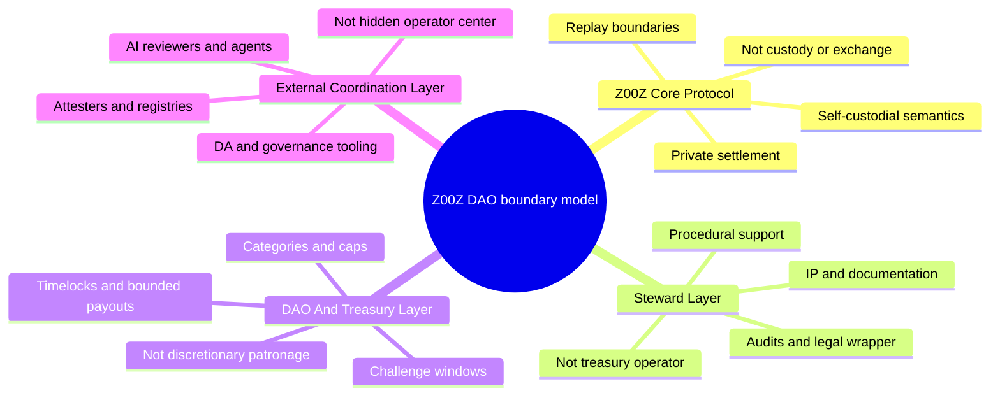
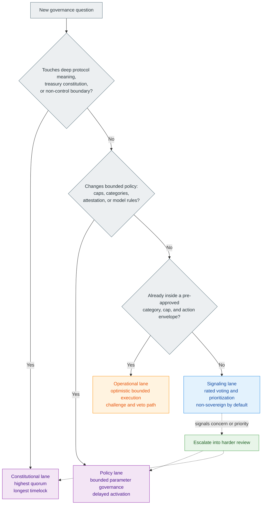
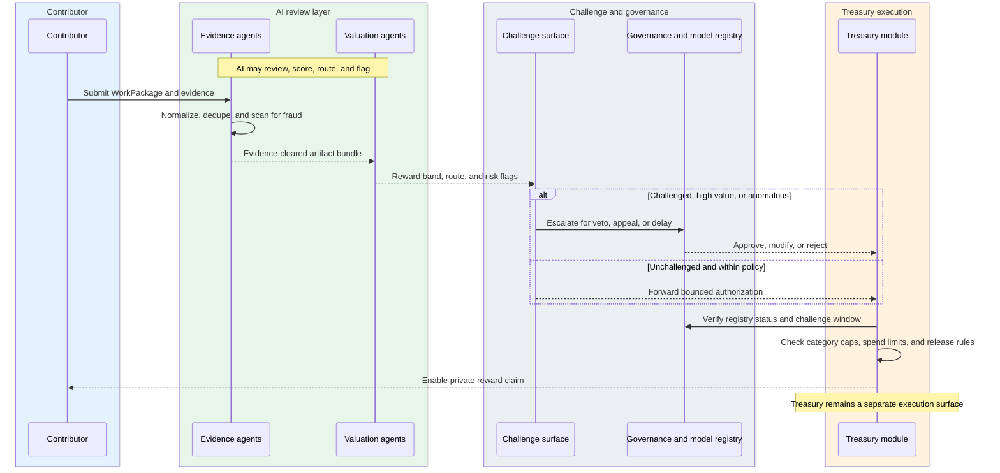
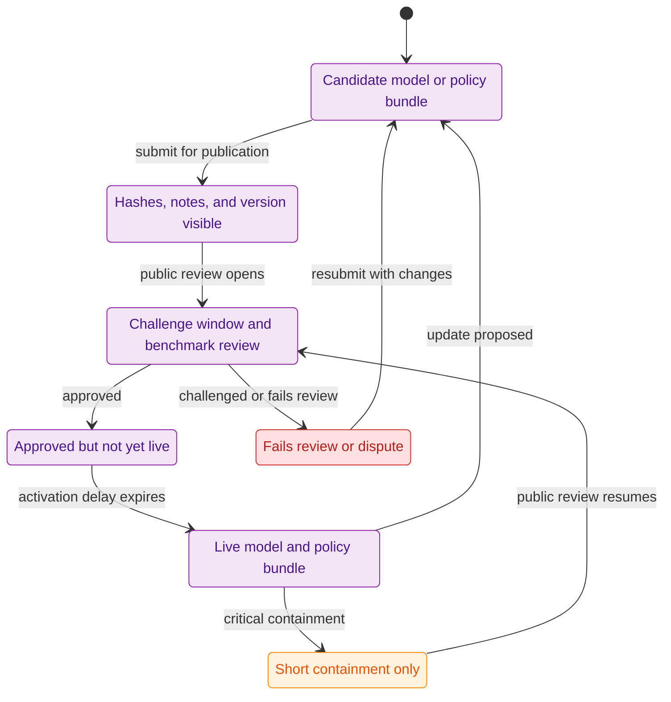
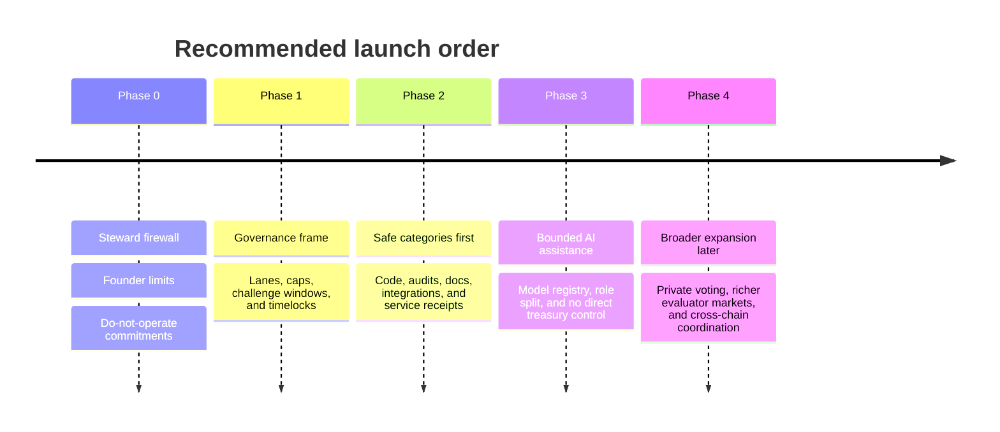

# Z00Z DAO Whitepaper

[TOC]

Version: 2026-05-25

*Status: Drafted through Appendix E. Parameter values in Appendix C remain illustrative and provisional pending testing, governance design, and implementation maturity.*

## Key Terms Used In This Paper

This paper uses a deliberately narrow governance vocabulary because the main risks in DAO design come from blurred roles, blurred powers, and blurred claims. The list below keeps the core nouns stable. Appendix A will expand them into a fuller glossary.

- `Constitutional proposal`: A proposal that changes the deepest public commitments of Z00Z, such as supply rules, core treasury constitution, upgrade authority, or protocol-level governance boundaries.
- `Policy proposal`: A proposal that changes bounded economic or operational rules without rewriting the constitutional core, such as budget caps, category lists, attestation requirements, or risk thresholds.
- `Operational proposal`: A low-risk, pre-scoped, or time-bounded action that may move through an optimistic execution lane under prior policy rather than through full constitutional governance.
- `Signaling vote`: A governance input used to express priority, approval intensity, or disapproval intensity without automatically triggering direct treasury or protocol execution.
- `Rated signaling vote`: A scoring vote on a bounded scale, proposed here as `-10` to `+10`, used for prioritization, ranking, and legitimacy measurement rather than as the only binding execution primitive.
- `Rule-bound treasury`: A treasury whose payouts, categories, release speeds, and challenge conditions are constrained by published rules rather than by open-ended human discretion.
- `Challenge window`: The bounded interval during which a proposal, score, attestation, or payout authorization may still be contested before it becomes final.
- `Proof of Non-Control`: The recurring evidence discipline that shows who cannot unilaterally update models, redirect treasury, control official interfaces, or silently convert Z00Z into a managed service.
- `Technical impossibility`: The architectural non-possession argument that the protocol does not maintain the persistent account, identity, or service-managed ledger structures that would make it function like a custodial or routing intermediary.
- `Do-not-operate zone`: A category of ecosystem behavior that Z00Z core, steward-linked entities, and official governance surfaces must not operate directly, such as custody, official exchange routing, official bridge custody, or managed treasury payroll.
- `AI reviewer`: A model or agent surface that evaluates evidence, detects fraud, estimates value, or routes review work without directly owning treasury authority.
- `Model registry`: The published record of AI model versions, hashes, policies, and activation states that governance may approve, delay, or deactivate.
- `Private reward claim`: A privacy-preserving payout path that lets contributors or operators receive rewards without forcing them into a permanent public compensation graph.
- `Attestation lane`: A bounded eligibility path in which a contributor may prove restricted facts, such as non-sanction status or category eligibility, through privacy-preserving credentials rather than public identity disclosure.
- `Compliance-profile wallet`: A wallet or interface family that adds disclosure, retention, warning, or jurisdictional behavior above the core protocol without rewriting the base consensus layer around the most restrictive service case.

## 1. Why Is This Document Needed?

This paper exists because governance in Z00Z is not a decorative "community" layer that sits harmlessly above the protocol. Governance decides who may change treasury policy, who may change model policy, who may slow or accelerate upgrades, who may pause dangerous paths, and which public claims the ecosystem can make honestly. Those questions shape not only internal process, but also the legal posture of the whole system. A privacy-preserving protocol can still look like a managed service if its treasury, official interfaces, or AI layer are controlled in ways that recreate an operator.

The surrounding Z00Z papers already define a strong architectural boundary: the protocol core should stay narrow, self-custodial, and settlement-focused; optional service, disclosure, and business layers should remain outside that core; steward entities should support the ecosystem without quietly becoming financial operators. Governance has to preserve that same boundary instead of weakening it. If the DAO becomes a founder shell, an AI-controlled payout desk, or an excuse for hidden service coordination, the legal and strategic firewall around Z00Z breaks even if the cryptographic design remains strong.

This paper therefore has a narrower and more practical purpose than a generic governance manifesto. It is meant to define the governance architecture that best fits a privacy-first, rights-first, non-custodial protocol. The central question is not "how do we maximize on-chain democracy theater?" The central question is "how do we create enough governance to steer treasury, upgrades, and ecosystem policy without turning Z00Z into a managed fund, managed marketplace, or AI-run operator surface?"

### 1.1 Scope Of The Paper

This paper is about governance architecture, AI-assisted treasury safety, and legitimacy constraints. It explains how proposal classes should be separated, how expressive signaling should differ from binding execution, how treasury behavior should remain rule-bound, how AI should participate without becoming sovereign, and how the ecosystem should describe those boundaries publicly.

#### What This Paper Covers

This paper covers governance lanes, voting methods, treasury compartments, AI role separation, challenge paths, proposal timing, non-control reporting, contributor reward boundaries, and the legal and public-claims perimeter that keeps Z00Z from collapsing into operator-like behavior. It also defines the staged rollout logic for governance hardening: establish the firewall first, then widen governance and evaluator complexity later.

#### What This Paper Deliberately Excludes

This paper does not attempt jurisdiction-by-jurisdiction legal advice, does not pretend to be a finished smart-contract specification, and does not claim that every governance, AI, attestation, or evaluator-market component described here already exists as landed production consensus code. Some ideas in this paper are already well supported by the repository's architecture and companion whitepapers; others are recommendation-level design syntheses that fit those boundaries but still require implementation and testing.

### 1.2 Core Thesis

The best governance model for Z00Z is not pure token-weighted yes-no voting, not pure rated voting, and not pure AI execution. The strongest fit is a hybrid multi-lane governance stack in which different classes of decisions move through different levels of friction. Constitutional changes remain slow and hard. Policy changes remain bounded and reviewable. Low-risk operational actions may move faster, but only inside prior rules and only with challenge rights. Expressive community scoring remains valuable, but it should not be mistaken for the only binding execution mechanism.

This thesis follows directly from the two archive sources. The DAO archive is correct that rated voting adds important nuance, exposes polarization, and helps measure how strongly the community supports or rejects a proposal. The legal umbrella archive is equally correct that AI and treasury must not look like founder-controlled or steward-controlled operator tools. The synthesis is to preserve expressive signaling while separating it from high-risk execution, and to preserve AI usefulness while separating it from direct treasury ownership.

#### The Main Claim

The main claim of this paper is that Z00Z should use AI to review, route, cluster, score, and challenge within explicit limits, while final treasury and upgrade authority remain constrained by published governance rules, timelocks, challenge windows, non-control reporting, and bounded execution rights. AI should help the system process complexity. It should not become the hidden owner of treasury behavior.

That distinction matters because whoever can silently change model logic, evaluator policy, or payout authorization can often change the treasury in substance even without touching the treasury contract directly. Z00Z therefore needs two layers of protection at once: a rule-bound payout architecture and a rule-bound model-governance architecture.

#### Risk Reduction, Not Zero-Risk Claims

The paper adopts one hard rule from the legal umbrella archive at the outset: a privacy-preserving DAO cannot honestly promise zero legal risk. Any claim of total safety either ignores the residual risk around AML, sanctions, securities, founder influence, and operator narratives, or quietly assumes a much weaker privacy model than Z00Z is trying to preserve.

The realistic target is narrower and more defensible. Z00Z should minimize operator-like behavior, avoid false claims of decentralization, keep the protocol, steward, treasury, wallet, and AI layers separated, and make the remaining risk legible rather than magical. The legal strength of the governance design comes from bounded powers, not from rhetorical absolutes.

#### The Reader Promise Of This Paper

After reading this paper, a founder, steward, engineer, or counsel should be able to classify a new governance feature and answer one concrete question: does this feature preserve a rule-bound privacy protocol with optional outer layers, or does it silently reintroduce hidden operator control? If the document cannot help a reader answer that question, it has failed its job.

## 2. Governance Problem And Design Choice

Z00Z does not need governance for governance's sake. It needs governance because someone has to define treasury categories, challenge rights, model-upgrade paths, emergency containment rules, and the boundaries between protocol and service. The design problem is that each simple answer solves one concern while creating another. Pure token voting is familiar, but too blunt. Pure AI routing is efficient, but too easy to capture. Pure rated voting is expressive, but too ambiguous to use as the only binding treasury or upgrade mechanism.

The right design therefore has to preserve three things at once. First, it must preserve nuance, because treasury, AI, and ecosystem policy often carry more than one bit of meaning. Second, it must preserve hard boundaries, because some powers should be difficult to exercise even when many people support a change emotionally. Third, it must preserve legal distance from operator behavior, because governance that feels flexible from inside the ecosystem can look like managed financial administration from outside it.

### 2.1 Why A Separate DAO Paper Is Needed

Z00Z governance cannot be buried inside the main paper because it touches legitimacy, treasury, upgrades, attestation, and AI control at the same time. The main paper correctly explains protocol-versus-service separation, but it does not try to define a whole governance constitution. The legal architecture paper correctly explains steward firewalls, non-control, and do-not-operate zones, but it does not decide how expressive voting, rule-bound treasury, and AI-assisted review should fit together in one operational design. The DAO paper exists to connect those two boundary systems.

#### Governance Is Not The Same As Protocol Consensus

Governance is about who may change bounded rules and how. Protocol consensus is about what the current settlement rules already accept as valid. Those are not the same thing, and treating them as the same thing makes Z00Z look more discretionary and operator-like than it should.

This distinction matters especially for a privacy-first protocol. The more often the paper sounds as though policy preferences can casually rewrite deep settlement meaning, the more the protocol starts to resemble a managed service rather than a neutral rules system. Governance should therefore be presented as a narrow mechanism for bounded change, not as a social override over all protocol meaning.

#### Governance Is Not The Same As Stewardship

Stewardship is also different from governance. A foundation or steward may maintain IP, audits, disclosures, reference code, grants administration support, and public coordination. That does not mean it should act as the real treasury, the real model owner, or the hidden governance engine behind DAO branding.

The archive material is especially strong on this point. A steward wrapper is useful only if it remains a wrapper and does not silently become the economic operator of the ecosystem. Once the steward chooses recipients, curates official financial surfaces, updates evaluator logic unilaterally, or routes the treasury behind "community" language, the DAO story weakens and the operator story strengthens.

### 2.2 Architecture Options Considered

Three governance architectures are plausible enough to take seriously. None is absurd, but only one fits the full Z00Z boundary set well.

| Model | Description | Pros | Cons | Verdict |
| --- | --- | --- | --- | --- |
| Option A: Token-weighted yes-no governance for everything | One approval mechanism governs upgrades, treasury, rewards, and prioritization | Simple to explain, easy to implement, familiar to token communities | Weak nuance, high plutocracy risk, poor handling of legitimacy intensity, too blunt for AI-assisted reward systems | Rejected |
| Option B: Rated voting and AI execution for everything | Proposal ranking, treasury routing, and execution all rely on score voting and strong AI mediation | High expressiveness, rich prioritization signals, efficient routing for large work queues | Too much ambiguity for binding execution, easier to game socially, higher legal and operational risk if AI becomes the de facto controller | Rejected |
| Option C: Hybrid multi-lane governance with rule-bound AI assistance | Constitutional, policy, operational, and signaling lanes use different primitives under one coherent boundary model | Best safety-legitimacy balance, preserves nuance where needed, keeps high-risk powers slow and auditable, lets AI help without owning treasury | More complex than one-size-fits-all governance, needs careful documentation and rollout discipline | Recommended |

#### Option A: Token-Weighted Yes-No Governance For Everything

This model is the easiest to explain: one weighted approval path governs upgrades, treasury, policy, and prioritization. Its strength is simplicity. Its weakness is that it compresses too many different meanings into one binary lane. It cannot express intensity well, it does not surface strong disapproval cleanly, and it gives large holders a very direct path to dominating high-impact decisions. For Z00Z, that bluntness is a serious problem because treasury legitimacy and public legal posture both depend on finer distinctions than yes or no alone can provide.

#### Option B: Rated Voting And AI Execution For Everything

This model preserves the strongest contribution of the DAO archive. Rated voting on a `-10` to `+10` scale captures preference intensity, highlights polarized rejection, and helps the community see when a technically passing proposal is still socially weak. That is a real advantage. The problem begins when the model goes further and turns rating plus AI processing into the only binding execution engine. At that point the system inherits two risks at once: score thresholds become ambiguous substitutes for constitutional judgment, and AI can drift from evaluator into de facto controller.

#### Option C: Hybrid Multi-Lane Governance With Rule-Bound AI Assistance

This model keeps what is strongest in both source documents. It preserves rated voting where nuance matters most, namely signaling, agenda formation, prioritization, and legitimacy sensing. It preserves rule-bound treasury, steward separation, and AI-non-sovereignty where legal and control risks matter most. Constitutional changes stay hard. Policy changes stay bounded. Operational actions may be faster, but only inside prior rules. AI evaluates and routes, but it does not own treasury.

### 2.3 Why Option C Wins

Option C wins because it does not force one governance primitive to solve every problem. It treats governance as a stack of different decision types rather than as a universal ballot. That is a better fit for Z00Z, where some decisions are legitimacy-sensitive, some are treasury-sensitive, some are safety-sensitive, and some are all three at once.

It also fits the broader Z00Z narrative better than the archive's simpler rated-voting-first direction. The archive is right that nuanced signaling is valuable. But once the protocol is placed inside a legal umbrella architecture, the system needs more than rich signaling. It needs hard friction around the powers most likely to make Z00Z look like a managed service or managed fund. Option C keeps the nuance without losing the friction.

#### Keep Rated Voting For Signaling, Not For Every Final Execution

`-10` to `+10` rated voting remains valuable in the Z00Z design. It is especially useful when the community needs to express more than approval: intensity, hesitation, aversion, and reputational alarm all matter. A proposal with a thin positive average but a large mass of strong-negative scores is politically and socially different from a proposal with broad moderate approval. The archive is correct that a governance system should be able to see that distinction.

What rated voting should not do is stand alone as the only final execution primitive for constitutional changes, treasury drains, model activations, or emergency-power redesign. Those decisions require explicit thresholds, review windows, and challenge paths, not only emotional richness. In Z00Z, score voting is strongest as a signaling layer that informs or escalates binding processes rather than replaces them.

#### Keep AI In Evaluation And Routing, Not In Sovereign Treasury Control

The legal umbrella archive is equally direct about AI: AI should not become the treasury director. It may evaluate evidence, detect fraud, score usefulness, publish reasoning hashes, and route work into bounded lanes. It should not hold direct transfer authority, secret override authority, or unilateral model-update authority.

This is one of the central synthesis points of the paper. In Z00Z, AI is most defensible when it behaves like a review layer above the protocol, not like the sovereign heart of the DAO. The stronger AI becomes at moving value directly, the easier it is for outsiders to ask the simplest and most dangerous question: who really controls the machine that controls the money?

## 3. Governance Boundary And Layer Separation

If Z00Z governance is to stay credible, the system has to remain legible as a set of separated layers rather than one blurred "DAO" surface. The repository and legal architecture already point toward a firewall model: the protocol should remain narrow, the steward should remain non-operational, the treasury should remain rule-bound, and any external orchestration or AI infrastructure should remain auxiliary rather than constitutive of protocol meaning.

That layered view is also a risk-mitigation device. It stops one actor, or one branded cluster of actors, from looking like the protocol author, treasury allocator, wallet operator, bridge operator, AI curator, and market sponsor all at once. The more those roles collapse into one visible center, the weaker the Z00Z non-operator narrative becomes.

### 3.1 Four Governance Layers

The governance map used in this paper has four layers. The first layer is the core protocol. The second is the steward layer. The third is the DAO and treasury layer. The fourth is the external coordination layer. Each layer has a different job and, just as importantly, a different set of things it must not become.

*Diagram 3.A - Orientation view of the four governance layers and the non-goals that keep the firewall legible.*

#### Z00Z Core Protocol

The core protocol is the deepest and narrowest layer. It exists to validate private ownership transitions, replay boundaries, policy constraints, and settlement semantics. It should not quietly absorb application-layer roles such as exchange routing, custody, redemption, treasury payroll, or service-managed identity. From the perspective of governance, this means the core should be touched rarely, through the hardest lane, and only when the change is truly constitutional or upgrade-boundary in nature.

The protocol is also where technical-impossibility arguments matter most. If Z00Z is to claim that it is not a service-managed account system, the core must not grow features that recreate permanent public account graphs, service-held user balances, or centrally managed transfer surfaces under governance language. Governance should protect that narrowness, not erode it.

#### Steward Layer

The steward layer exists to hold trademarks, publish documentation, coordinate audits, pay for legal analysis, support open-source maintenance, and preserve institutional continuity. It may support governance procedurally, but it must not become the actual economic operator of the system. It should not custody user funds, run official exchange surfaces, run official bridge custody, choose treasury recipients manually, or market official financial products under the Z00Z brand.

This is one of the main lessons of the legal umbrella archive: a foundation or steward is useful only if it remains a steward. The moment it starts behaving like an exchange, bridge, hosted wallet, treasury office, or issuer sponsor, the entire firewall weakens.

#### DAO And Treasury Layer

The DAO and treasury layer is where bounded policy and bounded allocation live. It is the place for category rules, budget envelopes, challenge periods, timelocked changes, and pre-scoped economic decisions. It is not the place for unlimited discretion. The treasury should look like a rule system with published caps, published lanes, and published challenge conditions, not like a social committee with a nicer name.

This layer also needs to remain visibly downstream from the constitutional core. Treasury policy may evolve. Reward categories may evolve. Model-governance procedures may evolve. None of that should imply that the base protocol has become an endlessly mutable political surface.

#### External Coordination Layer

The external coordination layer is where AI reviewers, attesters, agent registries, data-availability helpers, external governance tooling, and review markets may live. This layer may be technically important, but it should remain semantically auxiliary. An external chain or agent network may help coordinate, publish, or score. It must not become the hidden place where one actor actually controls treasury logic, model updates, or user-facing execution while the base layer still claims neutrality.

This is especially important for AI and external control planes. A NEAR-style governance or orchestration layer and a Celestia-style publication layer can be compatible with Z00Z, but only if they remain infrastructure and not a concealed operator center. The moment real control migrates there under the same actors, outside observers will treat that layer as part of the Z00Z service surface.

### 3.2 Proof Of Non-Control

The strongest governance claim Z00Z can make is not "trust us, we are decentralized." The stronger claim is that the system can repeatedly show which powers are absent, delayed, split, or challengeable. That is what Proof of Non-Control means in practice.

Non-control must be evidenced because governance language is cheap. Many systems call themselves DAOs while a founder group or steward group still controls the actual levers that matter: treasury release, official interfaces, emergency powers, evaluator sets, or model updates. Z00Z should avoid that theater by making the most sensitive powers legible and auditable over time rather than by declaring victory once at launch.

#### Founder, Steward, And Agent Limits

The paper should require recurring evidence around founder vesting, steward limits, treasury key separation, emergency powers, model update authority, and official-interface control. The first question is not only who holds a role today. The first question is whether one actor, or one small aligned cluster, can silently recombine too many powers at once.

The minimum discipline is straightforward. Founder allocations should be disclosed and time-bounded where applicable. Temporary councils should have narrow, pause-oriented powers rather than broad economic powers. Model updates should not be unilateral. Treasury authority should not sit in the same hands as evaluator control and official-interface control. If those lines blur, governance becomes much harder to defend.

#### Why Control Must Be Evidenced, Not Claimed

Decentralization theater is especially dangerous for a privacy project because the project already faces higher suspicion than a generic transparent chain. If Z00Z says "community governance" while one cluster still controls AI policy, treasury release, official product surfaces, or emergency overrides, the legal and strategic firewall collapses quickly. The issue is not only reputational embarrassment. It is documentary contradiction.

The safest posture is therefore disciplined candor. Early control, if it exists, should be explicit. Narrow powers should be explicit. Sunset paths should be explicit. Delays and challenge rights should be explicit. A system with temporary bounded stewardship and honest disclosure is easier to defend than a system that claims full DAO legitimacy while hiding obvious operational concentration.

## 4. Proposal Classes And Decision Lanes

Different proposal classes need different decision primitives. If every decision is forced through the same governance lane, either the high-risk decisions become too easy or the low-risk decisions become too slow. The Z00Z model therefore uses multiple lanes: constitutional, policy, operational, and signaling. The lanes are meant to keep the most dangerous powers slow and the least dangerous actions bounded rather than frozen.

The governing principle is simple. Speed is earned by prior constraint. A proposal may move quickly only if it is already inside a previously approved category, cap, and action envelope. If the proposal changes deep protocol meaning, treasury constitution, or the non-control model itself, it belongs in a slower lane no matter how urgent or popular it feels.

*Diagram 4.A - Smallest useful classifier for deciding which governance lane a proposal belongs in and when signaling may only escalate rather than execute.*

### 4.1 Constitutional Lane

The constitutional lane is the slowest and hardest path in the system. It exists for proposals that can reshape the protocol, the treasury constitution, the role of the steward layer, or the permanent control model of Z00Z. This lane is deliberately inconvenient because the mistakes it permits are system-shaping mistakes rather than routine governance friction.

#### What Belongs In The Constitutional Lane

Supply policy, treasury architecture, emergency-power rules, constitutional upgrade authority, official do-not-operate commitments, and deep role definitions belong in the constitutional lane. So do any changes that materially weaken self-custody, narrow the firewall between steward and treasury, or turn AI into a stronger execution authority than originally promised.

The constitutional lane should also own the rare cases where governance touches the protocol's deepest invariants indirectly. If a change would alter the meaning of the settlement nucleus, the replay boundary, or the long-term control model, it should not enter through an easier procedural shortcut simply because the mechanism is socially popular.

#### Quorum, Supermajority, And Long Timelocks

The constitutional lane should have the highest quorum expectations, the strongest approval thresholds, and the longest timelocks in the system. The exact numbers may remain open until implementation testing, but the ordering should not. A constitutional change should require broad participation, broad agreement, and enough delay that external review, adversarial analysis, and organized challenge are all still possible before activation.

#### Deep Invariants Are Upgrade Boundaries, Not Casual Policy

The Main Whitepaper is unusually clear that some protocol properties are not ordinary tuning knobs. Canonical encodings, replay semantics, domain labels, checkpoint-version rules, and proof-system assumptions are not everyday governance parameters. If they are governable at all, they belong to upgrade-boundary processes rather than to normal political traffic.

That distinction protects Z00Z from governance creep. Without it, the protocol starts to look infinitely malleable, and governance starts to look like a permanent operator hand inside settlement truth. The DAO should govern bounded policy surfaces, not casually renegotiate the cryptographic constitution of the protocol.

### 4.2 Policy Lane

The policy lane is the medium-speed path of the system. It exists for meaningful but bounded changes that affect rewards, categories, budgets, challenge windows, attestation requirements, AI policy parameters, and similar governance-controlled surfaces without rewriting the constitutional core.

This lane is where most living governance should happen. It is flexible enough to let Z00Z adapt, but narrow enough to avoid turning every operational preference into a constitutional fight.

#### Budget, Category, And Parameter Proposals

Reward caps, category rules, attestation thresholds, evaluator-bond requirements, reserve-basket settings where applicable, publication cadence, challenge lengths, and model-activation parameters belong naturally in the policy lane. These are real governance questions, but they are not all-or-nothing constitutional questions.

The archive material strongly supports this division. It repeatedly treats useful-work programs, AI scoring logic, challenge discipline, and payout constraints as policy architecture rather than as core protocol identity. That is the right framing here as well.

#### Medium-Speed Governance With Explicit Caps

Policy governance should be faster than constitutional governance, but it should still be bounded by precommitted caps, cooldowns, and clearly defined parameter surfaces. If the policy lane can freely rewrite its own limits without resistance, it stops being a bounded policy lane and starts becoming a backdoor constitutional lane.

#### Parameter Governance Only Where The Architecture Already Suggests It

Policy governance should focus on surfaces that already look like bounded configuration or bounded operational policy. Category caps, publication cadence, review thresholds, budget envelopes, disclosure defaults, and evaluator-bond sizes are good examples. The DAO should not pretend that every technically imaginable parameter is governance-shaped merely because governance exists.

This is another way of preserving the Main Whitepaper's distinction between fixed protocol truth, configurable deployment policy, and future research features. Good policy governance respects that distinction instead of flattening it.

### 4.3 Operational Lane

The operational lane is the fast path for low-risk or pre-scoped actions. It is not a shortcut around governance. It is the execution surface for actions whose legitimacy has already been established by prior governance and whose risk has been bounded by category, cap, and timing rules.

This lane matters because a rule-bound treasury cannot require a full constitutional or policy battle every time it needs to release a small, already-approved, clearly classifiable action. But the lane also has to remain narrow enough that convenience does not become hidden discretion.

#### Optimistic Execution For Low-Risk Or Pre-Scoped Actions

An action may move through an optimistic operational lane only when it fits inside an already approved category, budget, and action envelope. A small technical bounty payout inside a safe category, a routine evaluator-bond rotation inside published rules, or a pre-scoped release under a previously approved campaign model are the kinds of cases this lane is meant to serve.

Fast execution must therefore be earned by prior constraint, not by convenience alone. If an action changes recipients, categories, budgets, or authority structure in a materially new way, it no longer belongs in the operational lane.

#### Veto, Challenge, And Expiry Rules

Optimistic execution must always have a challenge window, a narrow veto path, and proposal expiry rules. A challenge window keeps fraud review meaningful. A narrow veto path prevents obvious mistakes or malicious packaging from slipping through. Expiry rules prevent stale authorizations or socially abandoned actions from lingering indefinitely and then activating under low attention.

These mechanisms are not decorative. They are what turns speed into bounded speed rather than stealth control.

### 4.4 Signaling Lane

The signaling lane is the expressive layer of governance. It exists for prioritization, temperature checks, legitimacy sensing, agenda formation, and early warning. This is the lane where the strongest insight from the DAO archive belongs.

#### Where Rated Voting From Minus Ten To Plus Ten Belongs

The archive's `-10` to `+10` voting model belongs most naturally in signaling, ranking, and scoping decisions. It is especially useful where intensity matters and where the output can still be reviewed before execution. In these contexts, the archive's core point is strong: a community often needs to express more than support or opposition. It needs to show hesitation, alarm, or strong legitimacy concerns before a proposal becomes executable.

The signaling lane is also the safest place to use emotionally rich voting without turning subjective score interpretation into automatic treasury execution. A score can shape agenda, escalation, and review priority without pretending to be the whole execution constitution.

#### Median Discipline, Negative-Signal Thresholds, And Non-Binding Prioritization

Median score, strong-negative concentration, and score-distribution shape are all useful in this lane. A proposal with a thin positive average but a large cluster of `-8` to `-10` ratings should be treated differently from a proposal with broad moderate support. The archive is right that median discipline and negative-signal thresholds can expose proposals that are technically popular but socially brittle.

In Z00Z, those metrics should usually be non-binding or escalation-triggering rather than fully self-executing. A poor signal score may send a proposal back for redesign, require a longer challenge period, move it into a stricter lane, or surface it as a reputational red flag. What it should not do by itself is replace the rest of the governance constitution.

## 5. Voting Stack And Representation Model

Once the governance lanes are separated, the next question is representation. Who actually votes, how weight is counted, and how privacy interacts with legitimacy all matter as much as the lane design itself. A privacy-first protocol cannot simply copy the most common public-governance UI and assume the result is coherent. If voting is too blunt, treasury capture becomes easier. If voting is too opaque, legitimacy weakens. If voting is too dependent on validators or insider relays, the DAO begins to look staged.

The source material points toward a practical compromise. Z00Z should be honest that governance weight is tied to token or stake exposure rather than to a one-person-one-vote civic fiction. At the same time, it should avoid equating network operators with political representatives, avoid unnecessary balance disclosure, and add timing and challenge protections strong enough to keep governance from turning into an ambush game.

### 5.1 Voting Power And Delegation

The cleanest base model for Z00Z is direct tokenholder governance with optional delegation, not validator rule and not purely one-person-one-vote theater. The DAO archive is persuasive on two points here. First, token networks should be honest that stake and ownership exposure matter. Second, the political question of how treasury and policy are governed should remain separate from the technical question of who signs blocks or secures availability.

That means the default political unit should be the tokenholder or tokenholder delegate, not the validator as political proxy. Validators may remain important technical actors. They may aggregate signatures, secure consensus, or relay off-chain artifacts. They should not automatically inherit the right to decide treasury or constitutional policy for everyone who delegates technical stake to them.

#### Token-Weighted Participation With Delegation

Token-weighted participation should remain the default governance basis because it is the most legible and auditable fit for the current Z00Z direction. It is simpler to reason about than a fully quadratic or identity-based civic system, and it avoids pretending that stake-based governance is not really stake-based. At the same time, direct voting should be the norm and delegation should be revocable, granular, and issue-aware rather than silently fused to validator staking.

The optimal design here is not pure plutocracy, but honest weighted governance with explicit anti-concentration brakes. Founder allocations should be disclosed, locked, and governance-capped. Conflict-heavy proposals should carry abstention or disclosure duties where appropriate. Delegation should be easy to revoke and should not be bundled permanently into one operational relationship. Quadratic or other attenuated weighting may still be worth testing in signaling or sub-budget contexts, but the main constitutional and treasury representation layer should stay simpler: direct tokenholder voting, optional delegation, and visible caps against concentrated insider control.

#### Proposal Thresholds And Anti-Spam Gates

Every lane needs proposal thresholds or governance collapses into low-cost noise. Signaling proposals can be cheaper to create because they are non-binding. Policy proposals should require a higher threshold, a more complete specification, and clearer category fit. Constitutional proposals should require the highest sponsorship or bond expectations of all because they consume shared attention and touch the deepest commitments of the system.

Spam control should therefore be lane-aware. Proposal deposits, reviewer bonds, sponsor requirements, formatting checks, and expiry rules are not anti-democratic features in this design. They are quality filters that protect attention and make challenge review possible. The treasury should not be exposed to an endless stream of under-specified asks just because anyone can publish text on-chain.

### 5.2 Privacy And Anti-Collusion

Z00Z cannot ignore privacy in governance without contradicting its own broader architecture. Public governance is easy to inspect, but it can also expose balances, relationships, and retaliation surfaces that are misaligned with a privacy-native protocol. Full secrecy, on the other hand, can make legitimacy harder to audit if it is designed carelessly. The right answer is not one extreme for every case.

| Governance context | Better default | Why | Main tradeoff |
| --- | --- | --- | --- |
| Signaling and low-sensitivity prioritization | Public voting | Visible discussion and visible support improve legitimacy at low risk | More exposure than a privacy-first protocol would ideally prefer |
| Ordinary bounded policy questions | Mixed, with a bias toward public aggregate visibility | The system benefits from inspectable debate while still preserving room for narrower privacy where needed | Design complexity increases if every medium-risk case gets a custom privacy posture |
| Constitutional redesign or high-stakes treasury decisions | Private ballot with public aggregate | Protects participants from retaliation, balance mapping, and political pressure while preserving verifiable outcomes | Requires stronger cryptographic and procedural discipline |
| Founder-conflict, politically sensitive, or adversarial governance | Private ballot by default | These are the cases where public traceability creates the strongest coercion and bribery pressure | Harder for outsiders to inspect voter-level behavior directly |

*Table 5.A - Voting visibility should follow governance sensitivity rather than one universal transparency rule.*

#### When Public Voting Is Sufficient

Public voting is often acceptable for low-sensitivity signaling and many bounded policy questions, especially where the main goal is to show visible preference, public reasoning, or category prioritization. Signaling proposals, roadmap ranking, low-risk budget discussion, and similar non-sovereign topics gain value from transparency because broad visible debate helps legitimacy.

The key limitation is that public voting should not be treated as the only respectable form of governance merely because it is easier to observe. Once a proposal touches founder-conflict questions, treasury routing, high-stakes reward policy, or politically sensitive disputes, the costs of full public traceability rise sharply.

#### Optional Private Voting And Anti-Bribery Paths

For constitutional votes, high-stakes treasury decisions, or politically charged governance, private voting becomes the stronger default. The archive already points toward the right ingredients: proposal-specific nullifiers, zero-knowledge proof of valid `Z00Z` ownership, anti-double-vote discipline, and quorum or delay rules that preserve integrity without requiring identity disclosure. In the strongest form, the system should reveal that a valid weighted vote occurred without forcing the voter to expose a permanent public governance account.

The optimal near-term model is private ballot, public aggregate, and public delay. In other words, voters should be able to prove eligibility privately; governance should still publish aggregate outcomes, quorum satisfaction, proposal hashes, challenge windows, and activation delays. Stronger anti-collusion or anti-bribery mechanisms may later become desirable for the most sensitive cases, but they should be added in ways that preserve verifiability instead of replacing one trust problem with another.

### 5.3 Late Quorum And Proposal Guardians

Even a well-weighted voting system can be captured procedurally if timing rules are weak. Last-minute turnout spikes, quiet amendments, and low-attention activation windows are all forms of governance capture. For Z00Z, this risk is amplified because legal and treasury boundaries may hinge on small wording changes that look procedural but carry large architectural consequences.

#### Preventing Last-Minute Capture

High-impact proposals should carry mandatory review windows, late-quorum extensions, and activation delays. If quorum is reached only near the end of voting, the decision window should extend. If a proposal is materially amended, the review clock should reset. If a proposal affects constitutional or treasury structure, the activation delay should remain long enough for adversarial review and organized challenge even after the vote itself closes.

These timing rules are not bureaucracy for its own sake. They are a defense against low-visibility capture and against the kind of rushed decision-making that later looks like staged governance rather than genuine collective authorization.

#### Narrow Guardian Powers With Sunset Rules

Z00Z may still need guardians or a launch council, but only as a narrow containment instrument. Their strongest legitimate role is pause, freeze, delay, or emergency notice when governance or treasury logic is being exploited. Their weakest and most dangerous role is open-ended political management.

Guardian powers should therefore be temporary, explicit, challengeable, and sunset-bound. A guardian may slow a dangerous path. A guardian may not become the standing treasury allocator, grant committee, listing authority, or hidden model governor. Emergency authority without sunset becomes a management board by another name.

## 6. Treasury Constitution

The treasury is where governance either proves its seriousness or collapses into theater. A protocol can describe itself as neutral and self-custodial, but if its treasury behaves like a founder desk, a covert payroll engine, or an AI-managed promotion fund, the legal and architectural story weakens quickly. Z00Z therefore needs a treasury constitution, not merely a list of possible payouts.

The archive material is unusually clear on the direction of travel. Treasury should be locked into a rule-bound mechanism, categories should be published in advance, founder control should be reduced technically rather than rhetorically, and the system should pay for objective ecosystem value more readily than for soft influence or growth theater.

### 6.1 Treasury Compartments

The treasury should not be described as one giant undifferentiated reserve. Different funds have different legal meanings, different risk profiles, and different governance needs. Separating them is part of keeping the system legible.

| Compartment | Legitimate role | What it may fund | What it must not become | Governance posture |
| --- | --- | --- | --- | --- |
| `Protocol treasury` | Main ecosystem reserve | Code, audits, formal verification, wallet integrations, documentation, research, bounded public-value work | Founder grant desk, hype budget, loyalty payroll, discretionary patronage machine | Highest visibility, strongest rule-bound category discipline |
| `Stewardship endowment` | Narrow support for steward functions | Documentation, legal opinions, audits, trademark maintenance, repository continuity, public notices | Shadow treasury or second allocator under a cleaner label | Ring-fenced, narrower, operationally cleaner than the protocol treasury |
| `Emergency and insurance reserves` | Short-horizon containment and recovery | Exploit response, bounded recovery, narrowly defined incident handling | Permanent discretionary finance under security language | Strict triggers, strong reporting, rapid post-incident review |

*Table 6.A - The treasury is safer when each compartment has a narrow purpose, a red line, and a different activation posture.*

#### Protocol Treasury

The protocol treasury should be the main long-duration ecosystem reserve. Its purpose is to support constitutionally permitted protocol goods: code, audits, formal verification, wallet integrations, documentation, security disclosures, translations, reproducible builds, research, and other bounded public-value contributions. The more tightly these categories are defined, the easier it is to defend the treasury as a rule system rather than a discretionary lifestyle or marketing budget.

This treasury should remain downstream from prior governance. The protocol treasury is not where a small group improvises strategy in public. It is where already approved categories and caps are executed under visible rules.

#### Stewardship Endowment

The stewardship endowment should be smaller, narrower, and operationally cleaner than the protocol treasury. Its role is not ecosystem patronage. Its role is to support stewardship functions that the legal architecture already treats as legitimate: documentation, audits, legal opinions, trademark maintenance, public notices, repository continuity, and other non-operational steward tasks.

This compartment matters because without it, the steward is tempted to borrow legitimacy from the broader treasury and quietly become a second allocator. That should be avoided. Steward funding should be budgeted, transparent, and ring-fenced, not blended into a shadow treasury under another label.

#### Emergency And Insurance Reserves

Emergency and insurance reserves are justified only when their scope is narrow and their triggers are explicit. They may exist for exploit response, slashing offsets, bounded recovery operations, or other containment needs. They should not become a permanent excuse for discretionary finance under security language.

The reserve should therefore have stricter activation rules, stronger reporting duties, and faster post-incident review than ordinary treasury compartments. Emergency money that can be used for anything is not an emergency reserve. It is hidden discretion.

### 6.2 Rule-Bound Payout Mechanics

The archive's strongest treasury insight is simple: human discretion must be reduced before legal rhetoric becomes believable. That means Z00Z should prefer published categories, evidence standards, payout bands, challenge periods, and release logic over free-form “the DAO liked this” spending.

#### Budgets, Quotas, And Per-Claim Caps

Per-epoch budgets, per-category ceilings, and per-claim caps should be first-class features of the treasury. Large categories should not be able to eat the whole reserve silently, and no reviewer or agent path should be able to route uncapped value just because a submission scored well. This is especially important in a privacy-aware system where outsiders may already suspect hidden favoritism.

The optimal default is conservative. Z00Z should pay more confidently for objective protocol goods than for narrative goods. Code, audits, formal verification, documentation, wallet support, and public security work are easier to evidence and easier to defend. Hype, trend-chasing, loyalty rewards, and price-promotion campaigns are much harder to bound and much easier to misread legally. If the treasury ever funds softer categories at all, those categories should be capped more tightly and scrutinized more heavily than hard technical work.

#### Streaming, Delays, And Release Conditions

Not every valid payout should settle instantly. Some claims should release in stages, stream over time, or remain partially delayed until the challenge window closes and obvious fraud checks are complete. This is particularly important for high-value rewards, repeat contributors, or work whose long-tail quality can only be assessed after some time has passed.

The better treasury posture is therefore earned release, not immediate irreversible payout by default. Small deterministic claims may settle faster. Larger or more judgment-heavy claims should move through challenge, delay, and possibly staged release so that review failure does not automatically become full treasury loss.

### 6.3 What The Treasury Must Never Become

The treasury must have explicit red lines because many governance failures begin as “temporary flexibility.” Once a treasury starts paying for politically convenient outcomes instead of bounded protocol value, the non-control story fades quickly.

#### No Discretionary Founder Grant Desk

Neither the founder, nor the steward, nor an opaque AI committee should be able to use the treasury as a personal patronage system. The dangerous pattern is always similar: one visible actor proposes, scores, routes, and effectively decides under the cover of community language. The archive is right to reject this pattern directly. A treasury with soft human overrides and hidden recipient discretion is not autonomous in substance.

The better rule is that founders may propose and contribute, but they may not dispose unilaterally. The same logic applies to insiders, councils, and model operators. Proposal authorship is acceptable. Hidden disposal power is not.

#### No Price-Promotion Or Loyalty Payroll

Price-promotion payouts, hype subsidies, buyer-referral incentives, and loyalty payrolls are among the fastest ways to turn the treasury into a legally fragile surface. They encourage the wrong public narrative, make the token look closer to a managed investment story, and are much harder to justify as neutral ecosystem maintenance.

The optimal treasury posture is therefore public-value funding, not demand-generation finance. Educational content may still qualify where it is technical, truthful, and non-investment-promotional. But the treasury should not become a machine for paying people to manufacture excitement, recruit buyers, or maintain social allegiance.

## 7. AI-DAO Safety Model

AI is where the scalability promise and control risk of the Z00Z DAO meet most directly. It can make a useful-work treasury tractable by clustering submissions, detecting duplication, standardizing review, and surfacing fraud indicators. It can also become the easiest channel through which hidden control re-enters the system if model updates, routing logic, or execution rights remain concentrated.

The correct design principle is therefore not to exclude AI, but to constrain it rigorously enough that it remains an evaluator rather than a sovereign. In a legally defensive architecture, AI should expand review capacity without becoming the actor that effectively determines treasury behavior.

*Diagram 7.A - Runtime view of AI-assisted review in which AI evaluates and routes, while challenge and treasury execution remain separate.*

### 7.1 Why AI Should Not Control Treasury Directly

The most tempting AI-DAO shortcut is also the most dangerous one: allow the model to score work, decide rewards, and move funds through one integrated loop. That architecture appears efficient because it collapses review and execution into a single surface. It is dangerous for exactly the same reason.

#### Direct-Key AI Is The Wrong Model

An AI agent or agent cluster should not control treasury keys, execute arbitrary transfers, or update its own reward policy. If it can do those things, the system acquires a new single point of technical failure and a new single point of legal suspicion at the same time. Prompt injection, evaluator gaming, poisoned data, model drift, or hidden operator intervention all become direct treasury risk.

The legal problem is as serious as the operational one. Whoever controls the model that controls payout will likely be treated as the real controller of the system, whether that control is exercised by a founder, steward, vendor, or agent maintainer. Moving that logic to an external chain or agent network does not solve the problem. Hidden control outside the base layer remains control.

#### Bounded AI Roles Are The Right Model

The safer architecture is bounded AI assistance. AI may score, classify, cluster, route, summarize, challenge, and recommend. It may publish reasoning hashes, audit logs, and machine-readable review artifacts. Final execution, however, should remain downstream from policy rules, category caps, challenge windows, and a separate authorization surface that the scoring model does not itself control.

Put simply, AI may help determine what deserves attention. It should not become the final owner of value movement.

### 7.2 Safe AI Role Split

If AI remains in the stack, it should be split into roles rather than presented as one monolithic decision-maker. Role separation reduces failure blast radius and makes non-control easier to demonstrate.

| Surface | What it may do | What it must not do | Why the split matters |
| --- | --- | --- | --- |
| `Evidence and fraud agents` | Normalize artifacts, detect duplication, check proofs, surface suspicious cases | Hold transfer rights or silently redefine valid work | Keeps factual review separate from payout power |
| `Valuation and routing agents` | Estimate reward bands, route cases, schedule bounded actions | Create uncapped value or invent new payout categories implicitly | Keeps usefulness scoring bounded by prior policy |
| `Challenge and governance surface` | Escalate anomalies, host appeals, veto or delay contested outcomes | Become a hidden permanent allocator outside visible process | Preserves contestability and review legitimacy |
| `Treasury execution surface` | Verify caps, registry status, challenge windows, and release conditions | Re-score work socially or bypass review artifacts | Proves that evaluation rights and transfer rights remain separate |

*Table 7.C - AI safety depends less on “smartness” than on hard separation between review roles and value-moving roles.*

#### Evidence, Fraud, And Authenticity Agents

One family of agents should focus on evidence quality, duplication detection, fraud heuristics, and artifact normalization. These agents may compare submissions, inspect reproducibility claims, check whether required credentials or proofs are present, and produce machine-readable review records. Their function is to reduce review load and surface suspicious cases early.

What they must not become is a covert payout desk. Evidence agents should not hold transfer rights, and they should not be able to redefine what counts as valid work without visible governance process.

#### Valuation, Routing, And Scheduling Agents

A second family of agents may estimate reward bands, cluster similar work, route submissions into the correct governance lane, and schedule candidate actions that already fit inside approved categories and caps. This is where AI can be genuinely useful: not by inventing sovereign policy, but by making bounded policy operational at scale.

The strongest use of these agents is banded and lane-aware rather than open-ended. They should recommend a payout range, not unconstrained discretionary value. They should route a case into a known category, not create a new category implicitly through scoring alone.

#### Human Or Tokenholder Veto Paths

Every AI-assisted path needs a real challenge surface. Large payouts, low-confidence scores, distributional anomalies, and conflict-heavy cases should escalate automatically to slower review or explicit challenge. If AI outcomes cannot be vetoed, appealed, or delayed, then the system has merely renamed sovereign control rather than limited it.

This veto path does not need to turn every small reward into a political referendum. It does need to remain credible enough that obvious capture, model failure, or unfair routing can be stopped before value moves irreversibly.

### 7.3 Model Governance And Upgrade Control

The AI layer is governable infrastructure, not magic. If it affects treasury or policy outcomes, then the models, prompts, policy bundles, and evaluation thresholds themselves become governance objects. This is one of the clearest places where Z00Z must avoid hidden founder control disguised as automation.

*Diagram 7.B - Model-governance lifecycle showing publication, review, timelock, activation, and emergency containment without private hot-swap.*

#### Model Hashes, Policy Versions, And Audit Trails

Active model hashes, prompt or policy bundles, benchmark suites, evaluator parameters, and registry status should all be published in a model registry. This registry should make visible which model is active, what policy layer it uses, what category logic it applies, and which changes are pending. Without that visibility, AI governance collapses into invisible infrastructure governance.

Auditability matters here for both safety and legitimacy. When payout behavior changes, governance should be able to inspect whether the model changed, whether the policy changed, or whether the input distribution changed. Otherwise neither accountability nor debugging remains credible.

#### Timelocked Model Updates And Registry Changes

Model updates and registry changes should be delayed, challengeable, and class-based. A pure implementation hotfix is not the same as a scoring-policy rewrite. A security freeze is not the same as a reward-model replacement. The stronger the effect on value routing, the stronger the review and activation delay should be.

No actor should be able to hot-swap the live model privately and preserve the rest of the governance story. If the model changes instantly under one actor's control, AI governance becomes founder governance or steward governance by another name.

### 7.4 Execution Sandboxing And Spending Limits

Even a formally non-sovereign AI can still cause damage if the surrounding execution surface is too permissive. Sandboxing is therefore not optional. It is the mechanism that turns “AI only recommends” from a slogan into an operational fact.

#### Per-Category Allowances, Rate Limits, And Spend Ceilings

Every AI-assisted execution lane should have hard per-category ceilings, per-epoch spend bounds, and rate limits. If a routing bug, adversarial submission swarm, or model drift event occurs, the system should fail boundedly rather than catastrophically. Large outliers should trigger delay or escalation rather than pass through merely because the model produced a confident score.

This is also where the policy lane and treasury constitution connect most tightly. AI should not be able to escape the constitution through volume. Published category caps and release speeds are part of the sandbox.

#### Separation Between Evaluation Rights And Transfer Rights

The cleanest architecture separates evaluation rights from transfer rights. The surface that scores work should not be the same surface that releases money. Instead, AI should emit a recommendation artifact that a separate treasury module checks against category rules, budget limits, registry status, challenge windows, and any required human or governance approvals.

This separation is one of the strongest concrete proofs of non-control available to an AI-assisted DAO. It lets Z00Z show, in architecture rather than rhetoric, that the model can influence review without becoming the real treasury owner.

## 8. Rewards, Privacy, And Attestation

Contributor rewards are where privacy values and legal caution collide most directly. If Z00Z forces every contributor into a permanent public compensation graph, it betrays one of its strongest architectural intuitions. If it pays fully opaque recipients with no evidence and no screening path, it inherits avoidable AML, sanctions, Sybil, and legitimacy risk. The archive material is clear that there is no magical zero-risk answer here.

The right design is therefore layered. Preserve privacy where it matters, preserve evidence where it is needed, and preserve honest language about the residual risk that remains. Z00Z should not pretend that all reward recipients are the same kind of case, and it should not insist that the most anonymous path is always the wisest default.

### 8.1 Private Reward Claims

Private payout still matters because the DAO should not accidentally create a chain-wide surveillance file on contributors, reviewers, translators, operators, or researchers. A public compensation graph is not neutral. It reveals social structure, influence patterns, employment-like regularity, political alignment, and wallet linkage over time. For a privacy-first ecosystem, that is too high a default cost to impose on everyone who contributes useful work.

At the same time, private payout cannot mean replay ambiguity or multiple redemption by stealth. The reward path has to preserve privacy without sacrificing one-time authorization and anti-abuse discipline.

#### Why Payout Privacy Still Matters

Contributors, operators, and reviewers should not be forced into a permanent public compensation graph merely because the DAO pays for useful work. Publicly visible compensation trails make it easier to map internal relationships, target recipients, infer future influence, and quietly convert pseudonymous work into a long-lived behavioral profile. That is exactly the kind of accidental visibility a privacy-first protocol should resist by default.

The strongest defensible position is not “all rewards must be public for accountability.” It is narrower: accountability should come from evidence, challenge rights, and bounded disclosures, not from exposing every recipient to a universal public dossier.

#### ClaimNullifier And Anti-Double-Claim Discipline

Private reward claims still need one-time authorization and anti-replay discipline so that privacy does not become a loophole for repeated redemption. The existing Z00Z architecture already offers the right conceptual direction through its claim-domain surfaces: claim packages, claim-specific replay context, and typed claim nullifier records show how a private right can be exercised once without requiring a public account model.

The DAO paper should therefore adopt the same principle for treasury claims. A reward should be issued against a bounded claim object, a bounded eligibility proof, and a claim-specific anti-replay artifact rather than against an open-ended public account row. That keeps privacy intact while making duplicate redemption, recycled authorizations, and silent replays materially harder.

### 8.2 Contributor Eligibility Models

The archive's anonymous-reward analysis points to three broad postures. Fully opaque rewards are the purest and the weakest legally. Public-work rewards without identity disclosure are materially safer. Privacy-preserving attestation is the strongest compromise for higher-risk or higher-value cases. The recommended Z00Z design should use the second as the default and the third as the escalation path, while avoiding the first as the canonical treasury norm.

| Eligibility lane | Public identity exposure | Main evidence basis | Relative legal posture | Recommended use |
| --- | --- | --- | --- | --- |
| `Fully opaque rewards` | None | Minimal public evidence or blind payout routing | Weakest and most fragile | Avoid as the default treasury norm |
| `Pseudonymous public-work lane` | No public identity, but public work artifact | Reviewable outputs such as code, docs, audits, integrations, or reproducible work | Safer and more defensible | Default for early and lower-risk useful-work programs |
| `Privacy-preserving attestation lane` | Public privacy preserved, bounded facts proved privately | Credential or zero-knowledge attestation plus work evidence | Strongest compromise for higher-risk cases | Escalation path for higher-value or more sensitive rewards |

*Table 8.A - The paper’s reward model is layered: not all contributors need the same exposure, and not all reward lanes need the same risk posture.*

#### Fully Pseudonymous Public-Work Lane

The low-friction lane should pay for public, reviewable, and bounded work without forcing public identity disclosure. Code, tests, audits, formal verification, documentation, translations, wallet integrations, educational content without investment promotion, reproducible builds, and public security disclosures fit this lane well because the contribution itself is the main evidence object. The contributor may remain pseudonymous while the work remains inspectable.

This is the safest default for early useful-work design because it shifts the focus from “who is this person?” to “what evidence-bearing result did they produce?” It does not eliminate all legal uncertainty, but it is a materially stronger compromise than blind anonymous payout because the work can be reviewed, challenged, scored, and rejected on its merits.

#### Privacy-Preserving Attestation Lane For Higher-Risk Rewards

Higher-risk or higher-value rewards should move into a privacy-preserving attestation lane. In that lane the contributor remains publicly private while presenting a bounded credential or zero-knowledge attestation about specific facts: not on a sanctions list, not from a prohibited program context, accepted terms, no known duplicate claim, or other narrowly scoped eligibility conditions. The DAO sees enough to reduce blind patronage risk without demanding public identity or turning itself into a universal KYC registrar.

This is the best compromise when stronger defensibility is needed. It respects the distinction between protocol privacy and treasury risk management. It also keeps the compliance burden narrow and contextual rather than forcing every ordinary user of Z00Z into identity collection merely because some treasury programs need more protection.

### 8.3 Reputation Without Hidden Accounts

Z00Z will still need memory. Repeated contributors, reviewers, and attesters cannot always be evaluated as if they have no history. But the way the system remembers matters. A privacy project should not solve every trust problem by rebuilding a permanent public profile layer that quietly tracks people forever.

#### Portable Receipts Instead Of Permanent Public Profiles

Portable receipts, bounded credentials, and domain-specific attestations are safer than one global reputation account. A contributor may need to prove “I completed three prior audit tasks without challenge” or “I previously satisfied this role requirement” without exposing a full lifetime identity graph. Receipts and attestations make that possible while keeping disclosure narrow and purpose-bound.

This approach also matches the broader Z00Z trajectory visible in the main whitepaper: optional private reputation receipts and domain-scoped trust tiers are more compatible with privacy than one durable public profile that accumulates every governance and reward interaction into one visible dossier.

#### Domain-Scoped Trust Without Social-Credit Drift

Trust should remain domain-scoped and task-scoped. The system may remember that someone completed audit work reliably, resolved a translation task, or served as an accurate attester in one bounded domain. It should not convert those facts into a universal ideology score, a social-ranking system, or a permanent behavior market.

That distinction matters because once reputation becomes global and cumulative, governance starts to look like surveillance infrastructure. Z00Z should remember enough to reduce repeated fraud, but not so much that useful-work coordination collapses into private social-credit engineering.

## 9. Security, Challenges, And Failure Handling

Z00Z governance should be designed as though it will be attacked, gamed, and stress-tested by both insiders and outsiders. Treasury systems fail when they assume good faith by default. AI systems fail when they assume scores are objective merely because they are automated. Privacy systems fail when they assume abuse cannot scale because visibility is limited. The job of this section is to make those failure modes explicit and bind them to containment mechanisms.

### 9.1 Threat Model

The governance system must survive at least three broad classes of failure: capture of representation, capture of evaluation, and capture of execution. Those failures may come from capital concentration, procedural tricks, coordinated fraud, hidden operator influence, or emergency authority that never really expires.

| Failure class | Typical attack pattern | What breaks if it succeeds | Primary containment |
| --- | --- | --- | --- |
| `Capture of representation` | Whale concentration, delegation capture, bribery, late-quorum ambush | Governance starts to look like staged consent rather than collective authorization | Founder caps, revocable delegation, private voting where needed, late-quorum defense |
| `Capture of evaluation` | Reviewer collusion, model gaming, attestation rings, insider registry control | Reward legitimacy collapses and AI or reviewers become the hidden allocator | Role separation, challenge windows, bonds, model-governance discipline, public evidence |
| `Capture of execution` | Fast-path bypass, emergency overreach, uncapped release, stale authorization abuse | Treasury moves value outside the written constitution | Caps, expiry, narrow veto, timelocks, separation between evaluation and transfer rights |

*Table 9.A - The threat model becomes easier to reason about when failure is grouped by what gets captured, not only by who attacks.*

#### Governance Capture And Vote Buying

Capital concentration, delegation capture, coordination bribery, and timing attacks can turn nominally open governance into hidden control. A founder with too much unlocked voting power, a whale coalition, a captured delegate network, or a low-attention late-quorum ambush can all produce formally valid but substantively brittle outcomes. The risk is not only unfairness. It is that the DAO becomes easy to describe as concentrated management with ceremonial voting wrapped around it.

This is why the earlier sections insist on founder lockups, governance caps, revocable delegation, private voting for sensitive lanes, review windows, and late-quorum defenses. Capture must be assumed as a normal design pressure, not as a remote edge case.

#### Model Gaming, Sybil Abuse, And Reward Fraud

AI-assisted useful-work systems face a different but equally serious attack surface. Fake work, duplicate submissions, recycled outputs, collusive reviewer clusters, coordinated attestation rings, model-prompt gaming, and adversarial reputation laundering can all distort reward allocation if the system treats “scored” as synonymous with “real.” Privacy makes some of these attacks harder to see from the outside, which makes internal challenge logic even more important.

The treasury therefore needs negative-value filters, evidence checks, anti-replay claim discipline, category limits, and escalation paths for suspicious cases. Fraud should not merely receive a low score. It should be recognized as an attack on the reward system itself.

#### Malicious Proposers, Reviewers, Or Executors

Some of the most dangerous failures come from role-layer abuse rather than from external attackers. A malicious proposer may package a harmful change inside dense procedural language. A reviewer may collude, look away, or weaponize process against rivals. A captured agent registry may create the appearance of contestability while routing all real power through one operational circle. An executor may follow the letter of a workflow while violating its constitutional spirit.

For that reason, Z00Z should treat role separation, appeals, public evidence, and recurring Proof-of-Non-Control reporting as security controls as much as governance niceties. Hidden concentration is a security issue here, not merely a branding issue.

### 9.2 Challenge Windows, Bonds, And Slashing

Challenge is part of the protocol's immune system. A system with no meaningful challenge path is simply trusting its own first answer. Bonds and slashing are useful only insofar as they make challenge credible without turning participation into a rich-person privilege.

#### Challenger Bonds And Reviewer Bonds

Reviewers, attesters, and other governance-critical evaluators should face meaningful downside if they collude or act carelessly. Reviewer bonds, attester bonds, registry stakes, or other slashing-adjacent mechanisms can help make that downside real. Challenger bonds may also be justified where they deter pure spam challenges, but they should be proportionate so that honest contestation is not priced out.

The right principle is symmetry: critical influence should carry risk, and critical challenge should remain accessible. If the system punishes only challengers, fraud survives. If it punishes only reviewers, challenge spam may paralyze execution. A balanced bond design makes both abuse and empty obstruction expensive enough to matter.

#### Safe Exceptions For Small Or Deterministic Claims

Not every category requires the same dispute burden. Small deterministic claims, narrow reimbursements, or strongly measurable outputs may use lighter challenge machinery so long as the fraud surface is genuinely narrow and the category cap remains low. The point of a rule-bound treasury is not to force maximal process onto trivial cases. It is to allocate friction where the risk justifies it.

This exception must remain tightly scoped. “Small and deterministic” should mean exactly that, not “small enough that nobody notices.” The moment a category becomes socially sensitive, cumulatively large, or easy to game in volume, it should graduate to stronger review.

### 9.3 Emergency Paths

Emergency powers are tolerated only because ordinary governance can be too slow during a real exploit, cascading fraud event, or severe model failure. They become dangerous the moment they start serving as a shortcut around treasury or constitutional discipline. Z00Z should therefore define emergencies as containment situations, not as opportunities for discretionary management.

#### Emergency Pause As A Narrow Containment Tool

Emergency pause powers should stop damage, not rewrite the constitution, repurpose budgets, or create a standing exception-based ruler. Their legitimate uses are narrow: freeze a broken execution lane, slow a malicious upgrade path, isolate a registry failure, or halt a clearly compromised payout mechanism while review catches up.

This power should expire automatically or fall back into ordinary constitutional process quickly. The longer an emergency path stays open, the more it stops being emergency response and starts being substitute governance.

#### Recovery, Rotation, And Post-Incident Review

Every emergency action should trigger recovery, rotation review, and public post-incident analysis. If the same signers, same reviewers, or same agents caused the failure, governance should ask whether role rotation, new caps, or stronger registry rules are needed before reopening the affected lane.

Post-incident reporting matters here for the same reason Proof of Non-Control matters elsewhere: architecture is defended not by claiming perfection, but by showing how failure is contained, explained, and prevented from hardening into permanent hidden power.

## 10. Legal And Public-Claim Boundary

Public language is not separate from architecture. In a privacy project, careless wording can recreate exactly the operator narrative the design is trying to avoid. Whitepapers, wallet notices, websites, grant pages, governance policy, and public talks all become evidence about what the project thinks it is doing. Z00Z therefore needs a disciplined public language boundary around the DAO, treasury, and AI stack.

### 10.1 Safe Narrative

The safest public framing is the one that says enough to be clear without saying so much that it over-assumes responsibility. Z00Z should describe governance as a bounded coordination and treasury-control system around a self-custodial privacy protocol. It should not describe itself as an anonymous managed economy, an AI-run treasury business, or a covert market operator.

#### Neutral Protocol, Self-Custody, Rule-Bound Treasury

The safest baseline formula is simple: neutral protocol, self-custody, rule-bound treasury, explicit governance limits. This keeps the story aligned with both the main and legal whitepapers. The protocol validates private settlement. The steward supports the ecosystem without operating financial services. The treasury follows published categories, caps, and challenge paths rather than private managerial discretion.

That sentence is stronger than more exciting alternatives because it does not imply a managed customer relationship. It explains what Z00Z does while preserving the firewall between protocol, stewardship, and value routing.

#### AI-Assisted Evaluation, Not AI Asset Management

Z00Z should describe AI as an evaluation and routing surface, not as an autonomous investment manager, anonymous payroll engine, or invisible operations company. The moment official language suggests that AI “runs the economy,” “allocates capital,” or “pays contributors automatically,” the project begins to sound like a managed financial operation hiding behind technical novelty.

The stronger narrative is narrower and more honest. AI helps classify evidence, detect fraud, cluster work, and recommend bounded actions. Governance and treasury rules remain the final constitutional frame around those recommendations.

#### Technical Impossibility, Not Refusal

The strongest protocol claim is not “we refuse intermediary obligations because we dislike them.” It is “the base architecture does not possess the global account, identity, or service-managed customer ledger that would make it function like a custodial or routing intermediary in the first place.” That distinction is central to the legal whitepaper and should remain central here.

This argument works only if it remains true in surrounding practice. If official wallets, steward entities, or affiliated services quietly rebuild the missing knowledge elsewhere, then technical impossibility collapses back into rhetoric. The public narrative must therefore stay synchronized with the actual control surface of the ecosystem.

### 10.2 Claims That Must Be Avoided

Some phrases are too legally expensive to keep around for style. The DAO paper should treat them as red-line expressions because they imply operator responsibility, financial sponsorship, or evasion-oriented intent that the architecture is specifically trying to avoid.

#### No Mining, Yield, Dividend, Or Anonymous Payroll Language

Terms implying passive profit expectation, hidden salary, or protocol-guaranteed income should stay out of the governance story. `Mining`, `yield`, `dividend`, `earn by holding`, and similar phrases make the treasury sound like an emission or investment engine rather than a bounded useful-work reserve. `Anonymous payroll` is just as bad because it invites the interpretation that the DAO exists to move salary-like value through opaque channels.

The safer vocabulary is contribution, grant, reimbursement, useful-work reward, bounded reserve, and rule-bound payout. That language does not eliminate all risk, but it avoids supplying unnecessary documentary evidence against the project.

#### No Official Exchange, Bridge, Or Managed Privacy Service Narrative

The DAO must not imply that it operates a hidden exchange, custodial bridge, or official anonymous financial service merely because it governs a privacy-first protocol. Phrases like `official DEX`, `official bridge`, `official marketplace`, or `managed privacy service` collapse the boundary between protocol governance and financial operation.

Where reference software exists, the safer term is usually `reference` rather than `official`, especially when the surface touches money movement, conversion, or third-party assets. The project should be very careful not to let convenience naming imply operator responsibility it is trying not to assume.

#### No Official Stablecoin, Ramp, Market-Making, Or Hosted-Wallet Narrative

The full red-line set should be explicit in this paper: no official stablecoin sponsorship, no redemption desk, no ramp-in or ramp-out business, no market-making desk, and no hosted-wallet posture that recreates the knowledge and control the protocol relies on not having. These are not merely feature choices. They are legal posture choices.

The more official surfaces take on reserve, redemption, custody, conversion, or market-support behavior, the harder it becomes to defend Z00Z as neutral self-custodial infrastructure. The DAO paper should therefore say clearly what the ecosystem will not claim and should not operate officially.

### 10.3 Responsibility Map

The public-language boundary is only credible if it ends with a responsibility map. Readers should be able to see which claims the protocol can defend, which obligations belong to external service actors, and how regulated or enterprise-facing wallet families may add controls without rewriting the core for everyone.

| Layer or actor | What it may credibly do or claim | What it must own | What it must not imply |
| --- | --- | --- | --- |
| `Z00Z protocol` | Private settlement, self-custody, rule-bound treasury logic, challengeable governance, no direct AI treasury control | Protocol rules, replay discipline, bounded public claims | Universal compliance coverage, custody, solvency, or managed financial operation |
| `Wallets, bridges, issuers, and integrators` | Build services above Z00Z, add onboarding, conversion, redemption, or business logic | Their own custody, sanctions, retention, disclosure, and jurisdiction-specific duties | That protocol privacy performs their compliance obligations automatically |
| `Compliance-profile wallets and enterprise overlays` | Add selective disclosure, archive packaging, warnings, screening hooks, and context-specific controls | The extra obligations introduced by those overlays | That those overlays redefine the core protocol for every ordinary user |

*Table 10.A - Responsibility stays legible only when protocol claims, service duties, and optional compliance overlays remain visibly separated.*

#### What The Protocol Can Defend

The protocol can credibly defend claims about self-custody, private settlement, bounded treasury logic, challengeable governance, claim-specific replay discipline, and the absence of direct AI treasury control. It can also defend the claim that it minimizes public visibility and does not maintain a global customer ledger or hosted account system in the ordinary service-provider sense.

What it cannot credibly defend is the legality, solvency, or compliance of every external program built above it. That is why the wording must stay narrow. The protocol guarantees settlement rules, not the legitimacy of every actor that touches those rules.

#### What Wallets, Bridges, Issuers, And Integrators Must Own

Wallets, bridges, issuers, integrators, and regulated services still own their own custody, onboarding, redemption, disclosure, retention, sanctions, and jurisdiction-specific obligations even if they build above Z00Z. The protocol does not become a CASP, exchange, or payroll service simply because those actors choose to integrate it. But those actors also cannot claim that protocol privacy performs their compliance duties for free.

This separation is one of the strongest protections in the architecture, and it should be repeated consistently. External actors may add services. They also inherit the responsibility that comes with those services.

#### What Compliance-Profile Wallets May Add Above The Core

Enterprise, regulated, or jurisdiction-aware wallet families may add selective disclosure, retention, warnings, scheduled-payment context, screening hooks, and audit packaging above the base protocol. That is a strength, not a compromise, so long as these behaviors remain optional overlays chosen by the actor who needs them rather than consensus-level obligations imposed on every user.

This is how Z00Z stays both privacy-first and compliance-capable. The core remains narrow. The edge becomes heterogeneous. Wallet families and enterprise overlays own the extra obligations they introduce, while ordinary users of the base protocol are not forced into a universal regulated-service mold.

## 11. Implementation Status And Rollout Sequence

This paper should not blur conceptual maturity with implementation maturity. The surrounding Z00Z documents are strongest when they say clearly which boundaries are already visible in the repository, which policy surfaces are stable enough to specify now, and which mechanisms remain target architecture. The DAO paper should follow the same discipline.

That means the document can be confident about governance principles before it is confident about every exact contract. It can define what the system should never become, what powers must remain separated, and what safety ordering should govern rollout. It should be more cautious about exact thresholds, final execution paths, and the maturity of the still-forming governance and evaluator stack.

### 11.1 What Can Be Specified Now

Several parts of the design are already mature enough to define publicly even before the final contract suite is complete. The main and legal whitepapers already support the narrow-core boundary, the steward-versus-operator split, the distinction between bounded policy and deep invariants, and the sequential maturity discipline that separates live core from target overlays. The DAO paper can build on those commitments without pretending that a finished generic governance engine already ships in the current repo.

#### Stable Conceptual Contracts

The stable conceptual contracts are the ones that define the constitutional shape of the system rather than its final parameterization. These include the multi-lane governance model, the rule-bound treasury requirement, AI role separation, challenge windows as a legitimacy mechanism, a published model-registry discipline, private reward claims with anti-replay logic, and recurring Proof-of-Non-Control reporting.

These are stable because they are not implementation trivia. They are the architectural commitments that keep treasury, AI, and public claims compatible with the broader Z00Z boundary model. If early deployed versions are simpler than the long-run target, these commitments should still remain visible as the standard the simpler versions are moving toward.

#### Parameters That Should Stay Open Until Testing

Exact quorum values, challenge lengths, budget percentages, bond sizes, late-quorum timing, and score thresholds should stay explicitly provisional until testing and operational evidence justify freezing them. The main whitepaper is already careful about not presenting unfinished operator or governance machinery as if it were fully settled production fact. The DAO paper should keep the same discipline.

The right public stance is therefore “stable design, provisional parameters.” Readers should know which boundaries are fixed in principle and which numbers remain open to simulation, contract testing, and staged rollout learning.

### 11.2 Recommended Launch Order

Sequence is part of safety. A governance architecture can be correct in principle and still be dangerous if the most capture-sensitive layers go live before the containment layers that are supposed to discipline them. The repository’s broader maturity philosophy is already sequential rather than ornamental, and the DAO should follow that same ordering rule.

*Diagram 11.A - Safety ordering for rollout: each later phase assumes the earlier containment and non-control layers are already live.*

#### Governance Before AI Treasury

The governance and treasury rule system should exist before AI receives any live execution influence at all. Category definitions, caps, challenge windows, pause rules, and model-governance procedures need to come first. Otherwise the project ends up asking AI to behave safely inside a constitutional frame that does not yet really exist.

This sequence also improves credibility. It is easier to defend AI as bounded assistance when the bounds are already visible than when the project promises to add them after automation is live.

#### Safe Categories Before Subjective Categories

Early treasury and useful-work programs should start with technical, operational, and measurable categories before expanding toward broader social or highly subjective reward surfaces. Code, audits, reproducible fixes, documentation, integrations, and well-defined service receipts are better launch categories than broad influence rewards, narrative campaigns, or identity-loaded community programs.

This is not only a governance preference. It is a legitimacy and legal preference. Safe categories are easier to evidence, easier to challenge, and less likely to be misread as managed promotion or disguised payroll.

#### Steward Firewall Before Broad DAO Theater

The organizational firewall should be established before the project leans heavily on DAO language. Founder limits, steward-only role definition, do-not-operate commitments, signer separation, and Proof-of-Non-Control reporting should become real first. Only then should the project widen into deeper evaluator markets, private voting complexity, and stronger DAO autonomy narratives.

This is the opposite of decentralization theater. The paper should prefer temporary honesty over premature mythology.

### 11.3 Future Expansion

The DAO design should remain expandable without becoming conceptually unstable. Future features are acceptable where they extend the same non-control, bounded-authority, privacy-preserving logic rather than replacing it with a new hidden control surface.

#### Private Voting, Richer Evaluator Markets, And Cross-Chain Coordination

Richer anti-collusion voting, decentralized evaluator markets, and external coordination planes may all become desirable later. So may stronger agent registries, multi-model competition, and cross-chain publication or coordination surfaces. But these should remain explicitly outside the current minimal guarantee set until the evidence, registry, and challenge layers are strong enough to support them.

The paper should be comfortable saying “serious direction” without saying “already normal production reality.” That distinction is one of the healthiest habits in the Z00Z document family.

#### Conditions For Broadening Governance Scope

Governance scope should broaden only after several preconditions are met: stronger evidence systems, broader participation, tested challenge and appeal flows, genuine model diversity, robust role separation, and a public record that the initial design resisted capture under real use. Expansion should be earned by surviving harder categories, not by rhetorical ambition.

This is especially important for AI-heavy or socially sensitive categories. If the system cannot yet defend itself in narrow technical lanes, it is not mature enough to govern softer or more politically loaded lanes safely.

#### Compliance-Profile Wallets And Enterprise Overlays

The safer path for enterprise and regulated needs is to grow optional wallet and archive profiles above the core rather than pushing disclosure, retention, screening, or jurisdictional logic into consensus and then calling that drift “governance maturity.” Corporate and regulated overlays may become richer over time. The protocol boundary should not become weaker as a result.

That asymmetry should remain one of the DAO paper’s fixed rollout principles: optional edges can diversify, while the core stays narrow.

## 12. Relation To The Wider Z00Z Thesis

This DAO paper should be read as a companion that narrows governance claims rather than inflating them. It does not replace the main Z00Z story with fashionable DAO branding. It explains how governance, treasury, AI evaluation, and public claims can stay compatible with the same rights-first, narrow-core, self-custodial architecture already established elsewhere in the whitepaper family.

### 12.1 Fit With The Main Whitepaper

The Main Whitepaper defines the protocol’s narrow settlement thesis: wallet-local possession, replay-safe public settlement evidence, protocol-versus-service separation, and disciplined maturity boundaries. The DAO paper should not widen that thesis into a governance-first product. It should instead explain how governance protects those boundaries when treasury, AI, and outer coordination layers are added.

#### Governance As Boundary Discipline, Not As Marketing Layer

Governance is valuable here because it disciplines boundary drift. It keeps the treasury from becoming a discretionary founder desk, keeps AI from becoming a hidden operator, and keeps steward language from becoming a service narrative. That is very different from treating governance as the project’s main identity.

The stronger story is therefore protocol first, governance second. Governance exists to keep the protocol legible and safe, not to rebrand Z00Z as “mainly a DAO.”

#### One Rights-First Story Across Protocol, Treasury, And Rewards

The same rights-first logic already visible across the document family should remain visible here as well. In the Main Whitepaper, the core question is how private ownership and settlement remain narrow and replay-safe. In the DAO paper, the question becomes how treasury rights, useful-work claims, and AI-mediated coordination can be bounded without collapsing back into public-account-style control or discretionary service operation.

The answer is the same family of moves: bounded objects, published policy, selective disclosure, role separation, challengeable review, and delayed or staged release rather than unbounded immediate control.

### 12.2 Fit With Legal, Tokenomics, PoUW, And Agentic Papers

The DAO paper sits in the middle of the wider whitepaper family. The Legal Architecture paper defines the firewall, the Tokenomics and Incentives paper defines the economic constitution around the native asset and treasury, the PoUW paper defines the useful-work proof and reward stack, and the Agentic paper defines why bounded private rights matter for non-human economic actors. The DAO paper’s job is to say who may change what, through which lane, under which challenge and non-control constraints.

#### Companion Role Of This Document

This document is the place where governance lanes, AI safety, treasury legitimacy, and upgrade discipline are tied together explicitly. It is the constitutional coordination layer for the rest of the family. Without it, the other papers could each be internally strong while still leaving open the dangerous question of who actually controls the combined system in practice.

That is why the DAO paper matters even though it is not the main protocol paper. It explains the meta-boundary around the other layers.

#### Shared Terms That Must Stay Consistent

Several shared terms need to remain stable across the paper family: `rule-bound treasury`, `steward`, `Proof of Non-Control`, `private reward claim`, `challenge window`, `compliance-profile wallet`, `technical impossibility`, and `agent-mediated evaluation`. If those terms drift from paper to paper, the architecture becomes harder to defend and easier to misread.

Consistency here is not cosmetic. It is part of the legal and technical discipline of the project. The same words should keep meaning the same boundaries no matter which paper a reader opens first.

## 13. Open Questions And Counsel Decision Points

The purpose of this section is not to weaken the paper. It is to keep it honest. A DAO architecture becomes less defensible when it pretends every hard question is already solved. Some decisions genuinely require further design evidence, implementation maturity, or external counsel. Surfacing those questions is part of the discipline of this document.

### 13.1 Open Governance Questions

Even after the high-level architecture is chosen, several governance questions remain open because they affect how much discretion the system can hold without drifting back into staged control.

#### When Should Signaling Become Binding

The paper recommends keeping rated voting strongest in the signaling lane, but the conversion boundary remains an open design problem. Under what conditions should a signaling result automatically escalate into a policy vote, extend a challenge window, freeze an operational path, or trigger a constitutional review? The answer cannot simply be “when the score feels strong enough,” because that would reintroduce ambiguity at the exact point where ambiguity becomes dangerous.

What still needs work is the graduation logic. Z00Z needs a principled rule for when signaling remains advisory, when it gains procedural force, and when it should never be allowed to bypass a harder lane no matter how intense the score distribution becomes.

#### How Much Discretion Can Evaluator Markets Safely Hold

The paper assumes evaluator markets can help, but it does not yet settle how much bounded discretion they can safely hold. How wide should reward bands be before review starts looking like soft patronage? How many reviewer classes are enough to avoid monoculture without creating procedural paralysis? When does an evaluator registry stop being a contestable review layer and start becoming the real treasury government in practice?

These are not merely technical tuning questions. They determine whether the DAO remains a rule-bound treasury with evaluation support or drifts toward a human-and-AI committee with stronger informal power than the written constitution suggests.

### 13.2 Open Legal Questions

Architecture can narrow the field, but it cannot replace counsel on several core legal implementation questions. The paper should therefore state plainly which issues still require real jurisdiction-specific judgment.

#### Attestation Providers, Restricted Jurisdictions, And Disclosure Policy

Privacy-preserving eligibility proofs are conceptually strong, but several implementation choices remain open. Who may issue them? Which facts are minimally necessary for higher-risk programs? How should restricted-jurisdiction boundaries be drawn without turning the protocol into a general identity service? When is a private attestation enough, and when should a higher-risk activity move into a separately regulated service context instead?

These questions are especially sensitive because the wrong answer can either hollow out privacy unnecessarily or leave treasury programs weaker than the paper’s safety model assumes. This is an area where architectural instinct needs counsel-backed narrowing.

#### Foundation Form, Tax Posture, And Treasury Liability

The paper is intentionally functional about steward design, but wrapper form still matters in practice. Which entity type best preserves the steward-only role? How should treasury actions, useful-work rewards, and reserve compartments be treated for tax and reporting purposes? Where should liability sit, and where must it not sit, if the project wants the firewall to remain real under stress?

No whitepaper can settle those questions by narrative alone. They need a dedicated counsel track tied to real entity, tax, and operational facts.

### 13.3 Open Technical Questions

The DAO architecture also depends on technical surfaces that are conceptually coherent but not yet fully resolved. Those questions deserve explicit research and implementation tracks rather than quiet assumption.

#### Secure Agent Registries And Model Diversity

If evaluators and agents matter, registry design matters. How does Z00Z keep agent registries from collapsing into monoculture, one-vendor dependence, or hidden founder capture? How should benchmarking, attestation, challenge, and slashing work when model families differ materially? What minimum diversity is enough before “multi-agent” stops meaning “one operator with many labels”?

These questions are central to the non-control story because model diversity is not only a performance concern here. It is part of the governance safety model.

#### Cryptographic Privacy For Governance Evidence

The paper recommends private ballots and privacy-preserving attestations for sensitive cases, but it does not yet settle the full evidence model. How much of governance evidence should be hidden, how much should be aggregatable publicly, and how much must remain selectively disclosable for audit, dispute, or post-incident review? How far should anti-bribery and anti-collusion cryptography go before the governance process itself becomes too opaque to inspect?

This is one of the hardest technical balances in the whole document. Too little privacy weakens the Z00Z thesis. Too much opacity weakens legitimacy, challengeability, and audit.

## Appendix A. Glossary

This appendix extends the main glossary into a compact reference layer so that readers can reuse the paper without rereading the full argument every time.

### A.1 Governance Terms

| Term | Compact meaning in this paper |
| --- | --- |
| `Constitutional proposal` | A proposal that can change the deepest governance or protocol commitments: treasury constitution, emergency-power design, upgrade authority, non-control commitments, or other system-shaping boundaries. |
| `Policy proposal` | A bounded change to categories, caps, thresholds, attestation rules, model policy, or other governable parameters that do not rewrite the constitutional core. |
| `Operational proposal` | A low-risk action that fits inside already approved policy and may execute through a faster lane with challenge rights rather than through full governance from first principles. |
| `Signaling proposal` | A non-binding or weakly binding proposal used to measure support intensity, prioritization, legitimacy, or concern before stronger action is considered. |
| `Delegation` | The revocable routing of governance weight from a tokenholder to another governance participant without automatically turning technical staking relationships into political representation. |
| `Quorum` | The minimum participation level required for a proposal class to count as governance rather than low-attention procedure. |
| `Challenge window` | The period during which a proposal outcome, payout authorization, attestation result, or AI recommendation may still be contested before final execution. |
| `Veto path` | A narrow containment or dispute route that can pause an obviously dangerous action without becoming a permanent substitute for governance. |
| `Timelock` | The mandatory delay between approval and activation, used to preserve review, challenge, and public visibility. |
| `Proof of Non-Control` | The recurring evidence discipline showing which actors cannot unilaterally redirect treasury, hot-swap models, operate official service layers, or silently recombine too many powers. |
| `Do-not-operate zone` | The family of activities that official Z00Z-linked actors should not operate directly, including custody, official exchange routing, official bridge custody, official stablecoin sponsorship, and managed treasury payroll behavior. |

### A.2 AI-DAO Terms

| Term | Compact meaning in this paper |
| --- | --- |
| `AI reviewer` | A model or agent surface that inspects evidence, scores usefulness, estimates value, or surfaces fraud without directly owning treasury authority. |
| `Evidence agent` | An evaluator focused on artifact quality, duplication, reproducibility, and fraud heuristics rather than on final payout movement. |
| `Valuation agent` | An evaluator that places work into a bounded reward band or priority band after the factual review lane has run. |
| `Model registry` | The published record of active models, hashes, prompts or policy bundles, benchmark references, activation states, and pending changes. |
| `Evaluation lane` | The stage in which evidence is checked, fraud is challenged, and usefulness is scored before any payout becomes claimable. |
| `Attestation lane` | A higher-friction eligibility path where the contributor proves narrow facts through privacy-preserving credentials rather than through public identity disclosure. |
| `Rating lane` | The signaling layer in which rated voting such as `-10` to `+10` expresses approval intensity or concern without standing alone as the execution constitution. |
| `Routing lane` | The coordination layer that places a proposal or submission into the correct governance, reward, or review path. |
| `Execution lane` | The downstream treasury or activation path that runs only after policy, caps, challenge windows, and required approvals are satisfied. |
| `Evaluation right` | The right to inspect, classify, score, or challenge work. |
| `Transfer right` | The right to cause treasury movement. In this paper, that right should remain separate from evaluation rights. |

## Appendix B. Proposal Class Matrix

This appendix compresses the paper's main governance logic into one-page reference tables.

### B.1 Decision Lanes At A Glance

| Lane | Typical questions | Primary decision primitive | AI role | Speed posture |
| --- | --- | --- | --- | --- |
| `Constitutional` | Treasury constitution, upgrade authority, emergency-power design, non-control commitments, core governance boundaries | Direct governance with the highest friction, strongest quorum expectations, strongest timelock, and explicit challengeability | May summarize, cluster, and surface issues; no sovereign execution role | Slow by design |
| `Policy` | Category caps, budget envelopes, attestation rules, model-policy parameters, program rules | Direct governance with bounded parameter scope and medium-to-high friction | May score options and summarize consequences | Medium |
| `Operational` | Pre-scoped low-risk actions already authorized by policy | Optimistic bounded execution with challenge and veto paths | May route, schedule, and recommend within caps | Fast but bounded |
| `Signaling` | Prioritization, legitimacy sensing, early warning, agenda formation, reputational alarm | Rated voting, score distribution analysis, and visible public reasoning | May aggregate, visualize, and cluster | Fastest, non-sovereign |

The core rule across all lanes is that speed is earned by prior constraint. A lane moves faster only to the extent that a slower lane already narrowed what it is allowed to do.

### B.2 Default Approval Rules

| Lane | Participation expectation | Approval shape | Challenge posture | Activation posture |
| --- | --- | --- | --- | --- |
| `Constitutional` | Highest quorum and strongest review burden in the whole system | Supermajority or equivalently hard approval logic | Long challenge window and explicit veto or dispute path | Long timelock, never instant |
| `Policy` | Strong but lower than constitutional | Majority or bounded supermajority depending on parameter sensitivity | Meaningful challenge window, especially where treasury or model policy changes | Delayed activation |
| `Operational` | No fresh global quorum if already inside pre-approved policy | Eligibility and cap checks first, then optimistic execution | Short but real challenge window, narrow veto, expiry rules | Fast if unchallenged |
| `Signaling` | Low-friction participation encouraged | Median, score distribution, negative-signal concentration, and visibility rather than pure pass-fail logic | Usually no formal challenge because the output is advisory or escalation-triggering | No direct execution by default |

The approval rule should become harder as the proposal approaches protocol invariants, treasury constitution, or hidden control risk.

## Appendix C. Default Parameter Skeleton

This appendix provides illustrative starting defaults only. They are not final protocol constants and should not be described publicly as settled unless later governance and implementation work actually fixes them.

### C.1 Illustrative Governance Defaults

The starting defaults below are intentionally conservative because the paper's risk model prefers narrower early authority to broad early convenience.

| Surface | Illustrative starting default | Why this is only illustrative |
| --- | --- | --- |
| `Constitutional review period` | `10-14` days before close | Needs testing against participation reality and attack surface |
| `Constitutional timelock` | `14-30` days after approval | Depends on contract shape, upgrade risk, and launch maturity |
| `Constitutional approval logic` | Supermajority tendency, not simple majority | Exact threshold should remain open until simulation and governance testing |
| `Policy review period` | `5-10` days | Depends on proposal volume and voter cadence |
| `Policy timelock` | `5-14` days | Should reflect category sensitivity and implementation risk |
| `Operational challenge window` | `24-120` hours depending on category risk | Category-sensitive by design |
| `Late-quorum extension` | `24-72` hours if quorum arrives near close | Timing defense should be tested against participation patterns |
| `AI model update delay` | At least one policy-cycle delay for non-emergency changes | Depends on model class and effect on value routing |
| `Per-claim payout posture` | Small deterministic claims fast; large or judgment-heavy claims staged or streamed | Exact cutoffs should remain program-specific |
| `Emergency pause duration` | Short-lived by default and renewable only through stricter review | Must avoid drifting into standing rule-by-exception |

Illustrative numbers are acceptable as planning aids. They are not a substitute for rollout evidence.

### C.2 Parameters Reserved For Future Governance

The following parameters should remain explicitly provisional or deployment-specific until the system has more operational evidence:

- Exact quorum percentages for each lane.
- Exact score thresholds that convert signaling into escalation.
- Exact founder governance-cap mechanics.
- Exact reviewer-bond, challenger-bond, and slashing formulas.
- Exact budget percentages across treasury compartments.
- Exact negative-score veto or freeze logic for rated signaling.
- Exact model diversity minimums for evaluator registries.
- Exact private-voting cryptographic scheme for high-sensitivity lanes.
- Exact rules for when attestation becomes mandatory instead of optional.
- Exact emergency renewal rules after an initial pause.

If these parameters are frozen too early, the project risks mistaking tidy numbers for actual safety.

## Appendix D. AI-DAO Safety Checklist

This appendix turns the paper's AI-DAO claims into operational checks that can be reused in launch reviews and later governance audits.

### D.1 Pre-Launch Checklist

Before any AI-assisted treasury or governance lane is activated, the following conditions should be true:

- [ ] The model or agent does not control treasury keys directly.
- [ ] Evaluation rights and transfer rights are separated technically.
- [ ] A model registry exists and publishes active model identity, pending changes, and status.
- [ ] Model updates are delayed and challengeable.
- [ ] Per-category ceilings and per-epoch spend bounds are already defined.
- [ ] Low-confidence or large-value cases can escalate into slower review.
- [ ] A real veto or challenge path exists outside the scoring surface.
- [ ] Reviewer or attester role risks have corresponding downside or removal logic.
- [ ] Emergency pause can contain damage without turning into open-ended treasury control.
- [ ] Proof-of-Non-Control reporting can describe who may change the model and who may not.
- [ ] The public narrative does not describe AI as owning or running the treasury.

### D.2 Ongoing Audit Checklist

After launch, AI-DAO governance should be reviewed repeatedly against the following questions:

- [ ] Did model changes remain visible, delayed, and attributable to a real process?
- [ ] Did category drift expand the treasury into softer or more discretionary behavior?
- [ ] Are challenge outcomes still meaningful, or are they becoming ceremonial?
- [ ] Has one agent family, vendor, or insider group become too dominant?
- [ ] Are large-value cases escalating correctly, or silently fast-pathing?
- [ ] Are negative-value or fraud categories being recognized explicitly rather than just scored low?
- [ ] Do post-incident reviews trigger real role rotation or cap changes when needed?
- [ ] Do public materials still match the actual operational boundary?
- [ ] Has the steward or founder circle accumulated new hidden powers since the last report?
- [ ] Has the latest Proof-of-Non-Control report remained candid about surviving concentration points?

## Appendix E. Public Claims And Forbidden Phrases

This appendix gives the communications layer a compact rulebook so that public language reinforces rather than undermines the architecture.

### E.1 Safe Claims

The following claims fit the architecture described in this paper when used accurately:

- `Z00Z is a self-custodial privacy protocol with a rule-bound treasury.`
- `Governance is challengeable, lane-based, and bounded rather than purely discretionary.`
- `AI assists review and routing but does not hold direct sovereign treasury authority.`
- `Treasury categories, caps, and challenge windows are published in advance.`
- `The steward supports documentation, audits, and coordination but does not operate user financial services.`
- `Optional disclosure and compliance-profile wallets may exist above the core.`
- `Third-party services and issuers remain responsible for their own obligations.`

### E.2 Claims Requiring Explicit Caveats

The following claims may be used only with clear caveats:

- `Privacy-preserving rewards`
  Used only if it is also clear that risk is reduced, not eliminated, and that some lanes may require attestation or stronger evidence.
- `Decentralized evaluation`
  Used only if it is also clear that evaluator concentration, model updates, and registry capture remain active governance risks.
- `Autonomous treasury`
  Used only if it is also clear that autonomy is constrained by published rules, not by rhetoric alone.
- `Private voting`
  Used only if it is also clear which parts are already implemented versus still target architecture.
- `Compliance-capable`
  Used only if it is also clear that compliance overlays live above the core and remain the responsibility of the actors who use them.

### E.3 Claims That Must Not Be Made

The following claims or phrases should be treated as red-line expressions in official materials:

- `guaranteed yield`
- `dividend`
- `earn by holding`
- `anonymous payroll`
- `official DEX`
- `official bridge`
- `official stablecoin`
- `official marketplace`
- `regulated-service layer built into the protocol`
- `regulation-proof`
- `untouchable`
- `untraceable forever`
- `AI-owned treasury`
- `AI runs the economy`
- `the DAO pays anyone privately with no restrictions`

If a phrase makes the project sound like a financial operator, stablecoin sponsor, hidden payroll engine, or law-evasion service, it does not belong in the official Z00Z vocabulary.
