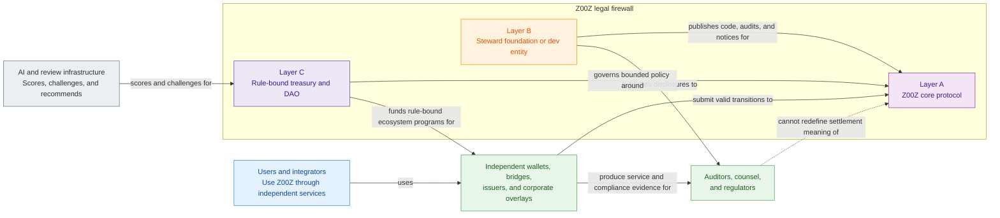

# Z00Z Legal Architecture Whitepaper

[TOC]

Version: 2026-07-09

*Status: Full draft through Sections 1–20 and Appendices A–C.*

This document is the legal-architecture companion to the main Z00Z protocol papers. It is drafted in full prose through the main sections and the current appendix set. Future revisions may still tighten wording, add jurisdiction-specific counsel notes, or expand operational artifacts, but the document no longer relies on outline-only appendix stubs for Appendices A–C.

## Key Terms Used In This Paper

This paper defines legal-boundary terms locally and reuses shared protocol nouns
through [Z00Z Corpus Terminology And Abbreviations Reference](Corpus-Terminology-Reference.md) where the broader corpus already has a stable meaning contract.

- **Neutral protocol:** A published cryptographic and settlement system that validates correctness, finality, and policy boundaries, but does not itself custody funds, open accounts, route conversions, or administer payments as a business.
- **Steward:** A legal wrapper or coordination entity whose legitimate functions are documentation, research, audits, IP holding, public explanations, and ecosystem support rather than operation of exchanges, bridges, wallets, or redemption desks.
- **Rule-bound treasury:** A treasury whose behavior is constrained by published rules, technical limits, challenge periods, and governance boundaries rather than by open-ended human discretion.
- **Technical impossibility:** A real architectural limit under which the protocol does not possess the persistent accounts, identity registry, balance database, or service-layer records needed to behave like a financial intermediary.
- **Proof of Non-Control:** A recurring evidence discipline showing who does not have the power to redirect treasury, unilaterally upgrade critical components, curate the ecosystem, or silently convert the protocol into a managed service.
- **Independent issuer:** A third party that bears responsibility for its own asset design, reserves, disclosures, marketing, and regulatory obligations without transferring that responsibility to Z00Z core or its steward layer.
- **Compliance-profile wallet:** A wallet implementation whose disclosure, retention, or jurisdictional behavior is chosen above the base protocol for a particular user type, such as a corporate actor or regulated service provider.
- **Evidence Package:** A structured object that binds a transaction, proof, policy, and supporting metadata into a form that an enterprise, auditor, or counterparty can retain and verify.
- **Corporate Archive:** Long-lived records retained outside the base protocol by the actor that needs them for accounting, audit, tax, or regulated-service purposes.
- **Bad-use isolation:** A design posture that allows risky assets, interfaces, or service patterns to be isolated at the wallet, issuer, or regulated-service layer without turning the protocol core into a global censor or approval board.

## 1. Why Z00Z Needs A Legal Architecture Paper

Z00Z needs a legal architecture paper because privacy systems are not judged only by cryptography. They are judged by the combined effect of code, governance, interfaces, funding design, public claims, and the real distribution of operational control. A project can use correct privacy primitives and still collapse into exchange, custody, treasury-management, securities, or sanctions exposure if its organizational and interface layers recreate the functions of a managed financial service.

This paper therefore serves a different purpose from the main whitepaper and from a technical specification. It is not trying to prove that the protocol works cryptographically. It is trying to show how the protocol, the steward layer, the treasury layer, wallets, issuers, and external integrators must be separated if Z00Z is to preserve both of its central aspirations: strong privacy and a legally defensible non-intermediary posture.

The source documents converge on one hard conclusion. Legal risk cannot be reduced to zero if Z00Z remains a meaningful privacy system. Any architecture that promises complete safety is either overstating the case or silently moving the system toward a much weaker privacy model. The realistic goal is different: maximize defensibility, minimize avoidable operator behavior, and build evidence that the system is not a disguised managed service.

### 1.1 What This Paper Must Prove

The central claim of this paper is that Z00Z can be designed and presented as a neutral, self-custodial privacy protocol rather than as a money transmitter, VASP, exchange, custodial wallet operator, or centrally managed anonymous economy. That claim is only credible if three things are true at the same time.

First, the protocol core must remain narrow. It must validate settlement facts, policy constraints, and privacy-preserving ownership transitions without taking on application-layer behaviors such as exchange routing, custody, redemption, treasury payroll, identity management, or asset promotion. Second, any steward entity must be limited to coordination, documentation, legal defense, audits, and ecosystem support rather than financial operations. Third, the surrounding ecosystem must carry optional compliance and enterprise features above the core instead of pushing them back into consensus.

The paper must also prove a more practical point: after reading it, a founder, counsel, engineer, or wallet designer should be able to evaluate a proposed feature and answer a concrete question. Does this feature strengthen the legal firewall around Z00Z, or does it silently transform the project into a regulated or more easily targeted service surface? If the document cannot support that post-read action, it is not yet doing its job.

#### Reader Groups

The primary readers are founders and stewards who need a defensible role definition, counsel who need a coherent architecture to analyze, protocol engineers who need clear red lines, wallet teams who need interface constraints, and DAO or treasury designers who need to understand where discretionary behavior becomes dangerous. Secondary readers include bridge teams, independent issuers, market integrators, corporate adopters, and regulated services considering whether they can build above Z00Z without forcing the base protocol to become something it is not.

These audiences do not all need the same depth of legal theory, but they do need one shared map. The founder needs to know what not to control. The engineer needs to know what must never be implemented in the core. The wallet team needs to know which UX conveniences are actually legal hazards. The issuer needs to know that protocol support is not endorsement. The regulated service provider needs to know what obligations remain theirs even if Z00Z offers selective disclosure or evidence standards.

#### What The Final Paper Must Not Become

The final paper must not become a generic compliance memorandum pretending to cover every jurisdiction. It must not become a marketing document for token demand, price appreciation, or “future ecosystem value.” It must not become a manifesto about privacy rights with no operational consequences. It must not promise that a privacy protocol can become legally untouchable through wording alone.

Instead, it has to stay close to architecture. It should describe which roles must remain separate, which powers must be absent or tightly bounded, which services must not be operated by core entities, which disclosures are optional, and which claims should never be made in public materials. The paper fails if it sounds impressive but cannot guide product, governance, or legal-entity decisions.

## 2. Legal Analogies And Comparison Boundary

Legal framing is not a cosmetic layer. Regulators, courts, counterparties, journalists, exchanges, and banking partners reach for analogies before they read a protocol deeply. If Z00Z is framed as a privacy-preserving settlement protocol with optional compliance-capable overlays, it enters one set of conversations. If it is framed as a managed anonymity service, an “official anonymous stablecoin stack,” or a treasury-driven covert economy, it enters a much more hostile set of conversations before its actual design has even been examined.

That is why comparison discipline matters. The project needs good analogies that clarify its legitimate shape and bad analogies that it actively refuses. The source documents repeatedly circle three relevant poles: Ethereum as the strongest example of a neutral base protocol supporting many external economies, Zano and Zcash as examples of privacy-defensible positioning with selective disclosure logic, and Tornado Cash as the wrong comparison because it invites a service-oriented mixer narrative that Z00Z should avoid.

### 2.1 Why Z00Z Needs Comparative Framing

There are at least three candidate framing strategies available to Z00Z, and they do not carry the same legal consequences.

The first is the most dangerous: present Z00Z primarily as anonymous digital cash infrastructure, emphasize that trails disappear, and allow the project to look like an operator-backed private economy. This framing has rhetorical force, but it is the weakest legal choice because it collapses privacy, treasury, wallets, and marketing into a story about obfuscation first and architecture second.

The second is too defensive in the opposite direction: present Z00Z as a compliance-first chain whose main role is to selectively reveal information and satisfy external requirements. That framing may seem safer at first glance, but it weakens the distinctive reason for the protocol to exist while still not solving the core problem if service-like behavior remains present elsewhere.

The third framing is the strongest and should be the recommendation adopted by this paper: Z00Z is a neutral privacy protocol with strict self-custody boundaries, narrow settlement semantics, and optional disclosure-capable layers above the core. This keeps the project aligned with its actual design advantages while avoiding the service-operator narrative that makes privacy projects most vulnerable.

#### Ethereum As A Neutral-Protocol Analogy

Ethereum is the most useful analogy for one narrow but important reason: it demonstrates the distinction between the legitimacy of a base protocol and the legitimacy of every asset, app, or market built on top of that protocol. Ethereum is not automatically the issuer of all ERC-20s, the operator of every bridge, or the guarantor of every DeFi outcome. That separation is imperfect in practice, but as a legal and conceptual boundary it remains powerful.

Z00Z should use that analogy to make one precise point. The protocol can host or settle many external asset relationships without inheriting the legal nature of every issuer, wrapper, local economy, or integrator. That does not mean “anything goes.” It means the protocol’s role must be defined narrowly enough that external asset legitimacy remains external.

The analogy has limits, and the paper should state them openly. Z00Z is not trying to be another public, fully composable smart-contract chain. Ethereum’s strongest property is public composability. Z00Z’s strongest property is privacy-native settlement and ownership semantics. The Ethereum comparison should therefore be used for protocol neutrality and ecosystem separation, not for feature imitation.

#### Zano And Zcash As Privacy-Defensible Analogies

Zano and Zcash are useful because they make visible a different kind of boundary: privacy can be a first-class design goal without forcing the protocol itself to become a regulated service surface. The most valuable lessons here are not brand-level comparisons. They are architectural and narrative lessons.

From these systems, Z00Z can borrow the idea that privacy must be defended as a legitimate property of user-controlled infrastructure rather than sold as law evasion. It can also borrow the idea that selective disclosure and scoped view capabilities create a more defensible story than pretending that no legitimate disclosure path should ever exist.

The recommendation is not to copy any one system wholesale. It is to borrow the strongest defensible elements: self-custody, privacy by default or by strong policy, optional disclosure for those who need it, and a refusal to let the core entity become a hosted conversion or custody service. In legal architecture terms, Zano and Zcash are better analogies for privacy legitimacy than Ethereum, but weaker analogies for ecosystem neutrality. Z00Z needs both families of comparison working together.

#### Tornado Cash As The Wrong Analogy

Tornado Cash is the comparison Z00Z most needs to resist. The problem is not only sanctions history. The deeper issue is narrative shape. A mixer analogy pushes observers toward a model in which the key question becomes whether the system exists primarily to sever traceability between visible funds. That is a much narrower and more hostile frame than the one Z00Z needs.

If Z00Z allows its official entities or official interfaces to look like treasury-backed anonymization tooling, it will invite exactly the sort of interpretation it is trying to avoid: operator-controlled infrastructure whose legal meaning is inferred from obfuscation, not from neutral settlement design. The same danger appears if the project runs official bridge flows, official wallet conversion surfaces, or anonymous treasury payout systems that resemble managed value movement.

The final recommendation for this section is therefore explicit. Z00Z should present itself publicly through a combined frame: Ethereum-like protocol neutrality, Zano- and Zcash-like privacy legitimacy, and an express rejection of Tornado-style service analogies. If the project must choose one sentence, it should choose the one that preserves both sides of that line: privacy-preserving settlement protocol, not anonymization service.

## 3. Core Legal Thesis

The core legal thesis of Z00Z is not that privacy defeats regulation. It is that a privacy-preserving protocol can be organized so that the protocol remains a protocol, the steward remains a steward, the treasury remains rule-bound, and optional compliance-capable behavior remains above the core. This is the constitutional layer of the paper because every later claim depends on it.

The source material points to three broad architectural postures. One posture is openly dangerous: founder-controlled privacy infrastructure with anonymous treasury payouts, operator-like interfaces, and marketing that implies future asset appreciation or hidden managed coordination. A second posture is safer in appearance but strategically weak: concede too much of the protocol’s privacy-native design and allow the project to drift toward service-layer compliance management at consensus level. The third posture, and the one this paper should recommend, is a narrow neutral core with optional outer layers and a public discipline of non-control.

This section adopts that third posture as the canonical recommendation for Z00Z. The rest of the document should be read as a practical elaboration of it.

### 3.1 Protocol Minimalism Covenant

The protocol minimalism covenant is the rule that Z00Z core must never become the application layer. The protocol exists to validate ownership transitions, policy constraints, proofs, replay boundaries, and settlement semantics. Each time a convenience feature is proposed, the first question should be whether it preserves that narrow role or quietly turns the core into a market operator, policy manager, identity service, or financial gateway.

The practical reason for this covenant is simple. The broader the core becomes, the easier it is for outsiders to argue that Z00Z does not merely publish software but actively operates an ecosystem of services. The legal reason is even sharper: many of the most dangerous functions are not introduced as obvious “financial services.” They enter through convenience surfaces, curated defaults, embedded routing, official dashboards, pricing layers, and governance tools that appear harmless until the entire stack begins to look like one managed product.

#### Neutral Interface Rule

Official interfaces should expose protocol capabilities without becoming recommendation engines, listing venues, promotional showcases, or hidden execution desks. A neutral interface may show technical status, observed policy settings, receipts, or disclosure options. It should not select winners, advertise opportunity, or blur the line between software access and economic endorsement.

This rule matters because legal exposure often shifts from protocol to interface faster than teams expect. A neutral core can be undermined by a wallet or frontend that behaves like a financial portal. Once the project’s own surface begins recommending assets, steering users toward conversions, or highlighting “featured” opportunities, the distinction between protocol and operator becomes harder to defend.

#### Risk Labels Without Endorsement

Z00Z should prefer observed risk labels over approval language. The difference is not cosmetic. A label based on visible facts such as concentration, liquidity depth, quorum size, probation tier, archive availability, or issuer disclosure posture informs the user without claiming that the protocol has evaluated the economic legitimacy of the asset.

The recommended posture is therefore descriptive rather than certifying. Z00Z can say that an asset has one aggregator, low liquidity, no archive standard, or short history. It should not say that an asset is “approved,” “official,” “safe,” or “recommended.” The former preserves neutrality. The latter moves the project toward a rating or endorsement role it should avoid.

#### No Price Oracle Or Policy Oracle In The Core

The core should not carry a canonical price oracle, return expectation model, ideology score, or policy-quality oracle. Once the protocol begins to embed live market semantics or political judgments into its settlement rules, it stops looking like neutral infrastructure and starts looking like an active market governor.

This is not a claim that price information or policy reasoning can never exist anywhere in the ecosystem. It is a boundary claim. Those layers may exist externally, with all the additional responsibility that implies, but they should not be smuggled into consensus as if they were part of basic settlement validity.

#### Do-Not-Operate Zones

The covenant requires explicit do-not-operate zones. At minimum these include exchange operation, bridge custody, market making, official ramp-in or ramp-out services, official stablecoin issuance or redemption, hosted wallet custody, launchpad operation, and discretionary treasury capture. These zones exist to prevent the steward and core identity of Z00Z from expanding into the service categories most likely to trigger intermediary-style regulation and direct founder exposure.

The recommendation is to define these red lines early and publish them as commitments, not as after-the-fact excuses. A protocol that says in advance what it will not operate is easier to defend than one that improvises boundaries only after pressure appears.

### 3.2 Technical Impossibility As A Boundary

Technical impossibility is one of the strongest arguments available to a privacy protocol, but it works only when it is real. The argument is not “we refuse to comply.” The argument is “the base protocol does not collect or retain the account and identity structures that would make it function like a VASP or custodial service in the first place.” That distinction matters legally and conceptually.

Z00Z can use this boundary only if its architecture truly supports it. If the base system has no global account registry, no permanent address graph, no protocol-level identity book, no service-managed balances, and no canonical internal customer ledger, then many service-style duties cannot attach to the protocol layer in the same way they would attach to an exchange or hosted wallet. That does not eliminate all risk, but it changes the character of the argument from refusal to architectural limit.

#### What The Protocol Can Never Know

The protocol should be designed so that it does not know who a user is, does not maintain a permanent named account for that user, does not keep a global balance row tied to that user, and does not possess the off-chain identity information that regulated service providers often must collect for themselves. It should also not know, in any service-like sense, why a user made a transaction or which real-world counterparties stand behind a given private payment flow.

That is why wallet-local records, user-held disclosure tools, and separate enterprise archives matter. They allow evidence and compliance behavior to exist for those who need them without rewriting the base protocol into a surveillance database.

#### When Technical Impossibility Stops Protecting You

This defense weakens the moment the same organization recreates the missing knowledge elsewhere and then presents the overall system as one product. A protocol cannot convincingly claim architectural non-knowledge if its steward or official interface runs hosted wallets, keeps user-side records as a service, routes conversions, operates bridges, curates asset catalogs, or manages treasury payouts to user identities through centrally controlled processes.

For that reason, technical impossibility must be paired with service minimization. A narrow core without narrow surrounding entities is not enough. If the ecosystem’s official surfaces reintroduce the data and control that the protocol claims not to possess, the defense begins to look like theater rather than architecture.

### 3.3 Protocol Legitimacy Versus Asset Legitimacy

Z00Z must distinguish between two different questions. The first question is whether the protocol correctly enforces its own cryptographic and policy rules. The second is whether a given asset, issuer, wrapper, or local economy is economically sound, legally compliant, or ethically desirable. The protocol can answer the first question. It should not pretend to answer the second.

This distinction is one of the strongest shields available to a neutral protocol. If Z00Z verifies the validity of an ownership transition, that does not mean it guarantees the reserves behind an asset, the truthfulness of an issuer, the fairness of a market, or the legality of a redemption scheme. Those responsibilities remain with the actors who create and operate those external surfaces.

The recommendation is therefore explicit: Z00Z should publicly adopt the formula that it guarantees cryptographic validity, not economic legitimacy. That formula does not solve every problem, but it creates the right presumption for the rest of the ecosystem design.

#### Proof Of Non-Control

A mere assertion of non-control is not enough. The system should move toward a recurring proof discipline under which the community, counterparties, and outside observers can see whether founder or steward control actually remains. That means publishing, in some durable form, who can upgrade what, who controls emergency powers, whether treasury keys remain separated, whether timelocks are enforced, and whether agent or model updates can be made unilaterally.

The long-term recommendation is to make Proof of Non-Control a standing report rather than a one-time claim. Legal and reputational defenses become stronger when non-control is evidenced continuously rather than invoked only under stress.

#### Legal Decentralization Theater

The opposite of Proof of Non-Control is legal decentralization theater: the use of DAO or community language to hide continued founder or steward control over the decisive levers of the system. This happens when independent agents are curated in practice by one group, when treasury movement depends on a small operational circle, when official interfaces perform the real economic work, or when “community governance” exists only after a narrow inner circle has already selected the important outcomes.

The final paper should treat this as an architectural anti-pattern, not merely a reputational problem. Theater is dangerous because it can destroy the credibility of the entire legal firewall. Once control looks staged, every other claim about neutrality and non-operation becomes harder to defend.

## 4. Protocol Boundary And Responsibility Firewall

The strongest organizational recommendation in the source material is not a single entity and not a premature “DAO solves everything” narrative. It is a firewall model. The system should be legible as three distinct layers with different powers, different liabilities, and different public claims: a protocol layer, a steward layer, and a treasury or governance layer. The purpose of the firewall is not cosmetic decentralization. It is to prevent one entity from simultaneously looking like the protocol author, brand owner, treasury operator, wallet operator, bridge operator, and economic manager of a private network.

There are weaker alternatives. A single founder-linked company that develops the code, holds the brand, directs the treasury, and operates user-facing services is legally the easiest to understand and the hardest to defend. At the other extreme, an early-stage claim that “the DAO already exists” before the chain, governance tooling, and independent participation are real creates decentralization theater and can backfire quickly. The better recommendation is sequential and layered: begin with a narrowly scoped development or stewardship entity, launch the protocol as a separate rule system, and allow DAO-like governance and treasury logic to emerge only where the technical and operational conditions for real separation exist.

This section therefore adopts the three-layer firewall as the recommended baseline architecture for Z00Z.

**Figure 4.1 - Legal firewall system landscape.** The protocol, steward, and
treasury layers stay separate, while user-facing services and reviewers remain
outside the core settlement boundary.

### 4.1 Layer A — Z00Z Core Protocol

Layer A is the protocol itself: published code, cryptographic rules, settlement semantics, replay boundaries, and privacy-preserving ownership transitions. Its defensibility depends on remaining recognizably protocol-like. This means that Layer A should be discussed in the same conceptual category as other base protocols: a rules system that users and external services may interact with, not an institution that opens relationships with customers or acts on their behalf.

For Z00Z, this layer is especially sensitive because privacy features can cause outsiders to search for hidden operational control. The safest answer is not rhetorical. It is architectural. The protocol must not hold user assets, maintain user accounts, route conversions, manage redemptions, or operate a centrally controlled movement surface behind the scenes. If the core is truly self-custodial and rule-governed, it can be defended as infrastructure. If it quietly acquires service behavior, that defense weakens quickly.

#### What The Core Is Allowed To Be

The core is allowed to define canonical transaction validity, private ownership and settlement semantics, proof verification rules, nullifier or replay boundaries, asset-policy enforcement, checkpoint or publication rules, and neutral standards that external wallets or services may implement. It may expose formats, verification paths, evidence-oriented objects, and other protocol surfaces that help external actors prove what happened without requiring the base protocol itself to become the keeper of their records.

This is the right scope because it keeps the protocol close to what only the protocol can do. It can decide whether a transaction is valid. It can decide whether a proof satisfies the rules. It can decide whether a policy boundary has been crossed. It should not decide which user deserves a conversion, which asset should be promoted, or which market deserves official liquidity support.

#### What The Core Must Never Become

The core must never become a hidden operator surface. That includes direct custody, official exchange routing, official bridge custody, discretionary redemption logic, canonical price or yield management, issuer favoritism, or any form of centrally managed service path disguised as protocol convenience. It also includes softer failures, such as designing the base layer so that external economic participation is possible only through a founder- or steward-controlled service.

The practical test is simple. If removing the steward entity would stop ordinary users from being able to hold and transfer Z00Z under the protocol’s published rules, then the core is still too dependent on a service layer. The legal test is equally direct. If core behavior looks like the project itself is processing, routing, redeeming, or administrating value for users, then the project has moved out of the strongest neutral-protocol posture.

### 4.2 Layer B — Steward Foundation Or Dev Entity

Layer B is the steward layer: the entity, or carefully bounded set of entities, that holds trademarks or IP, signs audit contracts, publishes documentation, coordinates legal defense, and keeps public-facing stewardship from collapsing into personal founder exposure. The key point is functional, not merely jurisdictional. A foundation company, nonprofit, or development entity can all be used badly. None is a magic shield. What matters is whether the entity’s real activity remains limited to stewardship rather than operation.

The best recommendation from the source material is staged. Before launch, a conventional development entity or nonprofit-style wrapper is often the cleanest way to employ developers, pay vendors, commission audits, and publish documentation. Over time, a steward foundation or equivalent wrapper may be preferable as the long-lived holder of IP, legal coordination, and public risk disclosures. But whichever form is chosen, the mission must stay narrow: support the protocol as infrastructure, not operate it as a financial business.

#### Allowed Steward Functions

The steward may maintain repositories, publish specs and notices, coordinate audits, support research, hold domains or trademarks, pay for legal opinions, fund bounded ecosystem grants, and explain the protocol’s design and limits to the public. It may also help produce governance process documents, treasury policy documents, evidence standards, and public risk disclosures. These are stewardship functions because they support understanding, maintenance, and institutional continuity without putting the entity into the position of moving user value as a business.

This list should remain intentionally narrow. The steward can help the protocol exist. It must not become the hands through which the protocol economically acts.

#### Forbidden Steward Functions

The steward must not be the bridge operator, the hosted wallet operator, the exchange layer, the market maker, the fiat ramp, the redemption desk, the official stablecoin sponsor, the token approver, or the discretionary anonymous payroll engine of the ecosystem. It must also not sell the fiction that it merely “supports” such services while actually controlling them through affiliates, internal teams, or closely managed grants.

This prohibition is where many legal architectures fail in practice. Projects often preserve the right words at protocol level but then centralize the highest-risk functions inside a foundation, lab, or “official app” stack. The firewall exists precisely to prevent that drift.

### 4.3 Layer C — Autonomous Treasury And Rule-Bound DAO

Layer C is the governance and treasury layer. It is also one of the places where legal risk is most easily reintroduced after a clean protocol design. The central distinction here is between a rule-bound treasury mechanism and a human-controlled payout desk. A treasury that behaves like an internal fund, payroll office, or managed promotion engine can make the entire system look centrally controlled even if the protocol itself remains narrow.

The recommended approach is to treat the DAO, where one exists, as an on-chain rule system that emerges after launch rather than as a legal fiction claimed in advance. Before launch, the project should not pretend that a real DAO already exists if real power still sits with founders or a small company. After launch, governance should become credible only to the extent that the rules, timelocks, challenge paths, and non-control boundaries are real.

#### Rule-Bound Treasury

In the recommended model, treasury distributions are bounded by published categories, evidentiary standards, challenge periods, payout caps, and execution rules that are understandable before any particular payment is made. This does not eliminate disagreement, but it reduces the appearance that one person or one inner group is selecting favored recipients in a private system.

The more the treasury can be described as a protocol mechanism with visible limits rather than as a discretionary human committee, the stronger the legal firewall becomes. That is why later sections place such weight on work packages, challenge rights, appeal paths, and explicit negative-value filters.

#### Autonomous Treasury Protocol Formula

The cleanest public formula for Layer C is simple and should remain consistent across whitepapers, governance policy, treasury policy, and steward communications: fixed `Z00Z` supply; disclosed, vested, and locked founder allocation; network-directed reserves locked at genesis in autonomous smart contracts or equally hard on-chain rule modules; AI and agent layers that score, challenge, and recommend rather than directly move funds; ordinary execution that follows published conditions automatically after the challenge window; and large parameter changes that require `Z00Z`-holder governance plus timelocked activation.

The final clause is decisive: no founder, foundation, council, or narrow signer group should retain unilateral override over treasury movement, evaluator replacement, reward routing, or emergency redirection of ordinary budgets. A multisig may still exist for tightly scoped security containment, but a multisig that can stop, redirect, or repurpose treasury at will is not a rule-bound treasury in substance. It is a human-controlled fund with extra ceremony.

#### Discretionary Payer DAO

The alternative model is the dangerous one: a DAO that is a DAO in name but, in practice, behaves like a manual grant committee, a marketing fund, or a payroll desk for a privacy ecosystem. That model is attractive because it is flexible. It is also attractive to critics, because it ties governance, financial discretion, and founder influence back together.

For Z00Z, the recommendation is categorical. Do not let the DAO become the founder’s payout tool, the steward’s unlicensed operating arm, or the ecosystem’s anonymous patronage machine. Once that happens, the legal distinction between protocol and operator begins to collapse.

### 4.4 Separation Proofs, Barriers, And Records

The firewall is only real if it can be shown in operational facts. That means separate keys, separate legal mandates, separate contracts, separate bank or fiat relationships where applicable, separate governance documents, and separate public explanations of authority. It also means being able to demonstrate what a steward entity cannot do, not only what it says it would prefer not to do.

This section should be read as the bridge between design and evidence. The protocol can declare boundaries, but counterparties, counsel, and critics will ultimately look for who signs, who can upgrade, who can move treasury, who can launch an official surface, and who can override a decision path. If those questions do not have clearly separated answers, the legal architecture remains incomplete.

#### Separate Keys, Accounts, And Mandates

The first separation test is technical and organizational. The steward should not hold the live treasury key. The founder should not hold the bridge admin key because there should not be an official bridge custody function to begin with. Wallet or interface operators, where independent third parties exist, should not share signing authority with the steward as a matter of default architecture. Bank accounts for a development company or foundation should not be casually mixed with protocol-controlled reserves or user-facing service flows.

Mandates must be just as clean. A person acting as counsel to the steward is not thereby the operator of the protocol. A developer working under a development contract is not thereby a treasury allocator. A contributor badge is not a spokesperson mandate. In a defensible architecture, roles are narrow enough that authority does not bleed automatically across layers.

#### Required Documentary Barriers

The second separation test is documentary. The architecture requires a stewardship charter, governance policy, treasury policy, grants policy, public non-operation statements, communication policy, and eventually recurring non-control reporting. These documents are not optional polish. They are part of the evidence that the project has tried to encode limits into its own behavior rather than relying on informal trust.

The recommendation is to treat documentary barriers as operational controls. If a role or red line matters, it should appear in a durable policy or charter. If a power is claimed to be absent, there should be a place where that absence is described and can later be checked against reality.

## 5. Stewardship, Governance, And Founder Safety

The governance problem is not solved by pretending founders do not exist. It is solved by defining a founder role that is visible, bounded, and progressively narrowed over time. The source material rejects two opposite mistakes. The first is permanent founder control over agents, models, treasury, upgrades, and public narrative. The second is fake instant decentralization, where a project claims DAO autonomy before the chain, rules, and participation conditions required for meaningful separation are in place.

The best recommendation is a phased model of progressive decentralized stewardship. In that model, early powers are acknowledged rather than hidden, temporary launch powers are disclosed rather than denied, and every stage has both functional justification and a sunset path. This is safer than pretending a launch needs no emergency structure at all, and far safer than claiming full decentralization while founders still hold decisive levers.

### 5.1 Phase 0 — Pre-Launch Development

Before launch, there is no reason to pretend that a full DAO already exists. At this stage the honest and legally safer position is that a development team or steward entity is designing, documenting, and preparing the protocol for launch. The key requirement is not absence of all control. It is truthful disclosure of what control exists, why it exists, and how it will be limited or sunset over time.

This phase should therefore be governed by launch disclosure rather than decentralization theater. The project should disclose who authored the initial protocol, who signs genesis-related actions, what temporary powers exist, which powers do not exist at all, how the first upgrade path works, whether any emergency keys exist, and under what conditions those powers expire or transfer into more constitutional processes.

#### What Is Legitimate Before Launch

Before launch, founders and the development entity may write code, publish the whitepaper and legal architecture, define a protocol constitution, disclose founder roles, describe intended governance stages, commission audits, form the development or steward entity, and design a transparent initial distribution approach. They may propose temporary launch powers if those powers are publicly disclosed, bounded, and justified by concrete launch or security needs.

They may also describe intended treasury rules, model-governance rules, and early agent frameworks, provided that those descriptions are honest about what is live, what is planned, and what remains contingent on future launch conditions.

#### What Must Not Be Claimed Before Launch

What must not be claimed is just as important. The project should not say that treasury independence already exists when founders still retain decisive power. It should not say that a DAO already governs the system if governance is still aspirational. It should not claim that founder influence has disappeared if launch keys, model paths, or emergency roles still depend on a small known circle.

It should also not use pre-launch marketing that encourages users to rely on managerial efforts, hidden future coordination, or founder-directed value creation. The earlier the project overstates autonomy, the harder it becomes to defend later.

### 5.2 Phase 1 — Launch Council With Hard Limits

An early-stage protocol may need a launch council, but only if that council is clearly temporary, narrowly scoped, and visibly constrained. The right legal posture is not “no one can do anything in an emergency,” but neither is it “a small board may run the network until it feels comfortable letting go.” The lawful and defensible middle path is a launch council whose job is security stabilization, not economic management.

This body should therefore be treated as a launch-safety instrument. Its existence must be publicly explained, its powers must be enumerated, and its sunset conditions must be explicit. Membership should not consist only of the founder and close affiliates if the project intends to rely on this council as evidence of bounded rather than personal control.

#### Emergency And Security Powers Only

The launch council may pause or slow a critical exploit path, delay a clearly malicious upgrade, trigger an emergency audit, publish a security notice, or propose a bounded patch under published procedures. These are powers of containment, not powers of economic rule. They should be governed by multisig discipline, timelocks where possible, post-action reporting, and automatic expiry of emergency actions if no further constitutional approval occurs.

The broader principle is that the council may act to keep the protocol from immediate failure, but not to redefine the protocol’s economic future on its own authority.

#### No Treasury, No Grants, No Listings

The launch council must not move treasury, choose grantees, set reward outcomes, approve listings, decide which assets are official, or change AI or agent scoring alone. It must not mint new supply, redirect user funds, or convert itself into a standing governance board over the ecosystem’s economic life.

This separation is essential because emergency powers are tolerated only when they are plainly not a back door into treasury or market control. Once security authority and financial authority are merged, the launch council starts to look less like a protective device and more like a management committee.

### 5.3 Phase 2 — Agent Registry And Permissionless Participation

The next transition point is the move from founder-adjacent or bootstrapped evaluation to an agent registry that can become semi-permissionless and eventually more fully contestable. This matters because a treasury, reward, or compliance-adjacent layer controlled by “the founder’s agents” will still be read as founder control even if those agents are implemented in code.

The safest design is therefore a registry model in which agents are known through public keys, model or code hashes, benchmark behavior, role definitions, and explicit acceptance of challenge and slashing rules. Early bootstrapping may be unavoidable, but the direction of travel must be toward widened participation rather than permanent personal selection.

#### Agent Registry Instead Of Founder-Named Agents

The registry should replace the language and reality of “my agents” with a published capability framework. Evidence agents, fraud agents, valuation agents, challenge agents, and other roles may exist, but they should be registered through visible criteria rather than personal designation alone. A credible registry asks each operator to publish identity and model commitments, submit to reproducibility expectations, and accept penalties for manipulative or non-compliant behavior.

This does not magically eliminate coordination risk, but it does move the system away from one of the most dangerous appearances: a founder-controlled AI layer that quietly decides who gets paid and on what logic.

#### Appeal, Challenge, And Fraud Veto

Registry-based participation is only defensible if it is contestable. That means challenge periods, fraud review paths, appeal mechanisms, and public evidence of why an agent outcome can be disputed. Without contestability, a registry can still collapse into silent centralization even if many agents appear on paper.

The recommendation is to design challenge and appeal as part of legitimacy rather than as optional afterthoughts. A system that can admit disagreement without secret override is easier to defend than a system that claims automation while hiding its real adjudicators.

### 5.4 Phase 3 — Model Governance And Long-Run Decentralization

Model governance is one of the most sensitive parts of the long-run architecture because whoever can silently change the scoring logic can often indirectly control treasury outcomes, agent legitimacy, or economic policy. In legal terms, the project can lose the benefit of its decentralization story if hidden model control remains concentrated even after the rest of the system appears distributed.

For that reason, model governance should be treated as constitutional, not merely technical. Model hashes, model cards, benchmark results, change notes, adversarial testing, review windows, and delayed activation should become ordinary expectations for significant scoring or policy-model changes. The goal is not to freeze the system. The goal is to ensure that upgrades remain visible, challengeable, and attributable to a process rather than to one person’s private push.

#### Upgrade Classes And Bounded Authority

Not every change should be governed the same way. Technical patches, security emergencies, economic-policy changes, and model or scoring changes do not carry the same legal or governance implications. The source materials are correct that a single all-powerful upgrade key is too blunt and too dangerous.

The recommendation is to classify upgrades and assign different thresholds, evidence expectations, and activation delays to each class. A technical patch may justify a faster path than an economic-policy rewrite. A security emergency may justify a temporary pause but not treasury movement. A model change that affects value routing should face stronger review than a minor implementation correction. Bounded authority begins by refusing to pretend these are all the same kind of action.

#### Founder Control Over Models And Rewards

If a founder, steward, or small insider group can unilaterally update the model that scores work, routes value, or interprets evidence, then that actor may still control the treasury in substance even if not in formal title. That is why the slogan “founder may propose, founder may not dispose” is so useful. It captures the right asymmetry. Founders may continue to write, propose, explain, research, and advocate. They should not retain final unilateral disposal power over models, rewards, or policy routes.

This is one of the clearest places where legal decentralization theater can appear. The paper should say so directly.

### 5.5 Founder Allocation, Lockups, And Caps

Founder allocation is not only a tokenomics question. It is a legal-architecture question because undisclosed concentration, liquid insider control, or privileged treasury access can turn the rest of the governance narrative into fiction. A privacy protocol that asks observers to trust its non-control story while hiding founder holdings or governance leverage creates exactly the kind of contradiction critics will exploit.

The safer posture is disclosure, lockups, and visible governance caps. The purpose is not to deny that founders contributed meaningfully. The purpose is to show that contribution does not entitle one actor to hidden strategic control over the asset and policy environment after launch.

#### Disclosed Allocation And Governance Cap

The project should disclose founder allocation, explain lockups and vesting discipline, and define the governance limits attached to concentrated founder holdings. This is the most honest way to avoid later claims that the protocol’s economic and governance trajectory depended on an undisclosed inner balance of power.

The recommendation is not that founders must be absent. It is that their economic role must be visible enough that the rest of the architecture can be assessed honestly.

#### Hidden Wallets, Unlocked Control, And Founder Treasury Access

Hidden wallets, undisclosed associated parties, direct founder treasury access, and large unlocked governance influence destroy the credibility of nearly every previous section. They make Proof of Non-Control weak, they make the firewall suspect, and they intensify securities-style and control-person narratives.

This subsection should therefore remain blunt in the final paper. Some mistakes can be repaired gradually. Hidden control is not one of them.

## 6. Treasury, Funding, And Useful-Work Boundaries

Treasury design is where many otherwise defensible privacy systems become much harder to defend. A treasury can make the project look like a research commons, a bounded infrastructure reserve, or a neutral protocol support mechanism. It can also make the project look like a payroll office, discretionary marketing fund, or centrally managed economic engine. The difference depends on how funds enter, how they are distributed, what evidence is required, and whether human discretion remains decisive.

The source documents point to three possible payout postures. The first is fully anonymous treasury payout with no compliance-adjacent screening and minimal external evidence. That is the most philosophically pure and the weakest legally. The second is public-work payout without identity disclosure, where the system pays for objectively verifiable outputs rather than for unknown persons as such. That is materially safer and should be the default for early useful-work design. The third is privacy-preserving attestation, where contributors can remain publicly private while presenting limited credential-style assurances for higher-risk or higher-value grants. That is the strongest compromise when additional defensibility is required.

The recommendation adopted here is therefore layered. Z00Z should avoid protocol-revenue dependence, prefer rule-bound treasury logic, default to evidence-bound public-work rewards, and reserve stronger attestation pathways for cases that need them. Fully anonymous rewards without evidence or attestation should not be the canonical default model.

### 6.1 Why Discretionary Treasury Is Dangerous

Treasury control is one of the most legally dangerous surfaces in the entire architecture because it concentrates too many inferences in one place. A discretionary treasury can make the project look like an employer, promoter, managed fund, operator, or sanctions-sensitive payment coordinator even when the protocol core itself remains narrow. For a privacy system, this effect is amplified because outside observers will assume the worst if hidden value movement appears coupled to insider discretion.

The safest treasury is not the one with the most ambitious story. It is the one whose categories, caps, and execution rules are visible enough that outsiders do not need to infer hidden patronage or managed distribution behind the scenes.

#### Anonymous Rewards Without Evidence Or Attestation

Fully anonymous treasury payouts to arbitrary recipients are the hardest version of useful-work economics to defend. They make it difficult to show why a payment occurred, difficult to separate work from patronage, and difficult to respond to obvious concerns around sanctions, fraud, tax treatment, and Sybil behavior. Even if the protocol is not a VASP, this model creates the appearance of unmanaged outbound value flows in a privacy system.

This paper does not say such payouts are impossible in every circumstance. It does say they should not be normalized as the default model for a serious ecosystem reserve. If Z00Z wants the strongest legal architecture, it should begin from public-work evidence or privacy-preserving attestation rather than from pure anonymous reward routing.

#### Treasury As Payroll, Founder Tool, Or Promotion Desk

The treasury must not look like payroll for insiders, a founder-directed growth fund, a user-acquisition machine, or a sponsor of market excitement. Once treasury behavior rewards hype, price talk, insider preference, or opaque promotion, the legal story shifts away from infrastructure support and toward active management of an economic product.

The recommendation is to draw a hard boundary between treasury support for bounded public goods and treasury activity that resembles branding, pump incentives, market making, or undisclosed labor relationships. The protocol is safer when the reserve supports verifiable infrastructure, security, documentation, and integration work rather than narrative manipulation.

### 6.2 Rule-Bound Treasury Design

Rule-bound treasury design means that treasury behavior is governed by published categories, evidence requirements, payout caps, challenge periods, and execution logic that can be inspected before any particular transfer occurs. This does not mean every payment becomes trivial. It means the criteria for lawful payout should exist before the payout and should not depend on private mood or insider preference.

For useful-work specifically, the strongest structure is a staged evaluation path. Evidence agents confirm that work exists. Fraud-oriented review tries to disprove the claim. Impact or valuation review estimates usefulness and bounded compensation. A challenge window allows contestation. Only then should treasury execution be authorized. This keeps AI or agent layers in the role of evaluators rather than direct money movers.

Where higher-value or higher-risk grants require additional protection, the best compromise is privacy-preserving attestation rather than either full public identity exposure or fully unchecked anonymity. This allows the system to remain privacy-respecting without treating treasury as blind patronage.

That does not mean project-level KYC should become the default gate for grants. The safer recommendation is the opposite: ordinary grant participation should not require blanket KYC or AML onboarding at protocol or steward level. Where stronger screening is genuinely needed, Z00Z should prefer narrow privacy-preserving attestations or move the program into a separately responsible regulated-service context rather than converting the core ecosystem into an identity collector.

#### Treasury Risk Caps And Payout Limits

Treasury motion should be capped by category, by period, and by per-award ceiling. A low-risk documentation grant should not have the same maximum exposure as a multi-month security deliverable. A month of activity should not be able to exhaust the reserve through one evaluation burst. Exceptional-case logic, if it exists at all, should be rare, visible, and separately governed.

These caps are not only fiscal prudence. They are legal hygiene. Bounded payout logic makes it easier to explain that the treasury is a limited protocol mechanism rather than a discretionary investment or compensation vehicle.

#### Evidence-Bound Distribution

Every treasury flow should be tied to a work package, evidence bundle, formal policy trigger, or similarly intelligible event. The system should pay for demonstrated outputs or clearly defined protocol events, not for vibes, alignment, or unstructured requests. Work packages, hashes, timestamps, receipts, accepted categories, and conflict disclosures all strengthen this posture.

The more a payout can be explained through evidence rather than personality, the easier it becomes to defend both the treasury and the privacy design around it.

### 6.3 Funding The Steward And Network Without Intermediary Drift

The steward and surrounding ecosystem still need funding. The key question is how to fund maintenance, audits, and ecosystem work without making the protocol economically dependent on transaction flow, conversion activity, or market operation. The source materials correctly warn that direct protocol skim or automatic treasury participation in every private transfer creates a much more difficult legal story.

The recommendation is to favor voluntary contributions, bounded reserve mechanisms, external research support, and service revenue that sits outside the core protocol under its own legal and operational responsibility. A project that can survive without taking a percentage of all private movement is easier to defend than one whose business model depends on the volume of privacy-preserving transfers.

#### Voluntary Donations, Validator Contributions, And Rule-Bound Funding

Defensible funding models include voluntary donations, bounded validator or operator contributions, capped reserve pools, and separately contracted service work that does not rewrite the protocol into an intermediary. The common theme is that the protocol is not charging all users as a mandatory service operator. Instead, support is either voluntary, externally contracted, or constrained by prior governance rules.

This does not solve every monetization problem, but it preserves the most important boundary: the base protocol is not a business that earns more because more private transfers flow through it.

#### Validator Contribution Bands And Documented Voluntariness

If validator or operator contribution bands are used, voluntariness must be real rather than performative. The ability to contribute nothing should exist in principle, contribution ranges should be disclosed, and any associated benefits should not amount to covert exclusion from basic network participation. Otherwise a “voluntary” system can start to look like hidden taxation or mandatory protocol rent.

The recommendation is to document these bands clearly, keep them bounded, and ensure that optional contribution does not become the disguised price of access to the protocol itself. Peripheral benefits may be acceptable. Essential access rights should not depend on tribute.

#### Protocol Revenue From Transaction Flow, Third-Party Asset Promotion, Or Market Operation

The steward should not become economically dependent on anonymous transaction volume, third-party token promotion, exchange-like routing, launchpad activity, or market operations. Those revenue models tie the project’s financial interest directly to the expansion of precisely the activities that create the hardest legal questions.

The cleaner rule is simple: if the ecosystem can avoid earning because more private value flowed through managed or semi-managed surfaces, it should.

### 6.4 Proof Of Useful Work And Public-Work Rewards

Proof of Useful Work becomes most defensible when it is framed as payment for verifiable outputs under bounded criteria rather than as emission for belonging, hype, or undefined loyalty. The most important structural distinction is between pre-scoped work and open-ended post hoc rewards. Pre-scoped work, with known conditions and known reward ranges, is easier to defend. Open-ended work can still exist, but it requires stronger evidence, challenge, and valuation discipline.

The paper should therefore treat useful-work not as “mining” and not as anonymous growth farming, but as a constrained public-work economy. Contributors may remain pseudonymous. The system’s obligation is to evaluate work, not personality. Where risk is higher, privacy-preserving attestation can strengthen the model without requiring full public identity exposure.

#### Work Categories By Legal Risk

Work categories should be stratified by legal risk rather than only by technical domain. Low-risk categories include code, tests, audits, formal verification, documentation, localization, tooling, and integration work. Medium-risk categories may include technical education, tutorials, and ecosystem onboarding that remain informational rather than promotional. High-risk categories include price-promotion, referral campaigns, hype videos, inducement-style marketing, or any work whose main purpose is to stimulate speculative demand.

The recommendation is to launch useful-work systems with low-risk categories first and to treat higher-risk categories, if they are allowed at all, as exceptional and heavily constrained.

#### Negative Value Category And Rejection Logic

The system should include a negative-value category rather than assuming every submission merely deserves a lower score. Some work harms the ecosystem: fraudulent audits, fake integrations, manipulative promotion, bot-driven growth theater, misleading security claims, or instructional content that normalizes unlawful use patterns. These outputs should not simply score poorly. They should be recognized as harmful.

That recognition matters because it lets the treasury reject work for principled reasons instead of pretending the work was merely less valuable.

#### No Ideological Or Political Value Scoring

Useful-work systems should not reward ideological loyalty, personal allegiance, or political conformity in place of concrete outputs. A treasury that pays for “good vibes,” loyalism, or approved narrative performance becomes much harder to distinguish from managed patronage.

The safer principle is to evaluate evidence, quality, usefulness, and bounded deliverables. The more subjective and ideological the criteria become, the weaker the legal and governance story becomes with them.

#### Work Bonds, Challenge Periods, And Appeals

Work bonds, challenge periods, fraud veto paths, and appeals are not merely anti-spam mechanics. They are part of the legitimacy of the payout system. Small bonds may deter empty or abusive claims if they are used carefully and proportionately. Challenge periods allow independent actors to contest fraud or overpayment. Appeals reduce the risk that an opaque AI or agent stack becomes the final unreviewable arbiter of treasury motion.

The recommendation is to keep these protections proportionate and category-sensitive. They should reduce abuse without turning access to useful-work participation into a pay-to-play game.

### 6.5 Contributor Status, Mandate, And Representation

The contributor layer has its own legal risks. A treasury or grants system can accidentally create labor-law, agency, and representation problems if contributors are treated like employees, brand representatives, or guaranteed recurring recipients. This is especially important in a privacy-focused ecosystem, where public assumptions may outrun the formal role actually intended.

The safest posture is to define contribution as contribution. Some contributors may later require contracts, vendor treatment, or employment relationships in separate contexts. But the default useful-work model should not silently imply those relationships where they do not exist.

#### Contributor ≠ Employee

Useful-work or grant participation should not automatically create employment, agency, exclusivity, or guaranteed future payment expectations. The project should be explicit about that. Contributors may submit work, receive bounded rewards, and leave without becoming staff. They should not be presumed to represent the protocol, and the protocol should not presume perpetual control over them.

This does not eliminate all labor risk, because facts matter. It does, however, reduce the chance that the treasury is interpreted as a disguised payroll channel.

#### No Spokesperson Without Mandate

Community members, validators, agents, and rewarded contributors should not become official protocol spokespersons by implication. A contributor badge is not a public mandate. A grant recipient is not a communications officer. A validator is not the legal voice of the steward.

The recommendation is straightforward: official representation should require explicit mandate, and public communications policy should make that visible. This protects both the project and contributors from accidental misrepresentation.

## 7. Privacy, Selective Disclosure, And Compliance Architecture

Privacy is not a single setting. It is an architecture of visibility, retention, and controlled disclosure. A system that offers only full opacity will struggle with corporate, audit, and regulated-service adoption. A system that reacts to that pressure by pushing transparency into consensus will lose the very property that makes it distinct. The task of this section is therefore to define a visibility stack that preserves privacy by default while still making room for legitimate disclosure where users, enterprises, or separately regulated services actually need it.

The source materials converge on a four-mode model: fully private, selectively disclosable, corporate-auditable, and fully public asset modes. Those modes are not equally canonical. The recommended posture for Z00Z is that fully private ownership and user-controlled selective disclosure form the normal protocol lane, while stronger auditability or public visibility appear only as optional asset, wallet, or enterprise overlays above the core.

For consistency with the main whitepaper, this section should be read as an architectural and legal-policy map rather than as a claim that every visibility mode is already broadly shipped in the current transfer runtime. The live repository already supports the privacy-first settlement lane and some disclosure-oriented primitives, while fuller selective-disclosure and corporate-auditable workflows remain target overlays to be hardened over time.

### 7.1 Four Visibility Modes

The four-mode model should be presented as a hierarchy of optional visibility, not as four unrelated products. That ordering matters legally. If Z00Z treats every mode as equally native and equally central, the protocol can start to look like a general policy engine for regulated finance. If it instead treats visibility as an optional envelope around a privacy-first settlement base, then it preserves the logic that different legal and business contexts may require different evidence surfaces without redefining the protocol for everyone.

The recommendation is therefore explicit. Fully private mode and selective disclosure should define the default architecture. Corporate-auditable mode and fully public mode may be supported, but only as opt-in overlays bound to asset policy, wallet family, or enterprise workflow. They are extensions around the base, not a rewrite of its meaning.

#### Fully Private Mode

Fully private mode is the baseline self-custodial lane of Z00Z. In that mode the public network sees settlement artifacts such as commitments, proofs, and replay boundaries, but it does not receive a standing account graph, global balance ledger, or durable identity map. This is the strongest expression of the protocol’s technical-impossibility boundary and the mode that most clearly supports the claim that Z00Z is infrastructure rather than a hosted financial service.

That legal value depends on disciplined language. Fully private mode can be defended as digital-cash-style privacy, self-custody, and non-surveilled settlement. It should not be marketed as untouchable secrecy, law-evasion tooling, or proof that no legitimate disclosure should ever occur. The protocol is strongest when it says that privacy is the default condition of ownership, while accountability remains possible through user-controlled or separately governed disclosure paths above the core.

#### Selective Disclosure Mode

Selective disclosure mode is the most important bridge between privacy and ordinary legal life. In this mode a transaction remains private to the world, but the owner may reveal chosen facts to a chosen recipient for a chosen purpose. That purpose may be tax reporting, corporate audit, proof of payment, dispute resolution, proof of funds, court-directed production, or a counterparty-specific compliance question. The critical point is that visibility is granted intentionally and narrowly rather than by default.

This paper should treat selective disclosure as a required capability for a serious privacy protocol rather than as a concession. It gives lawful users a practical answer to the accusation that privacy means zero accountability, while preserving the distinction between read access and spend authority. The recommended legal framing is simple: privacy does not eliminate disclosure; it restores disclosure to the control of the actor who actually bears the legal and commercial need to disclose.

#### Corporate-Auditable Mode

Corporate-auditable mode exists for assets, wallets, or enterprise flows that require stronger retention and reporting discipline from inception. In this mode the asset may remain private to the public, while policy requires additional auditor-facing ciphertext, evidence bundles, archive hooks, or disclosure proofs that support payroll, supplier settlement, internal treasury control, invoice processing, or regulated internal workflows. The public does not gain universal visibility, but the enterprise cannot claim that the asset is managed with no auditable trail at all.

The recommendation is to keep this mode strictly optional and contextual. A corporate or institutional actor may decide that an asset should always be auditable to a designated audit key or evidence standard. That is legitimate for that actor. It does not justify converting the base protocol into a universal enterprise-reporting machine. Recordkeeping responsibility remains with the enterprise, issuer, or regulated service that selected this mode, not with Z00Z core or the steward.

#### Fully Public Asset Mode

Fully public asset mode should be available for asset families whose legal, governance, or commercial model benefits from open visibility. Public treasury assets, public community budgets, transparent grants, proof-of-reserve style instruments, or non-sensitive operating tokens may fit this category. The point is not that public mode is superior. The point is that protocol neutrality is strengthened when Z00Z can host both privacy-heavy and transparency-heavy assets without forcing either posture onto the other.

This mode should nevertheless be treated carefully. If public and private asset flows are mixed without discipline, deanonymization pressure can spread from transparent contexts into private ones. The safest recommendation is therefore to preserve clear labeling, clear wallet semantics, and clear mode boundaries. Public visibility may be a valid asset-level choice, but it should not become an implicit protocol-wide standard of legitimacy.

### 7.2 Scoped Disclosure Primitives

The visibility model above is only defensible if its disclosure primitives are narrow, legible, and structurally incapable of becoming a hidden backdoor. The wrong design would be a universal viewing capability that can silently expose whole-wallet history. The right design is a hierarchy of read-only disclosure tools that reveal only what a legitimate recipient actually needs and do so without transferring spend authority or redefining default protocol visibility.

The recommendation is to build disclosure around minimization. Z00Z should prefer scoped keys, purpose-bound evidence bundles, and provable match-to-commitment disclosures over broad read-all access. That design is not only better for privacy. It is also better for legal defensibility, because it shows that the system was designed to avoid unnecessary exposure rather than to create a latent surveillance switch.

#### View Keys, Audit Keys, And Scoped Viewing Keys

Not all disclosure keys should be equal. Incoming-only visibility, outgoing-only visibility, full audit visibility, and transaction- or period-scoped visibility serve different purposes and should not be collapsed into one master capability. A tax adviser may need a period-limited record. A court may need one disputed payment. A corporate auditor may need asset-specific accounting visibility. A counterparty may need only a proof of payment. These are different requests and should be served by different read-only primitives.

The recommendation is to prefer scoped viewing keys whenever possible: limited by asset, time range, transaction, counterparty, invoice, or evidence purpose. Broader audit keys may still exist for enterprise contexts, but they should be consciously chosen and explicitly governed. Under no circumstances should the steward, foundation, or protocol core possess a universal disclosure key over ordinary users. Once such a key exists, the legal story of self-custodial privacy begins to collapse.

#### Revocable Anonymity And Threshold Disclosure

Revocable anonymity is acceptable only if the revocation path is genuinely narrow and externally intelligible. It must never mean that the protocol secretly keeps everyone one step away from deanonymization. The better interpretation is much more limited: a user may choose to reveal specific information, a governed asset program may require conditional disclosure for its own participants, or a fraud- or legal-order process may unlock a tightly scoped evidence path under separate rules. That is a different claim from universal reversibility.

Threshold disclosure can help where no single actor should control sensitive release. A quorum-based mechanism may be appropriate for temporary grant review, narrow legal-order handling in a regulated overlay, or dispute-resolution flows where unilateral disclosure would be too dangerous. Even then, this paper should recommend caution. Threshold mechanisms belong in specific evidence or service contexts, not as a chain-wide emergency reveal feature. If the public comes to believe that Z00Z contains a standing collective backdoor, the protocol loses much of the legal and practical value it is trying to preserve.

### 7.3 Compliance Above The Core

AML, sanctions, Travel Rule, and jurisdictional pressure are real. The mistake would be to answer that pressure by turning consensus into a policy engine or by pretending it does not exist at all. The safer response is layered responsibility. The protocol remains a privacy-preserving settlement base. Wallets, enterprises, and regulated services decide whether they need additional disclosure, screening, or geographic controls for their own legal context.

This approach is also the cleanest way to preserve the technical-impossibility argument. If compliance features live above the core, then the protocol does not become the actor collecting customer information or enforcing jurisdiction-specific policy. The actors that do choose those features become the ones who bear the corresponding responsibility.

#### AML Oracles And Wallet-Level Opt-In

Wallet-level AML or sanctions tooling may be reasonable for users, asset issuers, or service providers who want additional defensibility in specific contexts. A wallet may choose to consult an external screening provider for higher-value transfers, recurring business flows, or regulated counterparties. An issuer may require a private attestation that a participant satisfies a defined eligibility rule. A service provider may maintain its own compliance workflow before allowing a transaction to proceed through its interface.

The recommendation is to keep all such verification above the base protocol and voluntary from the perspective of ordinary Z00Z use. The core should not contain a canonical AML oracle, a global clean-address registry, or a consensus rule that ordinary private transfers must pass third-party screening. Once those features become universal protocol obligations, Z00Z starts acting less like digital-cash-style infrastructure and more like a managed compliance service.

#### Geoblocking, Jurisdiction Profiles, And Regulated Wallet Modes

Jurisdiction-aware behavior belongs in interfaces, wallet families, and service wrappers rather than in consensus. An official website may geoblock certain regions. A regulated wallet may enable stronger reporting defaults, higher-friction asset modes, or restricted workflows for users in specific jurisdictions. A privacy-maximal wallet may do the opposite where lawful. A corporate wallet may apply recordkeeping and disclosure prompts by default. These are interface and product choices made above the protocol.

The recommendation is to formalize these differences through compliance-profile wallets or clearly described wallet modes. That allows Z00Z to acknowledge legal heterogeneity without claiming that one policy must govern all users everywhere. Geoblocking can help reduce exposure around official surfaces, but it should never be described as if it converts an open protocol into a closed system. It mitigates some distribution and interface risk. It does not solve all jurisdictional questions by itself.

### 7.4 Scheduled Payments And Anti-Structuring Controls

Scheduled and recurring payments deserve separate treatment because they are both commercially legitimate and unusually easy to misread. Payroll, rent, subscriptions, supplier settlements, treasury operations, and other periodic flows are normal economic behavior. Yet automation that repeatedly fragments value or creates suspicious patterns can look like structuring or laundering assistance if it is designed carelessly. The safest design is therefore to keep scheduling logic in wallets or enterprise tools that can add context, warnings, and optional disclosure behavior without redefining the core protocol.

This is another area where good legal architecture means disciplined restraint. Z00Z does not need a protocol-level transaction-monitoring system. It does need wallet and enterprise tooling that helps honest users avoid creating patterns that are difficult to explain later.

#### Legitimate Scheduling With Declared Economic Purpose

Recurring payments should be represented as recurring economic relationships, not as context-free automation. A business wallet or compliance-profile wallet may therefore ask for declared purpose, counterparty category, frequency, amount logic, invoice reference, or termination condition when a payment schedule is created. That information need not become public consensus data. It can remain local, encrypted, or selectively disclosable until the user or enterprise needs to justify the pattern.

The recommendation is to use this contextual layer to distinguish ordinary business behavior from suspicious fragmentation without pretending the protocol itself understands intent. Declared purpose is a wallet-side aid to lawful use and later explanation. It should not become a universal protocol memo field that every private transfer must carry forever.

#### Detection, Trusted Recipients, And Optional Disclosure Escalation

Wallet-side heuristics can legitimately warn users when recurring patterns look risky. Repeated near-threshold payments, synchronized bursts, or unexplained fragmentation may trigger a warning, a request for stronger context, or a suggestion to use an auditable receipt or selective-disclosure path. Trusted-recipient lists can reduce unnecessary friction for stable business relationships, while higher-risk or regulated-jurisdiction wallets may suggest optional AML screening or enhanced audit output for recurring flows above a chosen threshold.

The recommendation is to prefer warnings, education, and optional disclosure escalation over blanket prohibition. A regulated-service wallet may adopt stricter rules for its own users, but the base ecosystem should not convert ordinary scheduling into global surveillance or general censorship. The boundary remains the same as everywhere else in this paper: the protocol settles private ownership, while higher-risk compliance judgments belong to the wallets, issuers, enterprises, and services that choose to make them.

## 8. Data Retention, Evidence, And Archive Neutrality

Data retention is one of the clearest places where Z00Z must reject the assumptions of a public account chain without drifting into careless ambiguity. The protocol does not need eternal public transaction history in order to validate present ownership and prevent double spend. At the same time, lawful users, companies, and regulated services often do need durable evidence. The legal architecture therefore has to separate validation state from business recordkeeping instead of pretending that one storage layer can satisfy every function at once.

The recommended formula is straightforward and should be stated plainly. Z00Z retains the cryptographic state needed for settlement and long-run verifiability, while public transaction payloads may be limited to a dispute or challenge window and then pruned. Users, enterprises, auditors, and regulated services retain the records they actually need according to their own obligations. That is not evidence destruction. It is responsibility separation.

### 8.1 History Versus State

The distinction between history and state should be treated as foundational rather than incidental. Transaction history includes who sent value, to whom, in what amount, at what time, with what payload and dispute evidence. Validation state is different. It includes the active commitments, anti-double-spend state, state roots, checkpoint or epoch roots, and whatever cryptographic commitments are needed so future transactions can still be verified. A privacy protocol may legitimately want much less of the first than of the second.

That distinction matters legally because it allows Z00Z to avoid becoming a perpetual public surveillance archive without claiming that nothing remains verifiable. The correct statement is not that transactions disappear. The correct statement is that public payload availability may expire after a defined dispute window while cryptographic state commitments and verification anchors remain. This is the architecture of a state-retaining, history-pruning protocol rather than a protocol built around endless public replay.

#### Consensus State, Dispute Data, Wallet Records, Corporate Archives

The cleanest model is a four-layer retention stack. The first layer is consensus state: state roots, active commitments, nullifier or equivalent anti-double-spend state, supply commitments, and other objects required for future validation. The second layer is dispute data: proof packets, challenge evidence, temporary payloads, and similar material that needs to survive only for the duration of a defined challenge window. The third layer is wallet-local history: receipts, note discovery data, invoice references, local labels, and disclosure artifacts held by the user. The fourth layer is the corporate or audit archive: encrypted records, scoped disclosure material, accounting exports, and long-lived evidence retained by an enterprise or regulated operator.

The recommendation is to make this stack explicit in the paper so that different readers stop expecting the wrong layer to do the wrong job. Consensus is not bookkeeping. A dispute window is not a seven-year tax archive. A user wallet is not a global regulator portal. A corporate archive is not an obligation of the base protocol. Once those roles are separated, both the technical and legal story become much clearer.

### 8.2 Audit Receipts And Evidence Packages

If public payloads are not meant to live forever, then durable proof has to move into standardized evidence objects. This is where audit receipts, evidence packages, disclosure packages, and archive formats become essential rather than optional polish. Without them, pruning will look like loss. With them, pruning becomes a deliberate privacy and scaling choice combined with a verifiable handoff to the actor who actually needs long-term records.

The recommendation is to define these artifacts as public standards, not as hosted services. Z00Z should specify what can be exported, verified, encrypted, and retained, while avoiding any implication that the steward or foundation becomes the global archive operator for user or enterprise records.

#### Z00Z Evidence Package

The Z00Z Evidence Package should be the canonical handoff object for proving that a transaction, work claim, grant event, or compliance-relevant action actually corresponds to accepted protocol state. In practical terms it should be able to bind together a transaction receipt, checkpoint or epoch root, relevant policy proof, selected amount or counterparty disclosure when needed, invoice or work-reference hash, internal reference metadata, and any required auditor encryption or retention metadata.

The point of this package is not to force every user into enterprise behavior. The point is to ensure that when a company, auditor, grant reviewer, or regulated service needs durable proof, they can keep a verifiable object that still works after public dispute data has expired. This lets Z00Z say, truthfully, that it separates settlement validity from long-term record custody without sacrificing explainability for actors who chose to retain evidence.

#### Z00Z Disclosure Package

The Z00Z Disclosure Package should serve a narrower purpose than the general evidence package. It is the targeted artifact used when a user or enterprise wants to reveal particular facts to a particular recipient. That may include one transaction, one period, one asset, one invoice lineage, one proof of funds, or one counterparty explanation. Its job is to deliver scoped facts together with proof that the disclosed facts really match protocol commitments and receipts.

This package is important because it turns selective disclosure from an abstract promise into a repeatable workflow. Auditors, counterparties, courts, tax advisers, and compliance teams do not need vague assurances that disclosure is possible. They need an object they can receive, verify, and file. The recommendation is therefore to treat the Disclosure Package as a first-class bridge between privacy-by-default settlement and real-world accountability.

#### Z00Z Corporate Archive Format

The Z00Z Corporate Archive Format should define how long-lived enterprise records are stored without turning the protocol itself into the repository. It should describe how receipts, scoped view material, encrypted payload references, checkpoint anchors, accounting exports, and retention metadata are organized so that an enterprise can reconstruct and verify its own history years later. This is especially important for payroll, supplier settlement, internal treasury control, and regulated-service operations that cannot rely on a short public dispute window.

The recommendation is to publish the format, the verifier expectations, and the encryption assumptions, but not to host the archive as a steward function. Companies, auditors, and service providers may store these records themselves or through third parties under their own legal responsibility. That boundary is what preserves archive neutrality.

### 8.3 Archive Neutrality

Archive neutrality means that Z00Z can define how evidence is kept without becoming the entity that keeps it for everyone. This is one of the strongest risk-minimizing ideas in the source material because it prevents the steward or foundation from drifting into a data-custodian role. The protocol can publish formats, verification tools, encryption guidance, and export standards while leaving actual retention to the user, company, auditor, or regulated service that has a real reason to retain records.

That separation is also the best answer to the false dilemma between total protocol amnesia and total protocol surveillance. Z00Z does not need to choose either extreme. It can retain the minimum validation anchors required for settlement while allowing long-lived records to exist where legal responsibility actually sits.

#### What The Core Prunes

The core may safely prune temporary public transaction payloads, dispute-window evidence that has expired, and other transient data that is no longer needed for challenge resolution or future validation. It may also compact historical material into checkpoint or epoch-root style anchors so that verifiability survives even when full payload availability does not. What it must not prune away are the cryptographic state commitments and verification anchors on which future settlement depends.

The recommendation is to describe pruning with precision. Z00Z should say that it prunes public payload availability after the relevant challenge window while retaining state roots, anti-double-spend state, and long-run verification anchors. This wording is materially safer than saying that the protocol “deletes history” or “makes investigation impossible,” both of which invite the wrong inference.

#### What Corporate Or Regulated Actors Must Retain

Enterprises, custodial operators, exchanges, CASPs, VASPs, payroll providers, and other regulated or recordkeeping-heavy actors should not expect the base protocol to satisfy their retention duties on their behalf. If they choose to operate in a context that requires multi-year accounting, audit, customer, Travel Rule, or sanctions-related records, then those records must be retained in their own systems or archives. The legal obligation follows the actor and the service model, not the mere existence of the base protocol.

The recommendation is to say this unambiguously. Z00Z core is not the keeper of everyone’s books. The actor who chooses a corporate or regulated-service profile must retain what its own law and business model require, using wallets, evidence packages, disclosure packages, and archive formats designed for that purpose. This is the only coherent way to preserve both privacy-first architecture and serious enterprise or regulated adoption.

## 9. Wallet And Interface Boundary

The interface layer can undo good legal architecture faster than the protocol layer can save it. A narrow settlement system may still be interpreted as a managed financial service if its wallet, website, or steward-controlled surface looks like a unified portal for discovery, conversion, asset promotion, bridging, redemption, or account-like customer management. That is why wallet design is not merely a UX question in Z00Z. It is part of the legal firewall.

The guiding recommendation of this section is that wallet and interface layers should preserve the distinction between software and service. A wallet may expose protocol capabilities, disclosure tools, receipts, and risk information. It should not silently become the place where Z00Z starts operating like a hosted exchange, curated market, payment desk, bridge operator, or asset promoter.

### 9.1 Official Wallet Safety Model

The safest consumer-facing implementation is one that behaves like software first and only. The more features a steward-controlled wallet adds, the more it risks becoming the factual face of the entire ecosystem. For that reason, the minimum-safe model should be deliberately narrow: local key control, self-custodial operation, descriptive rather than promotional asset handling, and no embedded business flows that require outsiders to trust the project as an operator.

This section should also adopt one important wording recommendation from the sources. The project should prefer `reference wallet`, `reference implementation`, or similar language over `official wallet` wherever possible. The word `official` creates expectations of endorsement, customer responsibility, and operational accountability that are much harder to contain once a wallet becomes widely used.

#### Self-Custody Only

The wallet must remain a self-custodial client. Keys stay local, the project does not open accounts, balances are not held on behalf of users, and the wallet does not become a recovery custodian or hosted transfer intermediary. This is the most basic requirement for preserving the argument that Z00Z publishes software rather than operating a financial service.

That distinction matters because software and service are treated differently in practice. A reference wallet that helps a user control their own keys is one thing. A hosted wallet that stores keys, routes value, or manages transfers for users is another. The recommendation here is categorical: if stewardship wants the strongest legal posture, it should not cross that line.

#### Manual Import And No Official Endorsement

The wallet should not behave like a curated asset shelf. Third-party assets should not appear as featured listings, recommended opportunities, or implied approvals merely because they exist in the ecosystem. A safer model is manual or explicit asset import combined with clear warnings that imported assets have not been reviewed, endorsed, guaranteed, or approved by the protocol steward.

This does not mean the wallet must be blind. It may still display descriptive facts, technical warnings, or risk labels based on visible properties. The same caution applies to market data: a reference wallet may show neutral descriptive information, but it should not become an investment dashboard, ranking surface, trending-assets feed, or other market-promotion layer for third-party instruments. The difference between “this asset has limited history and one known aggregator” and “this asset is recommended” is legally meaningful and should be preserved.

#### No Embedded Swap, Launchpad, Bridge Market, Or NFT Marketplace

An embedded swap desk, launchpad, bridge market, NFT marketplace, trending-assets page, or similar convenience surface can quickly make a wallet look like a unified financial service stack rather than a protocol client. Once the steward-controlled wallet becomes the place where users discover assets, route trades, bridge value, or buy access products, the project starts to accumulate the factual posture of an operator even if the protocol core stayed clean.

The recommendation is therefore to keep these features out of steward-controlled wallet surfaces. Independent third parties may build them under their own responsibility. The project should not make them part of its canonical wallet experience if it wants to preserve the strongest neutral-protocol argument.

#### No Official Conversion Or Redemption Desk

The wallet must not become the project’s de facto fiat gateway, redemption desk, issuer-conversion portal, or canonical point of entry and exit for value. Those functions carry some of the clearest VASP-, CASP-, money-transmission-, and stablecoin-adjacent risks in the source materials. Even if they are implemented through partners, a tightly integrated steward-controlled flow can still make the project look like the practical operator of the service.

The recommendation is to keep ramp, redemption, and conversion activity outside steward-controlled wallet surfaces. If the ecosystem later links to independent providers, that linking should remain clearly separated, heavily caveated, and non-custodial from the project’s perspective. The core principle remains unchanged: Z00Z may be used in financial contexts without itself becoming the desk that runs them.

#### Official Versus Reference Implementations

The document should distinguish between reference implementations, official stewardship communications, community interfaces, and independent commercial services. Without that taxonomy, a helpful demo client can silently become evidence that the project is running the ecosystem’s main consumer product. The word choice matters because the legal meaning of `official` is much heavier than the legal meaning of `reference`.

The recommendation is to keep the project’s own implementation in the reference category wherever possible and to publish language explaining that independent wallets, bridges, marketplaces, and service providers are not automatically mandated by the steward. This protects both users and the project from false assumptions about who is actually responsible for which surface.

### 9.2 Wallet Families By Compliance Profile

One protocol does not need one wallet. In fact, trying to force all users into a single interface posture is one of the easiest ways to overload the core with conflicting obligations. The better model is wallet plurality: different clients for different legal and operational contexts, all speaking to the same privacy-preserving settlement base while applying their own disclosure, recordkeeping, and jurisdictional assumptions above it.

This is also one of the safest places to put legal variation. A user in a high-privacy context, a company with audit obligations, and a regulated service provider do not need the same defaults. Wallet families let Z00Z acknowledge that reality without turning consensus into a one-size-fits-all compliance machine.

#### Privacy-Maximal Wallet

The privacy-maximal wallet should aim for minimal metadata, self-custody, optional rather than mandatory disclosure, and strong user control over what leaves the device. It may support selective disclosure, but it does not assume that disclosure is the default state of ordinary use. It is the clearest expression of the digital-cash-like posture described elsewhere in this paper.

Even here, the recommendation is not to encourage recklessness. A privacy-maximal wallet can still provide warnings, privacy-budget feedback, and careful explanations about what the protocol can and cannot protect. Privacy-first does not require anti-legal messaging.

#### Regulated-Jurisdiction Wallet

The regulated-jurisdiction wallet exists for users or services that need stronger compliance-facing defaults. It may use jurisdiction-aware prompts, optional geoblocking around specific features, stronger receipt generation, opt-in AML or sanctions checks for relevant flows, and disclosure pathways that are easier to activate when law or business policy requires them. What it must not do is pretend that its own extra behavior has become the law of the protocol itself.

The recommendation is to treat this wallet as one profile among several, not as proof that Z00Z consensus has become a regulated-service engine. The wallet adopts additional constraints because its operator or user chooses them. The protocol remains the same underneath.

#### Corporate Or Auditor Wallet

The corporate or auditor wallet should be optimized for evidence generation and recordkeeping rather than for maximal anonymity alone. It should produce audit receipts, support evidence and disclosure packages, integrate with archive formats, and make scoped viewing or audit workflows practical for the enterprise that selected them. This wallet family is where the architecture for payroll, supplier settlement, treasury operations, and internal control actually becomes usable in practice.

The recommendation is to keep these capabilities clearly tied to the enterprise or audit actor that needs them. A corporate wallet may be more demanding than a consumer wallet, but it should still be understood as an optional layer above the same base protocol rather than as a reason to redefine the base for everyone else.

### 9.3 UI Language And User Education

Interface language is part of the architecture. If a wallet speaks like an anonymization service, a launch venue, or a managed financial portal, outsiders will often believe the language before they understand the code. That means warnings, feature descriptions, asset notices, and disclosure explanations are not secondary polish. They are part of how Z00Z proves that it is trying to preserve lawful self-custody boundaries rather than hide an operator role behind technical sophistication.

The recommendation is to treat UI copy as a legal-control layer. It should explain protocol limits, user responsibilities, optional disclosure paths, and third-party independence clearly enough that ordinary use does not create false expectations about endorsement, invisibility, or project-operated financial services.

#### Privacy Budget And Anti-Pattern Warnings

The wallet should warn users when they are degrading their own privacy or entering a higher-risk pattern. Moving a private position into a public mode, exporting an overly broad audit key, reusing a disclosure label, creating unique amounts or timing correlations, or initiating suspicious recurring-payment patterns are all examples where well-designed warnings can materially improve both privacy outcomes and legal defensibility. Similar warnings may be appropriate where a network-privacy feature such as Tor is optional and jurisdiction-sensitive rather than universal.

The recommendation is to use these warnings as education, not as hidden governance. A privacy budget or anti-pattern system should help users understand consequences without turning the wallet into an approval authority. It should reduce accidental mistakes while preserving the difference between user guidance and protocol censorship.

#### Safe User Education And Disclosure Language

Wallet education should tell the truth about both privacy and limits. It should explain that Z00Z is self-custodial software, that voluntary disclosure exists and is user-controlled, that regulated services remain responsible for their own compliance duties, and that the protocol does not magically remove tax, sanctions, or employment obligations from actors who still have them. It should also avoid sensational terms such as `untraceable`, `untouchable`, or `regulation-proof`, which damage the legal story far more than they help users.

The same discipline applies to network-privacy explanations, asset import notices, and disclosure prompts. Tor, if present, should be explained as optional network-layer privacy rather than as a tool for bypassing regulators. Imported assets should be described as unreviewed rather than blessed. Selective disclosure should be described as deliberate user control rather than as a secret exception hidden inside the system. When interface language is that careful, it strengthens every other boundary this paper is trying to defend.

## 10. Third-Party Assets And Issuer Separation

The ability to support third-party assets is one of Z00Z’s strategic strengths and one of its sharpest legal risk multipliers. If handled well, it reinforces the claim that Z00Z is neutral infrastructure capable of hosting many independent economic zones. If handled badly, it makes the protocol look like a launch surface for anonymous stablecoins, unreviewed investment products, or project-sponsored private markets. The distinction does not turn on disclaimers alone. It turns on whether the protocol steward behaves like a neutral standards publisher or like a hidden issuer ecosystem manager.

The recommendation of this section is to separate technical possibility from organizational sponsorship. Z00Z may allow permissionless assets at protocol level. That does not mean the steward, DAO, or founder should review, list, promote, redeem, stabilize, or economically depend on them. Protocol legitimacy and asset legitimacy must remain distinct.

### 10.1 Third-Party Issuer Separation

Third-party issuer separation should be stated as a constitutional rule, not as a footnote. Any asset issued on Z00Z must be understood as created, offered, maintained, and legally controlled by its own issuer or operating group. That issuer bears responsibility for reserves, disclosures, marketing, redemption obligations, consumer claims, sanctions posture, and all other legal obligations that attach to the asset as such.

This separation is only credible if behavior matches the language. If the foundation curates asset catalogs, receives launch fees, highlights preferred issuers, or acts like the commercial face of third-party tokens, then it starts to absorb their risk surface. The recommendation is to publish strong issuer-separation language across the paper, terms, wallet surfaces, and developer materials, while making sure operational practice actually follows it.

#### Protocol Neutrality Toward Third-Party Assets

Protocol neutrality means Z00Z may provide an asset standard, settlement semantics, policy hooks, and proof machinery without thereby approving the legal or economic nature of every asset that uses them. This is the same core distinction discussed earlier in the paper: the protocol can verify that an ownership transition is valid without becoming the guarantor of the asset’s reserves, utility, fairness, or lawfulness.

The recommendation is to lean into that distinction explicitly. Z00Z can support third-party assets at protocol level, but it should not review, guarantee, custody, redeem, stabilize, back, market, or certify them. That line protects the steward from inheriting every future token’s legal identity.

#### No Official Launchpad, Listing, Guarantee, Or Redemption

The fastest way to destroy issuer separation is to build official asset-commercialization surfaces around the protocol. An official launchpad, official listing regime, official token marketplace, official redemption promise, or official stablecoin framework signals that the project is no longer merely publishing neutral infrastructure. It is participating in issuance and market formation.

The recommendation is categorical: no official launchpad, no official listing program, no official guarantee, no official redemption desk, and no official stable-value asset sponsored by the foundation or DAO. Independent issuers may exist. The project should not become the coordinator that turns them into a managed ecosystem product.

#### Bad-Use Isolation Without General Censorship

Issuer separation does not require indifference to obvious abuse. The ecosystem can still isolate risky assets and risky interfaces through descriptive risk labels, wallet-family policies, enterprise screening, service-layer deny logic for particular regulated assets, and selective-disclosure tooling for lawful users. What it should not do is convert the protocol core into a global approval board or censorship engine.

The recommendation is to keep bad-use isolation optional, layered, and context-specific. A regulated wallet may block a suspicious asset. A corporate policy may require additional evidence. A service provider may refuse support. Those are legitimate higher-layer choices. They should not be mistaken for protocol-wide asset morality encoded into consensus.

### 10.2 Asset Risk Tiers

Not all assets create the same legal exposure. A neutral protocol still benefits from a public risk taxonomy that distinguishes low-sensitivity local-economy assets from structurally high-risk products such as reserve-backed stable-value instruments or profit-linked claims. The value of this taxonomy is descriptive, not approbatory. It helps the ecosystem speak precisely about risk without drifting into endorsement language.

The recommendation is to classify assets by legal and operational sensitivity rather than by marketing label alone. The important questions are whether the asset promises redemption, implies yield, carries profit rights, depends on reserves, looks like a payment substitute, or recreates functions associated with securities, stablecoins, or regulated financial products.

#### Ordinary Tokens And Local-Economy Assets

The least dangerous class is the one with the fewest financial promises: non-stable, non-redeemable, non-yield-bearing tokens used inside local economies, communities, games, applications, clubs, or operational reward systems. These assets can still create risk if marketed irresponsibly, but they do not automatically import the same reserve, redemption, or payments-law burdens that attach to stable-value products.

The recommendation is to treat this class as the normal experimental zone for permissionless asset issuance. Even here, the project should avoid endorsing specific issuers or promising that every such token is safe. But this is the category most consistent with the idea of private economic zones that remain local, contextual, and legally separate from the protocol steward.

#### Private Access NFTs And Rights Tokens

NFT-like objects are most defensible when they function as access, membership, license, entitlement, credential, or receipt instruments rather than as speculation-first financial wrappers. A private access token for a club, a membership pass, a credential, a receipt object, or a usage right fits more naturally within Z00Z’s privacy architecture than a steward-promoted anonymous collectible market built around hype and turnover.

The recommendation is to frame NFT support around rights and access rather than around an official marketplace culture. The risk rises quickly when NFTs become fractionally financialized, carry revenue or yield rights, or are pushed through foundation-controlled market venues. NFT support is acceptable as a protocol feature. An official anonymous NFT marketplace is not.

#### Stablecoins, Flatcoins, And ART-Like Products

Stablecoins, flatcoins, and asset-referenced-token-like instruments are the most sensitive asset class discussed in the source material. They combine exactly the features that attract the hardest scrutiny: reserves, redemption expectations, payment use, issuer control, AML and sanctions obligations, and the possibility that a privacy protocol starts to look like an issuer-backed anonymous money system. The legal temperature here is materially higher than for ordinary local-economy tokens or access rights.

The recommendation is therefore strict. Z00Z should not issue an official stablecoin, should not sponsor a foundation-backed stable-value framework, should not promise redemption, and should not market the protocol as a launch surface for anonymous stable assets. If technically possible stable-value products emerge anyway, they must be operated by fully independent issuers under their own legal responsibility, and the project should avoid rhetoric that turns this possibility into a flagship narrative.

## 11. Native Asset, Market Structure, And Optional Economies

The legal architecture of Z00Z is materially stronger when the protocol is not forced into a single-asset monopoly narrative. If every meaningful transaction, fee, incentive, and growth story must route through Z00Z itself, then the protocol begins to look more like one founder-linked financial product whose network growth directly concentrates value in its mandatory native asset. A more resilient structure is different: Z00Z remains native, but the protocol can support independent assets, independent aggregators, and asset-local activation conditions without requiring every economy to collapse into one centrally privileged fee token.

This does not mean the paper should pretend thousands of thriving parallel economies will appear overnight. The point is narrower and more defensible. A genuinely asset-neutral and non-custodial design weakens the claim that the entire network exists mainly to manufacture demand for one founder-associated asset. It also creates room for local security, local risk, and local market formation instead of one protocol-owned financial market.

### 11.1 Why Multi-Economy Is Legally Safer Than Z00Z-Only Monopoly

The strongest critique of a Z00Z-only economy is not technical. It is legal and narrative. If the protocol requires all users, validators, or aggregators to acquire Z00Z for ordinary participation, then network growth translates directly into mandatory demand for the founder-linked native asset. That makes it easier to argue that ecosystem success, founder incentives, and user expectation of value appreciation are all tightly coupled.

The multi-economy model diffuses that coupling. It says that Z00Z is native and may remain important, but it is not the only conceivable economic lane. Independent assets may exist, independent operators may decide what to support, and particular private economic zones may stabilize around their own local rules. This does not eliminate all securities-style or control narratives, but it makes them harder to reduce to the simple claim that the network is merely a demand machine for one privileged token.

#### Asset-Neutral Fee And Settlement Posture

The recommended fee posture is that Z00Z remains the native asset of the protocol without becoming a mandatory monopoly asset for all economic activity. In practice this means the protocol can preserve a native fee lane while allowing an independent aggregator to accept compensation in another supported asset if that operator voluntarily chooses to do so. The protocol validates settlement and fee correctness; it does not centrally decide that only one asset can ever mediate economic participation.

This posture is legally cleaner than a universal mandatory-gas narrative because it weakens the claim that every useful activity must first be converted into demand for Z00Z. It also preserves a strong sentence the paper should eventually use elsewhere: Z00Z is native, but not the mandatory monopoly asset of every private economy built above the protocol.

### 11.2 Asset-Local Aggregator Model

The asset-local aggregator model is one of the most distinctive ideas in the source material and should be treated as part of Z00Z’s legal architecture, not only its market design. In this model aggregators are independent service nodes that voluntarily support particular assets, publish their own accepted-asset policies, and are compensated directly in the assets they choose to accept. Security, liquidity, and quorum can therefore grow locally around an asset economy instead of being forced through one protocol-owned exchange or one mandatory fee path.

This model matters legally because it supports decentralization of economic responsibility. The protocol does not decide which assets every operator must accept. The foundation does not maintain a universal approved-assets list. Each aggregator takes its own economic and compliance risk for the assets it voluntarily services.

#### When An Aggregator Is Still Not An Exchange

An aggregator remains more defensible when it does something narrow: it accepts a fee directly in an asset it has already chosen to support, performs aggregation or blockspace work, and receives compensation for that service. The user pays the asset. The aggregator earns the asset. If the aggregator later sells or swaps that asset on a third-party venue for its own account, that is separate activity outside the protocol’s immediate fee path.

The recommendation is to preserve this non-custodial and non-conversion structure wherever possible. The protocol should not describe aggregator compensation as if it were an exchange function. The cleaner story is that operators publish local asset-acceptance policies and are paid directly under those policies without holding customer deposits or converting value on the user’s behalf.

#### When Aggregator Behavior Becomes VASP-Like

The risk profile changes once the aggregator begins accepting one asset, converting it for the user, routing it through liquidity pools as a business, holding user funds temporarily, managing delegated stakes, promising yield, guaranteeing execution, or operating under foundation- or DAO-controlled approvals. At that point the service begins to look less like technical aggregation and more like exchange, payment routing, custody, or investment intermediation.

The recommendation is to name these transitions directly as red-line or high-risk behaviors. Asset-local aggregation is strongest when it is independent, disclosed, and non-custodial. It weakens quickly when it becomes a managed routing business or a protocol-controlled market layer.

### 11.3 Bootstrap And Activation Without Founder Capture

If Z00Z wants the multi-economy thesis to be more than rhetoric, it needs objective bootstrap mechanisms that do not require founder selection, founder sales, or privileged operator relationships. Otherwise the protocol will still look like a centrally seeded market even if the documents claim neutrality. The sources point toward a better answer: activation through visible economic conditions, local quorum, reward pools, collateral, and open probation paths rather than through discretionary access controlled by a founder, foundation, or DAO committee.

The recommendation is to prefer objective bootstrap rules that a stranger can inspect. When a new asset becomes usable, observers should be able to see why it activated without having to infer a hidden approval relationship.

#### Asset Launch Capsule And Economic Proof

The strongest bootstrap concept in the source materials is the Asset Launch Capsule. Rather than asking users or aggregators to trust the issuer’s identity, the system publishes a visible package of economic conditions: reward pool, fee policy, collateral or bond logic, optional liquidity escrow, required aggregator quorum, and risk or security-tier targets. The asset becomes legible through economic proof rather than founder or issuer charisma.

The recommendation is to make this launch capsule the normal descriptive object for new asset economies. It helps independent aggregators decide what they are willing to support, and it keeps the protocol out of the role of personal recommender or validator of issuer quality.

#### Probation Tiers, Reward Pools, And Liquidity Escrow

Not every asset needs immediate full activation. A safer model is staged activation: probation tiers with lower limits, explicit reward pools for early operator support, optional liquidity escrow without guaranteed buyback promises, and quorum thresholds that must be met before the asset is treated as more mature. This creates a visible path from fragile local economy to stronger local economy without pretending all assets are equally secure from day one.

The recommendation is to use these economic stages instead of manual approval. Probation limits, fee-to-stake accumulation, reward pools, and quorum growth are all more defensible than “the foundation chose these operators” or “the founder sold access to selected participants.” They also align with the broader paper’s preference for descriptive risk signaling over approval language.

#### Founder Or DAO Sale To Selected Operators

One of the worst bootstrap narratives would be a founder, foundation, or DAO personally choosing operators, selling them privileged access, or requiring them to buy Z00Z directly from insider-controlled reserves in order to participate. That structure reintroduces the exact control and economic-dependence story that the multi-economy model is supposed to weaken.

The recommendation is to reject that path explicitly. No validator or aggregator should be required to purchase Z00Z from the founder or foundation in order to become eligible. Eligibility should come through open, non-discretionary mechanisms such as published bond rules, work-based bootstrap paths, probation participation, non-transferable stake credit, or objective quorum milestones. That is the version of bootstrap that best supports the broader claim that Z00Z is a neutral protocol rather than a founder-routed private market.

## 12. External Integrations And Public-Layer Surfaces

External integration is one of the places where Z00Z can gain real utility and where its legal posture can collapse fastest. Public chains, DEX liquidity, vault systems, agent layers, data-availability systems, and public certificates can all extend the reach of a privacy protocol. But if Z00Z’s steward or canonical surfaces become the operator of those flows, then the project starts to look less like neutral infrastructure and more like a financial gateway with privacy features attached.

The correct integration principle is therefore narrow and consistent with the rest of this paper. Z00Z may serve as a private ownership, claims, proof, or coordination layer around public systems. It should not become the trading venue, custody desk, bridge operator, or redemption manager for those systems. The safest expansion path is not “private DeFi inside Z00Z.” It is private control over public systems without assuming operator responsibility for them.

### 12.1 Private Control Over Public Systems

The most defensible integration architecture is one in which Z00Z controls rights, claims, permissions, or proofs, while public execution, public collateral, and open-market liquidity remain outside the protocol core. This lets Z00Z add something distinctive, namely private ownership and private coordination, without taking on the full legal surface of the external system it touches. In other words, Z00Z does not need to absorb public markets into itself in order to be useful to them.

The recommendation is to keep public-side activity legible as public-side activity. If Ethereum holds public collateral, Z00Z may move private claims over that collateral. If an external execution layer runs a transaction, Z00Z may provide the private proof or intent layer around it. If a public system needs a receipt object, Z00Z may help define the proof relationship. The protocol remains strongest when it wraps, proves, and coordinates rather than when it directly operates.

#### Z00Z As Ownership Layer, Not Operator

The key distinction is between controlling a right and operating the system that honors it. Z00Z can credibly act as a private ownership layer over externally visible assets, claims, access conditions, or settlement handles. It becomes much harder to defend when the same project also operates the vault, bridge, exchange route, redemption desk, or custody surface that executes those rights in public markets.

The recommendation is therefore to preserve a clean separation between private control and public execution. Z00Z may prove who can use, unlock, authorize, or privately transfer a right. It should not thereby become the entity that publicly warehouses the asset, guarantees the exit, or runs the market venue.

#### External Control Planes Without Semantic Outsourcing

External control planes such as NEAR-style agent coordination or Celestia-style publication layers may be useful, but they should remain auxiliary rather than constitutive of protocol meaning. NEAR can be valuable as an external orchestration, intents, or agent-consensus layer. Celestia can be valuable as a publication or data-availability layer. Those roles can extend the system without requiring Z00Z to pretend that every useful function must live in one chain.

The recommendation is to keep the semantic boundary explicit. If real control over funds, discretionary routing, or hidden upgrade power migrates into an external control plane operated by the same people, then outsiders will treat that plane as part of the Z00Z service surface. External layers are safest when they help coordinate, publish, or prove, but do not secretly become the operator heart of the system.

#### Container Rights As Private Control, Not Service Operation

The same legal boundary should apply to container-like rights. Z00Z may define
or settle a private right to unlock, access, consume, or present one bounded
external container, data room, model session, software bundle, or other
program-bound service surface. That is legally much easier to defend than a
design in which the steward, canonical wallet, or official DAO also operates
the container platform, guarantees the output, warehouses the data, or decides
the real execution result.

The safest framing is therefore rights-first and operator-last. The protocol
can credibly help prove who held the right, what bounded policy was attached,
and what class of evidence or attestation was required at redemption or later
dispute. It should not thereby become the managed execution provider or the
commercial counterparty for the external service itself.

This also keeps the category legible inside existing legal vocabulary. A
container-control right is easiest to defend when it looks like an access
right, license, credential, entitlement, or receipt-bearing control object.
It becomes harder to defend when the same surface starts looking like a
steward-operated hosted service with bundled hidden financial intermediation.
The protocol may settle the right; the external operator remains responsible
for execution honesty, service quality, retention behavior, and any regulated
obligations tied to the underlying environment.

### 12.2 DEX And Bridge Red Lines

DEXs and bridges are where interoperability most easily becomes intermediation. That is why the red lines here must be firmer than mere stylistic preferences. The difference between linking to an independent venue and operating a canonical venue, or between defining a bridge proof standard and controlling a custodial bridge, is the difference between infrastructure and business activity in many legal narratives.

The recommendation of this section is that Z00Z should support neutral interoperability patterns while refusing operator patterns. Independent integrators may exist. Independent market makers may exist. Independent public venues may exist. The steward, DAO, and canonical wallet should not become the center that runs those functions.

#### No Official DEX

An official DEX or steward-controlled trading venue would collapse too many boundaries at once. It would turn the project from a privacy-preserving settlement protocol into the practical venue where users discover pairs, route trades, and attribute market behavior back to the protocol’s own operators. Even if the matching or execution logic is technically decentralized, the commercial and legal posture becomes much harder to separate from the stewarding entity.

The recommendation is categorical: no official Z00Z DEX, no official trading frontend, and no steward-controlled swap surface embedded as the protocol’s own market identity. If users or operators want DEX access, it should come through independent third-party venues and interfaces acting under their own responsibility.

#### No Custodial Bridge

Bridges are one of the largest attack and liability surfaces in the wider ecosystem, and they are even more sensitive in a privacy context. A bridge that the project team, foundation, or official DAO directly controls is difficult to reconcile with the protocol’s non-custodial legal story. Once the project holds assets in transit, manages releases, or keeps bridge admin authority over user funds, the system begins to look like a custodial or semi-custodial transfer service.

The recommendation is to reject custodial bridge models controlled by the stewarding entities. If bridging exists, it should be designed around trust-minimized or independently operated structures, with narrowly defined proof paths and no project-controlled custody heart. Where possible, it is cleaner to move proofs, claims, or receipts than to move user assets through a project-run bridge stack.

#### No Official Ramp-In, Ramp-Out, Or Redemption Desk

Interoperability must not become a disguised on-ramp, off-ramp, or redemption business. Once the project offers the canonical place where users convert in, convert out, or redeem issuer-linked assets, it begins performing the very gateway functions this paper has tried to push away from the steward and base protocol. Framing those functions as “support tooling” does not materially change the risk if the same team is still operating them.

The recommendation is to keep these desks outside the project’s own surfaces. If a third party offers fiat or issuer-linked entry and exit, that third party bears the corresponding operational and legal burden. Z00Z should not make itself the practical redemption or conversion counterparty for the ecosystem.

#### No Official Market-Making Desk

Standing market making by the steward, DAO, or an obviously controlled affiliate creates a similarly dangerous inference. Warehousing inventory, supplying constant liquidity, or actively maintaining pairs as a business can make the project look like a managed market participant rather than a neutral protocol steward. In the context of privacy assets, that is an especially expensive line to cross.

The recommendation is to avoid official market-making operations altogether. If liquidity support is needed for ecosystem growth, safer structures exist, including bounded grants to independent firms that act for their own account and under their own responsibility rather than as covert extensions of the steward.

#### Independent Integrator Grants Instead Of Direct Operation

There is a meaningful difference between operating a financial surface and funding an independent builder to create one. A bounded grant to an independent integrator does not erase all risk, especially if the same people control both sides, but it is still structurally safer than having the steward directly run the venue, bridge, or integration business itself. The grant can be tied to deliverables while leaving operation, custody, market behavior, and compliance responsibility with the external party.

The recommendation is to prefer genuinely independent integrator grants over direct operation whenever public-market or bridge connectivity is desired. Independence has to be real, not fictional, but when it is real it preserves a much cleaner responsibility map than building the same service in-house under the Z00Z name.

### 12.3 NFT Receipts, Lockboxes, And Public Handles

Public-side NFTs can be useful in a narrow and carefully bounded way. They may serve as receipts, public handles, lockbox references, access markers, bridge objects, or corporate certificates while the real right, claim, or private ownership logic remains on the Z00Z side. Used that way, they are not the economic center of the system. They are interface artifacts that help connect private and public domains.

The recommendation is to keep this role narrow. Public NFT handles may be acceptable for access, receipt, certification, or lockbox logic. They should not become the basis for an official speculative market culture that drags Z00Z into running a public NFT ecosystem under its own banner.

#### Official Receipt Standards Versus Unofficial Wrappers

The cleanest posture is to distinguish a bounded receipt standard from uncontrolled wrappers that merely borrow the Z00Z name. A protocol-level receipt standard can define what a public object does and does not prove, how it relates to private claims, and what privacy or disclosure properties it should preserve. That is very different from allowing a confusing shadow ecosystem of “Z00Z-like” wrappers that users may mistake for official, secure, or privacy-preserving instruments when they are not.

The recommendation is to publish narrow receipt standards and clear naming boundaries while refusing broader endorsement of unofficial wrappers. The project should explain that unofficial public wrappers may fail to preserve core Z00Z properties and are not automatically attributable to the protocol. This protects users and also prevents liability spillover from every public imitation or speculative wrapper that appears around the ecosystem.

## 13. Legitimate Use Cases And Public-Interest Scope

Z00Z is not defended only by what it refuses to operate. It is also defended by the legitimate functions it can serve better than transparent public-account systems or speculative-first token platforms. A legal architecture that speaks only in prohibitions sounds evasive and incomplete. A stronger paper should also show where privacy-preserving settlement, selective disclosure, and self-custodial control solve ordinary human and commercial problems that do not reduce to law evasion, hidden speculation, or anonymous market hype.

The recommendation of this section is to build that positive case carefully. The safest lawful-use narrative is not “everyone can hide everything.” It is that Z00Z can support enterprise confidentiality, private local economies, resilient offline exchange, evidence-bound contributor markets, and access or credential rights without forcing every legitimate user into public financial exposure. That is a more defensible and more durable story than treating privacy itself as the sole product.

### 13.1 Private B2B, Payroll, Supplier, And Treasury Privacy

Enterprise confidentiality is one of the most credible non-speculative use cases for Z00Z. Many companies do not want competitors, bots, data brokers, or hostile counterparties to see suppliers, payroll patterns, treasury movements, pricing, volume, or payment timing. A public chain often turns those business facts into open intelligence. Z00Z can plausibly offer something different: private settlement with selective auditability rather than public surveillance by default.

The recommendation is to present this use case as legitimate commercial privacy rather than as suspicious opacity. Private invoices, supplier payments, contractor flows, internal treasury transfers, and payroll-like distributions are normal business functions. The protocol should support them as settlement and evidence infrastructure while avoiding any suggestion that the steward itself becomes the payroll processor, accounting provider, or compliance operator for those businesses.

#### Corporate Privacy Without Public Surveillance

Corporate privacy without public surveillance means that the public network does not get to inspect a company’s counterparties, cash flows, invoice references, or treasury posture simply because the company used a blockchain. At the same time, the company can still keep records, produce receipts, and selectively disclose what a tax adviser, auditor, court, or counterparty legitimately needs to see. That is the specific niche where Z00Z can be stronger than transparent settlement systems.

The recommendation is to keep this framed as privacy compatible with accountability. A company using Z00Z should be able to protect sensitive business relationships from the world while still generating audit-capable overlays when it needs them. That is a concrete legal and commercial use case, not a rhetorical abstraction.

### 13.2 Community, Humanitarian, And Offline Use Cases

The second major lawful-use narrative is resilience rather than speculation. Community economies, humanitarian environments, disaster zones, constrained-connectivity settings, and privacy-sensitive mutual-aid groups all have reasons to value private and self-custodial exchange without wanting to publish every transaction to a global audience. In these settings, privacy is not an exotic luxury. It is often part of operational safety, dignity, and practicality.

The recommendation is to develop this narrative with discipline. Community or humanitarian use should be described as practical resilience infrastructure, not as a poetic excuse for regulatory evasion. The more the paper ties these uses to ordinary field constraints, delayed connectivity, and human safety, the stronger and more serious the argument becomes.

#### Offline Payments As A Public-Interest Narrative

Offline-first or delayed-connectivity exchange is one of the strongest public-interest features in the source material because it maps onto clear real-world contexts: disaster response, disrupted infrastructure, transport environments, field operations, community resilience, and other settings where reliable internet or immediate public settlement cannot be assumed. In those scenarios, self-custodial exchange is best understood as continuity infrastructure rather than as a tool for secrecy for its own sake.

The recommendation is to frame offline payments as resilience and inclusion infrastructure. The paper should explicitly avoid suggesting that delayed-connectivity or offline operation exists to bypass supervision. Instead, it should emphasize lawful continuity of exchange in places where connectivity, safety, or institutional access are fragile.

### 13.3 Useful-Work, Research, And Agent-Economy Use Cases

Useful-work and research-oriented coordination form the third major lawful-use cluster. The strongest version of this narrative is not speculative farming, vague ecosystem growth mining, or opaque treasury distribution. It is private or pseudonymous payment for verifiable outputs: audits, code, tooling, security review, research work, bounded integrations, documentation, localized community tasks, or other evidence-bearing contributions. This is especially credible when the system pays for work rather than for mere ownership, price promotion, or narrative enthusiasm.

The recommendation is to connect this section closely to the earlier treasury and attestation logic. Useful-work markets are most defensible when they are evidence-bound, challengeable, and category-limited. In that form, they become a lawful coordination layer around the protocol rather than a disguised promotional token economy.

#### Access NFTs, Credentials, And Rights Tokens

Tokenized rights are easier to defend when they look like rights rather than investment products. Membership passes, private licenses, access credentials, confidential certificates, ticket-like entitlements, and usage rights all fit more naturally into the architecture described here than speculation-first collectibles or revenue-bearing wrappers. These assets can still be sensitive, but they do not automatically import the same legal story as payment substitutes, yield products, or investment-linked claims.

The recommendation is to highlight access, membership, license, and credential-style assets as the most natural tokenized-rights use cases for Z00Z. This framing keeps the protocol closer to private coordination and controlled access than to financialized hype. Where such assets are used, the paper should still remind readers that marketplace operation and profit-right packaging raise the risk quickly and belong outside any official Z00Z surface.

## 14. Corporate And Regulated-Service Overlays

Corporate and regulated-service overlays are where the paper must prove that privacy and optional compliance can coexist without collapsing into one another. The base protocol is not supposed to become a global accounting system, Travel Rule router, or enterprise identity registry. At the same time, it is unrealistic to pretend that corporates, custodians, CASPs, exchanges, or other regulated actors can use Z00Z seriously without building their own recordkeeping, disclosure, and compliance layers above it.

The recommendation is to formalize those layers as optional overlays with their own obligations. Z00Z can support them through scoped disclosure, evidence packages, archive formats, and wallet profiles. It should not internalize their duties into consensus or into the steward’s ordinary role. This is the difference between being compliance-capable and being a regulated intermediary.

This paper should also stay aligned with the main whitepaper’s maturity boundary. The current repository contains meaningful audit-oriented primitives and schema hints, but it does not yet ship a fully landed disclosure-proof format, auditor-key workflow, regulator-facing evidence package, or end-to-end corporate reporting engine. These overlays are therefore presented here as serious target architecture above the live settlement core, not as already-complete base-layer runtime.

### 14.1 Corporate-Auditable Asset Mode

Corporate-auditable mode should be described as an intentional overlay for enterprises that need stronger internal control, accounting, audit, or counterparty assurance from the moment an asset or workflow is designed. In this mode, privacy remains directed outward against the public, while selective disclosure, evidence generation, and retention obligations are built inward for the organization that chose them. The key point is that the organization opted into this structure because its own legal and commercial context requires it.

The recommendation is to treat corporate-auditable mode as optional per asset, per wallet, or per workflow rather than as a new baseline for the protocol. That preserves Z00Z’s privacy-first settlement core while giving institutional actors a serious operating path that does not depend on pretending they have no recordkeeping duties.

#### Mandatory Audit Receipts And Encrypted Corporate Archives

Corporate overlays must keep what the base protocol intentionally does not keep forever. That includes audit receipts, encrypted corporate archives, accounting references, scoped disclosure records, and other long-lived artifacts needed for tax, audit, litigation, treasury governance, internal controls, or regulated reporting. A short dispute window and pruned public history may be appropriate for the protocol. They are not, by themselves, sufficient for a corporate operating environment.

The recommendation is to make mandatory receipts and encrypted archive practices explicit wherever a corporate mode is claimed. If a company wants durable verifiability years later, it must hold the relevant evidence objects itself or through a service provider acting for it. The protocol can define the format. It should not become the storage custodian of corporate books.

#### Scoped Auditor Roles And Disclosure Paths

Corporate auditability should not mean one universal transparency key that reveals everything to everyone. Different actors need different visibility: internal finance, external auditors, counterparties, regulators, tax advisers, and legal reviewers often require different scopes, durations, and justifications. A serious corporate overlay therefore needs differentiated disclosure roles rather than a single all-powerful viewing capability.

The recommendation is to define scoped auditor paths by role and purpose. A counterparty may receive proof of payment. An auditor may receive period- or asset-scoped visibility. A regulator-facing disclosure may be narrower still and linked to a specific legal basis. This keeps accountability real without dissolving privacy into unrestricted access.

### 14.2 Regulated Wallets, CASPs, And Service Providers

If a CASP, VASP, exchange, custodian, payroll service, or other regulated operator chooses to integrate Z00Z, that operator carries its own legal burdens. The protocol does not become a CASP simply because a CASP uses it. But neither does the CASP get to pretend the protocol’s privacy-first architecture performs its compliance work for free. Record retention, customer due diligence, originator-beneficiary data handling, sanctions processes, and other regulated-service obligations remain attached to the service actor that chooses to operate that business.

The recommendation is to say this plainly and without apology. Z00Z can provide tools that make selective disclosure and evidence handling possible. It does not thereby take over the regulatory burden of the service provider. Some regulated entities may still refuse to touch privacy infrastructure. That commercial fact should be acknowledged rather than hidden.

#### What Regulated Services Must Retain Outside The Protocol

Regulated services must retain what their own regimes require outside the protocol: customer files, originator-beneficiary data, transaction context, screening records, Travel Rule artifacts, audit evidence, and retention-period records. These objects belong in the service provider’s compliance systems, enterprise archives, or regulated workflows, not in Z00Z consensus. The protocol may support them through disclosure packages and wallet tooling, but it does not natively become the database that holds them for all users.

The recommendation is to make this boundary explicit in both legal and technical materials. If a regulated service cannot satisfy its retention duties without forcing those duties into base protocol state, then that service model is a mismatch for Z00Z core rather than a reason to rewrite the core.

#### What Must Not Be Pushed Back Into The Core

The corporate and regulated overlays must not be allowed to silently redefine the base protocol into a universal recordkeeping machine. Mandatory permanent public history, protocol-level customer registries, canonical identity books, universal disclosure hooks, or chain-wide retention of service-provider metadata would all reverse the privacy and responsibility boundaries this paper has spent so much effort defining. They would also weaken the technical-impossibility argument by rebuilding at protocol level the very service data that neutral infrastructure is not supposed to possess.

The recommendation is to preserve the asymmetry on purpose. Enterprises and regulated services may build richer overlays. The protocol stays narrow. Archive neutrality, history pruning, scoped disclosure, and self-custodial settlement remain core properties even when more demanding overlays exist above them.

## 15. Network-Service And Communications Perimeter

Communications and transport privacy sit close enough to payments that careless design can collapse their legal distinction. That risk is especially high when a privacy protocol begins to describe adjacent messaging or onion-routing features as if they were part of one unified anti-surveillance machine. The safer recommendation is narrower. Z00Z may support adjacent communications standards, private message payloads, or transport profiles, but those layers should be described as optional application or network surfaces rather than as proof that the protocol itself is a communications operator or covert-service stack.

This distinction matters because speech and transport tools often have stronger public-interest narratives than anonymous financial services, yet they also invite suspicion if marketed as evasion infrastructure. The best legal architecture therefore does not deny their legitimacy. It places them carefully. Messaging belongs to the application layer. Transport privacy belongs to user-selected connectivity paths. The protocol core remains a settlement system and does not assume responsibility for operating a universal anonymous network on behalf of all users.

The current main whitepaper is also narrower on present-tense status. Transport-anonymity ingress remains future- or edge-layer work around the live settlement core rather than a shipped base-layer guarantee. This section therefore addresses how such surfaces should be framed if pursued, not as a claim that the current repository already delivers a complete messaging or anonymity-network stack.

### 15.1 Messenger As Human-Rights Infrastructure

If Z00Z or its ecosystem ever supports a Messenger-style feature, the most defensible framing is not “hidden finance by another name.” It is private communication, safety, and resilience for people who have legitimate reasons to fear surveillance, interception, or infrastructure collapse. That means the legal narrative should be grounded in speech and coordination interests such as humanitarian response, journalist safety, enterprise confidentiality, and communication continuity in hostile or degraded environments. It should not depend on the claim that messaging somehow immunizes financial activity from regulation.

The recommendation is to treat any messaging layer as an optional application overlay with its own narrow claims. It may use Z00Z-adjacent rails, receipts, or payload conventions, but it should not be described as the reason the settlement protocol is lawful. Z00Z remains lawful, if at all, because it is designed as a neutral and self-custodial protocol. Messaging can support a stronger public-interest narrative, but it cannot substitute for the protocol firewall described in the earlier sections of this paper.

#### Human-Rights And Safety Narrative

The strongest version of this narrative is concrete and restrained. Private communications can be important for journalists, dissidents, lawyers, medical staff, humanitarian responders, and citizens operating under censorship, conflict, or surveillance pressure. They can also matter for ordinary commercial confidentiality, including supplier coordination, incident response, and continuity planning when conventional infrastructure is unreliable. These are intelligible use cases with obvious public-interest value.

The recommendation is to keep the language focused on safety, confidentiality, and continuity rather than romanticizing secrecy. A communications layer should be described as protecting people and workflows from exposure, not as making activity impossible to detect or legally unreachable. That tonal difference is not cosmetic. It helps preserve the distinction between a privacy-protective technology and a project that appears to celebrate covert conduct for its own sake.

#### No “Bypass Regulation” Messaging

The source material is correct to warn that messaging can quickly become a legal liability if the project advertises it as a mechanism to hide flows from regulators, sanctions controls, or lawful process. Expressions such as `bypass regulation`, `untraceable coordination`, `hidden transfer channel`, or `impossible to stop` should therefore be treated as forbidden language in whitepapers, websites, wallet copy, community posts, and public talks. The same rule applies to more subtle phrasing that implies the communications layer exists primarily to let users move value or instructions outside ordinary scrutiny.

The recommendation is direct. If a communications feature is discussed publicly, it should be discussed as privacy-preserving communication and resilience infrastructure, not as a workaround for AML, sanctions, tax, or licensing obligations. This protects not only the messaging story but the credibility of the whole document. A project that boasts about evasion in one layer will find it much harder to defend neutrality in every other layer.

### 15.2 Tor And Onion Transport Boundaries

Transport privacy raises a similar but distinct issue. Users may have legitimate reasons to route traffic through Tor, onion services, or other privacy-preserving network paths, especially in censored or dangerous environments. Yet an official project-operated anonymity network can make the steward or affiliated entities look less like software publishers and more like active providers of covert connectivity. The best recommendation is therefore to support transport privacy as a user-selected option rather than a universal operator-run default.

In practice this means Z00Z should be compatible with privacy-preserving transport choices without making them mandatory, invisible, or inseparable from the protocol. A wallet may offer an opt-in Tor mode. A self-hosting operator may expose an onion endpoint. An external service may publish its own transport posture. What the legal architecture should avoid is the stronger claim that Z00Z itself operates or guarantees an always-on obfuscation network for all users by design.

#### Jurisdiction-Aware Transport Choices

Here the sources point toward two competing designs. One is an aggressive model in which jurisdictional logic, geolocation checks, and transport enforcement become deeply embedded into the network story. The other is a lighter model in which wallet or service operators offer different transport profiles, warnings, and policy choices according to their own legal context. The lighter model is the better recommendation for this paper because it preserves protocol neutrality while still allowing cautious implementations above the core.

The recommendation is to keep transport choice above consensus and, where possible, above the steward layer as well. Compliance-profile wallets, enterprise relays, and regulated services may choose to disable Tor by default, warn about certain jurisdictions, or require different transport settings for their own operations. Privacy-first wallets may do the opposite. This variation is acceptable precisely because it happens at the implementation edge. The protocol should not become a geolocation oracle, a mandatory network-classification engine, or a universal transport-policy authority.

#### Voluntary Network Disclosure And Threshold Legal-Order Services

The more difficult question is whether network-adjacent layers may expose any lawful-process path at all. The answer should be yes, but only in a carefully limited sense. A wallet provider, enterprise relay, or messaging service may retain and disclose the metadata or records that it actually controls under its own terms and legal obligations. A threshold-controlled process may even be used to reduce unilateral abuse when a service operator holds encrypted disclosure material or scoped audit artifacts. None of that is inherently inconsistent with privacy.

The recommendation is to draw a hard line between service-held data and protocol-level omniscience. Optional legal-order or disclosure services may exist only for the specific records a service, archive, or messaging layer actually possesses. They must not be described as protocol-wide deanonymization powers, universal regulator backdoors, or latent capabilities to reconstruct user behavior that the system otherwise claims not to collect. If a lawful-process mechanism assumes omniscient access to network-wide metadata, then it contradicts the technical-impossibility thesis and should not be part of Z00Z core architecture.

## 16. Legal Threat Model And Failure Surfaces

The rest of this paper is only useful if it reduces the legal theories most likely to be applied first in the real world. Not every risk arrives with equal force. Some theories are primary because they attach directly to what a project or affiliated actor is seen doing: taking custody, routing conversions, paying out funds, marketing returns, issuing stable-value instruments, or operating a regulated service. Other theories are derivative: they become dangerous because poor documentation, labor ambiguity, inconsistent archives, or decentralization theater make the primary story easier to tell.

The recommendation is therefore to treat legal hardening as an exercise in risk ordering. The first task is to prevent Z00Z core, the steward layer, and closely affiliated actors from looking like intermediaries, issuers, exchanges, or managed finance operators. The second task is to remove the softer evidentiary failures that let outsiders collapse distinctions the architecture is trying to preserve. Both tasks matter. The first determines the main line of attack. The second determines how persuasive the defense will be.

### 16.1 Primary Regulatory Theories Of Attack

The most likely first-order attack is not “privacy is illegal.” It is functional reclassification. Regulators, counterparties, and courts usually begin by asking what actors actually do: whether they custody value, route transfers, manage redemptions, control issuance, promote expectation of profit, or operate a business that looks like a regulated financial service. This is why the architecture developed in the earlier sections is so strict about no official bridge custody, no official DEX, no hosted wallet posture, no discretionary treasury payout desk, and no founder-controlled service stack hidden inside “ecosystem” language.

Primary theories also interact with one another. A project that looks like a service operator will face a different environment from one that remains protocol-like. A project that adds founder-led profit narrative will make securities-style analysis easier. A project that touches stable-value instruments or anonymous payroll-like flows will invite even sharper scrutiny. The correct response is not to deny these pressures. It is to design so that the highest-risk characterizations have the least factual support.

#### VASP, CASP, Money Transmission, And Exchange Exposure

This is the primary theory that most directly threatens Z00Z if boundaries fail. The danger arises when the protocol or its closely linked entities appear to accept, route, swap, redeem, settle for others as a business, hold user assets, or administer movement of value through official surfaces. In practice, that means the legal exposure does not come from cryptographic privacy alone. It comes from hosted wallets, official conversion portals, bridge custody, market routing, fiat ramps, redemption desks, or treasury workflows that behave like managed payment infrastructure.

The recommendation is to keep this theory at bay by preserving both technical and organizational non-intermediation. Core should validate rules, not handle customers. The steward should publish, audit, and explain, not route funds. Aggregators, bridges, DEX integrations, custodial services, and market makers must remain truly external if they exist at all. If the same project-controlled surface begins to combine private settlement with official operational services, intermediary-style classification becomes the simplest and strongest description available to outsiders.

#### Control-Person And Functional-Convergence Exposure

Even where functions are separated on paper, primary exposure can return if the same founders, signers, directors, or affiliated firms effectively control the critical surfaces at once. A foundation that does not “officially” custody assets may still look operational if its insiders also direct the treasury, run the reference wallet, fund the bridge integrator, curate the market surface, and speak as the final authority for the ecosystem. This is why the source material repeatedly warns against decentralization theater and insists on proof-of-non-control discipline.

The recommendation is to treat control-person risk as a force multiplier for every other theory in this section. It does not create a new asset class or new licensing regime by itself, but it makes it easier to collapse the architecture into a single managed scheme. Published charters, signer separation, objective treasury rules, independent issuer boundaries, non-discretionary grants processes, and recurring evidence of non-control are therefore not cosmetic governance choices. They are part of the legal threat model.

#### Securities, Profit-Expectation, And Founder-Control Exposure

Securities-style analysis becomes more plausible when the public story of Z00Z drifts from protocol utility toward managerial upside. Founder allocations, protocol-revenue language, active treasury direction, market-support promises, validator-income narratives, and repeated suggestions that token value will rise because insiders will build and manage the ecosystem all strengthen an investment-contract reading. The problem is not only token sale mechanics. It is the total narrative of reliance on active participants.

The recommendation is to preserve a narrow utility and infrastructure posture. Allocation disclosures should be explicit. Founder control should be capped or locked where possible. Treasury rules should be bounded and not resemble a managed investment program. The token should not be described as a claim on profits, cash flows, buybacks, foundation assets, or future appreciation driven by core team efforts. The more Z00Z sounds like a neutral protocol with constrained governance rather than a growth vehicle governed by insiders, the weaker this theory becomes.

#### Stablecoin, ART, And Payment-Token Exposure

This category deserves separate treatment because it combines several risks at once: reserve claims, redemption expectations, financial-stability attention, AML/sanctions pressure, and often issuer-style regulation tailored specifically to stable-value instruments. An ordinary private asset issued by an independent third party is one thing. A flatcoin experiment is more sensitive. An official anonymous stablecoin promoted by the foundation, DAO, or founder circle is among the highest-risk architectures discussed anywhere in the source material.

The recommendation is blunt. Z00Z should not sponsor, brand, stabilize, redeem, or market an official stablecoin or ART-like product. If technically possible stable-value assets appear in the ecosystem, they should be issued and legally owned by independent actors who carry their own reserve, disclosure, licensing, and redemption obligations. This is one of the clearest places where refusing a lucrative or attractive product story is itself a form of legal hardening.

#### AML, Sanctions, Travel Rule, And Structuring Exposure

AML, sanctions, and Travel Rule pressure do not attach to Z00Z only because privacy exists. They attach most strongly where regulated-service functions, suspicious economic programs, or opaque recurring payouts begin to resemble the movement of value on behalf of others. The hardest edge cases in the source material are therefore not ordinary self-custodial transfers. They are anonymous reward systems, marketing payouts, scheduled disbursements, payroll-like treasury flows, and service layers that try to combine privacy with high-volume regulated activity while disclaiming responsibility.

The recommendation is to keep the protocol honest about what it can and cannot do. Z00Z core cannot perform Travel Rule duties it has been designed not to possess data for. Regulated services using Z00Z must carry their own recordkeeping, screening, and disclosure burdens outside the core. Treasury programs should prefer attested useful-work, bounded grants, and publicly legible rule systems over unconditional anonymous emissions. Optional disclosure-capable tooling can mitigate risk for actors who need it, but it does not erase suspicion if the economic pattern still looks like covert financial administration.

### 16.2 Secondary And Derivative Risks

Secondary risks are not secondary because they are harmless. They are secondary because they usually do not define the first headline theory. Instead, they weaken the project’s credibility, create evidence for a more aggressive reading, or generate parallel liabilities that make the whole system look less disciplined. A protocol with strong boundaries can still stumble into trouble if contributors look like employees, if public documents contradict the architecture, if corporate users are misled about records, or if “decentralization” proves to be staged rather than real.

The recommendation is to treat these derivative risks as evidence risks. Every one of them affects how believable the primary defense will sound when tested by counsel, banks, regulators, or counterparties. A project that is careful on structure but sloppy in language, archives, or role definitions will often lose the benefit of its better design choices.

#### Employment, Agency, And Representation Risk

Contributors, reviewers, grant recipients, and agent operators can create labor and agency exposure even where no one intended to build a conventional organization. If contributors are managed like staff, paid like employees, ranked by discretionary insiders, or allowed to speak as if they officially represent the protocol, the project may accumulate employment, agency, and spokesperson risk alongside its financial risk. This becomes especially dangerous when the same people are also involved in governance, treasury scoring, or public-facing operations.

The recommendation is to keep role definitions explicit. Contributors should be framed as independent participants with bounded work packages, not as shadow employees. Agent operators should not become disguised managers of the treasury. Public representation should require an actual mandate. Community badges, attestations, and grants should not be allowed to harden into the appearance of a centrally managed workforce without corresponding legal discipline.

#### Recordkeeping, Tax, And Documentary Contradiction Risk

Another derivative risk appears when the project speaks as if privacy eliminates ordinary accounting, tax, audit, or archival responsibilities. That error can harm both the project and its users. A protocol may legitimately prune public history and remain self-custodial. It does not follow that companies, payroll actors, issuers, or regulated services no longer need books, evidence, tax support, or retention discipline. If official materials blur that line, they invite accusations that Z00Z encourages irresponsible or evasive conduct.

The recommendation is to preserve documentary consistency across protocol, wallet, and enterprise materials. The protocol may say that it does not keep everyone’s records. Enterprise overlays must say that corporates and regulated actors still need their own archives and evidence systems. Public materials must not promise both “no records anywhere” and “easy enterprise compliance” at the same time. Contradiction is itself a legal risk because it suggests the architecture story is opportunistic rather than real.

#### Decentralization Theater And Proof-Of-Non-Control Failure

Decentralization theater is a separate evidentiary failure and deserves to be named directly. A project can undermine its own best arguments when tokenholder voting, treasury autonomy, independent issuers, or neutral interfaces exist largely as presentation while the same insiders continue to choose outcomes behind the scenes. This is dangerous because it strengthens both control-person analysis and broader skepticism toward every other boundary the paper asserts.

The recommendation is to make proof-of-non-control a recurring operational discipline rather than a launch-time slogan. Governance powers, treasury overrides, multisig authorities, upgrade powers, market support roles, and affiliated service relationships should be documented with enough clarity that outsiders can test the claims. If the project cannot bear that scrutiny, then the safer assumption is that the legal firewall is weaker than it appears.

#### Misleading Documentation And Marketing Risk

Language can supply damaging evidence even where the codebase is careful. Whitepapers, websites, wallet copy, talks, interviews, and community posts that describe Z00Z as a platform for anonymous stablecoins, an official exchange layer, a hidden bridge economy, a regulation-proof network, or a treasury-backed growth system can undo months of sound architectural work. The same is true of softer claims such as “official wallet,” “official marketplace,” or “featured asset” when those terms imply responsibility the project is trying not to assume.

The recommendation is to treat public language as part of the control surface of the protocol. Neutral-interface wording, risk labels, disclaimers, and role boundaries should be repeated consistently enough that they become documentary habits. The project does not need timid language. It needs accurate language. In a legal threat model, hype is not only noise. It is evidence that can be used to tell a worse story about what the system is.

## 17. Documentation, Public Claims, And Marketing Boundary

Language is not a substitute for architecture, but it is part of architecture once outsiders begin forming judgments from the paper trail. A project can have a relatively disciplined technical structure and still destroy its own defense by speaking like an operator, promoter, or evasion service. That is why documentation, wallet copy, public talks, websites, FAQ pages, and community materials must be treated as controlled surfaces rather than as informal marketing overflow.

The recommendation is to make documentation policy explicit. Z00Z should not rely on ad hoc judgment about which phrases are harmless. It should maintain a repeatable public-language discipline: avoid claims that imply operation, investment return, stable-value sponsorship, guaranteed anonymity against all law, or official endorsement of third-party markets. At the same time, it should repeat a small set of accurate formulas often enough that they become the project’s documentary spine.

### 17.1 Words And Phrases That Must Be Avoided

The most dangerous phrases are not merely colorful. They carry legal implications. Some imply the project is issuing or sponsoring a financial product. Others imply that the protocol guarantees invisibility, resists all lawful process, or exists to help users escape regulation. Still others suggest price promotion, market curation, or official endorsement of ecosystem assets. Each of those families of language makes one of the threat theories in Section 16 easier to argue.

The recommendation is to create a standing rule across official channels: if a phrase would make a cautious lawyer think “service operator,” “promoter,” “exchange,” “stablecoin sponsor,” or “evasion tool,” it should not appear in the project’s own materials. This rule should apply equally to core documentation and to public statements by people who have any formal or informal representative status.

#### “Anonymous Stablecoin,” “Official DEX,” “Official NFT Marketplace”

These phrases should be treated as red-line expressions because they do more than describe features. They imply sponsorship, market formation, or responsibility for instruments and venues that the legal architecture is trying to keep external. `Anonymous stablecoin` suggests reserve, redemption, payment, and AML exposure in a single phrase. `Official DEX` or `official marketplace` suggests that the project is not merely publishing infrastructure but is standing behind a trading or listing surface. The same caution applies to `official bridge`, `official launchpad`, `official app` when it behaves like a financial gateway, and even `official wallet` where `reference wallet` would be more accurate.

The recommendation is categorical. Unless Z00Z is actually prepared to accept the legal consequences of being a stablecoin sponsor, exchange-adjacent operator, or asset curator, these phrases should not be used in whitepapers, websites, UI labels, roadmaps, or public communications. Neutral descriptions such as `independent issuer`, `third-party marketplace`, `reference wallet`, `external integrator`, or `private settlement protocol` are stronger because they preserve the intended boundary instead of blurring it.

#### “Untraceable,” “Untouchable,” Or “Regulation-Proof”

Overclaiming privacy is another avoidable failure mode. Terms such as `untraceable`, `untouchable`, `regulation-proof`, `impossible to stop`, `nobody can investigate`, or rhetoric about trails vanishing forever all encourage the wrong reading of the system. They imply either absolute technical guarantees that are hard to defend or a project identity centered on defeating regulation rather than protecting legitimate privacy interests.

The recommendation is to replace absolutist language with precise claims about self-custody, privacy by design, optional disclosure, and limited data retention. The project may say that it minimizes public observability, uses self-custodial ownership, supports selective disclosure, or prunes public history while preserving settlement validity. It should not say or imply that lawful inquiry is impossible, that every user is beyond reach, or that the system exists to frustrate authorities as such.

### 17.2 Safe Narrative Formulas

Once dangerous phrases are removed, the project still needs a repeatable positive vocabulary. The safest formulas are the ones that already align with the actual architecture described throughout this paper: neutral protocol, self-custody, private settlement, optional disclosure, independent issuers, archive neutrality, and layered responsibility for regulated services. These expressions do not magically solve legal risk, but they help ensure that public materials are not undermining the design they are supposed to explain.

The recommendation is to treat approved formulas as recurring language rather than as a one-time legal scrub. Whitepapers, litepapers, wallet notices, FAQ pages, grant policies, and regulator-facing notes should all return to the same core ideas. A good public sentence for Z00Z is one that preserves both privacy and boundary: privacy-preserving settlement protocol, not managed anonymization service; self-custodial ownership, not hosted account platform; independent issuers and external integrators, not project-sponsored market surfaces.

#### Neutral Protocol, Self-Custody, Optional Disclosure, Independent Issuers

These concepts should form the default documentary spine of the project. Z00Z should describe itself as a neutral or privacy-preserving settlement protocol, not as digital cash beyond all oversight, not as an official marketplace stack, and not as a universal issuance platform for anonymous financial products. Wallet language should emphasize self-custody and, where relevant, the distinction between reference implementations and hosted services. Asset language should emphasize independent issuers, external responsibility, and the absence of protocol-level endorsement. Compliance-capable language should emphasize optional disclosure and actor-specific duties rather than protocol-wide surveillance or protocol-wide immunity.

The recommendation is to normalize concise formulas that a reader can repeatedly recognize. Examples include formulations equivalent to the following: Z00Z is a self-custodial protocol rather than a transfer service; privacy is built into settlement semantics while disclosure remains optional and scoped; third-party assets remain the responsibility of their own issuers; regulated actors using Z00Z remain responsible for their own compliance; and the steward layer documents and supports the protocol but does not custody, exchange, redeem, or route user funds. Repetition here is a strength, not a weakness, because consistency is part of credibility.

### 17.3 Documentary Package And Standing Reports

The public-language boundary cannot be maintained by the whitepaper alone. It needs a durable documentary package that keeps the same claims aligned across governance, treasury, wallet, and ecosystem materials. Without that package, even a careful paper can be contradicted by product copy, grant policies, interface labels, or public statements made months later. That contradiction becomes evidence in itself.

The recommendation is to treat these documents as operational controls. They should not exist only to satisfy launch optics. They should be living texts that preserve the same firewall this paper describes: what the protocol is, what the steward is, what the treasury is, what wallets may say, what founders must not imply, and which surfaces are explicitly out of scope for official operation.

#### Whitepaper, Terms, Wallet Notices, Governance Policy, Treasury Policy

At minimum, the project should keep a coherent set of standing documents: the main protocol papers; steward or foundation terms and public role descriptions; wallet notices that distinguish self-custodial software from hosted or regulated services; governance policy explaining real powers and limits; treasury policy defining objective rules and prohibited uses; issuer and integrator disclaimers; and public notices for grants, disclosures, and high-risk ecosystem boundaries. The point is not paperwork for its own sake. The point is that the project’s most important legal claims should be visible in more than one place and should not depend on oral explanation from insiders.

The recommendation is to make these documents mutually reinforcing. If the whitepaper says the protocol does not operate an exchange, the wallet should not behave or speak as though it does. If treasury policy says no price-promotion rewards, public grant materials should not reward hype. If the steward is only an IP, audit, and research wrapper, its terms and public descriptions should not read like customer-facing financial-service language. Documentary coherence is part of the system’s defensibility.

#### Periodic Proof-Of-Non-Control Reporting

Some claims should not remain static promises. They should be refreshed through periodic reporting. The most important example is proof of non-control: evidence about who holds what powers, which powers have expired, what signers remain, whether affiliated services exist, how treasury rules are bounded, whether emergency powers still exist, and whether the steward or founder circle has accumulated new operational roles that contradict the intended firewall.

The recommendation is to publish recurring non-control reports as standing architecture evidence rather than as crisis-response materials. If Z00Z wants the benefit of being understood as neutral infrastructure, it should periodically show the facts that support that view. This practice also disciplines the project internally. Teams are less likely to drift into unofficial operator roles when they know those roles must later be described in a document designed precisely to reveal such drift.

## 18. Jurisdiction Strategy And Regulator Response

Jurisdiction strategy should not mean changing the nature of the protocol every time external pressure changes. Nor should it mean acting as though all jurisdictions can be handled with one slogan. The correct posture is layered and truthful. Z00Z should explain what the protocol is, what it is not, what data it does not have, which actors above the core may choose stricter compliance profiles, and which mitigations help at interface level without rewriting consensus into a surveillance system.

The recommendation is to prefer disciplined candor over either confrontation or overpromising. The project should not tell regulators that privacy makes law irrelevant. It should not tell users that compliance obligations disappear. And it should not tell the market that optional interface mitigations somehow transform an otherwise centralized service into a neutral protocol. A strong response model is one in which every layer speaks only for the powers and data it actually has.

### 18.1 What Z00Z Says To Regulators

The regulator-facing message must be narrower than ordinary marketing and more precise than community discussion. It should explain the architecture in functional terms: Z00Z core validates private ownership transitions and settlement rules; it does not open accounts, hold customer files, route fiat, or keep the persistent service-layer records that regulated intermediaries normally keep. Steward entities can explain the protocol, publish audits and documentation, and describe the boundaries they maintain. Wallets, corporates, exchanges, and other regulated services may then describe their own higher-layer controls separately.

The recommendation is to keep this map explicit in every serious external response. The protocol speaks for the protocol. Wallet providers speak for wallets. CASPs, exchanges, and corporates speak for their own regulated functions. No one should speak as though the entire stack is one operator-controlled product if the legal architecture depends on the opposite claim.

#### “Technical Impossibility,” Not “Refusal”

One of the most important framing choices is to describe missing protocol-side data as an architectural limit rather than as defiance. If Z00Z does not maintain permanent user accounts, service-managed balances, protocol-level identity books, or full reconstructible user histories, then it cannot simply hand those things over on demand. That is not the same as saying the project rejects law or celebrates opacity for its own sake. It is saying that the protocol was built without certain intermediary functions and therefore without the data those functions would have generated.

The recommendation is to use the language of technical impossibility or technical non-possession where it is true, and only where it is true. This argument becomes strongest when backed by public specifications, code architecture, audits, and consistent documentation showing what data the protocol validates, what data it does not keep, and what kinds of records only users or higher-layer services can retain. It becomes much weaker if affiliated entities quietly recreate the missing information elsewhere while still claiming it does not exist.

#### Layered Responsibility Map

The other half of the message is responsibility allocation. If an exchange, wallet provider, payroll operator, bridge business, or corporate treasury service chooses to build with Z00Z, that actor remains responsible for the legal obligations attached to its own business model. Travel Rule duties, sanctions screening, customer records, tax support, and reporting burdens do not disappear because the base layer is private. They move to the actors that actually operate customer-facing or regulated functions.

The recommendation is to say this without hedging. Z00Z does not make every downstream service compliant merely by existing, and it should not pretend to. What it can offer is a clean boundary: the protocol is not the service, and the service is not relieved of service-layer duties. This layered map is more credible than grand claims of automatic compliance because it matches how the rest of the architecture is already organized.

### 18.2 Geoblocking And Restricted Jurisdictions

Geoblocking and jurisdiction-aware behavior may be useful in some contexts, but they should be discussed as limited interface tools rather than as constitutional features of the protocol. Source material repeatedly treats geolocation, audit modes, and restricted-jurisdiction profiles as ways to reduce exposure around official surfaces or compliance-profile wallets. That is the defensible place for them. The dangerous overstatement is to imply that geoblocking alone makes a high-risk service safe or turns a protocol into something it is not.

The recommendation is therefore modest. Interface operators may use geoblocking, warnings, alternate disclosure defaults, or restricted-jurisdiction settings for their own products where legally appropriate. The protocol core should not become a mandatory geolocation engine, and the project should not suggest that all legal risk disappears once certain regions are filtered out.

#### Why It Helps

Geoblocking can help in one practical sense: it reduces the surface area of official or steward-linked interfaces in jurisdictions where the project does not wish to offer a product or where a specific deployment posture is too risky. It can also support clearer wallet UX by warning users that certain local obligations may attach to scheduled payments, disclosure settings, or business use. For enterprise and regulated-service wallets, jurisdiction-aware defaults may be a reasonable part of a broader compliance profile.

The recommendation is to present these benefits honestly as mitigation and signaling, not as legal absolution. A restricted interface can show good-faith caution. A warning can help prevent careless use. A compliance-profile wallet can give users and institutions safer defaults. These are all legitimate advantages at the edge of the system.

#### Why It Does Not Solve Everything

Geoblocking does not solve deeper structural problems. A hosted wallet remains a hosted wallet even if it excludes certain countries. A foundation-operated exchange surface remains exchange-adjacent even if it blocks some IP ranges. An official stablecoin remains high risk even if offered only in selected regions. If the underlying conduct still looks like custody, routing, redemption, or managed market operation, then geoblocking is at best a partial surface reduction, not a cure.

The recommendation is to avoid using restricted-jurisdiction tooling as a rhetorical shield for unresolved operator risk. It is useful only when paired with the stronger boundary rules already set out in this paper. Without those rules, geoblocking becomes theater rather than strategy.

### 18.3 Responding To Investigations, Orders, And Audits

When requests, inquiries, audits, or legal orders arrive, the project needs a response map before the pressure starts. The key question is always the same: which layer actually possesses the relevant records or authority? A neutral protocol should be able to explain its design, its validity rules, and the limits of its retained public evidence. A wallet provider may possess local user disclosures or optional records. A corporate archive may possess invoices, approvals, and accounting links. A regulated service may possess customer files and reporting artifacts. These are not interchangeable positions.

The recommendation is to respond by layer and by possession, not by prestige or pressure. Whoever actually has the data should speak to that data. Whoever does not have the data should not imply that it could be reconstructed with enough goodwill or engineering effort. This is especially important in privacy systems, where the temptation to promise hidden recoverability is often stronger than the truth allows.

#### What The Core Can Provide

At core level, the project can provide protocol specifications, settlement semantics, public validity evidence, audit reports, code explanations, proof-system descriptions, checkpoint logic, and other materials that help explain how the system works. It may also be able to point to public hashes, roots, or formally defined evidence objects that confirm that a transaction or state transition satisfied protocol rules. These are meaningful forms of transparency, but they are not customer records.

The recommendation is to keep core disclosures within that boundary. The protocol can explain validity. It can explain design. It can explain why some categories of user data are absent. It should not suggest that core maintainers can reconstruct counterparties, balances, or private histories that the architecture has deliberately declined to retain.

#### Aggregated Network Statistics Without User Reconstruction

Aggregated statistics may sometimes be useful for public reporting, regulator dialogue, ecosystem monitoring, or research. But this area requires discipline. A statistic that appears harmless in isolation can still become a surveillance aid if it is granular enough to reverse-engineer usage patterns, asset concentration, or hidden cohort behavior. The architecture should therefore permit only the kind of reporting that preserves the impossibility of reconstructing individual user histories from network-wide summaries.

The recommendation is to allow only coarse, non-user-specific, non-reconstructive statistics and to document the privacy rationale for any such reporting standard. If an aggregated metric can be combined over time into hidden account reconstruction, it is too revealing for a system built around private ownership and pruned history. In other words, public statistics are acceptable only so long as they remain truly aggregate and do not become a shadow identity layer by another name.

#### What Wallets, Corporates, Or Regulated Services May Provide

Wallets, corporates, and regulated services may provide much richer records than the core ever should. A wallet may export user-controlled disclosure packages. A company may retain invoices, approval records, tax mappings, and encrypted audit archives. A CASP or exchange may hold customer data, screening outputs, and Travel Rule records because its own regime requires that. None of these layers should wait for the protocol to become omniscient before they satisfy their own duties.

The recommendation is to make the response model explicit in policy documents and user notices. Corporate users should know that auditable records live in their own archives. Regulated services should know that they must retain and disclose what their regimes require. Wallet providers should know the difference between optional disclosure tooling and service-layer compliance commitments. This prevents confusion under pressure and reinforces the same layered-responsibility logic used throughout the paper.

#### What No One Should Pretend Exists

The most damaging false promise in a privacy architecture is the suggestion that someone, somewhere, secretly has a universal recovery switch. If the protocol is described as lacking persistent identity records, permanent public histories, or reconstructible account graphs, then the project must not imply that those things can nonetheless be summoned on demand through a special backdoor, hidden archive, or informal cooperation mechanism. That kind of contradiction undermines both legal credibility and user trust at once.

The recommendation is simple. No official material should imply that Z00Z core, its steward, or its ordinary maintainers can reconstruct hidden user history on demand. Where optional disclosures, audit modes, or service-held records exist, they should be described precisely by scope and possession. Everything else should be left unpromised. In this part of the architecture, honesty is safer than flexibility.

## 19. Implementation Status And Legal Hardening Roadmap

This paper should end not with abstract principles alone, but with an implementation order. Not every improvement carries the same urgency. The strongest near-term risk reduction comes from tightening public claims, entity boundaries, founder disclosures, wallet language, and treasury limits before the ecosystem grows more complex. More advanced features such as multiple wallet families, evidence standards, corporate overlays, or mature multi-economy participation become safer only after those first boundaries are established and documented.

The recommendation is therefore to stage legal hardening in the same way the protocol stages technical hardening: first prove the narrow core and the non-operator boundary, then formalize optional compliance-capable layers, and only after that encourage broader ecosystem expansion. This ordering matters because a project that scales its asset surface, integrations, or public narratives before it stabilizes its legal architecture will make later cleanup much more difficult.

### 19.1 Immediate Actions

The immediate phase is where the largest legal gains can still be bought cheaply. Before or near launch, Z00Z should align the main papers, website, wallet copy, and public-facing explanations with the neutral-protocol architecture set out in this document. At the same time, the project should formalize the entity firewall: steward-only role definition, founder-allocation disclosures, lockups or caps where appropriate, no-operator commitments, do-not-operate zones, and treasury policies that make discretionary financial administration visibly harder. These steps are not cosmetic launch polish. They determine what story early observers will attach to the project.

The recommendation is to treat this phase as a hard gate, not an optional clean-up pass. If launch begins before these basics are visible, the ecosystem may grow on top of a documentary and organizational posture that is materially weaker than the underlying protocol design. Legal architecture is cheapest to stabilize before habits, interfaces, and community expectations harden around the wrong framing.

#### Rewrite Positioning And Public Claims

The first deliverable in this phase is a comprehensive language rewrite across the project’s visible surfaces. The whitepaper, litepaper, website, wallet notices, developer materials, FAQ pages, and community guidance should all converge on the same boundary-preserving narrative: neutral protocol, self-custody, privacy-preserving settlement, optional disclosure, independent issuers, and no official market or stablecoin sponsorship. This rewrite should also remove or replace phrases that present digital-cash language as law-exceptional, accountability-free, or inherently beyond ordinary obligations, as well as language that implies regulation evasion, operator-backed marketplaces, or price-promotion narratives.

The recommendation is to finish this rewrite before major ecosystem outreach or product expansion. Language drift is one of the easiest ways to lose the benefit of better architecture, and it compounds quickly once external contributors begin copying the project’s own words. In roadmap terms, this is not a marketing task. It is a legal-hardening task.

#### Publish Core Firewalls And Red Lines

The second immediate deliverable is a set of explicit boundary commitments. These should cover steward scope, founder and signer limits, treasury constraints, wallet restrictions, independent-issuer separation, no official DEX or launchpad posture, no bridge custody, no stablecoin sponsorship, and no hidden customer-service stack through “official app” language. Where possible, these limits should be reflected not only in prose but also in governance policy, treasury policy, wallet notices, and recurring proof-of-non-control reporting.

The recommendation is to publish these red lines early enough that they become reference points for future design and partnership decisions. A project that cannot state what it will not operate is likely to drift toward operating exactly those things under pressure from growth, convenience, or liquidity demands.

### 19.2 Mid-Term Actions

Once the immediate boundary work is visible, the next phase is to build the optional layers that let more sophisticated users adopt Z00Z without forcing those needs into the core. This is where wallet stratification, selective-disclosure standards, evidence packages, corporate archive formats, rule-bound treasury tooling, and cleaner permissionless participation paths become important. These mid-term actions are not about making Z00Z less private. They are about making its legal and operational flexibility more legible without breaking the firewall already established.

The recommendation is to prioritize mid-term work that improves clarity and accountability while preserving privacy by default. In practice that means building standards and reference patterns rather than centrally operated compliance services. The output of this phase should be a richer ecosystem design vocabulary, not a thicker protocol core.

#### Compliance-Profile Wallets

Wallet families are one of the most useful mid-term tools because they let different actors adopt different defaults without pretending one user type speaks for all others. A privacy-first self-custody wallet, a corporate-auditable wallet, and a regulated-jurisdiction wallet may all sit above the same protocol while making different choices about warnings, audit receipts, disclosure paths, transport defaults, or record retention. Formalizing these profiles helps the project acknowledge legal heterogeneity without rewriting the consensus layer around the most restrictive use case.

The recommendation is to standardize compliance-profile wallets as an ecosystem pattern rather than as a single official compliance product. This keeps variation at the edge of the system, where it belongs, and avoids turning the steward into the de facto operator of regulated finance features.

#### Evidence And Archive Standards

The second mid-term deliverable is a standard evidence stack: evidence packages, disclosure packages, audit receipts, and corporate archive formats that enterprises, auditors, counterparties, and regulated services can actually use. These standards are critical because they let third parties build durable recordkeeping and disclosure practices without forcing consensus to become a universal archive. They also make it easier for the project to say, truthfully, that long-run business records belong at the appropriate layer outside the base protocol.

The recommendation is to treat these standards as core ecosystem infrastructure, even though they are not consensus rules. A privacy system that wants legitimate enterprise adoption needs a disciplined evidence grammar, not only strong cryptography.

### 19.3 Long-Term Actions

The long-term phase begins only after the earlier layers are stable enough that expansion does not automatically look like founder-led financial sprawl. At that point, Z00Z can support a broader ecosystem: independent bridges and wrappers, mature asset-local economies, better privacy metrics, richer archive tooling, and specialized private economic zones built above the hardened settlement core. The legal value of waiting is significant. Expansion looks much less like covert operator behavior when the project has already documented what remains external and who carries responsibility for each surface.

The recommendation is to make long-term growth conditional on preserved neutrality. New asset classes, new integrators, and new economic zones should deepen the argument that Z00Z is a substrate for many independent economies, not the manager of one centrally directed covert market. If expansion weakens that neutrality, it is mistimed or misdesigned.

#### Mature Multi-Economy Neutrality

As the ecosystem grows, the hardest discipline will be resisting recentralization through convenience. Mature multi-economy neutrality means that issuers, aggregators, bridges, wallets, archives, and evidence providers remain genuinely independent rather than becoming a quietly managed set of affiliated surfaces. This is also where ideas such as asset launch capsules, asset-local quorum and security tiers, and non-curated participation become important: they make diversity legible without requiring a central approval board.

The recommendation is to preserve visible independence even when it is operationally less convenient. The more the ecosystem can grow through transparent standards and local responsibility rather than through official market management, the stronger the long-run legal posture becomes.

#### Corporate And Evidence Ecosystem

The final long-term theme is a mature corporate and evidence ecosystem. If Z00Z succeeds, companies, auditors, service providers, and specialized vendors will need better tooling around archives, disclosure, audit views, policy-bound assets, and long-run verification. Supporting that ecosystem is desirable, but it must happen through published standards, external implementations, and optional overlays rather than by turning the steward into the keeper of everyone’s records or the operator of a regulated service stack.

The recommendation is to encourage a market of independent evidence and archive providers around the protocol while preserving archive neutrality at core. Enterprise readiness should be a sign that the architecture scales without centralizing, not an excuse to centralize it.

## 20. Open Questions And Counsel Decision Points

No serious legal-architecture paper should pretend that every important issue can be settled by internal design philosophy alone. Some questions depend on jurisdiction, tax posture, banking reality, licensing exposure, risk appetite, and the actual commercial behavior of ecosystem actors over time. The purpose of this section is therefore not to weaken the recommendations already made. It is to identify the areas where even a disciplined architecture still leaves consequential choices for external counsel and future governance.

The recommendation is to preserve these open questions explicitly rather than hiding them under overconfident prose. Doing so makes the document stronger. It shows which conclusions are architectural, which are strategic, and which remain contingent on future facts that no whitepaper can responsibly settle by itself.

### 20.1 Foundation Jurisdiction, Wrapper Form, And Tax Posture

The document repeatedly recommends a narrow steward or foundation layer, but it does not resolve which legal wrapper is optimal in every case. Jurisdiction choice affects far more than a registration form. It shapes banking access, tax treatment, director duties, local reporting, employment exposure, nonprofit feasibility, regulatory posture, and the ease with which outsiders may try to characterize the entity as a financial operator. The same is true of any parallel development company or local employment entity. These are not matters of language alone.

The recommendation is to treat wrapper selection as a counsel-driven implementation track. The core requirement is functional: whatever entity exists must remain a steward rather than a service operator. Beyond that, the best structure may differ depending on where contributors sit, where costs are paid, what tax exposures exist, and which regulators are most likely to care. This is exactly the sort of question a design paper should frame clearly but not pretend to finish by itself.

#### Foundation Form Is Not A Magic Shield

The most important limit on wrapper analysis is simple: no entity form cures bad behavior. A foundation company, nonprofit, association, or development lab may all help separate stewardship from personal founder exposure. None will preserve the intended legal posture if the same entity begins to custody assets, operate a bridge, run a hosted wallet, sponsor a stablecoin, or manage value movement for users. The architecture fails before the paperwork does.

The recommendation is to evaluate wrapper options primarily through role containment. If an entity cannot resist pressure to become a financial operator, then no jurisdiction will save the underlying design. Conversely, a well-bounded steward can often be defended more clearly even if its wrapper is not theoretically perfect.

### 20.2 Anonymous Rewards, Attestations, And Identity-Minimized Compliance

This remains the hardest unresolved question in the paper. Z00Z has a strong conceptual reason to prefer contribution-based rewards over unconditional emissions, and it has a strong privacy reason not to require full public identity for every participant. But the closer treasury programs move toward recurring anonymous payouts, marketing rewards, payroll-like disbursements, or sanctions-sensitive flows, the weaker the legal posture becomes. The source material repeatedly shows that attestation systems, useful-work proofs, and negative-value filters can improve this picture without making it simple.

The recommendation is to leave this area under explicit counsel review even if the architecture prefers attested useful-work models. The real choice is not binary between total anonymity and full KYC. It is about how much identity minimization can be preserved while still keeping sanctions, AML, labor, and control-person risk within a tolerable envelope. That answer may change by reward category and by jurisdiction.

#### Best Effort Does Not Mean Zero Residual Risk

Even the strongest compromise models leave residual risk. A private attestation proving that a participant is not on a sanctions list is safer than a fully opaque payout. A bounded useful-work grant is safer than price-promotion rewards. A one-off reimbursement tied to documented work is safer than open-ended anonymous payroll. But none of these patterns becomes risk-free simply because the architecture is cleaner than the worst alternative.

The recommendation is to preserve a hierarchy of reward permissibility and to let counsel help set the outer limits. Best effort should mean the project has chosen the least dangerous workable design, not that it has eliminated all legal uncertainty. That distinction is crucial for keeping the document honest.

### 20.3 Stable Asset Policy

Stable-value assets deserve their own unresolved policy track because the risks are qualitatively different from ordinary third-party assets. The paper already takes a strong position against official stablecoin sponsorship. What remains open is how actively the ecosystem should distance itself from private stable-value experiments beyond that minimum. Possible positions range from simple protocol neutrality, to stronger warnings, to policy-level discouragement around certain categories such as fiat-backed, redemption-oriented, or index-linked “stable” products.

The recommendation is to preserve the hard line against official sponsorship while leaving the next layer of policy under counsel and governance review. This is especially important because legal treatment may differ between fiat-backed stablecoins, asset-referenced products, flatcoins, and other stable-value claims. The architecture can separate possibility from sponsorship, but the posture toward these categories still requires judgment.

#### Allowing A Feature Is Not The Same As Sponsoring It

One of the most important distinctions for future decisions is the difference between protocol-level possibility and organizational support. Z00Z may technically permit a type of asset without becoming its issuer, promoter, reserve manager, or market operator. That distinction is real and valuable. But it also requires active discipline. If the project curates the asset, markets it, funds its launch, or designs official wallet flows around it, the distinction narrows quickly.

The recommendation is to make future stable-asset decisions by asking two questions separately. Is the feature merely possible at protocol level? And is any project-linked actor being asked to sponsor, stabilize, curate, or operationalize it? The first question is architectural. The second is legal and strategic.

### 20.4 Reputation Without Identity

Reputation is likely to become attractive as Z00Z grows. Useful-work programs, aggregator selection, bridge trust, archive providers, and service quality all create pressure for some kind of persistent signal about past behavior. Yet reputation systems can easily recreate the very thing the protocol is trying to avoid: a durable pseudo-account layer, visible behavioral profiles, or social pressure toward permanent identity linkage. They can also create new questions about discrimination, due process, implicit employment, and hidden account reconstruction.

The recommendation is to leave reputation design open until the project can address it as a combined legal and technical problem rather than as a convenient UX patch. If reputation is introduced later, it should be framed around narrow functional contexts and privacy budgets rather than as a general-purpose identity shadow for the whole ecosystem.

#### Reputation Must Not Recreate A Hidden Account System

The central warning is straightforward. A reputation layer that becomes durable, portable, globally visible, and socially necessary will start to function like a hidden account system even if the protocol itself does not expose classical accounts. That would undermine not only privacy but also some of the technical-impossibility arguments the paper relies on elsewhere. It could also push Z00Z toward a more managed and exclusionary social order than the protocol intends.

The recommendation is to require strict minimization if reputation primitives are ever introduced: narrow scope, bounded retention, contextual visibility, and a clear explanation of what is not being tracked. This is another area where future experimentation should be preceded by explicit counsel review rather than treated as obviously harmless.

## Appendix A. Claims Matrix

This appendix turns the paper's documentation boundary into a reusable working matrix. Its purpose is practical: when the project writes a whitepaper sentence, website headline, wallet label, FAQ answer, grant page, or regulator-facing note, the team should be able to classify the claim before publication. The categories below separate language that is generally safe, language that is usable only with explicit caveats, and language that should be treated as a red line.

### A.1 Safe Claim Categories

The following formulas align with the architecture defended in the body of this paper and may be repeated across official materials, provided they remain accurate in implementation as well as in wording.

| Claim family | Safe formula | Why it is defensible |
| --- | --- | --- |
| Protocol identity | `Z00Z is a privacy-preserving settlement protocol.` | It describes the protocol as infrastructure rather than as a managed financial service. |
| Wallet posture | `Z00Z supports self-custodial ownership and reference implementations.` | It preserves the software-versus-service boundary and avoids hidden hosted-wallet implications. |
| Disclosure posture | `Disclosure is optional, scoped, and controlled by the actor who needs it.` | It explains privacy without implying universal opacity or a universal backdoor. |
| Asset posture | `Third-party assets remain the responsibility of their own issuers.` | It preserves protocol legitimacy versus asset legitimacy. |
| Steward posture | `The steward documents, audits, and supports the protocol but does not custody, exchange, redeem, or route user funds.` | It aligns public language with the intended steward firewall. |
| Data posture | `Z00Z minimizes public observability while preserving settlement validity.` | It avoids absolutist privacy language and stays close to the main whitepaper. |
| Regulated-service posture | `Regulated actors using Z00Z remain responsible for their own compliance duties.` | It protects the layered-responsibility model. |
| Enterprise posture | `Corporate and audit-capable overlays may exist above the core without redefining the core.` | It preserves the optional-overlay model rather than implying universal enterprise consensus logic. |

### A.2 Claims Requiring Explicit Caveats

Some claims are still usable, but only when paired with precise status, scope, or responsibility caveats. Without those caveats, the wording starts to overstate what the repository already ships or to imply a stronger legal position than the architecture can honestly support.

| Claim family | Acceptable only if paired with this caveat | Why the caveat is required |
| --- | --- | --- |
| `Digital cash` or `cash-like privacy` | Pair it with self-custody, privacy by design, and the statement that privacy does not remove ordinary legal obligations. | The main whitepaper uses cash-like framing, but legal materials should not let that language become law-exceptionalist rhetoric. |
| `Selective disclosure` | State that the live repository contains meaningful primitives, while fuller disclosure workflows remain target overlays still to be hardened. | This prevents the paper from implying a fully landed disclosure runtime where the main whitepaper still draws a maturity boundary. |
| `Corporate-auditable mode` | State that corporate overlays are optional and that end-to-end auditor-key and reporting systems are still target architecture rather than fully shipped core runtime. | This keeps the legal paper aligned with the protocol paper's implementation-status section. |
| `External assets`, `wrappers`, or `lockers` | State that Z00Z can privately reassign internal rights, while custody, reserves, and redemption remain external-system responsibilities unless and until fuller locker verification lands. | Without this caveat, the project can sound like it already proves external reserve integrity. |
| `Transport privacy`, `Onion`, or `Messenger` | State that these are optional edge-layer or future-ingress surfaces, not current base-layer guarantees. | This keeps transport claims aligned with the main whitepaper's narrower present-tense boundary. |
| `Useful-work rewards` or `AI evaluation` | State that rewards must remain evidence-bound, challengeable, and non-discretionary rather than founder-directed or operator-like. | This prevents public materials from collapsing rule-bound treasury into managed patronage. |
| `Geoblocking` or `regulated-jurisdiction profiles` | State that these are interface mitigations, not constitutional protocol features and not a complete legal shield. | This avoids overstating what restricted-jurisdiction tooling can actually accomplish. |

### A.3 Claims That Must Not Be Made

The phrases below should be treated as banned or near-banned in official materials because they imply operator behavior, sponsorship, evasion posture, or a stronger current implementation status than the project can safely claim.

| Do not say | Prefer instead | Why it is dangerous |
| --- | --- | --- |
| `Anonymous stablecoin` | `independent issuer asset` or `private settlement asset` where factually accurate | It implies reserve, redemption, payment, and AML exposure in one phrase. |
| `Official DEX`, `official marketplace`, or `official NFT marketplace` | `third-party marketplace` or `independent venue` | It makes the project sound like a market operator or curator. |
| `Official bridge` or `official launchpad` | `external integrator` or `independent bridge provider` | It implies direct responsibility for high-risk service surfaces. |
| `Official wallet` when the product is only a client or demo | `reference wallet` or `reference implementation` | It creates unnecessary expectations of endorsement and customer responsibility. |
| `Untraceable`, `untouchable`, `regulation-proof`, `impossible to stop` | `privacy-preserving`, `self-custodial`, `limited public observability`, `optional disclosure` | It turns legitimate privacy into anti-law marketing. |
| `Trails disappear forever` or equivalent rhetoric | `public history may be pruned while settlement validity is preserved` | It overclaims irrecoverability and conflicts with the paper's more disciplined data-retention story. |
| `Z00Z makes downstream services compliant` | `downstream services remain responsible for their own compliance duties` | It falsely suggests automatic legal conversion of service-layer obligations. |
| `Z00Z can reconstruct hidden user history on demand` | `core explains validity; records exist only where actually retained` | It contradicts the technical-impossibility thesis and the data-possession map. |
| `Approved`, `safe`, or `recommended` asset labels for third-party instruments | descriptive risk labels only | These words imply endorsement and curation rather than neutrality. |

As a standing documentary rule, any phrase that would cause a cautious lawyer to infer `service operator`, `exchange`, `stablecoin sponsor`, `asset curator`, or `evasion tool` should be rejected or rewritten before publication.

## Appendix B. Red-Line Checklist

This appendix converts the paper's architectural red lines into a feature-review checklist. It is intended for founders, steward entities, wallet teams, DAO contributors, grant reviewers, and external integrators who need a quick test before launching a product, approving a roadmap item, or describing a new ecosystem surface in public.

### B.1 Operator Red Flags

If the answer to any item below is `yes`, the proposed feature, partnership, or policy should be treated as presumptively high risk and escalated before launch.

| Red-flag question | Why it is dangerous |
| --- | --- |
| Does any steward-linked or founder-linked surface custody user keys, user funds, or redeemable reserves? | Custody collapses the strongest self-custodial defense immediately. |
| Does an official or steward-controlled product route swaps, conversions, ramps, or redemptions for users? | It makes the project look like a money-service, exchange-adjacent, or gateway operator. |
| Does any affiliated actor control bridge admin keys, release funds in transit, or warehouse cross-chain collateral? | It creates bridge-custody and reserve-integrity exposure that the core architecture is supposed to avoid. |
| Does the wallet, website, or official UI curate, rank, recommend, or feature third-party assets or venues? | It turns a neutral interface into a market-promotion or asset-approval surface. |
| Does the project earn protocol-facing revenue from anonymous transfer volume, third-party token promotion, or market operation? | It ties the project's economics to the highest-risk activity surfaces. |
| Can a founder, steward, or small signer group redirect treasury, change reward logic, or upgrade scoring models unilaterally? | It weakens proof of non-control and strengthens control-person theories of attack. |
| Are treasury payouts discretionary, opaque, hype-driven, or detached from work evidence or policy triggers? | That posture looks like patronage, payroll, or a managed fund rather than protocol support. |
| Does any official narrative imply stable-value sponsorship, reserve management, or project-backed redemption? | It imports stablecoin, ART-like, and payment-token exposure. |
| Does the project describe a demo or client as `official` when `reference` would be more accurate? | It creates unnecessary expectations of endorsement and operational responsibility. |
| Does any product promise universal deanonymization, universal recoverability, or a hidden compliance override? | It contradicts the technical-impossibility boundary and weakens credibility on both sides. |

### B.2 Feature Review Gate

Before a new feature, grant, partnership, or public claim is approved, the reviewer should walk through the following gate. A single `fail` should stop the item until the architecture or wording has been changed.

| Review question | Pass condition |
| --- | --- |
| Does the feature preserve the distinction between protocol, steward, treasury, and external service layers? | No layer silently absorbs the powers or duties of another. |
| If the feature touches wallets or interfaces, does it preserve the software-versus-service boundary? | The surface remains self-custodial, descriptive, and non-custodial. |
| If the feature touches assets, does it preserve issuer separation and avoid endorsement language? | Third-party risk stays with the issuer or external integrator. |
| If the feature touches treasury, is payout rule-bound, capped, evidence-bound, and challengeable? | No open-ended human discretion remains decisive. |
| If the feature touches compliance, does it sit above the core rather than inside consensus? | Screening, retention, or jurisdictional logic stays at the wallet, enterprise, or service layer. |
| If the feature touches privacy, is the claim precise rather than absolutist? | The wording preserves optional disclosure, limited retention, and honest limits. |
| If the feature touches transport or messaging, is it framed as optional edge-layer capability rather than current core protocol truth? | The claim remains aligned with the main whitepaper's maturity boundary. |
| If the feature were described on a website homepage, would it still sound like infrastructure rather than like a hidden operator stack? | If not, the feature or its framing is misdesigned. |

### B.3 Launch-Blocking Conditions

The following conditions should be treated as launch blockers for any official or steward-linked surface:

- a hosted or recovery-custodial wallet posture
- official DEX, swap, launchpad, or redemption flows
- bridge custody or reserve control
- project-sponsored stable-value issuance or redemption
- discretionary anonymous payroll from treasury
- protocol revenue dependence on private transaction flow
- public materials that use banned claims from Appendix A.3
- any unresolved contradiction between whitepaper claims and actual operational behavior

If any blocker is present, the safer assumption is not that the risk can be explained away later. The safer assumption is that the feature has crossed the legal firewall and must be redesigned first.

## Appendix C. Required Governance And Legal Documents

This appendix lists the minimum documentary package the legal architecture assumes will exist around Z00Z. These documents are not decorative. They are part of the system's control surface and part of the evidence that the project is trying to encode limits into its own behavior rather than relying on oral assurances from insiders.

### C.1 Document Set

| Document | Primary owner | Purpose | Minimum contents |
| --- | --- | --- | --- |
| Main whitepaper | Steward or protocol editors | Canonical protocol and architecture narrative | Protocol scope, maturity boundary, protocol-versus-service separation, implementation-status discipline |
| Corpus terminology and abbreviations reference | Steward or protocol editors | Keep shared nouns, abbreviations, and glossary conventions aligned across the paper family | Canonical shared terms, abbreviation rules, glossary-heading convention, and authority map |
| Legal architecture paper | Steward or legal editors | Canonical legal-boundary narrative | Entity firewall, red lines, wallet boundary, issuer separation, documentation rules, regulator-response map |
| Litepaper or public overview | Steward communications | Short public-facing explanation | Same boundary-preserving narrative in lighter form, with no contradictory product claims |
| Steward charter or foundation role statement | Steward entity | Define what the steward is allowed and not allowed to do | IP and documentation role, no-operation commitments, no custody, no exchange, no redemption, no market making |
| Governance policy | Governance authors or steward | Define real powers, limits, and upgrade classes | Launch powers, sunset conditions, upgrade classes, voting powers, emergency limits, challenge paths |
| Treasury policy | Treasury or governance authors | Define how ecosystem funds may and may not move | Categories, caps, prohibited uses, evidence requirements, challenge windows, anti-hype boundary |
| Grants or useful-work policy | Treasury or program operators | Define contributor programs without hidden employment or patronage drift | Allowed categories, forbidden categories, evidence standards, attestation options, appeal process, conflict rules |
| Founder-allocation and lockup disclosure | Founders and steward | Prevent hidden-control and undisclosed-incentive narratives | Allocation, vesting, governance caps, lockups, remaining powers, material affiliations |
| Wallet notices and implementation taxonomy | Wallet team or steward | Distinguish reference software from hosted or regulated services | Self-custody notice, no hosted-account promise, optional disclosure note, independent-service disclaimer |
| Issuer and integrator disclaimer set | Steward and ecosystem relations | Preserve protocol neutrality toward third-party assets and services | Independent issuer language, no endorsement, no reserve guarantee, no venue responsibility |
| Communication policy | Steward communications | Standardize safe and unsafe language | Approved formulas, banned phrases, spokesperson rules, escalation path for risky claims |
| Regulator-response memo | Steward and counsel | Give the project one possession-based response map under pressure | What core can explain, what it cannot provide, layered-responsibility map, no universal backdoor claim |

### C.2 Standing Reports And Refresh Cadence

Some claims need to be refreshed, not merely stated once. The following reports should exist as standing or periodically updated materials.

| Standing report | Purpose | Suggested cadence |
| --- | --- | --- |
| Proof-of-Non-Control report | Show who holds what powers, what expired, and what the steward cannot do | periodic, and after any governance or signer change |
| Treasury transparency and limits report | Show how payout rules, caps, and categories were applied in practice | periodic |
| Affiliated-surface and service-relationship register | Disclose whether any wallet, bridge, archive, or market-facing service is affiliated | periodic and on material change |
| Founder-role and conflict disclosure update | Refresh visibility into founder powers, affiliations, and any overlapping roles | periodic and on material change |
| Communication and claims review log | Confirm that official materials still follow Appendix A and Section 17 | periodic or before major launches |
| Incident and legal-order response notes | Preserve a record of how the project handled investigations, orders, or high-risk incidents by layer and by possession | as needed after each material event |

### C.3 Minimum Documentary Coherence Rule

The document set above works only if it is mutually coherent. At minimum, the following consistency checks should hold:

- if the whitepaper says the protocol does not operate an exchange, wallet and website copy must not speak as if it does
- if treasury policy forbids hype or price-promotion rewards, grants materials must not reward those categories indirectly
- if the steward claims to be an IP, audit, and documentation wrapper, its terms and public descriptions must not read like customer-facing financial-service language
- if the project claims self-custody and technical non-possession, no official material may imply a hidden universal recovery switch
- if legal papers describe selective disclosure and corporate overlays as optional or future-facing, product copy must not imply that a fully landed enterprise-reporting runtime already exists

When documentary coherence breaks, the legal firewall weakens even if the code remains unchanged. For that reason, maintaining this appendix is part of ongoing protocol hardening rather than launch-only paperwork.
