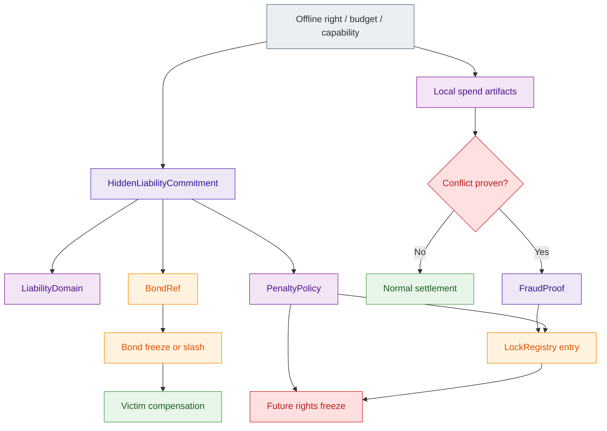
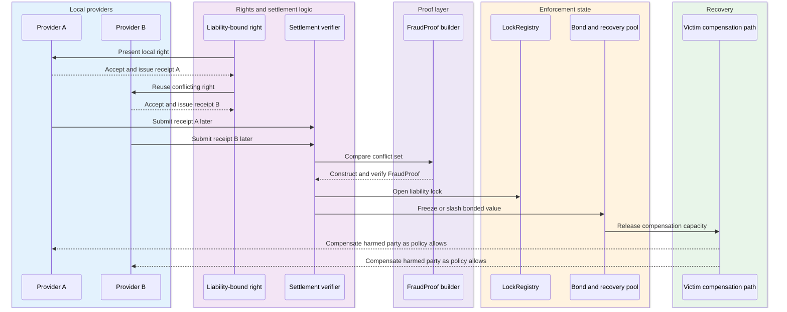
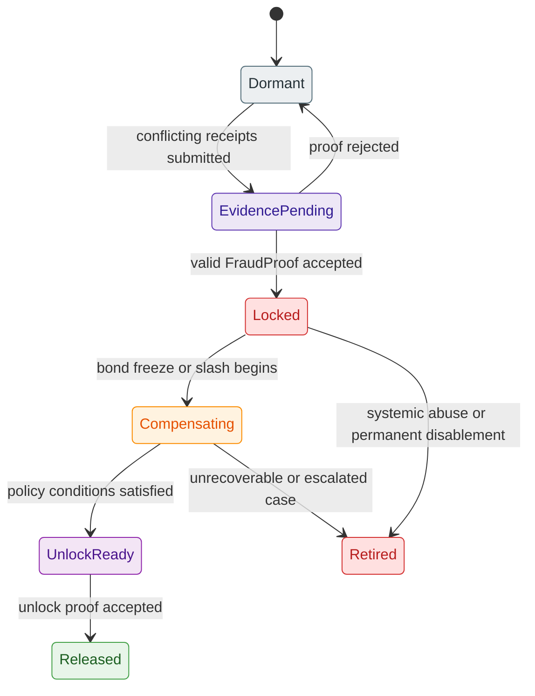
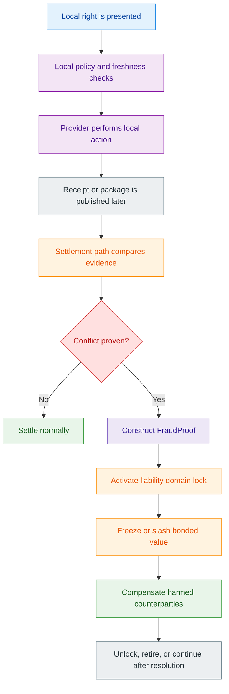
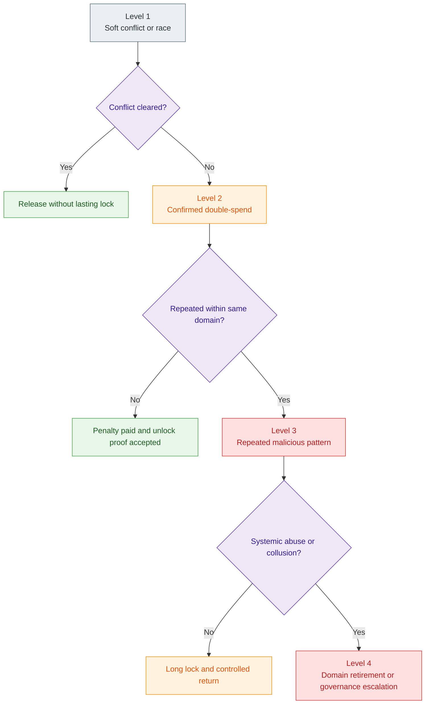

# Z00Z Linked Liability Whitepaper

[TOC]

Version: 2026-07-09

## Key Terms Used In This Paper

This paper uses a small set of liability-specific terms repeatedly. The list below is intentionally short. A fuller reference appears in Appendix A.

- `LiabilityDomain` (`liability_domain`): The hidden responsibility scope attached to a bounded offline, delayed, or autonomous execution lane.
- `HiddenLiabilityCommitment` (`hidden_liability_commitment`): The privacy-preserving commitment that binds a right or spend lane to a liability domain without exposing it during honest use.
- `FraudProof` (`fraud_proof`): The conflict-triggered evidence object that proves double-spend, abusive reuse, or another punishable policy violation.
- `BondRef` (`bond_ref`): The reference to collateral, reserve, or bonded value that can be frozen, slashed, or used for compensation.
- `PenaltyPolicy` (`penalty_policy`): The rule set that defines lock, slash, quarantine, cooldown, compensation, and unlock behavior.
- `LockRegistry` (`lock_registry`): The public or checkpoint-visible registry of activated liability locks, quarantine states, and unlock conditions.
- `Selective Reveal`: The property that liability information stays hidden in the honest case and becomes revealable only under provable fraud.
- `Exculpability`: The property that no honest wallet, agent, or device can be framed by a false fraud proof.
- `Future Rights Freeze`: The rule that selected future spends or capabilities from a liability domain can be rejected until resolution.
- `Victim Compensation`: The recovery path that routes bonded value, penalties, or reserved collateral to harmed counterparties.

## 1. Why Linked Liability ?

Linked Liability exists because offline and delayed-connectivity execution create a problem that honest protocol design should state plainly rather than hide behind marketing language. If a machine, wallet, or agent can spend a right before global settlement is available, then the system cannot truthfully promise that conflicting use becomes literally impossible at the moment of local action. A stronger and more defensible promise is different: if conflicting use occurs, the protocol should make that conflict attributable, punishable, and economically irrational to repeat.

This paper therefore introduces Linked Liability as the realism layer for bounded-risk offline execution. The goal is not to turn Z00Z into a public reputation ledger or a public account freeze system. The goal is to preserve privacy for honest users while ensuring that proven fraud activates a narrow responsibility surface that can lock, slash, compensate, quarantine, and delay future rights until the liability case is resolved.

### 1.1 Offline Fraud Cannot Be Prevented Perfectly

Offline and intermittently connected environments do not let every provider consult a global canonical state before acting. A charger may release energy before the chain is reachable. A local merchant may hand over goods before publication. An agent may spend a bounded compute credit while disconnected from its owner. In each of these cases, there is a period during which local acceptance is useful but final settlement has not yet happened.

That is why the correct design question is not "How do we make fraud physically impossible without consensus?" but "How do we make fraud locally survivable and globally punishable once evidence arrives?" Linked Liability answers that second question. It treats local action and final settlement as distinct phases, then defines what hidden responsibility must already be attached to the right before the first phase begins.

#### Core Thesis And Reader Promise

The core thesis of this paper is simple: **Z00Z does not pretend that offline double-spend cannot happen. It makes double-spend attributable, punishable, and economically irrational.** That claim is stronger than a vague promise of "fraud resistance" and more honest than a claim of magical offline finality.

The rest of this paper explains how that claim can be made precise. Each bounded offline right or capability is issued with a hidden link to a liability domain. Honest use preserves privacy and keeps that link dormant. Conflicting use produces a `FraudProof` that can activate the liability domain, freeze or slash bonded value, compensate harmed parties, and suspend future use of the same responsibility lane until the case is resolved.

#### Why Pure Prevention Claims Fail Offline

A system that only says "one of the conflicting spends will later be rejected" leaves the most important offline problem unsolved. If a charger already delivered energy, a merchant already delivered goods, or a service node already consumed compute resources, a later rejection by itself does not compensate the victim and does not make future abuse irrational. It only tells the victim that the chain noticed the problem after the fact.

Linked Liability improves that outcome by attaching economic consequences to the act of cheating rather than to the mere failure of one transaction. The protocol does not deny that local trust exists. It bounds that trust with a hidden but enforceable risk surface whose activation is triggered by proof, not by accusation.

### 1.2 Design Goals

The design goals of Linked Liability follow directly from that problem statement. First, honest use must preserve privacy and avoid turning all users into public reputation accounts. Second, fraud must create a provable and actionable liability event rather than a vague operational complaint. Third, the maximum local gain from cheating must be lower than the expected bonded loss, penalty, and future opportunity cost that cheating triggers.

These goals also imply a narrower architectural requirement. Punishment must attach to a domain-scoped responsibility object, not to a public account abstraction that Z00Z does not want to reintroduce through the back door. The system should therefore speak in terms of hidden liability domains, selective reveal, and bounded rights freezes rather than in terms of banning a public wallet identity.

#### Honest-Case Privacy, Fraud-Case Accountability

The honest case and the fraud case look different by design. In the honest case, observers see a valid spend path, later settlement evidence, and nothing that exposes a reusable public punishment handle. The link between a right and its liability domain remains hidden, and unrelated wallet activity remains opaque.

In the fraud case, that privacy boundary narrows but does not collapse. Proven conflict reveals only the minimum information necessary to identify the relevant liability domain, prove that the same responsibility lane produced incompatible use, and authorize the required response. Fraud stops being anonymous, but honest history does not become public collateral damage.

#### What This Paper Must And Must Not Claim

This paper describes the intended Linked Liability mechanism as a protocol-level design direction for Z00Z. It does not claim that the repository already exposes a fully landed end-to-end `FraudProof` pipeline, automated `LockRegistry`, or live slashing contract that closes the loop today. The live repo already has wallet verification, replay boundaries, delayed-settlement framing, and checkpoint-coupled public validation. The stronger liability pipeline remains the next architectural layer to specify.

That distinction matters for credibility. This whitepaper describes the target mechanism precisely while avoiding any implication that the full punishment and recovery loop is already deployed consensus truth. Present-tense design claims refer to the mechanism specified here. Present-tense implementation claims remain aligned with the narrower statements already made in the main and uniqueness whitepapers.

## 2. Protocol Thesis

Linked Liability fits Z00Z because Z00Z already treats wallets, rights, and settlement differently from a public account chain. The protocol direction is asset-centric, receiver-centric, package-centric, and checkpoint-centric rather than identity-table centric. That makes it natural to bind bounded rights to hidden responsibility domains and later activate those domains only if settlement evidence proves misuse.

The key architectural claim is straightforward: Linked Liability is not a customer-support policy layered on top of a public ledger. It is a protocol-compatible way to make delayed-connectivity execution survivable without giving up the privacy-first logic of Z00Z. The right carries both operational meaning and hidden economic accountability from the moment it is issued.

### 2.1 Linked Liability As A Z00Z Primitive

Z00Z already frames value and authority as private wallet-local objects that later become narrow public settlement evidence. Linked Liability extends that same framing into the fraud model. A right is not merely something that can be spent. It is something that can be spent under an associated hidden responsibility regime that stays invisible in honest use and becomes actionable only when a conflict becomes provable.

This turns liability from an external legal afterthought into a protocol-adjacent design primitive. A payment object, energy credit, API budget, or agent spending envelope can all be issued with both an execution policy and a liability policy. That does not make every dispute a consensus event. It means the protocol has a standard way to describe where the cost of proven abuse will land.

#### Not A Public Account Freeze

The wrong mental model is "the wallet gets banned." That language quietly reintroduces the account-based worldview that Z00Z tries to avoid. The better model is that a hidden `LiabilityDomain` becomes activated and locked. New rights or spends from that domain can be rejected, derived rights can be quarantined, and linked collateral can be frozen until the case is resolved.

This difference is not cosmetic. A public-account freeze implies that the protocol publicly names a reusable identity and hangs punishment directly on that identity. A liability-domain lock says something narrower: a particular hidden responsibility scope was attached to these rights, that scope produced provable conflict, and only the bounded surfaces linked to that scope should be affected.

#### Not A Public Reputation System

The second wrong mental model is that Linked Liability should gradually become a public score table. That would overcorrect in the opposite direction and turn every useful anti-fraud primitive into a surveillance surface. Z00Z does not need permanent public shame to make cheating irrational. It needs selective reveal, bounded punishment, and credible recovery logic.

That is why reputation stays at the boundary rather than at the center. Optional private trust receipts, domain-scoped tiers, or threshold attestations may later be useful, but they are not the core liability mechanism. Linked Liability is about provable responsibility under conflict, not about converting the protocol into a public social-credit graph.

### 2.2 Hidden Liability Domains

A hidden liability domain is the protocol's way of naming responsibility without making that responsibility public during normal use. A right can therefore be bound to a domain that remains cryptographically committed but not publicly visible. The right remains portable and usable offline, while the cost of later fraud remains pre-attached rather than improvised after harm occurs.

This hidden binding is what makes the privacy and punishment goals compatible. If the liability domain were public from the start, every spend would create a stable identity hook. If the domain did not exist until after fraud, the protocol would struggle to prove who should bear the cost. Linked Liability solves that tension by committing first and revealing only under conflict.

#### Hidden Liability Commitment

The `HiddenLiabilityCommitment` binds at least three ideas together: the existence of a `LiabilityDomain`, the path to a `BondRef` or collateral surface that can answer for fraud, and the `PenaltyPolicy` that determines what happens if that domain is activated. The commitment does not publish all of that structure directly, but it must be strong enough that later fraud handling cannot be detached from the right that originally carried the risk.

In concrete terms, an offline payment note or capability object may carry spend secrets, policy constraints, a hidden liability commitment, and a bond reference that is not meaningful to outside observers in the honest case. The commitment is not there to police routine behavior. It is there so that a later `FraudProof` cannot be met with ambiguity about who bears the cost.

Implementations also need one additional discipline: the same underlying liability domain cannot appear as a reusable public tag across honest spends. Honest-path artifacts therefore need per-right or per-context derivations from a domain root, so that one liability domain can back many rights without making those rights publicly linkable before conflict.

#### Conflict-Triggered Activation

The liability domain remains dormant until a provable conflict appears. A single honest spend reveals nothing beyond what settlement already requires. But if the same responsibility lane produces two incompatible uses, then the evidence extracted from those uses can activate the domain and shift the system into fraud-handling mode.

This activation boundary is the defining move of the design. One presentation proves local validity and reveals nothing about liability identity. Two conflicting presentations reveal that the same hidden responsibility lane has been used incompatibly. That is the intuitive heart of the "two-show extractability" idea described in the archive note, even if the exact cryptographic construction remains a separate technical specification.

### 2.3 Fit With Rights-Based Architecture

Linked Liability fits most naturally in a system that already thinks in terms of rights, capabilities, and bounded execution envelopes. Z00Z is already moving toward spendable confidential objects and private bounded authority rather than broad public account permissions. A liability-bound right is therefore not an alien addition. It is the natural next step for any right that may be used before final settlement becomes globally visible.

The same design can cover coins, vouchers, machine resource rights, agent budgets, API credits, and reward claims. What changes across domains is not the existence of liability but its scope, its bond size, its penalty policy, and the exact conflict surface from which a `FraudProof` can be extracted.

#### Spendable Capability Objects, Budgets, And Envelopes

Spendable Capability Objects, offline budgets, and agent spending envelopes are all stronger when they carry explicit fraud exposure instead of relying on vague operational trust. A capability that can release compute, energy, or API access offline should also encode which bonded domain stands behind misuse. An agent budget should not merely say what the agent may spend. It should also say what liability lane will be frozen if the same budget is fraudulently reused.

This makes the right economically complete. The object no longer says only "what can be done" and "when it expires." It also says "what hidden accountability surface answers for abuse." That is what turns a private permission note into an economically secured right.

#### Relationship To Checkpointed Settlement

Linked Liability does not replace settlement. It depends on settlement to close the loop. Local acceptance happens before global finality, but conflict becomes authoritative only when receipts, packages, or other public artifacts reach the checkpoint path and can be compared under canonical verification rules. The delayed nature of that comparison is exactly why the liability link must exist from the beginning.

This keeps the document aligned with the main whitepaper. Z00Z already distinguishes wallet-side preparation and public checkpointed settlement. Linked Liability adds a third layer to that story: when delayed reconciliation reveals incompatible use, the protocol escalates from ordinary settlement verification into liability activation without switching to an account-based punishment model.

## 3. Liability Object Model

The cleanest way to explain Linked Liability is through a small set of canonical objects. The design is not a vague policy cloud around offline rights. It is a typed relationship among rights, hidden commitments, fraud evidence, bonded value, policy rules, and lock state. That object-first approach matches the broader style of the main whitepaper and keeps the scope of each concept legible.

### 3.1 Canonical Liability Objects

The mechanism revolves around six core objects. Each one owns a different boundary: hidden responsibility, proof of conflict, path to collateral, policy of punishment, or public record of activation.

**Table 3.1 - Canonical Linked Liability objects.**

| Object | Visibility locus | Primary role | Becomes authoritative at |
| --- | --- | --- | --- |
| `LiabilityDomain` | Hidden during honest use; revealable under fraud | Defines the bounded responsibility scope behind a right family or execution lane | Fraud-case activation and enforcement |
| `HiddenLiabilityCommitment` | Carried privately or as opaque bound data | Commits a right to its liability domain, policy, and bonded answerability | Issuance and spend preparation |
| `FraudProof` | Public or checkpoint-visible evidence object | Proves conflicting use or another punishable violation | Settlement-time conflict validation |
| `BondRef` | Hidden or minimally referenced until needed | Points to collateral, reserve, or recovery deposit that can absorb penalties or compensation | Liability activation and recovery |
| `PenaltyPolicy` | Bound policy object or domain rule family | Defines lock, slash, quarantine, compensation, and unlock behavior | Fraud handling and case resolution |
| `LockRegistry` | Public or checkpoint-visible activated state | Records liability locks, case status, and unlock conditions | After valid fraud proof acceptance |

**Figure 3.1 - Canonical Linked Liability object graph.** The liability object model begins with a bounded right and remains dormant until conflict turns hidden bindings into active enforcement state.



#### `LiabilityDomain` / `liability_domain`

The `LiabilityDomain` is the bounded scope that answers for a class of offline or delayed rights. It may correspond to an offline payment lane, a machine capability family, an agent budget line, or another narrowly scoped responsibility container. The crucial requirement is that the domain be narrow enough that fraud in one lane does not automatically immobilize unrelated honest activity elsewhere.

This domain is the answer to the question "what exactly gets locked?" The correct answer is not "the whole wallet" and not "a public account." The answer is "the hidden responsibility domain whose rights produced the provable conflict." That keeps both privacy and punishment aligned with the rights-first architecture.

#### `HiddenLiabilityCommitment` / `hidden_liability_commitment`

The `HiddenLiabilityCommitment` is the private binding that makes later accountability possible without exposing a reusable public identity during honest use. It links the spendable right to the domain that will answer for fraud, while also binding that right to the penalty and collateral logic that becomes relevant only if misuse is proven.

This commitment must be strong enough that it cannot later be reassigned to a different bond or a different policy after harm has already occurred. At the same time, it must not reveal the `LiabilityDomain` to ordinary observers in the normal case. That is why the commitment belongs in the object model rather than in a vague operational policy layer.

#### `FraudProof` / `fraud_proof`

The `FraudProof` is the conflict-triggered evidence object that transforms an offline fraud complaint into a protocol-relevant event. It should show that the same responsibility lane produced two incompatible spends or otherwise violated a signed policy condition that the right itself carried. In the simplest case, that means proving a double-spend of the same offline right under incompatible receiver contexts.

The proof does not need to reveal all related wallet state. It needs to reveal enough to show the conflict, bind that conflict to the same liability domain, and authorize the requested enforcement action. If it cannot do that, it is not yet a sufficient fraud proof. If it reveals far more than that, it violates the design goals of selective reveal.

#### `BondRef` / `bond_ref`

The `BondRef` is the path from hidden responsibility to economic consequence. It can point to collateral reserved specifically for offline mode, to a recovery deposit, to a reputation-backed bond, or to another value surface designed to absorb penalty and compensation flows. Dedicated or domain-scoped bonds are preferable where possible because they create cleaner blast-radius boundaries.

This is also where the realism of the design is tested. A liability model without bonded exposure is mostly moral language. A liability model with a credible `BondRef` becomes economic architecture. The right can now be small and locally useful while the hidden bond behind it is large enough to make cheating irrational.

#### `PenaltyPolicy` / `penalty_policy`

The `PenaltyPolicy` defines what happens after valid proof. It specifies whether the response is a temporary quarantine, a fixed penalty, a slash against bonded value, a victims-first compensation flow, a longer freeze of future rights, a cooldown before unlock, or a combination of these. Different right families may need different policy parameters, but the existence of an explicit policy surface is itself essential.

Without such a policy object, the system risks handling fraud as an ad hoc operator decision rather than as a protocol-legible economic consequence. Penalty logic therefore belongs in the right family definition, not as an afterthought bolted on after deployment.

#### `LockRegistry` / `lock_registry`

The `LockRegistry` records that a previously hidden liability domain has become activated and is now subject to a live case. It should contain enough information for later verification to reject new use from that domain unless an unlock proof or case-resolution condition is present. The registry may remain minimal at the protocol layer, while richer dispute or support flows are layered by wallets or operators on top.

This registry is also what makes the consequence persistent rather than purely descriptive. Once the fraud proof is accepted, future verification can consult the registry and fail closed. That is how a one-time conflict becomes a continuing economic consequence rather than a historical footnote.

### 3.2 Attachment To Rights And Packages

Linked Liability becomes practical only if it attaches cleanly to the spendable objects that users and machines actually handle. A note, capability object, budget envelope, or portable package should be able to carry its own policy, proof inputs, and hidden responsibility binding without requiring a live public identity query at the moment of local action.

#### Offline Payments And Wallet-Local Rights

For an offline payment or bearer-like right, the liability attachment can be understood as a private extension of the note itself. The note has a spend secret or ownership witness, but it also carries a hidden liability commitment, a link to bonded exposure, and enough local policy to make bounded acceptance possible. A normal spend can therefore prove ownership and local validity without exposing the liability domain to the receiver.

If the same note or right is spent twice under incompatible contexts, the two resulting artifacts provide the raw material for extracting a `FraudProof`. The whitepaper does not hard-code one exact wire format here, but it preserves the conceptual structure from the archive note: a single use is non-revealing, while incompatible reuse becomes extractably attributable.

#### Machine, Agent, And API Rights

The same pattern extends naturally to energy credits, route permissions, compute budgets, API credits, and agent reward claims. Each of these objects should say not only what action is authorized and under which limits, but also which hidden bond and policy answer for fraud. A charger, gateway, or service provider can then make a bounded local decision while knowing that proven misuse later has a defined recovery path.

This is especially important for agents and cheap machine identities. If a new agent can appear instantly and spend the same right twice with no meaningful bonded consequence, offline or delayed execution becomes easy to abuse. Linked Liability gives these environments a way to keep identity private while still making fraud expensive.

### 3.3 Visibility And State Boundaries

The privacy value of Linked Liability depends on a strict separation between what is visible during honest use and what becomes visible only after proven fraud. This section sets that boundary explicitly so the mechanism does not accidentally become a public tagging system.

#### What Stays Hidden In The Normal Case

In the normal case, observers should not learn the `LiabilityDomain`, should not see a stable public punishment hook, and should not gain access to unrelated rights or wallet history. They should see only what ordinary settlement correctness already requires: a valid spend path, later reconciliation artifacts, and whatever public evidence is necessary for replay safety and checkpoint continuity.

That hiddenness is not an optional privacy enhancement. It is the condition that prevents the liability system from mutating into an account system. If normal use publishes stable responsibility identifiers, then the design has already lost one of its main advantages.

#### What Becomes Revealable In The Fraud Case

In the fraud case, the reveal should be narrow and purpose-driven. The system should learn that a particular liability domain produced incompatible use, what proof establishes that fact, what bond or recovery surface can answer for the harm, and what penalty path must now be followed. It should not gain a generalized view of the wallet, all historic payments, or unrelated asset families.

This is the meaning of selective reveal in practice. Fraud should disclose enough to enforce consequences, but not enough to turn the entire user history into public evidence. The liability system is supposed to expose responsibility, not to abolish privacy.

## 4. Normal-Case Execution

The honest path is the path that most users should stay on indefinitely. If Linked Liability is designed well, honest users will barely perceive it. They will use bounded rights locally, later publish or reconcile them, and never reveal the liability link that stands behind those rights. The mechanism matters most when something goes wrong, but it must be structured from the start so that ordinary activity remains simple and private.

### 4.1 Honest Issuance And Binding

Every bounded offline right should be born with its hidden liability structure already attached. That can happen at issuance time, at wallet-local preparation time, or at the time a broader right is converted into an offline-capable object. The important point is that the bond and penalty logic are not improvised after a dispute. They are already bound before the right can leave the honest online environment.

#### Liability-Bound Right Creation

When a right is created for offline or delayed use, the issuer or wallet should bind the right to a hidden liability commitment and the corresponding policy family. In effect, the right knows what it authorizes, what its local limits are, when it expires, and which liability domain answers for abuse. This is why Linked Liability works so naturally with capability-style rights rather than with generic account balances.

The right does not expose all of that information publicly. It carries enough private structure that later use, conflict, and recovery can be tied back to a predetermined responsibility surface. That is how the design avoids both ambiguity and public tagging.

#### Bond Provisioning And Policy Binding

At the same time, the right's risk envelope must be funded. A dedicated offline bond, a domain-scoped reserve, or another recovery deposit should stand behind the right family before local use begins. The `PenaltyPolicy` should also be fixed or at least parameter-bounded at this stage, so that later enforcement is not arbitrary.

This is where many naive offline systems fail. They define how a right is spent but not how its abuse is paid for. Linked Liability requires the answerability path to exist before the first offline presentation occurs.

### 4.2 Honest Spend And Local Acceptance

Once the right exists, local providers or peers need a bounded way to accept it without pretending that local acceptance is the same as final settlement. The honest spend path therefore combines two ideas: local policy checks that are good enough for bounded trust, and later publication or reconciliation that is strict enough for final state transition.

#### Local Policy Checks And Freshness Rules

A receiver verifies ownership, policy scope, local freshness conditions, expiry, and contextual constraints before acting. For a payment, that may mean checking the bounded amount and basic note validity. For a machine right, it may mean checking energy limits, access scope, or route permissions. For an agent budget, it may mean checking provider restrictions and time limits.

These checks do not eliminate all risk, and the whitepaper does not claim that they do. Their purpose is to ensure that the local action is bounded, intentional, and tied to a right that already carries hidden liability if later conflict is discovered. In practice, local acceptance is a policy decision over right family, issuer trust, offline limit, and allowed outstanding exposure rather than a claim that the counterparty sees the entire bond in the clear.

#### Delayed Publication And Reconciliation

After the local action, the resulting receipt, package, or execution record eventually returns to the publication path. If no conflicting use exists, the right settles normally and the liability domain remains hidden forever. In this normal case, Linked Liability behaves like a dormant safety layer rather than an active participant in the transaction flow.

This delayed publication step matters because it is the bridge between private local utility and public replay-safe finality. It also provides the moment at which later conflicting artifacts can be compared if abuse occurred elsewhere.

### 4.3 Honest-Case Privacy Guarantees

The honest case is where the privacy discipline of the design is tested. If routine use reveals the liability link, the system has recreated a public identity handle. If routine use keeps the liability link hidden, then the protocol has preserved the asymmetry it wants: privacy during honesty, reveal only during proven abuse.

#### Liability Hidden, Privacy Preserved

An honest user should be able to spend a bounded right, reconcile later, and leave behind no public trace that says "this exact future punishment domain belongs to me." The chain or checkpoint path may learn that a valid right was used, but it should not learn the hidden liability identity behind that right unless conflict later forces disclosure.

This is especially important for repeated commercial use. A merchant or machine should not be able to accumulate a stable public map of which spends belong to the same future liability lane. That would defeat the point of selective reveal before any fraud even happened.

#### No Public Reputation Account By Default

Linked Liability should also avoid becoming a public behavior score by accumulation. A user should not need to build an openly visible "good reputation ledger" just to access ordinary offline functionality. Honest use should remain private by default, while stronger trust tiers, if later introduced, can be handled through optional private proofs rather than through a universal public rating system.

This is one of the cleanest separations between Linked Liability and many compliance-first or account-first systems. The protocol wants bounded answerability, not permanent public behavioral indexing.

## 5. Fraud Detection And Liability Activation

The fraud path begins when later reconciliation reveals that the same bounded right or responsibility lane was used incompatibly. At that moment, the system should move from ordinary settlement validation into proof-backed liability handling. The transition must be strict, because false activation would create an easy denial-of-service tool against honest users.

### 5.1 Detecting Conflicting Spends

The simplest and most important conflict is a double-spend of the same offline right. The same logic can also cover conflicting receipts, duplicate claim attempts, incompatible proof-of-use artifacts, or other policy violations that the right itself made legible. What matters is that the conflict be derivable from evidence surfaces that later reach settlement, not from unsupported accusation.

#### Receipts, Nullifiers, And Conflict Surfaces

Different right families may expose different conflict surfaces. Some may rely on nullifier-like anti-replay artifacts. Others may rely on incompatible signed receipts or note reuse under different contexts. The archive note also suggests a link-tag style construction in which two conflicting presentations reveal the common hidden responsibility lane. The exact construction can vary by right family as long as the resulting proof remains sound.

What should not vary is the principle that a single honest presentation reveals no liability identity, while conflicting evidence creates a protocol-relevant proof surface. That asymmetry is the design core. Without it, the system either leaks privacy too early or cannot punish late enough.

#### Settlement-Time Detection Path

The point of authoritative detection is when the relevant receipts or packages are visible to the checkpointed settlement path and can be compared under canonical rules. Local providers may suspect a problem earlier, but suspicion is not yet enough to activate liability. Activation must depend on a verified fraud proof or equally strong evidence under the right family's rules.

That keeps the paper aligned with the broader Z00Z architecture. Wallets and local services can observe, store, and submit evidence, but the transition from possible abuse to accepted fraud event should pass through the same disciplined settlement boundaries that the protocol already uses for validity and replay protection.

### 5.2 Fraud Proof Extraction

Once conflict is detected, the system must turn the raw evidence into a `FraudProof` that can support lock, slash, and compensation logic. The archive note frames this as a "two-show extractability" idea: one use says nothing special, but two incompatible uses reveal the relevant liability identity and prove that the same responsibility lane produced both.

The exact production wire format remains target architecture, but the minimum logical structure of a valid proof is already clear enough to make the mechanism falsifiable rather than rhetorical.

**Table 5.1 - Target logical structure of `FraudProof`.**

| Field | Purpose | Reveal scope | Required meaning |
| --- | --- | --- | --- |
| `fraud_type` | Classifies the violation | Public in the fraud case | Distinguishes double-spend, duplicate claim, policy breach, or other supported offense |
| `conflict_set` | Carries the conflicting receipts or spend artifacts | Public in the fraud case | Shows the two or more incompatible uses that cannot all be valid |
| `liability_evidence` | Binds the conflict to one hidden responsibility lane | Selective reveal only | Reveals or activates the relevant `LiabilityDomain` and proves common origin |
| `affected_right_ref` | Identifies the right family or specific spend lane under dispute | Narrow public reveal | Prevents the proof from floating free of the actual right family |
| `bond_ref` | Points to recoverable collateral or reserve | Narrow public or minimally referenced | Connects the proof to economic consequence and compensation capacity |
| `policy_binding` | Identifies the governing `PenaltyPolicy` | Public or derivable | Prevents ad hoc punishment rules after harm has occurred |
| `requested_action` | Specifies the enforcement path | Public in the fraud case | Supports lock, slash, quarantine, compensation, or case opening |
| `verification_context` | Anchors proof verification to settlement context | Public verifier input | Prevents replay or cross-context re-use of the proof itself |

#### Two-Show Or Conflict-Triggered Reveal Logic

This whitepaper does not commit to one exact cryptographic formula, but it preserves the intended shape. A right can carry a spend secret and a liability secret or commitment. A normal spend derives ordinary local-validity artifacts. A conflicting second spend under a different context creates the second half of an extractable pair. From that pair, the system reveals the liability domain and proves that both uses came from the same hidden responsibility lane.

That model gives Z00Z a much sharper fraud story than "one later loses." It says that the act of cheating itself generates the evidence needed to make punishment targetable. That is why the mechanism makes fraud attributable, not merely observable.

#### What Fraud Proofs Must And Must Not Reveal

A valid `FraudProof` must reveal enough to identify the activated liability domain, bind the conflict to that domain, and authorize the penalty or compensation path. It may also need to identify the affected right family, the conflicting receipts, and the requested action. What it must not reveal is the user's entire wallet graph, unrelated asset families, or every honest payment ever made under the same wallet.

This is the selective-reveal discipline in its strongest form. The proof should be informative enough to punish correctly and narrow enough to preserve the privacy of everything that was not part of the proven conflict.

**Figure 5.1 - Fraud proof and liability activation sequence.** A later proof converts conflicting local history into bounded settlement-time enforcement.



### 5.3 Lock, Slash, Quarantine, And Case Opening

After a valid fraud proof is accepted, the protocol or settlement layer should open a liability case rather than merely record a historical contradiction. That case should activate the hidden domain in the `LockRegistry`, freeze relevant bonded value, and stop new rights from the affected lane from settling normally unless and until the case is resolved.

The `LockRegistry` is therefore more than a blacklist. It is the state carrier for an active liability case. The production encoding remains future work, but the logical fields are explicit now.

**Table 5.2 - Target logical structure of `LockRegistry` entries.**

| Field | Purpose | Required meaning |
| --- | --- | --- |
| `liability_id` | Identifies the activated hidden responsibility lane | Distinguishes one locked domain from every other domain |
| `status` | Carries the case lifecycle state | At minimum distinguishes locked, compensating, unlock-ready, released, or retired |
| `reason_code` | Records why the domain was activated | Ties the lock to a concrete fraud type or policy breach |
| `opened_at` | Anchors the case in settlement time | Prevents ambiguity about case order and replay of old state |
| `bond_status` | Tracks collateral condition | Distinguishes frozen, partially slashed, fully slashed, or restored states |
| `penalty_due` | Records unpaid economic consequence | Defines what remains owed before unlock |
| `victim_set_ref` | Points to harmed counterparties or their recovery set | Supports compensation ordering without exposing unrelated history |
| `scope` | Defines what future rights are affected | Prevents overbroad or ambiguous enforcement |
| `unlock_condition` | States how the case can resolve | Requires penalty payment, compensation completion, dispute outcome, cooldown, or equivalent proof |
| `review_or_expiry` | Provides lifecycle control | Prevents abandoned lock state from becoming permanently ambiguous |

#### Liability Lock And Quarantine Semantics

The first consequence is domain lock. New spends from the same `LiabilityDomain` are rejected or quarantined. Related rights or change outputs may enter a temporary suspended state. The exact policy depends on the domain, but the principle is stable: the hidden responsibility lane that caused harm does not continue as though nothing happened.

This is also where narrow scoping matters. The design should aim to freeze the affected domain, not every other right the user may possess. Otherwise the protocol reintroduces the overbroad blast radius of account freezes while still paying the complexity cost of a privacy-preserving design.

#### Victim Compensation And Unlock Case Creation

The second consequence is economic recovery. A valid case should identify harmed counterparties, reserve or seize the relevant collateral, and apply the `PenaltyPolicy` in a victims-first order where appropriate. After that, the case remains open until the liability conditions are satisfied: penalty paid, victims compensated, dispute resolved, or proof invalidated under a legitimate challenge path.

This turns fraud handling into a full lifecycle instead of a single verdict. The point is not only to label the offender. It is to halt future abusive use, route value toward harmed parties, and define the conditions under which the domain can return to good standing or be retired permanently.

**Figure 5.2 - Lock registry lifecycle.** Liability enforcement should be stateful and reversible only through explicit resolution conditions.



**Figure 5.3 - Conflict-triggered liability activation.** Local use can happen before settlement, but conflict later opens a bounded and economically meaningful responsibility path.



## 6. Economic Enforcement

Linked Liability matters because it changes the economics of cheating. Without bonded consequence, an offline attacker may rationally try to spend the same right twice if the maximum gain is larger than the likely cost of getting caught. With a well-designed liability bond, penalty policy, and future-rights freeze, the calculation flips. The attacker risks losing far more than the local benefit from fraud.

### 6.1 Bonded Risk Model

Each offline-capable right carries bounded fraud exposure. The maximum local value that can be extracted before reconciliation stays small relative to the bonded value, penalty, and future-access loss that proven fraud triggers. That asymmetry makes the model economically rational for honest use and economically irrational for abuse.

The critical unit is not only the single right but the liability domain's aggregate outstanding offline exposure. A bond sized only against one right becomes insufficient if the same domain can keep many unsettled offline rights alive at once. A production implementation therefore needs both per-right limits and domain-level caps on simultaneously outstanding offline risk.

#### Bond Sizing Versus Offline Limit

If a right can release ten units of local value while offline, then the liability bond behind it is usually meaningfully larger than ten units once penalties, detection risk, operational friction, and aggregate outstanding exposure are considered. Otherwise the attacker may still see positive expected value in cheating. The whitepaper does not impose one universal ratio, but the direction is explicit: local utility is small and fast; liability exposure is larger and slower but decisive.

This is especially important for machine and agent settings, where the marginal cost of spinning up a new identity may be very low. The bond is part of what makes the right expensive to abuse even when the local executor is cheap to replace.

#### What Value Is Actually At Risk

The safest design is usually not "all wallet assets are frozen forever." A better model is that a dedicated offline bond, linked change outputs, a recovery deposit, or another explicitly attached reserve answers first. In some domains, optional reputation bonds or future issuance rights may also be at risk. The blast radius should be deliberate and domain-scoped rather than accidental and totalizing.

This is another reason the paper prefers liability domains to public account bans. It allows Z00Z to say exactly which value surfaces answer for fraud and which honest assets remain outside the punishment path by default.

### 6.2 Penalty Policy Design

The `PenaltyPolicy` must be flexible enough to handle different severities of misconduct without collapsing everything into either "nothing happens" or "everything is burned." Some conflicts may be operational duplicates or races. Others may be clear intentional double-spends. Still others may show repeated or collusive abuse across a domain. A graded response is more realistic than a single crude switch.

#### Graduated Penalty Levels

The archive note suggests a useful four-level ladder, and that logic fits the design well.

**Table 6.1 - Formal penalty ladder.**

| Level | Trigger pattern | Immediate state action | Economic consequence | Exit path |
| --- | --- | --- | --- | --- |
| Level 1 | Duplicate broadcast, race, or soft conflict with plausible benign explanation | Temporary quarantine or pending-review state | Small fee or no slash if exculpated | Automatic resolution, short cooldown, or proof rejection |
| Level 2 | Confirmed double-spend of one offline right | Liability lock and future-rights freeze for the affected lane | Fixed penalty plus victims-first compensation | Pay penalty, complete compensation, satisfy unlock proof |
| Level 3 | Repeated malicious pattern in the same domain | Long lock, wider quarantine, optional disablement of new offline issuance | Larger slash, longer opportunity loss, possible reputation-bond damage | Extended cooldown, manual review, or domain reset |
| Level 4 | Systemic abuse, provider collusion, or hostile domain behavior | Domain retirement, escalated enforcement, governance or arbitration path | Deep slash, permanent disablement, larger compensation pool | External ruling, governance closure, or permanent retirement |

This ladder keeps the policy from being needlessly brittle. It also helps separate honest operational mistakes from deliberate abuse without diluting the seriousness of provable fraud.

**Figure 6.1 - Penalty escalation ladder.** Severity should rise with confidence and repetition, not jump immediately to universal permanent punishment.



#### Unlock Conditions, Cooldowns, And Dispute Windows

Every lock has an explicit resolution path. In the simplest case, that means paying the penalty and compensating the victims. In more complex cases, it may require a cooldown, a challenge window, or an external dispute outcome. The key point is that unlock is not arbitrary, but it is also not impossible if the policy has been satisfied.

This resolution logic should be legible enough that users, issuers, and service providers can reason about risk before issuing or accepting rights. A hidden bond without a visible resolution policy is not a mature economic primitive.

### 6.3 Freezing Future Rights Without Overreaching

One of the most powerful consequences of Linked Liability is that it can freeze not only the specific right that was abused but also selected future rights from the same responsibility lane. This is important because a determined attacker might otherwise keep using the same hidden domain while the first fraud case is still unresolved. The system therefore needs the ability to suspend future value flow from that lane.

#### Future Rights Freeze

Once the liability domain is locked, new spends or newly derived rights from that domain should fail normal verification unless they include an accepted unlock proof or otherwise satisfy the case-resolution policy. That may mean rejecting new offline rights from the domain, quarantining linked change outputs, or disabling further redemption of related capabilities until the penalty case is closed.

This makes fraud a continuing cost rather than a one-time gamble. The attacker loses not only bonded value but also future utility from the affected lane, which strengthens deterrence.

#### Why Honest Activity Elsewhere Should Survive

At the same time, the design resists overreach. A fraud event in one narrowly scoped domain does not automatically freeze unrelated honest online activity, unrelated assets, or every future interaction the user ever wants to make. The more precisely the domain is scoped, the easier it is to punish strongly without causing collateral damage.

This is not just a user-experience preference. It is part of what makes the liability architecture intellectually coherent. A system that says "everything gets frozen anyway" gives up much of the value of having private, structured, domain-scoped responsibility objects in the first place.

## 7. Security And Proof Requirements

The fraud story is only as good as the proof discipline behind it. If a malicious party can trigger false liability activation, then Linked Liability becomes a denial-of-service weapon. If fraud proofs reveal too much, then the privacy design collapses. If the scope of punishment is too broad, then the protocol recreates the problems of account-based enforcement. The security properties must therefore be stated explicitly.

### 7.1 Exculpability

Exculpability is the most important safety property of the entire design. No honest wallet, machine, or agent should be lockable by a fabricated fraud proof. If the protocol cannot guarantee that, then every offline participant becomes vulnerable to framing attacks.

#### No False Fraud Proofs Against Honest Wallets

A valid fraud proof must require real conflicting use or a real signed-policy violation. It must not be possible for a counterparty, relay, or malicious observer to fabricate the appearance of double-spend from a single honest presentation. This is the direct formalization of the archive note's "no false fraud proof" requirement.

That property protects both funds and liveness. Without it, an attacker could cause selective reveal, lock, and future-rights freeze against an honest domain even if no fraud ever occurred.

#### Evidence Completeness And Verifier Soundness

The verifier should require enough evidence to show that the conflicting artifacts are genuine, distinct, and attributable to the same hidden responsibility lane. Canonical encoding, domain separation, and unambiguous context binding matter here because sloppy encoding can create accidental collisions or exploit surfaces.

In other words, a fraud proof should be more than a plausibility claim. It should be a cryptographically and procedurally sound argument that the enforcement path is being activated against the correct domain for the correct reason.

### 7.2 Selective Reveal

Selective reveal is the second foundational property. The liability domain should remain hidden until proven conflict requires its activation. If routine use leaks the responsibility identity anyway, then the protocol has recreated a public identity layer and the privacy thesis fails.

#### Reveal Only On Proven Fraud

Reveal should happen only when the right family's fraud conditions have been satisfied under canonical verification. A suspicion, a local complaint, or a single presentation should not be enough. The threshold for reveal must be high enough that privacy is not lost merely because an adversary wants to force observability.

This also keeps the system morally and operationally consistent. The protocol does not say "everyone is potentially public if we become curious enough." It says "privacy is preserved until you provably violate the conditions under which the right was issued."

#### Unrelated Assets And History Stay Private

Even after a valid fraud event, unrelated assets and unrelated transaction history remain outside the reveal boundary. The system exposes the activated domain, the conflict, and the recovery path, not the user's entire economic life. This is what keeps Linked Liability from quietly mutating into a deanonymization engine.

This boundary stays explicit because liability systems easily drift toward excessive disclosure in the name of enforcement. The whole point of Z00Z is to avoid that drift.

### 7.3 Abuse Resistance And Scope Control

Beyond direct double-spend, the design must also account for adversarial attempts to manipulate the liability process itself. That includes framing, denial-of-service, collusion between receivers, and policies that are scoped so broadly that honest activity is damaged more than fraud is deterred.

#### DoS, Framing, And Collusion Cases

A malicious receiver might try to fabricate evidence. Two colluding receivers might try to create the appearance of conflict from one valid spend. An operator might spam nuisance cases. A service provider might pressure the system toward premature reveal. Proof soundness, evidence authenticity, and careful case-opening thresholds are therefore non-negotiable.

Not every mitigation must be solved in this document, but the threat model should be named clearly. Otherwise the liability system may look strong against honest users and weak against adversarial process abuse.

#### Domain Scoping To Avoid Over-Punishment

Over-punishment is itself a security problem because it widens the damage of compromise and increases the cost of honest mistakes. If one small offline capability is bound to an enormous undifferentiated liability pool, then a single fraud event can create more collateral damage than the design intended. Narrow scoping is therefore part of the security model, not merely a product decision.

The right principle is simple: make the fraud response severe within the affected domain and limited outside it. That is what makes the design both safe and usable.

## 8. Use Cases

Linked Liability matters because the same logic can secure many forms of delayed-connectivity value exchange. The specific right may change, but the pattern remains stable: a private bounded right is used locally, settlement happens later, and fraud becomes provable and economically answerable rather than merely regrettable.

### 8.1 Offline Payments

Offline payments are the clearest and most immediate use case. A payer can transfer a bounded payment object locally, and the merchant or peer can accept it without waiting for live chain access. If the payment later settles cleanly, nothing special happens. If the same right was spent twice, the resulting conflict activates the hidden liability domain behind that payment family.

#### Merchant And Peer-To-Peer Acceptance

For merchants and peer-to-peer users, the design offers something more realistic than a promise of perfect prevention. It offers bounded local acceptance backed by future accountability. The merchant is not asked to believe that offline fraud is impossible. The merchant is asked to believe that proven fraud can be compensated and that repeated abuse will freeze the offending domain.

That is a much better fit for real commerce than a simple "later rejection" story, because it addresses both the economic harm and the repeat-abuse problem.

#### Delayed Reconciliation And Arbitration

Later reconciliation is where the difference between honest and dishonest use becomes visible. Honest payments settle and disappear into ordinary history. Conflicting payments create a fraud case, victim compensation, and future-rights consequences. This gives Z00Z a concrete arbitration story for offline payment without reverting to public account surveillance.

### 8.2 Autonomous Machines

Autonomous machines are an especially strong fit because they often need to act under intermittent connectivity while handling real-world resources. A drone may buy energy. A vehicle may redeem a route right. A gateway may consume a relay credit. A charger may release power before global consensus is reachable. In all of these cases, the local counterparty cannot wait for cloud-finality every time.

#### Energy, Charging, Route, And Access Rights

The archive note's charger example captures the logic well. A machine may hold an energy credit that is locally redeemable at one charger. If the same credit is then reused at another charger before reconciliation, the later conflict should reveal the responsible liability domain, freeze linked collateral, and support compensation for the harmed provider or providers.

This is what makes offline machine economy credible. The machine can try to cheat, but the cost of getting caught exceeds the local benefit. That makes delayed-connectivity execution usable without pretending that it is infallible.

#### Local Networking And Delayed Reconciliation

Local networking matters here because many machine environments rely on short-range links, local relays, or intermittent backhaul. Linked Liability does not fight that reality. It assumes it. The machine can present a private right locally, the provider can act, and later settlement can determine whether the action belonged to an honest or dishonest lane.

The consequence model is what makes that delayed structure survivable. Without it, the provider bears the offline risk alone. With it, the risk is shifted back onto the hidden bonded domain that chose to cheat.

### 8.3 Agent Markets And API Credits

Agent markets and API budgets expose a related but slightly different problem. An autonomous agent is often cheap to instantiate and easy to replace. If that agent can redeem the same task reward twice or reuse the same service budget across providers, then delayed settlement becomes an easy attack surface unless bonded accountability exists behind the scenes.

#### Bounded Budgets For Autonomous Agents

Agent spending envelopes and API credits should therefore carry explicit liability bindings. The agent is given narrow authority to spend or claim, but the associated domain can later be frozen if the agent abuses that authority. This avoids handing the agent a full wallet while also avoiding the opposite mistake of giving it unaccountable ephemeral rights.

That pattern is especially important for cheap or sybil-heavy ecosystems. Private identity without bonded accountability is too easy to abuse. Public identity without privacy is too blunt. Linked Liability offers a middle path.

#### Task Rewards, Compute Credits, And Service Rights

The same logic applies to duplicate reward claims, conflicting execution receipts, and repeated redemption of the same compute credit. A valid fraud proof can freeze the agent's future reward rights, slash its bonded exposure, and force compensation where another party already delivered service based on the fraudulent claim.

This is why Linked Liability belongs in the larger Z00Z rights story rather than only in a payments paper. Agents often need rights more than they need coins, and rights need accountability no less than payments do.

### 8.4 Local Economy Vouchers And Emergency Resources

Local vouchers and emergency resource rights show that the design is useful beyond commercial payments. Community programs, municipal credits, partner ecosystems, humanitarian systems, and crisis-response flows may all need bounded local rights that work before full connectivity is restored.

#### Community Voucher Programs

A local economy voucher can circulate among merchants or participants who do not always have live access to global state. If fraud later occurs, the system should not only reject one bad redemption. It should activate the liability domain behind the voucher family, compensate the harmed local party if possible, and suspend further rights from that abuse lane until the case is settled.

This makes local voucher systems more robust without requiring them to become transparent public-balance ledgers. The privacy and locality benefits remain, while abuse acquires real cost.

#### Crisis And Relief Allocation

Emergency fuel, medicine, transport, shelter, or energy rights are often distributed under exactly the conditions where constant connectivity is least reliable. In such settings, fraud can be especially harmful because the underlying resources are scarce and socially important. A private emergency right therefore benefits from a strong ex post accountability model even if it must remain locally usable before full settlement.

Linked Liability helps here by attaching consequence to misuse without requiring every legitimate recipient to expose a public identity graph. That is one of the strongest arguments for the mechanism outside pure commerce.

## 9. Governance, Policy, And Reputation Boundary

Linked Liability sits at the boundary between protocol design and service-layer policy. The protocol should define how hidden responsibility is bound, how proof activates a domain, and how lock and penalty state become legible to later verification. Wallets, issuers, providers, and governance surfaces may still add domain-specific policy, support flows, or compliance overlays on top.

### 9.1 Protocol Versus Service Responsibilities

This boundary remains clear so that the document does not overclaim what base protocol logic can settle by itself.

#### What The Base Protocol Must Enforce

At minimum, the base protocol or settlement layer defines the liability object model, validates the relevant conflict proofs, activates lock state, and fails closed against future use from locked domains unless valid unlock conditions are shown. These are the parts of the design that belong near settlement truth rather than near customer support or operator discretion.

The protocol does not need to directly own every human-facing dispute workflow to justify the concept. But it does need to own the core rules that turn hidden responsibility into enforceable state once fraud is proven.

#### What Wallets, Issuers, And Providers May Add

Wallets may add clearer case UX, issuers may define domain-specific bond parameters, and providers may add local acceptance policy before action. Some domains may also require external support or regulated dispute procedures. Those are legitimate service-layer additions, but they should not redefine the core meaning of a valid `FraudProof` or a live liability lock.

This separation preserves both technical clarity and legal honesty. The protocol defines the enforcement primitives; ecosystem actors define how those primitives are packaged, explained, or escalated in practice.

### 9.2 Policy Configuration And Dispute Lanes

Different right families will need different parameters. The offline risk of a consumer payment is not identical to the risk of a machine route right or a crisis voucher. Linked Liability should therefore expose configurable policy lanes without losing the uniform logic of proof, activation, bond, and unlock.

#### Domain-Specific Parameters

Useful parameters include offline limits, required bond ratios, compensation order, quarantine duration, repeated-abuse escalation triggers, and conditions under which future issuance is disabled. These should be explicit enough that the economic model of a right family can be reasoned about before deployment.

The point of configurability is not to weaken the design. It is to let different rights express the same anti-fraud logic under different risk envelopes.

#### Manual Arbitration, DAO, Or Recovery Flows

Some disputes will be simple and automatic. Others may involve ambiguity, collusion, or larger governance concerns. The policy layer can therefore support external arbitration, DAO-managed escalation, or institutional recovery processes where appropriate. Those paths should sit above the core fraud-proof boundary rather than replacing it.

This keeps the protocol disciplined. Automated proof should do the first and most important part: establish whether the domain is in trouble. Richer governance can then decide how to handle edge cases without pretending that every decision is purely cryptographic.

### 9.3 Optional Reputation Extensions

The archive source pairs liability with reputation for a reason: once a system can prove misconduct privately and selectively, it can also later build optional trust surfaces on top. But the order matters. Liability should come first and remain the center of this paper. Reputation, if introduced, should remain optional, private, and domain-scoped.

#### Anonymous Trust Score As A Threshold Proof

The right way to incorporate Anonymous Trust Score into this paper is as a threshold-proof extension over liability-aware receipts, not as a public score ledger. A wallet, agent, merchant, or machine may accumulate private evidence that it has aged, settled cleanly, carried volume within caps, maintained diverse counterparties, posted sufficient bond, or avoided active fraud locks. When a counterparty needs assurance, the holder should reveal a coarse statement such as `trust tier >= T`, `bond >= B`, or `no active fraud lock in domain D`, rather than an exact score, exact history, or reusable global reputation identifier.

The useful structure is compact:

| Layer | Inputs or controls | Privacy purpose |
| --- | --- | --- |
| Inputs | Settled receipts, age, bounded volume, activity consistency, diversity, bond status, no-fraud proofs, and linked-liability status | Build trust from real behavior without exposing the full behavior graph |
| Anti-gaming controls | Log-scaled volume, square-rooted activity counts, epoch caps, maturity delays, cooldowns, self-loop detection, and no global tracking ID | Reduce farming and sybil amplification without turning trust into surveillance |
| Outputs | Tier proof, threshold proof, no-active-fraud-lock proof, or bounded domain eligibility proof | Let counterparties price risk while learning only the narrow fact they need |

This framing keeps trust subordinate to accountability. If a valid fraud proof activates a lock, the affected trust statement must freeze, degrade, or become unprovable in that domain until resolution. Otherwise Anonymous Trust Score would become a decorative badge detached from the liability mechanism that is supposed to make delayed execution credible.

#### Private Reputation Receipts

A resolved liability case, a long history of clean behavior, or a strong bonded record could later contribute to private trust receipts that prove threshold reliability without exposing full history. Those receipts may help grant larger offline limits or preferential service treatment in some domains.

The useful receipt families are deliberately narrow: settled-activity receipts, coarse volume-bucket receipts, age receipts, no-active-fraud receipts, bond receipts, and useful-work receipts. They should be bound to a wallet-local secret and proved as statements such as `trust tier >= T`, `bond >= required minimum`, or `no active liability lock`, not as exact counts, exact volume, or full activity history.

Scoring should be damped and domain-scoped. Age, volume, activity count, consistency, diversity, bond exposure, and clean-history signals can all contribute, but raw volume or raw transaction count should not become a farmable score. Per-epoch caps, maturity delays, self-loop detection, collector-pattern penalties, and randomized proof presentation are part of the privacy and anti-gaming boundary, not optional polish.

Most importantly, reputation must degrade automatically when proven fraud appears. A valid conflict proof should freeze or reset trust in the affected domain, activate the liability lock, quarantine or slash the associated bond, and block fresh high-trust proofs until the case is resolved. Otherwise the trust layer becomes a badge detached from the actual risk primitive.

This is a useful extension, but it should remain exactly that: an extension. The mechanism described in this paper works even without a formal reputation layer.

#### Why Linked Liability Must Not Become A Public Social-Credit Graph

If every fraud-control primitive is reused to create a universal public identity score, then the system abandons one of its central privacy goals. The protocol should therefore resist the temptation to convert hidden liability domains into permanent public labels. Accountability should be narrow, selective, and proportional to the proven event.

That principle keeps Linked Liability compatible with the broader privacy thesis of Z00Z rather than in tension with it.

## 10. Implementation Status And Roadmap

The logic of Linked Liability is clear enough to specify now, but the paper should remain honest about implementation status. The current repo and existing whitepapers already support a narrower set of claims: wallet-side verification exists, delayed reconciliation and checkpointed settlement are part of the architecture, replay and double-spend handling are already protocol concerns, and Linked Liability is already identified as a future enforcement direction. The full fraud-proof, lock, slashing, and unlock pipeline is the next layer to formalize and implement.

### 10.1 What Can Be Claimed Today

Today the strongest live claims are about boundaries, not about completed economic-enforcement automation.

#### Repo-Backed Statements This Paper Can Make Now

The repository already supports the claim that invalid work can be rejected at wallet, storage, checkpoint, or settlement boundaries once relevant evidence is available. The main whitepaper also already states that Linked Liability is the intended stronger answer for offline and agentic execution. That means this document can stand on solid ground when it describes the problem, the architectural fit, and the future enforcement thesis.

What it should avoid claiming today is that the entire punishment loop is already canonically implemented end to end. The archive note and related whitepapers describe the mechanism conceptually, but the repo does not yet expose the full production pipeline as a settled finished feature.

#### Existing Whitepaper Hooks And Terminology

This whitepaper inherits terminology and tone from the current document family. The main whitepaper already uses the phrases "hidden liability domains," "locks, slashes, quarantines," and "economically irrational to repeat." The uniqueness paper already frames Linked Liability as the realism layer for offline execution. That continuity remains visible so the document reads as an expansion, not as a conceptual fork.

### 10.2 What Remains Target Architecture

The target-architecture pieces are the parts that turn the concept into a full operating mechanism.

#### Fraud-Proof Pipeline, Lock Registry, And Slashing Automation

The exact wire format and verification rules for `FraudProof`, the canonical on-chain or checkpoint-visible `LockRegistry`, and the automated slashing or compensation machinery remain to be specified and implemented. These are not optional details. They are the enforcement core that turns the paper from architecture into production mechanism.

Nothing in the mechanism as described here requires a logically impossible primitive. The difficulty lies in disciplined composition: honest-path unlinkability, conflict-triggered reveal, aggregate exposure caps, canonical proof encoding, and fail-closed lock-state execution. The open work is therefore engineering and protocol hardening work, not conceptual theater.

Because these layers are not yet fully landed in the repo, the document should describe them as intended components rather than as already-live consensus behavior.

#### Unlock Proofs And Domain-Level Enforcement

The same caution applies to unlock proofs, dispute closure, future-rights freeze semantics, and exact domain-scoped enforcement logic. The document describes what these pieces must accomplish without implying that they are already complete.

This honesty strengthens the document. It shows that the architecture is being specified rigorously rather than sold vaguely.

### 10.3 Proposed Expansion Path

The safest path is to deploy Linked Liability first where the rights are narrowest, the offline limits are easiest to bound, and the compensation logic is clearest.

#### Start With Offline Payment Domains

Offline payment rights and closely related merchant flows are the most intuitive first surface. They have a clear fraud story, a clear victim story, and a clear bounded-value story. They are also the environment in which the phrase "economically irrational double-spend" is easiest to explain and measure.

This domain then serves as the proving ground for more complex rights without overloading the first deployment.

#### Extend Carefully To Agentic, Machine, And Voucher Rights

After the payment path is hardened, the same design can extend to machine capabilities, agent budgets, API credits, local vouchers, and emergency rights. Each extension should preserve the same proof discipline while adjusting the liability domain scope, bond size, and policy surface to the new environment.

That stepwise expansion is the best way to keep the mechanism credible. Linked Liability becomes stronger when it grows from one solid bounded domain into many, not when it is declared universal before the first implementation path is proven.

## Appendix A. Glossary

This appendix collects compact technical definitions for the terms used throughout the document so that later protocol notes, wallet notes, or policy notes can reuse the same vocabulary without drift.

### A.1 Liability Terms

The list below defines the narrowest intended meaning of the paper's recurring liability terms.

| Term | Intended meaning |
| --- | --- |
| `LiabilityDomain` | The hidden responsibility scope that answers for fraud in a bounded right family or execution lane |
| `HiddenLiabilityCommitment` | The private or opaque binding that ties a right to its liability domain and answerability path |
| `FraudProof` | The proof object that converts conflicting evidence into an actionable liability event |
| `BondRef` | The reference to collateral, reserve, recovery deposit, or another value surface that can absorb penalty and compensation |
| `PenaltyPolicy` | The rule family that defines severity levels, slashing, freezes, compensation order, and unlock logic |
| `LockRegistry` | The activated-state record that later verification uses to reject, quarantine, or condition future use |
| `Selective Reveal` | The requirement that the liability domain stays hidden in the honest case and becomes revealable only on valid proof |
| `Exculpability` | The requirement that no honest participant can be framed by a fabricated fraud proof |
| `Future Rights Freeze` | The enforcement rule that blocks new use from a locked domain until the case is resolved |
| `Victim Compensation` | The recovery rule that routes bonded value or penalty proceeds toward harmed parties before ordinary reuse resumes |

### A.2 Reputation Extension Terms

These terms are optional extensions above the liability mechanism. They should not be read as required public identity or public scoring infrastructure.

| Term | Intended meaning |
| --- | --- |
| Anonymous Trust Score | A wallet-local, domain-scoped trust construction that can prove a coarse tier, threshold, or no-active-fraud-lock statement without exposing exact history |
| Private reputation receipt | A private or selectively disclosed receipt showing bounded reliability facts such as clean activity, mature age, sufficient bond, or resolved liability status |
| Trust tier proof | A proof that a holder satisfies a coarse trust threshold in one domain without revealing the exact score, exact counterparties, or full receipt set |

### A.3 Objects And Symbols

The following notation is useful for later technical notes and pseudo-formal protocol sketches. It is descriptive rather than canonical code syntax.

| Symbol or object | Meaning |
| --- | --- |
| `R` | A bounded right, budget, note, or capability object |
| `LID` | Liability-domain identifier or hidden liability-domain witness |
| `C_L` | `HiddenLiabilityCommitment` that binds `R` to `LID` and policy answerability |
| `B_ref` | `BondRef` that points to collateral or recoverable economic backing |
| `P_pol` | `PenaltyPolicy` associated with a right family or liability domain |
| `S_1`, `S_2` | Two spend artifacts or receipts later found to be incompatible |
| `FP` | `FraudProof` extracted from a verified conflict set |
| `LR` | `LockRegistry` entry created after proof acceptance |
| `U_proof` | Unlock proof showing that exit conditions have been satisfied |

For later formalization, one ordering rule matters: a right first carries `C_L`, `B_ref`, and `P_pol`; only after valid proof is `FP` produced; only after `FP` is accepted does `LR` become authoritative for future verification.

## Appendix B. Example Flows

This appendix translates the main mechanism into compact worked examples. These are not wire-format specifications. They are intended reference flows that make the liability lifecycle auditable and discussable.

### B.1 Honest Offline Spend

An honest offline spend should leave the liability layer invisible from start to finish.

1. A wallet or issuer prepares a bounded right `R` for offline use.
2. `R` is bound to `C_L`, `B_ref`, and `P_pol`, but none of those reveal the public identity of the holder.
3. The holder presents `R` to a merchant, peer, or machine provider under a local context.
4. The provider verifies bounded local conditions and accepts the right.
5. A receipt or local spend artifact is created.
6. The artifact later reaches settlement and is reconciled without conflict.
7. The right settles normally and no `FraudProof` is created.

**Table B.1 - Honest offline spend artifacts.**

| Stage | Artifact | Visibility | Outcome |
| --- | --- | --- | --- |
| Preparation | `R`, `C_L`, `B_ref`, `P_pol` | Private or opaque | Right becomes offline-capable |
| Local acceptance | Local receipt `S_1` | Counterparty-local until publication | Provider acts under bounded risk |
| Reconciliation | Settlement evidence for `S_1` | Public settlement surface | Normal settlement, no liability activation |

The key property is that the liability domain never becomes visible. The system finishes with ordinary settlement, not with a public reputation trace.

### B.2 Conflicting Spend, Compensation, And Unlock

The fraud path differs from the honest path only after conflicting evidence appears.

1. A bounded right `R` is created with `C_L`, `B_ref`, and `P_pol`.
2. The holder spends `R` once and obtains receipt `S_1`.
3. The holder spends the same right or responsibility lane again under an incompatible context and obtains `S_2`.
4. `S_1` and `S_2` later reach settlement and are found to be incompatible.
5. The verifier or proof builder derives `FP` from the conflict set.
6. `FP` is accepted and the corresponding `LID` is activated.
7. `LR` is opened with the relevant scope, bond status, and unlock conditions.
8. `B_ref` is frozen or slashed under `P_pol`.
9. Harmed counterparties are compensated according to the policy.
10. The liability domain remains frozen until `U_proof` or another valid exit condition is accepted.

**Table B.2 - Conflict-to-recovery example.**

| Phase | Minimum evidence | State transition | Economic result |
| --- | --- | --- | --- |
| Double-use exists | `S_1` and `S_2` both exist | No lock yet | No automatic recovery yet |
| Conflict proven | Valid `FP` | `Dormant -> Locked` | Bond freeze begins |
| Recovery running | `LR` plus victim set | `Locked -> Compensating` | Compensation and penalties execute |
| Resolution complete | `U_proof` or equivalent case closure evidence | `Compensating -> Released` | Future rights can resume if policy allows |

The important logical point is that the proof must do real work. It is not enough that two parties complain. The protocol must have enough evidence to make the case authoritative without enabling framing.

### B.3 Autonomous Machine Example

Autonomous machines show why Linked Liability is more than a payment feature.

Consider a drone that holds a bounded energy credit with a hidden liability domain.

1. The drone receives a right to redeem up to a limited amount of energy while offline.
2. The right is backed by a liability bond that is larger than the single redemption value.
3. Charger A accepts the right locally and releases energy.
4. Before reconciliation, the drone reuses the same right or conflict-linked lane at Charger B.
5. Charger B also releases energy and issues a second receipt.
6. Later settlement compares both receipts and constructs `FP`.
7. The drone's `LID` is locked, the bond is frozen or slashed, and affected future machine rights are suspended.
8. Charger A, Charger B, or both are compensated according to the policy and conflict outcome.

**Table B.3 - Machine-right worked example.**

| Element | Example value | Why it matters |
| --- | --- | --- |
| Right type | `energy_credit` | The local action affects a real-world resource |
| Local limit | `2 kWh` | Bounded local value keeps exposure measurable |
| Liability backing | Dedicated machine bond | Fraud has an immediate economic answerability path |
| Conflict evidence | Two charger receipts under incompatible use | Supports later fraud proof extraction |
| Enforcement scope | Machine energy domain and linked future machine rights | Prevents repeated abuse before resolution |

This same pattern can be reused for route permissions, locker access, compute slots, warehouse actions, or relay quotas. The key invariant remains the same: a machine can act before settlement, but proven abuse must later activate a costlier responsibility lane.

## Appendix C. Security Property Checklist

This appendix converts the paper's core claims into a compact review checklist. A later technical design or audit document can point to each property here and say whether it is satisfied, partially satisfied, or still open.

### C.1 Honest-Case Privacy Properties

| Property | Intended guarantee | Failure signal |
| --- | --- | --- |
| Hidden liability | Honest use does not reveal `LID` | Reusable public tag appears during ordinary use |
| No public punishment hook | Observers cannot build a public liability graph from routine transactions | Counterparties can correlate future lockability from ordinary traffic |
| No unnecessary wallet reveal | Honest settlement reveals only ordinary settlement evidence | Broader wallet graph leaks even without fraud |
| Bounded selective reveal | Only conflict-linked data becomes revealable under proof | Unrelated assets or history become visible after one proof |

### C.2 Fraud-Case Accountability Properties

| Property | Intended guarantee | Verification anchor |
| --- | --- | --- |
| Exculpability | Honest users cannot be framed by fabricated proof | Proof soundness and evidence authenticity rules |
| Proof-bounded activation | Lock begins only after valid proof, not accusation | Verified `FraudProof` acceptance boundary |
| Economic answerability | Activated domain is tied to real bonded exposure | `BondRef` and `PenaltyPolicy` binding |
| Compensation path | Harmed counterparties can be reimbursed from linked recovery value | Victim set and payout policy |
| Future-rights enforcement | New use from the locked domain fails closed until resolution | `LockRegistry` consultation by later verification |
| Bounded scope | Enforcement remains domain-scoped rather than total-wallet by default | Explicit scope field in `LockRegistry` or equivalent logic |

### C.3 Open Questions And Research Gaps

The following questions remain important and should be treated as first-class technical work rather than footnotes.

- What exact proof system should implement conflict-triggered reveal for each right family?
- How are many honest rights derived from one liability domain without creating a reusable correlation handle before fraud?
- Which parts of `FraudProof` should be canonical consensus objects and which can remain service-layer wrappers?
- How should `LockRegistry` state be encoded so it is compact, replay-safe, and resistant to nuisance-case spam?
- How should aggregate outstanding offline exposure be capped per liability domain so that one bond does not back an unbounded pre-settlement surface?
- What bond-sizing formulas best balance usability, capital efficiency, and deterrence across different right families?
- How should ambiguous or collusive machine-provider cases escalate from protocol proof into policy or governance review?
- Which unlock conditions can be fully automated and which necessarily remain external to protocol logic?

## Appendix D. Policy Templates

This appendix provides reusable policy templates that different right families can adapt. These templates are illustrative and should not be read as finalized live protocol constants.

### D.1 Example Penalty Tiers

**Template D.1 - Generic penalty ladder parameters.**

| Parameter | Example interpretation |
| --- | --- |
| `soft_conflict_fee` | Small fee for benign duplicate publication or race conditions |
| `double_spend_penalty` | Fixed penalty applied after confirmed double-spend |
| `repeat_abuse_multiplier` | Multiplies slash or lock duration after repeated abuse in the same domain |
| `domain_disable_threshold` | Number or severity of events after which new offline issuance is suspended |
| `governance_escalation_trigger` | Conditions that move the case from automatic enforcement to external review |

Example policy skeleton:

```yaml
penalty_policy:
  level_1:
    trigger: duplicate_broadcast_or_soft_conflict
    action:
      - temporary_quarantine
      - soft_conflict_fee
  level_2:
    trigger: confirmed_double_spend
    action:
      - liability_lock
      - victim_compensation
      - fixed_penalty
  level_3:
    trigger: repeated_malicious_pattern
    action:
      - larger_slash
      - long_lock
      - future_offline_disablement
  level_4:
    trigger: systemic_abuse_or_collusion
    action:
      - deep_slash
      - domain_retirement
      - governance_escalation
```

### D.2 Example Bond Sizing Rules

The archive note makes the deterrence direction clear: the bond should be larger than the one-shot local gain from fraud. A reusable policy template can express that without pretending that one exact formula already belongs in consensus.

**Table D.2 - Illustrative bond-sizing heuristics.**

| Heuristic | Meaning |
| --- | --- |
| `bond >= max_local_loss` | The bond can at least absorb the maximum single local loss |
| `bond >= compensation_reserve + penalty_floor` | Victims can be compensated before penalty logic is exhausted |
| `bond >= alpha * offline_limit` | The bond scales above the local spend cap by policy factor `alpha > 1` |
| `bond >= aggregate_outstanding_offline_exposure + penalty_floor` | One domain cannot back more unsettled offline risk than it can absorb |
| `bond >= risk_multiplier * issuer_trust_tier_adjusted_limit` | Higher-risk domains need stronger backing |

Illustrative template:

```yaml
bond_policy:
  offline_limit: 10
  aggregate_outstanding_offline_exposure: 20
  compensation_reserve: 10
  penalty_floor: 30
  risk_multiplier: 10
  required_bond_rule: max(
    max_local_loss,
    compensation_reserve + penalty_floor,
    aggregate_outstanding_offline_exposure + penalty_floor,
    risk_multiplier * offline_limit
  )
```

This should be read as a deterrence template, not as a finalized live formula. Different right families may need different multipliers, reserves, or collateral types.

### D.3 Example Unlock Conditions

Unlock conditions should be explicit, auditable, and no narrower than the conditions that justified the lock in the first place.

**Table D.3 - Example unlock conditions.**

| Condition | Why it exists |
| --- | --- |
| `penalty_paid` | Ensures the economic consequence has actually been satisfied |
| `victims_compensated` | Prevents the domain from resuming while harm remains unpaid |
| `cooldown_elapsed` | Slows immediate re-entry after confirmed abuse |
| `dispute_closed` | Handles ambiguous or externally arbitrated cases |
| `proof_invalidated` | Restores the domain if the fraud proof is later shown to be invalid |

Example policy skeleton:

```yaml
unlock_policy:
  requires:
    - penalty_paid
    - victims_compensated
  optional:
    - cooldown_elapsed
    - dispute_closed
  exceptional_clear:
    - proof_invalidated
```

The design principle is straightforward: unlock should be possible after real remediation, impossible before real remediation, and reversible if the case itself was activated in error.

## Appendix E. Transferable E-Cash Adaptation For Liability Proofs

This appendix adapts transferable e-cash research into Z00Z liability language.
It does not import a paper construction as-is. The goal is to sharpen the
future `FraudProof` interface so that offline accountability remains private in
the honest case and verifiable in the conflict case.

| Source article anchor | Z00Z liability extension | Required Z00Z wording or signature |
| --- | --- | --- |
| [Transferable E-cash - A Cleaner Model, pp. 3-5, 8-9, 26](<../articles/Transferable E-cash - A Cleaner Model.pdf#page=3>) | A failed settlement or deposit of an offline right should not be an opaque refusal. | Future offline settlement should aim for `check_conflict(candidate, settled_set, policy) -> Accepted \| RejectedWithEvidence(FraudProof \| InvalidityProof)`. This is stronger than "the package was rejected" and narrower than a global tracing hook. |
| [Transferable E-cash - A Cleaner Model, pp. 3-5, 26](<../articles/Transferable E-cash - A Cleaner Model.pdf#page=3>) | `VfyGuilt` maps cleanly to a Z00Z `FraudProofVerifier`, but only as target architecture. | The target verifier signature is `verify_liability_guilt(domain_commitment, fraud_proof, policy_id) -> bool`. A valid result must bind the conflict to one `LiabilityDomain`, one right family, and one penalty policy without exposing unrelated wallet state. |
| [Anonymous Transferable E-Cash, pp. 9-14](<../articles/Anonymous Transferable E-Cash.pdf#page=9>) and [Transferable E-cash - A Cleaner Model, pp. 8-9](<../articles/Transferable E-cash - A Cleaner Model.pdf#page=8>) | Exculpability should be treated as an acceptance gate, not only as a privacy ideal. | A `FraudProof` format is incomplete until it states why an honest wallet, machine, or agent cannot be framed by malicious receivers, issuer services, operators, or colluding counterparties. |
| [Anonymous Transferable E-Cash, pp. 14-16](<../articles/Anonymous Transferable E-Cash.pdf#page=14>) | The liability tag should be silent under one honest presentation and extractable only under incompatible reuse. | Use the target phrase `two-show liability extraction`: one valid local presentation reveals no `LiabilityDomain`; two incompatible presentations under the same hidden responsibility lane reveal only the bounded liability identity and conflict proof needed for enforcement. |
| [Transferable E-cash - A Cleaner Model, pp. 11-12, 28](<../articles/Transferable E-cash - A Cleaner Model.pdf#page=11>) | Z00Z needs a return-unlinkability rule analogous to coin transparency. | A previous holder or service should not be able to recognize a later returned right merely from refreshed presentation material. Recognition should require either local wallet memory or a valid conflict path, not stable public fields in the portable object. |
| [Anonymous Transferable E-Cash, pp. 10-13](<../articles/Anonymous Transferable E-Cash.pdf#page=10>) | Anonymity definitions should be split by observer timing. | Liability review should distinguish `observe_then_receive`, `spend_then_observe`, and `spend_then_receive` adversaries. A proof format that hides liability from public observers may still leak to the immediate counterparty, so the paper should not collapse these cases into one anonymity claim. |
| [Transferable E-cash - A Cleaner Model, pp. 32-33, 49-50](<../articles/Transferable E-cash - A Cleaner Model.pdf#page=32>) | The first conflicting edge, not the whole history, should drive accusation. | `FraudProof` should identify the earliest incompatible divergence it relies on. The verifier should not require publishing every prior honest transfer, receipt, or counterparty path unless the specific policy family explicitly needs it. |

**Target evidence tuple.** A future Z00Z fraud proof should be able to describe
the following minimum tuple without becoming a wallet-history dump:

| Field | Purpose | Privacy constraint |
| --- | --- | --- |
| `right_commitment` | Binds the case to one offline right or capability object | Must not expose unrelated rights |
| `context_a` and `context_b` | Show the two incompatible presentations or receipts | Should reveal only the conflict-relevant contexts |
| `conflict_relation` | States why both presentations cannot be valid together | Must be verifier-checkable |
| `liability_reveal` | Opens or proves the relevant hidden responsibility lane | Must reveal only the activated `LiabilityDomain` |
| `policy_id` | Selects the penalty, compensation, and unlock rules | Must be fixed before the conflict |
| `exculpability_proof` | Shows why the accused domain could not be framed under this evidence | Required before enforcement |
