# Z00Z Main Whitepaper

[TOC]

Version: 2026-07-09

## Key Terms Used In This Paper

This paper uses a small set of protocol terms repeatedly. The list below is intentionally short. A fuller reference appears in Appendix A and in [Z00Z Corpus Terminology And Abbreviations Reference](Corpus-Terminology-Reference.md).

- `AssetLeaf`: The public, checkpointed settlement object that represents a confidential asset right in canonical state.
- `RightLeaf`: The live HJMT settlement object for a confidential non-coin right under the current generalized settlement contract; this paper may also use it to discuss broader rights-layer direction where stated explicitly.
- `Checkpoint`: The validation boundary that commits ordered publication into replay-safe state.
- `Settlement evidence`: The public roots, deltas, proofs, and publication artifacts needed to verify a transition.
- `Asynchronous rights settlement`: The pattern in which local possession and local acceptance may precede publication, while final authority remains checkpoint-bound.
- `Wallet-local possession`: Ownership material and transfer preparation that remain in the wallet until publication.
- `TxPackage`: The wallet-side canonical envelope for ordinary transfer preparation.
- `Nullifier`: A domain-separated anti-replay artifact used by current protocol flows; not a universal replacement for state presence or absence.
- `Soft confirmation`: A pre-checkpoint acknowledgement that a package or batch has entered the publication path but is not yet final settlement.

## 1. Why Z00Z ?

Z00Z exists because public-state blockchains are excellent at publishing shared facts and poor at preserving cash-like privacy. A transparent chain can make consensus easier, but it also turns balances, counterparties, timing, and behavioral patterns into durable public data. Even when a system hides part of a transaction payload, a reusable address surface and a permanently inspectable history still leak enough structure to reconstruct treasury flows, supplier graphs, payroll rhythms, and personal spending habits. That leakage is not an implementation bug layered on top of an otherwise private design. It is the natural output of a state model that treats public balances and address-linked histories as the default truth.

Z00Z starts from the opposite assumption. If digital cash is meant to behave like cash, **privacy cannot be bolted onto a transparent account ledger after the fact**. The protocol must begin from wallet-local possession, verifier-minimal settlement evidence, and explicit replay-safe transition rules. In Z00Z's live core, that direction already appears in the contract surface: the wallet public API is receiver-native and explicitly avoids account semantics, while the canonical committed settlement model is organized around checkpointed `AssetLeaf` objects, canonical settlement paths, and settlement-verifier boundaries rather than around a global table of reusable identities and balances.

Z00Z is unique not because it hides a transaction, but because it turns money, rights, access, claims, rewards, and intents into private wallet-local objects that can move before they become public settlement evidence.

That category is broader than payments, but it is not looser than the live repository. In the current core, the claim is grounded by concrete objects and boundaries: `AssetLeaf` as committed settlement state, live `RightLeaf` settlement objects inside the HJMT storage contract, `TxPackage` and `ClaimTxPackage` as wallet-side portable envelopes, delayed publication as a staged transfer path, and checkpointed evidence as the public settlement boundary. Digital cash is the first and strongest live expression of that model, but the underlying state logic is already about private wallet-local objects that later become narrow public settlement facts.

### 1.1 The Gap In Public Blockchains

The gap Z00Z addresses is not merely that many blockchains lack strong encryption. The deeper problem is that their dominant architecture makes economic relationships public by construction. When a system organizes value around persistent addresses, public balance state, and permanent transfer histories, privacy becomes an exception carved out inside a transparently indexed social graph. That architecture is useful for open verification, but it is a poor starting point for money that should feel closer to bearer cash than to a public corporate ledger.

Z00Z therefore treats **privacy as a base property of the state model** rather than as a mask applied to a transparent substrate. The protocol does not begin with a public account table and then ask how much of it can be hidden. It begins with spendable asset objects, wallet-held ownership material, and a narrow public settlement surface that reveals only what verifiers need to preserve correctness, replay safety, and finality.

#### What Public State Cannot Hide

Public balance tables cannot hide relationship structure. Once a protocol makes a reusable identity or account surface globally legible, observers can correlate deposits, withdrawals, counterparties, activity bursts, and long-term holdings even if some fields are encrypted. A partial privacy layer may obscure amounts or memos, but it rarely eliminates *the graph itself*. For real users and organizations, **that graph is often the most sensitive part of the system**: it reveals who interacts with whom, which flows repeat, which wallets are operationally linked, and which events correspond to payroll, inventory, treasury management, or political activity.

The live Z00Z contracts respond by avoiding public account-state as the canonical ownership model. Public settlement state is leaf-oriented, not balance-table oriented. The canonical public object is `AssetLeaf`, which carries commitment and routing material such as `r_pub`, `owner_tag`, encrypted payload data, a range-proof field, and a short scan tag, instead of publishing a reusable public account identity. Receiver discovery is likewise modeled around wallet-generated `ReceiverCard` and `PaymentRequest` surfaces rather than permanent account addresses. In other words, the protocol does not ask the chain to expose who owns what in a globally reusable naming scheme. It asks the chain to carry just enough structured evidence for a valid transition to be checked later.

This difference matters because it changes what the public layer is for. In Z00Z, the public layer is not the user’s wallet interface written out to the world. It is the settlement interface that records checkpoint-coupled spent and created deltas, together with the roots and link artifacts that make the current transition replay safe.

#### Pruned Public History Instead Of Permanent Public Memory

Z00Z also rejects the assumption that a blockchain must become a forever-readable memory of every economically meaningful interaction. The live protocol direction is already narrower. Settlement is expressed through checkpoint roots, execution inputs, typed spent and created deltas, package digests, and checkpoint-link artifacts. The public verifier checks that a transaction package, its checkpoint proof payload, its execution input, and its link to the surrounding state transition all agree. It does not rebuild a user’s private wallet history, and it does not treat permanently exposed balance timelines as the product.

That distinction is central to the cash thesis. A cash system needs durable replay safety and auditable settlement boundaries; it does not need a permanent public dossier of every participant’s lifetime transaction graph. In Z00Z, wallet-local state, receiver secrets, package preparation, and scan-derived ownership knowledge stay off-chain until publication turns a specific transition into checkpointed settlement evidence. Deeper long-horizon compaction, archival minimization, and privacy-ingress layers remain target architecture, but the live direction is already clear: **preserve the minimum durable public evidence needed for safe settlement** instead of maximizing permanent public memory.

### 1.2 Design Goals

The design goals of Z00Z follow directly from that diagnosis. The protocol is built around five first-order requirements: **privacy must be structural, not cosmetic**; wallet-local possession must remain meaningful under intermittent connectivity; replay safety must survive delayed publication; settlement must stay publicly verifiable at the checkpoint boundary; and the base protocol must remain sharply separated from optional service layers such as issuer UX, discovery infrastructure, or custodial wrappers.

Those goals shape both the public state model and the wallet model. They explain why Z00Z centers `AssetLeaf` presence and absence instead of public balances, why receiver material is explicit and signed, why the proof and authorization objects inside a `TxPackage` are canonicalized, and why final acceptance is tied to checkpoint and settlement-theorem validation instead of to a single loose admission event.

#### Privacy Without Losing Settlement Finality

Z00Z does not pursue privacy by weakening settlement discipline. It pursues privacy by **narrowing what becomes public while strengthening the contracts around what does**. Confidential amounts are carried through commitments and proof-checked output structure. Public state transitions are checkpointed. Replay and anti-double-spend boundaries are enforced through typed consumed and created state, domain-separated anti-replay artifacts where the current flows require them, and verifier paths that bind package contents to checkpoint execution.

The live repository is explicit about this separation of concerns. A regular `TxPackage` can be checked for structure, digest integrity, signatures, range-proof validity, and public spend-contract consistency before broadcast, but current settlement acceptance still passes through checkpoint application and a public-artifact theorem that binds the package to the execution input, checkpoint artifact, canonical link, and root continuity. That makes privacy compatible with settlement discipline at the current checkpoint boundary: the protocol avoids exposing a global balance graph, yet still requires a narrow public proof that the transition is well formed and replay safe, while broader publish-proof closure remains future work.

#### Offline-First Cash Semantics

Z00Z is designed around the idea that possession should make sense locally before the network has observed every action in real time. The wallet derives receiver material, exports signed receiver cards and one-time payment requests, and participates in a stealth flow where sender and receiver derive the same shared secret from an ephemeral public point and the receiver’s viewing material. That model supports a cash-like user story: transfer intent and ownership discovery begin in the wallet, and publication reconciles that local action into checkpointed public settlement later.

This does not mean the current code claims a finished, trustless offline-bearer theorem for every consumer setting. The live boundary is more disciplined and more credible: *delayed-connectivity exchange, signed receiver-routing material, later synchronization, and checkpointed reconciliation*. That is enough to ground Z00Z as an offline-first cash protocol rather than a system that assumes every meaningful ownership action must always begin and end inside an always-online public account manager.

#### Protocol-Versus-Service Separation

Z00Z also exists to keep the protocol boundary narrow and legible. The base protocol enforces canonical encodings, receiver and package authentication, proof and commitment discipline, checkpoint-root continuity, execution-input linkage, and replay-safe settlement. Around that boundary, other systems may add discovery layers, issuers, custodial services, bridge adapters, compliance workflows, merchant UX, or future privacy-ingress networks. But those surrounding services are not the source of settlement truth.

That separation is important for both technical and legal clarity. It prevents the whitepaper from confusing protocol guarantees with business-process promises. It also keeps the architecture honest: Z00Z does not need every ecosystem surface to be trusted or even present in order to define what a valid state transition is. **The protocol only needs a wallet-built package, a valid checkpointed transition, and public evidence that the transition preserved its settlement rules**. Everything else belongs above the protocol line.

## 2. Protocol Thesis

Z00Z is a **privacy-first digital-cash and settlement protocol** whose live contracts already center confidential asset objects, receiver-native wallet flows, and checkpoint-coupled public verification. The shortest defensible description is not “another smart-contract chain with privacy features.” It is a system in which wallets prepare and recognize spendable confidential objects locally, while the public chain accepts only the evidence needed to prove that a transition was authorized, replay safe, and consistent with checkpointed state. Digital cash is the first and strongest live expression of that model, but the same architecture also points toward a broader asynchronous rights-settlement category.

That thesis matters because it fixes the role of every major component. `z00z_core` exposes an asset-centric root facade. `z00z_wallets` exposes receiver cards, payment requests, stealth-output builders, and transaction-package verification while explicitly avoiding account semantics. `z00z_rollup_node` does not act like a universal public-state computer; it verifies public-artifact consistency between a transaction package, a checkpoint artifact, an execution input, and a canonical link. The sovereign-rollup architecture remains the target topology in which these pieces are intended to compose, but the underlying protocol thesis is already visible in the live code.

### 2.1 Z00Z As A Digital Cash Layer

Z00Z is organized around **spendable confidential objects, replay boundaries, and settlement evidence** instead of around a global account table. The stable `z00z_core` facade is built around `Asset`, `AssetDefinition`, `AssetLeaf`, `AssetPkgWire`, and related asset contracts, while the wallet facade is explicitly **“NO ACCOUNTS.”** In practical terms, that means value is modeled as rights over confidential asset objects that can be prepared, routed, recognized, and later settled, not as a number that lives forever inside a public balance slot.

This makes Z00Z closer to a digital-cash layer than to a public-state computer. A wallet does not primarily manage an address-bound row in a globally visible ledger. It manages secrets, receiver-routing material, package preparation, and local recognition of spendable objects that still remain present under the checkpointed state model. The chain then acts on the resulting public evidence. That is a different economic and operational center of gravity from an architecture in which every meaningful state change is first and foremost a mutation of a public account database.

#### Not Another General-Purpose L1

This paper does not present Z00Z as a clone of a monolithic L1 or a generic VM-centric chain. In the live core today, the stable protocol-facing surfaces are asset-centric, package-centric, receiver-centric, and checkpoint-centric rather than centered on a generic shared-state contract facade. Extensibility is already expressed through asset classes, proof-bearing transaction packages, checkpoint artifacts, and settlement-verification seams.

That does not make Z00Z anti-programmability. It means **programmability belongs behind narrower protocol objects and proof lanes**. New behavior should enter through typed asset families, new validation contracts, and explicit settlement adapters, not by turning the chain into a public memory heap for every wallet and service integration. This is a different design choice, stated directly here.

### 2.2 Blockchain As Settlement Notary

**The Z00Z chain is best described as a settlement notary over public evidence**, not as a host for wallet databases, public account balances, or ownership-secret registries. Wallets prepare transaction packages and receiver surfaces locally. Verifiers then examine the package that reaches publication: its canonical digest, its proof and authorization objects, its relationship to the previous root, and its binding to the checkpoint execution input and checkpoint artifact. If those public artifacts line up, the transition can cross the settlement boundary. If they do not, the transition is rejected.

This is already visible in the live protocol surfaces. `TxVerifierImpl` and `verify_full_tx_package` handle pre-broadcast structure, digest, signature, range-proof, balance, and public spend-contract checks. The rollup settlement verifier then binds a `TxPackage` to a checkpoint statement, execution input, canonical link, and root continuity. The simulator makes the architectural seam explicit: package admission is not final settlement by itself. Checkpoint acceptance is a second, stricter boundary. In that sense, the chain behaves like a notary of public settlement evidence rather than like the user’s canonical wallet state.

#### Public Leaves, Private Possession

“No public account balances” and “wallet-local possession” must not be misread as “no committed state exists on chain.” The narrower and more accurate phrasing is this: public `AssetLeaf` records, canonical settlement paths, checkpoint roots, and typed spent or created deltas are chain-visible settlement evidence. They are the public objects over which replay-safe settlement is proven. At the same time, wallet inventory, receiver secrets, signed receiver-routing material, asset-package preparation, and delayed handoff artifacts remain outside the blockchain and are reconciled later through publication and checkpointing.

This is the key division of labor. **The chain publishes the existence and transition of settlement objects**. The wallet carries the possession logic that lets a user recognize, prepare, and authorize those objects privately. Z00Z therefore does not erase public state. It narrows public state to the committed evidence that settlement actually requires.

**Figure 2.1 - Settlement notary model.** Z00Z keeps ownership interpretation wallet-local while making only the evidence needed for replay-safe settlement public.

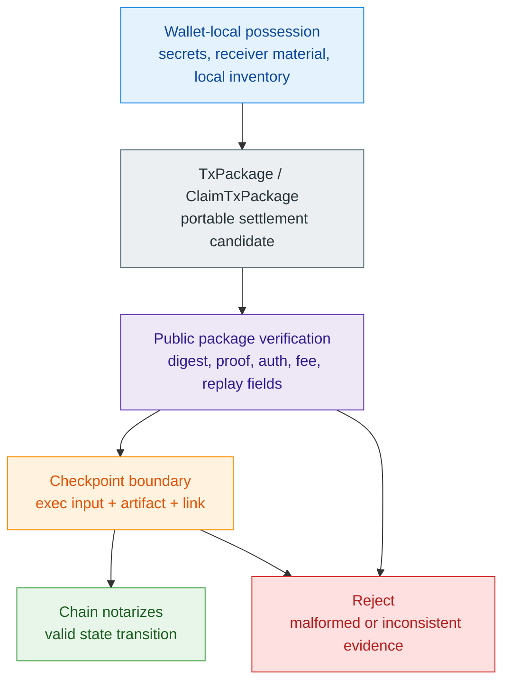

### 2.3 Z00Z Versus Public Account Chains

Z00Z differs from public account-chain architectures at the level of what the chain is trying to remember. An Ethereum-like account chain is built to maintain globally inspectable shared state, broad composability, and a permanent execution record that many parties can read and build against. Z00Z is built to minimize what must become public while still making settlement verifiable. Its canonical story is not “everyone updates a shared balance map.” Its canonical story is **“wallets prepare and recognize confidential asset objects, and the chain later notarizes a valid checkpointed transition for those objects.”**

The comparison remains architectural and fair. Public account chains are solving a different optimization problem. They maximize open statefulness and third-party programmability. Z00Z instead optimizes for confidential object ownership, wallet-local possession, public-artifact settlement, and a sharper separation between protocol guarantees and optional service layers. Privacy-coin, shielded-pool, and MimbleWimble-style systems are relevant comparison families because they also resist transparent balance graphs, but Z00Z’s own thesis is specifically tied to checkpointed asset-tree settlement and receiver-native wallet routing rather than to imitating any one predecessor’s exact surface.

Public account-chain architectures are optimized for globally shared execution surfaces, while Z00Z is differentiated by wallet-local possession, asset-tree settlement, offline-first transfer intent, and protocol-versus-service separation.

#### Where Existing Public Chains Remain Stronger

Public account chains are the reference model where global shared state is the product. Their architecture is organized around direct public composability, broad third-party inspection, and ecosystems that build against one common execution surface. That is a different design center from Z00Z.

This point is stated plainly because Z00Z is not trying to win by imitating that stack. It is not trying to become the easiest place to deploy an unconstrained public contract system or the easiest place to inspect every participant’s state transition. Its competitive claim is narrower and more demanding: that a privacy-first cash and settlement layer can preserve a stronger boundary between public verification and private possession than public account chains are built to allow.

#### Where Z00Z Opens A New Design Space

Z00Z opens a different design space by combining wallet-local ownership logic, privacy-native settlement objects, delayed-connectivity transfer intent, and a protocol-level separation between internal rights and external service surfaces. In the live repository, that design space is already visible in the combination of signed receiver cards, one-time payment requests, stealth ECDH recovery, canonical transaction packages, asset-centric storage paths, and checkpoint-coupled settlement verification. None of those pieces require a public account ledger to be the user’s primary source of truth.

That is the protocol thesis. Z00Z is not “Ethereum, but hidden.” **It is a system in which confidential asset objects are prepared and recognized privately, then settled publicly through a narrow checkpointed evidence path. The result is a protocol that speaks the language of digital cash instead of the language of a transparent public account chain**, while still preserving a public verification boundary strict enough to reject malformed, replayed, or root-inconsistent transitions.

### 2.4 From Digital Cash To Private Asynchronous Rights

Digital cash is the clearest live instance of Z00Z's state model, but it is not the only instance that model can support. Once value is represented as wallet-local objects that can be prepared privately and reconciled later through checkpoints, the deeper abstraction is not merely “coin balance.” It is a privately transferable right that remains meaningful before public settlement and becomes authoritative only once enough public evidence exists to finalize the transition.

That broader framing helps unify parts of the paper that would otherwise look unrelated. Claims are already one example. Voucher-like assets, externally backed ownership rights, bounded access credits, service entitlements, agent budgets, and machine resource permissions are other plausible forms of the same idea. They all fit the same high-level pattern: a wallet or local runtime holds an object that authorizes some economic action, transfer, or exercise, and the chain later sees only the evidence needed to settle or replay-protect the resulting transition.

The present-tense discipline remains unchanged. The live repository is still not a full protocol-wide rights runtime even though HJMT already exposes live `RightLeaf` settlement state. This paper therefore uses rights language as an architectural generalization of the current wallet-local object model and as a roadmap direction, not as a claim that every future rights category is already landed in the current code.

#### Asynchronous Rights Settlement As The Named Pattern

The disciplined name for that broader architecture is **asynchronous rights settlement**. A right can be prepared, carried, evaluated, or locally accepted before the whole network has finalized it, but final authority still belongs to checkpointed settlement evidence. This is why Z00Z should not be described as ordinary online account mutation and should also not be described as unconditional offline finality. It is a rights system in which wallet-local possession and local risk decisions can happen first, while replay-safe canonical settlement happens later.

The stages are easiest to separate by what each stage is allowed to claim:

| Stage | What can happen there | What it must not overclaim |
| --- | --- | --- |
| Wallet-local preparation | A wallet constructs a spend, claim, or future right package from locally held ownership material | Canonical public finality |
| Local acceptance | A counterparty, service, machine, or agent accepts the package under its own risk and policy limits | Global proof that no conflicting package exists |
| Delayed publication | A publisher, aggregator, or route submits the package and supporting evidence when connectivity or batching allows | Automatic settlement merely because something was queued |
| Checkpoint reconciliation | Storage and settlement verify roots, replay boundaries, package consistency, and created or consumed leaves | Custody, redemption, or service honesty outside the protocol boundary |

This pattern is the common spine behind offline cash, private external-asset rights, claim flows, machine capabilities, and agent budgets. The object meaning can vary, but the settlement discipline stays the same: local usefulness before publication, public authority only after checkpointed reconciliation.

## 3. Protocol Core

The Z00Z protocol core is best understood through a **small set of typed objects** rather than through an abstract story about balances, addresses, and generic chain state. The live repository already has a stable vocabulary for what the protocol treats as real: confidential asset leaves, canonical storage paths, portable package envelopes, checkpoint execution inputs, final checkpoint artifacts, and narrow public-verification seams that decide whether those objects fit together. In this paper, state is described through those canonical objects: what each object proves today, and where the boundary between wallet-local preparation and public settlement is actually enforced.

That object-first framing matters because it prevents three kinds of drift. First, it prevents confidential asset ownership from collapsing back into a public account model that the live wallet surface explicitly rejects. Second, it prevents package-level verification from being overstated as final settlement, because the architecture keeps a stricter checkpoint boundary. Third, it prevents domain-specific replay mechanisms from being mislabeled as one universal nullifier table. This section introduces the smallest live protocol core that a technically serious reader must understand before the architecture and operating roles expand outward.

### 3.1 Canonical State Objects

The current protocol core revolves around **a small number of canonical objects that each own a different boundary**. `AssetLeaf` is the public committed settlement payload. `SettlementPath { definition_id, serial_id, terminal_id }` is the preferred live canonical storage path under which committed settlement payloads live, while older asset-centric path wording remains compatibility vocabulary. `AssetPkgWire`, `TxPackage`, and `ClaimTxPackage` are the portable transport surfaces used by wallets and publication lanes. `CheckpointExecInput`, `CheckpointLink`, and `CheckpointArtifact` are the typed public transition artifacts that carry a candidate state update into replay-safe settlement. Those boundaries are the live objects this paper treats as authoritative.

A compact boundary map makes that division of labor easier to keep in mind while reading the rest of the paper:

| Object | Visibility locus | Primary job | Becomes authoritative at |
| --- | --- | --- | --- |
| `AssetLeaf` | Public committed state | Carries the confidential settlement payload for one live asset right | Canonical asset-tree state at the checkpoint boundary |
| `SettlementPath` | Public state locator | Names where a committed settlement leaf exists or is removed in canonical state | Storage and replay-coupled checkpoint application |
| `TxPackage` | Wallet-side transport with public verification fields | Carries ordinary spend intent, digest, and pre-broadcast proof material | Wallet/package verification first, then checkpoint inclusion |
| `ClaimTxPackage` | Wallet-side transport with claim replay fields | Carries claim-domain settlement intent and nullifier-bound replay context | Claim publication plus storage-owned claim replay checks |
| `CheckpointExecInput` | Public replay input | Binds the prior root, input references, outputs, and proof bytes into one candidate transition | Checkpoint draft build and settlement-theorem replay |
| `CheckpointArtifact` | Public final artifact | Seals roots, typed deltas, statement binding, and proof payload | Final checkpoint settlement boundary |
| `CheckpointLink` | Public linkage artifact | Ties artifact identity to execution-input and snapshot identity | Settlement-theorem continuity checks |

**Figure 3.1 - Canonical object graph.** The protocol core is a graph of typed artifacts: wallet packages carry candidate transitions, package outputs become committed leaves through settlement, and checkpoints decide whether the transition becomes authoritative.

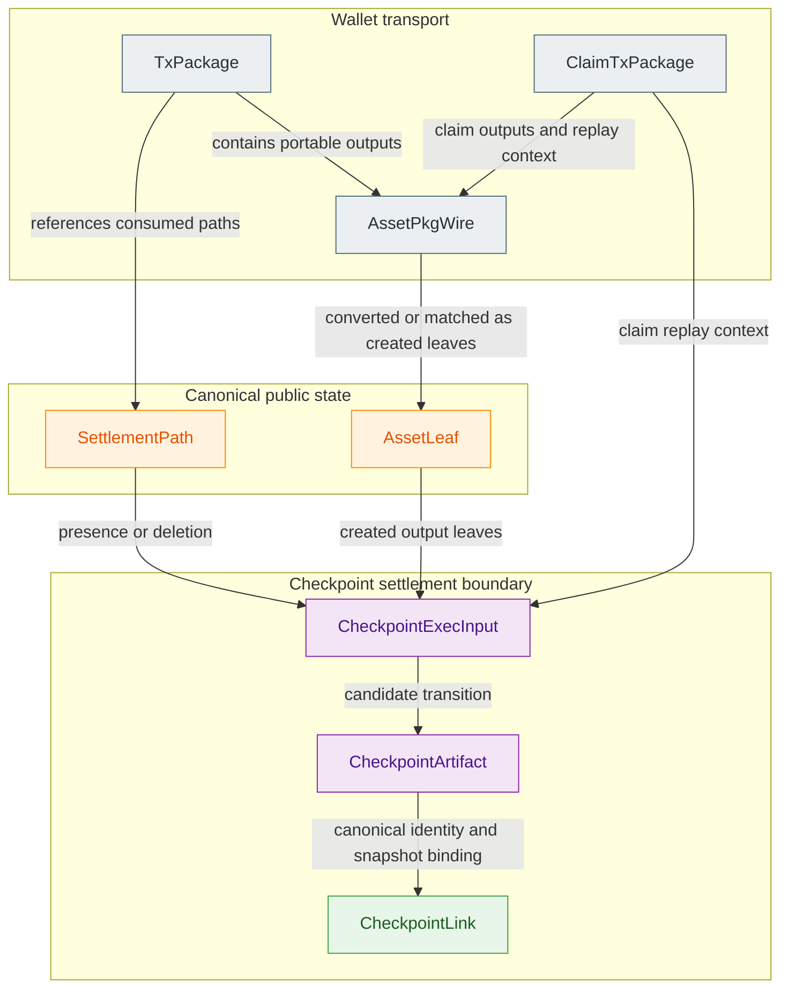

This also explains why Z00Z’s state model is **object-oriented instead of balance-table oriented**. The protocol does not publish one global ownership row per user and then mutate it in place. It publishes committed leaf objects under canonical paths, later proves which paths were consumed and which new leaves were created, and ties those changes to a checkpoint boundary. Wallets can still maintain local views that feel like balances, but those are derived views above the protocol line. The protocol itself reasons about leaves, paths, package envelopes, and checkpointed deltas.

#### Toward Generalized Spendable Capability Objects

The current object model is asset-centric because that is the most mature live contract in the repository. Even so, the same structure already suggests a wider capability model. A wallet-local object can represent not only coin-like value, but any bounded right whose lifecycle can be prepared privately, handed off under controlled conditions, and later reconciled through checkpointed public evidence. Claims already widen the space beyond ordinary transfer, policy-shaped asset definitions widen it further, and locker-oriented internal rights point toward private control over value that may be custodied elsewhere.

This matters because it gives the paper a disciplined way to expand category without inventing new consensus nouns prematurely. The current protocol still settles `AssetLeaf` objects under canonical settlement paths. The broader architectural idea is that those objects are the first concrete members of a more general family of spendable capability objects that future Z00Z workflows may encode more explicitly once the live core is stronger.

#### Confidential Asset Leaves

The live confidential settlement object is `AssetLeaf`. Its current public fields are concrete and narrow: `asset_id`, `serial_id`, `r_pub`, `owner_tag`, `c_amount`, `enc_pack`, `range_proof`, and `tag16`. That shape already says a great deal about the protocol. A leaf is not a public owner record and not a plaintext balance row. It is a chain-visible container for a committed amount, stealth-routing material, encrypted asset payload data, and short scan assistance. In storage, this leaf is the terminal settlement payload. In wallet logic, it is something the holder may be able to recognize and spend. In public verification, it is the object whose existence or deletion becomes part of a replay-safe state transition.

The leaf contract is also intentionally narrower than a whole wallet state object. The leaf does not carry a reusable public identity for the recipient. It does not expose ownership secrets. It does not assert that the chain itself knows the wallet owner in any account-like sense. Instead, the wallet must combine leaf fields with local secret material to decide whether a leaf is relevant. In this paper, the leaf is therefore treated as **committed settlement state rather than as a public ownership declaration**.

Storage completes that picture by making `AssetLeaf` live under the preferred canonical path `SettlementPath { definition_id, serial_id, terminal_id }`. The path determines where the leaf sits in committed state, and the leaf determines what confidential payload is committed there. Presence of that leaf under its canonical path means the right is still live in state; removal of that path from the checkpointed tree means the right has been consumed. This is the most important live state rule in the protocol, and Section 3 presents it directly.

#### Transaction Packages And Claims

The wallet-side canonical envelope for an ordinary transfer is `TxPackage`. It carries chain metadata, a `TxWire` payload, a canonical digest, and lifecycle status. Inside the `TxWire`, inputs are references, not full consumed leaves: each input carries `asset_id_hex` and `serial_id`, while outputs carry `AssetPkgWire` objects. This distinction is important. The package names what is intended to be consumed, but it does not inline the whole consumed pre-state leaf and it does not independently close membership. Final membership stays in the checkpoint and pre-state path.

The portable output carrier inside those packages is `AssetPkgWire`, which is the frozen external JSON contract for human-readable package exchange. The repository distinguishes it sharply from `AssetWire`: `AssetPkgWire` is the public transport DTO, while `AssetWire` remains an internal mutable transport type. This distinction matters because even wallet-portable transaction data has a disciplined public contract instead of one generic serialization bucket.

The claim lane has its own canonical envelope, `ClaimTxPackage`. It is not just a renamed ordinary transfer. Its inputs are claim-source references such as `claim_id_hex`, `claim_source_asset_id_hex`, and `claim_source_commitment_hex`; its context carries recipient binding, scope hash, optional receiver-card material, and a claim-domain `nullifier_hex`; and its proof and auth objects are specific to the claim source path. Z00Z already has more than one package family, and those families exist because the protocol distinguishes normal confidential spends from claim-related issuance or activation flows.

Put differently, an ordinary transfer begins from an already-live sender-side right and reassigns it, while a claim begins from a prior claim source and proves that one specific recipient may materialize one specific private output from that source. In user-facing terms, the distinction is the difference between sending something already held and collecting something already assigned.

That same distinction keeps the claim lane separate from generic mint language. In the broad asset sense, minting means authorized supply creation. A claim is narrower. It converts a pre-authorized right into a recipient-bound output under a claim-specific proof, authority, and nullifier-bound replay contract. This is why the paper describes the live claim path as a concrete claim-domain surface without pretending that every wider issuer, redemption, or mint model is already present in the current repository.

In both lanes, **the package is canonical, but the package is not yet settlement**. Wallets prepare, exchange, and verify these packages before publication. Ordering, publication, checkpoint building, and settlement verification then decide whether the package becomes part of public state transition evidence. That sequence defines the live contract, so this paper uses the word “transaction” in a way that stays compatible with that staged path.

#### Nullifiers And Replay Boundaries

Z00Z does use nullifiers, but it does **not use them as a universal replacement for spent-state**. The authoritative consumed-state model remains asset presence or absence in checkpointed storage. A right is live while its canonical leaf remains present under its canonical path. A right is consumed when that leaf disappears from live state through a valid checkpointed transition. That is the core rule. Nullifiers are narrower domain-separated anti-replay artifacts layered around particular flows.

In the regular spend lane, `SpendInputProofWire` includes a deterministic `nullifier_hex` together with `input_asset_id_hex`, `serial_id`, `r_pub_hex`, `owner_tag_hex`, `commitment_hex`, `leaf_ad_id_hex`, and `leaf_ad_hash_hex`. The public spend verifier treats these as fail-closed public proof fields. It rejects malformed canonical hex, count mismatches, and duplicate nullifiers inside one spend contract. But the public verifier does not thereby become a universal spent-set oracle. The repository’s own proof-boundary notes are explicit that full regular-spend semantics still depend on witness-side material and checkpoint-coupled consumed-leaf resolution.

The claim lane is different again. Claim publication converts claim-package `nullifier_hex` values into storage-owned `ClaimNullifier` and `ClaimNullTx` rows. Storage rejects replay if a claim nullifier already exists, and it also rejects duplicates within one claim publish bundle. At the same time, the claim outputs themselves are inserted as leaf-bearing store operations through `StoreOp::Put`. This is exactly the distinction preserved here: claim nullifiers protect repeated claim identity use, while the ordinary consumed-state rule remains leaf-oriented settlement under canonical paths.

Once that distinction is understood, the protocol becomes easier to describe honestly. Z00Z is not a system where one growing nullifier array fully explains all spent-state. It is a system where storage-owned leaf presence or absence remains authoritative, while domain-specific replay records are introduced where the live flows need them.

### 3.2 Cryptographic Integrity And Proof Discipline

Z00Z’s cryptographic safety model is not just “a proof exists.” The live code repeatedly shows a stricter pattern: important bytes have one canonical meaning, derivations are domain-separated, public fields are normalized and rechecked before acceptance, and malformed or drifted artifacts are rejected immediately. This matters because confidential settlement systems fail not only when a proof system is weak, but also when transport bytes, transcript inputs, or replay-critical identifiers are allowed to drift into ambiguous meanings.

The live examples are consistent across crates. `compute_leaf_ad` binds `asset_id`, `serial_id`, `r_pub`, `owner_tag`, and `c_amount` into a domain-separated leaf-associated digest. `compute_tag16` derives a short scan tag from the shared key and leaf binding. The current ECDH path rejects identity points, and the surrounding decode and validation seam rejects malformed public input before key derivation; `derive_dh_key` then applies a dedicated domain-separated hash rather than a reusable generic label. The strongest byte-level canonicalization today sits in the transaction-package and public spend-proof seams, where fields are canonicalized, decoded, compared against recomputed statements, and failed closed on mismatch.

The consequence is that Z00Z’s integrity discipline lives in the seams between objects as much as in the objects themselves. The protocol depends on leaf binding, strict bytes, canonical digests, authenticated receiver material, range-proof verification, and checkpoint statement linkage all at once. The main narrative keeps that rule at the architectural level, while the appendices carry the domain tables and transcript labels.

#### Canonical Encoding And Fail-Closed Parsing

The repository has explicit canonical byte contracts for protocol-critical payloads. `AssetPackPlain` uses a fixed 72-byte layout: little-endian `value`, then `blinding`, then `s_out`. Strict decode rejects malformed length, and checked decode also rejects noncanonical scalar encodings for the blinding field. The memo-capable extension keeps that discipline by enforcing a bounded memo lane instead of allowing unbounded free-form payload growth. This seam shows that **confidential wallet data is still transported under deterministic, reviewable rules**.

The same philosophy appears in public transport objects. `AssetPkgWire` is the frozen human-readable JSON boundary for package exchange, wallet verification, claim flows, and Scenario 1 artifacts, while `AssetWire` is explicitly not the public JSON contract. The package boundary is intentionally bounded, typed, and fail-closed, and the seam is designed to reject secret-bearing misuse rather than silently tolerate it. This makes clear that **“wallet-local” does not mean “undefined serialization.”** The protocol chooses narrow public DTOs and bounded decode surfaces even where the strongest canonicalization work is reserved for the transaction and spend-proof lanes.

Regular-spend public verification is similarly fail-closed. The verifier canonicalizes proof and auth fields, rejects malformed or uppercase hex in fields such as `prev_root_hex` and `nullifier_hex`, rejects input-count mismatches, rejects proof-blob drift from the carried statement, rejects duplicate nullifiers in one spend contract, and rejects missing or malformed proof material. Final checkpoint identity follows the same discipline: `derive_checkpoint_id` works only from canonical final artifact bytes, while drafts are explicitly rejected on the final-artifact id path. The pattern is consistent enough to summarize simply in the whitepaper: protocol-critical bytes must mean one thing, and malformed bytes must stop the flow instead of being repaired by convention.

#### Range Proofs And Commitment Discipline

Confidential amounts in Z00Z are carried through commitments and verified range proofs, not through plaintext balance fields in public state. In the leaf contract, the public amount carrier is `c_amount`, not a visible numeric value. In the transport and asset layers, commitments and optional range proofs are carried forward into portable wires and output verification paths. The wallet verifier checks output range proofs where the asset class requires them, and the rollup settlement crate exposes both individual and batch range-proof verification helpers for the current accepted public boundary.

The repository is also disciplined about what range proofs do and do not prove. The crypto crate describes the current `AssetRangeProof` surface as a real Bulletproofs+ verification seam. The rollup settlement verifier can reject missing or malformed output range proofs. But that same settlement verifier is explicit that it does not rebuild private witnesses and does not treat output range proofs as full settlement closure. Commitments and range proofs already enforce confidential-amount validity in deterministic verifier paths, yet they do not by themselves replace the broader spend and checkpoint theorem boundaries.

This distinction matters because it keeps the security story coherent. Range proofs protect the amount relation. Commitment discipline protects binding to the carried leaf and output objects. Settlement safety then adds package digest checks, spend-contract checks, checkpoint root continuity, and transaction inclusion inside the execution input. **Z00Z is secure because these layers compose**, not because one proof primitive tries to explain the whole protocol.

### 3.3 Checkpoints As Validation Boundary

The strongest public transition boundary in the live core is the checkpoint system. This is where wallet-prepared and package-verified intent becomes a replay-safe public state transition. `CheckpointExecInput` carries the previous root, snapshot reference, input references, output leaves, and the transaction proof bytes that the current checkpoint and settlement-verifier paths replay and bind. `CheckpointArtifact` carries the roots, typed spent and created deltas, statement-bound identifiers, proof-system tag, and proof payload. `CheckpointLink` binds artifact identity to snapshot identity and execution-input identity. Together, these objects form the public settlement boundary this paper treats as canonical today.

That boundary is stronger than early package admission because **it binds state transition, not just transaction structure**. The checkpoint path ties a candidate transition to the old root, the new root, the typed consumed asset identifiers, the created leaf hashes, and the replay evidence that lets validators confirm continuity. Storage error classes such as `ProofMix`, `ReplayMix`, `LinkMix`, and `RootMix` make this design visible in code: the checkpoint layer is built to fail closed when proof payload, replay identifiers, link edges, or root boundaries diverge.

This is why checkpoints are described here as the current validation boundary instead of as a mere publication container. In Z00Z, a package can be structurally correct and still not be settled. Settlement begins when the package is bound to the execution input, checkpoint artifact, canonical link, and root continuity checks that let public verifiers reject a malformed transition without needing the wallet’s private state.

The dedicated [Z00Z Multi-DA And Checkpoint Architecture Blueprint](../tech-papers/Z00Z-Multi-DA-and-Checkpoint-Architecture.md) extends this boundary without changing it. Z00Z can expose checkpoint hashes, timestamp batches, and optional external meta-anchors as durable verification references, but those anchors remain evidence about a state boundary. They do not replace the settlement theorem, and they do not turn an external chain into the authority that decides Z00Z validity.

#### Settlement Theorem Path

The live public-artifact settlement seam is `verify_settlement_theorem` in the rollup-node crate. Its input is deliberately narrow: a decoded `TxPackage`, a final `CheckpointArtifact`, the canonical `CheckpointExecInput`, and the `CheckpointLink` that ties the artifact back to the execution input and snapshot. The verifier then walks the exact relations treated as authoritative in this paper. It rechecks transaction-package structure and digest compatibility, requires a non-detached checkpoint statement, requires the artifact proof bytes to match the statement-owned backend payload, derives the canonical execution-input id from encoded execution bytes, checks snapshot and link consistency, checks previous-root continuity, derives the final checkpoint id from canonical final artifact bytes, and finally verifies transaction inclusion by matching proof bytes, input references, and output leaves inside the execution input.

Two boundaries are especially important here. First, the verifier intentionally accepts only public artifacts; it does not rebuild private witnesses. Second, it explicitly says that output range proofs are not themselves settlement closure. Those two constraints keep the theorem honest. The live theorem path is a checkpoint-coupled public consistency proof over package, state transition, and link artifacts. It is not yet a claim that every private spend relation has been converted into a fully public trustless theorem of knowledge.

The implication is simple: finality must pass through this theorem path or through a statement-equivalent future replacement. **A package is not final because it exists.** A package is final only once it survives the checkpoint-bound settlement relation that the live core actually verifies.

#### Storage-Owned Replay Protection

Replay protection in Z00Z lives in storage and checkpoint contracts, not in vague narrative assumptions about “the chain remembering a spend.” The storage layer checks that checkpoint execution rows match the actual store operations: what is marked spent in the execution input must match what is deleted or replaced in the store, and what is marked created must match the inserted leaf hashes. That is a stateful replay rule, not a storytelling convenience. If the replay inputs or root boundaries drift, the checkpoint path rejects them with typed mismatch errors.

The same storage ownership principle explains claim replay. In the live repository, a claim is not just an ordinary transfer with a renamed flag. It is a separate `ClaimTxPackage` family that references a claim source by `claim_id_hex`, `claim_source_asset_id_hex`, and `claim_source_commitment_hex`, binds that source to one recipient and claim scope, and carries a separate claim-domain nullifier for replay control while creating recipient-facing output leaves under canonical settlement paths. Claim publication verifies those claim packages, reuses the separate claim-nullifier reservation and replay path, and then applies the carried output leaves and claim replay rows into storage. A repeated claim nullifier is rejected as replay, while the authoritative output objects still enter storage as leaves under canonical paths. This is narrower and more precise than saying that nullifiers are “the” spent set.

The simulator’s boundary states the current operational limit in plain language: package-coupled checkpoint integrity exists, but publication is not yet strong enough to be called fully trustless and authoritative publish-proof closure is not finished. That staging remains explicit. Z00Z already has a real storage-owned replay and checkpoint validation boundary, while later publication and proof surfaces still belong to target architecture rather than to the fully landed live core.

## 4. Rollup Architecture

Z00Z’s live repository already exposes the basic surfaces of a modular rollup, while the broader operational stack still sits partly in target architecture. `z00z_rollup_node` already defines the main composition seam through `DaAdapter`, `NodeRuntime`, `NodeMode`, `NodeConfig`, and `StatusSnapshot`. The simulator already models a package-coupled checkpoint pipeline in which wallet-built transaction packages are turned into canonical execution inputs, storage-backed drafts, and final checkpoint artifacts. What remains incomplete is the full provider-specific publication topology, independent operator deployment story, and fully trustless publish-proof closure. The result is **a real target architecture anchored in real code**, rather than a flattened maturity label that hides the difference between live core and unfinished operator topology.

### 4.1 Sovereign Rollup Model

Z00Z targets a modular sovereign-rollup architecture in which data availability can be externalized while execution rules remain Z00Z-defined. The strongest evidence for that claim is the settlement boundary itself. `verify_settlement_theorem` in `z00z_rollup_node` accepts only Z00Z-defined public artifacts: a `TxPackage`, a final `CheckpointArtifact`, the canonical `CheckpointExecInput`, and the `CheckpointLink` that ties artifact identity to execution-input and snapshot identity. That verifier does not ask an external provider to define what a valid Z00Z transition means. It replays Z00Z’s own package, checkpoint, root-continuity, and inclusion rules. In that sense the sovereignty claim is concrete: Z00Z may publish to an external layer, but the meaning of state transition, replay safety, and settlement remains local to Z00Z’s own protocol contract.

The node-composition layer reinforces the same architecture. `NodeRuntime<A, V, W, D>` is parameterized over aggregator, validator, watcher, and data-availability services, and `NodeMode` already distinguishes `Aggregator`, `Validator`, `Watcher`, `Combined`, and `ApiOnly` deployments. That is the right kind of surface for a sovereign-rollup codebase at this stage: role separation, optional composition, and status reporting, without hard-coding one monolithic node shape. The repository is therefore already aligned with a sovereign-rollup direction, even though the production operator topology is still emerging.

#### Celestia As Data-Availability Layer

The repository is explicit about external DA direction, and Celestia is the primary currently named DA target in that direction. `NodeConfig` carries a `da_provider` selector, `DaAdapter` defines only two provider-facing operations, `publish` and `resolve`, and the live rollup crate already ships `CelestiaLocalAdapter` with `celestia-local://` publication references. The same publication path already materializes typed `CheckpointDaReferenceV1`, `CheckpointPublicationEvidenceV1`, and `CheckpointLifecycleV1` records. Those facts are enough to describe Celestia as the currently implemented DA direction in the architecture story while keeping the provider-maturity claim narrow.

These surfaces identify Celestia as the primary currently named DA direction, but the live code exposes the abstraction seam and the provider choice more clearly than the final provider implementation. Z00Z is therefore presented as a rollup that externalizes data availability and currently names Celestia as its primary DA direction, while the provider-specific publication path remains an *active implementation surface rather than a completed operational fact*. The same seam also means Celestia is not the only conceivable external DA home in principle: any provider that can satisfy the same `publish` and `resolve` contract could fit this architecture. But the live implementation does not yet name, rank, or implement alternative providers with the same specificity, so they appear here only as seam-compatible possibilities rather than as parallel committed integrations.

In that wider design space, Celestia, EigenDA, and Avail are all credible external DA candidates. Celestia is emphasized here not because the current settlement meaning depends uniquely on it, but because it is the most convenient presently named fit for the repository's narrow DA seam and sovereign-rollup framing. EigenDA or Avail could in principle occupy the same architectural role once integrated, but today they are better described as compatible alternatives than as co-equal live directions in the repository.

#### Z00Z-Owned Execution Rules

The simulator’s checkpoint pipeline shows that Z00Z is not described as a thin application living under somebody else’s execution rules. The bridge, apply, and finalize path is already split into distinct artifact classes. Simulator writes deterministic bridge artifacts and canonical execution-input bytes. The next storage-backed apply stage rebuilds a checkpoint draft from the canonical prep snapshot and execution input rather than from simulator-local digest guessing. The finalization stage then seals the final artifact, link, and audit surfaces from that storage-owned draft. This separation matters because it shows that Z00Z execution is defined by its own checkpoint contract: previous root, new root, input references, created outputs, replay evidence, and statement-bound artifact identity. External DA can carry publication bytes, but it does not define the state machine.

The same codebase is equally explicit about what is not yet finished. The simulator notes that the current stack has package-coupled checkpoint integrity, but that publication is not yet strong enough to be called fully trustless and that authoritative publish-proof closure remains unfinished. **Z00Z already owns its execution theorem.** It does not yet claim that every publication or finality surface around that theorem has reached its final production form.

### 4.2 Ordering, Publication, And Verification

The rollup architecture also depends on a clean separation between **who admits work, who orders it, who publishes it, and who later verifies or observes the result**. The repository already models that split in a compact but meaningful way. Aggregator code distinguishes `WorkItem`, `OrderedBatch`, `PublicationRequest`, `PublishedBatch`, `PublicationRecord`, and `SoftConfirmation`. The DA layer sees a publication request and later resolves a published batch. Validators consume a `ResolvedBatch` and return a typed `Verdict`. Watchers observe published batches, publication records, soft confirmations, verdicts, and provider signals, then reduce them into snapshots and alerts. This is the right architectural shape for a system that wants to keep ordering and publication modular while preserving a narrow, fail-closed validation seam.

The simulator again provides the operational interpretation. Early package artifacts are useful, but they are not authoritative settlement. Bridge outputs and execution inputs are still only handoff material. Canonical public meaning appears only once the checkpoint draft is rebuilt against storage-owned replay state and later sealed into final artifact and link surfaces. Publication is therefore one layer in a longer chain of custody, not the moment at which truth is automatically established.

The role split is easier to read as an authority map:

| Role or surface | Main artifacts handled | Can decide | Cannot decide |
| --- | --- | --- | --- |
| Aggregator | `WorkItem`, `OrderedBatch`, `PublicationRequest` | Admission, ordering, and publication handoff | Final settlement truth |
| DA provider seam | `PublicationRequest`, `PublishedBatch`, `ResolvedBatch` | Publication and byte-resolution outcomes | Z00Z execution semantics |
| Validator | `ResolvedBatch`, `Verdict` | Accept or reject public-artifact consistency | Wallet-local ownership truth or external custody truth |
| Watcher | `PublicationRecord`, `SoftConfirmation`, `ProviderSignal`, observation snapshots | Observation, alerting, and anomaly surfacing | Settlement finality or operator policy |
| Future checkpoint signer or light client | Checkpoint-derived public artifacts | Future attestation or relay around the checkpoint boundary | Replace theorem meaning or redefine valid transition |

**Figure 4.1 - Sovereign rollup role topology.** Ordering, publication, validation, and observation are separate roles around one Z00Z-owned settlement core; target checkpoint signers and light clients sit outside the current core as future confirmation surfaces.

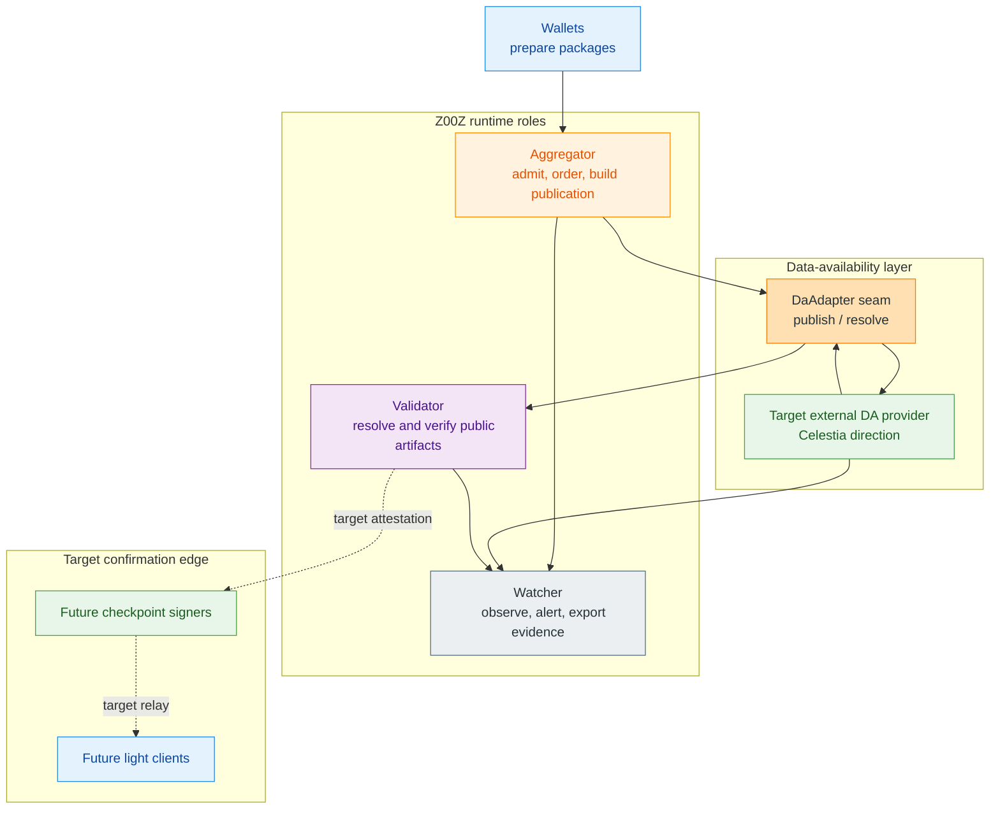

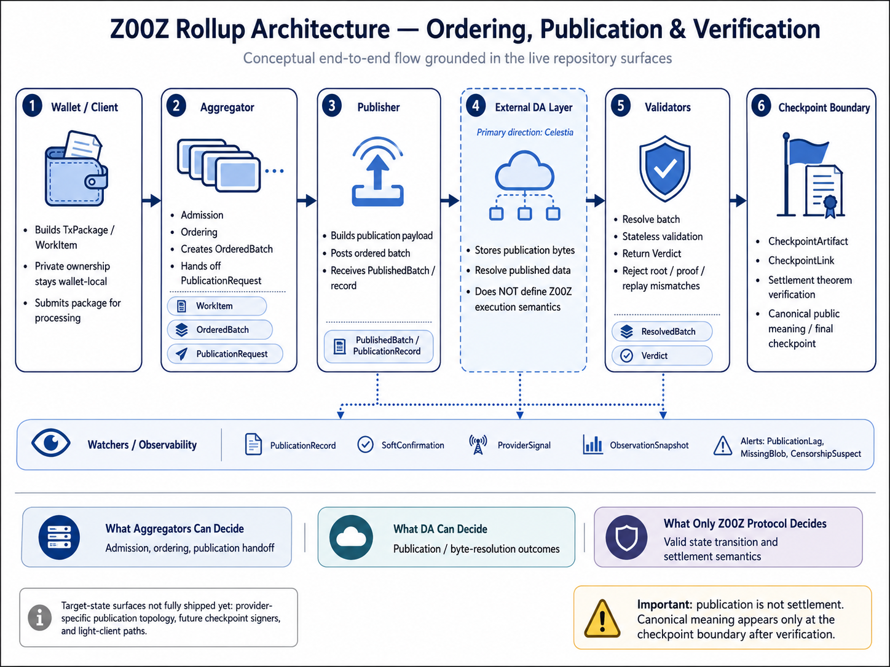

*Infographic 4.A - Conceptual ordering, publication, DA, validation, and checkpoint-boundary view. The image keeps target-state notes explicit: provider-specific publication topology, checkpoint signer paths, and light-client paths remain future surfaces, while package, batch, publication, verdict, and watcher-evidence types are live surfaces.*

#### Aggregator And Publisher Path

In the runtime crates, the aggregator path begins with admission and ordering. `AggregatorIngress::admit` decides whether a `WorkItem` is accepted or rejected, `AggregatorOrdering::order` produces an `OrderedBatch`, and `AggregatorRecovery::build_publication` converts that batch into a `PublicationRequest`. After the DA-facing side returns a `PublishedBatch`, the aggregator records the publication result and can emit a `SoftConfirmation` for intake identifiers already mapped into a batch. The publication state machine in `PublicationState` makes the intended lifecycle visible: a batch can move through `Received`, `Admitted`, `Ordered`, `Built`, `ProofReady`, `HandedOff`, `Posted`, `Seen`, `Accepted`, `Rejected`, `RetryPending`, `Failed`, and `Finalized`.

That runtime surface lines up with the simulator’s bridge path. The repository does not treat wallet-built packages as instantly final, and it does not treat the bridge layer as the final checkpoint surface. Instead it models an ordering and publication path that hands off durable checkpoint material toward later verification and sealing. That discipline remains explicit here: Z00Z already has a credible aggregator and publisher boundary, while a finished dedicated publisher fleet and a completely finalized production submission topology remain later operator layers.

#### Stateless Validator Path

The repository already defines a stateless validator contract in a precise sense, even though the full validator runtime remains thinner than the theorem and storage surfaces it points to. `DaAdapter::resolve` turns a `PublishedBatch` into a `ResolvedBatch` containing the published batch, the ordered batch, the checkpoint artifact, and the replay-critical nullifier set. `ValidatorService::validate` then returns a typed `Verdict`, with rejection classes such as `ArtifactMissing`, `ProofInvalid`, `ReplayConflict`, `StateRootMismatch`, and `ProviderInvalid`. This is not wallet-balance replay and not a universal scan of every historical package. It is checkpoint-coupled validation over bounded public artifacts.

The deeper checkpoint storage code shows what that means. `build_cp_draft` reconstructs the transition from canonical prep snapshot, replay entries, execution input, proof verifier, and spent index. `verify_settlement_theorem` then checks package digest consistency, execution-input identity, snapshot linkage, previous-root continuity, canonical checkpoint identity, and transaction inclusion. Storage rejects artifact drift with fail-closed mismatches such as `ProofMix`, `ReplayMix`, `LinkMix`, and `RootMix`. The resulting validation model is therefore **stateless at the operator edge but still state-aware at the checkpoint boundary**: validators do not need an account-ledger view, yet they do need the public artifact chain that proves one checkpointed transition follows another correctly.

#### Watchers, Validators, And Future Checkpoint Signers

The watcher surface exists to make nonfinal publication behavior observable rather than to redefine settlement. `WatcherInput` already combines `PublishedBatch`, `PublicationRecord`, optional `SoftConfirmation`, optional `Verdict`, and optional `ProviderSignal`. `ProviderSignal` records which provider stage is being observed, `Publish`, `Resolve`, or `Observe`, and whether the outcome is `Pending`, `Success`, `RetryPending`, `Missing`, or `Failed`. Watcher output is reduced into an `ObservationSnapshot` and alert stream. The alert taxonomy is narrow but meaningful: `PublicationLag`, `MissingBlob`, `CensorshipSuspect`, `ProviderDivergence`, `RetryStagnation`, `InvalidBatch`, and `ValidatorIncomplete`. That is enough to let the whitepaper say that Z00Z is designed to make publication anomalies and censorship suspicions observable, even before the final production monitoring stack is complete.

What the repository does not yet expose as a canonical runtime contract is a finished checkpoint-signer or light-client subsystem. Those remain architecture-level operator surfaces rather than shipped core modules in the inspected code. The current maturity profile is therefore asymmetric. Validators and watchers are already real named boundaries. Future checkpoint signers and light-client-facing confirmation paths belong to the target topology that will sit around the checkpoint artifact boundary, not to a completed runtime contract already embodied in `z00z_rollup_node`.

#### Operator Roles And Minimal Requirements

At the current stage, the minimum credible operator picture is small. An aggregator or publisher needs durable access to admitted work, ordering logic, checkpoint-draft construction, and a DA publication path. A validator needs the ability to resolve published batches, replay the checkpoint-bound public artifact relation, and reject mismatched roots, proofs, or provider surfaces without depending on a wallet-local balance view. A watcher needs independent visibility into publication state, validator verdicts, and provider outcomes so that lags, missing blobs, or divergent observations can be surfaced as alerts instead of being silently normalized away.

The trust boundaries are just as important as the roles themselves. Aggregators can batch and hand off work, but they **do not get to redefine execution rules**. DA providers can make publication bytes available, but they do not determine whether a checkpoint transition is valid. Watchers can surface anomalies, but they do not replace settlement verification. API-only nodes can expose views into the system, but they are not settlement authorities. Light clients, once they are fully specified, consume checkpoint evidence rather than soft confirmations alone. That is the operator-level summary of the system: enough structure to explain who does what, and enough restraint to avoid confusing soft operational surfaces with the canonical settlement boundary.

## 5. Digital Cash And Offline Ownership

Z00Z does not model money as **a public account balance that all participants constantly read and update**. The live codebase treats the spendable unit as an asset-centric object that a wallet can recognize, prepare, exchange, and later reconcile. The wallet crate is explicit about this orientation: it is a no-account, asset-based wallet surface, and its receiver stack is built around signed receiver metadata, stealth outputs, request-aware scanning, and claimed-asset persistence rather than around a reusable public address plus a visible balance table.

That distinction matters. Z00Z already has the wallet-side ingredients for cash-like handling of confidential objects: signed receiver routing surfaces, portable request and transaction payloads, wallet-local ownership detection, delayed-connectivity import and continuation, and later confirmation through wallet-consumed confirmation evidence, with checkpoint-coupled settlement remaining the broader protocol boundary. Until publication and confirmation occur, those artifacts remain wallet-side or handoff-side objects. They do not become durable settlement facts merely because two parties exchanged them locally.

### 5.1 Coins As Wallet-Local Objects

The repository’s stealth-asset model already gives a concrete meaning to **wallet-local value**. A canonical public asset leaf carries fields such as `r_pub`, `owner_tag`, `enc_pack`, and `tag16`, while the wallet scanner derives ownership from receiver secrets and wallet-local context. What the wallet recovers from that process is not an account entry. It is a candidate confidential object whose value and opening material become intelligible only to the wallet that can decrypt and validate it.

The receive types make the boundary precise. `DetectedAssetPack` and `WalletStealthOutput` are explicitly described as transient detection objects, not claimed-asset persistence records. `ScanResult::Mine` means the wallet has recognized a spendable candidate under its own secret material. `ReceiveNext::ReportOnly` versus `ReceiveNext::PersistClaim` then separates mere detection from mutation of wallet-owned state. In other words, a Z00Z "coin" is best understood as a wallet-recognized confidential object whose spendability depends on local secrets and on the continued presence of the corresponding asset under the canonical state path, not as a row in a public balance ledger.

#### No-Address Ownership Model

Z00Z’s no-address model is narrow and technical. The live receiver surface does not make a permanent public account address the canonical ownership primitive. Instead it exposes signed routing and approval artifacts. `ReceiverCard` authenticates the receiver routing surface, but the code is careful to say that it does not by itself prove final spend authority and does not replace request approval policy. `PaymentRequest` then binds `owner_handle`, `view_pk`, `identity_pk`, `req_id`, `chain_id`, optional amount, and expiry into a signed one-time request object.

This keeps routing identifiers in their correct place instead of pretending they disappear from every layer. The live design still has receiver-facing artifacts, but they are portable, signed, bounded, and wallet-interpreted rather than globally reused as the canonical balance index. Ownership itself is proven through stealth-output detection, import, and later checkpoint-aware confirmation, not through publication of a long-lived reusable receiving address.

#### Offline Representation And Possession

The current code also gives a concrete meaning to offline representation. `ReceiverCard` has a compact transport encoding, `PaymentRequest` can be turned into QR and NFC payload data, and the RPC layer defines a `PortableWalletTxPackage` specifically as a portable transaction package for offline transfer. These are real transport surfaces for moving payment intent and transaction material between wallets without requiring that settlement happen at the same moment as handoff.

But possession still has to be described carefully. In the live code, **possession means control over the relevant wallet secrets plus possession of the signed receiver or transaction artifacts needed to interpret a still-live asset object**. It does not yet mean that a file alone is a universally self-settling bearer instrument. The scanner remains fail-closed: `add_request(...)` adds liveness metadata only, strict tag-only ownership claims require complete materialized tag contexts, and wallet detection stays separate from claimed-state persistence. The right way to describe possession, then, is wallet-local control over a still-present spendable object and its secrets, with transportable artifacts assisting exchange, not a finished coins-as-files theorem detached from later proof and publication.

#### Spend-Then-Reconcile Model

The strongest live cash-like pattern in the repository is therefore spend-then-reconcile. The sender lane can build and export a transaction package, and the receiver lane can import that package later. `wallet.tx.import_transaction` re-verifies the package, rejects chain mismatches, requires wallet-owned outputs, and imports the owned outputs into the wallet-side claimed-asset authority. After that, the same lifecycle can continue through receiver-lane broadcast and, once verified confirmation evidence is available, later reconciliation.

The simulator treats this as a canonical lifecycle rather than as an edge case. Simulator is explicitly documented as sender export plus receiver import continuation followed by receiver-lane broadcast and reconcile. That is already enough to justify a delayed-connectivity transfer model in the main paper. It is *not enough* to justify saying that local handoff by itself finalizes ownership or that the offline lane is already a complete trustless offline-cash economy.

### 5.2 Offline Payments

Offline payment is therefore a legitimate Z00Z design target, but the live boundary is narrower than some legacy ideation docs suggest. What is already real is **delayed-connectivity exchange of signed receiver artifacts and portable transaction packages, followed by later online broadcast and reconciliation**. A payer can work with a signed `ReceiverCard` or `PaymentRequest`, prepare a package, export it, and hand it to a receiver that later verifies and imports it. The receiver does not need a public account table to understand what it received; it needs the correct wallet secrets and the package or request data.

Low-connectivity commerce is not a side note in this architecture; it is one of the clearest practical consequences of the wallet-side package model. The present-tense claim is still bounded to delayed-connectivity exchange and later reconciliation, but that boundary is already strong enough to justify private merchant and field-payment language more comfortably than in an online-only account chain.

The live offline path becomes clearer when broken into stages:

| Stage | Main artifact or action | What the receiver can do | What is still not settled |
| --- | --- | --- | --- |
| Receiver handoff | Signed `ReceiverCard` or `PaymentRequest` | Recognize intended routing material and bounded payment context | No spend is consumed and no public settlement exists yet |
| Package preparation | Exported `TxPackage` | Carry a portable transfer candidate across a delayed-connectivity boundary | Nothing has been admitted, ordered, or checkpointed |
| Local import | `wallet.tx.import_transaction` | Re-verify the package and persist owned outputs locally | Final acceptance still requires broadcast and later evidence |
| Publication intake | Broadcast and admission into the publication path | Learn that the package entered staged publication handling | Admission or soft progress is not yet final settlement |
| Reconcile | Confirmation evidence plus checkpoint-coupled validation | Treat owned state as reconciled under the live wallet path | Network return, validator acceptance, and root continuity remain required |

**Figure 5.1 - Offline spend-then-reconcile lifecycle.** Local handoff and import can make a wallet aware of candidate ownership, but settlement remains unresolved until publication, validation, and reconciliation complete.

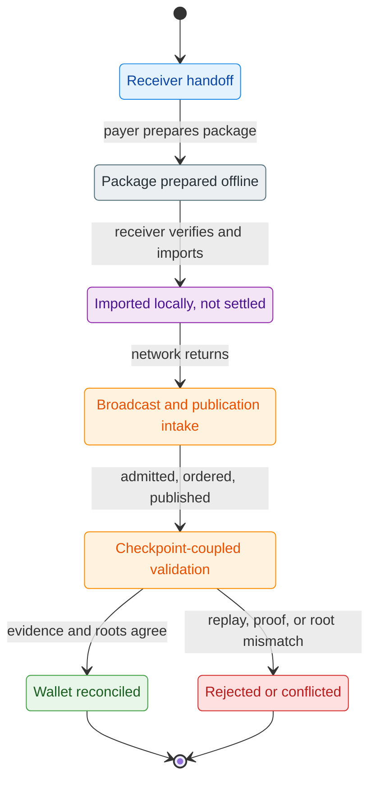

Stronger consumer language about finished voucher economies, secure-element counters, or a universally settled hardware-backed bearer flow is not yet justified. Those remain valid architectural directions, but they stay in roadmap or appendix framing until they are backed by live contracts. Z00Z already supports delayed-connectivity payment exchange and later settlement continuation, but not every offline-cash UX variant is already delivered.

#### Double-Spend Arbitration Window

Delayed reconciliation also creates an unavoidable arbitration window. **Exchanging a package locally does not answer the settlement question by itself.** The online system still has to resolve whether the consumed pre-state object was valid, whether the package matched the public spend contract, and whether the transition can pass the current wallet confirmation path before any broader checkpoint-backed acceptance claim is made.

The code keeps that distinction sharp. `verify_full_tx_package` is the pre-broadcast package verifier, not the final admission or checkpoint theorem. The simulator’s committed post-transaction wallet scan validates the JMT proof first and only then asks whether the wallet owns the leaf. Its own summary string says exactly what matters: proof blob plus committed-state validation comes before ownership detection, and that path is not equivalent to a detached scan. Storage enforces the same logic from the opposite direction. A consumed right is not modeled as a lingering public balance with an overlay flag; deletion of the canonical `SettlementPath` removes the leaf from the live state. Nullifiers and spend-proof material help bind replay-sensitive statements, but they do not replace the root-level rule that a spendable right exists only while the canonical state still contains the relevant asset at the correct path.

### 5.3 Wallet Responsibilities

In this model, the wallet does substantially more than hold keys. It must derive receiver material, generate signed receiver artifacts, validate untrusted ingress, scan candidate leaves, distinguish transient detection from claimed ownership, persist spendable objects into the `.wlt` owned-asset authority, reserve and release inputs during transaction building, import externally received packages, and reconcile claimed state after confirmation evidence arrives.

The owned-asset store makes that responsibility explicit. `OwnedAssetPayload` tracks status, source, scan references, receive references, spend references, and confirmation references, and it rejects inconsistent combinations such as a supposedly spendable asset that still keeps a live spend reservation. The wallet is therefore the local state machine that turns private detection and imported packages into a coherent spendable set. In this paper, wallet logic is treated as protocol-critical infrastructure rather than as a thin UI convenience layer.

#### Request-Bound Receive As Live Wallet Path

The strongest current receive contract is request-aware reception through the canonical range-scan lane. `recv_range(...)` derives live receiver keys, restores the persisted scan cursor, registers non-expired requests as metadata, scans supplied chunks, persists detected hits through the wallet-native owned-asset store, and advances the wallet scan cursor. The service comments are explicit that this is the canonical receive lane and that single-asset helpers are not the equivalent privacy theorem.

That request lane is already richer than a bare receive handle. `PaymentRequest` metadata can carry payment identifiers, minimal-confirmation hints, and return routing, while wallet policy rules already enforce allowed asset sets, recipient allowlists, and time restrictions, and expose a confirmation flag for wallet UX or service-layer enforcement. Taken together, those live surfaces make private invoice, merchant-checkout, and other bounded commerce flows more credible than address-first payment rhetoric, even though autonomous recurring debit and broader service automation remain future work.

That matters for the paper’s offline wording. `ReceiverCard`, `PaymentRequest`, and `TxPackage` exchange are real delayed-connectivity surfaces, but request presence alone never authorizes ownership. `StealthOutputScanner::add_request(...)` adds liveness metadata only, and strict tag-only ownership claims require a fully materialized tag-context set. The correct description is therefore that **request-bound receive is the strongest live wallet path today**, while broader universal offline-cash claims remain future-facing.

#### Light Sync And Recovery

**Recovery in a privacy-first system cannot rely on replaying public balances**, because public balances are not the ownership surface. The live wallet recovery code instead reconciles derivation progress through a gap-limit scan policy over payment and change chains, persists the recovered next indexes into the encrypted wallet profile, and exposes the current derivation state as explicit wallet metadata. On the receive side, scan progress is resumed through a persisted `ScanStatePayload` cursor rather than through a global account ledger.

That is why light sync and recovery appear here as protocol concerns. A user experience that depends on private ownership objects has to make receiver derivation, scan resumption, and checkpoint-aware reconciliation reliable. Z00Z’s current code already treats those responsibilities as part of the wallet’s core state machinery, not as a cosmetic add-on.

#### Receiver Inputs And Untrusted Boundaries

Receiver-facing inputs are also intentionally treated as untrusted. `ReceiverCard::from_untrusted_bytes(...)` enforces strict minimum and maximum sizes before decoding, and `PaymentRequest::from_untrusted_bytes(...)` applies the same fail-closed shape discipline. `PaymentRequest::validate_all(...)` then checks version, chain, expiry, key validity, signature correctness, and TOFU or pinning status, with explicit rejection for wrong chain, expiry, revoked pins, or identity mismatch states.

The transaction import lane follows the same philosophy. `wallet.tx.import_transaction` re-verifies the full package, refuses chain mismatches, and rejects imported packages that do not actually contain wallet-owned outputs. Z00Z’s offline and wallet-local ownership story is therefore not "trust anything the user scans." It is a fail-closed boundary in which cards, requests, and packages are portable and user-facing, but are still **treated as adversarial input** until the wallet has validated them against its own keys, policies, and chain context.

### 5.4 From Offline Payments To Offline Rights

Offline handling matters here not only because people sometimes want to move coins without immediate connectivity. It matters because the same spend-then-reconcile pattern can support a wider family of local economic rights. Once a wallet can import, validate, and temporarily act on a private package before public settlement, the architecture naturally extends from payment handoff to bounded vouchers, service claims, access permissions, agent budgets, and machine-held resource rights that remain meaningful during degraded connectivity and become authoritative only after later reconciliation.

The unifying rule does not change. Local transfer or exercise can change who is expected to control a right or budget, while checkpoint settlement later decides whether that change survives replay checks, root continuity, and public verification. In that sense, offline Z00Z is not only about carrying a coin-like object through a network gap. It is about preserving bounded economic continuity for private rights during that gap without pretending that local execution alone is already final settlement.

| Right form | What can happen locally before publication | What still waits for settlement |
| --- | --- | --- |
| Voucher or bounded claim | Handoff, import, and local recognition of the intended right | Final issuer-backed or asset-state reconciliation |
| Access or service permission | Local presentation or conditional exercise under wallet policy | Replay-safe settlement evidence and later confirmation |
| Agent spending budget | Bounded autonomous use of a pre-scoped package or allowance | Network acceptance, checkpoint inclusion, and fee closure |
| Machine resource right | Local device or edge runtime can continue under a private entitlement lane | Checkpointed accounting, conflict resolution, and root continuity |

These broader offline-rights examples belong to architectural direction rather than to a finished shipped product catalog. The live core already supports the delayed-connectivity pattern strongly enough to justify the category, while the richer rights families still depend on future object design and ecosystem tooling.

## 6. Privacy And Selective Disclosure

Z00Z privacy has to be described as **a visibility contract rather than as a slogan that nothing is visible**. The live protocol does not publish a reusable account table, but it does publish structured settlement objects and checkpoint-bound public artifacts. A canonical `AssetLeaf` still carries public fields such as `asset_id`, `serial_id`, `r_pub`, `owner_tag`, `c_amount`, `enc_pack`, `range_proof`, and `tag16`, while the rollup settlement verifier intentionally operates only on public package, checkpoint, execution-input, and link artifacts. Privacy in Z00Z therefore means reducing public observability to the minimum needed for replay-safe settlement, while keeping spendable ownership locally recoverable inside the wallet.

### 6.1 Stealth Ownership Model

The live ownership model combines signed receiver routing, per-output DH derivation, short scan hints, and encrypted payload recovery. A sender starts from a `ReceiverCard` and, on request-bound flows, an optional `PaymentRequest`. From that material the sender derives shared keying material, then computes an `owner_tag`, binds leaf-associated data, encrypts the asset plaintext, and derives a short `tag16` prefilter. The wallet scanner performs the inverse path: compare owner tags, test `tag16`, decrypt the pack, decode the plaintext, and verify that the decrypted opening matches the public commitment. The result is **a concrete stealth pipeline**, not a vague claim that Z00Z merely has an encrypted balance.

#### Owner Tags, Tag16, And EncPack

`owner_tag` is the first hidden ownership boundary. It is derived from the receiver's stable `owner_handle` plus per-output shared keying material, so it is not a reusable public balance identifier. `tag16` is the second boundary: a deliberately small prefilter derived either from the shared key plus canonical leaf-associated data or, on request-bound flows, from the shared key plus `req_id`. Its job is to reduce scan work, not to serve as a standalone ownership proof. `enc_pack` is the third boundary: it carries the wallet-relevant plaintext under context-bound encryption. In the current basic lane, that plaintext is a fixed-width object containing `value`, `blinding`, and `s_out`; the core asset-pack format and wallet scan path also define a memo-capable lane with an optional wallet-local memo inside the encrypted payload. Only after decryption does the wallet recover the amount and opening material needed to prove that the public commitment is consistent with what it sees locally.

#### What Observers Can And Cannot See

This visibility model is narrower than a public-account chain, but it is not zero-visibility. Public observers can still see that a leaf exists, which checkpoint admitted it, which public commitments and proof bytes it carries, and at which checkpoint height it was admitted. They can see `r_pub`, `owner_tag`, `c_amount`, `enc_pack`, `range_proof`, `tag16`, and other checkpoint-bound artifacts because those fields are part of the public settlement object. The owner-signature path is designed around the same rule: public verifiers can validate the public ownership message without ever receiving raw `s_out` bytes. A payer or routing counterparty who receives a `ReceiverCard` learns the fields intentionally exposed there, including `owner_handle`, `view_pk`, `identity_pk`, and any signed card metadata. A party who receives a `PaymentRequest` additionally learns `req_id`, optional amount, expiry, and attached request metadata, because those are routing and approval artifacts rather than hidden leaf contents.

What public observers do not get from the normal stealth leaf is the decrypted amount, the blinding scalar, the output secret, or the wallet-local memo. Those values are recovered only by a wallet that can derive the correct shared key and successfully pass the decrypt-and-opening checks. Even so, hidden values do not imply perfect anonymity. Timing, publication patterns, repeated receiver publication, deliberate sharing of receiver or request artifacts, and any future directory or bridge surfaces can still create heuristic leakage. Z00Z's live claim is therefore **stronger than transparent accounts but narrower than an absolute theorem** that every observer across transport, logging, and publication surfaces sees an unlinkable system.

#### Privacy Threat Model Boundary

The privacy threat model follows from that visibility contract. Z00Z hides public-account ownership, wallet inventory, decrypted amounts, wallet-local memos, and the private meaning of a spendable right from ordinary public settlement observers. It does not hide the existence of checkpointed evidence, committed leaves, proof payloads, admission timing, publication metadata, or any information a user or service voluntarily discloses through receiver cards, payment requests, audit exports, bridge routes, or app-layer records.

Different adversaries therefore pressure different seams:

| Adversary | Main observation surface | Boundary the paper should claim |
| --- | --- | --- |
| Public settlement observer | Leaves, commitments, proof bytes, roots, deltas, and timing | Cannot read wallet-local ownership meaning, but can still analyze public timing and graph-adjacent metadata |
| Aggregator or publisher | Package admission, retry behavior, batch timing, and provider outcomes | Can delay or correlate publication, but cannot turn invalid evidence into final settlement |
| DA provider or archive | Blob references, timestamps, availability outcomes, and artifact hashes | Supports recoverability and availability, not sender, receiver, or amount discovery when payloads are non-sensitive |
| Malicious receiver or service | Receiver cards, payment requests, receipts, access logs, or disclosure packages it was intentionally given | Learns only the workflow-specific surface unless the user or wallet reuses identifiers carelessly |
| Bridge, locker, or issuer operator | Deposit, custody, redemption, reserve, and route-status events | May correlate entry and exit edges; does not automatically see the internal private reassignment graph |
| Offline spender or colluding local actors | Local packages, receipts, and later conflicts | Can create disputes or fraud evidence, but liability-domain reveal should remain conflict-triggered rather than honest-path public history |

This boundary keeps the privacy claim precise. Z00Z is designed to minimize public observability and keep ownership interpretation wallet-local, not to erase every operational trace created by transport, services, bridges, user behavior, or future disclosure overlays.

### 6.2 Current Privacy Lane And Target Selective Disclosure

The current privacy lane is already real, but it is also narrower than some historical design notes imply. The live story is **stealth reception, wallet-local ownership recovery, bounded request validation, and checkpoint-coupled public settlement**. It is *not yet* a complete menu of production visibility regimes. The repository already contains several pieces that matter for future disclosure policy, but those pieces do not yet add up to a generally available per-transfer switch between private, selectively disclosable, and fully corporate-auditable transfer semantics.

#### Anonymous Mode

The privacy-maximal operating mode in the live system does not expose a public balance table, a reusable public receiving address, or an explicit on-chain ownership chain for ordinary stealth outputs. Receivers can stay on signed `ReceiverCard` and signed `PaymentRequest` surfaces, while the on-chain settlement object remains a commitment-bearing leaf that only the intended wallet can interpret locally. The simulator exercises the card-bound stealth path rather than a second, more transparent payment model, so the live anonymous lane is presented here as the default receive and spend model.

But anonymous mode still has a disciplined boundary. Counterparties can obviously see the cards and requests they are asked to pay. Wallet-local TOFU and pinning policy around `identity_pk` and `view_pk` is a trust-management layer, not a public anonymity proof. And once a receiver chooses to publish a receiver-card record instead of staying on private exchange, that publication deliberately widens what other parties can discover. The live claim is therefore privacy-maximal operation relative to public-account systems, not unconditional invisibility across every operational surface.

#### Auditable Or Corporate Mode

The repository does show why selective disclosure is plausible, but not why it counts as broadly shipped. `ReceiverCardRecord` provides a canonical published receiver-card contract with epoching and revocation. `CheckpointAudit` exists as a storage-owned audit wrapper outside canonical checkpoint artifact bytes. Wallet receive DTOs can intentionally expose fields as `Present`, `Redacted`, or `Unavailable`, and the RPC logging path aggressively redacts secrets, memos, tokens, and other sensitive values instead of treating diagnostics as automatically safe. Together these are meaningful building blocks for future disclosure and audit tooling.

Near-term, the design is better described as **multi-view accounting rather than universal transparency**. The code already separates settlement-facing artifacts such as `CheckpointAudit` from watcher evidence surfaces such as `EvidenceRecord`, `PublicationRecord`, `PublishedBatch`, and `ProviderSignal`, while wallet DTOs can expose recovered fields as `Present`, `Redacted`, or `Unavailable`. That is enough to say the architecture can support different observer views over one settlement core: a narrow settlement view, an operator or auditor evidence view, and a wallet-local secrecy view.

Those views can be summarized without pretending that a full corporate disclosure stack is already shipped:

| View | Main surfaces | Can see | Cannot claim from current code |
| --- | --- | --- | --- |
| Settlement view | `CheckpointAudit` plus checkpoint-bound public artifacts | Roots, typed deltas, and settlement-linked public evidence | Receiver secrets or full wallet-local meaning |
| Operator or auditor evidence view | `EvidenceRecord`, `PublicationRecord`, `PublishedBatch`, `ProviderSignal`, `Verdict` | Publication progress, provider state, verdict context, and observed anomalies | An automatic enterprise disclosure theorem |
| Wallet-local secrecy view | `WalletReveal::{Present, Redacted, Unavailable}` plus recovered local fields | Private recovered wallet meaning under local policy | Public proof of every hidden field to third parties |

**Figure 6.1 - Visibility modes over one settlement core.** Z00Z can support different observer views without changing the checkpoint rule that decides whether a transition is valid.

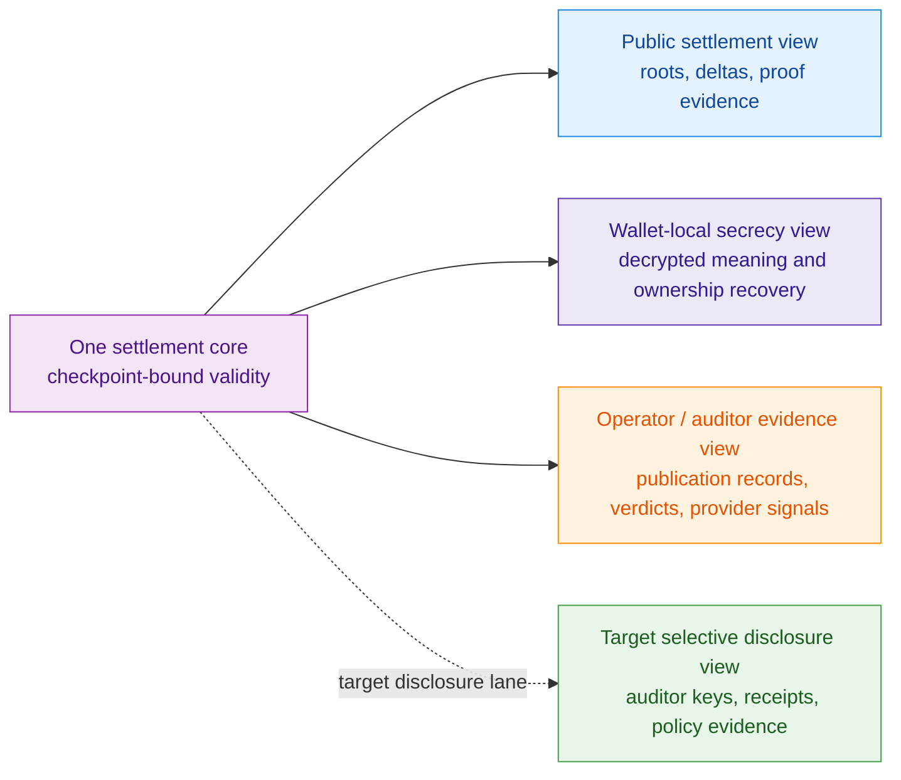

What is still missing is equally important. There is no broad live protocol mode in which an ordinary transfer can attach an auditor key, emit a standardized audit receipt, and automatically switch into a fully corporate-auditable ownership lineage without changing the surrounding product logic. Richer archive concepts around audit receipts, visibility modes, and corporate storage policies remain useful design direction, but they stay future-facing until they are backed by live transfer contracts rather than by planning or ideation material.

#### One Protocol, Different Visibility Policies

Z00Z's architectural value is that different visibility policies sit on top of one settlement core rather than fragment into unrelated privacy products. The same checkpoint-bound theorem can validate public settlement whether a transfer stayed on the privacy-maximal lane or whether a future workflow selectively revealed more facts to a designated counterparty, auditor, or compliance process. That is why the storage layer keeps audit wrappers and other derived metadata outside canonical committed artifact bytes: disclosure policy may widen who can inspect or attest to a transfer, but it does not redefine what makes the transfer valid.

That unification matters for both engineering and governance. It keeps replay rules, spend proofs, asset-leaf semantics, and checkpoint verification inside one protocol contract. It also prevents corporate mode from quietly becoming a second, more public ledger with different settlement rules. The live claim is therefore modest but important: **Z00Z already has one privacy-first settlement core**, and it already has several seams that future disclosure workflows can build on. What it does not yet have is a fully landed, generally available selective-disclosure runtime written as if it were today's default transfer mode.

## 7. Cross-Chain Lockers And External Assets

Z00Z's external-asset story has to be written with **more restraint than its internal settlement story**. The live protocol already knows how to name asset classes, derive deterministic asset-definition IDs, carry optional asset metadata, convert transaction wires into canonical leaves, and checkpoint replay-safe spent or created deltas. That is enough to support protocol-internal rights over many asset types. What it does not yet do is natively verify foreign-chain deposits, redemptions, or vault balances as part of the minimal settlement theorem.

The right way to describe cross-chain lockers is therefore as a bounded thesis layered on top of the current core. Z00Z can already express and transfer an internal right privately. A future locker ecosystem could bind that right to assets custodied elsewhere. But the external vault, bridge, or issuer contract remains a distinct service surface, not something the live protocol has already absorbed into consensus.

### 7.1 Locker Thesis

The locker thesis starts from a simple observation: **custody and ownership transfer do not have to happen in the same place**. Today the core asset model already separates immutable asset definition from individual spendable instances. Asset definitions carry class, symbol, serial count, nominal value, policy flags, issuer domain, versioning, and optional metadata, and their IDs are derived deterministically from those fields. That makes the protocol good at representing a stable internal right even before it says anything about where a referenced asset may be held outside the chain.

That distinction matters because public-address control is exactly where ordinary cross-chain custody leaks privacy. If an external asset must always be controlled by a visible L1 address, then every reassignment of the right becomes an externally visible event. The locker idea replaces that with a different split: public external custody may remain where it is, while the economically important ownership right is reassigned privately inside Z00Z and only later exercised against an external system when someone actually wants to move the foreign asset.

#### LockerID As Internal Ownership Right

In design materials, that internal right is described with the name `LockerID`: a stable handle whose current owner can change privately inside Z00Z while an external system associates balances or collateral with the same handle. That vocabulary is useful because it captures the intended separation between "who currently controls the claim" and "where the foreign asset is physically custodied."

The important present-tense boundary is that `LockerID` is *not yet* a broadly landed runtime type across the core crates. The repository does not expose a canonical locker object, locker registry, or locker-proof verifier in the same way that it already exposes asset definitions, asset wires, public spend verification, and checkpoint publication. The directional claim is therefore narrow: Z00Z already has the privacy-preserving ownership machinery that a locker model would need, but the locker primitive itself remains design-level vocabulary rather than a fully implemented consensus object.

#### Container Control As A Locker-Style Right

The same ownership split can be generalized beyond externally custodied assets. Some workflows depend on control over an external container rather than on direct redemption of an external coin or reserve. A sealed execution environment, a protected data room, a model session, a licensed document bundle, or another program-bound service surface may remain outside the core protocol while the economically relevant control right moves privately inside Z00Z.

This is the closest disciplined reading of container rights in the main protocol narrative. Z00Z does not need to become the place where the external container runs, stores its whole state, or guarantees its service honesty. It only needs to support a privately transferable right to unlock, present, consume, or redeem one bounded control surface under one explicit policy.

That keeps the locker thesis coherent. The current owner can change privately inside Z00Z, while the external system continues to own execution, availability, storage, and operator responsibility. In architectural terms, the locker idea therefore widens from "private ownership right over externally custodied value" to the broader pattern "private control right over an externally operated container-like surface." The settlement core stays the same even though the external subject is no longer only a vault balance.

#### External Vaults As Optional Service Surfaces

If a locker ecosystem is built, concrete `LockerVault` contracts, issuer adapters, or redemption gateways live as optional external service surfaces. A vault on Ethereum, another rollup, or some issuer-managed system may decide to bind balances to a locker handle, but that binding is not what the current settlement theorem proves. The rollup and wallet code verify internal spend structure, output roles, asset-leaf construction, and checkpoint consistency; they do not prove that a foreign chain really holds a matching deposit or that an off-chain issuer will honor redemption.

That separation keeps the protocol core honest. The protocol can remain responsible for private ownership transfer, replay boundaries, and verifiable publication, while each external asset ecosystem remains responsible for its own custody contract, operational security, and legal obligations.

### 7.2 Locker Lifecycle

At the conceptual level, the lifecycle is straightforward. First, some external system locks or escrows an asset and binds that position to a stable internal handle. Second, Z00Z treats control over that handle as the economically relevant right, so reassignment can happen privately through the same spend, output, and checkpoint machinery used for other internal asset transitions. Third, when someone wants to exit back into an external ecosystem, the current internal owner presents whatever chain-specific proof or authorization that external vault requires in order to redeem or move the foreign asset.

**Only the middle of that lifecycle is live today.** Z00Z already knows how to define assets, move rights through transaction packages, and checkpoint new spendable leaves while deleting consumed ones from canonical state. The external lock and redemption ends of the story remain future integration work. They are described here as a compatible ecosystem path, not as if the live system already shipped full cross-chain deposit and withdraw flows.

### 7.3 Trust And Bridge Assumptions

Bridge rhetoric is where privacy systems often become misleading. **A private internal ownership layer does not make external custody trust disappear.** It only moves the trust boundary into clearer focus. Any locker-based external asset inherits whatever assumptions attach to the vault, issuer, redemption contract, relayer set, or proof relay path that connects the foreign system back to Z00Z.

The locker boundary is easier to keep honest as a protocol-versus-ecosystem map:

| Surface | Inside Z00Z protocol today | Outside in external ecosystem | Main added trust assumption |
| --- | --- | --- | --- |
| Internal right representation | Typed asset definitions, package verification, and checkpointed private reassignment | None required for the internal right itself | Protocol integrity and replay safety |
| Private reassignment of control | Wallet packages, canonical leaf transitions, and checkpoint settlement | None required for the internal reassignment itself | Protocol-side correctness of the ownership path |
| External asset custody or reserves | Not part of the current settlement theorem | Vault, bridge, or issuer must actually hold and account for the referenced asset | Custodial honesty and operational security |
| Redemption or withdraw execution | Not part of the current settlement theorem | Relayer, vault, or issuer must honor the current internal owner | External liveness, dispute handling, and service correctness |
| Commercial or legal enforceability | Not encoded in consensus | Contracts, reserves, and jurisdiction-specific processes | Off-chain legal and business trust |

**Figure 7.1 - External asset trust boundary.** Z00Z can privately reassign an internal right, while custody, reserves, and redemption remain external-system promises until dedicated locker verification is implemented.

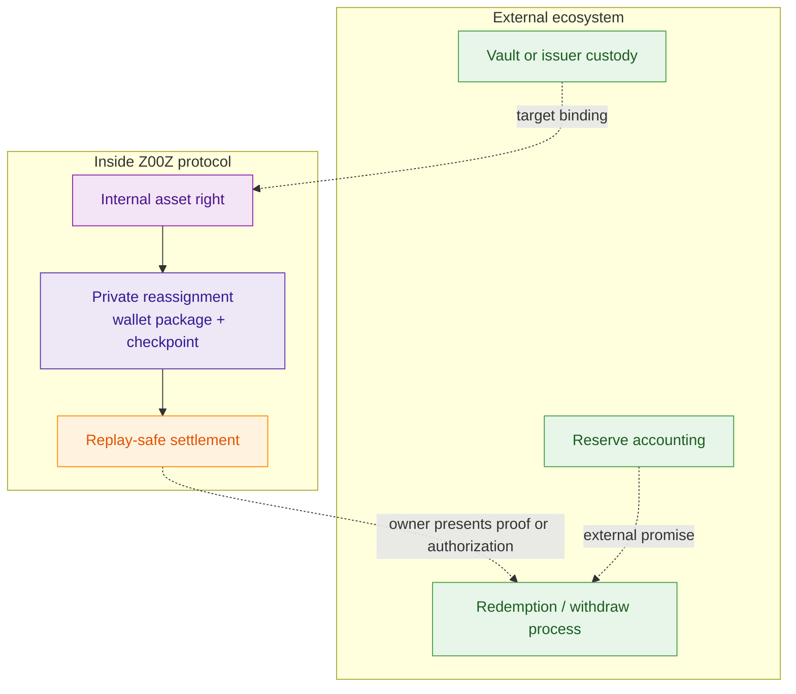

#### What Is Inside The Protocol

What is already inside the protocol is the internal control plane: deterministic asset definitions, typed asset classes, policy flags such as mintable or burnable, transaction-package public spend verification, canonical leaf construction, and checkpointed spent or created deltas. The rollup node's settlement theorem and the storage checkpoint path reason about those internal artifacts only. Even the simulator's stage-six `bridge` artifacts are internal publication handoff objects that connect fragment outputs to exec-input and storage-apply flow; they are not live foreign-chain bridge contracts.

That means Z00Z already has replay-safe internal ownership semantics and publication machinery that could anchor a locker ecosystem. It does **not claim that the current protocol already verifies external custody state**.

#### What Stays In External Ecosystems

What stays outside the minimal protocol core is everything that depends on a foreign execution environment actually honoring the locker handle: vault custody, bridge relayers, issuer attestations, proof adapters, deposit watchers, and chain-specific redemption contracts. Those systems may be built around Z00Z, and the protocol is deliberately shaped so they can reuse its private ownership and checkpoint semantics. But they remain ecosystem components with their own risks and governance.

That is the disciplined way to state the locker thesis today. Z00Z already has the internal machinery needed to treat ownership as a private, replay-safe right instead of a public address balance. A future locker ecosystem can use that machinery to control external assets. Until the repository lands canonical locker objects and foreign-custody verification, however, cross-chain lockers remain **a bounded architectural direction rather than a shipped base-layer feature**.

### 7.4 Stable Asset Families And Trust Tiers

The external-asset story becomes more useful when it is split into stable-value families rather than treated as one undifferentiated “bridge asset” category. The same private settlement rail can carry multiple forms of stable economic exposure without implying that they share the same custody, redemption, or policy assumptions.

| Stable asset family | Typical source of stability | What Z00Z can preserve | What Z00Z does not guarantee |
| --- | --- | --- | --- |
| Externally backed private right | Locked reserves or balances held in another system | Private internal ownership transfer and replay-safe settlement of the Z00Z-side right | Reserve integrity, redemption honesty, or external-custody liveness |
| Issuer-native private asset | A native asset issued directly inside Z00Z under issuer policy | Private transfer, checkpoint continuity, and asset-definition consistency for the issued unit | Supply discipline, redemption meaning, and issuer solvency or compliance behavior |
| Synthetic or internal accounting unit | A policy, collateral, or accounting regime above the protocol core | Private transfer and bounded internal settlement of the synthetic unit | Peg maintenance, collateral sufficiency, or market-support operations |

This trust-tier framing is useful because it keeps the guarantees proportional to the actual architecture. Z00Z can protect the private ownership path and settlement correctness of each family, but it does not erase the distinct external promises that make one stable-value family different from another. For partners and operators, that is a more realistic and more actionable way to read stable assets than a single generic interoperability claim.

## 8. Scalability And Publication Model

Z00Z's current scalability story is best understood as **a typed publication pipeline rather than as a single magic prover**. Wallet-side regular transfers and claim flows are already wrapped into explicit package envelopes with canonical digests, chain context, and lifecycle status. The runtime side then names the next stages just as explicitly: work items are admitted, ordered into batches, converted into publication requests, handed to a DA-facing publication surface, resolved back into checkpoint artifacts, and finally judged by validator verdicts and watcher evidence.

That structure matters because it keeps scaling claims grounded in real artifacts. The repository does not yet present one giant universal proof that closes every question at once. Instead it separates package validity, ordering, publication handoff, checkpoint replay, and final verdict production into boundaries that can be composed, audited, and upgraded independently. This is a deliberately modest claim, and it is the one the current code actually supports.

### 8.1 Batching And Publication Flow

The live flow begins with transaction packages, not with an abstract "rollup batch". A regular spend is carried as a `TxPackage`, and claim flows use a parallel `ClaimTxPackage`; both include package metadata, chain fields, canonical digests, and lifecycle status. The aggregator boundary then admits those envelopes as `WorkItem`s identified by intake IDs derived from package digests. From there, ordering is represented directly as an `OrderedBatch`, which groups the admitted items under a batch ID instead of pretending that ordering is an invisible side effect.

Publication is also modeled explicitly. A `PublicationRequest` packages the ordered work into a checkpoint draft, carries the relevant claim nullifiers, and includes an idempotency key for safe handoff. The DA-facing side returns a `PublishedBatch` that names the resulting checkpoint ID, publication input, provider, and blob reference. A `SoftConfirmation` can then tie an intake item to a batch and its checkpoint publication input before full downstream validation is treated as complete final settlement.

The node runtime and watcher surfaces reinforce that this is **a staged publication model rather than a black box**. Runtime status snapshots track the latest publication record, latest published batch, latest verdict, and related provider or observation signals. Watcher evidence export keeps publication records, published batches, soft confirmations, verdicts, and provider signals in one typed record. The present-tense description is therefore that Z00Z already has an end-to-end publication vocabulary and status surface, even though some boundaries are still intentionally thin and interface-oriented.

A compact artifact pipeline helps keep that staging readable:

| Stage | Canonical artifact | Produced by | Settlement status |
| --- | --- | --- | --- |
| Wallet assembly | `TxPackage` or `ClaimTxPackage` | Wallet-side package construction | Portable candidate only, not settled |
| Intake | `WorkItem` | Aggregator ingress | Admitted work, not yet ordered |
| Ordering | `OrderedBatch` | Aggregator ordering | Batch shape fixed, not yet published |
| Publication build | `PublicationRequest` | Aggregator recovery/build-publication path | Ready for DA handoff, not yet published |
| DA handoff | `PublishedBatch` and `PublicationRecord` | DA adapter plus runtime publication tracking | Posted or observed, not yet final settlement |
| Early acknowledgement | `SoftConfirmation` | Runtime publication path | Pre-checkpoint acknowledgement only |
| Resolution and verdict | `ResolvedBatch` and `Verdict` | DA resolve plus validator path | Public-artifact consistency judged |
| Observation | `EvidenceRecord` and watcher snapshots | Watcher path | Visibility and alerts only, not settlement authority |

**Figure 8.1 - Package-to-verdict publication sequence.** This sequence separates role topology from temporal order: a package is assembled first, published through DA later, and judged by validators only after resolution.

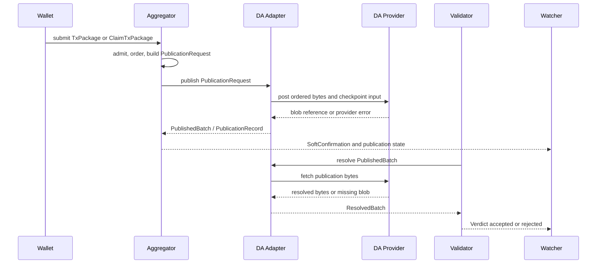

### 8.2 Performance Model

Z00Z's performance thesis is **architectural before it is numeric**. Efficiency is supposed to come from batching work into publication units, from publishing compact checkpoint artifacts instead of a giant public account table, and from verifying state transitions against typed replay artifacts rather than replaying a global balance history. That is the right code-backed story today.

The checkpoint path makes that visible. `CheckpointExecInput` carries only the ordered input references, ordered outputs, prior root, snapshot binding, and the upstream proof bytes needed for replay. `CheckpointDraft` and `CheckpointPubIn` reduce the public state transition to the previous root, new root, and typed spent or created deltas, with optional claim-root linkage when relevant. The rollup theorem then verifies that the transaction package, execution input, artifact, and link all agree on roots, inclusion, and output leaves. The system is therefore trying to scale by shrinking what public settlement must remember and verify, not by making every validator re-run an ever-growing public balance ledger.

#### Stateless Verification Instead Of Global Balance Replay

This is the deepest live scalability property in the repository. A transaction package carries its own ordered inputs and outputs. Checkpoint execution input carries the replay-ready references and output leaves. Checkpoint publication input exposes only the roots and deltas that matter for the state transition. The rollup verifier checks transaction-package integrity, public spend rules, execution-input linkage, and leaf equality against those typed artifacts. It does not require a public balance row for every wallet, and it does not model safety as one universal spent array that validators must grow forever.

That choice reduces both storage and verification surface. Consumed rights are removed from canonical state, newly created rights are introduced as typed created entries, and replay safety is enforced through checkpoint linkage and ordered references rather than through a naive global balance replay model. In other words, Z00Z is pursuing scalability by making the canonical public story smaller and more typed, while leaving richer wallet-side reconstruction to local software.

#### Proof Aggregation And Cost Surfaces

Proof cost, data-availability cost, and publication cadence are separate knobs in the present design. Checkpoint proofs already have typed proof-system markers and statement-bound attestation flow, while publication records carry DA provider and blob-reference fields. That means the architecture already treats "prove the transition," "post the publication payload," and "decide how often to publish" as **distinct cost surfaces**.

The repository is also honest that stronger aggregation remains future work. The recursive checkpoint-proof path is documented as roadmap-only rather than as live implementation. Z00Z is therefore structured to evolve toward heavier aggregation and richer proving backends, but the live repository does not yet ship a mature recursive batch prover or a fully optimized universal proving pipeline.

### 8.3 Throughput Claims And Evidence

Because the repository already exposes the shape of the publication pipeline but not a production benchmark suite for it, throughput claims remain qualitative today. The architectural claim is *not* "Z00Z does X TPS." It is that the system batches package-level work, binds publication to explicit checkpoint artifacts, exposes DA handoff fields, and keeps the verifier focused on typed roots and deltas rather than global balance replay. Those are architectural reasons to expect better scaling than a naive public-balance design, but they are not substitute evidence for measured throughput.

#### What Can Be Claimed Today

What can be claimed today is qualitative and structural. Z00Z already has typed transaction packages, typed ordered batches, typed publication requests, typed published-batch records, typed soft confirmations, and typed validator verdicts. It already separates wallet-side package construction from checkpoint publication and separates checkpoint publication from final validation. It already uses roots, execution-input artifacts, and spent or created deltas as first-class settlement objects. And it already keeps room for DA-provider and blob-reference attachment without collapsing that surface into the settlement theorem itself.

Those are meaningful scalability claims because they describe real interfaces and real artifact boundaries. They show that the protocol is being shaped for batching, publication, and replay-bounded settlement from the outset.

#### What Still Requires Benchmark Evidence

Everything numeric or operationally comparative still requires evidence: transactions per second under specific workloads, proof generation time, checkpoint publication latency, DA posting overhead, watcher lag, wallet memory growth under large histories, and the effect of publication cadence on end-to-end confirmation time. Recursive-proof performance, in particular, remains future-facing until the roadmap-only proving path becomes a live implementation with measurable artifacts.

The same applies to adversarial load behavior. Censorship pressure, retry behavior under DA-provider faults, recovery after handoff failures, and the publication costs of mixed regular-spend and claim traffic all need explicit measurement before they belong in the paper as factual performance claims.

#### Benchmark Evidence Policy

Benchmark evidence belongs here only with context attached: workload shape, hardware or environment class, feature flags, package mix, publication cadence, and whether the measurement covers only wallet-side assembly, only proof generation, or the full package-to-publication-to-verdict path. **Any unmeasured TPS, proof-time, memory, or settlement-latency statement remains a target metric or roadmap goal** rather than a present-tense fact.

That policy protects credibility. Z00Z already has enough live architecture to explain why it can scale. It does not need invented numbers to make that case.

## 9. Security Model

Z00Z's live security model is **layered rather than magical**. Wallet packages must satisfy a shipped regular-spend or claim contract. Storage must refuse replay through canonical snapshot, checkpoint, and claim-nullifier guards. Rollup settlement accepts only public artifacts and rejects mismatched package digests, proof payloads, links, replay inputs, roots, or inclusion. Runtime publication and watcher surfaces then add typed status, provider-signal, and evidence records around the publication path instead of pretending that liveness and censorship have already disappeared.

That layered description matters because the live system protects some things more strongly than others. Confidential state-transition checks are live. Replay protection is live. Checkpoint-centered public settlement is live. By contrast, privacy against network-level traffic analysis is not yet a shipped base-layer guarantee: OnionNet currently exists as a reserved boundary crate and wallet-side OnionNet switching still returns deterministic placeholder behavior. The claim here is therefore that Z00Z already enforces theorem-level validity and replay-bounded state transition, while anonymous ingress remains a future transport shell.

### 9.1 Adversary Model

The live architecture already distinguishes between at least **three materially different adversaries**: actors who try to manipulate publication, actors who try to replay or double-spend consumed rights, and actors who observe metadata rather than break cryptography. Treating those as one generic attacker would blur the actual trust boundaries in the system.

#### Malicious Aggregators

A malicious aggregator or publication operator can still censor, delay, reorder, or repeatedly retry work before publication. The current runtime types make those risks explicit instead of hiding them: batches move through `PublicationState`, publication results can stall in retry or failure states, and validator verdicts can end as incomplete or rejected. That is the right live story for liveness and censorship risk.

What such an actor cannot do is unilaterally turn invalid work into accepted settlement. The rollup theorem re-verifies the transaction-package digest and current public spend contract, checks that the checkpoint proof payload matches its statement, enforces execution-input and link IDs, rechecks the previous root, and confirms that the package is actually included in the checkpoint execution input. Validator verdict classes already name the expected failure modes: replay conflict, reconcile invalidity, state-root mismatch, missing artifacts, invalid proofs, and invalid provider outcomes. **Soft confirmations are therefore read as intermediate publication artifacts, not as final settlement.**

#### Metadata Adversaries

Metadata observers are different adversaries. They do not need to break commitments or signatures if they can correlate ingress timing, packet volume, provider choice, or wallet transport metadata. The repository already reserves a future place to fight that battle: OnionNet defines packet classes for data, cover, loop, and control traffic, plus session-window, edge, relay, and exit seams. But those surfaces are placeholder structs and traits today, not a fully landed privacy network.

Wallet integration confirms the same boundary. The current OnionNet configuration and switching flow returns deterministic placeholder values rather than activating a real transport overlay. Present-tense Z00Z security claims therefore distinguish **state confidentiality from transport anonymity**. Hidden values, local proofs, and checkpointed ownership are live; end-to-end metadata resistance against network observers is still roadmap work.

#### Replay And Double-Spend Attackers

Replay safety is one of the strongest live parts of the current system, but it is intentionally **split across several layers instead of one global nullifier story**. For regular spends, the wallet-side public spend contract deterministically derives each spend nullifier from `chain_id` and the input secret, rejects missing or mismatched nullifiers, rejects duplicate nullifiers inside one spend contract, and rechecks balance and range relations. The code is explicit, however, that this duplicate-nullifier guard does not replace checkpoint membership and leaf deletion as the authoritative consumed-state model.

That authoritative model lives in storage and settlement. Snapshot replay entries reject path or leaf mismatches when proof blobs are rebound to canonical items. Checkpoint execution input rejects replay mixing, and rollup settlement rejects checkpoint replay mismatch when the execution-input ID, link, and statement do not agree. Claims follow a parallel but separate anti-replay path: claim nullifiers are derived from `claim_id`, owner, and `chain_id`; claim verification rechecks that exact derivation; and storage keys replay by `ClaimNullifier`, rejecting both already-seen nullifiers and same-batch duplicates. Cross-network replay is also treated as a real risk: chain type and domain-separated hashing are used to keep devnet, testnet, and mainnet artifacts from collapsing into one namespace.

### 9.2 Security Assumptions

The live code also separates **cryptographic assumptions from operational ones**. The same verifier can fail closed on malformed artifacts while the system still depends on operators to publish, observe, retry, or preserve evidence correctly. Treating those as different assumption classes makes the whitepaper more accurate and more useful.

#### Cryptographic Assumptions

Current confidentiality and integrity claims rest on the concrete backend surfaces exposed through `z00z_crypto`: commitments, range-proof verification, Schnorr-style signatures, ECDH/KDF helpers, and stable domain-separated hash labels for assets, transactions, claims, network sessions, and consensus objects. The rollup node already imports and uses the live proof-verification surface, while wallet and core crates rely on deterministic derivation and stable domain labels for spend, asset, and state artifacts. This is a real cryptographic base, not a placeholder.

It is also a conventional elliptic-curve base, not a post-quantum one. The repository keeps backend abstraction and migration room, but it does not yet ship a post-quantum proving or signature path. The claim today is **cryptographic discipline and upgradeability**, not present-tense post-quantum security.

#### Operational Assumptions

Operational safety depends on more than theorem validity. Node runtime status already records whether aggregator, validator, and watcher services are attached, and it tracks the latest publication record, published batch, verdict, provider signal, and observation. Publication and watcher types also model provider outcomes such as pending, retry-pending, missing, and failed, and watcher evidence records can bundle publication records, soft confirmations, verdicts, and provider signals into one typed audit object.

Those are meaningful operational tools, but they are not the same thing as automatic recovery. Much of the current runtime surface is still boundary-oriented or placeholder-level: ordering and ingress helpers are thin, watcher submodules like censorship and publication watch are marker structs, and there is no fully landed slashing or fraud-proof execution engine that automatically punishes every bad publication path. So the protocol can already fail closed on invalid state transitions, but availability, escalation, and retry policy still depend on honest-enough operators and monitoring.

#### Cross-Chain Assumptions

Whenever Z00Z is used to represent control over assets held elsewhere, **the trust model expands beyond the base theorem**. The current settlement path verifies internal package structure, replay safety, leaf construction, checkpoint linkage, and public-artifact consistency. It does not prove that an external vault really holds reserves, that an issuer will honor redemption, or that a relayer has forwarded a foreign proof honestly.

That boundary is intentional. It keeps the core protocol responsible for private internal ownership transfer while leaving external custody, relaying, and legal enforcement to the ecosystem components that actually operate them. Cross-chain security claims are therefore always conditional on those outside systems, not folded into the core theorem as if they were already consensus-enforced.

### 9.3 Failure Handling

Current failure handling is **typed first and automated second**. The runtime already names publication states, provider outcomes, reject classes, verdict kinds, and watcher alert kinds, which means invalid or stalled behavior can be recorded without pretending it has already been economically punished. That is important because a privacy protocol must be explicit not only about what it accepts, but also about how it classifies failure.

The practical trust model is easiest to read as a compact failure matrix:

| Failure | Detection surface | Protocol response | Recovery and remaining gap |
| --- | --- | --- | --- |
| Aggregator censorship or withholding | Intake can stall before publication, watcher alert kinds already reserve `CensorshipSuspect`, and status/evidence surfaces can show missing progress | No invalid state transition is accepted merely because work was delayed | Recovery is still operational: retry, alternate routing, or future stronger ingress/watch logic |
| Invalid publication or malformed artifact | Validator reject classes include `ArtifactMissing`, `ProofInvalid`, `ReconcileInvalid`, `StateRootMismatch`, and `ProviderInvalid`; rollup settlement rejects digest, link, root, and replay mismatches | Batch remains unaccepted; final settlement does not close | Republish corrected artifacts; no fully landed automatic slashing path yet |
| DA unavailability or provider fault | Provider signals and publication states model pending, retry-pending, missing, and failed outcomes | Publication remains incomplete or failed rather than silently accepted | Retry and provider failover remain operator policy, not a finished autonomous recovery engine |
| Replay attempt or double spend | Spend nullifier checks, claim-nullifier store checks, snapshot replay guards, `ReplayMix`, `CheckpointReplay`, and validator `ReplayConflict` | Fail closed at wallet, storage, checkpoint, or validator boundary | Usually no special recovery beyond rebuilding a correct package |
| Wallet key loss | Wallet config already reserves encrypted backup and recovery settings, and wallet code ships BIP-39 seed-phrase handling | Consensus cannot recreate lost private control | Recovery is wallet-side and operational; without backup material the protocol cannot claw funds back |
| Malformed receiver input or recipient binding | Claim verification rejects invalid recipient cards, owner-attestation failures, owner-handle mismatches, and nullifier mismatches | Package is rejected before valid settlement | Sender or receiver must regenerate correct inputs; there is no protocol shortcut around malformed recipient data |
| Bridge, locker, or external issuer failure | External vault or relayer problems are not proven by the internal settlement theorem | Internal ownership transfer can remain valid while external redemption fails | Recovery depends on the external system's dispute, custody, or legal process |

**Figure 9.1 - Threats and fail-closed responses.** Runtime and settlement failures are classified before they become recovery work; invalid evidence does not cross the settlement boundary.

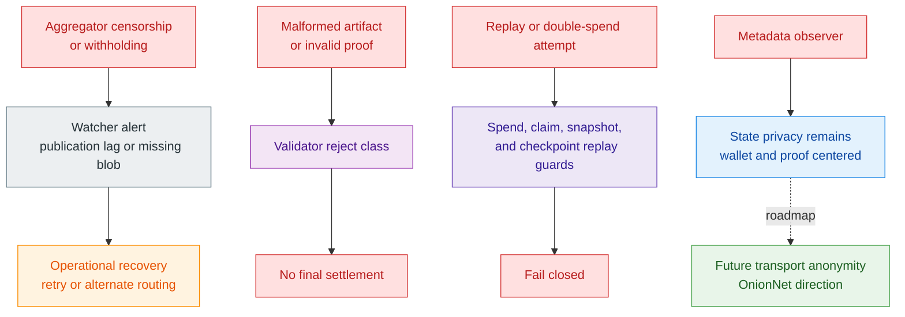

#### Fraud Proofs And Slashing Direction

Fraud-proof and slashing remain design direction rather than a fully landed live mechanism. The current system has places where those ideas can attach: invalid batches are classifiable, evidence can be exported, and some asset-state surfaces already reserve a slashed flag. But the repo does not yet expose a canonical slashing contract or an end-to-end fraud-proof pipeline that automatically closes the loop from evidence to punishment.

That does not make the direction unimportant. In this paper, fraud proofs and slashing appear as *future economic-enforcement layers* that can consume the typed evidence surfaces already present in the runtime, rather than as present-tense guarantees.

#### Recovery, Reorg, And Publication Ledger

The current code already treats recoverability as a ledgered concern, not as an afterthought. Publication records bind a batch ID to a checkpoint ID and a publication state. Published batches bind a DA provider and blob reference to a checkpoint publication input. Evidence records can retain the publication record, the published batch, the soft confirmation, the validator verdict, and the provider signal together, while runtime status keeps the latest operational snapshot visible at node scope.

That is a good foundation for robust recovery after retries, provider faults, or later reorg-like publication disputes. But it is still a foundation. The repo does not yet show a fully developed reorg policy, canonical replay of multi-provider publication history, or autonomous repair loop that resolves every stalled path by itself. Publication-ledger recovery therefore appears here as a live design surface with real typed artifacts, not as a completely finished operational control system.

### 9.4 Linked Liability For Offline And Agentic Execution

One of the hardest questions for delayed-connectivity settlement is not whether fraud can be made literally impossible, but whether fraud can be made attributable, punishable, and economically irrational. The live protocol does not yet claim that result. Its current answer is narrower: invalid work can be rejected at wallet, storage, checkpoint, or settlement boundaries once the relevant public artifacts arrive. A stronger future answer is linked liability.

In that direction, some spendable rights, offline budgets, or autonomous execution lanes could be issued under hidden liability domains rather than under a fully public identity graph. Conflicting execution, abusive reuse, or later-proven fraud could then produce domain-bound evidence that locks, slashes, quarantines, or otherwise penalizes the responsible lane without turning every participant into a permanently public reputation account. The goal is not to pretend that offline or agentic risk disappears. The goal is to make bounded-risk local execution survivable because misbehavior becomes attributable after the fact and therefore economically irrational to repeat.

The same family of ideas can support optional private reputation receipts, domain-scoped trust tiers, or threshold-proof attestations without collapsing into a public social-credit graph. Those mechanisms remain future enforcement and coordination layers rather than present-tense consensus truth, but they provide the most coherent long-run answer to the objection that asynchronous execution is useful only until the first serious fraud event.

## 10. Governance, Legal Boundary, And Protocol Scope

This is the point where technical architecture has to discipline legal storytelling. No codebase can decide by itself how every jurisdiction will classify a product or operator. It can, however, make some narratives more honest than others. The live Z00Z architecture strongly supports **a narrow protocol story**: canonical settlement rules live in core, storage, wallet-verification, and rollup surfaces, while wallet orchestration, RPC exposure, network switching, backups, and future bridge or ingress integrations are separated into service facades or optional ecosystem seams.

That distinction is not cosmetic. If protocol rules are blurred together with wallet operations, bridge custody, issuer behavior, or compliance workflows, the architecture is described inaccurately. The live claim is narrower and stronger: Z00Z is a privacy-first settlement protocol with optional service layers around it, not a monolithic operator stack that happens to use zero-knowledge tools.

### 10.1 Protocol Versus Service Separation

The code already exposes this separation directly. `NodeRuntime` is generic over aggregator, validator, watcher, and data-availability services rather than hard-coding one operator shape, and `NodeMode` makes those roles deployable separately. On the wallet side, `AppService` explicitly owns wallets and other cross-wallet concerns, while the wallet crate exposes stable service facades for backup, network, storage, key, and chain operations. That means the repo is already organized around **protocol contracts plus surrounding service layers**, not around one inseparable business appliance.

The responsibility boundary becomes clearer when expressed directly:

| Responsibility or question | Base protocol | Wallet or operator or service layer | Bridge, issuer, or external ecosystem layer |
| --- | --- | --- | --- |
| Key custody and backup | Verifies resulting public settlement evidence only | Owns seed handling, backup, recovery, and secret storage | Not a protocol function |
| Receiver discovery and payment UX | Provides signed receiver surfaces and validation rules | Owns routing UX, merchant flows, and local trust policy | Optional discovery or business directory services |
| Package validity and replay safety | Enforces canonical encodings, verification, checkpoint linkage, and replay-safe settlement | Can reject or delay locally under policy | Cannot override protocol validity |
| Compliance, allowlists, and onboarding | Does not perform KYC or discretionary onboarding | May add policy, monitoring, or regulated access rules | May add issuer- or bridge-specific compliance rules |
| External reserves or custody | Does not prove foreign reserves or vault balances | May surface external asset UX | Owns custody, reserve attestations, and reserve integrity |
| Redemption disputes and legal recourse | Does not adjudicate off-chain commercial obligations | May provide support or workflow tooling | Owns dispute process, legal enforcement, and commercial promises |

**Figure 10.1 - Protocol, service, and external responsibility stack.** The base protocol owns validity and replay safety; wallets, operators, bridges, issuers, and legal wrappers add policy and obligations around that core without redefining settlement truth.

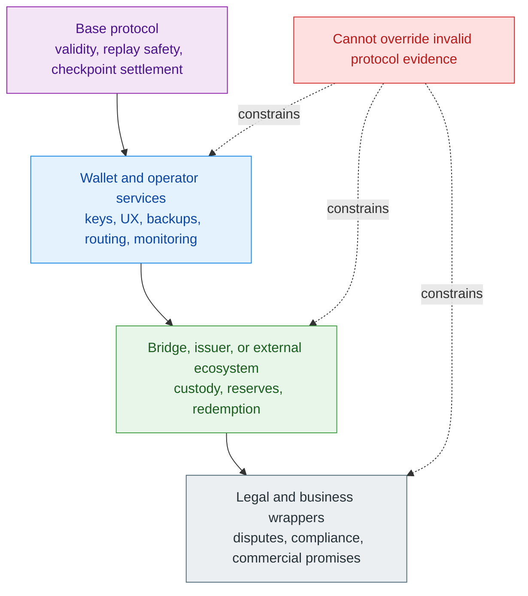

Core crates reinforce the same point. Genesis explicitly documents that treasury integration is outside its responsibility, and asset metadata is described as off-chain material stored in an indexer or treasury database while only the metadata hash is committed canonically. The protocol therefore commits to validity, replay safety, encoding, and settlement boundaries. It does not need to absorb every surrounding operational or commercial function into consensus.

#### What The Base Protocol Does Not Do

The base protocol does not become a custodian, issuer, KYC service, bridge operator, or money-service business merely because it defines private settlement rules. The live protocol crates expose package verification, replay guards, checkpoint publication artifacts, proof-system markers, fee outputs, and state-transition checks. **Those are settlement mechanics.** They are not reserve management, fiat redemption, customer onboarding, sanctions screening, or discretionary listing policy.

The higher-level architecture matches that code shape. Z00Z is described as a neutral protocol with services on top, while compliance-varying wallets, bridges, and wrapped or issued assets remain outside the protocol core. That framing is not legal magic. It is simply the organizational language most compatible with the current architecture.

#### Wallet, Bridge, And Issuer Responsibilities

Because the protocol core is narrow, responsibility for user-facing policy sits elsewhere. Wallet layers own seed handling, backup flows, network and chain switching, RPC exposure, discovery policy, and whatever compliance envelope a particular provider chooses to add. Bridges and issuers likewise own external custody, redemption promises, reserve attestations, relayer operations, and jurisdiction-specific obligations. Those are all real responsibilities, but **they are not the source of settlement truth in the current theorem path**.

That is why the same protocol can remain neutral while different service providers build very different products around it. One wallet may emphasize privacy-maximal self-custody, another may add enterprise controls or regulated onboarding, and a third party may build a bridge or issued asset wrapper. This paper describes those as optional service ecosystems layered around the protocol, not as if the base protocol itself had silently become each of those businesses.

### 10.2 Stewardship Without Operation

The repository does not and cannot encode a legal entity. So any discussion of stewardship is necessarily policy-level rather than consensus-level. Even so, the code and documentation point toward one especially coherent model: a steward wrapper can maintain IP, documentation, audits, grants, legal defense, reference code, and public coordination without becoming the operator of payments, custody, exchange, or bridge infrastructure.

That model fits the existing architecture better than an operator-heavy narrative. If the same entity that speaks for the protocol also becomes the only bridge, the reserve manager, the issuer approver, or the default custodial wallet, then the legal story stops matching the technical split that the repository has worked to preserve. **A steward model keeps the protocol story narrow** and lets regulated or opinionated service layers remain visibly separate.

#### Foundation As Steward, Not Operator

The most compatible institutional framing is therefore a foundation or similar wrapper that holds IP, publishes documentation, coordinates audits, funds research, and supports ecosystem standards while explicitly not becoming the wallet operator, bridge custodian, exchange, redeemer, or money-service provider. Secondary legal-wrapper notes in the repository make the same point in direct terms: a steward entity can be useful precisely because it does not custody, exchange, transfer, or operate Z00Z itself.

This boundary is stated sharply. If a foundation starts approving assets, holding redeemable reserves, operating the only official bridge, or running the default regulated wallet, **it has crossed from stewardship into operation**. Foundation-style stewardship appears here as a compatible governance wrapper around the protocol, not as a justification for building a founder-controlled operator shell under protocol branding.

### 10.3 Governance Scope

Current code does not yet ship a generic governance engine or treasury-execution module across the main protocol crates. What it does ship are many hard protocol contracts: domain labels that are intended to remain stable once deployed, version-gated checkpoint and serialization formats, proof-system markers, canonical digest rules, and verification constants such as proof-width or output-limit parameters. At the same time, the repo also contains ordinary configuration surfaces such as DA-provider selection, RPC enablement, wallet fee defaults, backup settings, and batching thresholds.

That difference gives the whitepaper **its governance boundary**. Some things can plausibly become policy questions. Other things are much closer to protocol invariants and are not narrated here as everyday governance levers. Keeping that line sharp is important both for security and for institutional credibility.

#### Parameter Governance

If governance enters the main narrative, it remains limited to bounded parameters: publication cadence, fee-policy defaults, operator thresholds, service-level policy selection, or other knobs that already look like configuration or local operational policy. Those are the sorts of surfaces that can be governed without pretending the protocol is infinitely malleable.

What is not framed here as casual policy is **the cryptographic and serialization contract itself**. Domain labels, canonical encodings, replay semantics, checkpoint-version rules, and proof-system assumptions are much closer to upgrade boundaries than to normal governance tuning. Governance may eventually steer bounded protocol policy, but it does not turn the settlement contract into an arbitrary parameter market.

#### Research Features Versus Consensus Features

This same discipline protects the paper from governance creep through speculation. OnionNet privacy ingress, full bridge ecosystems, richer institutional wrappers, fraud-proof economics, and more elaborate governance workflows may all matter. But until they are expressed as canonical crates, explicit versioned artifacts, and live verifier paths, they appear here as research directions or optional ecosystem features rather than as already authoritative consensus modules.

That rule is healthy for both engineering and public communication. Z00Z becomes easier to trust when the paper says plainly **which parts are fixed protocol truth, which parts are configurable deployment policy, and which parts are still future work**.

## 11. Native Asset And Ecosystem Boundaries

The live system supports **a narrower and more credible economic story** than a generic one-token-for-everything narrative. Z00Z already has a canonical native coin, and that coin already matters for fee payment, gas accounting, and protocol identity. But the same architecture also ships a multi-asset state model, asset-definition registry, and transaction surfaces that can carry coins, tokens, NFTs, and burn-sink objects. The present-tense claim is therefore two-sided: Z00Z is the native fee and coordination asset, yet the settlement layer is not designed as a single-asset monopoly economy.

That distinction keeps the narrative anchored to live code. Core crates already enforce the canonical native fee asset, while wallet crates enforce dedicated fee-output semantics in a coin-class lane, and genesis and asset-definition surfaces already admit multiple asset classes and third-party definitions. By contrast, the live implementation does not yet encode a finished fee-market constitution, token-distribution schedule, staking-reward engine, or canonical operator-revenue split. Deeper tokenomics therefore remain bounded future policy rather than settled protocol fact.

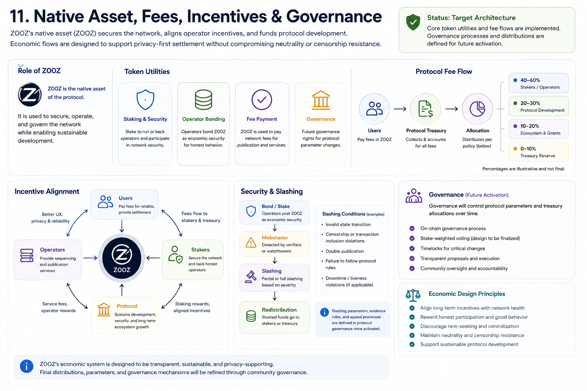

*Infographic 11.A - Target economic architecture around the native fee asset. The fee-split percentages and staking, slashing, treasury, and governance boxes are illustrative target-policy placeholders: the live implementation supports the native fee asset and dedicated fee-output lane, but it does not yet finalize reward distribution, treasury execution, slashing, or governance mechanics.*

### 11.1 Native Asset Role

Z00Z's native asset already has **a concrete protocol role**. The canonical genesis configurations define `Z00Z Native Coin` as a `Coin` with `is_gas: true`, core reconstructs that same native fee definition through one shared helper, and gas validation in `z00z_core` rejects non-native fee assets for the v1 fee path. On the wallet side, transaction wires give fee outputs their own semantic role, and both assembly and verification require declared fees to match dedicated fee outputs while constraining those outputs to the coin class. Z00Z is therefore not merely branded as a native currency in documentation; the core protocol recognizes it as the canonical fee asset, and wallet transaction construction already orients around a dedicated fee-output lane compatible with that model.

That does not mean the native coin is the only economically meaningful asset on the network. Its live role is narrower and more defensible: it anchors transaction-fee payment, gives wallets a default display currency and fee-policy lane, and provides a stable economic identity across devnet, testnet, and mainnet definitions. The current code supports that much directly. It does not yet support stronger claims about final issuance politics, treasury rights, validator yield curves, or a fully specified macroeconomic regime. The genesis configs do carry serial and nominal supply parameters, but the repository does not yet justify elevating those deployment values into the whitepaper's final public token-distribution story.

#### Asset-Neutral Settlement Economy

The same repository that defines the native fee asset also defines a genuinely multi-asset state model. `AssetClass` already distinguishes `Coin`, `Token`, `Nft`, and `Void`; `AssetDefinition` carries independent policy flags such as gas, fungibility, mintability, and burnability; and the canonical genesis configurations already include a native coin, a token-like zUSD example, an NFT example, and a burn sink. Wallet-side audit helpers also reason about selected asset classes explicitly rather than flattening every object into one fungible pool. The settlement layer is therefore already architected to carry multiple asset surfaces, not just one gas denomination with decorative wrappers.

The correct economic reading is that **Z00Z sits at the center of coordination and fee payment while still allowing other asset economies to exist around it**. The native coin pays for transaction admission in the current fee lane, but the state model can still host issuer-defined fungible assets, NFTs, and other class-scoped objects. For that reason, the paper avoids a monopoly-gas narrative. Z00Z is the current base fee asset; it is not evidence that every business model, unit of account, or service economy on top of the protocol must collapse into the same token logic.

#### Fees, Incentives, And Optional Asset Economies

Current fee handling is already concrete enough to describe in protocol terms. Wallet fee estimation uses deterministic counters such as inputs, outputs, range-proof size, and transaction weight; wallets also carry local `default_fee` settings; and fee outputs are explicitly marked as protocol or sequencer fee outputs. That is sufficient to say that Z00Z already has a canonical native-fee path for transaction construction and that fee policy can be surfaced at the wallet and operator level.

What is not yet concrete is the full incentive constitution around that path. The runtime publication types track batches, checkpoints, DA providers, blob references, and retry states, while adjacent validator and node-status surfaces carry verdicts and related observations. Together, those surfaces still do not encode a canonical revenue split between sequencers, validators, watchers, treasury actors, liquidity providers, or future slashing pools. Fees compensate ordered publication and verification work, while **the exact market structure around operator rewards, fee redistribution, subsidies, or staking-style economics remains an open policy and implementation question**.

### 11.2 Third-Party Assets And Local Economies

Z00Z's multi-asset design matters because it defines how far the protocol can go without pretending every asset has the same trust story. The core asset model already allows different definitions to carry different flags, denominations, and issuer-linked domain names. In practice, that means the protocol can settle native assets, issuer-defined fungible tokens, NFTs, and other bounded asset classes inside one confidential state framework while keeping replay and checkpoint rules coherent.

The same contracts also make policy-shaped asset families a credible protocol direction. `AssetDefinition` separates immutable class, `crypto_version`, `policy_flags`, issuer domain, and bounded metadata from any one spendable instance, while wallet policy rules already enforce allowed asset sets, recipient allowlists, and time restrictions, and expose a confirmation flag for wallet UX or service-layer enforcement. That combination is enough to support whitepaper language about local-economy, voucher-like, or aid-style instruments as compatible design space, even though richer programmable-money behaviors remain future work rather than landed protocol theorems.

The resulting asset picture is easier to read as a trust-tier map:

| Asset family | What Z00Z can guarantee | What still depends on external promise | Typical risk tier |
| --- | --- | --- | --- |
| Native coin | Private transfer, replay-safe settlement, and checkpointed state continuity for the internal right | No additional issuer promise is required beyond protocol operation | Protocol-dominant |
| Issuer-defined fungible token | Private transfer and replay-safe settlement of the internal token right | Issuer policy, supply control, redemption meaning, and metadata credibility | Issuer-dominant |
| Policy-shaped local instrument such as voucher or aid-style asset | Private transfer plus compatibility with wallet or service-layer policy controls around the internal right | Issuer validity, business rules, and off-chain acceptance or redemption terms | Issuer plus service-dominant |
| NFT or bounded non-fungible right | Private ownership transfer and replay-safe movement of the internal non-fungible right | Economic value, authenticity story, and any attached real-world claim | Context-dominant |
| Future externally backed wrapper or locker asset | Internal privacy and replay-safe transfer of the Z00Z-side ownership right | Foreign custody, reserve integrity, relayers, and redemption path | External-system dominant |

This is **a stronger and more useful boundary than a generic "supports everything" claim**. The settlement layer can preserve ownership transfer, commitment integrity, and replay safety for many asset types because those properties depend on canonical state objects and verifier rules. It does not follow that the protocol automatically equalizes the economic meaning of those assets. A native coin, an issuer token, an NFT, and a future externally backed wrapper may all move through the same private settlement rails while still depending on different off-chain promises, liquidity conditions, or operator quality.

#### Asset-Scoped Security And Service Tiers

That difference is where ecosystem risk tiers appear. A purely native asset depends mostly on the protocol's own cryptographic, replay, and publication boundaries. An issuer-defined token adds issuer policy, supply control, metadata integrity, and redemption credibility. A future bridged or locker-backed asset would add still more assumptions about outside custody, relaying, legal enforcement, or reserve attestations. The current code already supports the first part of this distinction through asset-class separation, policy flags, and issuer-linked domains; it does not yet ship a complete production bridge or locker ecosystem that would let the paper describe those higher tiers as fully landed.

Local economies therefore remain optional and asset-scoped. Different wallets, issuers, or service operators may build different liquidity zones, disclosure policies, or compliance envelopes on top of the same settlement core. That is compatible with the repository. What would not be compatible is claiming that **every third-party asset inherits the same trust model as native Z00Z** or that full bridge interoperability is already a mandatory base-layer capability.

### 11.3 Fee And Incentive Boundaries

The cleanest economic boundary in the current repo is that **fees are real, but fee constitution is still partial**. Transactions can carry dedicated fee outputs, the core fee asset is constrained to the native coin lane, wallet transaction assembly constrains fee outputs to the coin-class lane, and wallet tooling can estimate or default those fees. Node configuration and DA selection also make it clear that publication costs and operational policy exist at deployment level rather than only inside a single global constant. Those are real economic surfaces.

What the repository does not yet finalize is who must receive every fee and by what permanent rule. `Fee` outputs are labeled as protocol or sequencer fees, which is enough to justify compensating transaction handling and publication work. But there is no canonical fee pool, no universal staking reward engine, no finished treasury allocator, and no stable proof in code that every DA or operator cost is already fed into one closed economic circuit. That gap is not a weakness when stated plainly; it becomes a problem only if the system is described as though it already has a finished operator-yield machine.

Z00Z already has a canonical core fee asset and enough local policy surfaces to support practical deployments. Publication cadence, DA-provider choice, wallet fee defaults, and service-level operating policy can evolve without rewriting the settlement theorem. But final operator reward distribution, treasury policy, subsidy design, and broader tokenomic governance appear here as future economic policy layers, not as settled consensus facts.

### 11.4 Fee Envelopes For Rights And Autonomous Execution

If Z00Z expands from private coin transfer toward a broader rights layer, it also needs a clean separation between what a right authorizes and how the network gets paid to process it. A claim, voucher, access credit, machine budget, or other bounded right does not need to be denominated as the native fee asset in order to be meaningful to a user or local runtime. Even so, any transition that reaches publication and settlement still consumes verification, publication, and recovery resources.

The live core already implements the simplest fee path: dedicated native fee outputs in the Z00Z coin lane. A future fee-envelope model can widen the economic interface without weakening that rule. Depending on the workflow, the fee path may come from direct native fee outputs, prepaid credits, sponsor-paid execution, or bounded autonomous budgets that reserve settlement costs separately from the transferred right itself. The architectural point is not that every such path is already shipped today. It is that private rights settlement and fee payment should remain separable so the protocol can support claims, agents, machines, and local economies without hiding who pays for computation, publication, and settlement.

## 12. Implementation Status And Roadmap

The project has already moved beyond pure architecture notes. There is a live theorem path that starts with wallet-side package formats and public-spend verification, passes through storage-owned checkpoint and serialization artifacts, and ends in rollup-side settlement re-verification. But the same codebase also contains explicit stubs, deferred seams, and future provider interfaces. The maturity profile is therefore mixed: **Z00Z already has hard protocol contracts, while the full publication, operator, and ecosystem picture is still being assembled.**

That distinction remains essential in this section. Some crates already carry canonical versions, fail-closed verifiers, replay boundaries, and typed public artifacts. Other surfaces exist mainly to reserve an interface, document an intended seam, or support simulation and operator tooling. Treating both groups as equally landed would misstate the current maturity picture.

### 12.1 What Is Already Live

This slice carries the strongest present-tense claims in the paper. Z00Z already exposes enough canonical types, version gates, and verifier logic to describe **a real settlement core rather than a speculative outline**.

#### Current Protocol Contracts

Current protocol contracts are already visible as versioned, typed objects rather than loose conventions. `TxPackage` and `ClaimTxPackage` give the wallet layer canonical envelopes for regular and claim-domain settlement. `TxVerifierImpl` and the claim verifier family enforce structured package rules, digest checks, range-proof and signature checks, fee invariants, and claim-specific binding rules before anything is narrated as admissible work. In storage and checkpointing, `CheckpointVersion::CURRENT`, `CheckpointPubIn`, `SpentEnt`, `CreatedEnt`, `CheckpointProofSystem`, and `JmtSerVersion::CURRENT` define a concrete artifact vocabulary rather than a notional one.

The rollup side is equally real. `SettlementTheorem` and `verify_settlement_theorem(...)` bind a decoded transaction package to a checkpoint artifact, execution input, and checkpoint link, and they reject digest mismatches, proof mismatches, replay mismatches, root mismatches, and missing inclusion. `z00z_crypto` already contributes a stable domain-separation registry that explicitly marks deployed labels as objects that must remain stable once shipped. The simulator also shows that these contracts are executable, not just declarative: `scenario_1` already exposes a staged runner from claim genesis through bundle build and publish, which is not itself consensus truth but does demonstrate that the current contracts can be exercised inside a coherent system harness.

#### Current Verification And Storage Boundaries

The live architecture also makes an important distinction between **local checks and canonical admission**. Wallet-side `TxVerifierImpl` is explicit that it performs pre-broadcast checks only; the stronger settlement boundary lives in the rollup theorem and the storage-owned replay path. That is a healthy architecture signal. The live rollup verifier accepts only public artifacts, does not rebuild private witnesses, and replays checkpoint linkage, execution-input IDs, previous-root consistency, and transaction inclusion against the canonical public bundle.

Storage boundaries are similarly concrete. Claim replay is keyed by `ClaimNullifier` in the asset store, checkpoint and JMT serialization artifacts are version-gated, and storage-owned audit data is intentionally kept outside canonical checkpoint bytes through the narrower `CheckpointAudit` wrapper. Wallet-side asset-class audit reports and checkpoint-side audit records already show that the codebase distinguishes consensus-critical objects from wrapper-local audit metadata. That is enough to say Z00Z already has meaningful hard boundaries around replay, encoding, settlement, and audit scope even though the surrounding operator ecosystem is still incomplete.

### 12.2 What Is Still Target Architecture

Some repository surfaces remain architecture-level targets rather than live implementation. These surfaces **stay future-tense until they are backed by live provider logic, canonical verifiers, and non-stub operational paths**.

A compact maturity map keeps present-tense and future-tense surfaces separated:

| Surface | Visible in repo today | Still missing for full production maturity | Current maturity label |
| --- | --- | --- | --- |
| Core settlement theorem | Canonical packages, checkpoint artifacts, public verifier path, and replay-coupled storage rules | Broader publish-proof closure and fuller surrounding ecosystem maturity | Live core contract |
| Dedicated DA publication | `DaAdapter` seam, `da_provider` selector, and named Celestia direction | Concrete provider implementation and full production publication topology | In-progress subsystem |
| Full locker ecosystem | Internal settlement core and asset machinery that could host private rights over outside assets | Canonical locker objects, foreign-custody verifiers, reserve attestations, and bridge-specific settlement modules | Future extension |
| Auditable or corporate workflows | Audit wrappers, reveal-state DTOs, and wallet-side audit hints | Disclosure-proof format, auditor-key workflow, and end-to-end policy engine | Future workflow with live primitives |
| Operator-grade publication and recovery tooling | Status surfaces, publication vocabulary, and simulator-backed staged flow | Non-stub chain client, richer automation, and full operator-grade topology | Operational backlog over live core |

**Figure 12.1 - Landed core versus target architecture.** The roadmap is a maturity map, not a dated timeline: live settlement contracts come first, targets and backlog wrap them, and optional ecosystems grow only around the hardened core.

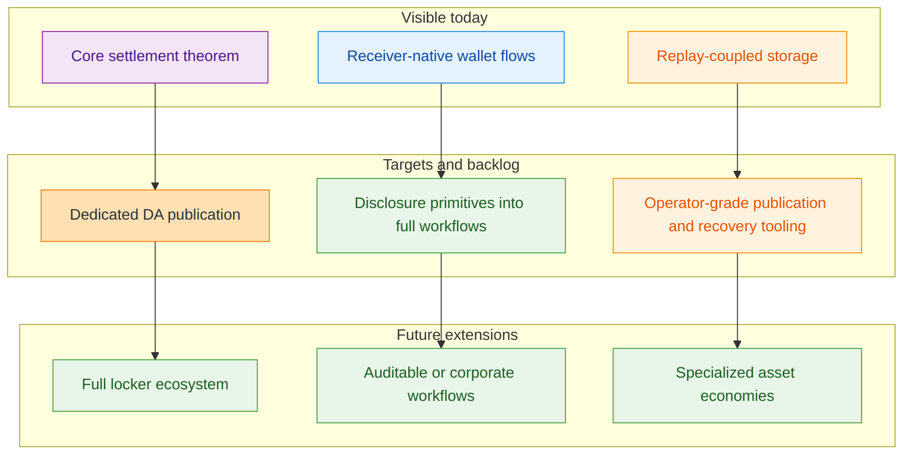

#### Dedicated DA And Full Publishing Topology

The current rollup node clearly anticipates an external DA layer, but it does not yet ship the full provider implementation. `NodeConfig` already carries a `da_provider` selector, `DaAdapter` exposes the narrow `publish` and `resolve` operations, the rollup crate ships `CelestiaLocalAdapter`, and publication records already include `CheckpointDaReferenceV1`, `CheckpointPublicationEvidenceV1`, and `CheckpointLifecycleV1`. Together with the broader architecture materials, that is enough to describe Celestia as the primary currently implemented DA direction.

The current code ships **the seam and the provider direction more clearly than the provider implementation itself**. Dedicated DA publication remains an active implementation target built around a real interface boundary, not a completed operational subsystem.

The clearest present-tense sovereignty claim is therefore narrower: Z00Z can externalize publication and data availability without externalizing the meaning of a valid state transition. The provider seam may diversify over time, but the settlement theorem, checkpoint linkage, and replay rules remain local protocol contracts rather than provider-owned semantics.

#### Full Locker Ecosystem

The live theorem path still runs through wallet packages, storage artifacts, and rollup settlement verification rather than through a fully shipped locker stack. That matters. Design materials and earlier sections make lockers an important part of the intended ecosystem story, but the current execution crates do not expose a production-ready family of external vault verifiers, reserve attestations, relayer proofs, or bridge-specific settlement modules inside the canonical path.

The maturity claim here is therefore narrow. Z00Z already has an internal settlement core that could host future locker-backed assets or bridge-facing ownership rights, but the full locker ecosystem remains target architecture. It remains **a serious extension direction rather than a finished part of the present repository**.

#### Future Auditable-Corporate Workflows

The codebase already contains some audit-oriented building blocks. Storage has a dedicated checkpoint-audit wrapper, wallet storage tracks `receiver_mode`, `stealth_activated_at`, and `mode_audit`, and wallet transaction tooling already exposes typed asset-class audit outcomes. Those are meaningful signs that the repository is not blind to enterprise or auditability concerns.

But those building blocks are not yet a complete selective-disclosure or corporate reporting system. The live repository does not yet show a finished disclosure-proof format, auditor-key workflow, regulator-facing evidence package, or end-to-end corporate policy engine comparable in maturity to the stealth-centric ownership path. Auditable-corporate mode remains **a serious target that already has some schema and audit primitives behind it**, while fuller disclosure workflows still require additional protocol and product work.

### 12.3 Proposed Expansion Path

Because the maturity profile is mixed, the expansion path is **sequential rather than ornamental**. The repo already tells us what is strong enough to harden first, what seams are ready to be implemented next, and which optional ecosystems should remain downstream of the core.

#### Harden The Core Verification Path

The roadmap begins by reducing ambiguity in the theorem path that is already live. That means continuing to harden wallet package verification, claim-domain verification, checkpoint linkage, serialization-version gates, replay semantics, and storage-owned audit separation. The repository already has the right fail-closed skeleton; those boundaries must become boring, stable, and easy to audit under change.

This ordering is important because **every future chapter depends on it**. DA publication, lockers, enterprise overlays, and richer operator economics all become more trustworthy when the underlying settlement contracts and replay boundaries are already narrow, versioned, and well tested.

#### Expand DA, Wallet, And Operator Tooling

Once the current theorem path is harder, the next layer is operational tooling. The repository already exposes where this work belongs: concrete DA adapters behind the existing provider seam, node-facing publication and resolution flows, a real chain client instead of the current Phase 1 stub, a real remote scan worker instead of the deferred scan seam, and less placeholder-heavy app-kernel transport and scan control. This remaining work sits on **already identified seams**.

The simulator can remain useful here as an executable regression harness while these operator surfaces mature. That is the right role for it: not to redefine consensus, but to keep wallet, publication, and recovery flows testable as the operational stack becomes more real.

#### Extend From Cash To Rights Carefully

As the core hardens, the next conceptual expansion should not stop at private payments. The most coherent direction is to interpret the same settlement nucleus as a broader rights layer: claim-bearing assets, bounded vouchers, external ownership rights, agent budgets, machine permissions, and useful-work reward objects that remain wallet-local before public settlement. Linked liability, domain-scoped trust tiers, stable-asset families, optional private reputation receipts, and fee-envelope paths all fit naturally around that direction.

The sequencing still matters. These additions should grow as overlays around the hardened settlement theorem rather than as shortcuts around it. Z00Z can widen from a privacy-first cash protocol into an asynchronous rights settlement layer without pretending that every rights form, every liability regime, or every autonomous-economy workflow is already live in the current repository.

#### Grow Optional Ecosystems Carefully

Only after the core and operator lanes are stronger does the wider ecosystem expand aggressively. Lockers, bridge families, enterprise disclosure tooling, specialized economic zones, and other optional integrations grow as bounded systems around the core rather than forcing the core theorem to absorb every business or jurisdictional concern. That preserves the narrow protocol story the live core already supports.

This is also the cleanest way to handle research-heavy features. Optional disclosure packages, corporate policy overlays, richer bridge ecosystems, and other advanced surfaces can become separate modules or separate papers without diluting the present protocol truth. The strategic principle remains **modular expansion around a hardened settlement nucleus**, not growth through premature consensus sprawl.

### 12.4 Optional Expansion Vectors

Beyond the hardened settlement core, Z00Z also exposes several credible expansion vectors that extend the system without redefining its present protocol truth. These vectors are not described here as committed base-layer deliverables. They are presented as ecosystem and architecture opportunities that can grow around the existing privacy-preserving settlement nucleus.

#### Private Control Of External Assets

One expansion path is the private control of externally custodied assets. In that model, Z00Z does not need to absorb foreign custody into its own theorem. Instead, it can host a private ownership layer over externally locked balances, wrapped claims, or issuer-backed rights while leaving custody verification, reserve integrity, and redemption enforcement to dedicated ecosystem components.

#### Publication Resilience And Multi-DA Topologies

Another expansion vector is publication resilience across multiple data-availability topologies. The current architecture already separates settlement validity from DA-provider semantics. That separation creates room for future multi-provider publication, private DA deployments, failover configurations, and archival redundancy without moving settlement meaning into any one external publication layer.

#### Attested Coordination And Useful-Work Economies

Z00Z could also support attested coordination layers in which rewards are tied to measurable contribution rather than unconditional emission. Campaign grants, useful-work incentives, reputation-gated participation, and attestation-backed payout flows can be built as optional economic overlays around the protocol while the core settlement path remains asset-neutral and privacy-preserving.

#### Agent-Mediated Scoring And Execution Layers

A further opportunity is agent-mediated orchestration. Ranking systems, scoring markets, attestation agents, campaign optimizers, and privacy-aware coordination oracles could operate above the settlement layer to route capital, evaluate contribution, or manage specialized economic programs. These systems belong to the application and ecosystem layer rather than to the present base theorem.

#### Privacy Metrics, Wallet Guidance, And Anti-Pattern Detection

The architecture also leaves room for a more explicit privacy-metrics layer. Wallets, telemetry, and operator tooling can evolve toward user-visible privacy guidance, anti-pattern detection, and path-quality estimation so that privacy is not treated only as a cryptographic property, but also as an operational discipline shaped by actual usage patterns.

#### Specialized Private Economic Zones

Over time, these expansion paths could support specialized private economic zones rather than one monolithic public market. Different asset classes, disclosure policies, operator sets, and coordination models could coexist around the same settlement nucleus without requiring the base protocol to become a universal execution environment.

The important ordering principle is that these vectors grow outward from the hardened core rather than competing with it for immediate implementation priority. They describe where the architecture can expand once settlement verification, publication tooling, and operator-grade recovery are stronger, not what the current repository already ships as fully landed production scope.

## Appendix A. Glossary

The glossary collects reference material that supports the main narrative without breaking its flow. It comes first because this paper uses protocol-specific terms that are easy to misread if they are imported from account-chain or privacy-coin intuition.

| Term | Meaning In This Paper |
| --- | --- |
| `AssetLeaf` | A public, checkpointed settlement object that represents a confidential asset right under the canonical asset-tree state model. |
| `RightLeaf` | The live HJMT settlement object for a confidential non-coin right under the current generalized settlement contract; broader rights-layer widening must be stated explicitly. |
| Asynchronous rights settlement | The pattern in which wallet-local possession and local acceptance may precede publication, while authoritative settlement remains checkpoint-bound. |
| Canonical asset path | The deterministic storage location used to prove that an `AssetLeaf` is present under the currently accepted state root. |
| Checkpoint | A validation boundary that commits ordered publication into a replay-safe state transition. |
| Settlement evidence | The public commitments, deltas, proofs, roots, and publication artifacts needed to verify a transition. |
| Wallet-local possession | Ownership material and transfer preparation that remain in the wallet until publication turns them into settlement evidence. |
| `TxPackage` | The wallet-side canonical envelope for ordinary transfer preparation. |
| `ClaimTxPackage` | The wallet-side canonical envelope for claim-domain settlement flows. |
| Nullifier | A domain-separated anti-replay artifact used by current protocol surfaces; not a universal substitute for asset presence or absence in storage. |
| Claim replay record | The replay-protection artifact used for claim-domain settlement paths. |
| `ReceiverCard` | A receiver-facing input package used by the live request-bound receive flow. |
| `PaymentRequest` | A wallet-side receive-intent object that carries receiver parameters and handoff context. |
| `EncPack` | The encrypted payload surface attached to confidential ownership or receiver metadata. |
| `Tag16` | A short scan or routing tag used with owner metadata and encrypted payload lookup. |
| `LockerID` | An internal ownership right tied to a cross-chain or externally custodied asset surface. |
| Soft confirmation | A pre-checkpoint acknowledgement that a package or batch has entered the publication path but is not yet final settlement. |
| Privacy threat model | The visibility boundary that distinguishes hidden wallet-local ownership meaning from public settlement evidence, operational metadata, service disclosures, and fraud-triggered reveal. |

## Appendix B. Cryptography Detail Boundary

This appendix records **the shipped cryptographic boundary** that is already visible in the repository. It is not a substitute for a full proving-system specification, but it is also not mere aspiration. The live code already exposes a concrete backend facade, a stable domain-separation registry, production claim objects, commitment and range-proof verification paths, stealth-oriented KDF layers, and explicit replay-boundary derivations for regular spends and claims.

### B.1 Cryptographic Facade And Production Surface

`z00z_crypto` is designed as **the narrow public facade for protocol cryptography**. The crate documents itself as a universal backend abstraction with Tari as the current backend while keeping room for future backend swaps. Its public surface already re-exports the core proof and signature objects used elsewhere in the repository: commitments, range proofs, Schnorr-style kernel signatures, claim contracts, KDF helpers, domain hashers, and AEAD primitives. That means higher-level crates are expected to bind to the Z00Z facade rather than to backend-specific code.

The production surface is also intentionally selective. The crypto README marks `ClaimStmt`, `ClaimAuthoritySig`, `ClaimSourceProof`, `CLAIM_ROOT_VERSION`, and `ClaimProofVer` as the stable claim exports, and it distinguishes the default production surface from experimental zkpack helpers. This boundary defines the cryptographic contract readers can actually rely on, rather than every experimental helper the repo can compile.

### B.2 Commitment, Range-Proof, And Signature Layer

The live commitment layer is Pedersen-style and already exposed through stable facade functions. `create_commitment(...)` hides an amount behind a non-zero blinding factor, while `create_range_proof(...)`, `verify_range_proof(...)`, and `batch_verify_range_proofs(...)` provide the current range-proof interface on top of the backend service. The facade also re-exports protocol constants such as `RANGE_PROOF_BITS`, `AGGREGATION_FACTOR`, and `MIN_VALUE_PROMISE`, so proof construction and verification are already tied to concrete parameter values in code rather than to hand-wavy prose.

Signature handling is equally concrete. `KernelSignature` is the public Schnorr-style signature type, `sign_kernel_signature(...)` signs messages from a secret scalar, and `verify_kernel_signature(...)` verifies against the corresponding public point. Higher-level assets and transaction wires then carry these objects in typed fields rather than by informal convention. In other words, the repository already has **a real cryptographic object model for commitments, range proofs, and signatures**; the remaining work is hardening and specification depth, not inventing the basic surface from scratch.

### B.3 Domain Separation And Hash Stack

The domain-separation policy is one of the clearest already-landed parts of the cryptographic design. `z00z_crypto::domains` explicitly **forbids manual DST construction** and requires `hash_domain!` declarations for cryptographic hashing. The registry already names wallet, asset, transaction, claim, network, and consensus-critical domains, including `TxHashDomain`, `ClaimStmtDomain`, `ClaimProofDomain`, `ClaimSigDomain`, `DhKeyDomain`, `OwnerTagDomain`, `Tag16Domain`, `LeafAdDomain`, `TxDigestDomain`, `SpendNullifierDomain`, `CheckpointDomain`, and the payment-request and receiver-card domains.

The checked README and public facade also preserve an architectural split between `H_zk` and wallet-local hashing. Consensus and ZK-critical derivations use Poseidon2 through `hash_zk::<...>(...)`, while wallet-local operations keep Blake2b-style helpers on the wallet side. That split is not cosmetic. It reduces accidental cross-context reuse, but it does not mean every shipped derivation follows one identical mechanism. Some stealth-critical bindings are domain-hashed directly, while other shipped helpers use KDF lanes or separate BLAKE3-based claim-state derivations.

### B.4 KDF, ECDH, And Stealth Binding

The stealth and ownership layer is also already concrete in code. `DhKeyDomain` binds ECDH-derived symmetric material, while the public facade exports helpers such as `derive_symmetric_key_from_ecdh`, `derive_view_sk`, `derive_view_pk`, `derive_owner_handle`, `compute_owner_tag`, `derive_leaf_ad`, `derive_pack_key`, and `derive_pack_nonce`. The lower-level stealth helpers then expose `compute_tag16(...)`, `compute_leaf_ad(...)`, `encode_leaf_preimage(...)`, and `range_ctx_hash(...)` as explicit building blocks for the wallet and asset lanes.

This matters because the repository already treats stealth metadata as **a cryptographically bound structure rather than as arbitrary encrypted payload**. Owner tags, scan tags, and leaf associated data are derived under explicit consensus domains, while pack-key and nonce helpers run through dedicated KDF labels, and those outputs are then validated structurally in the asset and wallet layers. The cryptographic appendix therefore frames stealth ownership as a shipped derivation stack with strict separation between domain-hash and KDF lanes, not as a future add-on.

### B.5 Replay-Boundary Derivations

Replay prevention is split across at least two cryptographic derivation lanes. For regular spends, wallet spend rules derive the current public nullifier from `chain_id` and `s_in` under `SpendNullifierDomain`, then compare the result against the public spend contract and reject duplicates inside one spend statement. The same rules also bind owner handles, ECDH-derived keys, owner tags, asset IDs, balance, and range conditions into one shipped structural spend contract.

Claims use a separate derivation path. `derive_nullifier(claim_id, owner, chain_id)` produces a deterministic claim nullifier under a dedicated derivation label, and the state layer wraps that result in typed nullifier key and entry objects. This separation is deliberate and stays visible in the appendix: regular-spend nullifiers and claim nullifiers are both anti-replay artifacts, but **they do not collapse into one universal formula or one universal state table**.

### B.6 Canonical Encoding And Wire Rules

Cryptographic integrity in this repository depends not only on algebra but also on **exact wire shape**. The public facade notes that hex encoding is for debugging, CLI tools, and API responses, while production paths prefer binary byte-array handling. At the asset-wire layer, signatures, commitments, range proofs, encrypted packs, public points, owner tags, and related fields are decoded under exact byte-length checks and typed hex reconstruction. Fixed widths and typed binary reconstruction are therefore part of the cryptographic contract, not merely developer convenience.

The same rule becomes stricter higher up in transaction and claim packages. Asset-wire parsing already enforces exact byte lengths and typed reconstruction, but lowercase-canonical checks are especially explicit in the package-level transaction and claim seams, where digests, input asset IDs, nullifier fields, and owner bindings are rechecked against canonical lowercase hex and current version rules. Appendix B therefore treats canonical encoding as part of the security boundary, while keeping clear which guarantees belong to generic asset-wire decoding and which belong to the stronger package-verification layer.

### B.7 Boundary Of This Appendix

This appendix provides **the shipped cryptographic boundary**: the current backend facade, stable public types, range-proof and signature APIs, domain registry, stealth KDF stack, and replay-boundary derivations that the live wallet, storage, and rollup crates already consume. It does not pretend to provide a mathematically complete proving-system monograph for every future surface or a finished disclosure-proof regime for future corporate workflows.

Post-quantum migration is now handled as its own companion paper, [Z00Z PQ Migration Whitepaper](PQ-Migration.md). The main whitepaper should keep the honest short claim: Z00Z has a comparatively migration-friendly settlement and storage boundary, but its current transaction cryptography is not end-to-end post-quantum secure. The dedicated migration paper owns the firewall, suite-versioning, hybrid-lane, and rewrap strategy.

That boundary is healthy. The main paper relies on the cryptographic consequences already enforced in code, while Appendix B carries the deeper object-level details that explain how those consequences are currently achieved.

## Appendix C. Benchmarks And Evaluation Boundary

This appendix records what the repository can already measure reproducibly and what still remains outside an honest benchmark claim. The live codebase already contains real Criterion-based benchmark surfaces in multiple crates, but those surfaces are mostly subsystem and microbenchmark lanes rather than one canonical end-to-end performance authority. Only measurements that preserve **their exact workload, mode, and execution context** belong here.

### C.1 What The Repo Measures Today

The current benchmark surface is real and already useful. `z00z_core` carries Criterion benches for genesis generation, asset metadata operations, gas calculation, registry activity, and commitment-related validation paths. `z00z_crypto` measures ECDH shared-secret computation, commitment generation, range-proof generation and verification, batch proof verification, and AEAD transport helpers. `z00z_wallets` measures transaction proof generation, structure and range-proof verification, receiver and derivation helpers, cache behavior, and wallet-service state queries. `z00z_storage` measures asset-store root calculation, update paths, read paths, proof paths, and serial versus parallel planning modes under controlled fixtures.

This means the repository already supports reproducible local performance analysis for the cryptographic, wallet, and storage subsystems that dominate private-asset execution. It does not mean the project already has one universal throughput number for the whole protocol.

### C.2 Measurement Context Is Part Of The Result

The benchmark code itself makes the reproducibility rule explicit. Storage benches switch behavior through environment-controlled root and planning modes and emit bench metadata that records the runner script used for the measurement. Wallet benches deliberately keep default workloads bounded because those targets also need to coexist with ordinary repository verification flows, while larger workloads are opt-in through environment variables. Some benchmark files and benchmark README documents also record local baseline targets, but those are engineering tripwires for regression detection, not protocol guarantees.

For that reason, Appendix C treats hardware, feature flags, benchmark mode, sample size, workload shape, and serial-versus-parallel configuration as **mandatory context rather than as footnotes**. A number without that context is not an evaluation result; it is only an anecdote.

### C.3 What Is Not Benchmarked Canonically Yet

The repository does not yet have a landed canonical benchmark authority for publication-path latency, external data-availability cost, operator recovery time, or full wallet-sync footprint under remote evidence collection. The rollup node currently exposes a `DaAdapter` publish/resolve seam, which is a real abstraction boundary, but not yet a finished measured provider stack. The simulator is explicitly an integration harness for reproducible scenario execution across crates, not the canonical performance authority for deployment-scale measurements. On the wallet side, the remote scan worker and chain client remain stub or deferred surfaces, so operator-scale sync and RPC latency claims are not yet grounded in a shipped measurement lane.

For that reason, the main paper **does not present end-to-end TPS, settlement-latency distributions, DA fee curves, or remote-scan bandwidth/footprint numbers** as if the repository had already established them through one authoritative benchmark pipeline.

### C.4 What Current Benches Can Justify

The current benchmark suite can justify narrower and more defensible claims. It can compare cryptographic primitive costs in isolation, measure wallet proving and verifier slices under fixed package shapes, and compare storage behavior under different root and planning modes. Those measurements are useful for implementation choices, regression detection, and identifying the dominant local cost centers in the current architecture.

They are not, by themselves, sufficient to justify **economic claims, deployment-capacity promises, or consensus-scale performance guarantees**. Appendix C keeps that distinction sharp.

### C.5 Evaluation Work Still Required

Before stronger system-level numbers can be quoted, the project still needs a reproducible evaluation lane that spans wallet assembly, storage checkpoint production, rollup publication, DA publication, receive and claim replay, and adversarial-load behavior under one controlled measurement contract. Operator recovery, reorg response, retry behavior, disclosure and audit overhead, and remote scan throughput belong in that future lane as well.

Until that pipeline exists, the correct evaluation boundary is straightforward: **use landed Criterion results for local subsystem claims, use simulator scenarios as integration evidence rather than benchmark authority, and treat cross-crate deployment-scale figures as future measured work** rather than as already-proven protocol facts.

## Appendix D. Operator And Recovery Boundary

This appendix describes **the operational boundary that the repository already exposes in typed form**, while avoiding the pretense that a full deployment runbook has already landed. The live codebase already defines node roles, publication lifecycle states, watcher alerts, status snapshots, and evidence-export records. That is enough to describe assumptions, failure signals, and recovery boundaries. It is not yet enough to claim a complete operator handbook with automated retries, reorg remediation, and disaster-recovery choreography.

### D.1 Node Topology And Service Binding

The current rollup node surface already exposes a concrete deployment vocabulary. `NodeConfig` carries `mode`, `da_provider`, and `rpc_enabled`, while `NodeMode` distinguishes `Aggregator`, `Validator`, `Watcher`, `Combined`, and `ApiOnly` roles. `NodeRuntime::status()` then reports whether the aggregator, validator, and watcher services are attached or detached and publishes the latest publication, verdict, provider-signal, and observation snapshots.

That means Z00Z node operation is already described as **a composition of bounded service roles rather than as one monolithic daemon**. It does not, however, pretend that every role combination already comes with a finished production deployment recipe.

### D.2 Publication, Failure, And Incident Vocabulary

The publication lifecycle is not implicit; it is already typed. `PublicationState` moves through states such as `Received`, `Admitted`, `Ordered`, `Built`, `ProofReady`, `HandedOff`, `Posted`, `Seen`, `Accepted`, `RetryPending`, `Failed`, and `Finalized`. Rejection paths are also typed through `RejectClass`, including `DeferredRetry`. This gives operators a real language for talking about where work is stalled, rejected, or waiting for another attempt.

The watcher boundary extends that vocabulary into incident signals. `WatcherAlert` already distinguishes conditions such as `PublicationLag`, `MissingBlob`, `CensorshipSuspect`, `ProviderDivergence`, `RetryStagnation`, `InvalidBatch`, and `ValidatorIncomplete`. `ObservationSnapshot` and `EvidenceRecord` then bind those alerts to batch identity, publication state, provider outcome, verdict, and alert severity. Appendix D therefore describes failure response in terms of **these typed state and evidence surfaces**, not as free-form operator folklore.

### D.3 Monitoring And Observability Boundary

The repository also has a real but deliberately narrow observability seam. `ProviderSignal` records publish, resolve, and observe stages together with pending, success, retry-pending, missing, or failed outcomes. The rollup status snapshot carries those provider signals alongside publication and verdict state. Separately, `z00z_telemetry` exists as the workspace telemetry facade and stable crate surface for shared observability wiring, but it explicitly remains small and future-facing rather than presenting a finished metrics and tracing stack.

That is the right current claim boundary. The codebase already exposes enough structure for consistent status reporting and future monitoring integration, but it does *not yet* ship a complete alert-routing, dashboarding, or incident-command system.

### D.4 Recovery Boundary

Recovery is also present today more as **a typed boundary than as a finished automated workflow**. The aggregator recovery surface currently marks publication handoff, the watcher boundary exports evidence records, and publication status can represent retry-pending and failed conditions. The DA layer likewise exposes publish and resolve failures through the `DaAdapter` seam. These are meaningful operator hooks, but they are still hooks.

Two absences matter. First, `PublicationWatch` remains an empty boundary object rather than a completed operational watch loop. Second, the wallet-side operational seams that would support richer sync, reorg, and RPC recovery remain incomplete: the remote scan worker is still a deferred stub, the chain client is still a Phase 1 stub, and the app-kernel transport and scan controls remain deterministic placeholders. The discussion stops at recovery assumptions, evidence requirements, and manual fallback boundaries instead of claiming a landed end-to-end recovery playbook.

### D.5 Correct Scope Of This Appendix

This appendix specifies which roles exist, which states and alerts operators can rely on, which evidence artifacts support diagnosis, and which failure modes are merely represented as seams rather than solved as workflows. The main paper states those assumptions and bounded failure responses clearly. Full operational manuals, deployment checklists, reorg procedures, and incident-response playbooks belong in future operator documentation once the currently stubbed seams become real execution paths.

## Appendix E. Comparison Boundary

The comparison is limited to **design axes that are already visible in the live repository**. The codebase is concrete enough to justify comparison by state model, privacy boundary, replay model, settlement locus, and asset model. It is not yet honest to turn those comparisons into sweeping scorecards about throughput, anonymity-set size, operator maturity, or feature completeness versus every other protocol family.

### E.1 Public Account Chains

The current Z00Z transaction model is not built around transparent account deltas. The live wallet package format references concrete pre-state leaves through typed input references, carries typed outputs with `Recipient`, `Change`, and `Fee` roles, and binds spend validity through explicit public spend-proof and authorization containers. This makes the most honest comparison axis the state model itself: public account chains expose globally readable account updates, while Z00Z’s current implementation is organized around hidden asset leaves, typed transaction packages, and explicit replay-bound spend contracts.

That comparison is sufficient for the main paper. It does not expand into claims about smart-contract expressiveness, ecosystem breadth, or throughput parity that the live repository does not attempt to settle.

### E.2 Privacy Coins And Shielded Pools

The repository clearly belongs in the privacy-oriented transaction family because it already exposes commitments, range proofs, stealth bindings, and hidden asset-leaf machinery. At the same time, the live code is not limited to one undifferentiated private coin lane. `z00z_core` models multiple asset classes, while the fee lane remains deliberately narrow: core defines a canonical native-gas boundary, and the active transaction-verification path at minimum keeps fee outputs inside the coin-class lane. Regular spends, claim spends, and checkpoint settlement are also separated into distinct verification and replay surfaces rather than being collapsed into one opaque pool abstraction.

The right comparison boundary is therefore structural: Z00Z shares hidden-value and stealth-oriented machinery with privacy-coin and shielded-pool designs, but the live implementation is **explicitly multi-asset, package-oriented, and checkpoint-bound**. The comparison stops there instead of claiming proven superiority on anonymity or deployment maturity.

### E.3 MimbleWimble-Family Systems

The codebase does share commitment and range-proof primitives with MimbleWimble-family thinking, but its live transaction surface is materially different. Z00Z packages retain explicit input references, typed output roles, explicit fee outputs, public spend-authorization objects, and a separate rollup/checkpoint settlement path. In other words, the live system is not modeling a minimal cut-through ledger with only the narrowest surviving transaction graph; it is modeling a richer typed transaction package that carries more explicit structure into verification.

That is the comparison Appendix E preserves. The relevant contrast is not whether both families use commitments somewhere, but **how much transaction structure remains explicit in the shipped verification boundary**.

### E.4 Rollups And Settlement Layers

Z00Z also has a live rollup-facing comparison surface. The rollup node already verifies a public settlement theorem that binds wallet-package admission, checkpoint statements, execution replay inputs, and checkpoint linkage without reconstructing private witnesses. That means the project can legitimately compare itself with rollup-style systems on the axis of public settlement verification and checkpointed state transition evidence.

The boundary is equally important on the operational side. The DA adapter remains a real seam, but not a finished provider stack, so Z00Z is not presented as if it had already matched the deployment maturity of production rollup ecosystems. **The relevant comparison is settlement posture**, not already-landed DA performance or operator tooling.

### E.5 E-Cash And Claim-Oriented Systems

The current claim lane gives one more important comparison axis. Claim replay protection is tied to deterministic claim nullifiers derived from `claim_id`, `owner`, and `chain_id`, then persisted as typed state entries. That means the live implementation locates **replay protection and claim finality inside explicit stateful verification and storage boundaries**. Comparison with e-cash-like systems therefore focuses on where ownership transfer, replay prevention, and redemption authority live.

That is a stronger and more honest comparison than pretending the live system already implements every mint, redemption, or issuer model that appears elsewhere in the literature.

### E.6 Correct Scope Of This Appendix

What matters across these comparisons is Z00Z’s distinct design space: **typed multi-asset transaction packages, confidential leaf and stealth machinery, state-bound replay control, and public rollup settlement verification with unfinished but explicit operational seams**. The main paper keeps only the comparison needed to explain those differences. Deeper head-to-head claims about economics, decentralization, anonymity quality, benchmark supremacy, or regulatory posture belong only where the repository or future evaluation work can actually support them.

## Appendix F. Abbreviation and Symbol Table

This appendix is intentionally bounded to the abbreviations, object names, and symbols that recur in the live repository and in this whitepaper. It is not a general glossary for the whole privacy or rollup literature. Where a family has multiple tightly related variants, the table names the family and lists the salient variants inline.

### F.1 Abbreviations

| Term | Meaning in this whitepaper |
| --- | --- |
| `AEAD` | Authenticated encryption with associated data; used for bounded encrypted transport and package-sealing surfaces. |
| `API` | Application programming interface; a service or view surface, not a settlement authority by itself. |
| `DA` | Data availability; the external layer that stores or serves published batch bytes without defining Z00Z execution rules. |
| `ECDH` | Elliptic-curve Diffie-Hellman shared-secret derivation used in stealth and receiver flows. |
| `JMT` | Jellyfish Merkle Tree; the authenticated tree family behind canonical storage state and serialization artifacts. |
| `KDF` | Key derivation function used to derive shared keys, pack keys, nonces, and related wallet material. |
| `NFC` | Near-field communication transport used for portable receiver or payment artifacts. |
| `QR` | Quick-response code transport used for portable receiver or payment artifacts. |
| `RPC` | Remote procedure call surface used to control or query wallet or node services. |
| `ZK` | Zero-knowledge or ZK-critical proof and hashing lane; in current code this includes the consensus-facing `H_zk` path. |

### F.2 Canonical Objects And Symbols

| Symbol or object | Meaning in this whitepaper |
| --- | --- |
| `AssetLeaf` | Public committed settlement object carried under the canonical storage path. |
| `SettlementPath` | Preferred live canonical storage locator `{ definition_id, serial_id, terminal_id }` for one committed settlement leaf. |
| `AssetPkgWire` | Frozen external JSON transport object used for wallet, claim, and package exchange. |
| `TxPackage` | Canonical wallet-side envelope for an ordinary transfer package. |
| `ClaimTxPackage` | Canonical wallet-side envelope for claim-domain publication and replay-safe claim handling. |
| `CheckpointExecInput` | Public replay input that binds previous root, snapshot identity, input references, outputs, and proof bytes into one transition candidate. |
| `CheckpointLink` | Canonical link tying checkpoint artifact identity to execution-input and snapshot identity. |
| `CheckpointArtifact` | Final checkpoint artifact carrying roots, typed deltas, statement binding, and proof payload. |
| `CheckpointPubIn` | Public checkpoint input bundle containing `prev_root`, `new_root`, typed spent and created deltas, and an optional claim root when present. |
| `JmtSerArtifactId` | Content-addressed identifier for one canonical JMT serialization artifact. |
| `nullifier` | Domain-separated anti-replay artifact used in specific spend or claim flows, not a universal replacement for leaf presence or absence in state. |
| `H_zk` | Consensus and ZK-critical hash lane implemented through domain-separated `hash_zk::<...>(...)` calls. |
| `H_wallet` | Wallet-local Blake2b hash lane reserved for non-consensus local operations; separate KDF lanes remain distinct helper surfaces. |
| `prev_root` | Root of committed state before the candidate transition. |
| `new_root` | Root of committed state after the candidate transition. |
| `r_pub` | Public ephemeral point carried in asset-leaf and spend-related structures for stealth and key-derivation paths. |
| `owner_tag` | Public owner-binding tag derived from stealth material. |
| `leaf_ad` | Leaf associated-data digest that binds critical leaf fields into one domain-separated value. |
| `s_in` | Input-side secret material used in regular-spend derivation lanes such as asset-id and nullifier derivation. |
| `c_amount` | Commitment field that hides the transferred amount inside the public asset leaf. |
| `enc_pack` | Encrypted leaf payload carrying wallet-recoverable asset data. |
| `tag16` | Short scan tag used to accelerate wallet-side candidate filtering. |

### F.2.3 Live Domain Registry

| Domain family | Meaning in this whitepaper |
| --- | --- |
| `TariCryptoHashDomain`, `GenericDeriveDomain`, `TestNonceDomain` | Backend, generic derivation, and test-only domains. |
| `WalletKeyDomain`, `WalletBackupDomain`, `WalletEncryptDomain`, `StealthTag16ProdDomain`, `StealthLeafAdProdDomain` | Wallet derivation and wallet transport domains. |
| `AssetIdHashDomain`, `AssetCommitDomain`, `AssetBlindDomain`, `ChecksumHashDomain`, `AssetIdDomain`, `LeafAdDomain`, `LeafHashDomain` | Asset identity, commitment, and leaf-binding domains. |
| `TxHashDomain`, `TxSignatureDomain`, `TxKernelDomain`, `ClaimStmtDomain`, `ClaimProofDomain`, `ClaimSigDomain` | Transaction and claim cryptography domains. |
| `OnionSessionDomain`, `PeerIdDomain` | Network identity and session domains. |
| `ConsensusHashDomain`, `HashToScalarDomain`, `EphemeralScalarDomain`, `ReceiverIdDomain`, `ViewKeyDomain`, `DhKeyDomain`, `OwnerTagDomain`, `Tag16Domain`, `ZkPackDomain`, `PackKeyDomain`, `PackNonceDomain`, `PackFlowDomain`, `PackMacDomain`, `XofBlockDomain`, `TxDigestDomain`, `SpendNullifierDomain`, `TxOutputNonceDomain`, `RangeCtxDomain`, `OutSeedDomain`, `TxProofDomain`, `CheckpointDomain`, `PaymentRequestDomain`, `ReceiverCardDomain` | Consensus, stealth, transaction, checkpoint, and portable-receipt domains. |

### F.2.4 Core Protocol Families

| Symbol or family | Meaning in this whitepaper |
| --- | --- |
| `Asset`, `AssetDefinition`, `AssetDefinitionRegistry`, `AssetClass`, `AssetWire`, `AssetPackPlain`, `AssetPackPlainMemo`, `AssetRangeProof`, `DetectedAssetPack`, `OwnedAssetPayload`, `PortableWalletTxPackage`, `WalletStealthOutput` | Asset model, wallet transport, and derived-wallet payload surfaces. |
| `TxWire`, `TxInputWire`, `TxOutputWire`, `TxOutRole`, `TxContextWire`, `TxProofWire`, `TxAuthWire`, `SpendInputProofWire`, `SpendProofWire`, `SpendAuthWire` | Transaction wire family and public spend-contract surfaces. |
| `ClaimStmt`, `ClaimAuthoritySig`, `ClaimSourceProof`, `ClaimProofVer`, `CLAIM_ROOT_VERSION`, `ClaimNullifier`, `ClaimNullTx`, `ClaimTxPackage`, `PaymentRequest`, `ReceiverCard`, `ReceiverCardRecord`, `ClaimSourceRoot` | Claim family, portable receipt surfaces, and claim replay inputs. |
| `CheckpointExecInputId`, `CheckpointExecOut`, `CheckpointLinkVersion`, `CheckpointDraft`, `CheckpointDraftId`, `CheckpointAudit`, `CheckpointAuditVersion`, `CheckpointProof`, `CheckpointProofSystem`, `CheckpointStatement`, `CheckpointTransitionStatementV1`, `CheckpointVersion`, `CheckpointReplay`, `CheckpointId`, `CheckpointFsStore`, `CheckpointPackageProofVerifier`, `CheckpointReplaySpentIndex`, `SpentEnt`, `CreatedEnt`, `SettlementStateRoot`, `ClaimNullRec`, `ClaimNullStatus` | Checkpoint, storage, and replay-owned symbols around the public settlement boundary. |
| `StatusSnapshot`, `NodeConfig`, `NodeMode`, `NodeRuntime`, `DaAdapter`, `DaError`, `RpcState`, `SettlementTheorem`, `ValidatorService`, `TxVerifierImpl`, `Verdict`, `RejectClass`, `PublicationState`, `PublicationRecord`, `PublicationRequest`, `PublishedBatch`, `ResolvedBatch`, `ObservationSnapshot`, `ProviderSignal`, `WatcherInput`, `WatcherAlert`, `SoftConfirmation`, `WorkItem`, `OrderedBatch`, `PublicationWatch` | Runtime, publication, verification, RPC, and observation families. |
| `CheckpointPubIn`, `CheckpointExecInput`, `CheckpointLink`, `CheckpointArtifact`, `JmtSerArtifactId` | The core checkpoint objects that bind replay-safe settlement to canonical storage. |

### F.2.5 State, Variant, And Helper Symbols

| Symbol or family | Meaning in this whitepaper |
| --- | --- |
| `AssetClass` variants `Coin`, `Token`, `Nft`, `Void`; `TxOutRole` variants `Recipient`, `Change`, `Fee`; `NodeMode` variants `Aggregator`, `Validator`, `Watcher`, `Combined`, `ApiOnly`; `PublicationState` variants `Received`, `Admitted`, `Ordered`, `Scheduled`, `Built`, `ProofReady`, `HandedOff`, `Posted`, `Seen`, `Accepted`, `Rejected`, `RetryPending`, `Failed`, `Finalized`; `ProviderSignal` stages `Publish`, `Resolve`, `Observe` and outcomes `Pending`, `Success`, `RetryPending`, `Missing`, `Failed`; `WatcherAlert` variants `PublicationLag`, `MissingBlob`, `CensorshipSuspect`, `ProviderDivergence`, `RetryStagnation`, `InvalidBatch`, `ValidatorIncomplete`; `CheckpointProofSystem` variants `OPAQUE_ATTEST`, `VERIFIED`; `CheckpointVersion::CURRENT`; `CheckpointAuditVersion::CURRENT`; `ClaimProofVer` variants `V1`, `V2` | The state, role, and lifecycle enums that describe the live node and checkpoint boundary. |
| `RejectClass` (aggregator) variants `ParseInvalid`, `AuthInvalid`, `ShapeInvalid`, `ReplayLocal`, `PolicyReject`, `DeferredRetry` | Aggregator-side rejection families used while admitting and ordering work. |
| `RejectClass` (validator) variants `ArtifactMissing`, `ArtifactVersion`, `ShapeInvalid`, `AuthInvalid`, `ProofInvalid`, `ReplayConflict`, `ReconcileInvalid`, `StateRootMismatch`, `ProviderInvalid` | Validator-side rejection families used while resolving batches against checkpoint state. |
| `VerdictKind` variants `Accepted`, `Rejected`, `Incomplete` | Validator verdict outcomes after replay-coupled batch checks. |
| `derive_checkpoint_id`, `build_cp_draft`, `verify_settlement_theorem`, `verify_full_tx_package`, `derive_nullifier`, `derive_spend_nullifier`, `derive_dh_key`, `derive_symmetric_key_from_ecdh`, `derive_owner_handle`, `derive_view_sk`, `derive_view_pk`, `derive_leaf_ad`, `derive_pack_key`, `derive_pack_nonce`, `compute_leaf_ad`, `compute_tag16`, `claim_stmt_hash`, `create_commitment`, `create_range_proof`, `verify_range_proof`, `batch_verify_range_proofs`, `sign_kernel_signature`, `verify_kernel_signature` | The main helper and verification entry points named in the live repository and paper. |
| `AggregatorIngress::admit`, `AggregatorOrdering::order`, `AggregatorRecovery::build_publication`, `DaAdapter::publish`, `DaAdapter::resolve`, `NodeRuntime::status()`, `ValidatorService::validate`, `TxVerifierImpl`, `verify_full_tx_package`, `verify_settlement_theorem` | The role-specific methods that carry work from admission through publication to checkpoint settlement. |
| `PaymentRequest::from_untrusted_bytes(...)`, `PaymentRequest::validate_all(...)`, `ReceiverCard::from_untrusted_bytes(...)`, `StealthOutputScanner::add_request(...)`, `ReceiveNext::PersistClaim`, `ReceiveNext::ReportOnly`, `ScanResult::Mine`, `ScanStatePayload`, `wallet.tx.import_transaction` | Wallet-side import, scan, and receiver routing helpers. |
| `asset_id`, `asset_id_hex`, `serial_id`, `r_pub_hex`, `owner_tag_hex`, `commitment_hex`, `leaf_ad_id_hex`, `leaf_ad_hash_hex`, `nullifier_hex`, `claim_id`, `claim_id_hex`, `claim_source_asset_id_hex`, `claim_source_commitment_hex`, `prev_root_hex`, `statement_hex`, `proof_hex`, `tx_digest_hex`, `receiver_card_compact`, `spend_sig_hex`, `kind`, `package_type`, `chain_type`, `chain_name`, `version`, `status`, `chain_id`, `fee`, `nonce`, `value`, `blinding`, `mode`, `da_provider`, `rpc_enabled`, `receiver_mode`, `req_id`, `tx_type`, `inputs`, `outputs`, `context`, `proof`, `auth`, `claim_scope`, `receiver_card`, `s_out` | Selected field and scalar symbols that recur across the live wire formats and state contracts. |
