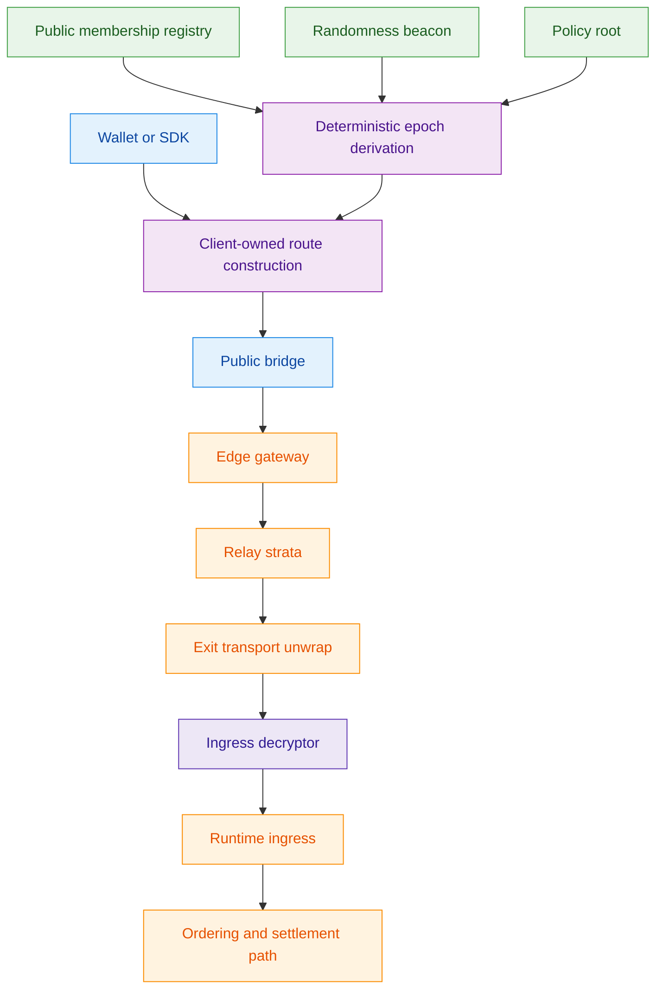
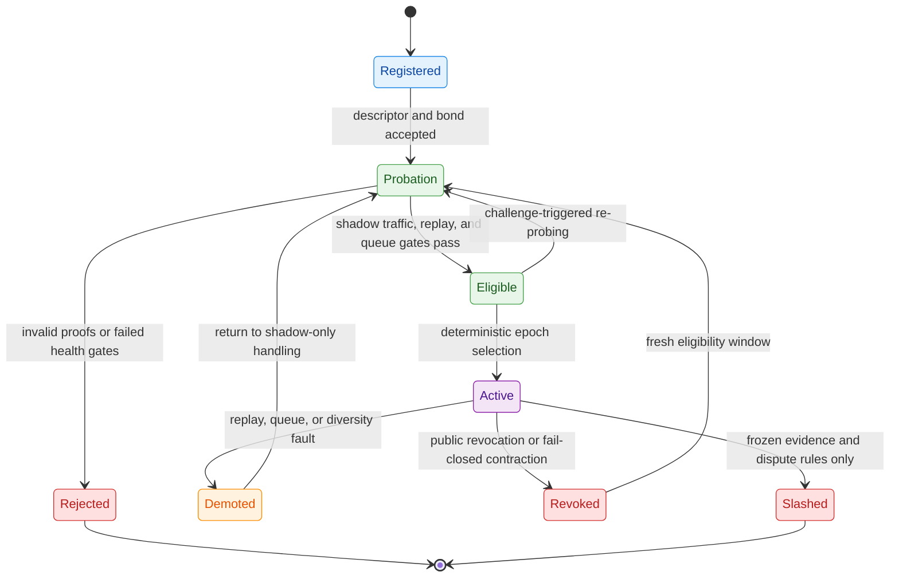
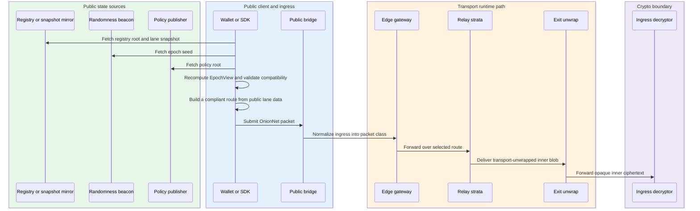
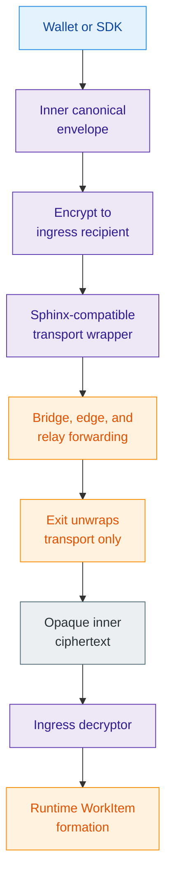
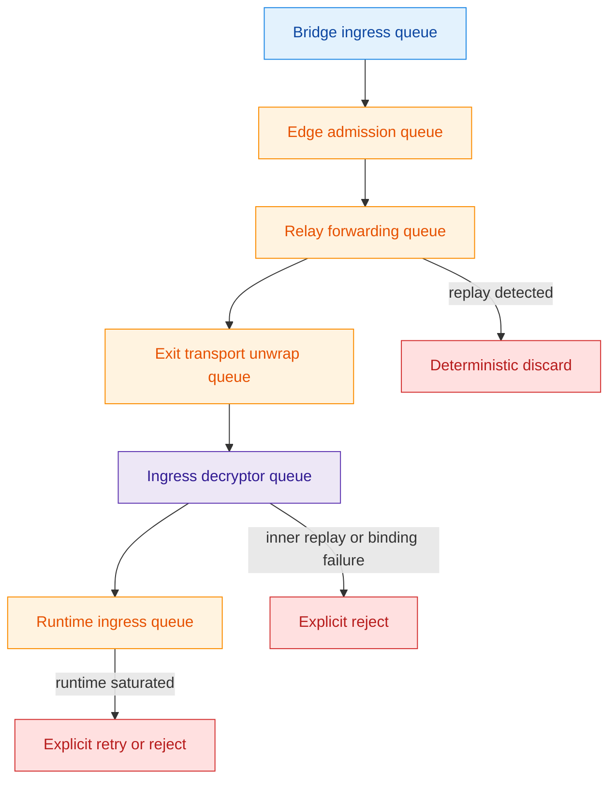
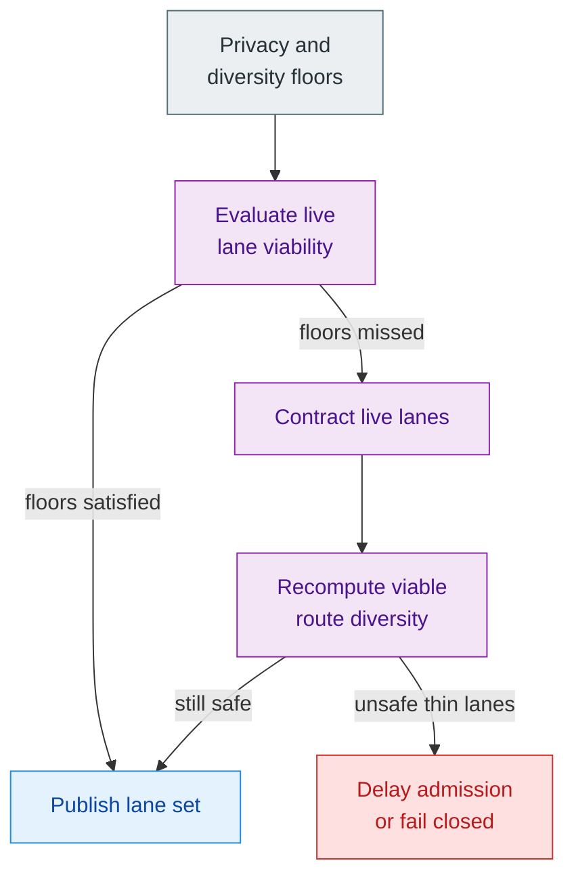
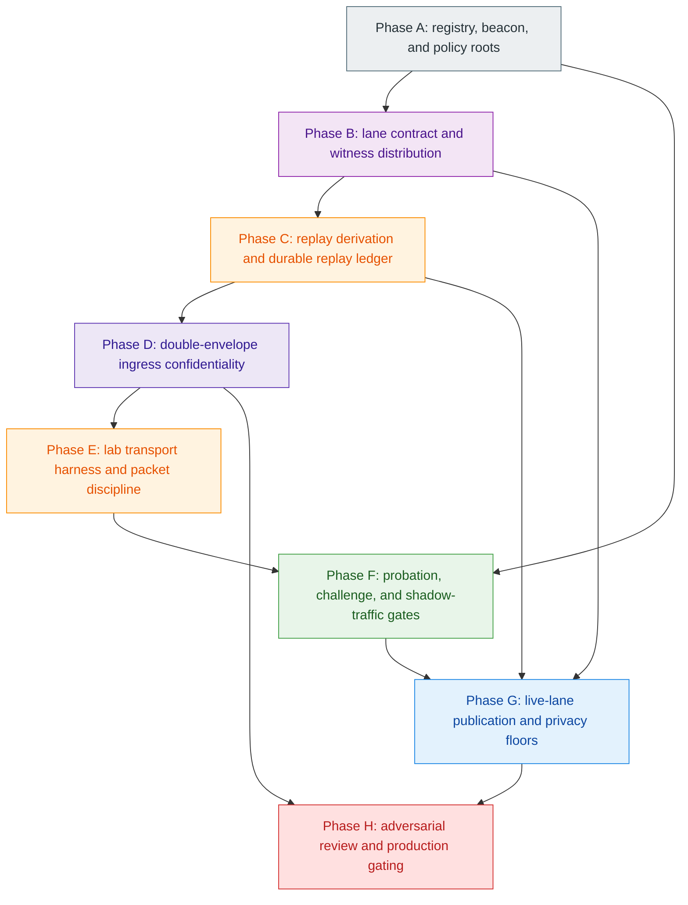

# Z00Z OnionNet Whitepaper

[TOC]

Version: 2026-05-26

## Key Terms Used In This Paper

This paper keeps a compact OnionNet vocabulary because the argument depends on separating public membership, route construction, transport privacy, and runtime confidentiality instead of collapsing them into one vague "privacy network" label.

- `Public membership registry`: The public state that records node identity commitments, role capabilities, diversity metadata, bond state, descriptor commitments, and lifecycle status.
- `Eligible set`: The registry-derived pool of nodes that has passed registration and probation requirements and may enter deterministic active-set selection.
- `Active set`: The role-specific live subset chosen for one epoch from public inputs under deterministic derivation rules.
- `Lane contract`: The public epoch output that defines lane count, bucket sequence, compatibility rules, diversity filters, expiry bounds, and route-validity commitments.
- `Compatibility generation`: The public generation or version bound that lets clients reject stale or incompatible route inputs.
- `Client-owned route construction`: The rule that the wallet or SDK derives and validates its route locally instead of accepting a hidden bridge-selected path.
- `Bounded topology disclosure`: The rule that public state exposes enough authenticated route-validity structure for clients to verify routes, but not the full live forwarding graph.
- `Route witness`: Authenticated material that proves bucket membership or route compatibility without turning a mirror, bridge, or resolver into an end-to-end route authority.
- `Epoch witness bundle`: A bulk or coarsely sharded witness package that lets clients retrieve route-validation material without revealing exact route intent through narrow lookup patterns.
- `Adjacency ticket`: A hop-local routing artifact that lets a forwarding node know enough for its next hop without revealing the full live path.
- `Contact capsule`: An epoch-scoped encrypted contact artifact that resolves transport endpoint details only for eligible predecessor classes.
- `Double-envelope packet`: The two-layer packet model in which transport wrapping and canonical payload confidentiality are separated.
- `Ingress decryptor`: The narrow boundary that recovers the inner canonical payload after transport unwrap and before runtime `WorkItem` formation.
- `Replay ledger`: The durable acceptance log that records replay decisions before forward side effects occur.
- `Shadow traffic`: Non-live traffic used during probation, health testing, and challenge-triggered re-probing before a node can affect live route selection.
- `Privacy floor`: The minimum diversity, lane-population, and traffic-shape threshold below which OnionNet must contract or fail closed rather than pretend privacy is still intact.
- `Break-glass authority`: A tightly bounded bootstrap-only emergency override surface, if one exists at all.

## 1. Why OnionNet?

OnionNet needs a separate paper because anonymous ingress is not a side feature of the Z00Z stack. It sits at the boundary between network privacy, public-state derivation, replay safety, runtime confidentiality, and governance trust. If this topic is buried inside a larger architecture paper, two different questions blur together: how traffic becomes private in motion, and who controls the live topology through which that traffic moves.

The source material is strong precisely because it does not treat those questions as the same. It does not ask only for "an anonymity network." It asks for a runtime-bound ingress layer that keeps path privacy, bounded disclosure, and fail-closed safety without silently giving a small signer group the power to decide which nodes become live, which paths are valid, or which topology view counts as real. That is why OnionNet deserves its own whitepaper. The networking question is inseparable from the control-plane question.

### 1.1 Why Private Transport Alone Is Not Enough

Private transport alone is not enough because Z00Z is not trying to build a generic anonymous mailbox or a general-purpose dark-routing substrate. The traffic in question is runtime-bound private transaction ingress. It must terminate into a narrow runtime seam, preserve replay discipline, and remain sharply separated from ordering, settlement, and business logic. In other words, OnionNet is not only about hiding a path. It is about hiding a path while preserving a disciplined arrival boundary for confidential runtime work.

That requirement makes the design harder than "run traffic over multiple hops." A generic anonymity network can tolerate looser semantics about route freshness, replay, packet classes, or final payload visibility. OnionNet cannot. The route has to be valid for one epoch, diversity rules have to remain auditable, sparse-load behavior has to stay privacy-aware, and the final unwrap must not turn the exit into an unreviewed semantic observer of canonical runtime payloads.

### 1.2 Design Goals

The design goals follow directly from that narrower mission. OnionNet should hide sender network origin from the runtime fast path, remove committee-controlled split-view authority from normal topology operation, preserve multi-hop route privacy with client-owned route choice, and stop new nodes from entering the live path without a real eligibility window. It should also keep replay, queue pressure, and route safety fail closed rather than hiding them behind discretionary operator behavior.

The source material is equally clear about what OnionNet is not trying to promise. It does not promise perfect anonymity against a fully global observer. It does not promise zero public metadata about membership. It does not promise unconditional permissionless admission without Sybil cost. It does not promise zero-latency behavior under sparse-load privacy modes. These non-goals matter because OnionNet becomes easier to evaluate once it is described as a specific ingress discipline rather than as a general claim that "the network is anonymous."

## 2. OnionNet Thesis And Boundary

OnionNet is a committee-less deterministic active-set anonymous-ingress fabric. Its thesis is not merely that transport should be private. Its thesis is that live topology authority should move out of signer discretion and into deterministic public-state derivation, while route ownership moves back to the client and payload meaning remains hidden from the exit whenever the inner-envelope contract can be frozen safely.

That is a stronger architectural claim than "replace one relay set with another." OnionNet preserves role-separated anonymous ingress, reserve-first activation discipline, explicit replay durability, explicit backpressure, and bounded topology disclosure. What it changes is where authority lives and where semantic visibility begins.

**Table 2.1 - From committee topology to deterministic ingress.** The redesign is easier to understand when the control-plane shift is stated directly.

| Dimension | Committee-shaped anonymous ingress | OnionNet target |
| --- | --- | --- |
| Source of live topology truth | Signer-approved or operator-shaped manifest view | Deterministic epoch view derived from public inputs |
| Route ownership | Client depends on hidden route authority or trusted manifest surface | Client recomputes and validates the route locally |
| Membership activation | Registration and promotion can collapse into operator discretion | Registration, probation, eligibility, and activation remain separate |
| Exit visibility | Exit is the first obvious place where canonical payload meaning may appear | Exit should unwrap transport only, while the inner canonical envelope remains opaque |
| Sparse-load posture | Capacity pressure may silently degrade privacy | Low-load contraction becomes an explicit privacy event |

### 2.1 From Signed Manifests To Deterministic Epoch Views

The decisive control-plane move is deterministic epoch derivation. OnionNet replaces signer-chosen live topology views with a public function over finalized randomness, the eligible membership root, and the current policy commitment. The intended rule is simple to state:

`EpochView = F(epoch_seed, registry_root, policy_root)`

The difficulty is not stating the function. The difficulty is making the function complete enough that two honest clients derive the same answer, including the same active roles, reserve ordering, lane count, compatible bucket sequence, expiry window, and generation bounds. A committee-less system only deserves that label if incompleteness cannot be fixed by hidden discretionary edits.

### 2.2 From Hidden Route Authority To Client-Owned Route Construction

The second major move is route ownership. The source design does not settle for public membership plus hidden path assignment. It requires the wallet or SDK to derive the route itself from the public lane contract. The bridge may bootstrap ingress, but it must not become a private end-to-end route oracle. If the client cannot build a compliant route from the authenticated public contract, route construction should abort rather than fall back to bridge-selected path authority.

This is the point where OnionNet becomes more demanding than a familiar privacy gateway. The client has to fetch public inputs, verify freshness, recompute the epoch view, validate compatibility generation, and satisfy diversity rules bucket by bucket. That complexity is the price of removing hidden control-plane trust.

### 2.3 Boundary And Non-Boundary

OnionNet stays inside a strict boundary. It is the anonymous ingress plane for runtime-bound traffic. It does not redefine settlement semantics, validator truth, DA behavior, confidential proof semantics, or a universal anonymous messaging layer. It also does not justify live anonymity claims before the witness-distribution, challenge, replay-binding, and ingress-recipient contracts are frozen.

Those limits are strengths rather than weaknesses. They keep OnionNet legible as a transport-and-ingress design inside the wider Z00Z architecture instead of letting it expand into a second settlement system or a general privacy-network brand.

## 3. Architectural Position Inside Z00Z

OnionNet fits the wider Z00Z architecture because it preserves the same basic discipline found across the other protocol papers: local control where possible, narrow public truth where necessary, and sharp separation between infrastructure roles. The transport path remains distinct from ordering and settlement. The runtime continues to accept only a narrow normalized handoff. Wallet-local secrets do not become transport-layer public state. Business logic does not move into the networking crate just because ingress becomes privacy-sensitive.

The current repository already supports that reading even though OnionNet itself remains largely unimplemented. The crypto layer already exposes a session-derivation seam, domain-separated hash and derivation discipline, and a high-level AEAD surface that OnionNet can reuse for link protection, control traffic, and private contact artifacts. The runtime ingress boundary is already explicit through `AggregatorIngress::admit(WorkItem)`. The OnionNet crate, by contrast, is still a placeholder. That combination matters because it tells us what kind of whitepaper this must be: an architectural target grounded in current repository boundaries, not a claim that the protocol already exists in production form.

**Figure 3.1 - OnionNet position in the Z00Z stack.** OnionNet owns ingress privacy and transport discipline. It does not own ordering, settlement, DA, or business logic.

### 3.1 What Stays Outside OnionNet

Several responsibilities remain outside the OnionNet boundary by design. OnionNet does not own Phase 100 ordering. It does not own canonical state transition rules. It does not own DA publication semantics. It does not own business logic about assets, claims, or rights. It transports runtime-bound confidential work toward the ingress seam and then stops.

That division is important for the same reason it is important across the rest of Z00Z. Once transport begins to absorb ordering, state, or application semantics, the privacy boundary becomes harder to audit and easier to over-claim. OnionNet stays strongest when it is described as an ingress fabric beneath the runtime rather than as a hidden second execution layer.

### 3.2 Why The Ingress Decryptor Matters

The most delicate new boundary is the ingress decryptor. In older or simpler onion-routing models, the exit is the natural place where transport privacy ends and semantic visibility begins. OnionNet is trying to make a stronger move. The exit should remove only the transport wrapper, while the inner canonical envelope remains opaque until a narrower runtime-adjacent decryptor recovers it and forms the final `WorkItem`.

That shift is important because it reduces one obvious semantic hotspot, but it also creates a new review surface. The whitepaper therefore has to be honest about both sides at once. The ingress decryptor is the component that makes reduced exit visibility possible, and it is also the component whose recipient model, AAD binding, replay binding, rotation policy, and isolation rules must be frozen before any such claim becomes trustworthy.

## 4. Public Membership, Activation, And Deterministic Selection

The heart of OnionNet is not merely that the network has members. It is that membership and activation are separate, that activation is deterministic, and that deterministic selection must obey real diversity and reserve rules instead of only trying to maximize population.

### 4.1 Public Membership Registry

The public membership registry is where candidate transport actors become legible. A node must not become live merely because it can answer a socket. It must publish or commit to a node identity, role capabilities, transport and routing keys, operator metadata, ASN and jurisdiction signals, provider-class information, capacity class, bond or equivalent Sybil-cost commitment, and a descriptor commitment consistent with later eligibility and revocation rules.

The registry is therefore not a convenience index. It is the first security boundary of the whole ingress fabric. If the registry does not capture the metadata needed to enforce concentration ceilings, then the later selection algorithm cannot enforce them honestly. If revocation, expiry, or descriptor freshness are vague, deterministic activation becomes deterministic only in appearance.

### 4.2 Deterministic Epoch View

The public input set for each epoch must remain explicit. The source design is clear that honest participants need a finalized epoch anchor, a beacon-derived `epoch_seed`, an eligible `registry_root`, and a `policy_root` that commits to diversity and capacity constraints. With those inputs, every honest party should be able to derive the same active set, the same reserve ordering, the same lane count, the same compatible bucket sequence per stratum, the same expiry window, and the same compatibility generation.

That list matters because committee-less derivation is easy to overstate. If the derivation leaves replacement rules, tie-breaks, or unsatisfied-constraint behavior ambiguous, the system quietly recreates the very operator discretion it was meant to remove.

### 4.3 Deterministic Selection Specifics

The Phase 115 design is strong here because it does not settle for saying that nodes are "sampled." It specifies the kinds of ceilings and floors the sampling must obey. Active-set derivation needs weighted deterministic sampling with hard limits across operator, ASN, jurisdiction, and provider-class concentration. It also needs a minimum reserve pool, minimum active redundancy per role, minimum lane population before publication, and compatibility-generation and expiry bounds strong enough that stale route material can be rejected locally.

The fail-closed rule follows from those constraints. If the eligible population cannot satisfy the diversity and redundancy contract, the network should reduce live capacity or delay publication instead of pretending that a thin lane set is good enough. A trust-minimized topology is only as real as its refusal to hide incompleteness behind discretionary patching.

**Table 4.1 - Minimum deterministic selection constraints.** These are not tuning niceties. They are the conditions under which deterministic activation remains meaningful.

| Constraint | Why it exists | If it cannot be satisfied |
| --- | --- | --- |
| Maximum concentration per operator | Prevent one operator from shaping too many live routes | Reduce live capacity or fail closed |
| Maximum concentration per ASN | Reduce common-cause network concentration | Reduce live capacity or fail closed |
| Maximum concentration per jurisdiction | Reduce correlated legal or coercive pressure | Reduce live capacity or fail closed |
| Maximum concentration per provider class | Reduce infrastructure monoculture | Reduce live capacity or fail closed |
| Minimum reserve pool size | Preserve deterministic replacement ability | Delay publication or shrink the live surface |
| Minimum active redundancy per role | Avoid one-fault lane collapse | Delay publication or shrink the live surface |
| Minimum lane population | Avoid deterministic thin lanes | Contract lanes or fail closed |

### 4.4 Probation, Challenge, And Reserve Discipline

The source lifecycle is one of OnionNet's most important quality controls: `Registered`, `Probation`, `Eligible`, `Active`, `Demoted`, `Revoked`, and `Slashed` are distinct states for a reason. Registration makes a node visible. Probation makes it testable. Eligibility makes it sampleable. Activation makes it route-relevant. Demotion, revocation, and slashing remain separate because not every failure deserves the same consequence.

Probation is especially important because it blocks the shortcut from registration to live path authority. A probationary node should handle only synthetic loop probes, shadow traffic, bounded health tests, and challenge-response checks. Eligibility requires more than time. It requires passing shadow-traffic correctness, replay correctness, queue stability, descriptor consistency, absence of a successful challenge during the defined window, and compatibility with the published diversity policy.

Reserve ordering belongs to the same discipline. Once the epoch view is public, honest participants must agree not only on who is live, but also on who replaces whom and in what order when a node fails or a diversity limit is breached. Otherwise the system reintroduces a hidden topology authority during recovery even if the initial sampling step looked deterministic on paper.

**Figure 4.1 - Membership lifecycle without committee discretion.** The important property is not the exact label set, but the fact that registration, eligibility, live activation, recovery, revocation, and punishment are separate protocol states.

Challenge handling should remain conservative until anti-griefing is frozen. Adjacent peers, synthetic probe clients, rotating public auditors chosen from beacon-derived randomness, and public challengers may all help surface faults, but challenges should remain advisory until the protocol has replay-protected challenge identifiers, challenger bond rules, filing windows, rate limits, and symmetric penalties for invalid accusations. Re-probing is a safe early tool. Automatic punishment is not.

**Table 4.2 - Challenge posture before freezing.** The early challenge plane should observe and re-probe before it is allowed to punish.

| Plane element | Intended early rule | Reason |
| --- | --- | --- |
| Probe and observation | Allowed through adjacent peers, synthetic probes, rotating auditors, and public challengers | Finds faults before live activation or punishment |
| Re-probing after challenge | Allowed | Tests suspicious nodes without changing state immediately |
| Automatic demotion from any challenge | Not allowed yet | Too easy to weaponize before anti-griefing rules exist |
| Automatic slashing from early challenge flow | Not allowed yet | Evidence and dispute semantics remain unfrozen |
| State-changing punishment | Deferred until challenger identity, bonds, challenge IDs, filing windows, and symmetric penalties are frozen | Prevents cheap control-plane griefing |

## 5. Client-Owned Route Construction And Bounded Topology Disclosure

Client-owned route construction is one of the central OnionNet claims because it is where deterministic membership becomes meaningful for the user. The client does not merely learn that a network exists. It learns enough authenticated public structure to assemble a valid route itself without receiving a hidden end-to-end path from a bridge or resolver.

### 5.1 Lane Contract

The lane contract is the public route surface the client consumes. It needs to expose bucket sequence per stratum, bucket membership roots together with a witness-distribution mechanism, the diversity metadata needed by the client filter, expiry bounds, compatibility generation or version bounds, and minimum viability thresholds. That is enough for route validation, but it is intentionally not enough to publish a globally revealing forwarding graph.

This is where one of OnionNet's hardest design tensions lives. If the public lane contract is too thin, the client's route ownership is unverifiable. If it is too thick, the network turns bounded topology disclosure into endpoint publication. The witness-distribution contract is therefore central to the whole design, not an afterthought.

### 5.2 Route Workflow

The route workflow is stricter than a familiar "connect to a privacy bridge" flow. The client has to fetch or verify the relevant registry material, fetch the beacon-derived randomness, fetch the current policy commitment, recompute the epoch view, verify freshness and compatibility, and then choose one compatible participant from each required bucket while satisfying the published diversity rules. If no compliant route exists, the client must abort rather than accept bridge-selected end-to-end fallback.

**Figure 5.1 - Client-owned route workflow.** The bridge remains the public ingress surface, but it is not the hidden source of route truth.

### 5.3 Public And Private Topology Surface

OnionNet preserves bounded disclosure by splitting topology into public and private layers. The public layer may expose lane contracts, bucket memberships or their authenticated commitments, diversity tags, validity bounds, and role capabilities. The private layer may expose live next-hop coordinates, hop-local adjacency tickets, epoch-scoped encrypted contact capsules, and endpoint details disclosed only to eligible predecessor classes.

**Table 5.1 - Public versus private topology surface.** The topology split is the mechanism by which OnionNet tries to remain auditable without becoming globally revealing.

| Publicly visible | Privately resolvable |
| --- | --- |
| Lane contracts | Live next-hop coordinates |
| Bucket memberships or authenticated commitments | Local adjacency tickets |
| Diversity tags | Epoch-scoped encrypted contact capsules |
| Expiry and compatibility bounds | Endpoint details for eligible predecessor classes only |
| Role capabilities | Hop-local transport details |

This split is not cosmetic. It is the mechanism by which OnionNet tries to preserve public auditability of route validity without publishing a full live forwarding graph. If the public layer becomes too thin, client route ownership becomes unverifiable. If it becomes too thick, topology privacy collapses into endpoint publication.

### 5.4 What Is Not Hidden

OnionNet should not describe topology as fully hidden. Public membership is intentionally visible enough to make deterministic selection auditable. Node registration is public. Role capabilities and coarse diversity metadata may be public. Active bucket commitments or lane roots may be public. The network may also reveal that a node has moved from registration into probation, eligibility, or active sampling.

The hidden surface is narrower and more precise. User session artifacts, receiver or wallet identity material, exact route intent, live next-hop coordinates, full adjacency maps, raw endpoint lists, and route-specific contact material must not become ordinary public registry state. A stronger and more accurate claim is therefore: OnionNet makes membership auditable while keeping live adjacency and user route intent on a bounded-disclosure path.

### 5.5 Witness Retrieval And Route-Intent Privacy

The route-witness contract is the most important bridge between auditability and privacy. A client needs enough authenticated material to validate bucket membership and route compatibility. At the same time, a mirror, bridge, or resolver must not learn the exact route the client intends to build merely because the client requested narrow witness objects.

The preferred baseline is to distribute epoch witness bundles in bulk or in coarse shards. A wallet can fetch the whole bundle, or a shard large enough to hide route intent among many possible routes, then build the final path locally. If bandwidth makes full bundles impractical, OnionNet can later add oblivious retrieval, private-information-retrieval-style witness lookup, decoy queries, or gossip distribution. Those techniques should be treated as optimizations around the same invariant: no bridge, mirror, or resolver may provide unverifiable end-to-end route witnesses, and no narrow lookup pattern should become a reliable route-intent leak.

### 5.6 Joining Nodes And Activation Privacy

New node admission should be treated as a topology-leakage surface. Registration cannot be fully hidden if membership is public and deterministic selection is auditable, but the design can avoid making registration immediately route-relevant. New nodes should enter through batched registration, fixed probation windows, shadow traffic, and epoch-bound eligibility updates before they can affect active route construction.

This delayed activation rule has two jobs. It prevents a registrant from jumping directly into live route selection, and it weakens the timing link between "a new node appeared" and "a new route became available." The design should still assume that public observers can see candidate membership changes. What they should not see is a direct mapping from a fresh registration to a live forwarding edge, user session, or route-specific endpoint disclosure.

### 5.7 Bootstrap Ingress And Warm Refresh

The bootstrap story is intentionally split. Cold start remains public. The client may fetch registry state, randomness, and policy material and enter through a public bridge. Warm refresh is narrower. Once admitted, compatible in-network refresh material may update route-relevant data without exposing a public adjacency graph. This distinction is not cosmetic. It preserves practical usability without turning every route refresh into a full public revelation of live forwarding detail.

Public bridges therefore remain important, but their role stays bounded. They provide bootstrap ingress. They do not become hidden route authorities and they do not get to substitute their own end-to-end selection for the client's validated route.

## 6. Transport Roles, Packet Discipline, And Double-Envelope Confidentiality

The transport layer keeps the strongest structural ideas from the Phase 115 source while making the exit-visibility question more explicit. OnionNet still uses public bridges for bootstrap ingress, edge gateways for ingress-plane transition, relay strata for multi-hop forwarding, and exits for transport unwrap. What changes is the claim about where semantic payload visibility should begin.

### 6.1 Role-Separated Transport

Role separation matters because the network should not ask every participant to know everything. Bridges handle public bootstrap contact. Edge roles normalize ingress into the OnionNet packet classes and enforce first-hop admission policy. Relay roles forward over selected routes while learning only the hop-local information they need. Exits remove only the transport wrapper. If the double-envelope model is frozen correctly, they should not need canonical payload plaintext in order to do their job.

This role map is also where hop-local private artifacts belong. Adjacency tickets and encrypted contact capsules exist so that forwarding remains practical without forcing the protocol to publish a globally revealing map of next-hop endpoints.

### 6.2 Packet Classes And Route Privacy

OnionNet keeps a fixed packet taxonomy because transport privacy is easier to overstate when traffic classes drift. The minimum packet classes are `data`, `cover`, `loop`, and `control`. Each class should retain fixed geometry within its own class. This is not an implementation preference. It is part of the anonymity contract because packet shape is one of the fastest ways to reintroduce semantic leakage.

At the route layer, the source design remains Sphinx-compatible. The intention is to keep route privacy, adjacent-link confidentiality, and hop-local forwarding semantics separate from the question of who can see the canonical payload after transport unwrap.

### 6.3 Double-Envelope Confidentiality

The main confidentiality redesign is the double-envelope model. The outer layer is the anonymous transport wrapper. It provides route privacy, adjacent-link confidentiality, class validation, replay enforcement, and size plus queue discipline. The inner layer is a canonical envelope encrypted to an ingress recipient rather than to the exit.

The operational pipeline is straightforward. The client creates an inner canonical envelope, encrypts it to an ingress-recipient key, wraps that ciphertext inside the onion transport packet, and sends the result over the selected route. The exit removes only the transport wrapper and validates transport rules. It then forwards the opaque inner ciphertext to the ingress decryptor, which recovers the canonical envelope, checks binding and replay rules, and forms the final runtime `WorkItem`.

That is the architectural gain OnionNet is trying to secure. Onion routing alone can hide a path while still making the exit the first place where canonical payload meaning becomes visible. The double-envelope model aims to push that semantic visibility closer to the runtime boundary without moving it into a broad application gateway.

**Table 6.1 - Outer versus inner confidentiality boundary.** OnionNet is not only adding another encrypted blob. It is changing where semantic visibility is allowed to begin.

| Layer | What it protects | What it is allowed to know | What it must not become |
| --- | --- | --- | --- |
| Outer transport layer | Route privacy, link confidentiality, packet-class discipline, transport replay handling | Hop-local forwarding context and transport validity | The place where canonical runtime meaning becomes visible |
| Inner canonical layer | Canonical payload confidentiality and inner replay binding | Ingress-recipient-scoped canonical payload recovery | A generic transport wrapper with no runtime-bound semantics |
| Exit role | Transport unwrap only | Whether the transport wrapper is well formed | A default semantic payload observer |
| Ingress decryptor | Canonical envelope recovery and runtime handoff checks | Inner replay state, binding result, admissible plaintext family | A broad application gateway that absorbs unrelated context |

**Figure 6.1 - Double-envelope pipeline.** The exit sees transport-valid opacity rather than canonical runtime meaning.

### 6.4 AAD Binding, Replay Binding, And Key Separation

The double-envelope claim only works if the inner envelope is tightly bound to the transport context in which it is accepted. The minimum AAD or equivalent binding surface should include protocol version, `epoch_id`, compatibility generation, traffic class, ingress-recipient key identifier, ciphertext size class, expiry bound, and a canonical inner replay tag. Without that binding, OnionNet risks replay or transposition paths in which an inner payload escapes the route context it was meant to inhabit.

The replay rule is therefore two-level. Transport replay still matters at the outer layer, but the ingress decryptor must also durably record the inner replay tag before `WorkItem` formation and must not admit the same inner canonical envelope twice through distinct outer packets.

Key separation is equally strict. Transport identity keys, routing keys, link AEAD keys, membership authorization keys, wallet keys, ingress-recipient decryption keys, registry signing keys, beacon-authentication keys, challenge-attestation keys, dispute or slashing keys, and any break-glass override keys must remain distinct families. OnionNet adds enough control-plane and confidentiality machinery that careless key reuse would erase much of the safety gained elsewhere.

### 6.5 Fingerprint Reduction

Fingerprint reduction requires more than padding as an afterthought. OnionNet should use fixed-size or tiered-size envelope classes, explicit padding discipline, uniform outer tags, a restricted admissible payload taxonomy at ingress, and batch-friendly admission windows where those windows do not weaken replay safety. Packet geometry is part of the anonymity contract, not only of transport efficiency.

## 7. Replay, Backpressure, Low-Load Privacy, And Carrier Discipline

Operational safety in OnionNet depends on explicit rules rather than hidden best effort. Replay, queue pressure, sparse-load behavior, and carrier choice all interact with privacy and route validity.

### 7.1 Replay Durability

The replay contract should remain strict. The authoritative decision path should use exact replay tags rather than approximate Bloom-style or cuckoo-style structures, should durably record acceptance before forward side effects, should persist authoritative state for the current epoch plus one grace epoch, and should use bounded in-memory hot caches only as accelerators. If replay-state persistence is ambiguous, the packet should not be forwarded.

This matters because replay ambiguity at ingress is not a minor operational flaw. It is one of the points where route privacy, runtime admission, and duplicate semantic work can collapse into each other if discipline is loose.

### 7.2 Explicit Backpressure

Backpressure must remain explicit at every queue boundary: bridge ingress, edge admission, relay forwarding, exit unwrap, and ingress-decryptor or runtime handoff. Unbounded buffering is forbidden. Queue semantics are part of the protocol discipline because hidden buffering creates ambiguous failure behavior and can amplify traffic-shape leakage under pressure.

The privacy argument here is easy to miss. A transport that hides overload by silently accumulating backlog eventually leaks state through latency, admission asymmetry, or collapse at the most sensitive boundary. Explicit backpressure is therefore part of the privacy discipline, not only of operational hygiene.

**Figure 7.1 - Queue-local failure boundary.** Queue pressure and replay decisions should be observable at the boundary where they occur, not hidden behind best-effort forwarding.

### 7.3 Low-Load Contraction And Privacy Floors

Sparse traffic is not merely a throughput issue. It is a privacy issue. When load drops below configured privacy floors, OnionNet should prefer fewer live lanes, thicker anonymity sets per lane, larger batching windows where safe, a higher cover floor, and denser loop traffic. It should not preserve a nominal lane count if doing so would publish deterministic thin lanes with poor route diversity.

The source document is careful on this point, and the whitepaper should keep the same discipline. Lane contraction is a low-load mitigation, not a proven privacy improvement. If contraction would leave fewer than the minimum number of independent compliant routes for a supported diversity profile, the protocol should fail closed or delay admission rather than publish a deterministic thin-lane surface and call it privacy.

The low-load rule also needs an explicit cover budget. Cover traffic and loop traffic cannot remain vague aspirations if sparse-load anonymity depends on them. The policy surface should define who pays for cover, how cover floors change across epochs, which packet classes count toward the privacy floor, and when admission delay is safer than spending more cover. Without that budget, low-load privacy becomes an operator preference rather than a protocol property.

**Figure 7.2 - Low-load contraction path.** Contraction is useful only if it preserves route diversity. If it creates deterministic thin lanes, admission delay or fail-closed behavior is safer.

### 7.4 Carrier Neutrality And QUIC Review

QUIC may remain a primary adjacent-link carrier, but OnionNet should not make one transport profile the identity of the privacy model. QUIC datagram-first carriage, WebSocket or TLS bridge ingress, Tor-based ingress, and later censorship-resistance adapters may all be viable carriers so long as they terminate into the same normalized packet discipline and preserve the same packet classes, padding rules, replay semantics, queue semantics, and inner-envelope confidentiality model.

QUIC still deserves a dedicated review surface. Datagram versus stream usage, connection-ID policy, anti-amplification behavior, PMTU handling, certificate rotation, and hostile-middlebox behavior all need to be frozen and tested before production enablement. Carrier neutrality does not remove carrier-specific review obligations.

### 7.5 Messenger Relay And Delivery Receipts

The messenger concept belongs in OnionNet only as a privacy-preserving relay and receipt surface, not as a permanent on-chain message archive. The baseline mode should keep message contents off-chain, use receiver-owned routing material, and retain queued message history only under short-lived, policy-bound rules. Public settlement should see at most a minimal receipt when a message has payment, claim, ticket, or notice relevance.

The addressing model should avoid permanent public inbox identities. Rotating destination tags, salt-based derivation, one-time receive material, and short-lived drop-box pointers fit the wider OnionNet design because they let a receiver publish enough to be reachable without recreating a public account graph. A delivery receipt may prove acknowledgement, accepted notice, or settlement relevance; it should not reveal the communication thread itself.

PTB-like steganographic carriage remains an experimental direction. It may become useful for cover traffic if ordinary-looking private package flow can safely carry small message payloads. That idea should stay behind the same packet-class, replay, abuse, and low-load privacy gates as the rest of OnionNet.

## 8. Threat Model And Cryptographic Review Surface

OnionNet becomes easier to trust once its threat model is stated plainly. The design is not trying to prove universal anonymity. It is trying to reduce specific control-plane and transport risks while remaining honest about the adversaries that still matter.

### 8.1 Threat Model

The source threat model includes passive access-network observers, malicious bridges, relays, or exits, malicious registrants attempting Sybil insertion, active attackers replaying, tagging, or delaying packets, partial collusion across bridge, edge, and exit roles, and chain observers attempting timing correlation with runtime intake. The redesign also adds new surfaces: randomness-beacon manipulation, registry-root rollback or partial availability, fraudulent challenge spam, slashing griefing, and public metadata leakage through membership descriptors.

The paper should keep one exclusion equally clear. OnionNet does not claim safety against a fully global adversary that can observe ingress, middle-hop, and exit timing at unlimited resolution. That non-claim is part of the system's honesty, not a weakness in presentation.

**Table 8.1 - Core OnionNet threat surfaces.** The design is strongest when each threat is paired with the boundary meant to resist it.

| Threat surface | Why it matters | Intended defense posture |
| --- | --- | --- |
| Passive access-network observation | Can correlate sender origin with public ingress timing | Multi-hop route privacy and bridge-to-runtime separation |
| Malicious relay or exit | Can tag, delay, replay, or classify traffic | Fixed packet classes, replay rules, bounded visibility, and route diversity |
| Sybil or concentration attack | Can capture too much of the live topology | Bonded registration, eligibility windows, and deterministic concentration ceilings |
| Beacon bias or withholding | Can distort epoch derivation | Frozen beacon contract, anti-bias rules, and liveness fallback |
| Registry rollback or stale view | Can split honest route derivation | Freshness, anti-rollback rules, and non-authoritative cached snapshots |
| Challenge spam or slashing griefing | Can weaponize the control plane | Advisory-first challenge posture and anti-griefing requirements before punishment |
| Sparse-load route narrowing | Can make routes deterministic under low traffic | Privacy floors, contraction rules, and fail-closed admission |

### 8.2 Review Priorities

The review priorities follow directly from that threat map. Deterministic epoch derivation has to produce one valid epoch view from one public input set. Registry inclusion, exclusion, and revocation must be auditable and freshness-protected. Beacon bias, withholding, and fallback rules must be explicit. Challenge evidence must be deterministic and non-forgeable. Low-load contraction must not create deterministic route predictability. Bridge, edge, and exit collusion remains a residual risk even without a committee. Exit confidentiality depends on the ingress decryptor boundary and therefore needs direct adversarial review rather than casual optimism.

Payload-family fingerprinting belongs in the same review set. If adversarial classifiers can reliably infer canonical payload families from transport-visible structure, then route privacy alone is not doing enough for a runtime-bound ingress system.

### 8.3 Recommended Crypto Direction

The source design is right to prefer repo-owned cryptographic seams wherever possible. In practice that means reusing `HKDF_INFO_ONIONNET_SESSION` for session-related derivation, keeping replay and session binding on an explicit domain-separated path such as `OnionSessionDomain`, and preferring the repository's `seal()` and `open()` surfaces for link, control, and private contact-capsule confidentiality unless a stricter abstraction is introduced deliberately. Sphinx-compatible routing should sit behind an adapter boundary rather than leak upstream assumptions into the rest of the stack. Deterministic public inputs and cached epoch snapshots should use exact binary encoding discipline rather than permissive serialization.

This crypto direction is modest on purpose. OnionNet is already ambitious at the topology and confidentiality boundary. It does not become safer by inventing unnecessary cryptographic novelty around those boundaries.

### 8.4 Crypto Risks That Remain Open

Several crypto-sensitive questions remain open in the source and should remain visibly open here: the exact beacon derivation and anti-bias strategy, the exact inner-envelope AAD schema, the final Sphinx adapter and its audit trust level, the exact challenge-proof formats, and the exact registry update plus revocation signing model. These are not polish items. They are the frozen-contract requirements that decide whether OnionNet can graduate from architectural direction to implementation planning.

### 8.5 Failure Posture

The general OnionNet failure posture should remain fail closed. If freshness, route validity, replay state, diversity floors, witness validity, or ingress-binding assumptions cannot be validated, the system should degrade by refusal, contraction, re-probing, or explicit delay rather than by hidden best-effort forwarding. A committee-less design only keeps its integrity if incompleteness is visible instead of silently patched by operators.

## 9. Architectural Strengths And Trade-Offs

OnionNet's strengths are real, but they are not free. The design reduces one kind of trust by adding more protocol machinery and more places where the contracts must be precise.

The strongest gain is lower governance trust in the live topology. The normal control plane no longer depends on a small authority deciding which view of the network counts as real. The second gain is stronger path ownership. Once witness distribution and route-validity rules are frozen, the client rather than a hidden control surface becomes the route constructor. The third gain is potential reduction in exit-visible payload meaning through the ingress-decryptor boundary. The fourth gain is cleaner handling of split-view risk because epoch state becomes protocol-derived rather than signer-chosen. The fifth gain is conceptual honesty about low-load privacy, because sparse traffic is treated as a privacy degradation event rather than disguised as a mere capacity fluctuation.

There is also a topology honesty gain. OnionNet does not have to pretend that all topology is secret. It can make membership auditable, derive active views deterministically, and still keep live adjacency, endpoint resolution, and user route intent off the public surface. That is a narrower claim, but it is stronger because it can be tested.

The trade-offs are equally important. OnionNet adds public registry semantics, beacon dependence, deterministic epoch-derivation complexity, richer client validation, challenge and anti-griefing machinery, a new ingress-recipient confidentiality boundary, and a harder rollout path. This becomes an acceptable trade only if the resulting protocol is still more auditable than the committee-shaped control plane it replaces.

## 10. Implementation Order And Safety Gates

The Phase 115 source is right to insist that the next step is not "start coding everything." The next step is to freeze the contract surfaces in an order that prevents premature live claims.

### 10.1 Safe Rollout Order

The safest path begins with public-state determinism, then route validity, then replay durability, then the confidentiality redesign, and only after that the transport harness and live-lane gates. Hidden discretionary topology edits must not be used to patch over incompleteness at any phase.

**Table 10.1 - Phase-gated rollout order.** Each stage exists to make the next stage auditable rather than merely implementable.

| Phase | What must freeze first | Why it comes in this order |
| --- | --- | --- |
| Phase A | Registry, revocation, beacon, and policy-root semantics | Without public-state truth, every later deterministic claim is unstable |
| Phase B | Lane contract, compatibility generation, and witness distribution | Client-owned routing is impossible until public route validity is explicit |
| Phase C | Replay derivation and durable replay-ledger ordering | Runtime-bound admission needs duplicate protection before live use |
| Phase D | Inner-envelope recipient model and ingress-decryptor boundary | Exit-confidentiality claims must wait for the recipient contract |
| Phase E | Lab transport harness and normalized packet discipline | Carrier behavior needs a testable implementation surface before live claims |
| Phase F | Probation, challenge, and demotion logic under shadow traffic | Fault observation should mature before punishment does |
| Phase G | Live-lane publication under privacy-floor checks | Sparse-load and viability rules must exist before production ingress |
| Phase H | Adversarial review and production gating | Final deployment claims should depend on hostile testing, not only completeness |

**Figure 10.1 - Safety-gate dependency map.** The rollout order is intentionally dependency-shaped: live publication should not outrun public-state determinism, route validity, replay durability, or the ingress-decryptor contract.

## 11. Open Contracts And Research Blockers

OnionNet remains implementation-blocked until several contracts are written down with enough precision that independent implementers and reviewers converge on one meaning. These blockers are not administrative. They are the parts of the design that decide whether the trust-minimization claim is real.

### 11.1 Public Registry And Revocation Contract

The registry contract still needs exact descriptor objects, capability and diversity encodings, versioning rules, inclusion and non-inclusion proof semantics, revocation causes, effective-height rules, rollback handling, and explicit interaction rules with active lanes and reserve ordering. Without this contract, the network cannot even agree on the same eligible population.

### 11.2 Randomness Beacon Contract

The beacon contract still needs an authoritative source or source-composition rule, exact epoch-seed derivation, anti-bias and withholding assumptions, freshness bounds, replay rejection rules, and liveness fallback behavior. Without this contract, two honest clients can share the same nominal epoch and still derive different route surfaces.

### 11.3 Deterministic Active-Set Sampling Contract

The sampling contract still needs exact weighted-selection rules, tie-break semantics, selection-with-or-without-replacement behavior, concentration ceilings, deterministic reserve handling under unsatisfied constraints, and reproducible test vectors. This is the place where "committee-less" either becomes a protocol property or collapses into a slogan.

### 11.4 Lane Compatibility And Route-Witness Contract

The route contract still needs an exact definition of compatible buckets and compatible routes, a witness-distribution mechanism that does not reveal a global forwarding graph, explicit route-validity predicates, client failure behavior when no compliant route exists, and a hard prohibition boundary on bridge, mirror, or resolver assistance. It should also define whether the first implementation uses full epoch witness bundles, coarse shard bundles, oblivious retrieval, gossip distribution, or a staged combination of those approaches. Without this contract, client-owned routing remains an aspiration rather than a verifiable property.

### 11.5 Challenge, Anti-Griefing, And Slashing Contract

The challenge plane still needs exact evidence objects, challenger eligibility and bond rules, replay-protected challenge identifiers, rate limits, response and filing windows, deterministic resolution order, anti-griefing rules, and an explicit decision on whether first-pass slashing exists at all. An underdesigned challenge path can recreate control-plane fear and selective demotion pressure even before any bond is actually slashed.

### 11.6 Ingress Decryptor And Key-Management Contract

The confidentiality redesign still needs an exact recipient model, decrypt-capable key scope, rotation and expiry rules, AAD schema, replay-binding inputs, allowed plaintext families, and isolation rules that keep transport metadata, wallet secrets, and application convenience fields from leaking across the runtime boundary. It also needs to decide whether ingress decryption is single-holder, threshold-based, hardware-security-module-backed, or otherwise sharded across roles. This contract decides whether OnionNet truly reduces exit-visible payload meaning or merely moves semantic visibility to a new opaque hotspot.

### 11.7 Low-Load Privacy Contract

The low-load policy still needs exact privacy floors, lane-contraction rules, cover-budget rules, admissibility conditions for publishing fewer lanes, route-independence guarantees under contraction, and simulation-backed evidence that sparse-load handling does not create a deterministic route-predictability channel. Without this contract, OnionNet risks acknowledging sparse-load degradation in theory while publishing thin deterministic lanes in practice.

### 11.8 Bootstrap-Only Break-Glass Contract

If any emergency authority exists, it still needs exact scope limits, forbidden actions, trigger conditions, quorum or authorization model, expiry, public signaling, audit trail, rollback semantics, and proof that it cannot silently become a hidden topology or route-selection authority. A break-glass path that can quietly shape route reality is a trust backdoor, not a bootstrap convenience.

### 11.9 Proof Of Relay And Messenger Receipt Contract

A future Proof of Relay contract should reward forwarding work without turning every message into public accounting data. The minimum useful shape is an epoch-scoped relay receipt model: each hop records an opaque hop identifier, epoch, cost coefficient, message-class hash, and a next-hop or inbound signature. Relays or helpers can then batch those receipts into vector commitments or another compact proof surface and expose only per-relay work totals.

This contract should remain optional and service-layer scoped. It may fund relay nodes, cover traffic, or messenger delivery, but it must not redefine Z00Z cash settlement and must not leak sender, receiver, path, or payload meaning. Invalid batches should simply fail verification; helper trust should not be required for relay-work accounting.

## 12. Relation To The Wider Z00Z Thesis

OnionNet belongs inside the wider Z00Z thesis because Z00Z is not only about hiding state transitions after they reach settlement. It is also about preserving narrow explicit boundaries around how private runtime-bound traffic reaches the settlement engine at all.

The main Z00Z papers argue for wallet-local private objects, narrow public settlement evidence, and disciplined separation between the protocol and its surrounding services. OnionNet applies the same logic to ingress. It does not replace wallet-local possession and it does not redefine settlement. It protects the route by which private runtime work reaches the canonical ingress seam without turning live topology into a hidden operator privilege.

## 13. Conclusion

OnionNet is the right current design direction if Z00Z wants to preserve the strengths of anonymous ingress while removing committee authority from normal topology operation. Its architectural promise is meaningful: less governance trust, stronger route ownership, cleaner split-view resistance, and a credible path toward lower exit-visible payload meaning.

Its blockers are equally real. Public-state contracts, witness distribution, replay binding, ingress-recipient confidentiality, challenge evidence, anti-griefing semantics, low-load privacy rules, and any break-glass authority remain unfrozen. The right conclusion is therefore disciplined rather than promotional. OnionNet is worth refining now precisely because it is still a protocol-heavy architecture direction and not yet a deployable anonymity claim.

## Appendix A. Glossary

The glossary collects the OnionNet-specific terms and working abbreviations used repeatedly in this paper. It combines the compact key-term list from the front of the document with the extra reference vocabulary needed by the later transport, routing, and rollout sections.

| Term or abbreviation | Meaning In This Paper |
| --- | --- |
| `AAD` | Associated data or an equivalent binding surface that ties the inner envelope to route, epoch, recipient, class, and replay context without exposing the plaintext. |
| `AEAD` | Authenticated encryption with associated data; the confidentiality primitive family used for link protection, control traffic, and related transport artifacts. |
| `Active set` | The role-specific live subset chosen for one epoch from public inputs under deterministic derivation rules. |
| `Adjacency ticket` | A hop-local routing artifact that lets a forwarding node know enough for its next hop without revealing the full live path. |
| `ASN` | Autonomous System Number; used as one of the concentration and diversity dimensions during deterministic active-set selection. |
| `Bounded topology disclosure` | The rule that public state exposes enough authenticated route-validity structure for clients to verify routes, but not the full live forwarding graph. |
| `Break-glass authority` | A tightly bounded bootstrap-only emergency override surface, if one exists at all. |
| `Bucket` | A role-scoped candidate set inside a live lane from which the client chooses one compatible participant. |
| `Client-owned route construction` | The rule that the wallet or SDK derives and validates its route locally instead of accepting a hidden bridge-selected path. |
| `Compatibility generation` | The public generation or version bound that lets clients reject stale or incompatible route inputs. |
| `Contact capsule` | An epoch-scoped encrypted contact artifact that resolves transport endpoint details only for eligible predecessor classes. |
| `DA` | Data availability; the external publication layer that may carry OnionNet-related batch data or publication bytes without defining OnionNet execution semantics. |
| `Double-envelope packet` | The two-layer packet model in which transport wrapping and canonical payload confidentiality are separated. |
| `Eligible set` | The registry-derived pool of nodes that has passed registration and probation requirements and may enter deterministic active-set selection. |
| `Epoch view` | The complete deterministic output derived from the public inputs for one epoch. |
| `Epoch witness bundle` | A bulk or coarsely sharded witness package that lets clients retrieve route-validation material without revealing exact route intent through narrow lookup patterns. |
| `Ingress decryptor` | The narrow boundary that recovers the inner canonical payload after transport unwrap and before runtime `WorkItem` formation. |
| `Ingress recipient key` | The key or key family that receives the inner canonical envelope. |
| `Lane contract` | The public epoch output that defines lane count, bucket sequence, compatibility rules, diversity filters, expiry bounds, and route-validity commitments. |
| `PMTU` | Path maximum transmission unit; a carrier-level transport constraint that still matters when reviewing QUIC or other adjacent-link carriage options. |
| `Privacy floor` | The minimum diversity, lane-population, and traffic-shape threshold below which OnionNet must contract or fail closed rather than pretend privacy is still intact. |
| `Public membership registry` | The public state that records node identity commitments, role capabilities, diversity metadata, bond state, descriptor commitments, and lifecycle status. |
| `QUIC` | The currently favored adjacent-link carrier family for OnionNet transport, subject to a dedicated review of datagram, stream, amplification, and fingerprinting behavior. |
| `Replay ledger` | The durable acceptance log that records replay decisions before forward side effects occur. |
| `Route witness` | The authenticated material that lets the client validate bucket membership and route compatibility without learning a full public forwarding graph. |
| `SDK` | Software development kit; in this paper the wallet or SDK is the client surface that derives and validates OnionNet routes locally. |
| `Shadow traffic` | Non-live traffic used during probation, health testing, and challenge-triggered re-probing before a node can affect live route selection. |
| `Shadow-only handling` | Non-live operational handling used during probation and challenge-triggered re-probing. |
| `STF` | State transition function; used only to mark what OnionNet does not absorb into its own transport and ingress boundary. |
| `Thin lane` | A lane whose population or route-diversity profile falls below the configured privacy floor. |
| `TLS` | Transport Layer Security; one possible bridge-ingress carrier family that still must terminate into the same normalized OnionNet packet discipline. |

## Appendix B. Normative Requirement Summary

The source `ONION-REQ-*` catalog falls into six clear requirement groups.

- Boundary rules: OnionNet terminates at canonical runtime ingress, hands off only runtime-approved payload families, and does not absorb business logic, STF, or DA ownership.
- Deterministic-derivation rules: Public epoch state must be reproducible from authenticated public inputs, cached snapshots are verifiable but non-authoritative, and activation into the live set occurs only from the eligible population.
- Route rules: Route construction is client-owned, bounded route-validity data may be public, full forwarding-graph disclosure is not required, and bridge-selected end-to-end fallback is forbidden.
- Confidentiality rules: Inner and outer confidentiality boundaries remain distinct, replay binding and key separation are explicit, and no reduced exit-visibility claim is made before the recipient model and ingress-decryptor contract are frozen.
- Operational rules: Replay acceptance is durably recorded before forward side effects, packet geometry remains fixed per class, backpressure is explicit at every queue boundary, and all carriers terminate into one normalized packet discipline.
- Safety-gating rules: Privacy-floor contraction is mandatory when diversity or lane-population thresholds are missed, challenge semantics remain phase-gated until anti-griefing is frozen, and no production anonymity claim is made before adversarial review.

## Appendix C. Open Questions For Adversarial Review

- Can the witness-distribution mechanism support client-owned route validation without collapsing bounded topology disclosure into public endpoint revelation?
- Can epoch witness bundles or coarse witness shards hide route intent without making wallet bandwidth impractical?
- Can the beacon and registry contracts prevent stale-view divergence under partial availability, rollback pressure, and adversarial freshness games?
- Can the inner-envelope recipient model reduce exit-visible payload meaning without creating a new opaque trust hotspot at the ingress decryptor?
- Should the ingress decryptor be threshold-based, hardware-security-module-backed, sharded by epoch, or constrained by another key-custody pattern?
- Can low-load contraction avoid turning privacy defense into deterministic route narrowing under realistic sparse-traffic conditions?
- Who pays for cover traffic, and what happens when the cover budget is exhausted?
- Can challenge handling become state-changing without opening a cheap anti-service griefing lane?
- Can multiple ingress carriers preserve one packet discipline without reintroducing carrier-specific fingerprint leakage?
