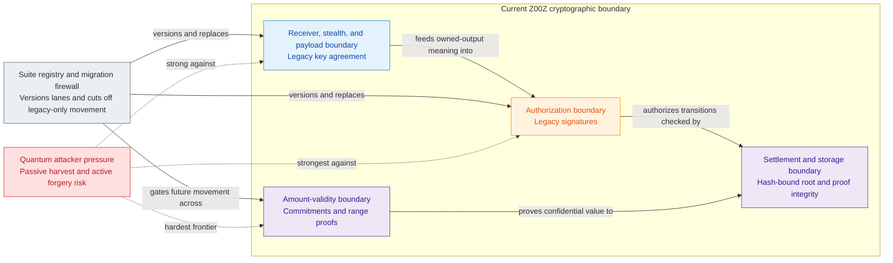

# Z00Z PQ Migration Whitepaper

[TOC]

Version: 2026-07-09

## Key Terms Used In This Paper

This paper uses migration terms that must stay aligned with the main whitepaper, the roadmap, the JMT storage design, and the corpus terminology reference.

- `PQ-friendly boundary`: A protocol surface that relies primarily on hash-bound state, canonical encoding, replay artifacts, or symmetric cryptography rather than elliptic-curve hardness. This is a migration posture, not a claim of full post-quantum security.
- `Legacy lane`: The current elliptic-curve-based transaction lane used by receiver, stealth, authorization, commitment, and range-proof flows.
- `Migration lane`: A suite-versioned lane that carries explicit post-quantum or hybrid cryptographic requirements.
- `Hybrid suite`: A transition suite in which both the legacy path and a post-quantum path contribute to confidentiality or authorization.
- `Integrity firewall`: The rule set that prevents broken legacy cryptography from authorizing new valid settlement after a declared cutover.
- `Rewrap`: A one-way conversion in which a legacy asset right is consumed and reissued under a stronger cryptographic suite.
- `Confidential amount frontier`: The harder migration track for replacing or constraining confidential amount commitments and range proofs under post-quantum assumptions.

## 1. Why This Paper Exists

The main whitepaper already owns the present cryptographic boundary: Z00Z has a concrete ECC-based transaction stack, domain-separated hashing, stealth ownership, range-proof verification, checkpointed replay protection, and narrow public settlement evidence. That paper should not carry a long post-quantum detour.

This paper owns the detour. Its purpose is to explain what can honestly be said today, what fails under a future quantum threat, and how Z00Z can migrate without pretending that one primitive swap solves every layer.

The reader should leave able to answer four questions:

- Which parts of Z00Z are relatively migration-friendly?
- Which parts are still conventional pre-post-quantum cryptography?
- What should the first migration firewall protect?
- What remains a research frontier after the firewall exists?

## 2. Corpus Authority Map

This paper is not a replacement for the other architecture papers.

| Corpus surface | Owns | This paper must not claim |
| --- | --- | --- |
| `Main-Whitepaper.md` | Shipped crypto boundary, `AssetLeaf`, `EncPack`, stealth, range-proof, domain, checkpoint, and replay language | That the current system is already post-quantum secure |
| `Z00Z-HJMT-Design.md` | Storage roots, path proofs, non-existence proofs, and root continuity | That storage roots alone migrate transaction secrecy |
| `Z00Z-Roadmap-Blueprint.md` | Sequencing, maturity gates, and when migration work blocks other work | That PQ migration is one immediate release item |
| `Corpus-Terminology-Reference.md` | Shared naming and scope rules | New migration nouns that conflict with corpus terms |

The central alignment rule is this: Z00Z has a comparatively good settlement and storage boundary for migration, but the live transaction core remains ECC-based.

## 3. Executive Conclusion

Z00Z is not end-to-end post-quantum secure today. That sentence should stay visible.

The stronger and more accurate claim is narrower: Z00Z has a PQ-friendly settlement and storage boundary, because public truth is already organized around checkpointed roots, typed replay artifacts, committed leaves, canonical encodings, and wallet-local possession rather than around a reusable public account table. That helps migration. It does not finish migration.

The current repository already exposes PQ-aware checkpoint controls through
`CheckpointContractConfigV1.post_quantum` and the `plonky3_epoch` checkpoint
branch designation, but those controls harden checkpoint policy rather than
replacing the ECC receiver, authorization, and amount-validity lanes.

The recommended strategy is:

1. make cryptographic suite identity explicit;
2. introduce a hybrid or post-quantum migration lane for new receive and authorization flows;
3. rewrap legacy rights forward into stronger suite-protected outputs;
4. declare a legacy cutoff for new valid settlement;
5. continue the harder confidential amount frontier as a dedicated research and implementation track.

The order matters. A firewall against future legacy authorization failure is more urgent than waiting for a perfect full-stack post-quantum confidential transaction design.

## 4. Current Cryptographic Boundary

The current boundary has three different layers, and they should not be described as if they fail in the same way.

**Figure 4.1 - Cryptographic boundary components.** The migration problem is
easier to reason about once settlement integrity, receiver confidentiality,
authorization, and amount validity are shown as separate but connected
surfaces.



### 4.1 Settlement And Storage Boundary

The settlement and storage boundary is the strongest layer under a post-quantum lens. Checkpoint roots, replay artifacts, typed consumed and created state, canonical path commitments, and finalized public evidence primarily depend on hash-bound or encoding-bound integrity. Quantum attacks reduce some security margins, especially through Grover-style search pressure, but they do not break this layer in the direct way that Shor-style attacks break elliptic-curve discrete-log assumptions.

This is why the paper can say that Z00Z is migration-friendly at the settlement boundary.

### 4.2 Receiver, Stealth, And Payload Boundary

The receiver and stealth layer is weaker under a future quantum threat. Current receive and scan flows depend on elliptic-curve key agreement and public receiver material. The encrypted payload is not just a memo; it carries wallet-recoverable amount data, blinding material, and output-side secret material used by later ownership and replay-sensitive flows.

If a future adversary can break the legacy key-agreement path, historical ciphertext exposure becomes a serious passive risk.

### 4.3 Authorization And Amount-Validity Boundary

The authorization and amount-validity layer is the hardest boundary. Legacy signatures protect authorization. Pedersen-style commitments and elliptic-curve range proofs protect confidential amount semantics. These are not solved by replacing one signature algorithm or adding a post-quantum KEM.

The paper should therefore treat authorization, receiver confidentiality, and amount validity as separate migration tracks.

## 5. Threat Model

### 5.1 Passive Harvest-Now-Decryption-Later

A passive adversary can store public receiver artifacts, output public points, encrypted payloads, proof bytes, and transaction evidence today. If that adversary later gains practical quantum capability against the legacy elliptic-curve assumptions, historical output confidentiality can age badly.

The right mitigation for new outputs is hybrid or post-quantum receiver protection. The right communication boundary is honesty: the firewall protects future activity better than it can retroactively protect every legacy ciphertext.

### 5.2 Active Authorization Failure

An active adversary is more dangerous. If legacy receiver keys, ownership proofs, or spend authorizations remain valid forever, a future break of the legacy lane can become a live theft or forgery problem rather than only a historical privacy problem.

This is the main reason to build the integrity firewall first. Once new valid settlement requires the stronger lane, a broken legacy key no longer grants authority over future state movement.

### 5.3 Amount Integrity Failure

The amount layer cannot be hand-waved away. A system that protects signatures and payload encryption but still depends on broken commitment or range-proof assumptions may still fail value conservation, balance correctness, or confidential amount validity.

This is the confidential amount frontier. It needs its own design path and cannot be closed by changing receiver encryption alone.

## 6. Component Risk Matrix

| Component family | Current role | PQ posture | Migration response |
| --- | --- | --- | --- |
| Checkpoint roots and replay artifacts | Settlement continuity and public finality evidence | Relatively strong | Keep hash choices, canonical encoding, and root binding explicit |
| Storage path commitments and non-existence proofs | State presence, deletion, absence, and root continuity | Relatively strong if hash and commitment choices remain conservative | Version proof formats and roots; preserve root-bound verification |
| Receiver and stealth key agreement | Payload confidentiality and wallet-local recovery | Weak under ECC break | Add hybrid or PQ receive material for new outputs |
| Legacy signatures | Authorization and anti-forgery | Weak under ECC break | Add migration-lane authorization and cutoff legacy-only spends |
| Pedersen commitments and range proofs | Confidential amount hiding, binding, and validity | Mixed to weak as a system | Treat as separate frontier; use constrained lanes where needed |
| Encrypted payloads already published | Historical confidentiality | Residual risk | Communicate honestly; protect new outputs and migrated rights |

## 7. Migration Design Principles

### 7.1 Suite Identity Must Be Explicit

Every protected flow should carry a versioned cryptographic suite identity. A verifier should not guess from context whether an output, receiver artifact, package, proof, or signature belongs to the legacy lane or migration lane.

Suite identity should appear at the right protocol surfaces:

- receiver cards and payment requests;
- output protection policy;
- transaction package and claim package metadata;
- asset or right family policy where relevant;
- checkpoint or settlement evidence when suite generation affects verification;
- wallet export and recovery formats.

### 7.2 No Hidden Downgrade Path

Backward compatibility is useful during migration, but a permanent downgrade path defeats the firewall. Once an asset right has been rewrapped into a stronger suite, the protocol should not let it become a fresh legacy-only output again unless a later governance process deliberately creates a new lane with explicit risk labels.

### 7.3 Settlement History Should Remain Verifiable

Migration should not rewrite old checkpoints. Historical finality should remain anchored in the accepted rules of the time. The migration should add new suite rules for future movement and provide a rewrap path for live value, not pretend that history can be cryptographically edited.

### 7.4 Privacy Should Not Collapse Into Transparent Accounts

The migration must preserve the rights-first model. Z00Z should not solve post-quantum pressure by falling back to public balances, permanent accounts, or visible ownership graphs. If a high-assurance transition lane needs constraints, such as fixed denominations or limited asset families, those constraints should be explicit and local to that lane.

## 8. Recommended Migration Path

### 8.1 Phase 1: Suite Registry And Transcript Binding

The first implementation phase is a suite registry. It should define suite identifiers, supported primitives, allowed combinations, transcript labels, canonical encodings, and rejection behavior for unknown or deprecated suites.

Every migration-lane proof and signature should bind the suite identifier into its transcript or signed message. This prevents a proof or signature from being replayed across lanes with different semantics.

### 8.2 Phase 2: Hybrid Receive And Authorization For New Outputs

New outputs should move first. The migration lane should protect new receiver and authorization flows with standardized post-quantum or hybrid constructions.

The standards direction should remain conservative:

- ML-KEM is the appropriate NIST-standardized family to evaluate for KEM-based receive confidentiality.
- ML-DSA is the appropriate NIST-standardized family to evaluate for high-volume digital signatures.
- SLH-DSA is a conservative NIST-standardized hash-based signature family that may fit lower-frequency governance, recovery, or root-signing roles where size and cost are acceptable.

The document should not claim that these algorithm families automatically solve wallet UX, threshold signing, proof recursion, or confidential amount validity. They are building blocks for specific surfaces.

### 8.3 Phase 3: One-Way Rewrap

Rewrap consumes a legacy output and creates a migration-lane output. It should be a normal settlement transition with explicit old-suite consumption, new-suite creation, replay protection, and wallet recovery material.

The migration should prefer one-way movement:

```text
legacy AssetLeaf -> consumed under old rules -> migration-lane AssetLeaf
```

The old output remains part of history. It should not remain a live spendable object after rewrap.

### 8.4 Phase 4: Legacy Cutoff

At a declared activation point, the protocol stops accepting legacy-only authorization for new valid settlement. This is the integrity firewall.

The cutoff may be staged by asset family, value tier, output age, chain generation, or wallet maturity. But the rule must be unambiguous: after cutoff, a legacy-only proof is not enough to move live value.

### 8.5 Phase 5: Confidential Amount Frontier

The final and hardest phase is replacing or constraining the confidential amount layer. Possible directions include:

- a new post-quantum-friendly commitment and proof stack;
- fixed or tightly bounded denomination lanes for high-assurance assets;
- asset-family-specific transparency or disclosure tradeoffs for selected regulated modes;
- delayed migration of low-risk families until proof costs are practical.

The important point is sequencing. Z00Z can protect future authorization before the full amount frontier is solved, as long as the non-claims are clear.

## 9. Integrity Firewall

The firewall is the main actionable concept in this paper.

### 9.1 What It Achieves

The firewall prevents broken legacy cryptography from authorizing new state movement after the cutoff. That is the most urgent live-value protection because it turns a future ECC break from "attacker can spend new value" into "attacker can attack only lanes the protocol has already retired or explicitly quarantined."

### 9.2 What It Does Not Achieve

The firewall does not retroactively encrypt old payloads under new assumptions. It does not prove that old Pedersen commitments and range proofs are post-quantum safe. It does not make every wallet backup or receiver artifact safe forever. It is a future-validity boundary, not a magic historical repair.

### 9.3 Why It Fits Z00Z

Z00Z is especially suited to this kind of firewall because value movement is already object-oriented and checkpoint-bound. A migration can consume one live right and create a stronger-suite right without rewriting a global account table. The same storage and replay discipline that makes delayed settlement possible also makes suite generation and rewrap semantics easier to express.

## 10. Confidential Amount Frontier

This paper should be blunt: arbitrary confidential amounts are the hardest post-quantum problem in the current architecture.

Three principles should guide the frontier:

- separate amount-hiding from amount-validity;
- do not claim a PQ amount theorem before a concrete proof system exists;
- allow constrained migration lanes if they provide real safety sooner.

A fixed-denomination lane is one plausible transitional tool. It may reduce the amount-validity burden for selected high-assurance use cases, but it also changes UX, privacy-set behavior, and asset policy. It should be treated as an option, not as the universal future of Z00Z.

## 11. Wallet, Recovery, And Operations

Post-quantum migration is not only a verifier change.

Wallets must understand suite generation, receiver material, recovery paths, and rewrap state. Recovery files must not silently restore a user into a deprecated lane without warning. Remote scan, backup, corporate archive, and disclosure packages must all carry enough suite metadata for a verifier to know what assumptions protected the object.

Operators must expose migration-lane metrics and reject-taxonomy data. The roadmap should eventually track how many live outputs remain legacy-only, how many have been rewrapped, which suites are accepted, and which lanes are in warning, deprecated, cutoff, or retired states.

## 12. Communication Guidance

The safe present-tense claim is:

> Z00Z has a PQ-friendly settlement and storage boundary, but its current transaction cryptography is not end-to-end post-quantum secure. The project should migrate through explicit suite versioning, hybrid or post-quantum new-output lanes, one-way rewrap, and a legacy cutoff, while treating confidential amount proofs as a dedicated research frontier.

The unsafe claims are:

- Z00Z is already post-quantum secure.
- Replacing signatures alone solves post-quantum migration.
- A KEM swap protects historical outputs already published under legacy ECDH.
- Current Pedersen commitments and range proofs can be treated as post-quantum safe without a separate argument.
- One backend switch upgrades every property at once.

## 13. Roadmap And Evidence Gates

The migration should not advance by slogan. It needs evidence gates.

| Gate | Required evidence |
| --- | --- |
| Suite registry | Canonical suite IDs, transcript labels, parser behavior, unknown-suite rejection tests |
| Hybrid receive lane | Test vectors for receiver material, payload encryption, scan recovery, and replay binding |
| Migration authorization lane | Signature or authorization verification test vectors and failure taxonomy |
| Rewrap | End-to-end tests showing legacy consumption, migration-lane creation, no downgrade, and checkpoint continuity |
| Cutoff | Activation rules, warning period, wallet migration UX, and post-cutoff legacy-only rejection tests |
| Amount frontier | Benchmarks, proof soundness review, privacy review, and asset-family policy review |

The roadmap should pull this work forward when long-lived value, high-value external assets, or enterprise/corporate modes become more important. It should not wait until after broad adoption to define suite migration.

## 14. Conclusion

The right post-quantum story for Z00Z is neither panic nor overclaim.

Z00Z has a real advantage at the settlement boundary: checkpointed state, typed replay artifacts, committed leaves, and wallet-local possession give it a cleaner migration shape than a public account chain. But the live transaction core still uses conventional elliptic-curve cryptography, and the amount-validity layer remains a hard problem.

The correct path is to build the integrity firewall first, then keep moving the frontier. Suite identity, hybrid new outputs, one-way rewrap, and legacy cutoff protect future validity. The confidential amount layer then becomes an explicit research and engineering track instead of a hidden assumption.

## Appendix A. Glossary

| Term | Meaning | Scope rule |
| --- | --- | --- |
| `Active authorization failure` | A future threat where broken legacy receiver keys, ownership proofs, or spend authorizations can be used to move live value. | Main reason to build an integrity firewall; distinct from passive historical confidentiality loss. |
| `Amount integrity failure` | A failure of value conservation, balance correctness, or confidential amount validity because the amount layer still depends on broken assumptions. | Belongs to the confidential amount frontier; not solved by a signature or KEM swap. |
| `Confidential amount frontier` | The harder migration track for replacing or constraining confidential amount commitments and range proofs under post-quantum assumptions. | Separate from authorization migration and receiver confidentiality. |
| `Cryptographic suite identity` | A versioned identifier that tells verifiers which primitive family, transcript labels, encodings, and lane rules apply to an output, package, proof, or signature. | Must be explicit; verifiers should not infer suite semantics from context. |
| `ECC` | Elliptic-curve cryptography, the conventional assumption family used by the current receiver, stealth, signature, commitment, and range-proof flows. | Current live transaction core, not post-quantum security. |
| `Fixed-denomination lane` | A constrained migration option that reduces arbitrary amount-proof burden by using fixed or tightly bounded values. | Transitional option only; not the universal future of Z00Z. |
| `Hybrid suite` | A transition suite in which both the legacy path and a post-quantum path contribute to confidentiality or authorization. | Migration-lane building block, not a blanket solution to all proof and wallet problems. |
| `Integrity firewall` | The rule set that prevents broken legacy cryptography from authorizing new valid settlement after a declared cutover. | Future-validity boundary; not a historical repair tool. |
| `KEM` | Key-encapsulation mechanism, a primitive family used to establish shared secret material over a public channel. | Useful for receiver confidentiality research; a KEM swap does not protect old legacy-ECDH ciphertexts. |
| `Legacy cutoff` | The activation point or policy after which legacy-only authorization is no longer sufficient for new valid settlement. | May be staged, but the rule must be unambiguous. |
| `Legacy lane` | The current elliptic-curve-based transaction lane used by receiver, stealth, authorization, commitment, and range-proof flows. | Current lane, not a forever-valid authorization path after cutoff. |
| `Migration lane` | A suite-versioned lane carrying explicit post-quantum or hybrid cryptographic requirements. | Future transition path for new outputs and rewrapped rights. |
| `ML-DSA` | Module-Lattice-Based Digital Signature Algorithm. | NIST-standardized signature family to evaluate for high-volume signature roles; not an automatic solution to threshold signing or amount validity. |
| `ML-KEM` | Module-Lattice-Based Key-Encapsulation Mechanism. | NIST-standardized KEM family to evaluate for receive confidentiality. |
| `Passive harvest-now-decryption-later` | A threat where an adversary stores receiver artifacts, public points, encrypted payloads, proof bytes, or transaction evidence now and decrypts or links later after a cryptographic break. | Mainly a confidentiality and historical exposure problem. |
| `PQ-friendly boundary` | A protocol surface that relies primarily on hash-bound state, canonical encoding, replay artifacts, or symmetric cryptography rather than elliptic-curve hardness. | Migration posture, not a claim of full post-quantum security. |
| `Rewrap` | A one-way conversion in which a legacy asset right is consumed and reissued under a stronger cryptographic suite. | Should preserve checkpoint continuity and prevent downgrade. |
| `SLH-DSA` | Stateless Hash-Based Digital Signature Algorithm. | Conservative signature family to evaluate for lower-frequency governance, recovery, or root-signing roles where size and cost are acceptable. |
| `Suite registry` | The versioned registry of suite identifiers, primitive choices, allowed combinations, transcript labels, encodings, and rejection behavior. | First migration phase; unknown or deprecated suites must fail closed. |
| `Transcript binding` | The practice of binding suite identity and lane semantics into signed messages, proofs, or verification transcripts. | Prevents replay across lanes with different cryptographic assumptions. |

## Appendix B. Decision Matrix

| Option | Main action | Main benefit | Residual weakness |
| --- | --- | --- | --- |
| Warning-only | Document current limits and defer migration | Honest communication | No reduction in future live attack surface |
| Hybrid migration lane | Add suite identity and hybrid receive or authorization for new outputs | Protects new activity sooner | Does not solve old ciphertexts or amount proofs |
| Integrity firewall | Add rewrap and cutoff for legacy-only new spends | Prevents broken legacy crypto from authorizing future value movement | Requires wallet migration and activation governance |
| Full confidential redesign | Replace or redesign commitments and amount proofs | Strongest end state | Highest research and performance cost |

## Appendix C. Non-Goals

This paper does not promise a finished recursive post-quantum proof backend. It does not promise a free performance match with the current ECC stack. It does not promise that historical ciphertexts already published under the legacy lane can be made private forever. It does not make the current code post-quantum by renaming future work.

Its purpose is to make the migration logic honest, testable, and compatible with the rest of the Z00Z corpus.
