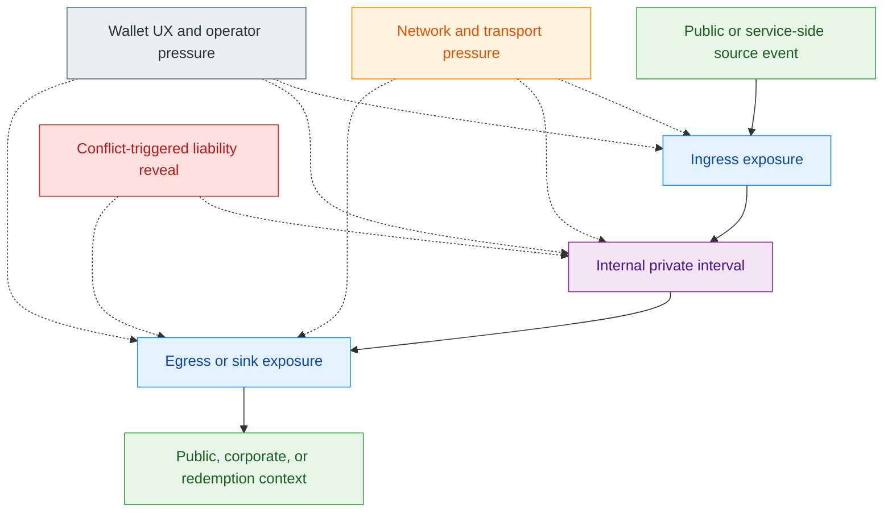
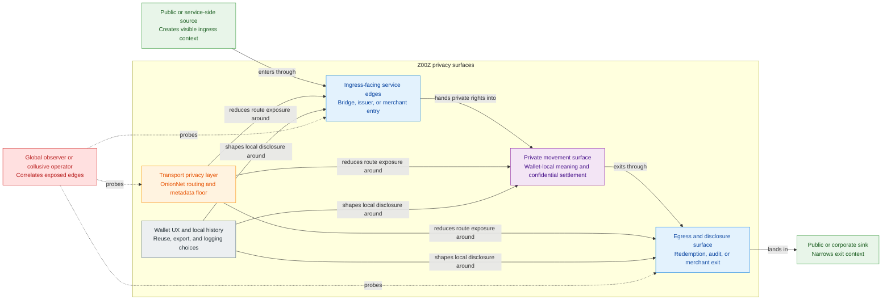
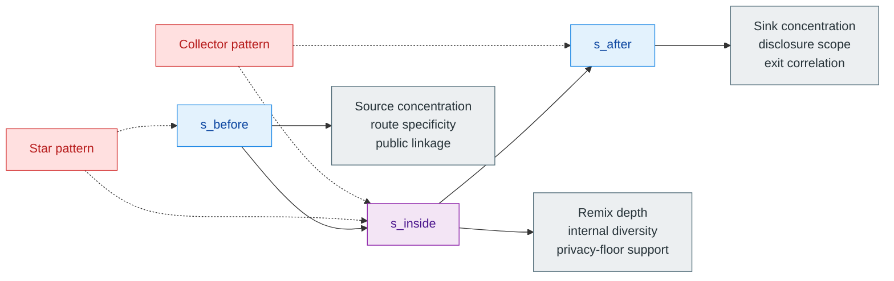
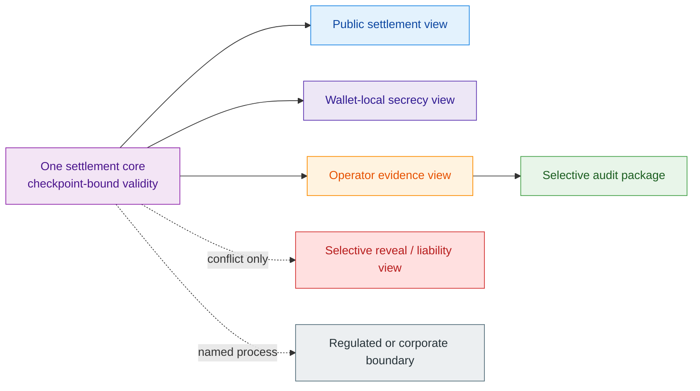

# Z00Z Privacy Threat Model And Metrics

[TOC]

Version: 2026-07-09

## Key Terms Used In This Paper

This paper uses a compact privacy vocabulary because the design depends on
separating protocol-level privacy guarantees from wallet behavior, network
behavior, and operator or bridge-side leakage.

- `Privacy threat model`: The visibility boundary that separates hidden
  wallet-local ownership meaning from public settlement evidence, operational
  metadata, service disclosures, bridge edges, and fraud-triggered reveal.
- `s_before`: The privacy posture of an object before it enters Z00Z or before
  a relevant internal transition begins.
- `s_inside`: The privacy posture created or lost while the object moves inside
  Z00Z.
- `s_after`: The privacy posture after the object exits to an external context
  or becomes associated with a narrower public or service domain.
- `Star pattern`: The anti-pattern in which one operational source creates many
  apparently independent inputs or receipts.
- `Collector pattern`: The anti-pattern in which many private objects collapse
  back into one obvious operational sink.
- `Remix depth`: The bounded measure of how many independent internal contexts
  or transfer steps contribute to unlinkability before publication or exit.
- `Privacy telemetry`: Local or aggregated measurement intended to evaluate
  actual privacy quality without becoming a second authority plane.
- `Exculpability`: The property that no honest wallet, agent, or device can be
  framed by a false fraud proof.

## 1. Why This Document Is Needed

The Z00Z corpus already argues that privacy must be structural rather than
cosmetic. What it does not yet have as one stable document is the formal layer
that explains how privacy can still be degraded by ingress, egress, timing,
wallet UX, operator behavior, network patterns, or selective disclosure.

The missing question is not “does the protocol use private objects.” The
missing question is:

1. what exactly counts as privacy failure in Z00Z;
2. which parts of privacy are protocol guarantees and which are operational;
3. how the project should measure privacy quality honestly instead of relying
   only on category labels such as “private by default.”

### 1.1 Design Thesis

The design thesis of this paper is:

> Privacy in Z00Z is a layered property with explicit threat models,
> anti-patterns, and measurable quality signals across ingress, internal
> movement, egress, wallet behavior, and network assistance, while protocol
> truth remains sharply separated from telemetry and UX guidance.

### 1.2 What This Document Does Not Claim

This paper does not claim that one scalar metric can capture all privacy
properties, or that Z00Z can promise universal network anonymity. It also does
not claim that local telemetry becomes part of consensus or canonical
settlement.

The narrower claim is that the corpus needs one explicit threat-model and
measurement paper so later wallet, OnionNet, auditability, and regulated-flow
work all speak the same privacy language.

### 1.3 Questions This Document Must Answer

This paper is organized around five concrete privacy questions that otherwise
get blurred between protocol claims and operational advice:

1. What exactly counts as privacy failure in Z00Z, and at which layer that
   failure occurs.
2. Which privacy properties are promised by settlement cryptography, which
   depend on wallet behavior, and which depend on transport or OnionNet
   discipline.
3. Which metrics help the project measure privacy quality honestly without
   pretending that one score captures the whole threat model.
4. Which wallet, operator, ingress, egress, and network anti-patterns destroy
   privacy even when confidential objects remain cryptographically hidden.
5. How selective disclosure, regulated flows, and exculpability should coexist
   with private movement without confusing bounded exceptions for general loss
   of privacy.

## 2. Corpus Review And Source Basis

This paper is a corpus-synthesis document. Its job is not to invent a second
privacy architecture. Its job is to gather the privacy boundary already spread
across the Z00Z paper family and restate it as one threat-model document
without widening claims beyond what the corpus already supports.

### 2.1 Live Corpus Sources

- [Z00Z Main Whitepaper](Main-Whitepaper.md)
- [Z00Z OnionNet Whitepaper](OnionNet.md)
- [Z00Z Linked Liability Whitepaper](Linked-Liability.md)
- [Z00Z Agentic Offline Economy Whitepaper](Agentic-Offline-Economy.md)
- [Z00Z Cross-Chain Integration Whitepaper](Cross-Chain-Integration.md)
- [Z00Z Roadmap Blueprint](../tech-papers/Z00Z-Roadmap-Blueprint.md)
- [Z00Z Corpus Terminology And Abbreviations Reference](Corpus-Terminology-Reference.md)

### 2.2 Authority Discipline

For this whitepaper, the source of truth is the `docs/` corpus itself. Archive
notes, planning records outside `docs/`, or old ideation material may still be
useful as prompts for questions, but they do not define what Z00Z is allowed to
claim here.

That discipline matters especially for privacy language. Privacy is one of the
easiest topics to overstate by importing research vocabulary too early or by
treating a future disclosure lane as if it were already live. This paper
therefore follows the authority order already implied across the corpus:

1. current document-backed protocol claims and terminology;
2. explicit non-claims and maturity limits in the live whitepapers;
3. roadmap-backed maturity language for what is live, in progress, or reserved.

### 2.3 Source Roles

The source papers do not all speak about privacy at the same layer. The main
whitepaper anchors the base visibility contract and the difference between
wallet-local possession and checkpoint-bound public evidence. OnionNet anchors
what transport can improve and what it must not overclaim. Linked Liability
anchors how privacy narrows under provable misuse rather than during honest use.
The agentic and machine paper anchors delayed-connectivity rights, offline
receipts, and selective-audit pressure from real operator workflows. The
cross-chain paper anchors ingress and egress truth: public custody, trust tiers,
and the fact that private internal transfer does not erase external route
assumptions.

The roadmap and terminology reference then perform two narrower jobs. The
roadmap constrains maturity language so this paper does not describe reserved or
in-progress disclosure surfaces as already shipped. The terminology reference
keeps this paper aligned with the corpus contract for phrases such as `Privacy
threat model`, `Wallet-local possession`, `Selective audit`, `Selective
disclosure`, `Selective Reveal`, and `Exculpability`.

### 2.4 Critical Questions And Expected Source Owners

The easiest failure mode for this paper would be to blur protocol privacy,
operational privacy, and measurement language into one slogan. The source-owner
split below is meant to prevent that blur.

- `Main-Whitepaper.md` anchors the base privacy model, the stealth
  ownership lane, the public settlement surface, the checkpoint boundary, and
  the corpus definition of `Privacy threat model`.
- `OnionNet.md` anchors network-origin privacy, client-owned
  route construction, bounded topology disclosure, low-load privacy floors, and
  the non-claim against a fully global observer.
- `Linked-Liability.md` anchors fraud-triggered narrowing of
  privacy, `Selective Reveal`, `Exculpability`, and the rule that punishment
  should bind to a `LiabilityDomain` rather than to a public account identity.
- `Agentic-Offline-Economy.md` anchors machine and
  agent workflows where private rights, offline receipts, selective audit, and
  delayed reconciliation create real operational pressure on privacy.
- `Cross-Chain-Integration.md` anchors ingress, egress, trust
  tiers, external custody and issuer assumptions, and the claim that Z00Z
  privately moves rights while outside systems still own redemption truth.
- `Z00Z-Roadmap-Blueprint.md` anchors maturity language so the paper stays
  honest about what is live, what is still in progress, and which surfaces
  remain target architecture.
- `Corpus-Terminology-Reference.md` anchors term discipline and prevents
  this paper from collapsing distinct notions such as `Selective disclosure`,
  `Selective audit`, and `Selective Reveal` into one vague synonym.

### 2.5 Temporary Planning Inputs And Appendix Transfer

Temporary notes under `.planning/temp/ideas-docs` are not live corpus authority
for this paper. They were used only as design pressure to ask whether the
privacy threat model was missing an operational risk, maturity warning, or
appendix-level guardrail. Any retained material from those notes is rewritten
inside Appendices B-D so the reader does not need to consult the temporary
planning directory.

The retained pressure points are deliberately narrow: data-minimization and
retention boundaries, helper and thin-lane metadata risk, receipt and relay
evidence as support data rather than settlement truth, conflict evidence that
must preserve `Exculpability`, and multi-view disclosure that must not become a
visible second privacy mode. Provider choices, concrete proof systems,
standalone article references, benchmark claims, and speculative APIs from the
temporary notes are not imported as Z00Z claims.

## 3. Privacy Scope And Security Model

In the Z00Z corpus, privacy is not the claim that nothing is visible. It is the
claim that the public layer should expose only the settlement evidence needed
for replay-safe verification, while the private meaning of ownership, rights,
budgets, and local acceptance stays outside the reusable public account model.

This means the security model must track more than chain observers alone.
Privacy can weaken at the wallet boundary, at deposit and redemption edges, in
publication timing, in transport metadata, through selective audit or selective
reveal, or through careless operator and UX choices. The protocol therefore
needs a layered threat model rather than one blanket label such as "private by
default."

### 3.1 Privacy Dimensions

The first privacy dimension is **holder and counterparty graph privacy**. Z00Z
does not want a reusable public balance table or a stable public account
surface. The strongest live expression of that goal is the stealth ownership
lane described in the main whitepaper: a public observer can see settlement
objects and checkpointed evidence, but not the wallet-local meaning of ordinary
ownership.

The second dimension is **receiver privacy**. The receiver path is built around
signed `ReceiverCard` and `PaymentRequest` surfaces rather than around a
permanent public receive address. That improves privacy relative to transparent
account systems, but it does not eliminate disclosure to the payer, to any
service that receives those artifacts, or to later publication flows if a
receiver-card record is intentionally made public.

The third dimension is **amount confidentiality**. Confidential amounts,
encrypted packs, and wallet-local recovery hide decrypted amount meaning from
ordinary public settlement observers. At the same time, the corpus is explicit
that amount secrecy is not a theorem against all heuristics. Exact-value entry
and exit events, service-side records, and voluntary disclosures can still
narrow privacy around an otherwise confidential internal object.

The fourth dimension is **timing and flow unlinkability**. Asynchronous rights
settlement, delayed publication, batching, and optional OnionNet transport are
all useful because they widen the gap between local economic action and public
checkpoint evidence. But the corpus also warns that timing, sparse-load
networking, exact deposit and redemption windows, and one obvious sink or one
obvious source can still recreate operational linkage around a confidential
core.

The fifth dimension is **policy and rights confidentiality**. Z00Z is not only
about hiding who owns a coin. It is also about keeping the private meaning of a
right, budget, voucher, claim, or capability wallet-local until the workflow
requires a narrower reveal. That matters especially for machine and agent flows,
where a public delegated account would leak far more strategy and behavior than
the corpus wants to expose.

The sixth dimension is **auditability and selective disclosure**. The corpus
does not treat all disclosure surfaces as the same. `Selective disclosure` is
the broad scoped-visibility concept. `Selective audit` is the operator or
enterprise evidence mode. `Selective Reveal` is the liability-specific
fraud-triggered narrowing of privacy. Keeping those three separate is part of
the privacy model itself.

The seventh dimension is **exculpability under disputes or misuse**. A privacy
system is weaker than it appears if an honest wallet, agent, or machine can be
framed by fabricated conflict evidence. Linked Liability therefore treats
`Exculpability` as a first-class privacy and safety property: misuse should
become attributable and punishable, but only against the domain that actually
caused the conflict.

### 3.2 Adversary Classes

Several adversary classes matter because the Z00Z privacy claim is layered.

| Adversary | Main observation surface | What this paper should claim |
| --- | --- | --- |
| Passive settlement observer | Leaves, commitments, proof bytes, roots, deltas, and checkpoint timing | Can see public settlement evidence, but not wallet-local ownership meaning or decrypted amount contents |
| Service operator, aggregator, or publisher | Admission timing, retries, batching, publication records, and provider signals | Can correlate workflow timing and service-side metadata, but does not become settlement truth |
| Wallet software leak or compromised device | Receiver material, local history, scan results, memos, receipts, and audit exports | Can destroy privacy at the possession boundary even if the settlement layer remains confidential |
| Bridge, locker, issuer, exchange, or redemption counterparty | Deposits, custody events, reserve routes, redemptions, and compliance logs | May correlate entry and exit edges or asset-family identity, but does not automatically see the internal private transfer graph |
| Network observer, bridge, relay, or exit | Ingress timing, packet classes, route-intent leaks, sparse-load behavior, and topology metadata | OnionNet can improve sender-origin privacy and route ownership, but it does not promise universal anonymity |
| Colluding counterparties or fraud participants | Reused receive artifacts, local receipts, conflicting offline use, and later conflict evidence | Can force bounded reveal or liability activation if misuse is proven, but the system should not generalize that reveal into ordinary-path transparency |

The corpus also keeps one network non-claim explicit: Z00Z should not promise
safety against a fully global adversary that can observe ingress, middle-hop,
and exit timing at unlimited resolution. That limit is not a defect in the
paper. It is part of the paper's honesty.

## 4. Layered Threat Model

The privacy threat model becomes clearer when it is read as a sequence of
boundary crossings. Privacy can weaken before a right enters Z00Z, while it is
moving internally, when it exits back into a public or operationally narrow
environment, through the transport layer, or through wallet and operator
behavior that widens disclosure around an otherwise confidential object.

**Figure 4.1 - Layered privacy pressure map.** The main value of this view is
that it keeps the private interval, the public edges, and the cross-cutting
wallet and transport pressures visible in one reading frame.

### 4.1 Ingress And Source Exposure

Ingress is the point where Z00Z inherits whatever public context already exists
outside it. The cross-chain paper is explicit that external systems keep
custody, issuer, liquidity, identity, and redemption surfaces where those
surfaces already exist. That means a deposit, lock, burn, attestation, or
issuer-side creation event may already carry visible source identity, exact
amount, route choice, or service-side records before any private internal
transfer begins.

For externally backed assets, the main ingress leakage comes from public custody
edges: deposit address reuse, exact-value deposits, narrow time windows, and
route-specific issuer or locker logs. For issuer-native or service-defined
rights, the ingress leakage may instead come from application-side identity,
merchant records, policy approvals, or coordination-layer attestations. In both
cases, the risk is the same: if the source event is too narrow or too
distinguishable, the private interval begins with an already clustered object.

The honest claim is therefore that Z00Z can create a private interval after
ingress, not that it can erase the visibility of the source event that created
the right. Privacy at ingress is strongest when the user avoids one-to-one
mapping between a named external event and an immediately recognizable internal
right, and when route-specific trust assumptions remain visible without
revealing more operational data than the workflow actually needs.

### 4.2 Internal Movement

Internal movement is the strongest privacy lane in the corpus because this is
where wallet-local possession, checkpointed settlement, and confidential object
structure do their real work. Z00Z does not ask the public chain to expose a
reusable public ownership table. Instead it publishes committed settlement
objects, package-linked evidence, and checkpoint roots while the wallet retains
the private meaning of ownership and the decrypted amount path.

But internal privacy is still not automatic. The main paper, the agentic paper,
and the linked-liability paper together imply several internal pressure points:
repeated reuse of the same receive surfaces, aggressive merge or split behavior
that recreates recognizable patterns, thin delayed-connectivity lanes, provider
receipts that become too tightly bound to one publication event, and conflicting
offline use that later activates liability-specific reveal.

The important distinction is that ordinary internal movement should stay on the
honest-path privacy lane, while misuse should trigger a narrower
fraud-and-liability path. If those paths are collapsed, the system drifts toward
public accountability by default. If they remain separated, Z00Z preserves the
central corpus promise: private movement first, bounded proof-triggered
attribution only when conflict actually occurs.

### 4.3 Egress And Sink Exposure

Egress is where the private interval ends and a narrower outside context begins.
An internal right may leave through a bridge exit, a locker redemption, an
issuer redemption path, a corporate audit workflow, a merchant acceptance lane,
or one obvious treasury sink. At that moment, the question is no longer only
"was the internal movement confidential." The question becomes "how much of
that internal movement is now inferable from the exit shape."

The cross-chain paper names several recurring egress risks directly: exact-value
redemptions after short private windows, immediate public redemption when a more
batched exit was available, and service or merchant logs that can be joined too
easily to route-visible custody events. The same issue appears in enterprise and
agent workflows where a selective audit package or a compliance export is
legitimate, but a whole transfer lineage would be over-disclosure.

Z00Z therefore has to treat egress concentration as a first-class privacy risk.
Many internally private transfers can collapse back into one obvious public or
corporate sink even when the settlement layer itself never exposed a reusable
public account graph. Privacy is strongest in the internal interval and
weakest at narrowly named exit points.

### 4.4 Network And Transport Exposure

The settlement layer and the transport layer protect different things. The
settlement layer hides wallet-local ownership meaning from ordinary public state
observers. The transport layer is responsible for reducing sender-origin
exposure, route-intent leakage, and the risk that a public ingress surface
quietly becomes a hidden topology authority.

OnionNet improves this boundary by insisting on public membership, deterministic
epoch views, client-owned route construction, bounded topology disclosure, and a
double-envelope model that tries to keep canonical payload meaning away from the
exit. These are meaningful privacy improvements, but they are scoped
improvements. OnionNet does not abolish timing analysis, sparse-load
degradation, bridge observation, or every possible metadata leak across witness
retrieval, packet classes, and low-load route contraction.

The corpus therefore supports a precise transport claim: network discipline can
materially improve origin privacy and route ownership, but transport privacy is
still conditional on route diversity, replay durability, traffic-shape floors,
and honest non-claims about what a global or highly collusive observer can
still infer.

### 4.5 Wallet UX And Operator Exposure

Wallet UX and operator behavior decide whether protocol privacy survives contact
with real usage. A wallet can preserve privacy by keeping ownership meaning
local, redacting secrets and memos in logs, separating settlement evidence from
wallet-local view material, and presenting disclosure states intentionally as
`Present`, `Redacted`, or `Unavailable`. The same wallet can also destroy
privacy through receive-artifact reuse, broad audit exports, verbose local
history, careless memo handling, or merge behavior that creates easy operational
patterns.

Operator surfaces create the same tension. Publication records, provider
signals, retry logs, verdict metadata, bridge monitoring, and redemption support
systems are often operationally necessary. But if those systems silently become
the richest privacy dataset in the stack, the protocol's public confidentiality
claim becomes less relevant in practice than the surrounding service graph.

This is why the privacy paper cannot stop at cryptography. It has to include UX
and operator discipline as part of the threat model itself. In Z00Z, privacy is
not only a property of the committed leaf. It is also a property of how the
wallet packages, scans, stores, exports, retries, and explains that leaf.

**Figure 4.2 - Privacy boundary containers.** The pressure map becomes easier
to operationalize once ingress, private movement, egress, wallet UX, and
transport are shown as distinct but interacting surfaces.

## 5. Privacy Metrics And Quality Signals

The corpus does not support one universal privacy score, and this paper should
not pretend otherwise. What it can support is a set of descriptive quality
signals that help wallets, simulators, operators, and future QA flows evaluate
where privacy is strong, where it is degraded, and whether a workflow is
drifting toward a visibly narrow pattern.

These signals are diagnostic only. They do not become consensus truth, they do
not widen the settlement theorem, and they do not override the maturity
boundary between shipped behavior and target architecture.

**Figure 5.1 - Stage-based privacy signals.** This diagram is useful because it
shows the intended reading order of `s_before`, `s_inside`, and `s_after`
without implying that the three stages collapse into one scalar score.

### 5.1 Stage-Based Privacy Signals

The most disciplined way to describe privacy quality across the corpus is by
stage rather than by one scalar verdict.

- `s_before` describes the privacy posture before a right enters Z00Z or before
  a relevant internal transfer begins. It is dominated by source-side context:
  deposit shape, issuer approval, bridge logs, service identity, or prior
  public linkage.
- `s_inside` describes the privacy posture during wallet-local possession,
  internal private movement, delayed publication, and checkpoint-bound
  settlement. This is the stage where Z00Z's core privacy design does the most
  work.
- `s_after` describes the privacy posture after the right exits into a narrower
  public, service, corporate, or redemption domain, or after a bounded
  disclosure path has been used.

These stage labels are intentionally descriptive. They help the project say
that one workflow may have a strong internal privacy interval while still having
weak ingress or weak egress privacy. They should never be narrated as if they
were three protocol guarantees or three objective numeric scores.

### 5.2 Remix Depth And Internal Diversity

`Remix depth` is useful in this paper only as a local analytic label for how
many distinct internal transfer or batching contexts separate ingress from
egress. A deeper internal interval can improve unlinkability because it inserts
more private state transitions between the public source event and the public or
service-side sink event.

But remix depth is not a theorem. More steps do not help if the same operator,
the same narrow exit, the same repeated receiver surface, or the same sparse
network topology dominates the whole path. For that reason, depth should be read
together with diversity signals: how many distinct internal packages, batching
contexts, route options, or counterparties contributed to the private interval,
and whether the OnionNet privacy floor or the wallet's own usage patterns
actually supported that diversity.

The correct corpus-aligned claim is therefore modest: internal depth and
diversity can improve privacy quality, but only when they widen the set of
plausible internal histories rather than merely elongating one recognizable
story.

### 5.3 Concentration And Collapse Metrics

This paper introduces `Star pattern` and `Collector pattern` as descriptive QA
labels for concentration behavior that the corpus repeatedly warns about even
when it does not give those patterns one fixed name.

A `Star pattern` is the case where one visible source creates many apparently
independent internal objects or receipts in a way that still leaves a strong
operational clustering signal. A `Collector pattern` is the reverse: many
internally private objects collapse back into one obvious public or service-side
sink. Both patterns matter because they can make a confidential transfer system
look operationally narrow from the outside.

The corresponding metrics should stay simple and local:

- concentration of ingress from one route, issuer, or custody edge;
- concentration of egress into one bridge, treasury sink, or compliance lane;
- repeated use of one receiver or request surface across many flows;
- short-window exact-value entry and exit correlation;
- dependence on one operator or one thin network lane where alternative route
  diversity was low.

These are not new protocol objects. They are diagnostics for wallets,
simulators, and future telemetry so the project can notice when a workflow is
quietly rebuilding the very visibility graph that the core protocol was meant to
avoid.

### 5.4 Exculpability And Misuse Metrics

The final metric family is about misuse boundaries rather than ordinary-path
unlinkability. Linked Liability makes two privacy claims at once: honest use
should preserve hidden responsibility domains, and proven misuse should reveal
only enough to punish the right scope. Metrics at this layer should therefore
ask whether a workflow preserves `Exculpability` and whether its reveal path is
truly bounded.

Useful questions include:

- Can a false or malformed conflict artifact frame an honest wallet, agent, or
  device?
- Does reveal stay attached to the relevant `LiabilityDomain`, `BondRef`, and
  `PenaltyPolicy`, or does it spill into unrelated wallet history?
- Do selective-audit or support exports over-disclose compared with the actual
  dispute or review need?
- Does a `Future Rights Freeze` remain domain-scoped, or does it widen toward a
  de facto public-account punishment model?

This paper should remain equally clear about the non-claim. The corpus does not
yet justify a broad promise of general-purpose deanonymization of bad actors. It
supports bounded, proof-triggered reveal where a specific liability or dispute
mechanism was designed to allow it.

## 6. Anti-Patterns And Forbidden Design Shortcuts

The corpus already implies that privacy fails less often through broken
cryptography than through bad simplifications around visibility, timing,
receiver handling, and service operations. This section names the shortcuts that
the privacy model should reject explicitly so later wallet and operator work
does not quietly recreate a public graph around a confidential core.

### 6.1 Structurally Distinguishable Privacy Modes

If a privacy-preserving flow becomes a visibly special transaction family, the
system has already leaked one of the most important facts about the user's
behavior: that this transfer was on the privacy lane rather than on the ordinary
lane. The main whitepaper and the agentic paper both point toward a different
architecture. Z00Z should have one settlement core with multiple observer views,
not two visibly separate economic products where one advertises that privacy was
requested.

That does not mean every workflow must look identical. Selective audit,
selective reveal, externally backed routes, and corporate or regulated surfaces
can legitimately add narrower disclosure contexts. But those should be described
as workflow-specific visibility policies layered over one settlement theorem,
not as a second public-facing transaction species that turns "used privacy" into
its own metadata signal.

The anti-pattern to reject is therefore simple: do not make ordinary privacy
depend on entering a publicly recognizable special lane if the same settlement
contract can carry that workflow without such a distinction.

### 6.2 Star And Collector Patterns

`Star pattern` and `Collector pattern` should be treated as first-class
anti-patterns because they compress the most common operational ways privacy
quietly collapses.

The `Star pattern` appears when one source fans out into many internally
private-looking objects while staying recognizably tied to one ingress route,
issuer event, treasury operation, payroll batch, or merchant workflow. The
`Collector pattern` appears when many internal objects collapse back into one
obvious bridge exit, treasury sink, compliance queue, settlement desk, or
merchant acceptance endpoint.

Both patterns matter because they preserve clustering even when the internal
transfer mechanics remain confidential. They should therefore feed three kinds
of controls:

- wallet guidance that warns when a user is repeatedly entering or leaving
  through one narrow route;
- simulator and QA scenarios that check whether a workflow creates obvious
  source or sink concentration;
- local or aggregated telemetry that surfaces concentration without creating a
  new public authority plane.

### 6.3 Merge, Timing, And Exit Anti-Patterns

Several additional shortcuts deserve explicit rejection because they make the
system look more private in theory than in practice.

Aggressive merge behavior is the first. If many distinct rights are repeatedly
collapsed into one immediately publishable package or one named redemption flow,
the user may be rebuilding a recognizable ownership graph in wallet behavior
even while public settlement stays leaf-oriented. Immediate exact-value exit
after ingress is the second. A short private interval does not neutralize a
highly specific source-to-sink correlation. Reuse of the same receiver or
request surfaces across many related flows is the third. It weakens receiver
privacy even when the chain never sees a permanent public address.

The transport layer adds its own anti-patterns: publishing thin routes under
sparse load, accepting hidden bridge-selected paths instead of client-owned
route construction, or narrowing witness retrieval so much that route intent
becomes visible to the helper layer. The operator layer adds another set:
overbroad audit exports, verbose support logs, and provider metadata that
reconstructs more of the economic graph than public settlement ever would.

The shared rule is that privacy should not be evaluated only at the object
format. It has to survive the workflow.

## 7. Wallet And UX Requirements

The threat model only becomes useful once the wallet turns it into user-visible
discipline. Z00Z wallets should not merely hold private objects. They should
help the holder understand when a workflow is staying inside the strong privacy
lane, when it is entering a narrower disclosure context, and when operational
behavior is undoing protocol-level privacy.

### 7.1 User-Facing Guidance

The wallet should prefer stage-aware guidance over one misleading scalar score.
The most useful user-facing indicators are the ones that explain *where* privacy
is weak rather than pretending to summarize the whole threat model with one
number.

Examples of useful guidance include:

- whether the current flow is dominated by a public or service-visible ingress
  event;
- whether the user is reusing the same receiver or request surface too broadly;
- whether the right is headed toward a highly concentrated or exact-value exit;
- whether the flow has entered a selective-audit, corporate, or regulated view;
- whether the transport layer is below the privacy floor or running on a thinner
  helper path than the user expects.

The wallet should also explain disclosure mode explicitly. A user should know
when they are staying on the wallet-local secrecy lane, when they are producing
an operator or auditor evidence package, and when a workflow contains a
liability-triggered reveal path in the event of proven misuse.

### 7.2 Safe Defaults

Safe defaults follow directly from the anti-patterns above. Wallets should bias
toward fresh receive material where the workflow allows it, conservative merge
behavior, redacted local logs, narrow disclosure packages, and clear separation
between settlement evidence and wallet-local meaning.

On the publication side, safe defaults should avoid creating needless timing
signatures. A wallet should not eagerly teach users that immediate exact-value
exit or exact one-to-one retry behavior is harmless. On the disclosure side, it
should not treat "auditable" as a synonym for "export everything." On the
transport side, it should fail closed or warn clearly when helper routing or
low-load conditions narrow the privacy posture below the intended floor.

The same principle applies to machine and agent wallets. A bounded rights wallet
should not default into broad operational logs, permanent route labels, or
always-on evidence exports merely because those are convenient for service
operators.

### 7.3 Privacy QA Hooks

The wallet and simulator need explicit QA hooks for privacy regressions, not
only for correctness regressions. At minimum, the project should be able to
exercise:

- repeated-ingress and repeated-egress concentration scenarios;
- merge and split behaviors that may recreate recognizably narrow patterns;
- receiver-card and payment-request reuse scenarios;
- exact-value and short-window entry or exit correlation scenarios;
- selective-audit and support-export boundary tests;
- thin-lane and helper-metadata scenarios for OnionNet or later ingress layers;
- liability-triggered reveal tests that confirm domain-scoped punishment and
  preserve `Exculpability`.

These hooks are important because privacy failures often appear first as product
defaults, not as consensus bugs.

## 8. Network, OnionNet, And Helper Boundaries

The transport layer is part of the privacy model, but it is not the whole
privacy model. This section narrows what OnionNet and helper routing can
honestly claim and where those claims stop.

### 8.1 What OnionNet Should Improve

OnionNet should improve the parts of privacy that the settlement layer cannot
reach directly. Its strongest goals are to reduce sender-origin exposure at
ingress, remove hidden topology authority from ordinary route construction,
support bounded topology disclosure, and keep route-specific metadata from
becoming a trivial leak about user intent.

The OnionNet paper also points to a narrower confidentiality improvement:
payload meaning should begin as late as possible. The double-envelope model
tries to keep canonical payload semantics away from the exit so transport unwrap
does not automatically become semantic observation. If that boundary can be
frozen safely, it is a real improvement over simpler relay models.

More broadly, OnionNet should make low-load privacy explicit. Sparse traffic,
route contraction, and cover-budget decisions are privacy events, not just
throughput events. That honesty is part of the value of the design.

### 8.2 What OnionNet Must Not Overclaim

Even a mature OnionNet would not replace settlement privacy, wallet discipline,
or ingress and egress caution. It would also not justify broad claims of
perfect anonymity. The source paper is explicit that public membership remains
visible enough for deterministic selection, that low-load conditions can still
degrade privacy, and that a fully global observer remains outside the defended
scope.

OnionNet must also not overclaim helper neutrality. A bridge, mirror, or
witness-distribution surface is useful only if it does not quietly become the
real end-to-end route authority. Likewise, transport privacy must not be used to
paper over weak disclosure discipline at the wallet, issuer, bridge, or
corporate layers.

The correct non-claim is therefore important: OnionNet can improve network
privacy materially, but it cannot turn every externally visible asset route,
service workflow, or disclosure policy into an unlinkable system by itself.

## 9. Auditability, Disclosure, And Regulated Flows

Privacy in Z00Z is not opposed to bounded disclosure. The corpus repeatedly
argues for a narrower proposition: private movement should remain the default
economic model, while disclosure should be scoped, purpose-bound, and attached
to a specific review, audit, redemption, or liability need.

**Figure 9.1 - Bounded disclosure over one settlement core.** This view helps
the reader keep the central corpus rule in mind: disclosure widens who can see a
workflow-specific slice of evidence, but it does not create a second settlement
theorem.

### 9.1 Selective Disclosure

The acceptable disclosure model in the current corpus is multi-view rather than
universally transparent. One settlement core can support a public settlement
view, a wallet-local secrecy view, and a narrower operator or auditor evidence
view without turning those views into one public ownership graph.

In practice, that means disclosure should be tied to a bounded purpose and a
bounded audience. A counterparty may need a payment request or receive artifact.
An operator may need publication and verdict evidence. An enterprise or auditor
may need a selective audit package showing policy compliance. A liability
workflow may need selective reveal under provable fraud or another explicitly
designed liability-conflict path. None of those needs
require universal publication of the holder's full private history.

The key architectural rule is that disclosure policy should widen who can see a
workflow-specific slice of evidence without redefining what counts as valid
settlement. That is why the corpus keeps audit wrappers and richer disclosure
surfaces outside canonical committed artifact bytes.

### 9.2 Regulated Pools, Corporate Flows, And External Boundaries

When an asset or right enters a regulated, corporate, or otherwise operationally
narrow context, the privacy question changes. It is no longer only "what can a
public observer infer." It also becomes "which named operator, issuer,
employer, merchant, or regulator is intentionally inside the disclosure loop."

Z00Z can still preserve a private interval inside such workflows. Payroll,
enterprise agent budgets, corporate settlement, issuer-native assets, and
externally backed stable assets can all benefit from private internal movement
before reconciliation or redemption. But the paper should not pretend that once
the holder voluntarily enters a named redemption or compliance process, the
workflow remains invisible to that designated process.

The right way to present these flows is therefore with explicit boundary
language. Privacy remains strong relative to public-account systems because the
whole ownership graph need not become public. At the same time, route-specific
trust tiers, issuer assumptions, enterprise policy, and review obligations must
remain visible where they actually matter.

## 10. Telemetry, Evaluation, And Acceptance Criteria

Telemetry is useful only if it helps measure privacy quality without becoming a
second authority plane. The corpus already separates wallet-local meaning,
public settlement evidence, and optional operator evidence. Telemetry should
respect the same separation.

### 10.1 Privacy Telemetry Scope

The safest telemetry posture is to keep the richest privacy measurements local
to the wallet or simulator whenever possible. Stage-based indicators,
concentration warnings, merge or exit anti-pattern alerts, and disclosure-mode
markers are most useful when they inform the holder or the test harness without
creating a new shared behavioral dataset.

Some higher-level aggregation may still be valuable for system QA. Examples
include counts of thin-lane incidents, frequency of route contraction, number of
flows that entered selective-audit mode, or aggregate concentration warnings by
workflow class. But even aggregated telemetry should avoid exporting stable
receiver graphs, decrypted amounts, raw memos, route-intent data, or any
artifact that recreates wallet-local meaning outside its intended boundary.

The rule this paper should enforce is simple: telemetry may describe privacy
quality, but it must never silently become a richer ownership ledger than the
protocol itself.

### 10.2 Required Test And Simulation Classes

The acceptance path for this paper should include explicit privacy test classes.

- `Wallet anti-pattern tests`: repeated receiver surface reuse, careless merge
  patterns, immediate exact-value exit, verbose history or memo exposure, and
  overbroad disclosure export scenarios.
- `Simulator privacy-regression scenarios`: entry-to-exit correlation cases,
  machine and agent receipt clustering, batch-shape narrowing, and one-sink
  collapse scenarios.
- `Metric-stability checks`: confirm that stage labels and concentration signals
  stay descriptive and do not drift into misleading composite certainty claims.
- `Exit-pattern and merge-pattern scenarios`: prove that QA can detect star,
  collector, and immediate-collapse behavior.
- `Helper or OnionNet metadata-leak tests`: witness retrieval narrowness,
  sparse-load route contraction, transport replay edge cases, and helper-side
  route-intent leakage.
- `Disclosure-boundary tests`: selective audit packages, liability-triggered
  reveal, and domain-scoped freeze behavior that preserves `Exculpability`.

## 11. Open Questions

Several questions remain intentionally open after this pass.

- Whether the project wants any composite privacy score at all, or whether
  stage-based and orthogonal signals are safer and more honest.
- How aggressively wallets should surface privacy warnings without teaching
  users a false sense of precision.
- What minimum OnionNet maturity must be reached before network-origin privacy
  claims widen beyond the current narrow statement.
- How selective audit packages should be standardized without letting enterprise
  disclosure become a shadow public ledger.
- How to measure ingress and egress concentration without collecting so much
  telemetry that the measurement system becomes the new privacy leak.
- How strong the exculpability bar must be before any broader delayed-connectivity
  rights lanes should be treated as user-ready.
- How future liability and disclosure systems should interact with externally
  backed assets, issuer-native assets, and synthetic internal units whose
  outside obligations differ materially.

## 12. Conclusion

Privacy in Z00Z is strongest when the project treats it as a layered visibility
contract rather than as a slogan attached to confidential objects. The corpus
already supports that view. Wallet-local possession, checkpoint-bound settlement
evidence, network-origin protection, selective audit, selective reveal, trust
tiers, and exculpability all belong to one privacy story, but they do not
belong to one undifferentiated claim.

The practical consequence is straightforward. Z00Z should measure privacy by
layer, name the anti-patterns that destroy it in practice, keep disclosure
scoped and purpose-bound, and remain explicit about which parts of the privacy
story are live today and which remain future architecture. That is how the
corpus can stay privacy-first without becoming conceptually blurry.

## Appendix A. Glossary

This appendix expands the paper-local vocabulary. Where a term already has a
broader corpus authority, that authority still governs the shared meaning. The
entries below record how this paper uses the term in its threat-model context.

| Term | Meaning in this paper | Scope note |
| --- | --- | --- |
| `Privacy threat model` | The visibility boundary that separates hidden wallet-local ownership meaning from public settlement evidence, operational metadata, service disclosures, bridge edges, and fraud-triggered reveal. | Canonical shared corpus term anchored by the main whitepaper and the terminology reference. |
| `Wallet-local possession` | Ownership material and transfer preparation that remain in the wallet before publication. | Core Z00Z possession boundary. |
| `Asynchronous rights settlement` | The architecture in which wallet-local possession and local acceptance may precede publication, while authoritative settlement remains checkpoint-bound and replay-safe. | Shared corpus term for the broader rights pattern behind private cash, claims, machine rights, and agent budgets. |
| `Selective disclosure` | The broad scoped-visibility concept under which a workflow reveals only a bounded slice of evidence to a bounded audience. | Distinct from `Selective audit` and `Selective Reveal`. |
| `Selective audit` | The operator, enterprise, attester, or reviewer evidence mode that reveals only the minimum evidence needed for a named review purpose. | Agentic-paper authority term reused here. |
| `Selective Reveal` | The liability-specific property that liability information stays hidden in the honest case and becomes revealable only under provable fraud. | Linked-Liability authority term reused here. |
| `Exculpability` | The property that no honest wallet, agent, or device can be framed by a false fraud proof. | Linked-Liability authority term reused here. |
| `s_before` | The descriptive privacy posture before a right enters Z00Z or before the relevant internal movement begins. | Local analytic stage label; not a protocol guarantee. |
| `s_inside` | The descriptive privacy posture during internal private movement, delayed publication, and checkpoint-bound settlement. | Local analytic stage label; strongest expression of the core privacy design. |
| `s_after` | The descriptive privacy posture after exit, redemption, selective audit, or another narrower disclosure context. | Local analytic stage label; not a failure by itself, but often a narrower privacy state. |
| `Remix depth` | The bounded descriptive measure of how many distinct internal transfer or batching contexts separate ingress from egress. | Local quality signal only; more depth does not automatically imply stronger privacy. |
| `Star pattern` | The anti-pattern in which one visible source fans out into many apparently independent internal objects or receipts while preserving operational clustering. | Local QA label introduced by this paper. |
| `Collector pattern` | The anti-pattern in which many internally private objects collapse back into one obvious public or service-side sink. | Local QA label introduced by this paper. |
| `Privacy telemetry` | Local or safely aggregated measurement used to evaluate privacy quality without becoming a second authority plane. | Must not recreate a richer ownership ledger than the protocol itself. |

## Appendix B. Absorbed Temporary Planning Inputs

This appendix absorbs the useful pressure from temporary planning notes under
`.planning/temp/ideas-docs` so this whitepaper is self-contained. The temporary
notes are not cited as authority. Each retained idea below has been rewritten
against the live `docs/` corpus and current code surfaces.

| Temporary planning pressure | Rewritten conclusion for this paper | Authority boundary |
| --- | --- | --- |
| Data minimization and "burn after reading" language | Z00Z should minimize retained helper, operator, and support data around private objects. Wallet history, scan state, receipts, and exports should remain local or purpose-bound wherever possible. | This is a retention and UX discipline, not a live cryptographic deletion guarantee. |
| Off-chain branch, DAG, or room-state analogies | Delayed-connectivity flows may have local histories, branches, retries, and conflicts before checkpoint settlement. Privacy review must ask which branch evidence becomes visible and who stores it. | Z00Z settlement authority still comes from package, checkpoint, root-continuity, and replay evidence, not from a generic DAG-state model. |
| Thin helper, index, and witness-retrieval sketches | Helper paths can reduce wallet bandwidth but can also reveal route intent, liveness, repeated access, or concentration around one operator. | Helper material is operational metadata; it does not become protocol truth and must not be narrated as privacy-neutral. |
| Hop receipts, proof-of-relay, and relay accountability sketches | Receipts can support operator accounting, relay debugging, and later evidence export if they remain payload-minimal and batch-aware. | Relay receipts are support evidence, not final settlement. They must not expose canonical payload meaning or route identity beyond the named purpose. |
| "Accept or prove conflict" style dispute pressure | A rejection or conflict path should eventually explain itself with bounded evidence rather than becoming an opaque operator veto. | The live claim is `Exculpability` and bounded dispute evidence, not a shipped universal accept-or-proof API. |
| Double-spend tags and conflict-identification sketches | Conflict evidence should be domain-bound, replay-safe, and resistant to framing honest wallets, machines, or agents. | This paper imports the safety requirement, not any temporary tag algorithm or verifier function. |
| Dual privacy, anonymous/corporate, and regulated-mode sketches | The correct corpus rewrite is multi-view disclosure over one settlement core: public settlement view, wallet-local secrecy view, selective-audit view, and fraud-triggered reveal view. | A corporate or regulated workflow is not a second visible transaction species unless a future spec explicitly makes it so. |
| External proof-system, DA-provider, benchmark, or implementation-stack notes | Provider and primitive choices may affect future engineering tradeoffs, proof sizes, and operational risk. | They do not define the privacy threat model, the settlement theorem, or the corpus meaning of `Privacy threat model`. |

## Appendix C. Code And Corpus Signature Alignment

This appendix records the live signatures and corpus terms that constrain the
privacy paper. It is intentionally conservative: when a surface is code-backed,
the row names the current fields at the level needed for privacy review; when a
term is corpus-backed but not a live API, the row says so explicitly.

| Surface | Current signature or corpus status | Privacy constraint |
| --- | --- | --- |
| `AssetLeaf` | Code-backed public leaf with `asset_id`, `serial_id`, `r_pub`, `owner_tag`, `c_amount`, `enc_pack`, `range_proof`, and `tag16`. | The leaf is public settlement evidence, not a public owner row or plaintext balance. |
| `ReceiverCard` | Code-backed signed receiver surface with `version`, `owner_handle`, `view_pk`, `identity_pk`, optional `card_id`, optional `metadata`, and `signature`. | It authenticates receiver routing material but does not prove final spend authority or create a permanent public address. |
| `PaymentRequest` | Code-backed signed request object with `version`, `owner_handle`, `view_pk`, `identity_pk`, `req_id`, `chain_id`, optional `amount`, `expiry`, optional `metadata`, and `signature`. | It narrows handoff and approval context, while disclosing request-specific fields to the counterparty that receives it. |
| `TxPackage` | Code-backed ordinary transfer envelope with `kind`, `package_type`, `version`, `chain_id`, `chain_type`, `chain_name`, `tx`, `tx_digest_hex`, and `status`. | It is a wallet-side portable candidate before final checkpoint settlement, not canonical settled state by itself. |
| `ClaimTxPackage` | Code-backed claim-domain envelope with `kind`, `package_type`, `version`, `chain_id`, `chain_type`, `chain_name`, `tx`, `tx_digest_hex`, and `status`. | Claim-domain replay and disclosure boundaries must stay distinct from ordinary spend privacy. |
| `ScanStatePayload` | Code-backed wallet scan cursor with `last_scanned_height` and `last_scanned_hash`. | Scan progress is wallet-local operational state and should not become a shared behavioral graph. |
| `CheckpointAudit` | Code-backed audit wrapper with `version`, `checkpoint_id`, and `fragment_ids`. | Audit evidence can be useful, but it remains outside canonical checkpoint artifact bytes and should be purpose-bound. |
| `WorkItem`, `PublishedBatch`, `PublicationRecord`, `SoftConfirmation`, `CheckpointDaReferenceV1`, `CheckpointPublicationEvidenceV1`, and `CheckpointLifecycleV1` | Code-backed runtime publication, DA-reference, and lifecycle surfaces. | These surfaces can reveal admission, batching, publication, retention, retry, and lifecycle timing; they must not be mistaken for wallet-local ownership truth. |
| `ProviderSignal`, `Verdict`, and `EvidenceRecord` | Code-backed watcher and validator evidence surfaces combining provider stage/outcome, verdict class, publication data, and exported evidence keys. | Operational evidence is necessary for reliability, but export policy must avoid turning it into a richer privacy dataset than settlement itself. |
| `Selective disclosure` | Corpus term for scoped visibility to a bounded audience and purpose. | Broad disclosure concept; not a synonym for audit or liability reveal. |
| `Selective audit` | Corpus term from the agentic offline economy paper for reviewer, operator, enterprise, attester, or regulatory evidence. | Audit packages should reveal the minimum evidence needed for the named review purpose. |
| `Selective Reveal` | Corpus term from linked liability for fraud-triggered reveal under valid proof. | Reveal belongs to misuse and liability paths, not ordinary honest-path transparency. |
| `Exculpability` | Corpus term requiring that honest wallets, agents, or devices cannot be framed by fabricated fraud proof. | Privacy and accountability are both unsafe if conflict evidence can punish the wrong domain. |
| OnionNet privacy language | Corpus-backed transport goal, not a final universal anonymity theorem. | OnionNet may improve sender-origin privacy and route ownership, but timing, sparse load, bridges, helpers, and global observers remain scoped risks. |
| `s_before`, `s_inside`, `s_after`, `Remix depth`, `Star pattern`, `Collector pattern`, and `Privacy telemetry` | Paper-local diagnostics introduced here. | These labels support QA and UX explanation; they do not modify consensus, settlement validity, or corpus terminology. |

## Appendix D. Concept-Drift Guardrails

This appendix lists the main ways the temporary planning material could distort
the live privacy paper if imported too literally. The right-hand column gives
the wording this paper should use instead.

| Drift risk | Do not claim | Corpus-aligned wording |
| --- | --- | --- |
| Telemetry becomes authority | Privacy telemetry is a score, proof, or second ledger. | Telemetry is local or safely aggregated diagnostic evidence only. |
| Retention becomes a hard deletion theorem | Helper or operator data is guaranteed to disappear after inclusion. | Retention should be minimized and purpose-bound; deletion policies require separate implementation and audit. |
| Relay evidence becomes settlement truth | Hop receipts, relay receipts, or proof-of-relay artifacts settle ownership. | They support operator accountability and debugging; final settlement remains checkpoint-bound. |
| Opaque rejection becomes live universal dispute API | Every rejected flow already has a shipped accept-or-proof-of-conflict interface. | Future dispute work should prefer bounded conflict evidence and preserve `Exculpability`; this paper does not specify that API. |
| Temporary tag sketches become protocol algorithms | A named double-spend tag scheme from planning notes is part of Z00Z. | The live requirement is anti-framing, replay-safe, domain-bound conflict evidence. |
| OnionNet becomes absolute anonymity | OnionNet defeats every network observer, bridge, timing attack, or sparse-load leak. | OnionNet improves transport privacy under scoped assumptions and must keep non-claims explicit. |
| Disclosure terms collapse together | `Selective disclosure`, `Selective audit`, and `Selective Reveal` are interchangeable. | Keep them distinct: scoped visibility, reviewer evidence, and fraud-triggered liability reveal. |
| Corporate privacy becomes a second product lane | Regulated or corporate flows are a visibly separate transaction species by default. | Treat them as bounded disclosure views over one settlement core unless a future spec says otherwise. |
| Thin helpers are privacy-free optimizations | Indexed, helper, or witness-retrieval paths only reduce bytes and have no metadata cost. | They are metadata-sensitive operational surfaces and need QA for route-intent, timing, and concentration leaks. |
| Internal privacy erases external custody facts | Private movement inside Z00Z hides deposit, issuer, bridge, exchange, or redemption truth. | Z00Z can create a private internal interval; external systems still own their visible custody and redemption edges. |
| Provider or proof-stack choices define privacy | Celestia, KZG, IPA, BLS, TEEs, SNARKs, STARKs, or benchmark claims define this threat model. | Provider and primitive choices are future engineering inputs unless promoted by live code and corpus docs. |

## Appendix E. Research-Derived Privacy Extensions

This appendix translates selected research pressure into Z00Z privacy rules. It
does not summarize the papers. Each row adds a missing test, signature, or
architecture constraint that extends this threat model without changing the
current live-core claim.

| Source article anchor | Z00Z extension | Required Z00Z wording or signature |
| --- | --- | --- |
| [Functional Encryption - Definitions and Challenges, pp. 1, 4, 8-16](<../articles/Functional Encryption - Definitions and Challenges.pdf#page=1>) | Every future audit key, view key, disclosure token, or enterprise review credential must declare its leakage function before it is described as privacy-preserving. | Use `LeakageContract = {public_fields, counterparty_fields, auditor_outputs, fraud_outputs}`. A disclosure feature is valid only if the document can name what `AssetLeaf`, `ReceiverCard`, `PaymentRequest`, `TxPackage`, or audit wrapper fields remain visible to each audience. |
| [A Survey on Anonymity, Confidentiality, and Auditability, pp. 6, 21, 24-30](<../articles/A Survey on Anonymity, Confidentiality, and Auditability.pdf#page=6>) | Privacy review must be multi-axis rather than a single "private/not private" label. | Add a review row for `sender_graph`, `receiver_graph`, `amount`, `network_origin`, `unlinkability`, `auditability`, and `misuse_reveal`. A feature may improve one axis while weakening another; the threat model must say so explicitly. |
| [A Survey on Anonymity, Confidentiality, and Auditability, pp. 24-28](<../articles/A Survey on Anonymity, Confidentiality, and Auditability.pdf#page=24>) | `AnonymityBudget` and `OperatingLimit` should be treated as optional policy objects, not as ordinary visible accounts. | A policy-limited private flow should prove `usage <= limit` or `budget_valid(epoch, domain)` without making the budget object a reusable public wallet handle. Exceeding the limit should route to selective audit or refusal, not automatic global deanonymization. |
| [Usability of Cryptocurrency Wallets, pp. 3-10](<../articles/Usability of Cryptocurrency Wallets.pdf#page=3>) and [User-Perceived Privacy in Blockchain, pp. 7-15, 26-28](<../articles/User-Perceived Privacy in Blockchain.pdf#page=7>) | Wallet privacy UX must be part of the threat model because user action can undo cryptographic privacy. | Add a `PrivacyUndoWarning` class for merging previously separated outputs, reusing `PaymentRequest` material, reusing public receiver material, creating unique amount or timing fingerprints, exporting broad audit views, or sending while transport privacy is degraded. |
| [User-Perceived Privacy in Blockchain, pp. 10-15](<../articles/User-Perceived Privacy in Blockchain.pdf#page=10>) | Built-in privacy should be the default posture; optional privacy should not produce a visually or structurally flagged transaction species. | The wallet should describe privacy posture as normal state, not a suspicious add-on. UX may expose cost, latency, or routing choices, but the resulting `TxPackage` family should avoid unnecessary mode markers that let observers separate "privacy users" from ordinary users. |
| [A Survey on Anonymity, Confidentiality, and Auditability, pp. 21, 28-30](<../articles/A Survey on Anonymity, Confidentiality, and Auditability.pdf#page=21>) | Transport privacy must stay separate from state privacy, but it needs its own quality gate. | `NetworkPrivacyAxis` should record ingress path, relay diversity, cover budget, timing bucket, helper dependency, and failure mode. OnionNet or Tor support can improve this axis only under stated assumptions; it must not upgrade the state-privacy claim by itself. |
| [A Survey on Anonymity, Confidentiality, and Auditability, pp. 27-30, 39-40](<../articles/A Survey on Anonymity, Confidentiality, and Auditability.pdf#page=27>) | Verification without disclosure should become the preferred audit phrase for quantitative review. | An auditor-facing flow should prefer `prove(metric)` over `reveal(records)`: examples include aggregate volume, cap compliance, epoch usage, or policy membership. The proof may satisfy a reviewer while keeping unrelated wallet history outside the audit package. |
