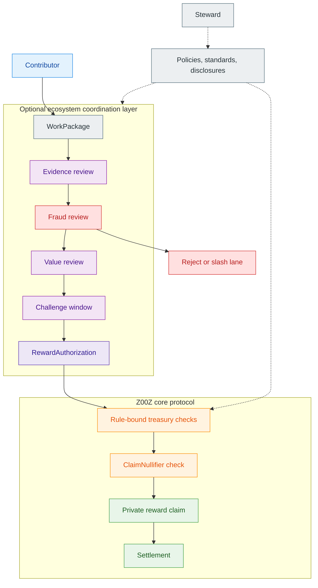
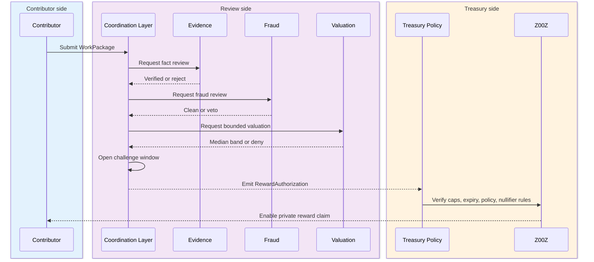
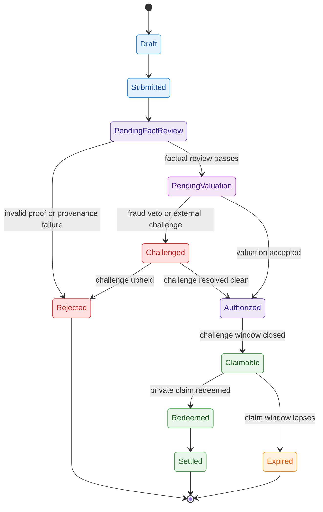
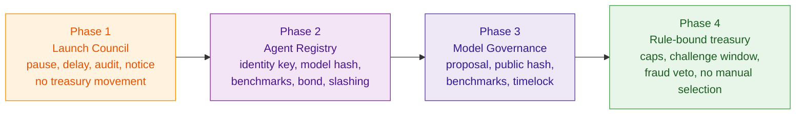

# Z00Z Proof-of-Useful-Work Whitepaper

[TOC]

Version: 2026-07-09

## Key Terms Used In This Paper

This paper uses a narrow useful-work vocabulary because the argument depends on a small number of recurring boundaries: what counts as useful work, who is allowed to judge it, what proof is sufficient, and where privacy must be preserved. The main text keeps those nouns stable and disciplined, and Appendix A extends them into a fuller glossary.

- `Proof-of-Useful-Work` (`PoUW`): A rule-bound reward system that pays for verifiable useful outputs rather than for passive holding, empty activity, or undefined loyalty.
- `Useful outcome`: A concrete output, service, or measurable effect that can be evidenced, reviewed, challenged, and priced under published policy.
- `WorkPackage`: The canonical submission envelope for a claimed contribution, including evidence references, provenance, requested reward, and optional disclosure fields.
- `WorkReceipt`: A signed or attestable artifact proving that a service, task, or operational contribution occurred.
- `RewardAuthorization`: The bounded authorization object produced by the external validation and valuation process and consumed by the Z00Z payout path.
- `Private reward claim`: The Z00Z-side claim-domain reward path that preserves contributor privacy while still enforcing treasury policy.
- `ClaimNullifier`: The live claim-domain anti-double-claim artifact that a future reward-authorization redemption path can reuse to prevent the same authorization from being redeemed more than once.
- `Challenge window`: The bounded review period during which claims, scores, proofs, or valuations may be contested.
- `Negative value`: A harmful or manipulative output that should not merely receive a low score, but should be rejected or penalized.
- `Rule-bound treasury`: A treasury whose payout behavior is constrained by published caps, challenge windows, authorization checks, and policy limits rather than by open-ended human discretion.
- `Steward`: A foundation or coordination wrapper whose legitimate role is documentation, audits, disclosures, standards, and ecosystem support rather than direct treasury operation or payout selection.
- `Optional ecosystem coordination layer`: The agent, attestation, and evaluation layer that validates useful work without turning the Z00Z core protocol into a subjective scoring machine.

## 1. Why Is This Document Needed?

This paper exists because token incentives often collapse into one of three weak forms: payment for raw activity, payment for speculative attention, or payment by opaque discretion. None of those forms fits the broader Z00Z thesis. Z00Z is strongest where ownership remains private, settlement remains narrow, and public evidence remains as small as possible. A useful-work economy built around those same boundaries must therefore be specified carefully rather than improvised as a loose grants narrative.

The shortest defensible thesis is simple: **Z00Z pays for verified useful outcomes, not empty activity.** In this paper, "useful outcomes" means work whose existence, quality, or effect can be evidenced under published rules. That family is broader than code bounties. It includes relay work, infrastructure uptime, agent tasks, compute services, content with measurable effect, research, bug discovery, and machine-service work. What unifies those categories is not their business label. What unifies them is that they can be submitted, reviewed, challenged, priced, and paid under explicit policy rather than under informal favoritism.

PoUW therefore warrants its own whitepaper. It sits at the boundary of tokenomics, privacy-preserving payout, external attestation, agent-mediated validation, and governance legitimacy. If buried inside a larger document, the key distinctions would blur: which work is in scope, which layer evaluates it, which proofs are acceptable, which powers remain outside the core protocol, and how payouts stay private without becoming discretionary.

### 1.1 Scope Of The Paper

This paper is intentionally narrow. It does not try to be a general manifesto about grants, AI, labor, or online growth. It focuses on one concrete question: how can Z00Z reward useful work in a way that is verifiable, challengeable, privacy-preserving at payout time, and credible enough to avoid collapsing into hype farming or founder-controlled patronage.

The document therefore concentrates on five structural questions. First, what classes of work belong inside the useful-work perimeter at all. Second, what evidence and attestation forms are strong enough to support payout. Third, how the system separates factual validation from value judgment. Fourth, how an optional ecosystem coordination layer can produce a reward authorization without making the Z00Z core protocol itself a subjective scoring machine. Fifth, how reward claims remain private and anti-replay-safe once authorization exists.

#### What This Paper Covers

This paper covers the main work families in scope: relay and infrastructure work, machine services, agent work, code and research, bug bounty and audit work, content and growth work, and mixed forms of measurable ecosystem support. It also covers the proof families those categories require, including direct on-chain facts, signed service receipts, attestations, `N-of-M` validation, challenge windows, and slashing-bound review lanes.

It also defines the role split required for credibility. Contributors submit work. Attesters and review agents validate evidence. Fraud-oriented reviewers challenge bad claims. Value-oriented reviewers price work or place it into bounded reward bands. Treasury execution remains rule-bound and downstream from that evaluation process. Private reward claims and claim-nullifier discipline stay inside Z00Z, while useful-work scoring and valuation remain a separate coordination problem.

#### What This Paper Deliberately Excludes

This paper deliberately excludes several adjacent topics. It does not attempt a complete labor-law or jurisdiction-by-jurisdiction legal analysis. It does not specify every UI, wallet, or governance workflow that a production ecosystem may later build around useful-work programs. It also does not claim that every evaluator market, agent registry, or review network described here already exists as landed consensus implementation in the repository.

Just as importantly, this paper does not try to justify every imaginable reward category. Hype, price-promotion, and vague social loyalty are either out of scope or subject to far stricter treatment than technical or operational work. The goal is not to maximize reward surfaces. It is to define the narrowest useful-work architecture that can remain technically credible and governance-safe.

### 1.2 Core Thesis

PoUW in Z00Z is not mining, not airdrop farming, and not an excuse for discretionary grant theater. It is a rule-bound useful-work economy in which evidence and challenge come before payout, and in which privacy is preserved at the reward-claim boundary instead of being discarded the moment a contributor gets paid.

#### The Main Claim

The main claim of this paper is that Z00Z should reward useful work only after three things exist at the same time: a bounded submission envelope, a formal validation path, and a machine-checkable reward authorization. The work itself may be technical, operational, agentic, or growth-related. The validation process may use direct facts, signed receipts, or external attestation. But payout should happen only after that validation becomes formal enough that the Z00Z payout layer can verify authorization without needing to understand the entire social or evaluative history behind it.

That distinction preserves the broader Z00Z architecture. The base system remains good at privacy, ownership, replay-safe claims, and settlement. It does not become a general-purpose judge of whether a video was persuasive, whether a research report was insightful, or whether a community tutorial deserves a larger budget band. Those judgments belong in a narrower review layer above the protocol line. Z00Z's job is to pay privately once formal conditions are satisfied.

#### Why Z00Z Needs A Separate PoUW Paper

This topic cannot be handled well as a short appendix because it touches too many other Z00Z boundaries at once. It depends on tokenomics because it moves treasury resources. It depends on rights-based architecture because the reward path is claim-oriented and privacy-preserving rather than public-account based. It depends on agentic architecture because parts of the validation and pricing process may be performed by multiple classes of agents. It depends on legal and governance boundary design because the legitimacy of useful-work programs collapses if one party silently controls models, policies, treasury, and upgrades at the same time.

A dedicated PoUW paper therefore keeps the system honest in a way a merged appendix would not. It allows the document to state three separate things clearly: the Z00Z core protocol should stay narrow, useful-work validation may live in an optional ecosystem coordination layer, and private payout remains a first-class property rather than an afterthought.

## 2. PoUW Boundary And Non-Boundary

The most important discipline in a useful-work paper is saying no early. If "useful work" quietly expands to mean any behavior the treasury wants to encourage, then the category becomes too vague to verify, too subjective to govern, and too easy to capture. This section draws a narrow boundary around what PoUW is supposed to reward and what it should avoid rewarding, especially in early deployment.

### 2.1 PoUW As Verified Outcome Incentives

PoUW should be defined through outputs and effects, not through self-described effort. A contributor is not paid because they spent time, posted often, or declared alignment. A contributor is paid because they produced something or operated something whose existence, integrity, and usefulness can be checked under a known rule set.

#### Outcome Over Activity

That design choice has several consequences. Code work can be tied to commits, merged changes, accepted fixes, benchmarks, or audit artifacts. Infrastructure work can be tied to signed receipts, uptime windows, or service-level evidence. Agent work can be tied to task completion artifacts, attested outputs, or measured execution against bounded criteria. Growth work can be tied to measurable activation or conversion rather than to noise metrics alone. In every case, the reward target is a completed, reviewable outcome.

The system should therefore reject empty substitutes for usefulness. Mere posting volume is not useful work. Passive holding is not useful work. General enthusiasm is not useful work. "Attention" by itself is too weak a primitive unless it is narrowed into a measurable contribution model with explicit anti-fraud rules and bounded reward logic. The treasury should pay for verified results, not for theater around the protocol.

#### Evidence Over Narrative

For that reason, the unit that enters the system should not be a persuasive story. It should be an evidence package. Depending on category, that package may include direct on-chain facts, signed service receipts, artifact hashes, timestamps, attestation references, reviewer outputs, optional privacy-preserving disclosures, and a bounded requested reward. The claimant may still explain why the work matters, but narrative is supplementary. It cannot replace evidence.

This is especially important for pseudonymous participation. Z00Z does not need a contributor's public identity to evaluate work honestly. It needs enough structured evidence to check, challenge, and price the work without turning payout into a trust-me social process.

### 2.2 What PoUW Is Not

PoUW becomes weak the moment it is mistaken for a generic emission engine. The sources are explicit that the system should not be described as mining and should not be launched as a public-relations excuse for paying people to manufacture speculative demand.

#### Not Mining

PoUW does not secure the core protocol through hash competition, block production, or an energy-to-consensus race. It is not "proof-of-work" in the consensus sense. The work being rewarded is ecosystem-useful work: code, research, infrastructure, relay behavior, agent tasks, machine services, bug discovery, or measurable ecosystem outputs. Its verification lane may be formal, but its function is treasury allocation, not core consensus security.

#### Not Airdrop Farming Or Paid Hype

PoUW is also not meant to become a dressed-up airdrop farm. Empty quests, vanity metrics, speculative promotion, referral theater, "make a bullish video," or "drive the price up" are the kinds of categories that make the architecture look manipulative and the treasury look unserious. Price-promotion and hype should remain excluded or be treated as high-risk edge cases with much stricter policy.

This does not mean all content or growth work is forbidden. It means growth work must be reframed away from hype and toward measurable ecosystem benefit. A tutorial that onboards real developers, a technical explainer that leads to usage activation, or a local commerce campaign tied to measurable protocol behavior may fit the useful-work frame. A promise of future returns does not.

### 2.3 Why The Boundary Matters

These exclusions are not cosmetic. They are what make the system describable as a useful-work market rather than as a discretionary patronage machine. A narrow perimeter keeps validation possible, budgeting legible, and contributor expectations bounded.

#### Technical Integrity

From a technical perspective, a narrow perimeter keeps the proof stack tractable. A system can realistically validate on-chain conversion, signed service delivery, infrastructure uptime, artifact provenance, or bounded expert attestation. It cannot honestly validate every social, ideological, or speculative claim that a treasury might wish to reward. The broader the category, the weaker the proof discipline becomes, and the more the system drifts toward opaque judgment instead of reviewable authorization.

That is why the early launch sequence starts with safe categories such as code, audits, documentation, tests, formal verification, and operational work. Those lanes are not only lower-risk legally. They are also far easier to validate honestly.

#### Legal And Governance Integrity

From a governance and legitimacy perspective, the same narrowing is even more important. A treasury that pays for bounded, reviewable outputs can explain its behavior in terms of published criteria, evidence, budgets, and challenge rights. A treasury that pays for vibe, loyalty, or speculation quickly starts to look like a managed promotion machine or a disguised payroll system. The sources also emphasize that contributor status should not silently imply employment, official representation, or ideological alignment. That boundary becomes much easier to preserve when rewards are tied to evidence and limited scopes of work rather than to identity and loyalty.

## 3. Program Modes And Work Taxonomy

PoUW uses two distinct program modes. Rewards may be attached to pre-scoped tasks with pre-declared criteria, or to open submissions whose value must be judged after the fact. Both modes share the same payout discipline, but they do not share the same evaluation logic.

The same is true for work categories. Relay work, infrastructure work, research, code, bug bounties, machine services, and agent tasks all fit the useful-work perimeter, but they do not produce the same proof shapes or the same legal and governance risk. A serious PoUW design therefore needs both a program-mode split and a work-family taxonomy.

### 3.1 Two Program Modes

PoUW should operate in two modes. The first is a bounded grant or bounty lane where scope and reward range are known in advance. The second is an open useful-work lane where scope may be known only loosely and where both usefulness and price require formal post-submission review. These are both legitimate modes, but they answer different governance questions and should not be confused.

#### Pre-Scoped Grants

In the pre-scoped lane, the treasury or program operator declares the task, the acceptance criteria, and the reward range before work begins. The evaluation problem is therefore mostly factual: was the work done, does it satisfy the spec, and are there hidden defects or fraud indicators that should block payment. This is the cleanest mode legally, the easiest mode technically, and the safest mode for early rollout because it keeps value disputes narrow.

Examples from the source material map naturally into this lane: implement a library, complete an audit, produce a formal verification artifact, operate a bounded infrastructure service level, or satisfy a specific on-chain or operational KPI within a campaign. The stronger the criteria are ex ante, the less arbitrary the later review becomes.

#### Open Useful Work

In the open useful-work lane, contributors submit work without a pre-agreed price. This is the mode needed for unexpected research, unsolicited tooling, content, agent-produced outputs, or ecosystem contributions whose value was not pre-budgeted in a task list. It is also the mode that requires the most discipline. Once price is no longer predefined, the system must separate fact consensus from value consensus and must impose budget caps, category caps, challenge windows, and stronger review process on top of raw evidence.

Open useful work should not mean arbitrary, post hoc generosity. It should mean rule-bound valuation under published constraints. That is why the later sections distinguish factual review from value review and keep payout downstream from formal reward authorization rather than social approval.

The two modes can be compared as follows.

| Dimension | Pre-scoped grant | Open useful work |
| --- | --- | --- |
| Scope definition | Declared before work begins | Often known only loosely or inferred after submission |
| Reward formation | Fixed amount or fixed band | Bounded post-submission valuation |
| Main review burden | Acceptance against spec and fraud screening | Fact review plus value consensus under caps |
| Governance risk | Lower, because scope and price are constrained ex ante | Higher, because pricing and usefulness are judged after the fact |
| Best launch use | Early technical, infrastructure, and bounty lanes | Later retro-microgrant, research, and broader ecosystem lanes |
| Default treasury posture | Simpler payout logic and narrower disputes | Stronger caps, challenge rights, and review discipline |

### 3.2 Core Work Families

The useful-work perimeter is broad enough to support a real ecosystem, but it should still be organized into a small number of stable families. The families below are not marketing segments. They are proof and policy families. Each family groups work that tends to produce similar evidence shapes, similar abuse patterns, and similar payout logic.

| Work family | Typical outputs | Typical proof anchors | Main review difficulty |
| --- | --- | --- | --- |
| Relay, infrastructure, and uptime work | Relay service, node availability, routing, gateway service, machine delivery | Service receipts, uptime windows, operational logs, challengeable SLA evidence | Operational spoofing, quality measurement |
| Machine and compute service work | Compute jobs, device-side execution, bounded service fulfillment | Signed receipts, task hashes, execution artifacts, later reconciliation evidence | Service-quality verification, offline fraud |
| Agent work and agent-mediated tasks | Task completion, automation outputs, solver or subagent work | WorkPackage, artifact hashes, reviewer attestations, N-of-M validation | Separating factual completion from value |
| Code, research, audit, and security work | Commits, merged PRs, reports, findings, proofs | Repositories, hashes, attested review, reproducible artifacts | Expert judgment and originality |
| Content, onboarding, and growth work | Tutorials, explainers, campaign outputs, community activation | On-chain conversion, signed attribution, off-chain attestation, sampled review | Metric gaming, speculative drift |

This taxonomy is intentionally compact. It captures the work types named in the brief and in the archive notes without pretending that each business label deserves its own standalone mechanism. The point is to keep the policy surface understandable while still covering the categories the ecosystem will actually care about.

#### Infrastructure, Relay, And Machine Service Work

Infrastructure and relay work are among the strongest early PoUW candidates because they produce concrete operational evidence. A service can be up or down. A relay can deliver or fail. A bounded machine-service interaction can produce a signed receipt. A gateway can meet or miss service windows. None of those categories is perfectly objective, but all are much closer to measurable utility than social narratives about loyalty or attention.

These categories also fit naturally with the broader Z00Z architecture described elsewhere in the repository. Z00Z already treats receipts, delayed reconciliation, and narrow public evidence as meaningful objects. A useful-work paper can therefore extend that logic into incentives: if a relay lane, machine service, or infrastructure surface can produce reviewable receipts, then it can also produce reviewable reward eligibility.

#### Agent, Compute, Content, Research, And Security Work

Agent work, compute service work, code, research, and security work form the second large family. These categories are often more valuable strategically, but they are also more heterogeneous in proof shape. Some agent work is nearly deterministic: a benchmark improved, a proof verified, a task completed, a service executed. Some is partly subjective: a research report is useful, a documentation rewrite materially improves onboarding, a content artifact has technical educational value. Security and bug work may be adversarial: a real exploit path was reproduced, a false claim was ruled out, or a harmful pattern was detected.

That heterogeneity is why the paper must not equate all useful work with one scoring model. Some lanes can lean heavily on direct evidence. Others require attestation, sampled review, or bounded expert judgment. This is especially important for agent work, where Z00Z provides private payout and the external evaluation layer provides task validation and pricing.

#### Concrete Program Archetypes

Three program archetypes make the design concrete by showing how different proof families still fit the same submission, review, and payout discipline.

The first archetype is the on-chain activation or CPA lane. Here payout is tied to a measurable protocol action inside a defined window, while off-chain media or referral context serves only as attribution support. This is a good example of the paper's main boundary rule: social signals may help explain a claim, but they should not replace the real success condition. The success condition remains a protocol-useful result.

The second archetype is the `Ack`-style usage lane described in the PoUW archive. In that pattern, a contributor or user presents an inclusion-backed acknowledgement artifact tied to a real transaction or service interaction, then claims a bounded cashback, rebate, or lottery-weighted reward through a nullifier-safe private claim path. This is strategically important because it shows how Z00Z-native usage loops can be rewarded without falling back to public account-based cashback systems.

The third archetype is the retroactive microgrant lane. In that pattern, deeper contributions such as SDK integrations, indexers, infrastructure improvements, or major documentation work are gathered over a period, then priced after the fact under bounded review. This is the cleanest bridge between the archive's RetroPGF-inspired thinking and the stricter Z00Z requirement that even retrospective awards must still terminate in formal authorization rather than informal applause.

### 3.3 Risk-Tiered Categories

Work families alone are not enough. The paper also needs a risk ladder because the order of launch matters. Some categories are easier to validate, easier to explain, and easier to defend. Others are softer, easier to manipulate, and more likely to create governance or legal confusion if they are deployed too early.

#### Safe Launch Categories

The safest initial categories are code, documentation, tests, tooling, formal verification, audits, technical bug reports, bounded infrastructure work, and similar lanes where evidence is structured and direct. These are the best first-wave categories because they let the system prove that evidence, challenge, and payout discipline work before more subjective surfaces are added.

Safe categories also help with legitimacy. A treasury that begins by paying for merged code, reproducible fixes, bounded service quality, or clearly attested technical work can explain itself much more cleanly than a treasury that begins by paying for promotional media and then tries to build technical rigor afterward.

#### Higher-Risk And Excluded Categories

Higher-risk categories include promotional media, referral campaigns, speculative narratives, and any work whose main value proposition is to stimulate price expectation rather than protocol usefulness. Some content and growth programs may still be legitimate, but only if they are reframed around measurable ecosystem benefit and protected by stronger anti-fraud rules, tighter caps, and richer attestation requirements.

The most important exclusion is explicit price-promotion. The sources are consistent that the system should not pay for hype, FOMO, or promises of future returns. That kind of work does not merely create validation difficulty. It changes the character of the program from a useful-work economy into a speculation subsidy. The paper should resist that drift directly instead of hiding it behind softer language.

## 4. System Architecture And Layer Separation

The central architectural claim is straightforward: PoUW should not live inside the Z00Z core protocol. The protocol should remain a narrow privacy, ownership, and settlement layer. Useful-work validation and pricing belong above that line, in a separate coordination surface that can reason about evidence, quality, fraud, and value without forcing those judgments into consensus-critical core logic.

### 4.1 Why PoUW Should Not Live Inside Core Z00Z

The Z00Z base layer is good at a specific set of jobs: private ownership, narrow public verification, claim discipline, anti-replay enforcement, and settlement. It is not well-suited to act as a bureau for scoring tutorials, pricing audits, judging research usefulness, or deciding whether a campaign artifact deserves a higher reward band. Those are not settlement problems. They are review and governance problems.

If useful-work evaluation were pushed directly into core Z00Z, the protocol would inherit the wrong responsibilities. It would need to internalize subjective scoring, policy disputes, model updates, and category-specific evaluation logic that changes faster than ownership and settlement primitives should change. That would widen the protocol surface at exactly the wrong layer. The better design is to keep evaluation external and make payout internal only after evaluation has been reduced to a formal authorization object.

#### What Stays Inside Z00Z

Several responsibilities do belong inside the Z00Z side of the stack. Private reward claims belong there. Anti-double-claim enforcement belongs there. Settlement verification belongs there. The final payout path should verify that an authorization is valid, unused, policy-compliant, and within its allowed amount, then convert that authorization into a private claim or another bounded payout surface without exposing more information than necessary.

Z00Z should remain the place where a useful-work reward becomes privately ownable and replay-safe. It should not need the full evaluative history behind the claim. It only needs to know that a valid reward authorization exists and has not been redeemed before.

#### What Lives Outside Z00Z

Evidence review, fraud analysis, impact scoring, price discovery, category-specific logic, and challenge handling belong outside the core protocol. Those functions require more adaptation, more subjective review, and more governance sensitivity than the payout layer should absorb. They may still be formal and machine-assisted, but they should not become consensus-critical Z00Z core logic.

This is especially important for agent-mediated evaluation. Multiple agent classes may inspect evidence, attack false claims, estimate usefulness, or propose reward amounts. None of that implies direct treasury control. They produce a result. Treasury policy and the Z00Z payout path consume it only if it satisfies formal conditions.

The main responsibilities can be summarized as follows.

| Responsibility surface | Inside core Z00Z | Outside coordination layer | Why the split matters |
| --- | --- | --- | --- |
| Evidence review | No | Yes | Evidence logic changes too quickly and too subjectively for core settlement |
| Fraud analysis and challenge intake | No | Yes | Adversarial review needs policy adaptation and category-specific handling |
| Impact scoring and value pricing | No | Yes | Reward estimation is not a consensus-critical settlement function |
| RewardAuthorization validation | Yes | Produced outside, verified inside | Lets payout stay narrow while review remains expressive |
| ClaimNullifier enforcement | Yes | No | Anti-double-claim protection belongs at redemption time |
| Private reward claim and settlement | Yes | No | Privacy-preserving ownership and replay-safe payout are core Z00Z jobs |

### 4.2 Actor Model

PoUW should not be described as "AI decides who gets paid." That formulation collapses several distinct roles into one opaque authority and makes the system harder to defend. The actor model should instead be explicit: contributors submit work, attesters or reviewers validate evidence, adversarial reviewers challenge fraud, value-oriented reviewers estimate usefulness and pricing, and a treasury execution surface performs payout only after formal authorization exists.

The separation matters because fact review and value review are not the same operation. One asks whether the work happened. The other asks what it is worth to the ecosystem. Those roles may share some tooling, but they should not be conflated conceptually or operationally.

#### Contributors, Attesters, And Treasury Executors

Contributors are the origin point of the system. They submit a `WorkPackage` rather than a vague claim of effort. That package may include artifact hashes, links, signatures, timestamps, evidence references, requested reward, and optional privacy-preserving disclosure fields. Attesters, or other bounded factual reviewers, confirm or deny claims about existence, provenance, completion, or measured effect. Treasury executors do not re-judge the work socially. They perform the final rule-bound payout step once authorization is valid.

This structure is especially important for pseudonymous participation. A contributor may wish to remain private, but the work they submit still needs enough structure to be reviewable. Attesters or factual reviewers therefore stand between claimant and treasury, while the treasury itself remains downstream from proof rather than upstream as a discretionary chooser.

#### Evidence, Fraud, Impact, Valuation, Challenge, And Audit Agents

A multi-role agent structure solves a real design problem and should be preserved in the whitepaper. Evidence agents test whether the claimed work exists and whether submitted artifacts are coherent. Fraud agents actively search for fabrication, plagiarism, metric gaming, or harmful misuse. Impact agents estimate usefulness in ecosystem terms. Valuation agents translate that usefulness into bounded reward proposals. Challenge agents operate adversarially against accepted claims and push the system toward recheck, reduction, or appeal when something looks wrong. Audit agents inspect process integrity itself: whether a model, quorum, scoring policy, or evidence lane was used the way the program said it would be used.

This role separation is not decorative. It is the difference between a review market and a single black box. A system with separate evidence, fraud, impact, valuation, and challenge lanes is easier to audit, easier to constrain with policy, and harder to capture than a system in which one model both scores work and releases treasury funds by itself.

| Actor family | Primary responsibility | What it must not control alone |
| --- | --- | --- |
| Contributors | Submit work and evidence | Final payout decision |
| Attesters or factual reviewers | Confirm existence, provenance, or measurable outcomes | Reward amount discretion without policy limits |
| Fraud reviewers | Search for false claims, manipulation, or harmful work | Unilateral treasury seizure |
| Impact and valuation reviewers | Estimate usefulness and bounded reward size | Treasury execution without challenge path |
| Treasury execution surface | Check authorization validity and pay privately | Social judgment of work quality |

### 4.3 Reference Coordination Topologies

The external evaluation layer needs a reference topology, but the paper should be careful not to mistake a reference topology for a base-protocol dependency. The sources strongly prefer a separate agent-consensus layer, and this paper should preserve that preference because it cleanly separates useful-work evaluation from Z00Z settlement. At the same time, the architecture should be expressed through invariants that can survive future coordination changes.

#### NEAR-Based Independent Agent Consensus Layer

The leading reference topology in the archive material is a NEAR-based independent agent consensus layer. In that framing, NEAR is not asked to replace Z00Z privacy or Z00Z payout. It is used as a coordination surface for agent workflows, task registries, public review processes, challenge periods, and cross-chain reward authorization. That makes architectural sense within the source material because the useful-work layer needs open coordination and adaptable review logic, while Z00Z needs to remain the privacy-preserving claim and settlement layer.

This paper treats a NEAR-based agent layer as the clearest current reference design: contributors submit work into an external review surface, multiple review lanes inspect it, a bounded consensus process or policy engine produces a `RewardAuthorization`, and Z00Z pays only after that authorization becomes formal enough to redeem privately.

#### Alternative Coordination Layers And Invariants

Even so, the paper should not become topologically brittle. The real architectural invariants are more important than any one coordination network. The evaluation layer must support independent review rather than single-party scoring. It must publish policy clearly enough that participants know how work is judged. It must separate factual validation from value estimation. It must support challenge windows, bounded slashing or penalty logic where appropriate, and explicit upgrade discipline instead of silent model changes. Most importantly, it must not let one party directly control treasury, evaluators, and policy overrides at the same time.

If those invariants are preserved, future coordination layers could evolve without rewriting the Z00Z useful-work thesis. The base message would remain the same: useful-work validation happens above the protocol line, reward ownership and anti-replay payout happen inside Z00Z, and no single actor should be able to turn the system back into discretionary private patronage.

#### TAO-Style Growth Oracle As Optional Review Surface

The PoUW archive also explores a more competitive topology for selected growth or ranking-heavy lanes: a TAO-style subnet or similar market in which miners or models compete to rank candidate content, campaigns, or agent outputs, while validators score them against later truth signals such as on-chain conversion, retention, or fraud outcomes. That idea fits this paper well so long as it is described as optional review infrastructure rather than as a Z00Z dependency.

In the clean version of that design, the external subnet is a ranking or forecasting surface only. It does not custody treasury, it does not finalize payout, and it does not replace the rule-bound Z00Z claim path. It contributes score or ranking evidence that may feed value consensus, especially in content or growth lanes where comparative ordering matters. Z00Z still pays only for bounded outcomes, and only after those rankings are combined with measured results, challenge rights, and formal authorization.

**Figure 4.1 - PoUW layer boundary and responsibility split.** Review and valuation occur above the core protocol line, while private claim redemption and settlement occur inside Z00Z.



## 5. WorkPackage, Proofs, And Evidence Discipline

PoUW only becomes governable once work enters the system in a normalized form. A contributor should not submit "I did something useful." They should submit a structured work package that can be checked by humans, agents, or both. That package is the boundary object between off-chain work and rule-bound review.

The second half of the problem is proof discipline. Different work families produce different evidence shapes. Some are nearly self-verifying. Some depend on signed receipts. Some require attestation quorums. Some require mixed bundles that combine direct facts with reviewer outputs. A serious useful-work paper therefore needs both a canonical submission envelope and a proof taxonomy.

### 5.1 Canonical WorkPackage

The canonical `WorkPackage` is a bounded submission envelope rather than a raw blob of claims. Its job is to make useful-work review legible without forcing contributors to reveal more than necessary. The field family is stable: work type, artifact reference or hash, author signature or equivalent authorship proof, time evidence, requested reward, category, evidence files, optional privacy disclosure, and conflict statement.

That field set is strong because it separates identity from proof. The system does not need to begin by asking who the contributor is in the public-account sense. It needs to begin by asking what artifact exists, how it is anchored, which rule family it belongs to, what evidence supports it, and what reward is being requested. Identity can remain partially or fully hidden where the work category permits it, while the proof bundle still stays reviewable.

#### Required Submission Fields

The minimum fields should be small but non-negotiable. At a minimum, a `WorkPackage` should bind together the work category, an artifact or service reference, provenance or authorship evidence, timestamp or time-window evidence, requested reward or reward band, attached proof references, and a short statement of what conflict or overlap the submitter knows about. The contributor may also need to specify which program mode applies: pre-scoped completion claim or open useful-work submission.

| Field | Purpose | Why it matters |
| --- | --- | --- |
| `category` | Places the claim into a policy family | Determines review lane, caps, and risk treatment |
| `artifact_ref` or `artifact_hash` | Anchors the submitted work | Prevents later ambiguity about what is being judged |
| `provenance` | Links work to a signer, task path, or receipt source | Supports authenticity review without requiring public identity |
| `time_evidence` | Shows when the work occurred or was published | Supports program windows, challenge timing, and anti-replay logic |
| `requested_reward` or `requested_band` | Declares the economic ask | Makes valuation explicit rather than implicit |
| `proof_refs` | Points to logs, receipts, attestations, hashes, or reviewer artifacts | Makes the claim challengeable |
| `conflict_statement` | Declares known overlap, reuse, or dispute risk | Reduces ambiguity and bad-faith double-submission |

The paper should treat these fields as the minimal intake contract. More category-specific fields may exist, but the review layer should not accept a claim that cannot at least say what it is, where the evidence is, when it happened, and what it is asking to be paid for.

#### Optional Privacy And Disclosure Fields

The `WorkPackage` should also support optional privacy and disclosure fields because Z00Z is not trying to turn useful-work programs into public payroll. A contributor may choose pseudonymous submission, selective reveal to reviewers only, or later disclosure to a regulated or enterprise counterparty under a stronger audit lane. Those options should remain extensions of the same submission object rather than separate program families.

This serves two goals. Pseudonymous contributors can compete on evidence rather than public identity, while enterprise or regulated participants can still use stronger receipts, retained evidence packages, or corporate archives through selective disclosure rather than a separate architecture.

### 5.2 Proof Families

The proof taxonomy should remain simple enough to govern but rich enough to cover real work. Three large proof families are sufficient: direct on-chain or protocol-native facts, signed service or execution receipts, and attested or reviewed off-chain facts. They are not equally strong in every context, but they are strong enough to support a serious useful-work architecture when declared honestly.

#### On-Chain Facts, Service Receipts, And Operational Logs

The strongest proof family is direct, measurable evidence. A protocol interaction either happened or it did not. A campaign KPI was either satisfied or not satisfied. A relay or machine service may produce signed receipts, bounded logs, or later reconcilable operational evidence. Uptime windows, service-level evidence, execution traces, or inclusion-backed activity notes all belong to this family when they can be checked against an explicit verification rule.

This is why infrastructure, relay, compute, and some machine-service work are attractive first-wave categories. Their proof shapes are relatively disciplined. Even when they are not perfectly self-verifying, they can usually be brought into a reviewable lane through signed receipts, replay-safe references, or challengeable operational logs rather than through soft social claims.

#### Attestations, N-of-M Validation, And Review Artifacts

The second major proof family covers off-chain facts and mixed-domain work. Here the source materials recommend attestation schemas, N-of-M validation, expert review, and slashing-backed confirmation paths. Content work, educational outputs, some research claims, and some agent-produced outputs belong to this family because their effect cannot always be derived from one canonical state transition alone.

This family should be described honestly as weaker and more policy-sensitive than direct facts, not as useless. Attestations can still be strong if the schema is clear, the quorum is bounded, the review surface is challengeable, and false attestations are slashable or otherwise punishable. The paper should therefore distinguish "attested" from "self-proving" without treating the former as illegitimate by default.

#### Anti-Sybil And Uniqueness Gates

Some categories also need admission and rate-limit controls before review begins. In practical terms, that means Passport-style uniqueness thresholds, EAS-backed identity or reputation stamps, and RLN- or Semaphore-style anonymous rate limits for one-claim-per-epoch or one-claim-per-campaign behavior.

These controls should be framed carefully. They do not prove that work was useful. They reduce the chance that a high-spam lane gets overrun by farms, duplicated submissions, or coordinated low-cost abuse. For safer technical lanes they may be unnecessary or light-touch. For open growth lanes, referral-style programs, or broad microgrant surfaces, they can be the difference between a usable market and an unreviewable spam sink.

### 5.3 Evidence Lifecycle

Evidence should move through a finite lifecycle rather than through an ad hoc conversation. The flow is straightforward: a campaign or program publishes rules, the contributor performs work, assembles proof, submits the claim with anti-replay context, enters pending review, passes through a challenge window, and only then reaches payout or dispute handling.

That lifecycle matters because it converts a vague "grant request" into a bounded claims process. Every useful-work payout should be able to answer the same questions: what program rule was invoked, which evidence was submitted, who or what reviewed it, whether a challenge window expired cleanly, and which final authorization was redeemed.

#### From Submission To Challenge Window

At minimum, the intake sequence should normalize the `WorkPackage`, verify that required fields exist, check that the proof family is acceptable for the declared category, and bind the submission to a pending-claim state. A factual review lane then checks coherence, provenance, and obvious fraud indicators. If the submission survives those checks, it enters the formal review and challenge period rather than being paid immediately.

That challenge period is not an optional garnish. It is part of the legitimacy of the system. It gives independent reviewers a bounded window to attack false claims, question reward sizing, or surface harmful overlap before treasury motion becomes final. The more subjective the work category is, the more important that bounded challenge phase becomes.

#### Archival, Retention, And Selective Disclosure

Evidence retention should follow the same narrowness principle as the rest of Z00Z. Not every artifact needs to become permanent public memory. But challenge-relevant evidence must remain reconstructable long enough that reviews, disputes, and later audit-by-consent can actually happen. That implies at least a retained digest trail for work identity, proof references, authorization history, and claim-nullifier usage, even when richer evidence remains selectively disclosed.

The paper should also be explicit that privacy and archival discipline are compatible. Reviewers may need access to certain evidence during a challenge window without the whole network needing permanent visibility into the contributor's identity, counterparties, or full work graph. Selective disclosure should be treated as a first-class capability rather than as an edge-case concession. When a program needs longer-lived audit records, the correct place for them is an `Evidence Package` retained in a `Corporate Archive` above the core protocol rather than a maximally exposed protocol memory surface.

## 6. Fact Consensus, Value Consensus, And Reward Authorization

Useful-work systems face two different consensus questions. The first is factual: did the work happen, and is the proof coherent. The second is evaluative: how useful is that work to the ecosystem, and what reward range is justified. Those questions may influence one another, but they are not the same operation and should not be handled by the same hidden authority.

These layers can be summarized as follows.

| Layer | Core question | Typical inputs | Allowed outputs | What it must not decide alone |
| --- | --- | --- | --- | --- |
| Fact consensus | Did the work happen as claimed | Artifacts, receipts, hashes, provenance, timestamps, attestation evidence | Verified, rejected, challenged, or escalated | Final reward size or discretionary treasury movement |
| Value consensus | What is verified work worth under policy | Verified claim, category weights, impact signals, budget state, harm modifiers | Reward band, reduction, denial, or `reward = 0` for harmful work | Private payout execution |
| RewardAuthorization | What formal result is portable into payout | Fact result, value result, policy version, challenge status, proof digests | Self-contained authorization object with expiry and payout constraints | Reopening social judgment at payout time |
| Treasury execution | Is this authorization valid and still redeemable | Authorization object, cap rules, nullifier state, expiry rules | Private claim enablement or fail-closed rejection | Re-scoring usefulness or overriding review policy informally |

### 6.1 Fact Consensus

Fact consensus is the narrower and more objective of the two tasks. Its job is not to decide whether the work is brilliant. Its job is to decide whether the submitted artifact, service, or measurable outcome actually exists and matches the claim being made. In the ideal case, factual review becomes a fail-closed gate: no coherent artifact, no valid provenance, or no acceptable proof means no progression to payout.

#### Existence And Authenticity Checks

This layer should check existence, provenance, timestamps, authorship evidence, artifact integrity, and obvious duplication or plagiarism. In some categories it may also check bounded program conformance, such as whether the output matches a declared task, whether an operational KPI was actually met, or whether a service receipt binds to the claimed work window.

Factual consensus does not need one global voting rule. Different categories may use direct verification, simple attester confirmation, or stronger evidence-agent quorum. The underlying standard remains the same: factual review should be as close to objective as the category permits.

#### Fraud Veto And Evidence Failure

A useful-work system is only as strong as its fraud path. If evidence agents or fraud-oriented reviewers detect fabrication, plagiarism, replay, metric gaming, forged receipts, or clearly harmful manipulation, the claim should not merely receive a lower score. It should fail progression into payout and, where policy requires, move into a slashing, cooldown, or dispute lane.

This is also where the "negative value" concept begins to matter. Some work is not just weak. It is actively harmful. False audits, fake integrations, manipulative promotion, fabricated metrics, or deceptive agent outputs should be treated as a distinct failure class rather than as ordinary low-quality submissions.

### 6.2 Value Consensus

Value consensus begins only after factual coherence exists. It asks a different question: given that the work is real, what is it worth under the program's declared policy. In pre-scoped programs, this question may already be narrow. In open useful-work programs, it becomes the central challenge, which is why valuation must remain bounded by caps and explicit formulas rather than free-form generosity.

#### Impact Scoring

Impact scoring should stay tied to declared ecosystem benefit rather than to popularity theater. Depending on category, relevant dimensions may include security improvement, code quality, developer adoption, infrastructure usefulness, research relevance, machine-service completion, agent-task effectiveness, documentation clarity, or measurable activation and retention. The final scoring surface may vary by category, but the principle should not: useful work is scored against protocol benefit, not against speculative excitement.

Value review should avoid pretending to discover a perfect market price. In many cases the right output is not one magic number but a bounded reward band informed by category weight, quality, impact, difficulty, originality, fraud confidence, and budget state.

The same archive stream also suggests a dual-score posture for higher-risk categories: positive impact score and harm score should both exist where manipulation risk is meaningful. A content artifact, campaign, or agent output may show some activation signal and still be strategically harmful. Where harm crosses a declared threshold, the correct result is not "low but positive reward." The correct result is `reward = 0`, rejection, and where policy allows, temporary rate limits or bond loss subject to appeal.

#### Valuation Bands, Caps, And Median Discipline

Category caps, epoch budgets, treasury ceilings, and median-or-banded valuation keep the system sane. They stop one reviewer, one model, or one manipulated review cluster from turning a plausible contribution into an unbounded treasury drain. Median-style aggregation is often safer than simple averaging because it is more robust to outliers or captured evaluators.

Value consensus should therefore be rule-bound in two senses. First, it should run under explicit scoring and capping policy. Second, it should always remain subordinate to treasury limits and program-specific ceilings. No evaluator lane should be able to create an unlimited obligation merely by being enthusiastic.

### 6.3 RewardAuthorization

`RewardAuthorization` is the bridge object between external evaluation and Z00Z payout. It is the answer to the question: how can the base payout layer remain narrow even when the review process above it is complex. The answer is that the review process must eventually collapse into a formal object that the payout layer can verify without replaying the entire deliberation history.

#### Required Authorization Commitments

At minimum, a `RewardAuthorization` should commit to the work-claim identity, the accepted category or program lane, the approved reward amount or reward band, the relevant policy version, proof or review digest, quorum or approval evidence, challenge status, expiry semantics, and the payout destination form expected by Z00Z. In more advanced deployments it may also commit to which review mode was used, which cap family applied, and whether special disclosure conditions attach to payout.

The important property is not the exact field spelling. The important property is that the authorization be self-contained enough that Z00Z can verify "what is being paid, under which policy, and whether it is still valid" without needing to know the contributor's whole story or the reviewers' whole conversation.

#### Why Authorization Must Be Formal And Portable

Authorization must be formal because the payout layer should not depend on narrative trust. It must be portable because the evaluation layer and the payout layer are intentionally separated. A treasury executor, wallet, or payout contract should be able to consume a bounded authorization object and perform deterministic checks on validity, expiry, anti-replay status, and allowed amount.

That portability is what prevents the useful-work architecture from collapsing back into manual grants administration. Reviewers judge the work. Policy constrains the judgment. `RewardAuthorization` carries the final result forward. Z00Z pays only after the result has been reduced to something formal enough to verify mechanically.

**Figure 6.1 - End-to-end actor flow from submission to authorization.** The flow runs from contributor submission through fact review, fraud review, valuation, challenge handling, and treasury handoff.



## 7. Private Payouts And Z00Z Settlement

Payout is where PoUW becomes distinctly Z00Z-native rather than just another public grants system. Many ecosystems can run reward programs. Far fewer can pay contributors without turning the result into a permanent public payroll graph. Useful-work rewards therefore need to be privately claimable, anti-double-claim-safe, and compatible with pseudonymous participation.

### 7.1 Why Payout Belongs In Z00Z

The architecture is strongest when evaluation and payout are separated. Evaluation may happen in a NEAR-based agent-consensus layer or another external review surface. But once a reward has been formally authorized, private ownership, claim redemption, replay protection, and settlement discipline belong inside Z00Z. That is the layer that knows how to turn a formal authorization into a privately owned reward right rather than into a public balance disclosure.

#### Private Reward Claim Path

The design points toward a private claim path rather than a public transfer list. In broader Z00Z terms, this is a claim-domain payout path rather than an address-indexed payroll list. The contributor should be able to present a valid claim and prove entitlement without forcing the treasury to publish a reusable account identity or a legible social graph. In the strongest form, the treasury learns only that a valid claimant satisfied the policy and that the authorization has not been used before.

This design matters for both individual and agentic contributors. A pseudonymous builder, a machine-service provider, or an agent performing bounded work should all be able to receive a reward without turning the claim process into public doxxing. Private claims are not cosmetic here. They are part of the reason the useful-work architecture belongs in the Z00Z family at all.

#### ClaimNullifier And Anti-Double-Claim Discipline

The payout path also needs a clean anti-replay boundary. Useful-work claims should use a nullifier-style anti-double-claim mechanism so that one authorization cannot be redeemed twice. The specific construction may vary by program family, but the architectural rule is stable: one valid authorization may produce one valid reward claim, and replay attempts must fail closed.

This anti-double-claim rule is more than an implementation detail. It is what makes private payout compatible with treasury safety. Without it, a privacy-preserving claim surface would look like an abuse vector. With it, Z00Z can preserve claimant privacy while still enforcing one-time redemption.

### 7.2 Treasury Policy Execution

The treasury side must remain rule-bound from beginning to end. Agents, reviewers, and attesters may inform reward authorization, but they should not directly control treasury funds. The dangerous pattern is "AI decided, therefore money moved." The safer pattern is "evaluation produced a formal result, treasury policy checked it, then payout executed under narrow rules."

#### Formal Checks Before Payout

Before payout executes, the Z00Z side should check at least five things: that the authorization is authentic, that the relevant policy version is acceptable, that the amount is within allowed limits, that the claim has not already been redeemed, and that any challenge or expiry conditions are satisfied. Depending on program design, it may also need to check category compatibility, vesting mode, stream mode, or disclosure prerequisites for special lanes.

The critical point is that these are deterministic checks. They are not renewed social judgment. Once the review layer has done its work and the challenge window has closed or resolved, the payout lane should behave like a bounded settlement lane, not like a committee meeting.

The treasury gate can be expressed as the following deterministic checklist.

| Treasury check | What it verifies | Typical failure condition | Expected result |
| --- | --- | --- | --- |
| Authorization authenticity | The `RewardAuthorization` is genuine and policy-recognized | Invalid signature, malformed digest, unknown issuer, unsupported policy family | Reject claim |
| Policy version acceptability | The authorization was issued under an allowed rule set | Deprecated, revoked, or non-whitelisted policy version | Reject claim |
| Amount and cap compliance | The approved amount fits category, epoch, and treasury limits | Amount exceeds per-claim, per-category, or treasury-risk cap | Reject or require re-authorization |
| Challenge and expiry status | The claim is no longer challenge-pending and has not expired | Open challenge, unresolved dispute, or lapsed claim window | Reject or keep pending |
| ClaimNullifier state | The authorization has not already been redeemed | Duplicate or replayed redemption attempt | Fail closed |
| Disclosure prerequisites | Special lanes satisfied enterprise or regulated review conditions | Required disclosure or archive condition missing | Reject or route to stronger review lane |

**Figure 7.1 - Claim lifecycle from submission to private redemption.** The lifecycle distinguishes pending, challenged, authorized, claimable, expired, redeemed, and settled states.



#### Payout Modes

Multiple payout modes remain useful, including immediate claims, streamed rewards, cliffs, and vesting windows. Different work families create different risk surfaces. A small technical bounty may justify near-immediate payout after the challenge window. A larger growth program, infrastructure reward, or open useful-work grant may justify streaming or vesting to reduce abuse, manage treasury exposure, or align payout with continuing verification.

The important design principle is that payout mode belongs to policy, not to evaluator whim. Reviewers may authorize a category and amount, but treasury policy should determine which release surfaces are available for that category.

### 7.3 Privacy, Audit, And Selective Disclosure

Private payout does not imply zero auditability. It implies selective auditability. The system should preserve pseudonymous honest-path behavior by default while still allowing stronger review where a program, enterprise, or regulated environment legitimately requires it. That balance is essential to keeping Z00Z privacy-native without making it operationally unusable.

#### Pseudonymous Contributors

The default posture should be to evaluate work rather than identity. A contributor may remain pseudonymous so long as the evidence bundle, review path, and reward authorization are sufficient for the claimed category. Optional privacy-preserving disclosures may still exist for sampled audits, higher-value claims, or exceptional dispute cases, but they should remain the exception rather than the baseline.

This is especially important for agentic and machine-service use cases, where the public exposure of counterparties, strategies, or operational patterns can itself be sensitive. A useful-work system that forces full public revelation at payout time would defeat one of its main reasons for belonging in the Z00Z ecosystem.

#### Enterprise Or Regulated Review Paths

Some participants will need stronger audit surfaces than others. Enterprise programs may require richer receipts, retained `Evidence Package` objects, or `Corporate Archive` workflows for internal control. Regulated service surfaces may require category-specific disclosures before payout. Those needs are real, but they do not require the core useful-work system to become a public surveillance ledger.

The better design is layered visibility. Honest-path public memory stays narrow. Review artifacts stay bounded. Richer evidence is disclosed only where policy requires it and only to the appropriate reviewing surface. That approach preserves the core Z00Z property: privacy by default, disclosure by rule, and settlement only after formal conditions are met.

## 8. Security, Challenges, Slashing, And Appeals

PoUW cannot be judged by the happy path alone. It must explain how the system fails, how false claims are blocked, how harmful work is distinguished from merely weak work, how reviewer capture is resisted, and how disputes resolve without collapsing into hidden discretion. That requires challenge windows, slashing-bound review, anti-sybil friction, a negative-value category, and an appeal path.

### 8.1 Threat Model

The threat model for useful-work incentives is broader than the threat model for ordinary token transfer. It includes technical fraud, social fraud, evaluator capture, metric gaming, and governance theater. A serious PoUW design must therefore defend not only against invalid claims, but also against valid-looking claims that are strategically harmful or dishonestly priced.

#### Sybil, Replay, And Submission Fraud

The first class of attacks is direct submission abuse: duplicate claims, replayed authorizations, fake identities, fabricated receipts, plagiarized outputs, forged attribution, and spam designed to bury reviewers in low-value work. Some of these are cryptographic problems, such as anti-double-claim enforcement. Others are economic problems, such as forcing the system to spend too much review bandwidth on junk.

Baseline defenses include claim-nullifier uniqueness, bounded intake rules, anti-sybil gating where appropriate, structured evidence requirements, and optional submission bonds for categories where spam risk is high. The goal is not to eliminate all risk. It is to make abuse costly enough and reviewable enough that the treasury does not become an easy target.

#### Collusion, Capture, And Metric Gaming

The second class of attacks is more subtle. Evaluators may collude. Attesters may rubber-stamp weak claims. Content metrics may be botted. On-chain activity may be washed. Contributors may learn how to optimize for score without producing real value. Review panels may become politically captured or operationally dependent on one founder, one model family, or one policy clique.

This is why the paper insists on role separation, challenge windows, median-or-banded valuation, visible policy, and bounded treasury caps. Useful-work systems are especially vulnerable to appearing objective while being socially captured underneath. The design response is not one perfect anti-collusion oracle. It is layered friction and explicit review surfaces.

The main attack classes can be summarized as follows.

| Attack class | Typical manifestation | Primary defenses | Residual concern if defenses are weak |
| --- | --- | --- | --- |
| Sybil and spam submission abuse | Claim farms, duplicated submissions, low-cost junk flooding | Passport gates where needed, RLN or Semaphore rate limits, structured intake, optional small bonds | Review bandwidth exhaustion and treasury farming |
| Replay and forged-proof abuse | Reused authorizations, fabricated receipts, forged provenance, plagiarism | ClaimNullifier enforcement, artifact hashing, signature checks, challengeable evidence trails | Private payout becomes an abuse surface |
| Evaluator collusion and capture | Rubber-stamping, reviewer clique behavior, founder-dependent scoring | Role separation, `N-of-M` review, median discipline, challenge windows, public policy | Apparent objectivity with hidden discretionary allocation |
| Metric gaming and wash activity | Botted conversions, fake engagement, circular flows, manipulated usage signals | On-chain KPI requirements, cooldowns, circular-flow dampening, random sampling, fraud veto | Growth lanes become subsidy loops rather than useful-work programs |
| Harmful but plausible outputs | Misleading audits, manipulative promotion, insecure tooling, deceptive agent outputs | Negative-value policy, fraud review, appealable rejection, stronger caps on soft categories | System pays for strategically harmful work |

### 8.2 Challenge Windows, Bonds, And Slashing

Challenge windows, bonds, and slashing are not side mechanics. They are part of the trust model of the system. Without them, attestation becomes cheap talk and open useful-work submission becomes an invitation to treasury farming. With them, the review surface gains adversarial pressure and the treasury gains a way to resist automated optimism.

#### Attester Bonds And Challenger Bonds

Where a category depends on attestation or committee review, false confirmation should carry real cost. Attester bonds, challenger bonds, and slashing help in both directions: they discourage careless approval and challenge spam whose only goal is to slow down honest contributors.

The paper should also preserve symmetry where possible. A false attestation should be punishable, but so should reckless or malicious challenge behavior when it becomes clear that the challenge itself was abusive. Symmetric friction makes it harder for any one role to weaponize the dispute surface.

#### Contributor Submission Bonds And Safe Exceptions

Contributor-side submission bonds may also be useful in selected categories, especially open useful-work lanes with high spam pressure. These should function as small anti-junk bonds rather than a price of admission into the ecosystem. If the work is honest, the bond returns. If the submission is fraudulent or egregiously bad-faith, the bond may be lost under published policy.

That said, bonds should remain proportionate and category-sensitive. Safe beginner tasks, low-value technical lanes, or highly pre-scoped programs may justify lighter access rules or no contributor bond at all. Otherwise the anti-spam mechanism can become a disguised pay-to-participate barrier that excludes exactly the contributors a public-work system is supposed to welcome.

### 8.3 Appeals, Overrides, And Fail-Closed Behavior

A useful-work system also needs a way to admit that reviewers, models, or bonded committees can still be wrong. The correct response is not hidden override. It is an explicit appeal path that is slower, narrower, and harder to invoke than ordinary review, but still available when the primary decision surface fails.

#### Appeal Path

The appeal path proposed in the archive materials is simple and strong: primary decision, challenge period, appeal bond, independent review panel or secondary review lane, final decision, and public reasoning digest or hash. This is a good structure because it preserves the legitimacy of difficult cases without making every payout depend on perpetual human discretion.

Appeals should remain exceptional rather than routine. Their purpose is to catch hard failures, controversial harm assessments, or cases where the primary agent or committee stack produced an obviously unsound result. If appeals become the normal path, the useful-work market has failed to formalize enough of its core logic.

#### Emergency Pause And Narrow Override Powers

The system may still need narrow emergency powers in early phases, especially for critical security failures, clearly malicious model pushes, or catastrophic treasury-risk events. But the power should be pause-oriented rather than payout-oriented. The safer emergency capability is "delay or halt pending execution briefly while a public process activates," not "secretly redirect or reassign funds."

That distinction aligns with the broader governance logic in the archive notes. Emergency powers may help contain failure, but they should expire quickly, remain heavily logged, and never become a permanent back door for manual treasury control.

## 9. Governance, Legitimacy, And Legal Boundary

The useful-work architecture becomes fragile if it relies on decentralization theater. The honest launch story is not "nobody controls anything on day one." It is "initial stewardship exists, its powers are narrow, its limits are public, and its sunset path is explicit." That framing is both more credible and more compatible with later decentralization.

### 9.1 Initial Stewardship And Sunset Discipline

A useful-work system does not become legitimate by denying that someone wrote the first rules, bootstrapped the first agents, or published the first treasury policy. It becomes more legitimate when those facts are disclosed and the scope of initial control is deliberately constrained. This is a progressive or staged stewardship model rather than instant total decentralization.

#### Disclosed Initial Control

Initial control should therefore be explicit. The launch materials should say who authored the initial system, which keys or councils exist at launch, what temporary powers they hold, what they cannot do, and what sunset or transition conditions narrow those powers later. The most important prohibition is also the simplest one: no single actor should control treasury, evaluator set, model updates, reward rules, and emergency override at the same time.

That principle matters more than any particular governance label. A system can call itself a DAO and still be operationally centralized. A system can admit temporary launch control and still be more honest and safer if the actual powers are narrower, time-bounded, and challengeable.

#### Timelocks, Upgrade Process, And Sunset Rules

Model and policy updates require strong discipline. Silent scoring changes are unacceptable. Hidden prompt or weight changes are unacceptable. Founder-only reward-rule pushes are unacceptable. The safer pattern is public proposal, published hashes or version identifiers where relevant, benchmark or review notes, challenge period, timelock, and delayed activation.

Timelocks and sunset rules matter because they convert stewardship from personal trust into visible process. A narrow launch council may exist. A temporary security power may exist. An initial model set may exist. But each of those surfaces should either expire automatically, hand off into broader governance, or remain locked behind a process that no one person can accelerate privately.

#### Launch Council, Agent Registry, And Model Governance

The staged governance path in the source materials is concrete enough to describe directly. Phase one is a narrow `Launch Council` whose powers are pause-oriented and security-oriented: pause a critical bug, delay a malicious upgrade, trigger an emergency audit, publish a security notice, and propose a patch. The same sources are equally explicit about what the council must not do: move treasury, select recipients, change reward amounts, update models alone, mint new supply, or redirect user funds.

Phase two is an `Agent Registry` rather than "the founder's agents." Operators join by publishing agent identity keys, model or code hashes, benchmark results, bond collateral, and acceptance of slashing and evaluation policy. That change matters because it moves the system from personal appointment toward legible review-market membership.

Phase three is `Model Governance`. New evaluator models or prompts should move through public hash publication, model cards or change notes, benchmark and adversarial testing, quorum review, timelock, and delayed activation. This sequence is one of the most important legitimacy boundaries in the whole PoUW design because whoever can silently change scoring logic can silently change treasury allocation.

**Figure 9.1 - Governance hardening sequence.** The governance path narrows from launch stewardship toward registered review roles, model governance, and a rule-bound treasury surface.



| Governance phase | Main powers | Explicit non-powers | Why this phase exists |
| --- | --- | --- | --- |
| `Launch Council` | Pause, delay, audit trigger, security notice, patch proposal | No treasury movement, no recipient selection, no unilateral model update, no minting, no user-fund redirection | Contains early security risk without pretending day-one decentralization |
| `Agent Registry` | Register operators, bind identity keys, publish model or code hashes, require bonds and policy acceptance | No hidden founder-only evaluator appointment, no direct treasury control | Makes review-market membership legible and challengeable |
| `Model Governance` | Propose evaluator updates, publish hashes, benchmark changes, timelock activation | No silent scoring change, no instant founder-only rule push | Prevents hidden review-logic drift from becoming hidden treasury drift |
| `Rule-bound treasury` | Verify authorizations, enforce caps, enforce nullifiers, release private claims | No social rescoring, no discretionary recipient choice, no bypass of challenge rules | Keeps payout mechanical, narrow, and replay-safe |

### 9.2 Work-Risk Policy

Category policy is part of governance, not just growth strategy. Every expansion of the useful-work perimeter changes the legal, social, and anti-abuse profile of the system. Category rollout should therefore be staged rather than treated as a default expansion.

#### Start With Safe Categories

The recommended launch order is explicit: start with code, audits, documentation, tests, formal verification, tooling, and other technically grounded categories. Only later should the system consider more subjective education, content, community, or growth lanes, and even then only under stronger proof, cap, and challenge discipline.

This staged rollout is not merely about reducing legal risk. It is also about proving that the useful-work system can survive contact with real contributors without becoming a treasury-farming machine. Safe categories are where the system learns how to review, challenge, and pay before it widens the aperture.

#### Negative Value And Harm Policy

Not all bad work is merely low-value work. Some work has negative value. A fake integration, manipulative promotion, insecure wallet, misleading audit, illegal-use guide, or fabricated activity campaign should not simply score poorly. It should be rejected as harmful and, in some cases, trigger rate limits, bond loss, or stronger penalties.

This "negative value" category protects both treasury and narrative. It makes clear that harmful outputs do not belong on the same axis as mediocre but honest ones. Because harm judgments can be controversial, the category should remain appealable and tightly policy-bound.

### 9.3 Contributor Status And Representation

The contributor layer needs its own boundary language because public-work rewards can easily be misunderstood as payroll, representation, or mandate. The sources are clear that useful-work systems should define contribution as contribution, not as automatic employment, official spokesperson status, or governance office.

#### Contributor Is Not Employee By Default

Receiving a useful-work reward should not automatically imply employment, exclusivity, future payment expectation, agency authority, or continuing protocol obligation. That should be visible in program rules rather than left implicit. A contributor may submit work, be paid for bounded outputs, and leave. The fact that the work was useful should not silently rewrite the contributor into staff.

This does not eliminate all labor or agency risk, because real-world facts still matter. But it sharply reduces the chance that a rule-bound public-work system turns into an accidental pseudo-payroll channel.

#### No Spokesperson Status By Reward Alone

Rewarded contributors, validators, or agent operators should also not become official public representatives by implication. A contributor badge is not a spokesperson badge. A useful-work payment is not a communications mandate. If a project wants official representation, it should grant that mandate explicitly and separately.

This boundary matters especially in higher-risk content and growth categories. Once public communication starts to blur with price talk or promise-making, the difference between educational work and promotion becomes harder to defend. Clear mandate rules help preserve that distinction.

#### Founder And Foundation Boundary

One governance formula deserves to survive even if the exact wording evolves: the founder may propose, but the founder may not dispose. Founders may write, explain, research, propose, and contribute, but they should not unilaterally control treasury, evaluator sets, reward approval, bridge administration, or emergency power.

The same narrowness should apply to any legal wrapper. A steward foundation may hold trademarks, publish documentation, fund audits, support open-source repositories, organize a security council, and publish risk disclosures. It should not hold user funds, manually choose reward recipients, act as a custodial wallet, operate as an exchange, or become the hidden operator of treasury or evaluator policy. This separation helps the useful-work system remain stewarded without quietly becoming discretionary financial intermediation.

## 10. Tokenomics And Ecosystem Incentive Design

PoUW matters economically because it gives the treasury a way to buy real ecosystem improvement rather than mere distribution optics. The model is premint-plus-budget rather than open inflation: the treasury allocates finite budgets to useful-work lanes, pays only after proof and challenge, and uses payout structure to keep incentives aligned with real value.

### 10.1 Why PoUW Exists Economically

The economic goal of PoUW is not "more token movement" in the abstract. It is better infrastructure, better tooling, better research, better operational resilience, better developer adoption, and carefully bounded growth that can be traced back to real outputs. That makes PoUW closer to disciplined treasury deployment than to broad emission policy.

#### Verified Demand Over Empty Emission

The stronger economic story is that the treasury buys outcomes, not attention. A protocol that pays for verified uptime, merged fixes, reproducible research, successful integrations, measurable activation, or bounded service delivery can explain where the budget went and what it achieved. A protocol that sprays rewards for idle participation, generic holding, or ambient hype cannot make that same claim.

This is why PoUW should be contrasted with airdrops and mining metaphors. It is meant to create verified demand for work quality and ecosystem usefulness, not empty emission for its own sake. In the strongest form, this is an `Emission = 0` mindset for useful-work rewards as well: the system spends from declared treasury budgets, not from an unbounded inflation tap justified by activity theater.

#### Ecosystem Support Without Protocol Rent Extraction

PoUW also helps keep the funding story above the protocol line. If the treasury can support builders, infrastructure, and ecosystem operations through bounded reward budgets, the core protocol does not need to present itself as a business that taxes every private transfer or depends directly on anonymous economic flow for its own survival. That keeps the protocol boundary cleaner and the economic story easier to defend.

The broader implication is that useful-work budgets should be governed as explicit ecosystem spending, not hidden rent extraction. The protocol pays for what it can justify, under visible caps, and not because every movement of private value is a monetization opportunity.

### 10.2 Budgeting And Reward Envelopes

Budget shape is part of the security model. Epoch budgets, category caps, per-wallet or per-claim limits, and multiple release modes do more than help accounting. They prevent useful-work programs from becoming uncontrolled drains or easy targets for coordinated farming.

#### Epoch Budgets, Category Quotas, And Per-Claim Caps

Useful-work programs should therefore run inside visible envelopes: epoch budgets, campaign budgets, category-specific ceilings, and per-claim or per-recipient caps where needed. These limits help separate the question "was this work good" from the separate question "how much can this program afford to pay." Both questions matter, and only the second one protects the treasury from enthusiastic over-allocation.

These caps also work with anti-farm dampening, dispute windows, and proof-specific constraints. Budgeting is not enough on its own, but without it the rest of the system becomes too easy to game at scale.

#### Streams, Tranches, And Deferred Release

Streaming, vesting, tranches, and cliff structures remain sensible for selected reward families. Delayed release can reduce treasury shock, give challenge windows teeth, align long-horizon work with longer-horizon payout, and make growth or operational programs less attractive to pure extractive farming.

Not every category needs delayed release. But the policy surface should preserve it as a first-class option, especially for larger or more abuse-sensitive programs.

### 10.3 Relation To Other Incentive Families

PoUW should also be positioned correctly inside the broader Z00Z incentive map. It is not the only incentive family in the ecosystem, but it can absorb or coordinate several of them because it provides a common proof-and-payout structure for work that is useful but not necessarily consensus-critical.

#### Relay, Uptime, And Service Incentives

Relay rewards, uptime incentives, gateway programs, service-level grants, and machine-service payouts can all fit under the PoUW umbrella when their eligibility depends on receipts, logs, or bounded service proof rather than simple passive presence. The point is not to rename every service incentive as PoUW. It is to give operational work the same review, challenge, and payout discipline as other useful-work families.

This keeps the architecture coherent. A relay or service provider is not paid just because it exists. It is paid because it delivered something reviewable under a declared rule set.

#### Agentic Microgrants, Compute Work, And Machine Work

Agentic microgrants, compute work, and machine-service rewards are where PoUW widens beyond ordinary human grant administration. Agents can perform bounded useful work, machines can deliver bounded services, and both can be paid privately after attested or receipted completion. That makes PoUW a natural bridge between the broader agentic Z00Z thesis and the treasury layer.

It also reinforces the core message of the whole paper: Z00Z does not need to become an agent-execution VM or a public grants ledger in order to support those futures. It needs a narrow payout layer that can consume formal useful-work authorization and preserve private ownership once the work has been judged.

## 11. Implementation Status And Expansion Path

This paper should remain disciplined about present versus future scope. The useful-work architecture is already conceptually strong enough to specify, but not every part of the surrounding review market, agent ecosystem, or governance process should be described as if it were already production reality. The right posture is to define the stable conceptual contracts now and separate them from the still-maturing operating layers above them.

### 11.1 What Can Be Specified Now

Several parts of the architecture are already stable enough to define in whitepaper terms even if exact implementation details still vary. The useful-work perimeter, the distinction between fact and value review, the role separation between evaluators and treasury execution, the need for challenge windows, the formal `RewardAuthorization` bridge, and the private claim plus anti-double-claim payout path are all conceptually mature enough to describe now.

#### Stable Conceptual Contracts

The stable conceptual contracts are the heart of the paper: bounded work categories, normalized `WorkPackage` submission, declared proof families, role-separated review, challenge windows, slashing-capable dispute surfaces, rule-bound treasury gates, `RewardAuthorization`, private claim redemption, and nullifier-style anti-replay enforcement. These are not implementation trivia. They are the architectural contracts that let the useful-work system stay compatible with the broader Z00Z thesis.

In present-tense repository terms, the concrete replay anchor that already
exists is `ClaimNullifier`; `WorkPackage` and `RewardAuthorization` remain
whitepaper and roadmap nouns until a reward module lands.

Even if the first deployed versions are simpler than the long-term target, these contracts are still worth stating now because they define what "PoUW-compatible" should mean inside the Z00Z ecosystem.

#### Immediate MVP Focus

The MVP bias is clear: start narrow, start with safe categories, and start with proof shapes that are easiest to validate honestly. That means code, audits, documentation, tests, formal verification, bounded infrastructure lanes, simple on-chain KPI programs, private claims with nullifier protection, basic payout modes, attestation quorums, and dispute windows.

This MVP discipline matters because it lets the system prove the hard parts first: evidence intake, claim pending state, challenge handling, anti-double-claim enforcement, and treasury execution under policy. If those surfaces cannot be made reliable in low-subjectivity lanes, the system is not ready for more ambitious useful-work categories.

### 11.2 What Remains Target Architecture

Other pieces are best described as target architecture rather than live reality. The largest of these is a mature, genuinely independent useful-work review market with multiple bonded evaluator classes, robust challenge participation, public model governance, and strong resistance to capture. The paper should not overclaim that direction as already fully operational consensus truth.

#### Independent Agent Consensus At Production Scale

A production-grade independent agent-consensus layer for useful-work evaluation remains a target architecture. The paper can and should describe the roles it needs: evidence review, fraud review, impact review, valuation review, challenge review, and bounded appeal. But it should also acknowledge that building a truly independent and attack-resistant review market is one of the hardest parts of the long-term design.

That honesty strengthens the paper. It tells the reader that the target is real, the role model is clear, and the payout boundary is already well-defined, while still admitting that reviewer independence and adversarial robustness are things that must be earned operationally over time.

#### Cross-Chain Orchestration And Rich Policy Layers

Cross-chain coordination, richer valuation markets, stronger anti-sybil layers, and deeper selective-disclosure policy are also target surfaces rather than requirements for the first serious deployment. A NEAR-based coordination layer is the leading reference topology in the source materials, but the richer surrounding stack of agent registries, governance hooks, external oracles, and diversified evaluator markets can mature incrementally without changing the base thesis of the paper.

The same is true for more advanced reward-policy automation. Category-specific formulas, adaptive budgets, richer streaming logic, or model-competition layers may all appear later. None of them need to be treated as prerequisites for the core useful-work architecture to make sense.

### 11.3 Rollout Sequence

The rollout sequence should therefore be deliberate rather than reflexive. Category expansion is not an automatic sign of progress. It is a governance choice that should follow evidence that the current review, challenge, payout, and treasury controls are holding under real usage.

#### Safe Categories First

The first launch wave should stay anchored in technically grounded and operationally measurable work: code, audits, tests, formal verification, documentation, tooling, infrastructure, relay, and other lanes where proof quality is highest and subjectivity is lowest. This is the safest and most defensible starting point.

It is also the best way to build public confidence. A useful-work system earns trust by paying correctly in hard but measurable cases before it asks anyone to trust it with ambiguous or culturally loaded ones.

#### Expand Carefully Into Subjective Categories

Only after the system proves itself in safer categories should it expand into more subjective educational, onboarding, community, and content-heavy lanes. Even then, expansion should arrive with stronger caps, stronger anti-fraud review, and stronger policy language about what remains prohibited, especially price-promotion, hype, and other negative-value or manipulation-prone surfaces.

That sequencing rule should remain one of the paper's clearest governance principles: growth is not proof of maturity. Surviving harder category pressure without losing discipline is.

## 12. Strategic Positioning And Relation To The Wider Z00Z Thesis

PoUW matters because it shows that the Z00Z privacy and settlement architecture can do more than move private value. It can also pay for public goods, ecosystem work, machine services, and agent-mediated outputs without surrendering privacy or collapsing into manual patronage. That makes PoUW an ecosystem and settlement application of the broader Z00Z thesis rather than a rival thesis of its own.

### 12.1 Why This Is Not Just Another Grant System

Ordinary grant systems can already publish budgets and choose winners. What makes PoUW materially different is the combination of formal evidence intake, adversarial review, structured challenge rights, formal authorization, private payout, and anti-double-claim enforcement. That stack turns treasury allocation into something narrower and more auditable than informal "we liked this contribution" grantmaking.

#### Private Rewards As A First-Class Property

Contributor privacy is not a cosmetic add-on here. It is one of the main reasons the useful-work architecture belongs in Z00Z at all. The system should be able to reward real contribution without forcing every contributor into a permanent public compensation graph. That is a protocol-level design choice, not a UI preference.

#### Rule-Bound Evaluation Instead Of Discretionary Patronage

The second major difference is rule-bound evaluation. PoUW tries to pay for outputs under published policy, not for relationships, status, or narrative alignment. Reviewers may still disagree, and some categories may remain subjective, but the architecture is designed to force disagreement through declared procedures rather than through hidden favoritism.

### 12.2 Fit With Agentic And Machine Economies

PoUW also belongs naturally beside the broader Z00Z papers on agentic economy, machine services, and bounded private rights. Useful work is no longer only a human category. Agents can perform bounded tasks. Machines can deliver bounded services. Both can produce receiptable or attestable outputs. Both may need private payout and replay-safe settlement.

#### Agentic Microgrants

Agent-produced or agent-validated work fits the useful-work architecture cleanly so long as the paper keeps one rule fixed: agents may evaluate, attest, challenge, or price, but they should not become uncontrolled treasury owners. This is exactly why the review layer and the payout layer are separated throughout the document.

#### Machine-Service Receipts And Operational Work

Machine-service receipts, relay evidence, and operational delivery proofs fit under the same review-and-payout framework because they produce bounded outputs that can later become reward eligibility. This extends the useful-work thesis beyond grants into service economies while preserving the same core logic: proof first, authorization second, private payout last.

### 12.3 Relation To The Main Whitepaper

The relation to the Main Whitepaper should be stated plainly: PoUW is an optional ecosystem layer above the ownership and settlement core. It should not become a consensus-critical requirement of every Z00Z transfer, and it should not be confused with the base reason the protocol exists.

#### Optional Ecosystem Layer

The core Z00Z protocol can remain privacy-first and settlement-focused even if useful-work coordination evolves independently above it. That is a feature, not a weakness. It lets the review market, category policy, and reward logic evolve without forcing the ownership and settlement layer to absorb every subjective judgment or governance experiment.

#### One Rights-First Story, Different Operating Surfaces

The final synthesis is that PoUW and the main rights-first architecture tell one story on different operating surfaces. In the Main Whitepaper, the core question is how private ownership and settlement should work. In this paper, the question is how useful contribution should be verified and paid without abandoning those same boundaries. The answer in both cases is the same family of design moves: bounded objects, formal proofs, selective disclosure, challengeable policy, and replay-safe settlement.

## Appendix A. Glossary

This appendix extends the vocabulary used throughout the paper and remains limited to terms that recur in this design.

### A.1 Abbreviations

| Abbreviation | Meaning in this paper |
| --- | --- |
| `PoUW` | Proof-of-Useful-Work |
| `KPI` | Key Performance Indicator |
| `SLA` | Service Level Agreement |
| `N-of-M` | A quorum rule in which at least `N` of `M` bounded reviewers, attesters, or validators must agree |
| `EAS` | Ethereum Attestation Service |
| `RLN` | Rate-Limiting Nullifier |
| `NMT` | Namespaced Merkle Tree or equivalent data-availability inclusion structure |
| `SMT` | Sparse Merkle Tree or equivalent state inclusion structure |
| `VRF` | Verifiable Random Function |
| `SPV` | Simplified Payment Verification or equivalent inclusion-style proof path |
| `CPA` | Cost Per Action |
| `CPM` | Cost Per Mille |
| `DA` | Data Availability |

### A.2 Canonical Terms

| Term | Meaning in this paper |
| --- | --- |
| `useful outcome` | A concrete output, service, or measurable effect that can be evidenced, reviewed, challenged, and priced under published policy |
| `pre-scoped grant` | A useful-work lane with ex ante scope, acceptance criteria, and reward band |
| `open useful work` | A useful-work lane in which real work may be submitted without a pre-agreed reward amount and must be priced after review |
| `WorkPackage` | The canonical submission envelope that binds category, artifact or service reference, provenance, time evidence, proof references, requested reward, and conflict context |
| `WorkReceipt` | A signed or attestable artifact showing that a bounded service, task, or operational contribution occurred |
| `fact consensus` | The review process that determines whether claimed work actually exists and whether the submitted evidence is coherent |
| `value consensus` | The review process that determines what verified work is worth under a bounded policy |
| `negative value` | A harmful output that should be rejected or penalized rather than merely scored low |
| `RewardAuthorization` | The formal bridge object that carries the accepted result of useful-work review into the Z00Z payout layer |
| `private reward claim` | A Z00Z-side claim-domain reward redemption path that preserves contributor privacy while enforcing treasury policy |
| `ClaimNullifier` | A one-time anti-replay artifact that prevents the same reward authorization from being redeemed more than once |
| `challenge window` | The bounded interval during which accepted claims, scores, or proofs may still be attacked before payout becomes final |
| `selective disclosure` | A visibility model in which only the minimum evidence required by a reviewer, auditor, or program rule is revealed |
| `rule-bound treasury` | A treasury whose payout behavior is constrained by published caps, challenge windows, authorization checks, and policy limits |
| `steward` | A foundation or coordination wrapper whose proper role is standards, disclosures, audits, and ecosystem support rather than direct payout selection |
| `Evidence Package` | A structured evidence object retained for enterprise, auditor, or counterparty review above the core protocol |
| `Corporate Archive` | A longer-lived record system retained by the actor that needs accounting, audit, or regulatory evidence |
| `Passport gate` | An eligibility or trust threshold based on uniqueness, reputation, or anti-sybil stamps rather than on public identity disclosure |
| `RLN or Semaphore rate limit` | An anonymous uniqueness or rate-limit mechanism used to cap claims per epoch, program, or review window |
| `Ack note` | An inclusion-backed acknowledgement artifact tied to a real transaction or service interaction and usable in private reward logic |
| `retro-microgrant` | A post-factum useful-work reward for contributions discovered and priced after the work is already complete |
| `Growth Oracle` | An optional external ranking or forecasting surface, including TAO-style competitive model markets, used for comparative evaluation rather than direct payout control |

## Appendix B. Canonical Submission And Authorization Shapes

This appendix records compact reference shapes for the two most important cross-layer objects in the architecture: the contributor-facing submission envelope and the evaluation-to-payout authorization object.

### B.1 WorkPackage Skeleton

```yaml
work_package:
  claim_id: "wp_2026_000001"
  program_mode: "pre_scoped | open_useful_work"
  category: "code | audit | docs | relay | infrastructure | machine_service | agent_work | content | research"
  title: "Short human-readable title"
  artifact:
    ref: "url | cid | repo path | task id | service receipt id"
    hash: "optional artifact hash"
    artifact_type: "report | code | receipt | proof | media | service log"
  provenance:
    submitter_key: "pseudonymous or public signing key"
    author_sig: "signature over canonical package body"
    related_task_id: "optional pre-scoped task id"
  time_evidence:
    submitted_at: "ISO-8601 timestamp"
    work_window: "optional bounded interval"
  requested_reward:
    mode: "fixed | range | open_request"
    amount: "optional amount"
    reward_band: "optional category band"
  proof_refs:
    - type: "onchain_fact | receipt | eas | committee_review | expert_review | mixed_bundle"
      ref: "proof locator"
  disclosure:
    mode: "private_default | reviewer_only | enterprise_optional"
    notes: "optional selective-disclosure instructions"
  conflict_statement:
    known_overlap: false
    notes: "optional declaration of reuse, dispute, or dependency"
```

The key property is that the package is bounded and canonical enough that a reviewer can determine what is being claimed, what evidence exists, and what policy family should process it without needing public identity as the starting point.

### B.2 RewardAuthorization Skeleton

```yaml
reward_authorization:
  authorization_id: "ra_2026_000001"
  claim_id: "wp_2026_000001"
  category: "code | audit | docs | relay | infrastructure | machine_service | agent_work | content | research"
  policy:
    policy_id: "pouw_policy_v1"
    policy_version: "2026-05-24"
  result:
    fact_status: "verified | rejected | challenged"
    value_status: "approved | reduced | denied"
    approved_amount: "250 Z00Z"
    payout_mode: "immediate | stream | vesting"
  review_digest:
    proof_digest: "hash of accepted proof set"
    evaluation_digest: "hash of review outputs"
    quorum_proof: "digest or reference to bounded approval evidence"
  challenge_state:
    status: "clean | challenged | resolved"
    challenge_window_closed: true
  payout_constraints:
    expires_at: "optional ISO-8601 timestamp"
    claim_nullifier_required: true
    disclosure_preconditions: "optional reviewer or enterprise conditions"
  treasury_checks:
    within_caps: true
    no_manual_override: true
  destination:
    claim_type: "private_reward_claim"
    recipient_binding: "private claimant binding or equivalent"
```

The payout layer should be able to validate this object mechanically without replaying the full social history of the underlying review.

## Appendix C. Policy Templates And Scoring Examples

This appendix provides reference policy templates and scoring examples. The defaults are drawn from the archive materials and tightened by category risk so that a first policy surface remains legible and bounded.

### C.1 Example Campaign Template

```yaml
campaign:
  id: "z00z-relay-docs-cpa-v1"
  title: "Relay Reliability, Documentation, And Activation"
  budget: 100000 Z00Z
  monthly_budget_cap: 100000 Z00Z
  treasury_risk_cap: 100000 Z00Z
  epoch: {length_sec: 21600}
  program_mode: "mixed"
  categories:
    safe_first:
      - "relay"
      - "infrastructure"
      - "docs"
      - "code"
  review:
    factual_quorum: "direct verification or 2-of-3 attesters"
    fraud_veto: true
    valuation_rule: "median within caps"
  rewards:
    model: "bounty | service | cpa"
    unit_reward: 25 Z00Z
    caps:
      per_claim_cap: 5000 Z00Z
      per_wallet_cap: 400 Z00Z
      category_cap:
        relay: 50000 Z00Z
        docs: 20000 Z00Z
        code: 30000 Z00Z
  kpi:
    onchain_action: "Z00Z:swap>=1 OR Z00Z:transfer>=3"
    window_days: 14
  eligibility:
    passport_score_min: 20
    rate_limit: "RLN_or_Semaphore_one_claim_per_epoch"
  proof:
    accept:
      - type: "onchain_fact"
      - type: "receipt"
      - type: "eas"
    attester_quorum: "2-of-3"
    attester_bond: 500 Z00Z
  disputes:
    window_days: 5
    challenger_bond: 50 Z00Z
    appeal_allowed: true
  payouts:
    mode: "stream"
    cliff_days: 7
    vest_days: 21
  policy:
    forbid:
      - "price_promotion"
      - "paid_hype"
      - "undeclared referral theater"
    negative_value_enabled: true
  treasury:
    unspent_return_or_burn: "5-20%"
```

This template reflects the intended defaults closely: premint-budget discipline, `Emission = 0`, safe-first categories, `25 Z00Z` unit-reward baselines for conversion-style lanes, `Passport >= 20`, `2-of-3` attester quorum, `500 Z00Z` attester bond, `50 Z00Z` challenger bond, a `5`-day dispute window, `7/21` stream release, and policy-level exclusion of hype-driven categories.

### C.2 Example Program Archetypes

Three concrete program shapes are worth preserving because they show how one useful-work architecture can serve very different contribution types without losing proof discipline.

#### CPA Activation Program

In the CPA shape, the reward is tied to a declared on-chain or protocol-native action in a bounded window. Off-chain attribution may still exist, but payout depends on the measured activation event rather than on raw media volume.

```yaml
program:
  id: "z00z-activation-cpa-v0"
  category: "growth"
  proof:
    primary: "onchain conversion"
    support:
      - "LinkTag attribution"
      - "optional 2-of-3 EAS quorum"
  eligibility:
    passport_score_min: 20
    rate_limit: "RLN_or_Semaphore_one_claim_per_epoch"
    per_wallet_cap: 400 Z00Z
    cooldown_days: 14
  reward:
    mode: "unit_reward"
    unit_reward: 25 Z00Z
    payout: "stream"
    cliff_days: 7
    vest_days: 21
  disputes:
    window_days: 5
    challenger_bond: 50 Z00Z
  policy:
    social_metrics_only_as_modifier: true
    require_measured_protocol_action: true
    retention_gate_days: [14, 30]
```

#### Ack-Cashback Or Ack-Lottery Program

In the `Ack` shape, the proof object is a real-usage acknowledgement tied to a real transaction or service interaction. This makes it a native Z00Z example of useful-work incentives because the claimant can prove usage or service fulfillment without converting the whole system into a public cashback ledger.

```yaml
program:
  id: "z00z-ack-rewards-v0"
  category: "usage_and_service"
  epoch_sec: 43200
  proof:
    primary: "ack note"
    components:
      - "SMT inclusion"
      - "NMT or DA inclusion"
      - "claim nullifier"
  anti_abuse:
    mutual_ack_gate: true
    mutual_ack_bonus: 1.25
    fee_ratio_min: 0.0005
    per_pair_cooldown_sec: 600
    circular_flow_window_sec: 86400
    random_sample_rate: 0.01
  reward:
    split:
      cashback: 0.70
      vrf_lottery: 0.30
    base_weight: "sqrt(tier)"
    per_wallet_epoch_cap: "policy-defined X Z00Z"
  boosters:
    attester_quorum: "2-of-3"
    attester_bond: 500 Z00Z
```

#### Retro-Microgrant Program

In the retroactive shape, larger contributions are collected over a period and priced after the fact. This is useful for tooling, SDK integrations, documentation, research, indexers, and ecosystem work that matters but does not fit a pre-scoped bounty.

```yaml
program:
  id: "z00z-retro-microgrants-v0"
  category: "open_useful_work"
  round_interval: "monthly"
  monthly_budget_cap: 100000 Z00Z
  review:
    factual_quorum: "2-of-3 evidence reviewers or direct reproducibility"
    fraud_veto: true
    valuation: "median of bounded reviewer bands"
    challenge_window_days: 7
  examples:
    - "sdk integration"
    - "indexer"
    - "technical documentation"
    - "research"
  payout:
    requires_reward_authorization: true
    claim_type: "private_reward_claim"
    default_mode: "stream_or_vesting"
```

### C.3 Example Scoring Formula

One non-binding but operationally tighter way to express open useful-work valuation is:

```text
Reward Score
  = BaseCategoryWeight
  × QualityScore
  × ImpactScore
  × DifficultyScore
  × OriginalityScore
  × FraudConfidenceModifier
  × BudgetModifier

Final Reward
  = min(
      RequestedOrBandAdjustedAmount,
      CategoryCap,
      MonthlyBudgetRemaining,
      TreasuryRiskCap
    )
```

For conversion-style campaigns, the archive materials point toward a simpler bounded baseline:

```text
reward(user)
  = 25 Z00Z
  × f(conversion)
  × g(trust in [0.8, 1.2])
  × h(dampening = 1 / sqrt(1 + daily_claims))
```

For growth or content lanes, social metrics should remain only modifiers around measured protocol effect. For `Ack`-style lanes, the archive baseline is equally concrete:

```text
weight_i
  = sqrt(tier_i)
  × mutual_ack_bonus(1.25)
  × fee_ratio_guard
  × cooldown_and_circular_flow_dampening
```

The key point is not that one universal formula must govern everything. It is that each lane remains policy-bound, cap-bound, challengeable, and transparent enough that a reviewer can see why the number is what it is.

## Appendix D. Proof Catalog And Risk Matrix

This appendix summarizes the relative strength of major proof families and the relative difficulty of major work families, together with default review and release posture.

### D.1 Proof Strength Matrix

| Proof family | Typical use | Factual baseline | Challenge window baseline | Bond posture baseline | Release posture baseline |
| --- | --- | --- | --- | --- | --- |
| Direct on-chain or protocol-native fact | KPI completion, protocol action, inclusion-backed event | Deterministic check or one verifier lane | 2 days | No attester bond required | Immediate or short stream |
| Signed service receipt | Relay, machine service, compute or operational work | Receipt plus counterparty or reconciler check | 3 days | Operator or service bond where lane is abuse-sensitive | Stream preferred |
| EAS or equivalent attestation quorum | Off-chain content, mixed operational facts, external campaign proof | `2-of-3` attesters | 5 days | `500 Z00Z` attester bond, `50 Z00Z` challenger bond | `7/21` stream baseline |
| Expert or committee review | Research, audits, nuanced technical work | Median of bounded reviewer bands | 7 days | Reviewer or program bond where category risk is high | Stream or vesting preferred |
| Mixed proof bundle | Work combining direct facts, receipts, and review artifacts | Direct facts plus attestation or expert overlay | 7 days | Strongest bond and audit posture of the component families | Staged release preferred |

The matrix preserves one core discipline from the source materials: attested work can be legitimate, but it should not be described as equivalent to self-verifying work unless the proof family actually supports that claim.

### D.2 Risk Matrix By Work Category

| Work family | Minimum proof stack | Minimum anti-abuse stack | Default dispute posture | Default release posture | Recommended launch order |
| --- | --- | --- | --- | --- | --- |
| Code, tests, tooling, formal verification | Reproducible artifact, merge path, or direct verification | No default sybil gate; contributor bond `0` for pre-scoped lanes | 3-day challenge | Immediate or short stream | First |
| Audits, bug reports, security research | Report plus reproduction or expert review median | No default sybil gate; optional small submitter bond for open lanes | 7-day challenge | Stream or vesting | First |
| Relay, infrastructure, uptime, bounded service work | Signed receipts, SLA samples, or uptime evidence | Operator keying, optional service bond | 3-day challenge | Stream | First |
| Machine service and compute work | Dual-signed or reconciled receipts plus replay protection | Operator bond and counterparty receipts | 5-day challenge | Stream | Early after proof discipline is stable |
| Educational docs and technical tutorials | Artifact review plus optional activation evidence | Light intake filtering, no default Passport gate | 5-day challenge | Stream | After safe technical lanes are stable |
| Agent-generated or agent-mediated work | Artifact hash plus `N-of-M` reviewer validation and fraud veto | Operator registration, benchmark discipline, optional bond | 5-day challenge | Stream or vesting | After review roles and challenge process mature |
| General content and growth work | On-chain KPI plus attribution; `2-of-3` EAS where off-chain facts matter | `Passport >= 20`, RLN or Semaphore one-claim-per-epoch, per-wallet cap | 5-day challenge | `7/21` stream baseline | Later and under tighter caps |
| Price-promotion, hype, speculative referral theater | No sufficient proof family by default | Excluded | No launch posture | No payout posture | Excluded or exceptional only |

### D.3 Default Review Matrix By Program Lane

| Program lane | Factual quorum | Valuation rule | Fraud veto | Typical caps | Notes |
| --- | --- | --- | --- | --- | --- |
| Pre-scoped technical bounty | Direct verification or one reviewer lane | Fixed reward or fixed band | Yes | Per-claim cap | Best first-wave lane |
| Open technical useful work | `2-of-3` evidence review or reproducibility | Median reviewer band | Yes | Per-claim, monthly, treasury-risk caps | Good retro-microgrant baseline |
| Relay or service lane | Receipt validation plus sample audit | Fixed schedule or SLA band | Yes | Per-service and monthly caps | Strong operational fit |
| CPA activation lane | On-chain KPI, optional `2-of-3` attribution quorum | Fixed `unit_reward` | Yes | Per-wallet, per-campaign, monthly caps | Social metrics only as modifiers |
| Ack rewards lane | Inclusion proofs plus nullifier and anti-wash checks | Formula-bound pool split | Yes | Per-wallet-per-epoch cap | Most Z00Z-native usage lane |

This matrix encodes the main launch lesson from the archive notes: the system should earn the right to move into softer categories by demonstrating discipline in harder-to-fake technical lanes first.

## Appendix E. Open Questions

This appendix records the main unresolved research and governance questions that still depend on future operational evidence.

### E.1 Open Research Questions

Several research problems remain open:

- How can evaluator independence be measured rather than merely asserted in a multi-agent useful-work market?
- What is the best anti-capture design for bonded review roles when one model family or one social cluster becomes dominant?
- How should private-but-auditable evidence retention be standardized so that dispute review remains possible without recreating permanent public surveillance?
- Which work families justify richer mixed-proof bundles, and which become too complex to govern honestly?
- How should machine-service and offline-receipt work be priced when factual completion is clearer than social impact?
- What is the right balance between deterministic review lanes and expert-review lanes for adversarial categories such as bug discovery or security analysis?
- How can category-specific scoring models remain comparable enough that treasury allocation across categories stays coherent?

### E.2 Open Governance Questions

Several governance questions also remain open:

- How narrow can launch stewardship be while still allowing a realistic and safe initial deployment?
- What is the minimum acceptable transparency standard for model updates, review-policy changes, and emergency interventions?
- When should category expansion require higher governance thresholds than ordinary parameter changes?
- How should appeal panels be constituted so that they remain legitimate without becoming a hidden center of discretion?
- What is the right threshold for introducing or removing contributor-side submission bonds across different work families?
- How should treasury policy balance openness to unexpected useful work against the need for predictable budgeting and anti-farm discipline?
- Which visibility overlays should remain optional enterprise surfaces, and which should become standard evidence-package expectations for larger programs?
