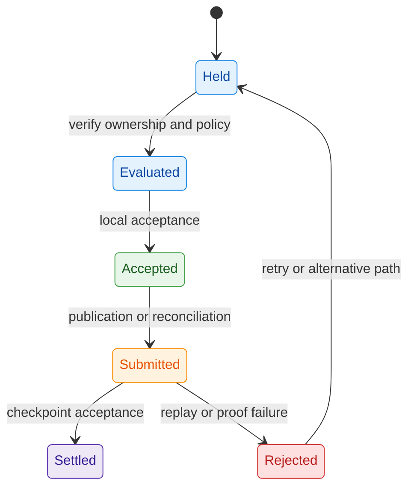
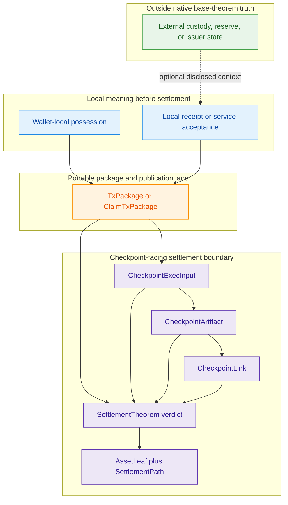
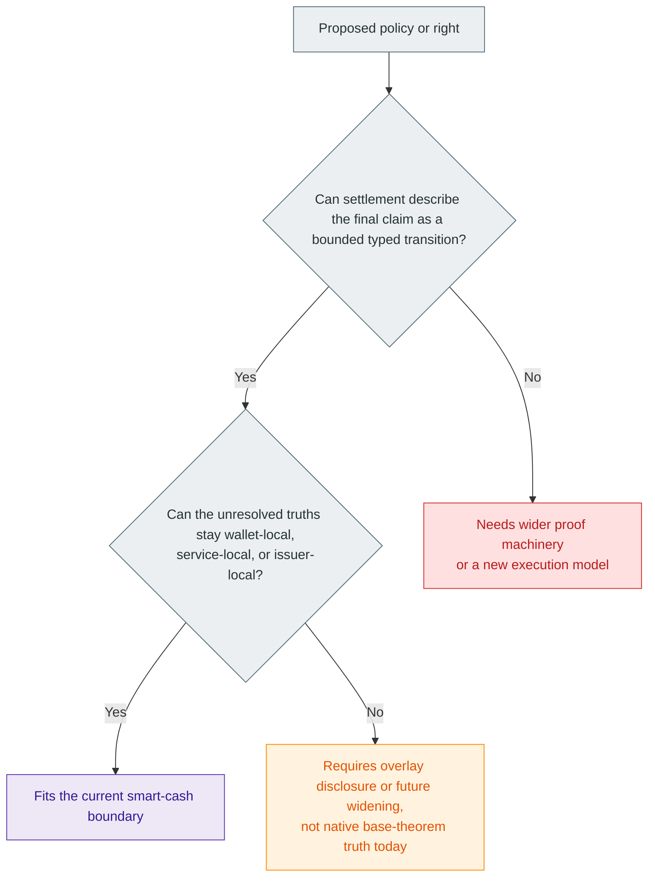
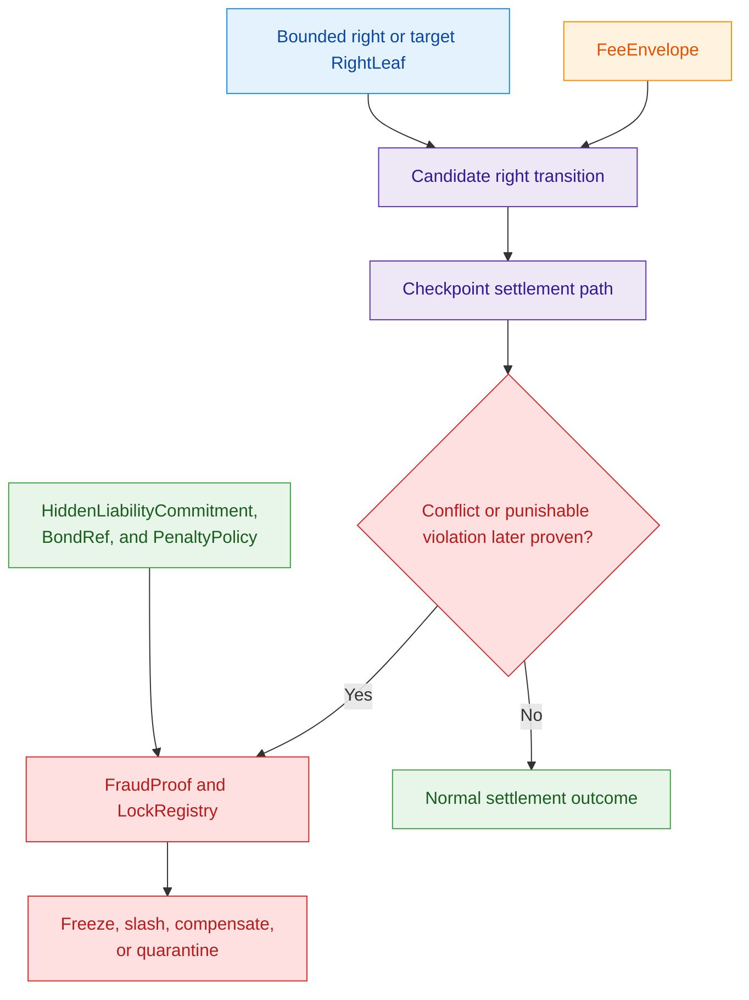
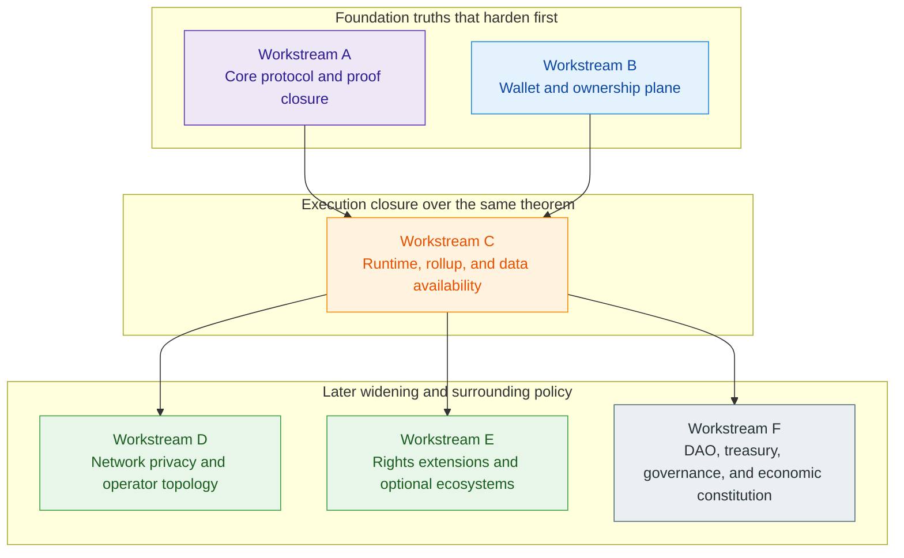

# Z00Z Smart Cash

[TOC]

Version: 2026-07-09

## Key Terms Used In This Paper

This paper uses a compact execution vocabulary because the point is to define
what kind of programmable system Z00Z actually is, and what kind it is not.

- `Smart cash`: The framing in which money and bounded rights carry explicit
  spending, redemption, or usage rules without becoming a universal public
  smart-contract machine.
- `FSM`: A finite-state-machine-style object with a bounded set of valid
  transitions.
- `Client-side FSM`: A bounded state machine whose detailed state lives in the
  wallet, local runtime, or service domain rather than in a universal public
  contract VM.
- `Universal private VM`: The stronger target in which arbitrary hidden program
  execution is validated generically by the chain.
- `RightLeaf`: The live generalized terminal settlement object for a bounded
  non-coin right in the current HJMT settlement family; any future widening
  must preserve that narrow meaning.
- `FeeEnvelope`: The separate object that answers how publication, relay, or
  execution costs are paid; it is not the right itself.

## 1. Why This Document Is Needed

The Z00Z corpus already argues for privacy-first digital cash, wallet-local
possession, bounded rights, checkpointed settlement, and a future `RightLeaf`
direction. What the corpus does not yet have as one explicit boundary document
is the answer to a recurring architectural confusion:

1. Is Z00Z “just money with conditions”?
2. Is Z00Z a generic private smart-contract platform?
3. Which parts of “programmability” belong in simple crypto and bounded
   settlement objects, and which parts require larger proof machinery?

This document is needed because the answer affects roadmap claims, wallet
design, storage vocabulary, right-object shape, and the honest limits of local
implementation plans.

### 1.1 Design Thesis

The design thesis of this paper is:

> Z00Z should be described and designed as a smart-cash and bounded-rights
> settlement system built from client-side FSM objects and checkpointed public
> settlement evidence, not as a universal private smart-contract VM unless a
> future proof system and execution model explicitly widen the protocol.

### 1.2 What This Document Does Not Claim

This paper does not claim that bounded smart cash is trivial, or that every
policy object can be enforced with only simple commitments and signatures. It
also does not claim that Z00Z can never grow into a larger proof-driven
execution system.

The narrower claim is that the corpus needs one explicit boundary that prevents
today's asset, rights, liability, and agent papers from being over-read as a
claim that a universal private VM already exists or is cheap to add.

### 1.3 Boundary Questions

The boundary can be stated through a small set of classification questions that
directly shape object design, roadmap claims, and developer expectations:

1. Is Z00Z best described as smart cash with bounded-right objects or as a
   general private smart-contract platform?
2. Which parts of a policy or workflow belong inside a checkpoint-facing
   settlement object, and which parts must remain wallet-local, service-local,
   or future-proof-system work?
3. What kinds of bounded rights, claims, vouchers, lockers, mandates, or agent
   permissions fit naturally inside the smart-cash model?
4. Which policy families are realistic under simple commitments, signatures,
   Sigma-style proofs, and range proofs, and which require stronger proving
   systems or a wider execution model?
5. How should this boundary constrain roadmap promises, storage vocabulary,
   `RightLeaf` ambitions, and local implementation planning?

## 2. Corpus Review And Source Basis

The execution boundary already exists across the live corpus. What this section
does is gather that boundary into one place and state it plainly enough that
later papers, roadmap claims, and implementation notes do not drift into a
generic private-VM narrative.

Temporary planning notes under `.planning/temp/ideas-docs` were used only as
design pressure. They are not required reading for this paper. The useful
material from those notes has been reinterpreted in Appendix B through
Appendix D using the live Z00Z vocabulary and the current maturity boundary:
smart cash and bounded rights are the architectural center, while universal
private execution remains future-proof-system work.

### 2.1 Live Corpus Sources

The live corpus already splits the answer across a small set of documents that
own different parts of the same boundary:

- [Z00Z Main Whitepaper](Main-Whitepaper.md) defines the core protocol
  thesis: wallet-local possession, checkpointed settlement evidence,
  `TxPackage` and `ClaimTxPackage`, and the distinction between private local
  ownership meaning and public replay-safe settlement.
- [Z00Z Assets, Rights, And Vouchers Whitepaper](Assets-Rights-Vauchers.md)
  defines the clean object split: native `Asset` as final value, `Voucher` as
  conditional value, and `Right` as authority, while narrowing where
  `CashPolicy`, `VoucherPolicy`, and `ActionPool` belong.
- [Z00Z JMT Asset And Right Storage Design](../tech-papers/done/Z00Z-HJMT-Design.md) defines the
  storage and object boundary: `SettlementPath` and `SettlementStateRoot` as
  the live generalized HJMT grammar, `AssetLeaf` and `RightLeaf` as the live
  terminal families, and `FeeEnvelope` as a separate processing-guarantee
  primitive rather than a hidden extension of the right.
- [Z00Z Agentic Offline Economy Whitepaper](Agentic-Offline-Economy.md)
  defines the broader rights vocabulary that pressures the smart-cash
  boundary without dissolving it: spendable rights, spendable capability
  objects, machine capability objects, agent spending envelopes, offline
  receipts, and checkpointed reconciliation.
- [Z00Z Linked Liability Whitepaper](Linked-Liability.md)
  defines the accountability boundary for delayed-connectivity and autonomous
  rights. It introduces `FraudProof`, `BondRef`, `PenaltyPolicy`, and
  `LockRegistry`, while staying explicit that the full production enforcement
  loop remains future work.
- [Z00Z Use Cases Whitepaper](UseCases.md) defines the
  strongest bounded policy and rights families that already fit the Z00Z
  architecture without requiring a universal public contract machine.
- [Z00Z Roadmap Blueprint](../tech-papers/Z00Z-Roadmap-Blueprint.md) defines the maturity
  discipline that prevents this paper from overstating what is live, what is
  only reserved, and what still requires proof-backend or runtime closure.

### 2.2 Corpus Boundary

The corpus is asymmetric by design. Different papers own different parts of the
same boundary, and the boundary becomes clearer when those ownership lines stay
explicit.

| Source family | What it owns | What this paper may safely infer |
| --- | --- | --- |
| Main protocol corpus | wallet-local possession, public settlement evidence, checkpoint authority, package vocabulary | Z00Z already behaves like a bounded private settlement system rather than a public account chain |
| Storage corpus | `AssetLeaf`, `RightLeaf`, `SettlementPath`, root vocabulary, fee separation | object and storage widening must preserve one stable checkpoint-facing settlement grammar |
| Rights and use-case corpus | bounded right families, policy-shaped money, external rights, machine and agent examples | many workflows fit the same smart-cash pattern without implying a generic VM |
| Liability corpus | hidden responsibility, fraud activation, bounded punishment | delayed-connectivity rights need explicit accountability, but the full enforcement pipeline remains future tense |
| Roadmap corpus | live versus reserved maturity, proof-backend honesty, sequencing discipline | widening claims must wait for evidence, not only for architectural attractiveness |

### 2.3 Source Ownership

The papers also divide cleanly by the questions they answer best.

- The main whitepaper owns the answer to what the live settlement model is.
- The JMT paper owns the answer to what the terminal settlement object is and
  how far generalized rights may widen storage vocabulary.
- The use-case and agentic papers own the answer to which bounded rights
  families fit the architecture naturally.
- The linked-liability paper owns the answer to what kind of bounded
  accountability can accompany delayed-connectivity rights without collapsing
  back into public-account punishment.
- The roadmap owns the answer to which widening claims remain future tense.

Taken together, these sources support one disciplined conclusion: Z00Z already
supports a strong smart-cash and bounded-rights narrative, but the corpus does
not yet justify describing the base protocol as a universal private
smart-contract machine.

### 2.4 Temporary Planning Inputs And Non-Authority Pressure

Older ideation notes under `.planning/temp/ideas-docs` about client-side state
machines, smart cash controls, vouchers, offline checks, Bulletproof/Sigma
boundaries, recursive proofs, generic FSM notes, and proof-of-guilt patterns
are useful prompts, but they are not authoritative inputs for this paper.

The rule for this document is therefore strict:

- live claims must come from the `docs/` corpus and the codebase;
- target architecture may extend those claims only in future-tense language;
- temporary planning inputs may pressure-test classifications, but they may
  not define Z00Z's current protocol maturity;
- retained ideas from `.planning/temp/ideas-docs` must appear in the
  appendices as rewritten Z00Z design rationale rather than copied draft text.

## 3. Problem Statement And Requirements

The classification problem is not semantic branding. It changes what readers,
developers, and future implementers will believe the protocol owes them.
If Z00Z is described too narrowly, the corpus fails to explain why rights,
claims, lockers, machine capabilities, and agent envelopes all belong to the
same architecture. If Z00Z is described too broadly, the corpus starts to imply
that a general hidden-state execution platform already exists, or is only a
small step away, when the live evidence does not justify that claim.

### 3.1 Marketing Versus Architecture Risk

Vague phrases such as "private programmable money" or "private smart contracts"
are dangerous here because they compress two very different ideas into one
marketing surface.

The first idea is already well supported by the corpus: a spendable private
object can carry bounded semantics, move locally, and later reconcile through
checkpointed settlement evidence. The second idea is much stronger: the chain
can validate arbitrary hidden program execution over off-chain state without
revealing that state and without reducing the claim to a narrow typed object
transition. Those are not the same claim.

If the papers blur them, several forms of concept drift follow immediately.
Storage readers may start treating `RightLeaf` as a catch-all VM object instead
of a checkpoint-facing bounded settlement leaf. Wallet readers may assume that
every local policy should be upgraded into a chain-validated hidden state
machine. Roadmap readers may misread recursive proof spikes or DAG wrappers as
evidence that a universal private execution layer is already part of the live
base protocol. This paper exists to stop that drift before it hardens into
incorrect architecture language.

### 3.2 Protocol Requirements

An honest smart-cash boundary must preserve five requirements at once.

- Wallet-local possession must remain meaningful before publication. The wallet
  or local service domain must be allowed to hold the richer object state,
  receiver material, and local acceptance context.
- Bounded rights and policy objects must remain first-class. The architecture
  must explain how cash, vouchers, claims, lockers, machine rights, and agent
  envelopes fit one family without pretending they are all the same runtime
  object today.
- Checkpointed settlement evidence must remain the final public authority. A
  local handoff or local receipt may be economically meaningful, but canonical
  acceptance still belongs to checkpoint-coupled public verification.
- Replay discipline must remain explicit and typed. The corpus already treats
  asset presence, claim replay state, package integrity, and checkpoint root
  continuity as protocol truths rather than as optional wallet heuristics.
- The right itself must remain distinct from the fee, publication, or execution
  payment path. `FeeEnvelope` answers who pays for verification, batching,
  relay, or publication; it is not the right itself.

These requirements imply a bounded system, not a weak one. The protocol may
support many families of rights, but it must preserve a narrow public
settlement surface and must not overclaim hidden universal execution.

## 4. Smart Cash As The Live Protocol Boundary

The live corpus already supports a strong and specific description of Z00Z:
smart cash is the base category, and bounded rights are the natural widening of
that category. In this framing, "smart" does not mean "arbitrary hidden
contract execution." It means the spendable object itself can carry bounded
economic meaning, local policy, and a later settlement path without requiring a
public account machine to host every intermediate step.

### 4.1 Cash With Bounded Rules

The use-case corpus already shows the strongest version of this idea. Z00Z can
support cash objects whose meaning is richer than "amount X" without converting
that meaning into a permanently visible public contract log. Expiry,
demurrage, recurring claim windows, merchant scope, delayed release conditions,
IOU semantics, vouchers, and externally backed claims all fit the same family:
the holder carries a private object whose bounded policy travels with it.

That is why the protocol is best described as smart cash before it is described
as anything broader. The wallet-local object can represent money, a claim, a
voucher, a subscription slice, or a redemption right. The public chain does
not need to execute the full social or commercial workflow in public. It needs
only enough evidence to reject malformed, replayed, expired, out-of-scope, or
root-inconsistent transitions once the object reaches settlement.

This is also why Z00Z should not be explained as "ordinary cash first, smart
contracts later." The bounded rules are already part of the object family. They
are simply object-local and settlement-facing rather than generic shared-state
VM rules.

#### Consumer Policy Objects

The consumer-facing version of smart cash is not abstract programmability. It
is a small set of wallet-level objects that ordinary users can understand
without learning a full contract model. The use-cases paper owns the canonical
retail ranking. This paper owns the deeper claim that these cases belong to one
policy-object grammar rather than to many unrelated product categories.

| Consumer object | Bounded rule carried by the object | Why this is better than a public contract default |
| --- | --- | --- |
| Subscription slice or recurring claim | One billing window, one provider scope, one amount cap | Replaces a broad recurring allowance with a one-shot private claim |
| Merchant-bound voucher or local-money unit | Merchant scope, issuer scope, optional expiry or demurrage | Avoids exposing the full redemption graph as visible app-state |
| Expiring coupon or aid unit | Validity window, redemption window, optional circulation rules | Keeps program participation and redemption timing off the default public graph |
| Staged purchase or soft-escrow note | Delayed release, timeout, dispute trigger, partial release path | Avoids turning every intermediate purchase state into a public escrow log |
| Session or access right | One article, VPN session, download, API window, or temporary room | Allows paid access without a standing public subscription or visible account trail |

These are strong consumer cases because the holder can understand the object in
plain terms: "one period," "one merchant scope," "one coupon," "one staged
purchase," or "one access window." The protocol complexity stays underneath
that surface. What the user experiences is private bounded authority instead of
visible contract-state choreography.

### 4.2 Client-Side FSM Objects

The most useful explanatory model for these objects is a client-side FSM
pattern, but the scope of that statement must stay disciplined.

The claim is not that Z00Z already ships a general-purpose FSM runtime. The
claim is narrower: many Z00Z objects already behave like bounded state machines
whose richer state lives in the wallet, local runtime, or service domain.
Local preparation, local policy checks, or local acceptance can happen before
publication. The chain later sees only the bounded settlement evidence needed
to decide whether the transition may enter replay-safe canonical state.

That pattern is already visible across the corpus:

- offline-first transfer packages are meaningful before publication, but only
  checkpointed reconciliation makes them authoritative;
- locker and external-asset rights move privately inside Z00Z while redemption
  and external custody stay outside the protocol boundary;
- machine rights and agent envelopes are described as bounded local rights that
  can be presented, verified, consumed, and later reconciled.

In all three cases, the same division of labor holds: local meaning first,
public authority later. That is the right sense in which Z00Z already behaves
like smart cash built from client-side FSM-style objects.

**Figure 4.1 - Generic client-side FSM lifecycle.** The right can become
economically meaningful in the wallet or service domain first, but canonical
authority appears only after checkpoint-facing settlement accepts the
transition.

The pattern becomes even clearer when the object families are separated by where
their richer state lives and what the public layer later has to accept:

| Object family | Richer local state lives where | Local action may happen before publication | Public settlement later has to verify |
| --- | --- | --- | --- |
| Offline-first cash package | Wallet-held ownership material, receiver context, and local acceptance history | Yes; sender and receiver may exchange and evaluate the package before publication | that the package, replay inputs, and checkpoint artifacts fit one valid canonical transition |
| Locker or external-asset right | Wallet-local private ownership plus external custody or issuer state outside Z00Z | Yes; the internal ownership right may move privately before redemption | that the internal right transition was valid under Z00Z's own settlement grammar, not that foreign custody semantics were natively proven by the base chain |
| Machine or agent right | Rights wallet, local provider context, offline receipt, and bounded service policy | Yes; a device, provider, or agent may act under bounded local risk before reconciliation | that the later package or receipt-bearing transition is replay-safe, fee-supported where required, and consistent with checkpointed settlement evidence |

## 5. What The Chain Actually Verifies

The chain does not verify "everything that happened." It verifies a narrow
public boundary over typed artifacts. That distinction is what keeps the smart-
cash description honest.

### 5.1 Authorized Versus Rule-Correct

Z00Z already distinguishes two different questions that other architectures
often blur together.

The first question is whether a bounded object transition was authorized,
well-formed, replay-safe, and consistent with checkpointed state. This is the
question the live package-verification and settlement-verification surfaces are
built to answer. The second question is whether some arbitrary hidden
application state machine executed correctly under all of its private internal
rules. That is a much stronger question, and the live corpus does not claim
that the base protocol answers it generically.

In other words, the current chain surface verifies bounded public settlement
correctness, not universal hidden program correctness. A holder may locally
apply richer business logic, service logic, or workflow logic before
publication, but the chain's own verdict is narrower: the resulting package and
checkpoint artifacts must fit the typed settlement contract that the live
protocol already exposes.

### 5.2 Public Settlement Surface

The live public settlement surface can be stated precisely.

| Surface | Current status | What it proves |
| --- | --- | --- |
| `AssetLeaf` plus `SettlementPath` | live | one confidential asset right exists or was consumed under a canonical checkpoint-facing path |
| `TxPackage` | live | an ordinary wallet-built transfer candidate is structurally valid, signed, proof-bearing where required, and ready for publication review |
| `ClaimTxPackage` | live | a claim-domain transfer candidate carries its own replay context and settlement intent |
| `CheckpointExecInput`, `CheckpointArtifact`, and `CheckpointLink` | live boundary with ongoing runtime closure around it | the package, the proposed state transition, and the checkpoint-facing artifact agree under replay-safe root continuity |
| `SettlementTheorem` | live conceptual settlement boundary | the public artifact set is sufficient to accept or reject the transition as canonical settlement truth |
| `RightLeaf` | target architecture | a future non-coin settlement leaf can widen object families without changing the core checkpoint-facing settlement grammar |

This surface is already enough to support a strong smart-cash thesis. It is
not yet the surface of a universal hidden execution platform, because it still
reasons through typed settlement objects and typed transition artifacts rather
than through generic opaque program proofs.

**Figure 5.1 - Settlement boundary and off-theorem layers.** The package and
checkpoint artifacts become public settlement truth, while wallet-local,
service-local, and external-custody meaning remains outside the base theorem.

A second boundary table is equally important because Z00Z's uniqueness depends
not only on what becomes public, but also on what is deliberately kept outside
the public settlement theorem.

| Layer | Where it primarily lives | What may become public | What remains outside canonical settlement truth |
| --- | --- | --- | --- |
| Wallet-local possession | wallet, receiver context, and local inventory | only package and settlement artifacts derived from a chosen transition | receiver secrets, scan-derived ownership knowledge, broader local inventory, and private decision history |
| Portable package layer | wallet plus publication lane | canonical package fields, digests, proof-bearing transport fields, and lifecycle-relevant settlement inputs | the holder's broader workflow logic and non-settled alternative local histories |
| Local receipts and bounded service acceptance | merchant, machine, provider, peer, or agent environment | later receipt-bearing package or bounded evidence if the flow settles or disputes | the full local operational transcript and unrelated service telemetry |
| External custody, reserve, or issuer layer | external chain, vault, issuer, or bridge system | whatever supporting evidence a future overlay chooses to disclose | the full foreign trust surface, reserve integrity, and redemption honesty as native base-protocol truth |
| Checkpoint settlement boundary | Z00Z public state and settlement verifier | roots, typed deltas, package linkage, replay artifacts, and checkpoint-bound proof payloads | any claim that the chain also validated a universal hidden application machine |

## 6. Proof Boundary: Simple Crypto Versus General ZK

The proof boundary is the main place where smart-cash language can accidentally
turn into VM language. The corpus already points to a disciplined answer:
bounded policy and bounded rights can go very far under typed commitments,
signatures, replay artifacts, and checkpointed settlement proofs, but those
tools do not automatically imply a universal hidden-state execution layer.

### 6.1 What Simple Crypto Can Enforce

The current Z00Z family is strongest where the right can be reduced to bounded
checks over object identity, ownership authority, amount or quota discipline,
scope, expiry, and replay context.

That family already includes:

- confidential amounts or bounded value movement carried through commitments
  and range-proof-checked output structure;
- object-local policies such as expiry windows, merchant or provider scope,
  recurring claim slices, or delayed release conditions;
- bounded external rights such as lockers, vouchers, and privately reassigned
  claims over externally custodied value;
- machine and agent rights whose local presentation and later reconciliation
  can still be reduced to typed package, receipt, replay, and fee surfaces.

The common property is not one specific cryptographic primitive. It is that the
settlement rule can still be explained as a bounded object transition with
explicit typed evidence. As long as the verifier checks a fixed set of fields,
proofs, and replay conditions, the system remains inside the smart-cash
boundary.

The use-case and rights corpus can therefore be split into a more operational
fit matrix:

| Policy or right family | Fits the current smart-cash boundary? | Why |
| --- | --- | --- |
| Expiry, merchant scope, recurring claim windows, delayed release, and other cash-policy rules | Yes | the object can carry bounded validity and scope while settlement later checks only the final typed transition |
| Private reassignment of externally backed claims or locker-style rights | Yes, with explicit service-boundary caveats | Z00Z can privately move the internal right while keeping external custody, reserve, and redemption trust outside the base theorem |
| Machine budgets, access rights, compute or API credits, and agent envelopes | Yes as bounded-right architecture | the local action can still reconcile through packages, receipts, replay discipline, and separate fee handling without requiring a generic VM |
| Fraud activation, future-right freeze, and compensation flows | Partially, as architecture direction | the object model is clear, but the full `FraudProof` and `LockRegistry` enforcement loop remains future-tense |
| Foreign reserve integrity, issuer solvency, or redemption honesty | No, not as native base-protocol truth today | these belong to issuer, bridge, custody, or enterprise overlays rather than to the live settlement theorem |
| Arbitrary hidden branching workflow with large opaque intermediate state | No, not without wider proof machinery | this crosses from bounded typed settlement into general hidden-state execution |

**Figure 6.1 - Classification test for smart-cash fit.** The real question is
not whether a right sounds programmable, but whether settlement can still
express it as bounded typed evidence under the live theorem.

### 6.2 Where General ZK Becomes Necessary

The boundary widens the moment the protocol wants the chain to accept a claim
of the form "the hidden machine executed correctly" without reducing that claim
to a small typed transition that the current settlement surface already knows
how to interpret.

That wider category includes cases where:

- the relevant policy depends on large opaque intermediate state rather than on
  bounded fields carried by the right or package;
- the verifier must accept hidden branching logic or hidden workflow state as
  correct without learning the internal state;
- multiple local steps must be compressed into one generic proof of execution
  rather than one typed proof of bounded settlement correctness;
- checkpoint proof bytes stop being opaque statement-bound artifacts and become
  a canonical proof backend for general hidden computation.

This is exactly where stronger proving systems, recursive checkpoint proof
work, or a new execution model would become necessary. The roadmap already
marks those directions as future-tense. This paper should do the same.

#### Container-Control Rights And Execution Tiers

This distinction becomes especially important for so-called smart containers.
The disciplined claim is not that Z00Z should run arbitrary container code or
that every external execution environment becomes a native hidden VM. The
disciplined claim is narrower: Z00Z can settle a **container-control right** so
long as the final public question still reduces to a bounded typed transition
with bounded evidence.

In the narrow smart-cash reading, the right may commit to a program class,
input commitment, output commitment, policy commitment, and evidence class.
Settlement then checks only that the required bounded evidence was presented
for the claimed right transition. The protocol does not need to host the full
execution trace, wider service telemetry, or a universal hidden-state machine
in order to make that settlement decision.

The safest execution tiers can therefore be stated directly:

| Execution tier | What the right can safely claim at settlement time | Why it can still fit the smart-cash boundary |
| --- | --- | --- |
| Deterministic core VM | A narrow program commitment and deterministic result under a small fixed semantics | The verifier still checks a fixed typed statement rather than a general opaque machine |
| ZK execution proof | A bounded statement that one committed program and one committed input produced one committed result | The proof widens assurance, but the settlement claim is still one typed right transition |
| Optimistic execution | A right was exercised under a challenge window with replay-safe settlement only after non-conflict and non-challenge | The chain settles a bounded claim plus dispute path rather than a full hidden workflow log |
| Attested execution | A designated attester or service class signed that the committed execution policy was satisfied | The theorem stays honest because the attestation is explicit external evidence, not native execution truth |

The red line is equally important. Once the chain is asked to accept "the
entire hidden container executed correctly" as a native theorem without
reducing that claim to a bounded statement, the system has moved beyond the
current smart-cash boundary and into a wider proof or VM model. That may be a
future direction, but it should not be smuggled into present-tense smart-cash
language.

### 6.3 Why The Distinction Matters

This distinction matters because otherwise the roadmap starts promising the
wrong thing.

If bounded object settlement and general hidden execution are treated as
interchangeable, a recursive-proof spike can be misread as live private VM
delivery, a future DAG wrapper can be misread as a second contract layer, and a
target `RightLeaf` runtime can be misread as a universal rights computer. None
of those readings is faithful to the corpus.

The honest product line is stronger than that confusion. Z00Z is already
distinctive as smart cash and bounded rights. It does not need premature
private-VM language to sound important, and that language would only make the
implementation roadmap less honest.

## 7. Right Objects, Fee Objects, And Liability Objects

The bounded-right architecture stays coherent only if different object families
keep their own jobs. The right answers what action or claim exists. The fee
object answers how processing is paid for. The liability object answers what
happens if delayed-connectivity use later proves abusive. If those jobs are
collapsed into one vague "smart object," the corpus loses the clean boundary it
has been building.

**Figure 7.1 - Right, fee, and liability role split.** One transition may need
all three layers, but they still answer different questions and should remain
different object families.

### 7.1 RightLeaf Boundary

`RightLeaf` should mean one thing only: a live checkpoint-facing terminal
settlement object for a bounded non-coin right that obeys the same generalized
HJMT storage and settlement grammar as asset-bearing terminal state.

That means live and future-widened `RightLeaf` semantics should still be:

- a typed terminal settlement leaf under a canonical path;
- publicly committed settlement state rather than a wallet-only hint;
- meaningful through bounded transition rules such as issue, consume, expire,
  transform, redeem, or settle;
- narrow enough that one proof envelope can still explain its settlement role.

What it must not silently absorb is just as important. `RightLeaf` should not
become a hidden universal workflow transcript, a global capability registry, a
generic service database, or a placeholder name for "whatever richer VM object
we might want later." If the corpus widens to `RightLeaf`, it should still be
widening the smart-cash settlement family, not abandoning it.

### 7.2 FeeEnvelope Boundary

The corpus already treats `FeeEnvelope` as a separate primitive because a
bounded right and a processing guarantee answer different questions.

The right says what may be spent, redeemed, claimed, exercised, or consumed.
The fee object says who pays for verification, batching, publication, relay,
and settlement of that action, under what budget, and under what priority or
mode. This distinction matters even more for non-coin rights than for coins.
Machines, agents, claims, and lockers often need narrow authority without
handing the holder a freely reusable liquid wallet.

That is why a fee surface must remain explicit. A right may be paired with a
native fee output, a fee credit, an embedded fee budget, or a sponsor reserve,
but the fee path should remain visible as its own contract family. Otherwise
the right silently expands into hidden general wallet authority, which is the
opposite of the bounded-right thesis.

### 7.3 Liability And Fraud Boundaries

Linked Liability shows how accountability can widen the architecture without
turning it into a universal adjudication runtime.

The liability corpus already gives the narrow vocabulary for this layer:
`HiddenLiabilityCommitment`, `FraudProof`, `BondRef`, `PenaltyPolicy`, and
`LockRegistry`. These objects do not imply that every dispute becomes generic
on-chain litigation. They imply something narrower and more useful: delayed-
connectivity rights can carry hidden answerability from the start, and proven
conflict can later activate bounded locks, freezes, slashing, or compensation.

This remains future-tense in one critical respect. The full production proof,
lock, slash, and unlock pipeline is not yet a landed live protocol surface.
What is live today is the architectural fit: bounded rights may need bounded
accountability, and that accountability should remain explicit, typed, and
domain-scoped rather than dissolving into a public-account punishment model.

## 8. Supported FSM Families

The smart-cash boundary becomes clearer when the supported object families are
named directly. The point is not to prove that only these families will ever
exist. The point is to identify the families that already fit the current
corpus without requiring a universal hidden execution claim.

### 8.1 Cash Policies

Cash-policy objects are the clearest family because they stay closest to money
while still proving that the spendable object can carry bounded rules.

This family includes:

- ordinary confidential transfers whose meaning is still cash-like;
- expiry or validity-window rules;
- demurrage or circulation-shaping policies;
- merchant- or provider-scoped spending;
- recurring subscription-style claim windows;
- delayed release, IOU, or soft chargeback semantics where the right remains
  bounded and checkpoint-settled.

All of these fit because the public layer still only needs to verify a bounded
object transition. The chain does not need to host every intermediate policy
state as a visible application log. Policy travels with the object, and
settlement later verifies only the narrow conditions needed for a valid
transition.

### 8.2 Voucher, Locker, And Claim Objects

Voucher, locker, and claim objects are the second natural family because they
show that Z00Z is not only a better rail for internally native coins.

This family includes privately circulating vouchers and aid units, externally
backed claims, stable-value claim objects, and locker-style rights over value
that remains custodied elsewhere. The common pattern is that the economically
relevant right moves privately inside Z00Z while redemption, custody, or issuer
operations remain outside the core protocol boundary.

Two discipline rules matter here. First, the use-case paper's convenient phrase
"offline check" should still be read as a wallet-portable package plus later
publication, not as a second consensus object family. Second, the locker thesis
should remain bounded: Z00Z is strongest when it privately moves the ownership
right itself, while external reserve integrity, custody honesty, or redemption
operations remain separate service or issuer responsibilities.

### 8.3 Agent And Machine Rights

Machine and agent rights are the forward widening of the same family, not a
different architecture.

The agentic corpus already names the strongest examples: `MachineCapabilityObject`,
agent spending envelopes, tool credits, compute credits, access rights, task
escrows, reward claims, and offline receipts that later enter checkpointed
reconciliation. These rights are meaningful before publication, but they still
become authoritative only through the same delayed-settlement discipline that
the cash and claim families already use.

This is exactly why the machine and agent papers pressure the smart-cash
boundary without breaking it. They show how far bounded private rights can
widen while still remaining object-local, fee-separated, checkpoint-settled,
and explicit about future liability or proof requirements.

## 9. Unsupported Or Future-Only Claims

The corpus becomes more coherent, not less, when it says plainly what it does
not claim yet.

### 9.1 No Universal Private VM By Default

Z00Z does not currently claim a general private smart-contract VM from its live
asset-centric, package-centric, and checkpoint-centric ingredients alone.

The current corpus justifies a different claim: bounded private objects can be
prepared locally, can carry meaningful rules, and can later settle through a
narrow public checkpoint surface. That is already a major architectural
position. It is not the same as claiming that arbitrary hidden program logic
can be executed and validated generically by the chain today.

This statement should remain explicit because it protects the whole corpus from
being over-read. Wallet-local policy, service-local workflow, issuer-local
logic, or future proof-backed widening may all exist around the protocol. None
of that changes the present-tense boundary of the live base protocol.

### 9.2 Future Widening Conditions

Before the corpus could honestly widen the claim beyond smart cash and bounded
rights, several things would have to become true at the same time.

1. A generalized non-coin settlement runtime would need to land as more than
   terminology, with `RightLeaf`-family objects, stable path and proof rules,
   and synchronized storage, wallet, and settlement semantics.
2. A proof backend would need to do more than carry opaque checkpoint proof
   bytes. It would need to define what hidden-state or hidden-execution claims
   are being proven and how those claims relate to the canonical settlement
   statement.
3. Recursive checkpoint proof work would need to graduate from future proof-
   backend direction into a stable, evidence-backed public theorem.
4. Future DAG or delayed-connectivity widening would need to remain a wrapper
   over the current package family rather than an uncontrolled second execution
   model.
5. Liability, lock, and compensation machinery would need to move from
   architectural specification into a completed and verifiable enforcement path
   for the right families that depend on it.

Until those conditions are met, the disciplined claim remains the one this
paper makes: Z00Z is a smart-cash and bounded-rights settlement system, not yet
a universal private execution platform.

## 10. Relationship To Roadmap And Implementation

The conceptual boundary only matters if it changes implementation discipline.
The roadmap already provides that discipline; this paper translates it into the
object and language choices that implementers should preserve.

### 10.1 Storage And Object Model Consequences

The first consequence is storage honesty.

`AssetLeaf` remains the live asset-bearing terminal settlement noun, and HJMT
already exposes live `RightLeaf` plus `SettlementStateRoot` under the
generalized settlement grammar. Older asset-centric names such as `AssetPath`
and `AssetStateRoot` remain compatibility vocabulary rather than the preferred
live contract surface.

The smart-cash boundary also implies that canonical storage should keep one
stable semantic hierarchy. `SettlementPath { definition_id, serial_id,
terminal_id }` now names the preferred live grammar well, while older
asset-centric path vocabulary remains compatibility-only. Generalized rights
should inherit that discipline rather than replacing it with a public account
tree or a generic workflow database. `FeeEnvelope`, claim replay state, and
future liability surfaces should remain distinct object families rather than
being folded into one overgeneralized settlement leaf.

### 10.2 Wallet And UX Consequences

The second consequence is wallet discipline.

The wallet should remain the place where local policy evaluation, local risk
decisions, receiver material, and rights inventory meaning live. That means UX
should present inventory as spendable objects, claims, vouchers, rights,
budgets, or receipts under bounded scopes, not merely as public-account-style
balances. It also means offline or delayed-connectivity acceptance should be
framed as bounded local acceptance with later checkpointed reconciliation, not
as unconditional local finality.

This boundary also helps separate wallet UX from service UX. Selective
disclosure, enterprise evidence packages, issuer-specific redemption flows, and
regulated workflows may all live above the protocol line. The wallet should
support those paths without pretending that the protocol itself has become a
universal workflow engine.

### 10.3 Local Planning Consequences

The third consequence is planning discipline.

Near-term work should keep closing the existing authority planes that the
roadmap already names: storage-owned replay truth, wallet-owned possession
truth, and checkpoint-bound settlement truth. That means package verification,
wallet-storage convergence, runtime and validator closure, and checkpoint
evidence stability remain the core implementation agenda.

Reserved widening lanes should stay reserved until they gain evidence. A future
DAG wrapper should stay a wrapper over the current package family. Recursive
checkpoint proofs should stay proof-backend spikes until they define a stable
public theorem. Future right-family work should widen object families in a way
that preserves fee separation, replay discipline, and checkpoint-facing
settlement rather than reopening the protocol as a generic hidden execution
surface.

In short, local plans should treat "smart cash first, bounded rights next,
stronger proof systems later" as an implementation ordering rule, not merely as
a wording preference.

The roadmap already gives that ordering a concrete workstream shape:

**Figure 10.1 - Conceptual dependency order, not a dated schedule.** Foundation
truths harden first, runtime closure follows, and only then do optional rights
widening and surrounding governance layers become safe to expand.

| Workstream | Smart-cash boundary consequence |
| --- | --- |
| Workstream A: Core protocol and proof closure | keeps settlement meaning narrow, typed, replay-safe, and checkpoint-bound before any future proof backend widens the claim |
| Workstream B: Wallet and ownership plane | keeps wallet-local possession, receiver-derived ownership, and offline or delayed package discipline as the private meaning layer before settlement |
| Workstream C: Runtime, rollup, and data availability | turns package and checkpoint truths into executable publication and replay loops without redefining what a valid transition means |
| Workstream D: Network privacy and operator topology | may improve ingress privacy and deployment resilience, but only after lower settlement truths are already hardened |
| Workstream E: Rights extensions and optional ecosystems | widens into lockers, disclosure, linked liability, machine rights, and agentic overlays without redefining the base theorem as a universal execution surface |
| Workstream F: DAO, treasury, governance, and economic constitution | constrains treasury, challenge, and execution-control policy around the protocol instead of silently widening the protocol into policy-driven hidden computation |

## 11. Open Questions

The smart-cash boundary is clear enough to state now, but several important
questions remain open:

- Which non-coin right families deserve first-class canonical runtime status
  first: lockers, vouchers, claim rights, machine capability objects, or agent
  spending envelopes?
- At what point does a minimal policy description language become valuable,
  and how can it remain bounded enough not to mutate into a stealth universal
  VM claim?
- Which liability-heavy families need stronger proof machinery before they can
  move from architecture language into live protocol claims?
- How should wallet UX communicate local acceptance risk so that "meaningful
  before publication" is understood correctly and not confused with final
  settlement?
- What evidence threshold should the roadmap require before recursive proof or
  generalized-rights work may widen the paper's public claims?
- Where exactly is the line at which widening stops being smart cash and
  becomes a qualitatively different execution platform?

## 12. Conclusion

The corpus already supports a strong and distinctive answer to the "what is
Z00Z?" question.

Z00Z is strongest when it is described as a smart-cash and bounded-rights
settlement system built from wallet-local objects, client-side FSM-style local
meaning, explicit fee separation, and checkpointed public settlement evidence.
That framing explains digital cash, vouchers, lockers, claims, machine rights,
and agent budgets without overstating the live protocol.

The same corpus also supports an equally important negative statement. Z00Z is
not made stronger by being loosely marketed as a generic private smart-contract
chain before the necessary proof, runtime, and generalized-right object work
actually lands. The disciplined claim is already powerful enough: smart cash
first, bounded rights second, wider hidden execution only if future evidence
earns it.

## Appendix A. Glossary

| Term | Meaning in this paper |
| --- | --- |
| `Smart cash` | Private spendable money and money-like rights whose bounded semantics travel with the object instead of requiring a universal public contract machine |
| `FSM` | A finite-state-machine-style object with a bounded set of valid transitions |
| `Client-side FSM` | A bounded state machine whose richer local state lives in the wallet, local runtime, issuer domain, or service domain, while the chain later checks only the bounded settlement evidence needed for canonical acceptance |
| `Universal private VM` | A stronger target architecture in which arbitrary hidden program execution is validated generically by the chain rather than through typed bounded settlement objects |
| `Wallet-local possession` | Ownership material, receiver material, and transfer preparation that remain meaningful before publication |
| `Checkpoint` | The public validation boundary that commits ordered publication into replay-safe canonical state |
| `Settlement evidence` | The roots, deltas, proofs, and publication artifacts needed to verify a bounded transition |
| `Asynchronous rights settlement` | The pattern in which local possession and local acceptance may precede publication, while final authority remains checkpoint-bound |
| `AssetLeaf` | The live public committed settlement object that represents one confidential asset right in canonical state |
| `RightLeaf` | The live generalized checkpoint-facing terminal settlement object for a bounded non-coin right under the current HJMT settlement contract |
| `SettlementPath` | The live canonical locator for one settlement object under the current generalized HJMT grammar, composed as `definition_id`, `serial_id`, and `terminal_id` |
| `AssetPath` | The archived compatibility locator from older asset-centric materials |
| `TxPackage` | The wallet-side canonical envelope for an ordinary transfer candidate before publication and checkpoint settlement |
| `ClaimTxPackage` | The wallet-side canonical envelope for a claim-domain transfer candidate with its own replay context |
| `CheckpointExecInput` | The public replay input that carries one proposed checkpoint transition into settlement verification |
| `CheckpointArtifact` | The final checkpoint-bound artifact that seals roots, typed deltas, statement binding, and proof payload |
| `CheckpointLink` | The linkage artifact that ties checkpoint identity back to execution input and snapshot continuity |
| `SettlementTheorem` | The checkpoint-coupled public consistency relation that verifies package, execution input, checkpoint artifact, link, roots, proofs, replay, and inclusion under the current rules |
| `FeeEnvelope` | The separate object that answers who pays for verification, batching, relay, or publication of a right transition |
| `Offline check` | A use-case shorthand for a wallet-portable transfer or claim package that can move before checkpoint settlement; in the live protocol direction, this still means package handoff plus later publication and reconciliation |
| `Offline receipt` | A signed local proof that a right was presented, accepted, and exercised before checkpointed reconciliation |
| `MachineCapabilityObject` | A private spendable right held by an autonomous physical object to authorize bounded offline resource or infrastructure access |
| `Agent spending envelope` | A bounded private mandate that gives an agent task-scoped budget, fee capacity, and action limits without full wallet authority |
| `FraudProof` | A bounded evidence object that proves conflicting use or another punishable violation strongly enough to activate a liability path |
| `PenaltyPolicy` | The rule set that defines lock, slash, quarantine, cooldown, compensation, and unlock behavior after valid fraud activation |
| `LockRegistry` | The public or checkpoint-visible registry of activated liability locks, quarantine states, and unlock conditions |
| `LiabilityDomain` | The hidden responsibility scope that answers for fraud within one bounded offline, delayed, or autonomous right family or execution lane |

## Appendix B. Absorbed Temporary Planning Inputs

This appendix replaces the need to read the temporary planning notes that
inspired this paper. The notes explored Z00Z as a client-side state-machine
system, contrasted simple cryptographic predicates with universal private
execution, and proposed product-facing "smart cash" examples. This paper keeps
only the parts that survive the live corpus and current code boundary.

| Planning pressure | Retained design idea | Z00Z rewrite used in this paper |
| --- | --- | --- |
| Coins, lockers, and vouchers can all be read as state machines. | A spendable object can move through a bounded lifecycle before settlement. | Z00Z is described as smart cash and bounded rights built from client-side FSM-style objects, not as a generic VM. |
| The chain can arbitrate a transition without storing every private detail. | Public settlement should accept only the narrow evidence needed for replay-safe canonical state. | The chain verifies typed package, replay, root, and checkpoint consistency; richer workflow meaning stays wallet-local, service-local, issuer-local, or future proof-backed. |
| A wide class of policies can be reduced to amount, quota, scope, membership, expiry, counter, or status checks. | These policies fit the smart-cash boundary when they remain bounded object transitions. | Cash policies, vouchers, lockers, claim rights, machine rights, and agent envelopes are normalized as bounded-right families. |
| Bulletproof/Sigma-style tools help with ranges, commitments, ownership, and membership. | Specialized proofs can support bounded settlement predicates. | They do not imply a universal hidden execution platform; general hidden computation remains a future proving-system question. |
| A universal private FSM would need a stronger proof layer. | Arbitrary hidden branching, large opaque state, or multi-step private execution cannot be claimed from the live settlement nucleus alone. | Future recursive proofs, zkVM-style execution, or generalized proof backends remain optional widening work, not present-tense base protocol. |
| Offline voucher flows need conflict handling and guilty-party evidence. | Delayed-connectivity acceptance must include a path to bounded accountability. | Linked-liability terms such as `FraudProof`, `BondRef`, `PenaltyPolicy`, and `LockRegistry` are treated as architecture direction with future enforcement closure. |
| DAG-like off-chain histories can help model local state forks. | Local or service-side histories may need deterministic conflict-resolution rules. | DAG wrappers remain outside canonical settlement unless they collapse back into `TxPackage`, `ClaimTxPackage`, and checkpoint-facing evidence. |
| Product language should emphasize understandable cash and rights features. | The architecture is clearer when explained as programmable limits, scoped spend, lockers, and offline risk controls. | The paper avoids claiming "smart contracts enforced by Bulletproofs" and instead uses smart-cash vocabulary tied to bounded settlement objects. |
| Provider or DA-specific architecture can support publication. | Publication and availability layers may carry the eventual evidence. | DA, PTB, Celestia, aggregator, or proof-bundling details are not requirements of the smart-cash definition itself. |

The retained core is therefore narrow: Z00Z can honestly claim bounded,
private, wallet-local rights whose final public settlement is checkpointed and
typed. It cannot honestly claim a universal private smart-contract machine
until the proof system, runtime, and generalized-right object model are all
specified, implemented, and verified.

## Appendix C. Code And Corpus Signature Alignment

This appendix records the live names that constrain smart-cash wording. It is a
signature check, not a new API proposal. Future smart-cash or right-object work
must bind to these surfaces instead of replacing them with draft-only generic
FSM terminology.

| Surface | Current signature or corpus status | Smart-cash constraint |
| --- | --- | --- |
| `AssetLeaf` | Live code-backed public asset leaf with `asset_id`, `serial_id`, `r_pub`, `owner_tag`, `c_amount`, `enc_pack`, `range_proof`, and `tag16` | Present-tense settlement examples must start from `AssetLeaf`, not from a generic object note. |
| `SettlementPath` | Live code-backed path with `definition_id`, `serial_id`, and `terminal_id` | Bounded-right widening should preserve the generalized settlement path discipline instead of becoming a public account or workflow database. |
| `AssetPath` | Archived compatibility path name from older asset-centric material | Keep only for historical or migration discussion; use `SettlementPath` for live HJMT prose. |
| `AssetStateRoot` | Archived compatibility asset-state root name | Keep only for historical or migration discussion; do not present it as the preferred live public root. |
| `TxPackage` | Live wallet envelope with `kind`, `package_type`, `version`, chain fields, `tx`, `tx_digest_hex`, and `status` | Smart-cash transfers remain package candidates before publication and checkpoint settlement. |
| `TxWire` | Live ordinary transaction payload with `inputs`, `outputs`, `fee`, `nonce`, `context`, `proof`, and `auth` | Policy-bearing cash must still bind output meaning, fee intent, proof material, and authorization through the package family. |
| `ClaimTxPackage` | Live claim envelope with the same outer package pattern and claim-specific `tx` payload | Claim rights must stay distinct from ordinary spend flows and preserve claim replay context. |
| `ClaimTxWire` | Live claim transaction payload with `inputs`, `outputs`, `fee`, `nonce`, `context`, `proof`, and `auth` | Claim-domain smart-cash work cannot be collapsed into ordinary cash wording without losing replay semantics. |
| `ClaimNullifier` | Live storage-owned 32-byte claim replay key | Claim and voucher language must preserve explicit replay discipline. |
| `ClaimSourceRoot` | Live storage root wrapper over a `SettlementStateRoot` plus root version | Claim source evidence is storage-owned support for replay and settlement; it is not a generic VM state root. |
| `CheckpointExecInput` | Live checkpoint replay input with `version`, `prep_snapshot_id`, `prev_root`, and `txs` | Public settlement must stay replay-input based, not generic hidden workflow validation. |
| `CheckpointArtifact` | Live final artifact with version, height, roots, optional claim root, typed deltas, optional statement IDs, proof system, and proof bytes | Checkpoint artifacts seal typed settlement transitions; they do not by themselves prove arbitrary private program execution. |
| `CheckpointLink` | Live link over checkpoint identity, snapshot identity, execution input, and link binding | Future rights must preserve checkpoint continuity rather than bypassing it through local FSM history. |
| `SettlementTheorem` | Live rollup-side bundle over `TxPackage`, `CheckpointArtifact`, `CheckpointExecInput`, and `CheckpointLink` | Smart-cash settlement must ultimately fit this public consistency relation or a future explicitly widened theorem. |
| `ReceiverCard`, `PaymentRequest`, and `ScanStatePayload` | Live wallet receive, request, and scan-state surfaces | Wallet-local possession and receive interpretation remain wallet-owned; smart-cash policy cannot become helper-owned or account-table-owned. |
| `RightLeaf` | Live code-backed bounded-right settlement struct in the searched HJMT/storage crates | Future rights work must preserve its narrow settlement meaning instead of turning it into a generic VM bucket. |
| `SettlementStateRoot` | Live public semantic root in the searched HJMT/storage crates | Use as the preferred live public root term; do not substitute backend roots or archived aliases. |
| `FeeEnvelope` | Live code-backed separate processing-guarantee object in the searched HJMT/storage crates | Keep fee payment separate from the right itself. |
| `MachineCapabilityObject`, `Agent spending envelope`, and `Offline receipt` | Corpus-defined agentic-right nouns | Treat them as bounded-right architecture and wallet/service-local evidence unless future code promotes them. |
| `FraudProof`, `BondRef`, `PenaltyPolicy`, and `LockRegistry` | Corpus-defined linked-liability nouns | Treat the full enforcement loop as future work until code and settlement surfaces land. |

The corpus also constrains wording:

- `RightLeaf`, `VoucherLeaf`, and `SettlementStateRoot` are already live HJMT
  contract terms, while broader rights-runtime widening still requires
  explicit migration and proof rules.
- `FeeEnvelope` is a support object for processing guarantees, not hidden
  general wallet authority.
- `TxPackage` and `ClaimTxPackage` are transport and settlement-candidate
  envelopes, not final settlement.
- Local receipts, offline checks, and delayed-connectivity exchanges can be
  economically meaningful before publication, but checkpointed settlement
  remains authoritative.
- Specialized zero-knowledge tools for range, ownership, and membership checks
  do not automatically create a universal private execution machine.

## Appendix D. Concept-Drift Guardrails

The temporary planning notes contained useful engineering pressure, but several
ideas would drift if imported directly. These guardrails are the rules this
paper applies when translating that material.

| Draft idea or wording | Guardrail used here |
| --- | --- |
| Z00Z is already a universal client-side FSM engine. | Say Z00Z has client-side FSM-style bounded objects; do not claim a general FSM runtime is live. |
| A generic object or FSM note can replace the current object model. | Keep `AssetLeaf` live, `RightLeaf` future, and canonical path discipline intact. |
| Bulletproofs/Sigma enforce arbitrary smart-contract conditions. | Limit the claim to bounded predicates such as ranges, linear relations, ownership, membership, counters, statuses, expiry, and replay context. |
| "80-90% of use cases" are covered by simple crypto. | Do not import unsourced quantitative coverage claims. Use qualitative fit classes and require implementation evidence. |
| A private VM is just the next small step. | Treat arbitrary hidden branching, large private state, and general hidden execution as future proof-system work. |
| Product slogans such as "smart contracts enforced by Bulletproofs." | Use smart-cash and bounded-rights language tied to concrete settlement objects and proof boundaries. |
| Offline voucher transfer is final because a local party accepted it. | Keep local acceptance separate from checkpoint-bound settlement and future liability activation. |
| Deposit rejection can be reduced to a finished "accept or proof-of-guilt" API. | Keep proof-of-guilt as a useful invariant direction for offline vouchers and liability, not as a live protocol surface. |
| DAG room-state or off-chain event graphs are part of canonical settlement. | Treat them as local or service-side conflict-resolution structures unless they collapse into package and checkpoint evidence. |
| Celestia, PTB, or a specific DA/prover topology is intrinsic to smart cash. | Keep this paper provider-neutral; those details belong to runtime, DA, and roadmap documents. |
| Lockers, external custody, and reserve honesty are natively proven by the base chain. | Z00Z can privately move internal rights; external custody, issuer solvency, and redemption honesty remain overlay or issuer truths. |
| Linked-liability names imply the full slash/freeze/unlock loop is shipped. | State the architectural fit and keep production enforcement future-tense until implementation evidence exists. |

The intended result is a sharper claim, not a smaller one: Z00Z is powerful
because smart cash and bounded rights are concrete enough to implement and
verify. It becomes weaker, not stronger, if those claims drift into unsupported
private-VM language.

## Appendix E. Research-Derived Smart-Cash Extensions

This appendix translates e-cash, auditable-cash, and channel research into
Z00Z smart-cash architecture. It adds design vocabulary for future work without
claiming that those mechanisms are already live.

| Source article anchor | Smart-cash extension | Required Z00Z wording or signature |
| --- | --- | --- |
| [Auditable, Anonymous Electronic Cash, pp. 1-2, 8, 10, 13](<../articles/Auditable, Anonymous Electronic Cash.pdf#page=1>) | Smart cash should separate supply audit from transaction tracing. | A future issuer lane should define `SupplyAuditRoot`, `IssuanceCommitment`, and `InvalidationEvent` so an auditor can verify issued, outstanding, or invalidated supply without learning the ordinary holder graph behind `AssetLeaf` ownership. |
| [Auditable, Anonymous Electronic Cash, pp. 2, 8, 13-15](<../articles/Auditable, Anonymous Electronic Cash.pdf#page=2>) | Non-rigid invalidation belongs at the right or issuance domain, not at a public wallet identity. | Use `non_rigid_invalidation(policy_id, right_commitment)` for future revocation or correction flows. The invalidation target should be the bounded right, certificate, or issuance entry, not the user's whole wallet. |
| [Fully Anonymous Transferable Ecash, pp. 7-14](<../articles/Fully Anonymous Transferable Ecash.pdf#page=7>) | Portable cash objects need explicit size and compaction rules. | Future offline `TxPackage` or note-like wrappers should carry `PackageHistoryBound`. If the portable history exceeds policy, the wallet must reconcile, compact, cash in, or checkpoint before further transfer rather than growing an unbounded bearer object. |
| [Anonymous Transferable E-Cash, pp. 17-22](<../articles/Anonymous Transferable E-Cash.pdf#page=17>) and [A Survey on Anonymity, Confidentiality, and Auditability, pp. 5, 18](<../articles/A Survey on Anonymity, Confidentiality, and Auditability.pdf#page=5>) | Re-randomized presentation is a useful smart-cash concept even if Z00Z does not adopt malleable signatures directly. | Future receipt or certificate design may use `refresh_presentation(old_evidence, context) -> unlinkable_evidence` as a requirement: the refreshed object must remain verifiable under the same settlement relation while avoiding stable presentation fingerprints. |
| [Fully Anonymous Transferable Ecash, pp. 9-12, 14](<../articles/Fully Anonymous Transferable Ecash.pdf#page=9>) | Issuer unlinkability should be explicit for private cash issuance. | If an issuer authorizes minting or claim conversion, the design should separate `IssuanceAuthorization` from the later `AssetLeaf` or `RightLeaf` appearance. The issuer may know it authorized supply, but should not automatically learn which later leaf belongs to the withdrawing wallet. |
| [PCH-based privacy-preserving with reusability, pp. 1-7, 9, 11-14](<../articles/PCH-based privacy-preserving with reusability.pdf#page=1>) | Reusable deposits are a future smart-cash channel pattern, not a base settlement replacement. | Introduce target nouns `ReusableDepositCertificate`, `DepositSplitProof`, and `VirtualChannelWallet` for a future L2 lane. These certificates should let a locked deposit be divided or reused across private virtual channels without turning the hub into a relationship graph oracle. |
| [PCH-based privacy-preserving with reusability, pp. 5-7, 11](<../articles/PCH-based privacy-preserving with reusability.pdf#page=5>) | Balance security must be stated independently from privacy. | A channel-style smart-cash lane should prove `old_balance = new_balance_left + new_balance_right + fee` under commitments and range constraints. Privacy is not enough if a hub or counterparty can claim more than its committed balance. |
| [User-Perceived Privacy in Blockchain, pp. 10-15](<../articles/User-Perceived Privacy in Blockchain.pdf#page=10>) and [Usability of Cryptocurrency Wallets, pp. 3-10](<../articles/Usability of Cryptocurrency Wallets.pdf#page=3>) | Smart-cash UX must make fee, delay, and privacy posture visible before the user signs. | A wallet should expose `privacy_cost`, `delay_expectation`, `fee_source`, and `privacy_undo_risk` for policy-heavy cash flows. This does not make privacy optional by default; it prevents users from unknowingly creating fingerprints or undoing separation. |
