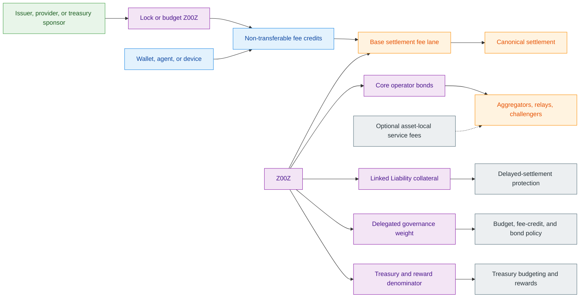
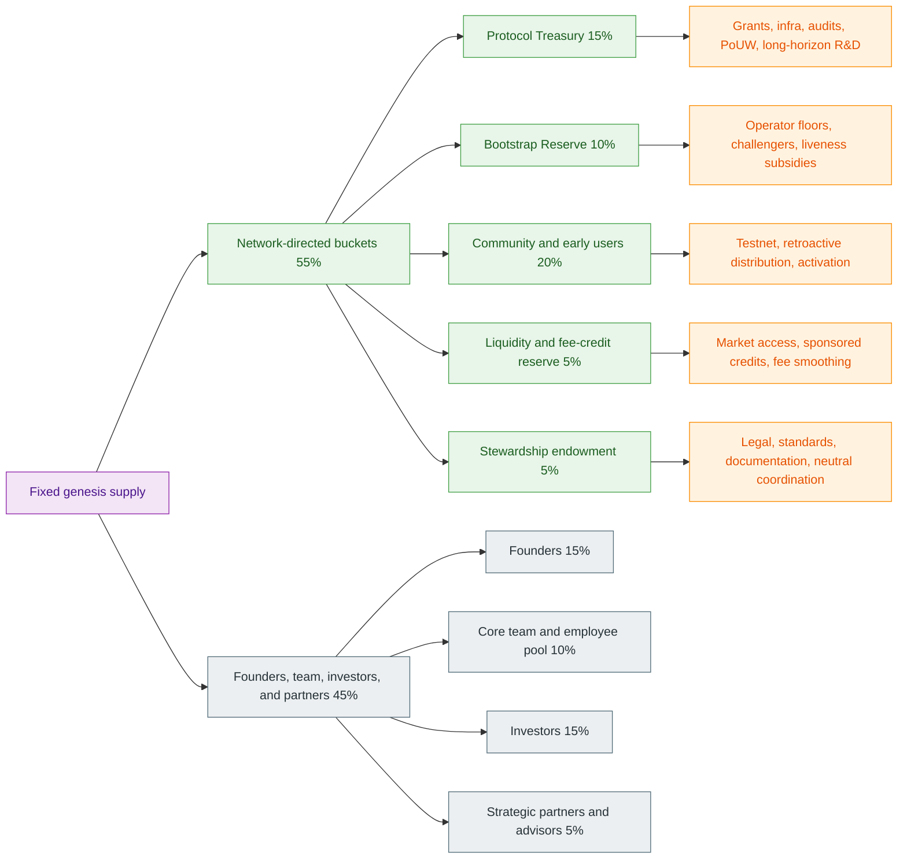
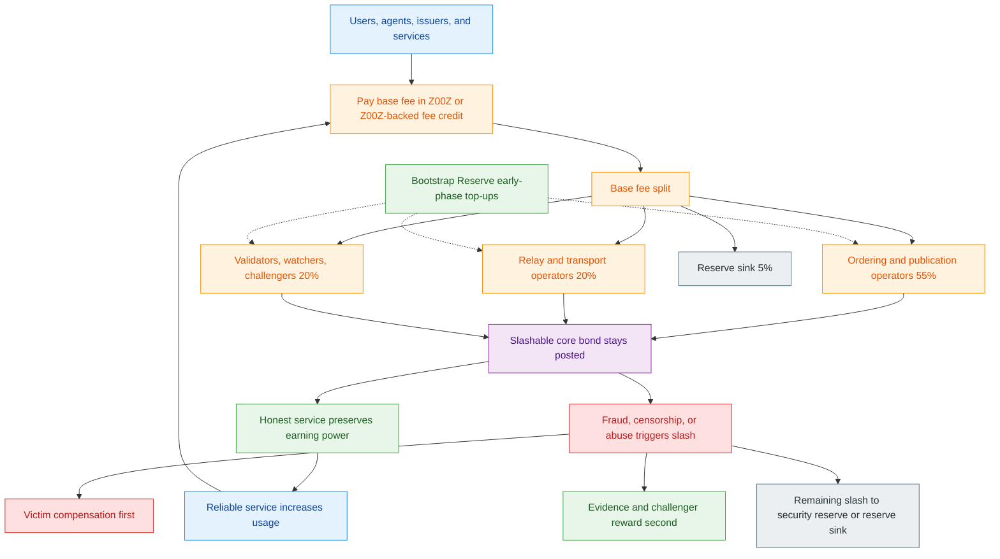
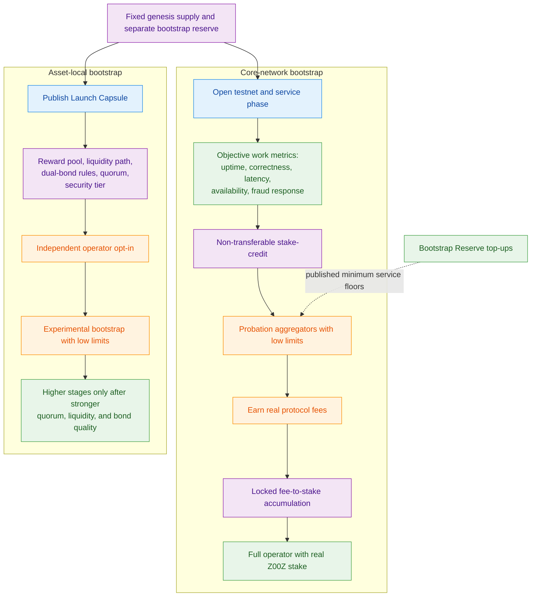
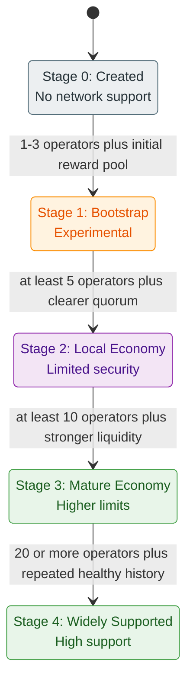

# Z00Z Tokenomics and Incentives Whitepaper

[TOC]

Version: 2026-06-22

## Key Terms Used In This Paper

This paper uses a narrow economics vocabulary because the design depends on a small number of recurring boundaries: what the native asset must secure, what the treasury may fund, what must remain asset-neutral, and how bootstrap subsidies should decay. The list below is intentionally short. A fuller reference appears in Appendix A.

- `Z00Z`: The proposed ticker for the Z00Z native asset.
- `FeeCredit`: A non-transferable prepaid processing entitlement backed by locked or budgeted `Z00Z`.
- `Bootstrap Reserve`: The genesis-allocated reserve used to fund early operator liveness, challenger bounties, and first-use adoption before organic fee revenue is sufficient.
- `Protocol Treasury`: The long-duration rule-bound reserve used for grants, ecosystem support, infrastructure, and controlled incentive programs.
- `Stewardship Endowment`: The bounded operating reserve for audits, documentation, legal defense, standards, and coordination that does not act as a discretionary protocol treasury.
- `Operator Bond`: The slashable collateral posted by aggregators, sequencers, relays, or similar network operators.
- `Liability Bond`: The bonded collateral that answers for delayed-connectivity fraud, offline misuse, or autonomous execution abuse under Linked Liability.
- `Accepted Reserve Basket`: The governance-limited basket of high-quality reserve assets that may count toward part of an operator bond under defined haircuts.
- `Launch Capsule`: The asset-local bootstrap package that declares reward pool, liquidity support, bond policy, quorum target, and security tier for a new third-party economy.
- `PoUW`: Proof-of-Useful-Work, the rule-bound reward system for verifiable useful outcomes rather than passive holding or price promotion.

## 1. Why Is This Document Needed?

The main Z00Z paper already establishes a credible protocol boundary: the native coin exists, it already matters for the live fee lane, and the broader settlement layer is multi-asset rather than one-token-for-everything. What the main paper deliberately does not finalize is the public economic constitution around that lane: total supply policy, treasury structure, operator revenue, fee-credit backing, bond design, and bootstrap strategy.

This document fills that gap. It defines the economic constitution around the live fee lane: supply, treasury compartments, operator revenue, fee credits, bond policy, and bootstrap rules. The goal is not to produce a vague "utility token" story. The goal is to explain why `Z00Z` must exist, how it creates network security and coordination value, and how Z00Z can bootstrap without collapsing into founder control or treasury-dependent monoculture.

### 1.1 Scope Of The Paper

This paper is intentionally narrow. It focuses on seven questions:

1. What jobs the native asset must perform.
2. What jobs it must not monopolize.
3. How genesis supply should be allocated.
4. How treasury compartments should be bounded.
5. How fees, fee credits, and bonds should interact.
6. How PoUW and operator incentives should be funded.
7. How the network solves the genesis bootstrapping problem without forcing every local economy into one rigid token path.

#### What This Paper Covers

This paper covers fixed-supply policy, mainnet genesis allocation, vesting, treasury compartments, fee-split targets, fee-credit design, operator bonds, liability collateral, PoUW funding boundaries, and asset-local bootstrap mechanics.

#### Implementation Boundary

This paper is normative about economic policy and conservative about implementation detail. It defines the monetary, treasury, and incentive rules that the system should enforce, while leaving room for governance, contracts, and operational tooling to mature around those rules.

### 1.2 Core Thesis

The optimal economic design for Z00Z is neither a pure `Z00Z` monopoly economy nor a fully neutral model in which the native asset has no hard role. The strongest middle path is this:

**`Z00Z` should be mandatory for core settlement accountability, but optional at the business-model layer above it.**

That means:

- the base fee lane remains `Z00Z`-native;
- fee credits are `Z00Z`-backed;
- core operator bonds carry a `Z00Z` floor;
- linked-liability and slashing use `Z00Z` as default collateral language;
- treasury accounting and PoUW budgeting are denominated in `Z00Z`;
- third-party assets may still create their own asset-local economies, fee offers, and liquidity zones without requiring Z00Z Foundation to approve or underwrite them.

#### Why This Middle Path Is Best

A pure `Z00Z`-only design is good for direct token demand, but it creates the exact narrative risk the archive documents warn about: every user, machine, and third-party economy looks forced to buy founder-associated inventory before doing anything useful. A fully neutral design avoids that narrative, but it weakens the native asset to the point where it becomes hard to explain why `Z00Z` exists as anything more than branding. The selected design keeps the token necessary for settlement security, prepaid capacity, and bonded accountability while leaving room for asset-local business models above the protocol line.

#### The Reader Promise Of This Paper

By the end of this paper, the reader should be able to answer four investor-grade questions clearly:

1. Why does `Z00Z` exist?
2. Why does Z00Z need a large treasury?
3. Why is the treasury not merely founder-controlled overhang?
4. How does the network bootstrap operators, users, and local economies before organic fees are large enough?

## 2. Economic Boundary And Design Choice

The most important discipline in tokenomics is saying no early. A token that tries to be every asset for every purpose usually ends up as either a forced tollbooth or an under-specified governance badge. Z00Z needs a narrower and more defensible answer.

### 2.1 What `Z00Z` Must Do

`Z00Z` must do five hard jobs:

1. Pay the canonical base settlement fee.
2. Anchor core operator bonds and liability collateral.
3. Back non-transferable fee credits for agents, devices, and sponsored onboarding.
4. Denominate treasury budgets, PoUW rewards, and long-horizon protocol accounting.
5. Carry governance and delegated security weight for bounded policy surfaces.

#### Fee Asset

The repository already supports a native fee lane. This paper keeps that lane and elevates it into economic policy rather than trying to dissolve it into an entirely asset-neutral fee market too early.

#### Security Asset

Core operators need something scarce and slashable that the protocol can reason about consistently. `Z00Z` is the best candidate for that role because it is internal to the system, does not depend on outside custody, and aligns operator downside with protocol health.

#### Prepaid Capacity Asset

Machines, agents, API clients, and sponsored wallets often need a way to prepay for processing without treating the token itself as a cash substitute. `Z00Z`-backed fee credits solve that problem while creating locked demand rather than purely speculative demand.

### 2.2 What `Z00Z` Must Not Become

`Z00Z` should not become a universal forced medium for every business relationship on top of Z00Z. That would make the system easier to explain in one sentence, but harder to defend economically, operationally, and legally.

#### Not A Mandatory Business Token For Every Local Economy

A merchant, issuer, machine operator, or third-party service should be able to create a local economy around another asset while still settling through Z00Z's privacy-first infrastructure. The protocol should not require every such economy to expose itself as "really just demand for `Z00Z`."

#### Not A Discretionary Treasury Chip

The token should not derive its value mainly from opaque treasury handouts, discretionary buyback promises, or founder-led market support. If demand exists, it should come from fees, locked credits, bonds, delegated security, and treasury-governed budget use rather than from soft promises.

#### Not A Public-Relations Reward Coupon

The token should not become the default currency for hype farming, referral theater, or unmanaged influencer spend. Those patterns make treasury policy look manipulative and weaken the case that Z00Z pays for useful outcomes instead of speculative attention.

### 2.3 Architecture Options Considered

Three plausible token-architecture models were considered.

**Table 2.1 - High-level token architecture options.**

| Model | Description | Pros | Cons | Verdict |
| --- | --- | --- | --- | --- |
| Option A: `Z00Z`-only everything | All fees, bonds, and service-layer pricing collapse into `Z00Z` | Strongest direct demand story, simplest messaging | Monoculture risk, onboarding friction, stronger founder-value-capture narrative, poor fit for asset-local economies | Rejected |
| Option B: Fully neutral base layer | Core fees and bonds may be paid in many assets with no `Z00Z` floor | Lowest monopoly risk, broadest local-economy freedom | Weak native-asset case, harder slashing logic, fragmented security surface | Rejected |
| Option C: Native fee lane plus bounded neutrality | Core fees remain `Z00Z`-native, fee credits are `Z00Z`-backed, core bonds have a `Z00Z` floor, local economies may add asset-local pricing and supplemental collateral | Preserves token necessity while keeping Z00Z asset-neutral above the base layer | More policy complexity than Option A | Selected |

#### Why Option C Wins

Option C is the best fit because it keeps `Z00Z` economically necessary at the protocol boundary while avoiding the claim that every useful third-party economy exists only to pump the native token. It also aligns cleanly with the main whitepaper's boundary: the base fee lane is real today, while broader asset-neutrality remains a valid architecture direction.

## 3. The Native Asset Stack

The native asset should be understood as a stack of related but distinct roles rather than one vague "utility" bucket. Each role should answer a specific protocol or treasury question.

### 3.1 Core Roles Of `Z00Z`

The selected design gives `Z00Z` five concrete roles.

**Figure 3.1 - Native asset stack and the fee-credit bridge.** The key boundary is that `Z00Z` remains mandatory at the core settlement lane while fee credits and optional asset-local service fees reduce onboarding friction above that lane.



**Table 3.1 - Native asset roles at a glance.**

| Role | Why `Z00Z` belongs here | What the role must not imply |
| --- | --- | --- |
| Base settlement fees | Keeps the canonical fee lane coherent and gives the protocol one native accounting surface | `Z00Z` does not become the mandatory business token for every asset-local economy |
| Core operator bond floor | Creates a consistent native accountability layer for slashable operators | The full bond does not need to be `Z00Z`-only collateral |
| Liability collateral default | Gives Linked Liability one canonical reserve language for delayed or offline abuse | Asset-local supplemental collateral is still allowed where needed |
| Delegated security and governance weight | Ties bounded policy tuning to bonded native participation | Governance does not gain casual authority over cryptographic or settlement invariants |
| Treasury and reward denominator | Keeps budgets, rewards, and treasury outflow legible against one unit | Treasury operations do not need to remain permanently native-denominated at the execution layer |

#### Base Settlement Fees

Every canonical settlement action pays a base fee in `Z00Z` or in a `Z00Z`-backed fee credit redeemed into that same fee lane. This keeps the protocol's core accounting coherent and avoids early fragmentation of fee validity rules. At the same time, this does not prevent supported operators from charging **additional asset-local service fees** in other assets when they voluntarily support those economies. That distinction is important. `Z00Z` remains the native settlement fee asset without becoming the mandatory universal business token for every local market above the protocol line.

#### Core Operator Bonds

Aggregators, sequencers, relays, and similar roles post slashable bond capital. The recommended policy is that **at least `35%` of the required core network bond** should be posted in `Z00Z`, with the remainder optionally satisfied by an accepted reserve basket under governance-defined haircuts and risk tiers. This preserves native skin in the game without forcing all collateral to be native. It is stricter than a fully neutral bond model, but much safer than narrating `Z00Z` as the only acceptable collateral for every economy on the network.

#### Liability Collateral

Linked Liability needs a canonical reserve language for delayed-connectivity fraud, agent misuse, and offline abuse. `Z00Z` should be the default liability collateral, even where an asset-local lane also requires supplemental collateral.

#### Delegated Security And Governance Weight

`Z00Z` should support delegated or bonded participation for policy surfaces such as treasury budgets, reserve-basket changes, fee-credit parameters, operator-bond floors, and PoUW category caps. It should not be narrated as a casual voting token for changing cryptographic invariants on a whim.

#### Treasury And Reward Denominator

All long-horizon treasury budgeting should be expressed in `Z00Z` terms even if some expenditures later convert into external operating assets. This keeps rewards, grants, subsidies, and treasury outflow legible against one native denominator.

### 3.2 Fee Credits

Fee credits solve a specific problem: the first user or first machine interaction should not always require direct spot-market token acquisition at the moment of use.

#### Why Fee Credits Exist

Agents, devices, embedded wallets, and service providers often need prepaid processing. A fee credit lets the system sell or sponsor capacity without turning the credit itself into a transferable quasi-stablecoin.

#### Recommended Credit Model

The recommended model is:

1. A sponsor locks or budgets `Z00Z`.
2. The protocol or service layer mints non-transferable `FeeCredit` units to a wallet, device, agent, or service account.
3. The credits are consumed only for processing and do not circulate as peer-to-peer money.
4. Unused credits may be reclaimed only by the original sponsor, after delay and optional haircut, to prevent secondary-market monetization.

This is superior to transferable gas vouchers because it preserves utility while reducing financial-regulatory and secondary-market complexity.

#### Sponsored And Embedded Credit Paths

This paper adopts at least four fee-credit sources:

- issuer-sponsored credits for new local economies;
- provider-sponsored credits for service onboarding;
- DAO or treasury-sponsored credits for bounded adoption campaigns;
- embedded right-level prepaid budgets for devices, agents, or bundled services.

### 3.3 Bonding And Slashing

Bond policy is where tokenomics becomes economic reality rather than storytelling. If misbehavior is cheap, the token is not securing anything meaningful.

#### Core Network Bond Policy

The recommended base rule is:

```yaml
core_network_bond:
  minimum_native_share: 35%
  optional_reserve_basket_share: 65%
  reserve_assets: governance-limited
  reserve_haircuts: required
```

This design keeps `Z00Z` necessary while avoiding total collateral monoculture. A pure native-only bond model is simpler but over-concentrates risk. A pure basket model is looser but weakens native accountability and turns security into a collage of outside assets with no meaningful native floor.

#### Asset-Local Supplemental Bond Policy

Third-party asset economies may require an additional asset-local bond or reward-backed collateral package through their `Launch Capsule`. That supplemental bond does not replace the core network bond. It sits above it.

#### Liability Bond Sizing

For delayed-connectivity and autonomous execution lanes, this paper adopts the same deterrence direction as the Linked Liability paper:

- low-risk consumer or capped offline lanes: target bond floor of at least `3x` the maximum local loss;
- standard merchant, machine, or service lanes: target bond floor of at least `5x` the maximum local loss;
- high-risk autonomous, thin-liquidity, or repeat-abuse-prone lanes: target bond floor of at least `10x` the maximum local loss or outstanding exposure cap.

The exact multipliers may vary by right family, but the direction should remain firm: **the expected cost of abuse must dominate the one-shot local gain**.

#### Slash Waterfall

A reasonable slash waterfall is:

1. victim compensation first, up to proven loss and policy cap;
2. evidence and challenger reward second;
3. remaining slash routed into the network security reserve or reserve sink.

This preserves both fairness and deterrence. Slashing should not be narrated as destruction theater if real victims and live security budgets exist.

## 4. Genesis Supply And Allocation

Genesis allocation is where most tokenomic mistakes become irreversible. The design should be capital-light enough to avoid founder overhang, capital-strong enough to finance real development, and treasury-heavy enough to solve the cold-start problem.

### 4.1 Recommended Supply Policy

The recommended policy is a **fixed genesis supply of `10,000,000,000 Z00Z` units**, with no baseline perpetual inflation.

That mainnet total follows the native-coin genesis rule directly:

`50,000 serial IDs * 200,000 nominal units = 10,000,000,000 Z00Z units`

This matches the current mainnet genesis configuration and preserves the fixed-supply direction established in the source materials. In this paper, fixed supply means fixed total units: fees, slashes, and reserves may change custody or circulation, but they do not destroy `Z00Z` units.

#### Why Fixed Supply Is Preferred

A fixed cap is preferable for four reasons:

1. it is easier to explain to investors and operators;
2. it avoids perpetual dilution narratives before fee demand is mature;
3. it forces bootstrap subsidies to be explicit treasury decisions rather than hidden inflation;
4. it aligns with the legal and governance preference for bounded, disclosed allocations over indefinite monetary discretion.

#### Why The Design Still Needs A Large Treasury

A fixed cap does not remove the need for large reserves. It increases it. Without inflation, the network must pre-allocate sufficient supply to bootstrap liveness, adoption, and useful-work incentives until fees and organic demand can sustain more of the system.

### 4.2 Allocation Options Considered

Three broad allocation families were considered. The earliest archive allocation sketch used one coarse `Treasury/Community` bucket. That is still useful as a sanity-check baseline, but it is too coarse for the actual Z00Z design, because bootstrap subsidies, liquidity support, stewardship, and long-horizon treasury policy are economically different functions and should not be hidden inside one undifferentiated reserve.

**Table 4.1 - Allocation families considered.**

| Family | Network-directed share | Builder plus capital share | Main strength | Main weakness | Verdict |
| --- | --- | --- | --- | --- | --- |
| Treasury-light | `35%` to `45%` | `50%` to `60%` | Easier short-term fundraising | Weak bootstrap runway, stronger founder and investor overhang, fragile long-term ecosystem funding | Rejected |
| Treasury-heavy financing-light | `60%` to `70%` | `25%` to `35%` | Strongest decentralization and subsidy runway | Harder to finance deeply technical protocol work, under-incentivizes core builders and early capital | Rejected |
| Balanced network-majority | `50%` to `55%` network-directed | `45%` to `50%` | Strong enough bootstrap reserve and treasury while still funding builders and early capital at realistic scale | Less slogan-friendly than a simple treasury-majority story | Selected |

#### Why The Balanced Network-Majority Model Wins

The selected model is the smallest balanced design that still looks credible for a privacy-first network with operator incentives, fee-credit onboarding, and PoUW ambitions. It avoids the main failure of treasury-light models: they often assume organic fees will appear before the network is useful enough to earn them.

### 4.3 Final Recommended Genesis Allocation

The recommended allocation is shown below.

This allocation gives the network a `55%` network-directed side and a `45%` builder, investor, and partner side, while still making the bootstrap story legible before the system is sustained mainly by fee demand.

**Table 4.2 - Recommended genesis allocation.**

| Bucket | Share | Units | Purpose |
| --- | --- | --- | --- |
| Protocol Treasury | `15%` | `1,500,000,000` | Long-horizon grants, ecosystem support, infra, PoUW, and strategic protocol funding |
| Network Bootstrap Reserve | `10%` | `1,000,000,000` | Early operator floor support, challenger bounties, early liveness subsidies, and first-use activation support |
| Community And Early Users | `20%` | `2,000,000,000` | Testnet, retroactive distribution, ecosystem activation, and early aligned users |
| Liquidity And Fee-Credit Reserve | `5%` | `500,000,000` | Liquidity, sponsored fee credits, fee smoothing, and launch support |
| Stewardship Endowment | `5%` | `500,000,000` | Audits, legal, documentation, standards, security reviews, and neutral coordination |
| Founders | `15%` | `1,500,000,000` | Long-vesting founder allocation with the current `10%` and `5%` founder split preserved under governance and lockup constraints |
| Core Team And Employee Pool | `10%` | `1,000,000,000` | Employees, future core technical contributors, and long-horizon retention |
| Investors | `15%` | `1,500,000,000` | Seed, strategic, and long-horizon capital partners |
| Strategic Partners And Advisors | `5%` | `500,000,000` | Specialized ecosystem, infrastructure, regulatory, and distribution partners |

This structure directs `50%` of supply into treasury, bootstrap, liquidity, and community activation before counting the stewardship endowment. Including stewardship, the network-directed side controls `55%` of supply.

#### Why These Numbers Are Optimal

This mix is recommended because:

- `15%` is large enough for a real treasury while leaving more room for community activation and long-horizon capital;
- `10%` is large enough to solve cold-start operator economics without relying on inflation;
- `20%` for community and early users is large enough to make early distribution meaningful rather than symbolic;
- `15%` for founders and `10%` for the core team give builders enough long-horizon ownership to stay aligned through a difficult protocol buildout;
- `15%` for investors is large enough to finance deeply technical protocol work without letting capital outweigh the combined network-directed side;
- `5%` liquidity, `5%` stewardship, and `5%` partner buckets stay narrow and purpose-bound.

### 4.4 Vesting And Initial Circulation Policy

Genesis percentages alone are not enough. Unlock schedule matters more than raw allocation.

**Table 4.3 - Recommended vesting and release policy.**

| Bucket | Release policy |
| --- | --- |
| Protocol Treasury | `5%` of the bucket available at activation, remainder streamed over `60` months |
| Network Bootstrap Reserve | programmatic decay over `60` months with hard use restrictions |
| Community And Early Users | approximately `40%` of the bucket claimable in the first `12` months, remainder over `36` months |
| Liquidity And Fee-Credit Reserve | approximately `40%` of the bucket available at activation, remainder over `36` months |
| Stewardship Endowment | `20%` of the bucket available at activation, remainder over `48` months |
| Founders | `12`-month cliff, then `36`-month monthly linear vesting |
| Core Team And Employee Pool | `12`-month cliff, then `48`-month linear vesting |
| Investors | `12`-month cliff, then `36`-month linear vesting, with at most `5%` to `10%` liquid at TGE |
| Strategic Partners And Advisors | `12`-month cliff, then `24`-month linear vesting |

#### Circulation Targets

The recommended design target is:

- activation circulating supply: roughly `10%`;
- end of year one: roughly `15%` to `20%`;
- end of year three: roughly `35%` to `45%`;
- end of year five: roughly `55%` to `70%`.

These bands express the intended posture: enough float for operator entry and user access, without flooding the market before utility exists.

#### No Public Sale Requirement

This paper does not require a public sale at genesis. A privacy-first network is better served by long-vesting private capital, direct community allocation, testnet or retroactive distribution, and rule-bound treasury deployment than by an early high-velocity public sale narrative.

## 5. Treasury Architecture

The treasury must be large enough to bootstrap a network that does not yet earn mature fees, but narrow enough that it does not become a quasi-foundation slush fund. That tension is solved by compartmentalization.

### 5.1 Why Treasury Must Be Large And Rule-Bound

Z00Z has at least four capital-hungry early-stage needs:

1. operator liveness before fee revenue is mature;
2. fee abstraction for users, agents, and devices;
3. useful-work funding for infrastructure and ecosystem growth;
4. long-horizon protocol defense, audits, and standards work.

A small treasury cannot solve those needs. A large but discretionary treasury solves them only by creating a different risk: opaque human control. The correct answer is a large but compartmentalized treasury whose reserves are locked at genesis under published rules, not held as an informal foundation wallet that a founder, multisig clique, or agent stack can redirect at will.

#### Autonomous Treasury Protocol

The treasury should therefore be described publicly as an **autonomous protocol reserve**, not as a foundation wallet and not as a founder-controlled distribution desk. In the recommended model, fixed `Z00Z` supply is created at genesis, founder allocation is disclosed and long-vested, network-directed reserves are locked into on-chain rule modules at genesis, and ordinary treasury execution follows published conditions after the relevant challenge window rather than private approval.

Just as importantly, AI or agent layers may score, challenge, and recommend, but they do not directly hold payout authority. Large parameter changes such as treasury categories, annual caps, emergency powers, or model-governance rules should require `Z00Z`-holder governance with timelocked activation. No founder, foundation, or narrow signer set should retain unilateral override over treasury movement, reward routing, or evaluator replacement. If any of those conditions fail, the treasury starts to look less like a protocol mechanism and more like a managed fund in technical clothing.

### 5.2 Treasury Compartments

Each treasury bucket should have a different mandate.

**Figure 5.1 - Genesis allocation architecture and treasury compartment logic.** The main point is not only percentage ownership. It is that fixed genesis supply is split into function-specific reserves instead of one undifferentiated treasury bucket.



**Table 5.1 - Treasury compartments and boundary rules.**

| Compartment | Primary mandate | Typical uses | What it must not become |
| --- | --- | --- | --- |
| Protocol Treasury | Long-horizon protocol and ecosystem funding | R&D, infra, audits, wallets, SDKs, bounded PoUW programs | An ad hoc founder-controlled grant wallet |
| Network Bootstrap Reserve | Temporary cold-start support for liveness and accountability | Operator floor top-ups, challenger rewards, early relay and sequencing support | A permanent subsidy engine or hidden second treasury |
| Liquidity And Fee-Credit Reserve | Remove first-use friction and support early access | Sponsored fee credits, fee smoothing, initial market access support | A standing price-support or buyback promise |
| Stewardship Endowment | Neutral support for protocol defense and coordination | Legal, standards, research, documentation, security reviews | A disguised market-operations fund or operator subsidy pool |

#### Protocol Treasury

The `15%` Protocol Treasury funds long-duration needs: protocol R&D, ecosystem grants, wallets, SDKs, infrastructure, neutral tooling, audits, and bounded PoUW programs. It unlocks slowly, remains challengeable, and is consumed through rule-bound budget paths rather than through ad hoc discretionary transfers.

#### Network Bootstrap Reserve

The `10%` Bootstrap Reserve exists only to solve the cold-start problem. It funds operator minimum-revenue top-ups, fraud-proof and challenger rewards, bootstrap relay and sequencing support, and limited early activation campaigns tied to real use. It has the strictest decay schedule in the paper and is intentionally not a permanent subsidy engine.

#### Liquidity And Fee-Credit Reserve

The `5%` Liquidity and Fee-Credit Reserve should fund only three categories:

- initial market liquidity sufficient for real access;
- sponsored or embedded fee credits;
- short-term fee smoothing around onboarding and launch events.

It should not be narrated as a permanent price-support promise.

#### Stewardship Endowment

The `5%` Stewardship Endowment funds audits, legal defense, documentation, standards, research, and neutral coordination. It does not act as a hidden second treasury for market or operator subsidies, and it does not turn the stewardship layer into a de facto financial operator.

### 5.3 Treasury Spend Guardrails

The treasury is constrained not only by percentages, but by use rules.

#### Annual Spend Caps

The default policy is:

- Protocol Treasury rolling annual outflow cap: no more than `200,000,000 Z00Z units` without emergency override;
- Stewardship Endowment rolling annual outflow cap: no more than `100,000,000 Z00Z units`;
- high-risk growth or content programs: no more than `15%` of annual PoUW outflow;
- total PoUW outflow: no more than `30%` of total annual treasury outflow in early phases.

These caps keep the network from spending like a late-stage ecosystem before the protocol has earned that right.

#### Prohibited Treasury Uses

The treasury explicitly prohibits at least the following:

- guaranteed buyback promises;
- explicit token price-promotion rewards;
- discretionary transfers to anonymous wallets without policy and challenge path;
- hidden market-making subsidies outside the declared liquidity reserve;
- foundation-style approval of third-party assets as "official."

#### Emergency Reallocation Standard

Emergency reallocation should require a stronger threshold, longer timelock, and published reason than ordinary budget adjustments. The treasury must be able to respond to security emergencies without becoming casually mutable.

### 5.4 Treasury Diversification Policy

The treasury begins mostly native and becomes selectively diversified only for operational stability, not speculation.

#### Recommended Diversification Rule

The target policy is:

- bootstrap and compensation pools remain largely native or directly linked to native accounting;
- a limited share of liquid operating balances may be diversified into high-quality stable reserve assets after governance is live;
- diversification is for runway preservation, not yield farming or directional treasury trading.

#### Why Full Early Diversification Is Wrong

Converting too much treasury too early weakens the native security story and turns the project into a treasury-management narrative. The treasury should first prove that `Z00Z` has real fee, bond, and credit utility before large diversification becomes normal.

## 6. Incentive Loops

Z00Z's economics are best explained through loops, not just buckets. The model only becomes persuasive once the token moves through concrete cycles of use, lockup, and penalty.

**Table 6.1 - Incentive loops at a glance.**

| Loop | Main inflow | Main outflow or lockup | Intended result | Main failure if misdesigned |
| --- | --- | --- | --- | --- |
| Base fee loop | User, issuer, and service fees | Operator revenue, settlement security revenue, reserve sink | Liveness, repeated service, and organic fee demand | Hidden protocol-tax design or operator starvation |
| Bond and liability loop | Posted operator and liability collateral | Locked capital, slashing, victim compensation | Credible deterrence against fraud, censorship, and offline abuse | Misbehavior stays cheap relative to one-shot gain |
| PoUW loop | Rule-bound treasury budgets | Useful-work payouts under challengeable evaluation | Durable ecosystem value rather than passive loyalty | Hype farming, discretionary payouts, or agent treasury capture |
| Asset-local economy loop | Launch Capsule economics and local fee offers | Supplemental bonds, operator opt-in, bootstrap rewards | Independent local-economy formation without central planning | Fake liquidity, weak collateral, or automatic trust inheritance |

### 6.1 Base Fee Loop

The first loop is the canonical fee loop.

**Figure 6.1 - Base fee and accountability loop.** The loop is intentionally liveness-first: fees pay operators and security roles first, bootstrap top-ups are temporary, and there is no default protocol-tax arrow feeding treasury from every transaction.



#### Recommended Late-Stage Fee Split

The target fee split is:

**Table 6.2 - Target late-stage base fee split.**

| Fee destination | Share | Function |
| --- | --- | --- |
| Ordering and publication operators | `55%` | Aggregation, sequencing, batching, publication |
| Relay and data transport operators | `20%` | Relay, DA, and transport-facing delivery work |
| Settlement security pool | `20%` | Validators, watchers, challengers, evidence review incentives |
| Reserve Sink | `5%` | Non-circulating reserve accounting without changing total supply |

This split is intentionally liveness-first and intentionally avoids a default protocol-tax narrative. Early Z00Z should pay operators and challengers first, while any retained reserve portion remains supply-neutral reserve accounting. Scarcity, where it exists, should come from lockup and custody structure rather than from destroying units, and the long-horizon treasury should be funded primarily from genesis allocation, voluntary donations, and explicit governance-approved budget programs rather than from a silent automatic skim on every transfer.

#### Early-Phase Top-Up Rule

Before fee revenue is sufficient, the Bootstrap Reserve should top up operator roles to pre-declared minimum service floors. The reserve should shrink as organic fee revenue grows.

### 6.2 Bond And Liability Loop

The second loop is the accountability loop: operators and delayed-execution lanes lock collateral, honest behavior preserves earning power, and fraud destroys capital.

#### The Economic Rule

One principle governs the entire incentive design:

**dishonest behavior must cost more than it can earn.**

That means slashing must be large enough, credible enough, and fast enough to dominate one-shot gains from censorship, fraud, or repeated offline abuse.

#### Three Bond Surfaces

The incentive system distinguishes three surfaces:

1. core operator bond;
2. linked-liability bond for delayed or autonomous rights;
3. asset-local supplemental bond for third-party economies.

Conflating these roles would blur both risk and policy.

### 6.3 PoUW Loop

The third loop is the useful-work loop. Treasury outflow buys verifiable ecosystem value rather than passive loyalty, and the evaluation layer remains separate from the payout layer.

#### What PoUW Should Fund First

The initial priority order is:

1. audits and security research;
2. SDKs, wallets, and infra;
3. relay and service reliability;
4. technical documentation and integrations;
5. bounded real-usage activation with direct evidence.

#### What PoUW Should Exclude Or Cap Tightly

PoUW explicitly excludes or severely caps:

- price-promotion;
- vague "community enthusiasm" rewards;
- empty quests without durable protocol value;
- discretionary influencer spend detached from measurable outcomes.

Useful-work agents, reviewers, or model layers may score, challenge, and recommend. They do not directly own treasury keys or unilateral payout rights. Evaluation remains upstream; treasury execution remains rule-bound and downstream.

### 6.4 Asset-Local Economy Loop

The fourth loop is the local-economy loop: new assets attract operators not through identity-based trust, but through disclosed economics.

#### Launch Capsule Requirement

Every serious third-party asset economy publishes a `Launch Capsule` containing at least:

- reward pool;
- liquidity support path or autonomous liquidity escrow;
- accepted bond assets and haircuts;
- quorum target;
- security tier label;
- maximum outstanding delayed-settlement exposure.

#### Why This Loop Matters

This is how Z00Z supports local economies without becoming their central planner. The protocol does not approve every asset. The asset economy must make itself economically legible to operators. Operators then choose independently whether to support the economy, accept fees in that asset, and post the required bond mix. They do not take custody for users and they do not swap assets on behalf of users as a built-in protocol service.

## 7. The Genesis Bootstrapping Problem

The genesis bootstrapping problem is the hardest economic question in the entire design. In the Z00Z source discussions, that phrase refers to two related but distinct cold starts:

1. how the first legitimate aggregators obtain the right to operate before liquid `Z00Z` stake is widely distributed; and
2. how a new third-party private asset economy convinces independent aggregators to support it without relying on trust in an anonymous issuer.

A privacy-first network needs real operators, real liquidity, and real adoption before its fees are naturally large enough to fund them. That creates a classic cold-start trap at both layers.

### 7.1 Why Bootstrap Is Hard

There are five overlapping cold-start problems.

#### First Legitimate Stake Problem

If the network says "buy `Z00Z`, stake it, and become an aggregator" before the token has a neutral market history, then the founder or controlled treasury can easily become the effective seller of network access. The sources treat that as the most dangerous version of genesis because it makes the launch look like a token distribution into a future fee-generating role.

#### Operator Cold Start

No one wants to run aggregation, sequencing, relay, or challenge infrastructure if the network has little usage and little fee revenue. Yet without those operators, the network never becomes reliable enough to attract usage.

#### User Onboarding Friction

If every first user, device, or agent must first acquire the native token on the open market, many legitimate early use cases never start. This is especially harmful for machine payments, embedded services, and batch-style micro-usage.

#### Asset-Local Economy Chicken-And-Egg

A new asset economy needs operator support before it is useful, but operators want proof of fee flow, liquidity, and collateral before supporting it. This is a stronger problem in privacy systems because activity is less publicly legible.

#### Governance Trust Problem

If the only answer to bootstrap is "trust the foundation to spend wisely," then the network may launch technically decentralized but economically paternalistic. That is the wrong starting posture for Z00Z.

### 7.2 Chosen Bootstrap Mechanism

This paper adopts a two-layer bootstrap system: one layer for the core network and one layer for asset-local economies.

**Figure 7.1 - Two-layer bootstrap path for core network access and asset-local economies.** The source-model point is that neither layer starts with "buy token from the founder." Both begin with public economic or service conditions and then graduate toward stronger market-native support.



#### Part One: Core Network Bootstrap Without Founder-Sold Validator Access

The selected answer to the first legitimate stake problem is explicit:

**initial aggregator access is not sold as liquid `Z00Z` access.**

Instead, the core network bootstrap follows this path:

1. fixed supply exists at genesis;
2. bootstrap pool is locked separately from the long-horizon treasury;
3. public testnet and service phase allow anyone to run nodes;
4. operators earn non-transferable `stake-credit` or operator bond vouchers through objective work such as uptime, correctness, latency, availability, invalid-transaction rejection, and fraud-response behavior;
5. early mainnet operators enter under low-limit probation;
6. earned protocol fees are split so that a locked portion accumulates into real `Z00Z` stake;
7. once real stake reaches the threshold, bootstrap credit decays away.

This is the strongest source-backed solution because it avoids the worst launch pattern: "buy `Z00Z` from the founder or controlled treasury, then stake it to earn network fees."

#### Part Two: Decaying Operator Floor

The `10%` Bootstrap Reserve funds the transition from probationary bootstrap to fee-dominant operation. The reserve tops operators up to role-specific minimum service floors but does not replace organic fees as the long-run business model.

The core rule is that operators earn organic fees first. The reserve only closes the gap to a published minimum during early phases. This keeps the subsidy transitional instead of permanent.

#### Part Three: Sponsored Fee Credits And Small Community Liquidity

The sources discuss two separate early-user frictions: users need enough access to use the network, and devices or agents should not need to become token traders before they can pay for processing. The selected answer is a narrow combination:

- sponsored and embedded fee credits for processing;
- a small community claim or faucet-style pool for initial user liquidity;
- proof-of-use or proof-of-work style access for early aligned users rather than pure discretionary giveaways.

The fee-credit reserve should remove first-use friction for wallets, agents, devices, and ecosystem programs. Users do not need to become token traders before they become users.

#### Part Four: Launch Capsules For New Economies

For third-party private economies, the source docs do not treat one mechanism as sufficient. They converge on a package. A new asset economy does not become credible by identity. It becomes credible by publishing an economic package that operators can inspect and price.

Third-party asset economies bring their own launch economics. They do not receive automatic foundation underwriting. If an issuer wants operator attention, it publishes reward pool, liquidity support, bond rules, and quorum target in advance, then lets operators opt in voluntarily.

#### Part Five: Asset-Local Bootstrap Mechanisms

The chosen asset-local bootstrap package combines four mechanisms discussed in the source material:

1. a `fee subsidy pool` or bootstrap reward pool that pays aggregators for valid early epochs;
2. optional `autonomous liquidity escrow` or AMM liquidity so that received fees can be sold without a personal buyback promise from the issuer;
3. `dual-bond` or accepted-reserve collateral logic, so support is not backed only by a worthless local asset;
4. a `probation security tier`, so new economies begin with low limits and graduate upward only after quorum, bond quality, and liquidity improve.

None of these mechanisms is sufficient in isolation. Together they create the economic proof that replaces trust in the issuer's identity.

#### Part Six: Security-Tiered Activation

Not every new asset is treated as fully mature on day one. The network uses explicit stage labels so users and operators can reason about risk without pretending that every new anonymous economy is immediately high-security or widely supported.

#### Part Seven: Neutral Aggregator Request Boards, Not A Launchpad

The source documents repeatedly distinguish a neutral operator marketplace from an official token launchpad. That distinction belongs inside the bootstrap answer. A new issuer may publish a request for operators, reward terms, liquidity support, and bond requirements. Operators may respond. But the protocol, foundation, and official wallet should not become a curated launchpad or approval board for those economies.

**Table 7.2 - Bootstrap surfaces and chosen answers.**

| Bootstrap surface | Problem being solved | Chosen mechanism | Funding or collateral logic | Explicit rejection |
| --- | --- | --- | --- | --- |
| Core operator access | First legitimate stake and early operator eligibility | Public testnet work, non-transferable `stake-credit`, low-limit probation, automatic fee-to-stake accumulation | Separate Bootstrap Reserve supports minimum service floors while real fee revenue matures | No founder or treasury sale of validator access |
| User, device, and agent onboarding | First use should not require immediate token trading | Sponsored and embedded fee credits plus small community liquidity | Fee-credit reserve and bounded activation programs reduce first-use friction | No mandatory spot-market purchase before the user can even begin |
| Asset-local economies | Anonymous issuers cannot rely on identity-based trust | `Launch Capsule`, bootstrap reward pool, autonomous liquidity path, dual-bond logic, probation tiers | Operators price the local economy from its disclosed package instead of from issuer promises | No official launchpad and no automatic inheritance of full base-network security |

### 7.3 Asset Economy Stages

The recommended stage model is shown below.

**Table 7.1 - Asset economy activation stages.**

| Stage | Condition | Typical limits | Security label |
| --- | --- | --- | --- |
| Stage 0: Created | asset exists, no external operator support yet | local or disabled only | no network support |
| Stage 1: Bootstrap | `1` to `3` operators, initial reward pool, thin liquidity | very low | experimental |
| Stage 2: Local Economy | at least `5` operators, clear quorum, visible bond support | medium | limited security |
| Stage 3: Mature Economy | at least `10` operators, diversified bond, stronger liquidity | higher | mature |
| Stage 4: Widely Supported | `20+` operators, deep liquidity, repeated healthy history | broad | high support |

This structure makes security a measurable economic property instead of a yes-or-no marketing claim.

**Figure 7.2 - Asset economy stage progression.** The table gives the exact thresholds. The diagram below helps readers see that stage labels are not marketing badges but a progression path tied to stronger operator support and better economic quality.



It also creates a place for honest low-decentralization launch states. An issuer may bootstrap the first operator set directly, but if it does, that state belongs in the lowest security labels and must be described as experimental or centralized bootstrap rather than as a mature decentralized economy.

### 7.4 Why This Bootstrap Model Is Optimal

The chosen model is the best fit because it solves both bootstrap layers with the smallest amount of discretionary trust.

At the core-network layer, it avoids the two source-doc anti-patterns:

- founder or treasury sale of validator access;
- manual insider selection of the first economically privileged operators.

At the asset-local layer, it avoids a different anti-pattern:

- pretending that every anonymous token automatically inherits the full security and neutrality of the base network.

Three alternative bootstrap stories were considered and rejected:

- pure `Z00Z`-only demand creation through mandatory usage everywhere;
- founder or treasury sale of early operator stake;
- pure discretionary treasury spend without hard categories;
- pure asset-local economics with no native security floor.

The selected design is better because it solves the real cold-start problems separately:

- non-transferable stake-credit and probation solve first operator eligibility without founder-sold stake;
- the bootstrap reserve solves base operator liveness;
- fee credits and a small community access pool solve first-use friction;
- launch capsules solve asset-local operator discovery;
- fee subsidy pools, optional liquidity escrow, and accepted-collateral rules solve early aggregator economics for new assets;
- native bond floors preserve a real reason for `Z00Z` to exist without making `Z00Z` the only acceptable collateral everywhere.

## 8. Governance Boundaries

Good tokenomics depends on what governance cannot casually change as much as on what it can change.

### 8.1 What Governance May Tune

Governance in this design is a bounded policy layer able to tune:

- treasury budgets within compartment rules;
- reserve-basket membership and haircuts;
- fee-credit conversion and expiry parameters;
- operator-bond floors;
- fee-split parameters within predefined envelopes;
- PoUW category caps and challenge windows.

### 8.2 What Governance Should Not Treat As Casual Policy

Some things are upgrade boundaries rather than ordinary votes.

#### Supply Integrity

The fixed-cap default should not be treated as a casual parameter. If supply policy is ever reopened, it should require a far stronger process than ordinary budget governance.

#### Cryptographic And Settlement Invariants

Governance should not be framed as a casual right to rewrite cryptographic assumptions, replay rules, or canonical settlement structure in the name of economics.

#### Existing Property Rights

Vested balances, valid claims, and already-earned compensation rights should not be narratively downgraded into political variables.

### 8.3 Stewardship Foundation Versus Treasury

The design draws a bright line:

- the Stewardship Endowment funds audits, docs, legal defense, standards, and coordination;
- the Protocol Treasury funds ecosystem and incentive policy under published rules;
- agents, models, and review systems may recommend but do not directly control treasury;
- no founder, foundation, or narrow signer set should have unilateral override over treasury movement or reward policy.

That distinction is economically and legally important.

## 9. Risk Model And Failure Modes

A serious tokenomics paper should identify where the model can fail instead of assuming adoption will arrive smoothly.

### 9.1 Token And Market Risks

The native asset may face volatility, thin liquidity, and narrative overhang before utility is mature. Those risks are amplified by the deliberate decision not to rely on a protocol tax, a founder fee, or a treasury-controlled perpetual market-support machine. That makes the early market more honest, but also thinner.

The mitigation is not marketing. The mitigation is lock-based utility, slow vesting, sponsored fee credits, real operator demand, and explicit bootstrap liquidity that is narrow in scope and disclosed as such. The token should earn its position through fees, bonds, liability collateral, and prepaid capacity rather than through the appearance of permanent treasury bid support.

### 9.2 Treasury Capture Risks

A large treasury can be captured by insiders, social pressure, or noisy governance coalitions. In the Z00Z context, capture risk is not limited to explicit wallet control. It also appears if one actor or one tight group can update the models that score useful work, shorten challenge periods, waive work-bond requirements, or redirect the bootstrap reserve under vague emergency language.

The mitigation is compartmentalization, annual caps, explicit prohibited uses, longer timelocks for emergencies, published challenge paths, and separation between evaluation and treasury execution. A treasury that is formally on-chain but practically steerable by a founder-controlled model pipeline is still economically centralized, and this paper rejects that outcome directly.

### 9.3 Operator Cartel Risks

If a small group controls ordering, relay, or challenge infrastructure, the token may still exist while the network becomes economically centralized. This risk is especially important in a privacy-oriented network because public observers cannot always infer market health from visible on-chain addresses and balances.

The mitigation is role-specific rewards, slashable bonds, challenger incentives, and gradual movement from subsidy to fee-based competition. The network also needs neutral risk labels that surface concentration risk, bond quality, quorum depth, and operator diversity at the asset-economy layer instead of implying that every local economy inherits equal security from the protocol.

### 9.4 Asset-Local Scam Economy Risks

A protocol that allows permissionless new asset economies also allows weak, manipulative, or under-collateralized ones. Some issuers will overstate liquidity, understate bond weakness, or imply support from the protocol brand that does not actually exist. Others may create thin-liquidity economies that only look healthy while one actor quietly controls most of the operator set.

The mitigation is not foundation approval and not an official launchpad. The mitigation is `Launch Capsule` disclosure, stage labels, collateral haircuts, neutral risk labels, and visible operator-support metrics. If a project wants stronger security, it must earn that label through reward pools, liquidity support, quorum depth, and diversified collateral rather than by claiming endorsement.

### 9.5 Bootstrap Exhaustion Risk

If organic fee growth remains too weak for too long, the Bootstrap Reserve may be consumed before the network becomes self-sustaining. The risk is not only that the reserve runs out. The deeper risk is that weak traction encourages progressively looser subsidy logic, until the network starts paying for noise, promotional theater, or fake usage just to simulate momentum.

The mitigation is to front-load discipline: narrow early PoUW categories, decaying subsidy rules, real service-floor targets, and realistic liveness goals rather than vanity expansion. The bootstrap reserve exists to bridge a real cold start, not to subsidize indefinite underperformance.

### 9.6 Service-Layer Overreach Risks

The sources are unusually consistent on one point: Z00Z becomes much harder to defend if the protocol brand expands into an official launchpad, official exchange surface, official bridge operator, or official approved-token registry. Those moves convert a neutral coordination layer into a more recognizable financial service stack.

That same overreach can also happen more quietly. An "official" wallet that auto-lists all third-party assets, auto-swaps fees for users, shows launchpad-style promotion, or routes liquidity on behalf of users creates economic and legal exposure even if the base protocol remains non-custodial. The mitigation is architectural restraint: no custody, no exchange, no launchpad, no protocol-level token curation, and no built-in user-side swap or redemption guarantees.

## 10. Phased Rollout

The rollout sequence below keeps the treasury and token role from appearing fully activated on day one.

### 10.1 Phase 0: Activation

This phase includes:

- fixed-cap genesis;
- disclosed founder and investor lockups;
- treasury compartment locks and on-chain spend boundaries;
- vesting contracts and bucket segregation;
- base `Z00Z` fee lane;
- initial liquidity reserve deployment;
- initial fee-credit support for first-party wallets and devices;
- temporary, disclosed stewardship with timelocked upgrade paths rather than permanent emergency discretion.

### 10.2 Phase 1: Bootstrap Network

This phase includes:

- decaying operator floor payments;
- challenger and reliability incentives;
- limited treasury-approved PoUW focused on infra and security;
- challenge periods, harm-score screening, and narrow work-bond rules for reward claims;
- first community and early-user distribution windows.

### 10.3 Phase 2: Local Economies

This phase includes:

- `Launch Capsule` standardization;
- asset-economy stage labels;
- accepted reserve basket with haircuts;
- asset-local operator competition;
- neutral aggregator request boards rather than an official protocol launchpad.

### 10.4 Phase 3: Mature Incentive Economy

This phase includes:

- fee-dominant rather than subsidy-dominant operator economics;
- wider PoUW category breadth under hard caps;
- larger role for challengeable governance;
- longer timelocks and stricter emergency thresholds as the protocol hardens;
- selective diversification of liquid operating balances.

## 11. Conclusion

The recommended tokenomics design is intentionally conservative in the places where crypto projects often become reckless. It keeps a fixed supply. It gives the network a large treasury, but not an undefined one. It makes the token economically necessary, but not universally mandatory for every business model. It solves bootstrapping with explicit reserves rather than hidden inflation. And it treats accountability, fee abstraction, and useful-work rewards as separate mechanisms rather than as one vague token-utility story.

The deeper point is structural. Z00Z is strongest not as "another privacy coin," but as a private asset-neutral economic protocol with one native security and accounting asset. `Z00Z` exists because the system needs a base fee lane, a bonded security floor, a default liability collateral language, a prepaid capacity asset for agents and devices, and one treasury denominator that can fund long-horizon coordination without turning the protocol into a founder-operated business shell.

That combination is the strongest available answer to the investor question "why does `Z00Z` need to exist?" The token exists because Z00Z needs a native fee lane, native security floor, native liability language, `Z00Z`-backed prepaid capacity, and a rule-bound treasury denomination. It does not need to exist as a monopoly over every asset economy on the network. That is what makes the design both stronger and more defensible.

## Appendix A. Glossary

This appendix expands the key terms at the top of the paper and keeps the vocabulary stable across the Main, Linked Liability, and PoUW whitepapers.

### A.1 Native Asset Terms

`Z00Z` is the native economic asset of the Z00Z system. In this paper it has five core jobs: fee payment, bond posting, liability collateral, governance-weighted policy participation, and treasury denomination.

The `fee lane` is the canonical base processing path recognized by the protocol. A user, sponsor, device, or service may satisfy that lane through direct `Z00Z` payment or through redemption of `Z00Z`-backed fee credits, but the accounting surface remains native.

The `Reserve Sink` is a non-circulating reserve bucket that can accumulate selected fees, slashes, or conversions without changing total `Z00Z` supply. It is reserve accounting, not destruction of units.

An `Operator Bond` is the slashable collateral posted by aggregators, relays, sequencers, challengers, or comparable roles. The bond answers for misbehavior, poor service, or provable rule violation.

The `Accepted Reserve Basket` is the governance-limited set of high-quality collateral assets that may satisfy the non-native portion of selected bond requirements. Basket membership requires explicit haircuts, risk labels, and clear eligibility rules.

### A.2 Treasury Terms

The `Protocol Treasury` is the long-horizon reserve for infrastructure, grants, SDKs, wallets, research, and bounded useful-work incentives.

The `Bootstrap Reserve` is the decaying cold-start reserve for operator floor support, challenger incentives, first-use activation, and other explicitly temporary subsidy programs.

The `Stewardship Endowment` is the bounded reserve for audits, legal defense, standards, documentation, and neutral coordination. It is not a second operator-subsidy treasury and not a hidden market-support fund.

`Spend caps` are hard annual or rolling outflow limits that prevent treasury policy from expanding faster than protocol maturity.

A `Challenge Window` is the review period during which a proposed payout, policy change, or risk-sensitive treasury action may be contested before final execution.

An `Emergency Override` is the exceptional path for responding to severe security or continuity threats. In this design it requires stronger thresholds, longer timelocks, and clearer disclosure than ordinary budget action.

`Prohibited Treasury Uses` are the classes of spending that the system refuses to normalize, including guaranteed buyback narratives, price-promotion rewards, silent market-support subsidies, and arbitrary anonymous transfers outside declared policy.

### A.3 Incentive Terms

A `FeeCredit` is a non-transferable right to consume protocol processing that is backed by locked or budgeted `Z00Z`. It is capacity, not peer-to-peer money.

A `Launch Capsule` is the published bootstrap package for a new asset economy. It declares reward pool, liquidity support, bond assets, haircuts, quorum target, and security tier so operators can decide whether support is worth their capital and attention.

`PoUW` is Proof-of-Useful-Work, the bounded reward system that pays for reviewable useful outputs rather than passive holding or pure promotional behavior.

A `Security Tier` is a neutral risk label for an asset-local economy. It reflects observed quorum depth, operator concentration, bond quality, and liquidity conditions rather than brand prestige.

`Stage Labels` describe the maturity path of a new asset economy: `Created`, `Bootstrap`, `Local Economy`, `Mature`, and `Widely Supported`.

## Appendix B. Allocation And Unlock Summary

This appendix provides a compact allocation sheet for investor and operator review.

### B.1 Allocation Snapshot

```yaml
mainnet_supply:
  serial_ids: 50_000
  nominal_units_per_serial: 200_000
  total_units: 10_000_000_000
allocation:
  protocol_treasury: 15%
  network_bootstrap_reserve: 10%
  community_and_early_users: 20%
  liquidity_and_fee_credit_reserve: 5%
  stewardship_endowment: 5%
  founders: 15%
  core_team_and_employee_pool: 10%
  investors: 15%
  strategic_partners_and_advisors: 5%
```

### B.2 Unlock Snapshot

```yaml
unlock_policy:
  treasury_stream_months: 60
  bootstrap_decay_months: 60
  founders_cliff_months: 12
  founders_linear_months: 36
  core_team_cliff_months: 12
  core_team_linear_months: 48
  investor_cliff_months: 12
  investor_linear_months: 36
```

The practical intent of this unlock policy is straightforward: users and operators need enough early float to use the system, but not enough early float to let treasury, team, and investor overhang dominate price discovery before utility exists. Slow treasury streaming also reinforces the rule-bound reserve model from the legal and governance source documents.

## Appendix C. Reference Economic Rules

This appendix collects the compact rule summaries used throughout the paper.

### C.1 Fee Split Rule

```yaml
base_fee_split:
  ordering_and_publication: 55%
  relay_and_transport: 20%
  settlement_security: 20%
  reserve_sink: 5%
```

This fee split assumes that the long-horizon treasury is funded from genesis allocation and explicit governance budgets rather than from a default per-transaction treasury skim.

### C.2 Liability Bond Heuristics

```yaml
liability_bond_guidance:
  low_risk_lane: ">= 3x max_local_loss"
  standard_lane: ">= 5x max_local_loss"
  high_risk_lane: ">= 10x max_local_loss or exposure cap"
```

### C.3 Launch Capsule Minimums

```yaml
launch_capsule:
  reward_pool: required
  liquidity_support: required
  accepted_bond_assets: required
  bond_haircuts: required
  quorum_target: required
  security_tier_label: required
  max_outstanding_exposure: required
```

### C.4 Risk Label Template

```yaml
security_label:
  aggregator_count: required
  concentration_risk: required
  bond_quality: required
  liquidity_depth: required
  tier: required
```

### C.5 Reward-Claim Friction

```yaml
useful_work_guardrails:
  challenge_period: required
  harm_score_path: required
  optional_work_bond: allowed
  no_direct_agent_treasury_control: required
```
