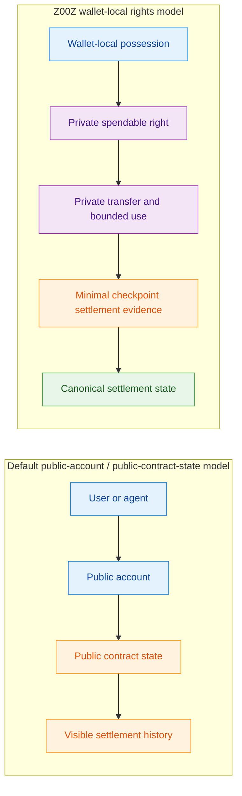
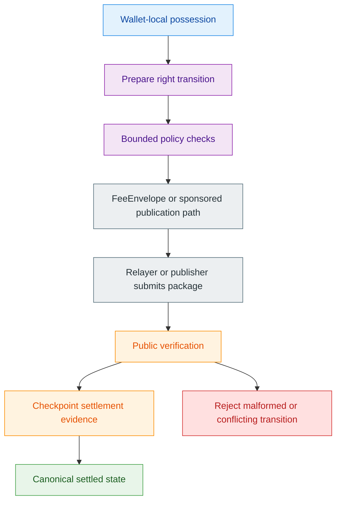
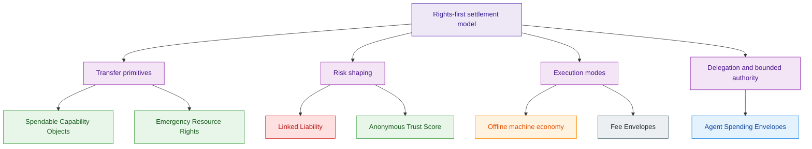
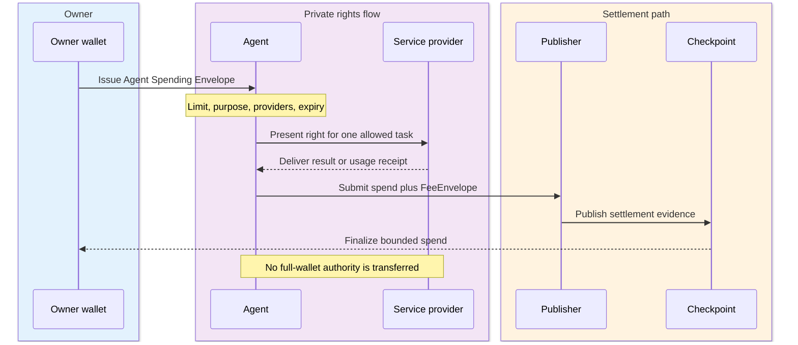
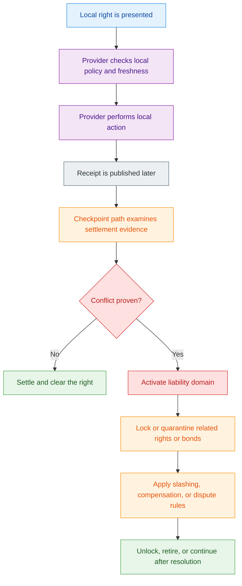
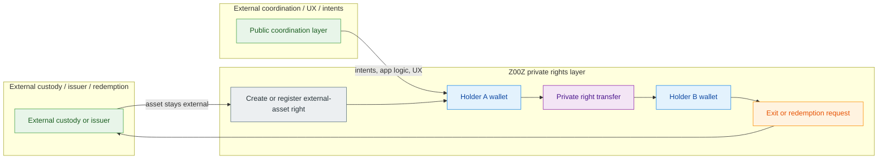

# Z00Z Uniqueness Whitepaper

[TOC]

Version: 2026-06-15

## Key Terms Used In This Paper

This paper uses a small set of terms repeatedly. The list below stays short on purpose. A fuller reference appears in Appendix A.

- `Agent Spending Envelope`: A bounded private spending-right package for autonomous agents, designed to replace full-wallet authority.
- `Anonymous Trust Score`: A privacy-preserving reputation model that accumulates trust signals without exposing full identity, counterparts, or exact activity history.
- `Checkpoint settlement evidence`: The minimal public artifacts needed to verify that a transition is authorized, replay-safe, and valid at settlement time.
- `Emergency Resource Right`: A short-expiry, policy-bound, later-auditable right for urgent access to energy, compute, transport, medicine, or other critical resources.
- `External asset right`: A private Z00Z-side ownership right over value or custody that may live on another chain or under another issuer.
- `FeeEnvelope`: A portable fee-handling structure that specifies how processing and publication are paid for when a right is spent.
- `Liability domain`: The bounded responsibility zone that stays private during honest use and activates only when a provable conflict occurs.
- `Linked Liability`: A design in which conflicting offline or delayed spends activate a hidden liability domain, enabling fraud proofs, locks, slashing, and compensation.
- `Spendable Capability Object (SCO)`: A private transactional right that is not merely a coin, but can be consumed, delegated, split, redeemed, or converted through valid checkpointed transitions.
- `Wallet-local possession`: Ownership material, policy context, and transfer preparation that remain in the wallet before publication.

## 1. Z00Z Uniqueness

Z00Z needs a separate uniqueness paper because "privacy" is too weak a category claim. Privacy coins already exist. Shielded pools exist. Privacy-preserving virtual machines exist. If the argument for Z00Z stops at "it is private," then the paper collapses into a feature comparison with systems that already hide parts of transaction flow or contract execution. The stronger claim is different: Z00Z changes the unit of economic coordination from public accounts and visible contract state to private wallet-local objects and bounded rights that later become narrow settlement evidence.

That distinction matters because it changes what the public chain is for. In a public-account model, the chain is the visible place where ownership, balance state, and application state are continuously updated. In Z00Z, the chain is not meant to be a public wallet interface. It is a checkpointed settlement boundary. The wallet carries possession, policy context, and transfer preparation locally; the public layer accepts only the minimum evidence required to validate a transition, preserve replay safety, and make the resulting state canonical.

### 1.1 Goal Of This Document

#### Uniqueness Thesis

The thesis of this paper is simple: public blockchains are usually organized around public accounts and public contract state, while Z00Z is organized around private wallet-local objects and bounded rights plus checkpoint settlement evidence. The right question is therefore not whether some isolated Z00Z feature can be imitated inside another stack. The right question is whether another system natively delivers the same rights-first model: private possession before publication, bounded transfer semantics, delayed reconciliation when needed, and narrow public evidence at settlement time.

This is also why the paper must be separate from the main whitepaper. The main whitepaper explains the broader protocol. This paper must defend a sharper claim: Z00Z is justified where a conventional smart-contract chain turns a task into a public, online-only, account-based process, while Z00Z can express the same task as a private wallet-local object or bounded right with delayed or checkpointed settlement.

### 1.2 From Public Accounts To Private Spendable Rights

#### Why This Category Claim Matters

Z00Z should therefore be framed as a rights wallet and private settlement layer, not merely as a privacy coin, not merely as a confidential execution environment, and not merely as a rollup with better metadata discipline. A conventional crypto wallet mostly holds coins, tokens, and visible asset claims. A Z00Z-style rights wallet can hold money, but it can also hold bounded private rights: external-asset claims, compute credits, access rights, budget slices, emergency vouchers, private task escrows, reputation-backed permissions, and machine-readable capability objects.

This is a stronger architectural category because the right itself becomes the portable object. It can be loaded into a wallet, constrained by policy, transferred privately, partially consumed, split, redeemed, or settled later. In public-account systems, similar behavior usually becomes visible contract state tied to a public account surface. In Z00Z, the holder does not need authority over a public account in order to act. The holder needs a private spendable right whose policy can be satisfied and whose transition can later be turned into valid settlement evidence.

**Figure 1.1 - Model shift from public accounts to private rights.** The core distinction is not only what gets hidden. It is what the chain is asked to do.

**Table 1.1 - Category boundary at a glance.** The claim is not only that Z00Z hides more data. The claim is that it changes the default economic object and the public settlement surface.

| Dimension | Default public-account / public-contract-state model | Z00Z rights-first model |
| --- | --- | --- |
| Primary unit of action | Account mutation or contract call | Private right transition |
| Where policy usually lives | Public contract logic or account permissions | Right-local or wallet-local bounded policy |
| What the chain mostly records | Ongoing state, account activity, and visible application graph | Minimal checkpoint settlement evidence |
| Offline or delayed reconciliation support | Possible, but usually secondary and system-specific | An architectural target with later reconciliation |
| Delegation shape | Permission over an account, session, or contract surface | Hand-off of a bounded spendable right |

## 2. Why Privacy Alone Is Not The Point

Privacy alone is not the point because privacy by itself does not tell us what kind of object is moving, where policy lives, or what the public chain must remember. A system can hide amounts and still expose a reusable account surface. It can hide contract internals and still force activity to remain online, stateful, and publicly coordinated around visible application boundaries. It can hide transfers in a pool while leaving entry, exit, and surrounding workflow visible enough to reconstruct important economic behavior.

**Figure 2.1 - Privacy alone versus private rights transfer.** This section-opening infographic shows why hiding data is not the same thing as changing the economic object that moves before settlement.

### 2.1 Privacy Coins, Shielded Pools, And Private VMs

#### Why These Are Not The Same Category

Privacy coins, shielded pools, and private virtual machines are meaningful designs, but they do not automatically produce the same state model. In many of those systems, the economic unit is still "a transaction inside a chain" or "a contract interaction inside a hidden execution domain." Z00Z is aiming at something narrower and, in some ways, stranger: a world in which value and authority can be represented as wallet-local spendable objects and bounded rights that move privately before the network turns them into checkpointed public evidence.

That is why the uniqueness claim must be architectural rather than cosmetic. Z00Z is not a privacy application running on top of a public ledger. Its intended category is a ledger whose native economic model is already cash-like and rights-oriented: confidential objects, local possession, bounded policy, and replay-safe checkpoint settlement.

### 2.2 Privacy Versus Private Rights Transfer

#### Rights Move Before Settlement

The central move in Z00Z is that the transferred object is not merely an obscured balance mutation. It is a private wallet-local object whose semantic class may differ. Sometimes that object is clean cash. Sometimes it is an ownership claim over an externally custodied asset. Sometimes it is an offline check, a voucher, a compute credit, a task-specific authority slice, or a machine capability. In all of those cases, the object can exist locally, be validated locally, and only later be committed as narrow settlement evidence.

This is what allows the same architecture to unify seemingly different ideas. Private rights over external assets, offline-first checks, vouchers, spendable capability objects, and bounded agent budgets are not separate gimmicks. They are variations of the same model: a wallet-local object or bounded right can move privately first, and public settlement records only the evidence needed to make the resulting state replay-safe and canonical.

## 3. Why Existing Alternative Models Are Not Enough

The comparison boundary for Z00Z is not "all other blockchains." The real comparison is with the closest partial substitutes: account abstraction, state channels, and NFT-style rights. Each of those approaches solves part of the problem. None of them naturally produces the same rights-first settlement model.

**Table 3.1 - Closest substitutes and the remaining gap.** These systems solve meaningful parts of the problem, but they do not natively collapse into the same private-rights settlement model.

| Model | What it improves | What still constrains it | Why this is still not the same model |
| --- | --- | --- | --- |
| Account abstraction | Programmable authorization, session keys, paymasters | Still centers account authority and a visible contract interaction surface | Delegates private spendable rights instead of account power |
| State channels or Lightning-style paths | Off-chain speed and repeated payment between endpoints | Liquidity, routing, monitoring, and channel structure remain central | Targets portable rights and delayed reconciliation beyond channel topology |
| NFT-style rights | Makes a right legible as an object | Holder graph and interaction graph are usually public | Right is private, policy-bound, and spendable before checkpoint settlement |

### 3.1 Why Account Abstraction Is Not Enough

#### Programmable Accounts Versus Programmable Spendable Rights

Account abstraction improves accounts. It gives programmable account logic, session keys, paymasters, and richer authorization flows. That is useful, but it remains an account-centric model. The thing being programmed is still permission over an account or over visible contract logic attached to an account. The result may be safer than a plain externally owned account, but it usually still exposes an account surface, usage timing, contract interactions, and often a meaningful part of the user's economic graph.

Z00Z aims at a different primitive. It does not ask an agent, service, or device to act through delegated authority over an account. It asks whether that actor can receive a bounded private spendable right instead: spend up to a limit, call an allowed service, use a fixed amount of compute, publish a single batch, or redeem a single claim. The actor does not get general wallet power. The actor gets a private object whose policy is narrower than account ownership and whose settlement surface is smaller than public account activity.

### 3.2 Why State Channels Are Not Enough

#### Liquidity, Routing, Monitoring, And Delayed Reconciliation

State channels and Lightning-style systems are strong when the problem is repeated off-chain payment between endpoints supported by liquidity, routing, and monitoring. Their strength is also their constraint: they assume channels, locked value, routing structure, and enough online discipline to open, close, watch, or reroute those channels safely. That model is powerful, but it is not the same as portable electronic cash or portable private rights.

Z00Z is trying to support a different execution style: spend-then-reconcile, not channel-then-route. A right can be checked locally, transferred locally, and later submitted in a batch for settlement. That is especially important when the right is not just money between two peers, but an offline voucher, a machine capability, an external-asset claim, a local resource right, or a bounded emergency authorization. The comparison is therefore not that channels are weak. The comparison is that channels solve a narrower class of off-chain coordination than the one Z00Z is targeting.

### 3.3 Why NFT-Style Rights Are Not Enough

#### Public Holder Graphs Versus Private Spendable Rights

NFT-style rights are closer to the Z00Z idea than plain accounts because they at least make "the right as object" legible. But they usually keep the object public. A public token-bound account, a visible access NFT, or a visible entitlement token reveals a holder graph, an interaction graph, and often an application graph. That may be tolerable for collectibles or public credentials. It is much less suitable for private budgets, private machine capabilities, private workflow rights, or sensitive resource access.

Z00Z's claim is therefore not that NFTs can never encode rights. The claim is that public right-objects are still the wrong shape for many of the cases that matter most here. Z00Z wants the right to be private, policy-bound, spendable, and checkpoint-settled. It should behave more like bounded electronic cash than like a visible entitlement record attached to a public holder.

## 4. What Z00Z Actually Changes

After the comparison boundary is clear, the positive claim becomes easier to state. Z00Z changes three things at once: where ownership lives, what the public chain records, and how execution fees are handled when the transferred object is a right rather than a plain coin.

### 4.1 Wallet-Local Possession And Checkpoint Settlement Evidence

#### Private Rights Plus Public Settlement Evidence

Z00Z pushes possession and transition preparation into the wallet. The wallet holds the ownership material, policy context, and local knowledge needed to construct a valid transfer or claim. The public layer is narrower. It is not supposed to be a public balance sheet for every participant. It is supposed to be a replay-safe settlement boundary that accepts valid evidence, rejects conflict, and makes the resulting state canonical at checkpoint time.

This is why the same architecture can support both ordinary cash-like transfers and more unusual right types. A wallet can prepare an offline check, a private ownership reassignment over an external asset, a compute-credit spend, or a bounded machine right locally. Publication turns that local action into public settlement evidence later. The chain does not need to mirror the whole wallet's internal world in order to make the transition valid.

### 4.2 Protocol-Service Separation

#### External Systems Provide UX, Custody, Or Coordination

Z00Z also changes the way surrounding systems are used. It does not need to become the place where everything happens. External ecosystems can still provide custody, liquidity, identity, scheduling, user experience, task coordination, or attestation. Z00Z provides the private transfer and settlement layer for the right itself. In some cases an external chain stores the asset while Z00Z stores and reassigns the ownership right. In other cases an external coordination layer runs agent orchestration while Z00Z handles private budget rights, private rewards, or private escrow release.

This separation is not a weakness. It is part of the design. If Z00Z tried to absorb every external function, it would lose the sharpness of its core claim. The more honest model is that other systems remain useful exactly where they are strong, while Z00Z occupies the narrower but distinctive role of private rights transfer and replay-safe settlement.

### 4.3 Fee Abstraction And Sponsored Publication

#### Rights Need Portable Fee Logic

Rights may not be coins, but the transitions that spend them still impose costs. Someone verifies proofs, includes packages, publishes data, and carries settlement artifacts into the checkpoint path. For that reason, a rights-based system cannot treat fee handling as an afterthought. If every right had to be settled only by directly spending a public base-fee asset from a public account, much of the architectural benefit would collapse.

Fee abstraction is therefore part of the uniqueness story. A right-spend should be able to carry its own fee logic through a portable fee envelope, a relayer relationship, a sponsored path, or a later claim structure that compensates the publication side. This matters especially for agents, autonomous objects, and policy-shaped rights, because those actors may be safe only if they receive a narrow right plus a bounded fee path instead of open-ended wallet authority.

**Figure 4.1 - Lifecycle of a private right.** Possession, policy, and fee logic stay close to the right until publication turns the transition into public settlement evidence.

## 5. Core Unique Features

The strongest reason to build Z00Z is not a single primitive. It is a set of features that become natural only once the system is organized around private spendable rights and delayed or checkpointed settlement. The list below identifies the clearest of those features.

**Figure 5.1 - Core uniqueness wedges.** These are consequence layers of the rights-first model, not a claim that every box is an equal-stage shipped subsystem.

**Table 5.1 - Core uniqueness wedges in one view.** Each feature makes the most sense when read as a consequence of the same rights-first architecture.

| Feature | Core move | Why it matters | Pressure case |
| --- | --- | --- | --- |
| Spendable Capability Objects | Turn a bounded action into a spendable private object | Programs action, not only payment | Compute, access, escrows, vouchers |
| Linked Liability | Make conflict activate a hidden liability domain | Enables bounded-risk offline or delayed use | Double-spend or dispute handling |
| Anonymous Trust Score | Reveal trust tier without exposing a public history | Supports reputation without surveillance | Merchant, agent, or device trust |
| Offline machine economy | Let machines verify and consume rights locally | Works under intermittent connectivity | Edge, vehicles, energy, relays |
| Fee Envelopes | Carry fee logic with the right-spend | Makes relayed and autonomous publication practical | Sponsored or machine-mediated execution |
| Agent Spending Envelopes | Delegate a bounded private spend | Prevents open-ended wallet authority | Agent tools, compute, task budgets |
| Emergency Resource Rights | Encode priority, expiry, and auditability | Supports controlled action during disruption | Fuel, medicine, transport, energy |

### 5.1 Spendable Capability Objects

#### Private Transactional Rights, Not Coins

Spendable Capability Objects are one of the clearest expressions of the Z00Z model. An SCO is not merely a coin. It is a private transactional right that can be consumed to perform a bounded action: use compute, call a service, access data, spend within a limit, open a route, redeem a voucher, release an escrow, or claim a reward. The right is public only as committed settlement state. Its operational meaning and policy remain wallet-local or service-local until the holder constructs a valid transition.

This matters because public-account systems usually express similar behavior as permissions on accounts or as visible contract state. Z00Z instead makes the right itself portable. The holder receives a bounded object, not generalized account power. That is a different programming model and, if it works, a different category of wallet.

### 5.2 Linked Liability

#### Offline Fraud Must Become Attributable And Punishable

Linked Liability is the realism layer for offline and delayed execution. Z00Z should not pretend that offline double-spend becomes impossible without global consensus. The stronger and more honest claim is that conflicting use of the same right should generate a provable liability event. If a participant produces two incompatible spends, the conflict should activate a hidden liability domain, trigger a fraud proof, and allow the system to lock, slash, quarantine, or require compensation before normal activity resumes.

This is important because it preserves both privacy and accountability. Honest use does not need to expose the participant's full wallet graph. Fraud, however, should stop being anonymous. Linked Liability is what allows Z00Z to support bounded-risk offline execution without collapsing into the naive claim that offline fraud can simply be engineered away.

### 5.3 Anonymous Trust Score

#### Private Reputation Without Public Identity Graphs

Anonymous Trust Score extends the rights model in the opposite direction from punishment. It asks how a wallet, agent, merchant, or device can accumulate credibility without exposing a full identity graph or a full transaction history. The proposed answer is not a public reputation table. It is a wallet-local, domain-scoped trust construction built from private receipts, bounded volume logic, age, cleanliness, diversity, and bond-backed behavior, then revealed only as a proof of tier or threshold sufficiency rather than as a globally reusable public score.

This feature matters because many rights require more than binary ownership. A system may want to grant larger offline limits, accept a machine as reliable, or treat a service provider as eligible for a stronger workflow only if it has earned trust. Anonymous Trust Score allows that trust to exist without turning Z00Z into a surveillance system.

### 5.4 Offline Machine Economy

#### Machine-To-Machine Rights Under Intermittent Connectivity

Offline machine economy is not a decorative use case. It is one of the environments that most clearly exposes the limits of public-account systems. Drones, chargers, storage systems, vehicles, local relays, and edge-compute nodes cannot always wait for cloud reachability, public RPC, or live chain state at the moment of action. They need a way to verify and consume bounded private rights locally, then reconcile later.

Z00Z becomes interesting here because the transferred object does not need to be plain money. It can be an energy credit, an access right, a route permission, a compute credit, a relay claim, or an emergency resource right. If those rights can move locally under bounded risk and later reconcile through checkpointed settlement, Z00Z opens a design space that is wider than ordinary off-chain payment.

### 5.5 Fee Envelopes

#### Publication Logic For Rights-Based Settlement

Fee Envelopes matter because every rights-based settlement path still consumes operator and publication resources. A right can be non-coin, but the transaction that spends it still has to be checked, batched, and published. The fee model therefore has to travel with the right-spend instead of being treated as a separate assumption about a public gas surface outside the right itself.

This is especially important for relayed and autonomous execution. An agent should not have to hold ten different gas assets with broad authority over them. A machine should not need live access to a public treasury just to redeem a bounded local right. Fee Envelopes are a key mechanism proposed here to keep rights-based settlement operational rather than merely conceptual.

### 5.6 Agent Spending Envelopes

#### Bounded Rights Instead Of Full Wallet Authority

Agent Spending Envelopes are one of the clearest examples of why Z00Z programs rights instead of accounts. A human, DAO, or enterprise should not need to grant a full wallet, or even a broadly permissioned smart account, to an autonomous agent. The safer design is to issue a bounded private package: spend up to this amount, use only these providers, perform only these actions, and expire at this time.

That model is narrower than delegated wallet control and richer than a single session key. It is designed for a world in which the main risk is not that an agent cannot pay, but that it pays too much, pays the wrong counterparty, leaks its owner's strategy, or expands from one authorized task into open-ended wallet behavior.

### 5.7 Emergency Resource Rights

#### Priority, Expiry, And Post-Emergency Audit

Emergency Resource Rights show that private spendable rights are not only about commerce. They can also encode priority, short expiry, bounded eligibility, issuer constraints, local quorum rules, and later audit for access to fuel, medicine, energy, transport, or other scarce resources under disrupted conditions. In that setting, the right is not just "payment." It is offline authorization plus later settlement and controlled accountability.

This feature is a strong test of whether the rights model is real. Emergency scenarios are exactly where public-account dependence and always-online assumptions become weakest. If Z00Z can support bounded private emergency rights with later reconciliation and audit, then the rights-first framing is doing more than rebranding ordinary payment.

## 6. Why Agents Need Rights, Not Wallets

Agents make the Z00Z thesis easier to test. If the system still requires handing an autonomous actor a broad wallet, a public account permission set, or a widely reusable session key, then much of the claimed architectural shift has not actually happened. The sharper design is that an agent should receive bounded, private, consumable rights that let it perform a specific class of actions without inheriting the owner's full balance, strategy, counterparty map, or future optionality.

**Figure 6.1 - Agents need bounded rights, not wallet authority.** This section-opening infographic frames the delegation argument before the document moves into the detailed agent cases.

### 6.1 Bounded Delegation As The Agent Primitive

#### Agents Should Receive Rights, Not Wallet Keys

The agent problem is not merely "how to let bots pay." The deeper issue is how to grant limited authority without giving an autonomous system power that is broader than its task. A research agent may need a data budget. A coding agent may need compute rights. A solver may need a one-time execution right. A publishing agent may need the ability to submit a single package. None of these cases naturally require control over the owner's full wallet.

This is where the rights model becomes practical rather than philosophical. A bounded right can encode purpose, expiry, limit, allowed providers, and other policy constraints directly in the object that the agent receives. The owner delegates a narrow right, not a general account relationship. That reduces both operational risk and public leakage.

**Figure 6.2 - Bounded agent delegation.** The agent receives a private task-bound right, not reusable wallet authority.

**Table 6.1 - Delegating wallets versus delegating rights.** The more autonomous the actor, the more important the difference becomes.

| Delegation mode | Granted authority | Public surface | Failure blast radius | Fit for bounded autonomous tasks |
| --- | --- | --- | --- | --- |
| Full wallet or broad smart-account delegation | Broad balance and action authority | Full account surface usually remains relevant | High | Weak except in highly trusted closed environments |
| Session key or account-scoped permission | Narrower method or time scope over an account | Account surface still remains visible | Medium | Useful, but still account-centric |
| Agent Spending Envelope | Private task-bound right with limit, purpose, providers, and expiry | Smaller settlement surface than account delegation | Lower and task-scoped | Strong match for Z00Z-native agent workflows |

### 6.2 Private Agent Commerce, Capability Tokens, And Compute Credits

#### Rights-Based Agent Markets

Once agents receive rights instead of wallets, an entire private market structure becomes easier to build. Agents can buy services from other agents without publishing who hired whom, how much was paid, or which sequence of subtasks produced the final output. They can receive capability tokens instead of general money, use compute credits without disclosing the owner's broader budget, and pay for data access without broadcasting strategic intent through a public market graph.

This matters because future agentic commerce is unlikely to look like ordinary retail payments. It will consist of delegated tool calls, bounded market access, compute-minute rights, data-query rights, workflow escrows, and task-conditioned releases. Z00Z becomes distinctive if it can treat those objects as private rights with settlement discipline instead of forcing them back into visible account behavior.

### 6.3 Reputation Bonds, Useful-Work Payouts, And Risk Firewalls

#### Slashable Trust Without Full Public Surveillance

The agent ecosystem also needs trust without collapsing into full public surveillance. A useful model is to combine private reputation receipts, slashable bonds, useful-work payout logic, and bounded failure domains. An agent should be able to prove enough: that it has posted a bond, that it has completed prior work, that it has not been slashed recently, or that it satisfies a minimum trust tier. It should not have to reveal its full owner identity, full client list, or full task history in order to participate.

The same logic applies to risk control. If an agent fails, is compromised, or acts outside policy, the failure should be bounded by the right it received. That is why private agent budgets, private reputation bonds, private useful-work payouts, and agent risk firewalls fit together. They are not separate features. They are the security geometry of a rights-native agent economy.

## 7. Offline Machine Economies And Emergency Operation

The same reasoning extends from software agents to physical systems. Autonomous objects often have even stronger constraints than software agents: intermittent connectivity, no reliable cloud path at the moment of action, limited local trust, and direct interaction with physical resources. That is exactly the environment in which a rights-first settlement model becomes materially different from public-account systems.

**Figure 7.1 - Offline machine economy and emergency operation.** This section-opening infographic groups offline rights, linked-liability safety, and emergency resource rights into one operational picture.

### 7.1 Portable Rights For Autonomous Physical Objects

#### Local Networking And Delayed Reconciliation

Autonomous physical objects do not always need coins. They often need bounded rights: an energy credit, a one-time access permission, a route right, a relay quota, a compute slot, a custody-transfer right, or a short-lived emergency authorization. If such rights can be loaded into a local wallet, checked over short-range or local communication, and consumed under bounded risk before later reconciliation, then the object can continue operating without asking a remote chain or cloud service for permission at every step.

This should not be treated as a corner case. Drones, robots, chargers, warehouses, gateways, vehicles, and edge nodes are exactly the places where the assumptions of public-account systems become brittle. A design that relies on live RPC, a visible account graph, and immediate broadcast at the point of action is often the wrong shape for those environments.

### 7.2 Linked Liability As The Offline Safety Model

#### Bounded Fraud Exposure, Compensation, And Unlock Rules

Offline operation is only credible if the fraud model is explicit. A local provider may accept a right and perform a physical action before global consensus sees the event. That means the system must define what happens if the same right is reused elsewhere, if a receipt is invalid, or if a provider and consumer later disagree about the local event. Linked Liability supplies that missing structure. Conflict activates a liability domain, the relevant future rights can be locked or quarantined, bonds can be frozen or slashed, and harmed counterparties can be compensated according to the settlement result.

This is why Z00Z should speak in terms of bounded-risk offline execution rather than magical offline finality. Local acceptance is not the same thing as final settlement. What matters is that the local action can be made economically rational, operationally useful, and cryptographically reconcilable once the checkpoint path is available again.

**Figure 7.2 - Offline execution with linked liability.** Local action can happen before settlement, but conflict resolution remains explicit and bounded.

### 7.3 Emergency Resource Rights And Critical Infrastructure

#### Hospitals, Energy, Transport, And Disaster Flows

Emergency rights are the most vivid example of why portable private rights matter. In disrupted conditions, the relevant question may not be "who can pay on a public chain right now?" It may be "who is authorized to receive fuel, medicine, charging, transport, or storage access under emergency policy?" A short-expiry right with issuer constraints, optional local quorum, capped usage, and later audit can be a better fit than a fully online account-based payment flow.

This is also where the operational discipline of the model becomes visible. Emergency rights must be bounded, attributable when abused, and reviewable after the fact. They are not a license for invisible authority. They are a way to preserve controlled action when connectivity and central coordination are weakest.

## 8. Cross-Chain Composition And External Asset Rights

Z00Z becomes more useful when it composes with other ecosystems without dissolving into them. The point is not to replace every other chain, wallet, issuer, or application stack. The point is to let other systems keep the functions they already perform well while Z00Z provides a different layer: private rights transfer, private ownership reassignment, and replay-safe settlement.

**Figure 8.1 - Cross-chain composition and external asset rights.** This section-opening infographic shows how value can stay external while the ownership or control right moves privately inside Z00Z.

### 8.1 Private Rights Over External Assets

#### Locker Thesis And Externally Custodied Value

The locker thesis is one of the strongest arguments in the document. Custody, liquidity, reserves, or redemption can remain external while Z00Z privately transfers the ownership right. An asset can stay on an external chain or under an issuer's own custody regime while Z00Z turns the control over that asset into a private right that can move without creating a public reassignment graph.

This is a stronger story than simply wrapping an asset into a visible bridge token. A public wrapper still exposes deposit, transfer, and redemption paths as a visible account graph. Z00Z's proposal is narrower and more distinctive: the external world keeps the asset where it already lives, and Z00Z privately moves the right to control or redeem that asset until the holder chooses to exit. That makes private external-asset rights one of the clearest commercialization wedges for the protocol.

### 8.2 Stable Asset Families And Trust Tiers

#### Externally Backed, Issuer-Native, And Synthetic Modes

This composition model only stays honest if asset families are separated by trust tier. An externally backed asset, an issuer-native asset, and a synthetic internal unit may all share the same private transfer surface inside Z00Z, but they do not mean the same thing economically. Externally backed assets depend on external custody and redemption. Issuer-native assets depend on issuer credibility and issuer redemption policy. Synthetic internal units may be useful for accounting, incentive, or local-market design without carrying any external redemption promise at all.

The correct boundary is therefore simple. Z00Z guarantees private transfer, replay-safe settlement, checkpoint continuity, and internal protection against double-spending of the right itself. It does not automatically guarantee external reserves, external liquidity, legal redemption, or issuer honesty. By keeping those trust tiers explicit, Z00Z avoids pretending to be a bank, a bridge operator, or a synthetic-dollar guarantor when it is actually a private settlement layer.

**Table 8.1 - Trust tiers for private asset families.** The private transfer surface can stay consistent even when the external trust assumptions do not.

| Asset family | Typical external dependency | What Z00Z can preserve or settle privately | What Z00Z does not guarantee |
| --- | --- | --- | --- |
| Externally backed private right | External custody, reserves, or redemption service | Private internal ownership transfer and replay-safe settlement of the Z00Z-side right | Reserve integrity, redemption honesty, or external liveness |
| Issuer-native private asset | Issuer policy, issuance discipline, and redemption meaning | Private transfer, checkpoint continuity, and asset-definition consistency | Solvency, legal enforceability, or policy credibility |
| Synthetic or internal accounting unit | Collateral, governance, or local-market support regime | Private transfer and bounded internal settlement of the unit | Peg stability, collateral sufficiency, or market support operations |

### 8.3 NEAR And Other External Coordination Layers

#### Public Coordination Outside, Private Rights Inside

The intended relationship with systems such as NEAR is one of stack composition, not dependence. A public coordination layer can provide readable identities, account UX, scheduling, intents, task registries, access control, and application-facing logic. Z00Z can then provide the private side of the same workflow: private budgets, private rewards, private capability rights, private escrow release, and private settlement receipts.

This split is particularly strong for agentic and service-heavy environments. A user may log in through a conventional app surface, create or manage intents through a public coordination layer, and still rely on Z00Z for the parts of the workflow that should not become a public behavioral graph. NEAR is one candidate for that role, but the broader principle is more important than any single chain: public coordination outside, private rights inside.

**Figure 8.2 - External asset composition.** External systems keep custody and coordination roles while Z00Z privately moves the control right.

### 8.4 Attestations, Anti-Sybil, And Verified Work Inputs

#### External Evidence Without Becoming An Identity Chain

Z00Z should import evidence rather than become a universal identity or compliance chain. Attestations about completed work, anti-sybil scores, oracle outputs, agent validation results, and other external facts can all be useful inputs to private claims or payouts. But those inputs should stay external in meaning even when they are consumed by Z00Z settlement logic.

This matters because useful-work payouts, agent rewards, and claim-based rights often depend on facts that are not purely internal to settlement. Someone has to attest that the work happened, that the agent delivered, or that the claimant is eligible. Z00Z adds value by settling the resulting right privately, not by pretending to be the sole source of truth for identity, legitimacy, or off-chain fact production.

## 9. Trust, Risk, And Boundary Conditions

The uniqueness argument becomes stronger, not weaker, when its limits are stated explicitly. Z00Z should not be sold as a system that magically makes every desirable property unique, nor as a system that dissolves every external trust assumption. Its credibility depends on drawing those lines clearly.

### 9.1 What Z00Z Does Not Claim

#### Not Every Primitive Is Unique, And Offline Fraud Is Not Impossible

Z00Z does not claim that confidentiality, zk proofs, stablecoins, grants, bridges, or account abstraction are unique on their own. Those primitives already exist elsewhere. The defensible claim is that Z00Z combines wallet-local possession, private rights transfer, delayed or offline execution, local policy, minimal public settlement evidence, and controlled disclosure in a way that public-account systems do not naturally deliver together.

Z00Z also does not claim that offline fraud becomes impossible. That would be an unrealistic statement. The more serious claim is that offline fraud can become provable, punishable, and economically irrational through linked liability, penalty logic, and bounded execution rules. The design is not built on a fantasy of zero-risk offline action. It is built on explicit risk shaping and later reconciliation.

### 9.2 Trust Boundaries And External Dependencies

#### What Z00Z Guarantees And What Stays Outside The Protocol

The protocol boundary is straightforward if stated correctly. Z00Z guarantees the private reassignment and replay-safe settlement of internal rights. It can guarantee that a right was not spent twice inside its own settlement logic and that a valid checkpoint path was followed, while the protocol is designed to provide a private internal transfer surface. It cannot, by itself, guarantee external reserve integrity, issuer redemption, bridge operator honesty, merchant willingness to accept a voucher, or the truthfulness of an external oracle.

This is why the paper keeps returning to trust tiers. The more Z00Z is asked to represent value that originates elsewhere, the more important it becomes to separate settlement correctness from economic backing. That separation is not a flaw. It is what keeps the protocol honest about what it is actually proving.

### 9.3 Fraud Proofs, Selective Audit, And Wallet-Side Privacy Defense

#### Slashing, Compensation, Disputes, And Controlled Disclosure

Z00Z is not only about hiding things. It also needs disciplined recovery, dispute handling, and controlled disclosure. Fraud proofs, liability locks, slashing, compensation, and dispute procedures are part of that discipline. So are selective-audit paths for institutions that need to prove totals, policy compliance, or bounded facts without publishing the entire operational graph.

Wallet-side privacy defense belongs in the same family. Privacy is strengthened when wallet behavior aligns with protocol assumptions. Warnings about weak remix sets, risky exits, repeated funding patterns, or observable collection patterns do not replace cryptography, but they reduce the chance that users defeat the protocol's privacy properties through behavior. In that sense, Z00Z privacy is not only cryptography. It is protocol design, wallet behavior, telemetry, and safe defaults.

## 10. Productization And Whitepaper Packaging

The uniqueness thesis becomes more credible when it is tied to concrete product wedges and a believable expansion path. A good uniqueness paper should therefore do more than describe novel properties. It should show how those properties become legible to readers and actionable for ecosystem partners.

### 10.1 Strongest Whitepaper Figures And Comparison Tables

#### Show The Reader The Comparison Boundary

The paper will be strongest if the comparison boundary is made visual. A reader should be able to see, at a glance, how Z00Z differs from public-account chains, account abstraction, state channels, NFT-style rights, and privacy overlays. The strongest supporting figures are the ones that make the transfer object visible: a rights lifecycle, a linked-liability dispute flow, an offline-machine execution flow, and a rights-versus-accounts comparison table.

This is not cosmetic packaging. Z00Z is easier to misunderstand than a conventional chain because its claim is architectural rather than singular. The figures and tables should therefore do real argumentative work: show that the unit of action is changing from public account mutation to private right transition plus narrow settlement evidence.

### 10.2 Strongest Commercialization Wedges

#### Which Packages Best Prove The Thesis

The strongest wedge markets are the ones that make the rights model impossible to mistake for "just another private chain." Private external-asset lockers show that Z00Z can transfer ownership over value that remains custodied elsewhere. Local-economy and aid vouchers show that policy-shaped money can circulate privately and even offline. Private B2B clearing and payroll show that institutions can settle real flows without exposing their supplier or employee graphs. Private subscriptions and pay-per-use credits show that bounded service rights can be spendable without becoming public recurring-payment patterns.

The agentic wedges are equally important. Agent spending rights, compute and tool credits, private task escrows, and reputation-bonded agent markets all push the system into a domain where public-account assumptions become especially awkward. Taken together, these wedges show the commercialization story as a coherent category rather than a bag of unrelated use cases.

### 10.3 Delivery Path

#### Internal Assets First, Then External Lockers, Then Broader Rights

The safest path is to expand from the inside out. Internal assets and internal private transfer come first because they let the core settlement mechanics harden without importing external custody risk too early. External lockers and bridge-style integrations can then extend the system into real-world asset ecosystems. Coordination layers, useful-work payouts, and service integrations can follow once private claims and rewards are easier to reason about. Institutional and local-economy deployments become stronger after that foundation exists.

This sequencing matters because the uniqueness thesis is easier to trust when the build path matches it. Z00Z should not try to prove everything at once. It should first prove that a private rights settlement core works, then prove that it composes with external custody, then prove that it can support more complex rights markets, agentic workflows, and selective-audit institutional use.

## 11. Conclusion

The uniqueness of Z00Z is not a single cryptographic trick and not a single vertical market. It is a coherent shift in how economic action is represented, delegated, and settled.

### 11.1 Final Positioning Statement

#### Z00Z As A Private Spendable Rights And Settlement Layer

Z00Z is best understood as a private spendable-rights and settlement layer. It moves value, claims, access, budgets, and bounded capabilities as wallet-local rights that can be transferred privately before they become narrow public settlement evidence. That is why the same design can support private external-asset rights, spendable capability objects, linked liability, agent spending envelopes, emergency resource rights, and offline machine economies without collapsing into a public-account graph.

The clearest final statement is therefore not that Z00Z is "more private" than another chain. It is that Z00Z exists where public-account systems force economic action into visible, online, account-based form, while Z00Z allows that action to be expressed as a private right with checkpointed settlement. If that distinction holds in implementation, then Z00Z is not merely another privacy feature set. It is a different settlement category.

### 11.2 Candidate Future Appendices

#### What Should Move Out Of The Main Narrative Later

The current appendices stay intentionally lightweight. They define the vocabulary of the paper and normalize its shorthand. Later versions can expand this appendix boundary with a deeper comparison matrix, a fuller threat-model summary, a more formal asset-trust-tier reference, and a more technical protocol-object appendix if the document evolves from an argument paper into a fuller technical reference.

## Appendix A. Glossary

This appendix stays reader-oriented. It defines the recurring terms of the uniqueness paper without turning into a full protocol specification.

- `Agent Spending Envelope`: A bounded private authority package for an agent, designed to allow specific spending behavior without granting full wallet control.
- `Anonymous Trust Score`: A privacy-preserving trust metric built from hidden receipts, bounded volume logic, and anti-gaming rules rather than from a public identity graph.
- `Checkpoint settlement evidence`: The public artifacts that prove a transition is valid and replay-safe at the settlement boundary.
- `Emergency Resource Right`: A short-expiry, policy-bound, later-auditable right to obtain urgent access to a critical resource.
- `External asset right`: A private right inside Z00Z that represents ownership or control over value custodied or recognized elsewhere.
- `FeeEnvelope`: A structured way to handle publication fees for rights-based settlement, including sponsored or relayed execution.
- `Linked Liability`: A mechanism that activates responsibility, penalties, and recovery logic when a conflicting spend becomes provable.
- `Liability domain`: The hidden scope of responsibility that stays private during honest use and activates only when fraud is proven.
- `Offline machine economy`: An operating model where autonomous systems exchange private rights locally and reconcile later.
- `Spendable Capability Object (SCO)`: A private, checkpoint-settled transactional right that is not merely a coin and can be consumed to perform a bounded action.
- `Wallet-local possession`: Ownership knowledge and transfer preparation that stay in the wallet until publication turns them into settlement evidence.

## Appendix B. Abbreviation and Symbol Table

This appendix stays lightweight and limited to the terminology used in this paper.

### B.1 Abbreviations

| Abbreviation | Meaning |
| --- | --- |
| `AA` | Account Abstraction |
| `ATS` | Anonymous Trust Score |
| `CCTP` | Cross-Chain Transfer Protocol |
| `DA` | Data Availability |
| `EAS` | Ethereum Attestation Service |
| `ERR` | Emergency Resource Right |
| `EVM` | Ethereum Virtual Machine |
| `FE` | FeeEnvelope |
| `LL` | Linked Liability |
| `PoUW` | Proof-of-Useful-Work |
| `SCO` | Spendable Capability Object |
| `UBI` | Universal Basic Income |

### B.2 Canonical Terms And Short Symbols

| Term or symbol | Meaning in this paper |
| --- | --- |
| `rights-first model` | A system where bounded private rights, not public accounts, are the primary unit of economic action |
| `public-account model` | A system where balances, reusable accounts, and public contract state define the default ownership surface |
| `wallet-local` | Prepared, owned, or recognized in the wallet before publication |
| `checkpoint` | The replay-safe settlement boundary that decides whether a transition becomes canonical |
| `settlement evidence` | Roots, deltas, proofs, and artifacts needed to verify a transition publicly |
| `external asset` | Value whose custody, reserves, or redemption live outside Z00Z |
| `private right` | A spendable or redeemable right that is not publicly mapped to a reusable holder graph |
| `delayed reconciliation` | The model in which local exchange can occur before later publication and settlement |
