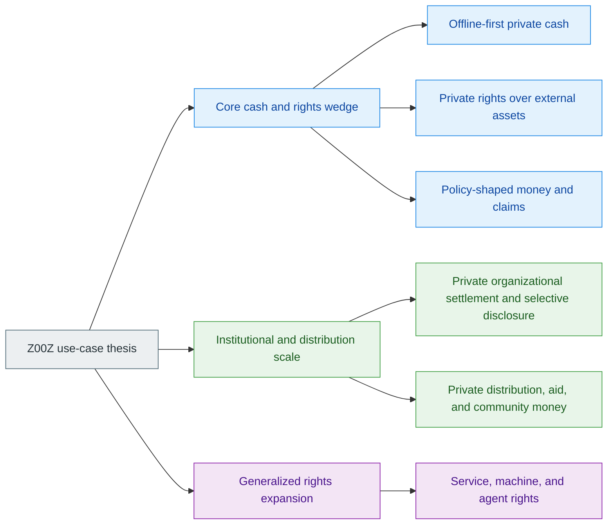
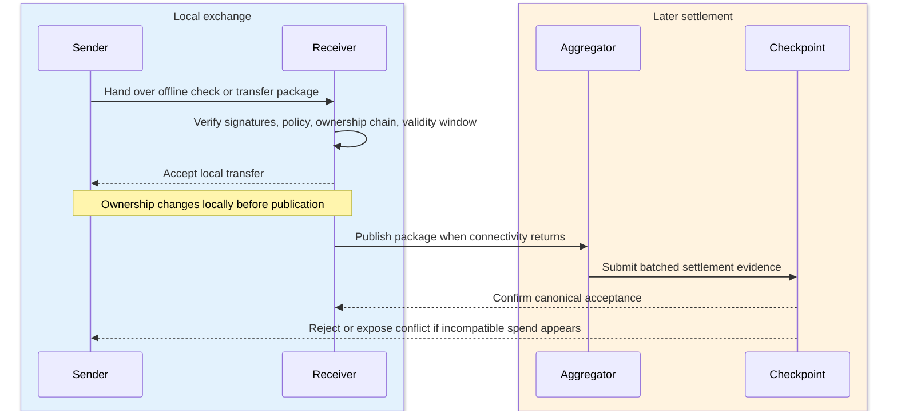
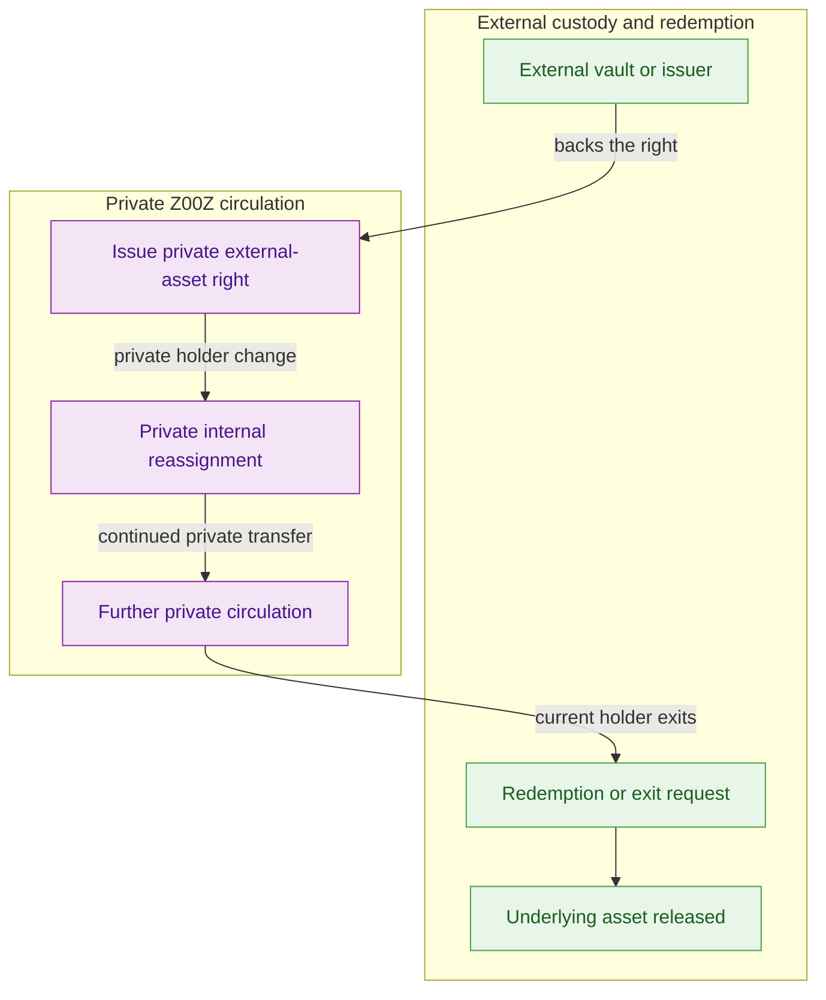
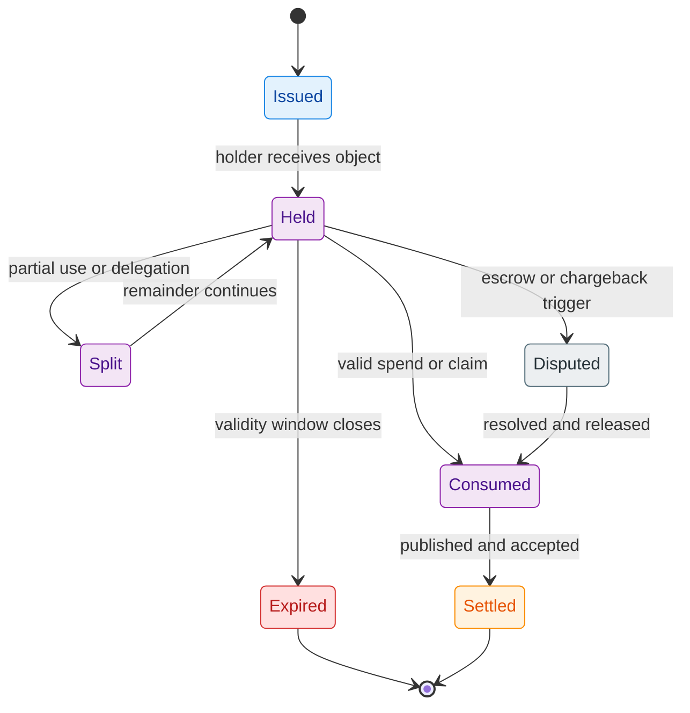
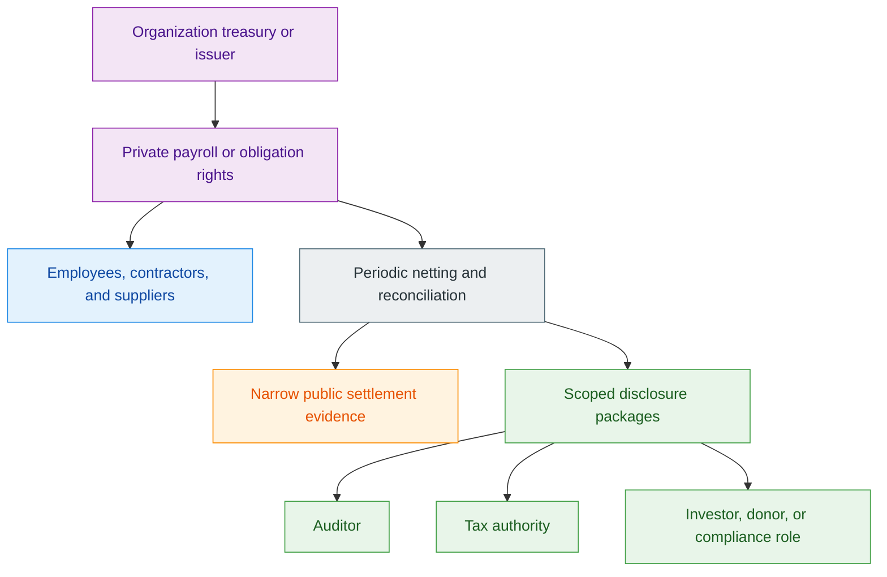
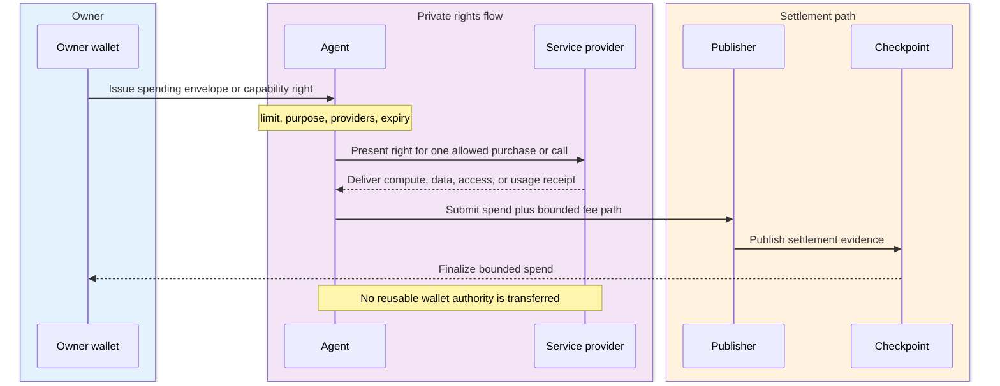

# Z00Z Use Cases Whitepaper

[TOC]

Version: 2026-06-27

## Key Terms Used In This Paper

This paper uses a small set of terms repeatedly. The list below stays short on purpose. A fuller glossary appears in Appendix A.

- `AssetLeaf`: The public, checkpointed settlement object that represents a confidential asset right in canonical state.
- `Cash policy`: A bounded rule set carried by the spendable object itself, such as expiry, recurring windows, merchant scope, credit semantics, or delayed release conditions.
- `External asset right`: A private Z00Z-side ownership right over value that may remain custodied, locked, or issued elsewhere.
- `Offline check`: A convenient use-case term for a wallet-portable transfer or claim package that can move before checkpoint settlement; in the live protocol direction, this corresponds to wallet-built packages plus later publication and reconciliation.
- `Selective disclosure`: A scoped viewing or audit mode that reveals only the minimum subset of economic history needed by a tax, investor, auditor, compliance, donor, or regulatory role.
- `Settlement evidence`: The narrow public artifacts needed to verify that a transition is authorized, replay-safe, and consistent with checkpointed state.
- `TxPackage`: The wallet-side canonical envelope for preparing an ordinary confidential transfer before publication.
- `Spendable capability object`: A broader future right-object that can encode bounded machine, agent, access, data, compute, or service authority.

## 1. Why This Paper Exists

This paper explains where the Z00Z architecture matters most in practice. The strongest claim is not that Z00Z is simply "more private" than an ordinary smart-contract chain. The stronger claim is that some workflows are naturally forced into a public, online-only, account-shaped form on conventional systems, while Z00Z can express the same workflows as private wallet-local objects and bounded rights with delayed or checkpointed settlement. That is the test applied throughout this document.

### 1.1 Goal Of This Document

The goal of this document is to move from abstract protocol language to architecture-defining use-case families. It is not enough to say that Z00Z can hide a transfer. The stronger claim is that several economically important workflows become natively expressible only when value or authority behaves like a private wallet-local object that can move before the chain records final settlement evidence.

#### What This Paper Must Demonstrate

This paper must demonstrate three things at once. First, it must show that the strongest Z00Z cases are not random verticals, but families that all rely on the same architectural stack: wallet-local possession, confidential objects, delayed reconciliation, narrow settlement evidence, and clean protocol-service separation. Second, it must show that these families are not merely "nice to have privacy features" on top of a public account chain. They are cases where a public account model naturally leaks too much, assumes too much online coordination, or pushes too much business logic into visible contract state.

Third, the paper must show that the chosen families are not duplicates wearing different business labels. Private subscriptions, IOU notes, merchant-bound money, and chargeback windows all belong together because they are all examples of policy-shaped private objects. Payroll and B2B netting belong together because they are both selective-disclosure settlement systems. This discipline is necessary if the paper is going to feel like a protocol argument instead of a brainstorm dump.

#### What This Paper Must Not Become

This paper is not an exhaustive catalog of everything that could theoretically be built on top of Z00Z. If every adjacent scenario is treated as a first-class pillar, the argument loses shape and the architecture becomes harder to distinguish from a general wish list. The focus here is on the smallest set of use-case families that most clearly prove the rights-first settlement model.

This paper also does not claim that every useful primitive is impossible elsewhere in theory. Many effects can be imitated partially with enough centralization, trusted middleware, or visible smart-contract scaffolding. The stronger claim is about native fit: public-account systems do not naturally combine private possession, delayed settlement, object-local policy, and narrow public evidence without exposing too much or outsourcing too much.

### 1.2 Reader Promise And Boundary

By the end of this paper, a reader should understand why six use-case families fit together under one architectural thesis: Z00Z is a protocol for private transferable monetary objects, claims, and rights plus later-settled evidence, not merely a blockchain that hides some transaction fields. The document should make the family resemblance visible across offline cash, external-asset rights, policy-shaped money, selective-disclosure business settlement, private aid distribution, and future service or agent rights.

#### What A Reader Should Understand After Reading

After reading, the reader should be able to answer a precise question: why are these use cases better understood as consequences of one state model rather than as unrelated applications? The answer should be clear. They all depend on a combination of private possession, object-local meaning, delayed publication, replay-safe settlement, and a public surface that reveals less than an account ledger naturally reveals.

The reader should also understand why the paper chooses some examples as primary and others as secondary. The strongest families are the ones that most clearly require the full Z00Z combination and that remain conceptually distinct from one another. That is why offline-first private cash, private external-asset rights, and policy-shaped money lead the paper, while market-structure ideas, privacy telemetry, and trust-score systems are intentionally deferred.

#### Scope Boundary

This document focuses on use-case families, not on low-level protocol specification, governance design, or legal deployment structure. It explains where the architecture creates its clearest practical wedge, while leaving operational implementation details, legal structures, and surrounding ecosystem mechanisms outside the main line of argument.

## 2. Architectural Lens For Evaluating Use Cases

The strongest Z00Z use cases are not defined by one isolated feature. They are defined by a recurring architectural combination. A use case belongs in this paper when it genuinely depends on private wallet-local objects, later checkpoint settlement, narrow public evidence, and a boundary between the protocol core and the external service layer.

### 2.1 Wallet-Local Possession And Delayed Settlement

The first recurring primitive is wallet-local possession before public evidence. In a public account-chain model, ownership and activity live immediately in publicly legible state. In Z00Z, the meaningful object starts locally: the wallet holds the ownership material, prepares the transition, and may hand off a transfer or claim package before the chain has recorded final settlement. That is what makes the protocol feel closer to digital cash than to a public account ledger.

#### Private Possession Before Public Evidence

This distinction matters because many of the target workflows break if every meaningful action must first appear as a public mutation. A wallet-local object can be recognized, checked, and transferred under intermittent connectivity. A payroll batch can be prepared privately before it becomes public evidence. A voucher can circulate before final redemption. A private right over an externally locked asset can move without forcing the external custody layer to mirror each reassignment publicly.

The claim boundary here is important. The practical architectural story is delayed-connectivity exchange, signed receiver or package material, and later checkpointed reconciliation. The paper does not need to claim a finished universal offline-bearer theorem in order to justify the use-case family. It only needs to show that Z00Z is built around local possession first and public settlement second.

#### Replay Safety Without Permanent Public Wallet History

Delayed settlement is only meaningful if later reconciliation is still strict. Z00Z therefore does not replace one extreme with another. It does not say "keep everything private and hope for the best." It says that the public layer should record only the evidence needed to reject malformed, replayed, or conflicting transitions, rather than recording a full public wallet diary for every user and organization.

This is the core reason the use cases in this paper hang together. They are not merely hidden transfers. They are workflows in which the chain acts as a settlement notary over replay-safe evidence instead of as a continuously readable account system. That narrower public role is what allows the protocol to support spend-then-reconcile execution without collapsing back into public account-state semantics.

### 2.2 Rights Mobility And Policy-Bound Objects

The second recurring primitive is that the transferred object is not always just "amount X." It can be a bounded object whose meaning travels with it. Sometimes that object is clean cash. Sometimes it is a voucher, claim, externally backed ownership right, compute credit, or agent spending limit. These can all be treated as spendable private objects rather than as visible permissions attached to public accounts.

#### Why Coins, Checks, And Claims Form One Architectural Family

This is why the paper treats coins, checks, vouchers, claims, and future capability objects as one family resemblance rather than as unrelated categories. In each case, the holder receives something that can be carried privately, checked against local rules, and later settled through a narrow public transition. The object may represent pure money, a recurring subscription claim, an externally backed ownership right, a delayed credit obligation, or a bounded service entitlement. What unifies them is not the industry. It is the shared object-local, policy-bearing, later-settled structure.

That same structure is what lets the paper move from digital cash to broader private monetary rights without changing its conceptual center. The system still begins from wallet-local possession, still relies on later settlement evidence, and still avoids treating public contract-state as the natural place where all behavioral meaning must live.

#### Why Public Contract State Is The Wrong Default Here

On an ordinary smart-contract chain, the easiest way to express recurring payment limits, merchant restrictions, delayed release conditions, or voucher rules is to turn them into visible contract state and visible event history. That works functionally, but it usually exposes exactly the application graph that privacy-sensitive use cases are trying to avoid. Even if the amount is hidden, the recurring timing pattern, the service relationship, the allowed merchant set, the dispute window, or the redemption behavior may still remain legible.

This is why several attractive application labels are conceptually the same use case at protocol level. Subscription claims, merchant-bound money, expiring community vouchers, soft chargeback windows, and IOU notes all rely on one architectural move: policy travels with the spendable object instead of living as a continuously visible public application machine.

### 2.3 Selective Disclosure And Service Separation

The third recurring primitive is narrow public settlement plus optional service-layer visibility. Z00Z is strongest when the protocol can stay minimal while different external roles see different slices of information. That is what turns the same architecture into something useful for payroll, B2B netting, aid distribution, private donor flows, institutional auditing, and machine-issued service rights without forcing every participant into one universal transparency model.

#### Narrow Public Evidence With Optional Audit Layers

Institutional and public-interest cases do not need to choose only between full public-chain exposure and totally closed black-box bookkeeping. Z00Z aims at a middle ground in which the base chain sees minimal evidence, while employer, auditor, tax, donor, investor, or compliance roles can receive a scoped proof package that reveals only what they actually need.

This matters because some of the strongest non-consumer use cases depend on exactly that property. Private payroll is not just one more private payment. It becomes stronger when aggregate payroll commitments and selective audit views are possible. Private B2B settlement becomes stronger when obligation graphs stay off-chain but final proof-backed net settlement remains possible. Aid and donor systems become stronger when recipients are not publicly exposed, yet operators can still prove aggregate delivery.

#### What The Base Protocol Does Not Need To Do

This selective-disclosure layer only works if the protocol boundary stays clean. Z00Z does not need to become the custody provider, ERP suite, payroll processor, insurance underwriter, bridge market, or machine-service marketplace. In many of the strongest use cases, the external system keeps doing what it already does well. An external vault keeps custody. A city or NGO issues aid units. A business keeps its own accounting stack. A compute or API provider delivers the external service. Z00Z supplies the private transfer and settlement layer for the right itself.

That separation is one of the reasons the use-case thesis remains coherent. It prevents the paper from implying that Z00Z must absorb every surrounding function in order to matter. It only needs to occupy the right layer: private transfer, replay-safe settlement, and optional scoped disclosure above that boundary.

## 3. Use Case Selection Framework

Z00Z can support many applications, but the strongest narrative does not come from listing everything. It comes from choosing the families that most clearly require the combination of cash-like privacy, delayed settlement, rights mobility, and selective disclosure, and then merging adjacent scenarios that are really the same primitive at protocol level.

### 3.1 Core Family Selection

The six families below form the core narrative of this paper. The first five define the strongest monetary, institutional, and social wedges. The sixth extends the same model into service, machine, and agent domains, but is deliberately placed after the core monetary families rather than before them.

#### Family A - Offline-First Private Cash

Offline-first private cash is the clearest existence proof for Z00Z because it uses the full architecture without rhetorical stretching. The workflow requires wallet-local possession, private handoff, delayed publication, replay-safe reconciliation, and a public layer that does not need to expose a permanent user graph. It is also the family that most sharply distinguishes Z00Z from both public L1 transfers and channel-centric off-chain systems.

#### Family B - Private Rights Over External Assets

Private rights over external assets form the second top-tier family because they show that Z00Z is not only a better payment rail for assets native to itself. The key move is to separate external custody from internal ownership transfer. That allows a stablecoin-like or bridged asset to remain where it already lives while the ownership claim moves privately inside Z00Z before redemption.

#### Family C - Policy-Shaped Money And Claims

Policy-shaped money and claims rank next because the most interesting programmability here is not a public smart contract, but a private spendable object with local rules. Expiry, demurrage, subscriptions, merchant restrictions, IOU semantics, and soft chargeback windows all fit here. They belong together because the core novelty is not the business vertical. It is the fact that policy travels with the object and does not have to live as public application state.

#### Family D - Private Organizational Settlement And Selective Disclosure

Private organizational settlement and selective disclosure form the strongest institutional wedge. Private payroll, B2B netting, treasury privacy, and multi-view accounting form one coherent family. These cases are distinct from Family C because the main novelty is not policy inside one object. It is the ability to keep organizational flows private by default while still supporting scoped audit, aggregate proof, and later netted settlement.

#### Family E - Private Distribution, Aid, And Community Money

Private distribution, aid, and community money complete the top-five core families. These cases matter because they show that Z00Z is not only for private bilateral transfers or enterprise treasury flows. It can also support mass issuance and circulation of vouchers, aid units, UBI-like claims, and local-currency programs without turning the recipient set and spending graph into public surveillance data.

#### Family F - Service, Machine, And Agent Rights

Service, machine, and agent rights are included as the disciplined expansion family. API credits, compute credits, access rights, useful-work claims, and agent spending envelopes are natural descendants of the same private-rights architecture. This family broadens the category from money to service and coordination rights, but it is intentionally positioned after the core monetary and institutional families so that the paper does not become futurist before it becomes credible.

### 3.2 Consolidation Logic

Many attractive scenario labels are conceptually the same thing. The paper becomes sharper if those labels are merged into the smallest number of architecture-distinct families.

#### Why Several Candidate Ideas Are Merged Instead Of Split Apart

Subscription flows, IOU notes, merchant restrictions, and chargeback windows belong inside Family C because they all depend on private object-level policy rather than on different protocol foundations. Payroll, treasury privacy, B2B supplier flows, and multi-view accounting belong inside Family D because they are all forms of private organizational settlement with scoped disclosure. Aid, UBI, coupons, and local-currency programs belong inside Family E because they are all mass-distribution systems whose main problem is recipient privacy and batched redemption, not bilateral netting or agent authority.

#### How Secondary Scenarios Map Into The Chosen Families

This consolidation rule also explains where secondary scenarios belong. Insurance payouts, donor flows, and other sensitive-purpose disbursements map to Family D or Family E depending on whether the core novelty is scoped auditability or mass issuance. Tickets, access passes, paid anonymous sessions, redeem-once access notes, and private service entitlements map to Family F because they are bounded service rights rather than ordinary money. Bug bounty, whistleblower, and useful-work reward flows also fit Family F when the important primitive is a private claim-and-payout object rather than standard payroll.

#### What Is Deliberately Deferred From The Core Narrative

Some adjacent ideas are strong, but they are not part of the cleanest first narrative. Privacy-liquidity firewalls, private RFQ or solver markets, and similar market-structure layers depend on more ecosystem assumptions and therefore appear only as later expansion vectors. Anonymous trust layers, wallet telemetry, and reputation systems are useful supporting layers, but they do not justify the protocol as directly as the core families do. Multi-DA publication remains an infrastructure question, not a first-order use-case family.

### 3.3 Ranking And Diversity Test

The final selection follows a simple test: a use-case family should stay in the paper only if it strongly depends on the Z00Z stack, addresses a real and recognizable pain, and remains conceptually distinct from the other chosen families.

#### Selection Criteria For The Final Narrative Order

Architectural uniqueness comes first. A candidate family scores highly if it needs the combination of private possession, delayed settlement, and narrow public evidence rather than just "better privacy." Pain clarity comes second. A use case should be legible even to a skeptical reader who does not already believe in Z00Z. Dependence on the full stack comes third. The stronger the family, the less it can be reduced to a conventional smart-contract feature. Diversity comes fourth. A candidate loses priority if it is only a different business wrapper around a primitive that the paper already covers elsewhere.

#### Expected Outcome Of The Filter

Applied consistently, this filter produces a stable order. The first three families are the strongest architecture-defining wedge: offline-first private cash, private external-asset rights, and policy-shaped money. The next two broaden the argument without changing the underlying model: private organizational settlement and private distribution systems. The final family extends the same rights logic into service, machine, and agent domains without pretending that this future-facing expansion is the easiest place to introduce the protocol to a new reader.

The result is deliberate rather than exhaustive. It keeps the clearest monetary, institutional, and social wedges, then adds one forward-looking family because rights over services, machines, and agents are too central to ignore, but still not strong enough to replace the core monetary wedge.

**Figure 3.1 - The six-family map.** The paper moves from the core cash-and-rights wedge, through institutional and distribution scale, into generalized-rights expansion.

### 3.4 Retail Value Map And Corpus Ownership

This paper is the **source of truth for consumer-facing value across the Z00Z
corpus**. Companion documents may compress or translate this map for a
different audience, but they should not silently reorder it or introduce a
second retail taxonomy. The intended division of labor is narrow and explicit:

- this paper owns the canonical retail and consumer-facing map;
- the litepaper owns the short public summary for first-pass readers;
- the marketing strategy owns the message and GTM translation;
- the smart-cash paper owns the deep dive on policy-shaped consumer objects.

The map below is therefore not a new seventh family system. It is a reader
shortcut that shows which parts of the six-family architecture are most legible
to a mass user and why.

| Consumer-facing surface | Why a mass user cares | Primary family | Maturity band |
| --- | --- | --- | --- |
| Private everyday cash and hand-to-hand payment | Pay a person or merchant without turning the relationship into a permanent public graph | Offline-first private cash | Core settlement wedge |
| Offline or weak-connectivity exchange | QR, NFC, or file-based handoff can remain meaningful before later reconciliation | Offline-first private cash | Core settlement wedge |
| Private subscriptions and merchant-bound spending | Replace broad recurring permission with one-shot bounded private claims | Policy-shaped money and claims | Near-core extension |
| Private vouchers, coupons, and community programs | Receive and redeem value without exposing the recipient set or redemption graph | Private distribution, aid, and community money | Broader deployment |
| Accountless paid access and session rights | Buy one bounded article, VPN session, download, or service slot without a standing account relationship | Service, machine, and agent rights | Broader deployment and expansion vector |
| Sponsored first use and fee-backed claims | Use a voucher, claim, or service right without first acquiring a visible gas balance | Cross-family enabling surface | Cross-family |

Two cautions keep this map honest. First, some retail-visible surfaces have a
different buyer than user: a city, NGO, employer, publisher, or service
provider may create the program even though a mass user experiences the value
directly. Second, the retail map does not erase the broader maturity split.
Offline cash sits closest to the core. Policy objects sit next. Distribution
systems and accountless service rights usually need more surrounding issuer,
merchant, or provider rails.

## 4. Offline-First Private Cash

Offline-first private cash is the strongest and most intuitive Z00Z family because it most directly exposes the difference between a public account chain and a cash-like rights model. If possession must remain meaningful under intermittent connectivity, if ordinary exchange should not instantly become public behavioral history, and if later settlement still must remain replay-safe, then the architecture cannot start from a visible account mutation as its primitive.

### 4.1 Problem Surface

The problem is not only censorship resistance or transaction privacy in the abstract. The deeper problem is that online-only public payment systems make ownership practically meaningless whenever connectivity disappears or whenever public settlement visibility itself becomes the risk.

#### Why Online-Only Payment Models Break Down

Public L1 transfers, custodial payment apps, and most ordinary crypto payment flows assume that a payment is not real until the network has seen it and the chain has updated visible state. That assumption is acceptable for many online financial workflows. It is much weaker for situations where people can physically meet, can exchange signed artifacts locally, and still need economic coordination to continue during a network outage, a regional blackout, a conflict zone, or any environment where connectivity is intermittent rather than permanent.

The point becomes clearest when Z00Z is contrasted not only with transparent L1s but also with systems that remain online-first even when they add privacy. If the public chain still serves as the immediate source of ownership truth, then the system still struggles to behave like bearer cash. A network outage becomes not merely an inconvenience but a suspension of the ownership model itself.

### 4.2 Z00Z Mechanism

Z00Z addresses that problem by making the transferable object meaningful before checkpoint settlement. The user prepares a portable package locally, the receiver can verify that package locally, and the public chain later acts as the replay-safe reconciliation boundary rather than as the first and only place where ownership can change.

#### Offline Checks, Local Verification, And Later Reconciliation

The term "offline check" is a useful label for this flow as long as the claim boundary stays disciplined. In practical use-case terms, the sender prepares a wallet-portable transfer or claim package and hands it to the receiver through a local channel such as QR, NFC, file transfer, or another offline path. The receiver can then verify the signature material, policy constraints, ownership chain, expiry window, and other locally checkable properties before deciding whether to accept it.

The public chain enters later. When connectivity returns, wallets, merchants, or aggregators publish batches of these packages for settlement. The checkpoint layer accepts non-conflicting transitions and rejects or escalates conflicting ones. This is the key difference from a public account system: the chain does not have to serve as the first moment at which the transfer becomes meaningful. It serves as the later moment at which the system reconciles competing local histories into replay-safe canonical state.

One caveat matters throughout this family. The live architectural claim is delayed-connectivity exchange plus later checkpoint reconciliation, not a claim that every conceivable offline cash theorem is already fully delivered for all consumer environments today. The use-case family remains strong even under that narrower, more credible statement.

**Figure 4.1 - Offline-first transfer and later reconciliation.** The transfer becomes meaningful in the local exchange first, while the checkpoint layer reconciles it later.

### 4.3 Representative Scenarios

The point of this family is not only that Z00Z can work when the network is down. It is that the same architecture can support both emergency resilience and ordinary private hand-to-hand settlement without changing its basic state model.

#### Disaster And Blackout Cash

Disaster-mode circulation is one of the clearest cases that cannot be replaced cleanly by a normal L1. If the chain becomes unreachable for days or weeks, local commerce should not collapse into barter or pure trust. Merchants, households, or local coordinators should still be able to exchange signed value-carrying artifacts, verify them locally, and continue circulation until publication becomes possible again.

This is precisely where the delayed-settlement design matters. After connectivity returns, the network can accept the non-conflicting packages and expose or punish conflicting ones. The point is not that conflict becomes impossible. The point is that conflict can be handled later without forcing all honest use to stop during the outage. That makes the architecture suitable for disaster cash, emergency community exchange, and infrastructure-degraded environments where online-first systems fail in the most literal sense.

#### Everyday Private Hand-To-Hand Settlement

The same mechanism also matters outside emergencies. An in-person private payment between individuals or a small merchant should not have to become an immediately public account-to-account graph event in order to be real. In the Z00Z model, a short-delay settlement path can still feel cash-like because the ownership object changes hands locally first and the public chain later notarizes the valid transition.

That difference may look subtle in a purely technical comparison, but it is central to the product story. The system is not simply trying to make public-chain payments faster or more confidential. It is trying to preserve a wallet-native cash semantics in which local possession and later reconciliation make sense together.

### 4.4 Comparison Boundary

This is the point where the paper must become precise about what Z00Z is and is not claiming. Offline-first private cash is not interchangeable with ordinary public L1 settlement, and it is not identical to channel-centric off-chain payment systems either.

#### Why Channels, Lightning, And Public L1s Are Not Equivalent

Public L1 transfers remain online-first and publicly legible by design. Even when amounts or payload details are hidden, the surrounding activity graph often remains visible enough to reconstruct behavior. That makes them weak substitutes for a system whose design target is portable private cash.

Channel systems and Lightning-style paths solve a different problem. They are strong where repeated off-chain payment between endpoints can rely on channels, locked liquidity, routing, monitoring, and later channel closure. That still does not naturally produce the same object as a transferable offline check or wallet-local cash artifact. Z00Z is targeting spend-then-reconcile cash semantics, not channel-then-route liquidity semantics.

| Model | When the transfer becomes meaningful | What the public layer or network must see | Best fit | Main mismatch with this family |
| --- | --- | --- | --- | --- |
| Public L1 payment | After broadcast and chain acceptance | Account activity, timing, and often a durable interaction graph | Online-native settlement with immediate public finality | Online-first and too visible for cash-like local exchange |
| Channel or Lightning-style payment | After channel-mediated update and route success | Channel topology, liquidity placement, routing, and monitoring discipline | Repeated off-chain payment between connected endpoints | Not naturally a portable cash object and less flexible under intermittent peer patterns |
| Z00Z offline-first cash | At local handoff, then later reconciled at checkpoint settlement | Only later settlement evidence and conflict resolution artifacts | Portable private exchange with delayed reconciliation | Requires later reconciliation and bounded conflict handling rather than universal live-state certainty |

That is the real comparison boundary for the family. The strongest Z00Z claim is not "faster off-chain payments." It is that a confidential spendable object can move locally, remain meaningful before publication, and later reconcile through checkpoint settlement without turning the user's wallet history into the public product.

## 5. Private Rights Over External Assets

Private rights over external assets are the second strongest family because they show that Z00Z does not have to matter only for assets native to itself. The core idea is that custody and ownership transfer do not have to happen in the same place. An asset may remain on another chain, in another vault, or under another issuer's operational regime, while the economically relevant ownership right moves privately inside Z00Z.

This is one of the clearest examples of why "privacy app on Ethereum" is not the right comparison. A public wrapper or bridge receipt can move an asset across systems, but it usually preserves a public holder graph. The Z00Z thesis is narrower and more distinctive: keep the asset where it already lives if needed, but turn the right to control or redeem that asset into a privately transferable object that settles as minimal evidence rather than as a visible ownership graph.

### 5.1 Problem Surface

The problem is not that external assets cannot be represented elsewhere. The problem is that in ordinary systems, external custody and ownership reassignment are usually fused into one visible public process.

#### Why Custody And Ownership Transfer Are Too Tightly Coupled

Wrapped tokens and public bridge receipts solve a transport problem, but they usually do so by making the wrapper itself the publicly visible ownership object. Deposits are visible. Transfers are visible. Redemptions are visible. Even if the underlying asset is safely locked elsewhere, the reassignment graph remains legible as an address graph, and that graph is often the most commercially or personally sensitive part of the workflow.

The stable-asset case is especially easy to understand. A user may want exposure to a widely recognized external asset such as a stablecoin, bridged L1 asset, or issuer-backed instrument, but may not want every secondary transfer of the claim to become part of a public graph. In other words, the user is not asking to hide the existence of custody. The user is asking to keep ownership reassignment private until someone actually chooses to redeem or exit.

### 5.2 Z00Z Mechanism

Z00Z addresses this with the locker thesis: external custody can remain external, while internal ownership transfer becomes a private Z00Z-side right. This must be stated as a bounded architectural direction rather than as if full foreign-custody verification were already part of the minimal protocol theorem today.

#### Locker Thesis And Private Internal Reassignment

The mechanism is conceptually simple. Some external system locks, escrows, or issues the asset under its own rules. Z00Z then treats control over the corresponding claim as the economically relevant right, so the right itself can be reassigned privately through the same wallet-local, package-based, checkpoint-settled machinery that supports other confidential object transitions. When someone finally wants to exit, the current holder presents whatever proof, authorization, or redemption flow the external vault or issuer requires.

The privacy gain is not that the external world disappears. The privacy gain is that the full internal reassignment history no longer has to live there. The external system sees custody and redemption endpoints. Z00Z sees private control changes over the internal right. That split is exactly why this family is so strong: it preserves external asset familiarity while removing the assumption that every economically meaningful handoff must also be a visible public-chain handoff.

At the same time, the present-tense boundary must stay explicit. Z00Z already has the internal machinery needed for privacy-preserving ownership transfer, but it does not by itself natively prove foreign-chain deposits, reserve integrity, or redemption honesty as part of the core settlement theorem. The locker thesis is a strong architectural wedge, but external custody and redemption remain distinct service surfaces with their own trust assumptions.

**Figure 5.1 - External custody, private circulation, external redemption.** The asset can remain outside Z00Z while the ownership right circulates privately inside it.

### 5.3 Representative Scenarios

Two especially legible scenario clusters define this family: stable-value claims and externally controlled real-world or escrowed rights. Together they show both the commercial wedge and the trust-boundary nuance of the family.

#### Stablecoin And Bridged-Asset Claims

Stablecoin and bridged-asset claims are the cleanest starting point because they highlight the separation between custody and circulation. A digital dollar, bridged asset, or other external unit can remain where liquidity, reserves, or issuer operations already exist, while Z00Z turns the right to control that unit into a privately transferable claim. The holder can circulate that right privately inside Z00Z and redeem only when the current holder actually wants to leave the system.

That makes the ownership layer different from the custody layer in a way that public wrappers usually do not. The external ecosystem still provides custody, reserves, and redemption. Z00Z provides the private secondary circulation surface. This is one of the strongest commercialization wedges in the whole protocol story.

#### Tokenized Real-World Or Escrowed Asset Rights

The same logic extends beyond stablecoins. Rights over escrowed commodities, tokenized securities-like wrappers, locked collateral, or other externally controlled value can also be treated as privately transferable internal claims. The important point is not that Z00Z magically absorbs the legal or custodial complexity of those assets. It is that the privacy-sensitive secondary transfer of the right no longer has to be exposed by default as a public holder graph.

This matters because many real assets do not need their entire control history to be public in order to remain useful. They need a trustworthy custody or redemption regime plus a cleaner private ownership-transfer surface. Z00Z is strongest exactly at that second layer.

### 5.4 Comparison Boundary

This family only remains credible if the paper states clearly what Z00Z guarantees and what it does not. The protocol guarantees private internal reassignment and replay-safe settlement of the Z00Z-side right. It does not automatically guarantee reserves, external liveness, or redemption honesty in the foreign system.

#### Why Wrapped Tokens And Public Bridge Receipts Are Not Enough

Public wrappers and public bridge receipts are not enough because they keep the ownership graph itself public. Even if the wrapped asset is technically portable, every intermediate holder and transfer path may still be exposed as part of the wrapper's visible history. Shielded pools can improve some of that, but they often still leak entry, exit, and surrounding workflow structure. They also tend to keep the asset inside a specialized privacy domain rather than making "private ownership right over external value" the primary abstraction.

Z00Z is strongest when it privately moves the ownership right itself. That is the distinctive claim. But private internal rights do not erase the external trust boundary. A concise trust-tier map makes that boundary explicit:

| Layer | What Z00Z can do privately | What remains external |
| --- | --- | --- |
| Internal ownership transfer | Reassign the right privately, replay-safely, and with checkpointed settlement evidence | Nothing additional required for the internal reassignment itself beyond protocol correctness |
| External custody | Preserve privacy over who privately held the right before redemption | Vault, issuer, or bridge must actually hold and account for the referenced asset |
| Redemption or exit | Let only the current holder exercise the right after private circulation | External liveness, reserve integrity, legal enforceability, and service correctness remain outside the minimal protocol guarantee |

That is the honest conclusion for this family. Z00Z does not need to turn every external asset network into a private network. It only needs to supply a private layer of ownership transfer over value that may remain custodied elsewhere.

## 6. Policy-Shaped Money And Claims

Policy-shaped money and claims are the clearest proof that Z00Z is not merely private payments. One of the strongest uniqueness wedges is local programmability inside the spendable object itself. Expiry, demurrage, recurring payment windows, merchant restrictions, delayed release conditions, IOU semantics, and chargeback windows do not need to become a visible public contract machine. They can travel with the object and surface publicly only as much as settlement requires.

### 6.1 Problem Surface

The common problem across these cases is not that policy is impossible elsewhere. The problem is that on ordinary public-account chains, policy usually becomes visible application state and therefore visible economic behavior.

#### Why Public Contract State Breaks The UX And Privacy Claim

On a conventional L1 or L2, the natural way to express subscriptions, merchant restrictions, soft escrow logic, expiring vouchers, or demurrage is to store those rules in public contract state and advance them through public events or public transaction sequences. Functionally, that works. Economically and socially, it often defeats the point. Even if the amount is hidden, the timing pattern, merchant scope, service relationship, dispute path, or redemption behavior may still remain visible enough to reconstruct the user's actual activity.

The deeper problem is not simply hidden amount versus public amount. It is that a visible application graph leaks meaning. A subscription becomes a publicly recurring relationship. A chargeback window becomes a visible dispute surface. A coupon or local-currency system becomes a visible program-participation graph. A staged purchase becomes a public sequence of state updates. Z00Z is strongest where those meanings should stay local until the moment of settlement.

### 6.2 Z00Z Mechanism

Z00Z addresses this by moving the rule into the spendable object. The object itself carries the bounded policy, while the chain checks only the minimum needed to accept a valid transition. This is the core architectural move behind the entire family.

#### Cash Policies That Travel With The Object

It is useful to think of this as cash policy inside the coin or check. That language distinguishes Z00Z from a smart-contract-first model. The spendable object may carry validity windows, purchasing-power decay, merchant constraints, delayed release conditions, or claim limits locally. Intermediate steps can remain off-chain. The public layer does not need to observe every state transition in the policy lifecycle. It only needs enough evidence to accept that the object was still valid, still within scope, and still unspent when the holder finally settled it.

This is why the family should be understood as policy-shaped objects rather than as a grab bag of unrelated business cases. The common primitive is not "subscriptions" or "chargebacks" or "coupons." The common primitive is a private object whose meaning includes bounded policy and whose policy does not need to become a permanent public application log.

**Figure 6.1 - Policy object lifecycle.** Policy stays attached to the object through holding, partial use, dispute, and final settlement rather than living as a public contract-state machine.

### 6.3 Representative Policy Families

Several strong subcases belong here. They are best presented as range examples of one primitive rather than as separate pillars competing with one another.

| Policy family | Rule carried by the private object | What the public-account default leaks | What Z00Z changes |
| --- | --- | --- | --- |
| Expiry and demurrage | Validity window or purchasing-power decay | Program membership, redemption timing, and visible balance behavior over time | Keeps the rule attached to the object and reveals only the final valid settlement path |
| Merchant-bound money | Allowed merchant or merchant class | Counterparty graph and redemption relationships | Allows scoped spending without exposing the full merchant graph publicly |
| Subscription claims | Time-windowed recurring claim with per-period cap | Stable recurring relationship and account-level allowance structure | Replaces broad recurring permission with one-shot private claims |
| Credit, escrow, and chargeback windows | Delayed release, dispute trigger, or timeout logic | Visible dispute surface and public application-state lifecycle | Keeps the dispute-sensitive logic object-local until settlement or escalation is necessary |

#### Expiry, Demurrage, And Merchant-Bound Money

Expiry and demurrage are the cleanest illustration of local monetary policy. A unit can carry a `valid_until` rule or a purchasing-power decay function without requiring a public chain to update every holder's visible balance over time. That matters for local currencies, community programs, city or DAO vouchers, and any system where the goal is not just to issue money, but to shape circulation behavior.

Merchant-bound money extends the same logic in a different direction. The object can be scoped to approved merchants or program rules without requiring a public account graph that exposes every redemption relationship. The point is not only programmability. It is private programmability that stays object-local until the spend is finally settled.

#### Recurring Payments And Subscription Claims

Subscriptions are one of the strongest concrete examples because they are so obviously awkward in public-account systems. On ordinary chains, recurring payment often means either manual monthly payment, broad contract allowance, or a public recurring pattern tied to an account. In the Z00Z model, the payer can instead prepare a sequence of one-shot private claims, each valid only in its own time window and only up to its own limit.

That changes both the risk model and the privacy model. The service provider can claim only the current check. It cannot drain the whole wallet, accelerate future claims, or trivially read a stable public subscription graph. Private subscription claims show that recurring payments can be modeled as bounded private rights instead of ongoing public account permissions.

#### Credit, Escrow, And Chargeback Windows

The same policy logic supports delayed obligations and dispute-sensitive exchange. IOU-like notes can remain off-chain until the parties choose to settle or until a dispute makes evidence necessary. Soft escrow or chargeback-style flows can encode conditions such as timeout, buyer approval, merchant proof, or arbitrator release without forcing every intermediate state into a public global escrow contract.

One especially strong subcase is staged fair exchange. Instead of one all-or-nothing public escrow event, the parties can move through a bounded sequence of partial releases, each tied to its own milestone, timeout, cancel path, or dispute trigger. Digital-goods delivery, milestone-based service work, workflow escrow, and staged claims all fit this model because the object can represent not only value, but the next permitted release state.

The architectural point remains the same as elsewhere in Z00Z: local exchange can happen first, while the public layer appears only when final settlement, cancellation, or dispute escalation actually becomes necessary. That makes staged exchange a natural extension of policy-shaped private objects rather than a separate public application machine.

This matters because it reframes "programmable money" away from the public smart-contract default. The interesting question is not whether logic exists. It is whether the logic can remain bound to the private object and surface publicly only at the point where settlement or escalation truly requires it.

### 6.4 Consolidation Boundary

This family becomes stronger when its members are not allowed to pretend they are unrelated innovations.

#### Why These Are Variants Of One Primitive, Not Separate Pillars

The common novelty here is portable, policy-bound private objects. Subscription claims, expiring money, merchant vouchers, IOU notes, and chargeback windows look different if they are sorted by industry. They look nearly identical if they are sorted by protocol requirement. Each one needs private possession, object-local policy, delayed or partial off-chain execution, and narrow public settlement evidence.

That is why this paper keeps them together. Splitting them into five or six top-level pillars would falsely suggest that Z00Z needs a different foundational story for each case. It does not. It needs one story: policy travels with the spendable object instead of living as continuously visible public contract state.

## 7. Private Organizational Settlement And Selective Disclosure

Private organizational settlement and selective disclosure form the strongest institutional wedge. This family matters because it shows that Z00Z is not only a privacy tool for individuals. It is also a settlement model for organizations that need real auditability, but do not want payroll, supplier, treasury, or internal obligation graphs exposed as public market intelligence.

### 7.1 Problem Surface

The institutional problem is not merely "companies want privacy." It is that the two dominant models are both poor fits. Public-chain operation reveals too much, while closed internal systems hide too much from the standpoint of settlement-native proof.

#### Why Payroll, Treasury, And Supplier Graphs Need Privacy

Public payroll and supplier graphs are not harmless metadata. They expose salary ranges, vendor relationships, payment timing, working-capital stress, internal operational cycles, and other commercially sensitive structure. Public stablecoin usage may preserve dollar convenience while still exposing counterparties and organizational behavior at exactly the layer that firms most want to keep private.

At the same time, closed ERP or internal accounting systems solve privacy by moving everything into an operator-controlled black box. That may be acceptable for bookkeeping, but it does not naturally produce protocol-native proof of execution, later net settlement, or scoped evidence that outside viewers can check independently. Z00Z is strongest when it offers a third path between those two extremes.

### 7.2 Z00Z Mechanism

The core mechanism is private issuance plus later scoped proof. Organizations can prepare payroll or obligation artifacts privately, reconcile them later through minimal net settlement, and disclose only the slice of evidence that a given outside role actually needs.

#### Private Checks, Periodic Netting, And Scoped Audit

This family rests on three repeating ideas. First, the organization can issue private checks or rights rather than pushing every payment or obligation immediately into a visible public graph. Second, obligation networks can be periodically netted, so the system settles compressed outcomes rather than streaming every internal movement in real time. Third, different roles can receive different views. An auditor, investor, tax authority, donor, or compliance unit does not need the same visibility as the public chain.

The honest present-tense claim is multi-view accounting and selective disclosure over one settlement core, not a fully finished corporate disclosure framework. The public settlement view can stay narrow while richer evidence views exist for the roles that actually need them.

**Figure 7.1 - One settlement core, multiple disclosure views.** The economic graph stays private by default while settlement and audit surfaces split by role.

| Viewer role | What this role needs to see | What can remain private | Typical evidence surface |
| --- | --- | --- | --- |
| Public chain | Only canonical settlement facts | Internal payroll graph, supplier graph, and operational cadence | Narrow settlement evidence |
| Auditor or tax authority | Aggregate totals plus required scoped details | Unrelated counterparties and unrelated internal flow history | Scoped disclosure package |
| Investor, donor, or compliance role | Net positions, proof-of-funds, or selected policy compliance facts | Full transaction-level graph and unrelated participants | Role-specific proof view |
| Employee, contractor, or supplier | Their own received rights and settlement status | The rest of the organization's obligation graph | Wallet-local view plus local receipts |

### 7.3 Representative Scenarios

Three especially strong examples define this family: payroll, B2B netting, and multi-view accounting. They are distinct enough to show range, but close enough to belong to one institutional family.

#### Private Payroll And Contractor Payouts

Payroll is one of the clearest examples because it shows what private settlement adds beyond a generic privacy coin. The employer prepares a private batch of salary checks, employees receive them as spendable cash-like objects, and the public chain later sees only the relevant private transitions rather than an explicit employer-to-employee graph. This means employees can spend the received value later as ordinary private cash instead of remaining tied to a visible payroll trail.

The case becomes stronger because audit does not disappear. The employer can still produce aggregate payroll commitments or scoped proof packages for the roles that need them. Payroll is therefore more than private payment. It is a privacy-preserving salary ledger with selective evidence, not merely a hidden transfer.

#### Supplier Netting And Treasury Coordination

The B2B case is built around the fact that real supply and treasury systems are graph-shaped, not pairwise-flat. Company A owes B, B owes C, C owes A, and so on. If that graph is pushed directly onto a public chain, the chain becomes a live business-intelligence surface. The answer is to keep the obligation graph off-chain, use private checks or claim artifacts as the obligation carriers, and periodically compute minimal net settlement instead of publishing every edge publicly.

This makes Z00Z relevant not only for private transfer but for private coordination. Supplier settlement, internal treasury movement, and cross-party netting all become compatible with later proof-backed compression rather than only with public real-time exposure.

#### Multi-View Accounting For Auditors, Tax, And Investors

Multi-view accounting is the conceptual glue for the family. The base chain shows only commitment-level transition facts, while different viewers receive different scoped disclosure packages. A tax role might see aggregate sums and required local details. An investor role might see proof-of-funds or net positions. A regulator or compliance role might see a selected subset of flows. The public chain itself remains narrow.

The most defensible present-tense claim is not universal enterprise transparency solved. It is that one settlement core can support a narrow public settlement view, a wallet-local secrecy view, and richer operator or auditor evidence views above it.

### 7.4 Comparison Boundary

This family stays credible only if the paper clearly states why both obvious substitutes are weaker in opposite ways.

#### Why Public Stablecoin Rails And Closed ERP Systems Both Fall Short

Public stablecoin rails and public account ledgers reveal too much by default. They turn payroll, vendor graphs, treasury moves, and periodic obligation structure into durable intelligence for competitors, analysts, or hostile observers. Closed ERP and private accounting systems solve that by centralizing trust and visibility, but they do not naturally give outsiders replay-safe settlement proof or bounded disclosure linked to an independent settlement surface.

Z00Z aims at a middle ground. The public layer remains narrow. The internal economic graph can stay private. But scoped proof and reconciliation remain possible. That is the distinctive value of the family, and it is one of the strongest institutional justifications for the protocol.

## 8. Private Distribution, Aid, And Community Money

Private distribution, aid, and community money are the clearest public-interest family. They matter because they show that Z00Z is not only for elite financial privacy or enterprise treasury use. It can also support large-scale issuance and circulation where the main problem is that public ledgers turn the recipient set and later spending behavior into a visible surveillance graph.

### 8.1 Problem Surface

The problem here has two parts: public-chain distribution leaks too much, and centralized distribution requires too much trust.

#### Why Mass Distribution On Public Rails Creates Spam Or Surveillance

Airdrops, direct on-chain UBI, and public voucher systems usually expose too much by design. They reveal who received what, when claims were made, and often how the value was later spent. At the same time, pushing a very large recipient set onto a public chain creates fee overhead and operational spam.

The opposite model is not attractive either. A centralized welfare ledger, coupon database, or aid registry may hide the public graph, but it concentrates trust, censorship power, and operational visibility in one service operator. In many humanitarian or politically sensitive settings, that is not a neutral tradeoff at all. The strongest Z00Z use case in this family is therefore distribution that remains private until actual circulation or redemption forces settlement.

### 8.2 Z00Z Mechanism

Z00Z addresses this through private issuance plus later batched redemption. Units can be created, distributed, and locally circulated before the chain needs to see anything beyond the final aggregate settlement path.

#### Distribution Vouchers, Offline Issuance, And Batched Redemption

The model is straightforward and strong. An issuer such as a city, DAO, NGO, aid operator, or community program can create many private vouchers or money-like units with bounded policy. Those units can then be handed out through wallets, QR, paper, NFC, field workers, or other assisted delivery channels. The key point is that the distribution itself does not have to become an immediate public-chain event for every recipient.

Only later, when recipients spend or redeem, does the chain need to observe the relevant transitions. Even then, the settlement can be batched. This means the public chain sees far less than a full recipient graph, while program operators can still keep the option of aggregate proof, donor reporting, or selective audit where needed.

### 8.3 Representative Scenarios

This family is easiest to understand through two scenario clusters: emergency aid and longer-lived community or local-money programs.

#### Humanitarian Aid And Emergency Relief

Humanitarian aid is one of the strongest examples because it combines mass distribution, privacy sensitivity, and intermittent infrastructure in one scenario. Recipients of aid should not automatically become a public list of vulnerable people, and emergency distribution often happens precisely where network quality, institutional access, or trust conditions are worst.

Z00Z fits this setting because units can be distributed privately, circulated locally, and later reconciled when connectivity or institutional access returns. This is not only a privacy win. It is an operational win for environments where immediate public settlement is unrealistic or socially dangerous.

#### UBI, Coupons, And Local-Currency Programs

UBI-like claims, coupon systems, and local-currency programs show the longer-lived version of the same family. These units often need policy: expiry, demurrage, local-spending constraints, or merchant restrictions. That makes this family a natural bridge to Section 6. The difference is not the policy itself. The difference is that here the main architectural challenge is large-scale private distribution and circulation rather than one-off private object policy.

This is why the family deserves its own place. It combines mass issuance, recipient privacy, batched settlement, and policy-shaped community value systems in a way that neither public airdrops nor centralized welfare ledgers handle well.

### 8.4 Comparison Boundary

As with the earlier families, the strongest argument comes from stating the comparison boundary clearly rather than vaguely.

#### Why Airdrops, Centralized Ledgers, And Public Coupons Are Not Enough

| Distribution model | What becomes visible | Operational dependency | Main weakness |
| --- | --- | --- | --- |
| Public airdrop or public coupon rail | Recipient graph, claim timing, and often later spending graph | Lower operator secrecy, but full public exposure by design | Turns social distribution into surveillance and fee-heavy public event flow |
| Centralized ledger or welfare database | Little public visibility, but strong operator visibility and control | High dependence on one operator for issuance, visibility, and censorship decisions | Too much trust concentration and weak independent settlement proof |
| Z00Z private distribution | Mainly later settlement or redemption evidence | Issuer and field-operations still matter, but the recipient graph can stay private | Requires managed issuance and later reconciliation rather than instant universal visibility |

Airdrops and public coupon systems are not enough because they expose the distribution graph and often the later spending graph as well. Centralized ledgers are not enough because they require recipients and donors to trust one operator with visibility, control, and often censorship power. Public NFT-style vouchers are not enough because they make the right itself visible as a holder graph.

Z00Z's distinctive contribution is to let the distribution graph stay private, the settlement path stay batched, and the policy remain attached to the unit where needed. That makes aid, UBI, and local vouchers one of the protocol's strongest socially legible wedges.

## 9. Service, Machine, And Agent Rights

This final family widens the category from human payment and institutional settlement into machine-native and agent-native rights. The point is not to say that Z00Z is really an AI protocol. The point is to show that once value is modeled as a private spendable right rather than as an account mutation, the same architecture naturally extends from money to bounded service authority, machine consumption rights, and task-specific agent mandates.

### 9.1 Problem Surface

The machine-economy problem is not merely that software agents and devices may need to pay. It is that the default financial primitives available to them are badly shaped. A full wallet is too much authority. A public account permission graph leaks too much strategy. A centralized API key or operator ledger puts too much power in one service boundary. The more autonomous the actor, the more costly these mismatches become.

#### Why Machines And Agents Need Bounded Rights Instead Of Wallet Authority

Future machine and agent commerce often does not want money in general. It wants bounded authority. A research agent may need the right to buy a fixed amount of data. A coding agent may need a compute budget. A robot or IoT device may need a short-lived energy, access, or bandwidth right. In each case, giving the actor a broadly spendable wallet creates the wrong security geometry. If the actor is compromised, the blast radius is too large. If the actor acts publicly, the strategic pattern becomes legible. If the actor depends on a centralized operator account, the system collapses back into custodial mediation.

This is also why machine spending should not be flattened into ordinary retail payment. Many machine purchases are really bounded service-right consumptions. The relevant object may be "100 API calls," "10 legal queries," "50 GPU minutes," "one access window," or "one approved purchase under a capped mandate." Public-account systems can process these cases, but they usually express them through visible permissions, visible recurring billing, or visible provider relationships. That is exactly the wrong default for agent strategy, private workflow composition, or infrastructure topology.

### 9.2 Z00Z Mechanism

Z00Z extends its core model by treating service and machine authority as another form of spendable private object. The same wallet-local, policy-bound, later-settled architecture that works for cash-like rights can also carry capability-like rights. The difference is not in the settlement style. It is in what the object means.

#### Spendable Capability Objects And Prepaid Service Rights

A useful name for this family is spendable capability objects. A spendable capability object is not just a hidden coin. It is a private object representing a bounded right to perform a specific class of action: call a service, consume compute, access data, redeem a ticket, use a budget slice, claim a reward, or act within a mandate envelope. The object may be consumable once, partially burnable over time, splittable into smaller quotas, delegable under policy, or expirable after a narrow window. Public settlement still records only the minimum evidence needed to make the transition canonical and replay-safe.

This keeps the system rights-first rather than account-first. Instead of asking a device or agent to act through delegated power over an account, the system issues a bounded private object whose policy already encodes purpose, provider scope, amount, limit, expiry, or one-time semantics. Instead of a visible permission graph, there is a privately held right plus later settlement. Instead of exposing the full workflow, the public layer sees only the eventual spend or redemption evidence.

One more discipline matters here. Machine and service rights still need an operational fee path. A right that cannot be published or redeemed without handing the actor an unrestricted gas wallet is weaker than it first appears. For that reason, the generalized-rights story is strongest when a right can also carry or reference a bounded fee path through sponsorship, prepaid credit, embedded fee budget, or equivalent settlement support. That detail matters especially for agents and autonomous devices, because the whole point is to avoid giving them more liquid authority than the task requires.

**Figure 9.1 - Agent spending envelope and bounded settlement path.** The agent receives a narrow right, uses it for one class of action, and settles through a bounded fee path rather than through general wallet control.

| Delegation mode | Granted authority | Public or operational surface | Failure blast radius | Fit for agentic commerce |
| --- | --- | --- | --- | --- |
| Full wallet or broad smart-account control | Broad balance and action authority | Full account surface and broad reusable authority remain relevant | High | Weak except in highly trusted closed environments |
| Account-scoped permission or session key | Narrower method or time scope over an account | Account surface still remains the main control and visibility surface | Medium | Useful for constrained app flows, but still account-centric |
| Z00Z spending envelope or capability right | Private task-bound right with limit, purpose, provider scope, and expiry | Smaller settlement surface plus bounded fee path | Lower and task-scoped | Strong fit for agent, tool, service, and machine rights |

### 9.3 Representative Scenarios

The family becomes concrete when the paper shows that it covers several distinct but related machine-economy patterns. The following subcases are not meant to be an exhaustive catalog. They are chosen because together they prove that the rights model is broader than cash while still staying architecturally coherent.

#### IoT And Machine-To-Machine Micropayments

IoT and machine-to-machine exchange are one of the clearest examples because they expose the limits of both public L1 payment and channel-heavy infrastructure. Devices may need to buy bandwidth, charging, relay service, storage, local compute, or API access under intermittent connectivity and at very high frequency. Public per-event settlement is too expensive and too visible. Long-lived channel graphs can be too rigid operationally, especially when devices crash, churn, or need flexible counterparty patterns.

The Z00Z answer is not "open more channels." It is to let a device hold and present bounded service rights such as "1 kWh," "1000 packets," or "10 minutes of access," consume them locally or progressively, and reconcile later through batched or netted settlement. This keeps the public layer from seeing every microscopic event and removes the requirement that a long-lived payment channel remain the main coordination primitive. It also keeps machine policy local to the object itself instead of forcing every consumption step into a public account update.

#### API, Data, Compute, And Access Credits

The same logic applies to API calls, data queries, GPU minutes, model usage, software access windows, and similar digital service quotas. A service provider may want to sell prepaid or recurring access. A user or agent may want to consume that access privately without exposing usage patterns, provider mix, research direction, or workload shape as a public billing graph.

This is a natural fit for rights objects such as private access notes, compute credits, data-query rights, or redeem-once tickets. The holder does not need a public recurring relationship with the provider. The provider does not need a visible account-level permission trail for every incremental use. The economic object is the service right itself. It can be bought, split, partially consumed, or redeemed under bounded policy, with later settlement recording only the evidence needed to prove that valid usage occurred.

This also covers cash-native web access. A user can carry a short-lived session right for an article, API call, VPN session, temporary room, download, or model prompt without creating a reusable account, cookie-like wallet identity, or public subscription graph. The same family can represent machine allowances, one-time corporate cards, and temporary access budgets because the object expresses the right to consume a bounded service rather than a standing account relationship.

#### Container, Data-Room, And Program-Bound Rights

The same scenario family also covers container-like control surfaces. A holder
may need a private right to open one data room, run one sealed workflow, use
one licensed program bundle, unlock one compute sandbox, or consume one
bounded execution slot without exposing a public holder graph or a reusable
service account. In these cases the important object is not a standing
subscription and not a public access token. It is a private right to cause one
bounded external environment to accept one bounded action.

This matters because many high-value service workflows are sensitive not only
in amount but also in structure. Which model was queried, which dataset was
opened, which sealed environment was used, or which research bundle was
consumed may itself reveal strategy, counterparties, or protected
relationships. A container-control right keeps that meaning close to the
spendable object and lets later settlement record only the bounded evidence
needed to prove that valid use occurred.

This is also the cleanest place to keep the paper honest about scope.
Container rights belong in Family F because they are bounded service,
machine, and agent rights. They should not become a separate seventh family,
and they should not be described as if Z00Z were already a universal private VM
or a full external service runtime. The use-case claim is narrower and more
useful: a private right can control access to a bounded external environment
without forcing the environment itself or its whole usage graph into a public
account-shaped surface.

#### Private Useful-Work Claims And Contribution Payouts

Useful-work claims, bug bounty rewards, attested contributions, and whistleblower-style payouts form the bridge between money-like rights and generalized service rights. These flows often depend on an external fact surface: someone must attest that the work happened, that the vulnerability was valid, that the contribution met criteria, or that the claimant is eligible. Z00Z does not replace that attestation layer. What it can do is carry the resulting claim privately, prevent double-claiming inside its own settlement logic, and delay public redemption until the holder chooses to settle.

That matters because public reward paths often expose exactly the people, entities, or timing patterns that should remain protected. A private claim object lets the payout remain bounded and auditable without forcing the entire reward history into a public address trail. This makes the family broader than simple payroll, but still faithful to the same right-centric architecture.

#### Agent Spending Envelopes And Private Commerce Mandates

Agent spending envelopes are perhaps the sharpest future-facing example in the whole family. Autonomous agents should receive task-bound authority, not reusable wallet control. A user, firm, or coordinating application should be able to issue a private mandate that says, in effect: buy only from these providers, spend only up to this amount, within this time window, for this purpose, and only once or only within this quantity range.

That object is more than a signed instruction. It becomes interesting when it is actually spendable, consumable, splittable, expirable, and settlement-enforced. The closest analogues in the emerging ecosystem are mandate and tool-payment models, but the Z00Z direction is stricter and more private: the authorization is not merely a visible permission; it is a private transactional right. This is why the family matters even if it arrives later than the core cash families. It makes the underlying category legible in a domain where "account plus permission" feels increasingly unsafe and semantically clumsy.

### 9.4 Narrative Boundary

This family is conceptually powerful, but the paper still needs to frame it with restraint. If it appears too early or too broadly, the whole document can drift from defensible architecture into speculative futurism.

#### Why This Family Is Powerful But Should Not Open The Paper

Service, machine, and agent rights belong after the reader already accepts the main claim through offline cash, external-asset rights, and policy-shaped money. Those earlier families prove the architecture under simpler and more immediate conditions. This family broadens the category and shows why the same state model may become even more relevant in machine-heavy environments.

At the same time, it is correct to mark part of the family as expansion-vector territory. Bounded rights for agents, machines, tool calls, and service quotas fit the architecture very well, but some of the surrounding ecosystem still depends on external providers, attestations, fee support, operational standards, and future wallet tooling. The family is therefore strong enough to include, but not honest enough to position as if it were the first proof of value.

## 10. Comparison Boundary And Non-Claims

This chapter matters because the paper becomes weaker if it is vague about what it is comparing against. Z00Z does not need to prove that every other privacy architecture is useless. It needs to show that the selected use-case families are better explained by a private-rights and delayed-settlement model than by the default assumptions of the neighboring categories.

### 10.1 Public Account And Contract Chains

Public account and contract chains remain the most important comparison because they are the default frame through which many readers will interpret the paper. The goal is not to deny their flexibility. It is to identify what they reveal by design when they are asked to perform the kinds of workflows this paper prioritizes.

#### What They Usually Make Public

These systems usually make the surrounding behavior public even when parts of the payload are hidden. Account surfaces, recurring relationships, provider patterns, counterparties, and application-level state transitions remain legible because the system's natural primitive is a visible account mutation or a visible contract call. This is why hidden amounts alone do not solve the use cases in this paper. A subscription can still look like a subscription. A payroll graph can still look like a payroll graph. A city voucher can still look like a city voucher. An agent strategy can still look like an agent strategy.

The second limitation is where policy lives. On ordinary smart-contract chains, policy normally becomes public application state. Expiry, merchant restrictions, recurring-payment allowances, dispute logic, and usage limits are all expressed by visible state machines and visible event history. Z00Z's distinctive move is to let that meaning live inside the spendable object and surface publicly only at settlement. That is the core difference, and it is why the comparison to public contract systems should stay central throughout the paper.

### 10.2 Shielded Pools, Private VMs, And Channels

The stronger adjacent privacy architectures each solve something real, but they still occupy a different center of gravity from the one this paper is defending.

#### What Each Alternative Solves And What It Still Leaves Open

Shielded pools are strong when the problem is hiding transfer internals for assets that already live inside a shielded domain. They are weaker when the goal is to treat external-asset control, policy-bound money, or later-settled rights as the primary abstraction. Entry and exit points still matter, and the surrounding workflow can often remain easier to infer than a fresh reader first expects.

Private VMs and confidential execution environments move the privacy boundary deeper into computation. That is valuable, but it still tends to center the architecture on contract-state execution. Z00Z is defending a different center: private spendable objects, wallet-local possession, later publication, and narrow settlement evidence. The question is not whether hidden execution is good. It is whether the main object is still a contract-state machine or a privately held right.

Channel systems are the closest comparison to the offline and machine families because they also reduce on-chain activity and can support off-chain payment. But they solve a narrower class of coordination. Channels depend on topology, liquidity placement, routing assumptions, watchfulness, and long-lived channel discipline. Z00Z is trying to support spend-then-reconcile rights that can move locally and later settle, not only route-through-channel payments. The difference is particularly visible when the object is not plain money at all, but a bounded policy or capability right.

| Architecture | What it centers | What usually becomes public or operationally central | Strongest fit | Main mismatch with Z00Z's target families |
| --- | --- | --- | --- | --- |
| Public account and contract chains | Shared account state and visible contract execution | Account surfaces, counterparties, recurring behavior, and application-state progression | Open composability and public shared-state applications | Too much visible behavioral structure for private rights-first workflows |
| Shielded pools | Hidden transfer internals inside a privacy domain | Entry and exit structure still matter, and surrounding workflow can still leak meaning | Private transfer for assets already living in the shielded domain | Weaker fit when the primary abstraction is external rights, local policy, or delayed private claims |
| Private VMs or confidential execution | Hidden computation over contract-state logic | Contract-state execution remains the main system center even when hidden | Private application logic and confidential computation | Still execution-centric rather than rights-object-centric |
| Channels and Lightning-style paths | Routed off-chain payment over channel structure | Liquidity placement, channel topology, routing, and watchfulness remain central | Repeated off-chain payment between connected endpoints | Narrower off-chain coordination model than portable rights with later reconciliation |
| Z00Z rights-first settlement | Wallet-local rights plus later settlement evidence | Narrow public settlement evidence rather than a full public activity graph | Offline cash, external rights, policy objects, selective disclosure, and bounded machine rights | Depends on later reconciliation and clean service-boundary discipline rather than universal live shared state |

### 10.3 Honest Non-Claims

The paper is strongest when it states openly what it is not claiming. The purpose of the use-case argument is to show where Z00Z is natively well-shaped, not to pretend that every operational risk disappears or that every family is equally mature.

#### What The Use Cases Paper Should Never Promise

This paper does not claim that the selected primitives are impossible to imitate elsewhere in theory. A determined system designer can reproduce many effects partially, especially with enough centralization, trusted middleware, or visible smart-contract scaffolding. The stronger and more honest claim is about native fit: public-account systems do not naturally express these workflows without exposing too much or outsourcing too much.

This paper also does not imply that offline conflict, service-provider trust, custody risk, redemption honesty, or external attestation risk disappear. Offline circulation still needs later reconciliation. External-asset rights still depend on external custody. Service and machine rights still depend on providers accepting and honoring the right. Useful-work claims still depend on external fact production.

Finally, the six families do not all stand at the same maturity level. Offline private cash and private internal rights sit closest to the core settlement story. Organizational disclosure layers, large aid systems, and generalized agent capability markets depend more heavily on surrounding tooling and ecosystem adoption. That difference does not weaken the thesis. It keeps the thesis honest.

## 11. Maturity, Sequencing, And Strategic Order

The six families do not merely coexist. They build on one another in a clear order. That order matters because it reveals where the architecture is most immediately legible and where it broadens into a larger rights economy.

### 11.1 Core Entry Point

The clearest entry point into Z00Z begins with offline-first private cash, private rights over external assets, and policy-shaped money and claims. Together these three families teach the architecture with the least narrative strain. Offline cash shows local possession plus later reconciliation in the purest form. External-asset rights show that the model matters even when value originates elsewhere. Policy-shaped money shows that the system is not merely private transfer, but private transfer with object-local meaning.

#### Why The First Three Families Matter Most

These three families create the sharpest distinction from public smart-contract framing because each one directly challenges the assumption that economic meaning must appear first as visible account or contract state. Once that core is clear, the later families read as natural consequences rather than speculative side quests.

### 11.2 Maturity Split Across The Six Families

The six families fall into three broad maturity bands. The first band is the core settlement wedge: offline-first private cash and closely related private internal rights. The second band is near-core extension: external-asset rights and policy-shaped money, which rely on the same model but add more service or policy complexity. The third band contains broader deployment and generalized-rights families: organizational settlement, mass distribution systems, and service, machine, and agent rights.

| Maturity band | Families or examples | Why they are closer or farther from the core | Main extra dependencies |
| --- | --- | --- | --- |
| Core settlement wedge | Offline-first private cash and closely related private internal rights | Uses the local-possession plus later-settlement model in its purest form | Wallet flow, checkpoint reconciliation, and bounded conflict handling |
| Near-core extension | Private rights over external assets; policy-shaped money and claims | Keeps the same core model, but adds external custody or richer policy surfaces | Custody boundary discipline, issuer behavior, policy tooling |
| Broader deployment and generalized-rights families | Organizational settlement, private distribution, service and agent rights | Depends more heavily on surrounding institutional, service, or ecosystem rails | Disclosure tooling, field operations, provider acceptance, standards, fee support |

#### What Changes Across The Bands

The architectural center stays the same across all three bands. What changes is how much additional tooling, issuer behavior, service acceptance, disclosure infrastructure, or ecosystem coordination is required around the settlement core. The further the family moves from pure cash-like transfer, the more it depends on surrounding operational rails rather than on the private-transfer primitive alone.

### 11.3 How The Families Build On One Another

The six families form a coherent progression rather than a list of unrelated markets. Offline cash establishes local possession before publication. External-asset rights show that the same possession model can govern value held elsewhere. Policy-shaped money shows that conditional value objects can carry local rules. Organizational settlement and private distribution show that the same model scales from bilateral exchange to group and institutional flows. Service, machine, and agent rights show that the same logic can extend beyond money into bounded authority.

Across the corpus, the shared name for that progression is **asynchronous rights settlement**. Each family allows some meaningful local or wallet-side state to exist before final publication, but each family still needs checkpointed reconciliation before it becomes authoritative public settlement. That one sentence prevents the use-case paper from splitting into six separate product pitches: the market surfaces differ, while the architecture remains wallet-local possession, delayed or batched publication, conflict checking, and replay-safe finality.

#### From Cash Semantics To Rights Economy

The progression matters because it prevents the category from being misunderstood. Z00Z is not a private chain that later discovers use cases. It is a settlement architecture whose most natural use cases become visible once the transferred object is treated as a private wallet-local object or bounded right instead of a public account mutation.

## 12. Conclusion

The selected families are diverse at the market layer but unified at the architectural layer. That is the point on which the paper stands or falls.

### 12.1 Final Positioning Statement

Z00Z is best understood as a protocol for private transferable monetary objects, claims, and rights plus later-settled evidence, not merely as another privacy feature layered on top of a public account chain. That statement is stronger than better privacy and narrower than universal private smart contracts. It captures what the six selected families actually share.

#### The Category Claim

Offline cash, private rights over external assets, policy-shaped money, selective-disclosure business settlement, private distribution systems, and machine or agent rights all rely on the same architectural move. Economic meaning begins as a wallet-local object or bounded right. Policy can travel with that object when the object is a voucher, claim, or other policy-shaped instrument. Public state records only the settlement evidence needed to make the resulting transition canonical. If that model holds, then Z00Z is not a feature variant. It is a distinct settlement category.

### 12.2 Extension Boundary

Some adjacent ideas are important but do not define the first-line category claim. Private solver and market-structure layers, anonymous trust systems, deep generalized-rights theory, detailed legal architecture, and operator obligations all matter, but they are not the clearest first proof that the Z00Z architecture deserves its own category.

#### What Stays Outside The Main Wedge

The discipline of this paper is intentional. It chooses the use-case families that most clearly prove the rights-first settlement thesis, marks the maturity boundaries where needed, and leaves the broader ecosystem theory outside the main line of argument. That is how the claim stays ambitious without becoming vague.

## Appendix A. Glossary

This appendix expands the compact front-of-paper term list into a slightly broader working glossary for the use-case discussion.

### A.1 Abbreviations

- `B2B`: Business-to-business settlement or obligation flow.
- `IOU`: A private claim or delayed obligation note that can later be settled, disputed, or redeemed.
- `UBI`: A recurring or periodic distribution model for broad recipient sets.
- `VM`: Virtual machine or confidential contract-execution environment.

The glossary keeps the list short on purpose. The goal is readability, not a full protocol dictionary.

### A.2 Core Use-Case Terms

- `Offline-first private cash`: A cash-like transfer model in which the wallet-local package can move before checkpoint publication and later reconcile through replay-safe settlement.
- `Asynchronous rights settlement`: The shared architecture in which a private right can be locally prepared, accepted, or moved before checkpointed reconciliation makes it authoritative settlement.
- `Private right over an external asset`: A confidential ownership or redemption claim over value that remains custodied, locked, or issued outside the core Z00Z settlement surface.
- `Cash policy`: A bounded rule set that travels with the spendable object itself, such as expiry, merchant scope, recurring windows, staged release, or consumption limits.
- `Selective disclosure`: A scoped evidence mode that reveals only the subset of economic history needed by a specific outside role.
- `Spendable capability object`: A private object representing a bounded service, machine, access, compute, data, mandate, or reward right rather than only pure money.
- `Maturity tier`: A classification that distinguishes the core settlement wedge from broader extension and generalized-rights families.

These definitions follow the same boundary used throughout the main paper: Z00Z guarantees private internal transfer and replay-safe settlement of the right, while external backing, redemption, or service truth can remain outside the core protocol guarantee.

## Appendix B. Use Case Evaluation Matrix

This appendix makes the paper's selection discipline explicit. The scores below are qualitative rather than mathematical, but they help explain why some families became top-line chapters while others were merged or deferred.

### B.1 Selection Rubric

Each family is evaluated on four dimensions: uniqueness of architectural fit, clarity of real-world pain, dependence on the full Z00Z stack, and maturity relative to the overall architecture. High scores do not mean guaranteed commercial success. They mean that the family is a strong explanatory vehicle for why Z00Z should exist as its own category.

The rubric is designed to explain narrative order, not to simulate scientific precision. A family can score highly on architectural fit but lower on maturity, which is exactly what happens for parts of the service and agent-rights family.

### B.2 Core Family Scorecard

| Family | Main pain | Required Z00Z primitives | Main comparison boundary | Maturity tier |
| --- | --- | --- | --- | --- |
| Offline-first private cash | Ownership should remain meaningful under intermittent connectivity and without public account exposure | Wallet-local possession, delayed publication, replay-safe reconciliation | Public L1 payment and channel-centric off-chain systems | Live-aligned core |
| Private rights over external assets | External custody should not force a public internal holder graph | Private internal reassignment, checkpointed settlement, protocol-service separation | Wrapped tokens, public bridge receipts, visible wrappers | Near-core extension |
| Policy-shaped money and claims | Policy should not require a visible contract-state machine | Object-local policy, bounded validity, later settlement evidence | Public smart-contract state and visible recurring behavior | Near-core extension |
| Private organizational settlement and selective disclosure | Payroll, vendor, and treasury graphs reveal too much, while closed ERP proves too little | Private issuance, scoped audit, periodic netting, narrow public evidence | Public stablecoin rails and closed internal bookkeeping | Near-term institutional |
| Private distribution, aid, and community money | Mass distribution should not become public surveillance or pure operator control | Private issuance, assisted distribution, local circulation, batched redemption | Public airdrops, centralized welfare ledgers, public vouchers | Near-term social distribution |
| Service, machine, and agent rights | Autonomous actors need bounded authority rather than wallet power | Capability objects, service-right redemption, fee support, later settlement | Public permissions, API-key billing, channels, visible mandate graphs | Expansion vector |

### B.3 Deferred Families And Reason For Deferral

Several strong ideas were intentionally left out of the top-line narrative because they are better treated as supporting layers, later market structures, or specialized extensions.

| Deferred idea | Reason for deferral |
| --- | --- |
| Anonymous trust and reputation layers | Important supporting layer, but not a distinct settlement family on its own |
| Private solver markets and liquidity firewalls | Strong future market-structure wedge, but requires more ecosystem assumptions than the core families |
| Multi-DA publication and infrastructure surfaces | Infrastructure concern rather than a direct use-case family |
| Deep generalized-rights theory | Valuable for later theory building, but too abstract for the first explanatory pass |
| Full legal and governance overlays | Necessary for deployment, but not part of the first architectural proof in a use-cases paper |

Several archive examples should remain available as scenario fuel rather than new top-level families: private inheritance, break-glass emergency access, anonymous warranty or refund rights, private OTC desk flows, sealed liquidity auctions, one-time corporate cards, machine allowances, session cash for web access, environmental cleanup credits, and time-banked labor. They are useful because they show breadth, but each maps cleanly into an existing family above.

## Appendix C. Cross-Family Patterns

This appendix summarizes the recurring patterns that appear across all six families.

### C.1 Common State Pattern

Across all six families, the same state pattern repeats. First, a wallet or issuer holds or constructs a private right. Second, that right is transferred, consumed, or partially delegated locally. Third, only the settlement evidence needed to make the resulting state canonical is published. Fourth, any broader audit, redemption, or service meaning remains above or outside the narrow settlement layer.

### C.2 Comparison Pattern

Across all six families, the comparison to public-account systems also repeats. Public-account systems naturally expose account surfaces, counterparties, recurring behavior, and visible contract-state progression. Z00Z instead keeps the economically meaningful object local for as long as possible and exposes only the settlement evidence needed to finalize the right's transition.

### C.3 Scenario Pattern

Each concrete scenario in this paper can be read through the same four questions. What right is moving? What meaning stays local to the right? What evidence must become public at settlement? What trust or service assumptions remain external? This pattern is useful because it keeps both the similarities and the boundaries of the six families easy to see.

## Appendix D. Trust Boundary Summary

This appendix summarizes what the Z00Z settlement layer can guarantee internally and what must remain external.

### D.1 What Z00Z Guarantees Inside Its Own Settlement Surface

Inside its own settlement surface, Z00Z can guarantee private internal reassignment of the right, replay-safe settlement, bounded policy checking for the right being spent, and canonical rejection of malformed or conflicting transitions. In selective-disclosure settings, it can also support narrow public evidence with richer scoped evidence above that layer.

### D.2 What Remains External

External custody, reserve integrity, redemption honesty, merchant or provider acceptance, off-chain attestation truth, legal enforceability, and institutional operating discipline remain outside the minimal protocol guarantee. This boundary is not a weakness of the model. It is what allows the paper to separate settlement correctness from external service truth and to stay precise about what Z00Z does and does not prove.
